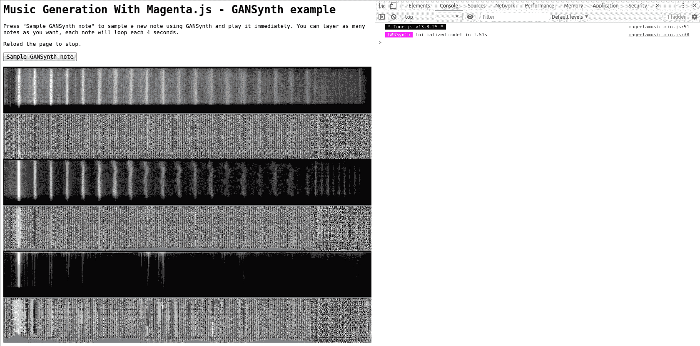
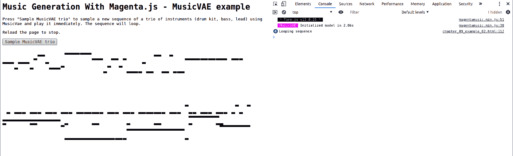
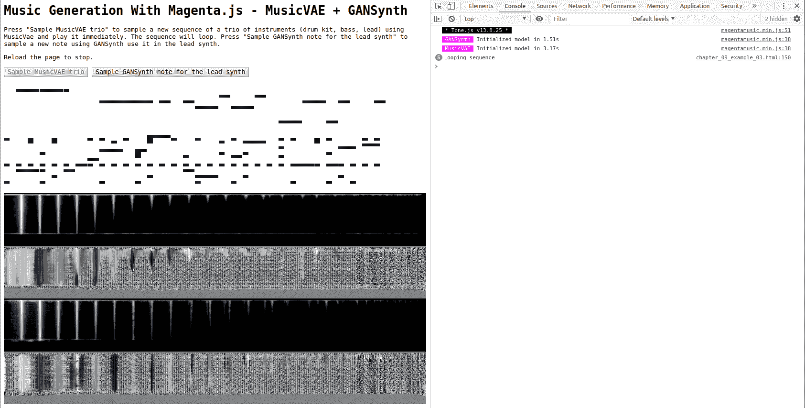

# 第十章：使用 Magenta.js 在浏览器中运行 Magenta。

本章将介绍 Magenta.js，这是 Magenta 的 JavaScript 实现，由于它运行在浏览器中并且可以作为网页共享，因此在易用性上获得了广泛的关注。我们将介绍 TensorFlow.js，它是构建 Magenta.js 的技术，并展示 Magenta.js 中可用的模型，包括如何转换我们之前训练的模型。然后，我们将使用 GANSynth 和 MusicVAE 创建小型 Web 应用程序，分别用于采样音频和序列。最后，我们将看到 Magenta.js 如何通过 Web MIDI API 和 Node.js 与其他应用程序交互。

本章将涵盖以下主题：

+   介绍 Magenta.js 和 TensorFlow.js。

+   创建 Magenta.js Web 应用程序。

+   使 Magenta.js 与其他应用程序交互。

# 技术要求。

本章将使用以下工具：

+   使用 **命令行** 或 **Bash** 从终端启动 Magenta。

+   **Python** 和 **Magenta** 用于将训练好的模型转换为 Magenta.js 可用格式。

+   使用 **TensorFlow.js** 和 **Magenta.js** 在浏览器中创建音乐生成应用程序。

+   使用 **JavaScript**、**HTML** 和 **CSS** 编写 Magenta.js Web 应用程序。

+   一个 **最新版本的浏览器**（Chrome、Firefox、Edge、Safari），以支持最新的 Web API。

+   **Node.js** 和 **npm** 用于安装 Magenta.js 及其依赖项（服务器端）。

+   使用 **FluidSynth** 从浏览器中播放生成的 MIDI。

在 Magenta.js 中，我们将使用 **Music RNN** 和 **MusicVAE** 模型来生成 MIDI 序列，使用 **GANSynth** 进行音频生成。我们将深入探讨它们的使用方法，但如果你觉得需要更多信息，Magenta.js 源代码中的 Magenta.js Music README（[github.com/tensorflow/magenta-js/tree/master/music](https://github.com/tensorflow/magenta-js/tree/master/music)）是一个不错的起点。你还可以查看 Magenta.js 代码，它有详细的文档。最后一部分 *进一步阅读* 中也提供了额外的内容。

本章的代码位于本书 GitHub 代码库的 `Chapter08` 文件夹中，位置在 [github.com/PacktPublishing/hands-on-music-generation-with-magenta/tree/master/Chapter08](https://github.com/PacktPublishing/hands-on-music-generation-with-magenta/tree/master/Chapter08)。所用示例和代码片段假设你在章节文件夹中。对于本章，你应该在开始之前运行 `cd Chapter08`。

查看以下视频，观看代码演示：

占位符链接。

# 介绍 Magenta.js 和 TensorFlow.js。

在前几章中，我们已经介绍了 Python 中的 Magenta、其使用方法和内部工作原理。现在我们将关注 Google 的 Magenta.js，它是 Magenta 在 JavaScript 中的精简实现。Magenta 和 Magenta.js 各有优缺点；让我们进行比较，看看在不同使用场景下应该选择哪一个。

Magenta.js 应用程序易于使用和部署，因为它在浏览器中执行。**开发和部署一个 Web 应用程序非常简单**：你只需要一个 HTML 文件和一个 Web 服务器，应用程序就可以让全世界看到和使用。这是基于浏览器的应用程序的一大优势，因为它不仅让我们能够轻松创建自己的音乐生成应用程序，而且使得协作使用变得更加容易。有关流行 Magenta.js Web 应用程序的精彩示例，请参见本章末尾的 *进一步阅读* 部分。

这就是 Web 浏览器的强大之处：每个人都有一个，而且网页不需要安装即可运行。Magenta.js Web 应用程序的缺点是它也运行在浏览器中：浏览器并不是处理高质量、实时音频的最佳场所，而且使你的应用程序与传统音乐制作工具（如 **数字音频工作站** (**DAWs**)）交互变得更加困难。

随着内容的深入，我们将逐步了解在浏览器中工作的具体细节。首先，我们将在 *在浏览器中介绍 Tone.js 用于声音合成* 部分中，了解 Web Audio API 的使用。接着，我们将在 *使用 Web Workers API 将计算从 UI 线程卸载* 部分中，讨论如何让实时音频变得更加轻松。最后，我们将在 *使 Magenta.js 与其他应用程序交互* 部分中，讨论如何让 Magenta.js 与其他音乐应用程序互动。

# 在浏览器中介绍 TensorFlow.js 机器学习

首先，让我们介绍 TensorFlow.js（[www.tensorflow.org/js](https://www.tensorflow.org/js)），Magenta.js 构建的项目。正如其名称所示，TensorFlow.js 是 TensorFlow 的 JavaScript 实现，使得在浏览器中**使用和训练** **模型**成为可能。也可以导入并运行来自 TensorFlow SavedModel 或 Keras 的预训练模型。

使用 TensorFlow.js 很简单。你可以使用 `script` 标签，如以下代码块所示：

```py
<html>
<head>
  <script src="img/tf.min.js"></script>
  <script>
    const model = tf.sequential();
    model.add(tf.layers.dense({units: 1, inputShape: [1]}));
    model.compile({loss: 'meanSquaredError', optimizer: 'sgd'});
  </script>
</head>
<body>
</body>
</html>
```

另外，你也可以使用 `npm` 或 `yarn` 命令来运行以下代码块：

```py
import * as tf from '@tensorflow/tfjs';
const model = tf.sequential();
model.add(tf.layers.dense({units: 1, inputShape: [1]}));
model.compile({loss: 'meanSquaredError', optimizer: 'sgd'});
```

注意在这两个代码片段中 `tf` 变量的使用，它是通过脚本导入的（在本章的示例中我们将看到更多 `tf` 的使用）。我们不会特别研究 TensorFlow.js，但我们将在 Magenta.js 代码中使用它。

TensorFlow.js 另一个优点是它使用 WebGL（[www.khronos.org/registry/webgl/specs/latest/](https://www.khronos.org/registry/webgl/specs/latest/)）进行计算，这意味着它是 **图形处理单元**（**GPU**）加速的（如果你有 GPU），且无需安装 CUDA 库。数学运算在 WebGL 着色器中实现，张量被编码为 WebGL 纹理，这是 WebGL 的一种非常巧妙的使用方法。我们无需做任何事来启用 GPU 加速，因为 TensorFlow.js 后端会为我们处理。当使用 Node.js 服务器时，TensorFlow C API 用于硬件加速，这意味着也可以使用 CUDA 库。

使用 WebGL 有一些注意事项，最显著的是计算在某些情况下可能会阻塞 UI 线程，以及张量分配所使用的内存必须在使用后进行回收（释放）。关于计算线程，我们将在讨论 Web Workers 时更深入地探讨。关于内存管理，我们将在代码中展示正确的使用方法。有关这些问题的更多信息，请参见 *进一步阅读* 部分。

# 在浏览器中生成音乐的 Magenta.js 介绍

现在我们理解了 TensorFlow.js，接下来讨论 Magenta.js。首先，我们需要了解 Magenta.js 能做什么，不能做什么。目前，Magenta.js 中无法训练模型（除了在 MidiMe 中的部分训练），但我们在前一章中训练的模型可以轻松转换和导入。Magenta.js 的另一个限制是并非所有模型都包含在内，但最重要的模型都包括在内。在编写 Magenta.js 代码时，我们会发现大部分已覆盖的概念都在其中，只是语法有所不同。

以下是 Magenta.js 中一些预训练模型的概述：

+   **Onsets and Frames** 用于钢琴转录，将原始音频转换为 MIDI

+   **Music RNN**（**长短期记忆**（**LSTM**）网络）用于单音和多音 MIDI 生成，包括 Melody RNN、Drums RNN、Improv RNN 和 Performance RNN 模型

+   **MusicVAE** 用于单音或三重音采样与插值，另包括 GrooVAE

+   **Piano Genie** 将 8 键输入映射到完整的 88 键钢琴

我们已经在前面的章节中讨论了这些模型。我们可以在 Magenta.js 源代码中找到预训练检查点列表，路径为 `music/checkpoints/checkpoints.json` 文件，或者在托管版本中，通过 [goo.gl/magenta/js-checkpoints](https://goo.gl/magenta/js-checkpoints) 访问。我们使用的大多数检查点（或模型包）都包含在 Magenta.js 中，还有一些新增加的模型，例如更长的 4 小节 MusicVAE 和 GrooVAE 模型。

# 将训练好的模型转换为 Magenta.js 格式

使用预训练模型非常好，但我们也可以导入我们自己训练的模型，比如我们在上一章中训练的模型——第七章，*训练 Magenta 模型*。我们通过使用 `checkpoint_converted.py` 脚本实现这一点，该脚本将 Magenta 检查点中的权重转储到 Magenta.js 可以使用的格式。

你可以在本章节的源代码中找到这段代码，文件名为 `chapter_08_example_01.html`。源代码中有更多的注释和内容，你应该去查看它。

让我们通过以下步骤，将一个简单的 RNN 模型转换为适用于 Magenta.js 的格式：

1.  首先，我们需要从 Magenta.js 获取 `checkpoint_converter.py` 脚本。最简单的方法是直接从 GitHub 上的源代码下载该脚本，如下所示：

```py
curl -o "checkpoint_converter.py" "https://raw.githubusercontent.com/tensorflow/magenta-js/master/scripts/checkpoint_converter.py"
```

这应该会在本地创建 `checkpoint_converter.py` 文件。

1.  现在，我们需要 TensorFlow.js Python 打包文件，这是 `checkpoint_converter.py` 脚本所依赖的。运行以下代码：

```py
# While in your Magenta conda environment
pip install tensorflowjs
```

1.  我们现在可以运行转换脚本，例如，使用我们之前训练的 DrumsRNN 模型（将 `PATH_TO_TRAINING_DIR` 替换为合适的值），如下所示：

```py
python checkpoint_converter.py "PATH_TO_TRAINING_DIR/drums_rnn_dance_drums/logdir/run1_small/train/model.ckpt-20000" "checkpoints/drums_rnn_dance_small"
```

这将创建 `checkpoints/drums_rnn_dance_small` 目录，其中包含一个 JSON 元数据文件和将由 TensorFlow.js 加载的检查点二进制文件。

请记住，在引用 TensorFlow 检查点时，您需要提供前缀——例如，`model.ckpt-20000`，但不应加上 `.data`、`.index` 或 `.meta`。

1.  然后，我们需要创建一个 JSON 配置文件，描述模型的配置。打开 `checkpoints/drums_rnn_dance_small/config.json` 文件，并输入以下内容：

```py
{
  "type": "MusicRNN",
  "dataConverter": {
    "type": "DrumsConverter",
    "args": {}
  }
}
```

这是 DrumsRNN 模型的一个最小示例，没有进一步的配置。请注意，即使没有提供任何参数，`dataConverter` 的 `args` 键也是必要的。`dataConverter` 的 `type` 是 `DataConverter` 的子类之一，位于 Magenta.js 源代码中的 `music/src/core` 文件夹下的 `data.ts` 文件中。其他可能的数据转换器包括 `MelodyConverter`、`TrioConverter` 或 `GrooveConverter`。

其他模型和转换器将需要更多的配置。找到适当配置的最简单方法是找到一个类似的 Magenta 预训练模型，并使用类似的值。为此，按照 *下载预训练模型到本地* 部分操作，并在下载的 `config.json` 文件中找到所需的信息。

1.  我们的自定义模型现在已转换为 TensorFlow.js 可以理解的格式。接下来，让我们创建一个小型网页，导入并初始化该模型进行测试，如下所示：

```py
<html lang="en">
<body>
<script src="img/magentamusic.js"></script>
<script>
  // Initialize a locally trained DrumsRNN model from the local directory
  // at: checkpoints/drums_rnn_dance_small
  async function startLocalModel() {
    const musicRnn = new mm.MusicRNN("http://0.0.0.0:8000/" +
 "checkpoints/drums_rnn_dance_small");
    await musicRnn.initialize();
  }

  // Calls the initialization of the local model
  try {
    Promise.all([startLocalModel()]);
  } catch (error) {
    console.error(error);
  }
</script>
</body>
</html>
```

不必过于担心 HTML 页面中的内容，因为它将在接下来的章节中得到详细解释。这里重要的是，MusicRNN 构造函数（`mm.MusicRNN("URL")`）正在加载我们转换后的 DrumsRNN 检查点到 MusicRNN 模型中。

你可能注意到检查点的 URL 是本地的，位于`http://0.0.0.0:8000`。这是因为大多数浏览器实现了**跨源资源共享**（**CORS**）限制，其中之一是本地文件只能获取以**统一资源标识符**（**URI**）方案`http`或`https`开头的资源。

1.  绕过这一点的最简单方法是本地启动一个 web 服务器，如下所示：

```py
python -m http.server
```

这将启动一个 web 服务器，在`http://0.0.0.0:8000`提供当前文件夹的内容，这意味着前面代码片段中的 HTML 文件将通过`http://0.0.0.0:8000/example.html`提供，且我们的检查点将位于`http://0.0.0.0:8000/checkpoints/drums_rnn_dance_small`。

1.  打开 HTML 文件并检查控制台。你应该会看到以下内容：

```py
* Tone.js v13.8.25 * 
MusicRNN  Initialized model in 0.695s
```

这意味着我们的模型已成功初始化。

# 本地下载预训练模型

本地下载预训练模型很有用，如果我们想自己提供模型或检查`config.json`的内容：

1.  首先，我们需要 Magenta.js 中的`checkpoint_converter.py`脚本。最简单的方法是直接从 GitHub 的源代码下载该脚本，如下所示：

```py
curl -o "checkpoint_downloader.py" "https://raw.githubusercontent.com/tensorflow/magenta-js/master/scripts/checkpoint_downloader.py"
```

这应该会在本地创建`checkpoint_converter.py`文件。

1.  然后，我们可以通过输入以下代码来调用该脚本：

```py
python checkpoint_downloader.py "https://storage.googleapis.com/magentadata/js/checkpoints/music_vae/mel_16bar_small_q2" "checkpoints/music_vae_mel_16bar_small_q2"
```

这将下载`mel_16bar_small_q2` MusicVAE 预训练模型到`checkpoints`文件夹中。

# 在浏览器中引入 Tone.js 进行声音合成

在本章中，你将听到在浏览器中生成的音频，这意味着音频合成，类似于我们在前几章中使用 FluidSynth 来播放 MIDI 文件的方式，是在浏览器中发生的，使用的是 Web Audio API。

**Web Audio API**（[www.w3.org/TR/webaudio/](https://www.w3.org/TR/webaudio/)）提供了相当低级的概念，通过音频节点来处理声音源、转换和路由。首先，我们有一个声音源，它提供一组声音强度（有关这一点的复习，请参见第一章，*关于 Magenta 和生成艺术的介绍*），它可以是一个声音文件（样本）或一个振荡器。然后，声音源节点可以连接到一个转换节点，如增益（用于改变音量）。最后，结果需要连接到一个目标（输出），使声音能够通过扬声器播放出来。

该规范已经相当成熟，列为*W3C 候选推荐，2018 年 9 月 18 日*，因此一些实现细节可能会发生变化，但可以认为它是稳定的。就支持而言，所有主要浏览器都支持 Web Audio API，这非常好。有关更多信息，请参阅*进一步阅读*部分。

我们不会直接使用 Web Audio API，而是使用 **Tone.js** ([tonejs.github.io](https://tonejs.github.io/))，这是一个建立在 Web Audio API 之上的 JavaScript 库，提供更高层次的功能。使用 Tone.js 的另一个优势是，它能够适应底层 Web Audio API 的变化。

由于 Web Audio API 在不同浏览器中的实现有所不同，音频质量可能会有所不同。例如，在 Firefox 中叠加多个来自 GANSynth 的音频样本时会出现音频削波问题，但在 Chrome 中则可以正常工作。请记住，对于专业级别的音频质量，浏览器中的音频合成可能不是最佳选择。

# 创建一个 Magenta.js Web 应用

现在我们已经介绍了 Magenta.js 的相关概念，接下来我们将使用 Magenta.js 创建一个 Web 应用。让我们创建一个 Web 应用，使用 MusicVAE 生成三种乐器（鼓组、低音和主音），并且可以将主乐器替换为 GANSynth 生成的乐器。

我们将一步步构建这个应用。首先，我们将做一个生成乐器的应用，使用 GANSynth。然后，我们将创建一个可以采样三重奏序列的应用。最后，我们将把这两个应用合并在一起。

# 在浏览器中使用 GANSynth 生成乐器

在我们示例的第一部分，我们将使用 GANSynth 来采样单个乐器音符，这些音符是时长为 4 秒的短音频片段。我们将能够将多个音频片段叠加，从而产生有趣的效果。

首先，我们将创建 HTML 页面并导入所需的脚本。接下来，我们将编写 GANSynth 采样代码，并详细解释每一步。最后，我们将通过聆听生成的音频来完成示例。

# 编写页面结构

我们将保持页面结构和样式的简洁，专注于 Magenta.js 的代码。

你可以在本章源代码中的 `chapter_08_example_02.html` 文件中找到这段代码。源代码中有更多的注释和内容，你应该去查看一下。

首先，让我们创建页面结构并导入所需的脚本，如下所示：

```py
<html lang="en">
<body>
<div>
  <button disabled id="button-sample-gansynth-note">
    Sample GANSynth note
  </button>
  <div id="container-plots"></div>
</div>
<script src="https://cdn.jsdelivr.net/npm/@magenta/music@1.12.0/dist/magentamusic.min.js"></script>
<script>
  // GANSynth code
</script>
</body>
</html>
```

页面结构只包含一个按钮，用于调用 GANSynth 生成音频，以及一个容器，用于绘制生成的频谱图。

在浏览器中使用 Magenta.js 有两种方式，具体如下：

1.  我们可以在 `dist/magentamusic.min.js` 中导入整个 Magenta.js 音乐库。在 Magenta 文档中，这被称为 **ES5 bundle** 方法。这将包括 Magenta.js（绑定为 `mm`）及其所有依赖项，包括 TensorFlow.js（绑定为 `mm.tf`）和 Tone.js（绑定为 `mm.Player.tone`）。

1.  我们可以仅导入我们需要的 Magenta.js 元素，这些元素位于 `es6` 文件夹中。在 Magenta 文档中，这称为 **ES6 打包** 方法。例如，如果我们只需要 GANSynth 模型，我们需要导入 Tone.js（绑定到 `Tone`），TensorFlow.js（绑定到 `tf`），Magenta.js 核心（绑定到 `core`），以及 Magenta.js GANSynth（绑定到 `gansynth`）。

在这里我们不讨论 ES5 和 ES6 打包文件之间的差异。只需记住，最简单的方法是使用 ES5 打包方式，导入一个包含所有内容的大文件。如果你想对发送到客户端的内容有更多控制（例如，出于性能原因），你将需要使用 ES6 打包方式。请记住，两种方法之间的模块绑定不同，因此如果你更改了导入，你需要调整代码。

以下是仅包含 GANSynth 模型的 ES6 打包导入：

```py
<script src="img/Tone.min.js"></script>
<script src="img/tf.min.js"></script>
<script src="img/core.js"></script>
<script src="img/gansynth.js"></script>
```

这仅导入 GANSynth 模型，模型可以通过 `new gansynth.GANSynth(...)` 实例化。在使用 ES6 模块时，我们需要单独导入每个脚本。对于我们的示例，这些脚本是 Tone.js、TensorFlow.js、Magenta.js 核心和 GANSynth。

对于我们的示例，我们将坚持使用 ES5 打包方式，但如果你愿意，可以使用 ES6 打包方式。在我们的示例中，我们将展示每种方法之间代码的不同之处。

你可以在 `chapter_08_example_02_es6.html` 文件中找到本例的 ES6 代码，该文件位于本章的源代码中。

现在，让我们编写 GANSynth 代码（在 `GANSynth code` 注释中），并解释每一步。

# 使用 GANSynth 采样音频

现在我们已经正确导入了 Magenta.js，我们可以按照以下步骤编写 GANSynth 音频生成代码：

1.  首先，我们将初始化 DOM 元素并初始化 GANSynth，如下所示：

```py
// Get DOM elements
const buttonSampleGanSynthNote = document
    .getElementById("button-sample-gansynth-note");
const containerPlots = document
    .getElementById("container-plots");

// Starts the GANSynth model and initializes it. When finished, enables
// the button to start the sampling
async function startGanSynth() {
  const ganSynth = new mm.GANSynth("https://storage.googleapis.com/" +
 "magentadata/js/checkpoints/gansynth/acoustic_only");
  await ganSynth.initialize();
  window.ganSynth = gansynth;
  buttonSampleGanSynthNote.disabled = false;
}
```

在这里，我们使用 `mm.GANSynth(...)` 实例化 GANSynth。记住，当使用 ES5 模块导入时，Magenta.js 上下文位于 `mm` 变量下。检查点的 URL 与我们在上一章中使用的相同——第五章，*使用 NSynth 和 GANSynth 生成音频*。如果你想要更多信息，请参考那一章。我们还将 `ganSynth` 引用设置为全局变量，以便稍后可以轻松调用。

使用 Magenta.js ES6 打包时，我们将拥有以下代码：

```py
const ganSynth = new gansynth.GANSynth("https://storage.googleapis.com/" +
    "magentadata/js/checkpoints/gansynth/acoustic_only");
```

对于 ES6 打包，模块变量是 `gansynth.GANSynth`，而不是 `mm.GANSynth`。

1.  现在，让我们编写一个异步函数，使用 `canvas` 将生成的频谱图插入网页中，如下所示：

```py
// Plots the spectrogram of the given channel
// see music/demos/gansynth.ts:28 in magenta.js source code
async function plotSpectra(spectra, channel) {
  const spectraPlot = mm.tf.tidy(() => {
    // Slice a single example.
    let spectraPlot = mm.tf.slice(spectra, [0, 0, 0, channel], [1, -1, -1, 1])
        .reshape([128, 1024]);
    // Scale to [0, 1].
    spectraPlot = mm.tf.sub(spectraPlot, mm.tf.min(spectraPlot));
    spectraPlot = mm.tf.div(spectraPlot, mm.tf.max(spectraPlot));
    return spectraPlot;
  });
  // Plot on canvas.
  const canvas = document.createElement("canvas");
  containerPlots.appendChild(canvas);
  await mm.tf.browser.toPixels(spectraPlot, canvas);
  spectraPlot.dispose();
}
```

此方法创建一个频谱图，并将其插入我们之前声明的 `containerPlots` 元素中的 `canvas` 元素。它将继续为每次生成添加频谱图。

你可能已经注意到在示例中使用了 `tf.tidy` 和 `dispose`。使用这些方法是为了避免 TensorFlow.js 代码中的内存泄漏。这是因为 TensorFlow.js 使用 WebGL 来进行计算，而**WebGL 资源在使用后需要显式回收**。任何 `tf.Tensor` 在使用后都需要通过使用 `dispose` 来进行清理。`tf.tidy` 方法可以在执行完函数后，自动清理所有未返回的张量。

你可能会想知道在之前的 JavaScript 代码中，`async` 和 `await` 关键字是什么意思。这两个关键字标志着**异步方法**的使用。当调用一个被标记为 `async` 的方法时，表示它是异步的，调用者需要使用 `await` 来标记调用，这意味着它会等待（阻塞）直到返回一个值。`await` 关键字只能在 `async` 方法中使用。在我们的示例中，`mm.tf.browser.toPixels` 方法被标记为 `async`，因此我们需要使用 `await` 等待它的返回。调用一个 `async` 方法而不使用 `await` 可以通过 `Promise` 语法完成—`Promise.all([myAsyncMethod()])`。

Promise 是在 JavaScript 中引入的，目的是解决编写异步代码时遇到的一个反复出现的问题：**回调地狱**。回调地狱是一个问题，当多个关联的调用都是异步时，会导致嵌套的回调（地狱般的回调）。

Promise 非常棒，因为它们提供了一个干净的机制来处理复杂的异步调用链，并且有适当的错误处理。然而，它们有点冗长，这就是为什么引入了 `async` 和 `await` 关键字作为语法糖，以缓解使用 Promise 时的常见用例。

1.  然后，我们编写一个异步函数，从 GANSynth 中采样一个音符，播放它，并使用我们之前的方法绘制它，如下所示：

```py
// Samples a single note of 4 seconds from GANSynth and plays it repeatedly
async function sampleGanNote() {
  const lengthInSeconds = 4.0;
  const sampleRate = 16000;
  const length = lengthInSeconds * sampleRate;

  // The sampling returns a spectrogram, convert that to audio in
  // a tone.js buffer
  const specgrams = await ganSynth.randomSample(60);
  const audio = await ganSynth.specgramsToAudio(specgrams);
  const audioBuffer = mm.Player.tone.context.createBuffer(
      1, length, sampleRate);
  audioBuffer.copyToChannel(audio, 0, 0);

  // Play the sample audio using tone.js and loop it
  const playerOptions = {"url": audioBuffer, "loop": true, "volume": -25};
  const player = new mm.Player.tone.Player(playerOptions).toMaster();
  player.start();

  // Plots the resulting spectrograms
  await plotSpectra(specgrams, 0);
  await plotSpectra(specgrams, 1);
}
```

我们首先使用 `randomSample` 方法从 GANSynth 中采样，传入基准音高 `60`（即 C4）作为参数。这告诉模型从与该音高相对应的值进行采样。然后，返回的频谱图使用 `specgramsToAudio` 转换为音频。最后，我们使用 Tone.js 的音频缓冲区来播放该采样，通过实例化一个新播放器并使用音频缓冲区。由于我们为每个采样实例化一个新播放器，因此每个新的音频采样都会叠加在其他采样之上。

实例化播放器的代码 `mm.Player.tone.Player` 有些复杂，因为我们首先需要找到已经被 Magenta.js 对象通过 `mm.Player.tone` 实例化的 Tone.js 引用（这里，`Player` 引用是 Magenta.js 的一个类）。

使用 ES6 打包文件更为直接，如这里所示：

```py
const player = new Tone.Player(playerOptions).toMaster();
```

由于 Magenta.js 的 ES6 打包文件未包含 Tone.js，它需要自行初始化，并可以直接通过 `Tone` 变量进行引用。

1.  最后，我们通过将按钮绑定到一个操作并初始化 GANSynth 来总结我们的示例，如下所示：

```py
// Add on click handler to call the GANSynth sampling
buttonSampleGanSynthNote.addEventListener("click", () => {
  sampleGanNote();
});

// Calls the initialization of GANSynth
try {
  Promise.all([startGanSynth()]);
} catch (error) {
  console.error(error);
}
```

首先，我们将按钮绑定到 `sampleGanNote` 方法，然后我们初始化 GANSynth，使用 `startGanSynth` 方法。

# 启动网页应用

现在我们的网页应用已经准备好，可以测试代码了。让我们用浏览器打开我们创建的 HTML 页面。我们应该能看到一个与下图相似的页面：



在前面的图中，我们已经生成了一些 GANSynth 样本。每次生成都会绘制两个频谱图，并将之前的保持在页面上。在前面的截图右侧，您可以在控制台调试器中看到 Tone.js 和 GANSynth 初始化。当完成后，**Sample GANSynth note** 按钮将启用。

继续生成声音：当你叠加很多声音时，会得到非常有趣的效果。恭喜你——你已经完成了第一个 Magenta.js 网页应用！

# 使用 MusicVAE 生成三重奏

我们现在将使用 Magenta.js 中的 MusicVAE 模型来生成一些序列，并直接在浏览器中播放，使用 Tone.js。我们将使用的检查点是一个 `trio` 模型，这意味着我们将同时生成三种序列：打击乐、低音和主旋律。

您可以在本章源代码的 `chapter_08_example_03.html` 文件中找到这段代码。源代码中有更多的注释和内容，您应该去查看一下。

由于这段代码与上一节类似，我们不会逐一讲解所有内容，但会解释主要的区别：

1.  首先，我们定义页面结构和脚本导入，如下所示：

```py
<html lang="en">
<body>
<div>
  <button disabled id="button-sample-musicae-trio">
    Sample MusicVAE trio
 </button>
  <canvas id="canvas-musicvae-plot"></canvas>
</div>
<script src="https://cdn.jsdelivr.net/npm/@magenta/music@1.12.0/dist/magentamusic.min.js"></script>
<script>
  // MusicVAE code
</script>
</body>
</html>
```

页面结构与上一节相同。我们将在 `MusicVAE 代码` 注释中填入代码。

1.  接下来，让我们初始化 MusicVAE 模型，如下所示：

```py
// Get DOM elements
const buttonSampleMusicVaeTrio = document
    .getElementById("button-sample-musicae-trio");
const canvasMusicVaePlot = document
    .getElementById("canvas-musicvae-plot");

// Starts the MusicVAE model and initializes it. When finished, enables
// the button to start the sampling
async function startMusicVae() {
  const musicvae = new mm.MusicVAE("https://storage.googleapis.com/" +
 "magentadata/js/checkpoints/music_vae/trio_4bar");
  await musicvae.initialize();
  window.musicvae = musicvae;
  buttonSampleMusicVaeTrio.disabled = false;
}
```

检查点的 URL 与上一章使用的相同——第四章，*使用 MusicVAE 进行潜在空间插值*。如果您想了解该检查点的更多信息，请参考本章。

1.  我们现在创建一个新的 Tone.js 播放器来播放生成的三个序列，如下所示：

```py
// Declares a new player that have 3 synths for the drum kit (only the
// bass drum), the bass and the lead.
class Player extends mm.BasePlayer {

  bassDrumSynth = new mm.Player.tone.MembraneSynth().toMaster();

  bassSynth = new mm.Player.tone.Synth({
 volume: 5,
 oscillator: {type: "triangle"}
 }).toMaster();

  leadSynth = new mm.Player.tone.PolySynth(5).toMaster();

  // Plays the note at the proper time using tone.js
  playNote(time, note) {
    let frequency, duration, synth;
    if (note.isDrum) {
      if (note.pitch === 35 || note.pitch === 36) {
        // If this is a bass drum, we use the kick pitch for
        // an eight note and the bass drum synth
        frequency = "C2";
        duration = "8n";
        synth = this.bassDrumSynth;
      }
    } else {
      // If this is a bass note or lead note, we convert the
      // frequency and the duration for tone.js and fetch
      // the proper synth
      frequency = new mm.Player.tone.Frequency(note.pitch, "midi");
      duration = note.endTime - note.startTime;
      if (note.program >= 32 && note.program <= 39) {
        synth = this.bassSynth;
      } else {
        synth = this.leadSynth;
      }
    }
    if (synth) {
      synth.triggerAttackRelease(frequency, duration, time, 1);
    }
  }
}
```

这段代码扩展了 Magenta.js 中的 `mm.BasePlayer` 类，这很有用，因为我们只需要实现 `playNote` 方法来播放序列。首先，我们定义了三个合成器：`bassDrumSynth`、`bassSynth` 和 `leadSynth`，如下所示：

+   **低音鼓合成器**只播放低音鼓，由`note.isDrum`属性和 MIDI 音符 35 或 36 表示，并且总是播放 `C2` 的频率，长度为 8 分音符（`8n`），使用 Tone.js 的 `MembraneSynth`。请记住：在 MIDI 规范中，打击乐通道中的乐器（如低音鼓、军鼓等）是通过音符的音高来定义的——例如，音高 35 是原声低音鼓。

+   **低音合成器**只播放从 32 到 39 的程序，使用 Tone.js 中的`Synth`和三角波形。记住：根据 MIDI 规范，程序指定了应该播放的乐器。例如，程序 1 是钢琴，而程序 33 是木吉他。

+   **主音合成器**使用 Tone.js 中的`PolySynth`和五个音轨来演奏其他程序。

需要注意的是，对于低音和主音合成器，我们首先需要将 MIDI 音符转换为 Tone.js 的频率，使用`Frequency`类。

另一个需要讨论的重要内容是**音符包络**，它在 Tone.js 中的合成器上通过`triggerAttackRelease`方法使用。包络充当过滤器，允许音符在一定时间内被听到。你可以把合成器想象成*始终在播放*，而包络—当关闭时—不会让声音通过。当包络打开时，它允许声音被听到，使用一定的**斜率**，意味着声音可以慢慢（或快速）出现，并慢慢（或快速）结束。这分别被称为包络的**起音**和**释放**。每次我们调用触发方法时，合成器会根据给定的持续时间和一定的斜率发出声音。

你可能已经听说过**起音衰减延音释放**（**ADSR**）这个术语，尤其是在谈论包络时。在 Tone.js 中，我们使用的是这个概念的简化版，仅使用包络的**起音**和**释放**。如果使用完整的 ADSR 包络，我们可以更好地控制结果的形状。为了简单起见，我们的例子中将使用简化版。

1.  现在让我们来采样 MusicVAE 模型，如下所示：

```py
// Samples a trio of drum kit, bass and lead from MusicVAE and
// plays it repeatedly at 120 QPM
async function sampleMusicVaeTrio() {
  const samples = await musicvae.sample(1);
  const sample = samples[0];
  new mm.PianoRollCanvasVisualizer(sample, canvasMusicVaePlot,
      {"pixelsPerTimeStep": 50});

  const player = new Player();
  mm.Player.tone.Transport.loop = true;
  mm.Player.tone.Transport.loopStart = 0;
  mm.Player.tone.Transport.loopEnd = 8;
  player.start(sample, 120);
}
```

首先，我们使用`sample`方法和参数 1 来采样 MusicVAE 模型，1 表示所需的样本数量。然后，我们使用之前声明的`canvas`中的`mm.PianoRollCanvasVisualizer`绘制结果音符序列。最后，我们以 120 QPM 启动播放器，并循环 8 秒的音序，使用 Tone.js 中的`Transport`类。记住，MusicVAE 模型具有固定的长度，这意味着使用 4 小节三重奏模型，我们生成 8 秒的样本，速度为 120 QPM。

1.  最后，让我们通过绑定按钮到一个动作并初始化 MusicVAE 模型来完成我们的示例，如下所示：

```py
// Add on click handler to call the MusicVAE sampling
buttonSampleMusicVaeTrio.addEventListener("click", (event) => {
  sampleMusicVaeTrio();
  event.target.disabled = true;
});

// Calls the initialization of MusicVAE
try {
  Promise.all([startMusicVae()]);
} catch (error) {
  console.error(error);
}
```

首先，我们将按钮绑定到`sampleMusicVaeTrio`方法，然后我们使用`startMusicVae`方法初始化 MusicVAE 模型。你可以看到我们这里使用了之前介绍的`Promise.all`调用来启动我们的异步代码。

1.  现在我们已经准备好我们的网页应用程序，可以测试我们的代码了。让我们使用浏览器打开我们创建的 HTML 页面。我们应该能看到一个类似于以下截图的页面：



通过点击**Sample MusicVAE trio**按钮，MusicVAE 应该会采样一个序列，绘制出来并使用我们定义的合成器播放。生成的图形相当基础，因为它没有区分三个乐器，也没有时间或音高标记，但可以通过`PianoRollCanvasVisualizer`类进行自定义。

要生成一个新序列，重新加载页面以重新开始。

# 使用 SoundFont 来获得更真实的乐器音色

当听到生成的声音时，你可能会注意到音乐听起来有点*基础*或*简单*。这是因为我们使用了 Tone.js 的默认合成器，它的优点是易于使用，但缺点是音质不如更复杂的合成器好。记住，Tone.js 的合成器可以进行自定义，以便听起来更好。

我们可以使用 SoundFont 代替合成器。SoundFont 是多种乐器的录制音符，我们从本书一开始就一直在 FluidSynth 中使用它们。在 Magenta.js 中，我们可以使用`SoundFontPlayer`来代替`Player`实例，代码如下所示：

```py
const player = new mm.SoundFontPlayer("https://storage.googleapis.com/" +
    "magentadata/js/soundfonts/salamander"));
player.start(sequence, 120)
```

Magenta 团队托管的 SoundFont 列表可以在 Magenta.js 音乐文档中找到（[github.com/tensorflow/magenta-js/tree/master/music](https://github.com/tensorflow/magenta-js/tree/master/music)）。

# 演奏生成的三重奏乐器

现在，我们有了 MusicVAE 生成三种乐器的序列，以及 GANSynth 生成音频，接下来让我们让这两者协同工作。

你可以在本章的源代码中的`chapter_08_example_04.html`文件中找到这段代码。源代码中有更多的注释和内容，你应该去查看一下。

由于代码与上一节类似，我们不会逐一讲解所有内容，但会解释主要的区别：

1.  首先，让我们定义页面结构和脚本导入，如下所示：

```py
<html lang="en">
<body>
<div>
  <button disabled id="button-sample-musicae-trio">
    Sample MusicVAE trio
  </button>
  <button disabled id="button-sample-gansynth-note">
    Sample GANSynth note for the lead synth
  </button>
  <canvas id="canvas-musicvae-plot"></canvas>
  <div id="container-plots"></div>
</div>
<script src="https://cdn.jsdelivr.net/npm/@magenta/music@1.12.0/dist/magentamusic.min.js"></script>
<script>
  // MusicVAE + GANSynth code
</script>
</body>
</html>
```

该页面与上一节的结构相同。我们将填充`MusicVAE + GANSynth code`注释中的代码。

1.  然后，让我们初始化 MusicVAE 模型和 GANSynth 模型，如下所示：

```py
// Get DOM elements
const buttonSampleGanSynthNote = document
    .getElementById("button-sample-gansynth-note");
const buttonSampleMusicVaeTrio = document
    .getElementById("button-sample-musicae-trio");
const containerPlots = document
    .getElementById("container-plots");
const canvasMusicVaePlot = document
    .getElementById("canvas-musicvae-plot");

// Starts the MusicVAE model and initializes it. When finished, enables
// the button to start the sampling
async function startMusicVae() {
  const musicvae = new mm.MusicVAE("https://storage.googleapis.com/" +
 "magentadata/js/checkpoints/music_vae/trio_4bar");
  await musicvae.initialize();
  window.musicvae = musicvae;
  buttonSampleMusicVaeTrio.disabled = false;
}

// Starts the GANSynth model and initializes it
async function startGanSynth() {
  const ganSynth = new mm.GANSynth("https://storage.googleapis.com/" +
 "magentadata/js/checkpoints/gansynth/acoustic_only");
  await ganSynth.initialize();
  window.ganSynth = ganSynth
}
```

在这里，我们仅启用**MusicVAE sampling**按钮。**GANSynth sampling**按钮将在 MusicVAE 完成生成后启用。

1.  我们保持使用相同的`plotSpectra`方法（来自之前的示例）。

1.  我们保持使用相同的`Player`类（来自之前的示例）进行声音合成。我们可以设置`leadSynth = null`，因为它将被 GANSynth 生成替代，但这不是必需的。

1.  我们保持使用相同的`sampleMusicVaeTrio`方法（来自之前的示例），但我们还将实例化的播放器设置为全局变量，使用`window.player = player`，因为 GANSynth 稍后需要更改主合成器。

1.  我们重写了`sampleGanNote`方法（来自之前的示例），以添加一个样本播放器，如下所示：

```py
// Samples a single note of 4 seconds from GANSynth and plays it repeatedly
async function sampleGanNote() {
  const lengthInSeconds = 4.0;
  const sampleRate = 16000;
  const length = lengthInSeconds * sampleRate;

  // The sampling returns a spectrogram, convert that to audio in
  // a tone.js buffer
  const specgrams = await ganSynth.randomSample(60);
  const audio = await ganSynth.specgramsToAudio(specgrams);
  const audioBuffer = mm.Player.tone.context.createBuffer(
      1, length, sampleRate);
  audioBuffer.copyToChannel(audio, 0, 0);

  // Plays the sample using tone.js by using C4 as a base note,
  // since this is what we asked the model for (MIDI pitch 60).
  // If the sequence contains other notes, the pitch will be
  // changed automatically
  const volume = new mm.Player.tone.Volume(-10);
  const instrument = new mm.Player.tone.Sampler({"C4": audioBuffer});
  instrument.chain(volume, mm.Player.tone.Master);
  window.player.leadSynth = instrument;

  // Plots the resulting spectrograms
  await plotSpectra(specgrams, 0);
  await plotSpectra(specgrams, 1);
}
```

首先，我们使用 `randomSample` 从 GANSynth 中随机采样一个乐器，像前面的示例那样。然后，我们需要在 Tone.js 合成器中播放该样本，因此我们使用 `Sampler` 类，它接收一个包含每个键的样本字典。因为我们使用 MIDI 音高 60 对模型进行了采样，所以我们使用 `C4` 来表示生成的音频缓冲区。最后，我们通过 `window.player.leadSynth = instrument` 将该合成器添加到我们的播放器中。

1.  让我们通过将按钮绑定到相应的操作，并初始化 MusicVAE 和 GANSynth 模型来总结我们的示例，如下所示：

```py
// Add on click handler to call the MusicVAE sampling
buttonSampleMusicVaeTrio.addEventListener("click", (event) => {
  sampleMusicVaeTrio();
  event.target.disabled = true;
  buttonSampleGanSynthNote.disabled = false;
});

// Add on click handler to call the GANSynth sampling
buttonSampleGanSynthNote.addEventListener("click", () => {
  sampleGanNote();
});

// Calls the initialization of MusicVAE and GanSynth
try {
  Promise.all([startMusicVae(), startGanSynth()]);
} catch (error) {
  console.error(error);
}
```

这段代码将启动模型，绑定按钮，并更新按钮状态。

1.  现在我们已经准备好我们的 Web 应用程序，可以测试我们的代码了。让我们使用浏览器打开我们创建的 HTML 页面。我们应该会看到一个类似于以下屏幕截图的页面：



通过按下 **为主合成器采样 MusicVAE 三重奏** 按钮，MusicVAE 应该会采样一个序列，绘制它，并使用我们定义的合成器进行播放。然后，可以使用 **为主合成器采样 GANSynth 音符** 按钮来生成一个新的声音用于主合成器，这可以多次使用。

要生成一个新的序列，重新加载页面以重新开始。

# 使用 Web Workers API 将计算卸载出 UI 线程

正如你从前面的示例中可能注意到的，当你使用 **为主合成器采样 GANSynth 音符** 按钮时，音频会冻结（你将听不到来自 MusicVAE 的任何声音），这是因为 GANSynth 正在生成它的第一个样本。

这是因为 JavaScript 的并发是基于事件循环模式构建的，这意味着 JavaScript 不是多线程的，一切都在一个称为**UI 线程**的单线程中执行。这是可行的，因为 JavaScript 使用非阻塞 I/O，这意味着大多数昂贵的操作可以立即完成，并通过事件和回调**返回它们的值**。然而，如果一个长时间的计算是同步的，它将在执行时阻塞 UI 线程，这正是 GANSynth 在生成其样本时发生的情况（有关 TensorFlow 如何使用 WebGL 处理计算的更多信息，请参见前面的 *在浏览器中使用 TensorFlow.js 进行机器学习* 部分）。

解决此问题的一种方法是**Web Workers API**（[html.spec.whatwg.org/multipage/workers.html](https://html.spec.whatwg.org/multipage/workers.html)），由**Web 超文本应用技术工作组**（**WHATWG**）规范，该 API 使得将计算卸载到不会影响 UI 线程的另一个线程成为可能。Web Worker 基本上是一个 JavaScript 文件，它从主线程启动并在自己的线程中执行。它可以与主线程发送和接收消息。Web Workers API 已经成熟，并且在浏览器中得到了很好的支持。你可以在 *进一步阅读* 部分了解更多关于 Web Worker 的信息。

你可以在本章的源代码中找到 `chapter_08_example_05.html` 和 `chapter_09_example_05.js` 文件中的代码。源代码中有更多的注释和内容——你应该去查看一下。

不幸的是，在撰写本文时，Magenta 的某些部分与 Web 工作线程的兼容性不佳。我们将展示一个使用 MusicVAE 模型的示例，但我们无法展示同样的示例来使用 GANSynth，因为该模型无法在 Web 工作线程中加载。我们仍然提供此示例，因为它可以作为以后使用的基础：

1.  让我们编写主页面的代码。我们将只包括完整 HTML 页面中的 JavaScript 代码，因为前面章节已经涵盖了其他部分。请按以下步骤进行：

```py
  // Starts a new worker that will load the MusicVAE model
  const worker = new Worker("chapter_09_example_05.js");
  worker.onmessage = function (event) {
    const message = event.data[0];
    if (message === "initialized") {
      // When the worker sends the "initialized" message,
      // we enable the button to sample the model
      buttonSampleMusicVaeTrio.disabled = false;
    }
    if (message === "sample") {
      // When the worked sends the "sample" message,
      // we take the data (the note sequence sample)
      // from the event, create and start a new player
      // using the sequence
 const data = event.data[1];
 const sample = data[0];
      const player = new mm.Player();
      mm.Player.tone.Transport.loop = true;
      mm.Player.tone.Transport.loopStart = 0;
      mm.Player.tone.Transport.loopEnd = 8;
      player.start(sample, 120);
    }
  };
  // Add click handler to call the MusicVAE sampling,
  // by posting a message to the web worker which
  // sample and return the sequence using a message
  const buttonSampleMusicVaeTrio = document
      .getElementById("button-sample-musicae-trio");
  buttonSampleMusicVaeTrio.addEventListener("click", (event) => {
    worker.postMessage([]);
    event.target.disabled = true;
  });
```

我们已经在前面的示例中覆盖了大部分代码，现在让我们分解新的内容，重点讲解 Web 工作线程的创建以及 Web 工作线程与主线程之间的消息传递，如下所示：

+   首先，我们需要启动工作线程，方法是使用 `new Worker("chapter_09_example_05.js")`。这将执行 JavaScript 文件的内容并返回一个可以分配给变量的句柄。

+   然后，我们将 `onmessage` 属性绑定到工作线程，当工作线程使用其 `postMessage` 函数时，该属性会被调用。在 `event` 对象的 `data` 属性中，我们可以传递任何我们想要的内容（请参见下面描述的工作线程代码）：

+   如果工作线程将 `initialized` 作为 `data` 数组的第一个元素发送，则意味着工作线程已初始化。

+   如果工作线程将 `sample` 作为 `data` 数组的第一个元素发送，则意味着工作线程已对 MusicVAE 序列进行采样，并将其作为 `data` 数组的第二个元素返回。

+   最后，当点击 HTML 按钮时，我们在工作线程实例上调用 `postMessage` 方法（无参数，但至少需要一个空数组），这将启动采样过程。

请记住，Web 工作线程与主线程没有共享状态，这意味着所有的数据共享必须通过 `onmessage` 和 `postMessage` 方法或函数来实现。

1.  现在，让我们编写 JavaScript 工作线程的代码（该代码与 HTML 文件位于同一位置），如下所示：

```py
importScripts("https://cdn.jsdelivr.net/npm/@tensorflow/tfjs@1.4.0/dist/tf.min.js");
importScripts("https://cdn.jsdelivr.net/npm/@magenta/music@¹.12.0/es6/core.js");
importScripts("https://cdn.jsdelivr.net/npm/@magenta/music@¹.12.0/es6/music_vae.js");

async function initialize() {
  musicvae = new music_vae.MusicVAE("https://storage.googleapis.com/" +
      "magentadata/js/checkpoints/music_vae/trio_4bar");
  await musicvae.initialize();
  postMessage(["initialized"]);
}

onmessage = function (event) {
  Promise.all([musicvae.sample(1)])
      .then(samples => postMessage(["sample", samples[0]]));
};

try {
  Promise.all([initialize()]);
} catch (error) {
  console.error(error);
}
```

你首先会注意到，我们使用了 Magenta 的 ES6 打包版本，因为我们不能在 Web 工作线程中导入所有内容。例如，导入 Tone.js 时会导致类似 **该浏览器不支持 Tone.js** 的错误。另外，记住 Magenta.js 尚未完全兼容 Web 工作线程，这意味着导入 GANSynth 可能会导致错误。

由于我们已经在前面的代码块中覆盖了大部分代码，因此我们将只讨论 Web 工作线程的附加内容，如下所示：

+   首先，当模型准备好运行时，我们需要使用 `postMessage` 向主线程发送一个 `initialized` 消息。

+   然后，我们绑定在模块的 `onmessage` 属性上，当主线程发送消息给工作线程时，这个属性会被调用。接收到消息后，我们对 MusicVAE 模型进行采样，然后使用 `postMessage` 将结果返回给主线程。

这部分涵盖了创建 Web Worker 并使其与主线程交换数据的基本用法。

# 使用其他 Magenta.js 模型

和往常一样，我们无法涵盖所有模型，但其他模型的使用方法将与我们提供的示例类似。网上有许多 Magenta.js 示例和演示，一些非常令人印象深刻的音乐生成网页应用程序。

我们在 *进一步阅读* 部分提供了查找示例和演示的资源。

# 让 Magenta.js 与其他应用程序互动

因为 Magenta.js 运行在浏览器中，它与其他应用程序（如 DAW）的交互要比与 Magenta 应用程序的交互难一些，但随着 Web 标准的发展，这将变得更容易。

# 使用 Web MIDI API

Web MIDI API ([www.w3.org/TR/webmidi/](https://www.w3.org/TR/webmidi/)) 是一个 W3C 标准，其规范还不成熟，状态为 *W3C 工作草案 2015 年 3 月 17 日*。它在浏览器中并不被广泛支持，Firefox 和 Edge 完全不支持。不过，它在 Chrome 中表现得相当不错，因此如果你要求用户使用该浏览器，你的应用可能会正常工作。更多信息请参阅最后一部分 *进一步阅读*。

你可以在 `chapter_08_example_06.html` 文件中找到这段代码，它在本章的源代码中。源代码中有更多的注释和内容——你应该去查看一下。

我们将编写一个小示例，使用 Web MIDI API，基于之前的 MusicVAE 示例和三重奏采样。你可以复制之前的示例并添加新内容：

1.  首先，让我们向页面中添加一个 `select` 元素，像这样：

```py
<label for="select-midi-output">Select MIDI output:</label>
<select disabled id="select-midi-output">
</select>
```

1.  然后，在 `startMusicVae` 方法中，让我们初始化可用的 MIDI 输出列表，如下所示：

```py
// Starts a MIDI player, and for each available MIDI outputs,
// adds an option to the select drop down.
const player = new mm.MIDIPlayer();
player.requestMIDIAccess()
    .then((outputs) => {
        if (outputs && outputs.length) {
            const option = document.createElement("option");
            selectMidiOutput.appendChild(option);
            outputs.forEach(output => {
                const option = document.createElement("option");
                option.innerHTML = output.name;
                selectMidiOutput.appendChild(option);
            });
            selectMidiOutput.disabled = false;
        } else {
            selectMidiOutput.disabled = true;
        }
    });
window.player = player;
```

在这里，我们使用了 Magenta.js 的 `MIDIPlayer` 类，它使得使用 `requestMIDIAccess` 方法比直接调用 Web MIDI API 更加简便。调用此方法将返回一个 `output` 列表，我们通过选择列表中的 `name` 属性来添加。

1.  最后，在 `sampleMusicVaeTrio` 方法中，我们使用播放器将 MIDI 直接发送到该输出，如下所示：

```py
// Gets the selected MIDI output (if any) and uses the
// output in the MIDI player
const midiOutputIndex = selectMidiOutput.selectedIndex;
if (midiOutputIndex) {
    player.outputs = [player.availableOutputs[midiOutputIndex - 1]];
    mm.Player.tone.Transport.loop = true;
    mm.Player.tone.Transport.loopStart = 0;
    mm.Player.tone.Transport.loopEnd = 8;
    player.start(sample, 120);
}
selectMidiOutput.disabled = true;
```

在这里，我们只需要用从下拉菜单中选择的元素（如果有）来设置 `outputs` 列表。

1.  为了测试我们的代码，我们可以使用我们可靠的 FluidSynth，使用以下命令：

    +   Linux: `fluidsynth -a pulseaudio -g 1 PATH_TO_SF2`

    +   macOS: `fluidsynth -a coreaudio -g 1 PATH_TO_SF2`

    +   Windows: `fluidsynth -g 1 PATH_TO_SF2`

FluidSynth 应该启动并显示一个终端（注意我们移除了 `-n` 和 `-i` 标志，以便接收 MIDI 音符）。

1.  现在，让我们打开我们的 Web 应用。一旦模型初始化完成，我们应该能够在**选择 MIDI 输出**的下拉列表中看到 FluidSynth MIDI 输入端口。它应该是这样的：**合成器输入端口 (17921:0)**。选择这个选项，然后点击**Sample MusicVAE trio**。你应该能听到来自 FluidSynth 的声音。

你会注意到所有的音符都作为钢琴序列播放，即使我们有三种乐器。这是因为`MIDIPlayer`非常基础，它不会在鼓道上发送打击乐信号，这是 MIDI 规范中规定的。

# 在 Node.js 中运行 Magenta.js 的服务器端版本

Magenta.js 也可以在服务器端使用，通过 Node.js 来运行。使用 Node.js 的好处是，你可以在服务器端和客户端运行相同的（或几乎相同的）代码。客户端和服务器之间的通信可以通过 WebSockets 来处理。

WebSocket API（[developer.mozilla.org/en-US/docs/Web/API/WebSockets_API](https://developer.mozilla.org/en-US/docs/Web/API/WebSockets_API)）是一个 API，它使得客户端和服务器之间能够进行**双向通信**。我们在这里不会详细讨论 WebSockets，但它们可以是一个非常好的方式，用于在服务器端 Magenta 进程（使用 Node.js 的 Magenta.js 或 Python 中的 Magenta）和客户端应用程序之间传输数据。使用 WebSockets 最简单的方式是使用像 Socket.IO 这样的框架（[socket.io/](https://socket.io/)）。

使用 Node.js 的另一个优点是我们的程序在服务器端运行，这意味着它不依赖于浏览器的实现。一个很好的例子是，我们可以使用 Node.js 的包来处理向其他进程发送 MIDI，例如`node-midi`（[www.npmjs.com/package/midi](https://www.npmjs.com/package/midi)），这样就不需要使用 Web MIDI API。

让我们展示一个 Magenta.js 与 Node.js 一起运行的简单示例。这里显示的代码与我们之前在 JavaScript 中讨论的内容类似：

你可以在本章的源代码中的`chapter_08_example_07.js`文件中找到这段代码。源代码中有更多的注释和内容——你应该去查看一下。

1.  首先，让我们安装 Node.js（[nodejs.org/en/download/](https://nodejs.org/en/download/)）

1.  接下来，让我们使用`npm`命令安装 Magenta.js，`npm`是 Node.js 的依赖管理工具，命令如下：

```py
npm install --save @magenta/music
```

这将把 Magenta.js 及其依赖项安装到`node_modules`目录中。当 Node.js 运行时，它会在这个目录中查找脚本的依赖项，处理每个`require`调用。

1.  现在我们可以创建一个 JavaScript 文件来采样一个序列，如下所示：

```py
const music_vae = require("@magenta/music/node/music_vae");

// These hacks below are needed because the library uses performance
// and fetch which exist in browsers but not in node.
const globalAny = global;
globalAny.performance = Date;
globalAny.fetch = require("node-fetch");

const model = new music_vae.MusicVAE(
    "https://storage.googleapis.com/magentadata/js/checkpoints/" +
    "music_vae/drums_2bar_lokl_small");
model
    .initialize()
    .then(() => model.sample(1))
    .then(samples => {
        console.log(samples[0])
   });
```

这段代码与之前的示例相似，唯一的区别是添加了`require`方法，该方法在 Node.js 中用于导入依赖模块。

1.  要执行你的 Node.js 应用，请使用`node`命令（将`PATH_TO_JAVASCRIPT_FILE`替换为合适的值），如以下所示：

```py
node PATH_TO_JAVASCRIPT_FILE
```

由于我们使用了 `console.log`，样本应该显示在控制台上。你还会注意到控制台上有一些信息，内容如下：

```py
This browser does not support Tone.js
Hi there. Looks like you are running TensorFlow.js in Node.js. To speed things up dramatically, install our node backend, which binds to TensorFlow C++, by running npm i @tensorflow/tfjs-node, or npm i @tensorflow/tfjs-node-gpu if you have CUDA. Then call require('@tensorflow/tfjs-node'); (-gpu suffix for CUDA) at the start of your program. Visit https://github.com/tensorflow/tfjs-node for more details.
```

这提醒我们，Tone.js 不能在 Node.js 上运行，因为 Web Audio API 是在客户端实现的。它还提醒我们，Node.js 可以使用 CUDA 库来提升性能。

# 总结

在这一章中，我们介绍了 Tensorflow.js 和 Magenta.js，分别是 TensorFlow 和 Magenta 的 JavaScript 实现。我们了解到 TensorFlow.js 是通过 WebGL 加速的，并且 Magenta.js 仅提供有限的模型集，这些模型只能用于生成，不能用于训练。我们还将上一章中使用 Python 训练的模型转换为 TensorFlow.js 可加载的格式。我们还介绍了 Tone.js 和 Web Audio API，Magenta.js 使用它们在浏览器中合成声音。

然后，我们创建了三个音乐生成 web 应用程序。第一个应用使用 GANSynth 采样短音频音符。通过这样做，我们学会了如何导入所需的脚本，可以使用一个大的 ES5 包，也可以使用一个更小的、拆分的 ES6 包。第二个应用使用 MusicVAE 采样三件乐器，分别是鼓组、贝斯和主旋律，并循环播放该序列。第三个应用同时使用了这两个模型生成序列和音频，并介绍了如何使用 Web Workers API 将计算任务转移到另一个线程。

最后，我们讨论了如何使 Magenta.js 与其他应用程序进行交互。我们使用 Web MIDI API 将生成的序列发送到另一个合成器——例如，FluidSynth。我们还使用了 Node.js 在服务器端运行 Magenta.js 应用程序。

Magenta.js 是一个很棒的项目，因为它使得使用 web 技术创建和分享音乐生成应用程序变得容易。还有其他方法可以将 Magenta 融入更广泛的应用场景，例如使用 Magenta Studio（它可以让 Magenta 在 Ableton Live 中运行）和使用 MIDI，这是控制各种设备（如软件和硬件合成器）的好方法。我们将在下一章中展示这些内容。

# 问题

1.  是否可以使用 Tensorflow.js 来训练模型？使用 Magenta.js 可以吗？

1.  Web Audio API 的作用是什么，使用它的最简单方法是什么？

1.  GANSynth 中的生成方法是什么？需要提供什么参数？

1.  MusicVAE 中的生成方法是什么？它生成多少种乐器？

1.  为什么 Web Workers API 在 JavaScript 中有用？

1.  列举两种将 MIDI 从 Magenta.js 应用程序发送到另一个应用程序的方法。

# 进一步阅读

+   **MagentaMusic.js 演示**：Magenta 维护的演示列表，展示了如何使用 Magenta.js 中的各种模型和核心类 ([tensorflow.github.io/magenta-js/music/demos/](https://tensorflow.github.io/magenta-js/music/demos/))。

+   **使用 Magenta.js 构建的 Web 应用**：一个由社区推动的 Magenta.js 演示列表，包含许多酷炫的内容（[magenta.tensorflow.org/demos/web/](https://magenta.tensorflow.org/demos/web/)）。

+   **Monica Dinculescu——为什么你应该构建一些傻乎乎的东西**：关于 Magenta.js 的重要性以及分享音乐创作应用的有趣演讲（[www.youtube.com/watch?v=DkiFjzQgJtg](https://www.youtube.com/watch?v=DkiFjzQgJtg)）。

+   **庆祝约翰·塞巴斯蒂安·巴赫**：一个流行的音乐生成应用的好例子（[www.google.com/doodles/celebrating-johann-sebastian-bach](https://www.google.com/doodles/celebrating-johann-sebastian-bach)）。

+   **WebGL 规范**：WebGL 规范（[www.khronos.org/registry/webgl/specs/latest/](https://www.khronos.org/registry/webgl/specs/latest/)）。

+   **平台与环境**：关于在 TensorFlow.js 中使用 WebGL 进行内存管理和 GPU 计算的有趣读物（[www.tensorflow.org/js/guide/platform_environment](https://www.tensorflow.org/js/guide/platform_environment)）。

+   **Web Audio API**：来自 W3C 的 Web Audio API 规范（[webaudio.github.io/web-audio-api/](https://webaudio.github.io/web-audio-api/)）。

+   **Web Audio API**：Web Audio API 的介绍（[developer.mozilla.org/en-US/docs/Web/API/Web_Audio_API](https://developer.mozilla.org/en-US/docs/Web/API/Web_Audio_API)）。

+   **Web Workers**：来自 WHATWG 的 Web Workers API 规范（[html.spec.whatwg.org/multipage/workers.html](https://html.spec.whatwg.org/multipage/workers.html)）。

+   **并发模型与事件循环**：JavaScript 中事件循环模式的介绍（[developer.mozilla.org/en-US/docs/Web/JavaScript/EventLoop](https://developer.mozilla.org/en-US/docs/Web/JavaScript/EventLoop)）。

+   **使用 Web Workers**：Web Workers API 的介绍（[developer.mozilla.org/en-US/docs/Web/API/Web_Workers_API/Using_web_workers](https://developer.mozilla.org/en-US/docs/Web/API/Web_Workers_API/Using_web_workers)）。

+   **Web MIDI API**：W3C 的 Web MIDI API 规范（[webaudio.github.io/web-midi-api/](https://webaudio.github.io/web-midi-api/)）。

+   **Web MIDI（Web 浏览器中的 MIDI 支持）**：来自 MIDI 协会的 Web MIDI API 介绍，带有使用示例的应用程序（[www.midi.org/17-the-mma/99-web-midi](https://www.midi.org/17-the-mma/99-web-midi)）。
