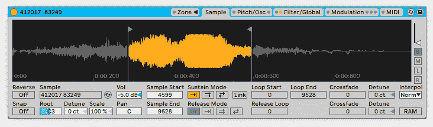
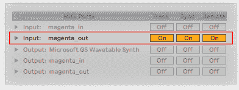

# 第十一章：使 Magenta 与音乐应用程序互动

在本章中，我们将展示 Magenta 如何融入更广泛的应用场景，展示如何使其与其他音乐应用程序（如**数字音频工作站**（**DAWs**）和合成器）互动。我们将解释如何通过 MIDI 接口将 MIDI 序列从 Magenta 发送到 FluidSynth 和 DAW。通过这种方式，我们将学习如何在所有平台上处理 MIDI 端口，以及如何在 Magenta 中循环 MIDI 序列。我们还将展示如何使用 MIDI 时钟和传输信息同步多个应用程序。最后，我们将介绍 Magenta Studio，它是基于 Magenta.js 的 Magenta 独立包装，可以作为插件集成到 Ableton Live 中。

本章将涵盖以下主题：

+   将 MIDI 发送到 DAW 或合成器

+   循环生成的 MIDI

+   将 Magenta 作为独立应用程序与 Magenta Studio 一起使用

# 技术要求

在本章中，我们将使用以下工具：

+   使用**命令行**或**Bash**从终端启动 Magenta

+   使用**Python**及其库编写音乐生成代码，使用 Magenta

+   使用**Magenta**生成 MIDI 音乐并与其他应用程序同步

+   使用**Mido**及其他 MIDI 工具发送 MIDI 音符和时钟

+   使用**FluidSynth**接收来自 Magenta 的 MIDI

+   你选择的**DAW**（例如 Ableton Live、Bitwig 等）来接收来自 Magenta 的 MIDI

+   **Magenta Studio**作为独立应用程序或 Ableton Live 插件

在 Magenta 中，我们将使用**MIDI 接口**将 MIDI 序列和 MIDI 时钟发送到其他音乐应用程序。我们将深入讨论其使用方法，但如果你需要更多信息，可以查看 Magenta 源代码中的 Magenta MIDI 接口`README.md`，链接为([github.com/tensorflow/magenta/tree/master/magenta/interfaces/midi](https://github.com/tensorflow/magenta/tree/master/magenta/interfaces/midi))，这是一个很好的起点。你还可以查看 Magenta 的代码，里面有很好的文档。我们还在本章末尾的*进一步阅读*部分提供了额外的内容。

我们还将使用**Magenta Studio**项目，你可以在其 GitHub 页面上找到更多信息，链接为[github.com/tensorflow/magenta-studio](https://github.com/tensorflow/magenta-studio)。

本章的代码位于本书 GitHub 仓库中的`Chapter09`文件夹，地址为[github.com/PacktPublishing/hands-on-music-generation-with-magenta/tree/master/Chapter09](https://github.com/PacktPublishing/hands-on-music-generation-with-magenta/tree/master/Chapter09)。示例和代码片段假定你位于该章节的文件夹中。开始之前，你应使用`cd Chapter09`进入该文件夹。查看以下视频，了解代码的实际操作：[`bit.ly/2RGkEaG`](http://bit.ly/2RGkEaG)。

# 将 MIDI 发送到 DAW 或合成器

从本书开始，我们一直在生成 MIDI 作为物理文件，然后使用 MuseScore 或 FluidSynth 进行播放。这是一种很好的作曲方式，能够生成新的序列，保留我们喜欢的部分，并基于它们生成更多内容。但是，如果我们希望 MIDI 音符在模型生成它们时持续播放呢？这就是建立一个自主的音乐生成系统的好方法，Magenta 作为作曲者，外部程序作为播放器，播放它收到的音符并使用乐器。

在这一部分，我们将介绍如何将 MIDI 从 Magenta 发送到合成器或 DAW。我们还将展示如何循环 Magenta 生成的序列，并如何将我们的 Magenta 程序与发送序列的应用程序同步。

# 介绍一些 DAW

使用 DAW 制作音乐相较于简单的合成器（如 FluidSynth）有很多优势：

+   录制和**编辑 MIDI**序列

+   录制和**编辑音频**，无论是母带轨道还是单一（乐器）轨道

+   使用振荡器、包络、滤波器等创建我们自己的**合成器**

+   使用**效果**（如混响、延迟、饱和度等）

+   对音轨应用**均衡器**（EQ）和**母带处理**（mastering）

+   剪辑、合并和混合**音频片段**以制作完整的轨道

市面上有很多 DAW，但不幸的是，其中很少有开源或免费的可供使用。我们将对一些我们认为与 Magenta 搭配使用时很有趣的 DAW 进行简要介绍（这并不是全面的介绍）：

+   **Ableton Live**（[www.ableton.com](https://www.ableton.com) – *非免费*）是音乐行业中广为人知的产品，已有很长历史。Ableton Live 是市场上最完整的 DAW 之一，但其所有功能的价格较高。它仅支持 Windows 和 macOS 系统。

+   **Bitwig**（[www.bitwig.com](https://www.bitwig.com) – *非免费*）也是一款非常完整的产品，类似于 Ableton Live，价格略低于其对手。它是一款功能丰富的 DAW，支持所有平台：Windows、macOS 和 Linux。

+   **Reason**（[www.reasonstudios.com/](https://www.reasonstudios.com/) – *非免费*）是一款专注于乐器和效果的 DAW，而非作曲。它与其他软件（如 Ableton Live 或 Magenta）结合使用时，MIDI 编排效果特别好。它仅支持 Windows 和 macOS 系统。

+   **Cubase**（[new.steinberg.net/cubase/](https://new.steinberg.net/cubase/) – *非免费*），由著名的音频软件和硬件公司 Steinberg 开发，是市场上最古老的 DAW 之一。它仅支持 Windows 和 macOS 系统。

+   **Cakewalk**（[www.bandlab.com/products/cakewalk](https://www.bandlab.com/products/cakewalk) – *免费*）是 Bandlab 推出的一个完整且易于使用的 DAW。这是唯一一款非开源但免费的 DAW。遗憾的是，它仅支持 Windows 系统。

+   **SuperCollider** ([supercollider.github.io/](https://supercollider.github.io/) – *免费且开源*) 是一个音频合成和算法作曲的平台，允许通过编程开发合成器和效果器，使用的编程语言叫做`sclang`。它适用于所有平台并且是开源的。

+   **VCV Rack** ([vcvrack.com/](https://vcvrack.com/) – *免费且开源*) 是一个 DAW，它以软件形式再现了模块化合成的乐趣。它适用于所有平台并且是开源的。

我们将使用 Ableton Live 来做示例，但所有 DAW 在接收 MIDI 方面都有类似的功能，所以这些示例应该适用于所有软件。如果有必要，我们会重点说明一些注意事项，比如在 Linux 上处理 MIDI 路由的问题。

# 使用 Mido 查看 MIDI 端口

首先，我们需要查找机器上可用的 MIDI 端口（如果有的话），以便在应用程序之间发送 MIDI 信息，比如从 Magenta 到 FluidSynth 或 DAW。这里有一个非常实用的库叫做 Mido，它是 Python 的 MIDI 对象库（[mido.readthedocs.io](https://mido.readthedocs.io)），在查找 MIDI 端口、创建新端口和发送数据方面非常有用。

由于 Magenta 依赖于 Mido，它已经在我们的 Magenta 环境中安装好了。

你可以在本章的源代码中的`chapter_09_example_01.py`文件中跟随这个示例。源代码中有更多的注释和内容，所以你应该去查看一下。

让我们来看一下我们机器上可用的 MIDI 端口：

```py
import mido
print(f"Input ports: {mido.get_input_names()}")
print(f"Output ports: {mido.get_output_names()}")
```

这应该会产生类似于以下的输出：

```py
Input ports: ['Midi Through:Midi Through Port-0 14:0']
Output ports: ['Midi Through:Midi Through Port-0 14:0']
```

在 Linux 和 macOS 上，应该已经有一个输入端口和一个输出端口，如前面的输出所示。在 Windows 上，列表可能是空的，因为操作系统不会自动创建任何虚拟 MIDI 端口，或者列表只包含`Microsoft GS Wavetable Synth`，这是一个类似 FluidSynth 的 MIDI 合成器。

让我们来看一下如何为我们的应用程序创建新的端口以进行通信。

# 在 macOS 和 Linux 上创建虚拟 MIDI 端口

FluidSynth 的一个优点是它在启动时会自动打开一个虚拟 MIDI 端口。不幸的是，它在 Windows 上无法使用，因此我们首先会了解如何创建虚拟 MIDI 端口。

虚拟 MIDI 端口是可以创建的 MIDI 端口，**用于应用程序之间发送 MIDI 消息**。这是所有音乐制作应用程序的必备功能。为了让 Magenta 将 MIDI 数据发送到其他程序（如 DAW），我们需要为它们打开一个虚拟端口以便进行通信。

正如我们在前一个例子中看到的，虚拟 MIDI 端口分为**输入**端口和**输出**端口。这意味着我们可以创建一个名为`magenta`的输入端口和一个名为`magenta`的输出端口。通常来说，使用两个不同的名称会更清晰，例如，`magenta_out`用于输出端口，`magenta_in`用于输入端口。在 DAW 中映射端口时，这样也会更简单。

我们将从 Magenta 的角度选择端口名称，也就是说，`magenta_out`之所以被命名为`magenta_out`，是因为 Magenta 正在发送信息。

在 macOS 和 Linux 上，创建新的虚拟端口非常简单，因为 Mido 支持可以创建端口的 RtMidi 后台。在 Magenta 中使用`MidiHub`，我们可以为每个输入和输出提供一个字符串，表示我们想要创建的虚拟端口名称：

```py
from magenta.interfaces.midi.midi_hub import MidiHub

# Doesn't work on Windows if the ports do not exist
midi_hub = MidiHub(input_midi_ports="magenta_in",
                   output_midi_ports="magenta_out",
                   texture_type=None)
```

如果端口不存在，这将创建两个虚拟端口，`magenta_in`和`magenta_out`，如果已存在，则使用现有的。仅使用 Mido，我们可以使用以下代码：

```py
import mido

# Doesn't work on Windows if the ports do not exist
inport = mido.open_input("magenta_in")
outport = mido.open_output("magenta_out")
```

请注意，输入端口有一个`receive`方法，而输出端口有一个`send`方法。当打印端口时，我们应该看到以下内容：

```py
Input ports: ['Midi Through:Midi Through Port-0 14:0', 'RtMidiOut Client:magenta_out 128:0']
Output ports: ['Midi Through:Midi Through Port-0 14:0', 'RtMidiIn Client:magenta_in 128:0']
```

现在，命名的虚拟端口可以在重启前供应用程序使用。

然而，具体是否有效取决于所使用的 DAW。例如，Linux 下的 Bitwig 与 ALSA 虚拟端口配合不佳，因此仅仅通过 RtMidi 打开一个端口是不够的；你需要查看文档，寻找使用**JACK 音频连接工具包**（**JACK**）的解决方法。其他 Linux 上的 DAW，例如 VCV Rack，则能正常工作并显示虚拟端口。

# 使用 loopMIDI 在 Windows 上创建虚拟 MIDI 端口

在 Windows 上，我们无法使用之前提供的代码创建虚拟端口。幸运的是，我们有**loopMIDI**软件（[www.tobias-erichsen.de/software/loopmidi.html](https://www.tobias-erichsen.de/software/loopmidi.html)），这是一款小而老的程序，在 Windows 上使用 MIDI 时简直是救星。它唯一的功能就是在机器上创建命名的虚拟 MIDI 端口。

安装完成后，启动软件，并使用底部的名称字段和加号按钮创建两个新的端口，命名为`magenta_in`和`magenta_out`：


命名为`magenta_in`和`magenta_out`的虚拟端口现在应该可以同时用于 Ableton Live 和 Magenta 进行通信。当创建新端口时，**loopMIDI**总是同时创建输入端口和输出端口，这意味着我们可以从`magenta_in`端口发送和接收 MIDI。为了简便起见，我们将保持两个端口分开。

在 Windows 上，如果启动 Magenta `MidiHub`时遇到以下错误，那是因为你没有正确创建或命名虚拟端口：

```py
INFO:tensorflow:Opening '['magenta_out 2']' as a virtual MIDI port for output.
I1218 15:05:52.208604  6012 midi_hub.py:932] Opening '['magenta_out 2']' as a virtual MIDI port for output.
Traceback (most recent call last):
  ...
NotImplementedError: Virtual ports are not supported by the Windows MultiMedia API.
```

请注意端口名称`magenta_out 2`中也包含了端口索引`2`。这在 Windows 中引用端口时非常重要，因为它们是使用格式：名称 索引进行命名的。这有点麻烦，因为如果你创建新的端口（或插件新的 MIDI 设备）来改变索引，端口索引可能会发生变化。

为了解决这个问题，我们确保使用字符串包含而不是精确匹配来过滤端口（我们提供的所有示例在这方面都能正常工作）。

# 在 macOS 上添加虚拟 MIDI 端口

在 macOS 上，我们可以使用前面在*查看虚拟 MIDI 端口*部分中描述的那种方法，或者使用内置的 macOS 界面创建一个新的虚拟端口。使用内置界面很简单：

1.  启动**音频 MIDI 设置**。

1.  打开**窗口**菜单并点击**显示 MIDI 工作室**。

1.  选择**IAC 驱动程序**图标。

1.  启用**设备在线**复选框。

然后，我们可以使用**+**按钮创建命名的虚拟端口。

# 发送生成的 MIDI 到 FluidSynth

为了将 Magenta 生成的 MIDI 发送到 FluidSynth，我们将从第二章中编写的第一个示例中，*使用 DrumsRNN 生成鼓序列*，并添加一些代码将 MIDI 消息直接发送到软件合成器。

你可以在本章的源代码中找到`chapter_09_example_02.py`文件中的示例。源代码中有更多的注释和内容，所以你应该去查看一下。

这与我们在上一章中使用 Web MIDI API 从浏览器将 MIDI 音符发送到 FluidSynth 时所做的类似：

1.  首先，我们将使用以下之一启动 FluidSynth：

    +   Linux: `fluidsynth -a pulseaudio -g 1 PATH_TO_SF2`

    +   macOS: `fluidsynth -a coreaudio -g 1 PATH_TO_SF2`

    +   Windows: `fluidsynth -g 1 -o midi.winmidi.device=magenta_out PATH_TO_SF2`

请注意 Windows 命令中的`-o`标志，它告诉 FluidSynth 监听这个 MIDI 端口，因为在 Windows 上，它不会自动打开端口。

另外，请注意我们这次没有使用`-n`和`-i`标志，因为我们希望保留传入的 MIDI 消息并使用合成器命令行。程序应该会停留在命令行界面，并且应该自动创建一个新的输入 MIDI 端口（或者使用提供的端口）。

在 Windows 上，如果你在启动 FluidSynth 时看到以下错误消息：**fluidsynth: error: no MIDI in devices found** 或 **Failed to create the MIDI thread**，这意味着你可能拼写错误了 MIDI 端口名，或者没有打开**loopMIDI**。

在 macOS 和 Linux 上，你可以再次运行之前的示例代码，应该会看到类似如下的输出：

```py
Input ports: ['Midi Through:Midi Through Port-0 14:0', 'RtMidiOut Client:magenta_out 128:0']
Output ports: ['FLUID Synth (7171):Synth input port (7171:0) 129:0', 'Midi Through:Midi Through Port-0 14:0', 'RtMidiIn Client:magenta_in 128:0']
```

在这里，`FLUID Synth (7171): Synth input port (7171:0) 129:0`端口是 FluidSynth 端口。我们还可以看到来自前一个示例的`magenta_out`和`magenta_in`端口。

在 Windows 上，重新运行之前的示例代码应该会给你这个：

```py
Input ports: ['magenta_in 0', 'magenta_out 1']
Output ports: ['Microsoft GS Wavetable Synth 1', 'magenta_in 2', 'magenta_out 3']
```

我们将使用的 FluidSynth 输入端口是`magenta_out 3`端口，它应该与提供给 FluidSynth 的`-o midi.winmidi.device=magenta_out`标志匹配。

1.  接下来，我们将复制`chapter_02_example_01.py`示例：

```py
import argparse

parser = argparse.ArgumentParser()
parser.add_argument("--midi_port", type=str, default="FLUID Synth")
args = parser.parse_args()

def generate(unused_argv):
 # The previous example is here
 ...

  # Write the resulting plot file to the output directory
  plot_file = os.path.join("output", "out.html")
  pretty_midi = mm.midi_io.note_sequence_to_pretty_midi(sequence)
  plotter = Plotter()
  plotter.show(pretty_midi, plot_file)
  print(f"Generated plot file: {os.path.abspath(plot_file)}")

 # Write the code to send the generated "sequence" to FluidSynth
  pass

  return 0

if __name__ == "__main__":
  tf.app.run(generate)
```

我们添加了一个`--midi_port`标志来轻松更改 MIDI 输出端口（记住，输入和输出术语是从 Magenta 的角度看待的）。我们将在`generate`方法的末尾编写代码，以发送 MIDI 内容（它存储在`sequence`变量中）。

1.  我们找到提供的输出端口并使用该端口初始化`MidiHub`：

```py
import mido
from magenta.interfaces.midi.midi_hub import MidiHub

# We find the proper input port for the software synth
# (which is the output port for Magenta)
output_ports = [name for name in mido.get_output_names()
 if args.midi_port in name]

# Start a new MIDI hub on that port (output only)
midi_hub = MidiHub(input_midi_ports=[], 
 output_midi_ports=output_ports, 
 texture_type=None)
```

然后，我们在该端口上启动一个新的 MIDI 中心；它将作为我们应用程序与合成器之间的通信接口。它很有用，因为它使我们能够直接使用`NoteSequence`对象，而无需手动转换它们。

`midi_hub`模块位于 Magenta 的`magenta.interfaces.midi`模块中，并包含处理 MIDI 的有用工具。

1.  接下来，我们将从中心获取一个播放器实例，并将播放通道设置为`9`：

```py
import music_pb2

empty_sequence = music_pb2.NoteSequence()
player = midi_hub.start_playback(empty_sequence, allow_updates=True)
player._channel = 9
```

请记住，兼容 GM 1 的合成器如果 MIDI 通道为`10`时会播放鼓声音色（但在 Magenta MIDI 中，通道是从零开始计数的，因此我们需要使用`9`）。我们将在一个空序列上开始播放，允许稍后更新序列。

1.  现在我们可以播放我们的`sequence`，但首先需要调整它，以便播放器知道何时开始：

```py
import time
from magenta.interfaces.midi.midi_interaction import adjust_sequence_times

wall_start_time = time.time()
sequence_adjusted = music_pb2.NoteSequence()
sequence_adjusted.CopyFrom(sequence)
sequence_adjusted = adjust_sequence_times(sequence_adjusted, 
 wall_start_time)
```

MIDI 播放器将根据墙时（wall time）播放`sequence`，但我们的序列从`0`开始（墙时是从纪元开始的时间）。例如，如果墙时（由`time.time()`提供）为`1564950205`，那么我们需要将序列的起始时间向前调整这个数值。我们通过保持当前序列不变，并制作一个副本交给播放器来做到这一点。我们使用 Magenta 中的`adjust_sequence_times`函数来完成这个操作。

请注意这里使用了`CopyFrom`方法，该方法存在于 Protobuf 消息对象中。你可以随时检查`google.protobuf.message.Message`类中的方法，以便找到对`NoteSequence`有用的方法。

1.  现在我们已经将序列调整到正确的时间，让我们播放它吧！我们使用播放器上的`update_sequence`方法来实现这一点，它相当于`play`：

```py
player.update_sequence(sequence_adjusted, start_time=wall_start_time)
try:
  player.join(generation_end_time)
except KeyboardInterrupt:
  return 0
finally:
  return 0
```

我们还向播放器的`instance`提供了`start_time`参数，这个参数等于我们调整后的（向前偏移的）序列的起始时间。

由于`player`是一个线程，我们需要等它完成后再退出，否则程序会在序列播放之前退出。我们通过在播放器实例上使用`join`方法来做到这一点，`join`方法存在于任何线程类中。这个方法会阻塞，直到线程完成，但因为播放器线程永远不会停止，这个调用将无限期阻塞。通过添加`generation_end_time`（即生成序列的长度）作为超时，这个调用将在序列播放结束后返回。被阻塞的`join`调用可以通过按*Ctrl + C*中断，此操作会被`KeyboardInterrupt`异常类捕获。

1.  现在，我们可以在 Linux 和 macOS 上使用以下命令启动程序：

```py
> python chapter_09_example_02.py
```

通过保持默认的`--midi_port`标志，它将使用 FluidSynth 启动的端口。

或者我们可以在 Windows 上使用`magenta_out` MIDI 端口：

```py
> python chapter_09_example_02.py --midi_port=magenta_out
```

现在，你应该能听到你的音乐从 FluidSynth 播放！在执行代码时，你可能会看到以下警告：

```py
WARNING:tensorflow:No input port specified. Capture disabled.
```

这是因为 MIDI 中心（MIDI hub）也可以接收 MIDI 消息，但我们尚未提供任何 MIDI 端口来接收。因此，这仅仅是一个警告，不应该成为问题。

# 将生成的 MIDI 发送到 DAW

将 MIDI 发送到 FluidSynth 很不错，但你可能希望使用其他软件来制作音乐。我们不会讨论所有 DAW，但会展示一些适用于大多数音乐制作软件的示例。

现在我们已经为从 Magenta 应用程序传输 MIDI 打开了虚拟 MIDI 端口，接下来在 Ableton Live 中进行测试。你也可以在任何其他具备 MIDI 功能的 DAW 中尝试此方法。

你可以在本章的源代码中找到 Ableton Live 设置（扩展名为 `.als` 文件），路径为 `chapter_09_example_02.als` 文件。

你可以将这个 Ableton 设置与我们在前一个示例中展示的 Python 代码 `chapter_09_example_02.py` 一起使用。

让我们在 Ableton Live 中配置 `magenta_out` 端口，该端口也将被 Magenta 应用程序使用：

1.  首先，在 Ableton 中，进入 **文件** > **选项** > **首选项...** > **链接 MIDI**，然后找到 `magenta_out` 输入：


我们需要将 **轨道** 和 **远程** 都设置为 **开启** 以接收 MIDI 音符。

1.  现在 MIDI 输入已被激活，我们可以通过右键点击 **在此处拖放文件和设备** 区域，选择 **插入 MIDI 轨道** 来创建一个新的 MIDI 轨道。

1.  在新轨道中，我们可以看到以下的 **MIDI From** 区域：


在截图中，我们标出了三个部分：

+   在 **MIDI From** 区域，这是一个 MIDI 轨道的设置，我们现在可以选择 `magenta_out` MIDI 端口。我们还选择了 **Ch. 10** 作为鼓道 10 和 **监视器** 设置为 **输入**。

+   **第三八度** 位于表示所有 127 种可能 MIDI 值的 8 个八度音阶条上，其中定义了 **808 核心套件**。这对应于 MIDI 音符 36 到 52，你可以看到音符 38 当前正在播放。

+   当前播放的音符，**808 小军鼓**，属于 **808 核心套件** 乐器。

在右上角，一个黄色指示灯显示是否有输入 MIDI，这对于调试非常有用。

1.  现在我们已经设置好了 Ableton Live，可以通过以下方式启动我们的应用程序：

```py
> python chapter_09_example_02.py --midi_port="magenta_out"
```

你应该能在 Ableton Live 中接收到 MIDI 信号，并听到 **808 核心套件** 播放打击乐音效。

# 使用 NSynth 生成的样本作为乐器

在前一章节 第五章，*使用 NSynth 和 GANSynth 生成音频*，我们讨论了如何通过使用 Magenta 生成的 MIDI 来编排我们生成的样本。现在我们可以动态地将生成的 MIDI 发送到 DAW，这正是一个很好的测试时机。

在 Ableton Live 中，在 **808 核心套件** 区域，我们可以拖放一个生成的样本来替换现有的鼓组样本。例如，我们可以将 **Cowbell 808** 乐器替换为我们的一个样本，例如 `160045_412017`：


当双击新声音时，采样器界面将打开，你可以修改循环的开始和结束位置，以及音量。我们选择这个样本是因为它有很强的攻击性（声音包络上升得很快），非常适合做打击乐样本。你也可以尝试自己的样本。

在映射通道 10 上的鼓声时，请记住打击乐器是根据 MIDI 音高选择的。在之前的图中，网格中的 16 种乐器被映射到 MIDI 音高，如下所示：

| **48** | **49** | **50** | **51** |
| --- | --- | --- | --- |
| **44** | **45** | **46** | **47** |
| **40** | **41** | **42** | **43** |
| **36** | **37** | **38** | **39** |

在这里，音高 36 对应于**Kick 808**，音高 37 对应于**Rim 808**，音高 51 对应于我们的`160045_412017`样本，依此类推。你可以将这个网格与我们的程序输出的 MIDI 图（在`output/out.html`中）进行对比。

这对于鼓元素非常有效。但如果你将旋律发送到 DAW，你可能会想使用采样器，它会根据输入音符改变声音的音高。为此，在 Ableton Live 中，按照以下步骤操作：

1.  右键点击**Drop Files and Devices Here**区域，选择**Insert MIDI track**来创建一个新的 MIDI 轨道。

1.  通过选择**Instruments** > **Sampler**来找到**Sampler**乐器。

1.  将**Sampler**拖放到底部的**Drop Audio Effects Here**区域（在新的 MIDI 轨道中）。

1.  将生成的`412017_83249`样本（或你选择的其他样本）拖放到底部的**Drop Sample Here**区域（在**Sampler**中）。

我们选择了`412017_83249`生成的样本，因为猫的声音在作为旋律播放时发出一个不错的（且有趣的）音符。你应该看到以下界面：



现在，当你从 Magenta 程序发送旋律时，你会听到样本`412017_83249`被播放并根据旋律音符的音高进行升降调。

# 循环生成的 MIDI

现在我们可以将生成的 MIDI 发送到 DAW，让我们来看一下如何循环生成的 MIDI。这开启了许多不同的用例，例如构建一个**持续生成音乐**的系统。我们将首先看看如何循环`NoteSequence`。我们还将讨论如何使用 MIDI 时钟将 Magenta 与 DAW 同步，这在长时间运行的现场音乐系统中非常重要。

# 使用 MIDI 播放器循环一个序列

在这个示例中，我们将使用 Magenta 中的`player`实例来循环生成的`NoteSequence`，通过复制序列并在稍后的时间播放，直到播放器结束播放。

你可以在本章源代码中的`chapter_09_example_03.py`文件中跟随这个示例。源代码中有更多注释和内容，所以你应该去查看。

让我们用之前的例子并让序列无限循环：

1.  首先，我们来找出周期，这相当于循环时间（以秒为单位）：

```py
from decimal import Decimal
from magenta.common import concurrency

period = Decimal(240) / qpm
period = period * (num_bars + 1)
sleeper = concurrency.Sleeper()
```

在这里，我们需要一个 4 小节的周期（以秒为单位），即循环长度。使用 240/QPM，我们可以得到 1 小节的周期（例如，120 QPM 下为 2 秒）。然后我们将其乘以 4 小节（`num_bars + 1`），这就是我们的循环长度。此外，我们使用`Decimal`类，它不像内置的`float`那样有舍入误差，以提高时间精度。

我们利用 Magenta 的`Sleeper`类，它实现了比`time`模块中的`sleep`更精确的版本，因此它应该能以正确的时间更加一致地唤醒。

1.  现在让我们定义主循环，它将复制当前序列，调整时间并使用播放器播放：

```py
while True:
  try:
    # We get the next tick time by using the period
    # to find the absolute tick number (since epoch)
    now = Decimal(time.time())
 tick_number = int(now // period)
    tick_number_next = tick_number + 1
 tick_time = tick_number * period
    tick_time_next = tick_number_next * period

    # Update the player time to the current tick time
    sequence_adjusted = music_pb2.NoteSequence()
    sequence_adjusted.CopyFrom(sequence)
 sequence_adjusted = adjust_sequence_times(sequence_adjusted,
 float(tick_time))
 player.update_sequence(sequence_adjusted,
 start_time=float(tick_time))

    # Sleep until the next tick time
 sleeper.sleep_until(float(tick_time_next))
  except KeyboardInterrupt:
    print(f"Stopping")
    return 0
```

让我们稍微解析一下代码：

+   在每个循环开始时，我们获取当前的自纪元以来的时间（以`now`表示）。

+   我们通过将当前时间除以周期来获取当前的节拍数（以`tick_number`表示）。节拍数对应于从纪元到现在的时间区间按`period`分割后的当前索引。

+   我们通过将周期与节拍数相乘来获取当前的节拍时间（以`tick_time`表示）。

例如，如果起始时间是`1577021349`，我们有一个滴答时间`1577021344`和下一个滴答时间`1577021352`（周期为 8 秒）。在这种情况下，我们处于循环的第一次迭代，这就是为什么起始时间和滴答时间之间有如此大的差异。第二次循环时，起始时间将是`1577021352`（大约），因为线程将在正确的时间唤醒。

由于第一次循环的起始时间差异，这意味着当播放器启动时，它可能会从生成的序列的中间开始。如果我们希望它从序列的开头开始，我们需要在计算节拍数时减去起始时间。请查看`magenta.interfaces.midi.midi_hub`模块中的`Metronome`类，了解更完整的实现。

最后，我们使用`tick_time`更新序列和播放器，并在`tick_time_next`之前休眠。

1.  现在我们可以通过以下方式启动程序：

```py
> python chapter_09_example_03.py --midi_port="magenta_out"
```

你现在应该能在你使用的 DAW 中听到一个 120 QPM、持续 8 秒的 4 小节循环。

# 将 Magenta 与 DAW 同步

在演奏乐器时，同步设备非常重要。两个同步的乐器会有**相同的 QPM**（**节奏**）并且在**相同的拍子**（**相位**）上开始。解决这些问题表面看起来很简单，但良好的同步非常难以实现，因为精确的时间控制很困难。

将我们的 Magenta 应用与 DAW 同步有很多用途，例如，在 DAW 中以正确的时间（节奏和相位）录制 MIDI 序列，或者同时播放多个序列，其中一些来自 Magenta，另一些来自 DAW。

# 发送 MIDI 时钟和传输

在此示例中，我们将使用 MIDI 时钟和传输（启动、停止和重置）信息将 Magenta 与数字音频工作站（DAW）同步。MIDI 时钟是最古老且最流行的设备同步方式之一，几乎所有的乐器和音乐软件都支持它。

我们将给出在 Ableton Live 中的示例，但你也可以在任何具有 MIDI 时钟功能的 DAW 中尝试此操作。

你可以在本章的源代码中的`chapter_09_example_04.py`文件中查看此示例。源代码中有更多的注释和内容，你应该去查看一下。

为了将我们的 Magenta 程序与 Ableton Live 同步，我们将启动一个节拍器线程，该线程将在每个节拍上唤醒并发送一个时钟消息：

1.  首先，让我们声明`Metronome`类，它继承自`Thread`类：

```py
import mido
from decimal import Decimal
from threading import Thread

class Metronome(Thread):

  def __init__(self, outport, qpm):
    super(Metronome, self).__init__()
 self._message_clock = mido.Message(type='clock')
 self._message_start = mido.Message(type='start')
 self._message_stop = mido.Message(type='stop')
 self._message_reset = mido.Message(type='reset')
    self._outport = outport
 self._period = Decimal(2.5) / qpm
    self._stop_signal = False

  def stop(self):
    self._stop_signal = True

  def run(self):
 # Run code
 pass

```

在实例化时，我们使用 Mido 定义以下消息（有关 Mido 支持的消息及其在 MIDI 规范中的对应项，请参阅最后一节，*进一步阅读*）：

+   +   `clock`消息，每个节拍发送一次

    +   `start`消息，在序列开始时发送

    +   `stop`消息，在序列结束时或程序退出时发送

    +   `reset`消息，在`start`消息之前发送，确保同步的设备从节拍计数的开始重新启动

    +   `continue`消息，我们不会使用它，但它可以用来在不重置节拍计数的情况下重新启动播放

我们还定义了周期，即每次线程唤醒之间的确切时间。线程需要在每个节拍时唤醒，因此在 120 QPM 的 4/4 拍中，它需要每 0.5 秒唤醒一次，这就是周期。

在这里，我们选择使用每个节拍一个消息（或脉冲）来同步两个应用程序，这是我们的周期，因为这样做很简单。在 MIDI 规范中（[www.midi.org/specifications/item/table-1-summary-of-midi-message](https://www.midi.org/specifications/item/table-1-summary-of-midi-message)），还描述了另一种同步周期，称为**24** **每四分之一音符脉冲**（**24** **PPQN**），它比我们这里实现的更精确。

每个节拍一个脉冲和 24 PPQN 都在许多 DAW 和乐器中使用。然而，还有其他的同步脉冲，例如 Korg 乐器使用的 48 PPQN。还有其他同步乐器的方式，例如**MIDI 时间码**（**MTC**），我们在这里不讨论。

根据你尝试同步的软件或硬件，确保检查它们配置处理的同步脉冲类型。如果这个方法不起作用，可能是因为你发送了一个意外的脉冲率。

1.  现在，让我们实现`# Run code`注释中的`run`方法：

```py
import time
from magenta.common.concurrency import Sleeper

def run(self):
  sleeper = Sleeper()

  # Sends reset and the start, we could also
  # use the "continue" message
 self._outport.send(self._message_reset)
 self._outport.send(self._message_start)

  # Loops until the stop signal is True
  while not self._stop_signal:
    # Calculates the next tick for current time
    now = Decimal(time.time())
    tick_number = max(0, int(now // self._period) + 1)
 tick_time = tick_number * self._period
 sleeper.sleep_until(float(tick_time))

    # Sends the clock message as soon it wakeup
 self._outport.send(self._message_clock)

  # Sends a stop message when finished
 self._outport.send(self._message_stop)
```

以下列表进一步解释了代码：

+   +   当线程首次启动时，它发送一个`reset`消息，紧接着发送一个`start`消息，意味着 Ableton Live 将其节拍计数重置为 0，然后开始播放。

    +   然后，我们计算下一个时钟滴答的时间，并让线程休眠至该时间（请参见前面关于滴答时间的解释）。醒来后，我们发送 `clock` 消息，这将在每个节拍时发生。

    +   最后，如果调用 `stop` 方法，`self._stop_signal` 将被设置为 `True`，这将退出循环，并发送 `stop` 消息。

1.  让我们初始化线程并启动它：

```py
import argparse

parser = argparse.ArgumentParser()
parser.add_argument("--midi_port", type=str, default="magenta_out")
args = parser.parse_args()

def send_clock():
  output_ports = [name for name in mido.get_output_names()
                  if args.midi_port in name]
  midi_hub = MidiHub(input_midi_ports=[],
                     output_midi_ports=output_ports,
                     texture_type=None)
 outport = midi_hub._outport

  # Starts the metronome at 120 QPM
 metronome = Metronome(outport, 120)
 metronome.start()

  # Waits for 16 seconds and send the stop command
 metronome.join(timeout=16)
 metronome.stop()

  return 0

if __name__ == "__main__":
  send_clock()
```

以下列表将进一步解释：

+   代码与我们之前的示例类似。我们首先改变的内容是，我们保留对 `midi_hub._outport` 端口的引用，以便将 MIDI 时钟发送到该端口。

+   然后，我们使用 `outport` 初始化 `Metronome` 类，并通过 `start` 启动它。这将执行线程中的 `run` 方法。

+   然后，我们通过 16 秒的超时调用 `join` 方法，意味着我们将在退出并调用 `stop` 方法之前播放 8 小节。我们这样做只是为了展示 `stop` 方法的使用及其对 Ableton Live 的影响。

1.  在 Ableton Live 中，我们需要确保 **Sync** 按钮已为 `magenta_out` 端口 **开启**：



1.  一旦完成这一步，我们需要确保屏幕左上角的 **Ext** 按钮已激活：


**Ext** 按钮，代表 **External**，意味着 Ableton 不会使用其内部时钟，而是依赖外部时钟源。

大多数 DAW 和硬件合成器都有类似的 **External** 选项，但默认情况下通常是禁用的。确保查看如何为你正在同步的软件或硬件激活该选项。

在 **Ext** 按钮右侧，两个指示器显示进出 MIDI 时钟消息，这对于调试非常有用。我们还突出显示了以下内容：

+   +   **QPM 指标**将在播放过程中更新为 120（目前为了测试目的，设置为 110 QPM）

    +   **Arrangement position** 部分，显示 **9.1.1**，这是当我们的 Python 程序退出并发送 `stop` 消息时节拍计数的值（因为我们在 8 小节后停止）

    +   **Transport section** 部分，其中包含开始、停止和录音按钮，当我们启动和停止程序时，按钮会更新

现在，我们可以向 Ableton Live 发送 MIDI 时钟。

1.  最后，启动我们的 Magenta 应用程序：

```py
> python chapter_09_example_04.py --midi_port="magenta_out"
```

在 Ableton Live 中，你应该看到 BPM 改为 120 QPM。虽然可能需要一些时间才能达到这个值，并且可能会在稳定过程中上下波动，但最终应该稳定在 120 QPM。16 秒后，Ableton Live 应该停止，最终的节拍计数为 8 个完整的节拍（显示为 **9.1.1**）。

# 使用 MIDI 控制消息

发送 MIDI 时钟是最常见的设备同步方式，因为所有设备都支持 MIDI 时钟。另一种将 Magenta 与 DAW 同步的方法是使用 **MIDI 控制消息**。

MIDI 控制消息是一个发送`control`和`value`的消息。例如，我们可以使用以下 Mido 消息来发送 MIDI 控制：`mido.Message(type="control_change", control="...", value"...")`。让我们定义一些控制消息来执行我们想要的操作：

+   **开始/停止**：用于启动和停止传输，用于同步相位（分别使用`control="1"`和`control="2"`）。

+   **QPM**：这是在传输开始前设置节奏的方式（使用`control="3"`）。

这只是一个控制值的示例；你可以使用任何你想要的值，只要它在 DAW 端正确映射即可。在大多数 DAW 中，将控制消息映射到输入是很容易的。通常，DAW 会提供一个`learn`功能，激活后，它会将选定的输入映射到接下来到来的任何 MIDI 消息。

让我们在 Ableton Live 中尝试一下：

1.  使用右上角的**MIDI**按钮激活 MIDI 映射模式（Ableton 中的所有可映射输入会变成紫色）。

1.  选择你想映射的输入（例如**QPM**），然后发送相应的 MIDI 控制消息（参见前面的代码片段），它将把输入映射到控制消息。

1.  在接收到 MIDI 控制消息后，Ableton 中的输入将会与之映射。

1.  退出 MIDI 映射模式，然后发送相同的 MIDI 控制消息。映射的输入应该会被激活。

一旦我们所有的输入都被映射，我们就可以从 Magenta 应用程序发送相应的消息，按需开始、停止或更改 QPM。例如，Magenta 应用程序可以在开始之前发送 QPM，然后在发送第一个 MIDI 音符时，同时发送 MIDI 控制消息**开始**。

这种方法的缺点是，如果两个应用程序中的任何一个出现不同步的情况，就无法在不停止并重新启动播放的情况下将它们重新同步。另一方面，MIDI 时钟则会持续地同步设备。

# 使用 Ableton Link 同步设备

Ableton Link ([github.com/Ableton/link](https://github.com/Ableton/link))是一个旨在同步软件设备的开源标准。它支持在本地网络上的自动发现，并且易于使用。现在许多 DAW 都支持 Ableton Link，这又是另一种将 Magenta 应用程序与 DAW 同步的方式，但需要实现该规范。

# 向硬件合成器发送 MIDI

向硬件合成器发送 MIDI 与我们在前面章节中的操作非常相似，唯一不同的是硬件合成器需要自己打开一个新的 MIDI 端口（就像 FluidSynth 一样），所以我们不需要为它创建虚拟端口。

我们将使用 Arturia BeatStep Pro 作为示例，但这应该适用于任何支持 MIDI 的设备：

1.  首先，我们需要为合成器安装驱动程序，是否需要安装取决于合成器和平台。

1.  然后，我们通过 USB 将合成器连接到计算机，并运行第一个示例，以找出已声明的 MIDI 端口。对于 Windows 上的 Arturia BeatStep Pro，我们有输出端口 `MIDIIN2 (Arturia BeatStep Pro) 1`。

1.  现在，我们可以通过将 Magenta 输出端口更改为合成器输入端口来运行之前的示例：

```py
> python chapter_09_example_03.py --midi_port="MIDIIN2 (Arturia BeatStep Pro) 1"
```

这应该直接将 MIDI 发送到硬件合成器。

此示例使用 USB MIDI 发送 MIDI，然而并不是所有合成器都支持这种方式。有些合成器仅支持通过 MIDI 电缆连接，而非 USB 电缆，这意味着你需要一个声卡或 USB 转 MIDI 转换器。过程依然相同，但你必须通过声卡或转换器。

# 将 Magenta 作为独立应用程序与 Magenta Studio 一起使用

Magenta Studio 是最接近 Magenta 独立应用程序的工具，因为它不需要任何安装，也不需要了解任何技术来使其工作。这一点尤为重要，因为 Magenta 及其技术是复杂的，但最终，**每个人都能使用它** 这一点是非常重要的。

我们将了解 Magenta Studio 的工作原理，并找到我们在前几章中已经覆盖过的许多元素。Magenta Studio 有两种打包方式：

+   如 **Ableton Live 插件** ([magenta.tensorflow.org/studio/ableton-live](https://magenta.tensorflow.org/studio/ableton-live))，它通过 Max for Live 集成和 Magenta.js 应用程序将 Magenta 集成到 Ableton Live 中（支持 Windows 和 macOS）

+   如 **独立应用程序** ([magenta.tensorflow.org/studio/standalone](https://magenta.tensorflow.org/studio/standalone))，它们是 Electron 应用程序（支持所有平台）

我们不会过多讨论独立应用程序，因为我们已经涵盖了关于它们的所有必要知识。实际上，Electron 应用程序是一个带有其运行时和 Chromium 浏览器的 Node.js 应用程序，因此我们已经在前一章 第八章 中讲解了这些内容，*Magenta.js 中的 Magenta 浏览器*。

# 查看 Magenta Studio 的内容

由于这两种打包方式都基于 Magenta.js，它们包含相同的功能：

+   **CONTINUE** 使用 MusicRNN（基于 LSTM），根据使用情况选择 DrumsRNN 模型或 MelodyRNN 模型，从一个引导器开始继续一个序列。

+   **GENERATE** 使用 MusicVAE 模型，使用一个 4 小节的模型来生成鼓点或旋律。

+   **INTERPOLATE** 也使用 MusicVAE 模型。

+   **GROOVE** 使用 GrooVAE 模型为量化序列添加 groove。

+   **DRUMIFY** 使用 GrooVAE tap 模型将 **tap 序列** 转换为 **鼓点序列**。

下载独立版本时，你将能够安装任何五个应用程序（取决于平台使用 `.exe` 或 `.dmg`）。安装并启动后，应用程序将如下所示：


你可以找到我们之前讨论过的许多参数：温度、长度、变化（生成序列的数量）、步数（插值的数量）等。独立应用程序和 Ableton 包装版本的区别在于它们如何与我们的音乐工具集成：独立应用程序可以处理磁盘上的文件（如前述截图所示，使用**选择文件...**按钮），而 Ableton Live 插件则可以直接读取和写入**Session View**中的剪辑。

让我们来看看 Ableton Live 插件的集成。

# 在 Ableton Live 中集成 Magenta Studio

Magenta Studio 在 Ableton Live 中的插件集成非常棒，因为它符合**机器学习增强**音乐制作环境的理念。一般来说，Magenta 在现有工具中的集成非常重要，Magenta Studio 就是一个很好的例子。

了解 Ableton Live 插件的设计很有趣，因为它非常巧妙。在 Ableton Live 中，你可以将 Max MSP 应用程序作为插件或设备集成。Max MSP（[cycling74.com/products/max-features/](https://cycling74.com/products/max-features/)）是一个强大的音乐视觉编程语言。Ableton Live 插件的工作方式如下：

1.  Ableton Live 启动了`magenta.amxd`补丁，这是一个 Max MSP 程序。

1.  Max MSP 程序会在 Ableton Live 中显示一个 UI 界面，我们可以选择**Continue**、**Generate**等程序。

1.  选择后，Max MSP 程序将启动一个 Node.js 进程，包含 Magenta.js 应用程序（与独立应用程序相同）。

1.  使用 Max MSP API，Magenta.js 应用程序可以查看 Ableton Live 的**Session View**内容，包括剪辑和轨道，并进行内容写入。

目前，Magenta Studio 仅在 Ableton Live 中集成。未来可能会集成其他 DAW，因为 Magenta Studio 的实现并没有什么特定于 Ableton Live 的内容。

为了使这个示例生效，我们需要 Ableton Live 10.1 Suite 版，因为 Magenta Studio 的运行需要集成 Max For Live（仅在**Suite**版中可用）。如果你没有该程序，可以在[www.ableton.com/en/trial/](https://www.ableton.com/en/trial/)尝试演示版。

让我们通过一个完整的示例来演示**Continue**应用程序：

1.  从[magenta.tensorflow.org/studio/ableton-live](https://magenta.tensorflow.org/studio/ableton-live)下载适用于你平台的 Max MSP 补丁，点击**下载**按钮，这将下载`magenta_studio-VERSION-windows.amxd`文件。

1.  打开 Ableton Live，创建一个新的 MIDI 轨道，将文件拖放到 MIDI 轨道设备中（加载可能需要一些时间）：


在前面的截图中，我们看到我们从之前的示例中录制了两个 MIDI 片段，**MIDI from Magenta 1** 和 **MIDI from Magenta 2**，我们将使用这些片段通过 **Continue** 插件生成新内容。我们可以在 **Magenta Studio Plugin** 轨道的底部看到 Magenta Studio 补丁。

1.  现在，让我们点击 Magenta Studio 插件中的 **CONTINUE**。你应该看到 **Continue** Node.js 应用程序启动：


在 **Input Clip** 部分，我们从 **MIDI from Magenta** 轨道中添加了 **MIDI from Magenta 2** 的 MIDI 片段，这将由 DrumsRNN 模型作为启动器使用。四种变化将在启动器片段后自动添加到 Ableton Live 中，名称为 `x/4 [MIDI from Magenta 2]`，其中 *x* 是生成的片段的索引。

# 总结

在本章中，我们讨论了 Magenta 与已建立的音乐制作软件的互动。

首先，我们展示了如何将 MIDI 从 Magenta 发送到 DAW 或合成器。我们首先使用 Mido，这是一个强大的 Python 库，用于处理 MIDI 操作，查看了 MIDI 端口。我们展示了如何在 Magenta 中循环 MIDI 的示例，这需要正确的时序和线程工具。我们还讨论了 Magenta 和 DAW 之间的同步，使用了各种方法，最著名的是使用 MIDI 时钟消息和传输消息。我们通过展示 Magenta 如何直接将 MIDI 发送到硬件合成器（如键盘）来结束 MIDI 部分。

最后，我们介绍了 Magenta Studio，既作为独立应用程序，又作为 Ableton Live 插件。我们查看了它在 Ableton Live 中的整合，以及将 Magenta 集成到现有音乐工具中的重要性。

观察 Magenta 在音乐制作生态系统中的整合是完美的结尾。它提醒我们，Magenta 不是一个独立的终点，而是一个需要与其他音乐制作工具结合使用才能真正有用的工具。通过开发像 Magenta.js 和 Magenta Studio 这样的项目，Magenta 正在变得更加易于更广泛的非技术用户使用。

在提高 Magenta 对所有人可用性方面，仍然有很多工作要做。然而，这是一个伟大音乐制作工具的开始。

# 问题

1.  软件合成器（如 FluidSynth）和数字音频工作站（DAW）（如 Ableton Live）之间有什么区别？

1.  为什么打开 MIDI 虚拟端口是使音乐软件相互互动所必需的？

1.  基于 `chapter_09_example_03.py` 编写代码，而不是循环四小节的序列，每四小节生成一个新序列。

1.  为什么基于 MIDI 控制消息的同步不够稳定？

1.  为什么 Magenta Studio 在音乐创作生态系统中如此重要？

1.  Magenta Studio 插件和 Magenta Studio 独立版背后的技术是什么？

# 进一步阅读

+   **Learn Live** (**Ableton Live**)：关于 Ableton Live 的精彩教程，是目前关于音乐制作的最佳教程，涵盖了多个高级内容，适用于许多 DAW（[www.ableton.com/en/live/learn-live/](https://www.ableton.com/en/live/learn-live/)）

+   **会话视图** (**Ableton Live**)：关于 Ableton Live **会话视图**的更多信息，适用于使用 Magenta Studio（[www.ableton.com/en/manual/session-view/](https://www.ableton.com/en/manual/session-view/)）

+   **社区学习** (**Bitwig**)：Bitwig 的优秀教程（[www.bitwig.com/en/community/learning.html](https://www.bitwig.com/en/community/learning.html)）

+   **教程** (**Reason**)：Reason 的教程以博客文章的形式提供（[www.reasonstudios.com/blog/category/tutorials](https://www.reasonstudios.com/blog/category/tutorials)）

+   **开始使用 SC** (**SuperCollider**)：进入 SuperCollider 及其编程语言`scalang`的最佳方式——示例也与软件一起打包下载（[doc.sccode.org/Tutorials/Getting-Started/00-Getting-Started-With-SC.html](http://doc.sccode.org/Tutorials/Getting-Started/00-Getting-Started-With-SC.html)）

+   **VCV Rack 手册** (**VCV Rack**)：VCV 文档及开发者 API，供你编写软件代码使用（[vcvrack.com/manual/](https://vcvrack.com/manual/)）

+   **端口**：关于虚拟 MIDI 端口在不同平台间差异的 Mido 文档（[mido.readthedocs.io/en/latest/ports.html](https://mido.readthedocs.io/en/latest/ports.html)）

+   **MIDI 消息总结**：MIDI 消息列表，包括我们使用的 MIDI 时钟和传输消息（[www.midi.org/specifications/item/table-1-summary-of-midi-message](https://www.midi.org/specifications/item/table-1-summary-of-midi-message)）

+   **消息类型**：Mido 支持的消息类型，来自 MIDI 规范（[mido.readthedocs.io/en/latest/message_types.html](https://mido.readthedocs.io/en/latest/message_types.html)）

+   **Magenta Studio**：Magenta 团队关于 Magenta Studio 的博客文章（[magenta.tensorflow.org/studio-announce](https://magenta.tensorflow.org/studio-announce)）
