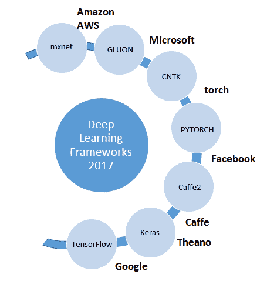
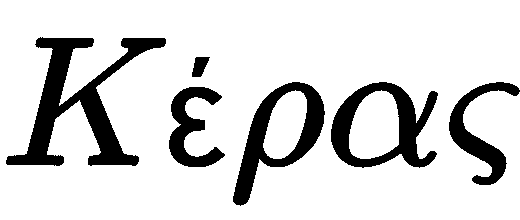
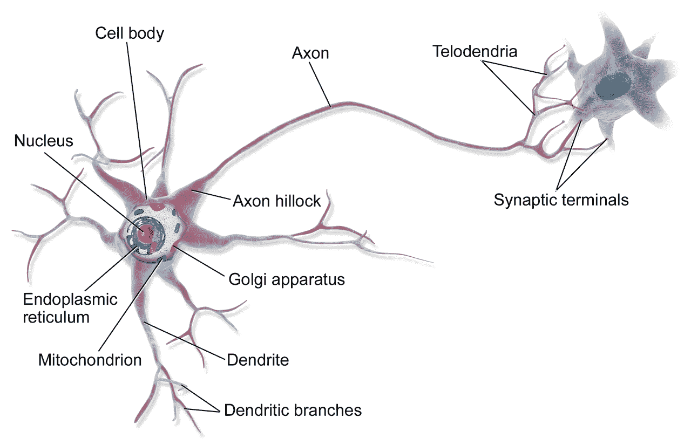
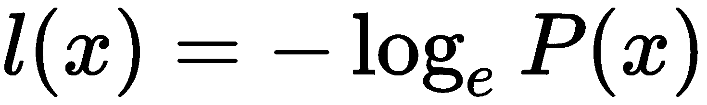
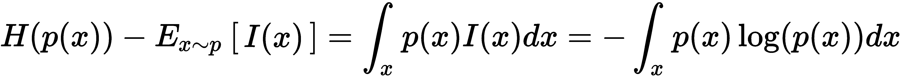
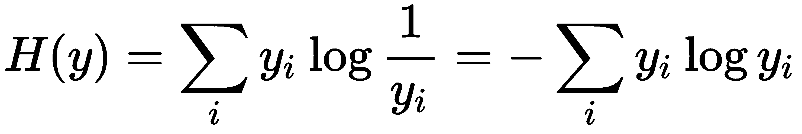
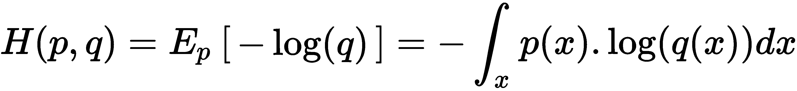
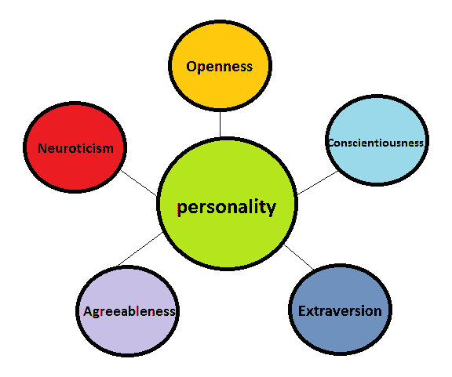

# 第一章：神经网络概述

向你问好，同胞；欢迎加入我们这段激动人心的旅程。这段旅程的核心是理解一个极具潜力的计算范式背后的概念和内在运作：**人工神经网络**（**ANN**）。虽然这个概念已经存在近半个世纪，但其诞生时的思想（例如*什么是智能体*，或*智能体如何从环境中学习*）可以追溯到亚里士多德时代，甚至可能追溯到文明的黎明。遗憾的是，亚里士多德时代的人们并未拥有今天我们所拥有的大数据普及，或者**图形处理单元**（**GPU**）加速和大规模并行计算的速度，这为我们打开了非常有前景的道路。如今我们生活在一个时代，在这个时代，大多数人类种群都能接触到构建人工智能系统所需的基础工具和资源。虽然涵盖从过去到今天的整个发展历程稍微超出了本书的范围，但我们将尝试简要总结一些关键概念和思想，帮助我们直观地思考我们在此面临的问题。

本章我们将涵盖以下主题：

+   定义我们的目标

+   了解我们的工具

+   理解神经网络

+   观察大脑

+   信息建模与功能表示

+   数据科学中的一些基础复习

# 定义我们的目标

本质上，我们的任务是构思一个能够处理任何输入数据的机制。在这个过程中，我们希望这个机制能够检测数据中潜在的模式，并将其利用为我们带来利益。成功完成这个任务意味着我们将能够将任何形式的原始数据转化为知识，进而形成可操作的商业洞察、减轻负担的服务，或是救命的药物。因此，我们真正想要的是构建一个能够普遍近似任何可能代表我们数据的函数的机制；如果你愿意，可以称之为知识的灵丹妙药。请暂时退后一步，想象一下这样的世界；一个能够在几分钟内治愈最致命疾病的世界。一个所有人都能获得食物、每个人都可以选择无惧迫害、骚扰或贫困地追求任何学科人类成就巅峰的世界。这个承诺是否过于遥不可及？或许吧。实现这个理想社会不仅仅需要设计高效的计算机系统。它还需要我们在道德观念上同步进化，重新思考作为个体、物种和整体我们在这个星球上的位置。但你会惊讶于计算机能在多大程度上帮助我们实现这一目标。

这里需要理解的是，我们谈论的并不仅仅是任何一种计算机系统。这与我们的计算先驱们（如巴贝奇和图灵）所处理的内容截然不同。这并不是一个简单的图灵机或差分机（尽管我们将要回顾的许多概念直接与这些伟大的思想家和他们的发明相关）。因此，我们的目标是涵盖从几百年、如果不是几十年，科学研究中关于生成智能这一基本概念的学术贡献、实际实验和实现见解；这个概念可以说是最本能地属于我们人类，但却少有人真正理解。

# 了解我们的工具

我们将主要使用目前最受欢迎的两个深度学习框架，这些框架对公众免费开放。这并不意味着我们将完全局限于这两个平台进行实现和练习。也可能会遇到我们尝试其他著名的深度学习框架和后端。不过，由于 TensorFlow 和 Keras 的广泛流行、大量的支持社区以及它们在与其他著名后端和前端框架（如 Theano、Caffe 或 Node.js）接口的灵活性，我们将尽量使用它们。接下来我们将提供一些关于 Keras 和 TensorFlow 的背景信息：

# Keras

许多人称 Keras 为深度学习的*通用语言*，因为它的用户友好性、模块化和可扩展性。Keras 是一个高层次的神经网络应用程序编程接口，专注于快速实验的实现。它是用 Python 编写的，可以在 TensorFlow 或 Keras 等后端上运行。Keras 最初是作为 ONEIROS（开放式神经电子智能机器人操作系统）项目的研究工作的一部分开发的。它的名字来源于希腊语单词， ，字面意思是*角*。这个词暗指一段古希腊文学中的文字游戏，指的是阿马尔忒亚的角（也称为**丰饶之角**），这是丰盈和繁荣的永恒象征。

Keras 的一些功能包括以下内容：

+   简单快速的原型开发

+   支持多种最新神经网络架构的实现，以及预训练模型和练习数据集

+   在 CPU 和 GPU 上完美执行

# TensorFlow

TensorFlow 是一个开源软件库，用于高性能数值计算，使用一种叫做**张量**的数据表示方法。它让像我和你这样的人能够实现所谓的**数据流图**。数据流图本质上是一种结构，描述了数据如何在网络中移动，或者在一系列处理神经元中流动。网络中的每个神经元代表一个数学运算，每个神经元之间的连接（或*边*）是一个多维数据数组，或称为*张量*。通过这种方式，TensorFlow 提供了一个灵活的 API，允许在各种平台（如 CPU、GPU 及其自有的**张量处理单元**（**TPUs**））上轻松部署计算，涵盖从桌面到服务器集群，再到移动设备和边缘设备。最初由 Google Brain 团队的研究人员和工程师开发，它提供了一个出色的编程接口，支持神经网络设计和深度学习。

# 神经学习的基础知识

我们的旅程从试图获得学习概念的基本理解开始。此外，我们真正感兴趣的是，像学习这样一个丰富而复杂的现象是如何在被许多人称为人类已知最先进的计算机上实现的。正如我们将观察到的那样，科学家们似乎不断从我们自身生物神经网络的内部运作中获得灵感。如果大自然确实已经找到了利用外部世界的松散连接信号，并将其拼接成一个连续的响应和适应性意识流的方法（这是大多数人类都会认同的），我们确实希望了解它是如何做到这一点的。然而，在我们进入这些话题之前，我们必须建立一个基准，以理解为什么神经网络的概念与大多数现代**机器学习**（**ML**）技术有如此大的不同。

# 什么是神经网络？

将神经网络与我们目前为止所知道的任何其他算法问题解决方式进行比较是非常困难的。例如，线性回归仅仅处理计算一条最佳拟合线，该线是相对于从绘制的观察点中计算的平方误差的均值。而类似地，质心聚类则是通过计算相似点之间的理想距离，递归地分离数据，直到达到渐近配置。

而神经网络则没有那么容易解释，原因有很多。一个看待这个问题的方式是，神经网络本身是一个由不同算法组成的算法，在数据传播的过程中执行更小的局部计算。这里所描述的神经网络定义，当然不是完整的。我们将在本书中通过讨论更复杂的概念和神经网络架构，逐步完善这一定义。不过，现在我们可以从一个外行的定义开始：神经网络是一种机制，能够自动学习你提供的输入（如图像）与你关心的输出之间的关联（也就是判断图像中是狗、猫还是攻击直升机）。

现在，我们对神经网络有了初步的理解——它是一种接受输入并学习关联以预测输出的机制。这个多功能的机制当然不限于仅仅接收图像作为输入。事实上，这样的网络同样能够接收一些文本或录制的音频作为输入，并猜测它是在看《哈姆雷特》还是在听《比莉·简》。但是，如何使这样的机制能够应对数据在形式和大小上的多样性，同时仍然产生相关的结果呢？为了理解这一点，许多学者发现，研究自然界是解决这一问题的一个有效途径。实际上，地球上经过数百万年的进化，经历了基因突变和环境变化，已经产生了一种非常相似的机制。更妙的是，大自然甚至为我们每个人配备了一个这种通用功能逼近器的版本，就在我们的双耳之间！我们当然在说的是人类大脑。

# 观察大脑

在我们简要探讨这一著名类比之前，有必要在此澄清，这确实只是一个类比，而不是平行比较。我们并不提议神经网络的工作方式完全与我们的大脑相同，因为这样不仅会激怒不少神经科学家，还无法公正地评价哺乳动物大脑解剖学所代表的工程奇迹。然而，这一类比有助于我们更好地理解工作流程，以便设计能够从数据中提取相关模式的系统。人类大脑的多功能性，无论是在创作音乐乐团、艺术杰作，还是在开创科学设备如大型强子对撞机方面，展示了同一结构如何学习并应用高度复杂和专业的知识，完成伟大的壮举。事实证明，大自然真的是一个相当聪明的存在，因此，我们可以通过观察它如何实现像学习代理这样新颖的事物，获得许多宝贵的经验。

# 构建生物大脑

夸克构成原子，原子构成分子，分子聚集在一起，偶尔可能构成可电刺激的生物机械单元。我们将这些单元称为**细胞**；它们是所有生物生命形式的基本构建模块。现在，细胞本身种类繁多，但其中有一种特定类型对我们来说很有意义。那就是一类特定的细胞，叫做**神经细胞**或**神经元**。为什么呢？事实证明，如果你将约 10¹¹个神经元按照特定且互补的配置排列，它们就能组成一个能够发现火、农业和太空旅行的器官。然而，要了解这些神经元如何学习，我们首先需要理解单个神经元是如何工作的。正如你将看到的，正是我们大脑中这些神经元所组成的重复架构，催生了我们（自负地）称之为智能的更宏大的现象。

# 神经元的生理学

神经元只是一个能够接受、处理和通过电信号和化学信号传递信息的电刺激细胞。树突从神经元细胞体延伸出来，接收来自其他神经元的信息。当我们说神经元*接收*或*发送*信息时，实际上是指它们沿着轴突传递电信号。最后，神经元是*可兴奋的*。换句话说，向神经元提供合适的电刺激将引发电事件，这些电事件被称为**动作电位**。当神经元达到其动作电位（或*尖峰*）时，它会释放神经递质，这是一种通过突触传播到其他神经元的化学物质。每当神经元发生尖峰时，神经递质会从它的数百个突触中释放出来，进入其他神经元的树突，这些神经元可能会或可能不会发生尖峰，这取决于刺激的性质。这正是让这些庞大的神经网络相互通信、计算并协同工作来解决我们每天面对的复杂任务的方式：

所以，神经元真正做的事情就是接收一些电输入，进行某种处理，然后如果结果是积极的，就*发射*信号，或者如果处理结果是消极的，则保持不活跃。我们这里所说的结果是*积极的*是什么意思呢？要理解这一点，有必要稍微了解一下我们大脑中信息和知识是如何表示的。

# 信息表示

假设有一个任务，你需要正确地对狗、猫和攻击直升机的图像进行分类。可以这样理解神经学习系统：我们为这三类图像的不同特征分配了多个神经元。换句话说，假设我们为分类任务分配了三个专家神经元。每一个神经元都是狗、猫和攻击直升机的外观方面的专家。

他们为什么是专家呢？嗯，目前我们可以认为，我们每个领域专家的神经元都有自己的员工和支持人员来提供支持，所有人都在为这些专家勤奋工作，收集和表示不同种类的狗、猫和攻击直升机。但我们暂时不涉及他们的支持人员。目前，我们仅仅将任何图像呈现给我们的三位领域专家。如果图像是一只狗，我们的*狗专家*神经元立刻识别出这种生物并激活，几乎就像它在说，*你好，我相信这是一只狗。相信我，我是专家*。类似地，当我们将一张猫的图片呈现给我们的三位专家时，我们的猫神经元会通过激活告诉我们它们已经检测到图像中的猫。虽然这并不完全代表每个神经元如何表示现实世界中的物体，如猫和狗，但它帮助我们获得对基于神经元的学习系统的功能性理解。希望你现在有足够的信息，可以被介绍给生物神经元的“更不复杂”的兄弟——人工神经元。

# 神经编码的奥秘

实际上，许多神经科学家认为，像我们的*猫专家*神经元这样统一代表性神经元的想法并不真实存在于我们的大脑中。他们指出，这样的机制要求我们的脑袋拥有成千上万只神经元，只专门用于识别我们已知的特定面孔，比如我们的祖母、街角的面包师或唐纳德·特朗普。相反，他们假设了一个更分布式的表示架构。这种分布式理论认为，特定的刺激，比如一张猫的图片，是通过一组独特的神经元激活模式来表示的，这些神经元广泛分布在大脑中。换句话说，一只猫可能由大约（这只是一个猜测）100 个不同的神经元表示，每个神经元都专门负责识别图片中的特定猫类特征（比如耳朵、尾巴、眼睛和总体体型）。这里的直觉是，这些猫神经元中的一些可能与其他神经元重新组合，用于表示包含*猫*元素的其他图像。例如， jaguar 的图片，或卡通猫*加菲猫*，可能通过使用相同猫神经元的一个子集来重建，同时结合一些已经学习了关于美洲豹体型或加菲猫著名的橙色和黑色条纹的神经元。

# 分布式表示与学习

在一些令人好奇的医学案例中，头部受到身体创伤的患者不仅未能与他们的亲人产生联系，甚至声称这些亲人只是伪装成他们的亲人！虽然这是一个离奇的事件，但这种情况可能为我们揭示神经学习的具体机制。显然，患者能够识别这个人，因为一些编码视觉模式的神经元（如面部和衣物特征）被激活了。然而，由于他们尽管能够识别这些亲人，却报告自己与这些亲人失去了联系，这意味着当患者遇到他们的亲人时，所有正常情况下会被激活的神经元（包括编码情感反应的神经元）都没有被激活。

这些分布式表示方式可能让我们的脑袋在从极少的数据中推断模式时具有灵活性，正如我们观察到自己能够做到的那样。例如，现代神经网络仍然需要你提供数百张（如果不是数千张）图像，才能可靠地预测它是否在看一辆公交车或一台烤面包机。而我的三岁侄女，另一方面，能够凭借大约三到五张公交车和烤面包机的图片，就能达到相同的准确性。更令人着迷的是，运行在你电脑上的神经网络，有时需要耗费数千瓦的能源来进行计算。而我的侄女只需要 12 瓦特。她会从几块饼干中获得所需的能量，或者也许从她小心翼翼地从厨房偷走的一小块蛋糕中得到。

# 数据科学基础

让我们来了解一下数据科学的一些基本术语和概念。我们将探讨一些理论内容，然后继续理解一些复杂的术语，如熵和维度。

# 信息理论

在深入探讨各种网络架构和一些实践案例之前，如果我们不对通过处理现实世界信号来获取信息这一关键概念进行一些阐述，那就太遗憾了。我们讨论的是量化信号中信息量的科学，也就是信息理论。虽然我们不打算提供关于这一概念的深度数学概述，但了解一些基于概率的学习背景是很有用的。

直观上，得知一个不太可能发生的事件已经发生，比得知一个预期事件已经发生更具信息量。如果我告诉你今天你可以*在所有超市购买食物*，你不会感到惊讶。为什么？嗯，我实际上并没有告诉你一些超出预期的信息。相反，如果我告诉你今天*不能*在所有超市购买食物，可能是因为某种大规模罢工，那么你可能会感到惊讶。你会感到惊讶是因为呈现了一个不太可能的信息（在我们的例子中，就是“*不*”这个词出现在之前的句子配置中）。这种直观的知识是我们试图在信息理论领域中加以规范的。其他类似的概念包括以下几点：

+   一个发生可能性较低的事件应该具有较低的信息内容。

+   一个发生可能性更高的事件应该具有更高的信息内容。

+   一个必定发生的事件应该没有信息内容。

+   一个具有独立发生可能性的事件应该具有加法性的信息内容。

在数学上，我们可以通过使用简单的方程来满足所有这些条件，该方程用于建模事件（`x`）的自信息，公式如下：

*l(x)*以*nat*为单位，表示通过观察概率为*1/e*的事件所获得的信息量。尽管前面的方程式简洁明了，但它仅允许我们处理单一结果；这在建模现实世界的复杂依赖性时并不太有帮助。如果我们想量化整个事件概率分布中的不确定性怎么办？那么，我们就使用另一种度量方法，称为**香农熵**，如下方程所示：

# 熵

假设你是一名被困在敌军后方的士兵。你的目标是让盟友知道敌人正在朝他们进发的方向。敌人有时会派出坦克，但更常见的是派出巡逻队。现在，你唯一能通知朋友们的方法是使用简单的二进制信号发射器。你需要弄清楚最好的沟通方式，以免浪费宝贵的时间并被敌人发现。你该如何做呢？首先，你需要规划出许多二进制信号序列，每个特定的序列对应一种特定类型的敌人（如巡逻队或坦克）。凭借对环境的一些了解，你已经知道巡逻队比坦克更常见。因此，合理的推断是，你很可能会比使用 *坦克* 信号更频繁地使用 *巡逻队* 信号。因此，你会分配较少的二进制比特来传达巡逻队的存在，因为你知道你会比其他信号更频繁地发送这个信号。你正在利用你对敌人类型分布的了解，减少平均需要发送的比特数。事实上，如果你能够访问来袭巡逻队和坦克的整体基础分布，那么理论上你可以使用最少的比特数来最有效地与对面友军沟通。我们通过在每次传输时使用最佳比特数来实现这一点。表示一个信号所需的比特数被称为数据的熵，可以用以下方程来表示：

这里，*H(y)* 表示一个函数，表示用概率分布 `y` 来表示一个事件的最佳比特数。`y[i]` 只是指另一个事件 `i` 的概率。因此，假设看到敌方巡逻队的概率是看到敌方坦克的 256 倍，我们将按如下方式建模用于编码敌方巡逻队存在的比特数：

*巡逻队比特* = *log*(`1`/*256pTank*)

= *log*(`1`/*pTank*) + *log*(`1`/(`2`^`8`))

= *坦克比特* - `8`

# 交叉熵

交叉熵是另一个数学概念，它允许我们比较两个不同的概率分布，分别用`p`和`q`表示。事实上，正如你稍后会看到的，当处理分类特征时，我们经常在神经网络中使用基于熵的损失函数。从本质上讲，两个概率分布（[`en.wikipedia.org/wiki/Probability_distribution`](https://en.wikipedia.org/wiki/Probability_distribution)）之间的交叉熵，*(p, q)*，是在相同的事件集合上，衡量为了识别从该集合中随机选出的一个事件所需的平均信息量，前提是所使用的编码方案是针对预测的概率分布进行优化，而不是*真实*分布。我们将在后续章节中重新探讨这一概念，以澄清并实现我们的理解：

# 数据处理的本质

之前，我们讨论了神经元如何通过电信号传播信息，并利用化学反应与其他神经元进行交流。这些神经元帮助我们判断*猫*或*狗*长什么样。但这些神经元从来没有真正看到过完整的猫的图像。它们处理的只是化学和电信号。这些神经元网络能够完成任务，仅仅因为有其他感官预处理器官（如我们的眼睛和视神经）在为神经元提供适当格式的数据，使其能够进行解读。我们的眼睛接收表示猫图像的电磁辐射（或光），并将其转换为高效的表示形式，通过电信号传递出去。因此，人工神经元与生物神经元的一个主要区别就在于它们之间交流的媒介。如我们所见，生物神经元通过化学物质和电信号进行通信。类似地，人工神经元依赖于数学这一通用语言来表示数据中的模式。实际上，围绕着将现实世界现象以数学形式表示的概念，存在一个完整的学科，旨在从中提取知识。正如许多人所熟悉的，这个学科被称为**数据科学**。

# 从数据科学到机器学习

拿起任何一本关于数据科学的书；你很可能会遇到一些复杂的解释，涉及到统计学、计算机科学等领域的交叉，以及一些领域知识。当你快速翻阅书页时，你会注意到一些漂亮的可视化图表、条形图——这些都是数据科学的经典呈现形式。你会接触到统计模型、显著性检验、数据结构和算法，每一种都能为某些演示案例提供令人印象深刻的结果。这些并不是数据科学。这些确实是你作为一名成功数据科学家将使用的工具。然而，数据科学的本质可以用更简单的方式来概括：*数据科学是一个科学领域，专注于从原始数据中生成可操作的知识。这是通过反复观察现实世界的问题，量化不同维度或特征中的整体现象，并预测未来的结果，以实现期望的目标。机器学习（ML）仅仅是教机器数据科学的学科*。

虽然一些计算机科学家可能会欣赏这种递归定义，但你们中的一些人可能会思考什么是*量化现象*。嗯，你看，现实世界中的大多数观察，无论是你吃了多少食物、你看什么类型的节目，还是你喜欢穿什么颜色的衣服，都可以定义为（近似的）其他某些准依赖特征的函数。例如，你在某一天会吃多少食物，可以定义为其他因素的函数，比如你在上一餐吃了多少食物、你对某些类型食物的偏好，甚至是你进行的体力活动量。

类似地，你喜欢观看的节目可以通过一些特征来近似，例如你的个性特征、兴趣和日程中可用的空闲时间。简言之，我们通过量化和表示观察之间的差异（例如，不同人群的观看习惯），来推导出机器可以使用的功能性预测规则。

我们通过定义我们试图预测的可能结果（即某人是否喜欢喜剧或惊悚片）来诱导这些规则，作为输入特征的函数（即我们在观察现象时收集的关于此人的大五人格测试排名），这在广义上涉及对现象的观察（例如，人口的个性特征和观看习惯）：

如果你选择了正确的特征集，你将能够推导出一个可靠的函数，该函数能够准确预测你感兴趣的输出类别（在我们的例子中，这是观众的偏好）。我所说的正确特征是什么意思？很显然，观看习惯更多地与一个人的个性特征相关，而不是与他们的旅行习惯相关。例如，通过眼睛颜色和实时 GPS 坐标来预测某人是否倾向于观看恐怖片几乎毫无意义，因为这些信息与我们试图预测的内容没有关联。因此，我们总是选择相关的特征（通过领域知识或显著性检验）来简洁地表示一个现实世界的现象。然后，我们只是用这个表示来预测我们感兴趣的未来结果。这个表示本身就是我们所称的预测模型。

# 在高维空间中建模数据

如你所见，我们可以通过将实际世界的观察结果重新定义为不同特征的函数来表示它们。例如，一个物体的速度是它在给定时间内所行驶的距离的函数。类似地，电视屏幕上像素的颜色实际上是由构成该像素的红、绿、蓝三种颜色强度值所决定的。这些元素就是数据科学家所称的数据特征或维度。当我们拥有已标记的维度时，我们处理的是监督学习任务，因为我们可以根据实际情况检查我们模型的学习效果。当我们拥有未标记的维度时，我们通过计算观察点之间的距离来找出数据中相似的群体。这就是所谓的**无监督机器学习**。因此，通过这种方式，我们可以通过简单地使用信息特征来表示它，从而开始构建一个现实世界现象的模型。

# 维度的诅咒

接下来的自然问题是：我们到底是如何构建一个模型的？简而言之，我们在观察一个结果时选择收集的特征都可以绘制在高维空间中。虽然这听起来很复杂，但它仅仅是你在高中数学中可能熟悉的笛卡尔坐标系统的扩展。让我们回忆一下如何使用笛卡尔坐标系统在图表上表示一个点。对于这个任务，我们需要两个值，`x` 和 `y`。这是一个二维特征空间的示例，其中 `x` 和 `y` 轴分别是表示空间中的一个维度。如果再加上一个 `z` 轴，我们就得到了一个三维特征空间。本质上，我们在一个 `n` 维特征空间中定义机器学习问题，其中 `n` 表示我们试图预测的现象中的特征数量。在我们之前预测观众偏好的例子中，如果我们仅使用大五人格测试的分数作为输入特征，那么我们实际上拥有一个五维特征空间，其中每个维度对应一个人五个性维度之一的得分。事实上，现代机器学习问题的维度可以从 100 到 100,000（有时甚至更多）。由于特征数量的不同配置的可能性随着特征数量的增加而指数级增长，因此即使是计算机，也很难在如此大的比例下进行构思和计算。这个在机器学习中出现的问题通常被称为 *维度诅咒*。

# 算法计算与预测模型

一旦我们拥有了相关数据的高维表示，我们就可以开始推导预测函数的任务。我们通过使用算法来实现这一点，算法本质上是一组预编程的递归指令，用于以某种方式对我们的高维数据表示进行分类和划分。这些算法（最常见的有聚类、分类和回归）递归地将我们的数据点（即每个人的个性排名）在特征空间中划分成更小的组，在这些组内数据点相对更相似。通过这种方式，我们使用算法迭代地将我们的高维特征空间划分成更小的区域，这些区域最终将对应我们的输出类别（理想情况下）。因此，我们可以通过简单地将任何未来的数据点放置到我们的高维特征空间中，并将其与模型预测输出类别对应的区域进行比较，从而可靠地预测其输出类别。恭喜，我们已经有了一个预测模型！

# 匹配模型与使用案例

每次我们选择将一个观察定义为某些特征的函数时，我们就打开了一个潘多拉魔盒，里面是半因果相关的特征，其中每个特征本身也可能被重新定义（或量化）为其他特征的函数。这样做时，我们可能需要退一步，思考我们到底在尝试表示什么。我们的模型是否捕捉到了相关的模式？我们可以依赖我们的数据吗？我们的资源——无论是算法还是计算能力——是否足够从我们拥有的数据中学习？

回忆我们之前讨论的预测个人每餐可能消耗的食物数量的场景。我们讨论过的特征，例如他们的体力活动，可以重新定义为其代谢和荷尔蒙活动的函数。类似地，饮食偏好可以重新定义为肠道细菌和大便组成的函数。每一次这样的重新定义都会为我们的模型增加新的特征，并带来额外的复杂性。

也许我们甚至可以更准确地预测你应该点多少外卖。是否值得为了每天做一次胃部活检？或者在你的厕所里安装一台最先进的电子显微镜？你们大多数人会同意：不，完全不值得。我们是如何达成这个共识的？仅仅通过评估我们的饮食预测用例，并选择足够*相关*的特征来预测我们想要预测的内容，以一种可靠且与我们的情况相称的方式。一个复杂的模型，配合高质量的硬件（比如厕所传感器），对于饮食预测这个用例来说既不必要也不现实。你完全可以基于一些易于获取的特征，例如购买历史和以往偏好，来实现一个功能性预测模型。

这个故事的本质是，你可以将任何可观察现象定义为其他现象的函数，以递归的方式进行，但聪明的数据科学家会知道何时停止，通过选择适合你的用例的合适特征来停止；这些特征是易于观察和验证的；并且能稳健地处理所有相关情况。我们所需要的仅仅是逼近一个函数，能够可靠地预测数据点的输出类别。过于复杂或过于简单的现象表示自然会导致我们的机器学习项目失败。

# 函数表示

在我们继续进行理解、构建和掌握神经网络的旅程之前，至少要刷新一下我们对一些基础机器学习概念的认识。例如，理解一个关键点：你从来不会完全地建模一个现象，你只是在*功能上*表示它的一部分。这有助于你直观地思考数据，将其视为理解过程中大拼图中的一小部分。它还帮助你意识到，时间在变化，特征的重要性以及周围环境的变化都可能影响模型的预测能力。这种直觉通过实践和领域知识自然形成。

在接下来的部分，我们将通过一些简单的场景驱动示例，简要回顾机器学习应用中的一些经典陷阱。这样做很重要，因为在我们将神经网络应用到各种用例时，我们会发现这些相同的问题再次出现。

# 机器学习的陷阱

设想一个天气预报预测问题。我们将通过进行特征选择来构建我们的预测模型。凭借一些领域知识，我们首先识别出特征*气压*是一个相关的预测因子。我们将在夏威夷岛记录不同天数的*Pa*值（帕斯卡，气压的测量单位），其中一些日子是晴天，另一些是雨天。

# 不平衡的类别先验

在经历了几天的晴天后，你的预测模型告诉你第二天也有很高的可能性是晴天，但实际却下雨了。为什么？这只是因为你的模型没有看到足够的两种预测类别（晴天和雨天）的实例，无法准确评估下雨的概率。在这种情况下，模型存在不平衡的类别先验，这会误导整体天气模式的判断。根据你的模型，只有晴天，因为它到目前为止只看到了晴天。

# 欠拟合

你收集了大约两个月的气压数据，并平衡了每个输出类别中的观测值数量。你的预测准确率稳步提升，但在达到一个次优水平后（假设是 61%）开始趋于平稳。突然之间，随着外面越来越冷，你的模型准确率开始再次下降。这里我们面临的是欠拟合问题，因为我们简单的模型无法捕捉到数据的潜在模式，这种模式是由冬季的季节性变化引起的。对此情况有一些简单的解决办法。最明显的做法是通过增加更多的预测特征来改进模型，比如增加外部温度这一变量。这样做后，我们观察到在几天的数据收集后，准确率再次上升，因为额外的特征为模型提供了更多信息，提升了其预测能力。在其他欠拟合的情况下，我们可能会选择更计算密集的预测模型，增加更多数据，工程化地优化特征，或者减少模型中的数学约束（例如正则化的 lambda 超参数）。

# 过拟合

在收集了大约几年的数据后，你自信地对你的农民朋友吹嘘，称你已经开发了一个预测准确率为 96% 的强大模型。你的朋友说，*太好了，我能用这个吗？* 作为一个利他主义者和慈善家，你立刻同意并把代码发给他。一天后，同一个朋友从他位于中国广东省的家里打电话回来，生气地说你的模型没能工作，并且毁掉了他的作物收成。发生了什么事？这其实只是一个将我们的模型过拟合到夏威夷热带气候的例子，导致模型无法很好地推广到其他样本之外。我们的模型没有看到气压和温度的足够变化，缺少了与*晴天*和*雨天*相对应的标签，无法充分预测另一个大陆的天气。实际上，由于我们的模型只看到了夏威夷的温度和气压，它记住了数据中的一些微不足道的模式（例如，两天连着的雨天是从未出现过的），并且将这些模式作为预测规则，而不是抓住更有信息量的趋势。当然，这里的一个简单解决办法是收集更多中国的天气数据，并根据当地的天气动态来微调你的预测模型。在其他类似的过拟合情况下，你可以尝试选择一个更简单的模型，通过去除离群值和错误来去噪数据，并使数据围绕均值进行中心化。

# 错误数据

在向你亲爱的中国朋友（以下简称“Chan”）解释刚刚发生的误算后，你指示他设置传感器并开始收集本地的气压和温度数据，以构建一个标注的晴天和雨天数据集，就像你在夏威夷做的那样。Chan 勤奋地将传感器安装在他的屋顶和田地中。不幸的是，Chan 的屋顶由高热导性的强化金属合金制成，这种材料会不规则地使屋顶的气压和温度传感器读数波动，导致读数不一致且不可靠。将这些损坏的数据输入到我们的预测模型中，自然会产生次优的结果，因为学到的线条被噪声和不具有代表性的数据干扰了。一个明显的解决方法是更换传感器，或者干脆丢弃有问题的传感器读数。

# 无关特征和标签

最终，通过使用来自夏威夷、中国和世界其他地方的足够数据，我们注意到一个明显的、全球普适的模式，这个模式可以用来预测天气。所以，每个人都很开心，直到有一天，你的预测模型告诉你今天将是一个明媚的晴天，结果却有龙卷风来敲门。发生了什么？我们哪里出错了？事实证明，当涉及到龙卷风时，我们的这个具有两个特征的二分类模型并没有包含足够的关于问题（即龙卷风动态）的信息，无法逼近一个可靠预测这一特定灾难结果的函数。到目前为止，我们的模型甚至没有尝试预测龙卷风，我们只收集了晴天和雨天的数据。

这里的一位气候学家可能会说，*那就开始收集关于海拔、湿度、风速和风向的数据，并在你的数据中添加一些标注的龙卷风实例*，的确，这会帮助我们抵御未来的龙卷风。但这也仅限于此，直到某天地震袭击了大陆架并引发了海啸。这个例子说明了无论你选择什么样的模型，都需要持续跟踪相关特征，并且每个预测类别（例如是否是晴天、雨天、龙卷风天气等）都要有足够的数据，才能实现良好的预测精度。拥有一个好的预测模型意味着你已经发现了一种能够使用到目前为止收集的数据来推导出一组似乎被遵守的预测规则的机制。

# 总结

在本章中，我们对生物神经网络进行了功能性概述，简要介绍了神经学习和分布式表征等概念。我们还回顾了一些经典的数据科学难题，这些难题对于神经网络与其他机器学习技术同样适用。在接下来的章节中，我们将深入探讨受到生物神经网络启发的学习机制，并探索人工神经网络（ANN）的基本架构。我们以友好的方式描述 ANN，因为尽管它们旨在像生物神经网络一样高效工作，但目前还未完全达到这一目标。在下一章中，您将了解设计 ANN 时的主要实现考虑因素，并逐步发现这一过程所涉及的复杂性。

# 进一步阅读

+   **符号主义学习与联结主义学习**：[`www.cogsci.rpi.edu/~rsun/sun.encyc01.pdf`](http://www.cogsci.rpi.edu/~rsun/sun.encyc01.pdf)

+   **人工智能的历史**：[`sitn.hms.harvard.edu/flash/2017/history-artificial-intelligence/`](http://sitn.hms.harvard.edu/flash/2017/history-artificial-intelligence/)

+   **人类大脑的历史**：[`www.mybrain.co.uk/public/learn_history4.php`](http://www.mybrain.co.uk/public/learn_history4.php)
