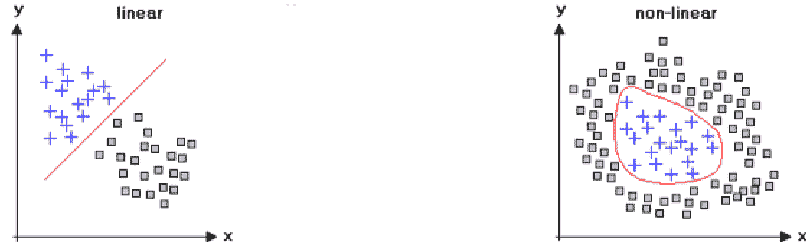
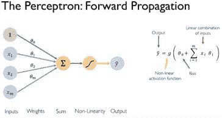
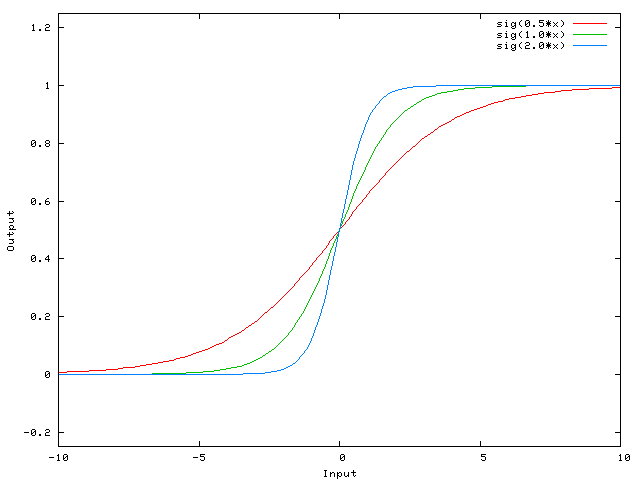
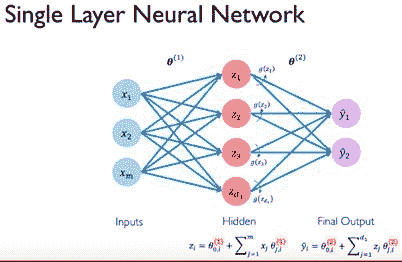

# 第二章：深入探讨神经网络

在本章中，我们将更深入地了解神经网络。我们将从构建一个感知机开始。接下来，我们将学习激活函数。我们还将训练我们的第一个感知机。

在本章中，我们将覆盖以下主题：

+   从生物神经元到人工神经元——感知机

+   构建感知机

+   通过错误学习

+   训练感知机

+   反向传播

+   扩展感知机

+   单层网络

# 从生物神经元到人工神经元——感知机

现在我们已经简要了解了一些关于数据处理本质的见解，是时候看看我们自己生物神经元的人工“亲戚”是如何工作的了。我们从弗兰克·罗森布拉特（Frank Rosenblatt）在 1950 年代的创作开始。他将这一发明称为**感知机** ([`citeseerx.ist.psu.edu/viewdoc/download?doi=10.1.1.335.3398&rep=rep1&type=pdf`](http://citeseerx.ist.psu.edu/viewdoc/download?doi=10.1.1.335.3398&rep=rep1&type=pdf))。从本质上讲，你可以将感知机看作是**人工神经网络**（**ANN**）中的一个单一神经元。理解一个单一感知机如何向前传播信息，将成为理解我们在后续章节中将遇到的更先进网络的一个绝佳垫脚石：

# 构建感知机

目前，我们将使用六个特定的数学表示来定义一个感知机，这些表示展示了它的学习机制。它们分别是输入、权重、偏置项、求和以及激活函数。输出将在下面进一步展开说明。

# 输入

还记得生物神经元是如何从它的树突接收电信号的吗？那么，感知机的行为方式类似，但它更倾向于接收数字而不是电流。实际上，它接收特征输入，如前图所示。这个特定的感知机只有三个输入通道，分别是`x[1]`、`x[2]`和`x[3]`。这些特征输入（`x[1]`、`x[2]`和`x[3]`）可以是你选择的任何独立变量，用来表示你的观察结果。简单来说，如果我们想预测某天是否会晴天或下雨，我们可以记录每天的独立变量，如温度和气压，以及当天的输出类别（当天是晴天还是下雨）。然后，我们将这些独立变量，一天一天地输入到我们的感知机模型中。

# 权重

所以，我们知道数据是如何流入我们简单的神经元的，但我们如何将这些数据转化为可操作的知识呢？我们如何构建一个模型，将这些输入特征表示出来，并帮助我们预测某天的天气呢？

给我们提供了两个特征，可以作为输入用于我们的模型，在二分类任务中判断*雨天*或*晴天*。

好的，第一步是将每个输入特征与其对应的权重配对。你可以把这个权重看作是该特定输入特征相对于我们试图预测的输出类别的相对重要性。换句话说，我们的输入特征“温度”的权重应该反映出这个输入特征与输出类别的相关程度。这些权重一开始是随机初始化的，随着我们的模型看到越来越多的数据，它们会被学习到。我们这么做的希望是，在足够多的迭代后，这些权重会被引导到正确的方向，并学习到与温度和气压值对应的理想配置，这些配置对应于雨天和晴天。事实上，从领域知识来看，我们知道温度与天气高度相关，因此我们期望模型理想情况下会为这个特征学习到更大的权重，随着数据的传播，这个特征的权重会逐渐增大。这在某种程度上可以与生物神经元中的髓鞘相比较。如果一个特定的神经元频繁地激活，它的髓鞘会变厚，从而使神经元的轴突得到绝缘，下次可以更快地传递信号。

# 总和

所以，现在我们的输入特征已经流入了感知机，每个输入特征都与一个随机初始化的权重配对。下一步相对简单。首先，我们将所有三个特征及其权重表示为两个不同的 3 x 1 矩阵。我们希望用这两个矩阵来表示输入特征及其权重的综合效应。正如你从高中数学中回忆到的那样，你实际上不能将两个 3 x 1 矩阵直接相乘。所以，我们需要执行一个小的数学技巧，将这两个矩阵简化为一个值。我们只需将特征矩阵转置，如下所示：

我们可以使用这个新的转置特征矩阵（维度为 3 x 1），并将其与权重矩阵（维度为 1 x 3）相乘。当我们执行矩阵乘法时，得到的结果称为这两个矩阵的**点积**。在我们的例子中，我们计算的是转置特征矩阵与权重矩阵的点积。通过这样做，我们可以将这两个矩阵简化为一个单一的标量值，这个值代表了所有输入特征及其相应权重的综合影响。接下来，我们将看看如何使用这个综合表示，并与某个阈值进行对比，以评估该表示的质量。换句话说，我们将使用一个函数来评估这个标量表示是否编码了一个有用的模式。理想的有用模式应该是帮助我们的模型区分数据中的不同类别，从而输出正确预测的模式。

# 引入非线性

所以现在，我们知道了数据是如何进入感知机单元的，如何将相关的权重与每个输入特征配对。我们还知道如何将输入特征及其相应的权重表示为`n` x 1 矩阵，其中`n`是输入特征的数量。最后，我们看到如何转置我们的特征矩阵，以便计算它与包含权重的矩阵的点积。这个操作最终得到一个单一的标量值。那么，接下来呢？现在是时候稍微停下来，思考一下我们到底在追求什么，这有助于我们理解为什么我们想要使用类似激活函数这样的概念。

好吧，正如你所看到的，现实世界中的数据通常是非线性的。我们所说的意思是，当我们尝试将某个观察值作为不同输入的函数来建模时，这个函数本身无法线性表示，或者说，不能用直线来表示。

如果数据中的所有模式仅由直线构成，那么我们可能根本不会讨论神经网络。像**支持向量机**（**SVMs**）或甚至线性回归等技术已经非常擅长这个任务：

例如，使用温度来建模晴天和雨天会产生一条非线性曲线。实际上，这意味着我们无法通过一条直线来划分我们的决策边界。换句话说，在某些日子里，尽管气温较高，可能会下雨；而在其他日子里，尽管气温较低，可能会保持晴朗。

这是因为温度与天气之间的关系并不是线性的。任何给定日子的天气结果很可能是一个复杂的函数，涉及风速、气压等交互变量。因此，在任何给定的一天，13 度的温度可能意味着德国柏林是晴天，但在英国伦敦却是雨天：

当然，某些情况下，现象可能可以用线性方式表示。例如，在物理学中，物体的质量与体积之间的关系可以线性定义，如以下截图所示：

这是一个非线性函数的例子：

| **线性函数** | **非线性函数** |
| --- | --- |
| *Y = mx + b* | *Y = mx² + b* |

这里，`m`是直线的斜率，`x`是直线上的任何点（输入或`x`值），而`b`是直线与`y`轴的交点。

不幸的是，现实世界中的数据通常不保证线性，因为我们用多个特征来建模观察数据，每个特征可能在确定输出类别时有不同且不成比例的贡献。事实上，我们的世界是高度非线性的，因此，为了捕捉感知机模型中的这种非线性，我们需要引入能够表示这种现象的非线性函数。通过这样做，我们增加了神经元建模实际存在的更复杂模式的能力，并且能够绘制出如果只使用线性函数则无法实现的决策边界。这些用于建模数据中非线性关系的函数，被称为**激活函数**。

# 激活函数

基本上，到目前为止，我们所做的就是将不同的输入特征及其权重表示为低维标量表示。我们可以使用这种简化的表示，并通过一个简单的非线性函数来判断我们的表示是否超过某个阈值。类似于我们之前初始化的权重，这个阈值可以被视为感知机模型的一个可学习参数。

换句话说，我们希望我们的感知机找出理想的权重组合和阈值，使其能够可靠地将输入匹配到正确的输出类别。因此，我们将简化后的特征表示与阈值进行比较，如果超过该阈值，我们就激活感知机单元，否则什么也不做。这个比较简化特征值和阈值的函数，就被称为**激活函数**：

这些非线性函数有不同的形式，将在后续章节中进行更详细的探讨。现在，我们展示两种不同的激活函数；**重阶跃**和**逻辑 sigmoid** 激活函数。我们之前展示的感知机单元最初是通过这样的重阶跃函数实现的，从而产生二进制输出 1（激活）或 0（非激活）。使用感知机单元中的阶跃函数时，我们观察到，当值位于曲线之上时，会导致激活（1），而当值位于曲线下方或在曲线上时，则不会触发激活单元（0）。这个过程也可以用代数方式来总结。

下图显示了重阶跃函数：

输出阈值公式如下：

本质上，阶跃函数并不算真正的非线性函数，因为它可以被重写为两个有限的线性组合。因此，这种分段常数函数在建模现实世界数据时并不够灵活，因为现实数据通常比二元数据更具概率性。另一方面，逻辑 sigmoid 函数确实是一个非线性函数，并且可以更灵活地建模数据。这个函数以**压缩**其输入到一个 0 到 1 之间的输出值而闻名，因此它成为表示概率的流行函数，也是现代神经网络中常用的激活函数：

每种激活函数都有其一组优缺点，我们将在后续章节中进一步探讨。现在，你可以直观地将不同激活函数的选择看作是基于你数据的特定类型的考虑。换句话说，我们理想的做法是进行实验并选择一个最能捕捉数据中潜在趋势的函数。

因此，我们将采用这种激活函数来阈值化神经元的输入。输入会相应地进行转换，并与该激活阈值进行比较，从而导致神经元激活，或者保持不激活。在以下插图中，我们可以可视化由激活函数产生的决策边界。

# 理解偏置项的作用

现在，我们大致了解了数据如何进入感知器；它与权重配对并通过点积缩减，然后与激活阈值进行比较。此时，你们很多人可能会问，*如果我们希望我们的阈值适应数据中的不同模式怎么办？* 换句话说，如果激活函数的边界并不理想，无法单独识别我们希望模型学习的特定模式怎么办？我们需要能够调整激活曲线的形式，以确保每个神经元能够局部捕捉到一定的模式灵活性。

那么，我们究竟如何塑造我们的激活函数呢？一种方法是通过在模型中引入**偏置项**来实现。下图中，箭头从第一个输入节点（标记为数字“1”）离开，便是这一过程的示意：

具有代表性的是，我们可以将这个偏置项视为一个**虚拟**输入*。这个虚拟输入被认为始终存在，使得我们的激活单元可以随意触发，而无需任何输入特征明确存在（如前面绿色圆圈所示）。这个术语背后的动机是能够操控激活函数的形状，从而影响我们模型的学习。我们希望我们的形状能够灵活地适应数据中的不同模式。偏置项的权重与其他所有权重一样，以相同的方式进行更新。不同之处在于，它不受输入神经元的干扰，输入神经元始终保持一个常量值（如前所示）。

那么，我们如何通过这个偏置项实际影响我们的激活阈值呢？让我们考虑一个简化的例子。假设我们有一些由阶跃激活函数生成的输出，它为每个输出产生‘0’或‘1’，如下所示：

然后我们可以将这个公式重写，包含偏置项，如下所示：

换句话说，我们使用了另一个数学技巧，将阈值重新定义为偏置项的负值（*Threshold = -(bias)*）。这个偏置项在我们训练开始时是随机初始化的，并随着模型看到更多示例并从中学习而逐步更新。因此，重要的是要理解，尽管我们随机初始化模型参数，例如权重和偏置项，但我们的目标实际上是给模型足够的输入示例及其对应的输出类别。在此过程中，我们希望模型从错误中学习，寻找与正确输出类别对应的理想权重和偏置的参数组合。请注意，当我们初始化不同的权重时，我们实际上在做的是修改激活函数的陡峭度。

以下图表显示了不同权重如何影响 sigmoid 激活函数的陡峭度：

本质上，我们希望通过调整激活函数的陡峭度，能够理想地捕捉到数据中的某些潜在模式。类似地，当我们初始化不同的偏置项时，我们实际在做的是以最佳方式（向左或向右）平移激活函数，从而触发与特定输入输出特征配置对应的激活。

以下图表显示了不同偏置项如何影响 sigmoid 激活函数的位置：

# 输出

在我们简单的感知器模型中，我们将实际的输出类别表示为 `y`，将预测的输出类别表示为 。输出类别只是指我们在数据中尝试预测的不同类别。具体来说，我们使用输入特征（`x[n]`），例如某一天的温度（`x[1]`）和气压（`x[2]`），来预测那天是晴天还是雨天（）。然后我们可以将模型的预测与当天的实际输出类别进行比较，判断那天是否确实是雨天或晴天。我们可以将这种简单的比较表示为（ - `y`），这样我们就能观察到感知器平均上偏差了多少。但稍后我们会更详细讨论这个问题。现在，我们可以以数学方式表示我们迄今为止学到的整个预测模型：

以下图显示了前述公式的一个例子：

如果我们将之前显示的预测线（）绘制出来，我们将能够可视化出决策边界，它将我们的整个特征空间分成两个子空间。实质上，绘制预测线仅仅是让我们了解模型学到了什么，或者模型如何选择将包含所有数据点的超平面划分为我们关心的不同输出类别。实际上，通过绘制这条线，我们能够可视化地看到模型的表现，只需将晴天和雨天的观察数据放置到这个特征空间中，然后检查我们的决策边界是否理想地将输出类别分开，具体如下：

# 通过错误学习

我们对输入数据所做的基本操作就是计算点积，添加偏置项，通过非线性方程进行处理，然后将预测与实际输出值进行比较，朝着实际输出的方向迈进一步。这就是人工神经元的基本结构。你很快就会看到，如何通过重复配置这种结构，产生一些更为复杂的神经网络。

我们通过一种被称为**误差反向传播**（简称**反向传播**）的方法，准确地调整参数值，使其收敛到理想的值。为了实现误差反向传播，我们需要一种度量标准来评估我们在达成目标方面的进展。我们将这种度量标准定义为损失，并通过损失函数来计算。该函数试图将模型所认为的输出和实际结果之间的残差差异纳入考虑。从数学角度来看，这表现为(`y` - )。在这里，理解损失值实际上可以作为我们模型参数的函数非常重要。因此，通过调整这些参数，我们可以减少损失并使预测值更接近实际输出值。我们将在回顾感知机的完整训练过程时，详细理解这一点。

# 均方误差损失函数

一个常用的损失函数是**均方误差**（**MSE**）函数，代数表示如下公式。正如你所注意到的，这个函数本质上只是将实际模型输出(`y`)与预测的模型输出（）进行比较。这个函数特别有助于我们评估预测能力，因为它以二次方式建模损失。也就是说，如果我们的模型表现不佳，且预测值与实际输出之间的差距越来越大，损失值将以平方的方式增加，从而更严厉地惩罚较大的误差。

输出值`yᵢ`与预测值之间的平均均方误差（MSE）！。

我们将重新审视这一概念，以了解如何通过不同类型的损失函数减少模型预测与实际输出之间的差异。现在，知道我们模型的损失可以通过**梯度下降**过程最小化就足够了。正如我们将很快看到的那样，梯度下降本质上是基于微积分的，并通过基于反向传播的算法实现。通过调整网络的参数，数学上减少预测值与实际输出之间的差异，实际上就是使网络能够学习的过程。在训练模型的过程中，我们会通过向模型展示新的输入和相关输出的例子来进行这一调整。

# 训练感知机

到目前为止，我们已经清楚地掌握了数据是如何在感知机中传播的。我们还简要地看到了模型的误差如何向后传播。我们使用损失函数在每次训练迭代中计算损失值。这个损失值告诉我们，模型的预测与实际真实值之间的差距有多大。那么接下来呢？

# 损失量化

由于损失值能够反映我们预测输出与实际输出之间的差异，因此可以推测，如果损失值较高，那么我们的模型预测与实际输出之间的差异也很大。相反，较低的损失值意味着我们的模型正在缩小预测值与实际输出之间的差距。理想情况下，我们希望损失值收敛到零，这意味着模型预测与实际输出之间几乎没有差异。我们通过另一个数学技巧使损失收敛到零，这个技巧基于微积分。那么，怎么做到呢？

# 模型权重对损失的影响

好吧，记得我们说过可以将损失值看作是模型参数的*函数*吗？考虑这个问题。我们的损失值告诉我们模型与实际预测之间的距离。这同样的损失值也可以重新定义为模型权重（θ）的函数。回想一下，这些权重实际上是在每次训练迭代中导致模型预测的因素。从直观上讲，我们希望能够根据损失来调整模型权重，从而尽可能减少预测误差。

更数学化地说，我们希望最小化损失函数，从而迭代地更新模型的权重，理想情况下收敛到最佳的权重。这些权重是最优的，因为它们能够最好地表示那些能预测输出类别的特征。这个过程被称为**损失优化**，可以通过以下数学方式表示：

梯度下降

注意，我们将理想模型的权重（`θ*`) 表示为在整个训练集上的损失函数的最小值。换句话说，对于我们向模型展示的所有特征输入和标签输出，我们希望它能在特征空间中找到一个地方，使得实际值 (`y`) 和预测值 () 之间的总体差异最小。我们所指的特征空间是模型可能初始化的所有不同权重组合。为了简化表示，我们将损失函数表示为 `J(θ)`。现在，我们可以通过迭代的方法求解损失函数 `J(θ)` 的最小值，并沿着超平面下降，收敛到全局最小值。这个过程就是我们所说的**梯度下降**：

# 反向传播

对于那些更加注重数学的读者，你一定在想我们是如何迭代地下降梯度的。好吧，正如你所知道的，我们从初始化模型的随机权重开始，输入一些数据，计算点积，然后将其通过激活函数和偏置传递，得到预测输出。我们使用这个预测输出和实际输出来估计模型表示中的误差，使用损失函数。现在进入微积分部分。我们现在可以做的是对我们的损失函数 `J(θ)` 对模型的权重（`θ`）进行求导。这个过程基本上让我们比较模型权重的变化如何影响模型损失的变化。这个微分的结果给出了当前模型权重（`θ`）下 `J(θ)` 函数的梯度以及最大上升的方向。所谓的最大上升方向，指的是预测值和输出值之间的差异似乎更大的方向。因此，我们只需朝相反的方向迈出一步，下降我们损失函数 `J(θ)` 相对于模型权重（`θ`）的梯度。我们用伪代码以算法的形式呈现这一概念，如下所示：

下图是梯度下降算法的可视化：

正如我们所见，梯度下降算法允许我们沿着损失超平面向下走，直到我们的模型收敛到某些最优参数。在这一点上，模型预测值和实际值之间的差异将非常微小，我们可以认为模型已经训练完成！

因此，我们计算网络权重的变化，以对应损失函数生成的值的变化（即网络权重的梯度）。然后，我们根据计算出的梯度的相反方向，按比例更新网络权重，从而调整误差。

# 计算梯度

现在我们已经熟悉了反向传播算法和梯度下降的概念，我们可以解决一些更技术性的问题。比如，*我们到底是如何计算这个梯度的？* 正如你所知道的，我们的模型并没有直观地了解损失的地形，也无法挑选出一条合适的下降路径。事实上，我们的模型并不知道什么是上，什么是下。它所知道的，且永远只会知道的，就是数字。然而，事实证明，数字能告诉我们很多东西！

让我们重新考虑一下我们简单的感知器模型，看看如何通过迭代地计算损失函数 `J`(θ) 的梯度来反向传播其误差：

如果我们想要看到第二层权重的变化如何影响损失的变化怎么办？遵循微积分规则，我们可以简单地对损失函数 `J(θ)` 进行求导，得到损失函数相对于第二层权重（`θ[2]`）的变化。在数学上，我们也可以用不同的方式表示这一点。通过链式法则，我们可以表示损失相对于第二层权重的变化其实是两个不同梯度的乘积。一个梯度表示损失相对于模型预测的变化，另一个表示模型预测相对于第二层权重的变化。这个可以表示为：

仿佛这还不够复杂，我们甚至可以进一步推进这种递归。假设我们想要研究第二层权重（`θ[2]`）变化的影响，而不是仅仅建模其影响，我们想要回溯到第一层权重，看看损失函数如何随第一层权重的变化而变化。我们只需像之前那样使用链式法则重新定义这个方程。再次强调，我们关心的是模型损失相对于第一层权重（`θ[1]`）的变化。我们将这个变化定义为三个不同梯度的乘积：损失相对于输出的变化、输出相对于隐藏层值的变化，最后是隐藏层值相对于第一层权重的变化。我们可以总结为如下：

因此，这就是我们如何使用损失函数，通过计算损失函数相对于模型中每个权重的梯度来进行误差反向传播。通过这样做，我们能够将模型的调整方向引导到正确的地方，也就是之前提到的最大下降方向。我们对整个数据集进行这一操作，这一过程被称为一个迭代（epoch）。那我们的步长呢？这个步长是由我们设置的学习率决定的。

# 学习率

学习率虽然看起来直观，但它决定了模型学习的速度。用数学的语言来说，学习率决定了我们在每次迭代时采取的步长大小，随着我们沿着损失函数的地形下降，逐步逼近理想的权重。为你的问题设置正确的学习率可能是一个挑战，特别是当损失函数的地形复杂且充满了意外时，正如这里的插图所示：

这是一个相当重要的概念。如果我们设置的学习率太小，那么自然，在每次训练迭代中，我们的模型学习的内容会比它实际能够学习的少。更糟糕的是，低学习率可能会导致我们的模型陷入局部最小值，误以为它已经达到了全局最小值。相反，如果学习率过高，可能会使模型无法捕捉到有预测价值的模式。

如果我们的步伐太大，我们可能会不断越过我们特征空间中的任何全局最小值，因此，永远无法收敛到理想的模型权重。

解决这个问题的一种方法是设置一个自适应学习率，能够根据训练过程中遇到的特定损失景观进行响应。在后续章节中，我们将探索各种自适应学习率的实现（如动量法、Adadelta、Adagrad、RMSProp 等）：

# 扩展感知机

到目前为止，我们已经看到一个神经元如何通过训练学习表示一个模式。现在，假设我们想要并行地利用另一个神经元的学习机制。在我们的模型中，两个感知机单元每个可能会学习表示数据中的不同模式。因此，如果我们想通过添加另一个神经元来稍微扩展前面的感知机，我们可能会得到一个具有两层全连接神经元的结构，如下图所示：

注意这里，特征权重以及每个神经元用来表示偏置的额外虚拟输入都已经消失。为了简化表示，我们将标量点积和偏置项合并为一个符号。

我们选择用字母`z`来表示这个数学函数。然后，`z`的值被输入到激活函数中，正如我们之前所做的那样，`y = g(z)`。如前面的图所示，我们的输入特征连接到两个不同的神经元，每个神经元可以调整其权重和偏置，从而学习从数据中提取特定且独特的表示。这些表示随后用于预测我们的输出类别，并在我们训练模型时进行更新。

# 单层网络

好的，现在我们已经看到了如何并行利用我们感知单元的两种版本，使每个单元能够学习我们喂入数据中可能存在的不同潜在模式。我们自然希望将这些神经元连接到输出神经元，这些输出神经元会触发，表示特定输出类别的存在。在我们的晴雨天分类示例中，我们有两个输出类别（晴天或雨天），因此，负责解决此问题的预测网络将有两个输出神经元。这些神经元将得到来自前一层神经元的学习支持，理想情况下，它们将代表对于预测晴天或雨天的有用特征。从数学角度来说，实际上发生的只是我们转化后的输入特征的前向传播，随后是我们预测中的误差的反向传播。我们可以将每个节点视为持有一个特定数字，类似地，每个箭头可以看作是从一个节点中提取一个数字，执行加权计算，然后将其传递到下一个节点层。

现在，我们有了一个带有一个隐藏层的神经网络。我们称其为隐藏层，因为该层的状态并不是直接强加的，区别于输入层和输出层。它们的表示不是由网络设计者硬编码的，而是通过数据在网络中传播时推断出来的。

如我们所见，输入层保存了我们的输入值。连接输入层和隐藏层的一组箭头只是计算了输入特征（`x`）和它们各自权重（`θ[1]`）的偏置调整点积（`z`）。然后，(`z`) 值会存储在隐藏层神经元中，直到我们对这些值应用我们的非线性函数， `g`(`x`)。之后，离开隐藏层的箭头会计算 `g`(`z`) 和与隐藏层对应的权重（θ[`2`]）的点积，然后将结果传递到两个输出神经元， 和 。请注意，每一层都有相应的权重矩阵，这些矩阵通过对损失函数相对于上一个训练迭代中的权重矩阵求导，进行迭代更新。因此，我们通过对损失函数相对于模型权重的梯度下降训练神经网络，最终收敛到全局最小值。

# 在 TensorFlow playground 中进行实验

让我们用一个虚拟的例子来看一下不同的神经元如何捕捉到我们数据中的不同模式。假设我们在数据中有两个输出类别，如下图所示。我们神经网络的任务是学习将这两个输出类别分开的决策边界。绘制这个二维数据集，我们得到一个类似以下图表的图像，在其中我们看到几个决策边界，将不同的可能输出分类：

我们将使用一个出色的开源工具来可视化我们模型的学习过程，这个工具叫做 TensorFlow Playground。这个工具简单地模拟了一个神经网络，并使用一些合成数据，让我们实际*看到*我们的神经元正在捕捉哪些模式。它允许你调整我们迄今为止概述的所有概念，包括不同类型和形式的输入特征、激活函数、学习率等。我们强烈建议你尝试不同的合成数据集，玩弄输入特征，并逐步添加神经元以及隐藏层，以观察这些变化如何影响学习。也可以尝试不同的激活函数，看看你的模型如何从数据中捕捉各种复杂的模式。的确，眼见为实！(或者更科学地说，nullius in verba)。如我们在下面的图表中所见，隐藏层中的两个神经元实际上在捕捉特征空间中的不同曲率，从而学习到数据中的特定模式。你可以通过观察连接各层的线条粗细来可视化我们模型的权重。你还可以通过观察每个神经元的输出（显示在神经元内部的阴影蓝白区域）来查看该神经元在数据中捕捉到的底层模式。正如你在实验 Playground 时看到的那样，这一表示方式是逐步更新并收敛到理想值的，具体取决于数据的形式和类型、使用的激活函数和学习率：

 

一个具有一个隐藏层、两个神经元和 sigmoid 激活函数的模型，经过 1,000 轮训练

# 层次化地捕捉模式

我们之前看到过，具有两个神经元的特定模型配置，每个神经元都配备了 sigmoid 激活函数，能够捕捉到我们特征空间中的两种不同曲率，然后将其结合起来绘制出我们的决策边界，以上图所示的输出为代表。然而，这只是其中一种可能的配置，导致了一个可能的决策边界。

以下图表显示了一个具有两个隐藏层并使用 sigmoid 激活函数的模型，经过 1,000 轮训练：

下图展示了一个包含一个隐藏层的模型，该隐藏层由两个神经元组成，使用了整流线性单元激活函数，在相同的数据集上训练了 1,000 个周期：

下图展示了一个包含一个隐藏层的模型，该隐藏层由三个神经元组成，使用了整流线性单元激活函数，仍然是在相同的数据集上：

请注意，通过使用不同的激活函数，并操作隐藏层的数量和其神经元的数量，我们可以实现非常不同的决策边界。我们需要评估哪种配置最能预测，并且适合我们的使用案例。通常，这通过实验来完成，尽管对所建模数据的领域知识也可能起到很大的作用。

# 前进的步骤

恭喜！在短短几页的内容中，我们已经走了很长一段路。现在你知道神经网络是如何学习的，并且对允许它从数据中学习的高级数学结构有了了解。我们看到单个神经元（即感知器）是如何配置的。我们看到这个神经单元是如何在数据向前传播过程中转化其输入特征的。我们还理解了通过激活函数表示非线性概念，以及如何在一个层中组织多个神经元，从而使该层中的每个神经元能够表示我们数据中的不同模式。这些学习到的模式在每次训练迭代时都会被更新，每个神经元的权重都会调整，直到我们找到理想的配置。

实际上，现代神经网络采用了各种类型的神经元，以不同的方式配置，用于不同的预测任务。虽然神经网络的基本学习架构始终保持不变，但神经元的具体配置，例如它们的数量、互联性、所使用的激活函数等，都是定义不同类型神经网络架构的因素。为了便于理解，我们为您提供了由阿西莫夫研究所慷慨提供的全面插图。

在下图中，您可以看到一些突出的神经元类型，或*细胞*，以及它们的配置，这些配置构成了您将在本书中看到的一些最常用的最先进的神经网络：

# 总结

现在我们已经对神经学习系统有了全面的理解，我们可以开始动手实践。我们将很快实现我们的第一个神经网络，测试它在经典分类任务中的表现，并在实践中面对我们在这里讨论的许多概念。在此过程中，我们将详细介绍损失优化的确切性质以及神经网络的评估指标。
