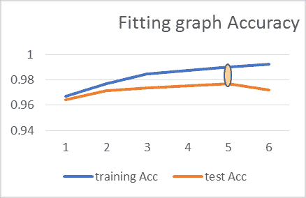

# 第三章：信号处理 - 使用神经网络进行数据分析

在掌握了大量关于神经网络的知识后，我们现在准备使用它们进行第一个操作。我们将从处理信号开始，并看看神经网络如何处理数据。您将会被增加神经元的层次和复杂性如何使问题看起来变得简单所迷住。然后，我们将看看如何处理语言。我们将使用数据集进行几次预测。

在本章中，我们将涵盖以下主题：

+   处理信号

+   将图像视作数字

+   向神经网络输入数据

+   张量的示例

+   建立模型

+   编译模型

+   在 Keras 中实现权重正则化

+   权重正则化实验

+   在 Keras 中实现 dropout 正则化

+   语言处理

+   互联网电影评论数据集

+   绘制单个训练实例的图表

+   独热编码

+   向量化特征

+   向量化标签

+   构建网络

+   回调

+   访问模型预测

+   逐特征归一化

+   使用 scikit-learn API 进行交叉验证

# 处理信号

宇宙中可能只存在四种基本力，但它们都是信号。所谓信号，是指我们对现实世界现象的各种特征表示。例如，我们的视觉世界充满了指示运动、颜色和形状的信号。这些是非常动态的信号，令人难以置信的是生物能够如此准确地处理这些刺激，即使我们这样说也是如此。当然，在更宏观的视角下，意识到自然已经花费了数亿年来完善这个配方，可能会让我们感到一点谦卑。但就目前而言，我们可以赞叹于人类视觉皮层的奇迹，这里配备有 1.4 亿个密集连接的神经元。事实上，存在一整套层次（V1 - V5），我们在进行日益复杂的图像处理任务时，信息就会通过这些层次传播。眼睛本身使用棒状和锥状细胞来检测不同的光强度和颜色模式，非常出色地将电磁辐射拼接在一起，并通过光转导将其转化为电信号。

当我们看一张图像时，我们的视觉皮层实际上是在解读眼睛将电磁信号转化为电信号并传递给它的特定配置。当我们听音乐时，我们的耳鼓，或称耳膜，仅仅是将一连串的振动信号转化并放大，以便我们的听觉皮层可以处理这些信号。实际上，大脑中的神经机制似乎非常高效，能够抽象和表征在不同现实世界信号中出现的模式。事实上，神经科学家们甚至发现一些哺乳动物的大脑具备重新连接的能力，这使得不同的皮层能够处理它们最初并未设计用来处理的数据类型。最值得注意的是，科学家们发现，通过重新连接雪貂的听觉皮层，这些生物能够处理来自大脑听觉区域的视觉信号，从而使它们能够使用先前用于听觉任务的非常不同的神经元来*“看见”*。许多科学家引用这些研究，提出大脑可能在使用一种主算法，能够处理任何形式的数据，并将其转化为高效的周围世界表征。

尽管这非常引人入胜，但它自然引发了更多关于神经学习的问题，而这些问题远远超出了我们在本书中能够解答的范围。可以说，不论是何种算法，或者一组算法，让我们的大脑实现如此高效的世界表征，都无疑是神经学家、深度学习工程师以及其他科学界人士所关注的重点。

# 表征学习

正如我们在 TensorFlow Playground 上进行感知机实验时看到的那样，一组人工神经元似乎能够学习相当简单的模式。这与我们人类能够执行并希望预测的复杂表征差距甚远。然而，我们可以看到，即使在它们刚刚起步的简单性中，这些网络似乎能够适应我们提供的数据类型，有时甚至超过其他统计预测模型的表现。那么，究竟发生了什么，让它与过去教机器为我们做事的方法如此不同呢？

教会计算机识别皮肤癌的样子非常有用，方法就是展示我们可能拥有的大量医学相关特征。事实上，这正是我们迄今为止对机器的方法。我们会手动设计特征，使机器能够轻松处理它们并生成相关的预测。但为何仅仅停留在这里呢？为什么不直接向计算机展示皮肤癌的实际*样子*呢？为什么不展示数百万张图片，让*它*自己弄清楚什么是相关的呢？事实上，这正是我们在谈论深度学习时所尝试做的。与传统的**机器学习**（**ML**）算法不同，在传统算法中，我们将数据以明确处理过的表示形式提供给机器学习，而在神经网络中，我们采取不同的方法。我们实际希望实现的目标是让网络自己学习这些表示。

如下图所示，网络通过学习简单的表示，并利用它们在连续的层中定义越来越复杂的表示，直到最终的层能够准确地表示输出类别：


事实证明，这种方法对教会计算机识别复杂的运动模式和面部表情非常有用，就像我们人类一样。比如你希望它在你不在时替你接收包裹，或者检测任何潜在的盗贼试图闯入你的房子。类似地，如果我们希望计算机为我们安排约会，找到市场上可能有利可图的股票，并根据我们感兴趣的内容更新信息，该怎么办呢？这样做需要处理复杂的图像、视频、音频、文本和时间序列数据，这些数据都以复杂的维度表示，无法仅凭几个神经元建模。那么，我们如何与神经学习系统合作，就像我们在上一章看到的那样？我们如何让神经网络学习眼睛、面部和其他现实世界物体中的复杂层次模式呢？显然的答案是让它们变得更大。但正如我们将看到的，这带来了自身的复杂性。长话短说，你在网络中放入的可学习参数越多，它记住一些随机模式的可能性就越大，因此它的泛化能力就越差。理想情况下，你希望神经元的配置能够完美地适应当前的学习任务，但在没有进行实验之前，几乎不可能事先确定这种配置。

# 避免随机记忆

另一个方法是，不仅操控神经元的总数，还要调整这些神经元之间的连接程度。我们可以通过技术手段来实现这一点，比如*dropout 正则化*和*加权参数*，稍后我们将详细了解。目前为止，我们已经看到了通过每个神经元在数据通过网络传播过程中可以执行的各种计算。我们还看到了大脑如何利用数亿个密集连接的神经元完成任务。然而，自然地，我们不能仅仅通过任意增加更多神经元来扩展我们的网络。简而言之，模拟接近大脑的神经结构，可能需要成千上万的**千万亿次运算**（petaflops，一种计算速度单位，等于每秒进行一千万亿（10¹⁵）次浮点运算）。也许在不久的将来，借助大规模并行计算范式，以及软件和硬件技术的其他进展，这将成为可能。不过，眼下，我们必须想出巧妙的方式来训练我们的网络，使其能够找到最有效的表示，而不会浪费宝贵的计算资源。

# 用数字表示信号

在本章中，我们将看到如何将神经元的序列层叠起来，逐步表示出越来越复杂的模式。我们还将看到像正则化和批量学习等概念，在最大化训练效果中是多么重要。我们将学会处理各种现实世界数据，包括图像、文本和时序相关信息。

# 图像作为数字

对于这样的任务，我们需要深度网络并拥有多个隐藏层，如果希望为我们的输出类别学习任何具有代表性的特征的话。我们还需要一个良好的数据集来练习我们的理解，并让自己熟悉我们将在设计智能系统时使用的工具。因此，我们迎来了第一个实际操作的神经网络任务，同时也将开始接触计算机视觉、图像处理和层次化表示学习的概念。我们当前的任务是教计算机读取数字，不是像它们已经做的那样读取 0 和 1，而是更像我们如何阅读由我们自己所写的数字。我们说的是手写数字，为此任务，我们将使用经典的 MNIST 数据集，深度学习数据集中的真正*hello world*。对于我们的第一个例子，选择它背后有着很好的理论和实践依据。

从理论的角度来看，我们需要理解如何使用层神经元来逐步学习更复杂的模式，正如我们的大脑所做的那样。由于我们的大脑大约有 2000 到 2500 年的训练数据，它在识别复杂符号（如手写数字）方面变得非常熟练。事实上，我们通常认为这是一项完全不费力的任务，因为我们从学前教育开始就学习如何区分这些符号。但实际上，这是一项非常艰巨的任务。想一想，不同的人写这些数字时可能会有如此巨大的变化，而我们的脑袋却能够分类这些数字，就像这并不是什么大事一样：


虽然穷举地编码明确的规则会让任何程序员发疯，但当我们看着前面的图像时，我们的大脑直觉地注意到数据中的一些模式。例如，它注意到**2**和**3**的顶部都有一个半圆圈，**1**、**4**和**7**都有一条向下的直线。它还感知到**4**实际上由一条向下的直线、一条半向下的线和另一条水平线组成。由于这个原因，我们能够轻松地将一个复杂的模式分解成更小的模式。这在手写数字上特别容易做到，正如我们刚才看到的那样。因此，我们的任务是看看如何构建一个深度神经网络，并希望每个神经元能够从我们的数据中捕捉简单的模式，例如线段，然后使用我们在前一层学到的简单模式，逐步构建更复杂的模式，并最终学习到与我们的输出类别相对应的准确表示组合。

从实际应用的角度来看，MNIST 数据集已经被深度学习领域的许多先驱研究了近二十年。从这个数据集中，我们获得了大量的知识，这使得它成为探索诸如层次表示、正则化和过拟合等概念的理想数据集。一旦我们理解了如何训练和测试神经网络，我们就可以将其用于更具挑战性的任务。

# 输入神经网络

本质上，所有进入并通过网络传播的数据都由一种数学结构——**张量**表示。这适用于音频数据、图像、视频以及我们能想到的任何数据，以供我们贪婪的数据网络使用。在数学中（[`en.wikipedia.org/wiki/Mathematics`](https://en.wikipedia.org/wiki/Mathematics)），张量被定义为一种抽象和任意的几何（[`en.wikipedia.org/wiki/Geometry`](https://en.wikipedia.org/wiki/Geometry)）实体，它以多线性（[`en.wikipedia.org/wiki/Linear_map`](https://en.wikipedia.org/wiki/Linear_map)）方式映射向量的聚合，得到一个结果张量。事实上，向量和标量被视为张量的简单形式。在 Python 中，张量定义有三个特定的属性，如下：

+   **秩**：具体来说，这表示轴的数量。一个矩阵的秩为 2，因为它表示一个二维张量。在 Python 库中，通常用`ndim`表示这一点。

+   **形状**：张量的形状可以通过调用 NumPy *n*维数组（在 Python 中张量的表示方式）上的 shape 属性来检查。这将返回一个整数元组，表示张量在每个轴上的维度数量。

+   **内容**：这指的是存储在张量中的数据类型，可以通过对感兴趣的张量调用`type()`方法来检查。这将返回诸如 float32、uint8、float64 等数据类型，字符串值除外，字符串会先转换成向量表示，再以张量形式表示。

以下是一个张量图。不要担心复杂的图表——我们稍后会解释它的含义：


# 张量示例

我们之前看到的插图是一个三维张量的示例，但张量可以以多种形式出现。在接下来的部分，我们将概述一些不同秩的张量，从零秩张量开始：

+   **标量**：标量表示单一的数值。它也可以被描述为一个维度为 0 的张量。一个例子是通过网络处理单一的灰度像素。

+   **向量**：一堆标量或一组数字被称为**向量**，或者是一个秩为 1 的张量。一个一维张量被认为有一个轴。一个例子是处理单一的平展图像。

+   **矩阵**：向量数组是一个矩阵，或者称为 2D 张量。矩阵有两个轴（通常称为行和列）。你可以将矩阵形象地解释为一个矩形的数字网格。一个例子是处理单一的灰度图像。

+   **三维张量**：通过将多个矩阵打包到一个新数组中，你得到一个 3D 张量，可以将其形象地解释为一个数字立方体。一个例子是处理一组灰度图像数据集。

+   **四维张量**：通过将 3D 张量打包到一个数组中，可以创建一个 4D 张量，依此类推。一个例子是处理彩色图像的数据集。

+   **五维张量**：这些是通过将 4D 张量打包到一个数组中创建的。一个例子是处理视频数据集。

# 数据的维度

所以，考虑一个形状为(400, 600, 3)的张量。这是一个常见的输入形状，表示一个 400 x 600 像素的彩色图像的三维张量。由于 MNIST 数据集使用的是二进制灰度像素值，我们在表示图像时只处理 28 x 28 像素的矩阵。在这里，每张图像是一个二维张量，整个数据集可以用一个三维张量表示。在彩色图像中，每个像素值实际上有三个数字，分别表示该像素的红、绿、蓝光强度。因此，在彩色图像中，用于表示图像的二维矩阵现在扩展为三维张量。这样的张量用(*x*, *y*, 3)的元组表示，其中*x*和*y*代表图像的像素维度。因此，彩色图像的数据集可以用一个四维张量表示，正如我们在后续示例中看到的那样。现在，了解我们可以使用 NumPy 的*n*维数组在 Python 中表示、重塑、操作和存储张量是很有用的。

# 导入一些库

那么，让我们开始吧！我们将通过利用前几章中学习的所有概念，进行一些简单的实验，或许在这个过程中也会遇到一些新的概念。我们将使用 Keras，以及 TensorFlow API，这也让我们可以探索即时执行模式。我们的第一个任务是实现一个简单版本的多层感知器。这个版本被称为**前馈神经网络**，它是一种基本的架构，我们可以用它来进一步探索一些简单的图像分类示例。遵循深度学习的传统，我们将通过使用 MNIST 数据集进行手写数字分类任务来开始我们的第一次分类任务。这个数据集包含 70,000 张 0 到 9 之间的灰度数字图像。这个数据集的规模非常适合，因为机器通常需要每个类别约 5,000 张图像，才能在视觉识别任务中接近人类水平的表现。以下代码导入了我们将使用的库：

```py
import numpy as np
import keras
from keras.datasets import mnist
from keras.utils import np_utils
```

# Keras 的顺序 API

如你所知，每个 Python 库通常都有一个核心数据抽象，定义了该库能够操作的数据结构，以执行计算。NumPy 有它的数组，而 pandas 有它的 DataFrame。Keras 的核心数据结构是模型，实际上它是一种组织相互连接的神经元层的方式。我们将从最简单的模型类型开始：顺序模型（[`keras.io/getting-started/sequential-model-guide/`](https://keras.io/getting-started/sequential-model-guide/)）。它作为一个线性堆叠的层通过顺序 API 提供。更复杂的架构也允许我们查看功能 API，它用于构建自定义层。稍后我们会讲解这些。以下代码导入了顺序模型，以及一些我们将用来构建第一个网络的层：

```py
from keras.models import Sequential
from keras.layers import Flatten, Dense, Dropout
from keras.layers.core import Activation
from keras import backend as K
```

# 加载数据

现在，让我们加载数据并进行拆分。幸运的是，MNIST 是 Keras 中已经实现的核心数据集之一，允许通过简洁的一行代码导入，并且还可以让我们将数据拆分为训练集和测试集。当然，现实世界中的数据没有那么容易移植和拆分。为此目的，有很多有用的工具存在于`Keras.utils`中，我们稍后会简要介绍，也鼓励你自己探索。此外，其他**ML**库（如 scikit-learn）也提供了一些方便的工具（如`train_test_split`、`MinMaxScaler`和`normalizer`等方法），这些工具顾名思义，能够帮助你根据需要拆分、缩放和归一化数据，以优化神经网络的训练。让我们导入并加载数据集，如下所示：

```py
from keras.datasets import mnist
(x_train, y_train),(x_test, y_test)= fashion_mnist.load_data()
```

# 检查维度

接下来，我们需要查看我们的数据是什么样子的。我们将通过检查其类型、形状，然后使用`matplotlib.pyplot`绘制单独的观察结果来实现这一点，如下所示：

```py
type(x_train[0]),x_train.shape,y_train.shape
```

你将得到以下结果：

```py
(numpy.ndarray, (60000, 28, 28), (60000,))

```

绘制点：

```py
import matplotlib.-pyplot as plt
%matplotlib inline
plt.show(x_train[0], cmap= plt.cm.binary)
<matplotlib.image.AxesImage at 0x24b7f0fa3c8>
```

这将绘制出类似于下图的图形：


如我们所见，我们的训练集有 60,000 张图片，每张图片由一个 28 x 28 的矩阵表示。当我们表示整个数据集时，实际上是表示一个三维张量（60,000 x 28 x 28）。现在，让我们重新缩放像素值，这些值通常在 0 到 225 之间。将这些值缩放到 0 到 1 之间，可以让我们的网络更容易进行计算和学习预测特征。我们建议你进行带有和不带有归一化的实验，这样你就可以评估预测能力的差异：

```py
x_train=keras.utils.normalize(x_train, axis=1)
x_test=keras.utils.normalize(x_test, axis=1)
plt.imshow(x_train[0], cmap=plt.cm.binary)
```

上述代码会生成以下输出：

```py
<matplotlib.image.AxesImage at 0x24b00003e48>
```

以下是获得的图形：


# 构建模型

现在我们可以继续构建我们的预测模型。但在进入有趣的代码之前，我们必须了解一些重要概念的理论。

# 引入 Keras 层

神经网络模型在 Keras 中的核心构建模块是其层。层基本上是数据处理过滤器，它们*扭曲*它们接收到的数据，将其转换为更有用的表示。正如我们将看到的，神经网络的主要架构通常在于层的设计方式和它们之间神经元的相互连接。Keras 的发明者 Francois Chollet 将这种架构描述为对我们的数据进行*渐进蒸馏*。让我们看看这是如何工作的：

```py
#Simple Feedforward Neural Network
model = Sequential()

#feeds in the image composed of 28  28 a pixel matrix as one sequence   
 of 784
model.add(Flatten(input_shape=(28,28)))
model.add(Dense(24, activation='relu'))
model.add(Dense(8, activation='relu'))
model.add(Dense(10, activation='softmax'))
```

我们通过初始化一个空的模型实例来定义我们的模型，这个实例没有任何层。然后，我们添加第一层，这一层总是期望一个输入维度，对应于我们希望其接收的数据大小。在我们的例子中，我们希望模型接收 28 x 28 像素的图像数据，正如我们之前定义的那样。我们添加的额外逗号表示网络一次将看到多少个样本，正如我们很快会看到的那样。我们还在输入矩阵上调用了`Flatten()`方法。这样做的作用是将每个 28 x 28 的图像矩阵转换为一个由 784 个像素值组成的单一向量，每个像素值对应于一个输入神经元。

我们继续添加层，直到到达输出层，该层具有与输出类别数量对应的输出神经元——在这种情况下，是介于 0 和 9 之间的 10 个数字。请注意，只有输入层需要指定输入数据的维度，因为逐步的隐藏层能够执行自动形状推断（并且仅是第一个层需要，后续层可以自动推断形状）。

# 初始化权重

我们还可以选择为每一层的神经元初始化特定的权重。这不是一个前提条件，因为如果没有特别指定，它们会被自动初始化为小的随机数。权重初始化的实践实际上是神经网络中的一个独立子领域。需要特别注意的是，网络的谨慎初始化可以显著加速学习过程。

你可以使用`kernel_initializer`和`bias_initializer`参数分别设置每一层的权重和偏置。记住，这些权重将代表我们网络所获得的知识，这就是为什么理想的初始化可以显著提升学习效率：

```py
#feeds in the image composed of 2828 as one sequence of 784
model.add(Flatten(input_shape=(28,28)))
model.add(Dense(64, activation='relu',   
          kernel_initializer='glorot_uniform',   
          bias_initializer='zeros'))
model.add(Dense(18, activation='relu'))
model.add(Dense(10, activation='softmax'))
```

对不同参数值的全面审查超出了本章的范围。我们以后可能会遇到一些需要调整这些参数的用例（请参阅优化章节）。`kernel_initializer`参数的一些值包括：

+   `glorot_uniform`：权重是从`-limit`和`limit`之间的均匀分布样本中提取的。这里，`limit`定义为`sqrt(6 / (fan_in + fan_out))`。术语`fan_in`表示权重张量中的输入单元数量，而`fan_out`表示权重张量中的输出单元数量。

+   `random_uniform`: 权重被随机初始化为-0.05 到 0.05 之间的小的均匀值。

+   `random_normal`: 权重按高斯分布初始化[1]，均值为 0，标准差为 0.05。

+   `zero`: 层的权重初始化为零。

# Keras 激活函数

目前，我们的网络由一个扁平化的输入层组成，接着是两层全连接的密集层，这些都是神经元的完全连接层。前两层使用**修正线性单元**（**ReLU**）激活函数，其图形绘制方式与我们在第二章《深入神经网络》一章中看到的 Sigmoid 函数有所不同。在以下的图示中，你可以看到 Keras 提供的一些不同激活函数的绘制方式。记住，在它们之间进行选择需要直观理解可能的决策边界，这些边界可能有助于或妨碍你的特征空间划分。某些情况下，使用合适的激活函数并与理想初始化的偏置一起使用可能至关重要，但在其他情况下则可能无关紧要。总之，建议进行实验，尽可能不留任何未尝试的方案：


我们模型中的第四层（也是最后一层）是一个 10 类 Softmax 层。在我们的例子中，这意味着它将返回一个包含十个概率值的数组，所有这些值的总和为 1。每个概率值表示当前数字图像属于我们输出类别之一的概率。因此，对于任何给定的输入，Softmax 激活函数层会计算并返回该输入相对于每个输出类别的类别概率。

# 以视觉方式总结模型

回到我们的模型，让我们总结一下我们即将训练的输出。在 Keras 中，你可以通过在模型上使用`summary()`方法来做到这一点，这实际上是一个更长的`utility`函数的快捷方式（因此更难记住），其代码如下：

```py
keras.utils.print_summary(model, line_length=None, positions=None,     
                          print_fn=None)
```

使用这个，你实际上可以可视化神经网络各个层的形状，以及每一层的参数：

```py
model.summary()
```

上述代码生成了以下输出：

```py
_________________________________________________________________
Layer (type) Output Shape Param # 
=================================================================
flatten_2 (Flatten) (None, 784) 0 
_________________________________________________________________
dense_4 (Dense) (None, 1024) 803840 
_________________________________________________________________
dense_5 (Dense) (None, 28) 28700 
_________________________________________________________________
dense_6 (Dense) (None, 10) 290 
=================================================================
Total params: 832,830
Trainable params: 832,830
Non-trainable params: 0
_________________________________________________________________
```

如你所见，与我们在第二章《深入神经网络》一章中看到的感知机不同，这个极其简单的模型已经有了 51,600 个可训练的参数，相比其前身，几乎可以以指数级的速度扩展其学习能力。

# 编译模型

接下来，我们将编译我们的 Keras 模型。编译基本上指的是神经网络的学习方式。它让你亲自控制实现学习过程，这通过调用`model`对象的`compile`方法来完成。该方法至少需要三个参数：

```py
model.compile(optimizer='resprop', #'sgd'
              loss='sparse_categorical_crossentropy',
              metrics=['accuracy'])
```

这里，我们描述以下函数：

+   **A** `loss` **function**：这只是用来衡量我们在训练数据上的表现，与真实输出标签进行比较。因此，`loss` 函数可以作为我们模型错误的指示。如我们之前所见，这个度量实际上是一个函数，用来确定我们的模型预测与实际输出类标签之间的差距。我们在第二章，*深入探讨神经网络*中看到了**均方误差**（**MSE**）`loss` 函数，存在许多不同的变体。这些 `loss` 函数在 Keras 中被实现，具体取决于我们的**ML**任务的性质。例如，如果你希望执行二分类（两个输出神经元代表两个输出类别），你最好选择二元交叉熵。对于两个以上的类别，你可以尝试分类交叉熵或稀疏分类交叉熵。前者用于你的输出标签是独热编码的情况，而后者则用于你的输出类是数值型类别变量的情况。对于回归问题，我们通常建议使用 MSE `loss` 函数。处理序列数据时，正如我们稍后将讨论的那样，**连接时序分类**（**CTC**）被认为是更合适的`loss`函数。其他类型的 `loss` 可能在衡量预测与实际输出标签之间的距离方式上有所不同（例如，`cosine_proximity` 使用余弦距离度量），或者选择不同的概率分布来建模预测值（例如，**泊松损失函数**，如果你处理的是计数数据，可能更合适）。

+   **An** `optimizer`：直观地看，优化器可以理解为告诉网络如何达到全局最小损失。这包括你希望优化的目标，以及它将在朝着目标的方向上采取的步长。技术上讲，优化器通常被描述为网络用于自我更新的机制，网络通过使用它所接收的数据和 `loss` 函数来进行自我更新。优化算法用于更新权重和偏差，这些是模型的内部参数，用于在误差减少过程中进行调整。实际上，优化函数有两种不同的类型：具有恒定学习率的函数（如**随机梯度下降**（**SGD**））和具有自适应学习率的函数（如 Adagrad、Adadelta、RMSprop 和 Adam）。后者因实现基于启发式和预设学习率方法而闻名。因此，使用自适应学习率可以减少调整模型超参数的工作量。

+   `metrics`：这仅表示我们在训练和测试期间监控的评估基准。最常用的是准确度，但如果您愿意，您也可以通过 Keras 设计并实现自定义度量。损失和准确度评分之间的主要功能差异在于，准确度度量完全不参与训练过程，而损失则直接在训练过程中由优化器用来反向传播误差。

# 拟合模型

`fit` 参数启动训练过程，因此它可以被认为是训练模型的同义词。它接受您的训练特征、对应的训练标签、模型查看数据的次数，以及每次训练迭代中模型看到的学习示例数量，作为训练度量标准：

```py
model.fit(x_train, y_train, epochs=5, batch_size = 2) #other arguments   
                            validation split=0.33, batch_size=10
```

您还可以添加额外的参数来打乱数据、创建验证集划分或为输出类别分配自定义权重。在每个训练周期前打乱训练数据很有用，特别是可以确保模型不会学习到数据中的任何随机非预测性序列，从而仅仅过拟合训练集。要打乱数据，您必须将 `shuffle` 参数的布尔值设置为 **True**。最后，自定义权重对于数据集中类别分布不均的情况特别有用。设置较高的权重相当于告诉模型，*嘿，你，更多关注这些示例*。要设置自定义权重，您必须提供 `class_weight` 参数，传递一个字典，将类别索引映射到与输出类别对应的自定义权重，按照提供的索引顺序。

以下是编译模型时会面临的关键架构决策概览。这些决策与您指示模型执行的训练过程相关：

+   `epochs`：该参数必须定义为整数值，对应模型将遍历整个数据集的次数。从技术上讲，模型并不会根据 `epochs` 给出的迭代次数进行训练，而仅仅是直到达到 `epochs` 索引的周期为止。您希望将此参数设置为 *恰到好处*，具体取决于您希望模型表现的复杂性。如果设置过低，将导致用于推理的简化表示，而设置过高则会导致模型在训练数据上过拟合。

+   `batch_size`：`batch_size` 定义了每次训练迭代中，通过网络传播的样本数量。从直观上讲，这可以被看作是网络在学习时一次性看到的示例数量。在数学上，这只是网络在更新模型权重之前将看到的训练实例的数量。到目前为止，我们一直是在每个训练样本后更新模型权重（即 `batch_size` 为 1），但这种做法很快会成为计算和内存管理的负担。当数据集过大，甚至无法加载到内存中时，尤其如此。设置 `batch_size` 可以防止这种情况。神经网络在小批量上训练得也更快。事实上，批量大小甚至会影响我们在反向传播过程中梯度估计的准确性，正如下图所示。同一网络使用三种不同的批量大小进行训练。随机表示随机梯度，或批量大小为 1。如你所见，相比于较大完整批量梯度（蓝色），随机和小批量梯度（绿色）的方向波动要大得多：


+   **迭代次数**（无需显式定义）仅表示通过的次数，每次通过包含由 `batch_size` 定义的训练示例数量。明确来说，一次通过是指数据通过我们的各层进行正向过滤，同时进行反向传播误差。假设我们将批量大小设置为 32。一次迭代包含模型查看 32 个训练示例，然后相应地更新其权重。在一个包含 64 个示例的数据集中，如果批量大小为 32，模型需要进行两次迭代才能遍历完所有数据。

现在我们已经调用了 `fit` 方法来初始化学习过程，我们将观察输出，输出显示每个 epoch 的估计训练时间、损失（错误）和训练数据的准确性：

```py
Epoch 1/5
60000/60000 [==========] - 12s 192us/step - loss: 0.3596 - acc: 0.9177
Epoch 2/5
60000/60000 [==========] - 10s 172us/step - loss: 0.1822 - acc: 0.9664
Epoch 3/5
60000/60000 [==========] - 10s 173us/step - loss: 0.1505 - acc: 0.9759
Epoch 4/5
60000/60000 [==========] - 11s 177us/step - loss: 0.1369 - acc:  
                           0.97841s - loss: 
Epoch 5/5
60000/60000 [==========] - 11s 175us/step - loss: 0.1245 - acc: 0.9822
```

在数据集完整训练五次后，我们在训练过程中达到了 0.96（96.01%）的准确率。现在，我们必须通过在模型之前未见过的隔离测试集上进行测试，来验证我们的模型是否真的学到了我们想要它学习的内容：

```py
model.evaluation(x_test, y_test)

10000/10000 [==============================] - 1s 98us/step
[0.1425468367099762, 0.9759]
```

# 评估模型性能

每当我们评估一个网络时，我们实际上关心的是它在测试集上分类图像的准确性。这对于任何机器学习模型都是适用的，因为在训练集上的准确率并不能可靠地反映我们模型的泛化能力。

在我们的案例中，测试集的准确率是 95.78%，略低于我们训练集的 96%。这是典型的过拟合案例，我们的模型似乎捕捉到了数据中的无关噪声，用来预测训练图像。由于这种固有的噪声在我们随机选择的测试集上不同，因此我们的网络无法依赖之前所捕捉到的无用表示，因此在测试时表现不佳。正如我们将在本书中看到的那样，测试神经网络时，确保它已经学习到正确且高效的数据表示是非常重要的。换句话说，我们需要确保我们的网络没有在训练数据上过拟合。

顺便提一下，你可以通过打印出给定测试对象的最高概率值的标签，并使用 Matplotlib 绘制该测试对象，来始终可视化你的预测结果。在这里，我们打印出了测试对象`110`的最大概率标签。我们的模型认为它是一个`8`。通过绘制该对象，我们可以看到我们的模型在这个案例中是正确的：

```py
predictions= load_model.predict([x_test])

#predict use the inference graph generated in the model to predict class labels on our test set
#print maximum value for prediction of x_test subject no. 110)

import numpy as np
print(np.argmax(predictions[110]))
-------------------------------------------
8
------------------------------------------
plt.imshow(x_test[110]))
<matplotlib.image.AxesImage at 0x174dd374240>

```

上述代码生成了以下输出：


一旦满意，你可以保存并加载模型以备后用，如下所示：

```py
model.save('mnist_nn.model')
load_model=kera.models.load_model('mnist_nn.model')
```

# 正则化

那么，你可以做些什么来防止模型从训练数据中学习到误导性或无关的模式呢？对于神经网络来说，最好的解决方案几乎总是获取更多的训练数据。一个训练在更多数据上的模型，确实会让你的模型在外部数据集上具有更好的预测能力。当然，获取更多数据并不总是那么简单，甚至有时是不可能的。在这种情况下，你还有其他几种技术可以使用，以达到类似的效果。其一是约束你的模型在可存储信息的数量方面。正如我们在第一章《神经网络概述》中看到的*敌后*例子，找到最有效的信息表示，或者具有最低熵的表示是非常有用的。类似地，如果我们只能让模型记住少量的模式，实际上是在强迫它找到最有效的表示，这些表示能更好地推广到我们模型未来可能遇到的其他数据上。通过减少过拟合来提高模型的泛化能力的过程被称为**正则化**，我们将在实际使用之前更详细地讲解它。

# 调整网络大小

当我们谈论一个网络的规模时，我们指的是网络中可训练参数的数量。这些参数由网络中的层数以及每层的神经元数量决定。本质上，网络的规模是其复杂性的度量。我们曾提到，网络规模过大会适得其反，导致过拟合。直观地理解这一点，我们应该倾向于选择更简单的表示方式，而不是复杂的，只要它们能够实现相同的目标——可以说，这是一种*简约法则*。设计此类学习系统的工程师确实是深思熟虑的。这里的直觉是，你可以根据网络的深度和每层的神经元数量，采用多种数据表示方式，但我们将优先选择更简单的配置，只有在需要时才会逐步扩大网络规模，以防它利用过多的学习能力去记忆随机性。然而，让模型拥有过少的参数可能导致欠拟合，使其忽视我们试图在数据中捕捉的潜在趋势。通过实验，你可以找到一个适合的网络规模，具体取决于你的应用场景。我们迫使网络在表示数据时保持高效，使其能够更好地从训练数据中进行泛化。下面，我们展示了一些实验，过程中调整了网络的规模。这让我们可以比较在每个周期中验证集上的损失变化。如我们所见，较大的模型更快地偏离最小损失值，并几乎立刻开始在训练数据上发生过拟合：


# 网络规模实验

现在我们将通过改变网络的规模并评估我们的表现，进行一些简短的实验。我们将在 Keras 上训练六个简单的神经网络，每个网络的规模都逐渐增大，以观察这些独立的网络如何学习分类手写数字。我们还将展示一些实验结果。所有这些模型都使用固定的批次大小（`batch_size=100`）、`adam`优化器和`sparse_categorical_crossentropy`作为`loss`函数进行训练，目的是为了本次实验。

以下拟合图展示了增加我们神经网络的复杂度（从规模上来说）如何影响我们在训练集和测试集上的表现。请注意，我们的目标始终是寻找一个模型，使训练和测试准确度/损失之间的差异最小化，因为这表明过拟合的程度最小。直观来说，这只是向我们展示了如果分配更多神经元，我们的网络学习会有多大的好处。通过观察测试集上准确度的提升，我们可以看到，添加更多神经元确实有助于我们的网络更好地分类它从未遇到过的图像。直到*最佳点*，即训练和测试值最接近的地方，这一点可以被注意到。然而，最终，复杂度的增加将导致边际效益递减。在我们的案例中，模型似乎在丢弃率约为 0.5 时最少发生过拟合，之后训练和测试集的准确度开始出现分歧：

   

为了通过增加网络的规模来复制这些结果，我们可以调整网络的宽度（每层的神经元数量）和深度（网络的层数）。在 Keras 中，增加网络的深度是通过使用 `model.add()` 向初始化的模型中添加层来完成的。`add` 方法的参数是层的类型（例如，`Dense()`）。`Dense` 函数需要指定该层中要初始化的神经元数量，以及为该层使用的激活函数。以下是一个例子：

```py
model.add(Dense(512,  activation=’softmax’))
```

# 正则化权重

另一种确保网络不会拾取无关特征的方法是通过正则化我们模型的权重。这使得我们能够通过限制层权重只取小值，来对网络的复杂度施加约束。这样做的结果就是使得层权重的分布更加规则。我们是怎么做到这一点的？通过简单地将成本添加到我们网络的`loss`函数中。这个成本实际上代表了对权重大于正常值的神经元的惩罚。传统上，我们通过三种方式来实现这种成本，分别是 L1、L2 和弹性网正则化：

+   **L1 正则化**：我们添加一个与加权系数的绝对值成正比的成本。

+   **L2 正则化**：我们添加一个与加权系数的平方成正比的成本。这也被称为**权重衰减**，因为如果没有其他更新计划，权重将会指数衰减为零。

+   **弹性网正则化**：这种正则化方法通过同时使用 L1 和 L2 正则化的组合，帮助我们捕获模型的复杂性。

# 使用丢弃层

最后，将 dropout 神经元添加到层中是一种广泛应用的技术，用于正则化神经网络并防止过拟合。在这里，我们实际上是随机地从模型中丢弃一些神经元。为什么这么做？其实，这带来了双重效用。首先，这些神经元对网络中更深层神经元激活的贡献会在前向传播过程中被随机忽略。其次，在反向传播过程中，任何权重调整都不会应用到这些神经元。尽管这一做法看起来有些奇怪，但背后其实有合理的直觉。从直觉上讲，神经元的权重在每次反向传播时都会进行调整，以专门化处理训练数据中的特定特征。但这种专门化会带来依赖关系。最终的结果往往是，周围的神经元开始依赖于某个附近神经元的专门化，而不是自己进行一些表征性工作。这种依赖模式通常被称为复杂共适应（complex co-adaptation），这是**人工智能**（**AI**）研究人员创造的一个术语。其中之一就是 Geoffrey Hinton，他是反向传播论文的原始合著者，并被广泛称为深度学习的教父。Hinton 幽默地将这种复杂共适应的行为描述为神经元之间的*阴谋*，并表示他受到银行防欺诈系统的启发。这个银行不断轮换员工，因此每当 Hinton 访问银行时，他总是会遇到不同的人在柜台后面。

# 直观理解 dropout

如果你熟悉 Leonardo DiCaprio 的电影 *Catch me if you can*，你一定记得他是如何通过约会和请银行工作人员吃点心来迷住他们，结果却通过兑现伪造的航空公司支票来欺诈银行。事实上，由于员工们与 DiCaprio 角色的频繁交往，他们开始更加关注一些无关的特征，比如 DiCaprio 的魅力。实际上，他们应该注意的是，DiCaprio 每月兑现工资支票的次数超过了三次。无需多说，商界通常不会如此宽松。丢弃一些神经元就像是轮换它们，确保没有任何神经元懒惰，并让一个滑头的 Leonardo 欺诈你的网络。

当我们向一层应用 dropout 时，我们只是丢弃了它本应输出的一部分结果。假设一层对给定输入的输出是向量 [3, 5, 7, 8, 1]。如果我们给这个层添加一个 dropout 比例（0.4），则该输出将变为 [0, 5, 7, 0, 1]。我们所做的只是将向量中 40% 的标量初始化为零。

Dropout 仅在训练过程中发生。在测试过程中，使用过 dropout 的层会将其输出按先前使用的 dropout 比例缩小。这实际上是为了调整测试时比训练时更多神经元激活的情况，因为 dropout 机制的存在。

# 在 Keras 中实现权重正则化

到目前为止，我们已经探讨了三种特定方法的理论，这些方法可以提高我们模型在未见数据上的泛化能力。首先，我们可以改变网络大小，确保其没有额外的学习能力。我们还可以通过初始化加权参数来惩罚低效的表示。最后，我们可以添加 dropout 层，防止网络变得懒散。如前所述，看得见才相信。

现在，让我们通过 MNIST 数据集和一些 Keras 代码来实现我们的理解。如前所述，要改变网络的大小，您只需要更改每层的神经元数量。这可以在 Keras 中通过添加层的过程来完成，如下所示：

```py
import keras.regularizers
model=Sequential()
model.add(Flatten(input_shape=(28, 28)))
model.add(Dense(1024, kernel_regularizer=  
                      regularizers.12(0.0001),activation ='relu'))
model.add(Dense(28, kernel_regularizer=regularizers.12(0.0001), 
          activation='relu'))
model.add(Dense(10, activation='softmax'))
```

# 权重正则化实验

简单来说，正则化器让我们在优化过程中对层参数施加惩罚。这些惩罚被纳入网络优化的 `loss` 函数中。在 Keras 中，我们通过将 `kernel_regularizer` 实例传递给层来正则化层的权重：

```py
import keras.regularizers
model=Sequential()
model.add(Flatten(input_shape=(28,28)))
model.add(Dense(1024, kernel_regularizer=regularizers.12(0.0001), 
          activation='relu'))
model.add(Dense(10, activation='softmax'))
```

如前所述，我们对每一层都添加了 L2 正则化，alpha 值为（0.0001）。正则化器的 alpha 值表示在将其添加到网络总损失之前，应用于层的权重矩阵中每个系数的变换。实质上，alpha 值用于将每个系数与它相乘（在我们的例子中是 0.0001）。Keras 中的不同正则化器可以在 `keras.regularizers` 中找到。下图展示了正则化如何影响两个相同大小模型每个 epoch 的验证损失。我们可以看到，正则化后的模型更不容易过拟合，因为验证损失在时间的变化中没有显著增加。而没有正则化的模型则完全不是这样，经过大约七个 epoch 后，模型开始过拟合，因此在验证集上的表现变差：


# 在 Keras 中实现 dropout 正则化

在 Keras 中，添加一个 dropout 层也是非常简单的。你只需要再次使用 `model.add()` 参数，然后指定一个 dropout 层（而不是我们一直使用的全连接层）来进行添加。Keras 中的 `Dropout` 参数是一个浮动值，表示将被丢弃的神经元预测的比例。一个非常低的 dropout 率可能无法提供我们所需的鲁棒性，而一个高 dropout 率则意味着我们的网络容易遗忘，无法记住任何有用的表示。我们再次努力寻找一个恰到好处的 dropout 值；通常，dropout 率设定在 0.2 到 0.4 之间：

```py
#Simple feed forward neural network
model=Sequential()

#feeds in the image composed of 28  28 a pixel matrix as one sequence of 784
model.add(Flatten(input_shape=(28,28)))
model.add(Dense(1024, activation='relu'))
model.add(Dropout(0.3)
model.add(Dense(28, activation='relu'))
model.add(Dense(10, activation='softmax'))
```

# Dropout 正则化实验

以下是我们使用相同大小的网络进行的两个实验，采用不同的 dropout 率，以观察性能上的差异。我们从 0.1 的 dropout 率开始，逐渐增加到 0.6，以查看这对我们识别手写数字的性能有何影响。正如下图所示，增加 dropout 率似乎减少了过拟合，因为模型在训练集上的表面准确度逐渐下降。我们可以看到，在 dropout 率接近 0.5 时，我们的训练准确度和测试准确度趋于收敛，之后它们出现了分歧行为。这简单地告诉我们，网络似乎在添加 dropout 率为 0.5 的层时最不容易过拟合：


# 复杂性与时间

现在，你已经看到了我们减少过拟合的一些最突出技巧，都是通过正则化实现的。本质上，正则化就是控制我们网络复杂度的一种方式。控制复杂度不仅仅是限制网络记忆随机性的手段，它还带来了更多直接的好处。从本质上讲，更复杂的网络在计算上代价更高。它们需要更长的训练时间，因此消耗更多资源。虽然在处理当前任务时这种差异几乎可以忽略不计，但它仍然是显著的。下图是一个时间复杂度图。这是一种将训练时间与网络复杂度之间的关系可视化的有用方式。我们可以看到，网络复杂度的增加似乎对每次训练迭代所需的平均时间的增加产生了近乎指数的影响：


# MNIST 总结

到目前为止，在我们的学习旅程中，你已经了解了支配神经网络功能的基本学习机制和过程。你了解到，神经网络需要输入数据的张量表示才能进行预测性处理。你还学习了我们世界中不同类型的数据，如图像、视频、文本等，如何表示为* n *维的张量。此外，你学会了如何在 Keras 中实现一个顺序模型，该模型基本上让你构建一层层相互连接的神经元。你使用这个模型结构，构建了一个简单的前馈神经网络，用于分类手写数字的 MNIST 数据集。在此过程中，你了解了在模型开发的每个阶段需要考虑的关键架构决策。

在模型构建过程中，主要的决策是定义数据的正确输入大小，选择每一层的相关激活函数，以及根据数据中输出类别的数量来定义最后一层的输出神经元数量。在编译过程中，你需要选择优化技术、`loss` 函数和监控训练进展的度量标准。然后，你通过使用 `.fit()` 参数启动了新模型的训练会话，并传递了最后两个架构决策，作为启动训练过程之前必须做出的决定。这些决策涉及数据一次性处理的批次大小，以及训练模型的总轮数。

最后，你学会了如何测试预测结果，并了解了正则化这一关键概念。我们通过实验不同的正则化技术来修改模型的大小、层权重，并添加丢弃层，从而帮助我们提高模型对未见数据的泛化能力。最后，我们发现，除非任务的性质明确要求，否则增加模型复杂度是不利的：

+   **练习 x**：初始化不同的加权参数，观察这如何影响模型的表现

+   **练习 y**：初始化每一层的不同权重，观察这如何影响模型的表现

# 语言处理

到目前为止，我们已经看到如何在 Keras 上训练一个简单的前馈神经网络来进行图像分类任务。我们还看到如何将图像数据数学地表示为一个高维几何形状，也就是一个张量。我们了解到，较高阶的张量实际上是由较低阶的张量组成的。像素聚集在一起，代表一个图像，而图像又聚集在一起，代表一个完整的数据集。从本质上讲，每当我们想要利用神经网络的学习机制时，我们都有一种方法来将训练数据表示为一个张量。那么语言呢？我们如何像通过语言表达一样，将人类的思想及其复杂性表示出来？你猜对了——我们将再次使用数字。我们将简单地将由句子组成的文本（而句子又由单词组成）翻译成数学的通用语言。这是通过一种被称为**向量化**的过程完成的，在我们的任务中，我们将通过使用**互联网电影数据库**（**IMDB**）数据集来亲身体验这一过程。

# 情感分析

随着我们的计算能力逐年提升，我们开始将计算技术应用于以前仅由语言学家和定性学者频繁涉足的领域。事实证明，最初被认为太耗时的任务，随着处理器性能的提升，变成了计算机优化的理想对象。这导致了计算机辅助文本分析的爆炸式增长，不仅在学术界，而且在工业界也得到了广泛应用。像计算机辅助情感分析这样的任务，在各种应用场景中尤其有益。如果你是一家企业，试图跟踪在线客户评论，或者是一个雇主，想要进行社交媒体平台上的身份管理，这项技术都可以派上用场。事实上，甚至连政治竞选活动也越来越多地咨询那些监测公共情感并对各种政治话题进行舆情挖掘的服务。这帮助政治人物准备他们的竞选要点，理解公众的普遍情绪。尽管这种技术的使用可能颇具争议，但它可以极大地帮助组织了解其产品、服务和营销策略中的缺陷，同时以更符合受众需求的方式进行调整。

# 互联网电影评论数据集

最简单的情感分析任务是判断一段文本是否代表正面或负面的观点。这通常被称为 *极性* 或 *二元情感分类任务*，其中 0 代表负面情感，1 代表正面情感。当然，我们也可以有更复杂的情感模型（也许使用我们在 第一章 中看到的五大人格指标，*神经网络概述*），但目前我们将专注于这个简单但概念上充实的二元示例。这个示例指的是从互联网电影数据库 IMDB 分类电影评论。

IMDB 数据集包含 50,000 条二进制评论，正负情感评论数量均等。每条评论由一个整数列表组成，每个整数代表该评论中的一个词汇。同样，Keras 的守护者们贴心地为练习提供了这个数据集，因此可以在 Keras 的 `keras.datasets` 中找到。我们鼓励你享受通过 Keras 导入数据的过程，因为我们在以后的练习中不会再这样做（在现实世界中你也无法做到）：

```py
import keras
from keras.datasets import imdb
(x_train,y_train), (x_test,y_test)=imdb.load_data(num_words=12000)
```

# 加载数据集

就像我们之前所做的，我们通过定义训练实例和标签，以及测试实例和标签来加载数据集。我们可以使用 `imdb` 上的 `load_data` 参数将预处理后的数据加载到 50/50 的训练-测试拆分中。我们还可以指定我们想要保留在数据集中的最常见词汇数量。这帮助我们控制任务的固有复杂性，同时处理合理大小的评论向量。可以安全地假设，评论中出现的稀有词汇与给定电影的特定主题相关，因此它们对该评论的 *情感* 影响较小。因此，我们将词汇量限制为 12,000 个。

# 检查形状和类型

你可以通过检查 `x_train` 的 `.shape` 参数来查看每个数据拆分的评论数量，它本质上是一个 *n* 维的 NumPy 数组：

```py
x_train.shape, x_test.shape, type(x_train)
((25000,), (25000,), numpy.ndarray)
```

# 绘制单个训练实例

正如我们所见，有 25,000 个训练和测试样本。我们还可以绘制一个单独的训练样本，看看如何表示单个评论。在这里，我们可以看到每条评论仅包含一个整数列表，每个整数对应词汇表中的一个单词：

```py
x_train[1]

[1,
 194,
 1153,
 194,
 8255,
 78,
 228,
 5,
 6,
 1463,
 4369,
 5012,
 134,
 26,
 4,
 715,
 8,
 118,
 1634,
 14,
 394,
 20,
 13,
 119,
 954,
```

# 解码评论

如果你感到好奇（我们也很感兴趣），我们当然可以映射出这些数字所对应的确切单词，以便我们能够读懂评论的实际内容。为了做到这一点，我们必须备份我们的标签。虽然这一步不是必需的，但如果我们希望稍后直观验证网络的预测结果，这将非常有用：

```py
#backup labels, so we can verify our networks prediction after vectorization
xtrain = x_train
xtest = x_test
```

然后，我们需要恢复与整数对应的单词，这些整数表示了评论，我们之前已经看到过。用于编码这些评论的单词字典包含在 IMDB 数据集中。我们将简单地将其恢复为`word_index`变量，并反转其存储顺序。这基本上允许我们将每个整数索引映射到其对应的单词：

```py
word_index =imdb.get_word_index()
reverse_word_index = dict([(value, key) for (key, value) in word_index.items()])
```

以下函数接受两个参数。第一个参数（`n`）表示一个整数，指代数据集中第 n 条评论。第二个参数定义该 n 条评论是否来自训练数据或测试数据。然后，它简单地返回我们指定的评论的字符串版本。

这允许我们读取评论者实际写的内容。如我们所见，在我们的函数中，我们需要调整索引的位置，偏移了三个位置。这仅仅是 IMDB 数据集的设计者选择实现其编码方案的方式，因此对于其他任务来说，这并不具有实际意义。这个偏移量之所以存在，是因为位置 0、1 和 2 分别被填充、表示序列的开始和表示未知值的索引占据：

```py
def decode_review(n, split= 'train'):
if split=='train':
    decoded_review=' '.join([reverse_word_index.get(i-3,'?')for i in 
                   ctrain[n]])
elif split=='test':
    decoded_review=' '.join([reverse_word_index.get(i-3,'?')for i in   
                   xtest[n]])
return decoded_review
```

使用这个函数，我们可以解码来自训练集中的第五条评论，如下代码所示。结果表明，这是一条负面评论，正如其训练标签所示，并通过其内容推断得出。请注意，问号仅仅是未知值的指示符。未知值可能会自然出现在评论中（例如由于使用了表情符号），或者由于我们施加的限制（即，如果一个词不在前 12,000 个最常见的单词中，如前所述）：

```py
print('Training label:',y_train[5])
decode_review(5, split='train'),
Training label: 0.0
```

# 数据准备

那么，我们在等什么呢？我们有一系列数字表示每条电影评论及其对应的标签，表示（1）为正面评论或（0）为负面评论。这听起来像是一个经典的结构化数据集，那么为什么不开始将其输入网络呢？实际上，事情并没有那么简单。我们之前提到过，神经网络有一个非常特定的“饮食”。它们几乎是*张量食者*，所以直接喂给它们一个整数列表并不会有什么效果。相反，我们必须将数据集表示为一个*n*维的张量，才能尝试将其传递给网络进行训练。目前，你会注意到，每条电影评论都是由一个单独的整数列表表示的。自然地，这些列表的大小不同，因为有些评论比其他评论短。另一方面，我们的网络要求输入特征的大小相同。因此，我们必须找到一种方法来*填充*评论，使它们的表示向量长度相同。

# 独热编码

由于我们知道整个语料库中最多有 12,000 个独特的词汇，我们可以假设最长的评论只能有 12,000 个单词。因此，我们可以将每个评论表示为一个长度为 12,000 的向量，包含二进制值。这个怎么操作呢？假设我们有一个包含两个单词的评论：*bad* 和 *movie*。我们数据集中包含这些词汇的列表可能看起来像是[6, 49]。相反，我们可以将这个相同的评论表示为一个 12,000 维的向量，除了索引 6 和 49，其余位置为 0，6 和 49 的索引位置则是 1。你所做的基本上是创建 12,000 个虚拟特征来表示每个评论。这些虚拟特征代表了给定评论中 12,000 个词汇的存在或不存在。这个方法也被称为**独热编码**（one-hot encoding）。它通常用于在各种深度学习场景中对特征和类别标签进行编码。

# 向量化特征

以下函数将接收我们的 25,000 个整数列表的训练数据，每个列表都是一个评论。它将返回每个它从训练集收到的整数列表的独热编码向量。然后，我们简单地使用这个函数将整数列表转换成一个 2D 张量的独热编码评论向量，从而重新定义我们的训练和测试特征：

```py
import numpy as np
def vectorize_features(features):

#Define the number of total words in our corpus 
#make an empty 2D tensor of shape (25000, 12000)
dimension=12000
review_vectors=np.zeros((len(features), dimension))

#interate over each review 
#set the indices of our empty tensor to 1s
for location, feature in enumerate(features):
    review_vectors[location, feature]=1
return review_vectors

x_train = vectorize_features(x_train)
x_test = vectorize_features(x_test)
```

你可以通过检查训练特征和标签的类型和形状来查看我们的转换结果。你还可以检查一个单独向量的样子，如下代码所示。我们可以看到，每个评论现在都是一个长度为`12000`的向量：

```py
type(x_train),x_train.shape, y_train.shape
(numpy.ndarray, (25000, 12000), (25000,))

x_train[0].shape, x_train[0]
((12000,), array([0., 1., 1., ..., 0., 0., 0.]), 12000)
```

# 向量化标签

我们还可以向量化我们的训练标签，这有助于我们的网络更好地处理数据。你可以把向量化看作是以一种高效的方式将信息表示给计算机。就像人类不擅长使用罗马数字进行计算一样，计算机在处理未向量化的数据时也常常力不从心。在以下代码中，我们将标签转换为包含 32 位浮动点值 0.0 或 1.0 的 NumPy 数组：

```py
y_train= np.asarray(y_train).astype('float32')
y_test = np.asarray(y_test).astype('float32')
```

最终，我们得到了张量，准备好被神经网络使用。这个 2D 张量本质上是 25,000 个堆叠的向量，每个向量都有自己的标签。剩下的就是构建我们的网络。

# 构建网络

在使用密集层构建网络时，必须考虑的第一个架构约束是其深度和宽度。然后，你需要定义一个具有适当形状的输入层，并依次选择每一层要使用的激活函数。

就像我们为 MNIST 示例所做的那样，我们简单地导入了顺序模型和密集层结构。然后，我们通过初始化一个空的顺序模型，并逐步添加隐藏层，直到达到输出层。请注意，我们的输入层总是需要特定的输入形状，对于我们来说，这对应于我们将要馈送的 12,000 维度的独热编码向量。在我们当前的模型中，输出层仅有一个神经元，如果给定评论中的情感是积极的，则理想情况下会激活该神经元；否则，不会。我们将选择**修正线性单元**（**ReLU**）激活函数作为隐藏层的激活函数，并选择 sigmoid 激活函数作为最终层的激活函数。请记住，sigmoid 激活函数简单地将概率值压缩到 0 到 1 之间，非常适合我们的二元分类任务。ReLU 激活函数帮助我们将负值归零，因此可以被认为是许多深度学习任务中的一个良好默认选择。总之，我们选择了一个具有三个密集连接的隐藏层模型，分别包含 18、12 和 4 个神经元，以及一个具有 1 个神经元的输出层：

```py
from keras.models import sequential 
from keras.layers import Dense
model=Sequential()
model.add(Dense(6, activation='relu', input_shape=(12000)))
model.add(Dense(6, activation='relu'))
model.add(Dense(1, activation='sigmoid'))
```

# 编译模型

现在我们可以编译我们新构建的模型，这是深度学习的传统做法。请记住，在编译过程中，两个关键架构决策是选择`loss`函数以及优化器。`loss`函数帮助我们在每次迭代中衡量模型与实际标签的差距，而优化器则确定了我们如何收敛到理想的预测权重。在第十章，*思考当前和未来的发展*，我们将审视先进的优化器及其在各种数据处理任务中的相关性。现在，我们将展示如何手动调整优化器的学习率。

为了演示目的，我们选择了非常小的学习率 0.001，使用**均方根传播**（**RMS**）优化器。请记住，学习率的大小仅仅决定了我们的网络在每次训练迭代中朝着正确输出方向迈出的步长大小。正如我们之前提到的，大步长可能会导致我们的网络在损失超空间中“跨越”全局最小值，而小学习率则可能导致模型花费很长时间才能收敛到最小损失值：

```py
from keras import optimizers
model.compile(optimizer=optimizers.RMSprop(1r=0.001),
    loss='binary_crossentropy',
    metrics=['accuracy']) 
```

# 拟合模型

在我们之前的 MNIST 示例中，我们简要地介绍了最少的架构决策来让代码运行起来。这让我们可以快速覆盖深度学习的工作流，但效率相对较低。你可能还记得，我们只是简单地在模型上使用了`fit`参数，并传递了训练特征和标签，同时提供了两个整数，分别表示训练模型的 epoch 次数和每次训练迭代的批次大小。前者仅仅定义了数据通过模型的次数，而后者则定义了每次更新模型权重之前，模型会看到多少个学习样本。这两者是必须定义并根据具体情况调整的最重要的架构考量。不过，`fit`参数实际上还可以接受一些其他有用的参数。

# 验证数据

你可能会想，为什么我们要盲目地训练模型，迭代任意次数，然后再在保留数据上进行测试。难道不应该在每个 epoch 之后，就用一些看不见的数据来评估我们的模型表现，这样岂不是更高效吗？这样，我们就能准确评估模型开始过拟合的时机，从而结束训练过程，节省一些昂贵的计算时间。我们可以在每个 epoch 后展示测试集给模型，但不更新其权重，纯粹是为了看看它在该 epoch 后在测试数据上的表现如何。由于我们在每次测试运行时都不更新模型的权重，我们就不会让模型在测试数据上过拟合。这使我们能够在训练过程中*实时*了解模型的泛化能力，而不是训练完成后再去评估。要在验证集上测试你的模型，你只需要像传递训练数据那样，把验证数据的特征和标签作为参数传递给`fit`参数即可。

在我们的案例中，我们只是将测试特征和标签作为验证数据使用。在一个高风险的深度学习场景中，你可能会选择将测试集和验证集分开使用，其中一个用于训练过程中的验证，另一个则保留在后期评估中，确保在部署模型到生产环境之前进行最后的测试。以下是相应的代码示例：

```py
network_metadata=model.fit(x_train, y_train,
                           validation_data=(x_test, y_test),
                           epochs=20,
                           batch_size=100)
```

现在，当你执行前面的单元格时，你将看到训练会话开始。此外，在每个训练周期结束时，你将看到我们的模型暂停片刻，计算并显示验证集上的准确度和损失。然后，模型在不更新权重的情况下，继续进入下一个周期进行新的训练轮次。前述模型将在 20 个周期中运行，每个周期会批量处理 25,000 个*训练*样本，每批 100 个，在每批次后更新模型权重。请注意，在我们的案例中，模型的权重每个周期更新 250 次，或者在 20 个周期的训练过程中，总共更新 5,000 次。所以，现在我们可以更好地评估我们的模型何时开始记忆训练集中的随机特征，但我们如何在此时中断训练会话呢？嗯，你可能已经注意到，与其直接执行`model.fit()`，我们将其定义为`network_metadata`。实际上，`fit()`参数会返回一个历史对象，其中包含我们模型的相关训练统计数据，我们希望恢复该对象。这个历史对象是通过 Keras 中名为**回调**的机制记录的。

# 回调函数

`callback`本质上是 Keras 库的一个函数，可以在训练过程中与我们的模型进行交互，检查其内部状态并保存相关的训练统计数据，以便后续审查。在`keras.callbacks`中存在很多回调函数，我们将介绍一些至关重要的回调。对于那些更倾向于技术性的用户，Keras 甚至允许你构建自定义回调。要使用回调，你只需要将它传递给`fit`参数，使用关键字参数`callbacks`。需要注意的是，历史回调会自动应用于每个 Keras 模型，因此只要你将拟合过程定义为变量，就不需要指定它。这使得你能够恢复相关的历史对象。

重要的是，如果你之前在 Jupyter Notebook 中启动了训练会话，那么在模型上调用`fit()`参数将会继续训练同一个模型。相反，你需要重新初始化一个空白模型，然后再进行另一次训练。你可以通过重新运行之前定义并编译顺序模型的单元格来实现这一点。然后，你可以通过使用`callbacks`关键字参数将回调传递给`fit()`参数，从而实现回调，示例如下：

```py
early_stopping= keras.callbacks.EarlyStopping(monitor='loss')
network_metadata=model.fit(x_train, y_train, validation_data=(x_test,  
                           y_test), epochs=20, batch_size=100,  
                           callbacks=[early_stopping]) 
```

# 早停和历史回调

在前面的单元格中，我们使用了一个名为**早停**的回调。这个回调允许我们监控一个特定的训练指标。我们可以选择的指标包括训练集或验证集上的准确度或损失，这些信息都存储在一个与模型历史相关的字典中：

```py
history_dict = network_metadata.history
history_dict.keys()
dict_keys(['val_loss','val_acc','loss','acc'])
```

# 选择一个监控的指标

理想的选择始终是*验证损失*或*验证准确率*，因为这些指标最能代表我们模型在外部数据集上的可预测性。这仅仅是因为我们只在训练过程中更新模型权重，而不是在验证过程中。选择*训练准确率*或*损失*作为指标（如以下代码所示）并不是最佳选择，因为你是在通过模型自身对基准的定义来评估模型。换句话说，你的模型可能一直在减少损失并提高准确率，但它这样做是通过死记硬背——而不是因为它正在学习我们希望它能掌握的普适预测规则。正如我们在以下代码中看到的，通过监控*训练*损失，我们的模型继续减少训练集上的损失，尽管验证集上的损失在第一次训练后不久就开始增加：

```py
import matplotlib.pyplot as plt

acc=history_dict['acc']
loss_values=history_dict['loss']
val_loss_values=history_dict['loss']
val_loss_values=history_dict['val_loss']

epochs = range(1, len(acc) + 1)
plt.plot(epochs, loss_values,'r',label='Training loss')
plt.plot(epochs, val_loss_valuesm, 'rD', label-'Validation loss')
plt.title('Training and validation loss')plt.xlabel('Epochs')
plt.xlabel('Epochs')
plt.ylabel('Loss')
plt.legend()
plt.show()
```

上述代码生成了以下输出：


我们使用 Matplotlib 绘制了上述图表。同样，你也可以清除之前的损失图，并绘制出新的训练准确率图，如以下代码所示。如果我们将验证准确率作为指标来跟踪早停回调，那么我们的训练会在*第一个*训练周期后结束，因为*此时*我们的模型似乎对未见过的数据具有最好的泛化能力：

```py
plt.clf()
acc_values=history_dict['acc']
val_acc_values=history_dict['val_acct']
plt.plot(epochs, history_dict.get('acc'),'g',label='Training acc')
plt.plot(epochs, history_dict.get('val_acc'),'gD',label='Validation acc')
plt.title('Training and validation accuracy')
plt.xlabel('Epochs')
plt.ylabel('Loss')
plt.legend()
plt.show()
```

上述代码生成了以下输出：


# 访问模型预测

在 MNIST 示例中，我们使用了*Softmax*激活函数作为最后一层。你可能记得，这一层生成了一个包含 10 个概率值的数组，总和为 1，表示给定输入的概率。每一个概率值代表输入图像属于某个输出类别的可能性（例如，它 90%确定看到的是数字 1，10%确定看到的是数字 7）。对于一个具有 10 个类别的分类任务，这种方法是合理的。在我们的情感分析问题中，我们选择了 Sigmoid 激活函数，因为我们处理的是二分类任务。在这里使用 Sigmoid 函数强制我们的网络对任何给定数据实例输出 0 到 1 之间的预测值。因此，越接近 1 的值意味着我们的网络认为该信息更有可能是积极评论，而越接近 0 的值则表示网络认为该信息是负面评论。要查看我们模型的预测，只需定义一个名为`predictions`的变量，使用`predict()`方法对训练好的模型进行预测，并传入我们的测试集。现在，我们可以查看网络在该测试集中某个示例上的预测结果，具体如下：

```py
predictions=model.predict([x_test])
predictions[5]
```

在这种情况下，我们的网络似乎非常确信我们测试集中的`5`号评论是一个正面评论。我们不仅可以通过检查`y_test[5]`中存储的标签来验证这是否真是如此，还可以利用我们之前构建的解码器函数解码评论本身。让我们通过解码`5`号评论并检查其标签来验证网络的预测：

```py
y_test[5], decode_review(5, split='test')
```

结果证明我们的网络是对的。这是一个复杂的语言模式示例，它需要对语言语法、现实世界的实体、关系逻辑以及人类胡乱叨叨的倾向有更高层次的理解。然而，凭借仅仅 12 个神经元，我们的网络似乎已经理解了这段信息中所编码的潜在情感。尽管出现了像*disgusting*这样的词汇，这些词在负面评论中非常常见，但它依然做出了高达 99.99%的高可信度预测。

# 探测预测结果

让我们再检查一个评论。为了更好地探测我们的预测结果，我们将编写一些函数来帮助我们更清晰地可视化结果。如果你想将模型的预测限制为最有信心的实例，这样的评估函数也可以派上用场：

```py
def gauge_predictions(n):
if (predictions[n]<=0.4) and (y_test[n]==0):
    print('Network correctly predicts that review %d is negative' %(n))
elif (predictions[n] <=0.7) and (y_test[n]==1);
elif (predictions[n]>-0.7) and (y_test[n]==0):
else:
    print('Network is not so sure. Review mp. %d has a probability score of %(n),   
           predictions[n])
def verify_predictions(n):
    return gauge_predictions(n), predictions[n], decode_review(n, split='test')
```

我们将编写两个函数来帮助我们更好地可视化网络的错误，同时将我们的预测准确性限制在上限和下限之间。我们将使用第一个函数将网络的概率得分高于 0.7 的实例定义为好的预测，得分低于 0.4 的定义为差的预测，针对*正面评论*。对于负面评论，我们简单地反转这一规则（*负面评论*的好预测得分低于 0.4，差的得分高于 0.7）。我们还在 40%到 70%之间留下一个中间地带，将其标记为不确定预测，以便更好地理解其准确和不准确预测的原因。第二个函数设计得较为简单，接受一个整数值作为输入，表示你想探测和验证的第*n*条评论，并返回网络的评估结果、实际概率得分，以及该评论的内容。让我们使用这些新编写的函数来探测另一个评论：

```py
verify-predictions(22)
network falsely predicts that review 22 is negative
```

如我们所见，网络似乎相当确定我们测试集中 `22` 号评论是负面的。它生成了 0.169 的概率得分。你也可以理解为我们的网络以 16.9% 的信心认为这条评论是正面的，因此它必须是负面的（因为我们只用了这两类来训练我们的网络）。结果证明，网络在这条评论上判断错误。阅读评论后，你会发现评论者实际上是对这部被认为被低估的电影表示赞赏。注意，开头的语气相当模糊，使用了诸如 *silly* 和 *fall flat* 这样的词汇。然而，句子中的语境情感转折器使得我们的生物神经网络能够确定这条评论其实表达了积极的情感。可惜，我们的人工神经网络似乎没有捕捉到这一特定模式。让我们继续使用另一个例子来进行探索分析：

```py
verify_predictions(19999)
Network is not so sure. Review no. 19999 has a probability score of [0.5916141]
```

在这里，我们可以看到，尽管我们的网络实际上猜对了评论的情感，且概率得分为 0.59，接近 1（正面）而非 0（负面），但是它对于评论的情感并不太确定。对我们来说，这条评论显然是正面的——甚至有些过于推销。直观上，我们不明白为什么我们的网络对情感没有信心。稍后在本书中，我们将学习如何通过网络层可视化词嵌入。目前，让我们继续通过最后一个例子来探究：

```py
verify_predictions(4)
Network correctly predicts that review 4 is positive
```

这一次，我们的网络再次做对了。实际上，我们的网络有 99.9% 的信心认为这是一条正面评论。阅读评论时，你会发现它实际上做得相当不错，因为评论中包含了 *boring*、*average* 这样的词汇，还有像 *mouth shut* 这样的暗示性语言，这些都可能出现在其他负面评论中，从而可能误导我们的网络。正如我们所见，我们通过提供一个短小的函数来结束这次探讨，你可以通过随机检查给定数量评论的网络预测来进行实验。然后，我们打印出网络对于测试集中两条随机挑选的评论的预测结果：

```py
from random import randint
def random_predict(n_reviews):
for i in range(n_reviews):
print(verify_predictions(randint(0, 24000)))
random_predict(2)
Network correctly predicts that review 20092 is positive
```

# IMDB 总结

现在你应该对如何通过简单的前馈神经网络处理自然语言文本和对话有了更清晰的了解。在我们旅程的这一小节中，你学习了如何使用前馈神经网络执行二分类情感分析任务。在这个过程中，你了解了如何填充和向量化自然语言数据，为神经网络处理做好准备。你还了解了二分类任务中涉及的关键架构变化，比如在网络最后一层使用输出神经元和 sigmoid 激活函数。你还看到了如何利用数据中的验证集来评估模型在每次训练周期后在未见数据上的表现。此外，你学会了如何通过使用 Keras 回调函数间接与模型进行交互。回调函数可以用于多种用例，从在某个检查点保存模型到在达到某个预期指标时终止训练会话。我们可以使用历史回调来可视化训练统计信息，还可以使用早停回调来指定终止当前训练会话的时刻。最后，你看到了如何检查每个评论的网络预测，以更好地理解模型会犯哪些错误：

+   **练习**：通过正则化提高性能，就像我们在 MNIST 示例中所做的那样。

# 预测连续变量

到目前为止，我们已经使用神经网络完成了两个分类任务。在第一个任务中，我们对手写数字进行了分类。在第二个任务中，我们对电影评论的情感进行了分类。但如果我们想预测一个连续值而不是分类值呢？如果我们想预测某个事件发生的可能性，或者某个物品未来的价格呢？对于这样的任务，像预测给定市场的价格等示例可能会浮现在脑海中。因此，我们将通过使用波士顿房价数据集来编写另一个简单的前馈网络，作为本章的总结。

该数据集类似于大多数数据科学家和机器学习从业者会遇到的现实世界数据集。数据集提供了 13 个特征，分别指代位于波士顿的某个特定地理区域。通过这些特征，任务是预测房屋的中位数价格。这些特征包括从居民和工业活动、空气中的有毒化学物质水平、财产税、教育资源可达性到与位置相关的其他社会经济指标。数据收集于 1970 年代中期，似乎带有一些当时的偏见。你会注意到某些特征显得非常细致，甚至可能不适合使用。例如，第 12 个特征在机器学习项目中使用可能会非常具有争议。在使用某种数据源或数据类型时，你必须始终考虑其更高层次的含义。作为机器学习从业者，你有责任确保你的模型不会引入或加强任何社会偏见，或在任何方面加剧人们的不平等和不适感。记住，我们的目标是利用技术减轻人类的负担，而不是增加负担。

# 波士顿房价数据集

如前一节所提到的，该数据集包含 13 个训练特征，表示的是一个观察到的地理区域。

# 加载数据

我们感兴趣的因变量是每个位置的房屋价格，它作为一个连续变量表示房价，以千美元为单位。

因此，我们的每个观察值可以表示为一个 13 维的向量，配有一个相应的标量标签。在下面的代码中，我们绘制了训练集中的第二个观察值，并标出其对应的标签：

```py
import keras
from keras.datasets import boston_housing.load_data()
(x_train, y_train),(x_test,y_test)=boston_housing.load_data()
x_train[1], y_train[1]
```

# 探索数据

该数据集与我们之前处理的数据集相比要小得多。我们只看到 404 个训练观察值和`102`个测试观察值：

```py
print(type(x_train),'training data:',x_train.shape,'test data:',x_test.shape)
<class 'numpy.ndarray'>training data:(403, 13) test data: (102, 13)
```

我们还将生成一个字典，包含各特征的描述，以便我们理解它们实际编码的内容：

```py
column_names=['CRIM','ZN','INDUS','CHAS','NOX','RM','AGE','DIS','RAD','TAX','PTRATIO','B','LST  
  AT']

key= ['Per capita crime rate.',
    'The proportion of residential land zoned for lots over 25,000   
     square feet.',
    'The proportion of non-retail business acres per town.',
    'Charles River dummy variable (=1 if tract bounds river; 0 
     otherwise).',
    'Nitric oxides concentration (parts per 10 million).',
    'The average number of rooms per dwelling.',
    'The porportion of owner-occupied units built before 1940.',
    'Weighted distances to five Boston employment centers.',
    'Index of accessibility to radial highways.',
    'Full-value property tax rate per $10,000.',
    'Pupil-Teacher ratio by town.',
    '1000*(Bk-0.63)**2 where Bk is the proportion of Black people by 
     town.',
    'Percentage lower status of the population.'}
```

现在让我们创建一个 pandas `DataFrame`，并查看训练集中前五个观察值。我们将简单地将训练数据和之前定义的列名一起传递给 pandas `DataFrame`构造函数。然后，我们将使用`.head()`参数在新创建的`.DataFrame`对象上，获取一个整洁的展示，具体如下：

```py
import pandas as pd
df= pd.DataFrame(x_train, columns=column_names)
df.head()
```

# 特征归一化

我们可以看到，在我们的观察中，每个特征似乎都处于不同的尺度上。一些值在数百之间，而另一些则介于 1 到 12 之间，甚至是二进制的。尽管神经网络仍然可以处理未经过尺度变换的特征，但它几乎总是更倾向于处理处于相同尺度上的特征。实际上，网络可以从不同尺度的特征中学习，但没有任何保证能够在损失函数的局部最小值中找到理想解，且可能需要更长的时间。为了让我们的网络能够更好地学习此数据集，我们必须通过特征归一化的过程来统一我们的数据。我们可以通过从每个特征的均值中减去特征特定的均值，并将其除以特征特定的标准差来实现这一点。请注意，在实际部署的模型中（例如股市模型），这种尺度化方法不可行，因为均值和标准差的值可能会不断变化，取决于新的、不断输入的数据。在这种情况下，其他归一化和标准化技术（例如对数归一化）更适合使用：

```py
mean=x_train.mean(axis=0)
std=x_train.std(axis=0)
x_train=(x_train-mean)/std
x_test=(x_test-mean)/std
print(x_train[0]) #First Training sample, normalized
```

# 构建模型

这个回归模型的主要架构差异，与我们之前构建的分类模型相比，涉及的是我们如何构建网络最后一层的方式。回想一下，在经典的标量回归问题中，比如当前问题，我们的目标是预测一个连续变量。为了实现这一点，我们避免在最后一层使用激活函数，并且只使用一个输出神经元。

我们放弃激活函数的原因是因为我们不希望限制这一层的输出值可能采取的范围。由于我们正在实现一个纯线性层，我们的网络能够学习预测一个标量连续值，正如我们希望的那样：

```py
from keras.layers import Dense, Dropout
from keras.models import Sequential
model= Sequential()
model.add(Dense(26, activation='relu',input_shape=(13,)))
model.add(Dense(26, activation='relu'))
model.add(Dense(12, activation='relu'))
model.add(Dense(1))
```

# 编译模型

在这里编译过程中主要的架构差异在于我们选择实现的`loss`函数和度量标准。我们将使用均方误差（MSE）`loss`函数来惩罚更高的预测误差，同时使用**平均绝对误差**（**MAE**）度量来监控模型的训练进展：

```py
from keras import optimizers
model.compile(optimizer= opimizers.RMSprop(lr=0.001),
              loss-'mse',
              metrics=['mae'])
model.summary()
__________________________________________________________
Layer (type)                 Output Shape              Param #   
==========================================================
dense_1 (Dense)              (None, 6)                 72006     
__________________________________________________________
dense_2 (Dense)              (None, 6)                 42        
__________________________________________________________
dense_3 (Dense)              (None, 1)                 7         
==========================================================
Total params: 72,055
Trainable params: 72,055
Non-trainable params: 0
__________________________________________________________
```

如我们之前所见，MSE 函数测量的是我们网络预测误差的平方平均值。简而言之，我们是在测量估计房价标签与实际房价标签之间的平方差的平均值。平方项通过惩罚与均值差距较大的误差来强调预测误差的分布。这种方法在回归任务中尤其有用，因为即使是小的误差值，也会对预测准确性产生重要影响。

在我们的例子中，房价标签的范围在 5 到 50 之间，以千美元为单位。因此，绝对误差为 1 实际上意味着预测误差为 1,000 美元。因此，使用基于绝对误差的`loss`函数可能不会为网络提供最佳的反馈机制。

另一方面，选择 MAE 作为度量标准非常适合衡量我们的训练进度。事实上，直观地可视化平方误差对我们人类来说并不容易。更好的做法是直接查看模型预测中的绝对误差，因为它在视觉上更具信息性。我们选择的度量标准对模型的训练机制没有实际影响——它只是为我们提供了一个反馈统计数据，用于可视化模型在训练过程中的表现好坏。MAE 度量本质上是两个连续变量之间差异的度量。

# 绘制训练和测试误差

在下图中，我们可以看到平均误差大约是 2.5（或$2,500 美元）。当预测价格为$50,000 的房屋时，这可能是一个小的偏差，但如果房屋本身的价格为$5,000，这就开始变得重要了：


最后，让我们使用测试集中的数据来预测一些房价。我们将使用散点图来绘制测试集的预测值与实际标签。在下图中，我们可以看到最佳拟合线以及数据点。尽管某些点的预测出现偏差，我们的模型似乎仍然能够捕捉到数据中的一般趋势：


此外，我们还可以绘制一个直方图，显示预测误差的分布。图表显示，模型在大多数情况下表现良好，但在预测某些值时遇到了一些困难，同时对少数观察值出现过高或过低的预测，如下图所示：


# 使用 k 折交叉验证验证你的方法

我们之前提到过，我们的数据集显著小于我们之前处理的数据集。这在训练和测试过程中引发了几个问题。首先，像我们这样将数据分割成训练集和测试集，最终只剩下 100 个验证样本。即便如此少的样本，也不足以让我们有信心地部署模型。此外，我们的测试得分可能会根据测试集中的数据段而发生很大变化。因此，为了减少我们对任何特定数据段的依赖，我们采用了机器学习中常见的一种方法——**k 折交叉验证**。本质上，我们将数据分成*n*个较小的分区，并使用相同数量的神经网络在这些较小的数据分区上进行训练。因此，进行五折交叉验证时，我们会将 506 个训练样本分成五个分区，每个分区 101 个样本（最后一个分区有 102 个）。然后，我们使用五个不同的神经网络，每个神经网络在五个数据分区中的四个分区上进行训练，并在剩余的分区上进行测试。最后，我们将五个模型的预测结果平均，生成一个单一的估计值：


# 使用 scikit-learn API 进行交叉验证

交叉验证相较于反复随机子采样的优势在于，所有观察值都用于训练和验证，每个观察值仅用于一次验证。

以下代码展示了如何在 Keras 中实现五折交叉验证，我们使用整个数据集（训练和测试数据一起），并打印出每次交叉验证运行中网络的平均预测值。正如我们所看到的，这通过在四个随机拆分上训练模型并在剩余的拆分上进行测试来实现。我们使用 Keras 提供的 scikit-learn API 包装器，利用 Keras 回归器，以及 sklearn 的标准缩放器、k 折交叉验证创建器和评分评估器：

```py
import numpy as np
import pandas as pd
​
from keras.models import Sequential
from keras.layers import Dense
from keras.wrappers.scikit_learn import KerasRegressor
​
​
from sklearn.model_selection import cross_val_score
from sklearn.model_selection import KFold
​
from sklearn.preprocessing import StandardScaler
from sklearn.pipeline import Pipeline

from keras.datasets import boston_housing
(x_train,y_train),(x_test,y_test) = boston_housing.load_data()

x_train.shape, x_test.shape

---------------------------------------------------------------
((404, 13), (102, 13)) ----------------------------------------------------------------

import numpy as np

x_train = np.concatenate((x_train,x_test), axis=0)
y_train = np.concatenate((y_train,y_test), axis=0)

x_train.shape, y_train.shape

-----------------------------------------------------------------
((506, 13), (506,))
-----------------------------------------------------------------
```

你会注意到我们构建了一个名为`baseline_model()`的函数来搭建我们的网络。这是在许多场景中构建网络的一种有用方式，但在这里，它帮助我们将模型对象传递给`KerasRegressor`函数，这是我们从 Keras 提供的 scikit-learn API 包装器中使用的。正如许多人所知道的，scikit-learn 一直是机器学习的首选 Python 库，提供了各种预处理、缩放、归一化和算法实现。Keras 的创建者实现了一个 scikit-learn 包装器，以便在这些库之间实现一定程度的互操作性：

```py
def baseline_model():
    model = Sequential()
    model.add(Dense(13, input_dim=13, kernel_initializer='normal', 
              activation='relu'))
 model.add(Dense(1, kernel_initializer='normal'))
 model.compile(loss='mean_squared_error', optimizer='adam')
 return model
```

我们将利用这种跨功能性来执行我们的 k 折交叉验证，正如我们之前所做的那样。首先，我们将初始化一个随机数生成器，并设置一个常数随机种子。这只会为我们提供一致的模型权重初始化，帮助我们确保未来的模型可以一致地进行比较：

```py
#set seed for reproducability 
seed = 7
numpy.random.seed(seed)

# Add a data Scaler and the keras regressor containing our model function to a list of estimators

estimators = []
estimators.append(('standardize', StandardScaler()))
estimators.append(('mlp', KerasRegressor(build_fn=baseline_model,   
                    epochs=100, batch_size=5, verbose=0)))

#add our estimator list to a Sklearn pipeline

pipeline = Pipeline(estimators)

#initialize instance of k-fold validation from sklearn api

kfold = KFold(n_splits=5, random_state=seed)

#pass pipeline instance, training data and labels, and k-fold crossvalidator instance to evaluate score

results = cross_val_score(pipeline, x_train, y_train, cv=kfold)

#The results variable contains the mean squared errors for each of our     
 5 cross validation runs.
print("Average MSE of all 5 runs: %.2f, with standard dev: (%.2f)" %   
      (-1*(results.mean()), results.std()))

------------------------------------------------------------------
Model Type: <function larger_model at 0x000001454959CB70>
MSE per fold:
[-11.07775911 -12.70752338 -17.85225084 -14.55760158 -17.3656806 ]
Average MSE of all 5 runs: 14.71, with standard dev: (2.61) 
```

我们将创建一个估算器列表并传递给 sklearn 的转换流水线，这对于按顺序缩放和处理数据非常有用。为了这次缩放我们的值，我们只需使用来自 sklearn 的`StandardScaler()`预处理函数，并将其添加到我们的列表中。我们还将 Keras 包装器对象添加到同一个列表中。这个 Keras 包装器对象实际上是一个回归估算器，叫做`KerasRegressor`，它接受我们创建的模型函数以及期望的批次大小和训练周期数作为参数。**Verbose**仅表示你希望在训练过程中看到多少反馈。通过将其设置为`0`，我们要求模型静默训练。

请注意，这些与我们之前传递给模型的`.fit()`函数的参数相同，正如我们之前为了启动训练会话所做的那样。

运行上述代码，我们可以估算网络在执行的五次交叉验证中的平均表现。`results`变量存储了每次交叉验证运行的网络 MSE 得分。然后，我们打印出所有五次运行的 MSE 均值和标准差（平均方差）。请注意，我们将均值乘以`-1`。这是一个实现问题，因为 scikit-learn 的统一评分 API 总是最大化给定的分数。然而，在我们的案例中，我们是尝试最小化 MSE。因此，需要最小化的分数会被取反，以便统一的评分 API 能够正确工作。返回的得分是实际 MSE 的负值。

# 总结

在本章中，我们学习了如何使用神经网络执行回归任务。这涉及到对我们先前分类模型的一些简单架构更改，涉及到模型构建（一个没有激活函数的输出层）和`loss`函数的选择（MSE）。我们还跟踪了 MAE 作为度量，因为平方误差不太直观，难以可视化。最后，我们使用散点图将模型的预测与实际预测标签进行对比，以更好地可视化网络的表现。我们还使用了直方图来理解模型预测误差的分布。

最后，我们介绍了 k 折交叉验证的方法，它在处理非常少量数据时优于显式的数据训练和测试拆分。我们做的不是将数据拆分为训练集和测试集，而是将其拆分为*k*个较小的部分。然后，我们使用与数据子集相同数量的模型生成一个单一的预测估计。每个模型在*k*-1 个数据分区上进行训练，并在剩余的一个数据分区上进行测试，之后对它们的预测得分进行平均。这样做避免了我们依赖数据的任何特定拆分进行测试，因此我们获得了一个更具普遍性的预测估计。

在下一章中，我们将学习**卷积神经网络**（**CNNs**）。我们将实现 CNN 并使用它们进行物体检测。我们还将解决一些图像识别问题。

# 练习

+   实现三个不同的函数，每个函数返回一个大小（深度和宽度）不同的网络。使用这些函数并执行 k 折交叉验证。评估哪种大小最合适。

+   尝试 MAE 和 MSE `loss`函数，并在训练过程中记录差异。

+   尝试不同的`loss`函数，并在训练过程中记录差异。

+   尝试不同的正则化技术，并在训练过程中记录差异。
