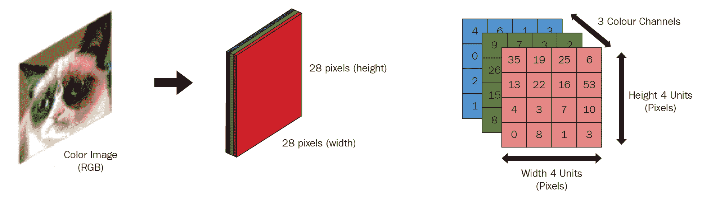
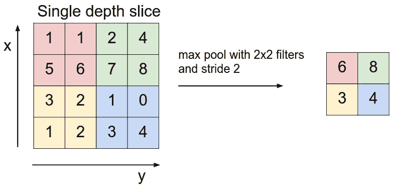

# 第四章：卷积神经网络

在上一章中，我们看到如何利用前馈神经网络的预测能力执行多个信号处理任务。这一基础架构使我们能够引入构成**人工神经网络**（**ANNs**）学习机制的许多基本特性。

在这一章中，我们将更深入地探索另一种类型的人工神经网络，即**卷积神经网络**（**CNN**），它因在图像识别、目标检测和语义分割等视觉任务中的高效表现而闻名。事实上，这些特定架构的灵感也回溯到我们自己的生物学。很快，我们将回顾人类的实验和发现，这些实验和发现促成了这些复杂系统的灵感，这些系统在视觉任务上表现优异。这个概念的最新版本可以追溯到 ImageNet 分类挑战赛，在这项挑战中，AlexNet 能够在超大数据集上的图像分类任务中超越当时最先进的计算机视觉系统。然而，正如我们很快将看到的，CNN 的思想是跨学科科学研究的产物，背后有着数百万年的试验积累。

在这一章中，我们将涵盖以下主题：

+   为什么是 CNN？

+   视觉的诞生

+   理解生物学中的视觉

+   现代卷积神经网络的诞生

+   设计卷积神经网络（CNN）

+   稠密层与卷积层

+   卷积操作

+   保持图像的空间结构

+   使用滤波器进行特征提取

# 为什么是 CNN？

卷积神经网络与普通神经网络非常相似。正如我们在上一章中看到的，神经网络由具有可学习权重和偏差的神经元组成。每个神经元仍然使用点积计算其输入的加权和，添加一个偏置项，然后通过非线性方程传递。网络将展示一个可微分的评分函数，这个函数将从一端的原始图像到另一端的分类分数。

它们也会有像 softmax 或 SVM 这样的损失函数在最后一层。此外，我们所学的开发神经网络的所有技术都将适用。

但你可能会问，卷积神经网络（ConvNets）有什么不同？所以需要注意的主要一点是，卷积网络架构明确假设接收到的输入都是图像，这一假设实际上帮助我们编码架构自身的其他属性。这样做可以使网络在实现上更高效，大大减少所需参数的数量。我们称一个网络为*卷积*网络，是因为它有卷积层，除此之外还有其他类型的层。很快，我们将探索这些特殊的层以及其他一些数学运算，如何帮助计算机更好地理解我们周围的世界。

因此，这种特定的神经网络架构在各种视觉处理任务中表现出色，涵盖了物体检测、面部识别、视频分类、语义分割、图像描述、人类姿态估计等多个领域。这些网络使得一系列计算机视觉任务能够高效执行，其中一些任务对人类进步至关重要（如医学诊断），而另一些则接近娱乐领域（如将特定艺术风格叠加到图像上）。在我们深入探讨其构思和当代应用之前，了解我们试图复制的更广泛领域是非常有用的，可以通过快速了解视觉这一既复杂又与我们人类息息相关的事物是如何诞生的。

# 视觉的诞生

接下来是一个史诗般的故事，一个发生在大约 5.4 亿年前的史诗般的故事。

在这个时期，在后来被称为地球的淡蓝色宇宙点上，生命是相当宁静且无忧无虑的。那时，几乎所有的祖先都是水生生物，他们会在海洋的宁静中漂浮，只有当食物漂浮在他们面前时，才会吃上一口。是的，这与今天的掠食性、压力重重且充满刺激的世界是截然不同的。

突然，一件相当奇特的事情发生了。在随后的相对较短时间内，地球上动物物种的数量和种类发生了爆炸性增长。在接下来的大约 2000 万年里，你会发现地球上的生物发生了剧烈变化。它们从偶尔会遇到的单细胞生物，组成松散的群体，变成了复杂的多细胞生物，遍布地球的每个小溪和角落。

生物学家曾长期困惑，争论是什么导致了这一*大爆炸*式的进化加速。我们真正发现的是生物视觉系统的诞生。通过研究当时生物的化石记录，动物学家能够提供确凿的证据，将这种物种爆发与首次出现的光感受细胞联系起来。这些细胞使得生物能够感知并对光作出反应，触发了一场进化的军备竞赛，最终导致了复杂的哺乳动物视觉皮层的形成，而你现在可能正是依赖这个视觉皮层来解读这段文字的。的确，视觉的恩赐使得生命变得更加动态和主动，因为生物现在能够感知并应对周围的环境。

如今，视觉是几乎所有生物中主要的感官系统，无论其是否具有智能。事实上，我们人类几乎将一半的神经元容量用于视觉处理，这使得视觉成为我们用来定位自己、识别他人和物体、并进行日常活动的最大感官系统。事实证明，视觉是认知系统的一个非常重要的组成部分，无论是生物系统还是其他系统。因此，研究自然界创造的视觉系统的发展与实现是完全合理的。毕竟，重复造轮子没有意义。

# 理解生物学视觉

我们对生物视觉系统的下一项见解来源于 20 世纪 50 年代末，哈佛大学的科学家们进行的一系列实验。诺贝尔奖得主大卫·胡贝尔和托尔斯坦·维塞尔通过映射猫的视觉神经元，从视网膜到视觉皮层，向世界展示了哺乳动物视觉皮层的内部工作原理。这些科学家利用电生理学方法，了解我们的感官器官如何摄取、处理和解释电磁辐射，从而生成我们周围所见的现实。这使他们能够更好地理解在单个神经元水平上，刺激和相关反应的流动：


以下截图描述了细胞如何响应光：


通过他们在神经科学领域的实验，我们能够与您分享他们研究中的几个关键元素，这些元素直接影响了科学界对视觉信号处理的理解，并引发了一系列学术贡献，最终促成了今天的成就。这些元素启示了我们大脑在视觉信息处理中的机制，激发了卷积神经网络（CNN）的设计，而这成为现代视觉智能系统的基石。

# 概念化空间不变性

其中的第一个概念来自于**空间不变性**。研究人员注意到，猫对特定图案的神经反应是一致的，无论这些图案在屏幕上的具体位置如何。从直觉上看，研究人员发现相同的一组神经元会对给定的图案（即一条线段）做出反应，即使该图案出现在屏幕的顶部或底部。这表明这些神经元的激活具有空间不变性，意味着它们的激活与给定图案的空间位置无关。

# 定义神经元的接受域

其次，他们还注意到神经元*负责*响应给定输入的特定区域。他们将这种神经元的特性称为**感受野**。换句话说，某些神经元只对给定输入的特定区域做出响应，而其他神经元则对同一输入的不同区域作出反应。神经元的感受野简单来说就是指神经元可能响应的输入范围。

# 实现神经元层次结构

最终，研究人员成功证明了视觉皮层中存在神经元的层次结构。他们展示了低级别的细胞负责检测简单的视觉模式，如线段。这些神经元的输出被后续神经元层用来构建越来越复杂的模式，最终形成我们看到并与之互动的物体和人物。实际上，现代神经科学证实，视觉皮层的结构是按层次组织的，通过使用前一层的输出，执行越来越复杂的推理，正如下图所示：


上述图示意味着，识别一个朋友涉及检测组成他们面部的线段（**V1**），利用这些线段构建形状和边缘（**V2**），使用这些形状和边缘形成复杂的形状，如眼睛和鼻子（**V3**），然后运用先前的知识推断出这组眼睛和鼻子最像你哪位朋友（**IT-后部**）。基于这种推理，甚至可能出现更高层次的激活，涉及到关于该朋友的个性、吸引力等概念（**IT-前部**）。

# 现代卷积神经网络的诞生

直到 1980 年代，Heubel 和 Wiesel 的发现才在计算机科学领域得到了重新利用。*神经认知层次网*（Fukushima, 1980: [`www.rctn.org/bruno/public/papers/Fukushima1980.pdf`](https://www.rctn.org/bruno/public/papers/Fukushima1980.pdf)）通过将简单细胞和复杂细胞的概念交替堆叠在不同的层中。这个现代神经网络的前身利用前述的交替层，顺序地包含可修改的参数（或简单细胞），并通过池化层（或复杂细胞）使得网络对简单细胞的小变化具有不变性。尽管这一架构具有直观性，但它仍然不足以捕捉视觉信号中复杂的细节。

其中一个重要的突破发生在 1998 年，当时著名的 AI 研究人员**颜麟恩**和**约书亚·本吉奥**成功训练了一个卷积神经网络（CNN），利用基于梯度的权重更新，来执行文档识别任务。这个网络在识别邮政编码的数字方面表现得非常出色。类似的网络很快被美国邮政服务等组织采用，用于自动化处理繁琐的邮件分类工作（不是电子邮件哦）。尽管这些成果足够引起商业领域的兴趣，并且在狭窄的领域内产生了显著影响，但这些网络仍然无法处理更具挑战性和复杂的数据，比如面孔、汽车和其他真实世界的物体。然而，这些研究人员和许多其他人的集体努力，促成了现代较大且更深的卷积神经网络的出现，这些网络首次出现在 ImageNet 分类挑战赛中。如今，这些网络已经在计算机视觉领域占据主导地位，并广泛应用于当今最先进的人工视觉智能系统中。这些网络现在被用于诸如医学影像诊断、探测外太空天体、以及让计算机玩老式 Atari 游戏等任务，举几个例子。

# 设计卷积神经网络（CNN）

现在，基于对生物视觉的直觉，我们理解了神经元必须层次化组织，以便检测简单的模式，并利用这些模式逐步构建更复杂的模式，以对应真实世界中的物体。我们还知道，必须实现一个空间不变性机制，允许神经元处理在给定图像的不同空间位置上出现的相似输入。最后，我们意识到，为每个神经元实现一个感受野，对于实现神经元与现实世界中空间位置的拓扑映射非常有用，这样附近的神经元就可以表示视觉场中的相邻区域。

# 稠密层与卷积层

你会记得在上一章中，我们使用了一个前馈神经网络，它由全连接的稠密神经元层组成，用于执行手写数字识别任务。在构建我们的网络时，我们不得不将每个图像的 28 x 28 的输入像素展平为一个 784 个像素的向量。这样做导致我们失去了网络可以利用的任何空间相关信息，来帮助分类它所看到的数字。我们仅仅将每个图像展平成一个 784 维的向量，并期待它能够识别出数字。虽然这种方法足以在 MNIST 数据集中进行手写数字分类，并取得了相当不错的准确度，但在面对更复杂的数据时，这种方法很快就变得不实用了，尤其是那些涉及多种不同空间方向局部模式的数据。

我们理想的目标是保留空间信息，并重用神经元来检测不同空间区域中出现的相似模式。这将使我们的卷积网络更加高效。通过重用神经元来识别数据中具体模式，而不论它们的位置，CNN 在视觉任务中具有优势。另一方面，如果密集连接的网络遇到相同的模式出现在图像的另一个位置，它将被迫再次学习该模式。考虑到视觉数据中存在的自然空间层次结构，使用卷积层是一种理想的方式，能够检测微小的局部模式，并逐步构建出更复杂的模式。

以下截图展示了视觉数据的层次性：


我们提到的另一个密集层的问题是，它在捕捉数据中的局部模式方面存在弱点。密集层因能够捕捉涉及图像中所有像素的全局模式而广为人知。然而，正如 Hubel 和 Wiesel 的研究所示，我们希望将神经元的感受野限制为数据中存在的局部模式，并利用这些模式逐步形成更复杂的模式。这将使我们的网络能够处理非常不同类型的视觉数据，每种数据都有不同类型的局部模式。为了解决这些问题等，卷积神经网络的核心组件——**卷积操作**被开发出来。

# 卷积操作

词语*convolvere*来自拉丁语，意思是*卷积*或*一起滚动*。从数学角度来看，你可以将卷积定义为基于微积分的积分，表示当一个函数在另一个函数上滑动时，它们重叠的程度。换句话说，对两个函数（`f`和`g`）进行卷积操作将产生第三个函数，表示一个函数的形状如何被另一个函数所改变。术语*卷积*既指结果函数，也指计算过程，其根源在于信号处理的数学分支，如我们在此图中所见：


那么，我们如何利用这个操作来获得优势呢？

# 保留图像的空间结构

首先，我们将通过简单地将图像作为`n`维张量输入到神经网络中，来利用图像固有的空间结构。这意味着网络将接收每个像素的原始矩阵位置，而不是像之前那样将其缩减为单一向量中的一个位置。以 MNIST 示例为例，卷积神经网络将接收一个 28 x 28 x 1 的张量作为输入，表示每一张图像。这里，28 x 28 表示一个二维网格，像素在其上排列形成手写数字，而`1`表示图像的颜色通道（即每个像素的像素值数量）。如我们所知，彩色数据集的图像尺寸可能是 28 x 28 x 3，其中`3`表示构成单个像素颜色的红、绿、蓝三种值。由于我们在 MNIST 数据集中每个像素只处理单一的灰度值，颜色通道表示为 1。因此，理解图像作为三维张量进入网络并保留图像数据的空间结构是非常重要的：



# 接受域

现在，我们可以在网络架构中利用图像固有的附加空间信息。换句话说，我们现在已经准备好执行卷积操作。这意味着我们将使用一个较小的空间片段，并将其滑动到输入图像上，作为滤波器来检测局部模式。直观的理解是将输入数据空间的某些区域与隐藏层中对应的神经元连接起来。这样做可以让神经元每次卷积时仅观察图像的局部区域，从而限制其接受域。限制神经元的接受域有两个主要的好处。首先，我们认为图像中相邻的像素更有可能相互关联，因此在网络中限制神经元的接受域使得这些神经元更能够区分图像中像素之间的局部差异。此外，这种做法还允许我们大幅减少网络中可学习的参数（或权重）数量。通过这种方式，我们使用一个**滤波器**，本质上是一个权重矩阵，并在输入空间上从图像的左上角开始迭代应用它。每次卷积时，我们会将滤波器集中在输入空间中每个像素的上方，并向右移动步幅。完成图像顶部像素行的卷积后，我们会从图像的左侧再次执行相同的操作，这次是针对下面的行。通过这种方式，我们将滤波器滑过整个输入图像，在每次卷积时通过计算输入区域和所谓的**滤波器**的点积来提取局部特征。

这里的图示描绘了卷积操作的初始步骤。随着操作的进行，这个三维的蓝色矩形将会在整个图像的片段（用红色标示）上滑动，从而使得该操作得名为卷积。矩形本身被称为滤波器，或**卷积核**：


# 使用滤波器进行特征提取

每个滤波器本质上可以看作是一个神经元的排列，类似于我们在第三章《信号处理 - 使用神经网络进行数据分析》中遇到的那种。在这里，滤波器的神经元用随机权重初始化，并在训练过程中通过反向传播算法逐步更新。滤波器本身负责检测某种特定类型的模式，从线段到曲线以及更复杂的形状。当滤波器在输入图像的某一位置滑动时，滤波器的权重与该位置的像素值进行元素级相乘，从而生成一个单一的输出向量。然后，我们通过求和操作将该向量简化为一个标量值，正如我们之前在前馈神经网络中所做的那样。这些标量值在滤波器移动到每一个新位置时生成，遍历整个输入图像。它们被存储在一个被称为**激活图**（也称为**特征图**或**响应图**）的东西中，针对给定的滤波器。激活图本身的尺寸通常小于输入图像，并且它体现了输入图像的新表示，同时突出了其中的某些模式。

滤波器本身的权重可以被看作是卷积层的可学习参数，并在网络训练过程中不断更新，以捕捉与当前任务相关的模式：


# 卷积神经网络中的误差反向传播

当我们的网络训练以找到理想的滤波器权重时，我们希望某个滤波器的激活图能够捕捉到数据中可能存在的最有信息量的视觉模式。本质上，这些激活图是通过矩阵乘法生成的。这些激活图作为输入被送入后续层，因此信息会向前传播，直到模型的最终层，最终执行分类。在此时，我们的`loss`函数评估网络预测与实际输出之间的差异，并将预测误差反向传播以调整每一层的网络权重。

这基本上就是如何训练卷积神经网络（ConvNet）的高层次过程。卷积操作包括通过转置的滤波器矩阵（持有卷积滤波器的权重）与对应输入像素空间的点积运算，来从训练样本中提取可泛化的特征。然后，这些特征图（或激活图）首先被送入池化层以降低维度，随后再送入全连接层以确定哪种滤波器组合最能代表给定的输出类别。在反向传播过程中，随着模型权重的更新，在下一次前向传播时会生成新的激活图，这些激活图理想地编码了我们数据中更具代表性的特征。在这里，我们简要展示了 ConvNet 架构的视觉总结：


它遵循以下步骤：

1.  通过卷积学习输入图像中的特征

1.  通过激活函数引入非线性（现实世界数据是非线性的）

1.  通过池化减少维度并保持空间不变性

# 使用多个滤波器

由于滤波器是特定模式的（即每个滤波器擅长捕捉某种类型的模式），我们需要不止一个滤波器来捕捉图像中可能存在的所有不同类型的模式。这意味着我们可能会在网络中的某一卷积层使用多个滤波器，从而允许我们为给定输入空间的区域提取多个不同的局部特征。这些局部特征存储在特定滤波器的激活图中，并可以传递到后续层以构建更复杂的模式。渐进的卷积层将使用不同的滤波器对前一层的输入激活图进行卷积，再次提取并将输入图转化为一个三维张量输出，代表每个使用的滤波器的激活图。新的激活图将再次是三维张量，并可以类似地传递到后续层。回想一下，当图像进入我们的网络时，它作为一个三维张量进入，具有（宽度、高度和深度）对应输入图像的维度（其中深度由像素通道表示）。而在我们的输出张量中，深度轴表示前一卷积层中使用的滤波器数量，每个滤波器产生自己的激活图。从本质上讲，这就是数据如何在卷积神经网络（CNN）中向前传播的过程，它以图像的形式进入，最终以三维激活图的形式输出，并在数据通过更深层时被各个滤波器逐步转化。转换的具体性质将在稍后更清晰地展示，当我们构建卷积神经网络时。我们将再多讨论一点理论，然后我们就准备好继续了。

# 卷积的步幅

以下图展示了你现在已经熟悉的卷积操作，在二维中（为了简化）。它展示了一个 4x4 的滤波器（红框）滑过一个更大的图像（14x14），每次移动两个像素：


滤波器在每次迭代时移动的像素数称为**步幅（stride）**。在每次步幅操作中，使用对应输入区域的像素矩阵和滤波器权重计算一个点积。这个点积作为标量值存储在该滤波器的激活图中（如下所示的 6x6 方形图）。因此，激活图表示了该层输入的简化表示，本质上是一个矩阵，由我们在对输入数据的各个片段进行卷积时得到的点积之和组成。从更高的层次来看，激活图表示了神经元对特定模式的激活，该模式由相应的滤波器检测到。较长的步幅会导致对应输入区域的采样更少，而较短的步幅则允许更多的像素被采样，从而产生更高分辨率的激活图。

# 什么是特征？

虽然使用不同类型的滤波器收集特征的整体机制可能很清楚，但你可能会想知道一个特征到底是什么样子，我们如何从滤波器中提取它们。

让我们考虑一个简单的例子来澄清我们的理解。假设你想从一堆灰度字母图像中检测字母 X。那么，卷积神经网络（CNN）是如何进行这项工作的呢？首先，让我们考虑一个 X 的图像。如下面所示，我们可以认为具有正值的像素形成了 X 的线条，而负值的像素则表示图像中的空白区域，如下图所示：


但接下来是位置变化的问题：如果 X 稍微旋转或以其他方式扭曲了怎么办？在现实世界中，字母 X 有许多不同的大小、形状等等。我们如何使用较小的滤波器来分解 X 的图像，从而捕捉到它的基本模式呢？这里有一种方法：


正如你可能已经注意到的那样，我们实际上可以将图像分解成更小的片段，其中每个片段（由绿色、橙色和紫色框表示）代表图像中的重复模式。在我们的例子中，我们能够使用两个对角线方向的滤波器和一个交叉滤波器，并将它们逐个滑过图像，以捕捉形成 X 的线段。本质上，你可以将每个滤波器视为某种模式检测器。当这些不同的滤波器对输入图像进行卷积时，我们得到的激活图开始像长的横线和交叉线一样，这些图像组合后帮助网络识别字母 X。

# 使用滤波器可视化特征提取

让我们考虑另一个例子，以巩固我们对滤波器如何检测模式的理解。考虑这张来自 MNIST 数据集的数字 7 的图像。我们使用这张 28 x 28 像素的图像来展示滤波器如何实际捕捉到不同的模式：


直观地，我们注意到这个数字 7 由两条水平线和一条倾斜的垂直线组成。我们基本上需要用可以捕捉到这些不同模式的值来初始化我们的滤波器。接下来，我们观察一些 3 x 3 的滤波器矩阵，这是卷积神经网络通常会为当前任务学习到的：


尽管不太直观，但这些滤波器实际上是复杂的边缘检测器。为了理解它们如何工作，我们可以将滤波器权重中的每个 0 视为灰色，而每个 1 则为白色，-1 则为黑色。当这些滤波器在输入图像上进行卷积时，会对滤波器值和下面的像素进行逐元素相乘。这个操作的结果是另一个矩阵，称为**激活图**，表示给定输入图像中由各自滤波器捕捉到的特定特征。现在，让我们看看在对数字 7 的输入图像执行卷积操作时，使用这四个滤波器分别捕捉到什么样的模式。以下插图展示了卷积层中每个滤波器的激活图，展示了它们在看到数字 7 的图像后的效果：


我们观察到，每个滤波器能够通过简单地计算输入图像中每个空间位置的像素值与滤波器权重的点积和，捕捉到图像中的特定模式。所捕捉到的模式可以通过前述的激活图中的白色区域表示。我们看到前两个滤波器分别巧妙地捕捉到了数字 7 图像中的上下水平线。我们还注意到后两个滤波器分别捕捉到了构成数字 7 主体的内外垂直线。虽然这些仍然是相当简单的模式检测示例，但卷积神经网络中的渐进层通常能够捕捉到更加丰富的结构，通过区分颜色和形状，这些本质上是数字模式，对我们的网络来说。

# 查看复杂的滤波器

以下图像展示了在 ConvNet 第二层中，按网格展示的每个网格对应的九个激活图，分别与特定输入相关联。在左侧，你可以将小网格看作是个别神经元的激活，针对给定输入。右侧的彩色网格则与这些神经元显示的输入相关。我们在这里可视化的是那些能够*最大化*这些神经元激活的输入。我们注意到，已经可以看到一些非常明显的圆形检测神经元（网格 2, 2），这些神经元会对例如灯罩顶部和动物眼睛等输入激活：


同样，我们注意到一些类似正方形的模式检测器（网格 4, 4），似乎会对包含门窗框架的图像激活。当我们逐步可视化 CNN 更深层次的激活图时，我们会看到更加复杂的几何图案被捕捉到，代表了狗的面部（网格 1, 1）、鸟的腿（网格 2, 4）等等：


# 总结卷积操作

我们在这里所做的就是将一组权重（即一个滤波器）应用于局部输入空间进行特征提取。我们是通过迭代的方式进行的，在固定的步长（称为**步幅**）中将滤波器移动到输入空间。此外，使用不同的滤波器使我们能够从给定输入中捕获不同的模式。最后，由于滤波器会对整个图像进行卷积操作，我们可以对给定的滤波器实现空间共享参数。这使得我们能够使用*相同的*滤波器在图像的不同位置检测到相似的模式，这与之前讨论的空间不变性概念相关。然而，卷积层输出的这些激活图本质上是抽象的高维表示。在进行分类之前，我们需要实现一种机制，将这些表示减少到更易处理的维度。这引出了**池化层**的概念。

# 理解池化层

使用卷积层时的最后一个考虑因素涉及堆叠简单单元以检测局部模式和堆叠复杂单元以下采样表示的概念，正如我们在猫脑实验和 neocognitron 中看到的那样。我们看到的卷积滤波器表现得像简单单元，通过集中关注输入的特定位置并训练神经元在接受到来自输入图像局部区域的某些刺激时激活。而复杂单元则需要对刺激的位置不那么具体。这时，池化层就发挥了作用。池化技术旨在将卷积神经网络层的输出减少到更易管理的表示。池化层定期添加到卷积层之间，按空间下采样卷积层的输出。这样做的效果就是逐渐减少卷积层输出的大小，从而得到更高效的表示，具体如图所示：


如您所见，深度体积被保留，因为我们使用 2 大小的滤波器和步幅为 2 对大小为 224 x 224 x 64 的输入体积进行了池化。因此，输出体积为 112 x 112 x 64。

# 池化操作类型

这同样减少了我们网络中所需的可学习参数数量，以执行相同的任务，并防止网络过拟合。最后，对于由给定层生成的每个激活图（即输入张量的每个深度切片），都会执行池化，并使用其自身的滤波器在空间上调整输入大小。常见的做法是在每个深度切片上执行池化层，使用 2 x 2 的滤波器和步幅为 2。执行这种下采样有多种方式。最常见的方法是通过**最大池化**操作来实现，这意味着我们保留池化滤波器下输入区域中像素值最高的像素。下图演示了在输入张量的给定切片上执行最大池化操作：



池化层按空间独立地对输入体积的每个深度切片进行下采样。最常见的下采样操作是最大池化，这里显示的是步幅为 2 的最大池化。也就是说，每个最大值是从四个数字中取的（即 2 x 2 的小方格）。

你也可以通过取 2 x 2 方格的平均值来进行降采样，如图所示。这个操作被称为**平均池化**。正如我们在后续章节中将看到的，Keras 提供了许多池化层，每个池化层执行不同类型的降采样操作，作用于上一层的输出。选择哪种池化层将主要取决于你的具体使用案例。在图像分类任务中，最常用的是二维或三维的最大池化层。池化层的维度指的是它接受的输入类型。例如，处理灰度图像时会使用二维池化层，而在处理彩色图像时，则会使用三维池化层。你可以参考维护良好的文档，自己深入学习。

# 在 Keras 中实现 CNN

在对卷积神经网络（CNN）的关键组件有了较为深入的理解后，我们现在可以开始实际实现一个 CNN。这样，我们可以熟悉构建卷积网络时需要考虑的关键架构因素，并概览实现细节，了解这些细节是如何使得网络表现如此优秀的。很快，我们将会在 Keras 中实现卷积层，并探索如池化层等降采样技术，看看我们如何通过卷积、池化和全连接层的组合来处理各种图像分类任务。

在这个例子中，我们将采用一个简单的用例。假设我们希望我们的 CNN 能够检测人类的情感，例如微笑或皱眉。这是一个简单的二分类任务。我们该如何进行呢？首先，我们需要一个标注了微笑和皱眉的人的数据集。虽然有很多方式可以实现这一目标，但我们选择了**Happy House 数据集**。该数据集包含约 750 张人类的图像，每张图片中的人物要么微笑，要么皱眉，存储在 `h5py` 文件中。要跟着学习，你只需要下载存放在 Kaggle 网站上的数据集，你可以通过这个链接免费访问：[`www.kaggle.com/iarunava/happy-house-dataset`](https://www.kaggle.com/iarunava/happy-house-dataset)

# 检查我们的数据

让我们首先加载并检查一下数据集，了解一下我们正在处理的内容。我们编写了一个简单的函数，读取我们的 `h5py` 文件，提取训练数据和测试数据，并将其放入标准的 NumPy 数组中，代码如下：

```py
import numpy as np
import h5py
import matplotlib.pyplot as plt
# Function to load data
def load_dataset():
# use h5py module and specify file path and mode (read) all_train_data=h5py.File('C:/Users/npurk/Desktop/Chapter_3_CNN/train_happy.h5', "r")
all_test_data=h5py.File('C:/Users/npurk/Desktop/Chapter_3_CNN/test_happy.h5', "r")
# Collect all train and test data from file as numpy arrays
x_train = np.array(all_train_data["train_set_x"][:]) 
y_train = np.array(all_train_data["train_set_y"][:]) 
x_test = np.array(all_test_data["test_set_x"][:])
y_test = np.array(all_test_data["test_set_y"][:]) 
# Reshape data
y_train = y_train.reshape((1, y_train.shape[0]))
y_test = y_test.reshape((1, y_test.shape[0]))    
return x_train, y_train, x_test, y_test
# Load the data 
X_train, Y_train, X_test, Y_test = load_dataset()
```

# 验证数据形状

接下来，我们将打印出训练数据和测试数据的形状。在以下代码块中，我们可以看到我们处理的是 64 x 64 像素的彩色图像。我们的训练集中有 600 张这样的图像，测试集则有 `150` 张。我们还可以查看其中一张图像的实际样子，正如我们在之前的例子中使用 Matplotlib 所做的那样：

```py
print(X_train.shape)
print(X_test.shape)
print(Y_train.shape)
print(Y_test.shape)

(600, 64, 64, 3)
(150, 64, 64, 3)
(1, 600)
(1, 150)

# Plot out a single image plt.imshow(X_train[0]) # Print label for image (smiling = 1, frowning = 0) print ("y = " + str(np.squeeze(Y_train[:, 0])))
y = 0
```

——瞧！女士们，先生们，我们看到了一个皱眉的脸：


# 规范化我们的数据

现在，我们将通过将像素值重新缩放到 0 到 1 之间来准备我们的图像。我们还转置了标签矩阵，因为我们希望它们的方向是（600，1），而不是（1，600），这与我们之前在训练标签中提到的标签一致。最后，我们打印出训练集和测试集的特征和标签的形状：

```py
# Normalize pixels using max channel value, 255 (Rescale data)

X_train = X_train/255.
X_test = X_test/255.

# Transpose labels
Y_train = Y_train.T
Y_test = Y_test.T

# Print stats
print ("Number of training examples : " + str(X_train.shape[0]))
print ("Number of test examples : " + str(X_test.shape[0]))
print ("X_train shape: " + str(X_train.shape))
print ("Y_train shape: " + str(Y_train.shape))
print ("X_test shape: " + str(X_test.shape))
print ("Y_test shape: " + str(Y_test.shape))
-----------------------------------------------------------------------
Output:
Number of training examples : 600
Number of test examples : 150
X_train shape: (600, 64, 64, 3)
Y_train shape: (600, 1)
X_test shape: (150, 64, 64, 3)
Y_test shape: (150, 1)
```

然后，我们将 NumPy 数组转换为浮点数值，这是我们网络偏好的格式：

```py
#convert to float 32 ndarrays
from keras.utils import to_categorical
X_train = X_train.astype('float32') X_test = X_test.astype('float32') Y_train = Y_train.astype('float32') Y_test = Y_test.astype('float32')
```

# 导入一些必要的库

最后，我们导入将在情感分类任务中使用的新层。在前一段代码的底部部分，我们导入了一个二维卷积层。卷积层的维度是特定于你想执行的任务的属性。因为我们处理的是图像，所以二维卷积层是最佳选择。如果我们处理的是时间序列传感器数据（例如生物医学数据——如 EEG 或股市等财务数据），那么一维卷积层将是更合适的选择。类似地，如果输入数据是视频，那么我们会使用三维卷积层：

```py
import keras
from keras.models import Sequential
from keras.layers import Flatten
from keras.layers import Dense
from keras.layers import Activation, Dropout
from keras.optimizers import Adam
from keras.layers import Conv2D
from keras.layers import MaxPooling2D
from keras.layers.normalization import BatchNormalization 
```

类似地，我们还导入了一个二维最大池化层，以及一个按批次进行归一化的层。批量归一化使我们能够处理网络传播过程中层输出的变化值。

“内部协变量偏移”问题确实是一个广为人知的现象。

CNNs 以及其他 ANN 架构，指的是输入统计量的变化

在经过几次训练迭代后，分布会发生变化，导致我们模型的收敛速度减慢，无法达到理想的权重。这一问题可以通过简单地在小批量中对数据进行归一化，使用均值和方差作为参考来避免。虽然我们鼓励你进一步研究“内部协变量偏移”问题以及批量归一化背后的数学原理，但现在了解它有助于我们更快地训练网络，并允许更高的学习率，同时使网络权重更容易初始化，这就足够了。

# 卷积层

在 Keras 中，卷积层涉及两个主要的架构考虑因素。第一个与在给定层中使用的滤波器数量有关，第二个与滤波器本身的大小有关。那么，让我们看看如何通过初始化一个空的顺序模型并向其中添加第一个卷积层来实现这一点：

```py
model=sequential()
#First Convolutional layer 
model.add(Conv2D(16,(5,5), padding = 'same', activation = 'relu', input_shape = (64,64,3)))
model.add(BatchNormalization())
```

# 定义滤波器的数量和大小

正如我们之前所见，我们通过赋予层 16 个过滤器，每个过滤器的高度和宽度为 5 x 5，来定义这一层。实际上，我们过滤器的正确维度应该是 5 x 5 x 3。然而，所有过滤器的深度覆盖了给定输入张量的整个深度，因此无需明确指定。由于这是第一层，它接收的是我们训练图像的张量表示，因此我们过滤器的深度为 3，表示每个像素的红色、绿色和蓝色值。

# 填充输入张量

从直观的角度思考卷积操作，显而易见，当我们将过滤器滑过输入张量时，最终发生的情况是，过滤器通过边缘和边界的频率低于它通过输入张量其他部分的频率。这仅仅是因为每个不位于输入边缘的像素，随着过滤器在图像中滑动，可能会被过滤器多次重新采样。这使得输出表示在输入的边界和边缘部分具有不均匀的采样，称为**边界效应**。

我们可以通过简单地用零填充输入张量来避免这个问题，如下所示：


通过这种方式，通常位于输入张量边缘的像素将被后续处理，允许在输入的所有像素上执行均匀采样。我们在第一个卷积层中指定希望保持输入的长度和宽度，以确保输出张量在其长度和宽度上具有相同的空间维度。这是通过将该层的填充参数定义为`same`来实现的。卷积层输出的深度，如前所述，由我们选择使用的过滤器数量表示。在我们的案例中，这将是 16，表示 16 个激活图是在每个过滤器卷积输入空间时产生的。最后，我们定义输入形状为任何单一输入图像的维度。对于我们来说，这对应于数据集中我们拥有的 64 x 64 x 3 彩色像素，具体如下所示：

```py
model = Sequential()
#First Convolutional layer 
model.add(Conv2D(16,(5,5), padding = 'same', activation = 'relu', input_shape = (64,64,3)))
model.add(BatchNormalization())
```

# 最大池化层

我们第一个卷积层的激活图经过归一化，并输入到下面的最大池化层。与卷积操作类似，池化操作是逐个输入区域应用的。对于最大池化操作，我们仅在像素网格中取最大的值，该值代表与每个特征最相关的像素，并将这些最大值组合形成输入图像的低维表示。通过这种方式，我们保留了更重要的值，并丢弃了给定激活图网格中的其余值。

这种下采样操作自然会导致一定程度的信息丢失，但大大减少了网络所需的存储空间，从而显著提高了效率：

```py
#First Pooling layer 
model.add(MaxPooling2D(pool_size = (2,2)))
model.add(Dropout(0.1))
```

# 利用全连接层进行分类

然后，我们简单地添加一些卷积层、批量归一化层和 dropout 层，逐步构建我们的网络，直到达到最后的几层。就像在 MNIST 示例中一样，我们将利用密集连接层来实现我们网络中的分类机制。在此之前，我们必须将来自上一层的输入（16 x 16 x 32）展平成一个维度为（8,192）的 1D 向量。我们这么做是因为基于密集层的分类器倾向于接收 1D 向量，而不像我们上一层的输出那样是多维的。接下来，我们添加了两层密集连接层，第一层有 128 个神经元（这是一个任意选择），第二层只有一个神经元，因为我们处理的是一个二分类问题。如果一切按计划进行，这一个神经元将由前几层的神经元支撑，并学会在看到某个特定的输出类别时激活（例如，笑脸），而在遇到其他类别的图像时（例如，愁眉苦脸的脸）则不会激活。请注意，我们再次在最后一层使用 sigmoid 激活函数来计算每个输入图像的类别概率：

```py
#Second Convolutional layer 
model.add(Conv2D(32, (5,5), padding = 'same', activation = 'relu'))
model.add(BatchNormalization())
#Second Pooling layer 
model.add(MaxPooling2D(pool_size = (2,2)))
#Dropout layer
model.add(Dropout(0.1))
#Flattening layer
model.add(Flatten())
#First densely connected layer
model.add(Dense(128, activation = 'relu'))
#Final output layer
model.add(Dense(1, activation = 'sigmoid'))
```

# 总结我们的模型

让我们可视化我们的模型，以便更好地理解我们刚刚构建的内容。你会注意到，激活图的数量（由后续层输出的深度表示）在整个网络中逐渐增加。另一方面，激活图的长度和宽度则趋向于减小，从（64 x 64）到（16 x 16），直到达到 dropout 层。这两种模式在大多数现代卷积神经网络（CNN）中是常见的，甚至可以说是标准的。

输入和输出维度之间的变化可能与我们之前讨论的*边界效应*的处理方式有关，或者与在卷积层中为过滤器实现的*步幅*有关。较小的步幅会导致更高的维度，而较大的步幅则会导致更低的维度。这与计算点积的位置数量有关，同时将结果存储在激活图中。较大的过滤器步幅（或步长）会更早到达图像的末尾，在同一输入空间中计算较少的点积值。卷积层的步幅可以通过定义步幅参数来设置，参数可以是一个整数或整数的元组/列表，表示给定层的步幅长度：

```py
model.summary()
```

以下是总结：


如我们之前所述，您会注意到卷积层和最大池化层都会生成一个三维张量，其维度对应于输出的高度、宽度和深度。层输出的深度本质上是每个初始化的滤波器的激活图。我们实现了第一个卷积层，使用了 16 个滤波器，第二层使用了 32 个滤波器，因此每一层将生成相应数量的激活图，正如前面所见。

# 编译模型

目前，我们已经涵盖了设计卷积神经网络（ConvNet）过程中所有关键的架构决策，现在可以编译我们一直在构建的网络了。我们选择了`adam`优化器和`binary_crossentropy`损失函数，就像在上一章的二元情感分析任务中做的那样。类似地，我们还导入了`EarlyStopping`回调函数，用来监控验证集上的损失，以便了解模型在每个训练周期（epoch）中在未见数据上的表现：


# 检查模型的准确度

正如我们之前所见，在训练的最后一个周期，我们达到了 88%的测试准确度。让我们看看这到底意味着什么，通过解释分类器的精确度和召回率得分：


正如我们之前注意到的，测试集中正确预测的正类观察值与正类观察值总数的比率（即**精确度**）相当高，达到了 0.98。召回率略低，表示正确预测的结果与应返回的结果数之间的比率。最后，F-值是精确度和召回率的调和平均数。

为了补充我们的理解，我们绘制了分类器在测试集上的混淆矩阵，如下所示。这本质上是一个错误矩阵，它让我们可视化模型的表现。`x`轴表示分类器的预测类别，而`y`轴表示测试样本的实际类别。正如我们所看到的，分类器错误地检测出约 17 张图片，认为这些人是在微笑，而实际上他们是在皱眉（也称为**假阳性**）。

另一方面，我们的分类器在将微笑的面孔错误分类为皱眉的面孔时只犯了一个错误（也称为**假阴性**）。考虑假阳性和假阴性有助于我们评估分类器在实际场景中的实用性，并进行部署此类系统的成本效益分析。在我们的分类任务中，这种分析可能不太必要；然而，在其他场景（例如皮肤癌检测）中，这种分析和评估就显得尤为重要。


每当你对模型的准确度感到满意时，你可以保存一个模型，如下所示。请注意，这不仅是最佳实践，因为它为你提供了关于之前尝试、采取的步骤和取得的结果的良好文档记录，而且如果你想进一步探讨模型，通过查看它的中间层，看看它实际学到了什么，这也非常有用，正如我们马上要做的那样：


# 检测微笑的问题

我们必须指出的是，外部效度的问题（即模型的可推广性）在像微笑检测器这样的数据集上仍然存在。鉴于数据收集的方式比较有限，期望我们的卷积神经网络（CNN）能在其他数据上很好地推广是没有道理的。首先，网络是用低分辨率的输入图像训练的。此外，它每次只见到的是同一个地方的一位笑脸或皱眉的人。给这个网络输入一张比如说国际足联管理委员会的照片，无论照片中笑容多么明显，它都不会检测出微笑。我们需要重新调整方法。一种方法是通过对输入图像应用与训练数据相同的转换方式，例如按面部分割和调整大小。更好的方法是收集更多样化的数据，并通过旋转和扭曲训练样本来增强训练集，正如我们在后面的章节中将看到的那样。这里的关键是，在数据集中包括不同姿势、不同方向、不同光照条件下微笑的人，以便真正捕捉到微笑的所有有用视觉表现。如果收集更多数据成本太高，生成合成图像（使用 Keras 图像生成器）也是一个可行的选择。数据的质量可以大幅提高网络的性能。现在，我们将探索一些技术，了解 CNN 的内部工作原理。

# 黑箱内部

训练一个**微笑检测器**，仅仅使用一个狭窄的相似图像数据集，这是一回事。你不仅可以直接验证预测结果，而且每次错误预测也不会让你付出巨大的代价。现在，如果你使用类似的系统来监控精神病患者的行为反应（作为一个假设的例子），你可能会希望通过确保模型真正理解“微笑”的含义，而不是在训练集中识别一些无关的模式来确保高准确度。在医疗或能源等高风险行业中，任何误解都可能带来灾难性后果，从失去生命到资源浪费不等。因此，我们希望能够确保我们部署的模型确实捕捉到了数据中真正具有预测性的趋势，而不是记住了某些随机的特征，这些特征在训练集之外无法进行有效预测。这种情况在神经网络使用的历史中屡屡发生。在接下来的部分，我们从神经网络的民间故事中挑选了一些例子，以说明这些困境。

# 神经网络失败

曾几何时，美国陆军想到了利用神经网络来自动检测伪装的敌方坦克。研究人员被委托设计并训练一个神经网络，用于从敌方位置的航拍照片中检测伪装的坦克图像。研究人员仅仅是微调了模型的权重，使其能够为每个训练样本反映正确的输出标签，然后在他们隔离的测试样本上测试该模型。幸运的是（或者说看起来是这样），他们的网络能够充分分类所有的测试图像，这让研究人员确信他们的任务已经完成。然而，很快，他们收到愤怒的五角大楼官员的反馈，声称他们交付的网络在分类伪装坦克方面的表现不过是随机的。困惑的研究人员检查了他们的训练数据，并将其与五角大楼用于测试网络的数据进行了对比。他们发现，训练网络时使用的伪装坦克照片都是在阴天拍摄的，而负样本（没有伪装坦克的照片）则都是在晴天拍摄的。结果是，他们的网络只学会了区分天气（通过像素的亮度），而没有真正完成原本的分类任务：


很常见的是，神经网络在经历大量训练迭代后，能够在训练集上达到超越人类的准确度。例如，一位研究人员在尝试训练一个网络来分类不同类型的陆地和海洋哺乳动物时，观察到了这种现象。在取得良好表现后，研究人员尝试进一步深入研究，以解码人类可能忽视的任何分类规则。结果发现，他们的复杂网络所学到的一个重要部分是图像中蓝色像素的存在或缺失，这在陆地哺乳动物的图片中自然不会经常出现。

在我们短小的神经网络失败故事中，最后一个案例是自动驾驶汽车自行开车驶下桥的事件。困惑的自动化工程师试图探查已训练的网络，想弄清楚出了什么问题。令他们惊讶的是，他们发现了一件非常奇怪的事。网络并没有检测到街道上的道路来进行导航，而是出于某种原因，依赖于分隔道路与人行道的连续绿色草地来确定其方向。当遇到桥梁时，这片绿色草地消失了，导致网络表现出似乎不可预测的行为。

# 可视化卷积神经网络的学习

这些故事激发了我们确保模型不会过拟合随机噪声，而是能够捕捉到具有代表性的预测特征的需求。我们知道，不小心的数据处理、任务本身的固有特性或建模中的内在随机性都可能引入预测不准确性。神经网络中广泛传播的叙事通常会用到**黑箱**等术语来描述其学习机制。虽然理解个别神经元所学内容对各种神经网络来说可能并不直观，但这对卷积神经网络（CNN）来说并非如此。令人有趣的是，卷积神经网络允许我们直观地可视化其学习到的特征。正如我们之前看到的，我们可以可视化给定输入图像的神经激活。但我们可以做得更多。事实上，近年来已经开发了多种方法来探查 CNN，更好地理解它所学到的东西。虽然我们没有时间涵盖所有这些方法，但我们将能够介绍一些最具实用性的。

# 可视化中间层的神经激活

首先，我们可以通过查看它们的激活图来可视化 CNN 中逐层如何转换它们接收到的输入。回忆一下，这些激活图只是网络在处理数据时传播通过其架构的输入的简化表示。可视化中间层（卷积层或池化层）能让我们了解网络在每个阶段的神经元激活情况，因为输入会被各种学习到的滤波器逐步拆解。由于每个二维激活图存储了由给定滤波器提取的特征，因此我们必须将这些图像作为二维图像来进行可视化，其中每张图像对应于一个学习到的特征。这个方法通常被称为可视化中间激活。

为了能够提取我们网络学习到的特征，我们需要对模型做一些小的架构调整。这就引出了 Keras 的功能性 API。回忆一下，之前我们使用 Keras 的顺序 API 定义了一个顺序模型，基本上让我们可以顺序堆叠神经元层来执行分类任务。这些模型接收图像或单词表示的输入张量，并输出为每个输入分配的类别概率。现在，我们将使用功能性 API，它允许构建多输出模型、有向无环图，甚至是共享层的模型。我们将使用这个 API 来深入探索我们的卷积网络。

# 对输入图像的预测

首先，我们准备一张图像（尽管你可以使用几张图像）作为输入，让它通过我们的多输出模型，以便我们可以看到该图像在通过新模型时产生的中间层激活。为了这个目的，我们从测试集中随机选取一张图像，并将其准备为一个四维张量（批量大小为 1，因为我们只输入一张图像）：


接下来，我们初始化一个多输出模型，对输入图像进行预测。这样做的目的是捕获每一层网络的中间激活，以便我们能够直观地绘制出不同滤波器生成的激活图。这有助于我们理解我们的模型实际学习到了哪些特征。

# 介绍 Keras 的功能性 API

我们到底如何做到这一点呢？我们从导入 `Model` 类开始，该类来自功能性 API。这让我们可以定义一个新的模型。我们新模型的关键区别在于，它能够返回多个输出，涉及到中间层的输出。我们通过使用一个经过训练的 CNN（比如我们的笑脸检测器）中的层输出，将其输入到这个新的多输出模型中，从而实现这一点。实际上，我们的多输出模型会接受一个输入图像，并返回我们之前训练的笑脸检测器模型中每个八个层的滤波器激活值。

你还可以通过在`model.layers`上使用列表切片符号，限制可视化的层数，如下所示：


上述代码的最后一行定义了`activations`变量，通过让我们的多输出模型对输入图像进行推理操作。此操作返回了与 CNN 每一层对应的多个输出，这些输出现在存储为一组 NumPy 数组：


如你所见，`activations`变量存储了一个包含`8`个 NumPy `n`维数组的列表。每一个`8`个数组都表示我们微笑检测器 CNN 中特定层的张量输出。每个层的输出代表了多个过滤器的激活。因此，我们在每层上观察到多个激活图。这些激活图本质上是二维张量，编码了输入图像的不同特征。

# 验证每层的通道数

我们看到每层都有一个深度，表示激活图的数量。这些也被称为通道，每个通道包含一个激活图，其高度和宽度为(`n` x `n`)。例如，我们的第一层有 16 个不同的激活图，大小为 64 x 64。类似地，第四层有 16 个大小为 32 x 32 的激活图。第八层有 32 个激活图，每个大小为 16 x 16。这些激活图是由各自层中的特定过滤器生成的，并被传递到后续层，以编码更高级的特征。这与我们微笑检测器模型的架构相符，我们总是可以验证，如下所示：


# 可视化激活图

现在是有趣的部分！我们将绘制给定层中不同过滤器的激活图。我们从第一层开始。我们可以绘制每个 16 个激活图，如下所示：

虽然我们不会展示所有 16 个激活图，但以下是我们发现的一些有趣的激活图：


正如我们可以清楚看到的，每个滤波器从输入图像中捕捉到了不同的特征，涉及到面部的水平和垂直边缘，以及图像的背景。当你可视化更深层的激活图时，你会注意到，激活变得越来越抽象，且不再容易被人眼解读。这些激活被认为是在编码与面部位置以及眼睛和耳朵相关的高级概念。你还会注意到，随着你深入探查网络，越来越多的激活图保持空白。这意味着在更深的层中激活的滤波器较少，因为输入图像没有包含与滤波器编码的模式相对应的特征。这是很常见的现象，因为我们可以预期随着网络层次的加深，激活模式会越来越与图像的类别相关。

# 理解显著性

我们之前看到，ConvNet 的中间层似乎能够编码一些非常明显的面部边缘检测器。然而，更难区分的是，我们的网络是否真正理解微笑是什么。你会注意到，在我们的微笑面孔数据集中，所有图片都在相同的背景下拍摄，且大致从相同的角度拍摄。此外，你还会注意到，数据集中的人们通常在抬起头并清晰地微笑时才会笑，而在皱眉时大多是低头的。这为我们的网络提供了很多过拟合无关模式的机会。那么，我们怎么知道网络理解微笑更多是与一个人嘴唇的动作有关，而不是与面部倾斜的角度有关呢？正如我们在神经网络失败案例中看到的那样，网络经常会捕捉到无关的模式。在我们实验的这一部分，我们将可视化给定网络输入的**显著性图**。

显著性图的概念最早由牛津大学视觉几何小组在一篇论文中提出，其背后的思想是通过计算所需输出类别相对于输入图像变化的梯度。换句话说，我们试图确定图像中像素值的微小变化如何影响网络对给定图像的理解：


直观地说，假设我们已经用不同动物的图像训练了一个卷积神经网络：长颈鹿、豹子、狗、猫等等。然后，为了测试它学到了什么，我们给它展示一张豹子的图片，并问它，*你认为这张图片中的豹子在哪里？* 从技术上讲，我们是在对输入图像中的像素进行排序，基于每个像素对网络输出的**类别概率分数**的影响。接着，我们可以简单地可视化对图像分类产生最大影响的像素，这些像素就是那些正向改变会导致增加网络对该图像属于某一类别的概率得分或置信度的像素。

# 使用 ResNet50 可视化显著性图

为了保持趣味性，我们将结束我们的微笑检测实验，并实际使用一个预训练的、非常深的 CNN 来展示我们的豹子示例。我们还使用 Keras `vis`，它是一个非常好的高级工具包，用于可视化和调试基于 Keras 构建的 CNN。你可以使用`pip`包管理器安装这个工具包：


在这里，我们导入了带有预训练权重的 ResNet50 CNN 架构，用于 ImageNet 数据集。我们鼓励你也探索 Keras 中存储的其他模型，可以通过`keras.applications`访问。我们还将网络最后一层的 Softmax 激活函数替换为线性激活函数，使用`utils.apply_modifications`，该函数重建了网络图，以帮助我们更好地可视化显著性图。

ResNet50 首次出现在 ILSVRC 竞赛中，并在 2015 年获得了第一名。它在避免与非常深的神经网络相关的精度下降问题方面表现得非常好。该模型是基于 ImageNet 数据集中的大约千个输出类别进行训练的。它被认为是一种高性能的、最先进的 CNN 架构，由其创建者免费提供。虽然它使用了一些有趣的机制，被称为**残差模块**，但我们将在后面的章节中才进一步讨论其架构。现在，让我们来看一下如何使用该模型的预训练权重来可视化一些豹子图片的显著性图。

# 从本地目录加载图片

如果你想跟着一起做，只需在 Google 上搜索一些漂亮的豹子图片，并将它们存储在本地目录中。你可以使用 Keras `vis`模块中的图像加载器来调整图片的大小，以符合 ResNet50 模型所接受的目标尺寸（即 224 x 224 像素的图片）：


由于我们希望让实验对网络来说相当具有挑战性，因此特意选择了伪装的豹子图片，以观察该网络在检测大自然中最复杂的伪装尝试时表现如何——这些伪装试图将这些掠食性动物从猎物（比如我们自己）的视线中隐藏起来：


# 使用 Keras 的可视化模块

即使是我们整个视觉皮层中实施的生物神经网络，乍一看似乎在每张图像中找到豹子有些困难。让我们看看其人工对应物在这项任务中表现如何。在以下代码段中，我们从`keras-vis`模块导入显著性可视化器对象，以及一个工具，让我们能够按名称搜索层。请注意，这个模块不随标准的 Keras 安装一起提供。但是，可以通过 Python 的`pip`包管理器轻松安装它。您甚至可以通过 Jupyter 环境执行安装：

```py
! pip install keras-vis
```

# 搜索通过层

接下来，我们执行一个实用搜索来定义模型中的最后一个密集连接层。我们需要这个层，因为它输出每个输出类别的类概率分数，我们需要能够可视化输入图像上的显著性。层的名称可以在模型的摘要中找到（`model.summary()`）。我们将向`visualize_salency()`函数传递四个特定的参数：


这将返回我们的输出相对于输入的梯度，直观地告诉我们哪些像素对我们模型的预测有最大影响。梯度变量存储了六个 224 x 224 的图像（对应于 ResNet50 架构的输入尺寸），每个图像代表六个输入豹子图像。正如我们注意到的，这些图像是由`visualize_salency`函数生成的，该函数接受四个参数作为输入：

+   用于执行预测的种子输入图像（`seed_input`）

+   一个 Keras CNN 模型（`model`）

+   模型输出层的标识符（`layer_idx`）

+   我们想要可视化的输出类的索引（`filter_indices`）

此处使用的索引参考（288）是指 ImageNet 数据集上标签*leopard*的索引。回想一下，我们之前导入了当前初始化模型的预训练层权重。这些权重是通过在 ImageNet 数据集上训练 ResNet50 模型获得的。如果您对不同的输出类别感兴趣，您可以在这里找到它们以及它们各自的索引：[`gist.github.com/yrevar/942d3a0ac09ec9e5eb3a`](https://gist.github.com/yrevar/942d3a0ac09ec9e5eb3a)。

可视化前三张图像的显著性图，我们实际上可以看到网络正在关注我们在图像中找到豹子的位置。太棒了！这确实是我们想要看到的，因为它表明我们的网络确实（大致）理解豹子在我们的图像中的位置，尽管我们尽最大努力展示了伪装豹子的嘈杂图像：


# 练习

+   探查网络中的所有层。您注意到了什么？

# 梯度加权类激活映射

另一个巧妙的基于梯度的方法是**梯度加权类别激活图**（**Grad-CAM**）。如果你的输入图像包含属于多个输出类别的实体，并且你想要可视化网络与特定输出类别最相关的输入图像区域，这个方法特别有用。该技术利用流入 CNN 最终卷积层的类别特定梯度信息，生成图像中重要区域的粗略定位图。换句话说，我们将输入图像喂给网络，并通过按输出类别相对于通道的梯度加权来获取卷积层的输出激活图（即激活图）。这使我们能够更好地利用与网络最关注的空间信息，这些信息在网络的最后一个卷积层中表现出来。我们可以将这些梯度加权激活图叠加到输入图像上，从而了解网络将输入图像的哪些部分与特定输出类别（即豹子）高度关联。

# 使用 Keras-vis 可视化类别激活

为此，我们使用`visualize_cam`函数，它本质上生成一个 Grad-CAM 图，最大化指定输入的层激活，以便生成一个特定输出类别的激活图。

`visualize_cam`函数接受与之前相同的四个参数，并增加了一个额外的参数。我们传递给它与 Keras 模型相对应的参数，一个**种子输入**图像，一个**滤波器索引**对应我们的输出类别（豹子的 ImageNet 索引），以及两个模型层。其中一个层保持为完全连接的密集输出层，另一个层指的是 ResNet50 模型中的最终卷积层。该方法本质上利用这两个参考点生成梯度加权类别激活图，如下所示：


如我们所见，网络正确识别了两张图片中的豹子。此外，我们注意到，网络依赖于豹子身上的黑色斑点图案来识别其种类。可以推测，网络使用这个图案来识别豹子，因为它是这个物种的显著特征。我们可以通过热力图看到网络的注意力，它主要集中在豹子身体上清晰的斑点区域，而不一定是豹子的脸部，就像我们自己在遇到豹子时可能会做的那样。或许数百万年的生物进化已将我们大脑枕状回区域的层权重调整为特别能识别面孔，因为面孔识别对我们的生存至关重要：

+   **Grad-CAM 论文**：[`arxiv.org/pdf/1610.02391.pdf`](https://arxiv.org/pdf/1610.02391.pdf)

# 使用预训练模型进行预测

顺便提一下，您实际上可以使用预训练的 ImageNet 权重在给定图像上运行推理，就像我们在这里初始化的 ResNet50 架构一样。您可以通过首先将所需图像预处理为适当的四维张量格式，来在其上运行推理。对于您可能拥有的任何图像数据集，只要它们调整到适当的格式，当然也可以这么做：


上述代码通过沿着 0 轴扩展图像的维度，将我们的豹子图像重新塑造成一个 4D 张量，然后将该张量输入到初始化的 ResNet50 模型中，以获得类别概率预测。接着，我们对预测类别进行解码，生成可读的输出。为了好玩，我们还定义了`labels`变量，包含了网络为该图像预测的所有可能标签，按概率从高到低排序。让我们看看网络还为输入图像归类了哪些标签：


# 可视化每个输出类别的最大激活

在最后的方法中，我们简单地可视化了与特定输出类别相关的总体激活，而没有显式地将输入图像传递给模型。这个方法既直观又美观。为了进行最后的实验，我们导入了另一个预训练的模型，**VGG16 网络**。这个网络是一个深度架构，基于 2014 年 ImageNet 分类挑战赛的冠军模型。与我们的上一个例子类似，我们将最后一层的 Softmax 激活替换为线性激活：


然后，我们从`keras-vis`的可视化模块中导入激活可视化对象。通过将`visualize_activation`函数传递给我们的模型、输出层以及与豹子类别对应的索引，我们绘制了豹子类别的总体激活。如我们所见，网络实际上捕捉到了图像中不同方向和位置的豹子的整体形状。有些看起来被放大了，其他的则不太明显，但猫耳朵和斑点黑色图案在整个图像中都很容易辨认——是不是很酷？让我们看一下下面的截图：


# 收敛模型

接下来，您可以让模型在该输出类别上收敛，以可视化模型在多次收敛迭代后认为的豹子（或其他输出类别）的特征。您可以通过`max_iter`参数定义模型收敛的次数，如下所示：


# 使用多个过滤器索引进行幻觉生成

你还可以通过传递不同的`filter_indices`参数来尝试，选择与 ImageNet 数据集中的不同输出类别对应的索引。你还可以传递一个由两个整数构成的列表，分别对应两个不同的输出类别。这基本上让你的神经网络*想象*两种不同输出类别的视觉组合，同时可视化与这两个输出类别相关的激活情况。有时这些组合会变得非常有趣，因此，尽情释放你的想象力吧！值得注意的是，谷歌的 DeepDream 也运用了类似的概念，展示了如何通过叠加过度激活的激活图层在输入图像上生成艺术图案。这些图案的复杂性有时令人惊叹、充满敬畏：


本书作者的照片，拍摄地点为巴黎迪士尼乐园的鬼屋前。该图像已通过开源的 DeepDream 生成器进行处理，我们鼓励你也来尝试，不仅仅是为了欣赏其美丽，它还可以在节假日期间为艺术天赋的亲戚们生成一些非常实用的礼物。

# 卷积神经网络（CNN）的问题

许多人可能会声称，CNN 所采用的层次嵌套模式识别技术在某种程度上与我们自身视觉皮层的运作非常相似。这在某种程度上是有道理的。然而，视觉皮层实现的是一种更加复杂的架构，并且能够在大约 10 瓦的能量下高效运行。我们的视觉皮层也不会轻易被含有面部特征的图像所欺骗（尽管这种现象足够常见，已经在现代神经科学中得到了正式的命名）。**错觉**是一个与人类大脑解读信号相关的术语，它指的是大脑在没有实际存在的情况下，生成更高层次的概念。科学家们已经表明，这一现象与位于视觉皮层枕状回区域的神经元的早期激活有关，这些神经元负责进行多个视觉识别和分类任务。在错觉的情况下，这些神经元可以说是*过早激活*，导致我们检测到面部特征或听到声音，即便实际上并不存在。这一现象可以通过火星表面的著名图片来说明，在这张图片中，大多数人都能清楚地辨认出面部轮廓和特征，尽管这张图片实际上只是堆积的红色尘土：


图片来源：NASA/JPL-Caltech

# 神经网络错觉

这个问题显然并非我们生物大脑独有的。事实上，尽管卷积神经网络（CNN）在许多视觉任务中表现优秀，神经网络幻觉（pareidolia）问题一直是计算机视觉研究人员不断努力解决的问题。正如我们所提到的，CNN 通过学习一系列过滤器来分类图像，这些过滤器能提取有用的特征，并能以概率的方式对输入图像进行分解。然而，这些过滤器学到的特征并不代表给定图像中的所有信息。这些特征之间的相对方向同样至关重要！两只眼睛、嘴唇和鼻子的存在并不能固有地构成一个面部特征。实际上，正是这些元素在图像中的空间排列决定了我们所说的面部：


# 摘要

在这一章中，首先，我们使用了卷积层，这些卷积层能够将给定的视觉输入空间分解为逐层嵌套的卷积过滤器的概率激活，并随后连接到执行分类的稠密神经元。这些卷积层中的过滤器学习与有用表示相对应的权重，这些表示可以以概率的方式进行查询，从而将数据集中存在的输入特征集映射到各自的输出类别。此外，我们还看到如何深入理解我们的卷积网络所学到的内容。我们看到了四种具体的方法：基于中间激活的、基于显著性的、梯度加权类激活的，以及激活最大化可视化。每种方法都能提供不同层次的网络所捕捉到的模式的独特直觉。我们可视化了这些模式，不仅对于给定的图像，也对于整个输出类别，以直观地理解在推理时我们的网络关注的元素。

最后，尽管我们回顾了许多基于神经科学的灵感，这些灵感促成了 CNN 架构的发展，但现代的 CNN 在任何方面都无法与哺乳动物视觉皮层中实施的复杂机制相竞争。事实上，视觉皮层层次结构的许多设计甚至与我们目前所设计的完全不同。例如，视觉皮层的各层本身就被结构化为后续的皮层柱，包含着神经元，这些神经元的感受野据说是彼此不重叠的，其目的至今仍不为现代神经科学所知。即使我们的视网膜也通过使用棒状细胞（对低强度光敏感）、锥状细胞（对高强度光敏感）和 ipRGC 细胞（对时间相关刺激敏感）在将视觉信号以电信号形式发送至丘脑基底的外侧膝状核之前，进行了一系列的感官预处理。外侧膝状核被称为视觉信号的中继中心。从这里，信号开始其旅程，往返于视觉皮层六层密集相互连接的层次结构中（而不是卷积层），伴随我们的一生。本质上，人类的视觉是高度顺序化和动态的，远远不同于人工实现的视觉。总结来说，尽管我们距离像生物学那样赋予机器视觉智能还有很长的路要走，但 CNN 代表了计算机视觉领域的现代成就的巅峰，使其成为无数机器视觉任务中非常适应的架构。

在此，我们结束了关于 CNN 探索的章节。我们将在后续章节中回顾更复杂的架构，并实验数据增强技术和更复杂的计算机视觉任务。在下一章节中，我们将探索另一种神经网络架构——RNN，它特别适用于捕捉和建模序列信息，如时间变化数据，这在许多领域中都很常见，从工业工程到自然语言对话生成。
