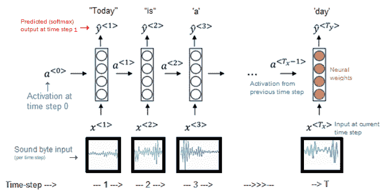
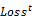
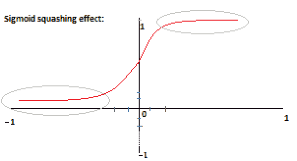

# 第五章：循环神经网络

在上一章中，我们惊叹于视觉皮层的功能，并借鉴了它处理视觉信号的方式来构建**卷积神经网络**（**CNNs**）的架构，后者构成了许多先进计算机视觉系统的基础。然而，我们并非仅通过视觉来理解周围的世界。声音，尤其是，也在其中扮演着非常重要的角色。更具体地说，我们人类喜欢通过符号化的简化序列和抽象的表现来沟通和表达复杂的思想与观念。我们内置的硬件使我们能够解读语音或其标记，构成了人类思维和集体理解的基础，而更复杂的表现形式（例如人类语言）可以在其之上构建。从本质上讲，这些符号序列是我们通过自己视角对周围世界的简化表示，我们用它们来导航环境并有效地表达自己。显而易见，我们希望机器能理解这种处理顺序信息的方式，因为它可以帮助我们解决现实世界中许多涉及顺序任务的问题。那么，具体来说，是什么问题呢？

以下是本章将涵盖的主题：

+   建模序列

+   总结不同类型的序列处理任务

+   每个时间步预测输出

+   反向传播通过时间

+   梯度爆炸与消失

+   GRU

+   在 Keras 中构建字符级语言模型

+   字符建模的统计

+   随机控制的目的

+   测试不同的 RNN 模型

+   构建简单的 RNN

+   构建 GRU

+   顺序处理现实

+   Keras 中的双向层

+   可视化输出值

# 建模序列

或许你希望在访问外国时，能够正确地翻译你在餐馆中的点餐。也许你希望你的汽车能够自动执行一系列动作，从而能自己停车。或者你可能想要理解人类基因组中腺嘌呤、鸟嘌呤、胸腺嘧啶和胞嘧啶分子在不同序列中的变化是如何导致人体内生物过程的差异的。这些例子之间有什么共同点呢？嗯，这些都是序列建模任务。在这些任务中，训练示例（无论是单词的向量、由车载控制生成的一系列车动作，还是`A`、`G`、`T`和`C`分子的配置）本质上都是一组具有时间依赖性的数据点，长度可能各不相同。

例如，句子是由单词组成的，这些单词的空间配置不仅暗示了已说出的内容，还暗示了未说出的内容。试着填入以下空白：

*不要以貌取书。*

你是怎么知道下一个词是*cover*的？你只是看了看单词及其相对位置，并进行了一些贝叶斯推断，利用你之前看到的句子以及它们与当前示例的明显相似性。本质上，你使用了你对英语语言的内部模型来预测最可能的下一个单词。这里的*语言模型*仅指在给定序列中，特定单词组合一起出现的概率。这些模型是现代语音识别和机器翻译系统的基础组件，依赖于建模单词序列的可能性。

# 使用 RNN 进行序列建模

自然语言理解领域是**循环神经网络**（**RNNs**）通常表现优异的一个领域。你可以想象一些任务，比如识别命名实体或分类给定文本中的主要情感。然而，正如我们提到的，RNNs 适用于广泛的任务，这些任务涉及建模时间依赖的序列数据。生成音乐也是一个序列建模任务，因为我们通过建模在给定节奏下演奏的音符序列来区分音乐和杂音。

RNN 架构甚至适用于一些视觉智能任务，比如视频活动识别。识别一个人在给定视频中是做饭、跑步还是抢银行，本质上是在建模人类运动的序列，并将其与特定类别进行匹配。事实上，RNNs 已经被应用于一些非常有趣的用例，包括生成莎士比亚风格的文本、创建现实（但错误的）代数论文，甚至为 Linux 操作系统生成格式正确的源代码。

那么，是什么让这些网络在执行这些看似不同的任务时如此多才多艺呢？在回答这个问题之前，让我们回顾一下迄今为止使用神经网络时遇到的一些困难：


由 RNN 生成的假代数几何图形，感谢 Andrej Karpathy

这意味着：


# 有什么关键点吗？

到目前为止，我们构建的所有网络存在一个问题，即它们只接受固定大小的输入和输出，用于给定的训练样本。我们一直需要指定输入的形状，定义进入网络的张量的维度，而网络则返回固定大小的输出，例如一个类别概率分数。此外，我们网络中的每一层都有自己的权重和激活函数，它们在某种程度上是独立的，未能识别连续输入值之间的关系。这对于我们在前几章中熟悉的前馈网络和卷积神经网络（CNN）都适用。对于我们构建的每个网络，我们使用了非序列化的训练向量，这些向量会通过固定数量的层进行传播并产生单一的输出。

尽管我们确实看到了一些多输出模型用来可视化卷积神经网络（CNN）的中间层，但我们从未真正修改我们的架构以适应处理一系列向量。这基本上使得我们无法共享任何可能影响预测可能性的时间依赖信息。舍弃时间依赖信息至今对我们所处理的任务没有造成太大问题。在图像分类的情况下，神经网络在最后一次迭代中看到了一只猫的图像，这对其分类当前图像并没有什么帮助，因为这两个实例的类别概率在时间上并没有关联。然而，这种方法已经在情感分析的用例中给我们带来了一些麻烦。回顾第三章，《信号处理 - 使用神经网络的数据分析》，我们通过将每条影评视为一个无向词袋（即，词语不按顺序排列）来进行分类。这种方法涉及将每条影评转化为一个固定长度的向量，长度由我们词汇表的大小定义（即语料库中的唯一词汇数，我们选择的是 12,000 个词）。虽然这种方法有用，但它显然不是最有效或最具可扩展性的表示信息的方式，因为任何给定长度的句子必须通过一个 12,000 维的向量来表示。我们训练的简单前馈网络（精度略高于 88%）错误地分类了其中一条影评的情感，以下是这条影评的重现：


我们的网络似乎因为（不必要地）复杂的句子，包含了几个长期依赖关系和上下文效价转换器而变得困惑。回顾起来，我们注意到有不清晰的双重否定，指代了如导演、演员和电影本身等不同实体；然而我们能够看出这篇评论的总体情感显然是积极的。为什么？因为我们能够跟踪与评论总体情感相关的概念，逐字阅读时，我们的大脑能够评估我们所阅读的每个新词如何影响已读语句的整体意义。通过这种方式，我们在阅读过程中会根据新的信息（如形容词或否定词）调整评论的情感得分，这些信息可能在特定的时间步骤上影响得分。

就像在卷积神经网络（CNN）中一样，我们希望网络能够使用在输入的某个片段上学到的表示，并能在后续的其他片段和示例中使用。换句话说，我们需要能够共享网络在前几个时间步骤中学到的权重，以便在按顺序阅读输入评论时将信息片段连接起来。这正是 RNN 所允许我们做的。这些层利用了连续事件中编码的额外信息，方法是遍历输入值的序列。根据架构实现的不同，RNN 可以将相关信息保存在其记忆（也称为状态）中，并使用这些信息在随后的时间步骤中进行预测。

这种机制与我们之前看到的网络显著不同，后者每次训练迭代是独立的，并且在预测之间没有保持任何状态。循环神经网络有多种不同的实现方式，从**门控循环单元**（**GRUs**）、有状态和无状态的**长短期记忆**（**LSTM**）网络、双向单元等，种类繁多。正如我们很快会发现的那样，这些架构中的每一种都有助于解决某类问题，并在彼此的不足之上构建：


# 基本的 RNN 架构

现在，让我们来看看 RNN 架构如何通过时间展开，区别于我们之前看到的其他网络。让我们考虑一个新的时间序列问题：语音识别。计算机可以执行这个任务，通过识别人类语音段落中单词的流动。它可以用于转录语音本身、翻译语音，或将其用作输入指令，类似于我们彼此间的指令方式。这类应用构成了像 Siri 或 Alexa 这样的系统的基础，甚至可能是未来更复杂、更具认知能力的虚拟助手的基础。那么，RNN 是如何解码通过电脑麦克风录制下来的分解震动序列，转化为与输入语音相对应的字符串变量的呢？

让我们考虑一个简化的理论示例。假设我们的训练数据将一系列人类发声映射到一组可读的单词。换句话说，你向网络展示一个音频片段，它会输出其中说的内容的文字记录。我们将一个 RNN 任务分配给它，处理一段语音，将其视为一系列向量（表示声音字节）。然后，网络可以尝试预测这些声音字节在每个时间步骤可能代表的英语单词：



考虑表示*今天是个好日子*这句话的声音字节向量集合。一个递归层将在几个时间步骤中展开这个序列。在第一个时间步骤，它将接受表示序列中第一个单词（即*今天*）的向量作为输入，与层权重进行点积运算，并将结果通过一个非线性激活函数（通常是 RNN 使用的 tanh）输出一个预测值。这个预测值对应着网络认为它所听到的单词。在第二个时间步骤，递归层接收下一个声音字节（即单词*是*），以及来自第一个时间步骤的激活值。然后，这两个值都会通过激活函数进行压缩，产生当前时间步骤的预测。这基本上使得该层能够利用先前时间步骤的信息来指导当前时间步骤的预测。这个过程会随着递归层接收每个音节的发声，并结合之前发声的激活值反复进行。该层可能会为字典中的每个单词计算一个 Softmax 概率分数，选择具有最高值的单词作为当前层的输出。这个单词就是网络认为它在这个时间点所听到的内容。

# 临时共享权重

为什么将激活连接到时间序列上有用？正如我们之前提到的，每个词都会影响下一个词的概率分布。如果我们的句子以单词*Yesterday*开头，那么它更可能接着是*was*，而不是*is*，这反映了过去时的使用。这种句法信息可以通过递归层传递，以通过利用网络在先前时间步输出的内容，来指导网络在每个时间步的预测。当我们的网络在给定的语音片段上进行训练时，它会调整其层权重，以最小化预测值与每个输出的真实值之间的差异，通过（希望）学习这些语法和句法规则，以及其他内容。重要的是，递归层的权重是时间共享的，使得先前时间步的激活对后续时间步的预测产生影响。这样，我们不再将每个预测视为孤立的，而是将其视为网络在先前时间步的激活和当前时间步的输入的函数。

语音识别模型的实际工作流程可能比我们之前描述的要复杂一些，其中涉及数据标准化技术，如傅里叶变换，它可以将音频信号分解成其组成的频率。实际上，我们总是试图对输入数据进行标准化，以更好地向神经网络表示数据，因为这有助于加速其收敛，从而编码有用的预测规则。从这个例子中得到的关键点是，递归层可以利用早期的时间信息来指导当前时间步的预测。随着本章的推进，我们将看到如何将这些架构应用于不同长度的序列输入和输出数据建模。

# RNN 中序列建模的变体

语音识别示例包含了建模一个同步的多对多序列，其中我们预测了许多语音集与这些语音对应的多个单词。我们可以使用类似的架构来进行视频字幕任务，在该任务中，我们希望顺序地为视频的每一帧标注其中的主要物体。这又是一个同步的多对多序列，因为我们在每个时间步都输出一个与视频输入帧对应的预测。

# 编码多对多表示

在机器翻译的情况下，我们还可以使用半同步的多对多序列。这种用例是半同步的，因为我们不会在每个时间步骤上立即输出预测。相反，我们使用 RNN 的编码器部分来捕获整个短语，以便在我们继续并实际翻译之前先进行翻译。这使我们能够找到输入数据在目标语言中的更好表示，而不是逐个翻译每个单词。后一种方法并不稳健，通常会导致不准确的翻译。在以下示例中，RNN 将法语短语*C'est pas mal!*翻译成英文的对应词*It's nice!*，这比字面意思的*It's not bad!*要准确得多。因此，RNN 可以帮助我们解码法语中用于赞美一个人的独特规则，这可能有助于避免不少误解：


# 多对一

类似地，你也可以使用多对一架构来处理一些任务，例如将多个词序列（构成一个句子）映射到一个对应的情感分数。这就像我们在上一次练习中使用 IMDb 数据集时所做的那样。上次，我们的方法是将每个评论表示为无向词袋。使用 RNN 时，我们可以通过将评论建模为一个按正确顺序排列的有向单词序列来处理这个问题，从而利用单词排列中的空间信息来帮助我们获得情感分数。以下是一个简化的多对一 RNN 架构示例，用于情感分类：


# 一对多

最后，不同类型的序列任务可能需要不同的架构。另一个常用的架构是“一对多”RNN 模型，我们通常在音乐生成或图像标题生成的场景中使用它。对于音乐生成，我们基本上将一个输入音符馈送给网络，预测序列中的下一个音符，然后将其预测作为下一个时间步骤的输入：


# 一对多用于图像标题生成

另一个常见的一对多架构示例是图像描述任务中使用的架构。当我们将一张图片展示给网络，并要求它用简短的文字描述图片内容时，就会用到这种架构。为了实现这一点，我们实际上是一次性向网络输入一张图像，并输出与图像内容相关的多个单词。通常，你可能会在已经在某些实体（物体、动物、人物等）上训练过的卷积神经网络（CNN）上叠加一个递归层。这样，你可以利用递归层一次性处理卷积网络的输出值，并依次扫描图像，输出与输入图像描述相关的有意义的单词。这是一个更复杂的设置，我们将在后续章节中详细说明。目前，值得了解的是，LSTM 网络（如下所示）是一种受到人类记忆结构中的语义和情节划分启发的 RNN 类型，并将在第六章中作为主要讨论主题，*长短期记忆网络*。在下图中，我们可以看到网络如何利用从 CNN 获得的输出，识别出有几只长颈鹿站在周围。

# 总结不同类型的序列处理任务

现在，我们已经熟悉了递归层的基本原理，并回顾了一些具体的使用案例（如语音识别、机器翻译和图像描述），在这些案例中，可以使用此类时间依赖模型的变体。下图提供了我们讨论的一些序列任务的视觉总结，以及适用于这些任务的 RNN 类型：


接下来，我们将深入探讨 RNN 的控制方程以及其学习机制。

# RNN 是如何学习的？

正如我们之前所看到的，对于几乎所有神经网络，你可以将学习机制分解为两个独立的部分。前向传播方程控制数据如何在神经网络中向前传播，一直到网络的预测结果。误差反向传播由方程（如损失函数和优化器）定义，它们允许模型的预测误差在模型的各层之间向后传播，调整每一层的权重，直到达到正确的预测值。

对于 RNN 来说，基本上是一样的，但有一些架构上的变动，用以应对时间依赖的信息流。为了做到这一点，RNN 可以利用一个内部状态，或*记忆*，来编码有用的时间依赖表示。首先，我们来看看递归层中数据的前向传递。递归层基本上是将输入向量与状态向量结合，在每个时间步产生一个新的输出向量。很快，我们将看到如何通过迭代更新这些状态向量来保留给定序列中与时间相关的信息。

# 一个通用的 RNN 层

以下图示应该有助于你熟悉这一过程。在左侧，图中的灰色箭头展示了当前时间步的激活是如何被传递到未来时间步的。这对于所有 RNN 都适用，构成了它们架构的独特标志。在右侧，你会看到 RNN 单元的简化表示。这是你在无数计算机科学研究论文中看到的 RNN 最常见的划分方式：


序列化，还是不序列化？

RNN 层本质上是以时间依赖和顺序的方式处理输入值。它采用一种状态（或记忆），这使得我们能够以一种新颖的方式解决序列建模任务。然而，也有许多例子表明，以顺序的方式处理非顺序数据，能够让我们以更高效的方式解决标准应用场景。以 DeepMind 关于引导网络注意力集中于图像的研究为例。

DeepMind 的研究人员展示了如何通过强化学习训练的 RNN 来代替简单的计算密集型 CNN 进行图像分类，且能够在更复杂的任务中达到更高的准确度，如对杂乱图像的分类，以及其他动态视觉控制问题。他们研究中的主要架构启示之一是，RNN 能够通过自适应选择要处理的序列或区域，以高分辨率提取图像或视频中的信息，从而减少以高分辨率处理整个图像所带来的冗余计算复杂性。这非常巧妙，因为我们并不一定需要处理图像的所有部分来进行分类。我们通常需要的内容往往集中在图像的局部区域：[`deepmind.com/research/publications/recurrent-models-visual-attention/`](https://deepmind.com/research/publications/recurrent-models-visual-attention/)。

# 前向传播

那么，信息是如何在这个 RNN 架构中流动的呢？让我们通过一个示例来介绍 RNN 中的前向传播操作。假设我们要预测短语中的下一个单词。设定我们的短语为：*to be or not to be*。随着单词进入网络，我们可以将每个时间步执行的计算分为两类概念性操作。在以下图示中，你可以将每个箭头视为在给定的数值集上执行一次计算（或点积操作）：


我们可以看到，在一个递归单元中，计算既是纵向的也是横向的，数据在其中传播。需要记住的是，层的所有参数（或权重矩阵）都是时间共享的，意味着在每个时间步使用相同的参数进行计算。在第一个时间步，我们的层将使用这些参数集来计算两个输出值。其中一个是当前时间步的层激活值，而另一个则表示当前时间步的预测值。让我们从第一个开始。

# 每个时间步计算激活值

以下方程表示在时间 `t` 时刻的递归层激活值。术语 `g` 表示所选的非线性激活函数，通常为 tanh 函数。在括号内，我们执行两个矩阵级别的乘法运算，然后将它们与偏置项 (*ba*) 相加：

*at = g [ (W^(ax) x x^t ) + (Waa x a(t-1)) + ba ]*

术语 (*W^(ax)*) 控制输入向量  在时间 `t` 时进入递归层的变换。这个权重矩阵是时间共享的，意味着我们在每个时间步使用相同的权重矩阵。接下来，我们看到术语 (*Waa*)，它表示控制来自前一个时间步的激活值的时间共享权重矩阵。在第一个时间步，(*Waa*) 会随机初始化为非常小的值（或零），因为我们此时还没有激活权重可以计算。对于值 (*a<0>*) 也是如此，它被初始化为零向量。因此，在第一个时间步，我们的方程将看起来像这样：

*a1 = tanH [ (W^(ax) x x1 ) + (Waa x a(0)) + ba ]*

# 简化激活方程

我们可以通过将两个权重矩阵（Wax 和 Waa）水平堆叠成一个单一矩阵（W[a]），进一步简化这个方程，这个矩阵定义了递归层的所有权重（或状态）。我们还将代表前一个时间步激活（*a(t-1)*) 和当前时间步输入（  t ）的两个向量垂直堆叠，形成一个新矩阵，我们将其表示为 *a(t-1), ![ t ]* 。这让我们可以简化之前的激活表达式， 如下所示：

*at = tanH  (W t ) + (Waa x a(t-1)) + ba ] 或 at = tanH (Wa(t-1),  t ] + ba )*

从概念上讲，由于两个矩阵（W）的高度保持不变，我们能够像上面那样水平堆叠它们。同样，输入的长度（ t）和激活向量（*a(t-1)*) 也保持不变，因为数据在 RNN 中传播。现在，计算步骤可以表示为：权重矩阵（W[a]）既与前一个时间步的激活相乘，也与当前时间步的输入相乘，然后加上偏置项，整个项通过非线性激活函数传递。我们可以通过新的权重矩阵，按时间展开此过程，如下图所示：


本质上，使用时间共享的权重参数（如 *Wa* 和 *Wya*）使我们能够利用序列前面的信息来为后续时间步的预测提供依据。现在，你已经知道了如何在每个时间步迭代计算激活值，数据在递归层中流动。

# 预测每个时间步的输出

接下来，我们将看到一个方程，它利用我们刚刚计算出的激活值来产生预测（在给定时间步（`t`）下）。这个过程可以表示如下：

* = g [ (Way x at) + by ]*

这告诉我们，层在某一时间步的预测是通过计算一个临时共享输出矩阵与我们刚刚计算出的激活输出（*at*）的点积来确定的。

由于共享权重参数，前一个时间步的信息得以保留，并通过递归层传递，用于当前的预测。例如，第三个时间步的预测利用了前一个时间步的信息，正如这里绿色箭头所示：


为了形式化这些计算，我们数学地展示了第三个时间步的预测输出与前几个时间步的激活之间的关系，如下所示：

+   * = sigmoid [ (Way x a3*)* + by* ]

其中*a(3)*的定义如下：

+   *a3 = sigmoid (Wa(2), **3 ] + ba )*

其中`a`*(2)*的定义如下：

+   *a2 =* *sigmoid* *(W**a(1), **2 ] + ba )*

其中*a(1)*的定义如下：

+   *a1 = sigmoid (Wa(0), **1 ] + ba )*

最后，*a(0)* 通常初始化为零向量。这里要理解的主要概念是，RNN 层在将激活值传递到下一层之前，递归地通过多个时间步处理一个序列。现在，你已经完全掌握了 RNN 中信息前向传播的所有方程式，并且对其有了高层次的理解。尽管这种方法在建模许多时间序列方面非常强大，但它也存在一定的局限性。

# 单向信息流问题

一个主要的限制是我们只能通过前一时间步的激活值来告知当前时间步的预测，而无法利用未来时间步的数据。那么，为什么我们要这么做呢？请考虑命名实体识别的问题，在这个问题中，我们可能会使用同步的多对多 RNN 来预测句子中的每个词是否为命名实体（例如一个人名、地名、产品名等）。我们可能会遇到一些问题，如下所示：

+   尽管面临各种障碍，斯巴达人依然坚定地向前行进。

+   这些人所面临的斯巴达式生活方式对于许多人来说是难以想象的。

正如我们所看到的，仅凭前两个词，我们自己是无法判断“Spartan”这个词是作为名词（因此是一个命名实体）使用，还是作为形容词使用。只有在继续阅读完整句子之后，我们才可以为这个词加上正确的标签。同样，我们的网络也无法准确预测第一句中的“Spartan”是一个命名实体，除非它能够利用未来时间步的激活值。由于 RNN 可以从带注释的数据集中学习序列语法规则，它将能够学习到命名实体通常后面跟随动词（例如 marched）而非名词（例如 lifestyle）的规律，因此能够准确预测第一句中的“Spartan”是命名实体。这一切在一种特殊类型的 RNN——双向 RNN 的帮助下成为可能，我们将在本章后面讨论它。值得注意的是，带有词性标签（指示一个词是名词、形容词等）的注释数据集，将大大提高你网络学习有效序列表示的能力，正如我们希望它在这里所做的那样。我们可以将两句的第一部分，带有词性标签的注释，可视化如下：

+   斯巴达勇士行进...à:


+   斯巴达的生活方式...à:


在当前词语之前的词序列，提供的信息比它前面出现的词语更多。我们很快将看到双向 RNN 如何利用来自未来时间步以及过去时间步的信息，在当前时间进行预测。

# 长期依赖问题

我们在使用简单的递归层时常遇到的另一个问题是，它们在建模长期序列依赖关系时的弱点。为了澄清我们所说的这一点，考虑以下示例，我们将它们逐词输入到一个 RNN 中，以预测接下来的词语：

+   那只猴子已经享受了一段时间的香蕉美味，并且渴望吃更多。

+   猴子们已经享受了一段时间的香蕉美味，并且渴望吃更多。

要预测每个序列中第 11^(th)时间步的词，网络必须记住句子的主语（猴子），在时间步 2 看到的，是单数还是复数。然而，当模型训练并且误差通过时间反向传播时，距离当前时间步较近的时间步的权重受到的影响要比较早时间步的权重大得多。从数学角度来看，这就是梯度消失问题，它与我们损失函数的链式法则部分导数的极小值有关。我们递归层中的权重通常会根据每个时间步的这些部分导数进行更新，但它们并没有*足够地*朝着正确的方向微调，这使得我们的网络无法进一步学习。这样，模型无法更新层的权重，以反映早期时间步的长期语法依赖关系，就像我们的例子中所反映的那样。这是一个尤其棘手的问题，因为它显著影响了递归层中误差的反向传播。很快，我们将看到如何通过更复杂的架构（如 GRU 和 LSTM 网络）部分解决这个问题。首先，让我们理解 RNN 中反向传播的过程，它孕育了这个问题。

你可能会想知道，RNN 是如何精确地通过反向传播调整层的暂时共享权重的，尤其是在处理一系列输入时。这个过程甚至有一个有趣的名字。与我们遇到的其他神经网络不同，RNN 被称为通过时间进行反向传播。

# 通过时间反向传播

本质上，我们正在通过多个时间步反向传播我们的误差，反映了一个序列的长度。如我们所知，能够反向传播误差的第一步是必须有一个损失函数。我们可以使用交叉熵损失的任何变体，具体取决于我们是否在每个序列上执行二分类任务（即每个单词是实体还是非实体 à 二元交叉熵）或分类任务（即从我们的词汇表中选择下一个词 à 分类交叉熵）。这里的损失函数计算的是预测输出  和实际值 *(y)* 在时间步 `t` 上的交叉熵损失：

*(   log  -  (1-

使用这种表示网络整体损失的方法，我们可以对每个时间步的层权重求导，以计算模型的误差。我们可以通过回顾递归层的示意图来可视化这个过程。箭头标出了通过时间的错误反向传播。

# 可视化时间反向传播

在这里，我们根据每个时间步的层权重反向传播模型中的误差，并在模型训练过程中调整权重矩阵*Way*和*Wa*。我们本质上仍然是在计算损失函数相对于网络所有参数的梯度，并在每个时间步中相应地反向调整两个权重矩阵。


现在，我们知道 RNN 是如何在一系列向量上进行操作，并利用时间相关的依赖来在每一步做出预测的。

# 梯度爆炸与梯度消失

然而，在深度神经网络中反向传播模型的错误也有其自身的复杂性。对于递归神经网络（RNN）来说，情况也不例外，它们面临着各自版本的梯度消失和梯度爆炸问题。正如我们之前讨论的，给定时间步的神经元激活依赖于以下公式：

*at = tanH  (W t ) + (Waa x a(t-1)) + ba ]*

我们看到*Wax*和*Waa*是 RNN 层在时间上共享的两个独立的权重矩阵。这些矩阵分别与当前时间步的输入矩阵和前一个时间步的激活进行乘法计算。点积结果然后与偏置项加和，并通过 tanh 激活函数来计算当前时间步（`t`）的神经元激活。接着，我们使用这个激活矩阵来计算当前时间步的预测输出（），然后将激活值传递到下一个时间步：

* = softmax [ (Way x at) + by ]*

因此，权重矩阵（*Wax*、*Waa* 和 *Way*）代表了给定层的可训练参数。在时间反向传播过程中，我们首先计算梯度的乘积，表示每个时间步层权重相对于预测输出和实际输出变化的变化。然后，我们使用这些乘积来更新相应的层权重，方向与变化相反。然而，当跨多个时间步进行反向传播时，这些乘积可能变得极其微小（因此不会显著地改变层权重），或者变得极其巨大（因此超出了理想权重）。这主要适用于激活矩阵（*Waa*）。它代表了我们 RNN 层的记忆，因为它编码了来自前一个时间步的时间依赖信息。让我们通过一个概念性的例子来澄清这个概念，看看在处理长序列时，更新早期时间步的激活矩阵是如何变得越来越困难的。假设你想计算在时间步三时的损失梯度，相对于层权重。

# 从梯度的角度思考

在给定时间步的激活矩阵是前一个时间步激活矩阵的函数。因此，我们必须递归地将时间步三的损失定义为来自先前时间步的层权重子梯度的乘积：


这里，(`L`) 代表损失，(`W`) 代表时间步的权重矩阵，`x` 值是给定时间步的输入。数学上，这相当于以下表达式：


这些函数的导数存储在雅可比矩阵中，表示权重和损失向量的逐点导数。数学上，这些函数的导数的绝对值被限制在 1 以内。然而，小的导数值（接近 0），经过多次时间步的矩阵乘法后，会呈指数下降，几乎消失，这反过来又禁止了模型的收敛。对于激活矩阵中的大值（大于 1），也是如此，梯度将变得越来越大，直到它们被赋值为 NaN（不是一个数字），从而突然终止训练过程。我们该如何解决这些问题呢？

你可以在以下链接中找到关于梯度消失的更多信息：[`www.wildml.com/2015/10/recurrent-neural-networks-tutorial-part-3-backpropagation-through-time-and-vanishing-gradients/`](http://www.wildml.com/2015/10/recurrent-neural-networks-tutorial-part-3-backpropagation-through-time-and-vanishing-gradients/)。

# 通过裁剪防止梯度爆炸

在梯度爆炸的情况下，问题则更加明显。您的模型会直接停止训练，返回 NaN 值的错误，这对应于爆炸的梯度值。解决这个问题的简单方法是通过定义一个任意的上限或阈值来裁剪梯度，以防梯度变得过大。Keras 让我们轻松实现这一点，您可以通过手动初始化优化器并传递`clipvalue`或`clipnorm`参数来定义这个阈值，如下所示：


然后，您可以将`optimizers`变量传递给模型进行编译。关于梯度裁剪的这一思想，以及与训练 RNN 相关的其他问题，已在论文《*训练递归神经网络的难度*》中进行了广泛讨论，您可以在[`proceedings.mlr.press/v28/pascanu13.pdf`](http://proceedings.mlr.press/v28/pascanu13.pdf)阅读该论文。

# 使用记忆防止梯度消失

在梯度消失的情况下，我们的网络停止学习新内容，因为在每次更新时权重几乎没有变化。这个问题对于 RNN 尤其棘手，因为它们尝试在许多时间步长中建模长序列，因此模型在反向传播错误并调整较早时间步的层权重时会遇到很大困难。我们看到这个问题如何影响语言建模任务，例如学习语法规则和基于实体的依赖关系（以猴子示例为例）。幸运的是，已经有一些解决方案被提出以应对这个问题。一些方法试图通过精心初始化激活矩阵*Waa*，使用 ReLU 激活函数以无监督的方式对层权重进行预训练来解决此问题。然而，更常见的做法是通过设计更复杂的架构来解决此问题，这些架构能够根据当前序列中的事件统计相关性存储长期信息。这本质上是更复杂的 RNN 变种（如**门控循环单元**（**GRUs**）和**长短期记忆**（**LSTM**）网络）的基本直觉。接下来，我们将看看 GRU 如何解决长期依赖问题。

# GRUs

GRU 可以被视为 LSTM 的“弟弟”，我们将在第六章中讨论*长短期记忆网络*。本质上，二者都利用类似的概念来建模长期依赖关系，例如在生成后续序列时记住句子的主语是复数。很快，我们将看到如何通过记忆单元和流门来解决消失梯度问题，同时更好地建模序列数据中的长期依赖关系。GRU 与 LSTM 之间的根本区别在于它们所代表的计算复杂度。简单来说，LSTM 是更复杂的架构，虽然计算开销大、训练时间长，但能够非常好地将训练数据分解成有意义且具有普适性的表示。而 GRU 则相对计算负担较轻，但在表示能力上相较于 LSTM 有所限制。然而，并非所有任务都需要像 Siri、Cortana、Alexa 等使用的 10 层 LSTM。正如我们很快将看到的，字符级语言建模最初可以通过相对简单的架构实现，利用像 GRU 这样的轻量级模型，逐渐取得越来越有趣的结果。下图展示了我们迄今为止讨论的 SimpleRNN 与 GRU 之间的基本架构差异。

# 记忆单元

同样，我们有两个输入值进入单元，分别是当前时间步的序列输入和前一时间步的层激活值。GRU 的一个主要区别是增加了记忆单元(`c`)，它使我们能够在给定的时间步存储一些相关信息，以便为后续的预测提供依据。实际上，这改变了我们如何计算给定时间步的激活值(*c^t*，在这里与*a^t*相同)的方式：


回到猴子示例，单词级的 GRU 模型有潜力更好地表示第二个句子中存在多个实体这一事实，因此能够记住使用**were**而不是**was**来完成序列：


那么，这个记忆单元到底是如何工作的呢？其实，(*c^t*)的值存储了给定时间步（时间步 2）时的激活值(*a^t*)，并且如果该值对当前序列相关，则会被传递到后续的时间步。一旦该激活值的相关性丧失（也就是说，序列中检测到新的依赖关系），记忆单元就可以用新的(*c^t*)值进行更新，反映出可能更为相关的时间依赖信息：


更深入地了解 GRU 单元

# 表示记忆单元

在处理我们的示例句子时，基于单词级的 RNN 模型可能会在时间步 2（对于单词*monkey*和*monkeys*）保存激活值，并保存到时间步 11，在该时间步，它用于预测输出单词*was*和*were*。在每个时间步，都会生成一个候选值（*c ^(̴t)*），该值尝试替换记忆单元的值（*c^t*）。然而，只要（*c^t*）在统计上仍然与序列相关，它就会被保留，直到稍后为了更相关的表示而被丢弃。让我们看看这是如何在数学上实现的，从候选值（*c ^(̴t)*）开始。为了实现这个参数，我们将初始化一个新的权重矩阵（*Wc*）。然后，我们将计算（*Wc*）与之前的激活（*c^(t-1)*）以及当前时间的输入（ t）的点积，并将得到的向量通过非线性激活函数（如 tanh）。这个操作与我们之前看到的标准前向传播操作非常相似。

# 更新记忆值

从数学角度来看，我们可以将此计算表示为：

*c ^(̴t) = tanh ( Wc  c^(t-1), ![ t ] + bc)*

更重要的是，GRU 还实现了一个由希腊字母伽马（Γu）表示的门控，它基本上通过另一个非线性函数计算输入与之前激活的点积：

*Γu = sigmoid ( Wu  c^(t-1), ![ t ] + bu)*

这个门控的目的是决定是否应当用候选值（*c ^(̴t)*)更新当前值（*c^t*）。门控的值（Γu）可以被看作是一个二进制值。实际上，我们知道 sigmoid 激活函数以将值压缩在 0 和 1 之间而闻名。事实上，进入 sigmoid 激活函数的绝大多数输入值最终会变成 0 或 1，因此可以实用地将伽马变量视为一个二进制值，它决定是否在每个时间步将（*c^t*）替换为（*c ^(̴t)*)。



# 更新方程的数学

让我们看看这在实践中如何运作。我们将再次使用之前的示例，这里扩展了该示例，以理论上演示何时一个世界级的 GRU 模型可能有效：

*猴子曾一度喜欢吃香蕉，并渴望再吃一些。香蕉本身是岛屿这边能找到的最好的...*

当 GRU 层遍历这个序列时，它可能会将第二时间步的激活值存储为（c^t），检测到一个单一实体的存在（即*猴子*）。它会将这一表示向前传递，直到遇到序列中的新概念（*香蕉*），此时更新门（Γu）将允许新的候选激活值（c ̴t）替换记忆单元中的旧值（c），反映出新的复数实体，即*香蕉*。从数学上讲，我们可以通过定义 GRU 中激活值（ct）的计算方式来总结这一过程：

*ct = ( Γu x c ̴t ) + [ ( 1- Γu ) x ct-1 ]*

如我们所见，在给定的时间步，激活值由两项之和定义。第一项反映了门控值和候选值的乘积。第二项表示门控值的反向，乘以前一时间步的激活值。直观地，第一项控制是否将更新项包含在方程中，通过取 1 或 0。第二项则控制是否对上一时间步的激活（ct-1）进行中和。让我们来看一下这两项如何协同工作，以决定在给定的时间步是否进行更新。

# 实现不更新场景

当值（Γu）为零时，第一个项完全归零，从而去除（c ̴t）的影响，而第二个项则直接采用上一时间步的激活值：

```py
If Γu = 0:
ct = ( 0 x c ̴t ) + ((1 - 0) x ct-1 )
   = 0 + ct-1
Therefore, ct = ct-1
```

在这种情况下，不进行更新，之前的激活值（`ct`）被保留并传递到下一个时间步。

# 实现更新场景

另一方面，如果门控值为`1`，方程式允许 c ̴t 成为新的`ct`值，因为第二项归零 `(( 1-1) x ct-1)`。这使得我们能够有效地对记忆单元进行更新，从而保持有用的时间相关表示。更新场景可以用数学公式表示如下：

```py
If Γu = 1:
ct = ( 1 x c ̴t ) + ((1 - 1) x ct-1 )
   = c ̴t+ (0 x ct-1)
Therefore, ct = c ̴t
```

# 保持时间步之间的相关性

用于执行记忆更新的两个项的性质帮助我们在多个时间步之间保持相关信息。因此，这种实现通过使用记忆单元来建模长期依赖性，可能为解决梯度消失问题提供了一个方案。然而，你可能会想，GRU 是如何评估激活的相关性的呢？更新门简单地允许用新的候选值 (*c ^(̴t)*) 替代激活向量 (*c^t*)，但我们如何知道先前的激活 (*c^(t-1)*) 对当前时间步的相关性呢？好吧，之前我们展示了一个简化的方程来描述 GRU 单元。它实现的最后一部分就是相关性门（Γr），它帮助我们做正如其所示的事情。因此，我们通过这个相关性门（Γr）来计算候选值 (*c ^(̴t)*)，以便在计算当前时间步的激活时，将先前时间步的激活（*c^(t-1)*) 的相关性纳入其中。这帮助我们评估先前时间步的激活对于当前输入序列的相关性，其实现方式非常熟悉，如下图所示：


# 形式化相关性门

以下方程展示了 GRU 方程的完整范围，包括现在包含在我们之前计算候选记忆值（c ̴t）中的相关性门项：

+   **之前**：*c ̴t = tanh ( Wc  ct-1, ![ t ] + bc)*

+   **现在**：*c ̴t = tanh ( Wc  Γr , ct-1, ![ t ] + bc)*

+   **其中**：*Γr = sigmoid ( Wr  ct-1, ![ t ] + br)*

不出所料，（Γr）是通过初始化另一个权重矩阵 (*Wr*) 来计算的，并将其与过去的激活 (*c^(t-1)*) 和当前输入（ t）进行点积，然后通过 sigmoid 激活函数求和。计算当前激活 (*c^t*) 的方程保持不变，唯一的不同是其中的 (*c ^(̴t)*) 项，它现在在计算中引入了相关性门（Γr）：

*ct = ( Γu x c ̴t ) + [ ( 1- Γu ) x ct-1 ]*

给定时间步的预测输出的计算方式与 SimpleRNN 层相同。唯一的区别是 (*a^t*) 被 (*c^t*) 替代，后者表示 GRU 层在时间步 (`t`) 的神经元激活：

* = softmax [ (Wcy x ct) + by ]*

从实际角度来看，*a^t*和*c^t*这两个术语在 GRU 的情况下可以认为是同义的，但稍后我们会看到一些架构不再适用这种情况，例如 LSTM。暂时来说，我们已经涵盖了控制 GRU 单元中数据前向传播的基本方程。你已经看到我们如何计算每个时间步骤的激活值和输出值，并使用不同的门（例如更新门和相关性门）来控制信息流，进而评估和存储长期依赖关系。我们看到的这一实现是解决梯度消失问题的常见方式。然而，这只是潜在更多实现中的一种。自 2014 年 Kyeunghyun Cho 等人提出以来，研究人员发现这种特定的公式化实现是一种成功的方式，用于评估相关性并为各种不同问题建模顺序依赖关系。

# 在 Keras 中构建字符级语言模型

现在，我们已经很好地掌握了不同类型 RNN 的基本学习机制，包括简单的和复杂的。我们也了解了一些不同的序列处理用例，以及允许我们对这些序列建模的不同 RNN 架构。接下来，我们将结合所有这些知识并加以实践。接下来，我们将通过一个实际任务来测试这些不同的模型，并看看它们各自的表现如何。

我们将探索一个简单的用例，构建一个字符级语言模型，类似于几乎每个人都熟悉的自动更正模型，它被实现于几乎所有设备的文字处理应用中。一个关键的不同之处在于，我们将训练我们的 RNN 从莎士比亚的《哈姆雷特》派生语言模型。因此，我们的网络将把莎士比亚的*《哈姆雷特》*中的一系列字符作为输入，并反复计算序列中下一个字符的概率分布。让我们进行一些导入并加载必要的包：

```py
from __future__ import print_function
import sys
import numpy as np
import re
import random
import pickle

from nltk.corpus import gutenberg

from keras.models import Sequential
from keras.layers import Dense, Bidirectional, Dropout
from keras.layers import SimpleRNN, GRU, BatchNormalization

from keras.callbacks import LambdaCallback
from keras.callbacks import ModelCheckpoint
from keras.utils.data_utils import get_file
from keras.utils.data_utils import get_file
```

# 加载莎士比亚的《哈姆雷特》

我们将在 Python 中使用**自然语言工具包**（**NLTK**）来导入并预处理这部戏剧，该剧本可以在`gutenberg`语料库中找到：

```py
from nltk.corpus import gutenberg
hamlet = gutenberg.words('shakespeare-hamlet.txt')
text =''
for word in hamlet:            # For each word
text+=str(word).lower()        # Convert to lower case and add to string variable
text+= ' '                     # Add space   
print('Corpus length, Hamlet only:', len(text))

-----------------------------------------------------------------------
Output:
Corpus length, Hamlet only: 166765

```

字符串变量（`text`）包含了构成《哈姆雷特》这部戏剧的整个字符序列。我们现在将其拆分成更短的序列，以便在连续的时间步中将其输入到我们的递归网络。为了构建输入序列，我们将定义一个任意长度的字符序列，网络在每个时间步看到这些字符。我们将通过迭代滑动并收集字符序列（作为训练特征），以及给定序列的下一个字符（作为训练标签），从文本字符串中采样这些字符。当然，采样更长的序列可以让网络计算出更准确的概率分布，从而反映出后续字符的上下文信息。然而，这也使得计算上更加密集，既需要在训练模型时进行更多的计算，也需要在测试时生成预测。

我们的每个输入序列（`x`）将对应 40 个字符和一个输出字符（`y1`），该字符对应序列中的下一个字符。我们可以使用范围函数按段对整个字符串（text）进行分段，从而每次处理 11 个字符，并将它们保存到一个列表中，如此所示。我们可以看到，我们已经将整个剧本拆分成了大约 55,575 个字符序列。

# 构建字符字典

现在，我们将继续创建一个词汇表或字符字典，用于将每个字符映射到一个特定的整数。这是我们能够将这些整数表示为向量的必要步骤，这样我们就可以在每个时间步将它们顺序输入到网络中。我们将创建两种版本的字典：一种是字符映射到索引，另一种是索引映射到字符。

这只是出于实用性考虑，因为我们需要这两个列表作为参考：

```py
characters = sorted(list(set(text)))
print('Total characters:', len(characters))
char_indices = dict((l, i) for i, l in enumerate(characters))
indices_char = dict((i, l) for i, l in enumerate(characters))
-----------------------------------------------------------------------
Output:
Total characters= 65
```

你可以通过检查映射字典的长度来查看你的词汇量有多大。在我们的例子中，似乎有`66`个独特的字符组成了《哈姆雷特》这部戏剧的序列。

# 准备字符训练序列

在构建好我们的字符字典之后，我们将把构成《哈姆雷特》文本的字符拆分成一组序列，可以将这些序列输入到我们的网络中，并为每个序列提供一个对应的输出字符：

```py
'''
Break text into :
Features  -    Character-level sequences of fixed length        
Labels    -    The next character in sequence     
'''
training_sequences = []          # Empty list to collect each sequence

next_chars = []                  # Empty list to collect next character in sequence

seq_len, stride = 35, 1    # Define lenth of each input sequence & stride to move before sampling next sequence

for i in range(0, len(text) - seq_len, stride):     # Loop over text with window of 35 characters, moving 1 stride at a time

training_sequences.append(text[i: i + seq_len]) # Append sequences to traning_sequences

next_chars.append(text[i + seq_len])            # Append following character in sequence to next_chars
```

我们创建了两个列表，并遍历了我们的文本字符串，每次附加一个 40 个字符的序列。一个列表保存训练序列，另一个列表保存紧随其后的下一个字符，即序列的下一个字符。我们实现了一个任意的序列长度 40，但你可以自由尝试不同的值。请记住，设置太小的序列长度将无法让你的网络看到足够远的信息来做出预测，而设置过大的序列长度可能会让你的网络很难收敛，因为它无法找到最有效的表示方式。就像《金发姑娘与三只小熊》的故事一样，你的目标是找到一个*恰到好处*的序列长度，这可以通过实验和/或领域知识来决定。

# 打印示例序列

同样地，我们也可以任意选择通过每次一个字符的窗口来遍历我们的文本文件。这意味着我们可以多次采样每个字符，就像我们的卷积滤波器通过固定步长逐步采样整个图像一样：

```py
# Print out sequences and labels to verify

print('Number of sequences:', len(training_sequences))
print('First sequences:', training_sequences[:1])
print('Next characters in sequence:', next_chars[:1])
print('Second sequences:', training_sequences[1:2])
print('Next characters in sequence:', next_chars[1:2])
-----------------------------------------------------------------------
Output 
Number of sequences: 166730
First sequences: ['[ the tragedie of hamlet by william']
Next characters in sequence: [' ']
Second sequences: [' the tragedie of hamlet by william ']
Next characters in sequence: ['s']
```

这里的不同之处在于，我们将这个操作顺序地嵌入到训练数据本身，而不是让一个层在训练过程中执行步进操作。这对于文本数据来说是一种更简单（且更合乎逻辑）的做法，因为文本数据很容易操作，可以从整个《哈姆雷特》的文本中按照所需的步长生成字符序列。正如我们所看到的，我们的每个列表现在存储的是按步长三步采样的字符串序列，来自原始的文本字符串。我们打印出了训练数据的第一个和第二个序列及其标签，这展示了其排列的顺序性。

# 向量化训练数据

下一步是你已经非常熟悉的步骤。我们将通过将训练序列列表转换为表示 one-hot 编码训练特征的三维张量，并附上相应的标签（即序列中接下来的词语），来简单地向量化我们的数据。特征矩阵的维度可以表示为（*时间步 x 序列长度 x 字符数*）。在我们的案例中，这意味着 55,575 个序列，每个序列长度为 40。因此，我们的张量将由 55,575 个矩阵组成，每个矩阵有 `40` 个 `66` 维的向量，彼此堆叠在一起。在这里，每个向量代表一个字符，位于一个 40 个字符的序列中。它有 66 个维度，因为我们已将每个字符作为一个零向量进行了 one-hot 编码，`1` 位于我们字典中该字符的索引位置：

```py
#Create a Matrix of zeros
# With dimensions : (training sequences, length of each sequence, total unique characters)
x = np.zeros((len(training_sequences), seq_len, len(characters)), dtype=np.bool)
y = np.zeros((len(training_sequences), len(characters)), dtype=np.bool)
for index, sequence in enumerate(training_sequences):     #Iterate over training sequences
for sub_index, chars in enumerate(sequence):          #Iterate over characters per sequence
x[index, sub_index, char_indices[chars]] = 1      #Update character position in feature matrix to 1
y[index, char_indices[next_chars[index]]] = 1         #Update character position in label matrix to 1
print('Data vectorization completed.')
print('Feature vectors shape', x.shape)
print('Label vectors shape', y.shape)

-----------------------------------------------------------------------
Data vectorization completed. 
Feature vectors shape (166730, 35, 43) 
Label vectors shape (166730, 43)

```

# 字符建模的统计数据

我们通常将单词和数字区分为不同的领域。实际上，它们并没有那么远。任何东西都可以通过数学的普遍语言进行解构。这是我们现实中的一个幸运属性，不仅仅是为了建模统计分布在字符序列上的愉悦。然而，既然我们已经讨论到这个话题，我们将继续定义语言模型的概念。从本质上讲，语言模型遵循贝叶斯逻辑，将后验事件的概率（或未来可能出现的标记）与先前事件的发生（已经出现的标记）联系起来。基于这样的假设，我们能够构建一个特征空间，表示一定时间内单词的统计分布。我们接下来将构建的 RNN 将为每个模型构建一个独特的概率分布特征空间。然后，我们可以将一个字符序列输入到模型中，并递归地使用该分布方案生成下一个字符。

# 建模字符级概率

在**自然语言处理**（**NLP**）中，字符串的单位称为标记。根据你希望如何预处理字符串数据，你可以选择单词标记或字符标记。在本例中，我们将使用字符标记，因为我们的训练数据已设置为让网络一次预测一个字符。因此，给定一个字符序列，我们的网络会为每个字符在词汇表中的概率分配一个 Softmax 分数。在我们的例子中，最初《哈姆雷特》中总共有 66 个字符，包括大写字母和小写字母，这对于当前任务来说有些冗余。因此，为了提高效率并减少 Softmax 分数的数量，我们会通过将《哈姆雷特》文本转换为小写来缩减训练词汇量，从而得到 44 个字符。这意味着在每次网络预测时，它会生成一个 44 维的 Softmax 输出。我们可以选择具有最大分数的字符（也就是进行贪婪采样），并将其添加到输入序列中，然后让网络预测接下来应该是什么。RNN 能够学习英语单词的一般结构，以及标点符号和语法规则，甚至能够创造新颖的序列，从酷炫的名字到可能具有生命拯救潜力的分子化合物，这取决于你输入给它的序列。事实上，RNN 已被证明能够捕捉分子表示法的句法，并且可以微调以生成特定的分子目标。这在药物发现等任务中为研究人员提供了极大的帮助，也是一个充满活力的科学研究领域。有关进一步的阅读，请查看以下链接：

[`www.ncbi.nlm.nih.gov/pubmed/29095571`](https://www.ncbi.nlm.nih.gov/pubmed/29095571)

# 采样阈值

为了能够生成类似莎士比亚风格的句子，我们需要设计一种方式来采样我们的概率分布。这些概率分布由我们模型的权重表示，并且在训练过程中会在每个时间步不断变化。采样这些分布就像是在每个训练周期结束时窥视网络对莎士比亚文本的理解。我们基本上是使用模型学习到的概率分布来生成一系列字符。此外，根据我们选择的采样策略，我们有可能在生成的文本中引入一些受控的随机性，以迫使模型生成一些新颖的序列。这可能会导致一些有趣的表达方式，实际上非常有娱乐性。

# 控制随机性的目的

采样背后的主要概念是如何选择控制随机性（或称随机性）来从可能字符的概率分布中选择下一个字符。不同的应用可能会要求不同的方法。

# 贪心采样

如果你正在尝试训练一个用于自动文本完成和修正的 RNN，使用贪心采样策略可能会更有效。这意味着，在每次采样时，你会根据 Softmax 输出分配给某个字符的最高概率来选择下一个字符。这样可以确保你的网络输出的预测很可能是你最常用的单词。另一方面，当你训练一个 RNN 来生成酷炫的名字、模仿某个人的书写风格，甚至生成未发现的分子化合物时，你可能会希望采用更分层的采样方法。在这种情况下，你并不希望选择最可能出现的字符，因为这会显得很无聊。我们可以通过以概率的方式选择下一个字符，而不是固定的方式，从而引入一些受控的随机性（或随机因素）。

# 随机采样

一种方法可能是，在选择下一个字符时，不仅仅依赖于 Softmax 输出值，而是对这些输出值的概率分布进行重新加权。这让我们能够做一些事情，比如为我们词汇表中的任何字符分配一个按比例的概率分数，使其成为下一个被选择的字符。举个例子，假设某个字符的下一个字符概率被分配为 0.25。那么我们将有四分之一的概率选择它作为下一个字符。通过这种方式，我们能够系统地引入一些随机性，这会产生富有创意且逼真的人工词汇和序列。在生成模型的领域中，通过引入随机性进行探索往往能带来有用的信息，正如我们将在后续章节中看到的那样。现在，我们将通过引入采样阈值来实现控制随机性的引入，从而重新分配我们模型的 Softmax 预测概率，[`arxiv.org/pdf/1308.0850.pdf`](https://arxiv.org/pdf/1308.0850.pdf)：

```py
def sample(softmax_predictions, sample_threshold=1.0):   
softmax_preds = np.asarray(softmax_predictions).astype('float64')    
# Make array of predictions, convert to float

log_preds = np.log(softmax_preds) / sample_threshold                 
# Log normalize and divide by threshold

exp_preds = np.exp(log_preds)                                        
# Compute exponents of log normalized terms

norm_preds = exp_preds / np.sum(exp_preds)                           
# Normalize predictions

prob = np.random.multinomial(1, norm_preds, 1)                       
# Draw sample from multinomial distribution

return np.argmax(prob)                                               #Return max value
```

这个阈值表示我们将使用的概率分布的熵，用于从我们的模型中采样给定的生成结果。较高的阈值会对应较高熵的分布，导致看起来不真实且缺乏结构的序列。另一方面，较低的阈值则会简单地编码英语语言的表示和形态，生成熟悉的单词和术语。

# 测试不同的 RNN 模型

现在，我们已经将训练数据预处理并准备好以张量格式呈现，可以尝试一种与前几章略有不同的方法。通常，我们会构建一个模型，然后开始训练它。相反，我们将构建几个模型，每个模型反映不同的 RNN 架构，并依次训练它们，看看每个模型在生成字符级别序列任务中的表现如何。从本质上讲，这些模型将利用不同的学习机制，并根据它们看到的字符序列来推导出其相应的语言模型。然后，我们可以从每个网络学习到的语言模型中进行采样。事实上，我们甚至可以在训练周期之间对我们的网络进行采样，看看我们的网络在每个周期生成莎士比亚短语的表现如何。在我们继续构建网络之前，必须先了解一些基本策略，以指导我们的语言建模和采样任务。然后，我们将构建一些 Keras 回调函数，允许我们在模型训练过程中与其进行交互并进行采样。

# 使用自定义回调函数生成文本

接下来，我们将构建一个自定义的 Keras 回调函数，允许我们使用刚才构建的采样函数，在每个训练周期结束时迭代地探测我们的模型。如你所记得，回调函数是一类可以在训练过程中对我们的模型执行操作（如保存和测试）的函数。这些函数对于可视化模型在训练过程中的表现非常有用。本质上，这个函数将从《哈姆雷特》文本中随机选择一段字符，然后根据给定的输入生成 400 个后续字符。它会对每个选择的五个采样阈值执行此操作，并在每个周期结束时打印出生成的结果：

```py
def on_epoch_end(epoch, _):
global model, model_name
print('----- Generating text after Epoch: %d' % epoch)
start_index = random.randint(0, len(text) - seq_len - 1)    
# Random index position to start sample input sequence
end_index = start_index + seq_len                           
# End of sequence, corresponding to training sequence length
sampling_range = [0.3, 0.5, 0.7, 1.0, 1.2]                  
# Sampling entropy threshold
for threshold in sampling_range:print('----- *Sampling Threshold* :', threshold)
generated = ''                                          
# Empty string to collect sequence
sentence = text[start_index: end_index]                 
# Random input sequence taken from Hamlet
generated += sentence                                  
 # Add input sentence to generated
print('Input sequence to generate from : "' + sentence + '"')     
sys.stdout.write(generated)                            
# Print out buffer instead of waiting till the end
for i in range(400):                                   
# Generate 400 next characters in the sequence
x_pred = np.zeros((1, seq_len, len(characters)))   
# Matrix of zeros for input sentence
for n, char in enumerate(sentence):                
# For character in sentence
x_pred[0, n, char_indices[char]] = 1\.          
# Change index position for character to 1.
preds = model.predict(x_pred, verbose=0)[0]        
# Make prediction on input vector
next_index = sample(preds, threshold)              
# Get index position of next character using sample function
next_char = indices_char[next_index]               
# Get next character using index
generated += next_char                             
# Add generated character to sequence
sentence = sentence[1:] + next_char
sys.stdout.write(next_char)
sys.stdout.flush()
-----------------------------------------------------------------------
Output: 
print_callback = LambdaCallback(on_epoch_end=on_epoch_end)
```

# 测试多个模型

我们列表上的最后一个任务是构建一个辅助函数，该函数将训练、采样并保存一系列 RNN 模型。这个函数还会保存我们之前用于绘制每个时期的损失和准确度值的历史对象，如果你以后想要探索不同模型及其相对表现时，这会非常有用：

```py
def test_models(list, epochs=10):
    global model, model_name

    for network in list:   
        print('Initiating compilation...')

        # Initialize model
        model = network()
        # Get model name
        model_name = re.split(' ', str(network))[1]  

        #Filepath to save model with name, epoch and loss 
        filepath = "C:/Users/npurk/Desktop/Ch5RNN/all_models/versions/%s_epoch-{epoch:02d}-loss-{loss:.4f}.h5"%model_name

        #Checkpoint callback object 
        checkpoint = ModelCheckpoint(filepath, monitor='loss', verbose=0, save_best_only=True, mode='min')

        # Compile model
        model.compile(loss='categorical_crossentropy', optimizer='adam')
        print('Compiled:', str(model_name))

        # Initiate training
        network = model.fit(x, y,
              batch_size=100,
              epochs=epochs,
              callbacks=[print_callback, checkpoint])

        # Print model configuration
        model.summary()

        #Save model history object for later analysis
        with open('C:/Users/npurk/Desktop/Ch5RNN/all_models/history/%s.pkl'%model_name, 'wb') as file_pi:
            pickle.dump(network.history, file_pi)

test_models(all_models, epochs=5)
```

现在，我们终于可以继续构建几种类型的 RNN 并用辅助函数训练它们，看看不同类型的 RNN 在生成类似莎士比亚的文本时表现如何。

# 构建 SimpleRNN

Keras 中的 SimpleRNN 模型是一个基本的 RNN 层，类似于我们之前讨论的那些。虽然它有许多参数，但大多数已经设置了非常优秀的默认值，适用于许多不同的使用场景。由于我们已经将 RNN 层初始化为模型的第一层，因此必须为其提供输入形状，表示每个序列的长度（我们之前选择为 40 个字符）和我们数据集中的独特字符数量（为 44）。尽管这个模型在计算上非常紧凑，但它严重受到了我们之前提到的梯度消失问题的影响。因此，它在建模长期依赖关系时存在一定问题：

```py
from keras.models import Sequential
from keras.layers import Dense, Bidirectional, Dropout
from keras.layers import SimpleRNN, GRU, BatchNormalization
from keras.optimizers import RMSprop
'''Fun part: Construct a bunch of functions returning different kinds of RNNs, from simple to more complex'''
def SimpleRNN_stacked_model():
    model = Sequential()
    model.add(SimpleRNN(128, input_shape=(seq_len, len(characters)), return_sequences=True))
    model.add(SimpleRNN(128))
    model.add(Dense(len(characters), activation='softmax'))
    return model
```

请注意，这个两层模型的最终密集层的神经元数量与我们数据集中 44 个独特字符的数量相对应。我们为其配备了 Softmax 激活函数，它将在每个时间步输出一个 44 维的概率分数，表示每个字符后续出现的可能性。我们为这个实验构建的所有模型都将具有这个共同的最终密集层。最后，所有 RNN 都有保持状态的能力。这只是指将层的权重传递到后续序列的计算中。这个特性可以在所有 RNN 中显式设置，使用`stateful`参数，该参数接受布尔值，并可以在初始化层时提供。

# 堆叠 RNN 层

为什么只要一个，而不试试两个呢？Keras 中的所有递归层可以根据你想要实现的目标返回两种不同类型的张量。你可以选择接收一个维度为 (`batch_size`，`time_steps`，`output_features`) 的三维张量输出，或者仅返回一个维度为 (`time_steps`，`output_features`) 的二维张量。如果我们希望模型返回每个时间步的完整输出序列，我们就查询三维张量。如果我们想要将一个 RNN 层堆叠到另一个层上，并要求第一层返回所有的激活值给第二层，这时返回整个激活值就显得特别重要。返回所有激活值本质上意味着返回每个具体时间步的激活值。这些值可以随后输入到另一个递归层，以从相同的输入序列中编码出更高层次的抽象表示。以下图示展示了将布尔参数设置为 **True** 或 **False** 的数学效果：


将其设置为 `true` 将简单地返回每个时间步的预测张量，而不是仅返回最后一个时间步的预测。堆叠递归层非常有用。通过将 RNN 层一个接一个地堆叠在一起，我们可以潜在地增加网络的时间依赖表示能力，使其能够记住数据中可能存在的更抽象模式。

另一方面，如果我们只希望它返回每个输入序列在最后一个时间步的输出，我们可以要求它返回一个二维张量。当我们希望进行实际的预测，预测在我们词汇表中下一个最可能的字符时，这是必要的。我们可以通过 `return_sequences` 参数来控制这个实现，传递该参数时我们添加一个递归层。或者，我们也可以将其设置为 `false`，使得模型仅返回最后一个时间步的激活值，并可以将这些值向前传播用于分类：

```py
def SimpleRNN_stacked_model():
    model = Sequential()
    model.add(SimpleRNN(128, input_shape=(seq_len, len(characters)), return_sequences=True))
    model.add(SimpleRNN(128))
    model.add(Dense(len(characters), activation='softmax'))
    return model
```

请注意，`return_sequences` 参数只能用于倒数第二个隐藏层，而不能用于连接到输出层之前的隐藏层，因为输出层只负责分类下一个即将到来的序列。

# 构建 GRU

GRU 在缓解梯度消失问题方面表现优异，是建模长期依赖关系（如语法、标点符号和词形变化）的良好选择：

```py
def GRU_stacked_model():
    model = Sequential()
    model.add(GRU(128, input_shape=(seq_len, len(characters)), return_sequences=True))
    model.add(GRU(128))
    model.add(Dense(len(characters), activation='softmax'))
    return model
```

就像 SimpleRNN 一样，我们在第一层定义输入的维度，并将一个三维张量输出到第二个 GRU 层，这将有助于保留我们训练数据中更复杂的时间依赖表示。我们还将两个 GRU 层堆叠在一起，以查看我们模型增强后的表示能力带来了什么：


希望这一架构能够生成逼真且新颖的文本序列，即使是莎士比亚的专家也无法分辨与真实的文本有何不同。让我们通过以下图示来可视化我们所构建的模型：

请注意，我们还在之前构建的训练函数中加入了`model.summary()`这一行代码，以便在模型训练完成后，直观地展示模型的结构。

# 构建双向 GRU

接下来，我们要测试的模型是另一个 GRU 单元，但这一次有所不同。我们将它嵌套在一个双向层内，这使得我们能够同时以正常顺序和反向顺序喂入数据。在这种方式下，我们的模型能够*看到*未来的内容，利用未来的序列数据来为当前时间步做出预测。双向处理序列的方式大大增强了从数据中提取的表示。事实上，处理序列的顺序可能会对学习到的表示类型产生显著影响。

# 顺序处理现实

改变处理顺序的概念是一个相当有趣的命题。我们人类显然似乎偏好某种特定的学习顺序。以下图片中复制的第二句话对我们来说根本没有意义，尽管我们确切知道句子中的每一个单词是什么意思。同样，许多人难以倒背字母表，尽管我们对每个字母都非常熟悉，并用它们构造出更加复杂的概念，如单词、想法，甚至是 Keras 代码：


我们的顺序偏好很可能与我们现实的性质有关，现实本身就是顺序的，并且是前进的。归根结底，我们大脑中大约 10¹¹个神经元的配置是由时间和自然力量精心设计的，以最佳方式编码和表示我们每一秒钟所接触到的时间相关的感官信号。可以推测，我们的大脑神经架构有效地实现了一个机制，倾向于按特定顺序处理信号。然而，这并不是说我们不能与已学的顺序分道扬镳，因为许多学前儿童会挑战背诵字母表的倒序，并且做得相当成功。其他顺序性任务，例如听自然语言或节奏感强的音乐，可能更难以倒序处理。但别光听我说，试试将你最喜欢的歌曲倒放，看看你是否还能像以前一样喜欢它。

# 重新排列顺序数据的好处

在某种程度上，双向网络似乎能够潜在地克服我们在处理信息时的偏见。正如你所看到的，它们能够学习那些我们原本没有想到要包括的有用表示，从而帮助并增强我们的预测。是否处理一个特定信号、以及如何处理，完全取决于该信号在当前任务中的重要性。在我们之前的自然语言例子中，这一点对于确定**词性**（**POS**）标签尤为重要，比如单词*Spartan*：


# Keras 中的双向层

因此，Keras 中的双向层同时按正常顺序和反向顺序处理数据序列，这使得我们能够利用序列后续的词汇信息来帮助当前时间点的预测。

本质上，双向层会复制任何输入给它的层，并使用其中一个副本按正常顺序处理信息，而另一个副本则按相反顺序处理数据。是不是很酷？我们可以通过一个简单的例子直观地理解双向层究竟是如何工作的。假设你在用双向 GRU 模型处理两个单词的序列**Whats up**：


为此，你需要将 GRU 嵌套在一个双向层中，这样 Keras 就能够生成双向模型的两个版本。在前面的图像中，我们将两个双向层叠加在一起，然后将它们连接到一个密集输出层，正如我们之前所做的那样：

```py
def Bi_directional_GRU():
    model = Sequential()
    model.add(Bidirectional(GRU(128, return_sequences=True), input_shape=(seq_len, len(characters))))
    model.add(Bidirectional(GRU(128)))
    model.add(Dense(len(characters), activation='softmax'))
    return model
```

正常顺序处理序列的模型以红色表示。同样，蓝色模型按相反顺序处理相同的序列。这两个模型在每个时间步共同协作，生成针对当前时间步的预测输出。我们可以看到这两个模型是如何接收输入值并一起工作，生成预测输出（，这对应我们输入的两个时间步）：


控制前向传播信息的方程可以稍作修改，以适应数据从正向和反向序列层进入 RNN 的情况，且每个时间步都会如此。误差的反向传播仍然以相同的方式进行，并针对每个 GRU 层的方向（红色和蓝色）进行处理。在以下的公式中，我们可以看到如何使用来自正向和反向序列层的激活值来计算给定时间步（`t`）的预测输出（）：


这里的激活和权重矩阵仅由模型在双向层内嵌套定义。正如我们之前看到的，它们将在第一次时间步初始化，并通过时间反向传播误差进行更新。因此，这些是实现双向网络的过程，双向网络是一种无环网络，预测信息由前向和后向流动的信息共同提供，这与序列的顺序相对应。实现双向层的一个关键缺点是，我们的网络需要在能够进行预测之前看到整个数据序列。在语音识别等用例中，这会成为问题，因为我们必须确保目标在进行预测之前已经停止说话，以便将每个声音字节分类为一个单词。解决这个问题的一种方法是对输入序列进行迭代预测，并在新的信息流入时，迭代更新之前的预测。

# 实现递归丢弃

在前面的章节中，我们看到我们可以随机丢弃一些神经元的预测，以便更好地分布我们网络中的表示，避免过拟合问题。虽然我们当前的任务在过拟合方面没有太大的负面影响，但我们还是简要介绍了在 RNN 中缓解过拟合的具体情况。这将帮助我们的模型更好地生成新的序列，而不是从训练数据中复制粘贴片段。

然而，单纯地添加一个普通丢弃层并不能解决问题。它引入了过多的随机性。这通常会阻止我们的模型收敛到理想的损失值，并编码出有用的表示。另一方面，似乎有效的做法是，在每个时间步应用相同的丢弃方案（或掩码）。这与经典的丢弃操作不同，后者会在每个时间步随机丢弃神经元。我们可以使用这种递归丢弃技术来捕获正则化的表示，因为在时间上保持一个恒定的丢弃掩码。这是帮助防止递归层过拟合的最重要技术之一，通常被称为**递归丢弃策略**。这样做本质上允许我们的模型有代表性地编码顺序数据，而不会通过随机丢弃过程丢失宝贵的信息：

```py
def larger_GRU():
    model = Sequential()
    model.add(GRU(128, input_shape=(seq_len, len(characters)),
                       dropout=0.2,
                       recurrent_dropout=0.2,
                       return_sequences=True))
    model.add(GRU(128, dropout=0.2,
                  recurrent_dropout=0.2,
                  return_sequences=True))
    model.add(GRU(128, dropout=0.2,
                  recurrent_dropout=0.2))
    model.add(Dense(128, activation='relu'))
    model.add(Dense(len(characters), activation='softmax'))
    return model
# All defined models
all_models = [SimpleRNN_model,
              SimpleRNN_stacked_model,
              GRU_stacked_model,
              Bi_directional_GRU, 
              Bi_directional_GRU,
              larger_GRU]
```

Keras 的设计者们已经友好地实现了两个与 dropout 相关的参数，可以在构建递归层时传入。`recurrent_dropout`参数接受一个浮动值，表示同一 dropout 掩码将应用于神经元的比例。您还可以指定进入递归层的输入值的比例，以随机丢弃部分数据，从而控制数据中的随机噪声。这可以通过传递一个浮动值给 dropout 参数（与`recurrent_dropout`不同）来实现，同时定义 RNN 层。

作为参考，您可以阅读以下论文：

+   **递归神经网络中 dropout 的理论基础应用**: [`arxiv.org/pdf/1512.05287`](https://arxiv.org/pdf/1512.05287.pdf)[.pdf](https://arxiv.org/pdf/1512.05287.pdf)

+   [`mlg.eng.cam.ac.uk/yarin/blog_2248.html`](http://mlg.eng.cam.ac.uk/yarin/blog_2248.html)

# 输出值的可视化

为了娱乐，我们将展示一些来自我们自己训练实验中的更有趣的结果，作为本章的结尾。第一个截图显示了我们 SimpleRNN 模型在第一个训练周期结束时生成的输出（请注意，输出显示了第一个周期作为周期 0）。这只是一个实现问题，表示在`n`个周期的范围内的第一个索引位置。如我们所见，即使在第一个周期之后，SimpleRNN 似乎已经掌握了单词的形态学，并且在较低的采样阈值下生成了真实的英文单词。

这正是我们所预期的。同样，较高熵值的样本（例如阈值为 1.2）会产生更多的随机结果，并生成（从主观角度来看）听起来有趣的单词（如*eresdoin*，*harereus*，和*nimhte*）：


# 可视化较重 GRU 模型的输出

在以下截图中，我们展示了我们较重的 GRU 模型的输出，该模型在经过两个训练周期后才开始生成类似莎士比亚的字符串。它甚至时不时地提到《哈姆雷特》的名字。请注意，网络的损失并不是我们示例中最好的评估指标。这里展示的模型的损失为 1.3，这仍然远远低于我们通常要求的水平。当然，您可以继续训练您的模型，以生成更加易于理解的莎士比亚式片段。然而，在这个用例中，使用损失指标来比较任何模型的表现就像是在比较苹果和橘子。直观上，损失接近零仅意味着模型已经记住了莎士比亚的《哈姆雷特》，而不会像我们希望的那样生成新颖的序列。最终，您才是生成任务（如本任务）的最佳评判者：


# 总结

在本章中，我们了解了循环神经网络及其在处理序列时间相关数据方面的适用性。您学到的概念现在可以应用于您可能遇到的任何时间序列数据集。虽然这对股票市场数据和自然时间序列等用例确实有效，但指望仅通过输入网络实时价格变动来获得奇妙的结果是不合理的。这仅仅因为影响股票市场价格的因素（如投资者看法、信息网络和可用资源）远未达到足够的水平，以允许适当的统计建模。关键在于以最可学习的方式表达所有相关信息，以使您的网络能够成功编码其中的有价值表征。

尽管我们广泛探讨了几种类型的 RNN 背后的学习机制，我们还在 Keras 中实现了一个生成建模用例，并学习构建自定义回调函数，使我们能够在每个 epoch 结束时生成数据序列。由于空间限制，我们不得不在这一章节中遗漏了一些概念。然而，请放心，这些将在接下来的章节中详细阐述。

在接下来的章节中，我们将更深入地了解一种非常流行的循环神经网络架构，称为**LSTM 网络**，并将其实现到其他令人兴奋的用例中。这些网络像 RNN 一样多才多艺，使我们能够生成非常详细的语言统计模型，适用于语音和实体识别、翻译以及机器问答等场景。对于自然语言理解，LSTMs（以及其他 RNNs）通常通过利用词嵌入等概念来实现，词嵌入是能够编码其语义含义的密集词向量。LSTMs 在生成诸如音乐片段等新颖序列方面表现也更为出色，但愿您也能亲自聆听。我们还将简要探讨注意力模型背后的直觉，并在后续章节中更详细地重新审视这一概念。

最后，在结束本章之前，我们将注意到 RNNs 与我们在前几章中提到的一种 CNN 类型之间的相似性。当建模时间序列数据时，RNNs 是一个流行的选择，但**一维卷积层**（**Conv1D**）也能胜任。这里的缺点来自于 CNN 处理输入值时的独立性，而不是顺序性。正如我们将看到的那样，我们甚至可以通过结合卷积和循环层来克服这一点。这使得前者能够在将减少的表示传递到 RNN 层进行顺序处理之前对输入序列进行某种预处理。但稍后会详细讨论这一点。

# 进一步阅读

+   **GRUs**: [`arxiv.org/abs/1412.3555`](https://arxiv.org/abs/1412.3555)

+   **神经机器翻译**: [`arxiv.org/abs/1409.1259`](https://arxiv.org/abs/1409.1259)

# 练习

+   在《哈姆雷特》文本上训练每个模型，并使用它们的历史对象比较它们的相对损失。哪个模型收敛得更快？它们学到了什么？

+   检查在不同熵分布下生成的样本，并在每个训练轮次中观察每个 RNN 如何随着时间推移改进其语言模型。
