# 第六章：长短期记忆网络

“当我年轻时，我常常思考自己的人生该做什么。对我来说，最激动人心的事情似乎是能够解开宇宙的谜团。这意味着要成为一名物理学家。然而，我很快意识到，也许有更宏伟的目标。假如我能尝试去构建一台机器，让它成为比我任何时候都更优秀的物理学家呢？也许，这就是我能将自己微不足道的创造力，扩展到永恒的方法。”

– Jeurgen Schmidthuber，长短期记忆网络的共同发明人

在 1987 年的毕业论文中，Schmidthuber 提出了一种元学习机制的理论，该机制能够检查自身的学习算法，并随后对其进行修改，以有效地优化所使用的学习机制。这个想法意味着将学习空间开放给系统本身，以便它能够在看到新数据时不断改进自身的学习：可以说是一个“学习如何学习”的系统。Schmidthuber 甚至将这台机器命名为 Gödel 机器，命名灵感来自于递归自我改进算法背后的数学概念创始人 Gödel。不幸的是，我们至今尚未构建出 Schmidthuber 描述的那种自学习的通用问题解决器。然而，这可能并不像你想象的那么令人失望。有人可能会认为，鉴于当前人类事务的状态，自然界本身还未成功构建出这样的系统。

另一方面，Schmidthuber 和他的同事确实成功开发了一些相当新颖的东西。我们当然指的是**长短期记忆**（**LSTM**）网络。有趣的是，LSTM 在很多方面是**门控递归单元**（**GRU**）的“哥哥”。LSTM 网络不仅比 GRU（Cho 等人，2014）早（Hochreiter 和 Schmidthuber，1997）提出，而且它的计算复杂度也更高。虽然计算负担较重，但与我们之前看到的其他**递归神经网络**（**RNN**）相比，它在长期依赖建模方面带来了大量的表示能力。

LSTM 网络为我们早前回顾过的梯度爆炸和梯度消失问题提供了一种更为复杂的解决方案。你可以将 GRU 看作是 LSTM 的简化版本。

以下是本章将涉及的主题：

+   LSTM 网络

+   剖析 LSTM

+   LSTM 记忆块

+   可视化信息流动

+   计算竞争者记忆

+   LSTM 的变种及其性能

+   理解窥视孔连接

+   时机与计数的重要性

+   将我们的知识付诸实践

+   关于建模股市数据

+   数据去噪

+   实现指数平滑

+   一步预测问题

+   创建观察序列

+   构建 LSTM

+   结束语

# 处理复杂序列

在上一章中，我们讨论了人类如何倾向于按顺序处理事件。我们将日常任务分解成一系列较小的行动，而不会过多考虑。当你早上起床时，可能会选择先去洗手间，再做早餐。在洗手间，你可能会先洗澡，然后刷牙。有些人可能会选择同时完成这两个任务。通常，这些选择归结为个人偏好和时间限制。从另一个角度来看，我们做事的方式往往与大脑如何选择表示这些相对任务的重要性有关，这种选择是由它对近过去和远过去保存的信息所支配的。例如，当你早上醒来时，如果你住在一个有共享水供应的公寓楼里，你可能会倾向于先洗澡。

另一方面，如果你知道你的邻居正在度假，你可能会在某些日子推迟完成某些任务。事实证明，我们的大脑非常擅长选择、减少、分类并提供最有利的信息，以便对周围世界做出预测。

# 分解记忆

我们人类的大脑中有层次化的神经元，聚集在特定的区域，负责维护我们可能感知到的各种重要事件的详细且独特的表示。例如，考虑到颞叶，它包含了负责我们陈述性记忆或长期记忆的结构。这一部分通常被认为构成了我们对事件的意识回忆的范围。它提醒我们在世界的心理模型中，所有正在发生的一般事件，形成了对这些事件的语义记忆（有关其语义事实）以及事件发生的回忆（在情节记忆中）。一个语义事实可能是水的分子化合物由一个氢原子和两个氧原子组成。相反，一个情节事实可能是某个水池的水被污染了，因此不能饮用。记忆中的这些区分帮助我们有效地应对信息丰富的环境，使我们能够做出决策，优化我们可能有的任何目标。而且，有人甚至可能认为，做出这样的区分来划分信息，对于处理复杂的时间依赖数据序列至关重要。

最终，我们需要保持预测模型在长时间内的相关性，无论是用于创建互动聊天机器人，还是预测股价的走势。保持相关性不仅仅意味着了解最近发生了什么，还需要知道历史是如何展开的。毕竟，正如老话所说，历史往往会重演。因此，保持对所谓历史的记忆表示是很有用的。正如我们即将看到的，LSTM 正是为了实现这一目标而设计的。

# LSTM 网络

看啊，LSTM 架构。这一模型以其复杂的信息路径和门控机制而著称，能够从它所接收到的输入中学习时间依赖的有意义表示。下图中的每一条线代表一个向量从一个节点传递到另一个节点，方向由箭头指示。当这些线条分开时，它们所携带的值会被复制到每一条路径上。来自前一时间步的记忆从单元的左上方进入，而来自前一时间步的激活值则从左下角进入。

这些框表示学习到的权重矩阵与某些通过激活函数传递的输入的点积。圆圈表示逐点操作，如逐元素向量乘法（*）或加法（+）：

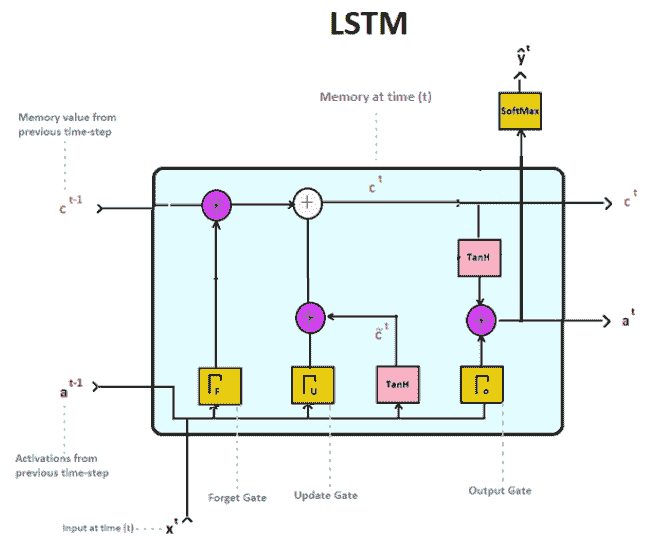

在上一章，我们看到了 RNN 如何通过时间上的反馈连接来存储近期输入的表示，通过激活值。这些激活值本质上可以被视为单元的短期记忆，因为它们主要受紧接着的前一时间步激活值的影响。遗憾的是，梯度消失问题使得我们无法利用发生在非常早期时间步（长期记忆）的信息来指导后续的预测。我们看到，构成隐藏状态的权重倾向于衰减或爆炸，因为误差在更多时间步中进行反向传播。我们该如何解决这个问题？我们如何才能有效地让信息流经时间步，像是让它流动，来影响序列中后期的预测？答案，当然，来自 Hochreiter 和 Schmidthuber，他们提出了在 RNN 中同时使用长期记忆 (*c^((t-1))*) 和短期记忆 (*a^((t-1))*) 的方法。

这种方法使得它们能够有效克服在长序列中进行相关预测的问题，通过实现一种能够有效保存远程事件相关记忆的 RNN 设计。实际上，这是通过采用一组信息门来完成的，这些信息门在保存和传递细胞状态方面表现出色，细胞状态编码了来自遥远过去的相关表示。这一重大突破已被证明适用于多种应用场景，包括语音处理、语言建模、非马尔可夫控制和音乐生成。

这里提供了进一步阅读的来源：

+   **原始 LSTM 论文 Hochreiter 和 Schmidthuber**：[`www.bioinf.jku.at/publications/older/2604.pdf`](https://www.bioinf.jku.at/publications/older/2604.pdf)

# 解构 LSTM

如前所述，LSTM 架构依赖于一系列门，这些门可以独立地影响来自前一个时间步的激活值（*a^((t-1))*）以及记忆值（*c^(**^(t-1)*)）。这些值在信息流经 LSTM 单元时被转化，最终在每次迭代中输出当前时间步的激活（*a^t*）和记忆（*c^t*）向量。虽然它们的早期版本分别进入单元，但它们允许以两种大致的方式相互作用。在下面的图示中，门（用大写希腊字母 gama，或 Γ 表示）代表了对它们各自初始化的权重矩阵与先前激活和当前输入的点积应用的 sigmoid 激活函数：

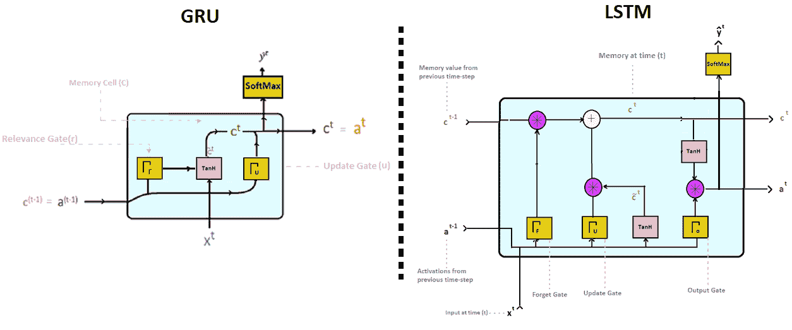

# 比较最接近的已知亲戚

让我们尝试通过运用我们之前对 GRU 架构的知识来理解 LSTM 是如何工作的，我们在上一章中已经看到过它。正如我们很快会发现的那样，LSTM 只是 GRU 的一个更复杂版本，尽管它遵循了与 GRU 操作相同的基本原理。

# GRU 记忆

记得 GRU 架构是通过更新门利用两个向量来计算其单元状态（或记忆）的。这两个向量分别是来自先前时间步的激活（`c`**t-1**），以及一个候选向量（**c ̴**`t`）。候选向量在每个时间步表现为当前单元状态的候选者，而激活则代表了 GRU 从前一个时间步的隐藏状态。这两个向量对当前单元状态的影响程度由更新门决定。这个门控制信息流，允许记忆单元用新的表示来更新自身，从而为后续的预测提供相关的信息。通过使用更新门，我们能够计算出给定时间步的新单元状态（**c^t**），如下所示：

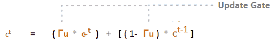

正如我们所观察到的，GRU 使用更新门（**Γu**）及其逆门（**1- Γu**）来决定是用新值（**c ̴****^t**）更新记忆单元，还是保留前一个时间步的旧值（`c`**^(t-1)**）。更重要的是，GRU 利用一个更新门及其逆值来控制记忆值（**c^t**）。LSTM 架构则提出了一种更复杂的机制，并且在核心部分使用与 GRU 架构类似的方程来维持相关状态。但它到底是如何做到的呢？

# LSTM 记忆单元

在下面的图示中，您会注意到 LSTM 单元顶部的直线，它表示该单元的记忆或细胞状态（*c^t*）。更技术性地讲，细胞状态由**常数误差旋转环**（**CEC**）定义，它本质上是一个递归自连接的线性单元。这个实现是 LSTM 层的核心组件，使得在反向传播过程中能够强制执行恒定的误差流动。本质上，它允许缓解其他 RNN 所遭遇的梯度消失问题。

CEC 防止误差信号在反向传播过程中迅速衰减，从而使得早期的表示能够得到良好保持，并传递到未来的时间步。可以将其视为信息高速公路，使得这种架构能够学习在超过 1,000 步的时间间隔内传递相关信息。研究表明，这在各种时间序列预测任务中是有效的，能够有效解决以前架构面临的问题，并处理噪声输入数据。尽管通过梯度裁剪（如我们在上一章所见）可以解决梯度爆炸问题，但梯度消失问题同样可以通过 CEC 实现来解决。

现在我们已经对细胞状态如何通过 CEC 的激活来表示有了一个高层次的理解。这个激活（即 *c^t*）是通过多个信息门的输入来计算的。LSTM 架构中不同门的使用使其能够控制通过各个单元的误差流动，从而帮助维持相关的细胞状态（简写为`c`）：

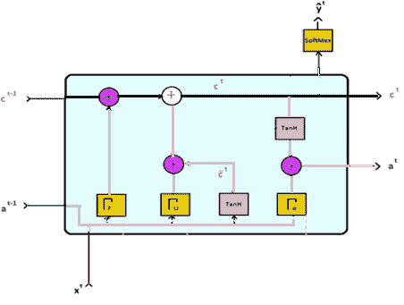

# 将激活值和记忆单独处理

注意观察短期记忆（`a`*^(t-1)*)和长期记忆（`c`*^(t-1)*)是如何分别流入该架构的。来自前一时刻的记忆通过图示的左上角流入，而来自前一时刻的激活值则从左下角流入。这是我们从已经熟悉的 GRU 架构中能够注意到的第一个关键区别。这样做使得 LSTM 能够同时利用短期激活值和网络的长期记忆（细胞状态），同时计算当前记忆（`c`*^t*）和激活值（`a`*^t*）。这种二元结构有助于维持时间上的持续误差流动，同时让相关的表示被传递到未来的预测中。在**自然语言处理**（**NLP**）中，这样的预测可能是识别不同性别的存在，或者某个词序列中存在复数实体的事实。然而，如果我们希望从一个给定的词序列中记住多个信息呢？如果我们想在较长的词序列中记住一个主题的多个事实呢？考虑机器问答的情况，以下是两个句子：

+   拿破仑被流放到圣赫勒拿岛已经有几个月了。他的精神已经衰弱，身体虚弱，但正是从他房间四周苍白绿色墙纸上滋生的潮湿霉菌中的砒霜，慢慢导致了他的死亡。

+   拿破仑在哪里？拿破仑是如何去世的？

# LSTM 记忆块

为了能够回答这些问题，我们的网络必须有多个记忆单元，每个单元可以存储与我们研究对象——法国皇帝拿破仑·波拿巴——相关的准依赖信息。实际上，一个 LSTM 单元可以有多个记忆单元，每个单元存储输入序列中的不同表示。一个可能存储主题的性别，另一个可能存储有多个主题的事实，依此类推。为了清晰地展示，我们在本章中只描绘了每个图示中的一个记忆单元。我们这么做是因为理解一个单元的工作原理足以推断出一个包含多个记忆单元的记忆块的工作方式。LSTM 中包含所有记忆单元的部分被称为记忆块。架构的自适应信息门控由记忆块中的所有单元共享，并用于控制短期激活值（*a^(t-1)*）、当前输入（*X^t*）和 LSTM 的长期状态（`c`*^t*）之间的信息流动。

# 忘记门的重要性

正如我们所注意到的，定义 LSTM 记忆单元状态（`c`*^t*）的方程与 GRU 的状态方程在本质上是相似的。然而，一个关键的区别是，LSTM 利用了一个新的门（Γf），即遗忘门，以及更新门来决定是否忘记在前一个时间步存储的值（`c`*^(t-1)*），或者将其包含在新单元记忆的计算中。以下公式描述了负责保持我们 LSTM 单元状态的 CEC（记忆单元控制单元）。它正是让 LSTM 能够有效记住长期依赖关系的公式。如前所述，CEC 是每个 LSTM 记忆单元特有的神经元，定义了在任何给定时间的单元状态。我们将从 LSTM 单元如何计算它的记忆单元中存储的值（**C^t**）开始：

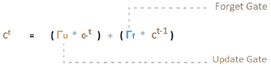

这使得我们可以将来自候选值(*c ^̴**^t*)和前一个时间步的记忆值(*c^(t-1)*)的信息，结合到当前的记忆值中。正如我们很快会看到的，这个遗忘门其实就是一个对矩阵级别的点积应用 sigmoid 激活函数，并加上一个偏置项，帮助我们控制从前一个时间步传递过来的信息流。

# 概念化差异

值得注意的是，遗忘门在保持单元状态方面与 GRU 架构所采用的机制存在一个重要的概念性区别，它们的目标是实现相似的效果。可以这样理解：遗忘门允许我们控制前一个单元状态（或记忆）在多大程度上影响当前的单元状态。而在 GRU 架构中，我们只是简单地暴露前一个时间步的全部记忆，或者只是新的候选值，很少在两者之间做出妥协。

GRU 单元状态的计算如下：


这种在暴露整个记忆和新的候选值之间的二元权衡实际上是可以避免的，正如 LSTM 架构所展示的那样。通过使用两个独立的门，每个门都有自己可学习的权重矩阵，来控制我们 LSTM 的单元状态，从而实现这一点。LSTM 单元状态的计算如下：


# 走进 LSTM

所以，让我们仔细看一下描述 LSTM 架构的整个方程组。我们将首先研究的门是遗忘门和更新门。与 GRU 不同，LSTM 使用这两个门来确定每个时间步的记忆值(*c^t*)：


首先，让我们看看这些门是如何计算的。以下公式表明，这些门实际上只是将前一时刻的激活值与当前输入的点积，通过对应的权重矩阵（*Wf*和*Wu*分别用于遗忘门和输出门），再应用 sigmoid 函数的结果：

+   *遗忘门 (ΓF) = sigmoid ( Wf  at-1, ![ t ] + bF)*

+   *更新门 (ΓU) = sigmoid ( Wu  at-1, ![ t ] + bu)*

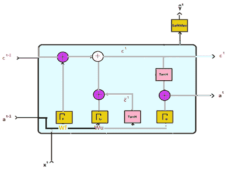

# 可视化信息流

这两个向量 (`a`*^(t-1)* 和 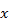 t) 分别从 LSTM 单元的左下角进入，并在到达时被复制到每个门（ΓF 和ΓU）。然后，它们分别与各自门的权重矩阵相乘，再对它们的点积应用 sigmoid，并加上偏置项。正如我们所知，sigmoid 函数以其将输入压缩到零和一之间而闻名，因此每个门的值都在这个范围内。重要的是，每个权重矩阵是特定于给定门的（*Wf*用于遗忘门，*Wu*用于更新门）。权重矩阵（*Wf*和*Wu*）代表 LSTM 单元中的一部分可学习参数，并在反向传播过程中迭代更新，就像我们一直在做的那样。

# 计算单元状态

现在我们知道了两个门（更新门和遗忘门）分别代表什么，它们是如何计算的，我们可以继续理解它们如何在给定时间步影响我们 LSTM 的记忆（或状态）。请再次注意流向和流出门的不同信息路径。输入从单元格的左侧进入，经过转换并传播，直到它们到达 LSTM 单元的右侧，如下图所示：

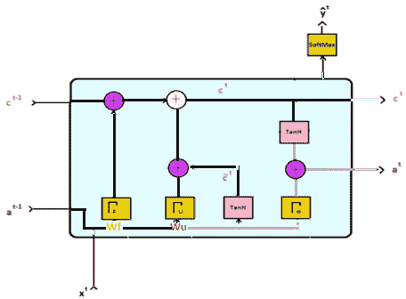

正如我们所看到的，遗忘门（*ΓF*）的作用，字面上就是忘记来自前一个时间步的记忆值。同样，更新门（*Γu*）决定是否允许将潜在的候选值（*c ^(̴t)*) 纳入当前时间步。这两个门共同负责在给定时间步保留我们 LSTM 记忆的状态（`c`*^t*）。在数学上，这可以转化为以下公式：

+   *当前记忆值* *(c^t*) = ( Γu * c ^(̴t) ) + (ΓF * c^(t-1) )*

正如我们提到的，每个门本质上表示一个介于零和一之间的值，因为我们通过非线性 sigmoid 函数将值压缩。我们知道，由于 sigmoid 的工作范围，大多数值往往非常接近零或接近一，因此我们可以将这些门看作是二进制值。这是有用的，因为我们可以将这些门想象成打开（1）让信息流通，或者关闭（0）。介于零和一之间的任何值都能让部分信息流入，但并不是全部。

所以，现在我们理解了这些门值是如何计算的，以及它们如何控制候选者值(*c ^̴**^t*)或前一个记忆状态(`c`*^(t-1)*)在当前状态计算中应具有的影响程度。LSTM 记忆的状态(`c`*^t*)由之前展示的 LSTM 图中顶部的直线定义。实际上，这条直线（即常数误差环）非常擅长保持相关信息并将其传递到未来的时间步，以协助预测。

# 计算候选者记忆

我们现在知道了如何计算时间点(`t`)的记忆，但那么候选者(*c ^(̴t)*)本身呢？毕竟，它在维护相关的记忆状态方面起着部分作用，特点是每个时间步出现的可能有用的表示。

这与我们在 GRU 单元中看到的想法相同，在那里我们允许在每个时间步使用候选者值更新记忆值。早些时候，在 GRU 中，我们使用了一个相关性门来帮助我们为 GRU 计算它。然而，在 LSTM 的情况下，这是不必要的，我们得到了一个更加简单且可以说更优雅的公式，如下所示：

+   *候选者记忆值 (c ^(̴t)) = tanh ( Wc  a^(t-1), ![ t ] + bc)*

这里，*Wc* 是一个权重矩阵，在训练开始时初始化，并随着网络训练而迭代更新。这个矩阵与前一时刻的激活值(*a^(`t`-1)*)和当前输入(*x^t*)的点积，再加上偏置项(*bc*)，通过 tanh 激活函数得出候选者值(`c` *^̴^t*)。然后，这个候选者向量与我们在当前时间看到的内存状态(`c`*^t*)的更新门值进行逐元素相乘。在下图中，我们说明了候选者记忆向量的计算，并展示了如何将信息传递到下一个时间步，影响最终的记忆单元状态(`c``t`)：

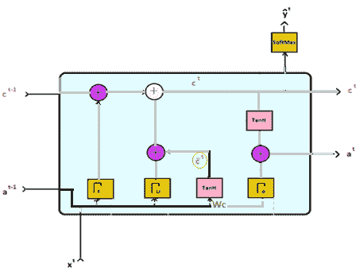

请记得，tanh 激活函数有效地将输出压缩到 -1 和 1 之间，因此候选者向量(*c ^(̴t)*)的值总是出现在这个范围内。现在我们理解了如何计算 LSTM 的单元状态（或记忆）在给定时间步的值。我们还了解了在更新门调整之前，候选者值是如何计算的，然后传递到当前记忆的计算中，(`c`*^t*)。

# 计算每个时间步的激活值

正如我们之前在 LSTM 架构中指出的，它分别接收来自前一时间步的记忆和激活值。这与我们在 GRU 单元中做出的假设不同，在 GRU 中我们有 *a^t = ct*。这种双重数据处理方式使得我们能够在很长的序列中保留相关的表示，甚至可能达到 1,000 个时间步！然而，激活值始终与每个时间步的记忆（*c^t*）功能相关。因此，我们可以通过首先对记忆（*c^t*）应用 tanh 函数，然后将结果与输出门值（Γo）进行逐元素计算，来计算某个时间步的激活值。请注意，在这一步我们并不初始化权重矩阵，而只是对（*c^t*）向量中的每个元素应用 tanh 函数。数学表达式如下：

+   *当前激活值 (a^t ) = Γo * tanh(c^t)*

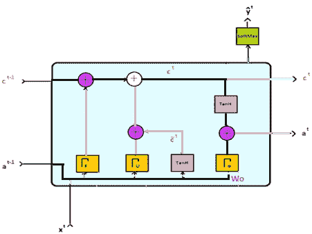

在这里，输出门不过是另一个 sigmoid 函数，应用于一个可学习的权重矩阵的点积，其中包含来自前一时间步的激活值和当前时刻的输入，具体如下：

+   *输出门 (Γo) = sigmoid ( Wo  a^(t-1), ![ t ] + bo)*

存在于每个单独门（分别为遗忘门、更新门、候选门和输出门）的权重矩阵（*Wf*, *Wu*, *Wc*, 和 *Wo*）可以被视为 LSTM 单元的可学习参数，并在训练过程中不断更新。在这里提供的图示中，我们可以观察到每个权重矩阵是如何塑造进入各自门的输入，随后将结果传递到架构的其他部分：

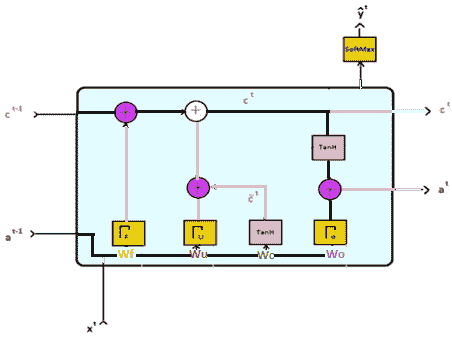

# LSTM 的变种与性能

你已经看到了 LSTM 的一个变种，即 GRU。我们已经广泛讨论了这两种架构的不同。还有其他一些变种同样值得注意。其中之一是 LSTM 的变种，它包含了被称为**窥视连接**（peephole connections）的东西。这些连接允许信息从细胞状态流回到信息门（遗忘门、更新门和输出门）。这使得我们的 LSTM 门在计算当前时间的门值时，可以“窥视”来自前一时间步的记忆值。

# 了解窥视连接（peephole connections）

窥视孔连接的核心思想是捕捉时间延迟信息。换句话说，我们希望在建模过程中包括序列子模式之间时间间隔传递的信息。这不仅对于某些语言处理任务（如*语音识别*）相关，而且对于从机器运动控制到计算机生成音乐中保持复杂节奏的其他众多任务也非常重要。以前处理语音识别等任务的方法使用了**隐马尔可夫模型**（**HMMs**）。这些本质上是统计模型，基于隐藏状态转移序列估计一组观察值的概率。在语音处理的例子中，观察值被定义为对应语音的数字信号片段，而马尔可夫隐藏状态则是我们希望识别为单词的音素序列。如你所见，这个模型中并未考虑音素之间的延迟，无法判断某一数字信号是否对应某个特定的单词。这些信息在 HMM 中通常会被丢弃，但在我们判断是听到句子*I want to open my storage unit before...*还是*I want to open my storage unit, B-4*时，延迟信息可能至关重要。在这些例子中，音素之间的延迟很可能区分出*B-4*和*before*。虽然 HMM 超出了本章讨论的范围，但它帮助我们理解了 LSTM 如何通过利用时间序列之间的延迟，克服了以往模型的局限。

你可以在以下链接查看窥视孔论文：ftp://ftp.idsia.ch/pub/juergen/TimeCount-IJCNN2000.pdf：

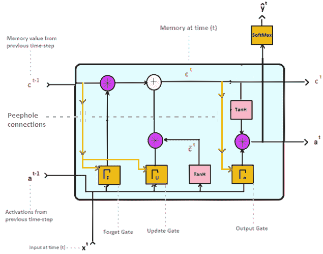

请注意，窥视孔修改可以应用于任意一个门。你可以选择对所有门实施该修改，或者仅对其中的一部分实施。

以下方程展示了在添加窥视孔连接以包含前一单元状态时，计算各门值时执行的计算：

+   *遗忘门 (ΓF) = sigmoid ( Wf  c^(t-1) , a^(t-1), ![ t ] + bF)*

+   *更新门 (ΓU) = sigmoid ( Wu  c^(t-1) , a^(t-1), ![ t ] + bu)*

+   *输出门 (Γo) = sigmoid ( Wo c^(t-1) , a^(t-1), ![ t ] + bo)*

因此，窥视孔修改在数学上简化为在计算给定门值时执行额外的矩阵级别乘法。换句话说，门的值现在可以通过与给定门的权重矩阵计算点积来容纳前一单元状态。然后，得到的点积与前两个点积及偏置项一起求和，再通过 sigmoid 函数进行处理。

# 时序和计数的重要性

让我们通过另一个概念性例子，进一步巩固使用时间间隔相关信息来指导顺序预测的理念，在这个例子中，这类信息被认为对于准确预测至关重要。举个例子，考虑一个人类鼓手，必须执行一系列精确的运动指令，这些指令对应着精确的节奏流。鼓手根据时间来安排他们的动作，并按顺序依赖地计数他们的进度。在这里，代表生成序列模式的信息，至少部分地，是通过这些事件之间的时间延迟来传达的。自然，我们会有兴趣人工复制这种复杂的序列建模任务，这种任务在这些互动中发生。从理论上讲，我们甚至可以利用这种方法从计算机生成的诗歌中提取新的押韵模式，或者创造可以在未来的奥运会中与人类竞争的机器人运动员（无论我们集体决定出于什么理由认为这是个好主意）。如果你希望进一步研究如何通过窥视连接来增强对复杂时间延迟序列的预测，我们鼓励你阅读原始的 LSTM 窥视点修改论文，链接如下：

[`www.jmlr.org/papers/volume3/gers02a/gers02a.pdf`](http://www.jmlr.org/papers/volume3/gers02a/gers02a.pdf)

# 探索其他架构变体

除了本书中涉及的 RNN 变体外，还有许多其他 RNN 变体（参见*深度门控 RNNs*，*姚等人*，2015；或*时钟 RNNs*，*Koutnik 等人*，2014）。这些变体每个都适合在特定任务中使用——普遍的共识是 LSTM 在大多数时间序列预测任务中表现出色，并且可以相当修改以适应大多数常见和更复杂的使用案例。事实上，作为进一步阅读，我们推荐一篇优秀的文章（*LSTM：一次搜索空间奥德赛*，2017：[`arxiv.org/abs/1503.04069`](https://arxiv.org/abs/1503.04069)），该文章比较了不同 LSTM 变体在多种任务中的表现，如语音识别和语言建模。由于该研究使用了大约 15 年的 GPU 时间来进行实验，因此它成为了一项独特的探索性资源，供研究人员更好地理解不同 LSTM 架构的考虑因素及其在建模顺序数据时的效果。

# 运用我们的知识

现在我们已经充分理解了 LSTM 的工作原理，以及它在特定任务中尤为擅长的方面，是时候实施一个真实世界的例子了。当然，时间序列数据可以出现在各种场景中，从工业机器的传感器数据到表示来自遥远星辰的光谱数据。然而，今天我们将模拟一个更常见但臭名昭著的用例。我们将使用 LSTM 来预测股价的波动。为此，我们将使用标准普尔（S&P）500 数据集，并随机选择一只股票准备进行序列建模。该数据集可以在 Kaggle 上找到，包含了所有当前 S&P 500 大市值公司在美国股市交易的历史股价（开盘价、最高价、最低价和收盘价）。

# 关于建模股市数据

在继续之前，我们必须提醒自己，市场趋势中蕴含着固有的随机性。也许你更倾向于相信有效市场假说，而不是非理性市场理论。无论你个人对股票波动背后的内在逻辑持何种信念，现实是，市场中有大量的随机性，常常连最具预测性的模型也无法捕捉。投资者行为难以预见，因为投资者往往出于不同的动机进行操作。即使是一般的趋势也可能具有欺骗性，正如最近比特币资产泡沫在 2017 年底的崩溃所证明的那样；还有许多其他例子（2008 年全球危机、津巴布韦的战后通货膨胀、1970 年代的石油危机、一战后德国的经济困境、荷兰黄金时代的郁金香狂热，等等，甚至可以追溯到古代）。

事实上，许多经济学家曾引用股市波动中似乎固有的随机性。普林斯顿大学经济学家伯顿·马尔基尔在近半个世纪前的著作《*华尔街的随机漫步*》中强调了这一点。然而，仅仅因为我们无法获得完美的预测结果，并不意味着我们不能尝试将我们的猜测引导到比喻上的“正确方向”。换句话说，这种序列建模的尝试在预测市场短期内的整体趋势时，仍然可能是有用的。那么，我们现在就导入数据，看看我们在这里处理的是什么内容，不再赘述。请随时跟随您的市场数据，或者使用我们所用的相同数据集，您可以在以下网址找到： [`www.kaggle.com/camnugent/sandp500`](https://www.kaggle.com/camnugent/sandp500)。

# 导入数据

数据存储在**逗号分隔值**（**CSV**）文件中，可以通过 pandas 的 CSV 读取器导入。我们还将导入标准的 NumPy 和 Matplotlib 库，并使用来自 sklearn 的`MinMaxScaler`库，以便在合适的时候重塑、绘制和归一化我们的数据，如以下代码所示：

```py
import numpy as np
import pandas as pd
import matplotlib.pyplot as plt
from sklearn.preprocessing import MinMaxScaler
df = pd.read_csv('D:/Advanced_Computing/Active_Experiments/LSTM/
                  stock_market/all_stocks_5yr.csv')

df.head()
```

我们得到的输出如下：

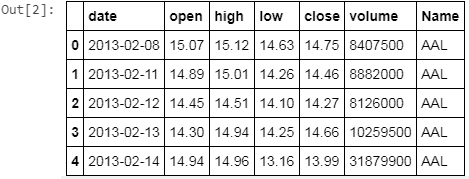

# 排序并可视化趋势

首先，我们将从数据集中 505 只不同的股票中随机选择一只。你可以选择任何一只来重复进行这个实验。我们还将按日期对 DataFrame 进行排序，因为我们处理的是时间序列预测问题，在这种问题中，序列的顺序对于预测任务的价值至关重要。接着，我们可以通过按顺序绘制高价和低价（某一天）的走势图来可视化我们的数据。这有助于我们直观地查看美国航空集团（股票代码：`AAL`）在五年期（2013-2017 年）内的股票价格走势，如下所示：

```py
plt.figure(figsize = (18,9))
plt.plot(range(aal.shape[0]),(aal['low']), color='r')
plt.plot(range(aal.shape[0]),(aal['high']), color = 'b')
plt.xticks(range(0,aal.shape[0],60),aal['date'].loc[::60],rotation=60)
plt.xlabel('Date',fontsize=18)
plt.ylabel('Price',fontsize=18)
plt.show()
```

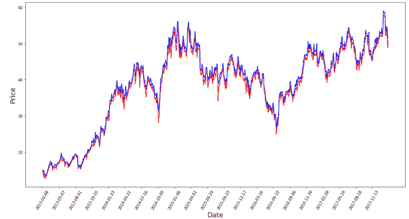

# 从 DataFrame 到张量

我们观察到，尽管高价和低价略有不同，但它们的走势显然遵循相同的模式。因此，使用这两个变量进行预测建模是多余的，因为它们高度相关。当然，我们可以从这两个中选择一个，但也可以在任何给定的市场日，将两个价格指标取个平均值。我们将把包含某一天的高价和低价的列转换为 NumPy 数组。具体做法是通过调用各自列的`values`，这将返回每列的 NumPy 表示。然后，我们可以使用这些新定义的列来计算一个第三个 NumPy 数组，存储所有给定观察值的中间价（计算方式为 *(high + low) /2)*，如下面所示：

```py
high_prices = aal.loc[:,'high'].values
low_prices = aal.loc[:,'low'].values
mid_prices = (high_prices+low_prices)/2.0

mid_prices.shape
----------------------------------------------------
Output:
(1259,) ----------------------------------------------------mid_prices
----------------------------------------------------
Output:
array([14.875, 14.635, 14.305, ..., 51.07 , 50.145, 51.435])
```

我们注意到，总共有`1259`个观察值，每个观察值对应于我们 AAL 股票在某一天的中间价。我们将使用这个数组来定义我们的训练数据和测试数据，然后将它们按序列批次准备好，供 LSTM 模型使用。

# 拆分数据

现在，我们将把整个实例范围（即`mid_prices`变量）拆分为训练集和测试集。稍后，我们将分别使用这些数据集生成训练和测试序列：

```py
train_data = mid_prices[:1000]
test_data = mid_prices[1000:1251]
train_data = train_data.reshape(-1,1)         #scaler.fit_transform
test_data = test_data.reshape(-1,1)           #scaler.fit_transform

print('%d training and %d total testing instances'%(len(train_data),    
      len(test_data)))

-----------------------------------------------------------------
Output:
1000 training and 251 total testing instances 
```

# 绘制训练和测试集的划分

在下面的截图中，我们简单地展示了两个子图，用于可视化未归一化的 AAL 股票数据的训练和测试部分。你可能会注意到，图表的比例并不一致，因为训练数据包含 1,000 个观察值，而测试数据仅包含大约四分之一的观察值。同样，测试数据的价格区间出现在 40 到 57 美元之间，而训练数据则出现在 0 到 50+美元之间，并覆盖了一个更长时间范围的观察期。请记住，测试数据只是我们预处理后的 AAL 中间股票价格数据中，紧跟前 1,000 个观察值后的时间序列：

```py
#Subplot with training data
plt.subplot(1,2,1)
plt.plot(range(train_data.shape[0]),train_data,color='r',label='Training split')
plt.title('Train Data')
plt.xlabel('time')
plt.ylabel('Price')
plt.legend()

#Subplot with test data
plt.subplot(1,2,2)
plt.plot(range(test_data.shape[0]),test_data,color='b',label='Test Split')
plt.title('Test Data')
plt.xlabel('time')
plt.ylabel('Price')
plt.legend()

#adjust layout and plot all
plt.tight_layout()
plt.show()
```

上述代码块生成了以下输出：

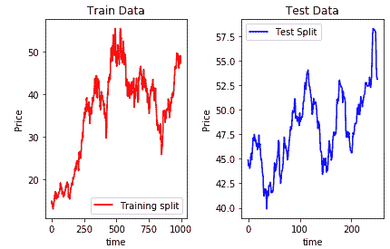

# 窗口归一化

在我们将数据划分为更小的序列进行训练之前，我们必须将所有数据点缩放到零和一之间，正如我们迄今为止所做的那样。回想一下，这种表示方式使得我们的网络更容易从展示的数据中捕捉到相关的表示，并且这是深度学习社区内外针对各种**机器学习**（**ML**）任务的常见标准化方法。

然而，与之前的方法不同，我们必须调整我们的标准化策略来适应这个特定的时间序列问题。为此，我们采用了窗口标准化方法。为什么？因为这使我们能够在较小的批次中对数据进行标准化，而不是一次性对整个数据集进行标准化。早些时候，当我们可视化整个股票数据的时间序列时，我们注意到了一些问题。事实证明，不同年份的数据在不同时间段内具有不同的值范围。因此，整体标准化过程会导致时间序列早期出现的值接近零。这会阻止我们的模型按预期区分相关的趋势，并且在训练网络时，严重削弱了能够捕捉到的表示。你当然可以选择更宽的特征范围——但是，这也会对学习过程产生不利影响，因为**人工神经网络**（**ANNs**）在处理零到一之间的值时效果最好。

所以让我们实现这个窗口标准化方案，如下代码块所示：

```py
#Window size to normalize data in chunks 
normalization_window = 250

#Feature range for normalization
scaler = MinMaxScaler(feature_range=(0, 1))

# Loop over the training data in windows of 250 instances at a time
for i in range(0,1000,normalization_window):

    # Fit the scaler object on the data in the current window
    scaler.fit(train_data[i:i+normalization_window,:])

    # Transform the data in the current window into values between the chosen feature range (0 and 1)
    train_data[i:i+normalization_window,:] = scaler.transform(train_data[i:i+normalization_window,:])

# normalize the the test data
test_data=scaler.fit_transform(test_data)
```

我们刚才采用的窗口标准化方法有一个问题值得提及。批量标准化数据可能在每个批次的结尾引入连续性的中断，因为每个批次都是独立标准化的。因此，建议选择一个合理的窗口大小，以避免在训练数据中引入过多的中断。就我们的情况而言，我们将选择 250 天的窗口大小，因为这不仅能完美地划分我们的训练集和测试集，而且在标准化整个数据集时（即 1000 / 250 = 4）只会引入四个潜在的连续性中断。我们认为这对于当前的演示用例是可控的。

# 数据去噪

接下来，我们将去噪我们的股票价格数据，以去除当前存在的那些不太相关的市场波动。我们可以通过以指数递减的方式加权数据点来做到这一点（也就是**指数平滑**）。这使得我们能够让近期的事件对当前数据点的影响大于远古的事件，从而每个数据点都可以作为当前值和时间序列中前面值的加权递归函数来表示（或平滑）。这可以用数学公式表示如下：

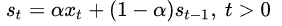

前面的公式表示了给定数据点（`x[t]`）的平滑转换，作为加权项 gamma 的函数。结果（`S[t]`）是给定数据点的平滑值，而 gamma 项表示一个介于零和一之间的平滑因子。衰减项使我们能够将可能对特定时间间隔内数据变化（即季节性）存在的假设编码到我们的预测模型中。因此，我们将平滑绘制的股价曲线与时间的关系。这是时间序列建模中常用的信号预处理技术，有助于去除数据中的高频噪声。

# 实施指数平滑

因此，我们通过循环遍历每个中间价格值来转换我们的训练数据，更新平滑系数，然后将其应用于当前价格值。请注意，我们使用之前展示的公式来更新平滑系数，这使我们能够根据当前和前一个观测值的加权函数对时间序列中的每个观测值进行加权：

```py
Smoothing = 0.0     #Initialize smoothing value as zero

gamma = 0.1         #Define decay

for i in range(1000):

    Smoothing = gamma*train_data[i] + (1-gamma)*Smoothing   # Update   
                                                       smoothing value

    train_data[i] = Smoothing # Replace datapoint with smoothened value
```

# 可视化曲线

使用下面的图示，我们可以可视化平滑前后数据点曲率的差异。如您所见，紫色图表显示了一个更加平滑的曲线，同时保持了股价随时间变化的总体走势。

如果我们使用未平滑的数据点，我们很可能会很难使用任何类型的机器学习技术来训练预测模型：

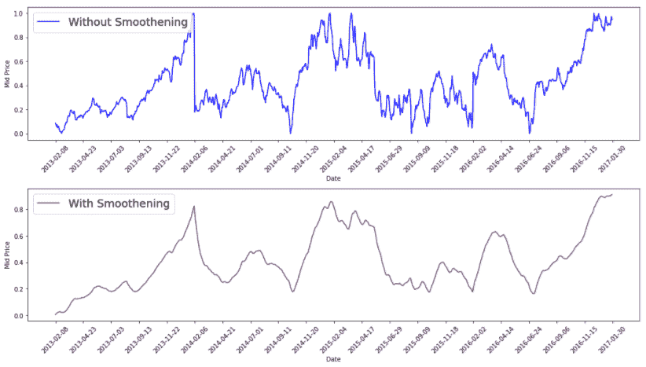

表示是关键，且始终存在准确性和效率之间的最佳平衡。一方面，使用简化的表示可能使机器更快地从数据中学习。然而，简化到更易管理的表示的过程可能会导致有价值的信息丢失，这些信息可能不再被我们的统计模型捕捉到。另一方面，处理全部信息会引发计算复杂性的洪流，这种复杂性既没有必要的资源来建模，也不常需要考虑来解决眼前的问题。

# 执行一步预测

接下来，我们将解释一些基准模型。这将帮助我们更好地评估 LSTM 网络的有效性。我们进行的平滑处理将帮助我们实现这些基准模型，这些模型将用于基准测试我们 LSTM 模型的性能。我们将尝试使用一些相对简单的算法。为此，我们将使用两种技术，分别是简单移动平均和指数移动平均算法。这两种方法本质上都是进行一步预测，将训练数据中下一个时间序列的值预测为前一序列值的平均值。

为了评估每种方法的有效性，我们可以使用**均方误差**（**MSE**）函数来评估预测值与实际值之间的差异。回顾一下，这个函数实际上是在每个时间步长上，对预测值和实际结果之间的误差进行平方运算。我们还将通过将预测的时间序列进程与实际的股票价格时间序列进程叠加，直观地验证我们的预测。

# 简单移动平均预测

对于简单移动平均法，我们在预测时间序列中的下一个值时，会对给定窗口内的过去观测值进行等权重处理。在这里，我们计算给定时间间隔内股票价格的算术平均值。这个简单的算法可以用以下数学公式表示：

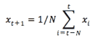

采用短期平均（即在几个月内）将使模型能够快速响应价格变化，而长期平均（即在几年内）通常对价格变化的反应较慢。在 Python 中，这一操作可以转化为以下代码：

```py
window_size = 26            # Define window size
N = train_data.size         # and length of observations

std_avg_predictions = []    # Empty list to catch std
mse_errors = []             # and mse

for i in range(window_size,N):
    # Append the standard mean per window
    std_avg_predictions.append(np.mean(train_data[i-window_size:i]))                                                                                                         

    # Compute mean squared error per batch 
    mse_errors.append((std_avg_predictions[-1]-train_data[i])**2) 

print('MSE error for standard averaging: %.5f'  
      (0.5*np.mean(mse_errors)))

MSE error for standard averaging: 0.00444
```

我们通过再次遍历我们的训练数据，使用预定义的窗口大小，并收集每个数据点的批次均值以及均方误差（MSE），从而收集了简单平均预测。正如 MSE 值所示，我们的简单平均预测模型表现得还不错。接下来，我们可以将这些预测值绘制出来，并将其与我们股票价格的真实时间序列进程叠加在一起，从而直观地展示这种方法的表现：

```py
plt.figure(figsize = (19,6))
plt.plot(range(train_data.shape[0]),train_data,color='darkblue',label='Actual')
plt.plot(range(window_size,N),std_avg_predictions,color='orange',label='Predicted')
plt.xticks(range(0,aal.shape[0]-len(test_data),50),aal['date'].loc[::50],rotation=45)

plt.xlabel('Date')
plt.ylabel('Mid Price')
plt.legend(fontsize=18)
plt.show()
```

我们得到以下图表：

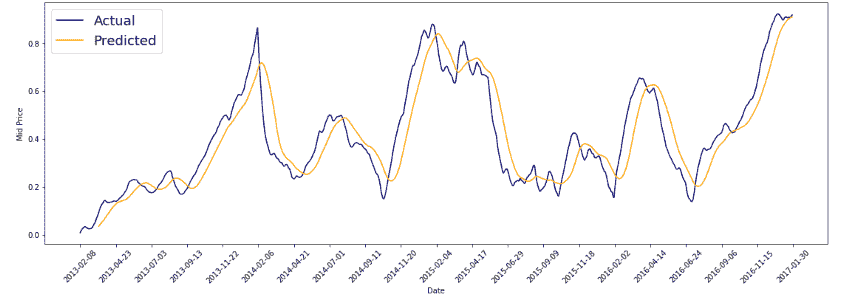

在简单平均预测图中，我们注意到我们的预测确实捕捉到了股票价格的总体趋势，但在时间序列的各个独立点上并没有提供准确且可靠的预测。有些预测可能看起来非常准确，但大多数都偏离了实际值，而且它们相对于真实值变化的速度也太慢，无法做出任何有利可图的预测。如果你想更直观地了解预测的准确度，可以单独打印出预测数组的各个值，并与训练数据中的实际值进行比较。接下来，我们将继续进行第二个基准测试。

# 指数移动平均预测

指数移动平均比简单的移动平均稍微复杂一些；然而，我们已经熟悉我们将使用的公式。从本质上讲，我们将使用与平滑数据时相同的方程式。不过，这次我们将使用指数平均法来预测时间序列中的下一个数据点，而不是重新调整当前的数据点：

```py
ema_avg_predictions = []
mse_errors = []

EMA = 0.0
ema_avg_predictions.append(EMA)

gamma = 0.5
window_size = 100
N = len(train_data)

for i in range(1,N):
    EMA = EMA*gamma + (1.0-gamma)*train_data[i-1]
    ema_avg_predictions.append(EMA)
    mse_errors.append((ema_avg_predictions[-1]-train_data[i])**2)

print('MSE error for EMA averaging: %.5f'%(0.5*np.mean(mse_errors)))

MSE error for EMA averaging: 0.00018
```

正如我们所见，简单移动平均（[`en.wikipedia.org/wiki/Moving_average#Simple_moving_average`](https://en.wikipedia.org/wiki/Moving_average#Simple_moving_average)）赋予过去的观察值相同的权重。相反，我们使用指数函数来控制先前数据点对未来数据点的影响程度。换句话说，我们能够随着时间推移，给早期数据点分配逐渐减少的权重。这种技术允许建模者通过修改衰减率（gamma），将先验假设（例如季节性需求）编码到预测算法中。当与简单平均法计算得到的 MSE 相比，基于一步前的指数平均法得到的 MSE 要低得多。让我们绘制一张图表，直观地检查我们的结果：

```py
plt.figure(figsize = (19,6))
plt.plot(range(train_data.shape[0]),train_data,color='darkblue',label='True')
plt.plot(range(0,N),ema_avg_predictions,color='orange', label='Prediction')
plt.xticks(range(0,aal.shape[0]-len(test_data),50),aal['date'].loc[::50],rotation=45)

plt.xlabel('Date')
plt.ylabel('Mid Price')
plt.legend(fontsize=18)
plt.show()

```

我们得到如下图表：

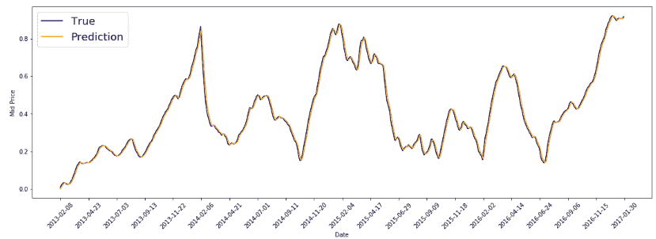

# 一步前预测的问题

非常棒！看起来，给定一组前几天的数据，我们几乎可以完美预测第二天的股价。我们甚至不需要训练复杂的神经网络！那么，为什么还要继续呢？事实证明，提前一天预测股价并不能让我们变成百万富翁。移动平均线本质上是滞后指标，它们仅在股价开始跟随某一特定趋势后，才能反映市场的重大变化。由于我们的预测与事件实际发生之间时间跨度较短，当这种模型反映出明显的趋势时，市场的最佳进入点往往已经过去。

另一方面，使用这种方法尝试预测多个时间步的未来股价也不会成功。我们实际上可以用数学来说明这一概念。假设我们有一个数据点，我们希望使用指数移动平均法预测两步以后的股价。换句话说，我们将不会使用(X[t + 1])的真实值，而是使用我们的预测值来计算接下来一天的股价。回顾一下，一步前预测的方程式定义如下：

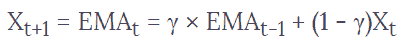

假设数据点`X[t]`的值为 0.6，*X[t-1]*的*EMA*为 0.2，我们选择的衰减率（gamma）为 0.3。那么，我们对*X[t-1]*的预测可以如下计算：

+   = 0.3 x 0.2 + (1 – 0.3) x 0.6

+   = 0.06 + (0.7 x 0.6)

+   = 0.06 + 0.42 = 0.48

所以，0.48 既是我们对*X[t-1]*的预测值，也是当前时间步的*EMA*。如果我们使用相同的公式来计算下一时间步（X[t-2]）的股价预测，就会遇到一些问题。以下方程式展示了这一难题，其中*EMA[t] = X[t + 1] = 0.48*：

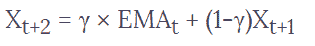

因此，无论我们选择什么样的 gamma，由于*EMA[t]*和*X[t + 1]*持有相同的值，*X[t + 2]*的预测将与*X[t + 1]*的预测相同。这对于任何超过一个时间步长的`X[t]`预测都适用。实际上，指数加权移动平均线（EMA）常常被日内交易者用作理性检查，他们用它来评估和验证市场的重要波动，尤其是在可能快速变化的市场中。所以，现在我们已经使用一步前移平均预测建立了一个简单的基准，我们可以开始构建更复杂的模型，来预测未来更远的价格。

很快，我们将构建一组神经网络并评估它们的性能，看看 LSTM 在预测股价走势任务中的表现如何。我们将再次使用一个简单的前馈神经网络作为基准，并逐步构建更复杂的 LSTM 以比较它们的性能。然而，在我们继续之前，必须准备好数据。我们需要确保我们的网络能够接收一系列训练数据，才能对下一个序列值（我们股票的缩放中价）进行预测。

# 创建观测序列

我们使用以下函数来创建训练和测试序列，供我们训练和测试网络。该函数接受一组时间序列股价，并将其组织成一组`n`个连续值的片段，形成一个给定的序列。关键的不同之处在于，每个训练序列的标签将对应于四个时间步后的股价！这与我们之前使用移动平均法有所不同，因为移动平均法只能预测股价一个时间步的变化。因此，我们生成数据序列，使得我们的模型能够预测未来四个时间步后的股价。

我们定义了一个`look_back`值，它表示我们在给定的观测中保留的股价数量。在我们的案例中，我们实际上允许网络回顾过去`7`个价格值，然后再让它预测四个时间步后我们的股价会发生什么变化：

```py
def create_dataset(dataset, look_back=7, foresight=3):   
    X, Y = [], []
    for i in range(len(dataset)-look_back-foresight): 
        obs = dataset[i:(i+look_back), 0] # Sequence of 7 stock prices  
                                     as features forming an observation    
       # Append sequence
        X.append(obs)
       # Append stock price value occurring 4 time-steps into future
        Y.append(dataset[i + (look_back+foresight), 0]) 
    return np.array(X), np.array(Y)
```

我们使用`create_dataset`函数来生成序列及其相应标签的数据集。此函数在我们的时间序列数据（即`train_data`变量）上调用，并接受两个额外的参数。第一个参数（`look_back`）表示每个观察序列中希望有多少个数据点。在我们的例子中，我们将创建包含七个数据点的序列，表示时间序列中某一点之前的七个中间价格值。同样，第二个参数（`foresight`）表示从观察序列的最后一个数据点到我们想要预测的目标数据点之间的步数。因此，我们的标签将反映每个训练和测试序列未来四个时间步的滞后。我们通过使用步长为一的方式，从原始训练数据中重复创建训练序列及其标签的方法。最终，我们将得到一个包含 990 个观察序列的训练数据集，每个序列的标签对应于四个时间步后达到的股票价格。虽然我们的`look_back`和`foresight`值在某种程度上是任意的，但我们鼓励你尝试不同的值，以评估较大的`look_back`和`foresight`值如何分别影响模型的预测能力。在实际操作中，你会发现这两个值在两端会有递减的回报。

# 调整数据形状

接下来，我们简单地调整训练集和测试集的序列形状以适应我们的网络。我们准备一个三维张量，维度为（时间步长，1，特征），这将对测试不同的神经网络模型非常有用：

```py
x_train = np.reshape(x_train, (x_train.shape[0], 1,  x_train.shape[1]))
x_test = np.reshape(x_test, (x_test.shape[0], 1,  x_test.shape[1]))
x_train.shape

(990, 1, 7)
```

# 进行一些导入

现在我们准备好最终构建和测试一些神经网络架构，并看看它们在预测股市趋势任务中的表现。我们将从导入相关的 Keras 层开始，以及一些回调函数，回调函数可以让我们在模型训练过程中进行交互，以便保存模型或在我们认为合适的时候停止训练：

```py
from keras.models import Sequential
from keras.layers import LSTM, GRU, Dense
from keras.layers import Dropout, Flatten

from keras.callbacks import ModelCheckpoint, EarlyStopping
```

# 基准神经网络

正如我们之前提到的，开始时使用较简单的模型进行检查总是好的，然后再逐步过渡到更复杂的模型。数据建模人员往往容易被所谓的**强大模型**吸引，但很多时候，这些复杂的模型可能并不一定是完成任务所必需的。在这些情况下，使用较简单（且通常计算开销较小）的模型来建立一个合适的基准，进而评估使用更复杂模型的增值效果，会更好。抱着这种精神，我们将构建两个基准模型。每个基准模型将展示特定类型网络在任务中的表现。我们将使用简单的前馈网络来建立所有神经网络的初步基准。然后，我们将使用基本的 GRU 网络来建立递归网络的基准。

# 构建前馈网络

虽然前馈网络是您非常熟悉的网络，但这种体系结构进行了一些修改，使其适合当前的任务。例如，最后一层是一个只有一个神经元的回归器层。它还使用线性激活函数。至于损失函数，我们选择了**平均绝对误差**（**MAE**）。我们还选择了`adam`优化器来执行此任务。所有未来的网络将实现相同的最后一层、损失和优化器。我们还将在一个函数中嵌套构建和编译模型，以便我们可以轻松测试多个网络，就像我们迄今为止所做的那样。以下代码块显示了如何实现这一点：

```py
def feed_forward():
    model = Sequential()
    model.add(Flatten())
    model.add(Dense(128, activation='relu'))
    model.add(Dense(1, activation='linear'))
    model.compile(loss='mae', optimizer='adam')
    return model
```

# 递归基准

接下来，我们将构建一个简单的 GRU 网络来建立一个递归基准。我们指定正确的输入形状，并添加了一个小的递归 dropout 比例。请记住，这将对后续时间步骤应用相同的 dropout 方案，比简单的 dropout 方案更好地保留时间信息。我们还包括了一个小比例的神经元随机 dropout。我们建议您分别进行实验，保存我们当前正在进行的实验，以了解在不同 dropout 策略下 RNN 性能的差异：

```py
def simple_gru():
    model = Sequential()
    model.add(GRU(32,  input_shape=(1, 7), dropout=0.1, recurrent_dropout=0.1))

    model.add(Dense(1, activation='linear'))

    model.compile(loss='mae', optimizer='adam', metrics = 
                  ['mean_absolute_error'])
    return model
```

# 构建 LSTM 模型

现在我们已经有了一些基准模型，让我们继续构建这一章的重点：一个 LSTM 模型。我们首先从一个普通的单层 LSTM 开始，没有使用任何 dropout 策略，配置 32 个神经元，如下所示：

```py
def simple_lstm():
    model = Sequential()
    model.add(LSTM(32, input_shape=(1, 7)))

    model.add(Dense(1, activation='linear'))

    model.compile(loss='mae', optimizer='adam')
    return model
```

我们将 LSTM 层连接到我们的密集回归层，并继续使用相同的损失和优化器函数。

# 堆叠的 LSTM

接下来，我们简单地将两个 LSTM 层堆叠在一起，就像我们在上一章中对 GRU 所做的那样。我们将看到这是否有助于网络记住我们股票数据中更复杂的时间相关信号。我们对两个 LSTM 层都应用了 dropout 和递归 dropout 方案，如下所示：

```py
def lstm_stacked():
    model = Sequential()
    model.add(LSTM(16, input_shape=(1, 7), dropout=0.1, recurrent_dropout=0.2, return_sequences=True))
    model.add(LSTM(16, dropout=0.1, recurrent_dropout=0.2))

    model.add(Dense(1, activation='linear'))

    model.compile(loss='mae', optimizer='adam')
    return model
```

现在我们准备运行实验并评估结果。我们可以通过 MSE 指标进行评估，以及通过将模型的预测结果与实际预测结果叠加进行视觉解释。我们已经构建了一些函数，帮助我们在每次训练会话结束时可视化我们的结果。

# 使用辅助函数

在我们开始训练我们的网络之前，我们可以构建一些辅助函数，这些函数可以在模型训练完成后帮助我们了解模型的性能。前者`plot_losses`函数简单地绘制训练损失和验证损失，使用我们模型的`history`对象。请记住，这是一个默认的回调函数，提供了在会话中计算的训练和验证损失的字典：

```py
def plot_losses(network):
    plt.plot(network.history['loss'], label='loss')
    plt.plot(network.history['val_loss'], label='val loss')
    plt.legend()
    plt.show()
```

接下来，我们将使用`plot_predictions`函数绘制模型在我们隔离的测试集上的预测，并将其叠加到测试集的实际标签上。这与我们之前在一步预测中的做法精神相似。唯一的区别是，现在我们将可视化由我们的网络预测的三步预测趋势，如下所示：

```py
def plot_predictions(model, y_test=y_test):

    preds = model.predict(x_test)
    plt.figure(figsize = (12,6))
    plt.plot(scaler.inverse_transform(preds.reshape(-1,1)), 
             label='generated', color='orange')
    plt.plot(scaler.inverse_transform(y_test.reshape(-1,1)),   
             label='Actual')
    plt.legend()
    plt.show()
```

# 训练模型

最后，我们构建了一个训练函数，帮助我们为每个网络启动训练会话，在每个周期保存模型权重，并在训练会话结束时可视化模型表现。

这个函数可以接受一个模型列表，并对每个模型执行上述步骤。因此，在运行以下代码单元后，请准备好进行一次简短/长时间的散步（取决于你的硬件配置）。

```py
def train_network(list, x_train, y_train, epochs=5):
    for net in list:               

        network_name = str(net).split(' ')[1]
        filepath = network_name + "_epoch-{epoch:02d}-loss-
                   {loss:.4f}-.hdf5"
        print('Training:', network_name)

        checkpoint = ModelCheckpoint(filepath, monitor='loss', 
                     verbose=0, save_best_only=True, mode='min')
        callbacks_list = [checkpoint] 
        model = net()                  

        network = model.fit(x_train, y_train,
                            validation_data=(x_test, y_test),
                            epochs=epochs,
                            batch_size=64,
                            callbacks=callbacks_list)
        model.summary()
        plot_predictions(model, y_test)

    return network, model

all_networks = [feed_forward, simple_gru, simple_lstm, lstm_stacked]
train_network(all_networks, x_train, y_train, epochs=50)
```

# 可视化结果

最后，我们将展示模型的预测与实际价格的对比，如下图所示。请注意，虽然简单的 LSTM 表现最佳（MAE 为 0.0809），但它与简单的前馈神经网络的表现非常接近，后者在设计上具有比 LSTM 网络更少的可训练参数。

你可能会想，怎么做呢？嗯，虽然 LSTM 在编码复杂的时间依赖信号方面非常擅长，但这些信号必须首先出现在我们的数据中：

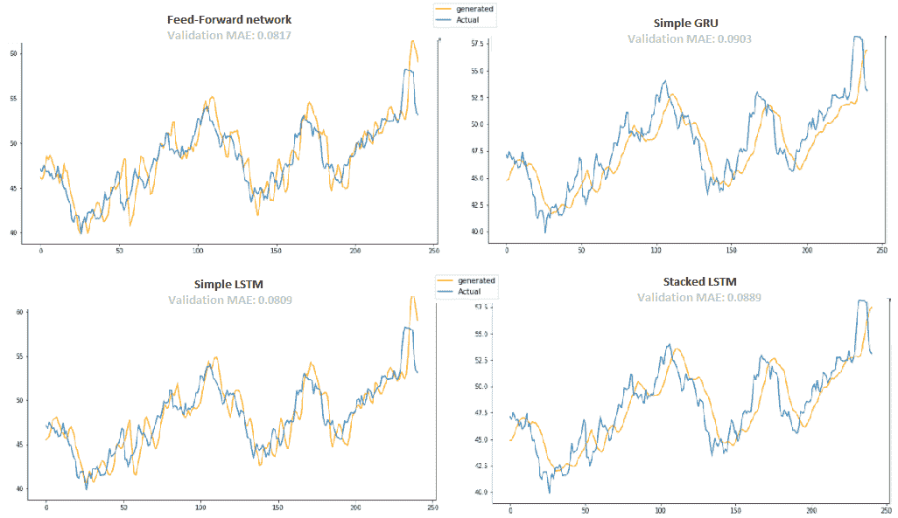

通过查看过去七个中间价格来预测未来，能够传递的信息是有限的。在我们的案例中，似乎 LSTM 能够为预测任务构建的表示与前馈网络所构建的表示相匹配。LSTM 在此上下文中可能能够建模很多复杂信号，但这些信号似乎在我们的数据集中并不存在。例如，在预测标签*x[t + 3]*时，我们并未设计性地包含关于市场在时间*t+1*或*t+2*的任何信息。此外，可能还存在其他变量，而非过去的中间股票价格，更能与股市的未来走势相关。例如，社交媒体情绪（如 Twitter，参考：[`arxiv.org/pdf/1010.3003.pdf`](https://arxiv.org/pdf/1010.3003.pdf)）已被证明能与股票价格的变动相关，最多提前七天！事实证明，获胜的情感是冷静，而非快乐或神经质，这与股市在最多提前一周的变动最为一致。因此，包含代表其他类型和信息来源的特征，可能有助于提高我们的 LSTM 模型的表现，相比于基准模型。

# 结束评论

请注意，这并不一定意味着通过引入社交媒体数据，可以更好地预测所有行业中所有股票的走势。然而，这确实说明了我们的观点，即基于启发式的特征生成还有一些空间，可能允许利用额外的信号来实现更好的预测结果。为了对我们的实验做一些总结评论，我们还注意到，简单的 GRU 和堆叠的 LSTM 都具有更平滑的预测曲线，并且不太容易受到噪声输入序列的影响。它们在保持股票整体趋势方面表现得非常好。这些模型的外部精度（通过预测值与实际值之间的 MAE 来评估）告诉我们，它们的表现略逊色于前馈网络和简单的 LSTM。然而，根据具体的使用案例，我们可能更倾向于使用具有更平滑曲线的模型进行决策，而不是噪声较大的预测模型。

# 摘要

在本章中，我们深入探讨了 LSTM 网络的内部工作原理。我们探索了与这些网络相关的概念和数学实现，理解了信息是如何在 LSTM 单元中处理的，并使用短期和长期记忆来存储事件。我们还了解了为什么这个网络得名，因为它擅长在非常远的时间步长中保持相关的单元状态。虽然我们讨论了该架构的一些变体，如窥视孔连接，但在大多数常见的 LSTM 候选场景中很少见到它。尽管我们使用了一个简单的时间序列数据集进行演示，但我们强烈建议你实现这个架构来解决你可能已经熟悉的其他问题（例如 IMDB 情感分类数据集），并将结果与我们早期的工作进行比较。

LSTM 在**自然语言处理**（**NLP**）任务中确实表现突出。你可以尝试使用维基百科电影数据集生成电影剧本，或者尝试使用 music21 库和一些 MIDI 文件来生成音乐，并用训练歌曲进行训练。

进一步的编码可以在这里找到：

+   **窥视孔伪代码**：[`gist.github.com/EderSantana/f07fa7a0371d0e1c4ef1`](https://gist.github.com/EderSantana/f07fa7a0371d0e1c4ef1)

LSTM 背后的理论概念仍然相当引人注目——尤其是考虑到它们在各种顺序和非顺序任务中的出色表现。那么，是否可以将 LSTM 冠以 RNN 领域的终极冠军称号呢？嗯，答案并不完全是。下一个接近 RNN 领域的重要思想来源于注意力模型的领域，在这个领域中，我们字面上地试图引导神经网络在处理一组信息时的注意力。这种方法在图像描述任务中非常有用，因为我们需要将输入图像的关键部分与输出中必须包含的、按序排列的单词相关联。我们将在接下来的章节中详细探讨注意力模型的相关话题。对于感兴趣的读者，你可以通过阅读 Fang 等人于 2016 年发表的优秀论文*Image captioning with semantic attention*来进一步了解机器图像描述任务。

然而，在下一章中，我们将把注意力集中在神经网络和深度学习的另一个部分：强化学习。这是机器学习中一个极为有趣的领域，它研究人工智能体如何在一个设计好的环境中行动，以便能够累积性地最大化某个奖励。这个方法可以应用于各种各样的使用案例，例如教机器进行手术、生成笑话或玩视频游戏。让机器能够利用与人类相当（甚至超越）水平的身体或心理灵活性，能够帮助我们构建非常复杂和智能的系统。这些系统维护与其操作环境相关的内部状态，并能够通过研究其行为对环境的影响来更新内部状态，同时优化特定目标。因此，每一种行动组合都会触发不同的奖励信号，学习系统可以利用这些信号进行自我提升。

正如我们很快会看到的，设计允许通过奖励信号来强化的系统，可以导致非常复杂的行为，从而使机器能够执行高度智能的行动，甚至在人类通常占优势的领域也能表现突出。AlphaGo 与李世石的对决故事浮现在脑海中。2016 年，AlphaGo 以五比一战胜了李世石，而这一事件与 1997 年 IBM 的 Deep Blue 战胜加里·卡斯帕罗夫（Gary Kasparov）大不相同。许多观看 AlphaGo 与李世石对局的人都看到了机器操作方式的特殊性。有些人甚至称之为**直觉**。

在下一章，我们将看到这样的系统，基于环境和可能行动的一些相当简单的统计属性，如何产生出美丽而复杂的结果，有时甚至超出我们自己的预期。

# 练习

+   检查模型收敛所需的时间。不同模型之间有很大的差异吗？

+   检查模型之间的训练和验证损失。你注意到了什么？

+   尝试缩小和放大架构，注意这如何影响学习过程。

+   尝试不同的优化器和损失度量，并注意这如何影响学习过程。

+   在 IMBD 数据集上实现 LSTM 进行情感分类。

+   在 Wikimovies 数据集上实现 LSTM，构建字符/词级语言模型并生成人工电影剧情。
