# 第七章：深度 Q 网络强化学习

在上一章中，我们看到了递归循环、信息门控和记忆单元如何被用来通过神经网络建模复杂的时间相关信号。更具体地说，我们看到**长短期记忆**（**LSTM**）架构如何利用这些机制来保留预测误差，并将其在越来越长的时间步长上反向传播。这使得我们的系统能够利用短期（即来自与即时环境相关的信息）和长期表示（即来自于很久以前观察到的环境信息）来提供预测。

LSTM 的美妙之处在于，它能够在非常长的时间跨度内（最长可达一千个时间步）学习并保留有用的表示。通过在架构中保持恒定的误差流，我们可以实现一种机制，使得我们的网络能够学习复杂的因果模式，这些模式嵌入在我们日常面对的现实中。实际上，教育计算机理解因果关系的问题，至今仍是**人工智能**（**AI**）领域中的一个巨大挑战。现实世界的环境充斥着稀疏且具有时间延迟的奖励，且随着奖励对应的动作集的复杂度增加，问题变得更加复杂。在这种情况下，建模最佳行为涉及到发现关于给定环境的足够信息，以及可能的动作集合和相应的奖励，以便做出相关预测。正如我们所知，编码这种复杂的因果关系对于人类来说也是一项困难的任务。我们常常在没有考虑到一些相当有益的因果关系时，屈服于我们的非理性欲望。为什么？简单来说，实际的因果关系可能与我们对情况的内部评估不相符。我们可能是在不同的奖励信号驱动下行动，这些信号跨越时间影响着我们的整体决策。

我们对某些奖励信号的反应程度差异很大。这是基于特定个体的情况，并由基因组成和环境因素的复杂组合决定的。在某些方面，这已经深深植根于我们的天性中。我们之中有些人天生更容易被短期奖励（如美味的小吃或娱乐电影）所吸引，而不是长期奖励（如保持健康的身体或高效利用时间）。这也不是特别糟糕，对吧？其实不一定。不同的环境需要不同的短期与长期考虑平衡才能成功。鉴于人类可能遇到的环境多种多样（无论是个体层面还是物种层面），我们在不同个体之间观察到如此多样的奖励信号解读方式也就不足为奇。从宏观角度来看，进化的目标只是最大化我们在各种环境中生存的机会，适应现实世界带来的挑战。然而，正如我们很快会看到的，这对某些个体（甚至是一些贪婪的机器）在微观层面的事件中可能会带来后果。

# 关于奖励与满足感

有趣的是，一组斯坦福大学的研究人员（由心理学家沃尔特·米歇尔领导，进行的棉花糖实验，发生在 1970 年代）展示了个体延迟短期满足感的能力与长期成功之间的相关性。简而言之，这些研究人员邀请了一些孩子，观察他们在面对一组选择时的行为。这些孩子有两个选择，决定他们在互动中能够获得多少棉花糖。他们可以选择立即拿到一个棉花糖，或者选择等待 15 分钟后拿到两个棉花糖。这个实验深入揭示了如何解读奖励信号对在特定环境中的表现是有益还是有害的，结果显示，选择等待两个棉花糖的孩子，平均一生中表现得更加成功。事实证明，延迟满足感可能是最大化长期更有益的行动的关键部分。许多人甚至指出，像宗教这样的概念可能就是延迟短期满足感的集体体现（即：不偷窃），以换取长期的好处（例如最终升天）。

# 一种新的学习检视方式

因此，似乎我们发展出了对应采取何种行动及其可能影响未来结果的内在感知。我们有机制使我们能够通过环境互动来调整这些感知，观察不同的行为会带来何种奖励，这一过程可能持续很长时间。这一点对于人类以及地球上大多数生物来说都是真实的，包括不仅是动物，甚至是植物。即使是植物，也在全天优化某种能量评分，它们通过转动叶子和枝条来捕捉光线，这是它们生存所必需的。那么，这种机制是什么，能让这些生物体建模出最佳结果？这些生物系统如何追踪环境并执行及时而精确的操作以达到有利的结果呢？或许，**强化理论**这一行为心理学分支能够为这个话题提供一些启示。

由哈佛心理学家 B.F. 斯金纳提出，这一观点将强化定义为代理（人类、动物，现在也包括计算机程序）与其环境之间观察到的互动的结果。从这种互动中编码的信息可能会增强或削弱代理在未来相似情境中以相同方式行动的可能性。简而言之，如果你走在炙热的煤炭上，你感受到的疼痛将作为负向强化，减少你未来选择再次踏上炙热煤炭的可能性。相反，如果你抢劫银行并成功逃脱，所体验到的刺激和兴奋可能会强化这一行为，使其在未来成为更可能的选择。事实上，斯金纳展示了如何通过简单的强化机制训练普通的鸽子，帮助它区分英语单词的差异，甚至让它玩乒乓球。他展示了，经过一段时间的奖励信号的暴露，足以激励鸽子识别它所看到的单词之间的微妙差异或它被要求执行的动作。由于识别这些差异意味着鸽子是否能够获得饱腹感，斯金纳通过逐步奖励鸽子达到期望的结果，从而影响其行为。从这些实验中，他创造了*操作性条件反射*一词，这一概念与将任务分解成小步骤并逐步奖励有利行为有关。

今天，约半个世纪后，我们在**机器学习**（**ML**）领域将这些概念应用于强化模拟代理在特定环境中执行有利行为。这一概念被称为强化学习，它可以产生复杂的系统，这些系统在执行任务时可能会与我们自己的智力相媲美（甚至超越）。 

# 使用强化学习训练机器

到目前为止，我们一直在处理简单的回归和分类任务。我们根据连续值对观察结果进行回归（例如预测股市）并将特征分类到不同的标签中（例如进行情感分析）。这两项任务是监督学习的基石活动。在训练过程中，我们为每个网络遇到的观察结果显示一个特定的目标标签。稍后在本书中，我们将介绍一些无监督学习技术，使用**生成对抗网络**（**GANs**）和自动编码器。不过，今天我们将神经网络应用于与这两种学习任务截然不同的领域。这种学习任务可以称为**强化学习**。

强化学习与前述的机器学习变种明显不同。在这里，我们并不会明确标注环境中所有可能的动作序列与可能的结果（如监督分类中那样），也不会基于相似性度量来划分数据（如无监督聚类中那样）以寻找最佳动作。相反，我们让机器监控它所采取的行动的反馈，并在一段时间内逐步建模最大可能奖励作为行动的函数。本质上，我们处理的是目标导向的算法，这些算法通过给定的时间步学习实现复杂目标。目标可以是击败逐渐向屏幕下方移动的太空侵略者，或者让一个形似狗的机器人从现实世界中的 A 点移动到 B 点。

# 信用分配问题

就像父母通过奖励和奖励来强化我们的行为一样，我们也可以在给定环境的状态（或配置）下，强化机器的期望行为。这更像是一种*试错*学习方法，近期的事件表明，这种方法可以产生极其强大的学习系统，打开了非常有趣的应用场景的大门。然而，这种明显不同但强大的学习范式也带来了一些自身的复杂性。例如，考虑信用分配问题。也就是说，我们之前的哪些行动为生成奖励负责，负责的程度如何？在奖励稀疏且时延的环境中，许多动作可能发生在某些行动之间，这些行动后来产生了所讨论的奖励。正确地将应得的信用分配给各个行动会变得非常困难。如果没有适当的信用分配，我们的代理在评估不同策略时会毫无头绪，无法达成其目标。

# 探索-利用困境

假设我们的智能体甚至设法找到了一个稳定的策略来获取奖励。那么接下来怎么办？它是否应该一直坚持这个策略，永远生成相同的奖励？还是它应该一直尝试新的方法？也许，通过不利用已知的策略，智能体可以在未来获得更大的奖励？这就是所谓的**探索与利用困境**，指的是智能体在探索新策略或利用已知策略之间的权衡。

极端情况下，我们可以通过理解依赖已知策略来获得即时奖励的长期不利性，更好地理解探索与利用的困境。例如，通过对老鼠的实验表明，如果给这些动物一个触发多巴胺释放机制的方式，它们会饿死自己（多巴胺是一种负责调节我们奖励系统的神经递质）。显然，尽管结局可能让老鼠非常兴奋，但从长远来看，饿死自己并不是正确的选择。然而，由于老鼠利用了一种简单的策略，它不断触发奖励信号，因此它并没有去探索长期奖励的前景（例如活下去）。那么，如何弥补环境中可能存在更好机会的事实，而放弃当前的机会呢？如果我们希望智能体能够恰当地解决复杂环境，我们必须让它理解延迟满足的概念。很快，我们将看到深度强化学习如何尝试解决这些问题，从而催生出更复杂、更强大的系统，有些人甚至可能称其为异常敏锐。

# 通向人工通用智能的路径

以 AlphaGo 系统为例，该系统由总部位于英国的初创公司 DeepMind 开发，利用了一种深度强化学习的独特形式来为其预测提供依据。谷歌以 5 亿美元的价格收购 DeepMind 是有充分理由的，因为许多人认为 DeepMind 已经迈出了朝向**人工通用智能**（**AGI**）的第一步——如果你愿意的话，这可以看作是 AI 的圣杯。这一概念指的是人工智能系统在多种任务上表现良好的能力，而不是我们目前的网络在狭窄应用范围内的表现。一个通过观察自己在环境中行动来学习的系统，从精神上看（并且可能更快），与我们人类的学习方式相似。

我们在前几章构建的网络在狭窄的分类或回归任务中表现良好，但如果要执行其他任务，则必须进行显著的重新设计和重新训练。然而，DeepMind 展示了如何训练一个单一的网络，在多个不同（尽管狭窄）的任务上表现出色，这些任务包括玩几款经典的 Atari 2600 游戏。虽然这些游戏有些过时，但它们最初设计时就是为了给人类带来挑战，这使得这一成就成为 AI 领域的一个相当了不起的突破。在他们的研究中（[`deepmind.com/research/dqn/`](https://deepmind.com/research/dqn/)），DeepMind 展示了他们的**深度 Q 网络**（**DQN**）如何仅通过观察屏幕上的像素，而不需要任何关于游戏本身的先验信息，就能让人工代理玩不同的游戏。他们的工作激发了一波新研究人员，他们开始使用基于强化学习的算法训练深度学习网络，推动了深度强化学习的诞生。此后，研究人员和企业家们纷纷尝试利用这些技术应用于一系列场景，包括但不限于让机器像动物和人类一样移动、生成药物分子化合物，甚至创建能够在股市交易的机器人。

不用多说，这种系统在模拟现实世界事件方面更具灵活性，并可以应用于多种任务，从而减少训练多个独立狭窄系统所需的资源。未来，它们甚至可能揭示复杂且高维的因果关系，通过利用来自多个领域的训练示例来编码协同表示，这些表示反过来帮助我们解决更复杂的问题。我们的发现往往受到来自不同科学领域的信息启发，这有助于加深我们对这些情况及其复杂动态的理解。那么，为什么不让机器也来做这些呢？只要给定合适的奖励信号，机器在特定环境下的可能行动甚至可能超越我们自己的直觉！也许有一天你能在这方面提供帮助。现在，让我们先来看看如何模拟一个虚拟代理，并让它与环境互动，解决简单的问题。

# 模拟环境

首先，我们需要一个模拟环境。环境被定义为*学习代理的互动空间*。对于人类而言，环境可以是你一天中去的任何地方。对于人工智能代理而言，这通常是我们精心设计的模拟环境。为什么是模拟的呢？我们可以要求代理像我们一样在实时中学习，但事实证明这是相当不切实际的。首先，我们必须为每个代理设计一个身体，然后精确地设计其行为以及它们要与之互动的环境。此外，代理在模拟中训练得更快，无需局限于人类的时间框架。当机器在现实中完成一个任务时，其模拟版本可能已经完成了同一个任务好几次，为其从错误中学习提供了更好的机会。

接下来，我们将介绍一些基本术语，这些术语用于描述游戏，而游戏代表了一个代理需要在其中执行特定任务以获得奖励并解决环境的环境。

# 理解状态、行动和奖励

环境本身可以分解为一系列不同的状态，这些状态代表了代理可能遇到的不同情况。代理可以通过尝试不同的行动组合来在这些状态间导航（例如，在二维街机游戏中，向左或向右走、跳跃等）。代理所做的行动会有效地改变环境的状态，使得可用的工具、备用路线、敌人或游戏设计者可能隐藏的任何其他元素变得可用，从而使游戏更加有趣。这些对象和事件代表了学习环境在代理进行导航时可能经历的不同状态。每当代理在其先前的状态下与环境互动，或环境中发生随机事件时，环境就会生成一个新的状态。这就是游戏如何进行，直到达到终端状态，即游戏无法继续（因为胜利或死亡）。

本质上，我们希望代理采取及时且有利的行动来解决其环境。这些行动必须改变环境的状态，使代理更接近达成预定目标（如从 A 点到 B 点或最大化得分）。为了做到这一点，我们需要设计奖励信号，这些信号作为代理与环境中不同状态互动的结果发生。我们可以将奖励的概念视为反馈，允许我们的代理评估其行动所取得的成功程度，从而优化给定目标：

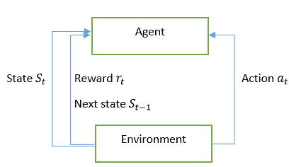

对于那些熟悉经典街机风格视频游戏的人来说，可以想象一场《马里奥》的游戏。马里奥本身是代理角色，由你来控制。环境指的是马里奥可以在其中移动的地图。金币和蘑菇的存在代表着游戏中的不同状态。一旦马里奥与这些状态中的任何一个互动，就会触发奖励，形式为积分，新的状态也会随之产生，进而改变马里奥的环境。马里奥的目标可以是从 A 点移动到 B 点（如果你急于完成游戏），或者是最大化他的得分（如果你更感兴趣的是解锁成就）。

# 一辆自动驾驶出租车

接下来，我们将通过观察人工智能代理如何解决环境问题，来澄清我们迄今为止所获得的理论理解。我们将看到，即使通过随机从代理的动作空间中采样动作（代理可能执行的动作），也能实现这一目标。这将帮助我们理解解决即使是最简单环境所涉及的复杂性，以及为什么我们可能很快需要调用深度强化学习来帮助我们实现目标。我们即将解决的目标是在一个简化的模拟环境中创建一辆自动驾驶出租车。尽管我们将处理的环境比现实世界简单得多，但这个模拟将作为深入强化学习系统设计架构的一个优秀跳板。

为了实现这个目标，我们将使用 OpenAI 的`gym`，一个恰如其名的模块，用于模拟人工环境以训练机器。你可以使用`pip`包管理器来安装 OpenAI gym 依赖。以下命令将在 Jupyter Notebooks 中运行并启动该模块的安装：

```py
 ! pip install gym 
```

`gym`模块提供了大量预安装的环境（或测试问题），涵盖了从简单到复杂的各种模拟。我们将在以下示例中使用的测试问题来自`'TaxiCab-v2'`环境。我们将从所谓的**出租车模拟**开始实验，这个模拟简单地模拟了一张道路网格，出租车需要在其中穿行，以便接送顾客：

```py
import numpy as np
import gym
from gym import envs

# This will print allavailable environemnts
# print(envs.registry.all())

```

# 理解任务

出租车模拟最早由(Dietterich 2000)提出，用以展示在分层方式应用强化学习时所遇到的问题。然而，我们将使用此模拟来巩固我们对智能体、环境、奖励和目标的理解，然后再继续模拟和解决更复杂的问题。目前，我们面临的问题相对简单：接送乘客并将其送到指定地点。共有四个目的地，这些地点用字母表示。我们的智能体只需前往这些接载地点，接上乘客，然后前往指定的下车地点，乘客可以下车。成功下车后，智能体会获得+20 点奖励（模拟我们虚拟出租车司机获得的报酬）。每经过一步，出租车司机在到达目的地前会被扣除-1 点奖励（直观上，这代表了出租车司机为补充油料而产生的费用）。最后，对于未按计划接载或下车的情况，还有一个-10 点的惩罚。你可以想象，惩罚接载的原因就像出租车公司试图优化其车队部署，以覆盖城市的各个区域，要求我们的虚拟出租车司机只接载指定乘客。而未按计划下车，则反映了顾客的不满和困惑。让我们来看一下出租车环境实际是什么样子的。

# 渲染环境

为了可视化我们刚加载的环境，我们必须首先通过在环境对象上调用`reset()`来初始化它。然后，我们可以渲染起始帧，显示出租车（黄色）的位置以及四个不同的接客地点（用不同颜色的字母表示）：

```py
# running env.reset() returns the initial state of the environment

print('Initial state of environment:' , env.reset())
env.render()
```

我们得到以下输出：

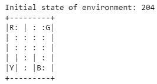

请注意，前面的截图中，开放的道路用冒号（`:`）表示，而出租车无法穿越的墙壁则用竖线（`|`）表示。虽然这些障碍物和道路的位置保持不变，但表示接载点的字母以及我们黄色出租车的位置在每次初始化环境时都会发生变化。我们还可以注意到，重置环境会生成一个整数。这表示环境的一个特定状态（即出租车和接载点的位置），这是在初始化时获得的。

你可以将`Taxi-v2`字符串替换为注册表中的其他环境（如`CartPole-v0`或`MountainCar-v0`），并渲染几帧来大致了解我们所处理的环境。还有一些其他命令可以帮助你更好地理解你所面对的环境。虽然出租车环境足够简单，可以使用彩色符号进行模拟，但更复杂的环境可能会在执行时在一个单独的窗口中渲染。

# 参考观察空间

接下来，我们将尝试更好地理解我们的环境和动作空间。出租车环境中的所有状态通过一个介于 0 到 499 之间的整数来表示。我们可以通过打印出环境中所有可能状态的总数来验证这一点。让我们来看一下我们环境可能的不同状态的数量：

```py
env.observation_space.n

500
```

# 引用动作空间

在出租车模拟中，我们的司机智能体在每个时间步骤上有六个不同的动作可以执行。我们可以通过查看环境的动作空间来检查可能的动作总数，具体如下所示：

```py
env.action_space.n

6
```

我们的司机在任何给定时刻都可以执行六个动作之一。这些动作分别对应向上、向下、向左或向右移动；接乘客；或把乘客放下。

# 与环境互动

要让我们的智能体执行某个动作，我们可以在环境对象上使用`step()`方法。`step(i)`方法接受一个整数，这个整数对应智能体允许执行的六个可能动作中的一个。在这个例子中，这些动作标记如下：

+   (0) 表示向下移动

+   (1) 表示向上移动

+   (2) 表示右转

+   (3) 表示左转

+   (4) 表示接乘客

+   (5) 表示放下乘客

以下是代码的表示方式：

```py
#render current position
env.render()

#move down
env.step(0)

#render new position
env.render()
```

我们得到以下输出：

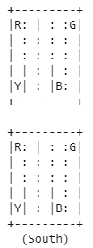

如我们所见，我们让智能体向下执行一个步骤。现在，我们理解了如何让智能体执行所有必要的步骤以达成目标。事实上，调用环境对象的`step(i)`会返回四个特定的变量，这些变量描述了从智能体的角度来看，动作(i)对环境的影响。这些变量如下：

1.  `observation`：这是环境的观测状态。它可以是来自游戏截图的像素数据，或者是以其他方式表示环境状态的形式，以便学习智能体理解。

1.  `reward`：这是我们为智能体提供的奖励，用来表示智能体在某个时间步骤执行某个动作后的补偿。我们利用奖励为学习智能体设定目标，方法是要求其最大化在特定环境中获得的奖励。注意，奖励（浮动）值的尺度可能会根据实验设置有所不同。

1.  `done`：这个布尔（布尔值）变量表示一个试验是否已结束。在出租车模拟中，当乘客被接上并在指定位置放下时，认为这一轮试验已完成。在一款雅达利游戏中，试验可以定义为智能体的生命，直到被外星人击中而结束。

1.  `info`：这个字典项用于存储调试智能体动作时所需要的信息，通常在学习过程中不使用。然而，它存储了有价值的信息，比如影响前一个状态变化的概率，在给定步骤中：

```py
# env.step(i) will return four variables
# They are defiend as (in order) the state, reward, done, info
env.step(1)

(204, -1, False, {'prob': 1.0})
```

# 随机解决环境

在掌握了 OpenAI gym 环境的逻辑和如何让人工智能体在其中互动之后，我们可以继续实现一个随机算法，让智能体（最终）解决出租车环境。首先，我们定义一个固定状态来开始我们的仿真。如果你想重复同一个实验（即用相同的状态初始化环境），这将非常有帮助，同时可以检查智能体在每次任务中解决环境时采取了多少随机步骤。我们还定义了一个`counter`变量，用于简单地跟踪智能体在任务进展过程中所采取的时间步骤数。奖励变量初始化为`None`，并将在智能体采取第一步时更新。然后，我们简单地启动一个`while`循环，反复从我们的动作空间中随机选择可能的动作，并更新每个选定动作的`state`、`reward`和`done`变量。为了从环境的动作空间中随机选择动作，我们使用`.sample()`方法操作`env.action_space`对象。最后，我们增加`counter`，并渲染环境以便可视化：

```py
# Overriding current state, used for reproducibility
state = env.env.s = 114

# counter tracks number of moves made
counter = 0

#No reward to begin with
reward = None

dropoffs = 0

#loop through random actions until successful dropoff (20 points)

while reward != 20:
    state, reward, done, info = env.step(env.action_space.sample())
    counter += 1
    print(counter)
    env.render()

print(counter, dropoffs)
```

我们得到以下输出：

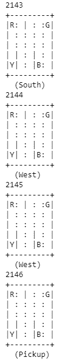

直到第 2,145 次尝试，我们的智能体才找到了正确的乘客（如出租车变绿所示）。即便你可能没有感到时间的流逝，这也是相当长的。随机算法有助于在调用更复杂的模型时作为基准，确保结果的合理性。但显然，我们可以做得比智能体运行在随机算法上所用的 6,011 步（解决这个简单环境）要好。怎么做呢？我们奖励它做对的事情。为此，我们必须首先在数学上定义奖励的概念。

# 立刻奖励与未来奖励之间的权衡

初看之下，这可能显得相当简单。我们已经看到，出租车司机通过正确送客获得+20 分，错误送客扣-10 分，每个时间步骤完成一轮任务时扣-1 分。逻辑上，你可以将一个智能体在一次任务中的总奖励计算为该智能体在每个时间步骤所获得的所有个别奖励的累积。我们可以通过数学表示来表示这一点，并表示一次任务中的总奖励如下：

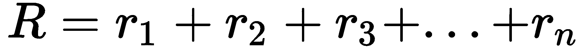

这里，*n*仅仅表示任务的时间步骤。这似乎是直观的。现在，我们可以要求智能体最大化给定任务中的总奖励。但问题来了。就像我们自己所处的现实一样，智能体所面临的环境可能主要由随机事件主导。因此，无法保证在相似的未来状态下执行相同的动作会返回相同的奖励。事实上，随着我们进入未来，由于固有的随机性，奖励可能会越来越偏离每个状态下采取的相应动作所带来的奖励。

# 对未来奖励的折扣

那么，我们如何弥补这种差异呢？一种方法是通过对未来奖励进行折扣，从而增强当前奖励相对于未来时间步奖励的重要性。我们可以通过在每个时间步生成奖励时加入折扣因子来实现这一点，同时在计算给定回合的总奖励时应用它。折扣因子的目的是减弱未来奖励并增强当前奖励。从短期来看，通过使用相应的状态-行动对，我们更有把握获得奖励。然而，由于环境中随机事件的累积效应，从长期来看就无法做到这一点。因此，为了激励智能体集中于相对确定的事件，我们可以修改之前的总奖励公式，加入这个折扣因子，如下所示：

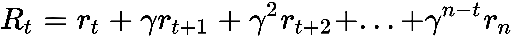

在我们新的总奖励公式中，γ 表示一个介于 0 和 1 之间的折扣因子，*t* 表示当前的时间步。如你所见，γ 项的指数递减使得未来的奖励相对于当前奖励被减弱。直观地说，这意味着在智能体考虑下一步行动时，较远的未来奖励会比更接近的奖励被考虑得少。那么，减弱的程度如何呢？这仍然由我们决定。一个接近零的折扣因子会产生短视的策略，享乐主义地偏向即时奖励而非未来奖励。另一方面，如果折扣因子过于接近 1，折扣因子的作用将被完全抵消。实际上，根据环境中的随机性程度，折扣因子的平衡值通常在 0.75 到 0.9 之间。作为经验法则，较为确定性环境中需要较高的 γ 值，而较为随机的环境中需要较低的 γ 值。我们甚至可以像下面这样简化之前给出的总奖励公式：

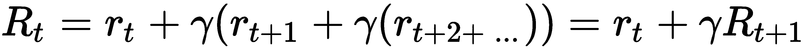

因此，我们将回合中的总奖励形式化为每个时间步的累计折扣奖励。通过使用折扣未来奖励的概念，我们可以为智能体生成策略，从而指导其行动。执行有利策略的智能体将会选择那些在给定回合中最大化折扣未来奖励的行动。现在，我们已经大致了解了如何为智能体设计奖励信号，是时候继续研究整个学习过程的概述了。

# 马尔可夫决策过程

在强化学习中，我们试图解决将即时行动与其返回的延迟奖励相关联的问题。这些奖励仅仅是稀疏的、时间延迟的标签，用于控制智能体的行为。到目前为止，我们已经讨论了智能体如何根据环境的不同状态进行行动。我们还看到了交互如何为智能体生成不同的奖励，并解锁环境的新状态。从这里开始，智能体可以继续与环境进行交互，直到一回合结束。现在是时候数学上形式化这些智能体与环境之间的关系，以便进行目标优化了。为此，我们将借用由俄罗斯数学家安德烈·马尔可夫提出的框架，现在称为**马尔可夫决策过程**（**MDP**）。

这个数学框架使我们能够建模智能体在部分随机且部分可控的环境中的决策过程。这个过程依赖于马尔可夫假设，假设未来状态的概率（*st+1*）仅依赖于当前状态（*st*）。这一假设意味着，所有导致当前状态的状态和动作对未来状态的概率没有影响。MDP 由以下五个变量定义：

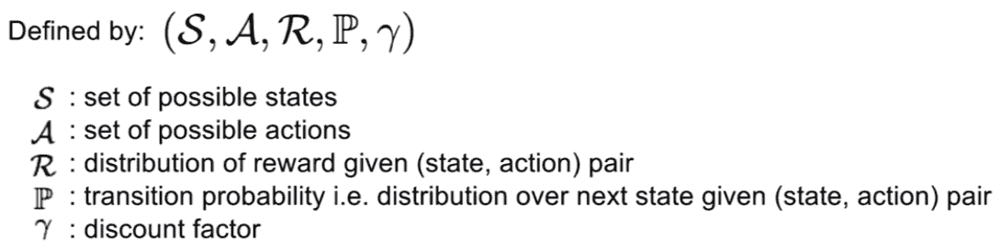

虽然前两个变量相当直观，第三个变量（**R**）指的是给定一个状态-动作对下的奖励概率分布。这里，状态-动作对仅指给定环境状态下应采取的相应动作。接下来是转移概率（**P**），它表示在某一时间步下，给定选择的状态-动作对后得到新状态的概率。

最后，折扣因子指的是我们希望将未来奖励折扣到更即时奖励的程度，以下图说明：

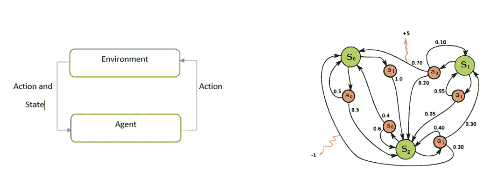

左：强化学习问题。右：马尔可夫决策过程

因此，我们可以使用 MDP 描述智能体与环境之间的交互。一个 MDP 由一系列状态和动作组成，并包含规则，规定了从一个状态到另一个状态的转移。我们现在可以数学地定义一次回合为一个有限的状态、动作和奖励序列，如下所示：

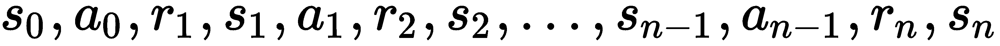

在这里，(s[t]) 和 (a[t]) 表示时间 *t* 时的状态和相应的动作。我们还可以将与该状态-动作对对应的奖励表示为 (r[t+1])。因此，我们通过从环境中采样一个初始状态 (s[o]) 来开始一个回合。接下来，直到目标完成，我们要求智能体为其所处环境的相应状态选择一个动作。一旦智能体执行了一个动作，环境就会为智能体采取的动作以及接下来的状态 (s[t+1]) 采样一个奖励。然后，智能体在接收到奖励和下一个状态后，会重复这个过程，直到它能够解决环境中的问题。最后，在回合结束时，会到达一个终止状态 (s[n])（也就是说，当目标完成时，或者在游戏中用完所有生命时）。决定智能体在每个状态下采取动作的规则统称为**策略**，并用希腊字母 (π) 表示。

# 理解策略函数

如我们所见，智能体解决一个环境的效率取决于它在每个时间步骤中使用什么策略来匹配状态-动作对。因此，一个被称为**策略函数**（π）的函数可以指定智能体在每个时间步骤上遇到的状态-动作对的组合。随着模拟的进行，策略负责生成轨迹，轨迹由游戏状态、智能体作为响应所采取的动作、环境生成的奖励以及智能体接收到的游戏下一个状态组成。直观地讲，你可以将策略看作是一个启发式方法，它生成响应环境状态的动作。策略函数本身可以是好的，也可以是坏的。如果你的策略是先开枪再问问题，最终你可能会误伤人质。因此，我们现在要做的就是评估不同的策略（即它们产生的轨迹，包括状态、动作、奖励和下一个状态的序列），并挑选出能最大化给定游戏的累计折扣奖励的最优策略 (π *)。这可以通过以下数学公式来表示：

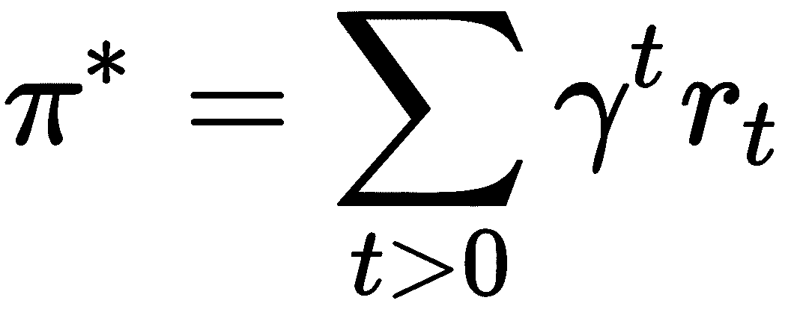

因此，如果我们试图从 A 点移动到 B 点，我们的最优策略将包括采取一个使我们在每个时间步尽可能靠近 B 点的行动。不幸的是，由于在这样的环境中存在随机性，我们不能如此确定地声称我们的策略绝对最大化了折扣奖励的总和。根据定义，我们无法考虑在从 A 点到 B 点的过程中发生的某些随机事件，例如地震（假设你不是地震学专家）。因此，我们也无法完美地考虑因环境中的随机性而产生的动作所带来的奖励。相反，我们可以将最优策略（π*）定义为一种让我们的代理最大化预期的折扣奖励之和的策略。这可以通过对先前方程式进行轻微修改来表示，表示如下：

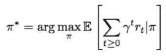

在这里，我们使用 MDP 框架，并从我们的状态概率分布 p(s[o])中采样初始状态（s[o]）。代理的动作（a[t]）根据给定状态从策略中采样。然后，采样一个奖励，对应于在给定状态下执行的动作的效用。最后，环境从当前状态-动作对的转移概率分布中采样下一个状态（s[t+1]）。因此，在每个时间步，我们的目标是更新最优策略，以最大化预期的折扣奖励之和。你们中的一些人可能会在此时想，如何在给定状态的情况下评估一个动作的效用呢？嗯，这就是值函数和 Q 值函数发挥作用的地方。为了评估不同的策略函数，我们需要能够评估不同状态的值，以及给定策略下与这些状态对应的动作质量。为此，我们需要定义两个额外的函数，分别是值函数和 Q 值函数。

# 评估状态的值

首先，我们需要估计在遵循特定策略（π）下，状态（*s*）的值（*V*）。这告诉你在遵循从状态（*s*）开始的策略（π）下，游戏结束时的预期累计奖励。为什么这个有用呢？想象一下，我们的学习代理环境中充满了不断追赶代理的敌人。它可能已经形成了一个策略，指示它在整个游戏过程中永远不停跑。在这种情况下，代理应该具有足够的灵活性来评估游戏状态的值（例如，当它跑到悬崖边缘时，以避免跑下去并死亡）。我们可以通过定义给定状态下的值函数，*V* *π (s)*，作为代理在遵循该策略时，从当前状态开始的预期累计（折扣）奖励来实现这一点：

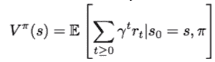

因此，我们能够使用价值函数来评估在遵循特定策略时，某个状态的优劣。然而，这仅仅告诉我们给定策略下一个状态本身的价值。我们还希望我们的智能体能够判断某个动作在特定状态下的价值。这正是允许智能体根据环境中的任何情况（无论是敌人还是悬崖边缘）动态做出反应的关键。我们可以通过使用 Q 值函数来实现这一概念，将给定状态-动作对在特定策略下的“优良”程度量化出来。

# 评估动作质量

如果你走到墙前，能执行的动作不多。你可能会通过选择掉头动作来回应这个状态，接着会问自己为什么一开始走到墙前。同样地，我们希望我们的智能体能根据它所处状态的不同，利用一个关于动作优劣的感知，同时遵循策略。我们可以通过使用 Q 值函数来实现这一目标。这个函数简单地表示在特定状态下采取特定动作时，遵循一个策略所期望的累积奖励。换句话说，它表示给定策略下，状态-动作对的质量。数学上，我们可以表示 *Q* *π ( a , s)* 关系如下：

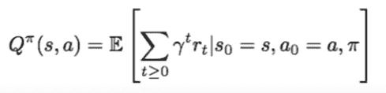

*Q* *π ( s , a)* 函数允许我们表示遵循一个策略（π）所获得的期望累积奖励。直观地说，这个函数帮助我们量化在游戏结束时的总得分，给定每个状态（即你观察到的游戏画面）下所采取的动作（即不同的摇杆控制操作），并遵循一个策略（例如：在跳跃时向前移动）。通过这个函数，我们可以定义在游戏的终止状态下，给定所遵循的策略时，最好的期望累积奖励。这可以表示为 Q 值函数能够达到的最大期望值，称为最优 Q 值函数。我们可以通过以下数学公式来定义它：

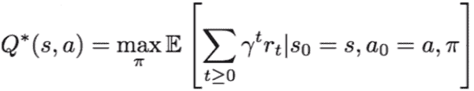

现在，我们有一个函数，该函数量化了在给定策略下，状态-动作对的期望最优值。我们可以使用这个函数来预测在给定游戏状态下应该采取的最优动作。然而，我们如何评估预测的真实标签呢？我们并没有给游戏屏幕标注对应的目标动作，因此无法评估我们的网络偏差有多大。这时，贝尔曼方程派上用场了，它帮助我们评估给定状态-动作对的值，作为当前产生的奖励和随后的游戏状态值的函数。然后，我们可以利用这个函数来比较网络的预测结果，并通过反向传播误差来更新模型权重。

# 使用贝尔曼方程

贝尔曼方程是由美国数学家理查德·贝尔曼提出的，它是驱动深度 Q 学习的主要方程之一。它本质上让我们能够解决之前所定义的马尔可夫决策过程。直观地说，贝尔曼方程做了一个简单的假设。它声明，对于一个给定的状态下执行的动作，最大未来奖励是当前奖励加上下一个状态的最大未来奖励。为了类比棉花糖实验，两个棉花糖的最大可能奖励是通过在第一时刻自我克制（奖励为 0 个棉花糖）然后在第二时刻收集（奖励为两个棉花糖）来实现的。

换句话说，给定任何状态-动作对，在给定状态（s）下执行动作（a）的质量（Q）等于将要收到的奖励（r），以及智能体最终到达的下一个状态（s'）的价值。因此，只要我们能够估计下一个时间步的最优状态-动作值，*Q*(s',a')*，就能计算当前状态的最优动作。正如我们在棉花糖实验中所看到的那样，智能体需要能够预见到未来某个时刻可能获得的最大奖励（两个棉花糖），以便在当前时刻拒绝只获得一个棉花糖。使用贝尔曼方程，我们希望智能体采取最大化当前奖励（r）以及下一个状态-动作对的最优 Q*值的动作，*Q*(s',a')*，并且考虑折扣因子 gamma（y）。用更简单的话来说，我们希望它能够计算当前状态下动作的最大预期未来奖励。这可以转化为以下公式：

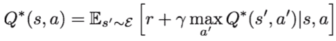

现在，我们知道如何在数学上估计给定状态下执行一个动作的预期质量。我们也知道如何估计遵循特定策略时，状态-动作对的最大预期奖励。从这里，我们可以重新定义给定状态（s）下的最优策略（π*），即给定状态下的动作最大预期 Q 值。这可以表示如下：

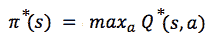

最后，我们已经具备了所有拼图的部分，实际上可以尝试找到一个最优策略（π*）来引导我们的智能体。这个策略将允许我们的智能体通过为环境生成的每个状态选择理想的动作，从而最大化预期的折扣奖励（考虑环境的随机性）。那么，我们究竟该如何进行操作呢？一个简单的非深度学习解决方案是使用价值迭代算法来计算未来时间步的动作质量*( Qt+1 ( s , a ))*，作为期望当前奖励（r）和下一个游戏状态的最大折扣奖励（*γ max a Qt ( s' , a' )*）的函数。从数学上讲，我们可以将其表示如下：

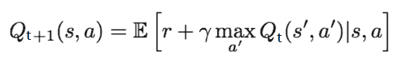

在这里，我们基本上会不断迭代更新贝尔曼方程，直到 Qt 收敛到 Q*，随着*t*的增加，直到无限远。我们实际上可以通过直接实现贝尔曼方程来测试它在解决出租车模拟问题中的估计效果。

# 迭代更新贝尔曼方程

你可能记得，采用随机方法解决出租车模拟时，我们的智能体大约需要 6,000 个时间步。有时，凭借纯粹的运气，你可能会在 2,000 个时间步以内解决它。然而，我们可以通过实现一个贝尔曼方程的版本进一步提升我们的成功概率。这种方法将基本上允许我们的智能体通过使用 Q 表记住每个状态下的动作及其相应的奖励。我们可以在 Python 中使用 NumPy 数组实现这个 Q 表，数组的维度对应于我们出租车模拟中的观察空间（可能的不同状态的数量）和动作空间（智能体可以执行的不同动作的数量）。回想一下，出租车模拟的环境空间是 500，动作空间是六个，因此我们的 Q 表是一个 500 行六列的矩阵。我们还可以初始化一个奖励变量（`R`）和一个折扣因子（gamma）的值：

```py
#Q-table, functions as agent's memory of state action pairs
Q = np.zeros([env.observation_space.n, env.action_space.n])

#track reward
R = 0

#discount factor
gamma = 0.85

# Track successful dropoffs
dropoffs_done = 0

#Run for 1000 episodes
for episode in range(1,1001):
    done = False

    #Initialize reward
    R, reward = 0,0

    #Initialize state
    state = env.reset()

    counter=0

    while done != True:

            counter+=1

            #Pick action with highest Q value
            action = np.argmax(Q[state]) 

            #Stores future state for compairason
            new_state, reward, done, info = env.step(action)

            #Update state action pair using reward and max Q-value for the new state
            Q[state,action] += gamma * (reward + np.max(Q[new_state]) - Q[state,action]) 

            #Update reward
            R += reward  

            #Update state
            state = new_state

            #Check how many times agent completes task
            if reward == 20:
                dropoffs_done +=1

    #Print reward every 50 episodes        
    if episode % 50 == 0:
        print('Episode {}   Total Reward: {}   Dropoffs done: {}  Time-Steps taken {}'
              .format(episode,R, dropoffs_done, counter))

Episode 50 Total Reward: -30 Dropoffs done: 19 Time-Steps taken 51
Episode 100 Total Reward: 14 Dropoffs done: 66 Time-Steps taken 7
Episode 150 Total Reward: -5 Dropoffs done: 116 Time-Steps taken 26
Episode 200 Total Reward: 14 Dropoffs done: 166 Time-Steps taken 7
Episode 250 Total Reward: 12 Dropoffs done: 216 Time-Steps taken 9
Episode 300 Total Reward: 5 Dropoffs done: 266 Time-Steps taken 16
```

然后，我们只需循环执行一千个回合。在每个回合中，我们初始化环境的状态，设置一个计数器来跟踪已执行的下车操作，以及奖励变量（总奖励：`R`和每回合奖励：`r`）。在我们的第一个循环中，我们再次嵌套另一个循环，指示智能体选择具有最高 Q 值的动作，执行该动作，并存储环境的未来状态及获得的奖励。这个循环会一直执行，直到回合结束，由布尔变量 done 表示。

接下来，我们在 Q 表中更新状态-动作对，并更新全局奖励变量（它表示我们的智能体整体表现如何）。算法中的 alpha 项（α）表示学习率，它有助于控制在更新 Q 表时前一个 Q 值与新生成的 Q 值之间的变化量。因此，我们的算法通过在每个时间步近似最优 Q 值来迭代更新状态-动作对的质量（Q[state, action]）。随着这个过程不断重复，我们的智能体最终会收敛到最优的状态-动作对，正如 Q*所示。

最后，我们更新状态变量，用新的状态变量重新定义当前状态。然后，循环可以重新开始，迭代地更新 Q 值，并理想情况下收敛到存储在 Q 表中的最优状态-动作对。我们每 50 个回合输出一次环境采样的整体奖励，作为代理动作的结果。我们可以看到，代理最终会收敛到任务的最优奖励（即考虑到每个时间步的旅行成本，以及正确的下车奖励的最优奖励），这个任务的最优奖励大约在 9 到 13 分之间。你还会注意到，到第 50^(回合)时，我们的代理在 51 个时间步内成功完成了 19 次下车！这个方法的表现明显优于我们之前实现的随机方法。

# 为什么使用神经网络？

正如我们刚才所看到的，基本的价值迭代方法可以用来更新贝尔曼方程，并通过迭代地寻找理想的状态-动作对，从而最优地导航给定的环境。这个方法实际上在每一个时间步都会存储新的信息，不断地让我们的算法变得更加*智能*。然而，这个方法也有一个问题，那就是它根本不可扩展！出租车环境足够简单，只有 500 个状态和 6 个动作，可以通过迭代更新 Q 值来解决，从而估计每个状态-动作对的价值。然而，更复杂的模拟环境，比如视频游戏，可能会有数百万个状态和数百个动作，这就是为什么计算每个状态-动作对的质量变得在计算上不可行且在逻辑上低效的原因。在这种情况下，我们唯一能做的就是尝试使用加权参数的网络来逼近函数*Q(a,s)*。

因此，我们进入了神经网络的领域，正如我们现在已经很清楚的，神经网络是非常优秀的函数逼近器。我们即将体验的深度强化学习的特殊形式叫做深度 Q 学习（Deep Q-learning），它的名字来源于它的任务：学习给定状态-动作对的最优 Q 值。更正式地说，我们将使用神经网络通过模拟代理的状态、动作和奖励序列来逼近最优函数*Q*(s,a)*。通过这样做，我们可以迭代更新我们的模型权重（theta），朝着最匹配给定环境的最优状态-动作对的方向前进：

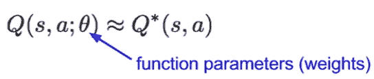

# 在 Q 学习中执行前向传递

现在，你理解了使用神经网络逼近最优函数*Q*(s,a)*的直觉，找到给定状态下的最佳动作。不言而喻，状态序列的最优动作序列将生成一个最优的奖励序列。因此，我们的神经网络试图估计一个函数，可以将可能的动作映射到状态，从而为整个剧集生成最优的奖励。正如你也会回忆起的，我们需要估计的最优质量函数*Q*(s,a)*必须满足贝尔曼方程。贝尔曼方程简单地将最大可能的未来奖励建模为当前时刻的奖励加上紧接着的下一个时间步骤的最大可能奖励：

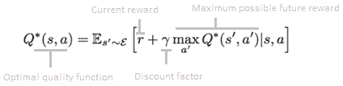

因此，我们需要确保在预测给定时间的最优 Q 值时，贝尔曼方程中规定的条件得以保持。为此，我们可以将该模型的整体损失函数定义为最小化贝尔曼方程和实际预测中的误差。换句话说，在每次前向传播时，我们计算当前状态-动作质量值*Q (s, a ; θ)*与由贝尔曼方程在该时间（*Y[t]*）所表示的理想值之间的差距。由于由贝尔曼方程表示的理想预测正在被迭代更新，我们实际上是在使用一个移动目标变量（Y[t]）来计算我们模型的损失。这可以通过数学公式表示如下：

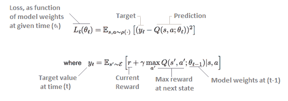

因此，我们的网络将通过最小化一系列损失函数*Lt*来训练，在每个时间步骤中进行更新。这里，术语*y[t]*是我们在时间（*t*）进行预测时的目标标签，并在每个时间步骤中持续更新。另请注意，术语*ρ(s, a)*仅表示我们模型在序列 s 和执行的动作上的内部概率分布，也称为其行为分布。正如你所看到的，在优化给定时间（*t*）的损失函数时，前一时刻（*t-1*）的模型权重保持不变。虽然这里展示的实现使用相同的网络进行两个独立的前向传播，但后来的 Q 学习变体（Mihn 等，2015 年）使用两个独立的网络：一个用于预测满足贝尔曼方程的移动目标变量（称为目标网络），另一个用于计算给定时间的模型预测。现在，让我们看看反向传播是如何在深度 Q 学习中更新我们的模型权重的。

# 在 Q 学习中执行反向传播

现在，我们有了一个定义好的损失度量，它计算给定时间点最优 Q 函数（由 Bellman 方程推导得出）与当前 Q 函数之间的误差。然后，我们可以将 Q 值中的预测误差反向传播，通过模型层进行反向传播，就像我们的网络在环境中进行探索一样。正如我们现在已经非常清楚的那样，这通过对损失函数关于模型权重的梯度进行求解，并根据每个学习批次在梯度的反方向上更新这些权重来实现。因此，我们可以在最优 Q 值函数的方向上迭代地更新模型权重。我们可以像这样表述反向传播过程，并说明模型权重（theta）的变化：

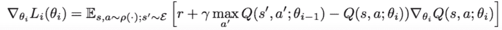

最终，随着模型看到足够的状态-动作对，它将充分反向传播误差并学习最优的表示，从而帮助其在给定环境中导航。换句话说，一个经过训练的模型将具有理想的层权重配置，对应于最优的 Q 值函数，映射代理在环境给定状态下的动作。

长话短说，这些方程描述了估算最优策略（π*）以解决给定环境的过程。我们使用神经网络学习在给定环境中状态-动作对的最佳 Q 值，这反过来可以用来计算生成最优奖励的轨迹，为我们的代理（即最优策略）。这就是我们如何使用强化学习来训练在稀疏时间延迟奖励的准随机模拟中运行的预期性和反应性代理。现在，我们已经掌握了所有实施我们自己的深度强化学习代理所需的理解。

# 用深度学习替代迭代更新

在我们开始实现之前，让我们澄清一下迄今为止我们在深度 Q 学习方面所学到的内容。正如我们在迭代更新方法中所看到的，我们可以使用转移（从初始状态、执行的动作、生成的奖励、以及采样的新状态，< s, a, r, s' >）来更新 Q 表，在每个时间步骤保存这些元组的值。然而，正如我们提到的，这种方法在计算上不可扩展。相反，我们将替代这种在 Q 表上进行的迭代更新，并尝试使用神经网络近似最优的 Q 值函数 (*Q*(s,a)*)，如下所示：

1.  使用当前状态（*s*）作为输入执行前馈传递，然后预测该状态下所有动作的 Q 值。

1.  使用新的状态（*s'*）执行前馈传递，计算网络在下一个状态下的最大总体输出，即 *max a' Q(s', a')*。

1.  在步骤 2 中计算出最大整体输出后，我们将目标 Q 值设置为所选动作的*r + γmax a' Q(s', a')*。我们还将所有其他动作的目标 Q 值设置为步骤 1 返回的相同值，针对每个未选择的动作，仅计算所选动作的预测误差。这有效地消除了（设为零）未被我们的智能体在每个时间步选择的预测动作带来的误差影响。

1.  反向传播误差以更新模型权重

我们在这里所做的只是建立一个能够对动态目标进行预测的网络。这非常有用，因为随着模型在玩游戏的过程中不断获得更多的环境物理信息，它的目标输出（在给定状态下执行的动作）也不断变化，这不同于监督学习，在监督学习中我们有固定的输出，称之为标签。因此，我们实际上是在尝试学习一个可以学习**不断变化的输入（游戏状态）与输出（相应动作）之间映射关系的函数 Q(s,a)**。

通过这个过程，我们的模型在执行动作时形成更好的直觉，并随着它看到更多的环境信息，获得关于状态-动作对正确 Q 值的更清晰认识。从理论上讲，Q 学习通过将奖励与在先前游戏状态中所采取的动作相关联来解决信用分配问题。误差会被反向传播，直到我们的模型能够识别出决定性的状态-动作对，这些对负责生成给定的奖励。然而，我们很快会看到，为了让深度 Q 学习系统如预期那样工作，使用了许多计算和数学技巧。在我们深入研究这些考虑因素之前，了解深度 Q 网络中前向和反向传播的过程可能会有所帮助。

# Keras 中的深度 Q 学习

现在我们已经理解了如何训练智能体选择最佳的状态-动作对，接下来让我们尝试解决一个比之前的出租车模拟更复杂的环境。为什么不实现一个学习智能体来解决一个最初为人类设计的问题呢？好吧，感谢开源运动的奇迹，这正是我们将要做的。接下来，我们将实施 Mnih 等人（2013 年和 2015 年）的方法，参考原始的 DeepMind 论文，该论文实现了基于 Q 学习的智能体。研究人员使用相同的方法和神经架构来玩七种不同的 Atari 游戏。值得注意的是，研究人员在七个测试的不同游戏中，有六个取得了显著的成绩。在这六个游戏中的三款，智能体的表现超过了人类专家。这就是为什么今天，我们试图部分复现这些结果，并训练一个神经网络来玩一些经典游戏，如《太空入侵者》和《吃豆人》。

这是通过使用**卷积神经网络**（**CNN**）完成的，该网络将视频游戏截图作为输入，并估计给定游戏状态下动作的最优 Q 值。为了跟上进度，你只需要做的是安装建立在 Keras 基础上的强化学习包，名为`keras-rl`。你还需要为 OpenAI `gym`模块安装 Atari 依赖，这是我们之前使用过的。Atari 依赖本质上是一个为 Atari 主机设计的模拟器，将生成我们的训练环境。虽然该依赖最初是为 Ubuntu 操作系统设计的，但它已经被移植并与 Windows 和 Mac 用户兼容。你可以使用`pip`包管理器安装这两个模块，以便进行以下实验。

+   你可以使用以下命令安装 Keras 强化学习包：

```py
 ! pip install keras-rl
```

+   你可以使用以下命令为 Windows 安装 Atari 依赖：

```py
! pip install --no-index -f https://github.com/Kojoley/atari- 
  py/releases atari_py
```

+   Mnih 等人（2015）[`arxiv.org/pdf/1312.5602v1.pdf`](https://arxiv.org/pdf/1312.5602v1.pdf)

# 导入一些库

在机器智能领域，实现人类水平的控制一直是一个长期的梦想，尤其是在游戏等任务中。涉及到的复杂性包括自动化智能体的操作，该操作仅依赖于高维感知输入（如音频、图像等），这在强化学习中一直是一个非常具有挑战性的任务。之前的方法主要依赖于手工设计的特征，结合了过于依赖工程特征质量的线性策略表示，以便取得良好的表现。与以往的尝试不同，这种技术不需要我们的智能体拥有任何关于游戏的人工设计知识。它将完全依赖它所接收到的像素输入，并编码表示，以预测在其遍历的每个环境状态下每个可能动作的最优 Q 值。挺酷的，是吧？让我们将以下库导入到工作区，以便继续进行此任务：

```py
from PIL import Image
import numpy as np
import gym

from keras.models import Sequential
from keras.layers import Dense, Activation, Flatten, Convolution2D, Permute
from keras.optimizers import Adam
import keras.backend as K

from rl.agents.dqn import DQNAgent
from rl.policy import LinearAnnealedPolicy, BoltzmannQPolicy, EpsGreedyQPolicy
from rl.memory import SequentialMemory
from rl.core import Processor
from rl.callbacks import FileLogger, ModelIntervalCheckpoint
```

# 预处理技术

正如我们之前提到的，我们将使用卷积神经网络（CNN）对展示给我们智能体的每个状态进行编码，提取代表性的视觉特征。我们的 CNN 将继续回归这些高级表示与最优 Q 值，这些 Q 值对应于每个给定状态下应该采取的最优行动。因此，我们必须向我们的网络展示一系列输入， corresponding to the sequence of screenshots you would see, when playing an Atari game.

如果我们正在玩《太空侵略者》（Atari 2600），这些截图大致会是这样的：

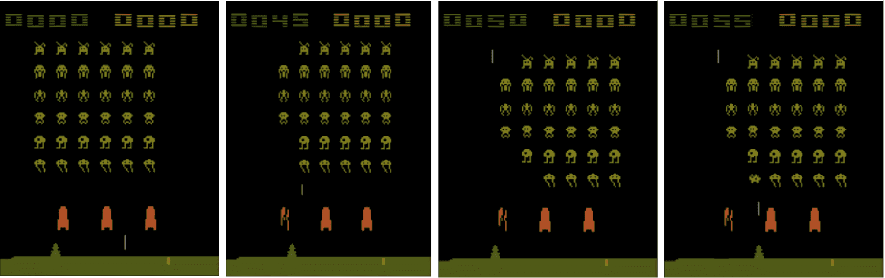

原始的 Atari 2600 游戏画面帧，设计时旨在让人眼前一亮，符合 70 年代的美学，尺寸为 210 x 160 像素，色彩方案为 128 色。尽管按顺序处理这些原始帧可能在计算上要求较高，但请注意，我们可以从这些帧中对训练图像进行降采样，从而得到更易于处理的表示。实际上，这正是 Minh 等人所采用的方法，将输入维度降至更易管理的大小。这是通过将原始 RGB 图像降采样为 110 x 84 像素的灰度图像实现的，然后裁剪掉图像的边缘部分，因这些部分没有太多变化。这使得我们最终得到了 84 x 84 像素的图像大小。这一维度的减少有助于我们的 CNN 更好地编码代表性的视觉特征，遵循我们在第四章《卷积神经网络》中讲解的理论。

# 定义输入参数

最终，我们的卷积神经网络将按批次接收这些裁剪后的图像，每次四张。使用这四帧图像，神经网络将被要求估算给定输入帧的最优 Q 值。因此，我们定义了我们的输入形状，指的是经过预处理的 84 x 84 游戏画面帧的大小。我们还定义了一个窗口长度为`4`，它仅仅指的是我们的网络每次看到的图像数量。对于每一张图像，网络将对最优 Q 值进行标量预测，该 Q 值最大化了我们智能体可以获得的预期未来奖励：

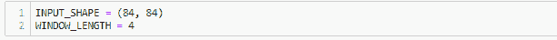

# 创建 Atari 游戏状态处理器

由于我们的网络只能通过输入图像观察游戏状态，我们必须首先构建一个 Python 类，允许我们的**深度 Q 学习智能体**（**DQN**）处理由 Atari 模拟器生成的状态和奖励。这个类将接受一个处理器对象，处理器对象指的是智能体与其环境之间的耦合机制，正如在`keras-rl`库中实现的那样。

我们正在创建`AtariProcessor`类，因为我们希望使用相同的网络在不同的环境中进行操作，每个环境具有不同类型的状态、动作和奖励。这背后的直觉是什么呢？嗯，想想太空入侵者游戏和吃豆人游戏之间的游戏画面和可能的操作差异。虽然太空入侵者游戏中的防御者只能左右移动并开火，但吃豆人可以上下左右移动，以应对环境的不同状态。自定义的处理器类帮助我们简化不同游戏之间的训练过程，而不必对学习智能体或观测环境做过多修改。我们将实现的处理器类将允许我们简化不同游戏状态和奖励的处理，这些状态和奖励是通过智能体对环境的作用生成的：

```py
class AtariProcessor(Processor):

    def process_observation(self, observation):
        # Assert dimension (height, width, channel) 
        assert observation.ndim == 3 
        # Retrieve image from array
        img = Image.fromarray(observation) 
        # Resize and convert to grayscale
        img = img.resize(INPUT_SHAPE).convert('L') 
        # Convert back to array
        processed_observation = np.array(img) 
        # Assert input shape
        assert processed_observation.shape == INPUT_SHAPE 
        # Save processed observation in experience memory (8bit)
        return processed_observation.astype('uint8')
   def process_state_batch(self, batch):
      #Convert the batches of images to float32 datatype
       processed_batch = batch.astype('float32') / 255.
       return processed_batch
   def process_reward(self, reward):
       return np.clip(reward, -1., 1.) # Clip reward
```

# 处理单独的状态

我们的处理器类包含三个简单的函数。第一个函数（`process_observation`）接收一个表示模拟游戏状态的数组，并将其转换为图像。然后，这些图像被调整大小、转换回数组，并作为可管理的数据类型返回给经验记忆（这是一个我们稍后将详细说明的概念）。

# 批量处理状态

接下来，我们有一个（`process_state_batch`）函数，它批量处理图像并将其作为`float32`数组返回。虽然这个步骤也可以在第一个函数中实现，但我们单独处理的原因是为了提高计算效率。按照简单的数学规律，存储一个`float32`数组比存储一个 8 位数组需要更多四倍的内存。由于我们希望将观察结果存储在经验记忆中，因此我们宁愿将它们存储为可管理的表示形式。当处理给定环境中的数百万个状态时，这一点变得尤为重要。

# 处理奖励

最后，我们类中的最后一个函数使用（`process_reward`）函数对从环境中生成的奖励进行裁剪。为什么这么做呢？让我们先考虑一下背景信息。当我们让智能体在真实且未经修改的游戏中进行训练时，这种奖励结构的变化仅在训练过程中进行。我们不会让智能体使用游戏画面中的实际得分，而是将正奖励和负奖励分别固定为+1 和-1。奖励为 0 的部分不受此裁剪操作的影响。这样做在实践中非常有用，因为它可以限制我们在反向传播网络误差时的导数规模。此外，由于智能体不需要为全新的游戏类型学习新的评分方案，因此在不同学习环境中实现相同的智能体变得更加容易。

# 奖励裁剪的局限性

如 DeepMind 论文（Minh 等，2015）所指出，奖励裁剪的一个明显缺点是，这个操作使得我们的智能体无法区分不同大小的奖励。这一点对于更复杂的模拟环境来说肯定会有影响。例如，考虑一辆真实的自动驾驶汽车。控制的人工智能智能体可能需要评估在给定环境状态下，采取困境性行动时，奖励/惩罚的大小。也许该智能体面临的选择是为了避免更严重的事故，选择撞到行人。这种局限性，然而，对我们智能体在 Atari 2600 游戏中应对简单学习环境的能力似乎并不会产生严重影响。

# 初始化环境

接下来，我们只需使用之前添加到可用`gym`环境中的 Atari 依赖（无需单独导入），初始化太空入侵者环境：

```py
env = gym.make('SpaceInvaders-v0')
np.random.seed(123)
env.seed(123)
nb_actions = env.action_space.n
```

我们还生成了一个随机种子来始终如一地初始化环境的状态，以便进行可重复的实验。最后，我们定义了一个变量，表示代理在任何给定时刻可以执行的动作数量。

# 构建网络

从直观上思考我们的这个问题，我们正在设计一个神经网络，该网络接收来自环境的游戏状态序列。在序列的每个状态下，我们希望我们的网络预测出具有最高 Q 值的动作。因此，我们网络的输出将指代每个可能游戏状态下的每个动作的 Q 值。因此，我们首先定义了几个卷积层，随着层数的增加，滤波器数量逐渐增多，步幅长度逐渐减少。所有这些卷积层都使用**修正线性单元** (**ReLU**) 激活函数。接下来，我们添加了一个展平层，将卷积层的输出维度缩减为向量表示。

然后，这些表示会被输入到两个密集连接的层中，这些层执行游戏状态与动作的 Q 值回归：

```py
input_shape = (WINDOW_LENGTH,) + INPUT_SHAPE
# Build Conv2D model
model = Sequential()
model.add(Permute((2, 3, 1), input_shape=input_shape))
model.add(Convolution2D(32, (8, 8), strides=(4, 4), activation='relu'))
model.add(Convolution2D(64, (4, 4), strides=(2, 2), activation='relu'))
model.add(Convolution2D(64, (3, 3), strides=(1, 1), activation='relu'))
model.add(Flatten())
model.add(Dense(512, activation='relu'))
# Last layer: no. of neurons corresponds to action space
# Linear activation
model.add(Dense(nb_actions, activation='linear'))  
print(model.summary())

_____________________________________________________________
Layer (type) Output Shape Param # 
=============================================================
permute_2 (Permute) (None, 84, 84, 4) 0 
_____________________________________________________________
conv2d_4 (Conv2D) (None, 20, 20, 32) 8224 
_____________________________________________________________
conv2d_5 (Conv2D) (None, 9, 9, 64) 32832 
_____________________________________________________________
conv2d_6 (Conv2D) (None, 7, 7, 64) 36928 
_____________________________________________________________
flatten_2 (Flatten) (None, 3136) 0 
_____________________________________________________________
dense_3 (Dense) (None, 512) 1606144 
_____________________________________________________________
dense_4 (Dense) (None, 6) 3078 
=============================================================
Total params: 1,687,206
Trainable params: 1,687,206
Non-trainable params: 0
______________________________________________________________
None

```

最后，你会注意到我们的输出层是一个密集连接的层，包含与我们代理的动作空间相对应的神经元数量（即它可能执行的动作数）。这个层也采用了线性激活函数，就像我们之前看到的回归示例一样。这是因为我们的网络本质上在执行一种多变量回归，它利用其特征表示来预测代理在给定输入状态下每个动作的最高 Q 值。

# 缺乏池化层

你可能还注意到与之前的 CNN 示例相比的另一个区别是缺少池化层。之前，我们使用池化层对每个卷积层生成的激活图进行下采样。正如你在第四章《卷积神经网络》中回忆的那样，这些池化层帮助我们实现了对不同类型输入的空间不变性。然而，在为我们特定的使用案例实现 CNN 时，我们可能不希望丢弃特定于表示空间位置的信息，因为这实际上可能是识别代理正确动作的一个重要部分。

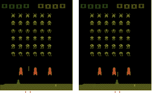

如你在这两张几乎相同的图片中所看到的，太空侵略者发射的弹丸的位置显著地改变了我们代理的游戏状态。当代理在第一张图中足够远以避开这个弹丸时，它可能在第二张图中因犯一个错误（向右移动）而迎来末日。由于我们希望它能够显著区分这两种状态，因此我们避免使用池化层。

# 实时学习中的问题

正如我们之前提到的，我们的神经网络将一次处理四帧图像，并将这些输入回归到每个个体状态（即从 Atari 模拟器中采样的图像）对应的最高 Q 值动作。然而，如果我们不打乱网络接收每个四张图像批次的顺序，那么在学习过程中，网络会遇到一些相当棘手的问题。

我们不希望网络从连续批次的样本中学习的原因是，这些序列是局部相关的。这是一个问题，因为网络的参数在任何给定时刻都会决定由模拟器生成的下一批训练样本。根据马尔可夫假设，未来的游戏状态概率依赖于当前的游戏状态。因此，如果当前的最大化动作要求我们的智能体向右移动，那么接下来批次中的训练样本将会主要是智能体向右移动，导致糟糕且不必要的反馈循环。而且，连续的训练样本通常过于相似，网络难以从中有效学习。这些问题可能会导致网络的损失在训练过程中收敛到局部（而不是全局）最小值。那么，我们到底该如何应对这个问题呢？

# 存储经验到重放记忆中

解决方案在于为我们的网络构建重放记忆的概念。本质上，重放记忆可以充当一种固定长度的*经验* *队列*。它可以用来存储正在进行的游戏的连续状态，连同所采取的动作、生成的奖励和返回给智能体的状态。这些经验队列会不断更新，以保持*最近*的*n*个游戏状态。然后，我们的网络将使用从重放记忆中保存的随机批次经验元组（`state`，`action`，`reward`，和`next state`）来执行梯度下降。

在`rl.memory`，即`keras-rl`模块中，提供了不同类型的重放记忆实现。我们使用`SequentialMemory`对象来实现我们的目的。这个对象需要两个参数，如下所示：

```py
memory = SequentialMemory(limit=1000000, window_length=WINDOW_LENGTH)
```

`limit`参数表示要保存在记忆中的条目数。一旦超出此限制，新的条目将替换旧的条目。`window_length`参数仅指每个批次中的训练样本数量。

由于经验元组批次的随机顺序，网络不容易陷入局部最小值，并最终会收敛找到最优权重，代表给定环境的最优策略。此外，使用非顺序批次进行权重更新意味着我们可以实现更高的数据效率，因为同一张图像可以被打乱到不同的批次中，从而贡献多次权重更新。最后，这些经验元组甚至可以从人类游戏数据中收集，而不是之前由网络执行的动作。

其他方法（Schaul 等人，2016 年：[`arxiv.org/abs/1511.05952`](https://arxiv.org/abs/1511.05952)）通过添加一个额外的数据结构，记录每个转换（*状态 -> 动作 -> 奖励 -> 下一状态*）的优先级，实现了优先级版本的经验重放记忆，以便更频繁地重放重要的转换。其背后的直觉是让网络更频繁地从其最佳和最差的表现中学习，而不是从那些无法产生多少学习的实例中学习。尽管这些是一些巧妙的方法，有助于我们的模型收敛到相关的表示，但我们也希望它时不时地给我们带来惊喜，并探索它尚未考虑过的机会。这让我们回到了之前讨论过的，*探索-开发困境*。

# 平衡探索与开发

我们如何确保我们的代理在旧策略和新策略之间保持良好的平衡呢？这个问题在我们的 Q 网络随机初始化权重时变得更加复杂。由于预测的 Q 值是这些随机权重的结果，模型在初期训练时会生成次优的预测，进而导致 Q 值学习较差。自然，我们不希望我们的网络过于依赖它最初为给定状态-动作对生成的策略。就像多巴胺成瘾的老鼠一样，如果代理不探索新策略并扩展其视野，而只是利用已知的策略，它不可能在长期内表现良好。为了解决这个问题，我们必须实现一种机制，鼓励代理尝试新的动作，忽略已学得的 Q 值。这样做基本上允许我们的学习代理尝试新的策略，这些策略可能在长期内更有利。

# Epsilon-贪婪探索策略

这可以通过算法修改我们学习代理解决环境问题时使用的策略来实现。一个常见的方法是使用 epsilon-贪婪探索策略。在这里，我们定义一个概率（ε）。然后，我们的代理可能会忽略学习到的 Q 值，并以（1 - ε）的概率尝试一个随机动作。因此，如果 epsilon 值设置为 0.5，那么我们的网络平均将忽略其学习的 Q 表所建议的动作，做一些随机的事情。这是一个相当具有探索性的代理。相反，epsilon 值为 0.001 时，网络将更一致地依赖学习到的 Q 值，平均每一百个时间步中才随机选择一次动作。

很少使用固定的 ε 值，因为探索与利用的程度可以基于许多内部（例如，代理的学习率）和外部因素（例如，给定环境中的随机性与确定性的程度）有所不同。在 DeepMind 论文中，研究人员实现了一个随时间衰减的 ε 项，从 1（即完全不依赖初始随机预测）到 0.1（在 10 次中有 9 次依赖于预测的 Q 值）：

```py
policy = LinearAnnealedPolicy(EpsGreedyQPolicy(), 
                              attr='eps',
                              value_max=1.,
                              value_min=.1,
                              value_test=.05,
                              nb_steps=1000000)
```

因此，衰减的 epsilon 确保我们的代理不会在初期训练阶段依赖于随机预测，而是在 Q 函数逐渐收敛到更一致的预测后，逐渐更积极地利用自身的预测。

# 初始化深度 Q 学习代理

现在，我们已经通过编程定义了初始化深度 Q 学习代理所需的所有个体组件。为此，我们使用从 `rl.agents.dqn` 导入的 `DQNAgent` 对象，并定义了相应的参数，如下所示：

```py
#Initialize the atari_processor() class

processor = AtariProcessor()

# Initialize the DQN agent 
dqn = DQNAgent(model=model,             #Compiled neural network model
               nb_actions=nb_actions,   #Action space
               policy=policy,   #Policy chosen (Try Boltzman Q policy)
               memory=memory,   #Replay memory (Try Episode Parameter  
                                                memory)
               processor=processor,     #Atari processor class
#Warmup steps to ignore initially (due to random initial weights)
               nb_steps_warmup=50000,   
               gamma=.99,                #Discount factor
               train_interval=4,         #Training intervals
               delta_clip=1.,            #Reward clipping
              )
```

前述参数是根据原始 DeepMind 论文初始化的。现在，我们准备好最终编译我们的模型并启动训练过程了。为了编译模型，我们只需要在我们的 `dqn` 模型对象上调用 compile 方法：

```py
dqn.compile(optimizer=Adam(lr=.00025), metrics=['mae'])
```

这里的 `compile` 方法需要传入一个优化器和我们希望跟踪的度量标准作为参数。在我们的例子中，我们选择了学习率为 `0.00025` 的 `Adam` 优化器，并跟踪 **平均绝对误差** (**MAE**) 度量，具体如图所示。

# 训练模型

现在，我们可以启动我们的深度 Q 学习网络的训练过程。我们通过调用已编译的 DQN 网络对象上的 `fit` 方法来实现这一点。`fit` 参数需要传入正在训练的环境（在我们这个例子中是 SpaceInvaders-v0）以及在此次训练过程中总的游戏步数（类似于 epoch，表示从环境中采样的游戏状态总数）作为参数。如果你希望可视化训练过程中代理的表现，可以选择将可选参数 `visualize` 设置为 `True`。虽然这非常有趣——甚至有点让人着迷——但它会显著影响训练速度，因此不建议将其设置为默认选项：

```py
dqn.fit(env, nb_steps=1750000)   #visualize=True

Training for 1750000 steps ...
Interval 1 (0 steps performed)
 2697/10000 [=======>....................] - ETA: 26s - reward: 0.0126
```

# 测试模型

我们使用以下代码测试模型：

```py
dqn.test(env, nb_episodes=10, visualize=True)

Testing for 10 episodes ...
Episode 1: reward: 3.000, steps: 654
Episode 2: reward: 11.000, steps: 807
Episode 3: reward: 8.000, steps: 812
Episode 4: reward: 3.000, steps: 475
Episode 5: reward: 4.000, steps: 625
Episode 6: reward: 9.000, steps: 688
Episode 7: reward: 5.000, steps: 652
Episode 8: reward: 12.000, steps: 826
Episode 9: reward: 2.000, steps: 632
Episode 10: reward: 3.000, steps: 643

<keras.callbacks.History at 0x24280aadc50>
```

# 总结 Q 学习算法

恭喜！你现在已经深入理解了深度 Q 学习的概念，并将这些概念应用于使模拟代理逐步学习解决其环境。以下伪代码作为我们刚刚实现的整个深度 Q 学习过程的回顾：

```py
initialize replay memory
initialize Q-Value function with random weights
sample initial state from environment
Keep repeating:

     choose an action to perform:
            with probability ε select a random action
            otherwise select action with argmax a Q(s, a')
     execute chosen action
     collect reward and next state
     save experience <s, a, r, s'> in replay memory

     sample random transitions <s, a, r, s'> from replay memory
     compute target variable for each mini-batch transition:

             if s' is terminal state then target = r
             otherwise t = r + γ max a'Q(s', a')
     train the network with loss (target - Q(s,a)`²)
     s = s'

until done
```

# 双重 Q 学习

我们刚刚构建的标准 Q-learning 模型的另一个扩展是 Double Q-learning 的思想，该方法由 Hado van Hasselt（2010 年，及 2015 年）提出。其背后的直觉非常简单。回顾一下，到目前为止，我们通过 Bellman 方程估计每个状态-动作对的目标值，并检查在给定状态下我们的预测偏差，如下所示：


然而，从这种方式估算最大期望未来奖励会出现一个问题。如你可能在之前注意到的那样，目标方程中的最大运算符（*y[t]*）使用相同的 Q 值来评估给定动作，这些 Q 值也被用于预测采样状态下的给定动作。这引入了 Q 值过度估计的倾向，最终可能失控。为了解决这种可能性，Van Hasselt 等人（2016）实施了一个模型，将动作选择与其评估解耦。这是通过使用两个独立的神经网络来实现的，每个网络都被参数化以估算整个方程的一个子集。第一个网络负责预测给定状态下应该采取的动作，而第二个网络则用来生成目标，供第一个网络的预测在计算损失时迭代评估。尽管每次迭代时损失的公式没有变化，但给定状态的目标标签现在可以通过增强的 Double DQN 方程来表示，如下所示：

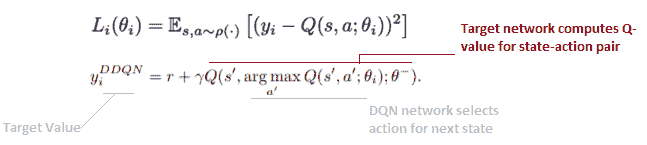

如我们所见，目标网络有自己的一组参数需要优化，（θ-）。这种将动作选择与评估解耦的做法已被证明可以弥补天真 DQN 所学习到的过度乐观的表示。因此，我们能够更快地收敛我们的损失函数，同时实现更稳定的学习。

实际上，目标网络的权重也可以被固定，并且定期/缓慢地更新，以避免因目标与预测之间的反馈回路不良而使模型不稳定。这项技术被另一本 DeepMind 论文（Hunt、Pritzel、Heess 等人，2016）广泛推广，该论文指出这种方法能够稳定训练过程。

Hunt、Pritzel、Heess 等人的 DeepMind 论文，*Continuous Control with Deep Reinforcement **Learning*, 2016，可以通过以下链接访问：[`arxiv.org/pdf/1509.02971.pdf`](https://arxiv.org/pdf/1509.02971.pdf)。

你可以通过使用之前训练我们《太空侵略者》智能体时的相同代码，并对定义 DQN 智能体的部分做些微小修改，来通过`keras-rl`模块实现 Double DQN：

```py
double_dqn = DQNAgent(model=model,
               nb_actions=nb_actions,
               policy=policy,
               memory=memory,
               processor=processor,
               nb_steps_warmup=50000,
               gamma=.99, 
               target_model_update=1e-2,
               train_interval=4,
               delta_clip=1.,
               enable_double_dqn=True,
              )
```

我们只需要将`enable_double_dqn`的布尔值设置为`True`，然后就可以开始了！如果需要，您还可以尝试调整预热步数（即在模型开始学习之前的步骤数）以及目标模型更新的频率。我们可以进一步参考以下论文：

+   **深度强化学习与双 Q 学习**：[`arxiv.org/pdf/1509.06461.pdf`](https://arxiv.org/pdf/1509.06461.pdf)

# 对战网络架构

我们将实现的最后一种 Q 学习架构是对战网络架构（[`arxiv.org/abs/1511.06581`](https://arxiv.org/abs/1511.06581)）。顾名思义，在这种架构中，我们通过使用两个独立的估计器来使神经网络与自己对战，一个估计器用于评估状态值，另一个用于评估状态-动作对的值。你可能还记得在本章前面部分，我们使用一个单一的卷积和密集连接层流来估计状态-动作对的质量。然而，我们实际上可以将 Q 值函数分解为两个独立项的和。这样做的原因是让我们的模型能够分别学习某些状态可能有价值，某些则没有价值，而不需要专门学习在每个状态下执行每个动作的影响：

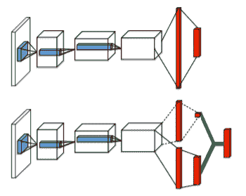

在前面的图表顶部，我们可以看到标准的 DQN 架构。底部则展示了对战 DQN 架构如何分成两个独立的流，其中状态值和状态-动作值被分别估计，而不需要额外的监督。因此，对战 DQN 使用独立的估计器（即密集连接层）来分别估计处于某一状态时的值*V(s)*以及在给定状态下执行某个动作相较于其他动作的优势*A(s,a)*。这两个项随后被结合起来，预测给定状态-动作对的 Q 值，从而确保我们的智能体在长期内选择最优动作。与标准的 Q 函数*Q(s,a)*只能让我们估计给定状态下选择动作的价值不同，使用这种方法我们可以分别衡量状态的价值和动作的相对优势。在执行某个动作不会显著改变环境的情况下，这种做法可能会有所帮助。

值函数和优势函数可以通过以下方程给出：

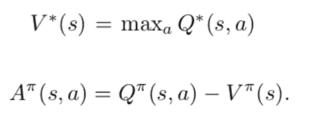

DeepMind 的研究人员（Wang 等人，2016 年）在一个早期的赛车游戏（Atari Enduro）中测试了这样的架构，游戏中要求代理在道路上行驶，途中可能会遇到障碍物。研究人员注意到，状态值流会学习关注道路和屏幕上的分数，而动作优势流则只有在游戏屏幕上出现特定障碍物时才会学会关注。自然，只有当障碍物出现在其路径上时，代理才需要执行一个动作（向左或向右移动）。否则，向左或向右移动对代理来说没有任何意义。另一方面，代理始终需要关注道路和分数，这是由网络的状态值流来完成的。因此，在他们的实验中，研究人员展示了这种架构如何在代理面对许多具有相似后果的动作时，提供更好的策略评估。

我们可以使用`keras-rl`模块实现对战 DQN，解决之前提到的 Space Invaders 问题。我们需要做的就是重新定义我们的代理，如下所示：

```py
dueling_dqn = DQNAgent(model=model,
               nb_actions=nb_actions,
               policy=policy,
               memory=memory,
               processor=processor,
               nb_steps_warmup=50000,
               gamma=.99, 
               target_model_update=10000,
               train_interval=4,
               delta_clip=1.,
               enable_dueling_network=True,
               dueling_type='avg'
              )
```

在这里，我们只需将布尔参数`enable_dueling_network`设置为`True`并指定一个对战类型。

想要了解更多关于网络架构和使用潜在好处的信息，我们鼓励你参考完整的研究论文，《*深度强化学习中的对战网络架构*》，你可以在[`arxiv.org/pdf/1511.06581.pdf`](https://arxiv.org/pdf/1511.06581.pdf)查看。

# 练习

+   在 Atari 环境中实现标准的 Q 学习并采用不同的策略（Boltzman），检查性能指标的差异

+   在相同问题上实现双重 DQN 并比较性能差异

+   实现一个对战 DQN 并比较性能差异

# Q 学习的局限性

真是令人惊叹，像这样的相对简单的算法，经过足够的训练时间后，竟能产生复杂的策略，代理能够凭此做出决策。特别是，研究人员（现在你也可以）能够展示出如何通过与环境的充分互动，学习到专家策略。例如，在经典的打砖块游戏中（该游戏作为 Atari 依赖的环境之一），你需要移动屏幕底部的挡板，反弹一个球并击破屏幕上方的砖块。经过足够的训练时间，DQN 代理甚至能想出复杂的策略，比如将球卡在屏幕的顶部，获得最大得分：

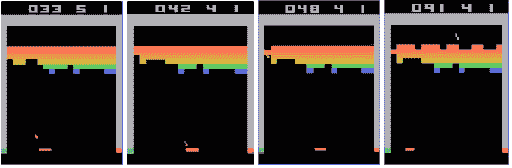

这种直观的行为自然会让你产生疑问——我们能将这种方法应用到多远？我们能通过这种方法掌握哪些类型的环境，它的局限性又是什么？

的确，Q 学习算法的优势在于它们能够解决具有高维观测空间的问题，比如来自游戏屏幕的图像。我们通过卷积架构实现了这一点，使我们能够将状态-动作对与最优奖励关联起来。然而，到目前为止，我们关注的动作空间大多是离散的和低维的。例如，向右或向左转是一个离散的动作，而不是像以角度转向左那样的连续动作。后者是一个连续动作空间的例子，因为智能体向左转的动作依赖于一个由特定角度表示的变量，该角度可以取连续值。我们最初也没有那么多可执行的动作（Atari 2600 游戏中的动作范围为 4 到 18）。其他潜在的深度强化学习问题，如机器人运动控制或优化车队部署，可能需要建模非常高维和连续的动作空间，在这种情况下，标准的 DQN 表现较差。这是因为 DQN 依赖于找到最大化 Q 值函数的动作，而这在连续动作空间的情况下需要在每一步进行迭代优化。幸运的是，针对这个问题，已经有其他方法存在。

# 使用策略梯度改进 Q 学习

到目前为止，我们的方法是通过迭代更新状态-动作对的 Q 值估计，从而推断出最优策略。然而，当面对连续动作空间时，这变成了一项繁重的学习任务。例如，在机器人运动控制的情况下，我们的动作空间由机器人关节位置和角度等连续变量定义。在这种情况下，估计 Q 值函数变得不切实际，因为我们可以假设这个函数本身非常复杂。因此， вместо学习每个关节位置和角度的最优 Q 值，我们可以尝试一种不同的方法。如果我们能够直接学习一个策略，而不是通过迭代更新状态-动作对的 Q 值来推断策略，那会怎么样呢？回想一下，策略仅仅是一个状态轨迹，之后是执行的动作、产生的奖励以及返回给智能体的状态。因此，我们可以定义一组参数化的策略（通过神经网络的权重(θ)参数化），其中每个策略的价值可以由此处给出的函数定义：

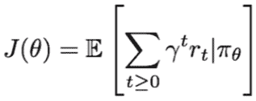

在这里，策略的价值由函数*J(θ)*表示，其中 theta 表示我们的模型权重。在左侧，我们可以用之前熟悉的术语来定义给定策略的价值，表示预期的累计未来奖励之和。在这个新设置下，我们的目标是找到能够使策略价值函数*J(θ)*最大化的模型权重，从而为我们的智能体带来最佳的预期未来奖励。

之前，为了找到函数的全局最小值，我们通过对该函数的一级导数进行迭代优化，采取与梯度负方向成比例的步骤来更新模型权重。这就是我们所说的梯度下降。然而，由于我们想要找到我们策略价值函数的最大值，*J(θ)*，我们将执行梯度上升，它会迭代地更新与梯度正方向成比例的模型权重。因此，我们可以通过评估由给定策略生成的轨迹来使深度神经网络收敛到最优策略，而不是单独评估状态-动作对的质量。接着，我们甚至可以让来自有利策略的动作在给定游戏状态下有更高的被选中概率，而来自不利策略的动作可以被较少地采样。这就是策略梯度方法背后的主要直觉。自然，跟随这一方法会有一整套新的技巧，我们鼓励你去阅读。例如，*深度强化学习中的连续控制*，可以在[`arxiv.org/pdf/1509.02971.pdf`](https://arxiv.org/pdf/1509.02971.pdf)找到。

一个值得关注的有趣的策略梯度实现是演员-评论家模型，它可以在连续动作空间中实现，以解决更复杂的高维动作空间问题，例如我们之前讨论过的问题。有关演员-评论家模型的更多信息可以在[`arxiv.org/pdf/1509.02971.pdf`](https://arxiv.org/pdf/1509.02971.pdf)中找到。

相同的演员-评论家概念已经在不同的环境中应用于各种任务，如自然语言生成和对话建模，甚至是在像《星际争霸 II》这样的复杂实时策略游戏中，感兴趣的读者可以进一步探索：

+   **自然语言生成与对话建模**：[`arxiv.org/pdf/1607.07086.pdf`](https://arxiv.org/pdf/1607.07086.pdf)

+   **星际争霸 II：强化学习的新挑战**：[`arxiv.org/pdf/1708.04782.pdf?fbclid=IwAR30QJE6Kw16pHA949pEf_VCTbrX582BDNnWG2OdmgqTIQpn4yPbtdV-xFs`](https://arxiv.org/pdf/1708.04782.pdf?fbclid=IwAR30QJE6Kw16pHA949pEf_VCTbrX582BDNnWG2OdmgqTIQpn4yPbtdV-xFs)

# 总结

在这一章中，我们涵盖了很多内容。我们不仅探索了机器学习的一个全新分支——强化学习，还实现了一些被证明能够培养复杂自主智能体的最先进算法。我们了解了如何使用马尔可夫决策过程来建模环境，并通过贝尔曼方程评估最优奖励。我们还看到，如何通过使用深度神经网络近似质量函数来解决信用分配问题。在这个过程中，我们探索了许多技巧，如奖励折扣、裁剪和经验回放等（仅举几例），它们有助于表示高维输入，比如游戏画面图像，以便在模拟环境中导航并优化目标。

最后，我们探索了深度 Q 学习领域的一些进展，概述了双重 DQN 和对抗性 DQN 等架构。最后，我们回顾了一些在使智能体成功导航高维动作空间时面临的挑战，并了解了如策略梯度等不同方法如何帮助解决这些问题。
