# 第八章：自编码器

在前一章中，我们熟悉了**机器学习**（**ML**）中的一个新领域：强化学习的领域。我们看到如何通过神经网络增强强化学习算法，以及如何学习近似函数，将游戏状态映射到智能体可能采取的动作。这些动作随后与一个动态的目标变量进行比较，而该目标变量是通过我们所称的**贝尔曼方程**定义的。严格来说，这是一种自监督学习的机器学习技术，因为用来比较我们预测结果的是贝尔曼方程，而不是一组标记的目标变量，这在监督学习方法中才会出现（例如，带有每个状态下应采取的最优动作标签的游戏画面）。后者虽然可能实现，但对于给定的使用场景来说，计算成本要高得多。现在，我们将继续前进，发现另一种自监督机器学习技术，探索**神经自编码器**的世界。

本章中，我们将探讨让神经网络学习从给定数据集中编码最具代表性特征的实用性和优势。本质上，这使我们能够保留并在以后重建定义观察类别的关键元素。观察本身可以是图像、自然语言数据，甚至是可能受益于降维的时间序列观察，通过去除那些表示给定观察中较不具信息性方面的信息。你可能会问，*谁得益*？

本章将涵盖以下主题：

+   为什么选择自编码器？

+   自动编码信息

+   理解自编码器的局限性

+   解析自编码器

+   训练自编码器

+   概览自编码器原型

+   网络规模和表示能力

+   理解自编码器中的正则化

+   使用稀疏自编码器进行正则化

+   探索数据

+   构建验证模型

+   设计深度自编码器

+   使用功能性 API 设计自编码器

+   深度卷积自编码器

+   编译和训练模型

+   测试并可视化结果

+   去噪自编码器

+   训练去噪网络

# 为什么选择自编码器？

过去（大约 2012 年），自编码器因其在初始化深度**卷积神经网络**（**CNNs**）层权重方面的应用（通过一种被称为**贪婪逐层预训练**的操作）而短暂地享有一些声誉，但随着更好的随机权重初始化方案的出现，以及允许训练更深层神经网络的更具优势的方法（例如 2014 年的批量归一化，及 2015 年的残差学习）逐渐成为主流，研究人员对这种预训练技术的兴趣逐渐减退。

如今，自动编码器的一个重要应用来自于它们能够发现高维数据的低维表示，同时尽量保留其中的核心属性。这使我们能够执行例如恢复损坏图像（或图像去噪）等任务。自动编码器的另一个活跃研究领域是它们能够执行主成分分析，例如数据的变换，从而可以可视化数据中主要方差因素的有用信息。事实上，带有线性激活函数的单层自动编码器与在数据集上执行的标准**主成分分析**（**PCA**）操作非常相似。这样的自动编码器只学习一个维度减少的子空间，这个子空间正是通过 PCA 得到的。因此，自动编码器可以与 t-SNE 算法（[`en.wikipedia.org/wiki/T-distributed_stochastic_neighbor_embedding`](https://en.wikipedia.org/wiki/T-distributed_stochastic_neighbor_embedding)）结合使用，后者因其在二维平面上可视化信息的能力而著名，首先对高维数据集进行降采样，然后可视化观察到的主要方差因素。

此外，自动编码器在此类应用中的优势（即执行降维）源于它们可能具有非线性的编码器和解码器函数，而 PCA 算法仅限于线性映射。这使得自动编码器能够学习比 PCA 分析相同数据得到的结果更强大的非线性特征空间表示。事实上，当你处理非常稀疏和高维的数据时，自动编码器可以证明是数据科学工具箱中一个非常强大的工具。

除了自动编码器的这些实际应用外，还有一些更具创意和艺术性的应用。例如，从编码器生成的低维表示中采样，已被用来生成艺术图像，这些图像在纽约某拍卖行以约 50 万美元的价格拍卖（见[`www.bloomberg.com/news/articles/2018-10-25/ai-generated-portrait-is-sold-for-432-500-in-an-auction-first`](https://www.bloomberg.com/news/articles/2018-10-25/ai-generated-portrait-is-sold-for-432-500-in-an-auction-first)）。我们将在下一章回顾此类图像生成技术的基础知识，当时我们将介绍变分自动编码器架构和**生成对抗网络**（**GANs**）。但首先，让我们尝试更好地理解自动编码器神经网络的本质。

# 自动编码信息

那么，自编码器的理念有什么不同之处呢？你肯定已经接触过无数的编码算法，像是 MP3 压缩用于存储音频文件，或者 JPEG 压缩用于存储图像文件。自编码神经网络之所以有趣，是因为它们采用了一种与之前提到的准对等物相比非常不同的信息表示方式。这正是你在阅读完神经网络内部工作机制的七个章节后，理应期待的一种方法。

与 MP3 或 JPEG 算法不同，后者通常对声音和像素有普遍的假设，而神经自编码器则被迫自动从任何训练过程中显示的输入中学习代表性特征。它接着使用在训练过程中捕获的学习表示来重建给定的输入。重要的是要理解，自编码器的吸引力并不在于简单地复制其输入。当训练自编码器时，我们通常并不关心它所生成的解码输出，而更关心的是网络如何转化给定输入的维度。理想情况下，我们希望通过给网络提供激励和约束，以尽可能准确地重建原始输入，从而寻找代表性的编码方案。通过这样做，我们可以将编码器函数应用于类似的数据集，作为一种特征检测算法，从而为给定的输入提供语义丰富的表示。

这些表示方法可以用来执行某种分类，具体取决于所处理的使用案例。因此，采用的正是编码的架构机制，这也定义了自编码器与其他标准编码算法相比的新颖方法。

# 理解自编码器的局限性

如前所述，神经网络，例如自编码器，被用来自动从数据中学习代表性特征，而不需要明确依赖于人工设计的假设。尽管这种方法可以让我们发现适用于不同类型数据的理想编码方案，但它也确实存在一些局限性。首先，自编码器被认为是**数据特定的**，这意味着它们的作用仅限于与训练数据非常相似的数据。例如，一个仅训练生成猫图像的自编码器在没有明确训练的情况下，几乎无法生成狗的图像。显然，这似乎限制了此类算法的可扩展性。值得注意的是，直到现在，自编码器在编码图像时的表现并没有明显优于 JPEG 算法。另一个问题是，自编码器往往会产生**有损输出**。这意味着压缩和解压操作会降低网络输出的质量，生成的表示相比输入会不够精确。这个问题似乎在大多数编码应用场景中都有出现（包括基于启发式的编码方案，如 MP3 和 JPEG）。

因此，自编码器揭示了一些非常有前景的实践方法，用于处理*未标记的*真实世界数据。然而，今天在数字领域中可用的绝大多数数据实际上是无结构且未标记的。另一个值得注意的常见误解是将自编码器归类为无监督学习，但实际上，它不过是自监督学习的另一种变体，正如我们很快将要发现的那样。那么，这些网络究竟是如何工作的呢？

# 分析自编码器

从高层次看，自编码器可以被认为是一种特定类型的前馈网络，它学习模仿输入并重构出相似的输出。正如我们之前提到的，它由两部分组成：编码器函数和解码器函数。我们可以将整个自编码器视为一层层互联的神经元，首先通过编码输入数据，然后使用生成的编码重构输出：

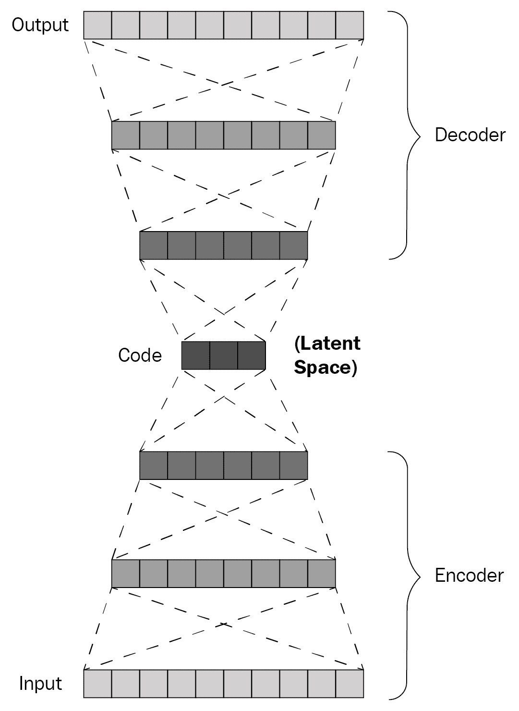

一个不完全自编码器的示例

上图展示了一个特定类型的自动编码器网络。从概念上讲，自动编码器的输入层连接到一个神经元层，将数据引导到一个潜在空间，这就是 **编码器函数**。该函数可以泛化定义为 `h = f(x)`，其中 `x` 代表网络输入，`h` 代表由编码器函数生成的潜在空间。潜在空间可能体现了输入到我们网络的压缩表示，随后被解码器函数（即后续的神经元层）用来解开这个简化的表示，将其映射到一个更高维的特征空间。因此，解码器函数（形式化为` r = g(h)`) 接着将由编码器生成的潜在空间 (`h`) 转换为网络的 *重构* 输出 (`r`)。

# 训练一个自动编码器

编码器和解码器函数之间的交互由另一个函数控制，该函数操作输入和输出之间的距离，我们通常称之为神经网络中的 `loss` 函数。因此，为了训练一个自动编码器，我们只需对编码器和解码器函数分别关于 `loss` 函数（通常使用均方误差）进行求导，并使用梯度来反向传播模型的误差，更新整个网络的层权重。

因此，自动编码器的学习机制可以表示为最小化一个 `loss` 函数，其公式如下：

*min L(x, g ( f ( x ) ) )*

在前面的公式中，`L` 代表一个 `loss` 函数（如均方误差 MSE），它对解码器函数的输出（*g(f( x ))*）进行惩罚，惩罚的内容是输出与网络输入 *(x)* 的偏差。通过这种方式反复最小化重构损失，我们的模型最终将收敛到编码适应输入数据的理想表示，这些表示可以用于解码类似数据，同时损失的信息量最小。因此，自动编码器几乎总是通过小批量梯度下降进行训练，这与其他前馈神经网络的训练方法相同。

虽然自编码器也可以使用一种称为**再循环**（Hinton 和 McClelland，1988）的技术进行训练，但我们在本章中不会深入讨论这一子话题，因为这种方法在大多数涉及自编码器的机器学习应用中很少使用。仅需提及，再循环通过将给定输入的网络激活与生成的重建的网络激活进行比较，而不是通过反向传播基于梯度的误差（通过对`loss`函数相对于网络权重求导来获得）来工作。尽管在概念上有所不同，从理论角度来看，这可能是一个有趣的阅读内容，因为再循环被认为是反向传播算法的生物学上可行的替代方案，暗示着我们自己可能如何随着新信息的出现，更新我们对世界的心理模型。

# 概览自编码器原型

我们之前描述的其实是一个**欠完备自编码器**的例子，基本上它对潜在空间维度进行了约束。之所以称其为欠完备，是因为编码维度（即潜在空间的维度）小于输入维度，这迫使自编码器学习数据样本中最显著的特征。

相反，**过完备自编码器**则具有相对于输入维度更大的编码维度。这种自编码器相比输入大小拥有更多的编码能力，正如下图所示：

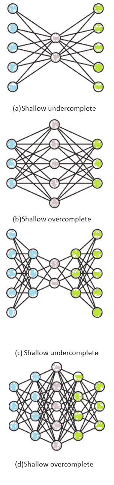

# 网络规模与表示能力

在之前的图示中，我们可以看到四种基本的自编码架构。**浅层自编码器**（浅层神经网络的扩展）通过仅有一个隐藏层的神经元来定义，而深层自编码器则可以有多个层来执行编码和解码操作。回顾之前章节的内容，较深的神经网络相比浅层神经网络可能具备更强的表示能力。这一原则同样适用于自编码器。除此之外，还注意到，深层自编码器可能会在网络学习表示输入时，显著减少所需的计算资源。它还可以大大减少网络学习输入的丰富压缩版本所需的训练样本数量。虽然读到最后几行可能会促使你们中的一些人开始训练数百层的自编码器，但你可能想要稍安勿躁。赋予编码器和解码器函数过多的能力也会带来自身的缺点。

例如，一个具有过多容量的自编码器可能学会完美地重建毕加索画作的输入图像，而从未学会与毕加索画风相关的任何代表性特征。在这种情况下，你得到的只是一个昂贵的模仿算法，它可以与微软画图的复制功能类比。另一方面，按照所建模数据的复杂性和分布设计自编码器，可能使得自编码器能够捕捉到毕加索*创作方法*中具有代表性的风格特征，进而成为艺术家和历史学者学习的素材。实际上，选择正确的网络深度和规模可能依赖于对学习过程的理论理解、实验以及与使用场景相关的领域知识的精妙结合。听起来有点耗时吗？幸运的是，可能有一种折衷方案，通过使用正则化自编码器来实现。

# 理解自编码器中的正则化

在一个极端情况下，你可能总是通过坚持浅层网络并设置非常小的潜在空间维度来限制网络的学习能力。这种方法甚至可能为基准测试复杂方法提供一个优秀的基线。然而，也有其他方法可以让我们在不被过度容量问题惩罚的情况下，受益于更深层网络的表示能力，直到某种程度。这些方法包括修改自编码器使用的`loss`函数，以激励学习网络中潜在空间的某些表示标准。

例如，我们可以要求`loss`函数考虑潜在空间的稀疏性，偏向于更丰富的表示，而不是其他表示。正如我们所看到的，我们甚至可以考虑潜在空间的导数大小或对缺失输入的鲁棒性等属性，以确保我们的模型确实捕捉到它所展示的输入中的代表性特征。

# 使用稀疏自编码器进行正则化

如前所述，确保我们的模型从输入中编码代表性特征的一种方法是对表示潜在空间（`h`）的隐藏层添加稀疏性约束。我们用希腊字母欧米伽（Ω）表示这个约束，这样我们就可以重新定义稀疏自编码器的`loss`函数，方式如下：

+   正常自编码器损失：*L ( x , g ( f ( x ) ) )*

+   稀疏自编码器损失：*L ( x , g ( f ( x ) ) ) + Ω(h)*

这个稀疏性约束项，*Ω(h)*，可以简单地看作是可以添加到前馈神经网络中的正则化项，就像我们在前几章中看到的那样。

关于自编码器中不同形式稀疏约束方法的全面综述可以在以下研究论文中找到，我们推荐感兴趣的读者参考：*通过学习深度稀疏自编码器进行面部表情识别*：[`www.sciencedirect.com/science/article/pii/S0925231217314649`](https://www.sciencedirect.com/science/article/pii/S0925231217314649)。

这为我们的议程腾出了一些空间，使我们可以简要介绍一些自编码器在实践中使用的其他正则化方法，然后再继续编写我们自己的模型。

# 使用去噪自编码器的正则化

与稀疏自编码器不同，去噪自编码器通过不同的方式确保我们的模型能够在其赋予的能力范围内捕捉有用的表示。在这种情况下，我们不是向`loss`函数添加约束，而是可以实际修改`loss`函数中的重建误差项。换句话说，我们只是告诉网络，通过使用该输入的噪声版本来重建其输入。

在这种情况下，噪声可能指的是图像中的缺失像素、句子中的缺失单词，或者碎片化的音频流。因此，我们可以将去噪自编码器的`loss`函数重新公式化如下：

+   正常 AE 损失：*L ( x , g ( f ( x ) ) )*

+   去噪 AE 损失：*L ( x , g ( f ( ~x) ) )*

在这里，术语(*~x*)仅指被某种噪声形式破坏过的输入`x`的版本。我们的去噪自编码器必须对提供的有噪声输入进行去噪，而不是仅仅尝试复制原始输入。向训练数据中添加噪声可能迫使自编码器捕捉最能代表正确重建损坏版本训练实例的特征。

一些有趣的特性和使用案例（例如语音增强）已在以下论文中探讨，对于感兴趣的读者来说值得注意：*基于深度去噪自编码器的语音增强*：[`pdfs.semanticscholar.org/3674/37d5ee2ffbfee1076cf21c3852b2ec50d734.pdf`](https://pdfs.semanticscholar.org/3674/37d5ee2ffbfee1076cf21c3852b2ec50d734.pdf)。

这将引出我们在本章中将讨论的最后一种正则化策略——收缩自编码器，然后再进入实际的内容。

# 使用收缩自编码器的正则化

虽然我们不会深入探讨这种自编码器网络亚种的数学，但**收缩自编码器**（**CAE**）因其在概念上与去噪自编码器的相似性以及如何局部扭曲输入空间而值得注意。在 CAE 的情况下，我们再次向`loss`函数添加一个约束（Ω），但方式有所不同：

+   **正常 AE 损失**：*L ( x , g ( f ( x ) ) )*

+   **CAE 损失**：*L ( x , g ( f ( x) ) ) + Ω(h,x)*

在这里，术语*Ω(h, x)*以不同的方式表示，可以按照以下方式公式化：

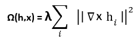

在这里，CAE 利用对`loss`函数的约束来鼓励编码器的导数尽可能小。对于那些更加数学倾向的人来说，约束项Ω(h, x)实际上被称为**Frobenius 范数的平方**（即元素的平方和），用于填充编码器函数的偏导数的雅可比矩阵。

对于那些希望扩展其知识以了解 CAEs 内部工作原理和特征提取应用的人，以下论文提供了一个优秀的概述：*Contractive Auto-Encoders: Explicit Invariance During Feature Extraction*：[`www.iro.umontreal.ca/~lisa/pointeurs/ICML2011_explicit_invariance.pdf`](http://www.iro.umontreal.ca/~lisa/pointeurs/ICML2011_explicit_invariance.pdf)。

从实际角度来看，我们在这里需要理解的是，通过将ω项定义为这样，CAEs 可以学习近似一个函数，该函数可以将输入映射到输出，即使输入略有变化。由于这种惩罚仅在训练过程中应用，网络学会从输入中捕获代表性特征，并且在测试期间能够表现良好，即使所展示的输入与其训练时略有不同。

现在我们已经讨论了基本的学习机制以及定义各种自编码器网络的一些架构变化，我们可以继续进行本章的实现部分。在这里，我们将在 Keras 中设计一个基本的自编码器，并逐步更新架构，以涵盖一些实际考虑因素和用例。

# 在 Keras 中实现浅层 AE

现在，我们将在 Keras 中实现一个浅层自编码器。我们将使用标准的时尚 MNIST 数据集作为这个模型的用例：通过像素化的 28 x 28 图像来生成不同的时尚服装。由于我们知道网络输出的质量直接取决于可用的输入数据的质量，我们必须警告我们的观众，不要期望通过这种方式生成下一个畅销服装。该数据集提供了程序概念和实现步骤的澄清，您在设计任何类型的 Keras AE 网络时必须熟悉这些步骤。

# 导入一些库

在本练习中，我们将使用 Keras 的功能性 API，通过 `keras.models` 进行访问，允许我们构建无环图和多输出模型，就像我们在第四章《卷积神经网络》中所做的那样，深入研究卷积网络的中间层。尽管你也可以使用顺序 API 来复制自动编码器（毕竟自动编码器是顺序模型），但它们通常通过功能性 API 实现，这也让我们有机会更加熟悉 Keras 的两种 API。

```py
import numpy as np
import matplotlib.pyplot as plt

from keras.layers import Input, Dense
from keras.models import Model
from keras.datasets import fashion_mnist
```

# 探索数据

接下来，我们只需加载 Keras 中包含的 `fashion_mnist` 数据集。请注意，尽管我们已经加载了每个图像的标签，但对于我们接下来要执行的任务，这并不是必需的。我们只需要输入图像，而我们的浅层自动编码器将重新生成这些图像：

```py
(x_train, y_train), (x_test, y_test) = fashion_mnist.load_data()
x_train.shape,  x_test.shape, type(x_train)
((60000, 28, 28), (10000, 28, 28), numpy.ndarray)
plt.imshow(x_train[1], cmap='binary')
```

以下是输出：

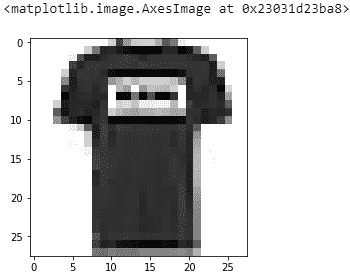

我们可以继续检查输入图像的维度和类型，然后从训练数据中绘制一个示例图像，满足我们自己的视觉需求。该示例似乎是一件印有一些难以辨认内容的休闲 T 恤。很好——现在，我们可以继续定义我们的自动编码器模型了！

# 数据预处理

正如我们之前做过无数次的那样，我们现在将像素数据归一化到 0 和 1 之间，这有助于提高我们网络对归一化数据的学习能力：

```py
# Normalize pixel values
x_train = x_train.astype('float32') / 255.
x_test = x_test.astype('float32') / 255.

# Flatten images to 2D arrays
x_train = x_train.reshape((len(x_train), np.prod(x_train.shape[1:])))
x_test = x_test.reshape((len(x_test), np.prod(x_test.shape[1:])))

# Print out the shape
print(x_train.shape)
print(x_test.shape)
-----------------------------------------------------------------------
(60000, 784)
(10000, 784)
```

我们还将把 28 x 28 像素的图像平铺成一个 784 像素的向量，就像我们在之前训练前馈网络时所做的那样。最后，我们将打印出训练集和测试集的形状，以确保它们的格式符合要求。

# 构建模型

现在我们准备好在 Keras 中设计我们的第一个自动编码器网络，我们将使用功能性 API 来实现。功能性 API 的基本原理相当简单，正如我们在之前的示例中所看到的那样。在我们的应用场景中，我们将定义潜在空间的编码维度。在这里，我们选择了 32。这意味着每个 784 像素的图像将经过一个压缩维度，该维度仅存储 32 个像素，输出将从中重建。

这意味着压缩因子为 24.5（784/32），虽然这个选择有些随意，但可以作为类似任务的经验法则：

```py
# Size of encoded representation
# 32 floats denotes a compression factor of 24.5 assuming input is 784 float
# we have 32*32 or 1024 floats
encoding_dim = 32
#Input placeholder
input_img = Input(shape=(784,))
#Encoded representation of input image
encoded = Dense(encoding_dim, activation='relu',  activity_regularizer=regularizers.l1(10e-5))(input_img)                               
# Decode is lossy reconstruction of input              
decoded = Dense(784, activation='sigmoid')(encoded)
# This autoencoder will map input to reconstructed output
autoencoder = Model(input_img, decoded)
```

然后，我们使用 `keras.layers` 中的输入占位符来定义输入层，并指定我们期望的平铺图像维度。正如我们从之前的 MNIST 实验中知道的那样（通过一些简单的数学计算），将 28 x 28 像素的图像平铺后得到一个 784 像素的数组，之后可以通过前馈神经网络进行处理。

接下来，我们定义编码后的潜在空间的维度。这是通过定义一个与输入层相连的全连接层来完成的，并且该层的神经元数与我们的编码维度（先前定义为 32）相对应，使用 ReLU 激活函数。这些层之间的连接通过在定义后续层的参数后，括号中包含定义前一层的变量来表示。

最后，我们定义解码器函数作为一个与输入层维度相同的全连接层（784 个像素），使用 sigmoid 激活函数。该层自然地与表示潜在空间的编码维度相连接，并重新生成依赖于编码层神经激活的输出。现在我们可以通过使用功能性 API 中的模型类来初始化自编码器，并将输入占位符和解码器层作为参数提供给它。

# 实现稀疏性约束

正如我们在本章前面提到的，在设计自编码器时有许多方法可以进行正则化。例如，稀疏自编码器通过对潜在空间实施稀疏性约束，强制自编码器偏向丰富的表示。回想一下，当神经网络中的神经元的输出值接近 1 时，它们可能会*激活*，而当输出接近 0 时，它们则不会激活。添加稀疏性约束可以简单地理解为限制潜在空间中的神经元大部分时间保持不活跃。因此，任何给定时刻可能只有少数神经元被激活，迫使这些被激活的神经元尽可能高效地传播信息，从潜在空间到输出空间。幸运的是，在 Keras 中实现这一过程非常简单。这可以通过定义`activity_regularizer`参数来实现，同时在定义代表潜在空间的全连接层时进行设置。在下面的代码中，我们使用`keras.regularizers`中的 L1 正则化器，稀疏参数非常接近零（在我们这里是 0.067）。现在你也知道如何在 Keras 中设计稀疏自编码器了！虽然我们将继续使用非稀疏版本，但为了这个练习的目的，你可以比较这两种浅层自编码器的性能，亲自感受在设计此类模型时向潜在空间添加稀疏性约束的好处。

# 编译和可视化模型

我们可以通过简单地编译模型并调用模型对象上的`summary()`来可视化我们刚刚做的事情，像这样。我们将选择 Adadelta 优化器，它在反向传播过程中限制了过去梯度的累计数目，仅在一个固定的窗口内进行，而不是通过选择像 Adagrad 优化器那样单调减少学习率。如果你错过了本书早些时候提到的内容，我们鼓励你去研究可用优化器的广泛库（[`ruder.io/optimizing-gradient-descent/`](http://ruder.io/optimizing-gradient-descent/)），并进行实验以找到适合你用例的优化器。最后，我们将定义二元交叉熵作为`loss`函数，它在我们的情况下考虑了输出生成的像素级损失：

```py
autoencoder.compile(optimizer='adadelta', loss='binary_crossentropy')
autoencoder.summary()
```

以下是输出：

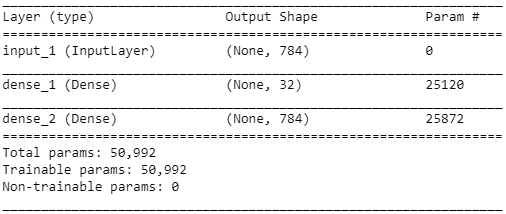

# 构建验证模型

现在我们几乎拥有了启动浅层自编码器训练会话所需的所有内容。然而，我们缺少一个至关重要的组成部分。严格来说，这部分并不是训练自编码器所必需的，但我们必须实现它，以便能够直观地验证我们的自编码器是否真的从训练数据中学习到重要特征。为了做到这一点，我们实际上将定义两个额外的网络。别担心——这两个网络本质上是我们刚刚定义的自编码器网络中编码器和解码器功能的镜像。因此，我们所做的就是创建一个独立的编码器和解码器网络，它们将匹配自编码器中编码器和解码器功能的超参数。这两个独立的网络将在自编码器训练完成后用于预测。基本上，编码器网络将用于预测输入图像的压缩表示，而解码器网络则会继续预测存储在潜在空间中的信息的解码版本。

# 定义一个独立的编码器网络

在下面的代码中，我们可以看到编码器功能是我们自编码器上半部分的精确副本；它本质上将展平的像素值输入向量映射到一个压缩的潜在空间：

```py
''' The seperate encoder network '''

# Define a model which maps input images to the latent space
encoder_network = Model(input_img, encoded)

# Visualize network
encoder_network.summary()

```

以下是总结：

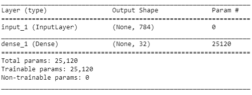

# 定义一个独立的解码器网络

同样，在下面的代码中，我们可以看到解码器网络是我们自编码器神经网络下半部分的完美副本，它将存储在潜在空间中的压缩表示映射到重建输入图像的输出层：

```py
''' The seperate decoder network ''' 

# Placeholder to recieve the encoded (32-dimensional) representation as input
encoded_input = Input(shape=(encoding_dim,))

# Decoder layer, retrieved from the aucoencoder model
decoder_layer = autoencoder.layers[-1]

# Define the decoder model, mapping the latent space to the output layer
decoder_network = Model(encoded_input, decoder_layer(encoded_input))

# Visualize network
decoder_network.summary()
```

这是总结：

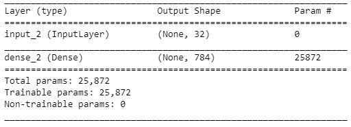

请注意，要定义解码器网络，我们必须首先构建一个形状与我们的编码维度（即 32）相匹配的输入层。然后，我们只需通过引用之前自动编码器模型最后一层的索引来复制解码器层。现在，我们已经准备好启动自动编码器网络的训练了！

# 训练自动编码器

接下来，我们像之前做过无数次的那样，简单地训练我们的自动编码器网络。我们选择将该模型训练 50 个 epoch，每次批次处理 256 张图像，然后再进行网络节点的权重更新。我们在训练过程中还会打乱数据。正如我们所知道的那样，这样做能确保批次之间减少一些方差，从而提高模型的泛化能力：

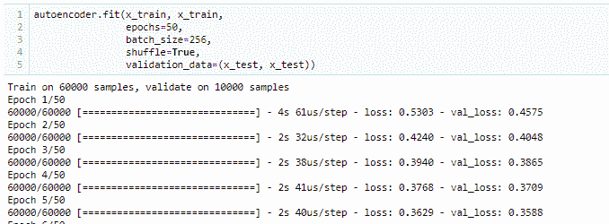

最后，我们还使用我们的测试集定义了验证数据，只是为了能够在每个 epoch 结束时比较模型在未见示例上的表现。请记住，在正常的机器学习工作流程中，常见的做法是将数据分为验证集和开发集，这样你可以在一个数据集上调整模型，并在另一个数据集上进行测试。虽然这不是我们演示用例的前提，但为了获得可泛化的结果，实施这种双重验证策略总是有益的。

# 可视化结果

现在到了收获成果的时候了。让我们看看我们的自动编码器能够通过使用我们隔离的测试集重建出什么样的图像。换句话说，我们将为网络提供与训练集相似（但不完全相同）的图像，看看模型在未见数据上的表现如何。为此，我们将使用编码器网络对测试集进行预测。编码器将预测如何将输入图像映射到压缩表示。然后，我们将简单地使用解码器网络预测如何解码由编码器网络生成的压缩表示。以下代码展示了这些步骤：

```py
# Time to encode some images
encoded_imgs = encoder_network.predict(x_test)
# Then decode them 
decoded_imgs = decoder_network.predict(encoded_imgs)
```

接下来，我们重构一些图像，并将它们与触发重构的输入进行比较，看看我们的自动编码器是否捕捉到了衣物应有的外观。为此，我们将简单地使用 Matplotlib 绘制九个图像，并将它们的重构图像展示在下方，如下所示：

```py
# use Matplotlib (don't ask)
import matplotlib.pyplot as plt
plt.figure(figsize=(22, 6))
num_imgs = 9
for i in range(n):                        
    # display original
    ax = plt.subplot(2, num_imgs, i + 1)
    true_img = x_test[i].reshape(28, 28)
    plt.imshow(true_img)

    # display reconstruction
    ax = plt.subplot(2, num_imgs, i + 1 + num_imgs)
    reconstructed_img = decoded_imgs[i].reshape(28,28)
    plt.imshow(reconstructed_img)
plt.show()

```

以下是生成的输出：

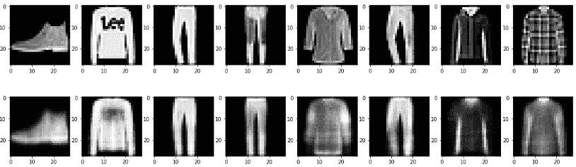

如你所见，虽然我们的浅层自动编码器无法重建品牌标签（例如第二张图片中的**Lee**标签），但它确实能捕捉到人类服装的基本概念，尽管它的学习能力相当有限。但这就足够了吗？对于任何实际应用场景来说，答案是“不够”，比如计算机辅助服装设计。缺少的细节太多，部分是由于我们网络的学习能力有限，部分是因为压缩输出存在损失。自然而然地，这让人想知道，深度模型能做到什么呢？正如那句老话所说，*nullius in verba*（用更现代的语言来说，就是让我们自己看看！）。

# 设计一个深度自动编码器

接下来，我们将研究自动编码器的重建效果可以有多好，看看它们是否能生成比我们刚刚看到的模糊表示更好的图片。为此，我们将设计一个深度前馈自动编码器。如你所知，这意味着我们将在自动编码器的输入层和输出层之间添加额外的隐藏层。为了保持趣味性，我们还将使用一个不同的数据集。你可以根据自己的兴趣，在 `fashion_mnist` 数据集上重新实现这个方法，进一步探索自动编码器能达成的时尚感。

对于下一个练习，我们将使用位于 Kaggle 的 10 种猴子物种数据集。我们将尝试重建我们这些顽皮、捣蛋的“远房亲戚”——来自丛林的猴子们的图片，并看看我们的自动编码器在一个更复杂的重建任务中表现如何。这也给了我们一个机会，远离 Keras 中现成预处理数据集的舒适区，因为我们将学会处理不同大小和更高分辨率的图片，而不是单调的 MNIST 示例：[`www.kaggle.com/slothkong/10-monkey-species`](https://www.kaggle.com/slothkong/10-monkey-species)。

# 导入必要的库

我们将首先导入必要的库，这已经是传统了。你会注意到一些常见的库，比如 NumPy、pandas、Matplotlib，以及一些 Keras 的模型和层对象：

```py
import cv2
import datetime as dt
import matplotlib.pylab as plt
import numpy as np
import pandas as pd
from keras import models, layers, optimizers
from keras.layers import Input, Dense
from keras.models import Model
from pathlib import Path
from vis.utils import utils
```

请注意，我们从 Keras 的 `vis` 库中导入了一个实用模块。虽然该模块包含许多其他方便的图片处理功能，但我们将使用它来将我们的训练图片调整为统一的尺寸，因为该数据集中的图片并不都是统一的。

# 理解数据

我们选择这个数据集用于我们的应用案例有一个特定的原因。与 28 x 28 像素的衣物图片不同，这些图片呈现了丰富和复杂的特征，比如体型的变化，以及当然，还有颜色！我们可以绘制出数据集的组成，看看类别分布的情况，这完全是为了满足我们的好奇心：

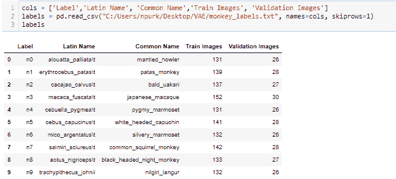

你会注意到，这 10 种不同的猴子物种各自有显著不同的特征，包括不同的体型、毛发颜色和面部构成，这使得对于自编码器来说这是一个更加具有挑战性的任务。以下是来自八种不同猴子物种的示例图像，以便更好地展示这些物种之间的差异。如你所见，它们每一种看起来都独一无二：

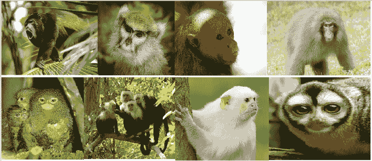

由于我们知道自编码器是数据特定的，因此训练自编码器重构一个具有高方差的图像类别可能会导致可疑的结果，这也是合乎逻辑的。然而，我们希望这能为你提供一个有用的案例，以便你更好地理解使用这些模型时会遇到的潜力和限制。那么，让我们开始吧！

# 导入数据

我们将从 Kaggle 仓库开始导入不同猴子物种的图像。像之前一样，我们将数据下载到文件系统中，然后使用 Python 内置的操作系统接口（即`os`模块）访问训练数据文件夹：

```py
import os
all_monkeys = []
for image in os.listdir(train_dir):
    try:
        monkey = utils.load_img(('C:/Users/npurk/Desktop/VAE/training/' + image), target_size=(64,64))
        all_monkeys.append(monkey)
    except Exception as e:
        pass
    print('Recovered data format:', type(all_monkeys))    
print('Number of monkey images:', len(all_monkeys))
-----------------------------------------------------------------------
Recovered data format: <class 'list'> 
Number of monkey images: 1094

```

你会注意到我们将图像变量嵌套在一个`try`/`except`循环中。这只是一个实现上的考虑，因为我们发现数据集中的一些图像已经损坏。因此，如果我们无法通过`utils`模块中的`load_img()`函数加载图像，我们将完全忽略该图像文件。这种（有些任意的）选择策略使得我们从训练文件夹中恢复了 1,094 张图像，总共有 1,097 张。

# 数据预处理

接下来，我们将把像素值列表转换成 NumPy 数组。我们可以打印出数组的形状来确认我们确实有 1,094 张 64 x 64 像素的彩色图像。确认之后，我们只需通过将每个像素值除以可能的最大像素值（即 255）来将像素值归一化到 0 – 1 之间：

```py
# Make into array
all_monkeys = np.asarray(all_monkeys)
print('Shape of array:', all_monkeys.shape)

# Normalize pixel values
all_monkeys = all_monkeys.astype('float32') / 255.

# Flatten array
all_monkeys = all_monkeys.reshape((len(all_monkeys), np.prod(all_monkeys.shape[1:])))
print('Shape after flattened:', all_monkeys.shape)

Shape of array: (1094, 64, 64, 3)
Shape after flattened: (1094, 12288)
```

最后，我们将四维数组展平成二维数组，因为我们的深度自编码器由前馈神经网络组成，神经网络通过其层传播二维向量。这类似于我们在第三章中所做的，*信号处理 – 使用神经网络进行数据分析*，我们实际上是将每张三维图像（64 x 64 x 3）转换成一个二维向量，维度为（1，12,288）。

# 数据分区

现在我们的数据已经经过预处理，并作为一个标准化像素值的 2D 张量存在，我们最终可以将其划分为训练集和测试集。这样做非常重要，因为我们希望最终在网络从未见过的图像上使用我们的模型，并能够利用它对猴子应该是什么样子的理解重建这些图像。请注意，虽然我们在这个用例中并不使用数据集中提供的标签，但网络本身会接收到每个图像的标签。在这种情况下，标签将仅仅是图像本身，因为我们处理的是图像重建任务，而非分类。因此，在自编码器的情况下，输入变量与目标变量是相同的。正如以下截图所示，我们使用 sklearn 的模型选择模块中的 `train_test_split` 函数来生成训练和测试数据（80/20 的划分比例）。你会注意到，由于我们任务的性质，`x` 和 `y` 变量都由相同的数据结构定义：

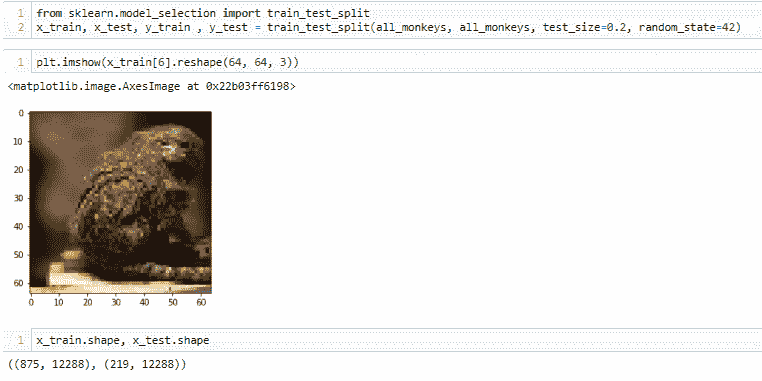

现在我们剩下 **875** 个训练样本和 219 个测试样本，用于训练和测试我们的深度自编码器。请注意，Kaggle 数据集自带一个明确的测试集目录，因为该数据集的最初目的是尝试使用机器学习模型对不同猴子物种进行分类。然而，在我们的用例中，我们暂时并没有严格保证类的平衡，只是对深度自编码器在高方差数据集上进行训练时重建图像的表现感兴趣。我们确实鼓励进一步的实验，比较在特定猴子物种上训练的深度自编码器的表现。逻辑上，这些模型会在重建输入图像时表现更好，因为它们在训练观察中的相似性较高。

# 使用功能性 API 设计自编码器

就像我们在前一个示例中做的那样，我们将使用功能性 API 来构建我们的深度自编码器。我们将导入输入层和全连接层，以及我们稍后将用于初始化网络的模型对象。我们还将定义图像的输入维度（64 x 64 x 3 = 12,288），以及编码维度为 256，这样我们的压缩比为 48。简单来说，这意味着每张图像会被压缩 48 倍，然后网络将尝试从潜在空间中重建它：

```py
from keras.layers import Input, Dense
from keras.models import Model

##Input dimension
input_dim=12288

##Encoding dimension for the latent space
encoding_dim=256
```

压缩因子是一个非常重要的参数，值得考虑，因为将输入映射到非常低的维度空间会导致过多的信息丢失，从而导致重建效果较差。可能根本没有足够的空间存储图像的关键要素。另一方面，我们已经知道，向模型提供过多的学习能力可能会导致过拟合，这也是手动选择压缩因子可能相当棘手的原因。当有疑问时，尝试不同的压缩因子和正则化方法（只要你有时间）总是值得一试。

# 构建模型

为了构建我们的深度自编码器，我们将从定义输入层开始，该层接受与猴子图像的二维向量相对应的维度。接着，我们简单地开始定义网络的编码器部分，使用密集层，每一层的神经元数量逐层减少，直到达到潜在空间。请注意，我们简单地选择了每一层神经元数量相对于所选编码维度减少的比例为 2。因此，第一层有(256 x 4) 1024 个神经元，第二层有(256 x 2) 512 个神经元，第三层，即潜在空间层，有 256 个神经元。虽然你不必严格遵守这一约定，但通常在接近潜在空间时减少每一层的神经元数量，而在潜在空间之后的层中增加神经元数量，这是在使用欠完备自编码器时的常见做法：

```py
# Input layer placeholder
input_layer = Input(shape=(input_dim,))

# Encoding layers funnel the images into lower dimensional representations
encoded = Dense(encoding_dim * 4, activation='relu')(input_layer)
encoded = Dense(encoding_dim * 2, activation='relu')(encoded)

# Latent space
encoded = Dense(encoding_dim, activation='relu')(encoded)

# "decoded" is the lossy reconstruction of the input
decoded = Dense(encoding_dim * 2, activation='relu')(encoded)
decoded = Dense(encoding_dim * 4, activation='relu')(decoded)
decoded = Dense(input_dim, activation='sigmoid')(decoded)

# this model maps an input to its reconstruction
autoencoder = Model(input_layer, decoded)

autoencoder.summary()
_______________________________________________________________
Layer (type)                 Output Shape              Param #   =================================================================
input_1 (InputLayer)         (None, 12288)             0         _______________________________________________________________
dense_1 (Dense)              (None, 1024)              12583936  _______________________________________________________________
dense_2 (Dense)              (None, 512)               524800    _______________________________________________________________
dense_3 (Dense)              (None, 256)               131328    _______________________________________________________________
dense_4 (Dense)              (None, 512)               131584    _______________________________________________________________
dense_5 (Dense)              (None, 1024)              525312    _______________________________________________________________
dense_6 (Dense)              (None, 12288)             12595200  =================================================================
Total params: 26,492,160
Trainable params: 26,492,160
Non-trainable params: 0
_________________________________________________________________
```

最后，我们通过将输入层和解码器层作为参数传递给模型对象来初始化自编码器。然后，我们可以直观地总结我们刚刚构建的模型。

# 训练模型

最后，我们可以开始训练会话了！这次，我们将使用`adam`优化器来编译模型，并用均方误差来操作`loss`函数。然后，我们只需通过调用`.fit()`方法并提供适当的参数来开始训练：

```py
autoencoder.compile(optimizer='adam', loss='mse')

autoencoder.fit(x_train, x_train, epochs=100, batch_size=20, verbose=1)

Epoch 1/100
875/875 [==============================] - 15s 17ms/step - loss: 0.0061
Epoch 2/100
875/875 [==============================] - 13s 15ms/step - loss: 0.0030
Epoch 3/100
875/875 [==============================] - 13s 15ms/step - loss: 0.0025
Epoch 4/100
875/875 [==============================] - 14s 16ms/step - loss: 0.0024
Epoch 5/100
875/875 [==============================] - 13s 15ms/step - loss: 0.0024
```

该模型在第 100 个周期结束时的损失为(0.0046)。请注意，由于之前为浅层模型选择了不同的`loss`函数，因此每个模型的损失指标不能直接进行比较。实际上，`loss`函数的定义方式决定了模型试图最小化的目标。如果你希望基准测试并比较两种不同神经网络架构的性能（例如前馈网络和卷积神经网络），建议首先使用相同的优化器和`loss`函数，然后再尝试其他的选择。

# 可视化结果

现在，让我们通过在孤立的测试集上测试深度自编码器的表现，来看看它能够进行的重建。为此，我们将简单地使用单独的编码器网络来预测如何将这些图像压缩到潜在空间，然后解码器网络将从编码器预测的潜在空间中接手，进行解码并重建原始图像：

```py
decoded_imgs = autoencoder.predict(x_test)
# use Matplotlib (don't ask)
import matplotlib.pyplot as plt

n = 6  # how many digits we will display
plt.figure(figsize=(22, 6))
for i in range(n):
    # display original
    ax = plt.subplot(2, n, i + 1)
    plt.imshow(x_test[i].reshape(64, 64, 3))    #x_test
    plt.gray()
    ax.get_xaxis().set_visible(False)
    ax.get_yaxis().set_visible(False)

    # display reconstruction
    ax = plt.subplot(2, n, i + 1 + n)
    plt.imshow(decoded_imgs[i].reshape(64, 64, 3))
    plt.gray()
    ax.get_xaxis().set_visible(False)
    ax.get_yaxis().set_visible(False)
plt.show()
```

我们将得到以下输出：

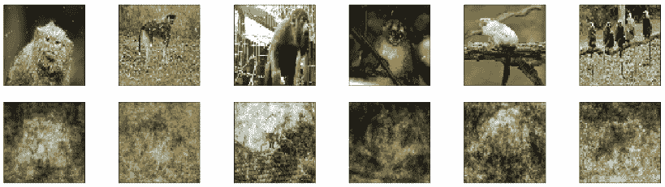

尽管这些图像本身可以说在美学上令人愉悦，但似乎代表猴子的本质特征大部分依然没有被我们的模型捕捉到。大多数重建图像看起来像星空，而不是猴子的特征。我们确实注意到，网络已经开始在一个非常基础的层面上学习到一般的人形形态，但这并不足为奇。那么，如何改进呢？归根结底，我们希望至少能够用一些看起来逼真的猴子重建图像来结束这一章。为此，我们将使用一种特定类型的网络，它擅长处理图像数据。我们所说的就是**卷积神经网络**（**CNN**）架构，我们将重新设计它，以便在本练习的下一部分中构建一个深度卷积自编码器。

# 深度卷积自编码器

幸运的是，我们所要做的就是定义一个卷积网络，并将我们的训练数组调整为适当的维度，以测试它在当前任务中的表现。因此，我们将导入一些卷积、MaxPooling 和 UpSampling 层，开始构建网络。我们定义输入层，并为其提供 64 x 64 彩色图像的形状。然后，我们简单地交替使用卷积层和池化层，直到达到潜在空间，该空间由第二个 `MaxPooling2D` 层表示。另一方面，从潜在空间出去的层必须交替使用卷积层和 UpSampling 层。UpSampling 层顾名思义，通过重复前一层的数据的行和列，简单地增加表示维度：

```py
from keras.layers import Conv2D, MaxPooling2D, UpSampling2D

# Input Placeholder
input_img = Input(shape=(64, 64, 3))  # adapt this if using `channels_first` image data format

# Encoder part
l1 = Conv2D(32, (3, 3), activation='relu', padding='same')(input_img)
l2 = MaxPooling2D((2, 2), padding='same')(l1)
l3 = Conv2D(16, (3, 3), activation='relu', padding='same')(l2)

# Latent Space, with dimension (None, 32, 32, 16)
encoded = MaxPooling2D((1,1), padding='same')(l3) 

# Decoder Part
l8 = Conv2D(16, (3, 3), activation='relu', padding='same')(encoded)
l9 = UpSampling2D((2, 2))(l8)
decoded = Conv2D(3, (3, 3), activation='sigmoid', padding='same')(l9)

autoencoder = Model(input_img, decoded)

autoencoder.summary()
_______________________________________________________________
Layer (type)                 Output Shape              Param #   =================================================================
input_2 (InputLayer)         (None, 64, 64, 3)         0         _______________________________________________________________
conv2d_5 (Conv2D)            (None, 64, 64, 32)        896       _______________________________________________________________
max_pooling2d_3 (MaxPooling2 (None, 32, 32, 32)        0         _______________________________________________________________
conv2d_6 (Conv2D)            (None, 32, 32, 16)        4624      _______________________________________________________________
max_pooling2d_4 (MaxPooling2 (None, 32, 32, 16)        0         _______________________________________________________________
conv2d_7 (Conv2D)            (None, 32, 32, 16)        2320      _______________________________________________________________
up_sampling2d_2 (UpSampling2 (None, 64, 64, 16)        0         _______________________________________________________________
conv2d_8 (Conv2D)            (None, 64, 64, 3)         435       =================================================================
Total params: 8,275
Trainable params: 8,275
Non-trainable params: _________________________________________________________________
```

正如我们所见，这个卷积自编码器有八层。信息首先进入输入层，然后卷积层生成 32 个特征图。这些特征图通过最大池化层进行下采样，生成 32 个特征图，每个特征图的大小为 32 x 32 像素。接着，这些特征图传递到潜在层，该层存储输入图像的 16 种不同表示，每种表示的尺寸为 32 x 32 像素。这些表示随后传递到后续层，输入在卷积和上采样操作下不断处理，直到到达解码层。就像输入层一样，我们的解码层与 64 x 64 彩色图像的尺寸匹配。你可以通过使用 Keras 后台模块中的`int_shape()`函数来检查特定卷积层的尺寸（而不是可视化整个模型），如下所示：

```py
# Check shape of a layer
import keras
keras.backend.int_shape(encoded)

(None, 32, 32, 16)

```

# 编译和训练模型

接下来，我们简单地使用相同的优化器和`loss`函数来编译我们的网络，这些都是我们为深度前馈网络选择的，并通过调用模型对象的`.fit()`方法启动训练会话。需要注意的是，我们只训练这个模型 50 个周期，并且在每次批量更新时处理 128 张图像。证明这种方法在计算上更高效，使得我们能在比训练前馈模型所需的时间短得多的时间内完成训练。让我们看看在这个特定用例中，训练时间和准确性之间的折衷是否对我们有利：

```py
autoencoder.compile(optimizer='adam', loss='mse')
autoencoder.fit(x_train, x_train, epochs=50, batch_size=20,
                shuffle=True, verbose=1)
Epoch 1/50
875/875 [==============================] - 7s 8ms/step - loss: 0.0462
Epoch 2/50
875/875 [==============================] - 6s 7ms/step - loss: 0.0173
Epoch 3/50
875/875 [==============================] - 7s 9ms/step - loss: 0.0133
Epoch 4/50
875/875 [==============================] - 8s 9ms/step - loss: 0.0116
```

到第 50^(次)训练周期结束时，模型的损失达到了（0.0044）。这比早期的前馈模型要低，后者在训练时使用了更大的批量大小，并且训练了较少的训练周期。接下来，让我们通过视觉判断模型在重建从未见过的图像时的表现。

# 测试和可视化结果

现在是时候看看卷积神经网络（CNN）是否真的能够胜任我们当前的图像重建任务了。我们简单地定义了一个辅助函数，允许我们绘制出从测试集中生成的若干样本，并将它们与原始测试输入进行比较。然后，在接下来的代码单元中，我们定义了一个变量，用来存储我们模型对测试集进行推理后的结果，方法是使用模型对象的`.predict()`方法。这将生成一个 NumPy ndarray，包含所有解码后的测试集输入图像。最后，我们调用`compare_outputs()`函数，使用测试集和对应的解码预测作为参数来可视化结果：

```py
def compare_outputs(x_test, decoded_imgs=None, n=10):
    plt.figure(figsize=(22, 5))
    for i in range(n):
        ax = plt.subplot(2, n, i+1)
        plt.imshow(x_test[i].reshape(64,64,3))

        ax.get_xaxis().set_visible(False)
        ax.get_yaxis().set_visible(False)

        if decoded_imgs is not None:
            ax = plt.subplot(2, n, i+ 1 +n)
            plt.imshow(decoded_imgs[i].reshape(64,64,3))

            ax.get_xaxis().set_visible(False)
            ax.get_yaxis().set_visible(False)
    plt.show()

decoded_imgs = autoencoder.predict(x_test)
print('Upper row: Input image provided \nBottom row: Decoded output 
       generated')
compare_outputs(x_test, decoded_imgs)
Upper row: Input image provided 
Bottom row: Decoded output generated
```

以下是输出结果：

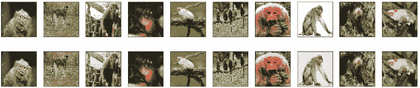

如我们所见，深度卷积自编码器在重建测试集中的图像方面表现非常出色。它不仅学会了身体形态和正确的色彩方案，甚至能够重建一些细节，比如相机闪光灯下的红眼现象（如猴子 4 及其人工复制品所示）。太棒了！所以，我们成功地重建了一些猿类图像。随着兴奋感的渐渐消退（如果一开始就有的话），我们将希望将自编码器应用于更多有用的现实任务——比如图像去噪任务，在这类任务中，我们委托网络从损坏的输入中完全重建图像。

# 去噪自编码器

再次，我们将继续使用猴子物种数据集，并修改训练图像以引入噪声因子。这个噪声因子本质上是通过改变原始图像的像素值，去除构成原始图像的一些信息，从而使任务变得比简单重建原始输入更具挑战性。需要注意的是，这意味着我们的输入变量将是噪声图像，而在训练期间，网络看到的目标变量将是未损坏的噪声输入图像版本。为了生成训练和测试图像的噪声版本，我们只需对图像像素应用一个高斯噪声矩阵，然后将其值截断在 0 到 1 之间：

```py
noise_factor = 0.35

# Define noisy versions
x_train_noisy = x_train + noise_factor * np.random.normal(loc=0.0, scale=1.0, size=x_train.shape) 
x_test_noisy = x_test + noise_factor * np.random.normal(loc=0.0, scale=1.0, size=x_test.shape) 

# CLip values between 0 and 1
x_train_noisy = np.clip(x_train_noisy, 0., 1.)
x_test_noisy = np.clip(x_test_noisy, 0., 1.)
```

我们可以通过绘制来自数据中的一个随机示例，看到我们任意选择的噪声因子`0.35`如何实际影响图像，如下面的代码所示。在这个分辨率下，噪声图像几乎无法被人眼理解，看起来仅仅是一些随机像素聚集在一起：

```py
# Effect of adding noise factor
f = plt.figure()
f.add_subplot(1,2, 1)
plt.imshow(x_test[1])

f.add_subplot(1,2, 2)
plt.imshow(x_test_noisy[1])

plt.show(block=True)
```

这是您将得到的输出：

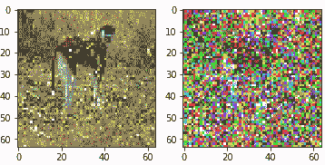

# 训练去噪网络

我们将使用相同的卷积自编码器架构来处理这个任务。然而，我们将重新初始化模型并从头开始训练，这次使用的是带有噪声输入变量的数据：

```py
autoencoder.compile(optimizer='adam', loss='mse')
autoencoder.fit(x_train_noisy, x_train, epochs=50, batch_size=20,
                shuffle=True, verbose=1)

Epoch 1/50875/875 [==============================] - 7s 8ms/step - loss: 0.0449
Epoch 2/50
875/875 [==============================] - 6s 7ms/step - loss: 0.0212
Epoch 3/50
875/875 [==============================] - 6s 7ms/step - loss: 0.0185
Epoch 4/50
875/875 [==============================] - 6s 7ms/step - loss: 0.0169
```

如我们所见，在去噪自编码器的情况下，损失收敛速度比之前的实验更为缓慢。这是自然而然的，因为现在输入信息已经丢失了很多，导致网络更难学习到一个适当的潜在空间来生成未损坏的输出。因此，网络在压缩和重建操作中被迫变得稍微有点*创造性*。该网络的训练在 50 个周期后结束，损失为 0.0126。现在我们可以对测试集进行一些预测，并可视化一些重建结果。

# 可视化结果

最后，我们可以测试模型在面对更具挑战性的任务（如图像去噪）时的表现。我们将使用相同的辅助函数，将我们的网络输出与测试集中的一个样本进行比较，如下所示：

```py
def compare_outputs(x_test, decoded_imgs=None, n=10):
    plt.figure(figsize=(22, 5))

    for i in range(n):
        ax = plt.subplot(2, n, i+1)
        plt.imshow(x_test_noisy[i].reshape(64,64,3))
        plt.gray()

        ax.get_xaxis().set_visible(False)
        ax.get_yaxis().set_visible(False)

        if decoded_imgs is not None:
            ax = plt.subplot(2, n, i+ 1 +n)
            plt.imshow(decoded_imgs[i].reshape(64,64,3))

            ax.get_xaxis().set_visible(False)
            ax.get_yaxis().set_visible(False)

    plt.show()
decoded_imgs = autoencoder.predict(x_test_noisy)
print('Upper row: Input image provided \nBottom row: Decoded output generated')
compare_outputs(x_test, decoded_imgs)
Upper row: Input image provided 
Bottom row: Decoded output generated
```

以下是输出结果：

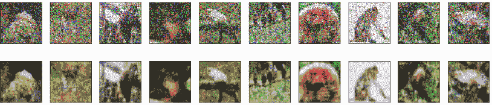

如我们所见，尽管添加了噪声因素，网络在重建图像方面表现相当不错！这些图像对人眼来说很难区分，因此，网络能够重建其中元素的整体结构和组成确实值得注意，尤其是考虑到分配给网络的有限学习能力和训练时间。

我们鼓励你通过更改层数、过滤器数量和潜在空间的编码维度来尝试更复杂的架构。事实上，现在可能是进行一些练习的最佳时机，相关练习会在本章末尾提供。

# 总结

本章中，我们从高层次探讨了自编码器的基本理论，并概念化了允许这些模型进行学习的基础数学。我们看到了几种不同的自编码器架构，包括浅层、深层、不完全和过度完整的模型。这让我们能够概述与每种模型的表示能力相关的考虑因素，以及它们在容量过大时容易过拟合的倾向。我们还探讨了一些正则化技术，帮助我们弥补过拟合问题，例如稀疏自编码器和收缩自编码器。最后，我们训练了几种不同类型的自编码器网络，包括浅层、深层和卷积网络，进行图像重建和去噪的任务。我们看到，尽管学习能力和训练时间非常有限，卷积自编码器在图像重建方面超越了所有其他模型。此外，它能够从受损的输入中生成去噪图像，保持输入数据的整体格式。

虽然我们没有探索其他使用案例，例如使用降维来可视化主要的方差因子，但自编码器在不同领域中得到了广泛应用，从推荐系统中的协同过滤，到甚至预测未来的病人，见*Deep Patient*：[`www.nature.com/articles/srep26094`](https://www.nature.com/articles/srep26094)。有一种特定类型的自编码器是我们故意没有在本章中讨论的：**变分** **自编码器**（**VAE**）。这种自编码器在模型学习的潜在空间上施加了特殊的约束。它实际上迫使模型学习一个表示输入数据的概率分布，并从中采样生成输出。这与我们至今探索的方法大不相同，后者最多只能让我们的网络学习一个某种程度上任意的函数。我们选择不在本章中包括这一有趣的子话题的原因是，VAE 在技术术语中属于生成模型的一个实例，而生成模型正是我们下一章的主题！

# 练习

+   使用时尚 MNIST 数据集创建深度自动编码器（AE），并监控损失何时趋于平稳。然后，与浅层自动编码器进行比较。

+   在另一个您选择的数据集上实现自动编码器（AE），并尝试不同的编码维度、优化器和`loss`函数，看看模型表现如何。

+   比较不同模型（CNN、FF）损失何时收敛以及损失值下降的稳定性或不稳定性。您注意到了什么？
