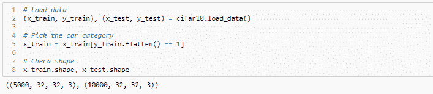

# 第九章：生成对抗网络

在上一章中，我们沉浸在自编码神经网络的世界里。我们看到了这些模型如何用于估计能够根据目标输出重建给定输入的参数化函数。虽然乍一看这似乎很简单，但我们现在知道，这种自监督编码方式具有多种理论和实际意义。

实际上，从**机器学习**（**ML**）的角度来看，能够将高维空间中的一组连接点近似到低维空间（即流形学习）具有多个优点，从更高的数据存储效率到更高效的内存消耗。实际上，这使我们能够为不同类型的数据发现理想的编码方案，或在此基础上执行降维，以应用于**主成分分析**（**PCA**）或信息检索等用例。例如，使用相似查询搜索特定信息的任务可以通过从低维空间中学习有用的表示来大大增强。此外，学习到的表示还可以作为特征检测器，用于分类新的、传入的数据。这种应用可能使我们能够构建强大的数据库，在面对查询时能够进行高级推理和推断。衍生的实现包括律师用来根据当前案件的相似性高效检索先例的法律数据库，或允许医生根据每个患者的噪声数据高效诊断患者的医疗系统。这些潜变量模型使研究人员和企业能够解决各种用例，从序列到序列的机器翻译，到将复杂意图归因于客户评论。实质上，使用生成模型，我们试图回答这个问题：*在给定数据实例属于某个类别（`y`）的情况下，这些特征（`x`）出现的可能性有多大？* 这与我们在监督学习任务中会问的这个问题是完全不同的：*在给定特征（`x`）的情况下，这个实例属于类别（`y`）的可能性有多大？* 为了更好地理解这种角色的反转，我们将进一步探讨前一章中介绍的潜变量建模的理念。

在本章中，我们将看到如何进一步发展潜变量的概念。我们不再只是简单地学习一个参数化的函数，它将输入映射到输出，而是可以使用神经网络来学习一个表示潜在空间中概率分布的函数。然后，我们可以从这个概率分布中采样，生成新的、合成的输入数据实例。这就是生成模型背后的核心理论基础，正如我们即将发现的那样。

在本章中，我们将涵盖以下主题：

+   复制与生成内容

+   理解潜在空间的概念

+   深入了解生成网络

+   使用随机性来增强输出

+   从潜在空间进行采样

+   理解生成对抗网络的类型

+   理解变分自编码器（VAE）

+   在 Keras 中设计变分自编码器（VAE）

+   在 VAE 中构建编码模块

+   构建解码器模块

+   可视化潜在空间

+   潜在空间采样与输出生成

+   探索生成对抗网络（GANs）

+   深入了解生成对抗网络（GANs）

+   在 Keras 中设计生成对抗网络（GAN）

+   设计生成器模块

+   设计判别器模块

+   整合生成对抗网络（GAN）

+   训练函数

+   定义判别器标签

+   按批次训练生成器

+   执行训练会话

# 复制与生成内容

尽管我们在上一章中的自动编码应用仅限于图像重建和去噪，这些应用与我们将在本章讨论的案例有很大区别。到目前为止，我们让自动编码器通过学习任意映射函数来重建某些给定的输入。在本章中，我们希望理解如何训练一个模型来创造某些内容的新实例，而不仅仅是复制它的输入。换句话说，如果我们要求神经网络像人类一样真正具备创造力并生成内容，这是否可行？在**人工智能**（**AI**）领域，标准答案是肯定的，但过程相当复杂。在寻找更详细的答案时，我们来到了本章的主题：生成网络。

尽管存在众多生成网络，从**深度玻尔兹曼机**到**深度信念网络**的变种，但大多数已经失去了流行，原因在于它们的适用性有限且出现了更具计算效率的方法。然而，少数几种依然处于焦点之中，因为它们具备生成合成内容的神奇能力，比如从未存在过的面孔、从未写过的电影评论和新闻文章，或是从未拍摄过的视频！为了更好地理解这些魔术背后的机制，我们将花几行文字来介绍潜在空间的概念，从而更好地理解这些模型如何转化其学习到的表示，创造出看似全新的东西。

# 理解潜在空间的概念

回顾上一章，**潜在空间**不过是输入数据在低维空间中的压缩表示。它本质上包含了对于识别原始输入至关重要的特征。为了更好地理解这个概念，尝试在脑海中可视化潜在空间可能编码的那些信息是很有帮助的。一个有用的类比是考虑我们如何用想象力创造内容。假设你被要求创造一个虚构的动物，你会依赖哪些信息来创造这个生物？你将从之前见过的动物身上采样特征，比如它们的颜色，或者它们是双足的，四足的，是哺乳动物还是爬行动物，生活在陆地还是海洋等。事实证明，我们自己也在世界中航行时，逐渐发展出潜在的世界模型。当我们尝试想象某个类别的新实例时，实际上是在采样一些潜在变量模型，这些模型是在我们存在的过程中学习得到的。

想一想。在我们的一生中，我们遇到了无数种不同颜色、大小和形态的动物。我们不断地将这些丰富的表示减少到更可管理的维度。例如，我们都知道狮子长什么样，因为我们已经在脑海中编码了代表狮子的属性（或潜在变量），比如它们的四条腿、尾巴、毛茸茸的皮毛、颜色等。这些学习到的属性证明了我们如何在低维空间中存储信息，从而创造出周围世界的功能性模型。我们假设，这些信息是存储在低维空间中的，因为大多数人，例如，无法在纸上完美重现狮子的形象。有些人甚至无法接近，这对于本书的作者来说就是如此。然而，我们所有人只要提到*狮子*这个词，都会立即并集体地同意狮子的总体形态。

# 识别概念向量

这个小小的思维实验展示了潜在变量模型在创造世界的功能性表示方面的巨大力量。如果我们的脑袋没有不断将从感官输入接收到的信息进行下采样，以创造可管理且现实的世界模型，它很可能会消耗远超过那可怜的 12 瓦特的能量。因此，使用潜在变量模型本质上允许我们查询输入的简化表示（或属性），这些表示可能会与其他表示重新组合，从而生成看似新颖的输出（例如：独角兽 = 来自马的身体和脸 + 来自犀牛/独角鲸的角）。

同样，神经网络也可以从学习到的潜在空间中转换样本，以生成新的内容。实现这一目标的一种方法是识别嵌入在学习到的潜在空间中的概念向量。这里的想法非常简单。假设我们要从代表面孔的潜在空间中采样一个面孔（`f`）。然后，另一个点（*f + c*）可以被认为是相同面孔的嵌入式表示，并且包含某些修改（即在原始面孔上添加微笑、眼镜或面部毛发）。这些概念向量本质上编码了输入数据的各个差异维度，随后可以用于改变输入图像的某些有趣特性。换句话说，我们可以在潜在空间中寻找与输入数据中存在的概念相关的向量。在识别出这些向量后，我们可以修改它们，以改变输入数据的特征。例如，微笑向量可以被学习并用来修改某人在图像中的微笑程度。同样，性别向量可以用来修改某人的外观，使其看起来更女性化或男性化，反之亦然。现在，我们对潜在空间中可能查询到的信息以及如何修改这些信息以生成新内容有了更好的理解，我们可以继续我们的探索之旅。

# 深入探讨生成网络

所以，让我们尝试理解生成网络的核心机制，以及这种方法与我们已知的其他方法有何不同。到目前为止，我们实现的大多数网络都是为了执行某些输入的确定性变换，从而得到某种输出。直到我们探讨强化学习的话题（第七章，*使用深度 Q 网络进行强化学习*），我们才了解了将一定程度的**随机性**（即随机因素）引入建模过程的好处。这是一个核心概念，我们将在进一步熟悉生成网络如何运作的过程中进行探讨。正如我们之前提到的，生成网络的核心思想是使用深度神经网络来学习在简化的潜在空间中，变量的概率分布。然后，可以以准随机的方式对潜在空间进行采样和转换，从而生成一些输出（`y`）。

正如你所注意到的，这与我们在上一章中采用的方法有很大的不同。对于自编码器，我们只是估计了一个任意函数，通过编码器将输入（`x`）映射到压缩的潜在空间，再通过解码器重构输出（`y`）。而在生成对抗网络中，我们则学习输入数据（`x`）的潜在变量模型。然后，我们可以将潜在空间中的样本转化为生成的输出。不错吧？然而，在我们进一步探讨如何将这个概念操作化之前，让我们简要回顾一下随机性在生成创造性内容方面的作用。

# 受控随机性与创造力

回想一下，我们通过使用**epsilon 贪心选择**策略在深度强化学习算法中引入了随机性，这基本上使我们的网络不再过度依赖相同的动作，而是能够探索新动作来解决给定的环境。引入这种随机性，从某种意义上说，为这个过程带来了创造性，因为我们的网络能够系统地创建新的状态-动作对，而不依赖于之前学到的知识。然而需要注意的是，将引入随机性的后果称为创造力，可能是我们某种程度上的拟人化。实际上，赋予人类（我们的基准）创造力的真实过程仍然极为难以捉摸，并且科学界对其理解甚少。另一方面，随机性与创造力之间的联系早已得到认可，特别是在人工智能领域。早在 1956 年，人工智能研究者就对超越机器看似决定性的局限性产生了兴趣。当时，基于规则的系统的突出地位使得人们认为，诸如创造力这样的概念只能在高级生物有机体中观察到。尽管有这种广泛的信念，但塑造人工智能历史的最重要文件之一（可以说影响了未来一个世纪），即*达特茅斯夏季研究项目提案*（1956 年），特别提到了受控随机性在人工智能系统中的作用，以及它与生成创造性内容的联系。虽然我们鼓励你阅读整个文件，但我们提取了其中与当前话题相关的部分：

“一个相当有吸引力但显然不完整的猜想是，创造性思维与缺乏想象力的有能力的思维之间的区别在于引入了一些随机性。这些随机性必须通过直觉来指导，以提高效率。换句话说，教育性猜测或直觉包括在其他有序思维中引入受控的随机性。”

*约翰·麦卡锡、马文·L·明斯基、内森尼尔·罗切斯特和克劳德·E·香农*

# 使用随机性来增强输出

多年来，我们开发了可以实现这种注入受控随机性的机制，这些方法在某种程度上是由输入的直觉引导的。当我们谈论生成模型时，本质上是希望实现一种机制，允许我们对输入进行受控且准随机的变换，从而生成新的东西，但仍然在可行的范围内与原始输入相似。

让我们花一点时间考虑一下如何实现这一点。我们希望训练一个神经网络，利用一些输入变量（`x`）生成一些输出变量（`y`），这些输出来自模型生成的潜在空间。解决这一问题的一种简单方法是向我们的生成器网络输入添加一个随机性元素，这里由变量（`z`）定义。`z`的值可以从某个概率分布中抽样（例如，高斯分布），并与输入一起传递给神经网络。因此，这个网络实际上是在估计函数*f(x, z)*，而不仅仅是*f(x)*。自然地，对于一个无法测量`z`值的独立观察者来说，这个函数看起来是随机的，但在现实中并非如此。

# 从潜在空间进行采样

进一步说明，假设我们必须从潜在空间的变量的概率分布中抽取一些样本（`y`），其中均值为（μ），方差为（σ2）：

+   **采样操作**：*y ̴ N(μ , σ2)*

由于我们使用采样过程从该分布中抽取样本，每次查询该过程时，每个单独的样本可能会发生变化。我们无法准确地根据分布参数（μ 和 σ2）对生成的样本（`y`）进行求导，因为我们处理的是采样操作，而不是函数。那么，我们究竟如何进行反向传播模型的误差呢？一种解决方法可能是重新定义采样过程，例如对随机变量（`z`）进行变换，以得到我们的生成输出（`y`），如下所示：

+   **采样方程**：*y = μ + σz*

这是一个关键步骤，因为现在我们可以使用反向传播算法来计算生成输出（`y`）相对于采样操作本身（*(μ + σz)*）的梯度。有什么变化？本质上，我们现在将采样操作视为一个确定性操作，它包含了概率分布中的均值（μ）和标准差（σ），以及一个与我们要估计的其他变量分布无关的随机变量（`z`）。我们使用这种方法来估计当我们分布的均值（μ）或标准差（σ）发生变化时，如何影响生成输出（`y`），前提是采样操作以相同的`z`值被重现。

# 学习概率分布

既然我们现在可以通过采样操作进行反向传播，我们就可以将这一步骤作为更大网络的一部分。将其插入到更大的网络中后，我们可以重新定义早期采样操作（μ和σ）的参数，作为可以通过这个更大神经网络的部分来估算的函数！更数学化地说，我们可以将概率分布的均值和标准差重新定义为可以通过神经网络参数（例如，*μ = f(x ;θ)* 和 *σ = g(x; θ)*，其中*θ*表示神经网络的可学习参数）来逼近的函数。然后，我们可以使用这些定义的函数来生成输出（`y`）：

+   **采样函数**：*y = μ + σz*

在这个函数中，*μ = f(x ;θ)* 和 *σ = g(x; θ)*。

现在我们知道如何对输出进行采样（`y`），我们可以通过对定义的损失函数*J(y)*进行微分，来最终训练我们的更大网络。回想一下，我们使用链式法则重新定义这个过程，关于中间层，这些中间层在此表示参数化的函数（*μ*和*σ*）。因此，微分这个损失函数可以得到它的导数，利用这些导数迭代更新网络的参数，而这些参数本身代表了一个概率分布。

太棒了！现在我们有了关于这些模型如何生成输出的全面理论理解。这个整个过程允许我们首先估计，然后从由编码器函数生成的密集编码变量的概率分布中采样。在本章后面，我们将进一步探讨不同生成网络如何通过对比其输出进行学习，并使用反向传播算法进行权重更新。

# 理解生成网络的类型

所以，我们实际上在做的就是通过转换从表示编码潜在空间的概率分布中采样得到的样本来生成输出。在上一章中，我们展示了如何使用编码函数从一些输入数据生成这样的潜在空间。在本章中，我们将展示如何学习一个连续的潜在空间（`l`），然后从中采样以生成新的输出。为了实现这一点，我们本质上学习一个可微分的生成器函数，*g (l ; θ(g))，* 该函数将来自连续潜在空间（`l`）的样本转换为输出。在这里，神经网络实际上在逼近这个函数本身。

生成网络家族包括**变分自编码器**（**VAEs**）和**生成对抗网络**（**GANs**）。如前所述，存在许多类型的生成模型，但在本章中，我们将重点讨论这两种变体，因为它们在各种认知任务（如计算机视觉和自然语言生成）中具有广泛的应用性。值得注意的是，VAEs 通过将生成网络与近似推断网络结合，来区分自己，而近似推断网络其实就是我们在上一章看到的编码架构。另一方面，GANs 将生成网络与独立的判别网络结合，后者接收来自实际训练数据和生成输出的样本，并负责区分原始图像与计算机生成的图像。一旦生成器被认为“骗过”了判别器，你的 GAN 就被认为训练完成了。本质上，这两种不同类型的生成模型采用不同的学习潜在空间的方法，这使得它们在不同类型的使用场景中具有独特的适用性。例如，VAEs 在学习良好结构化的空间方面表现出色，在这些空间中，由于输入数据的特定组成，可能会编码出显著的变化（正如我们稍后会看到，使用 MNIST 数据集时）。然而，VAEs 也存在模糊重建的问题，其原因尚未得到充分理解。相比之下，GANs 在生成逼真内容方面表现得更好，尽管它们是从一个无结构且不连续的潜在空间进行采样的，正如我们将在本章后面看到的那样。

# 理解变分自编码器（VAEs）

现在我们对生成网络的概念有了一个大致的理解，我们可以专注于一种特定类型的生成模型。VAE 就是其中之一，它由 Kingma 和 Welling（2013）以及 Rezende、Mohamed 和 Wierstra（2014）提出。这个模型实际上与我们在上一章中看到的自动编码器非常相似，但它们有一个小小的变化——或者更准确地说，有几个变化。首先，学习的潜在空间不再是离散的，而是通过设计变成了连续的！那么，这有什么大不了的呢？正如我们之前所解释的那样，我们将从这个潜在空间中进行采样来生成输出。然而，从离散的潜在空间中进行采样是有问题的。因为它是离散的，意味着潜在空间中会有不连续的区域，这样如果这些区域被随机采样，输出将看起来完全不真实。另一方面，学习一个连续的潜在空间使得模型能够以概率的方式学习从一个类别到另一个类别的过渡。此外，由于学习的潜在空间是连续的，因此可以识别和操控我们之前提到的概念向量，这些向量以一种有意义的方式编码了输入数据中存在的各种方差轴。在这一点上，许多人可能会好奇 VAE 如何准确地学习建模一个连续的潜在空间。嗯，别再好奇了。

之前，我们已经看到如何重新定义从潜在空间中采样的过程，以便能够将其插入到一个更大的网络中来估计概率分布。我们通过使用参数化函数（也就是神经网络的部分）来估计潜在空间中变量的均值（μ）和标准差（σ），从而将潜在空间分解。在 VAE 中，它的编码器函数正是做了这件事。这就迫使模型学习在连续潜在空间上变量的统计分布。这个过程使我们可以假设输入图像是以概率的方式生成的，因为潜在空间编码了一个概率分布。因此，我们可以使用学习到的均值和标准差参数，从该分布中进行随机采样，并将其解码到数据的原始维度。这里的插图帮助我们更好地理解 VAE 的工作流程：


这个过程使我们能够首先学习，然后从连续潜在空间中采样，生成合理的输出。还觉得有些模糊吗？嗯，也许一个演示示例可以帮助澄清这个概念。让我们从在 Keras 中构建一个 VAE 开始，边构建模型边讨论理论和实现方面的内容。

# 在 Keras 中设计 VAE

对于这个练习，我们将回到一个所有人都能轻松获取的知名数据集：MNIST 数据集。手写数字的视觉特征使得这个数据集特别适合用来实验变分自编码器（VAE），从而帮助我们更好地理解这些模型是如何工作的。我们首先导入必要的库：

```py
import numpy as np
import matplotlib.pyplot as plt
from keras.layers import Input, Dense, Lambda, Layer
from keras.models import Model
from keras import backend as K
from keras import metrics
from keras.datasets import mnist
```

# 加载和预处理数据

接下来，我们加载数据集，就像在第三章《*信号处理–神经网络数据分析*》中做的那样。我们还自定义了一些变量，稍后在设计网络时可以复用。在这里，我们简单地定义了用于定义原始图像尺寸的图像大小（每个图像 784 像素）。我们选择了一个 `2` 的编码维度来表示潜在空间，并且选择了一个 `256` 的中间维度。这里定义的这些变量稍后将被传递到 VAE 的全连接层，用来定义每层的神经元数量：

```py
(x_train, y_train), (x_test, y_test) = mnist.load_data()
image_size = x_train.shape[1]
original_dim=image_size * image_size
latent_dim= 2
intermediate_dim= 256
epochs=50
epsilon_std=1.0

#preprocessing training arrays

x_train=np.reshape(x_train, [-1, original_dim])
x_test=np.reshape(x_test, [-1, original_dim])
x_train=x_train.astype('float 32')/255
x_test=x_test.astype('float 32')/255
```

然后，我们简单地通过将图像先展平为二维向量（每个图像的维度为 784）来预处理图像。最后，我们将这些二维向量中的像素值归一化到 0 和 1 之间。

# 构建 VAE 中的编码模块

接下来，我们将开始构建 VAE 的编码模块。这一部分几乎与我们在上一章中构建的浅层编码器相同，只不过它拆分成了两个独立的层：一个估计均值，另一个估计潜在空间上的方差：

```py
#Encoder module
input_layer= Input(shape=(original_dim,))
intermediate_layer= Dense(intermediate_dim, activation='relu', name='Intermediate layer')(input_layer)
z_mean=Dense(latent_dim, name='z-mean')(intermediate_layer)
z_log_var=Dense(latent_dim, name='z_log_var')(intermediate_layer)
```

在定义一个层时，你可以选择性地添加 `name` 参数，以便直观地可视化我们的模型。如果我们愿意，实际上可以通过初始化并总结它来可视化我们到目前为止构建的网络，如下所示：


请注意，中间层的输出如何连接到均值估计层（`z_mean`）和方差估计层（`z_log_var`），这两个层都表示由网络编码的潜在空间。总的来说，这些分离的层估计了潜在空间上变量的概率分布，正如本章前面所述。

所以，现在我们有了一个由 VAE 中间层学习的概率分布。接下来，我们需要一个机制从这个概率分布中随机采样，以生成我们的输出。这就引出了采样方程。

# 对潜在空间进行采样

这个过程背后的思想非常简单。我们通过在方程中使用从潜在空间中学到的均值（`z_mean`）和方差（`z_log_variance`）来定义一个样本（`z`），这个方程可以表述如下：

*z = z_mean + exp(z_log_variance) * epsilon*

在这里，*epsilon* 只是一个由非常小的值组成的随机张量，确保每次查询的样本中都会渗透一定程度的随机性。由于它是一个由非常小的值组成的张量，确保每个解码后的图像在可信度上会与输入图像相似。

这里介绍的采样函数简单地利用编码器网络学习到的值（即均值和方差），定义一个匹配潜在维度的小值张量，然后通过之前定义的采样方程返回一个来自概率分布的样本：


由于 Keras 要求所有操作都必须嵌套在层中，我们使用一个自定义 Lambda 层来嵌套这个采样函数，并定义输出形状。这个层，在这里定义为（`z`），将负责从学习到的潜在空间生成样本。

# 构建解码器模块

现在我们已经实现了从潜在空间采样的机制，可以继续构建解码器模块，将该样本映射到输出空间，从而生成输入数据的新实例。回想一下，就像编码器通过逐渐缩小层的维度直到得到编码表示，解码器层则逐步扩大从潜在空间采样的表示，将它们映射回原始图像维度：

```py
#Decoder module
decoder_h= Dense(intermediate_dim, activation='relu')
decoder_mean= Dense(original_dim, activation='sigmoid')
h_decoded=decoder_h(z)
x_decoded_mean=decoder_mean(h_decoded)
```

# 定义一个自定义变分层

现在我们已经构建了网络的编码器和解码器模块，在开始训练 VAE 之前，我们还需要关注一个实现问题。这个问题非常重要，因为它涉及到我们的网络如何计算损失并更新自己，以生成更逼真的输出。乍一看，这可能有点奇怪。我们将生成结果与什么进行比较呢？并不是说我们有一个目标表示来与模型的生成结果进行比较，那么我们如何计算模型的误差呢？其实答案很简单。我们将使用两个独立的`loss`函数，每个函数跟踪模型在生成图像的不同方面的表现。第一个损失函数被称为重建损失，它简单地确保我们的模型的解码输出与提供的输入匹配。第二个`loss`函数是正则化损失。这个函数实际上帮助模型避免仅仅复制训练数据，从而避免过拟合，进而从输入中学习理想的潜在空间。不幸的是，这些`loss`函数在 Keras 中并没有直接实现，因此需要一些额外的技术处理才能运作。

我们通过构建一个自定义变分层类来操作这两个`loss`函数，这将成为我们网络的最终层，执行两个不同损失度量的计算，并使用它们的均值来计算关于网络参数的损失梯度：


如您所见，自定义层包含三个函数。第一个是初始化函数。第二个函数负责计算两个损失。它使用二元交叉熵度量来计算重建损失，并使用**Kullback–Leibler**（**KL**）散度公式来计算正则化损失。KL 散度项本质上允许我们计算生成输出相对于采样潜在空间（`z`）的相对熵。它让我们能够迭代地评估输出概率分布与潜在空间分布之间的差异。然后，`vae_loss`函数返回一个综合损失值，这个值就是这两项计算得出的度量的均值。

最后，`call`函数用于实现自定义层，方法是使用内建的`add_loss`层方法。这个部分实际上是将我们网络的最后一层定义为损失层，从而使用我们任意定义的`loss`函数生成损失值，进而可以进行反向传播。

# 编译并检查模型

接下来，我们使用我们刚刚实现的自定义变分层类来定义网络的最后一层（`y`），如下面所示：


现在我们终于可以编译并训练我们的模型了！首先，我们将整个模型组合在一起，使用功能性 API 中的`Model`对象，并将其输入层传入自编码器模块，以及我们刚刚定义的最后一个自定义损失层。接着，我们使用通常的`compile`语法来初始化网络，并为其配备`rmsprop`优化器。然而需要注意的是，由于我们使用了自定义损失函数，`compile`语句实际上不接受任何损失度量，通常应该存在的地方并没有出现。在这时，我们可以通过调用`.summary()`方法来可视化整个模型，如下所示：


如您所见，这个架构将输入图像传入并将其压缩为两个不同的编码表示：`z_mean`和`z_log_var`（即在潜在空间中学习得到的均值和方差）。然后，使用添加的 Lambda 层对这个概率分布进行采样，从而生成潜在空间中的一个点。接着，这个点通过全连接层（`dense_5`和`dense_6`）进行解码，最后通过我们自定义的损失层计算损失值。现在您已经看到了整个流程。

# 启动训练会话

现在是时候真正训练我们的网络了。这里没有什么特别之处，除了我们不需要指定目标变量（即`y_train`）之外。只是因为目标通常用于计算损失指标，而现在这些损失是由我们最后的自定义层计算的。你可能还会注意到，训练过程中显示的损失值相当大，相比之前的实现。这些损失值的大小不必惊慌，因为这只是由于这种架构计算损失的方式所导致的：


该模型训练了 50 个周期，在最后我们得到了`151.71`的验证损失和`149.39`的训练损失。在我们生成一些新颖的手写数字之前，让我们尝试可视化一下我们的模型所学到的潜在空间。

# 可视化潜在空间

由于我们有一个二维潜在空间，我们可以简单地将表示绘制为一个二维流形，在这个流形中，每个数字类别的编码实例可以根据它们与其他实例的接近度进行可视化。这使我们能够检查我们之前提到的连续潜在空间，并观察网络如何将不同特征与 10 个数字类别（0 到 9）相互关联。为此，我们重新访问 VAE 的编码模块，该模块现在可以用来从给定的数据中生成压缩的潜在空间。因此，我们使用编码器模块对测试集进行预测，从而将这些图像编码到潜在空间中。最后，我们可以使用 Matplotlib 中的散点图来绘制潜在表示。请注意，每个单独的点代表测试集中的一个编码实例。颜色表示不同的数字类别：

```py
# 2D visualization of latent space

x_test_encoded = encoder_network.predict(x_test, batch_size=256)
plt.figure(figsize=(8, 8))
plt.scatter(x_test_encoded[:, 0], x_test_encoded[:, 1], c=y_test, cmap='Paired')
plt.colorbar()
plt.show()
```

以下是输出结果：


请注意，不同数字类别之间几乎没有不连续性或间隙。因此，我们现在可以从这种编码表示中采样，生成有意义的数字。如果学到的潜在空间是离散的，像我们在上一章构建的自编码器那样，这样的操作将不会产生有意义的结果。这些模型的潜在空间看起来与 VAE 所学到的潜在空间截然不同：


# 潜在空间采样与输出生成

最后，我们可以利用我们的变分自编码器（VAE）生成一些新的手写数字。为此，我们只需要重新访问 VAE 的解码器部分（自然不包括损失层）。我们将使用它从潜在空间解码样本，并生成一些从未由任何人实际书写过的手写数字：


接下来，我们将显示一个 15 x 15 的数字网格，每个数字的大小为 28。为了实现这一点，我们初始化一个全为零的矩阵，矩阵的尺寸与要生成的整个输出相匹配。然后，我们使用 SciPy 的`ppf`函数，将一些线性排列的坐标转化为潜在变量（`z`）的网格值。之后，我们遍历这些网格以获取一个采样的（`z`）值。我们现在可以将这个样本输入到生成器网络中，生成器将解码潜在表示，随后将输出重塑为正确的格式，最终得到如下截图：


请注意，这个网格展示了如何从连续空间进行采样，从而使我们能够直观地呈现输入数据中潜在的变化因素。我们注意到，随着沿着`x`或`y`轴的移动，数字会变换成其他数字。例如，考虑从图像的中心开始移动。向右移动会将数字*`8`*变成*`9`*，而向左移动则会将其变为*`6`*。同样，沿右上对角线向上移动，数字*`8`*会先变为*`5`*，然后最终变为*`1`*。这些不同的轴可以被看作是代表给定数字上某些特征的存在。这些特征随着我们沿给定轴的方向进一步推进而变得更加突出，最终将数字塑造成特定数字类别的一个实例。

# VAE 的总结性评论

正如我们在 MNIST 实验中所见，VAE 擅长学习一个结构良好的连续潜在空间，从中我们可以采样并解码输出。这些模型非常适合编辑图像，或者生成视觉效果类似于图像转化为其他图像的迷幻过渡效果。一些公司甚至开始尝试使用基于 VAE 的模型，让顾客通过手机摄像头完全虚拟地试戴珠宝、太阳镜或其他服饰！这是因为 VAE 在学习和编辑概念向量方面独具优势，正如我们之前讨论的那样。例如，如果你想生成一个介于 1 和 0 之间的新样本，我们只需计算它们在潜在空间中的均值向量差异，并将差异的一半加到原始样本上，然后再解码。这将生成一个 6，就像我们在之前的截图中看到的那样。同样的概念也适用于训练面部图像的 VAE（例如使用 CelebFaces 数据集），我们可以在两位不同名人的面部之间采样，从而创建他们的“合成兄弟”。类似地，如果我们想要生成特定的面部特征，比如胡子，只需要找到有胡子和没有胡子的面部样本。接着，我们可以使用编码函数获取它们各自的编码向量，并保存这两个向量之间的差异。现在，我们保存的胡子向量就可以应用到任何图像上，只需将它加到新图像的编码空间中，再进行解码即可。

其他有趣的 VAE 应用案例包括在实时视频中交换面孔，或者为了娱乐添加额外的元素。这些网络非常独特，因为它们能够逼真地修改图像并生成那些原本不存在的图像。自然地，这也让人想知道这些技术是否可以用于一些不那么有趣的目的；滥用这些模型来歪曲人们或情况的真实性，可能会导致严重后果。然而，既然我们可以训练神经网络来欺骗我们人类，我们也可以训练它们来帮助我们辨别这种伪造。这引出了本章的下一个主题：**GANs**。

# 探索 GANs

与其他类似模型相比，GANs 的思想更容易理解。从本质上讲，我们使用多个神经网络来进行一场相当复杂的博弈。就像电影《猫鼠游戏》中的情节一样。对于那些不熟悉该电影情节的人，我们提前为错过的暗示表示歉意。

我们可以将 GAN 看作是一个由两个参与者组成的系统。在一方，我们有一个类似 Di Caprio 的网络，试图重新创作一些莫奈和达利的作品，并将它们发送给毫无戒心的艺术经销商。另一方面，我们有一个警觉的、像汤姆·汉克斯风格的网络，拦截这些货物并识别其中的伪作。随着时间的推移，两者都变得越来越擅长自己的工作，导致骗子那一方能够创造出逼真的伪作，而警察那一方则具备了敏锐的眼光来识别它们。这种常用的类比变体，确实很好地介绍了这些架构背后的理念。

一个 GAN 本质上有两个部分：生成器和判别器。这两个部分可以看作是独立的神经网络，它们在模型训练时通过相互检查输出进行协同工作。生成器网络的任务是通过从潜在空间中抽取随机向量来生成虚假的数据点。然后，判别器接收这些生成的数据点，以及实际的数据点，并识别哪些数据点是真的，哪些是假的（因此得名*判别器*）。随着网络的训练，生成器和判别器分别在生成合成数据和识别合成数据的能力上不断提升：


# GAN 的实用性和实际应用

该架构最早由 Goodfellow 等人于 2014 年提出，随后在多个领域的研究人员中得到了广泛应用。它们之所以迅速走红，是因为它们能够生成几乎无法与真实图像区分的合成图像。虽然我们已经讨论了由此方法衍生的一些较为有趣和日常的应用，但也有一些更复杂的应用。例如，虽然 GAN 主要用于计算机视觉任务，如纹理编辑和图像修改，但它们在多个学术领域中的应用也日益增加，出现在越来越多的研究方法中。如今，你可能会发现 GAN 被应用于医学图像合成，甚至在粒子物理学和天体物理学等领域中得到应用。生成合成数据的相同方法可以用来再生来自遥远星系的去噪图像，或模拟高能粒子碰撞产生的真实辐射模式。GAN 的真正实用性在于它们能够学习数据中潜在的统计分布，使其能够生成原始输入的合成实例。这种方法尤其对研究人员有用，因为收集真实数据可能既昂贵又物理上不可能实现。此外，GAN 的应用不仅限于计算机视觉领域。其他应用包括使用这些网络的变种从自然语言数据生成精细的图像，比如描述某种风景的句子：

[`arxiv.org/pdf/1612.03242v1.pdf`](https://arxiv.org/pdf/1612.03242v1.pdf)

这些应用案例展示了 GAN 如何使我们能够处理新任务，既有创造性的也有实用性的影响。然而，这些架构并非都是轻松愉快的。它们以训练困难著称，深入研究这些领域的人们形容它们更像是一门艺术，而非科学。

关于这个主题的更多信息，请参考以下内容：

+   **Goodfellow 等人的原创论文**: [`papers.nips.cc/paper/5423-generative-adversarial-nets`](http://papers.nips.cc/paper/5423-generative-adversarial-nets)

+   **天体物理学中的 GAN**: [`academic.oup.com/mnrasl/article/467/1/L110/2931732`](https://academic.oup.com/mnrasl/article/467/1/L110/2931732)

+   **粒子物理学中的 GAN**: [`link.springer.com/article/10.1007/s41781-017-0004-6`](https://link.springer.com/article/10.1007/s41781-017-0004-6)

+   **细粒度文本到图像生成**: [`openaccess.thecvf.com/content_cvpr_2018/html/Xu_AttnGAN_Fine-Grained_Text_CVPR_2018_paper.html`](http://openaccess.thecvf.com/content_cvpr_2018/html/Xu_AttnGAN_Fine-Grained_Text_CVPR_2018_paper.html)

# 深入了解 GAN

那么，让我们尝试更好地理解 GAN 的不同部分如何协作生成合成数据。考虑一下带参数的函数（`G`）（你知道的，我们通常使用神经网络来近似的那种）。这个将是我们的生成器，它从某个潜在的概率分布中采样输入向量（`z`），并将它们转换为合成图像。我们的判别网络（`D`）随后将会接收到由生成器生成的一些合成图像，这些图像与真实图像混合，并尝试将真实图像与伪造图像区分开来。因此，我们的判别网络只是一个二分类器，配备了类似于 sigmoid 激活函数的东西。理想情况下，我们希望判别器在看到真实图像时输出较高的值，而在看到生成的伪造图像时输出较低的值。相反，我们希望我们的生成器网络通过使判别器对生成的伪造图像也输出较高的值来愚弄判别器。这些概念引出了训练 GAN 的数学公式，其本质上是两个神经网络（`D`和`G`）之间的对抗，每个网络都试图超越另一个：


在给定的公式中，第一个项实际上表示与来自真实分布的数据点(`x`)相关的熵，该数据点被呈现给判别器。判别器的目标是尽量将这个项最大化到 1，因为它希望能够正确识别真实图像。此外，公式中的第二个项表示与随机抽样的点相关的熵，这些点被生成器转换为合成图像 *G(z)*，并呈现给判别器 *D(G(z))*。判别器不希望看到这个，因此它试图将数据点是假的对数概率（即第二项）最大化到 0。因此，我们可以说，判别器试图最大化整个 `V` 函数。另一方面，生成器的目标则是做相反的事情。生成器的目标是尽量最小化第一个项并最大化第二个项，以便判别器无法区分真实与虚假。这就开始了警察与小偷之间的漫长博弈。

# 优化 GAN 存在的问题

有趣的是，由于两个网络轮流优化自己的度量，GAN 具有动态的损失景观。这与我们在本书中看到的其他所有例子不同，在那些例子中，损失超平面保持不变，随着我们通过反向传播调整模型误差，逐步收敛到更理想的参数。而在这里，由于两个网络都在优化其参数，每一步沿超平面的下降都会略微改变景观，直到两种优化约束之间达到平衡。正如生活中的许多事情一样，这种平衡并不容易实现，它需要大量的关注和努力。在 GAN 的情况下，关注层权重初始化、使用 `LeakyRelu` 和 `tanh` 替代 **修正线性单元** (**ReLU**) 和 sigmoid 激活函数、实现批量归一化和 dropout 层等方面，都是提高 GAN 达到平衡能力的众多考虑因素之一。然而，没有比通过实际编写代码并实现这些令人着迷的架构实例更好的方式来熟悉这些问题。

更多相关信息，请参考以下内容：

+   **改进的 GAN 训练技术**: [`arxiv.org/pdf/1606.03498.pdf`](https://arxiv.org/pdf/1606.03498.pdf)

+   **照片级真实感图像生成**: [`openaccess.thecvf.com/content_cvpr_2017/html/Ledig_Photo-Realistic_Single_Image_CVPR_2017_paper.html`](http://openaccess.thecvf.com/content_cvpr_2017/html/Ledig_Photo-Realistic_Single_Image_CVPR_2017_paper.html)

# 在 Keras 中设计 GAN

假设你是一个研究团队的一员，团队为一家大型汽车制造商工作。你的老板希望你想出一种生成汽车合成设计的方法，以系统地激发设计团队的灵感。你听说过很多关于 GAN 的宣传，决定研究它们是否能用于这个任务。为此，你首先想做一个概念验证，因此你迅速获取了一些低分辨率的汽车图片，并在 Keras 中设计了一个基础的 GAN，看看网络是否至少能够重建汽车的一般形态。一旦你能够确认这一点，你就可以说服经理为办公室投资几台*Titan x GUPs*，获取更高分辨率的数据，并开发更复杂的架构。那么，让我们首先获取一些汽车图片，通过实现这个概念验证来开始吧。对于这个演示用例，我们使用了经典的 CIFAR-10 数据集，并将自己限制在商用汽车类别。我们从导入一些库开始，如下所示：


# 准备数据

我们继续通过 Keras 加载数据，只选择汽车图像（索引=1）。然后，我们检查训练和测试数组的形状。我们看到有 5,000 张训练图像和 1,000 张测试图像：



# 可视化一些实例

现在我们将使用 Matplotlib 查看数据集中的真实图像。记住这些图像，因为稍后我们将生成一些假图像进行比较：

```py
# Plot many
plt.figure(figsize=(5, 4))
for i in range(20):
    plt.subplot(4, 5, i+1)
    plt.imshow(x_train[i].reshape(32,32,3), cmap='gray')
    plt.xticks([])
    plt.yticks([])
plt.tight_layout()
plt.show()
```

以下是输出结果：


# 数据预处理

接下来，我们只是简单地对像素值进行归一化。然而，与之前的尝试不同，这次我们将像素值归一化到-1 到 1 之间（而不是 0 到 1 之间）。这是因为我们将为生成器网络使用`tanh`激活函数。这个特定的激活函数输出的值在-1 到 1 之间；因此，以类似的方式归一化数据会使学习过程更加平滑：


我们鼓励你尝试不同的归一化策略，探索它们如何影响网络训练中的学习过程。现在我们已经准备好所有组件，可以开始构建 GAN 架构了。

# 设计生成器模块

现在是最有趣的部分。我们将实现一个**深度卷积生成对抗网络**（**DCGAN**）。我们从 DCGAN 的第一部分开始：生成器网络。生成器网络本质上将通过从某个正态概率分布中采样来重建真实的汽车图像，代表一个潜在空间。

我们将再次使用功能 API 来定义我们的模型，将其嵌套在一个带有三个不同参数的函数中。第一个参数`latent_dim`指的是从正态分布中随机采样的输入数据的维度。`leaky_alpha`参数指的是提供给网络中使用的`LeakyRelu`激活函数的 alpha 参数。最后，`init_stddev`参数指的是初始化网络随机权重时使用的标准差，用于定义构建层时的`kernel_initializer`参数：

```py
# Input Placeholder
def gen(latent_dim, leaky_alpha, init_stddev ):
    input_img = Input(shape=(latent_dim,))  # adapt this if using `channels_first` image data format

# Encoder part
x = Dense(32*32*3)(input_img)
x = Reshape((4, 4, 192))(x)
x = BatchNormalization(momentum=0.8)(x)
x = LeakyReLU(alpha=leaky_alpha)(x)
x = Conv2DTranspose(256, kernel_size=5, strides=2, padding='same',
                       kernel_initializer=RandomNormal(stddev=init_stddev))(x)
x = BatchNormalization(momentum=0.8)(x)
x = LeakyReLU(alpha=leaky_alpha)(x)
x = Conv2DTranspose(128, kernel_size=5, strides=2, padding='same',
kernel_initializer=RandomNormal(stddev=init_stddev))(x)
x = BatchNormalization(momentum=0.8)(x)
x = LeakyReLU(alpha=leaky_alpha)(x)
x = Conv2DTranspose(3, kernel_size=5, strides=2, padding='same',
kernel_initializer=RandomNormal(stddev=init_stddev), activation='tanh')(x)
generator = Model(input_img, x)
generator.summary()
return generator
```

注意在设计此模型时考虑了许多因素。例如，`LeakyReLU`激活函数在倒数第二层被选中，因为与 ReLU 相比，它能放宽输出的稀疏性约束。这是因为`LeakyReLU`允许一些小的负梯度值，而 ReLU 会将所有负值压缩为零。梯度稀疏性通常被认为是训练神经网络时的理想特性，但对于 GAN 来说并不适用。这也是为什么最大池化操作在 DCGAN 中不太流行的原因，因为这种下采样操作通常会产生稀疏的表示。相反，我们将使用带有 Conv2D 转置层的步幅卷积进行下采样需求。我们还实现了批量归一化层（其均值和方差的移动参数设置为 0.8），因为我们发现这对改善生成图像的质量有显著的作用。你还会注意到，卷积核的大小被设置为能被步幅整除，这有助于改善生成的图像，同时减少生成图像区域之间的差异，因为卷积核可以均匀地采样所有区域。最后，网络的最后一层配备了`tanh`激活函数，因为在 GAN 架构中，这一激活函数 consistently 显示出更好的效果。下一张截图展示了我们 GAN 的整个生成器模块，它将生成 32 x 32 x 3 的合成汽车图像，随后用于尝试欺骗判别器模块：


# 设计判别器模块

接下来，我们继续设计判别器模块，该模块负责区分由刚设计的生成器模块提供的真实图像和假图像。该架构的概念与生成器非常相似，但也有一些关键的不同之处。判别器网络接收尺寸为 32 x 32 x 3 的图像，然后将其转化为多种表示，随着信息通过更深层传播，直到达到带有一个神经元和 sigmoid 激活函数的密集分类层。它有一个神经元，因为我们处理的是区分假图像与真实图像的二分类任务。`sigmoid`函数确保输出一个介于 0 和 1 之间的概率值，表示网络认为给定图像可能有多假或多真。还需要注意的是，在密集分类器层之前引入了 dropout 层，这有助于增强模型的鲁棒性和泛化能力：

```py
def disc(leaky_alpha, init_stddev):
disc_input = Input(shape=(32,32,3)) 
x = Conv2D(64, kernel_size=5, strides=2, padding='same', kernel_initializer=RandomNormal(stddev=init_stddev))(disc_input)
x = LeakyReLU(alpha=leaky_alpha)(x)
x = Conv2D(128, kernel_size=5, strides=2, padding='same',
kernel_initializer=RandomNormal(stddev=init_stddev))(x)
x = BatchNormalization(momentum=0.8)(x)
x = LeakyReLU(alpha=leaky_alpha)(x)
x = Conv2D(256,kernel_size=5, strides=2, padding='same',
kernel_initializer=RandomNormal(stddev=init_stddev))(x)
x = BatchNormalization(momentum=0.8)(x)
x = LeakyReLU(alpha=leaky_alpha)(x)
x = Flatten()(x)
x = Dropout(0.2)(x)
x = Dense(1, activation='sigmoid')(x)
discriminator = Model(disc_input, x)
discriminator.summary()
return discriminator
```

再次强调，我们鼓励你尽可能多地尝试不同的模型超参数，以便更好地理解如何通过调整这些超参数影响学习过程和我们的 GAN 模型生成的输出。

# 组装 GAN

接下来，我们使用此处显示的函数将两个模块组合在一起。作为参数，它接受生成器的潜在样本大小，生成器网络将通过该大小转换生成合成图像。它还接受生成器和判别器网络的学习率和衰减率。最后，最后两个参数表示用于`LeakyReLU`激活函数的 alpha 值，以及网络权重随机初始化的标准差值：

```py
def make_DCGAN(sample_size, 
               g_learning_rate,
               g_beta_1,
               d_learning_rate,
               d_beta_1,
               leaky_alpha,
               init_std):
    # clear first
    K.clear_session()

    # generator
    generator = gen(sample_size, leaky_alpha, init_std)

    # discriminator
    discriminator = disc(leaky_alpha, init_std)
    discriminator_optimizer = Adam(lr=d_learning_rate, beta_1=d_beta_1) #keras.optimizers.RMSprop(lr=d_learning_rate, clipvalue=1.0, decay=1e-8) 
    discriminator.compile(optimizer=discriminator_optimizer, loss='binary_crossentropy')

    # GAN
    gan = Sequential([generator, discriminator])
    gan_optimizer = Adam(lr=g_learning_rate, beta_1=g_beta_1) #keras.optimizers.RMSprop(lr=g_learning_rate, clipvalue=1.0, decay=1e-8)
    gan.compile(optimizer=gan_optimizer, loss='binary_crossentropy')

    return generator, discriminator, gan
```

我们通过调用导入的后端对象`K`上的`.clear_session()`来确保没有之前的 Keras 会话在运行。然后，我们可以通过调用之前设计的生成器和判别器网络函数，并为它们提供适当的参数，来定义这两个网络。需要注意的是，判别器已被编译，而生成器没有被编译。

请注意，这些函数的设计方式鼓励通过使用参数来快速实验，调整不同的模型超参数。

最后，在使用二进制交叉熵损失函数编译判别器网络后，我们将这两个独立的网络合并。我们使用顺序 API 来实现这一点，顺序 API 使得将两个全连接的模型合并变得非常简单。然后，我们可以编译整个 GAN，再次使用相同的损失函数和优化器，但使用不同的学习率。在我们的实验中，我们选择了`Adam`优化器，GAN 的学习率为 0.0001，判别器网络的学习率为 0.001，这在当前任务中效果很好。

# 用于训练的辅助函数

接下来，我们将定义一些辅助函数，帮助我们在训练过程中进行操作。第一个函数只是从正态概率分布中生成潜在变量的样本。接下来，我们有`make_trainable()`函数，它帮助我们交替训练鉴别器和生成器网络。换句话说，它允许我们冻结一个模块（鉴别器或生成器）的层权重，同时训练另一个模块。此函数的 trainable 参数只是一个布尔变量（true 或 false）。最后，`make_labels()`函数只是返回用于训练鉴别器模块的标签。这些标签是二进制的，其中`1`代表真实，`0`代表伪造：

```py
def make_latent_samples(n_samples, sample_size):
    #return np.random.uniform(-1, 1, size=(n_samples, sample_size))
    return np.random.normal(loc=0, scale=1, size=(n_samples, sample_size))
def make_trainable(model, trainable):
    for layer in model.layers:
        layer.trainable = trainable
def make_labels(size):
    return np.ones([size, 1]), np.zeros([size, 1])
```

# 显示输出的辅助函数

接下来的两个辅助函数使我们能够在训练结束时可视化损失值，并在每个周期结束时绘制出一张图像，从而直观评估网络的表现。由于损失值的变化是动态的，因此损失值的意义较小。就像在生成对抗网络中常见的情况一样，其输出的评估通常是由人类观察者通过视觉检查来完成的。因此，我们需要能够在训练过程中实时地检查模型的表现：

```py
def show_results(losses):
    labels = ['Classifier', 'Discriminator', 'Generator']
    losses = np.array(losses)    

    fig, ax = plt.subplots()
    plt.plot(losses.T[0], label='Discriminator Net')
    plt.plot(losses.T[1], label='Generator Net')
    plt.title("Losses during training")
    plt.legend()
    plt.show()

def show_images(generated_images):     
n_images = len(generated_images)     
rows = 4     cols = n_images//rows          

plt.figure(figsize=(cols, rows))     
for i in range(n_images):         
img = deprocess(generated_images[i])         
plt.subplot(rows, cols, i+1)         
plt.imshow(img, cmap='gray')         
plt.xticks([])         
plt.yticks([])     
plt.tight_layout()     
plt.show()

```

第一个函数只是接受一个包含鉴别器和生成器网络在整个训练过程中损失值的列表，进行转置并按周期绘制。第二个函数让我们能够在每个周期结束时可视化生成的图像网格。

# 训练函数

接下来是训练函数。是的，它比较复杂。但正如你很快就会看到的，它是相当直观的，并基本上结合了我们到目前为止实现的所有内容：

```py
def train(
    g_learning_rate,   # learning rate for the generator
    g_beta_1,          # the exponential decay rate for the 1st moment estimates in Adam optimizer
    d_learning_rate,   # learning rate for the discriminator
    d_beta_1,          # the exponential decay rate for the 1st moment estimates in Adam optimizer
    leaky_alpha,
    init_std,
    smooth=0.1,        # label smoothing
    sample_size=100,   # latent sample size (i.e. 100 random numbers)
    epochs=200,
    batch_size=128,    # train batch size
    eval_size=16):      # evaluate size

    # labels for the batch size and the test size
    y_train_real, y_train_fake = make_labels(batch_size)
    y_eval_real,  y_eval_fake  = make_labels(eval_size)

    # create a GAN, a generator and a discriminator
    generator, discriminator, gan = make_DCGAN(
        sample_size, 
        g_learning_rate, 
        g_beta_1,
        d_learning_rate,
        d_beta_1,
        leaky_alpha,
        init_std)

    losses = []
    for epoch_indx in range(epochs):
        for i in tqdm(range(len(X_train_real)//batch_size)):
            # real images
            X_batch_real = X_train_real[i*batch_size:(i+1)*batch_size]

            # latent samples and the generated images
            latent_samples = make_latent_samples(batch_size, sample_size)
            X_batch_fake = generator.predict_on_batch(latent_samples)

            # train the discriminator to detect real and fake images
            make_trainable(discriminator, True)
            discriminator.train_on_batch(X_batch_real, y_train_real * (1 - smooth))
            discriminator.train_on_batch(X_batch_fake, y_train_fake)

            # train the generator via GAN
            make_trainable(discriminator, False)
            gan.train_on_batch(latent_samples, y_train_real)

        # evaluate
        X_eval_real = X_test_real[np.random.choice(len(X_test_real), eval_size, replace=False)]

        latent_samples = make_latent_samples(eval_size, sample_size)
        X_eval_fake = generator.predict_on_batch(latent_samples)

        d_loss  = discriminator.test_on_batch(X_eval_real, y_eval_real)
        d_loss += discriminator.test_on_batch(X_eval_fake, y_eval_fake)
        g_loss  = gan.test_on_batch(latent_samples, y_eval_real) # we want the fake to be realistic!

        losses.append((d_loss, g_loss))

        print("At epoch:{:>3}/{},\nDiscriminator Loss:{:>7.4f} \nGenerator Loss:{:>7.4f}".format(
            epoch_indx+1, epochs, d_loss, g_loss))

        if (epoch_indx+1)%1==0:
            show_images(X_eval_fake)

    show_results(losses)
    return generator
```

# 训练函数中的参数

你已经熟悉了训练函数中的大多数参数。前四个参数仅仅是指分别用于生成器和鉴别器网络的学习率和衰减率。类似地，`leaky_alpha`参数是我们为`LeakyReLU`激活函数实现的负斜率系数，在两个网络中都使用了这个函数。接下来的 smooth 参数代表的是单边标签平滑的实现，如 Goodfellow 等人（2016）提出的那样。其背后的思想是将鉴别器模块中的真实（1）目标值替换为平滑的值，比如 0.9，因为这已被证明能够减少神经网络在对抗样本面前的失败风险：

```py
def train(
    g_learning_rate,   # learning rate for the generator
    g_beta_1,          # the exponential decay rate for the 1st moment estimates in Adam optimizer
    d_learning_rate,   # learning rate for the discriminator
    d_beta_1,          # the exponential decay rate for the 1st moment estimates in Adam optimizer
    leaky_alpha,
    init_std,
    smooth=0.1,        # label smoothing
    sample_size=100,   # latent sample size (i.e. 100 random numbers)
    epochs=200,
    batch_size=128,    # train batch size
    eval_size=16):      # evaluate size
```

接下来，我们有四个简单易懂的参数。其中第一个是`sample_size`，指的是从潜在空间中提取的样本大小。接下来，我们有训练的周期数以及用于进行权重更新的`batch_size`。最后，我们有`eval_size`参数，它指的是在每个训练周期结束时用于评估的生成图像数量。

# 定义鉴别器标签

接下来，我们通过调用`make_labels()`函数，并使用合适的批次维度，来定义用于训练和评估图像的标签数组。这样会返回带有标签 1 和 0 的数组，用于每个训练和评估图像的实例：

```py
# labels for the batch size and the test size
    y_train_real, y_train_fake = make_labels(batch_size)
    y_eval_real,  y_eval_fake  = make_labels(eval_size)
```

# 初始化 GAN

随后，我们通过调用之前定义的`make_DCGAN()`函数并传入适当的参数，初始化 GAN 网络：

```py
# create a GAN, a generator and a discriminator
    generator, discriminator, gan = make_DCGAN(
        sample_size, 
        g_learning_rate, 
        g_beta_1,
        d_learning_rate,
        d_beta_1,
        leaky_alpha,
        init_std)
```

# 每批次训练判别器

之后，我们定义一个列表，用于在训练过程中收集每个网络的损失值。为了训练这个网络，我们实际上会使用`.train_on_batch()`方法，它允许我们有选择地操作训练过程，正如我们案例中所需要的那样。基本上，我们将实现一个双重`for`循环：

```py
    losses = []
    for epoch_indx in range(epochs):
        for i in tqdm(range(len(X_train_real)//batch_size)):
            # real images
            X_batch_real = X_train_real[i*batch_size:(i+1)*batch_size]

            # latent samples and the generated images
            latent_samples = make_latent_samples(batch_size, sample_size)
            X_batch_fake = generator.predict_on_batch(latent_samples)

            # train the discriminator to detect real and fake images
            make_trainable(discriminator, True)
            discriminator.train_on_batch(X_batch_real, y_train_real * (1 - smooth))
            discriminator.train_on_batch(X_batch_fake, y_train_fake)
```

因此，在每个 epoch 中的每个批次里，我们将首先训练判别器，然后在给定的批次数据上训练生成器。我们首先使用第一批真实的训练图像，并从正态分布中采样一批潜在变量。然后，我们使用生成器模块对潜在样本进行预测，实质上生成一张汽车的合成图像。

随后，我们允许判别器在两个批次（即真实图像和生成图像）上进行训练，使用`make_trainable()`函数。这时，判别器有机会学习区分真实和虚假。

# 每批次训练生成器

接下来，我们冻结判别器的层，再次使用`make_trainable()`函数，这次只训练网络的其余部分。现在轮到生成器尝试击败判别器，通过生成一张真实的图像：

```py
# train the generator via GAN
make_trainable(discriminator, False)
gan.train_on_batch(latent_samples, y_train_real)
```

# 每个 epoch 的评估结果

接下来，我们退出`nested`循环，在每个 epoch 的结束执行一些操作。我们随机采样一些真实图像以及潜在变量，然后生成一些假图像并进行绘制。请注意，我们使用了`.test_on_batch()`方法来获取判别器和 GAN 的损失值，并将其附加到损失列表中。在每个 epoch 的末尾，我们打印出判别器和生成器的损失，并绘制出 16 张样本的网格。现在，只剩下调用这个函数了：

```py
# evaluate
        X_eval_real = X_test_real[np.random.choice(len(X_test_real), eval_size, replace=False)]

        latent_samples = make_latent_samples(eval_size, sample_size)
        X_eval_fake = generator.predict_on_batch(latent_samples)

        d_loss  = discriminator.test_on_batch(X_eval_real, y_eval_real)
        d_loss += discriminator.test_on_batch(X_eval_fake, y_eval_fake)
        g_loss  = gan.test_on_batch(latent_samples, y_eval_real) # we want the fake to be realistic!

        losses.append((d_loss, g_loss))

        print("At epoch:{:>3}/{},\nDiscriminator Loss:{:>7.4f} \nGenerator Loss:{:>7.4f}".format(
            epoch_indx+1, epochs, d_loss, g_loss))

        if (epoch_indx+1)%1==0:
            show_images(X_eval_fake)

    show_results(losses)
    return generator
```

更多信息，请参考以下内容：

+   **改进的 GAN 训练技巧**：[`arxiv.org/pdf/1606.03498.pdf`](https://arxiv.org/pdf/1606.03498.pdf)

# 执行训练会话

我们最终使用相应的参数启动了训练会话。您会注意到，tqdm 模块显示一个百分比条，指示每个周期处理的批次数量。周期结束时，您将能够可视化一个 4 x 4 网格（如下所示），其中包含从 GAN 网络生成的样本。到此为止，您已经知道如何在 Keras 中实现 GAN。顺便提一下，如果您在具有 GPU 的本地机器上运行代码，设置`tensorflow-gpu`和 CUDA 会非常有益。我们运行了 200 个周期的代码，但如果有足够的资源和时间，运行几千个周期也并不罕见。理想情况下，两个网络对抗的时间越长，结果应该越好。然而，这并不总是如此，因此，这样的尝试可能也需要仔细监控损失值：


# 训练过程中测试损失的解释

正如您接下来看到的，测试集上的损失值变化非常不稳定。我们预期不同的优化器会呈现出更平滑或更剧烈的损失曲线，并且我们鼓励您使用不同的损失函数来测试这些假设（例如，RMSProp 是一个很好的起点）。虽然查看损失的曲线图不是特别直观，但跨越多个训练周期可视化生成的图像可以对这一过程进行有意义的评估：


# 跨周期可视化结果

接下来，我们展示了在训练过程中不同时间点生成的 16 x 16 网格样本的八个快照。尽管图像本身相当小，但它们无可否认地呈现出训练结束时接近汽车的形态：


就是这样。如您所见，GAN 在训练一段时间后变得非常擅长生成逼真的汽车图像，因为它在愚弄判别器方面越来越好。到最后几个周期时，人眼几乎无法分辨真假，至少在初看时是如此。此外，我们通过相对简单且直接的实现达到了这一点。考虑到生成器网络从未实际见过一张真实图像，这一成就显得更加令人惊讶。回想一下，它仅仅是从一个随机概率分布中进行采样，并仅通过判别器的反馈来改善自己的输出！正如我们所看到的，训练 DCGAN 的过程涉及了大量对细节的考虑，以及选择特定模型约束和超参数。对于感兴趣的读者，您可以在以下研究论文中找到更多关于如何优化和微调您的 GAN 的详细信息：

+   **关于 GAN 的原始论文**：[`papers.nips.cc/paper/5423-generative-adversarial-nets`](http://papers.nips.cc/paper/5423-generative-adversarial-nets)

+   **使用 DCGAN 进行无监督表示学习**: [`arxiv.org/abs/1511.06434`](https://arxiv.org/abs/1511.06434)

+   **照片级超分辨率 GAN**: [`openaccess.thecvf.com/content_cvpr_2017/papers/Ledig_Photo-Realistic_Single_Image_CVPR_2017_paper.pdf`](http://openaccess.thecvf.com/content_cvpr_2017/papers/Ledig_Photo-Realistic_Single_Image_CVPR_2017_paper.pdf)

# 结论

在本章的这一部分，我们实现了一种特定类型的 GAN（即 DCGAN），用于特定的应用场景（图像生成）。然而，使用两个网络并行工作，相互制约的思路，可以应用于多种类型的网络，解决非常不同的用例。例如，如果你希望生成合成的时间序列数据，我们可以将我们在这里学到的相同概念应用于递归神经网络，设计一个生成对抗模型！在研究界，已经有几次尝试，并取得了相当成功的结果。例如，一组瑞典研究人员就使用递归神经网络，在生成对抗框架下生成古典音乐的合成片段！与 GAN 相关的其他重要思想包括使用注意力模型（遗憾的是本书未涉及该话题）来引导网络的感知，并将记忆访问引导至图像的更精细细节。例如，我们在本章中讨论的基础理论可以应用于许多不同的领域，使用不同类型的网络来解决越来越复杂的问题。核心思想保持不变：使用两个不同的函数近似器，每个都试图超越另一个。接下来，我们将展示一些链接，供感兴趣的读者进一步了解不同的基于 GAN 的架构及其各自的应用。我们还包括一个由 Google 和乔治亚理工大学开发的非常有趣的工具的链接，它可以让你可视化使用不同类型的数据分布和采样考虑来训练 GAN 的整个过程！

如需更多信息，请参阅以下内容：

+   **C-RNN_GAN 音乐生成**: [`mogren.one/publications/2016/c-rnn-gan/mogren2016crnngan.pdf`](http://mogren.one/publications/2016/c-rnn-gan/mogren2016crnngan.pdf)

+   **自注意力 GAN**: [`arxiv.org/abs/1805.08318`](https://arxiv.org/abs/1805.08318)

+   **OpenAI 关于生成网络的博客**: [`openai.com/blog/generative-models/`](https://openai.com/blog/generative-models/)

+   **GAN 实验室**: [`poloclub.github.io/ganlab/?fbclid=IwAR0JrixZYr1Ah3c08YjC6q34X0e38J7_mPdHaSpUsrRSsi0v97Y1DNQR6eU`](https://poloclub.github.io/ganlab/?fbclid=IwAR0JrixZYr1Ah3c08YjC6q34X0e38J7_mPdHaSpUsrRSsi0v97Y1DNQR6eU)

# 摘要

在本章中，我们学习了如何以系统化的方式通过随机性来增强神经网络，从而使它们输出我们人类认为是*创造性*的实例。通过变分自编码器（VAE），我们看到如何利用神经网络的参数化函数近似来学习一个连续潜在空间上的概率分布。接着，我们学习了如何从这样的分布中随机抽样，并生成原始数据的合成实例。在本章的第二部分，我们了解了如何以对抗的方式训练两个网络来完成类似的任务。

训练生成对抗网络（GAN）的方法论与变分自编码器（VAE）不同，是学习潜在空间的另一种策略。尽管 GAN 在生成合成图像的应用场景中有一些关键优势，但它们也有一些缺点。GAN 的训练 notoriously 难度较大，且通常生成来自无结构且不连续潜在空间的图像，而 VAE 则相对更为结构化，因此 GAN 在挖掘概念向量时更为困难。在选择这些生成网络时，还需要考虑许多其他因素。生成建模领域在不断扩展，尽管我们能够涵盖其中一些基本的概念性内容，但新的想法和技术几乎每天都在涌现，这使得研究这类模型成为一个激动人心的时刻。
