# 第六章：快速回顾

欢迎来到《使用 C#进行动手神经网络开发》。我要感谢您购买这本书，并与我们一同踏上这段旅程。似乎无论你转向何方，无论你走到哪里，你所听到和读到的都是机器学习、人工智能、深度学习、神经元这个、人工那个，等等。而且，为了增加所有的兴奋感，你与每个人交谈时，每个人对每个这些术语的含义都有略微不同的看法。

在本章中，我们将介绍一些非常基础的神经网络术语，为后续章节做好准备。我们需要确保我们说的是同一种语言，以确保我们在后续章节中所做的一切都清晰明了。

我还应该让你知道，这本书的目标是尽可能快地将你，一个 C#开发者，培养起来。为了做到这一点，我们将尽可能多地使用开源库。我们必须做一些自定义应用程序，但我们已经提供了这些应用程序的源代码。在所有情况下，我们都希望你能以最快速度、最少的努力将这个功能添加到你的应用程序中。

好的，让我们开始吧。

神经网络已经存在了很长时间，但在过去几年中又重新兴起，现在成为了热门话题。这就是为什么这本书要被写出来的原因。我们的目标是帮助您摆脱困境，进入开阔地带，以便您能够成功导航您的神经网络之路。这本书特别关注 C# .NET 开发者。我想确保那些 C#开发者能够手头上有一些有用的资源，可以在他们的项目中提供帮助，而不是我们更常见的 Python、R 和 MATLAB 代码。如果你已经安装了 Visual Studio，并且有强烈的求知欲望，你就可以开始你的旅程了。

首先，让我们确保我们对一些事情有清晰的认识。在编写这本书时，假设读者你对神经网络接触有限。如果你有一些接触，那很好；你可以自由地跳到你最感兴趣的章节。我还假设你是一位经验丰富的 C#开发者，并使用 C#、.NET 和 Visual Studio 构建了应用程序，尽管我没有假设你使用过哪些版本。目标不是关于 C#语法、.NET 框架或 Visual Studio 本身。再次强调，目的是将尽可能多的宝贵资源交给开发者，让他们能够丰富他们的代码并创建世界级的应用程序。

现在我们已经解决了这些问题，我知道你迫不及待地想要直接开始编码，但为了让你更有效率，我们首先必须花一些时间来复习一些基础知识。一点理论，一些关于原因和目的的迷人洞察，我们还会在过程中加入一些视觉元素来帮助理解那些枯燥的内容。别担心，我们不会在理论上走得太深，而且，从现在起几页之后，你将开始编写和审查源代码！

此外，请记住，这个领域的研究正在迅速发展。今天最新和最伟大的东西，下个月可能就变成了旧闻。因此，请将这本书视为不同研究和观点的概述。它不是关于神经网络相关一切的终极圣经，也不应该被这样看待。你很可能遇到持有不同观点的人。你会遇到那些会以不同方式编写应用程序和函数的人。那很好——收集你能收集到的所有信息，并根据自己的判断做出明智的选择。只有通过那样做，你才能增加你的知识库。

本章将包括以下主题：

+   神经网络概述

+   神经网络在当今企业中的作用

+   学习类型

+   理解感知

+   理解激活函数

+   理解反向传播

# 技术要求

为了理解我们将在本书中开发的应用程序，必须具备 C#的基本知识。此外，Microsoft Visual Studio（任何版本）是开发应用程序的首选软件。

# 神经网络概述

让我们先明确一下我们将如何称呼神经网络。首先，我要指出，你可能也会听到神经网络被称为**人工神经网络**（**ANN**）。虽然我个人不喜欢“人工”这个术语，但在这本书中，我们将交替使用这些术语。

“让我们明确指出，在它的最简单形式中，神经网络是一个由几个简单但高度互联的元素组成的系统；每个元素都根据对外部输入的反应来处理信息。”

你知道吗，神经网络通常更常见地，但不是很严格地，是根据哺乳动物大脑的皮层来建模的吗？为什么我没有说它们是根据人类来建模的呢？因为有很多情况下，生物和计算研究使用了老鼠、猴子，甚至是人类的脑部。一个大的神经网络可能有数百甚至数千个处理单元，而哺乳动物大脑有数十亿个。是神经元在创造奇迹，实际上我们可以就这个话题写一本书。

正如我所说，它们之所以能做所有这些魔法般的事情：如果给你看一张 Halle Berry 的照片，你会立刻认出她。你不会有时间去分析事物；你会根据一生积累的知识立刻知道。同样，如果我对你说出“pizza”这个词，你会有一个立即的脑中图像，甚至可能开始感到饿。这一切是如何突然发生的？是神经元！尽管今天的神经网络在力量和速度上仍在不断进步，但它们与人类大脑这个终极神经网络相比，相形见绌。我们对这个神经网络了解和理解的还很少；等着看当我们了解后，神经网络会变成什么样子！

神经网络被组织成由所谓的**节点**或**神经元**组成的**层**。这些节点就是神经元本身，并且相互连接（在这本书中，我们交替使用*节点*和*神经元*这两个术语）。信息被呈现给输入层，由一个或多个**隐藏**层进行处理，然后输出给**输出**层进行最终（或进一步）处理——重复这个过程！

"但什么是神经元呢？"你可能会问？使用以下图表，让我们这样表述：

"神经元是神经网络中的基本计算单元"

如我之前提到的，神经元有时也被称为节点或单元。它从其他节点或外部来源接收输入并计算输出。每个输入都有一个相关的**权重**（以下称为**w1 和 w2**），这个权重是根据其相对于其他输入的重要性分配的。节点将其输入的加权和应用于一个函数*f*（一个激活函数，我们稍后会了解更多），这就是神经元的基本功能。尽管这只是一个极端简化的神经元是什么以及它能做什么的描述，但基本上就是这样。

让我们直观地看看从单个神经元到非常深的深度学习网络的演变过程。以下是根据我们的描述，单个神经元的外观：

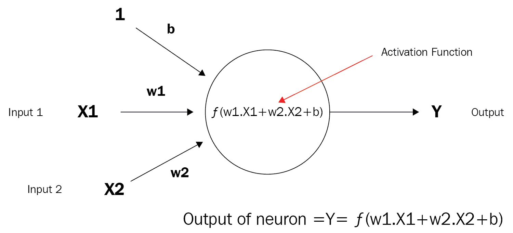

接下来，以下图表展示了一个由几个神经元组成的非常简单的神经网络：

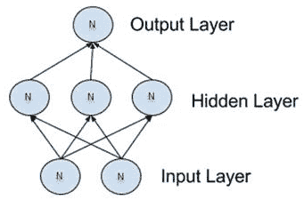

这是一个稍微复杂一些，或者说更深层次的网络：

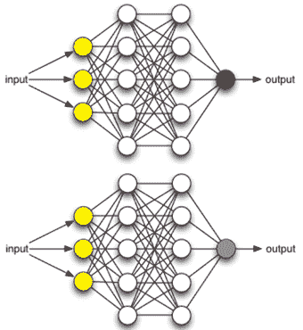

# 神经网络训练

现在我们已经知道了神经网络和神经元是什么，我们应该谈谈它们的功能以及它们是如何工作的。神经网络是如何学习的？那些已经有孩子的你们已经知道这个答案了。如果你想让孩子知道猫是什么，你会怎么做？你给他们看猫（图片或真实的）。如果你想让孩子知道狗是什么，就给他们看狗。从概念上讲，神经网络并没有什么不同。它有一种**学习规则**，会修改从输入层传入的权重，通过隐藏层进行处理，然后通过激活函数，并希望能够在我们的案例中识别出猫和狗。而且，如果做得正确，猫不会变成狗！

神经网络中最常见的学习规则之一是所谓的**delta 规则**。这是一个**监督**规则，每次网络被呈现另一个学习模式时都会被调用。每次发生这种情况时，它被称为**周期**或**时代**。规则的调用将在输入模式通过一个或多个**正向**传播层，然后通过一个或多个**反向**传播层时发生。

更简单地说，当神经网络被呈现一个图像时，它会试图确定可能的答案。正确答案和我们的猜测之间的差异是**误差**或**误差率**。我们的目标是使误差率最小化或最大化。在最小化的情况下，我们需要误差率尽可能接近 0，对于每一个猜测。我们越接近 0，就越接近成功。

随着我们不断前进，我们进行所谓的**梯度下降**，这意味着我们继续朝着被称为**全局最小值**的方向前进，这是我们的最低可能的误差，希望这对**成功**至关重要。我们朝着全局最小值下降。

一旦网络本身被训练，并且你满意，训练周期就可以结束，然后你可以进入测试周期。在测试周期中，只使用正向传播层。这个过程的结果将产生用于进一步分析的**模型**。同样，在测试期间不会发生反向传播。

# 神经网络视觉指南

在本节中，我可能需要输入成千上万的字来描述所有神经网络组合及其外观。然而，无论多少文字都不如下面的图表来得有效：

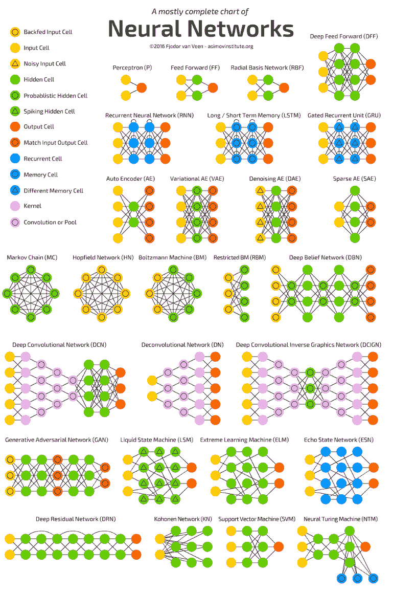

经 Asimov Institute 许可重印，版权所有

来源：http://www.asimovinstitute.org/neural-network-zoo/

让我们谈谈前一个图中的一些更常见的网络：

+   **感知器**：这是最简单的前馈神经网络，正如你所见，它不包含任何隐藏层：


+   **前馈网络：**这种网络可能是设计得最简单的人工神经网络。它包含多个按**层**排列的神经元（节点）。相邻层的节点之间有**连接**或**边**。每个连接都与**权重**相关联：


+   **循环神经网络（RNN）：**RNN 被称为*循环*，因为它们对序列中的每个元素执行相同的任务，输出取决于之前的计算。它们还能够回顾之前的步骤，这形成了一种**短期记忆**：

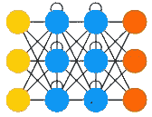

# 神经网络在当今企业中的作用

作为开发者，我们主要关心的是如何将我们正在学习的内容应用到现实世界的场景中。更具体地说，在企业环境中，使用神经网络的机遇有哪些？以下是一些（许多）神经网络应用想法：

+   在一个变量之间的关系不为人知的场景中

+   在一个关系难以描述的场景中

+   在一个目标是发现数据中不规则模式的场景中

+   对数据进行分类以识别动物、车辆等模式

+   信号处理

+   图像识别（情感、观点、年龄、性别等）

+   文本翻译

+   手写识别

+   自动驾驶汽车

+   以及更多！

# 学习类型

既然我们谈到了我们的神经网络学习，让我们简要地谈谈你应该了解的三种不同类型的学习。它们是**监督**、**无监督**和**强化**。

# 监督学习

如果你有一个与已知结果匹配的大型测试数据集，那么监督学习可能是一个不错的选择。神经网络将处理数据集；将其输出与已知结果进行比较，调整，然后重复。很简单，对吧？

# 无监督学习

如果你没有测试数据，并且能够从数据的行为中推导出某种成本函数，那么无监督学习可能是一个不错的选择。神经网络将处理数据集，使用`成本`函数来告知错误率，调整参数，然后重复。所有这些都在实时进行！

# 强化学习

我们最后一种学习类型是**强化**学习，在某些圈子中更广为人知的是**胡萝卜加大棒**。神经网络将处理数据集，从数据中学习，如果我们的错误率下降，我们就得到胡萝卜。如果错误率上升，我们就得到大棒。说得够多了，对吧？

# 理解感知器

我们将要处理的最基本元素被称为神经元。如果我们考虑神经元将使用的最基本形式的激活函数，我们将得到一个只有两种可能结果的函数，1 和 0。从视觉上看，这样的函数将表示如下：

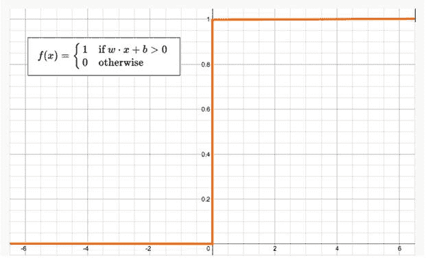

这个函数如果输入是正的或 0，则返回 1，否则返回 0。具有这种激活函数的神经元被称为**感知器**。这是我们能够开发的最简单的神经网络形式。从视觉上看，它看起来如下：

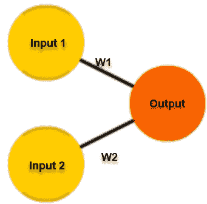

感知器遵循前馈模型，这意味着输入被发送到神经元，处理，然后产生输出。输入进来，输出出去。让我们用一个例子来说明。

假设我们有一个具有两个输入的单个感知器，如图所示。为了本例的目的，输入 0 将是 x1，输入 1 将是 x2。如果我们分配这两个变量值，它们将类似于以下内容：

*输入 0: x1 = 12*

*输入 1: x2 = 4*

每个输入都必须**加权**，也就是说，乘以某个值，这个值通常在-1 和 1 之间。当我们创建我们的感知器时，我们首先给它们分配随机权重。例如，输入 0（**x1**）将有一个我们将其标记为**w1**的权重，而输入 1（**x2**）将有一个我们将其标记为**w2**的权重。据此，以下是这个感知器的权重：

*权重 0: 0.5* *权重 1: -1*

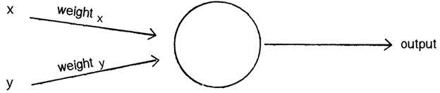

一旦输入被*加权*，现在需要将它们相加。使用之前的例子，我们将有如下内容：

*6 + -4 = 2*

这个总和然后将通过一个激活函数，我们将在后面的章节中更详细地介绍。这将生成感知器的输出。激活函数将最终告诉感知器它是否可以*触发*，也就是说，激活。

现在，对于我们的激活函数，我们将只使用一个非常简单的函数。如果总和是正的，输出将是 1。如果总和是负的，输出将是-1。这不能再简单了，对吧？

因此，在伪代码中，我们单个感知器的算法如下所示：

+   对于每个输入，将输入乘以它的权重

+   求所有加权输入的总和

+   根据激活函数（即总和的符号）计算感知器基于该总和的输出

# 这有用吗？

是的，事实上是有用的，让我们来展示一下。考虑一个输入向量作为点的坐标。对于一个具有*n*个元素的向量，点将位于一个 n 维空间中。取一张纸，在这张纸上画一组点。现在用一条直线将这两个点分开。你的纸张现在应该看起来像以下这样：

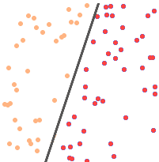

如您所见，点现在被分为两组，一组在直线的每一侧。如果我们能用一条直线清楚地分离所有点，那么这两组就是所谓的线性可分。

相信或不相信，我们的单个感知器将能够学习这条线的位置，当你的程序完成时，感知器也将能够判断一个点是在线的上方还是下方（或者根据线的绘制方式，在左侧或右侧）。

让我们快速编写一个`Perceptron`类，以便让那些喜欢阅读代码而不是文字的你们（像我一样）更清晰地理解！目标是创建一个简单的感知器，可以确定一个点应该在直线的哪一侧，就像之前的图示一样：

```py
class Perceptron {

float[] weights;
```

构造函数可以接收一个参数，表示输入的数量（在这种情况下是三个：*x*、*y*和偏置），并相应地调整数组的大小：

```py
Perceptron(int n) {
    weights = new float[n];
    for (int i = 0; i<weights.length; i++) {
```

初始时，`weights`是随机选择的：

```py
      weights[i] = random(-1,1);
    }
}
```

接下来，我们需要为感知器编写一个接收其信息的函数，其长度将与权重数组相同，然后返回输出值给我们。我们将称之为`feedforward`：

```py
int feedforward(float[] inputs) {
    float sum = 0;
    for (int i = 0; i<weights.length; i++) {
      sum += inputs[i]*weights[i];
    }
```

结果是总和的符号，它将是-1 或+1。在这种情况下，感知器正在尝试猜测输出应该在直线的哪一侧：

```py
 return activate(sum);
 }
```

到目前为止，我们有一个功能最基本但应该能够做出有根据的猜测的感知器。

创建`Perceptron`：

```py
Perceptron p = new Perceptron(3);
```

输入是 3 个值：*x*、*y*和偏置：

```py
float[] point = {5,-2,19};
```

获得答案：

```py
int result = p.feedforward(point);
```

使我们的感知器更有价值的唯一事情是能够训练它而不是让它做出有根据的猜测。我们通过创建一个`train`函数来实现这一点，如下所示：

1.  我们将引入一个新变量来控制学习率：

```py
float c = 0.01;
```

1.  我们还将提供输入和已知答案：

```py
void train(float[] inputs, int desired) {
```

1.  根据提供的输入，我们将做出一个有根据的猜测：

```py
  int guess = feedforward(inputs);
```

1.  我们将计算`error`，即答案和我们的`guess`之间的差异：

```py
float error = desired - guess;
```

1.  最后，我们将根据误差和学习常数调整所有权重：

```py
  for (int i = 0; i<weights.length; i++) {
    weights[i] += c * error * inputs[i];
```

因此，现在你已经知道并看到了感知器是什么，让我们加入**激活函数**，并将其提升到下一个层次！

# 理解激活函数

激活函数被添加到神经网络的输出端，以确定输出。它通常将结果值映射到-1 到 1 的范围内的某个地方，具体取决于函数。它最终用于确定神经元是否会*触发*或*激活*，就像灯泡打开或关闭一样。

激活函数是网络输出前的最后一部分，可以被认为是输出值的供应商。可以使用许多种激活函数，此图仅突出显示这些函数的一小部分：

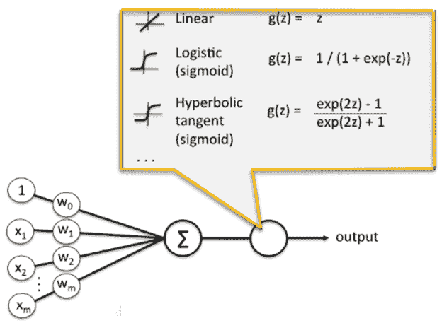

激活函数有两种类型——线性和非线性：

+   **线性**：线性函数是位于或几乎位于直线上的函数，如图所示：

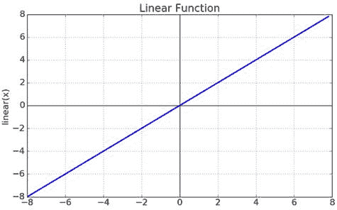

+   **非线性**：非线性函数是指那些不在直线上的函数，如图中所示：

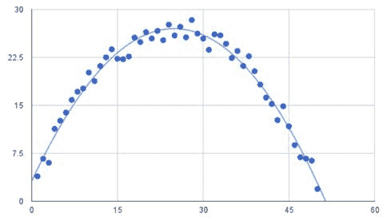

# 可视化激活函数绘图

在处理激活函数时，重要的是在使用之前，您能够直观地理解激活函数的形状。我们将为您绘制并基准测试几个激活函数，以便您可以看到：

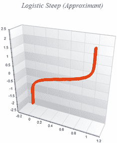

这就是逻辑阶跃近似和 Swish 激活函数单独绘制时的样子。由于存在许多类型的激活函数，以下展示了当它们一起绘制时，所有我们的激活函数将呈现的样子：

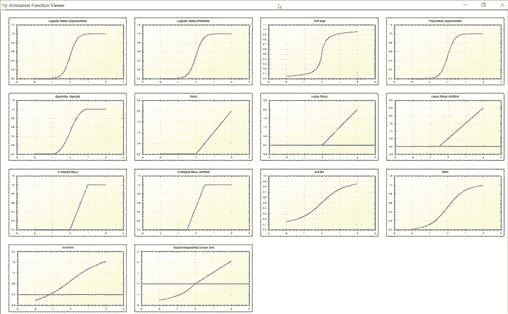

注意：您可以从 GitHub 上的 SharpNeat 项目下载生成之前输出的程序[`github.com/colgreen/sharpneat`](https://github.com/colgreen/sharpneat)。

到目前为止，您可能想知道我们为什么关心这些图的样子——这是一个很好的问题。我们关心，因为一旦您进入实际操作经验，深入神经网络时，您将大量使用这些。知道您的激活函数将把神经元的值置于开启或关闭状态，以及它将保持或需要的值范围是非常有用的。毫无疑问，您作为机器学习开发者，在职业生涯中会遇到并/或使用激活函数，了解 Tanh 和 LeakyRelu 激活函数之间的区别非常重要。

# 函数绘图

在这个例子中，我们将使用开源包**SharpNeat**。它是最强大的机器学习平台之一，并且它包含一个特殊的激活函数绘图器。您可以在[`github.com/colgreen/sharpneat`](https://github.com/colgreen/sharpneat)找到 SharpNeat 的最新版本。在这个例子中，我们将使用如图所示包含的***ActivationFunctionViewer***项目：

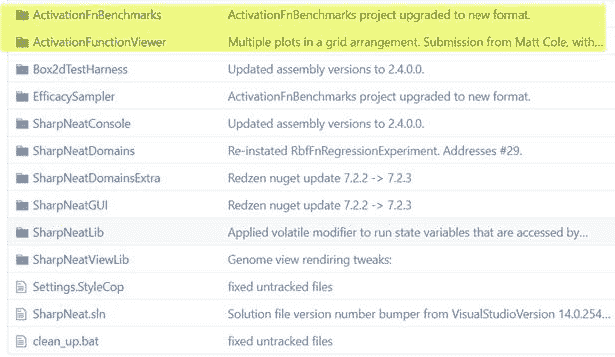

一旦打开该项目，搜索`PlotAllFunctions`函数。正是这个函数处理了之前展示的所有激活函数的绘图。让我们详细了解一下这个函数：

```py
private void PlotAllFunctions()
{
    Clear everything out.
    MasterPane master = zed.MasterPane;
    master.PaneList.Clear();
    master.Title.IsVisible = true;
    master.Margin.All = 10;

    Here is the section that will plot each individual function.
    PlotOnMasterPane(Functions.LogisticApproximantSteep, "Logistic 
    Steep (Approximant)");

    PlotOnMasterPane(Functions.LogisticFunctionSteep, "Logistic Steep 
    (Function)");

    PlotOnMasterPane(Functions.SoftSign, "Soft Sign");

    PlotOnMasterPane(Functions.PolynomialApproximant, "Polynomial 
    Approximant");

    PlotOnMasterPane(Functions.QuadraticSigmoid, "Quadratic Sigmoid");

    PlotOnMasterPane(Functions.ReLU, "ReLU");

    PlotOnMasterPane(Functions.LeakyReLU, "Leaky ReLU");

    PlotOnMasterPane(Functions.LeakyReLUShifted, "Leaky ReLU 
    (Shifted)");

    PlotOnMasterPane(Functions.SReLU, "S-Shaped ReLU");

    PlotOnMasterPane(Functions.SReLUShifted, "S-Shaped ReLU 
    (Shifted)");

    PlotOnMasterPane(Functions.ArcTan, "ArcTan");

    PlotOnMasterPane(Functions.TanH, "TanH");

    PlotOnMasterPane(Functions.ArcSinH, "ArcSinH");

    PlotOnMasterPane(Functions.ScaledELU, "Scaled Exponential Linear 
    Unit");

    Reconfigure the Axis
    zed.AxisChange();

    Layout the graph panes using a default layout
    using (Graphics g = this.CreateGraphics()) 
    {
        master.SetLayout(g, PaneLayout.SquareColPreferred);
    }

    MainPlot Function

    Behind the scenes, the ‘Plot' function is what is responsible for 
    executing     and plotting each function.

    private void Plot(Func<double, double> fn, string fnName, Color 
    graphColor, GraphPane gpane = null)
    {
        const double xmin = -2.0;
        const double xmax = 2.0;
        const int resolution = 2000;
        zed.IsShowPointValues = true;
        zed.PointValueFormat = "e";

        var pane = gpane ?? zed.GraphPane;
        pane.XAxis.MajorGrid.IsVisible = true;
        pane.YAxis.MajorGrid.IsVisible = true;
        pane.Title.Text = fnName;
        pane.YAxis.Title.Text = string.Empty;
        pane.XAxis.Title.Text = string.Empty;

        double[] xarr = new double[resolution];
        double[] yarr = new double[resolution];
        double incr = (xmax - xmin) / resolution;
        doublex = xmin;

        for(int i=0; i<resolution; i++, x += incr)
        {
            xarr[i] = x;
            yarr[i] = fn(x);
        }

        PointPairList list1 = new PointPairList(xarr, yarr);
        LineItem li = pane.AddCurve(string.Empty, list1, graphColor, 
        SymbolType.None);
        li.Symbol.Fill = new Fill(Color.White);
        pane.Chart.Fill = new Fill(Color.White, 
        Color.LightGoldenrodYellow, 45.0F);
}
```

早期代码中引起关注的主要点用黄色突出显示。这就是我们传递的激活函数被执行并用于*y*轴绘图值的地方。著名的开源绘图包**ZedGraph**用于所有图形绘图。一旦每个函数执行完毕，相应的绘图将被制作。

# 理解反向传播

**反向传播**，即**误差的反向传播**，是一种使用梯度下降进行神经网络监督学习的算法。它计算了所谓的**误差函数的梯度**，相对于网络的权重。它是感知器从单层到多层前馈神经网络的 delta 规则的一般形式。

与前向传播不同，反向传播通过在网络中向后移动来计算梯度。首先计算权重最后一层的梯度，然后最后计算第一层的梯度。随着深度学习在图像和语音识别中的最近流行，反向传播再次成为焦点。就其目的而言，它是一个高效的算法，今天的版本利用 GPU 来进一步提高性能。

最后，因为反向传播的计算依赖于前向阶段（包括隐藏层在内的所有层的非误差项）的激活和输出，所以所有这些值必须在反向阶段开始之前被计算。因此，对于梯度下降的每一次迭代，前向阶段必须先于反向阶段进行。

# 前向和反向传播的区别

让我们花一点时间来澄清前向传播和反向传播之间的区别。一旦你理解了这个，你就可以更好地可视化和理解整个神经网络的流程。

在神经网络中，你通过前向传播数据以获取输出，然后将其与实际预期的值进行比较以获得误差，这个误差是数据应该是什么与你的机器学习算法实际认为它是什么之间的差异。为了最小化这个误差，你现在必须通过找到误差相对于每个权重的导数来*反向传播*，然后从这个权重本身减去这个值。

在神经网络中进行的基学习是训练神经元何时被激活、何时放电以及何时处于*开启*或*关闭*状态。每个神经元应该只为某些类型的输入激活，而不是所有输入。因此，通过前向传播，你可以看到你的神经网络表现如何以及找到误差。在你了解到你的网络误差率后，你进行反向传播并使用梯度下降的形式来更新权重的新的值。再次，你将数据前向传播以查看这些权重表现如何，然后反向传播数据以更新权重。这将一直持续到达到误差值的某个最小值（希望是全球最小值而不是局部最小值）。再次，重复这个过程！

# 摘要

在本章中，我们简要概述了各种神经网络术语。我们回顾了感知器、神经元和反向传播等内容。在我们下一章中，我们将直接进入编写一个完整的神经网络！

我们将涵盖诸如神经网络训练、术语、突触、神经元、前向传播、反向传播、Sigmoid 函数、反向传播以及错误计算等主题。

所以，请系好你的帽子；代码即将到来！

# 参考文献

+   @EVOLVE 深度学习共享信息神经网络框架，版权所有 2016 Matt R Cole，[www.evolvedaisolutions.com](http://www.evolvedaisolutions.com)。

+   SharpNeat 激活函数/查看器：SharpNeat ([`github.com/colgreen/sharpneat`](https://github.com/colgreen/sharpneat))。
