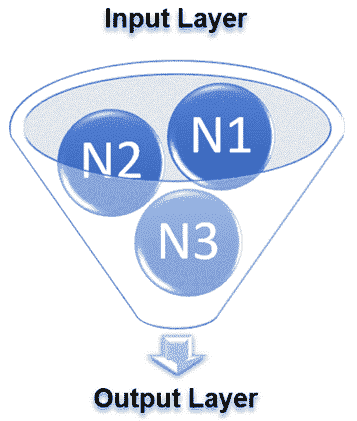
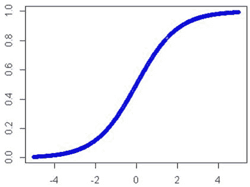
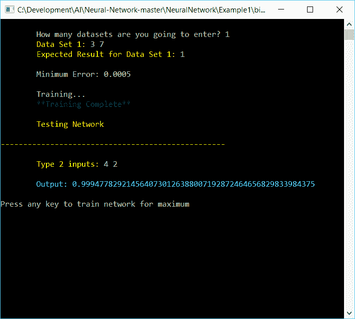
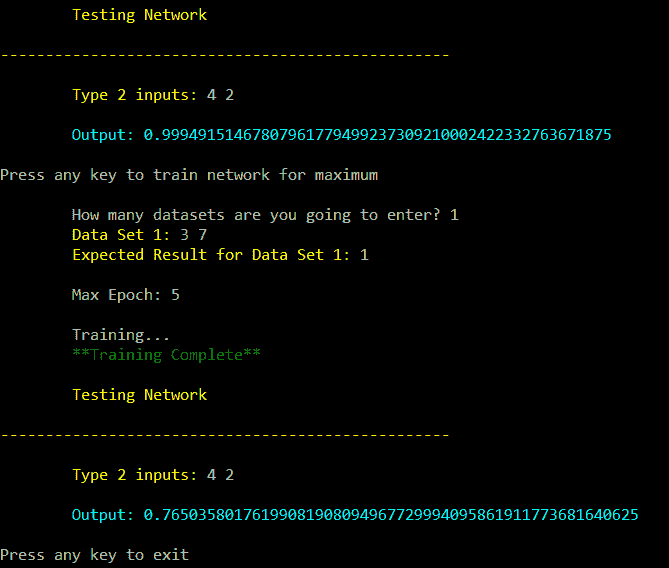

# 第七章：一起构建我们的第一个神经网络

现在我们对神经网络有了快速的复习，我认为从代码的角度来看，一个好的起点可能是我们编写一个非常简单的神经网络。我们不会做得太过分；我们只是为几个函数搭建基本框架，这样你就可以了解许多 API 背后的场景。从头到尾，我们将开发这个网络应用程序，以便你熟悉神经网络中包含的所有基本组件。这个实现并不完美或全面，也不是这个意思。正如我提到的，这仅仅提供了一个框架，我们可以在本书的其余部分中使用。这是一个非常基本的神经网络，增加了保存和加载网络和数据的功能。无论如何，你将有一个基础，从那里你可以编写自己的神经网络，并改变世界，如果你愿意的话。

在本章中，我们将涵盖以下主题：

+   神经网络训练

+   术语

+   突触

+   神经元

+   前向传播

+   Sigmoid 函数

+   反向传播

+   错误计算

# 技术要求

你需要在系统上安装 Microsoft Visual Studio。

查看以下视频以查看代码的实际应用：[`bit.ly/2NYJa5G`](http://bit.ly/2NYJa5G)。

# 我们的神经网络

让我们先向您展示一个简单的神经网络的外观，从视觉上。它由一个包含`2`个输入的输入层、一个包含`3`个神经元（有时称为**节点**）的隐藏层以及一个由单个神经元组成的最终输出层组成。当然，神经网络可以包含更多层（以及每层的神经元），一旦你进入深度学习，你会看到更多这样的例子，但就目前而言，这已经足够了。记住，每个节点，用*`N`*标记，都是一个单独的神经元——它自己的小处理大脑，如果你愿意这样想的话：



让我们将神经网络分解为其三个基本部分：输入、隐藏层和输出：

**输入**：这是我们的网络的初始数据。每个输入都是一个值，其输出到隐藏层的值是初始输入值。

**隐藏层**：这是我们网络的灵魂和核心，所有的魔法都发生在这里。这个层中的神经元为它们的每个输入分配权重。这些权重最初是随机的，并在网络训练过程中进行调整，以便神经元的输出更接近预期的结果（如果我们幸运的话）。

**输出**：这些是我们网络在执行计算后得到的结果。在我们的简单案例中，输出将是真或假，开或关。神经元为它们的每个输入分配一个权重，这些权重来自前一个隐藏层。尽管通常只有一个输出神经元是常见的，但如果需要或想要更多，你完全可以拥有更多。

# 神经网络训练

我们如何训练神经网络？基本上，我们将提供一组输入数据以及我们期望看到的结果，这些结果与输入相对应。然后，这些数据将通过网络运行，直到网络理解我们在寻找什么。我们将进行训练、测试、训练、测试、训练、测试，如此循环，直到我们的网络理解我们的数据（或者不理解，但这又是另一个话题）。我们继续这样做，直到满足某个指定的停止条件，例如错误率阈值。让我们快速了解一下我们在训练神经网络时将使用的术语。

**反向传播**：在数据通过网络运行后，我们需要验证这些数据，看看我们期望得到的是正确的输出。我们通过将数据反向传播（因此称为反向传播或反向传播）通过网络的每个隐藏层来实现这一点。最终结果是调整分配给隐藏层中每个神经元输入的权重以及我们的错误率。

在理想情况下，每个反向传播层都应该使我们的网络输出更接近我们期望的值，我们的错误率将越来越接近 0。我们可能永远无法达到精确的错误率为 0，所以尽管这可能看起来差别不大，但错误率为 0.0000001 可能对我们来说已经足够可接受。

**偏置**：偏置允许我们修改我们的函数，以便我们可以为网络中的每个神经元生成更好的输出。简而言之，偏置允许我们将激活函数的值向左或向右移动。改变权重会改变 Sigmoid 的陡峭程度或垂直方面。

**动量**：动量简单地将前一次权重更新的部分加到当前更新上。动量用于防止系统收敛到局部最小值而不是全局最小值。高动量可以用来帮助增加系统的收敛速度；然而，你必须小心，因为设置此参数过高可能导致超过最小值，这将导致系统不稳定。另一方面，动量太低可能无法可靠地避免局部最小值，它也可能真的减慢系统的训练速度。因此，正确获取此值对于成功至关重要，你将花费相当多的时间来做这件事。

**Sigmoid 函数**：激活函数定义了每个神经元的输出。Sigmoid 函数可能是最常用的激活函数。它将输入转换为介于 0 和 1 之间的值。此函数用于生成我们的初始权重。典型的 Sigmoid 函数能够接受一个输入值，并从这个值提供输出值和导数。

**学习率**：学习率通过控制网络在学习阶段对权重和偏置所做的变化大小，从而改变系统的整体学习速度。

现在我们有了这些术语，让我们开始深入代码。你应该已经下载了书中提供的配套软件的解决方案，并在 Visual Studio 中打开它。我们使用 Visual Studio 的社区版，但你也可以使用你有的任何版本。

随意下载软件，实验它，如果你需要或想要的话，还可以对其进行美化。在你的世界里，你的神经网络可以是任何你喜欢或需要的样子，所以让它发生吧。你有源代码。仅仅因为你看某件事的方式不一定是真理或刻在石头上的！从这些伟大的开源贡献者为我们提供的东西中学习！记住，这个神经网络旨在给你一些想法，关于你可以做很多事情，同时也会教你一些神经网络的基础知识。

让我们从一些简短的代码片段开始，这些代码片段将为本章的其余部分奠定基础。我们首先从一个叫做**突触**的小东西开始，它连接一个神经元到另一个。接下来，我们将开始编写单个神经元的代码，最后讨论前向和反向传播以及这对我们意味着什么。我们将以代码片段的形式展示一切，以便更容易理解。

# 突触

你可能会问，什么是突触？简单地说，它连接一个神经元到另一个，同时也是一个容器，用来存放权重和权重增量值，如下所示：

```py
public class Synapse
{
    public Guid Id{ get; set; }
    public Neuron InputNeuron{ get; set; }    
    public Neuron OutputNeuron{ get; set; }
    public double Weight{ get; set; }
    public double WeightDelta{ get; set; }
}
```

# 神经元

我们已经讨论了什么是神经元，现在该用代码来表达了，这样像我们这样的开发者就能更好地理解它了！正如你所见，我们既有输入和输出突触，还有`偏置`和`偏置增量`，`梯度`以及神经元的实际值。神经元计算其输入的加权和，加上偏置，然后决定输出是否应该`'fire' - '开启'`：

```py
public class Neuron
{
  public Guid Id{ get; set; }

The synapse that connects to our input side
  public List<Synapse> InputSynapses{ get; set; }

The synapse that connects to our output side
  public List<Synapse> OutputSynapses{ get; set; }
  public double Bias{ get; set; }

Our bias values
  public double BiasDelta{ get; set; }
  public double Gradient{ get; set; }

The input value to the neuron
  public double Value{ get; set; }

Is the neuron a mirror neuron
public bool IsMirror{ get; set; }

Is the neuron a canonical neuron
public bool IsCanonical{ get; set; }

}
```

# 前向传播

下面是我们基本前向传播过程的代码：

```py
private void ForwardPropagate(params double[] inputs)
{
  var i = 0;
  InputLayer?.ForEach(a =>a.Value = inputs[i++]);
  HiddenLayers?.ForEach(a =>a.ForEach(b =>b.CalculateValue()));
  OutputLayer?.ForEach(a =>a.CalculateValue());
}
```

要进行`ForwardPropagation`，我们基本上将每个突触的所有输入相加，然后将结果通过 Sigmoid 函数来得到输出。`CalculateValue`函数为我们做这件事。

# Sigmoid 函数

Sigmoid 函数是一个激活函数，正如我们之前所提到的，可能是今天最广泛使用的之一。下面是一个 Sigmoid 函数的样子（你记得我们关于激活函数的部分，对吧？）它的唯一目的（非常抽象地）是将外部边缘的值拉近 0 和 1，而不用担心值会大于这个。这将防止边缘上的值离我们而去：



你可能会问，C#代码中的 Sigmoid 函数是什么样的？就像下面的这样：

```py
public static class Sigmoid
{
  public static double Output(double x)
  {
    return x < -45.0 ?0.0 : x > 45.0 ? 1.0 : 1.0 / (1.0 + Math.Exp(-x));
  }

  public static double Derivative(double x)
  {
    return x * (1 - x);
  }
}
```

我们的`Sigmoid`类将产生输出和导数。

# 反向传播

对于反向传播（backprop），我们首先从输出层计算梯度，将这些值通过隐藏层（反转我们在正向传播中采取的方向），更新权重，最后将这些值通过输出层，如下所示：

```py
private void BackPropagate(params double[] targets)
{
  var i = 0;
  OutputLayer?.ForEach(a =>a.CalculateGradient(targets[i++]));
  HiddenLayers?.Reverse();
  HiddenLayers?.ForEach(a =>a.ForEach(b =>b.CalculateGradient()));
  HiddenLayers?.ForEach(a =>a.ForEach(b =>b.UpdateWeights(LearningRate, Momentum)));
  HiddenLayers?.Reverse();
  OutputLayer?.ForEach(a =>a.UpdateWeights(LearningRate, Momentum));
}
```

# 计算误差

为了计算我们的误差，我们从实际值中减去预期值。我们越接近 0，效果越好。请注意，我们几乎不可能达到 0，尽管理论上可能发生这种情况：

```py
public double CalculateError(double target)
{
  return target - Value;
}
```

# 计算梯度

梯度是通过考虑`Sigmoid`函数的导数来计算的：

```py
public double CalculateGradient(double? target = null)
{
  if (target == null)
    return Gradient = OutputSynapses.Sum(a =>a.OutputNeuron.Gradient * 
    a.Weight) * Sigmoid.Derivative(Value);

  return Gradient = CalculateError(target.Value) * Sigmoid.Derivative(Value);
}
```

# 更新权重

我们通过将学习率乘以我们的梯度，然后加上动量并乘以之前的 delta 来更新权重。然后通过每个输入突触运行以计算最终值：

```py
public void UpdateWeights(double learnRate, double momentum)
{
  var prevDelta = BiasDelta;
  BiasDelta = learnRate * Gradient;
  Bias += BiasDelta + momentum * prevDelta;

  foreach (var synapse in InputSynapses)
  {
    prevDelta = synapse.WeightDelta;
    synapse.WeightDelta = learnRate * Gradient * synapse.InputNeuron.Value;
        synapse.Weight += synapse.WeightDelta + momentum * prevDelta;
  }
}
```

# 计算值

为了计算值，我们从`Sigmoid`函数的输出中取出，并加上偏置项：

```py
public virtual double CalculateValue()
{
  return Value = Sigmoid.Output(InputSynapses.Sum(a =>a.Weight * 
  a.InputNeuron.Value) + Bias);
}
```

# 神经网络函数

以下基本列表包含我们将开发的功能，以便建立我们的神经网络基础：

+   创建新的网络

+   导入网络

+   手动输入用户数据

+   导入数据集

+   训练我们的网络

+   测试我们的网络

在此基础上，让我们开始编码！

# 创建一个新的网络

此菜单选项将允许我们从零开始创建一个新的网络：

```py
public NNManager SetupNetwork()
{
    _numInputParameters = 2;

    int[] hidden = new int[2];
    hidden[0] = 3;
    hidden[1] = 1;
    _numHiddenLayers = 1;
    _hiddenNeurons = hidden;
    _numOutputParameters = 1;
    _network = new Network(_numInputParameters, _hiddenNeurons,         
    _numOutputParameters);
    return this;
}
```

注意这个函数中的返回值。这是一个流畅的接口，意味着可以将各种函数链接到单个语句中。许多人更喜欢这种接口而不是传统的接口，但您可以随意修改代码。以下是一个流畅接口的示例。信不信由你，这是一个完整的神经网络：

```py
NNManagermgr = new NNManager();
Mgr
.SetupNetwork()
.GetTrainingDataFromUser()
.TrainNetworkToMinimum()
.TestNetwork();
```

# 导入现有网络

此功能将允许我们导入之前保存的网络。再次注意返回值，这使得它成为一个流畅的接口：

```py
public static Network ImportNetwork()
{
```

获取之前保存的网络文件名。一旦打开，将其反序列化为我们将处理的网络结构。（如果由于某种原因不起作用，则中止！）：

```py
  var dn = GetHelperNetwork();
  if (dn == null) 
  return null;
```

创建一个新的`Network`和一个神经元列表来填充：

```py
var network = new Network();
  var allNeurons = new List<Neuron>();
```

复制之前保存的学习率和动量：

```py
network.LearningRate = dn.LearningRate;
  network.Momentum = dn.Momentum;
```

从我们导入的网络数据中创建输入层：

```py
foreach (var n in dn.InputLayer)
  {
    var neuron = new Neuron
    {
      Id = n.Id,
      Bias = n.Bias,
      BiasDelta = n.BiasDelta,
      Gradient = n.Gradient,
      Value = n.Value
    };

    network.InputLayer?.Add(neuron);
    allNeurons.Add(neuron);
  }
```

从我们导入的网络数据中创建我们的隐藏层：

```py
  foreach (var layer in dn.HiddenLayers)
  {
    var neurons = new List<Neuron>();
    foreach (var n in layer)
    {
      var neuron = new Neuron
      {
        Id = n.Id,
        Bias = n.Bias,
        BiasDelta = n.BiasDelta,
        Gradient = n.Gradient,
        Value = n.Value
      };

      neurons.Add(neuron);
      allNeurons.Add(neuron);
    }
    network.HiddenLayers?.Add(neurons);
  }
```

从我们导入的数据中创建`OutputLayer`神经元：

```py
foreach (var n in dn.OutputLayer)
  {
    var neuron = new Neuron
    {
      Id = n.Id,
      Bias = n.Bias,
      BiasDelta = n.BiasDelta,
      Gradient = n.Gradient,
      Value = n.Value
    };

    network.OutputLayer?.Add(neuron);
    allNeurons.Add(neuron);
  }
```

最后，创建将所有内容连接起来的突触：

```py

  foreach (var syn in dn.Synapses)
  {
    var synapse = new Synapse{ Id = syn.Id };
    var inputNeuron = allNeurons.First(x =>x.Id==syn.InputNeuronId);
    var outputNeuron = allNeurons.First(x =>x.Id==syn.OutputNeuronId);
    synapse.InputNeuron = inputNeuron;
    synapse.OutputNeuron = outputNeuron;
    synapse.Weight = syn.Weight;
    synapse.WeightDelta = syn.WeightDelta;

    inputNeuron?.OutputSynapses?.Add(synapse);
    outputNeuron?.InputSynapses?.Add(synapse);
  }
  return network;
}
```

以下是我们手动输入网络将使用的数据：

```py
public NNManager GetTrainingDataFromUser()
{
var numDataSets = GetInput("\tHow many datasets are you going to enter? ", 1, int.MaxValue);

  var newDatasets = new List<NNDataSet>();
  for (var i = 0; i<numDataSets; i++)
  {
    var values = GetInputData($"\tData Set {i + 1}: ");
    if (values == null)
    {
      return this;
    }

    var expectedResult = GetExpectedResult($"\tExpected Result for Data 
    Set {i + 1}: ");
    if (expectedResult == null)
    {
      return this;
    }

    newDatasets.Add(newNNDataSet(values, expectedResult));
  }

  _dataSets = newDatasets;
  return this;
}
```

# 导入数据集

以下是我们如何处理数据集：

```py
public static List<DataSet>ImportDatasets()
{
  var dialog = new OpenFileDialog
  {
    Multiselect = false,
    Title = "Open Dataset File",
    Filter = "Text File|*.txt;"
  };

  using (dialog)
  {
    if (dialog.ShowDialog() != DialogResult.OK) 
    return null;

    using (var file = File.OpenText(dialog.FileName))
    {
```

反序列化数据并返回它：

```py
      return JsonConvert.DeserializeObject<List<DataSet>>(file.ReadToEnd());
    }
  }
}
```

# 测试网络

为了测试网络，我们需要进行简单的正向和反向传播，如下所示：

```py
public double[] Compute(params double[] inputs)
{
```

按如下方式进行正向传播：

```py
  ForwardPropagate(inputs);
```

按如下方式返回数据：

```py
  return OutputLayer.Select(a =>a.Value).ToArray();
}
```

# 导出网络

按如下方式导出当前网络信息：

```py
public NNManager ExportNetwork()
{
  Console.WriteLine("\tExporting Network...");
  ExportHelper.ExportNetwork(_network);
  Console.WriteLine("\t**Exporting Complete!**", Color.Green);
  return this;
}
```

# 训练网络

训练网络有两种方式。一种是将错误值降至最小，另一种是将错误值升至最大。这两个函数都有默认值，尽管你可能希望为你的训练设置不同的阈值，如下所示：

```py
public NNManager TrainNetworkToMinimum()
{
var minError = GetDouble("\tMinimum Error: ", 0.000000001, 1.0);
Console.WriteLine("\tTraining...");
_network.Train(_dataSets, minError);
Console.WriteLine("\t**Training Complete**", Color.Green);
return this;
}

public NNManager TrainNetworkToMaximum()
{
varmaxEpoch = GetInput("\tMax Epoch: ", 1, int.MaxValue);
if(!maxEpoch.HasValue)
       {
  return this;
       }

Console.WriteLine("\tTraining...");
_network.Train(_dataSets, maxEpoch.Value);
Console.WriteLine("\t**Training Complete**", Color.Green);
return this;
}
```

在上述两个函数定义中，神经网络`Train`函数被调用以执行实际训练。此函数随后在训练循环的每次迭代中为每个数据集调用前向和反向传播函数，如下所示：

```py
public void Train(List<DataSet>dataSets, int numEpochs)
{
  for (var i = 0; i<numEpochs; i++)
  {
    foreach (var dataSet in dataSets)
    {
      ForwardPropagate(dataSet.Values);
      BackPropagate(dataSet.Targets);
    }
  }
}
```

# 测试网络

此函数允许我们测试我们的网络。再次注意返回值，这使得它成为一个流畅的接口。对于在更高、更抽象层上最常用的函数，我尽量在最有益的地方提供流畅的接口，如下所示：

```py
public NNManager TestNetwork()
{
Console.WriteLine("\tTesting Network", Color.Yellow);

  while (true)
  {
```

从用户处获取输入数据，如下所示：

```py

    var values = GetInputData($"\tType{_numInputParameters} inputs: ");
    if (values == null)
    {
      return this;
    }
```

进行计算，如下所示：

```py
    var results = _network?.Compute(values);

```

打印结果，如下所示：

```py
    foreach (var result in results)
    {
    Console.WriteLine("\tOutput: " + 
    DoubleConverter.ToExactString(result), Color.Aqua);
    }

    return this;
  }
}
```

# 计算前向传播

此函数是根据提供的值`Compute`前向传播值的，如下所示：

```py
public double[] Compute(params double[] inputs)
{
  ForwardPropagate(inputs);
  return OutputLayer.Select(a =>a.Value).ToArray();
}
```

# 导出网络

此函数是我们导出网络的地方。对我们来说，导出意味着将数据序列化为 JSON 可读格式，如下所示：

```py
public NNManager ExportNetwork()
{
  Console.WriteLine("\tExporting Network...");
  ExportHelper.ExportNetwork(_network);
  Console.WriteLine("\t**Exporting Complete!**", Color.Green);
  return this;
}
```

# 导出数据集

此函数是我们导出数据集信息的地方。与导出网络一样，这将以 JSON 可读格式完成：

```py
public NNManager ExportDatasets()
{
      Console.WriteLine("\tExporting Datasets...");
      ExportHelper.ExportDatasets(_dataSets);
      Console.WriteLine("\t**Exporting Complete!**", Color.Green);
      return this;
}
```

# 神经网络

在编写了许多辅助但重要的函数之后，我们现在将注意力转向神经网络的核心，即网络本身。在神经网络中，网络部分是一个包罗万象的宇宙。一切都在其中。在这个结构中，我们需要存储输入、输出和隐藏层的神经元，以及学习率和动量，如下所示：

```py
public class Network
{
      public double LearningRate{ get; set; }
      public double Momentum{ get; set; }
      public List<Neuron>InputLayer{ get; set; }
      public List<List<Neuron>>HiddenLayers{ get; set; }
      public List<Neuron>OutputLayer{ get; set; }
      public List<Neuron>MirrorLayer {get; set; }
      public List<Neuron>CanonicalLayer{ get; set; }
```

# 神经元连接

每个神经元都必须连接到其他神经元，我们的神经元构造函数将处理将所有输入神经元与突触连接，如下所示：

```py
public Neuron(IEnumerable<Neuron> inputNeurons) : this()
{
Ensure.That(inputNeurons).IsNotNull();

  foreach (var inputNeuron in inputNeurons)
  {
    var synapse = new Synapse(inputNeuron, this);
    inputNeuron?.OutputSynapses?.Add(synapse);
    InputSynapses?.Add(synapse);
  }
}
```

# 示例

现在我们已经创建了代码，让我们用几个例子来看看它如何使用。

# 训练至最小值

在此示例中，我们将使用我们编写的代码来训练一个网络以达到最小值或阈值。对于每个步骤，网络都会提示你输入正确数据，从而避免在我们的示例代码中添加这些数据。在生产环境中，你可能希望在不进行用户干预的情况下传递参数，以防这个程序作为服务或微服务运行：



# 训练至最大值

在此示例中，我们将训练网络以达到最大值，而不是最小值，如图所示。我们手动输入我们希望处理的数据以及预期的结果。然后我们允许训练完成。一旦完成，我们输入测试输入并测试网络：



# 概述

在本章中，我们学习了如何从头开始编写一个完整的神经网络。尽管我们省略了很多内容，但它涵盖了基础知识，并且我们已经看到了它作为纯 C#代码的样子！现在，我们应该比刚开始时对神经网络是什么以及它包含什么有更深入的理解。

在下一章中，我们将开始探索更复杂的网络结构，例如循环神经网络和卷积神经网络。内容很多，所以请系好你们的编程帽子！
