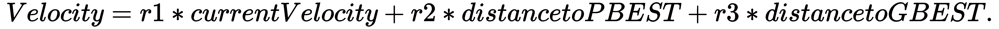
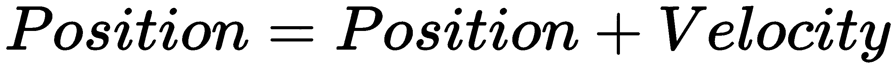
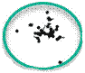
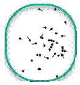
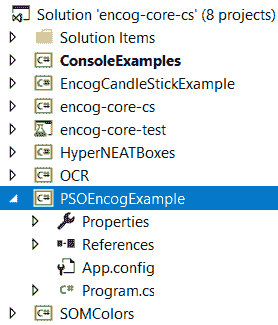
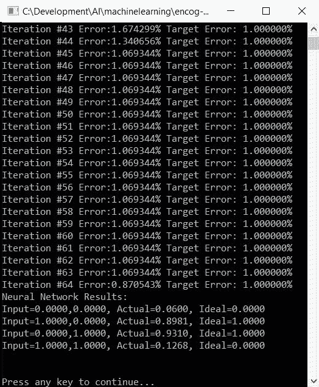
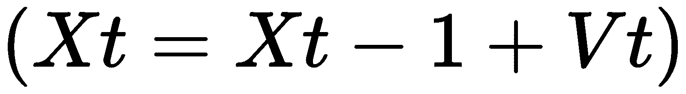

# 第十二章：将反向传播替换为 PSO

神经网络领域最新的成功案例之一是被称为**群智能**的研究领域。尽管这个研究领域已经存在多年，但计算机硬件的进步以及我们对动物研究的理解帮助我们把这个迷人的领域从实验室带到了许多不同的方向和现实世界场景中。

在本章中，我们将涵盖以下内容：

+   粒子群优化（PSO）的基本理论

+   开源机器学习框架 Encog

+   将传统的反向传播替换为 PSO

# 技术要求

你将需要 Microsoft Visual Studio，也可能需要参考 [`github.com/encog`](https://github.com/encog)。

查看以下视频以查看代码的实际应用： [`bit.ly/2QPd6Qo`](http://bit.ly/2QPd6Qo)。

# 基本理论

好的，现在进行一个小测验时间。一群鸟、一群鱼和一群蜜蜂有什么共同之处？群智能——知道如何合作地生活和工作在一起，同时最优地实现相同的目标。这并不是关于个体的智能，而是群体的成就。没有哪个个体有明确的路径或指令，没有人处于最高层下达命令，然而最优目标总是能够实现。蜜蜂通过摇摆舞找到新的巢穴。鸟儿以极大的和谐飞行，轮流担任领导者。鱼儿以我们称之为鱼群的美丽架构集体游泳。但如果我们作为人类总是需要有人处于最高层下达命令，而我们集体又并不总是意见一致，那么这些小小的生物是如何年复一年地做到这一点的，而我们却做不到呢？哎呀，我跑题了，抱歉！

让我们从一些快速的定义开始，这些定义将在整个过程中使用，以确保我们都在同一页面上继续前进。

# 群智能

群智能是自组织系统的集体行为，本质上具有去中心化的特点。群体本身表现出社会认知行为，并实现单个贡献者无法单独实现的目标。集体实现目标，而不是任何单个贡献者的努力。这引导我们到 PSO 本身。

# 粒子群优化

**粒子群优化**是一种方法（一种基于群体的算法），通过迭代优化问题，同时尝试改进关于其最优质量的潜在解决方案。PSO 算法中的每一个粒子都会从自身和另一个具有良好适应度的粒子那里学习。每个粒子，代表一个解决方案，以动态调整的速度在搜索空间中飞行，这种速度根据其自身及其伴侣的历史行为进行调整。在搜索过程中，粒子倾向于飞向更好的搜索区域。

# 粒子群优化的类型

以下是一些粒子群优化算法的变体：

+   传统粒子群优化

+   标准粒子群优化

+   完全信息粒子群优化

现在我们来简单谈谈群智能背后的理论，然后我们将进入该领域两个更专业的研究类型：粒子群优化和蚂蚁群优化，这两种优化方法都是直接替代反向传播的解决方案！

无论你发现这多么迷人且引人入胜，请记住，没有什么是完美的，也没有任何一种万能的解决方案适用于所有情况。这是一个迷人的研究领域，关于这个主题已经写出了整本书。然而，我们始终需要牢记**优化中的无免费午餐定理**。

优化中的无免费午餐定理指出，没有人可以提出任何一种特定的算法来解决所有优化问题。一个算法在解决某一特定问题上的成功并不能保证它能解决所有优化问题。更具体地说，如果考虑所有优化问题，那么所有优化技术平均表现都相同，尽管在问题子集上的表现可能不同。

在一篇非常优秀的论文《移动设备中粒子群优化的时间性能比较》中，由 Luis Antonio Beltrán Prieto、Zuzana Komínkova-Oplatková、Rubén Torres Frías 和 Juan Luis Escoto Hernández 撰写，对粒子群优化进行了如下描述：

"PSO 是一种由 Kennedy 和 Eberhart 开发的优化技术，它受到动物群体集体行为（如昆虫群）的启发，构建了一群粒子，即一组候选解，这些解在参数空间中流动，生成由最佳个体驱动的轨迹。初始种群（群体）由问题的随机解（粒子）组成，被视为一个同质代理种群，它们与其他个体进行局部交互，没有任何中央控制。因此，产生了集体行为，进化依赖于个体之间的合作和竞争，通过不同的时代（代）。每个粒子根据运动函数在参数空间中定义轨迹，该函数受速度、惯性、认知系数和社会系数的影响。目标是通过对上述元素进行随机加权来找到全局最佳解。该过程是迭代的，直到满足停止标准。"

粒子群优化的更直观类比是鸟类如何协同合作，或者蜜蜂群如何决定访问哪些花朵或攻击哪些人类！如果你曾经观察过一群鸟飞翔或者无意中撞倒了一个蜂巢，那么你就知道我指的是什么了。

现在，让我们不再只处理理论，而是进行一次假设的旅行，一次寻宝活动。我将故意使它尽可能详细，以确保类比适合问题空间。它大致是这样的。

你和你的几个朋友在一个多山地区试图找到价值连城的隐藏宝藏。我们并不确定宝藏在哪里，但我们知道它在地区的最深处山谷中。这在海拔高度方面等同于最低点。

让我们再声明一下，我们所有的朋友都可以使用他们的手机相互通信（让我们假设我们这里有手机信号！）。现在也假设我们的手机上装有 GPS 应用，告诉我们我们当前所在的高度。我们将每天寻找宝藏，直到找到它，并在每天结束时，我们要么找到了宝藏并且变得富有，要么我们需要更新我们的信息并在第二天再次尝试。所以，每个人都有：

+   一部带有 GPS 应用的手机来确定高度。

+   使用笔和纸在每天结束时跟踪我们的信息。在这张纸上，我们将写下我们找到的最佳位置（个人最佳），这是我们个人的最佳，或称为**PBEST**。我们还将写下迄今为止整个团队找到的最佳位置，这是我们全局最佳值或**GBEST**。

以下是我们搜索中需要遵循的规则：

+   每个人将从随机位置和随机方向开始。我们立即确定我们的高度并将它写在我们的纸上。如果每个人尽可能分散，对我们来说会更好，这样我们可以更有效率地覆盖更多地面，但这不是必需的。

+   我们的旅程将持续`T`天，到目前为止，我们已经知道这个值是什么或将会是什么。

+   每天早上，我们将计划我们的日程。

+   通信只能在每天结束时进行。

+   每天早上，每个人比较他们所在的高度，并在他们的纸上更新**GBEST**。

+   **GBEST**是每个人可以分享的唯一信息（位置和高度）。

+   每个人如果找到更好的位置，都会更新他们论文上的**PBEST**。

+   **PBEST**信息不共享；没有人关心除了**GBEST**之外的其他任何事情。

+   记住这一点；为了每天移动，每个人（例如）在昨天的方向上走`x`步，向**PBEST**的方向走`y`步，以及向**GBEST**的方向走`z`步。困惑了吗？

+   步骤是随机的，因为我们需要在搜索中引入某种形式的随机性，以便为每个人作为一个集体群体（即一群人或一群人）形成一个随机搜索模式。 

在掌握这些规则之后，我们可以开始我们的寻宝之旅。作为一个集体，团队将不断定位不同的区域，同时观察迄今为止找到的**GBEST**位置。当然，我们无法保证找到宝藏，或者以最少的日期找到它，但一般来说，我们的搜索应该是有效的。记住，没有个人知道宝藏的确切位置，但他们与群体合作，发展集体智慧，以帮助更快地找到宝藏。当然，这比完全随机的搜索要好得多！

让我们尝试用伪代码绘制我们的步骤：

1.  初始化一组随机解。对于 x 个决策变量，我们有一个 x 维空间，我们的解作为粒子存在于其中。每个粒子有 n 个变量，并存储自身和团队的最佳适应度。

1.  对于每个迭代（无论是数字还是适应度值），计算适应度并存储最佳适应度变量（**PBEST**），并将其传达给群体。

1.  通过比较我们从集体群体中收到的所有信息来识别**GBEST**。

1.  确定在考虑我们的**PBEST**和**GBEST**的情况下，将我们引向**GBEST**方向的因素。

1.  在特定的时间步长内向速度向量的方向移动。

1.  随着时间的推移，每个团队成员（群体中的粒子）将识别更好的**GBEST**变量，并朝着它们导航，从而同时提高他们的**PBEST**。

在粒子群优化中，我们有三个基本组件，我们应该简要讨论。它们没有特定的顺序：

+   **位置**：类似于前一个类比中的位置，指的是参数值。这指的是粒子（鸟、蜜蜂、鱼等）在 x 维搜索空间中的位置。

+   **速度**：类似于前一个类比中的移动方向，用于存储速度，这将更新每个粒子的位置。

+   **适应度**：类似于前一个类比中的海拔，这显示了粒子的适应度。

速度是我们粒子群优化算法的主要部分。它考虑了粒子的当前位置、群体找到的最佳位置（**GBEST**）（所有粒子）以及当前粒子的最佳位置（**PBEST**）。从数学上讲，它可以分解如下：





还有三个超参数我们应该提及，因为你将经常听到它们。

**惯性权重**（`W`）：惯性权重控制先前历史速度对当前速度的影响。它调节全局和局部探索能力之间的权衡。如果惯性高，粒子在改变方向时受到限制，因此转弯速度较慢。这意味着更大的探索区域和更少的可能性收敛到最优解。

如果惯性小，则从上一个时间步中只有少量动量存在；这允许方向发生更快的变化。这里的问题是，它可能需要相当长的时间才能收敛。

通过降低惯性权重，更容易获得更好的全局搜索能力，并使粒子更早地进入最佳值区域。这意味着它将更容易拥有更好的搜索能力和最佳值。

+   **C1**: **认知智能**

+   ***C2***: **社会智能**

应该注意的是，C1 和 C2 是控制单个粒子在单次迭代中可以移动多远的正常数。较低的值将允许粒子在重新控制之前远离目标区域。较高的值将导致向目标区域或超过目标区域的更短、更突然的运动。默认情况下，我们将这两个值都设置为 2.0。

你应该尝试实验认知智能和社会智能的值，因为有时不同的值会导致性能提升。

# 原始粒子群优化策略

随着粒子（蜜蜂、鸟类、鱼类、白蚁）在预先指定的搜索空间中移动以确定最佳位置，在循环的每次迭代中（其中“循环”可能被称为“最大迭代次数”），每个粒子都会更新其速度和位置。一旦确定了新的速度，它就会用于计算下一个时间步的粒子新位置。

# 粒子群优化搜索策略

对于每个粒子随时间的变化，我们将跟踪惯性（当前速度）、个人最佳（称为 PBEST）和全局最佳（称为**GBEST**）。正如我们提到的，随着我们通过时间移动到全局最小值，我们将跟踪个人最佳位置以及群体的全局最佳位置。这些信息将被传达给其他成员，以便在每次迭代完成后将群体的最佳位置信息传达回群体。我们需要要么跟随群体，要么领导群体，才能实现我们的目标。

# 粒子群优化搜索策略伪代码

以下是我们将使用的伪代码逻辑，用于找到我们的全局最小值（宝藏的位置）：

```py
Initialize our hyperparameters
Initialize the population of particles
Do
For each particle
Calculate the objective
Update PBEST Update GBEST End for
Update Inertia weight
For each particle
Update Velocity (V)
Update Position (X)
End for
While the end condition is not satisfied
Return GBEST as the best global optimum estimation
```

# 参数对优化的影响

对于粒子群优化中的每个变量应该是什么样子，有许多不同的理论。有理论上的可接受值，然后有时间测试确定的值。以下是我为你提供的建议中的一些。

粒子群优化算法的原始（规范）版本分别使用惯性、C1 和 C2 的值为 1、2 和 2。这些值似乎工作得相当好。我也通过测试发现，其他人也有同样的发现，即使用 0.5、1.5 和 1.5 的值效果甚至更好，这取决于所使用的函数和策略，提供了最佳收敛速度。其他值会导致收敛速度变慢或完全无法收敛。您，作为读者，应该根据您喜欢的策略和函数进行自己的测试，并确定哪些值适合您的目的。

请注意，根据您选择的策略和函数，您的值应该不同，以提供适当的收敛。例如，使用最小化策略和步进函数，我观察到使用全局惯性值为 0.729 时可以实现最佳收敛。认知智能（C1）通常与社交智能（C2）相同，预定的值为 2。然而，我应该指出的是，当我们到达构建和使用可视化工作台章节时，我用于 C1 和 C2 的默认值是 1.49445。

重要的是要注意，这里显示的任何值都不是凭空想出来的。它们来自大量的优化测试。此外，它们与 Clerc 和 Kennedy（2002）为实施收缩系数所测试的值非常接近。请随意使用您自己的值，并始终牢记无免费午餐定理。

以下是一个示例，说明群优化如何受到权重、社会和认知参数的影响：

|  |  |  |
| --- | --- | --- |
| 迭代=31，w=0，c1=c2=2  | 迭代=31，w=0.59，c1=c2=2 | 迭代=31，w=1，c1=c2=2 |

# 用粒子群优化算法替换反向传播

现在我们来到了真相的时刻。这一切如何应用到我的代码中呢？为了回答这个问题，我们将使用开源的 Encog 机器学习框架进行我们的下一个演示。您可以按照书籍中文件的网络位置说明下载我们的示例项目。请确保在继续之前，您已经在 Visual Studio 中加载并打开它：



我们将创建一个示例应用程序，演示如何用粒子群优化算法替换反向传播。如果一切顺利，从外部看进来，你不会注意到任何区别。

您将能够直接运行此示例并跟随。我们将使用 XOR 问题求解器，但将使用我们一直在讨论的粒子群优化，而不是反向传播。让我们更深入地看看代码。以下是我们将用于实现此示例的数据：

```py
/// Input for the XOR function.
public static double[][] XORInput = {new[] {0.0, 0.0},new[] {1.0, 0.0},new[] {0.0, 1.0},new[] {1.0, 1.0}};
/// Ideal output for the XOR function.
public static double[][] XORIdeal = {new[] {0.0},new[] {1.0},new[] {1.0},new[] {0.0}};
```

非常直接。

现在让我们来看看这个示例应用本身。以下是如何实现 XORPSO 的：

```py
///Create a basic training data set using the supplied data shown above
IMLDataSet trainingSet = new BasicMLDataSet(XORInput, XORIdeal);
///Create a simple feed forward network
BasicNetworknetwork = EncogUtility.SimpleFeedForward(2, 2, 0, 1, false);
///Create a scoring/fitness object
ICalculateScore score = new TrainingSetScore(trainingSet);
///Create a network weight initializer
IRandomizer randomizer = new NguyenWidrowRandomizer();
///Create the NN PSO trainer. This is our replacement function from back prop
IMLTrain train = new NeuralPSO(network, randomizer, score, 20);
///Train the application until it reaches an error rate of 0.01
EncogUtility.TrainToError(train, 0.01);
network = (BasicNetwork)train.Method;
///Print out the results
EncogUtility.Evaluate(network, trainingSet);
```

当我们在这里运行这个示例应用时，看起来是这样的。你会注意到，从外部看，它看起来与正常的 XOR 示例完全一样：



你会注意到，当训练完成时，我们非常接近我们的理想分数。

现在，让我们谈谈内部结构。让我们看看一些用于使这起作用的内部变量。以下是你将看到我们为什么在早期花费时间在基本理论上的地方。现在所有这些都应该对你很熟悉。

声明变量 `m_populationSize`。对于许多问题，一个典型的范围是 20 - 40。更困难的问题可能需要一个更高的值。它必须足够低，以保持训练过程计算效率：

```py
protected int m_populationSize = 30;
```

这决定了搜索空间的大小。粒子的位置分量将被限制在 [-maxPos, maxPos] 范围内。一个恰当选择的范围可以提高性能。`-1` 是一个特殊值，表示无界搜索空间：

```py
protected double m_maxPosition = -1;
```

这个粒子在一次迭代中可以接受的最大变化量限制了粒子速度分量的最大绝对值，并影响了搜索的粒度。如果太高，粒子可能会飞过最佳解。如果太低，粒子可能会陷入局部最小值。它通常设置为搜索空间动态范围的一小部分（10% 已被证明对于高维问题来说很好）。`-1` 是一个特殊值，表示无界速度：

```py
protected double m_maxVelocity = 2;
```

对于 c1，认知学习率 >= 0（返回到个人最佳位置的趋势）：

```py
protected double m_c1 = 2.0;
```

对于 c2，社会学习率 >= 0（趋向于移动到群体最佳位置）：

```py
protected double m_c2 = 2.0;
```

惯性权重，w，控制全局（高值）与局部搜索空间的探索。它与模拟退火中的温度类似，必须仔细选择或随时间逐渐减少。值通常在 0 和 1 之间：

```py
protected double m_inertiaWeight = 0.4;
```

所有这些变量都应该对你很熟悉。接下来，我们正在做的事情的核心涉及到 `UpdateParticle` 函数，如下所示。这个函数负责更新粒子的速度、位置和个人最佳位置：

```py
public void UpdateParticle(int particleIndex, bool init)
{
int i = particleIndex;
double[] particlePosition = null;
if (init)
{
```

创建一个新的粒子，使用随机值（除了第一个粒子，它的值与传递给算法的网络相同）：

```py
if (m_networks[i] == null)
{
m_networks[i] = (BasicNetwork)m_bestNetwork.Clone();
if (i > 0) m_randomizer.Randomize(m_networks[i]);
}
particlePosition = GetNetworkState(i);
m_bestVectors[i] = particlePosition;
```

随机化速度：

```py
m_va.Randomise(m_velocities[i], m_maxVelocity);
}
else
{
particlePosition = GetNetworkState(i);
UpdateVelocity(i, particlePosition);
```

速度钳位：

```py
m_va.ClampComponents(m_velocities[i], m_maxVelocity);
```

新位置 ：

```py
m_va.Add(particlePosition, m_velocities[i]);
```

将粒子固定在搜索空间的边界上（仅对超过 `maxPosition` 的分量）：

```py
m_va.ClampComponents(particlePosition, m_maxPosition);
SetNetworkState(i, particlePosition);
}
UpdatePersonalBestPosition(i, particlePosition);
}
```

每个粒子都需要更新其速度，正如你可以在前面的代码中看到的那样。这个函数将使用惯性权重、认知和社会项来计算粒子的速度。这个函数包含了我们在本章前面伪代码中描述的标准粒子群优化公式：

```py
protected void UpdateVelocity(int particleIndex, double[] particlePosition)
{
int i = particleIndex;
double[] vtmp = new double[particlePosition.Length];
```

惯性权重的标准 PSO 公式：

```py
m_va.Mul(m_velocities[i], m_inertiaWeight);
```

标准 PSO 公式用于认知术语：

```py
m_va.Copy(vtmp, m_bestVectors[i])
m_va.Sub(vtmp, particlePosition);
m_va.MulRand(vtmp, m_c1);
m_va.Add(m_velocities[i], vtmp);
```

标准 PSO 公式用于社会术语：

```py
if (i != m_bestVectorIndex)
{
m_va.Copy(vtmp, m_pseudoAsynchronousUpdate ? m_bestVectors[m_bestVectorIndex] : m_bestVector);
m_va.Sub(vtmp, particlePosition);
m_va.MulRand(vtmp, m_c2);
m_va.Add(m_velocities[i], vtmp);
}
}
```

这就是我们将粒子群优化替换为标准反向传播的方式。简单，对吧？

# 概述

在本章中，我们学习了一些粒子群优化背后的基本理论。我们了解了该算法如何应用于，以及受到鸟群、蜜蜂群、鱼群等的影响。我们还看到了如何用粒子群优化来替换标准的反向传播公式。

在下一章中，我们将学习如何深入函数优化，并展示你如何找到最优参数，这个过程将为你节省无数小时的测试时间！
