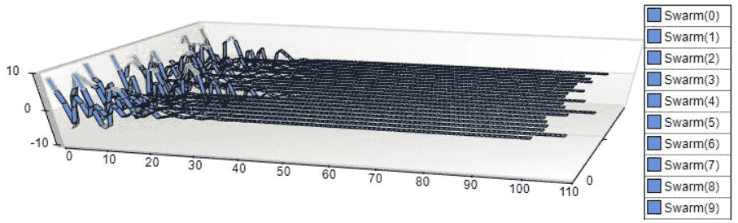
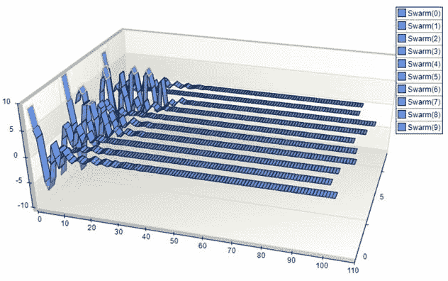

# 第十三章：函数优化：如何以及为什么

b 现在是我们享受乐趣的时候了。我们将开发一个非常强大、三维的应用程序，您在其他地方找不到这样的应用程序。此应用程序将允许您以二维和三维图形的方式可视化单个函数随时间优化。此应用程序的源代码位于本书源代码访问说明中。此应用程序将非常独特，因为我们将在创建一个令人难以置信的强大应用程序时使用开源和第三方控件。开源并不总是处理所有事情，对于那些对图形认真的您，我想让您接触到一些除了开源标准（如 ZedGraph、Microsoft Charting Controls 等）之外的控制。您将很快看到，这种差异令人震惊，值得这一趟旅程。您可以在以后决定是否要将任何内容改回完全开源。

我们还将向您展示如何使用粒子群优化来增强函数优化的可视化。通过这样做，您将看到群中的每个粒子如何收敛到最优解。

在本章中，我们将完成以下任务：

+   构建一个 Visual Studio WinForms 项目

+   创建一个函数优化测试器

+   实现用于可视化的图形控件

+   讨论在此项目中使用的各种第三方控件

+   了解可用的各种超参数

+   学习如何调整和调整超参数

+   学习调整超参数的影响

+   了解函数的目的

+   学习如何添加新函数

+   展示添加新函数并运行测试

# 技术要求

您需要具备使用 Microsoft Visual Studio 和 C# 进行 .NET 开发的基本知识。您需要从本书的网站上下载本章的代码。

查看以下视频以查看代码的实际应用：[`bit.ly/2ppBmvI`](http://bit.ly/2ppBmvI)。

# 入门

在我们开始之前，让我向您展示我们将要创建的产品。完成之后，您将拥有一个应用程序，允许您以图形方式查看函数在迭代过程中的最小化或最大化。这与典型的基于文本的系统表示相反，如下所示：


3D 绘图

如您所见，这是一个非常直观的应用程序。让我们继续将其分解为我们在进展过程中将引用的各个部分。

第一部分是三维图，位于我们的主页上。三维图可以提供更多关于群中每个粒子所走的路径以及群本身所走的路径的洞察。当粒子或群收敛到全局最小值时，也更容易看到。对于这个图，我们将使用令人难以置信的 Nevron 图表控件。您可以在[`www.nevron.com/products-open-vision-nov-chart-control-overview.aspx`](https://www.nevron.com/products-open-vision-nov-chart-control-overview.aspx)找到更多关于此图表控件的信息。主用户界面是用 DotNetBar 开发的。对于那些寻找具有所有功能，如面包屑栏、标签、网格、列表视图、图表、Sparklines 等不同用户界面的人来说，这比 Infragistics 或 DevExpress 是一个更棒且更经济的选择。您可以在[`www.devcomponents.com/dotnetbar/`](http://www.devcomponents.com/dotnetbar/)找到更多关于这个控件套件的信息。


主页

第二部分是二维图，位于我们的第四页，**图表**标签页。有些人也会称这种类型的图为意大利面图。它的任务是绘制群在二维平面上的位置。对于这个图，我们将使用 Microsoft 图表控件。如您所见，当尝试在二维表面上绘制时，此控件会变得非常繁忙。群中的粒子越多，您的图表就会越繁忙：


2D 可视化

第三部分是信息树，位于我们的第三页，**详情**标签页。此树包含每个迭代的详细信息。迭代总数是我们将要讨论的超参数之一。每个迭代将跟踪所有群粒子信息，如位置、速度、最佳位置和适应度，如下所示：


信息树

第四部分是函数超参数，位于我们的主页上。这些参数控制函数和函数优化，对于绘制二维和三维图是必不可少的。这些参数本身将在稍后的部分进行讨论：


参数

第五部分是绘图回放控件，也位于我们的主页底部，在超参数之下。除了运行主函数优化迭代循环外，它们还负责回放二维和三维图的功能优化图。您可以播放、暂停、倒退、快进和后退，如下所示：


运行控件

在了解细节之后，让我们继续讨论我们如何创建应用程序的确切方法。让我们开始享受乐趣吧！

# 函数的最小化和最大化

函数的最小化和最大化是寻找给定函数的最小值和最大值的过程。让我们简要地谈谈这个值。

如果值在一个给定的范围内，那么它被称为局部极值；如果它在函数的整个定义域内，那么它被称为全局极值。假设我们有一个函数 f，它定义在域 X 上。在 x* 处的极值，即 f(x*)，对于域 X 中的所有 x 都大于或等于 f(x)。相反，函数在 x* 处的全局最小值是 f(x*)，对于域 X 中的所有 x 都小于或等于 f(x)。

以更简单的方式，最大点也被称为最大值，最小点被称为最小值，函数。全局最大值或最小值是整个域空间（搜索空间）中的最高或最低函数值，局部最大值或最小值是在该搜索空间内定义的某个邻域中的最高或最低值（不允许位于边界上），如下所示：


全局和局部最优解

在这个简单的示意图中，*`D`* 是全局最小值，*`G`* 是全局最大值。*`A`*、*`C`* 和 *`E`* 是局部最大值（重要的是要注意，一个函数可以有一个以上的全局或局部最大值或最小值）。*`B`* 和 *`F`* 被认为是局部最小值。*`X`*、*`Y`* 和 *`Z`* 存在于最小值 *`F`* 附近，因为 *`Y`* 的值小于 *`X`* 和 *`Z`*：


3D 磁带图

让我们举一个真实的例子。假设我们使用函数 sin(x)。这个函数的最大值是 +1，最小值会是 -1。因此，我们有了全局最小值和最大值。sin(x) 可以取负无穷大到正无穷大之间的任何值，但在这个所有值中，最大值只能是 +1，最小值只能是 -1。

如果我们将搜索空间（全局域）限制在 0 到 90 之间（有时人们称之为区间），那么 sin(x) 现在的最小值将是 0，其值也将是 0。然而，现在的全局或最大值将是 90，其值是 1，因为我们限制了我们的搜索空间在 0 到 90 之间。sin(x) 的所有值都将位于 0 到 1 之间，在 0 到 90 的区间内。

# 什么是粒子？

我们将要处理的主要组成部分之一是所谓的 **粒子**——因此，粒子群优化。为了简要地提供一个关于什么是粒子的类比，让我们这样看。假设我们看到一群鸟在天空中飞翔。这群鸟中的每一只鸟都是一个粒子。我们看到一群鱼在水中游动。每条鱼都是一个粒子。我们撞倒了那个蜂巢，被数百只蜜蜂攻击。攻击我们的每一只蜜蜂，没错，都是一个粒子！

每个粒子都有适应度值，一旦通过要优化的适应度函数评估，就会告诉我们它在群体中的排名。此外，我们还有速度，这些速度指导每个粒子的飞行。粒子，就像鸟儿一样，通过跟随*最优*粒子（鸟群中的领导者）在我们的问题空间中飞行。

现在我们已经确切地知道了一个粒子是什么，我们如何用计算术语来描述它？我们将定义如下结构：

```py
/// <summary> A particle. </summary>
public struct Particle
{
/// <summary> The position of the particle. </summary>
public double[] Position;
/// <summary> The speed of the particle. </summary>
public double[] Speed;
/// <summary> The fitness value of the particle. </summary>
public double FitnessValue;
/// <summary> The best position of the particle. </summary>
public double[] BestPosition;
/// <summary> The best fitness value of the particle. </summary>
public double BestFitnessValue;
}
```

在此基础上，让我们继续创建我们的项目。你应该已经安装并打开了 Microsoft Visual Studio。如果你还没有安装 Microsoft Visual Studio，你可以从 Microsoft 网站安装免费的社区版。一旦完成，打开 Microsoft Visual Studio 并创建一个如图所示的 Windows 表单项目。在我们的例子中，我们使用的是.NET 版本 4.7.1。你可以自由使用你有的任何版本，但需要至少是 4.5.2 或更高版本：


新项目窗口

接下来，让我提一下，我们的用户界面是用一个名为**DotNetBar**的第三方产品创建的。这是一个出色的轻量级用户界面库。它可以在以下位置找到：[`www.devcomponents.com/dotnetbar/`](http://www.devcomponents.com/dotnetbar/)。我们现在可以开始专注于我们项目的公式化。我们需要初始化我们程序的一些通用区域，例如群体、图表和状态。](http://www.devcomponents.com/dotnetbar/)

# 群体初始化

首先，我们需要初始化我们的群体以及与之相关的所有变量和属性。

为了开始这个过程，让我们创建一个名为`GlobalBest`的粒子（我在整本书中会将其称为`gbest`），并将其最佳适应度值初始化为正无穷或负无穷，具体取决于用户是否选择了`最小化`或`最大化`策略。我们这样做：

```py
GlobalBest.BestFitnessValue = PSO_Type == PSOType.Minimization ? double.PositiveInfinity : double.NegativeInfinity;
```

接下来，我们将确定用户想要的群体大小，然后初始化群体中的所有粒子。每个粒子将需要初始化几个属性。它们是：

位置：

```py
Swarm[i].Position = Swarm_Random(lb_domXi, ub_domXi, dimSize);
```

速度：

```py
Swarm[i].Speed = Swarm_Random(lb_domXi, ub_domXi, dimSize);
```

适应度值：

```py
Swarm[i].FitnessValue = PSO_Round(Fitness(Swarm[i].Position));
```

最佳适应度值：

```py
Swarm[i].BestFitnessValue = Swarm[i].FitnessValue;
```

最佳位置：

```py
Swarm[i].BestPosition = (double[])Swarm[i].Position.Clone();
```

完成这些后，我们需要检查个体粒子的最佳适应度值（`pbest`）是否优于全局粒子（团队）的适应度值（`gbest`）。如果是这样，我们将更新全局粒子到那个最佳位置和适应度值，其他粒子将跟随它。我们这样做：

```py
if (IsBetterPosition(Swarm[i].BestFitnessValue, GlobalBest.BestFitnessValue, PSO_Type))
{
GlobalBest.BestPosition = (double[])Swarm[i].Position.Clone();
GlobalBest.BestFitnessValue = Swarm[i].BestFitnessValue;
}
```

接下来，我们将填充群体和全局图矩阵，如下所示：

```py
FillPlotSwarmPosition(0, i, Swarm[i].Position);
FillPlotGlobalPosition(0, GlobalBest.BestPosition);
```

一旦完成，我们将使用与群相关的所有详细信息更新我们的信息树。为此，我们需要遍历整个群并记录我们的信息以供显示。由于我们使用的是 Windows 树控件，我们将每个群粒子作为单独的节点绘制，标识为 `PSODisplayType.Swarm`。每个节点下的信息将由标识符 `PSODisplayType.SwarmPosition` 指示。我们是这样完成的：

```py
DisplayResult(PSODispType.GlobalBest, "Iter : 0 " + GlobalBest.BestFitnessValue + " :: " + sResult(GlobalBest.BestPosition));
for (int i = 0; i < SwarmSize; i++)
{
DisplayResult(PSODispType.Swarm, "Swarm [" + i + "] : " + Swarm[i].FitnessValue);
DisplayResult(PSODispType.SwarmPosition, "Position : " + sResult(Swarm[i].Position));
DisplayResult(PSODispType.SwarmPosition, "Speed : " + sResult(Swarm[i].Speed));
DisplayResult(PSODispType.SwarmPosition, "Best Pos : " + sResult(Swarm[i].BestPosition));
}
```

# 图表初始化

在我们的应用程序中，我们将简称为工作台，我们正在处理两个图表。第一个图表是三维的，第二个是二维的。每个图表都反映了相同的数据，尽管是从不同的角度。在我们的图表初始化函数中，我们将同时初始化两个图表。

+   `chartPSO` 是我们二维 Microsoft Chart 控件图表的名称

+   `nChartControl2` 是我们三维 Nevron 图表的名称

为什么不使用相同的控件进行两种可视化呢？这当然可能是一个案例，但这样你可以，读者，接触到两种不同类型的控件，并决定你更喜欢哪一种。

我们将要做的第一件事是创建一个名为 `_MarkerStyle` 的随机变量。每个粒子在二维图中将具有不同的标记样式，我们将使用这个随机变量来控制样式的正确创建，如下所示：

```py
FastRandom _MarkerStyle = new FastRandom();
```

接下来，在我们的待办事项列表中，我们需要清除两个控件中的系列数据，以防有数据残留。我们使用以下两行代码来完成此操作。记住，`chartPSO` 是我们的二维图表，而 `nChartControl2` 是我们的三维图表控件：

```py
chartPSO?.Series?.Clear();
nChartControl2?.Charts?[0]?.Series?.Clear();
```

为了从我们的三维控制中获得最佳的可视化效果，我们需要确保它适合整个图表区域。我们通过设置边界模式如下来实现：

```py
nChartControl2.Charts[0].BoundsMode = BoundsMode.Stretch;
```

现在，我们需要确保群中的每个粒子在两个图表中都有一个表示区域。我们通过迭代群的大小并正确设置每个变量来实现这一点。我们首先添加二维图表配置：

```py
for (int i = 0; i < maxSwarm; i++)
{
chartPSO?.Series?.Add("Swarm(" + i + ")");
chartPSO.Series[i].ChartType = SeriesChartType.Spline;
chartPSO.Series[i].MarkerStyle = (MarkerStyle)_MarkerStyle.Next(1, 10);
chartPSO.Series[i].MarkerSize = 10;
```

然后是三维图表配置，如下所示：

```py
for (int i = 0; i < maxSwarm; i++)
{
NLineSeries m_Line1 = (NLineSeries)nChartControl2.Charts[0].Series.Add(SeriesType.Line);
m_Line1.MultiLineMode = MultiLineMode.Series;
m_Line1.LineSegmentShape = LineSegmentShape.Tape;
m_Line1.DataLabelStyle.Visible = false;
m_Line1.DepthPercent = 50;
m_Line1.Name = "Swarm(" + i + ")";
```

接下来，让我们按照以下方式设置二维图表的最终变量：

```py
chartPSO?.Series?.Add("GlobalPosition");
chartPSO.Series[maxSwarm].ChartType = SeriesChartType.Point;
chartPSO.Series[maxSwarm].MarkerStyle = MarkerStyle.Diamond;
chartPSO.Series[maxSwarm].Color = Color.Black;
chartPSO.Series[maxSwarm].MarkerSize = 20;
```

最后，为了使我们的三维图表在使用时具有最大的灵活性，我们需要添加以下工具栏：

```py
nChartControl2.Controller?.Tools?.Add(new NTrackballTool());
nChartControl2.Controller?.Tools?.Add(new NZoomTool());
nChartControl2.Controller?.Tools?.Add(new NOffsetTool());
nChartControl2.Controller?.Tools?.Add(new NAxisScrollTool());
NPanelSelectorTool selector = new NPanelSelectorTool();
selector.Focus = true;
nChartControl2.Controller.Tools.Add(selector);
nChartControl2.Controller.Tools.Add(new NDataZoomTool());
```

# 状态初始化

群和图表创建并初始化后，我们现在专注于初始化应用程序本身的状态。这意味着我们将收集所有用户定义的值并使用它们来初始化超参数本身。我们将在关于超参数的章节中详细探讨每个参数，但就目前而言，你只需要知道它们存在。让我们就它们与状态初始化的关系逐一讨论。

首先，我们将确定我们将用于初始化函数优化的策略。我们将把这个选择存储在一个标记为`PSO_Type`的变量中。我们的两种策略选择是`最小化`和`最大化`。我们是这样确定类型的：

```py
switch (combType.SelectedIndex)
{
case 0:
PSO_Type = PSOType.Minimization;
break;
case 1:
PSO_Type = PSOType.Maximization;
break;
}
```

接下来，我们将初始化维度数量、上限和下限以及速度限制：

```py
dimSize = Convert.ToInt32(txtdimSize.Text);
ub_domXi = Convert.ToDouble(txtUBXi.Text);
lb_domXi = Convert.ToDouble(txtLBXi.Text);
ub_SpeedXi = Convert.ToDouble(txtUbSpeedXi.Text);
lb_SpeedXi = Convert.ToDouble(txtLbSpeedXi.Text);
decP = Convert.ToInt32(txtdecP.Text);
```

我们继续初始化惯性、认知和社会智能权重：

```py
maxIter = Convert.ToInt32(txtmaxIter.Text);
Intertia = Convert.ToDouble(txtW.Text);
CognitiveWeight = Convert.ToDouble(txtC1.Text);
SocialWeight = Convert.ToDouble(txtC2.Text);
wMira = Convert.ToDouble(txtwMira.Text);
```

我们最重要的超参数之一与我们的群体及其种群大小有关——群体中将有多少个粒子。记住，尽管我们在源代码本身中没有放置边界检查，但这个值理想情况下应该在 5 到 40 之间。我通常使用 5 作为开始测试的值。我们通过查看用户输入的值来确定群体大小，如下所示：

```py
SwarmSize = Convert.ToInt32(txtSwarmSize.Text);
Swarm = new Particle[SwarmSize];
```

最后，我们初始化全局变量以跟踪群体的最大效率：

```py
PlotSwarm = new double[maxIter, SwarmSize, 2];
PlotGlobal = new double[maxIter, 2];
```

# 控制随机性

随着初始化过程的继续，位置、速度和适应度在群体初始化部分被初始化。以下是我们如何进行随机化的简要概述。我们从每个超参数开始，然后在我们超参数中指定的上限和下限之间随机化值：

```py
public double[] Swarm_Random(double a, double b, int n)
{
double[] x = new double[n];
for (int i = 0; i < n; i++)
{
x[i] = Swarm_Random(a, b);
}
return x;
}
public double Swarm_Round(double x) => decP != -1 ? Math.Round(x, decP) : x;
public double Swarm_Random() => Swarm_Round(Randd.NextDouble());
public double Swarm_Random(double a, double b)
{
Return (a + (b - a) * Swarm_Random());
}
```

# 更新群体位置

群体位置是群体相对于全局最优解（在这种情况下，隐藏的宝藏）的当前位置。它被限制在上限和下限域界限内，如下所示。但记住，这两个是在同一面板中输入的超参数！：

```py
private double UpdateSwarmPosition(double Pos, double Speed)
{
double OutPos = Pos + Speed;
return Math.Max(Math.Min(OutPos, upperBoundDomain), lowerBoundDomain);
}
```

# 更新群体速度

群体速度是指整个群体朝向全局最优解（即隐藏的宝藏）前进的速度。它首先根据以下公式计算得出，然后被限制在上限和下限速度超参数值内。正如你所见，我们还应用了各种权重和随机化值来计算和调整速度，如下所示：

```py
// Update Swarm Speed
Swarm[i].Speed[j] = Inertia * Swarm[i].Speed[j] + CognitiveWeight * Swarm_Random() * (Swarm[i].BestPosition[j] - Swarm[i].Position[j]) + SocialWeight * Swarm_Random() * (GlobalBest.BestPosition[j] - Swarm[i].Position[j]);
// Bound Speed
Swarm[i].Speed[j] = UpdateSwarmSpeed(Swarm[i].Speed[j]);
private double UpdateSwarmSpeed(double Speed)
{
return Math.Max(Math.Min(Speed, upperBoundSpeed), lowerBoundSpeed);
}
```

# 主程序初始化

当主窗体首次加载时，这是我们的主要初始化过程开始的时候。让我们来分析这个方法，并讨论到底发生了什么。在这个方法中，我们关注的是三维图表的初始化。

首先，我们为图表建立一些通用参数：

```py
// setup chart general parameters
NChart m_Chart = nChartControl2.Charts[0];
m_Chart.Enable3D = true;
m_Chart.Width = 60;
m_Chart.Height = 25;
m_Chart.Depth = 45;
m_Chart.Projection.Type = ProjectionType.Perspective;
m_Chart.Projection.Elevation = 28;
m_Chart.Projection.Rotation = -17;
m_Chart.LightModel.SetPredefinedLightModel(PredefinedLightModel.GlitterLeft);
```

接下来，我们处理显示背左墙上的交错条纹：

```py
// add interlaced stripe to the Y axis
NScaleStripStyle stripStyle = new NScaleStripStyle(new NColorFillStyle(Color.Beige), null, true, 0, 0, 1, 1);
stripStyle.SetShowAtWall(ChartWallType.Back, true);
stripStyle.SetShowAtWall(ChartWallType.Left, true);
stripStyle.Interlaced = true;
((NStandardScaleConfigurator)m_Chart.Axis(StandardAxis.PrimaryY).ScaleConfigurator).StripStyles.Add(stripStyle);
```

最后，我们处理显示`x`轴网格线，如下所示：

```py
// show the X axis gridlines
NOrdinalScaleConfigurator ordinalScale = m_Chart.Axis(StandardAxis.PrimaryX).ScaleConfigurator as NOrdinalScaleConfigurator;
ordinalScale.MajorGridStyle.SetShowAtWall(ChartWallType.Back, true);
ordinalScale.MajorGridStyle.SetShowAtWall(ChartWallType.Floor, true);
```

# 运行粒子群优化

在我们的主要函数就位并且从我们的超参数中初始化了一切之后，我们现在可以专注于能够运行高级函数。我们 PSO 函数中的一个函数是`PSORun`方法。当用户点击**运行**按钮时，这个方法会被执行。现在让我们来分析这个高级函数。

我们首先通过调用我们的`InitState`函数来初始化我们的状态：

```py
InitState();
```

在此之后，我们将清除我们的信息树，创建一个新的计时器，用于计时我们的函数，然后运行我们的`Swarm_Run`方法。这将在幕后执行实际的功能优化，这通常只需要毫秒，具体取决于群体大小、迭代次数和维度：

```py
advTree1.Nodes.Clear();
SW = new Stopwatch();
SW.Start();
Swarm_Run();
SW.Stop();
```

接下来，我们创建负责跟踪整个群体全局和个体位置的变量：

```py
plotSwarmPositions = (double[,,])PlotSwarm.Clone();
plotGlobalPositions = (double[,])PlotGlobal.Clone();
maxIter = plotSwarmPositions.GetLength(0);
maxSwarm = plotSwarmPositions.GetLength(1);
```

最后，我们初始化我们的图表，以较慢的速度回放群体的绘图，以便最终用户可以看到发生了什么。我们通过以下三种方法的调用来完成此操作：

```py
InitChart();
InitializeMeshSurfaceChart();
PlaybackPlot();
```

# 我们的用户界面

当我们最初启动我们的应用程序时，我们有一个典型的空白石板。初始化后，我们已经完成了以下项目。请注意，数字与显示屏幕的截图相关，如下所示：

+   我们的参数初始化为默认值

+   我们的三维图表初始化为默认值，没有系列数据：


空白 3D 图表

# 运行按钮

运行按钮根据所选函数和策略执行粒子群优化器：


# 快退按钮

快退按钮将 PSO 图完全倒退到开始位置：


# 后退按钮

后退按钮在粒子群优化测试运行中向后迈出一步：


# 播放按钮

播放按钮从头开始回放粒子群优化运行：


# 暂停按钮

暂停按钮暂停粒子群优化运行的回放：


# 前进按钮

前进按钮在粒子群优化测试运行中向前迈出一步：


# 超参数和调整

超参数通常用于调整各种机器学习函数的参数。在我们的应用程序中也是如此。

在我们应用程序的前端屏幕上，以下是我们超参数面板的外观。我们将详细讨论每个超参数：


参数

# 函数

这是一个所有可用优化函数的列表。只需选择您想使用的函数，设置策略和其他参数，然后点击**运行**按钮。请参阅函数优化参考，以获取有关每个函数的更详细信息。在撰写本文时，有超过 50 种不同的函数可用，我们将在后面的章节中介绍如何添加您自己的函数，如下所示：


函数

# 策略

可以将两种策略应用于函数优化。您可以选择最大化或最小化函数优化，如下所示：


我们这里所说的“最大化”或“最小化”一个函数，指的是该函数的最小值或最大值可能是什么。这通常是在全局范围或局部范围内进行讨论的。

全局范围意味着我们想要确定函数在整个定义域上的最小值或最大值。这通常被称为函数的定义域。

另一方面，局部范围意味着我们想要确定函数在给定局部范围内的最小值或最大值，这将是全局范围的一个子集。

# Dim size

维度大小在主循环（最内层循环）中用于处理所选函数的优化。默认值为 2：


相关代码如下：

```py
// Main Loop
for (int iter = 1; iter < maxIter; iter++)
{
for (int i = 0; i < SwarmSize; i++)
{
for (int j = 0; j < dimSize; j++)
```

# 上限

上限是群必须遵守的约束的上限。这用于更新群的位置并在范围内进行缩放。默认值为 10：


请注意，根据你正在优化的函数，上限和下限可能与默认值有很大不同。请参考你函数的参考指南，看看上限和下限约束是什么：

```py
return Math.Max(Math.Min(OutPos, upperBoundDomain), lowerBoundDomain);
```

上限 = 10：


3D 图

上限 = 20：


3D 图

# 下限

这是群必须遵守的约束的下限。这用于更新群的位置并在范围内进行缩放。默认值为 -10：


相关代码如下：

```py
return Math.Max(Math.Min(OutPos, upperBoundDomain), lowerBoundDomain);
```

# 上限速度

上限速度用于帮助确定群速度。默认值为 10：


代码如下：

```py
return Math.Max(Math.Min(Speed, upperBoundSpeed), lowerBoundSpeed);
```

上限速度 = 10：


3D 图

上限速度 = 20：


3D 图

# 下限速度

下限速度用于帮助确定群速度。默认值为 **-10**：


代码如下：

```py
return Math.Max(Math.Min(Speed, upperBoundSpeed), lowerBoundSpeed);
```

# 小数位数

这是四舍五入时发生的总小数位数。默认值为 5：


代码如下：

```py
public double Swarm_Round(double x) => decimalPlaces != -1 ? Math.Round(x, decimalPlaces)
```

# 群体大小

群体总大小。这等于可用于优化的总粒子数。关于这里应该使用多少的理论有很多。记住，正如我们之前所说的，没有免费的午餐！一般来说，20-40 似乎是最广泛接受的值。默认值为 20：


代码如下：

```py
for (int i = 0; i < SwarmSize; i++)
```

群体大小 = 10：



3D 图

群体大小 = 3:


3D 图

# 最大迭代次数

用于测试的总迭代次数。默认值为 100：


代码如下：

```py
for (int iter = 1; iter < maxIter; iter++)
```

最大迭代次数 = 100:


3D 图

最大迭代次数 = 25:


3D 图

# 惯性

惯性权重最初被引入以平衡全局和局部搜索能力之间的优化。在我们的情况下，惯性乘以惯性权重以调整群体速度。通常，这个变量的接受值范围在 0.4 到 1 之间。默认值为 0.729：


代码如下：

```py
Swarm[i].Speed[j] = Inertia * Swarm[i].Speed[j]
```

惯性 = 0.729:


3D 图

惯性 = 0.4:


3D 图

# 社会权重

社会权重用于调整群体速度。它是决定粒子将跟随群体最佳解的程度的一个因素。**1.49445**是默认值：


代码如下：

```py
// Update Swarm Speed
Swarm[i].Speed[j] = Intertia * Swarm[i].Speed[j]+ CognitiveWeight * Swarm_Random() * (Swarm[i].BestPosition[j] - Swarm[i].Position[j])+ SocialWeight * Swarm_Random() * (GlobalBest.BestPosition[j] - Swarm[i].Position[j]);
```

社会权重 = 1.49445:


3D 图

社会权重 = 1.19445:


3D 图

# 认知权重

认知权重也用于调整群体速度。它是决定粒子将跟随其自身最佳解的程度的一个因素。**1.49445**是默认值：


代码如下：

```py
// Update Swarm Speed
Swarm[i].Speed[j] = Intertia * Swarm[i].Speed[j] + CognitiveWeight * Swarm_Random() * (Swarm[i].BestPosition[j] - Swarm[i].Position[j])+ SocialWeight * Swarm_Random() * (GlobalBest.BestPosition[j] - Swarm[i].Position[j]);
```

认知权重 = 1.49445:


3D 图

认知权重 = 1.19445:


3D 图

# 惯性权重

惯性权重在每次函数优化迭代中乘以惯性。**0.99**是默认值：


代码如下：

```py
Inertia *= InertiaWeight;
```

惯性权重 = 0.99:


3D 图

惯性权重 = 0.75:


3D 图

# 理解可视化

在本节中，我们将介绍您将在我们的程序中看到的一些众多内容。这包括二维和三维图。

# 理解二维可视化

对于我们的应用，我们需要解释几个二维可视化。首先是函数优化的二维图，无论是最大化还是最小化。这个可视化如下所示。记住，为此我们使用的是 Microsoft Chart 控件，它可以从以下链接获取：[`www.microsoft.com/en-us/download/details.aspx?id=14422`](https://www.microsoft.com/en-us/download/details.aspx?id=14422):


2D 可视化

对于我们正在绘制的每个粒子（最多 10 个），我们将使用不同的标记样式。标记就是您在前面的图中看到的菱形、圆形、x 等。我们还将根据每个粒子使用不同的颜色来旋转颜色。如果您没有用彩色查看这本书，您可能会有灰度的阴影。

您在前面的图中看到的线条（或者，更准确地说，您在上面看到的样条曲线）是群中每个粒子的轨迹。全局最优值（gbest）是图表区域中间的黑钻石。如您所见，我们始终保持在超参数的界限内。

# 理解三维可视化

在我看来，三维视图最容易解释，也是最直观的，尤其是如果它是您将展示给别人的模型验证包的一部分。您可以在下面的图中轻松地看到每个粒子何时（如果到达）到达全局最优。结果是 0 轴上的一条或多条线段表示的平坦线：


3D 可视化

有几个工具栏可用于处理三维视图，其中包括旋转选项、放置选项、颜色选项等：


您可以使用**Trackball**旋转图表，从几乎任何方向查看视图：


只需选择 Trackball，然后选择图表，点击左鼠标按钮并像这样拖动图表到您的新视图：


旋转视图

您可以通过更改**预定义光模型**来更改图表的照明：


预定义光模型

您可以选择以下任何预定义的模型：


预定义的光模型

深度和宽度控件允许您更改图表上的两个维度以满足您的需求：


简单点击您想要的按钮，并继续点击以应用变换，如下所示：


变换

**微调**允许您对图表区域和位置进行细微调整。您可以通过简单地点击所需的按钮，向上、向下、向左或向右**微调**，以及这些组合中的任何一种，如下所示：


在主工具栏中，您可以打开、保存和打印图表，如果您需要基于测试的图像来制作报告，这是一个非常有用的功能。您还可以使用图表编辑器和图表向导，如下所示：


简单选择您想要的按钮，在这种情况下是**显示图表向导**，向导对话框将出现：


图表向导

你也可以使用 3D 按钮在二维和三维视图之间切换同一图表。

二维视图：


2D 视图

这可以通过单击单个按钮变为 3D：


3D 视图

# 绘制结果

以下部分详细说明了一旦获得结果，我们的信息是如何显示的。

# 播放结果

一旦群体优化完成，播放结果的工作就变得突出。我们在重新播放图表中的主要函数称为 `PlaybackPlot`。让我们详细讨论这个函数：

```py
private void PlaybackPlot()
{
```

获取我们的当前迭代，如下所示：

```py
int iterN = GetCurrentIteration();
_Closing = false;
```

如果我们已经播放了所有点，那么就离开，如下所示：

```py
if (iterN >= maxIter)
return;
PlotStatusN = PlotStatus.Play;
```

更新进度条，如下所示：

```py
progressBarX1.Visible = true;
progressBarX1.Minimum = 0;
progressBarX1.Maximum = maxIter;
```

遍历所有迭代，如下所示：

```py
for (int iter = iterN; iter < maxIter; iter++)
{
```

更新进度条值，如下所示：

```py
progressBarX1.Value = iter;
if (_Closing)
{
_Closing = false;
progressBarX1.Visible = false;
return;
}
```

绘制单个群体迭代点，如下所示：

```py
PlotSwarmIterationPoint();
```

简单暂停以允许 UI 保持响应，如下所示：

```py
PauseForMilliSeconds(1);
ShowTitle();
}
PlotStatusN = PlotStatus.Pause;
progressBarX1.Visible = false;
}
```

你会在前面的函数中注意到对 `PlotSwarmIterationPoint` 的调用。这个函数调用（或者如果你更喜欢，方法）负责绘制粒子的单个运动。一步，如果可以这样说的話。让我们带你了解这个函数，并描述正在发生的事情，如下所示：

```py
private void PlotSwarmIterationPoint()
{
```

如果我们已经达到最终迭代，那么就离开，如下所示：

```py
intiterN = GetCurrentIteration();
if (iterN >= maxIter)
return;
NChart chart = nChartControl2.Charts[0];
chart.Axis(StandardAxis.PrimaryX).ScaleConfigurator = new NLinearScaleConfigurator();
```

我们需要为群体中的每个粒子绘制一个单独的点，如下所示：

```py
for (int Swarm = 0; Swarm < maxSwarm; Swarm++)
{
```

为每个点添加一个序列，如下所示：

```py
chartPSO.Series[Swarm].Points.AddXY(plotSwarmPositions[iterN, Swarm, 0], plotSwarmPositions[iterN, Swarm, 1]);
```

为我们刚刚创建的序列添加一个数据点，如下所示：

```py
NLineSeries m_Line1 = (NLineSeries)nChartControl2.Charts[0].Series[Swarm];
m_Line1.AddDataPoint(new NDataPoint(plotSwarmPositions[iterN, Swarm, 0], plotSwarmPositions[iterN, Swarm, 1]));
```

根据每个粒子所在的范围值动态处理颜色，如下所示：

```py
ApplyLineColorRanges(new NRange1DD[] { new NRange1DD(-10, -5), new NRange1DD(5, 10) },
new Color[] { Color.Red, Color.Yellow }, m_Line1);
}
```

现在，添加一个表示最优全局位置的点，如下所示：

```py
chartPSO.Series[maxSwarm].Points.Clear();
chartPSO.Series[maxSwarm].Points.AddXY(plotGlobalPositions[iterN, 0], plotGlobalPositions[iterN, 1]);
```

获取下一个迭代，绘制控件，并显示正在发生的事情的文本：

```py
iterN = Math.Min(iterN + 1, maxIter - 1);
nChartControl2.Refresh();
pictureBox1.Invalidate();
ShowTitle();
}
```

# 更新信息树

信息树位于我们用户界面的**详细信息**标签页上。它包含了信息树视图控件。根据 `PSODispType`，我们将创建一个新的节点或使用之前创建的节点来写入我们的文本：

```py
private void DisplayResult(PSODispType DispType, string Text)
{
switch (DispType)
{
```

在树中创建一个新的节点。这是树中粒子的最高级别，代表找到的全局最佳值，如下所示：

```py
case PSODispType.GlobalBest:
Node n1 = new Node();
n1.Text = Text;
lastNode = advTree1.Nodes.Add(n1);
break;
```

向前面的节点添加详细信息。这是一个群体中的单个粒子，其子详细信息将在我们的下一个函数中绘制，如下所示：

```py
case PSODispType.Swarm:
Node n2 = new Node();
n2.Text = Text;
advTree1?.Nodes?[lastNode]?.Nodes?.Add(n2);
break;
```

向前面的节点添加详细信息。这些是粒子的确切详细信息，并形成群体中该粒子的底层节点，如下所示：

```py
case PSODispType.SwarmPosition:
Node n = new Node();
n.Text = Text;
advTree1?.Nodes?[lastNode]?.Nodes?.Add(n);
break;
}
}

```

就这样。我们现在有一个完全填充的信息树！

# 添加新的优化函数

我们视觉测试工作台的一个美妙之处在于，我们可以轻松地添加新的优化函数进行测试。

# 函数的目的

一些问题是通过质量与正确或错误来评估的。这类问题被称为优化问题，因为目标是识别最优值。函数（有时称为成本函数、目标函数、误差函数等）通过将 n 维实值项映射到一维实值项来实现这一目标（有些人可能更喜欢使用“空间”而不是“项”，因为它与我们讨论过的总搜索空间更接近）。

我们将处理两种类型的函数。它们是：

+   **最小化**：寻找具有最小值的解决方案

+   **最大化**：寻找具有最大值的解决方案

并非总是能够找到最小值或最大值，有时我们必须满足于一个我们认为足够好的值，以实现我们的目标。

# 添加新功能

添加新功能是一个非常简单的流程，只需遵循几个步骤。这些步骤是：

1.  根据以下签名创建一个新函数

1.  将新函数名称添加到`GetFitnessValue`函数中

1.  将新函数名称添加到用户界面

让我们逐一介绍这些步骤。首先，我们将处理函数签名本身。函数签名如下：

```py
Public double xxxxxx(double[] data)
{
}
```

在这里，xxxxxx 是将在 UI 中显示的函数名称，正如您在以下内容中可以看到的：


优化函数窗口

在此之后，你必须更新`GetFitnessValue`函数，使其知道如何将用户界面上的显示内容与实际函数相关联。以下是一个该函数的示例。我们将在“让我们添加一个新函数”部分中填写这些信息：

```py
internal double GetFitnessValue(double x, double y)
{
double[] data = new double[2];
data[0] = x;
data[1] = y;
```

`fitnessFunction`文本是用户界面中显示的内容：

```py
if (fitnessFunction == "Sphere")
return Swarm_Round(SphereFunction(data));
else if (fitnessFunction == "FitnessTest")
return Swarm_Round(FitnessTestFunction(data));
else if (fitnessFunction == "MSphere")
return Swarm_Round(MSphereFunction(data));
}
```

# 让我们添加一个新函数

现在是我们展示如何添加新函数的时候了。我们将处理的函数是原始`Levy`函数的修改版，是已知存在的第 13 版。这是一个最小化函数。

函数本身，您可以在可视化工作台源代码中找到，看起来如下：

```py
public double LevyFunction13(double[] data)
{
double x1 = data[0];
double x2 = data[1];
double term1 = Math.Pow(Math.Sin(3 * Math.PI * x1), 2);
double term2 = Math.Pow((x1 - 1), 2) * (1 + (Math.Pow(Math.Sin(3 * Math.PI * x2),
2)));
double term3 = Math.Pow((x2 - 1), 2) * (1 + (Math.Pow(Math.Sin(2 * Math.PI * x2), 2)));
return term1 + term2 + term3;
}
```

当然，这里有很多数学知识，对吧？很多时候，这样的函数会在使数学更容易查看的编辑器中创建。例如，如果我要用数学方式表示这段代码，它看起来会是这样：

```py
f(x,y)=sin2(3πx)+(x−1)2(1+sin2(3πy))+(y−1)2(1+sin2(2πy))
```

如果我们用 MATLAB 之类的工具来绘制这个图表，它看起来会是这样：


我们在 MATLAB 中的视角

为什么我要说和展示所有那些内容呢？因为，当你使用这个工具来验证你的测试时，你需要能够传达，有时还需要为他人辩护，这些信息。毫无疑问，仅仅展示 C#代码是不够的，数学和可视化在很多情况下是其他人期望看到的。不要因此而气馁；你会看到创建这些函数是多么容易，我们的应用程序使得生成所需的信息变得非常简单。

让我们回到正轨，继续添加那个函数。

一旦我们添加了我们的新函数，现在我们需要将其添加到`GetFitnessValue`函数中，以便用户界面中选择的选项可以与我们特定的函数相关联：

```py
else if (fitnessFunction == "Shubert")
return Swarm_Round(ShubertFunction(data));
else if (fitnessFunction == "Levy13")
return Swarm_Round(LevyFunction13(data));
```

一旦完成这个步骤，我们需要将其添加到用户界面的下拉函数列表框中。只需在用户界面上选择组合框，转到“Items”属性，然后点击按钮：


接下来，简单地添加你想要显示的文本，如下所示：


字符串收集编辑器

一旦完成这个步骤，构建项目，运行它，你应该会看到函数在下拉列表中显示：


新函数

在你选择了 Levy13 函数后，点击**运行**按钮， voilà，你已经成功添加了一个新函数并测试了它的执行。你可以查看二维和三维图来验证你的成功。在你达到最大迭代次数（在本例中为 100）之前，你应该已经达到了全局最优解 0（三维图右侧的平坦带状区域）：



3D 视图

# 摘要

在本章中，我们讨论了函数，它们是什么，以及为什么我们使用它们。我们开发了一个非常强大且灵活的应用程序来测试函数优化。我们还展示了添加新函数的完整过程以及添加后如何运行它。你现在可以自由地添加你喜欢的任何新函数；只需遵循此处概述的过程，你应该不会有任何问题。

在下一章中，我们将学习如何用粒子群优化算法替换反向传播，所以请系好你的帽子！
