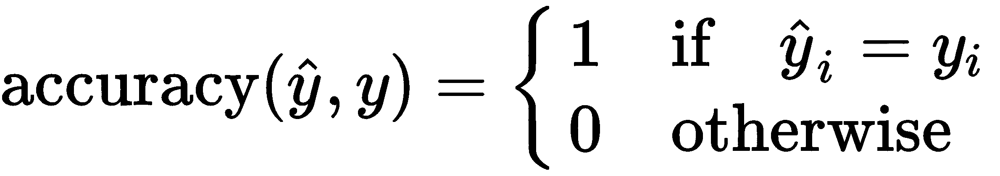

# 第一章：什么是机器学习？

**机器学习**（**ML**）是人工智能的一个分支，在这个领域，我们定义算法，目的是学习一个模型，该模型描述并提取数据中的有意义信息。

机器学习的激动人心的应用可以在许多领域找到，比如工业环境中的预测性维护、医学应用的图像分析、金融领域的时间序列预测、面部检测和身份识别用于安全目的、自动驾驶、文本理解、语音识别、推荐系统，以及机器学习的许多其他应用，这些应用无数，我们可能每天都在使用它们，甚至都没意识到！

想想你智能手机上的相机应用程序——当你打开应用并将相机对准一个人时，你会看到一个框框围绕着这个人的脸部。这是怎么做到的呢？对于计算机来说，一张图像只是一组三层叠加的矩阵。一个算法如何检测到这些像素的某个特定子集代表了人脸？

相机应用程序使用的算法（也称为**模型**）很可能已经经过训练，可以检测到这种模式。这项任务被称为人脸检测。这个人脸检测任务可以通过机器学习算法解决，这些算法可以归类为广泛的监督学习类别。

机器学习任务通常分为三大类，我们将在以下部分中分析这三类：

+   监督学习

+   无监督学习

+   半监督学习

每个类别都有其独特性和算法集，但它们都有一个共同的目标：从数据中学习。从数据中学习是每个机器学习算法的目标，特别是学习一个未知的函数，这个函数将数据映射到（预期的）响应上。

数据集可能是整个机器学习管道中最关键的部分；其质量、结构和大小是深度学习算法成功的关键，我们将在接下来的章节中看到这一点。

例如，上述的人脸检测任务可以通过训练一个模型来解决，让它查看成千上万的标注示例，以便算法学习到特定输入对应我们所称之为人脸的东西。

相同的算法在不同的人脸数据集上训练时，可能会表现出不同的性能，而我们拥有的高质量数据越多，算法的表现就会越好。

在本章中，我们将涵盖以下主题：

+   数据集的重要性

+   监督学习

+   无监督学习

+   半监督学习

# 数据集的重要性

由于数据集的概念在机器学习（ML）中至关重要，我们将详细探讨这一概念，重点介绍如何为构建完整且正确的机器学习管道创建所需的数据集划分。

**数据集**不过是数据的集合。正式来说，我们可以将数据集描述为一组对， ![]，其中 ![] 是第 *i* 个示例，![] 是其标签，且具有有限的基数 ![]：

一个数据集包含有限数量的元素，我们的机器学习算法会多次遍历这个数据集，试图理解数据结构，直到它解决所要求的任务。正如在第二章《神经网络与深度学习》中所示，一些算法会一次性考虑所有数据，而其他算法则会在每次训练迭代时，逐步查看数据的一个小子集。

一个典型的监督学习任务是对数据集进行分类。我们在数据上训练一个模型，使其学会将从示例 ![]（或该示例本身 ![]）中提取的一组特征与标签 ![] 对应起来。

在你踏入机器学习世界的初期，就有必要熟悉数据集、数据集拆分和训练轮次的概念，这样当我们在后续章节中讨论这些概念时，你就已经非常熟悉了。

现在，你已经在非常高的层次上了解了数据集是什么。但让我们深入探讨数据集拆分的基本概念。一个数据集包含了你所有可用的数据。正如我们之前提到的，机器学习算法需要多次遍历数据集并查看数据，以便学习如何解决任务（例如分类任务）。

如果我们使用相同的数据集来训练和测试我们的算法性能，那么如何确保算法即使在未见过的数据上也能表现良好呢？嗯，我们无法做到这一点。

最常见的做法是将数据集划分为三个部分：

+   **训练集**：用于训练模型的子集。

+   **验证集**：用于在训练过程中衡量模型性能，并执行超参数调整/搜索的子集。

+   **测试集**：在训练或验证阶段**绝不触碰**的子集。它仅用于进行最终的性能评估。

这三部分是数据集的互不相交的子集，如下图所示：

表示数据集如何划分的维恩图，其中要求训练集、验证集和测试集之间没有重叠。

训练集通常是较大的子集，因为它必须能有效地代表整个数据集。验证集和测试集较小，并且一般大小相同——当然，这只是一般情况；数据集的基数没有严格限制。事实上，唯一重要的是它们足够大，能够让算法进行训练并有代表性。

我们将让我们的模型从训练集学习，在训练过程中使用验证集评估其性能，并在测试集上进行最终的性能评估：这样可以让我们正确地定义和训练能够很好地泛化的监督学习算法，因此即使面对**未见**数据也能表现良好。

一个**epoch**是学习算法处理整个训练集的过程。因此，如果我们的训练集有 60,000 个样本，ML 算法用完所有样本进行学习后，一个 epoch 就算完成。

在机器学习领域，最著名的数据集之一就是 MNIST 数据集。MNIST 是一个标注数据对的数据集，其中每个样本是一个 28 x 28 的手写数字二值图像，标签则是图像中所表示的数字。

然而，出于几个原因，我们在本书中并不打算使用 MNIST 数据集：

+   MNIST 太简单了。无论是传统的还是现代的机器学习算法，几乎都能完美地分类数据集中的每一个数字（准确率>97%）。

+   MNIST 被过度使用了。我们不打算用相同的数据集做和别人一样的应用。

+   MNIST 无法代表现代计算机视觉任务。

上述原因源自一个新数据集的描述，名为**fashion-MNIST**，它是由 Zalando Research 的研究人员于 2017 年发布的。这是我们在本书中将要使用的数据集之一。

Fashion-MNIST 是 MNIST 数据集的**直接替代品**，这意味着它们的结构完全相同。因此，任何使用 MNIST 的数据集代码，只需更改数据集路径即可改为使用 fashion-MNIST。

它由 60,000 个样本的训练集和 10,000 个样本的测试集组成，和原始的 MNIST 数据集一样；甚至图像格式（28 x 28）也是相同的。主要的不同在于主题：这里没有手写数字的二值图像，而是衣物的灰度图像。由于它们是灰度图像而非二值图像，因此它们的复杂性更高（而二值图像只有背景为 0，前景为 255，而灰度图像是[0,255]的整个范围）：

左边是从 fashion-MNIST 数据集抽取的图像，右边是从 MNIST 数据集抽取的图像。值得注意的是，MNIST 数据集较为简单，因为它是一个二值图像数据集，而 fashion-MNIST 数据集则更加复杂，原因在于灰度调色板和数据集元素的固有复杂性。

像 fashion-MNIST 这样的数据集是监督学习算法的完美候选者，因为这些算法需要带有注释的示例进行训练。

在描述不同类型的机器学习算法之前，了解*n*维空间的概念是非常重要的，因为它是每个机器学习从业者的日常基础。

# n 维空间

 - 维空间是一种建模数据集的方法，这些数据集的每个示例有  个属性。

数据集中的每个示例，，完全由其  属性， 描述。

直观地，你可以将其想象为数据库表中的一行，其中属性是列。例如，像 fashion-MNIST 这样的图像数据集是一个元素数据集，每个元素都有 28 x 28 = 784 个属性——没有特定的列名，但该数据集的每一列可以被认为是图像中的一个像素位置。

维度的概念出现是因为我们开始将示例视为位于 n 维空间中的点，这些点通过它们的属性唯一标识。

当维度数小于或等于 3 且属性是数值型时，可视化这种表示方式很容易。为了理解这个概念，让我们来看一下数据挖掘领域最常见的数据集：鸢尾花数据集。

我们在这里要做的是探索性数据分析。探索性数据分析是当你开始处理一个新数据集时的良好实践：在考虑应用机器学习之前，始终先可视化并尝试理解数据。

该数据集包含三个类别，每个类别有 50 个实例，其中每个类别指代一种鸢尾花类型。所有属性都是连续的，除了标签/类别：

+   萼片长度（单位：厘米）

+   萼片宽度（单位：厘米）

+   花瓣长度（单位：厘米）

+   花瓣宽度（单位：厘米）

+   类别——Iris Setosa, Iris Versicolor, Iris Virginica

在这个小数据集中，我们有四个属性（加上类别信息），这意味着我们有四个维度，已经很难一次性将其可视化。我们可以做的就是选择特征对（萼片宽度，萼片长度）和（花瓣宽度，花瓣长度），并在二维平面中绘制它们，以便了解一个特征与另一个特征之间的关系（或没有关系），并可能发现数据中是否存在某些自然的分区。

使用诸如可视化两个特征之间关系的方法，只能帮助我们对数据集做一些初步的考虑；它无法帮助我们处理更复杂的场景，其中属性的数量远远更多，并且不总是数值型的。

在图表中，我们为每个类别分配不同的颜色，（Setosa, Versicolor, Virginica）=（蓝色，绿色，红色）：

Iris 数据集的散点图；每个类别都有不同的颜色，表示的两个维度分别是萼片长度（x 轴）和萼片宽度（y 轴）。

正如我们在由属性（萼片宽度、萼片长度）标识的这个二维空间中看到的，蓝色点都靠得很近，而其他两个类别仍然混合在一起。通过观察这张图表，我们唯一能得出的结论是，可能存在萼片长度和宽度之间的正相关关系，但别无其他。让我们看看花瓣之间的关系：

Iris 数据集的散点图；每个类别都有不同的颜色，表示的两个维度分别是花瓣长度（x 轴）和花瓣宽度（y 轴）。

这个图表告诉我们，在这个数据集中有三个分区。为了找到它们，我们可以使用花瓣宽度和长度属性。

分类算法的目标是让它们学会识别哪些特征具有区分性，以便学习一个函数，使它们能够正确地分离不同类别的元素。神经网络已经证明是用来避免进行特征选择和大量数据预处理的正确工具：它们对噪声非常强大，几乎不需要数据清理。

**警告**：此方法仅适用于大数据集，在这些数据集中，噪声被正确数据所压倒—对于小数据集，最好通过绘图查看特征，并通过仅输入显著特征来帮助 ML 算法。

Iris 数据集是我们用来描述 *n* 维空间最直接的数据集。如果我们转向 fashion-MNIST 数据集，情况就会变得更加有趣。

单个例子具有 784 个特征：我们如何可视化一个 784 维空间？我们做不到！

我们唯一能做的就是进行降维技术，以减少可视化所需的维度数量，并更好地理解底层数据结构。

最简单的数据降维技术之一，通常在高维数据集上没有意义，是对数据中随机选择的维度进行可视化。我们在 Iris 数据集上做了这样的事情：我们只是从四个可用维度中随机选择了两个维度，并在二维平面上绘制了数据。当然，对于低维空间，这可能有所帮助，但对于诸如 fashion-MNIST 等数据集来说，这是完全浪费时间的。还有更好的降维技术，例如**主成分分析**（**PCA**）或**t-分布随机近邻嵌入**（**t-SNE**），我们不会在本书中详细介绍，因为我们即将在后续章节中使用的数据可视化工具，即 TensorBoard，已经为我们实现了这些算法。

此外，当我们在高维空间中工作时，存在一些几何属性无法按预期工作：这个现象被称为**维度灾难**。在接下来的部分中，我们将通过一个简单的几何示例来展示，随着维度的增加，欧几里得距离的计算方式如何发生变化。

# 维度灾难

让我们以一个超立方体单位  为例，其中心在 ![] 的位置，处于一个 -维空间中。

让我们再考虑一个 -维超球体，球心位于空间的原点  ，。直观地说，超立方体的中心  在球体内部。这对于所有的  值都成立吗？

我们可以通过测量超立方体中心和原点之间的欧几里得距离来验证这一点：

由于球体的半径在任何维度下都是 1，我们可以得出结论，对于 D 大于 4 的值，超立方体的中心位于超球体之外。

维度灾难是指那些只有在我们处理高维空间中的数据时才会出现的各种现象，这些现象在低维空间（如二维或三维空间）中是不存在的。

在实践中，随着维度的增加，一些违反直觉的现象开始发生；这就是维度灾难。

现在，应该更清楚地认识到，在高维空间中工作既不容易也不直观。深度神经网络的最大优势之一——也是其广泛应用的原因之一——就是它们使高维空间中的问题变得可处理，从而层层减少维度。

我们将描述的第一类机器学习算法是监督学习算法。此类算法是在我们希望在一个 *n* 维空间中找到一个能够区分不同类别元素的函数时，最合适的工具。

# 监督学习

监督学习算法通过从**知识库**（**KB**）中提取知识来工作，也就是说，算法从包含我们需要学习的概念标签实例的数据集中提取信息。

监督学习算法是两阶段的算法。给定一个监督学习问题——比如一个分类问题——算法在第一阶段（称为**训练阶段**）尝试解决该问题，并在第二阶段（称为**测试阶段**）测量其性能。

如前一部分所定义的，三个数据集划分（训练集、验证集和测试集）以及两阶段算法应当引起警觉：为什么我们需要一个两阶段算法和三个数据集划分？

因为第一阶段（在一个精心设计的流程中）使用了两个数据集。事实上，我们可以定义以下阶段：

+   **训练和验证**：算法分析数据集以生成对其所训练数据有效的*理论*，同时也能适用于它从未见过的项。

    因此，该算法试图发现并概括一个概念，将具有相同标签的示例与示例本身联系起来。

    直观地说，如果你有一个包含猫和狗标签的数据集，你希望算法能够区分它们，同时能够对具有相同标签的示例的变化具有鲁棒性（例如不同颜色、位置、背景的猫等）。

    在每个训练周期结束时，应使用验证集上的度量标准进行性能评估，以选择在验证集上达到最佳性能的模型，并调优算法的超参数以获得最佳结果。

+   **测试**：将学习到的理论应用于训练和验证阶段从未见过的标记示例。这使得我们能够测试算法在从未用于训练或选择模型超参数的数据上的表现——这是真实场景。

监督学习算法是一个广泛的类别，所有这些算法都需要有标签的数据集。不要被标签的概念所误导：标签不一定是离散的值（如猫、狗、房子、马等）；事实上，它也可以是一个连续值。关键是数据集中存在着示例与值之间的关联。更正式地说，示例是预测变量，而值是因变量、结果或目标变量。

根据期望结果的类型，监督学习算法可以分为两大类：

监督学习家族——目标变量定义了解决的问题

+   **分类**：当标签是离散的，目标是对示例进行分类并预测标签。分类算法的目标是学习分类边界。这些边界是将示例所在空间划分为不同区域的函数。

+   **回归**：当目标变量是连续的，目标是学会根据示例回归一个连续值。

    我们将在接下来的章节中看到的回归问题是对人脸周围边界框角坐标的回归。人脸可以出现在输入图像的任何位置，算法已经学会回归边界框的八个坐标。

参数和非参数算法用于解决分类和回归问题；最常见的非参数算法是 k-NN 算法。它用于介绍距离和相似性的基本概念：这些概念是每个机器学习应用的基础。我们将在下一节中讲解 k-NN 算法。

# 距离和相似性 — k-NN 算法

k-NN 算法的目标是找到与给定元素相似的元素，通过相似度评分对它们进行排名，并返回找到的前 k 个相似元素（按相似度排序的前 k 个元素）。

为了做到这一点，你需要衡量一个函数所需的相似性，该函数为两个点分配一个数值评分：评分越高，元素之间的相似性应该越强。

由于我们将数据集建模为 *n* 维空间中的一组点，因此可以使用任何  范数，或者任何其他评分函数，即使它不是度量函数，来衡量两点之间的距离，并认为接近的元素是相似的，而远离的元素是不相似的。范数/距离函数的选择完全是任意的，它应该依赖于 *n* 维空间的拓扑结构（这就是为什么我们通常会减少输入数据的维度，并且尽量在低维空间中衡量距离——这样高维灾难给我们带来的困扰就少了）。

因此，如果我们想要衡量数据集中维度为 *D* 的元素之间的相似性，给定一个点 *p*，我们必须衡量并收集 *p* 到每个其他点 *q* 的距离：

前面的例子展示了计算连接 *p* 和 *q* 的距离向量的通用 *p* 范数的常见场景。在实践中，设置 *p=1* 会给我们带来曼哈顿距离，而设置 *p=2* 会给我们带来欧几里得距离。无论选择什么距离，算法的工作方式都是通过计算距离函数并按接近度排序来作为相似度的度量。

当 k-NN 应用于分类问题时，点 *p* 会根据其 k 个邻居的投票来进行分类，投票的依据是它们的类别。因此，一个被分类为特定类别的对象依赖于其周围元素的类别。

当 k-NN 应用于回归问题时，算法的输出是 k-NN 的值的平均值。

k-NN 只是多年来发展出来的各种非参数模型中的一个；然而，参数模型通常表现出更好的性能。我们将在下一节中讨论这些模型。

# 参数模型

本书中将要描述的机器学习模型都是参数化模型：这意味着可以使用一个函数来描述模型，其中输入和输出是已知的（在监督学习的情况下，这是明确的），目标是改变模型参数，以便给定一个特定的输入，模型能产生预期的输出。

给定一个输入样本，，以及期望的结果，，一个机器学习模型是一个参数化函数，，其中是训练过程中需要变化的模型参数，以便拟合数据（换句话说，生成一个假设）。

为了阐明模型参数的概念，我们可以给出最直观和最简单的例子——线性回归。

线性回归试图通过将线性方程拟合到观测数据中来建模两个变量之间的关系。

线性回归模型具有以下方程：

在这里，是自变量，而是因变量。参数是比例因子、系数或斜率，而是偏置系数或截距。

因此，在训练阶段必须变化的模型参数是。

我们讨论的是训练集中一个单独的示例，但这条线应该是最能拟合训练集所有点的线。当然，我们对数据集做出了一个强假设：我们使用的是一个由于其本质而建模为一条线的模型。由于这一点，在尝试将线性模型拟合到数据之前，我们应该首先确定因变量和自变量之间是否存在线性关系（使用散点图通常很有帮助）。

拟合回归线的最常见方法是最小二乘法。该方法通过最小化每个数据点到拟合线的垂直偏差平方和，来计算观测数据的最佳拟合线（如果一个点恰好位于拟合线上的话，它的垂直偏差为 0）。我们称这种观测数据和预测数据之间的关系为*损失函数*，正如我们将在第二章《神经网络与深度学习》中看到的那样。

因此，监督学习算法的目标是遍历数据，并通过迭代调整参数，以便正确地建模观测现象。

然而，当使用更复杂的模型（如神经网络中具有大量可调参数的模型）时，调整参数可能会导致不希望的结果。

如果我们的模型仅由两个参数组成，并且我们试图建模一个线性现象，则不会有问题。但如果我们试图对 Iris 数据集进行分类，我们不能使用简单的线性模型，因为很容易看出，用来分隔不同类别的函数并不是一条简单的直线。

在这种情况下，我们可以使用具有更高数量可训练参数的模型，这些模型可以调整其变量以几乎完美地拟合数据集。这听起来完美，但实际上，这并不是我们期望的效果。事实上，模型只是调整其参数以适应训练数据，几乎是在*记忆*数据集，从而失去了所有的泛化能力。

这种病态现象被称为**过拟合**，它发生在我们使用一个过于复杂的模型来建模一个简单事件时。还有一种相反的情况，称为**欠拟合**，当我们的模型对于数据集过于简单，因此无法捕捉到数据的所有复杂性时，会发生这种情况。

每个机器学习模型的目标都是学习，并会调整其参数，以使其对噪声具有鲁棒性并能够泛化，这意味着找到一个合适的近似函数来表示预测变量与响应之间的关系：

虚线代表模型的预测。左侧的欠拟合是一个泛化性能很差的模型，因此无法学习到良好的数据集近似。中间的图像代表了一个可以很好地进行泛化的模型，而右侧的模型则记住了训练集，发生了过拟合。

多年来，已经开发出了多种监督学习算法。然而，本书将重点介绍一种已被证明更为通用，并可用于解决几乎所有监督、无监督和半监督学习任务的机器学习模型：神经网络。

在训练和验证阶段的解释中，我们讨论了两个尚未介绍的概念——超参数和指标：

+   **超参数**：当我们的算法（该算法需要完全定义）需要为一组参数分配值时，我们谈论的是超参数。我们将定义算法本身的参数称为超参数。例如，神经网络中的神经元数量就是一个超参数。

+   **指标**：给出模型预测的函数。期望的输出会产生一个数值评分，用来衡量模型的优劣。

指标是每个机器学习流程中的关键组成部分；它们如此有用且强大，以至于它们应当拥有自己的一节。

# 测量模型性能——指标

在评估和测试阶段评估监督学习算法是任何精心构建的机器学习管道中至关重要的一部分。

在我们描述可用的各种指标之前，还有一件值得注意的事：评估模型性能是我们在每个数据集拆分中都可以进行的操作。在训练阶段，通常在每个训练周期结束时，我们可以评估算法在训练集和验证集上的表现。通过绘制训练过程中曲线的变化，并分析验证曲线和训练曲线之间的关系，我们可以快速识别先前描述的机器学习模型病态条件——过拟合和欠拟合。

监督学习算法具有一个显著的优势，那就是数据集中包含了算法的期望输出，所有这里呈现的指标都利用标签信息来评估模型的“表现如何”。

有用于衡量分类器性能的指标，也有用于衡量回归器性能的指标；显然，即使分类器和回归器都属于监督学习算法家族，将它们视为相同的对象也是毫无意义的。

评估监督学习算法性能的第一个指标也是最常用的指标是准确率*。*

# 使用准确率

准确率是指正确预测的数量与所有预测数量之比。

准确率用于衡量多分类问题中的分类性能。

给定作为标签，作为预测，我们可以定义第*i*个样本的准确率如下：

因此，对于一个包含*N*个元素的完整数据集，所有样本的平均准确率如下：

使用此指标时，我们必须关注数据集*D*的结构：实际上，只有在每个类别的样本数量相等时，它才会工作得很好（我们需要使用一个平衡的数据集）。

在数据集不平衡的情况下，或者当预测错误类别的误差大于/小于预测其他类别时，准确率并不是最好的指标。为了理解这一点，考虑一个只有两个类别的数据集，其中 80%的样本是类 1，20%的样本是类 2。

如果分类器只预测类 1，在这个数据集中测得的准确率是 0.8，但显然这并不是一个好的分类器性能指标，因为无论输入是什么，它总是预测相同的类。如果在一个测试集上对同一模型进行测试，该测试集包含 40%的类 1 样本和剩下的类 2 样本，那么准确率会降到 0.4。

记住，度量标准可以在训练阶段用来衡量模型的表现，我们可以通过查看验证准确率和训练准确率来监控训练过程，检测模型是否出现过拟合或欠拟合。

如果模型能够拟合数据中的关系，训练准确率会提高；如果不能，模型过于简单，出现欠拟合。这时，我们需要使用具有更高学习能力（更多可训练参数）的复杂模型。

如果我们的训练准确率提高了，我们可以开始查看验证准确率（每个训练周期结束时）：如果验证准确率停止增长甚至开始下降，说明模型正在过拟合训练数据，我们应该停止训练（这称为**提前停止**，是一种正则化技术）。

# 使用混淆矩阵

混淆矩阵是表示分类器性能的表格方式。它可以用来总结分类器在测试集上的表现，并且仅适用于多类分类问题。矩阵的每一行代表预测类别中的实例，每一列代表实际类别中的实例。例如，在一个二分类问题中，我们可以有以下内容：

| 样本: 320 | 实际: 是 | 实际: 否 |
| --- | --- | --- |
| 预测: 是 | 98 | 120 |
| 预测: 否 | 150 | 128 |

值得注意的是，混淆矩阵**不是一个度量标准**；实际上，单独的矩阵并不能衡量模型的性能，而是计算若干有用度量的基础，这些度量都基于真正正例、真正负例、假正例和假负例的概念。

这些术语都指的是**单一类别**；这意味着在计算这些术语时，必须将多类分类问题视为二分类问题。给定一个多类分类问题，其中类别为 A、B、...、Z，我们例如可以得到以下内容：

+   (**TP**) **A 的真正正例**：所有被分类为 A 的 A 实例

+   (**TN**) **A 的真正负例**：所有未被分类为 A 的非 A 实例

+   (**FP**) **A 的假正例**：所有被分类为 A 的非 A 实例

+   (**FN**) **A 的假负例**：所有未被分类为 A 的 A 实例

当然，这可以应用于数据集中的每个类别，从而为每个类别得到这四个值。

我们可以计算的最重要的度量标准是精确度、召回率和 F1 分数，这些度量基于 TP、TN、FP 和 FN 的值。

# 精确度

精确度是正确正例结果的数量，除以预测的正例结果的数量：

该度量名称本身描述了我们在这里测量的内容：一个[0,1]范围内的数字，表示分类器预测的准确度：数值越高越好。然而，与准确率类似，单独依赖精度值可能具有误导性。高精度仅意味着在我们预测为正类时，我们能精确地检测到它。但这并不意味着当我们未检测到该类别时，我们也能准确。

另一个应始终衡量的度量指标是召回率，以便理解分类器的完整行为。

# 召回率

召回率是正确的正类结果的数量，除以所有相关样本的数量（例如，所有应当分类为正类的样本）：

像精度一样，召回率是一个[0,1]范围内的数字，表示正确分类的样本在该类别所有样本中的百分比。召回率是一个重要的度量，特别是在图像中的物体检测等问题中。

测量二分类器的精度和召回率可以帮助你调节分类器的性能，使其按需表现。

有时，精度比召回率更重要，反之亦然。因此，值得为分类器的工作状态专门设立一个简短的部分。

# 分类器工作状态

有时，将分类器放入高召回率状态可能是值得的。这意味着我们更愿意接受更多的假阳性，同时确保真正的阳性被检测出来。

高召回率工作状态通常要求在计算机视觉工业应用中使用，因为生产线需要构建产品。在组装过程结束时，人工检查整个产品的质量是否达到了要求标准。

控制组装机器人操作的计算机视觉应用通常在高召回率状态下运行，因为生产线需要高吞吐量。如果将计算机视觉应用设置为高精度状态，生产线将经常停顿，减少整体吞吐量，并导致公司损失。

在实际场景中，改变分类器工作状态的能力至关重要，因为分类器作为生产工具被使用，必须能够根据商业决策进行自我适应。

还有其他一些情况需要高精度的工作状态。在工业场景中，一些由计算机视觉应用控制的过程非常关键，因此要求具有高准确度。

在发动机生产线中，分类器可以用于决定相机看到的零件是否是正确的部件，并将其挑选出来并安装到发动机中。在像这样的关键情况下，需要高精度的工作状态，而高召回率的工作状态则不推荐。

一个结合了精确率和召回率的度量是 F1 分数。

# F1 分数

F1 分数是精度和召回率的调和平均数。这个值在 [0,1] 范围内，表示分类器的精度（precision）和它的健壮性（recall）。

F1 分数越大，模型的整体表现越好：

# 使用 ROC 曲线下的面积

**接收操作特征**（**ROC**）曲线下的面积是评估二元分类问题时最常用的指标之一。

大多数分类器生成的得分在 [0,1] 范围内，而不是直接作为分类标签。得分必须通过阈值来决定分类。一个自然的阈值是当得分大于 0.5 时分类为正，否则分类为负，但这并不总是我们的应用所需要的（例如，考虑到疾病患者的识别）。

改变阈值会改变分类器的性能，改变 TP、FP、TN 和 FN 的数量，从而影响整体分类表现。

阈值变化的结果可以通过绘制 ROC 曲线来考虑。ROC 曲线考虑了假阳性率（特异性）和真正率（敏感性）：二元分类问题是这两个值之间的权衡。我们可以按如下方式描述这些值：

+   **敏感性**：真正率定义为被正确视为正类的正类数据点所占的比例，相对于所有正类数据点：

+   **特异性**：假阳性率定义为被认为是正类的负类数据点所占的比例，相对于所有负类数据点：

**AUC** 是 ROC 曲线下的面积，通过改变分类阈值获得：

通过改变分类阈值获得的 ROC 曲线。虚线表示随机猜测的预期。

很明显，TPR 和 FPR 的值都在 [0,1] 范围内，图形是通过变化分类器的分类阈值来绘制的，以便在每个阈值下获得不同的 TPR 和 FPR 配对。AUC 也在 [0,1] 范围内，值越大，模型越好。

如果我们对回归器的精度和召回率的表现感兴趣，并且从混淆矩阵中收集的所有数据都没有用处，那么我们必须使用其他指标来衡量回归误差。

# 平均绝对误差

**平均绝对误差**（**MAE**）是原始值和预测值之间绝对差的平均值。由于我们现在关注的是回归器的性能衡量，我们必须考虑到和的数值：

MAE 值没有上限，下限为 0。显然，我们希望 MAE 值尽可能接近 0。

MAE 为我们提供了预测值与实际输出之间距离的指示；这个指标容易解释，因为其值与原始响应值的量纲相同。

# 均方误差

**均方误差**（**MSE**）是原始值和预测值之间平方差的平均值：

和 MAE 一样，MSE 没有上限，其下限为 0。

相反，平方项的存在使得该指标不易解释。

一种良好的实践是同时考虑这两个指标，以便尽可能多地了解误差的分布。

该关系成立，因此以下内容为真：

+   如果 MSE 接近 MAE，说明回归器的误差较小。

+   如果 MSE 接近 MAE²，说明回归器的误差较大。

指标可能是机器学习模型选择和性能衡量工具中最重要的部分：它们表示期望输出和模型输出之间的关系。这个关系是至关重要的，因为它是我们希望优化模型的目标，正如我们将在第二章《神经网络与深度学习》中看到的那样，届时我们将介绍*损失函数*的概念。

此外，由于本书中讨论的模型都是参数化模型，我们可以在训练过程中的任何时候/结束时衡量指标，并保存达到最佳验证/测试性能的模型参数（并根据定义，保存该模型）。

使用参数化模型使我们能够拥有这种灵活性——我们可以在模型达到所需性能时冻结其状态，然后继续进行训练，调整超参数，并尝试不同的配置/训练策略，同时确信我们已经保存了一个具有良好性能的模型。

拥有指标并能够在训练过程中进行度量，同时使用可以保存的参数化模型，使我们能够评估不同的模型，并仅保存最符合我们需求的模型。这个过程被称为**模型选择**，在每个设计良好的机器学习管道中都至关重要。

我们已经深入探讨了监督学习算法，但实际上，机器学习远不止如此（尽管在解决实际问题时，监督学习算法的表现最好）。

接下来我们将简要描述的算法来自无监督学习算法家族。

# 无监督学习

相较于监督学习，无监督学习在训练阶段不需要带标签的样本数据集——标签只在测试阶段需要，当我们想评估模型的表现时才需要。

无监督学习的目的是发现训练集中的自然分区。这是什么意思呢？想想 MNIST 数据集——它有 10 个类别，我们知道这一点是因为每个样本都有一个不同的标签，标签范围在[1,10]之间。无监督学习算法必须发现数据集中有 10 种不同的对象，并且通过查看样本而不依赖于标签的先验知识来实现这一点。

很明显，与监督学习算法相比，无监督学习算法更加具有挑战性，因为它们无法依赖标签的信息，必须自行发现特征并了解标签的概念。尽管具有挑战性，但它们的潜力巨大，因为它们能够发现数据中人类难以察觉的模式。无监督学习算法常常被需要从数据中提取意义的决策者所使用。

想想欺诈检测问题：你有一组交易，存在大量的资金交换，而你并不知道其中是否存在欺诈交易，因为现实世界中并没有标签！

在这种情况下，应用无监督学习算法可以帮助你发现正常交易的大自然分区，并帮助你识别异常值。

异常值是指位于数据中任何分区（也称为簇）外部，且通常远离这些分区的点，或者是具有某些特殊特征的分区，使其不同于正常的分区。

因此，无监督学习在异常检测任务中被广泛应用，并且涵盖了多个领域：不仅限于欺诈检测，还包括图像质量控制、视频流、来自生产环境传感器的数据流等。

无监督学习算法也是两阶段算法：

+   **训练与验证**：由于训练集内没有标签（如果有标签，则应予以丢弃），所以算法被训练来发现数据中的现有模式。如果有验证集，它应该包含标签；模型的表现可以在每个训练周期结束时进行评估。

+   **测试**：将一个带标签的数据集输入到算法中（如果有此类数据集），并将其结果与标签信息进行比较。在此阶段，我们使用标签信息来衡量算法的性能，以验证算法是否学会了从数据中提取人类也能检测到的模式。

仅仅基于这些例子，无监督学习算法并不是按照标签类型进行分类的（如同监督学习算法），而是根据它们的目标进行分类。

无监督学习算法可以分类如下：

+   **聚类**：目标是发现聚类，即数据的自然分区。

+   **关联**：在这种情况下，目标是发现描述数据及其之间关联的规则。这些规则通常用于提供推荐：

无监督学习家族——有两大类算法

关联学习算法是数据挖掘领域的强大工具：它们用于发现规则，例如“如果一个人购买了黄油和面包，他们可能还会购买牛奶”。学习这些规则可以在商业中带来巨大的竞争优势。通过回顾前面的例子，我们可以说，商店可以将黄油、面包和牛奶放在同一货架上，以最大化销售！

在聚类算法的训练阶段，我们关心的是衡量模型的性能，就像在监督学习中一样。在无监督学习算法的情况下，度量标准更为复杂，且依赖于任务。我们通常做的是利用数据集中存在的附加标签，但这些标签在训练过程中不会被使用，从而将问题重新转化为一个监督学习问题，并使用常规的度量标准。

与监督学习的情况一样，也有参数模型和非参数模型。

大多数非参数算法通过衡量数据点与数据集中其他每个数据点之间的距离来工作；然后，它们使用距离信息将数据空间划分为不同的区域。

与监督学习的情况类似，随着时间的推移，已经开发出许多算法，用于在无标签数据集中发现自然分区和/或规则。然而，神经网络已被应用于解决无监督学习任务，并取得了卓越的表现，且显示出极高的灵活性。这也是本书仅专注于神经网络的另一个原因。

无监督学习算法明确要求在训练阶段不使用任何标签信息。然而，由于数据集中可能存在标签，为什么不在仍使用机器学习算法发现数据中其他模式的同时，利用标签的存在呢？

# 半监督学习

半监督学习算法介于监督学习和无监督学习算法之间。

它们依赖于这样一个假设：我们可以利用有标签数据的信息来改进无监督学习算法的结果，反之亦然。

是否能够使用半监督学习算法取决于可用的数据：如果只有有标签的数据，可以使用监督学习；如果没有任何标签数据，则必须使用无监督学习方法。然而，假设我们有以下情况：

+   有标签和无标签的示例

+   所有标签为相同类别的示例

如果我们有这些数据，那么我们可以使用半监督方法来解决这个问题。

如果所有示例的标签都属于同一类别，这种情况看起来像是一个监督学习问题，但实际上并不是。

如果分类的目标是找到一个分割至少两个区域的边界，当我们只有一个区域时，如何定义区域之间的边界？

不能！

对于这类问题，无监督或半监督学习方法是最佳选择：算法将学习如何划分输入空间（希望能在一个单一的聚类中），其形状，以及数据在空间中的分布情况。

可以使用无监督学习方法来学习数据中是否存在单一的聚类。通过使用标签，并因此转向半监督学习方法，我们可以对空间施加一些额外的约束，从而使数据的表示更加合理。

一旦无监督/半监督学习算法学习到数据的表示，我们就可以测试一个新示例——一个在训练过程中从未见过的示例——是否落入聚类中。或者，我们可以计算一个数值分数，告诉我们这个新示例“有多大”符合已学习的表示。

与无监督学习算法一样，半监督算法也有两个阶段。

# 总结

在本章中，我们从一般和理论的角度讲解了机器学习算法的家族。了解机器学习是什么、算法如何分类、在特定任务下使用何种算法，以及如何熟悉机器学习从业者使用的所有概念和术语是非常重要的。

在下一章，第二章，*神经网络与深度学习*，我们将专注于神经网络。我们将理解机器学习模型的优点，如何让一个网络学习，以及在实践中如何执行模型参数更新。

# 练习

回答以下问题至关重要：你正在建立你的机器学习基础——不要跳过这个步骤！

1.  给定一个包含 1000 个标签示例的数据集，如果你想在训练、验证和测试阶段使用准确率作为唯一指标来衡量监督学习算法的表现，应该怎么做？

1.  监督学习和无监督学习有什么区别？

1.  精确度和召回率有什么区别？

1.  在高召回率模式下，模型产生的假阳性多还是少？与低召回率模式的模型相比，如何？

1.  混淆矩阵只能用于二分类问题吗？如果不是，我们如何在多类分类问题中使用它？

1.  一类分类是监督学习问题吗？如果是，为什么？如果不是，为什么？

1.  如果一个二分类器的 AUC 为 0.5，你能从中得出什么结论？

1.  写出精确度、召回率、F1 分数和准确率的公式。为什么 F1 分数很重要？准确率、精确度和召回率之间有关系吗？

1.  真阳性率和假阳性率用于绘制 ROC 曲线。ROC 曲线的目的是什么？真阳性率/假阳性率与精确度/召回率之间有关系吗？提示：写出数学公式。

1.  什么是维度灾难？

1.  什么是过拟合和欠拟合？

1.  模型的学习能力是什么？它是否与过拟合/欠拟合的情况相关？

1.  写出*Lp*范数的公式——这是不是衡量点与点之间距离的唯一方式？

1.  我们如何判断一个数据点与另一个数据点相似？

1.  什么是模型选择？它为什么重要？
