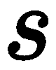
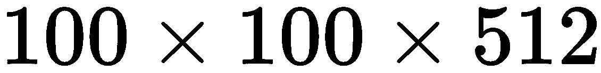

# 第二章：神经网络与深度学习

神经网络是本书中我们将深入探讨的主要机器学习模型。它们的应用领域无数，涵盖了从计算机视觉（例如，图像中的物体定位），金融（例如，神经网络用于检测欺诈行为），交易，到甚至艺术领域（神经网络与对抗训练过程结合，能够生成新颖且未见过的艺术作品，取得惊人的成果）。

本章可能是全书中最具理论性的部分，将展示如何定义神经网络及如何使其学习。首先，我们将介绍人工神经元的数学公式，并强调神经元必须具备哪些特征才能学习。接下来，将详细解释全连接和卷积神经网络拓扑结构，因为这些是几乎所有神经网络架构的构建模块。同时，我们将介绍深度学习和深度架构的概念。引入这一概念是必不可少的，因为正是深度架构让神经网络如今能够解决具有超人表现的挑战性问题。

最后，将展示训练一个参数化模型所需的优化过程，并结合一些正则化技术来提升模型的表现。梯度下降、链式法则和计算图的表示都将单独讲解，因为对任何机器学习实践者来说，了解在框架训练模型时发生的事情是至关重要的。

如果你已经熟悉本章所介绍的概念，可以直接跳到下一章，第三章，*TensorFlow 图架构*，本章专门讲解 TensorFlow 的图架构。

在本章中，我们将涵盖以下主题：

+   神经网络

+   优化

+   卷积神经网络

+   正则化

# 神经网络

神经网络的定义来自于最早期神经计算机之一的发明者*罗伯特·赫希特-尼尔森博士*，他在《神经网络入门——第一部分》中这样描述：

“一个由许多简单且高度互联的处理单元组成的计算系统，这些单元通过对外部输入的动态状态响应来处理信息。”

实际上，我们可以将人工神经网络视为一种计算模型，它基于大脑的工作原理。因此，数学模型受生物神经元的启发。

# 生物神经元

大脑的主要计算单元被称为神经元；在人类神经系统中，大约有 860 亿个神经元，它们通过突触互相连接。以下图示展示了生物神经元及其数学模型：

生物神经元的表示，左图为（a），右图为其数学模型（b）。来源：斯坦福 cs231n

生物神经元由以下部分组成：

+   **树突**：细小的纤维，以电信号的形式将信息从外部传递到细胞核。

+   **突触**：这些是神经元之间的连接点。神经元通过连接到树突的突触接收输入信号。

+   **细胞核**：接收来自树突的信号，对其进行处理，并产生响应（输出信号），然后将其发送到轴突。

+   **轴突**：神经元的输出通道。它可以连接到其他神经元的突触。

每个神经元从其树突接收输入信号，并将其传输到细胞核进行处理；树突对信号进行处理，从而整合（相加或合并）来自每个输入突触的兴奋与抑制。细胞核接收这些综合信号并将它们相加。如果最终的总和超过某个阈值，神经元就会发放，并将结果信息通过轴突传递到其他连接的神经元。

在神经元之间传递的信号量取决于连接的强度。正是神经元的排列和这些突触的强度决定了神经网络的功能。

生物神经元的学习阶段是基于细胞核生成的输出信号随时间的变化，作为某些类型输入信号的函数。神经元在其生命周期内会专门化，识别特定的刺激。

# 人工神经元

人工神经元基于生物神经元的结构，使用带有实数值的数学函数来模拟其行为。这种人工神经元被称为**感知器**，这一概念是由科学家弗兰克·罗森布拉特在 20 世纪 50 到 60 年代提出的。考虑到这一数学类比，我们可以这样描述生物神经元：

+   **树突**：神经元接收输入的数量。它也可以看作是输入数据的维度数，`D`。

+   **突触**：  与树突相关的权重。这些值在训练阶段会发生变化。在训练阶段结束时，我们说神经元已经专门化（它学会了从输入中提取特定的特征）。

如果  是一个 D 维输入向量，那么突触执行的操作是 

+   **核心体**（细胞体）：这是一个将来自突触的值结合起来的函数，从而定义神经元的行为。为了模拟生物神经元的动作，即只有在输入中有特定刺激时才会激活（发射），核心体被建模为**非线性**函数。

    如果是一个非线性函数，那么神经元的输出，即考虑到所有输入刺激的结果，由以下方程给出：

.

+   在这里，是**偏置项**，它具有基础性的重要性。它允许你学习一个不以 D 维空间原点为中心的决策边界。

如果我们暂时去除非线性（也称为**激活**）函数，我们可以很容易地看到，突触定义了一个具有以下方程的超平面：

![].

单个神经元只能执行*二元*分类，因为 D 维向量只能位于它定义的超平面之上或之下。

如果—且仅当—样本是线性可分的，那么感知机能够在 D 维空间中正确分类样本。

核心体通过其非线性特性，将由树突定义的超平面映射到更一般的超曲面上，这就是学习到的决策边界。在最理想的情况下，非线性将超平面转化为一个超曲面，该超曲面能够正确分类 D 维空间中的点。然而，只有在这些点可以通过单一超曲面在两个区域之间分离时，它才会这样做。

这是我们需要多层神经网络的主要原因：如果输入数据无法通过单个超平面分离，添加另一层，通过将学习到的超平面转化为一个带有额外分类区域的新超平面，使其能够学习到复杂的分类边界，从而正确分离区域。

此外，值得注意的是，前馈神经网络，例如那些神经元之间存在连接但不形成循环的神经网络，是通用的函数近似器。这意味着，如果存在一种分离区域的方法，经过充分训练、具有足够容量的神经网络将能够学习并近似该函数。

+   **轴突**：这是神经元的输出值，其他神经元可以将其作为输入。

需要强调的是，这种生物神经元模型是非常粗略的：例如，神经元有许多不同的类型，每种类型都有不同的特性。生物神经元的树突执行复杂的非线性计算。突触不仅仅是一个单一的权重；它们是一个复杂的非线性动态系统。该模型还有许多其他简化之处，因为现实要比这个模型复杂得多，且更难以建模。因此，这种生物学上的灵感仅仅是一种理解神经网络的方式，但不要被这些相似之处所迷惑：人工神经网络仅仅是受到生物神经元的松散启发。

*“我们为什么要使用神经网络而不是其他机器学习模型？”*

传统的机器学习模型很强大，但通常不如神经网络那样灵活。神经网络可以以不同的拓扑结构排列，几何形状改变了神经网络所看到的内容（输入刺激）。此外，创建不同拓扑结构的神经网络层叠层非常简单，从而创建出**深度模型**。

神经网络的一个最大优点是其成为特征提取器的能力：其他机器学习模型需要对输入数据进行处理、提取有意义的特征，并且只能基于这些特征（手动定义的！）应用模型。

另一方面，神经网络可以通过自身从任何输入数据中提取有意义的特征（这取决于所使用层的拓扑结构）。

单个感知机展示了如何对不同类型的输入进行加权和求和，从而做出简单的决策；而感知机的复杂网络则可以做出相当微妙的决策。因此，**神经网络架构**由神经元组成，所有神经元通过突触（生物学上）相连，信息通过这些突触流动。在训练过程中，神经元会在学习到数据中的特定模式时触发。

这一触发率是通过激活函数来建模的。更准确地说，神经元是以无环图的形式连接的；

循环是不允许的，因为这会导致网络前向传递中的无限循环（这类网络被称为**前馈神经网络**）。神经网络模型通常将神经元组织成不同的层，而不是将神经元简单地连接成无规则的团块。最常见的层类型是全连接层。

# 全连接层

全连接配置是一种特定的网络拓扑，其中两个相邻层之间的神经元是完全成对连接的，但单层内的神经元之间没有任何连接。

将网络组织成层可以让我们创建由多个完全连接的层组成的堆叠，每层中神经元的数量不同。我们可以将多层神经网络看作一个包含可见层和隐藏层的模型。可见层仅指输入层和输出层；隐藏层是那些没有与外部连接的层：

这是一个典型的完全连接神经网络的表示，包含两个隐藏层。每一层都减少其输入的维度，目的是根据十个输入特征生成两个不同的输出。

隐藏层中神经元的数量是完全任意的，并且它改变网络的学习能力。输入层和输出层则有固定的维度，这是由我们要解决的任务决定的（例如，如果我们要解决一个`n`类分类问题，且输入维度为 D，那么我们需要一个具有 D 个输入的输入层和一个具有 n 个输出的输出层）。

从数学上讲，可以将完全连接层的输出定义为矩阵乘积的结果。假设我们有以下方程：

输出 `O` 由以下公式给出：

这里，M 是该层中神经元的任意数量。

虽然神经网络的输入层和输出层设计较为简单，但隐藏层的设计并不那么简单。没有固定的规则；神经网络研究者为隐藏层开发了许多设计启发式方法，帮助获得正确的行为（例如，当隐藏层数量与训练网络的时间之间存在权衡时）。

通常，增加每层中的神经元数量和/或神经网络中层的数量意味着需要增加网络的容量。这意味着神经网络可以表示更复杂的函数，并且可表示函数的空间增长；然而，这同时有好处也有坏处。好处是我们可以学习更复杂的函数，但坏处是更多的可训练参数会增加过拟合训练数据的风险。

通常，如果数据不复杂或我们使用的是小型数据集，应优先选择较小的神经网络。幸运的是，有不同的技术可以在使用大容量模型时防止过拟合数据。这些技术被称为正则化技术（对参数的 L2 惩罚、丢弃法、批量归一化、数据增强等）。我们将在接下来的章节中深入探讨这些技术。

激活函数是每个神经网络设计中另一个重要的部分。它应用于每个神经元：没有人强迫我们在每个神经元上使用相同的非线性函数，但约定俗成的是选择一种非线性形式，并在同一层的每个神经元上使用它。

如果我们正在构建一个分类器，我们关心的是评估网络的输出层，并能够解释输出值来理解网络的预测。假设我们对输出层的每个神经元应用了线性激活函数，每个神经元与一个特定类别相关联（看前面的图像，我们有一个 3 维输入和两个输出神经元，每个类别一个）——那么我们如何解释这些值呢？因为它们的值域是整个实数集，所以很难解释以这种方式表达的值。

最自然的方法是将输出值的总和限制在[0,1]范围内，这样我们就可以将输出值视为从预测类别的概率分布中采样，并可以将具有最高值的神经元视为预测的类别。或者，我们可以选择对这些值应用阈值操作，以模拟生物神经元的放电：如果神经元的输出大于某个阈值，我们可以输出值 1，否则输出 0。

另一种方法是将每个神经元的输出限制在[0,1]的范围内，例如在我们解决一个多类分类任务时，类之间不是互斥的。

很容易理解为什么输出层中的某种非线性非常重要——它可以改变网络的行为，因为我们如何解释网络的输出依赖于此。然而，要完全理解神经网络，理解每一层非线性的重要性是必须的。

# 激活函数

如我们所知，层中第`i`个神经元的输出值计算方式如下：

激活函数，，因多种原因而重要：

+   如前一节所述，根据我们应用非线性的层次，它使我们能够解释神经网络的结果。

+   如果输入数据是不可线性分割的，其非线性特性使得你能够近似一个非线性函数，从而以非线性的方式分割数据（想一想超平面如何转化为一般的超曲面）。

+   如果相邻层之间没有非线性，那么多层神经网络等价于只有一个隐藏层的单层神经网络，因此它们只能分割输入数据的两个区域。事实上，给定：

![]

两个感知机堆叠：

![],

我们知道，第二个感知机的输出等同于单个感知机的输出：

![],

+   其中，![] 和 ![] 是权重矩阵，偏置向量等同于单个权重矩阵和偏置向量的乘积。

这意味着，当 ![] 是线性时，多层神经网络始终等同于单层神经网络（因此，它具有相同的学习能力）。如果不是这样，最后的方程就不成立。

+   非线性使得网络对噪声输入具有鲁棒性。如果输入数据包含噪声（即训练集中的值不完美——这种情况时常发生），非线性可以防止噪声传播到输出。以下是这一点的证明：

![]。

最常用的两种激活函数是 sigmoid（）和双曲正切（）。

第一个激活函数几乎在所有分类问题的输出层中使用，因为它将输出压缩到[0,1]范围内，使你可以将预测结果解释为一个概率：

双曲正切函数则作为几乎所有生成模型输出层的激活函数，通常用于生成图像的训练。即便如此，我们使用它的原因是为了正确地解释输出，并在输入图像和生成图像之间建立有意义的联系。我们习惯将输入值从[0,255]范围缩放到[-1,1]，这是 函数的范围。

然而，使用像  和  这样的函数作为隐藏层的激活函数并不是最佳选择，这与反向传播训练过程相关（如我们将在后续章节中看到的，饱和非线性可能会成为问题）。为了克服饱和非线性带来的问题，许多其他激活函数被开发了出来。下图展示了最常见的非线性函数的简短视觉概览：

最常见激活函数的列表。来源：Stanford cs231n。

一旦网络结构定义完成，并且确定了要在隐藏层和输出层中使用的激活函数，就可以定义训练数据与网络输出之间的关系，从而能够训练网络并使其解决当前的任务。

在接下来的章节中，我们将讨论一个离散分类问题，该问题继承自第一章，*什么是机器学习？*我们在讨论的是，分类问题的所有结论也适用于连续变量，因为我们使用神经网络作为工具来解决监督学习问题。由于神经网络是一个参数模型，训练它意味着我们需要更新这些参数。

，以找到能够以最佳方式解决问题的配置。

如果我们希望定义输入数据和期望输出之间的关系，那么训练神经网络是必不可少的：这就是目标函数——或者称为损失函数，因为我们希望将损失最小化作为目标。

# 损失函数

在定义了网络架构后，模型必须进行训练。现在是时候定义模型输出和真实数据之间的关系了。为此，必须定义一个损失函数。

损失函数用于评估模型的拟合优度。

存在多种损失函数，每个损失函数都表达了网络输出与真实数据之间的关系，而它们的形式完全影响模型预测的质量。

对于一个在个类别上的离散分类问题，我们可以定义一个神经网络模型，该模型接受一个 D 维的输入向量，，并生成一个维的预测向量，作为其参数的函数，，如下所示：

模型生成一个 M 维的输出向量，包含模型分配给输入的概率，，对于每一个可能的类别（如果我们对输出层应用了 sigmoid 激活函数，可以这样解读输出）。

很容易提取输出层中产生最大值的神经元的位置。预测类别的公式如下：

通过使用这个方法，我们可以找到产生最高分类分数的神经元的索引。由于我们知道与输入相关的标签，，我们几乎已经准备好定义预测与标签之间的关系。我们面临的最后一个问题是标签的格式：标签是一个标量值，而网络输出是一个 M 维向量。虽然我们可以找到具有最高概率值的神经元位置，但我们关心的是整个输出层，因为我们希望增加正确类别的概率，并惩罚错误类别。

因此，标签必须转换为 M 维表示，以便我们可以在每个输出神经元和标签之间建立联系。

从标量值到 M 维表示的最自然转换称为**独热**编码。此编码由创建一个 M 维向量组成，该向量在标签的位置上值为 1，在其他位置上值为 0。因此，我们可以将独热编码的标签表示为如下：

现在，可以定义损失函数的一般公式，该公式适用于 `i` 第个训练集实例，作为一个实值函数，创建一个地面真实值（正确编码的标签）和预测值之间的联系：

应用于完整训练集的损失函数的一般公式，设训练集大小为 `k`，可以表示为对单个实例计算的损失的均值：

损失必须根据具体问题来选择（或定义）。对于分类问题（互斥类别），最简单和最直观的损失函数是标签的独热编码表示和网络输出之间的 L2 距离。目标是最小化网络输出与独热编码标签之间的距离，从而使网络预测一个类似于正确标签的 M 维向量：

损失函数的最小化是通过对模型参数值进行小的迭代调整来实现的。

# 参数初始化

初始模型参数值是训练阶段迭代优化问题的解：没有唯一的方式初始化网络参数，关于参数初始化的唯一有效建议如下：

+   **不要将网络参数初始化为零**：使用梯度下降法是无法找到新解的（如我们将在下一节中看到的），因为整个梯度为 0，因此没有更新方向的指示。

+   **打破不同单元之间的对称性**：如果两个使用相同激活函数的隐藏单元连接到相同输入，则这两个输入必须具有不同的初始参数值。这是必要的，因为几乎每个解决方案都要求为每个神经元分配一组不同的参数，以找到有意义的解。如果我们一开始将所有参数都设置为相同的值，那么每次更新步骤都会以相同的量更新所有网络参数，因为更新值取决于误差，而误差对于网络中的每个神经元来说都是相等的。因此，我们将无法找到有意义的解决方案。

通常，问题的初始解是通过具有零均值和单位方差的随机正态分布来采样的。这种分布确保了网络参数较小并且围绕零值均匀分布，同时它们之间有所不同，从而打破了对称性。

现在我们已经定义了网络架构，正确格式化了输入标签，并用损失函数定义了输入输出关系，那么我们如何最小化损失呢？我们如何迭代调整模型参数以最小化损失，从而解决问题？

这一切都是关于优化和优化算法的问题。

# 优化

运筹学为我们提供了高效的算法，可以通过寻找全局最优解（全局最小点）来解决优化问题，如果问题可以表达为具有明确定义特性的函数（例如，凸优化要求函数为凸函数）。

人工神经网络是通用的函数逼近器；因此，我们无法对神经网络所逼近的函数形状做出假设。此外，最常见的优化方法利用几何考虑，但正如我们在第一章中了解到的，*什么是机器学习？*，由于维度灾难，当维度很高时，几何学的表现非常不寻常。

基于这些原因，无法使用能够找到优化（最小化）问题全局最优解的运筹学方法。相反，我们必须使用一种迭代优化方法，该方法从初始解出发，尝试通过更新表示解的模型参数来细化解，以寻找一个好的局部最优解。

我们可以将模型参数，，视为最小化问题的初始解。因此，我们可以从训练步骤 0 开始评估损失函数，，以便了解它在当前初始参数配置下的值，。现在，我们必须决定如何更新模型参数。为此，我们需要执行第一次更新步骤，方法是根据损失给出的信息进行操作。我们可以通过两种方式继续：

+   **随机扰动**：我们可以对当前的一组参数应用随机扰动，，并计算获得的新参数集上的损失值，。

如果训练步骤中的损失值，，小于前一步的值，我们可以接受找到的解并继续进行新的随机扰动，应用到新一组参数上。否则，我们必须重复随机扰动，直到找到更好的解。

+   **更新方向的估计**：与其随机生成一组新参数，不如指导局部最优解搜索过程朝着函数的最大下降方向进行。

第二种方法是训练作为可微函数表示的参数化机器学习模型的 de facto 标准。

要正确理解这个梯度下降方法，我们必须将损失函数看作是在参数空间中定义的一个表面——我们的目标，即最小化损失，意味着我们需要找到这个表面上的最低点。

# 梯度下降

梯度下降是一种用于计算在寻找最小化/最大化问题解时，应该沿着哪个方向移动的方法。这种方法建议我们在更新模型参数时应遵循的方向：根据所使用的输入数据，找到的方向是损失面最陡峭下降的方向。所使用的数据极为重要，因为它决定了损失函数的评估方式，从而决定了用来评估更新方向的表面。

更新方向由损失函数的梯度给出。从微积分中知道，对于一个单变量可微函数，，在点 的导数由以下公式给出：

该操作为我们提供了在 中的函数行为描述：它展示了函数在变量附近一个无穷小区域内的变化。

对于 n 变量函数的导数操作的推广就是梯度，即偏导数的向量（函数对单一变量的导数向量，考虑其他变量为常数）。在我们的损失函数的情况下，它如下所示：

 表示函数增长的方向。因此，由于我们的目标是找到最小值，我们必须沿着由反梯度指示的方向移动，如下所示：

在这里，反梯度表示执行参数更新时应该遵循的方向。现在，参数更新步骤如下所示：

 参数是学习率，是梯度下降训练阶段的超参数。选择正确的学习率值更像是一门艺术而非科学，我们唯一能做的就是凭借直觉选择一个适合我们的模型和数据集的值。我们必须记住，反梯度只是告诉我们应该遵循的方向，它并没有给出当前解与最小点之间的距离信息。距离或更新强度由学习率来调节：

+   学习率过高可能会导致训练阶段不稳定，因为在局部最小值附近会出现跳跃，这会导致损失函数值的震荡。为了帮助记住这一点，我们可以把它想象成一个 U 型的曲面。如果学习率过高，我们在 U 的左右两侧之间跳跃，而在下一个更新步骤中则反向跳跃，永远无法下降到谷底（因为 U 的两个峰值之间的距离大于 ）。

+   学习率过小可能会导致训练阶段的效果不理想，因为我们永远无法跳出一个不是全局最小值的谷底。因此，有被困在局部最小值中的风险。此外，学习率过小的另一个风险是永远找不到一个好的解——并不是因为我们被困在局部最小值中，而是因为我们朝着目标前进的速度太慢。由于这是一个迭代过程，研究可能需要花费太长时间。

为了应对选择学习率值的挑战，已经开发出多种策略，这些策略在训练阶段调整学习率的值，通常是逐渐减小，以便在使用较大学习率进行探索（寻找更广泛的解空间）和使用较小学习率进行精细调整（下降到更深的谷底）之间找到平衡。

到目前为止，我们已经讨论了通过使用完整数据集计算得到的损失函数来更新参数，这种方法称为**批量梯度下降**。实际上，这种方法无法应用于现实场景，因为现代神经网络应用处理的数据量巨大，通常无法完全存入计算机内存。

已经开发出了几种批量梯度下降的变体，以克服其局限性，同时也有不同的策略来更新模型参数，这些策略将帮助我们解决与梯度方法本身相关的挑战。

# 随机梯度下降

随机梯度下降会针对训练数据集中的每个元素进行模型参数更新——每个样本一次更新步骤：

如果数据集具有较高的方差，随机梯度下降会在训练阶段造成损失值的巨大波动。这既可以是优势也可以是劣势：

+   这可能是一个优势，因为由于损失的波动，我们进入了解决方案空间中的未探索区域，这些区域可能包含更好的最小值。

+   这是一种适用于在线训练的方法。这意味着在模型的整个生命周期中使用新数据进行训练（这意味着我们可以继续用新的数据训练模型，通常来自传感器）。

+   收敛较慢，找到一个好的最小值更困难，因为更新具有较高的方差。

训练神经网络的事实标准方法，旨在保持批量梯度下降和随机梯度下降的优点，称为小批量梯度下降。

# 小批量梯度下降

小批量梯度下降保留了批量梯度下降和随机梯度下降方法的优点。它使用训练集的一个子集（即小批量）更新模型参数，子集的基数为 ：

这是最广泛使用的方法，原因如下：

+   使用小批量减少了参数更新的方差，因此在训练过程中加速了收敛速度。

+   使用具有卡尔达利数的小批量使你能够复用相同的方法进行在线训练

可以写出梯度下降在更新步骤 `s` 时的通用公式，如下所示：

+   对于 ，该方法是随机梯度下降

+   对于 ，该方法是批量梯度下降

+   对于 ，该方法是小批量梯度下降

这里展示的三种方法以所谓的**传统**方式更新模型参数，该方式只考虑当前参数的值和通过应用定义计算出的反向梯度。它们都使用固定的学习率值。

其他参数优化算法也存在，所有这些算法的开发目标是找到更好的解决方案、更好地探索参数空间，并克服传统方法在寻找良好最小值时可能遇到的所有问题：

+   **选择学习率**：学习率可能是整个训练阶段最重要的超参数。这些原因在 *梯度下降* 部分的末尾已有解释。

+   **常数学习率**：传统更新策略在训练过程中不会改变学习率的值。此外，它使用相同的学习率来更新每一个参数。这总是可取的吗？可能不是，因为将与输入特征的不同出现频率相关的参数同等对待并不合理。从直观来看，我们希望以较小的步长更新与低频特征相关的参数，而以较大的步长更新其他参数。

+   **鞍点和平台**：用于训练神经网络的损失函数是大量参数的函数，因此是非凸函数。在优化过程中，可能会遇到鞍点（函数在某个维度上值增加，但在其他维度上值减少的点）或平台（损失面上的局部常数区域）。

在这些情况下，梯度几乎在每个维度上都接近零，因此由反梯度指引的方向几乎为零。这意味着我们已经被卡住了，优化过程无法继续。我们在多个训练步骤中被损失函数假定的常数值所迷惑；我们以为已经找到了一个好的最小值，但实际上，我们困在了解空间中的一个无意义区域。

# 梯度下降优化算法

已经开发了几种优化算法来提高传统优化方法的效率。在接下来的章节中，我们将回顾传统优化方法，并展示两种最常见的优化算法：动量法和 ADAM。我们讨论动量法是因为它展示了如何通过对损失面进行物理解释，从而取得成功的结果；而讨论 ADAM 则是因为它是最广泛应用的自适应优化方法。

# 传统方法

正如我们之前看到的，更新公式只需要估计方向，这个方向是通过使用反梯度和学习率来获得的：

# 动量

动量优化算法基于对损失面的一种物理解释。我们可以将损失面看作是一片混乱的景观，粒子在其中运动，目标是找到全局最小值。

传统算法通过计算反梯度找到的方向来更新粒子的位置，使得粒子在没有任何物理意义的情况下从一个位置跳到另一个位置。这可以看作是一个充满能量的不稳定系统。

动量算法引入的基本思想是通过考虑表面和粒子之间的相互作用来更新模型参数，就像你在物理系统中一样。

在现实世界中，系统无法在零时间内将粒子从一个点传送到另一个点并且不损失能量。系统的初始能量会因为外部力量的作用以及速度随时间的变化而丧失。

特别地，我们可以使用一个物体（粒子）在表面（损失表面）上滑动，并受到一个动摩擦力的类比，这个力随着时间推移减少其能量和速度。在机器学习中，我们将摩擦系数称为动量，但实际上，我们可以像在物理学中那样进行推理。因此，给定一个摩擦系数，（一个取值范围在[0,1]之间，但通常在[0.9, 0.999]范围内的超参数），动量算法的更新规则由以下方程给出：

在这里， 是粒子的矢量速度（矢量的每个分量是特定维度上的速度）。速度的类比是自然的，因为在一维中，位置对时间的导数就是速度。

该方法考虑了粒子在上一步所达到的矢量速度，并且对于那些朝不同方向运动的分量进行减速，同时对朝相同方向运动的分量进行加速，以便进行后续更新。

通过这种方式，系统的总体能量得以减少，从而减少了振荡并加速了收敛过程，正如我们从下图中看到的那样，图中显示了香草算法（左侧）和动量算法（右侧）之间的差异：

这里是香草算法（左）和动量算法（右）的可视化表示。动量算法导致较少的损失振荡，并且更快地达到最小值。

# ADAM

香草算法和动量算法将参数视为常量：每个网络参数的更新强度（步长）都是相同的；没有区分与高频或低频特征相关的参数。为了解决这个问题并提高优化算法的效率，开发了一整套新的算法，称为**自适应学习率优化方法**。

这些算法背后的理念是为网络中的每个参数分配不同的学习率，从而使用适应神经元专门提取的特征类型（或者一般来说，适应神经元看到的不同输入特征）的学习率来更新它们：与高频特征相关联的小更新，反之则较大的更新。**自适应矩估计**（**ADAM**）并不是第一个被开发的自适应方法，但它是最常用的，因为它在许多不同的任务中超过了几乎所有其他自适应和非自适应算法：它提高了模型的泛化能力，同时加快了收敛速度。

作为一种自适应方法，它为模型中的每个参数创建一个学习率，如下所示：

算法的作者决定考虑梯度（平方）的变化以及它们的方差：

第一个项是梯度的指数移动平均（即一阶动量的估计），第二个项是梯度平方的指数移动平均（二阶动量的估计）。 和  都是具有分量的向量，且都已初始化为 0。

 和  是指数移动平均的衰减因子，并且是算法的超参数。

 和  向量的零初始化使得它们的值接近 0，尤其是在衰减因子接近 1 时（因此衰减率较低）。

这是一个问题，因为我们正在估计接近零的值，而没有受到任何可能的更新规则的影响。为了解决这个问题，作者建议通过以下方式来修正一阶和二阶动量：

最后，他们建议了一种受其他自适应算法启发的更新规则（如 Adadelta 和 RMSProp，本书中未解释）：

他们建议我们使用接近 1 的衰减率，并为 epsilon 参数设置一个非常小的值（它仅用于避免除以零的情况）。

为什么使用一阶和二阶矩估计以及这种更新规则来更新网络中的每个单独参数会改善模型的速度收敛性，并提高模型的泛化能力？

有效学习率，，在训练过程中会根据每个参数进行自适应调整，并考虑每个神经元输入特征的出现频率。如果与当前参数相关的计算偏导数不为零，比如与该神经元相关的输入特征出现频繁时，分母会增加。出现频率越高，训练过程中更新步长就会越小。

如果偏导数几乎每次都接近零，更新步长将几乎保持不变，且在训练过程中从未改变大小。

迄今为止我们展示的每一种梯度下降优化算法，都需要我们计算损失函数的梯度。由于神经网络可以逼近任何函数且其拓扑结构可能非常复杂，那么我们如何有效地计算复杂函数的梯度呢？通过使用数据流图表示计算过程，并结合反向传播算法，便可以解决这个问题。

# 反向传播与自动微分

计算偏导数是训练神经网络时需要重复上千上万次的过程，因此，这个过程必须尽可能高效。

在之前的章节中，我们展示了如何通过使用损失函数，建立模型输出、输入和标签之间的联系。如果我们用图表示整个神经网络架构，就可以很容易地看到，对于一个输入实例，我们只是按顺序执行数学运算（输入乘以参数，将这些乘法结果相加，并将非线性函数应用于总和）。在这个图的输入端，我们有来自数据集的输入样本。图的输出节点是预测值；这个图可以看作是一组复合函数，类型如下：

一个具有两个输入的神经元的输出， 和 ，使用 ReLU 激活函数的结果如下：

在前面的方程中使用的函数如下：

+    是输入与参数的乘积函数

+    是两个值的求和函数

+    是修正线性单元（ReLU）激活函数

因此，我们可以将输出神经元表示为这些函数的组合：

请记住，变量不是函数的输入值，而是模型参数 。我们感兴趣的是计算损失函数的偏导数，以便训练网络。我们使用梯度下降算法来完成这个过程。作为一个简单的例子，我们可以考虑一个简单的损失函数：

要计算关于变量的损失梯度 ()，可以应用链式法则（复合函数导数的法则）：

使用莱布尼茨符号，可以更容易地看出如何应用链式法则来计算任何可微函数的偏导数，该函数表示为一个图（因此也可以表示为一组复合函数）：

最终，这只是将操作表示为复合函数的问题，使用图表示是一种自然的方式。我们可以将图的节点与函数关联：它的输入是函数的输入；该节点执行函数计算并输出结果。此外，节点可以具有属性，例如在计算相对于其输入的偏导数时应用的公式。

此外，图可以在两个方向上遍历。我们可以沿着正向方向遍历（反向传播算法的正向传播），从而计算损失值。我们也可以沿着反向方向遍历，应用每个节点与输入相关的输出对输入的导数公式，并将来自前一个节点的值与当前节点的值相乘来计算偏导数。这就是链式法则的应用。

将计算表示为图形使我们能够通过计算复杂函数的梯度来执行自动微分。我们只考虑单个操作，并仅查看节点的输入和输出。

在图上应用链式法则有两种不同的方式——正向模式和反向模式。关于正向模式和反向模式下自动微分的详细解释超出了本书的范围；然而，在接下来的章节中，我们将看到 TensorFlow 如何在反向模式下实现自动微分，以及它是如何应用链式法则来计算损失值并反向遍历图的  次。与在正向模式下实现它相比，反向模式下的自动微分依赖于输入的基数，而不是网络的参数数量（现在可以很容易理解为什么 TensorFlow 在反向模式下实现自动微分；神经网络可能有数百万个参数）。

到目前为止，我们描述了可以应用于计算损失函数以使其适合训练数据的优化算法和策略。我们通过使用一个被我们的神经网络近似的通用函数来实现这一点。实际上，我们只引入了一个神经网络架构：全连接架构。然而，根据数据集类型，还有几种不同的神经网络架构可以用来解决不同的问题。

神经网络的一个优点是其能够执行不同的任务，这取决于所使用的神经元拓扑结构。

全连接配置是对输入的全局视图——每个神经元都看到了一切。然而，有些类型的数据不需要完整的视图就可以正确地被神经网络使用，或者在全连接配置下是计算不可行的。想象一下具有数百万像素的高分辨率图像；我们必须将每个神经元连接到每个像素，从而创建一个参数数量等于像素数乘以神经元数的网络：一个只有两个神经元的网络将导致 ![] 参数——这是完全无法处理的！

用于处理图像的架构，也许是过去几年中发展的最重要的神经层，是卷积神经网络。

# 卷积神经网络

**卷积神经网络**（**CNNs**）是现代计算机视觉、语音识别甚至自然语言处理应用的基本构建块。在本节中，我们将描述卷积算子，它在信号分析领域的使用以及在机器学习中的应用。

# 卷积算子

信号理论为我们提供了理解卷积操作所需的所有工具：为什么它在许多不同领域中被广泛使用以及为什么 CNNs 如此强大。当信号应用于其输入时，卷积操作用于研究某些物理系统的响应。不同的输入刺激可以使系统`S`产生不同的输出，并且可以使用卷积操作来建模系统的行为。

让我们从一维情况开始，引入**线性时不变**（**LTI**）系统的概念。

如果系统`S`接受一个输入信号并产生一个输出信号 ，则称该系统为 LTI 系统，如果以下属性成立：

+   **线性性**: 

+   **时间不变性**:** **

是否可以通过分析 LTI 系统对 Dirac Delta 函数 δ(t) 的响应来分析其行为？δ(t) 是一个函数，其在其定义域内的每个点的值均为零，除了在  处。 在  处，它假设一个值，使其定义成立：

直观地说，将 δ(t) 应用到一个函数 φ(t) 上意味着在 0 处对 φ(t) 进行采样。因此，如果我们将 δ(t) 作为系统 `S` 的输入，则我们得到系统对单位冲击的响应，单位冲击以零为中心。当输入是 Dirac Delta 函数时，系统的输出称为系统的冲激响应，并通过以下方程表示：

系统的冲激响应具有重要的基础性意义，因为它允许我们计算 LTI 系统对任何输入的响应。

一个通用信号 *x(t)* 可以看作是它在每个瞬间 `t` 所取的值的总和。这可以通过将 δ(t) 应用到 `x` 域的每个点并进行平移来建模：

该公式是两个信号之间卷积的定义。

那么，为什么卷积操作对 LTI 系统的研究很重要呢？

给定 *x(t)* 作为通用输入信号，*h(t)* 作为 LTI 系统的冲激响应，我们得到以下结果：

卷积的结果表示 LTI 系统的行为，该系统通过其冲激响应 *h(t)* 进行建模，当 *x(t)* 是其输入时。这是一个重要的结果，因为它展示了冲激响应如何完全表征系统，并且卷积操作如何用于分析 LTI 系统在给定任何输入信号时的输出。

卷积操作是交换的，操作的结果是一个函数（一个信号）。

到目前为止，我们只考虑了连续情况，但在离散域上有一个自然的推广。如果  和  定义在  上，则卷积按如下方式计算：

# 2D 卷积

我们在二维情况下引入的 1D 卷积的推广是自然的。特别是，图像可以被看作是二维离散信号。在二维情况下，Dirac Delta 函数的对应物是 Kronecker Delta 函数，它可以独立于所使用空间的维度来表示。它被视为一个张量δ，其分量为：

图像可以被看作是 LTI 系统的二维版本。在这种情况下，我们讨论的是 **线性空间不变** (**LSI**) 系统。

在二维离散情况下，卷积操作定义如下：

图像是有限维度的信号，具有明确的空间范围。这意味着之前介绍的公式变成了以下形式：

在这里，我们有以下内容：

+   是输入图像

+   是卷积滤波器（也称为卷积核）本身，而 是其边长

+   是输出像素，位于 位置

我们描述的操作是对输入图像的每一个*(i,j)*位置执行的，只有当卷积滤波器与该位置完全重叠时，它才会滑动在输入图像上：

输入图像（左侧）与卷积核之间的卷积操作产生右侧的特征图

如上图所示，不同的卷积滤波器从输入图像中提取不同的特征。事实上，在上图中，我们可以看到这个矩形滤波器（Sobel 滤波器）是如何提取输入图像的边缘的。用不同的卷积滤波器对图像进行卷积意味着必须提取不同的输入特征，卷积核能够捕捉到这些特征。在卷积神经网络出现之前，正如我们将在下一节看到的那样，我们必须手动设计能够提取所需特征的卷积核，以解决当前的任务。

有两个额外的参数没有在前面的公式中显示出来，它们控制卷积操作的执行方式。这些参数是水平和垂直步幅；它们告诉操作在水平和垂直方向上每次移动卷积核时需要跳过多少像素。通常，水平和垂直步幅是相等的，并用字母 S 表示。

如果输入图像的边长为 ，那么通过与大小为 `k` 的卷积核进行卷积所产生的输出信号的分辨率可以按以下方式计算：

# 卷积在体积间的二维运算

到目前为止，我们只考虑了灰度图像的情况，即只有一个通道的图像。我们在现实生活中常见的图像都是 RGB 图像，也就是有三个颜色通道的图像。当输入图像有多个通道时，卷积操作同样有效；事实上，它的定义已经稍微变化，以便让卷积操作跨越每一个通道。

这个扩展版本要求卷积滤波器的通道数与输入图像相同；简而言之，如果输入图像有三个通道，卷积核也必须有三个通道。这样，我们就将图像视为二维信号的堆叠；我们称这些为体积（volumes）。

作为一个体积，每个图像（或卷积核）由三元组（W，H，D）来标识，其中 W、H 和 D 分别是宽度、高度和深度。

通过将图像和卷积核视为体积，我们可以将它们视为无序集合。事实上，通道的顺序（RGB，BGR）仅仅改变了软件对数据的解释方式，而内容保持不变：

这种推理使我们能够扩展之前的公式，从而使其考虑输入的深度：

这个卷积操作的结果叫做特征图。即使卷积是在体积之间进行的，输出也是一个具有单一深度的特征图，因为卷积操作将已生成的特征图相加，以考虑所有共享相同空间（x，y）位置的像素的信息。事实上，将得到的 D 个特征图相加是一种将一组二维卷积处理为单个二维卷积的方法。

这意味着结果激活图的每个位置，`O`，都包含了从相同输入位置通过其完整深度捕获的信息。这就是卷积操作背后的直观思想。

好的；现在我们已经掌握了在一维和二维空间维度中的卷积操作；我们还引入了卷积核高亮的概念，即通过定义卷积核值是一种手动操作，其中不同的卷积核可以从输入图像/体积中提取不同的特征。

卷积核的定义过程是纯粹的工程工作，定义它们并不容易：不同的任务可能需要不同的卷积核；其中一些卷积核以前从未定义过，而大多数卷积核的设计几乎是不可能的，因为某些特征只能通过处理过的信号来提取，这意味着我们必须在另一个卷积操作的结果上应用卷积操作（卷积操作的级联）。

卷积神经网络解决了这个问题：我们不再手动定义卷积核，而是可以定义由神经元构成的卷积核。

我们可以通过与多个滤波器体积进行卷积并将它们组合，来从输入体积中提取特征，同时考虑提取新输入的特征图，作为新的卷积层的输入。

网络越深，提取的特征越抽象。CNNs 的一个最大优点是能够将提取的特征进行组合，从由第一层卷积层提取的原始、基础特征，到最后一层提取的高级抽象特征，这些高级特征是由其他层提取的低级特征的组合学习而成：

CNNs 学习在第一层提取低级特征；随着网络变得更深，提取的特征的抽象层次也会增加。图片来自 Zeiler 和 Fergus，2013 年。

卷积层相对于全连接层的另一个优点是其局部视图性质。

要处理一张图像，全连接层必须将输入图像线性化，并从每个像素值到该层的每个神经元创建连接。这样内存需求非常大，并且让每个神经元看到整个输入并不是提取有意义特征的理想方式。

由于其特性，某些特征不像全连接层捕获的那样是全局的，而是局部的。例如，物体的边缘是特定输入区域的局部特征，而不是整个图像的特征。因此，CNNs 可以学习仅提取局部特征，并在后续层中将其组合。卷积架构的另一个优点是其较少的参数数量：它们不需要查看（从而创建连接）整个输入；它们只需要查看局部感受野。卷积操作需要更少的参数来提取有意义的特征图，这些特征图都捕捉了输入体积的局部特征。

CNNs 通常与另一层一起使用，称为池化层。在不深入探讨该操作细节的情况下（它在今天的架构中往往被避免），我们可以将其视为与卷积操作结构相同的操作（因此是一个在输入的水平和垂直方向上移动的窗口），但没有可学习的内核。在输入的每个区域中，应用一个不可学习的函数。该操作的目的是减少卷积操作生成的特征图的大小，从而减少网络的参数数量。

为了让我们了解常见的卷积神经网络架构是什么样子，以下图展示了 LeNet 5 架构，它使用了卷积层、最大池化（最大池化是一种池化操作，其中不可学习的函数是窗口内的最大值操作）以及全连接层，目的是对手写数字图像进行 10 类分类：

LeNet 5 架构——每个平面是一个特征图。来源：Gradient-Based Learning Applied to Document Recognition, Yann LeCun 等——1998 年

定义像 LeNet 5 这样的网络架构是一门艺术——没有关于可以使用的层数、要学习的卷积滤波器数量或全连接层中神经元数量的精确规则。此外，甚至选择隐藏层的正确激活函数也是另一个要搜索的超参数。复杂模型不仅在可学习参数方面丰富，而且在调整的超参数方面也很丰富，使得定义深度架构非常复杂和具有挑战性。

体积之间的卷积允许我们做一些花哨的事情，例如用 1 x 1 x D 卷积层替换每个全连接层，并在网络内部使用 1 x 1 x D 卷积来减少输入的维度。

# 1 x 1 x D 卷积

 卷积是最先进模型的重要构建模块，因为它们可以用于不同的目标。

一个目标是将它们用作降维技术。我们通过一个例子来理解这一点。

如果将卷积操作应用于一个输入体积为 ，并且与一组大小为  的滤波器进行卷积，每个滤波器的尺寸为 ，则特征数从 512 降至 。输出体积现在的形状为 。

一个  卷积也等效于一个全连接层。主要区别在于卷积操作符的性质和全连接层的架构结构：后者要求输入具有固定大小，而前者接受每个具有大于或等于  空间范围的体积作为输入。因此，一个  卷积可以替代任何全连接层，因为它们是等效的。

此外，  卷积不仅将输入的特征减少到下一层，还引入了新的参数和新的非线性到网络中，这可能有助于提高模型的准确性。

当一个  卷积放置在分类网络的末尾时，它的作用就像一个全连接层，但是不要把它看作是降维技术，更直观地看待它作为一个输出形状为  的张量的层。输出张量的空间范围（由 W 和 H 标识）是动态的，并由网络分析的输入图像的位置确定。

如果网络定义时输入大小为 200 x 200 x 3，并且我们给定一个相同大小的图像作为输入，输出将是一个包含  和  的地图。然而，如果输入图像的空间范围大于 ，则卷积网络将分析输入图像的不同位置（就像标准卷积一样，因为不可能将整个卷积架构视为具有自己内核大小和步幅参数的卷积操作），并生成一个包含  和  的张量。这是全连接层无法实现的，因为全连接层限制了网络只接受固定大小的输入并生成固定大小的输出。

 卷积也是语义分割网络的基本构建模块，正如我们将在接下来的章节中看到的那样。

卷积层、池化层和全连接层是几乎所有神经网络架构的基本构建模块，这些架构如今被广泛用于解决计算机视觉任务，如图像分类、目标检测、语义分割、图像生成等许多问题！

我们将在接下来的章节中使用 TensorFlow 2.0 实现所有这些神经网络架构。

尽管卷积神经网络（CNN）有较少的参数，但即使是这种模型，在深度配置（堆叠的卷积层）中使用时，也可能会遇到过拟合问题。

因此，任何机器学习实践者都应该了解的另一个基本话题是正则化。

# 正则化

正则化是处理过拟合问题的一种方法：正则化的目标是修改学习算法或模型本身，使模型不仅能在训练数据上表现良好，而且能在新的输入数据上也表现良好。

解决过拟合问题的最广泛使用的解决方案之一——可能也是最容易理解和分析的——被称为 **dropout**（丢弃法）。

# Dropout（丢弃法）

Dropout（丢弃法）的思想是训练一个神经网络集成，并对结果进行平均，而不是仅训练一个标准的网络。Dropout 通过以  的概率丢弃神经元，从标准神经网络开始，构建新的神经网络。

当一个神经元被丢弃时，它的输出会被设为零。如下图所示：

左侧是标准的全连接架构，右侧是通过丢弃神经元得到的网络架构，这意味着在训练阶段使用了丢弃法。来源：Dropout：一种防止神经网络过拟合的简单方法 - N. Srivastava—2014

被丢弃的神经元不参与训练阶段。由于神经元在每次新的训练迭代中都是随机丢弃的，使用丢弃法使得每次训练阶段都不同。事实上，使用丢弃法意味着每次训练步骤都是在一个新的网络上执行——更好的是，这个网络具有不同的拓扑结构。

N. Srivastava 等人在*Dropout: A simple way to Prevent Neural Networks from Overfitting*（介绍该正则化技术的论文）中很好地解释了这一概念：

<q>在标准神经网络中，每个参数收到的导数会告诉它如何变化，以便减少最终的损失函数，考虑到所有其他单元的行为。因此，单元可能会以一种修正其他单元错误的方式变化。</q> 这可能会导致复杂的共适应关系。反过来，这会导致过拟合，因为这些共适应关系无法推广到未见过的数据。我们假设，对于每个隐藏单元，丢弃法通过使其他隐藏单元的存在变得不可靠，从而防止共适应。

因此，隐藏单元不能依赖其他特定单元来纠正其错误。

丢弃法在实际中效果良好，因为它防止了在训练阶段神经元之间的共适应。在接下来的章节中，我们将分析丢弃法如何工作以及它是如何实现的。

# 丢弃法的工作原理

我们可以通过观察丢弃法在单个神经元上的应用来分析其工作原理。假设我们有以下内容：

+    作为线性神经元

+    作为激活函数

通过使用这些方法，我们可以将丢弃法的应用——仅在训练阶段——建模为激活函数的修改：

这里，

是一个维伯努利随机变量的向量，。

一个伯努利随机变量具有以下概率质量分布：

这里， 是可能的结果。伯努利随机变量正确地建模了丢弃法在神经元上的应用，因为神经元以的概率被关闭，否则保持开启。在完全连接层的通用`i`号神经元上应用丢弃法的情况可能是有用的（但在卷积层的单个神经元上应用时也是一样的）：

这里，。

在训练过程中，一个神经元以概率保持激活。因此，在测试阶段，我们需要模拟训练阶段使用的神经网络集群的行为。为此，我们需要将神经元的输出按 d 的因子进行缩放。

因此，我们得到以下结果：

# 反向 dropout

一种稍微不同的方法——几乎所有深度学习框架中使用的做法——是使用反向 dropout。此方法包括在训练阶段缩放激活，显而易见的优势是不需要在测试阶段改变网络架构。

缩放因子是保持概率的倒数，，因此我们得到以下结果：

****

反向 dropout 是 dropout 在实践中的实现方式，因为它帮助我们定义模型，并仅通过更改一个参数（保持/丢弃概率）就可以在相同的模型上进行训练和测试。

直接 dropout，即在上一节中介绍的版本，迫使你在测试阶段修改网络，因为如果不乘以，神经元会产生比后续神经元期望的值更高的值（从而使后续神经元可能饱和或爆炸）。这就是为什么反向 dropout 更为常见的实现方式。

# Dropout 和 L2 正则化

Dropout 常常与 L2 归一化和其他参数约束技术一起使用，但并非总是如此。

归一化有助于保持模型参数值较低。这样，参数就不会增长过多。简而言之，L2 归一化是损失函数的附加项，其中是一个名为正则化强度的超参数，是模型，是实际值与预测值之间的误差函数：

很容易理解，当我们通过梯度下降进行反向传播时，这个附加项减少了更新量。如果是学习率，那么参数的更新量如下：

仅使用 Dropout 在更新阶段并没有任何防止参数值过大的机制。

还有两种极其容易实现的解决方案，它们甚至不需要改变模型或在损失函数中加入额外的项。这些被称为数据增强和提前停止。

# 数据增强

数据增强是一种简单的方法，用于增加数据集的大小。通过对训练数据应用一系列变换来实现。它的目的是让模型意识到某些输入变化是可能的，从而在各种输入数据上表现得更好。

变换集高度依赖于数据集本身。通常，在处理图像数据集时，需要应用的变换如下：

+   随机左右翻转

+   随机上下翻转

+   向输入图像添加随机噪声

+   随机亮度变化

+   随机饱和度变化

然而，在对训练集应用任何这些变换之前，我们必须问自己：*这个变换对于这种数据类型、我的数据集和当前任务来说有意义吗？*

试想一下输入图像的随机左右翻转：如果我们的数据集是由标有方向的箭头图像组成，并且我们训练模型来预测箭头的方向，那么翻转图像只会破坏我们的训练集。

# 提前停止

正如我们在第一章中介绍的，*什么是机器学习？*，*在训练阶段测量模型在验证集和训练集上的表现是一个好习惯。*

这个好习惯可以帮助我们防止过拟合，并节省大量的训练时间，因为测量指标能告诉我们模型是否开始过拟合训练数据，从而判断是否是停止训练过程的时候。

我们来思考一个分类器——我们衡量验证准确率、训练准确率和损失值。

观察损失值时，我们可以看到，随着训练过程的进行，损失在下降。当然，这仅适用于健康的训练。训练是健康的，当损失趋势下降时。你也可能只是看到由于小批量梯度下降或使用随机正则化过程（dropout）引起的波动。

如果训练过程是健康的，并且损失趋势在下降，那么训练准确率将会提高。训练准确率衡量模型对训练集的学习效果——它并不能捕捉到模型的泛化能力。而验证准确率则是衡量模型在未见过的数据上的预测能力。

如果模型在学习，验证准确率会增加。如果模型发生过拟合，验证准确率会停止增加，甚至可能开始下降，而在训练集上的准确率则达到最大值。

如果在验证准确率（或任何被监控的指标）停止增长时立即停止训练模型，那么你就能轻松有效地解决过拟合问题。

数据增强和早期停止是减少过拟合的两种方法，且不需要改变模型的架构。

然而，类似于 dropout，还有另一种常见的正则化技术，称为批量归一化，它要求我们改变使用的模型架构。这有助于加速训练过程，并让我们获得更好的性能。

# 批量归一化

批量归一化不仅是一种正则化技术——它也是加速训练过程的好方法。为了提高学习过程的稳定性，从而减少损失函数的波动，批量归一化通过减去批次均值并除以批次标准差来规范化某一层的输出。

在这个归一化过程中（它不是一个学习过程），批量归一化添加了两个可训练的参数：标准差参数（gamma）和均值参数（beta）。

批量归一化不仅通过减少训练过程中的波动来加速收敛，而且还帮助减少过拟合，因为它在训练过程中引入了类似于 dropout 的随机性。不同之处在于，dropout 通过显式的方式添加噪声，而批量归一化通过计算批次的均值和方差来引入随机性。

下图来自原始论文《*批量归一化——通过减少内部协方差偏移加速深度网络训练*》（Ioffe 等，2015），展示了在训练过程中应用的算法：

批量归一化算法。来源：*批量归一化——通过减少内部协方差偏移加速深度网络训练*，Ioffe 等，2015

在训练过程结束时，要求应用在训练过程中学习到的相同仿射变换。然而，和计算输入批次的均值和方差不同，使用的是训练过程中积累的均值和方差。事实上，批量归一化就像 dropout 一样，在训练阶段和推理阶段的行为是不同的。在训练阶段，它计算当前输入批次的均值和方差，而在推理阶段，它使用训练过程中积累的均值和方差。

幸运的是，由于这是一个非常常见的操作，TensorFlow 已经提供了一个可以直接使用的 BatchNormalization 层，因此我们不必担心在训练过程中统计量的积累，以及在推理阶段需要改变层的行为。

# 摘要

这一章可能是整本书中最理论密集的一章；然而，你至少需要对神经网络的构建模块以及机器学习中使用的各种算法有一个直观的理解，才能开始理解其中发生的事情。

我们已经了解了什么是神经网络，训练神经网络意味着什么，以及如何使用一些最常见的更新策略进行参数更新。现在，你应该对如何应用链式法则以高效计算函数的梯度有了基本的理解。

我们没有明确讨论深度学习，但在实际应用中，这就是我们所做的；请记住，堆叠神经网络层就像堆叠不同的分类器，它们结合了各自的表达能力。我们用“深度学习”这个术语来表示这一点。实际上，我们可以说，深度神经网络（一个深度学习模型）就是具有多个隐藏层的神经网络。

本章后面，我们介绍了许多关于参数化模型训练、神经网络的起源以及它们的数学公式的重要概念。理解在定义全连接层（以及其他层）、定义损失函数并使用特定的优化策略来训练模型时发生的事情，至少需要有一个直观的概念，这是极其重要的，特别是在使用诸如 TensorFlow 这样的机器学习框架时。

TensorFlow 隐藏了我们在本章中描述的所有复杂性，但理解底层发生了什么，将使你能够通过观察模型的行为来调试它。你还将了解为什么在训练阶段会发生某些事情，并知道如何解决特定问题。例如，了解优化策略将帮助你理解为什么损失函数的值在训练阶段遵循某种趋势并假定某些值，并能帮助你选择正确的超参数。

在下一章，第三章，*TensorFlow 图架构*中，我们将看到如何使用计算的图表示将本章中介绍的所有理论概念在 TensorFlow 中有效实现。

# 练习

本章充满了各种理论概念需要理解，因此，和上一章一样，不要跳过练习：

1.  人工神经元和生物神经元之间有哪些相似之处？

1.  神经元的拓扑结构是否会改变神经网络的行为？

1.  为什么神经元需要非线性激活函数？

1.  如果激活函数是线性的，那么多层神经网络与单层神经网络是一样的，为什么？

1.  神经网络如何处理输入数据中的错误？

1.  写出一个通用神经元的数学公式。

1.  写出一个全连接层的数学公式。

1.  为什么多层配置能够解决非线性可分的解问题？

1.  绘制 sigmoid、tanh 和 ReLu 激活函数的图像。

1.  是否总是需要将训练集标签格式化为独热编码表示？如果任务是回归问题怎么办？

1.  损失函数在期望输出与模型输出之间建立了联系：为什么损失函数需要是可微的，这一点很重要？

1.  损失函数的梯度表示什么？反向梯度呢？

1.  什么是参数更新规则？解释经典的更新规则。

1.  写出小批量梯度下降算法并解释三种可能的情景。

1.  随机扰动是一个好的更新策略吗？解释这种方法的优缺点。

1.  非自适应优化算法与自适应优化算法有什么区别？

1.  速度与动量更新的概念有什么关系？描述动量更新算法。

1.  什么是 LTI 系统？它与卷积操作有什么关系？

1.  什么是特征向量？

1.  卷积神经网络（CNN）是特征提取器吗？如果是，能否使用全连接层对卷积层的输出进行分类？

1.  模型参数初始化的准则是什么？将每个网络参数都赋值为常数 10 是一个好的初始化策略吗？

1.  直接 dropout 与倒置 dropout 有何区别？为什么 TensorFlow 实现了倒置版本？

1.  当使用 dropout 时，网络参数的 L2 正则化为什么有用？

1.  写出卷积在体积（volumes）之间的公式：展示当卷积核为 1 x 1 x D 时它的行为。为什么全连接层与 1 x 1 x D 卷积是等价的？

1.  如果在训练分类器时，验证精度停止提高，这意味着什么？如果已经存在 dropout 层，增加 dropout 或提高 drop 概率能让网络再次提高验证精度吗？为什么或为什么不？
