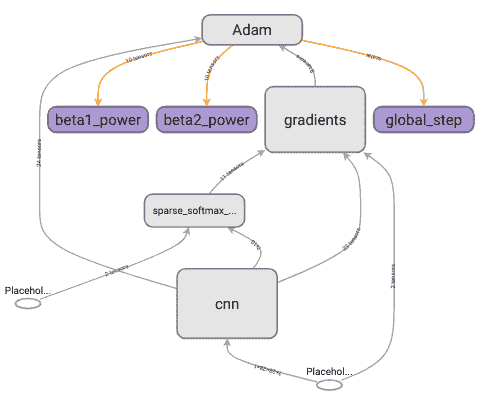

# 第三章：TensorFlow 图形架构

TensorFlow 的最简洁和完整的解释可以在项目主页上找到（[`www.tensorflow.org/`](https://www.tensorflow.org/)），它突出了库的每个重要部分。TensorFlow 是一个用于高性能数值计算的开源软件库。其灵活的架构允许在多种平台（CPU、GPU 和 TPU）上轻松部署计算，从桌面到服务器集群，再到移动设备和边缘设备。最初由 Google AI 组织内的 Google Brain 团队的研究人员和工程师开发，TensorFlow 对机器学习和深度学习提供强大支持，其灵活的数值计算核心在许多其他科学领域中都有应用。

TensorFlow 的优势和最重要的特点可以总结为以下三点：

+   **高性能数值计算库**：TensorFlow 可以通过导入它在许多不同的应用中使用。它用 C++ 编写，并为多种语言提供绑定。最完整、高级和广泛使用的绑定是 Python 绑定。TensorFlow 是一个高性能的计算库，可以在多个领域（不仅仅是机器学习！）中高效执行数值计算。

+   **灵活的架构**：TensorFlow 被设计为可以在不同的硬件（GPU、CPU 和 TPU）和不同的网络架构上工作；其抽象级别非常高，几乎可以用相同的代码在单台计算机或数据中心的机群中训练模型。

+   **面向生产**：TensorFlow 由 Google Brain 团队开发，作为在规模上开发和提供机器学习模型的工具。它的设计理念是简化整个设计到生产流程；该库已经准备好在生产环境中使用几个 API。

因此，TensorFlow 是一个数值计算库，请牢记这一点。您可以使用它执行它提供的任何数学操作，利用您手头所有硬件的能力，而无需进行任何与 ML 相关的操作。

在本章中，您将学习关于 TensorFlow 架构的所有必要知识：TensorFlow 是什么，如何设置您的环境来测试 1.x 和 2.0 两个版本以查看差异，您将了解到如何构建计算图；在此过程中，您还将学习如何使用 TensorBoard 可视化图形。

在本章中，您（终于！）将开始阅读一些代码。请不要只是阅读代码和相关说明；请编写您阅读的所有代码并尝试执行它们。按照设置我们需要的两个虚拟环境的说明操作，并通过编码深入了解 TensorFlow 的基础知识，这对于每个 TensorFlow 版本都是适用的。

本章将涵盖以下主题：

+   环境设置

+   数据流图

+   模型定义与训练

+   使用 Python 与图形交互

# 环境设置

为了理解 TensorFlow 的结构，本章中展示的所有示例将使用最新的 TensorFlow 1.x 版本：1.15；然而，我们也将设置运行 TensorFlow 2.0 所需的所有内容，因为我们将在下一章第四章，*TensorFlow 2.0 架构*中使用它。

本书中展示的所有示例都指定了在运行时使用的 TensorFlow 版本。作为一个库，我们只需指定所需的版本来安装它。当然，在一台系统上安装两个不同版本的同一个库是错误的。为了能够在版本之间切换，我们将使用两个不同的*Python 虚拟环境*。

下面是关于**虚拟环境**（**virtualenv**）是什么以及为什么它完全符合我们需求的解释，来自虚拟环境的官方介绍([`docs.Python.org/3/tutorial/venv.html#introduction`](https://docs.Python.org/3/tutorial/venv.html#introduction))：

Python 应用程序通常会使用一些不包含在标准库中的包和模块。应用程序有时需要某个库的特定版本，因为该应用程序可能需要修复特定的 bug，或者该应用程序可能是使用库的过时版本编写的。

这意味着一个 Python 安装可能无法满足每个应用程序的要求。如果应用程序 A 需要特定模块的版本 1.0，但应用程序 B 需要版本 2.0，那么这些需求就发生了冲突，安装版本 1.0 或 2.0 都会导致某个应用程序无法运行。

解决这个问题的方法是创建一个虚拟环境，这是一个自包含的目录树，包含特定版本 Python 的安装以及一些附加包。

不同的应用程序可以使用不同的虚拟环境。为了解决前面提到的冲突需求问题，应用程序 A 可以拥有自己的虚拟环境，安装版本 1.0，而应用程序 B 则有另一个虚拟环境，安装版本 2.0。如果应用程序 B 需要将某个库升级到版本 3.0，这将不会影响应用程序 A 的环境。

为了以最简单的方式创建虚拟环境，我们使用`pipenv`：用于创建和管理`virtualenv`的终极工具；请参阅[`github.com/pypa/pipenv`](https://github.com/pypa/pipenv)上的安装指南。作为跨平台工具，使用 Windows、Mac 或 Linux 没有区别。安装了`pipenv`后，我们只需为两个不同的 TensorFlow 版本创建这两个独立的虚拟环境。

我们将安装不带 GPU 支持的 TensorFlow，因为 `tensorflow-gpu` 依赖于 CUDA 和最近的 NVIDIA GPU 才能使用 `CUDA` 包提供的 GPU 加速。如果你拥有最近的 NVIDIA GPU，可以安装 `tensorflow-gpu` 包，但必须确保安装了 TensorFlow 包所需的 CUDA 版本（TensorFlow 2.0 和 TensorFlow 1.15 需要 CUDA 10）。此外，你必须确保在 `virtualenvs` 中安装的 `tensorflow-gpu` 包依赖于相同的 CUDA 版本（CUDA 10）；否则，其中一个安装将正常工作，另一个则不会。然而，如果你坚持使用 TensorFlow 的 2.0 和 1.15 版本，它们都编译了对 CUDA 10 的支持，因此，在系统上安装 CUDA 10 并在其 GPU 版本中安装它们应该可以完美工作。

# TensorFlow 1.x 环境

创建一个名为 `tf1` 的文件夹，进入其中，并运行以下命令来创建一个环境，激活它，并使用 `pip` 安装 TensorFlow：

```py
# create the virtualenv in the current folder (tf1)
pipenv --python 3.7
# run a new shell that uses the just created virtualenv
pipenv shell
# install, in the current virtualenv, tensorflow
pip install tensorflow==1.15
#or for GPU support: pip install tensorflow-gpu==1.15
```

使用 Python 3.7 并非强制要求；TensorFlow 支持 Python 3.5、3.6 和 3.7。因此，如果你使用的发行版/操作系统安装了较旧的 Python 版本，比如 Python 3.5，你只需在 `pipenv` 命令中更改 Python 版本。

目前为止，一切顺利。现在，你处于一个使用 Python 3.7 并安装了 `tensorflow==1.15` 的环境中。为了创建 TensorFlow 2.0 的新环境，我们必须首先退出当前正在使用的 `pipenv shell`。一般来说，要从一个 `virtualenv` 切换到另一个，我们使用 `pipenv shell` 激活它，并通过输入 `exit` 退出 shell 会话。

因此，在创建第二个虚拟环境之前，只需通过输入 `exit` 关闭当前运行的 shell。

# TensorFlow 2.0 环境

与 TensorFlow 1.x 环境相同的方式，创建一个名为 `tf2` 的文件夹，进入其中，并运行以下命令：

```py
# create the virtualenv in the current folder (tf2)
pipenv --python 3.7
# run a new shell that uses the just created virtualenv
pipenv shell
# install, in the current virtualenv, tensorflow
pip install tensorflow==2.0
#or for GPU support: pip install tensorflow-gpu==2.0
```

本书的其余部分指出了是否应该使用 TensorFlow 1.x 或 2.0 环境，代码前使用 `(tf1)` 或 `(tf2)` 符号表示。

现在我们可以开始深入分析 TensorFlow 结构，并描述在 TensorFlow 1.x 中显式显示但在 TensorFlow 2.0 中隐藏（但仍然存在的）数据流图。由于接下来的分析关注如何构建图以及如何使用各种低级操作来构建图的细节，几乎每个代码片段都使用 TensorFlow 1.x 环境。如果你仅因为已经了解并使用 TensorFlow 1.x 所以对版本 2.0 感兴趣，可以跳过此部分；但建议有经验的用户也阅读一下。

只使用`tensorflow 2.0`环境并替换对`tensorflow`包的每次调用，`tf`，可以使用 TensorFlow 2 中的兼容模块；因此，要拥有一个单一的`(tf2)`环境，必须将每个`tf.`替换为`tf.compat.v1.`，并通过在导入 TensorFlow 包之后添加`tf.compat.v1.disable_eager_execution()`行来禁用即时执行。

现在我们已经完成了环境设置，接下来让我们深入了解数据流图，学习如何开始编写一些实际的代码。

# 数据流图

为了成为一个高效、灵活且适合生产的库，TensorFlow 使用数据流图以操作之间的关系来表示计算。数据流是并行计算中广泛使用的一种编程模型，在数据流图中，节点表示计算单元，而边表示计算单元消耗或产生的数据。

如前一章所示，第二章，*神经网络与深度学习*，通过图表示计算的方式，具有能够通过梯度下降运行训练参数化机器学习模型所需的前向和后向传播的优点，应用链式法则将梯度计算作为一个局部过程应用到每个节点；然而，使用图的优势不仅仅是这个。

降低抽象层次，思考使用图表示计算的实现细节，带来了以下优点：

+   **并行性**：通过使用节点表示操作，边表示它们的依赖关系，TensorFlow 能够识别可以并行执行的操作。

+   **计算优化**：作为一个图，一个众所周知的数据结构，它可以被分析以优化执行速度。例如，可以检测到图中未使用的节点并将其删除，从而优化图的大小；还可以检测到冗余操作或次优图，并将其替换为最佳替代方案。

+   **可移植性**：图是一种与语言无关、与平台无关的计算表示。TensorFlow 使用**协议缓冲区**（**Protobuf**），它是一种简单的、与语言无关、与平台无关且可扩展的机制，用于序列化结构化数据以存储图。这实际上意味着，使用 Python 定义的 TensorFlow 模型可以以其语言无关的表示（Protobuf）保存，并且可以在另一个用其他语言编写的程序中使用。

+   **分布式执行**：每个图的节点可以放置在独立的设备上，甚至在不同的机器上。TensorFlow 将负责节点之间的通信，并确保图的执行正确无误。此外，TensorFlow 本身能够将图分配到多个设备上，知道某些操作在特定设备上表现更好。

让我们描述第一个数据流图，用于计算矩阵和向量之间的乘积与和，并保存图形表示，然后使用 TensorBoard 来可视化它：

`(tf1)`

```py
import tensorflow as tf

# Build the graph
A = tf.constant([[1, 2], [3, 4]], dtype=tf.float32)
x = tf.constant([[0, 10], [0, 0.5]])
b = tf.constant([[1, -1]], dtype=tf.float32)
y = tf.add(tf.matmul(A, x), b, name="result") #y = Ax + b

writer = tf.summary.FileWriter("log/matmul", tf.get_default_graph())
writer.close()
```

在这几行代码中，包含了 TensorFlow 构建计算图的一些特性。该计算图表示常量张量`A`（由 Python 变量`A`标识）与常量张量`x`（由 Python 变量`x`标识）之间的矩阵乘法，以及与标识为`b`的张量相加的结果。

计算的结果由`y` Python 变量表示，也就是在计算图中名为`result`的`tf.add`节点的输出。

请注意 Python 变量与计算图中的节点之间的区别：我们仅使用 Python 来描述计算图；Python 变量的名称在计算图定义中并没有意义。

此外，我们创建了`tf.summary.SummaryWriter`来保存我们构建的计算图的图形表示。`writer`对象已经创建，指定了存储图形表示的路径（`log/matmul`）以及通过`tf.get_default_graph`函数调用获得的`tf.Graph`对象，该函数返回默认的计算图，因为在任何 TensorFlow 应用中，至少会有一个图存在。

现在，你可以使用 TensorFlow 自带的免费数据可视化工具 TensorBoard 来可视化计算图。TensorBoard 通过读取指定`--logdir`路径中的日志文件，并创建一个 Web 服务器，使我们能够通过浏览器可视化我们的计算图。

要执行 TensorBoard 并可视化计算图，只需输入以下命令，并在 TensorBoard 指定的地址打开网页浏览器：

```py
tensorboard --logdir log/matmul
```

以下截图展示了在 TensorBoard 中看到的构建好的计算图，以及节点结果的详细信息。该截图有助于理解 TensorFlow 是如何表示节点以及每个节点具有哪些特征的：


这是描述操作 y = Ax + b 的计算图。结果节点用红色高亮显示，右侧栏展示了该节点的详细信息。

请注意，**我们只是描述了计算图**——对 TensorFlow API 的调用仅仅是添加操作（节点）和它们之间的连接（边）；在这个阶段**并没有执行计算**。在 TensorFlow 1.x 中，必须遵循以下方法——静态图定义和执行，而在 2.0 版本中，这已经不再是强制要求。

由于计算图是框架的基本构建块（在每个版本中都是如此），因此必须深入理解它，因为即使在过渡到 2.0 版本后，了解底层发生的事情仍然至关重要（这对调试也大有帮助！）。

# 主要结构 – tf.Graph

如前一部分所述，Python 变量的名称与节点名称之间没有关系。始终记住，TensorFlow 是一个 C++ 库，我们使用 Python 来简化图的构建。Python 简化了图的描述阶段，因为它甚至可以在不显式定义图的情况下创建一个图；实际上，定义图有两种不同的方式：

+   **隐式**：只需使用 `tf.*` 方法定义一个图。如果图没有显式定义，TensorFlow 总是定义一个默认的 `tf.Graph`，可以通过调用 `tf.get_default_graph` 来访问。隐式定义限制了 TensorFlow 应用程序的表达能力，因为它只能使用一个图。

+   **显式**：可以显式定义计算图，从而每个应用程序可以有多个图。这个选项具有更强的表达能力，但通常不需要，因为需要多个图的应用程序并不常见。

为了显式定义一个图，TensorFlow 允许创建 `tf.Graph` 对象，通过 `as_default` 方法创建一个上下文管理器；在该上下文内定义的每个操作都将被放置在关联的图中。实际上，`tf.Graph` 对象为其包含的 `tf.Operation` 对象定义了一个命名空间。

`tf.Graph` 结构的第二个特点是其 **图集合**。每个 `tf.Graph` 使用集合机制来存储与图结构相关的元数据。一个集合通过键唯一标识，其内容是一个对象/操作的列表。用户通常不需要关心集合的存在，因为它们由 TensorFlow 本身使用，以正确地定义图。

例如，在定义一个参数化的机器学习模型时，图必须知道哪些 `tf.Variable` 对象是学习过程中需要更新的变量，以及哪些变量不是模型的一部分，而是其他的东西（例如在训练过程中计算的均值/方差——这些是变量，但不可训练）。在这种情况下，正如我们将在下一部分看到的，当创建一个 `tf.Variable` 时，它默认会被添加到两个集合中：全局变量集合和可训练变量集合。

# 图定义——从 tf.Operation 到 tf.Tensor

数据流图是计算的表示，其中节点表示计算单元，边表示计算消耗或生成的数据。

在 `tf.Graph` 的上下文中，每个 API 调用定义一个 `tf.Operation`（节点），它可以有多个输入和输出 `tf.Tensor`（边）。例如，参照我们的主要示例，当调用 `tf.constant([[1, 2], [3, 4]], dtype=tf.float32)` 时，一个名为 `Const` 的新节点（`tf.Operation`）会被添加到从上下文继承的默认 `tf.Graph` 中。这个节点返回一个名为 `Const:0` 的 `tf.Tensor`（边）。

由于图中的每个节点都是唯一的，如果图中已有一个名为 *Const* 的节点（这是默认赋给所有常量的名称），TensorFlow 会通过附加后缀 '_1'、'_2' 等来确保名称的唯一性。如果未提供名称，正如我们的例子中所示，TensorFlow 会为每个添加的操作提供一个默认名称，并同样添加后缀以保证它们的唯一性。

输出的 `tf.Tensor` 与关联的 `tf.Operation` 具有相同的名称，并附加了 *:ID* 后缀。*ID* 是一个递增的数字，表示操作生成的输出数量。对于 `tf.constant`，输出只有一个张量，因此 *ID=0*；但也可以有多个输出的操作，在这种情况下，后缀 *:0、:1* 等将被添加到操作生成的 `tf.Tensor` 名称中。

也可以为在上下文中创建的所有操作添加名称作用域前缀——上下文由 `tf.name_scope` 调用定义。默认的名称作用域前缀是一个由 `/` 分隔的活动 `tf.name_scope` 上下文管理器的名称列表。为了保证作用域内定义的操作和作用域本身的唯一性，`tf.Operation` 使用的相同后缀追加规则也适用。

以下代码片段展示了如何将我们的基准示例包装到一个独立的图中，如何在同一 Python 脚本中创建第二个独立的图，并展示了如何使用 `tf.name_scope` 更改节点名称并添加前缀。首先，我们导入 TensorFlow 库：

`(tf1)`

```py
import tensorflow as tf
```

然后，我们定义了两个 `tf.Graph` 对象（作用域系统使得轻松使用多个图成为可能）：

```py
g1 = tf.Graph()
g2 = tf.Graph()

with g1.as_default():
    A = tf.constant([[1, 2], [3, 4]], dtype=tf.float32)
    x = tf.constant([[0, 10], [0, 0.5]])
    b = tf.constant([[1, -1]], dtype=tf.float32)
    y = tf.add(tf.matmul(A, x), b, name="result")

with g2.as_default():
    with tf.name_scope("scope_a"):
        x = tf.constant(1, name="x")
        print(x)
    with tf.name_scope("scope_b"):
        x = tf.constant(10, name="x")
        print(x)
    y = tf.constant(12)
    z = x * y
```

然后，我们定义两个摘要写入器。我们需要使用两个不同的 `tf.summary.FileWriter` 对象来记录两个独立的图。

```py
writer = tf.summary.FileWriter("log/two_graphs/g1", g1)
writer = tf.summary.FileWriter("log/two_graphs/g2", g2)
writer.close()
```

运行示例并使用 TensorBoard 可视化这两个图，使用 TensorBoard 左侧的列切换不同的“运行”。

在示例中，具有相同名称 `x` 的节点可以共存于同一个图中，但必须位于不同的作用域下。实际上，位于不同作用域下使得这些节点完全独立，并且是完全不同的对象。节点名称实际上不仅仅是传递给操作定义的 `name` 参数，而是其完整路径，包括所有的前缀。

事实上，运行脚本时，输出如下：

```py
Tensor("scope_a/x:0", shape=(), dtype=int32)
Tensor("scope_b/x:0", shape=(), dtype=int32)
```

如我们所见，完整的名称不同，我们还可以看到有关生成张量的其他信息。通常，每个张量都有一个名称、类型、秩和形状：

+   **名称** 唯一标识计算图中的张量。通过使用 `tf.name_scope`，我们可以为张量名称添加前缀，从而改变其完整路径。我们还可以通过每个 `tf.*` API 调用的 `name` 属性来指定名称。

+   **类型**是张量的数据类型，例如 `tf.float32`、`tf.int8` 等。

+   **秩**在 TensorFlow 中（这与严格的数学定义不同）仅指张量的维度数量；例如，标量的秩为 0，向量的秩为 1，矩阵的秩为 2，依此类推。

+   **形状**是每个维度中的元素数量；例如，标量的秩为 0，形状为`()`，向量的秩为 1，形状为`(D0)`，矩阵的秩为 2，形状为`(D0, D1)`，依此类推。

有时，可能会看到一个维度为`-1`的形状。这是一种特殊语法，告诉 TensorFlow 从其他已定义的维度推断出应该放置在该位置的值。通常，负形状用于`tf.reshape`操作，它能够改变张量的形状，只要请求的形状与张量的元素数量兼容。

在定义张量时，可能会看到一个或多个维度的值为`None`。在这种情况下，完整的形状定义会推迟到执行阶段，因为使用`None`指示 TensorFlow 在运行时才会知道该位置的值。

作为一个 C++库，TensorFlow 是严格静态类型的。这意味着每个操作/张量的类型必须在图定义时就已知。而且，这也意味着不可能在不兼容的类型之间执行操作。

仔细观察基准示例，可以看到矩阵乘法和加法操作都是在具有相同类型`tf.float32`的张量上进行的。由 Python 变量`A`和`b`标识的张量已经定义，确保了操作定义时的类型明确，而张量`x`也具有相同的`tf.float32`类型；但在这种情况下，它是由 Python 绑定推断出来的，Python 绑定能够查看常量值并推断出在创建操作时应使用的类型。

Python 绑定的另一个特点是，它们简化了一些常见数学操作的定义，采用了操作符重载。最常见的数学操作都有对应的`tf.Operation`；因此，使用操作符重载来简化图定义是很自然的。

以下表格显示了 TensorFlow Python API 中重载的可用操作符：

| **Python 操作符** | **操作名称** |
| --- | --- |
| `__neg__` | 一元 `-` |
| `__abs__` | `abs()` |
| `__invert__` | 一元 `~` |
| `__add__` | 二进制 `+` |
| `__sub__` | 二进制 `-` |
| `__mul__` | 二进制逐元素 `*` |
| `__floordiv__` | 二进制 `//` |
| `__truediv__` | 二进制 `/` |
| `__mod__` | 二进制 `%` |
| `__pow__` | 二进制 `**` |
| `__and__` | 二进制 `&` |
| `__or__` | 二进制 `&#124;` |
| `__xor__` | 二进制 `^` |
| `__le__` | 二进制 `<` |
| `__lt__` | 二进制 `<=` |
| `__gt__` | 二进制 `>` |
| `__ge__` | 二进制 `<=` |
| `__matmul__` | 二进制 `@` |

运算符重载允许更快速的图形定义，且与它们的 `tf.*` API 调用完全等效（例如，使用 `__add__` 与使用 `tf.add` 函数是一样的）。只有在需要为操作指定名称时，使用 TensorFlow API 调用才有优势。通常，在定义图形时，我们只关心给输入和输出节点赋予有意义的名称，而其他节点可以由 TensorFlow 自动命名。

使用重载运算符时，我们无法指定节点名称，因此也无法指定输出张量的名称。事实上，在基准示例中，我们使用 `tf.add` 方法定义加法操作，是因为我们想给输出张量一个有意义的名称（result）。实际上，这两行代码是等效的：

```py
# Original example, using only API calls
y = tf.add(tf.matmul(A, x), b, name="result")

# Using overloaded operators
y = A @ x + b
```

如本节开头所述，TensorFlow 本身可以将特定的节点放置在更适合执行操作的设备上。该框架非常灵活，允许用户只使用 `tf.device` 上下文管理器将操作手动放置在不同的本地和远程设备上。

# 图形放置 – tf.device

`tf.device` 创建一个上下文管理器，匹配一个设备。该函数允许用户请求在其创建的上下文中创建的所有操作都放置在相同的设备上。由 `tf.device` 标识的设备不仅仅是物理设备；事实上，它能够识别远程服务器、远程设备、远程工作者以及不同类型的物理设备（GPU、CPU 和 TPU）。必须遵循设备规格来正确指示框架使用所需设备。设备规格的形式如下：

```py
/job:<JOB_NAME>/task:<TASK_INDEX>/device:<DEVICE_TYPE>:<DEVICE_INDEX>
```

详细说明如下：

+   `<JOB_NAME>` 是一个字母数字字符串，且不能以数字开头

+   `<DEVICE_TYPE>` 是已注册的设备类型（例如 GPU 或 CPU）

+   `<TASK_INDEX>` 是一个非负整数，表示名为 `<JOB_NAME>` 的任务索引

+   `<DEVICE_NAME>` 是一个非负整数，表示设备的索引；例如，`/GPU:0` 是第一个 GPU

不需要指定设备规格的每一部分。例如，当运行单机配置并且只有一张 GPU 时，你可以使用 `tf.device` 将某些操作固定到 CPU 和 GPU。

因此，我们可以扩展我们的基准示例，将操作放置在我们选择的设备上。因此，可以将矩阵乘法放置在 GPU 上，因为它对这种操作进行了硬件优化，同时将其他所有操作保持在 CPU 上。

请注意，由于这只是图形描述，因此无需实际拥有 GPU 或使用 `tensorflow-gpu` 包。首先，我们导入 TensorFlow 库：

`(tf1)`

```py
import tensorflow as tf
```

现在，使用上下文管理器将操作放置在不同的设备上，首先是在本地机器的第一个 CPU 上：

```py
with tf.device("/CPU:0"):
    A = tf.constant([[1, 2], [3, 4]], dtype=tf.float32)
    x = tf.constant([[0, 10], [0, 0.5]])
    b = tf.constant([[1, -1]], dtype=tf.float32)
```

然后，在本地机器的第一个 GPU 上：

```py
with tf.device("/GPU:0"):
    mul = A @ x
```

当设备未通过作用域强制指定时，TensorFlow 会决定哪个设备更适合放置操作：

```py
y = mul + b
```

然后，我们定义总结写入器：

```py
writer = tf.summary.FileWriter("log/matmul_optimized", tf.get_default_graph())
writer.close()
```

如果我们查看生成的图，我们会看到它与基准示例生成的图完全相同，有两个主要的区别：

+   输出张量没有有意义的名称，而是使用默认名称

+   点击矩阵乘法节点后，可以在 TensorBoard 中看到该操作必须在本地机器的第一个 GPU 上执行。

`matmul` 节点被放置在本地机器的第一个 GPU 上，而任何其他操作则在 CPU 上执行。TensorFlow 会以透明的方式处理不同设备之间的通信：


请注意，尽管我们已定义产生常量张量的常量操作，但它们的值并未显示在节点的属性中，也未显示在输入/输出属性中。

在使用静态图和会话执行的模式下，执行与图的定义是完全分离的。然而在 eager 执行模式下，这种情况不再成立，但由于本章的重点是 TensorFlow 架构，因此也值得关注使用`tf.Session`的执行部分：在 TensorFlow 2.0 中，会话仍然存在，但被隐藏了，正如我们将在下一章第四章，*TensorFlow 2.0 架构*中看到的那样。

# 图执行 - tf.Session

`tf.Session` 是 TensorFlow 提供的一个类，用于表示 Python 程序和 C++ 运行时之间的连接。

`tf.Session` 对象是唯一能够直接与硬件（通过 C++ 运行时）进行通信的对象，它将操作放置在指定的设备上，使用本地和分布式的 TensorFlow 运行时，目的是具体构建定义好的图。`tf.Session` 对象经过高度优化，一旦正确构建，它会缓存 `tf.Graph`，以加速执行。

作为物理资源的所有者，`tf.Session` 对象必须像文件描述符一样使用，以执行以下操作：

+   通过创建 `tf.Session` 获取资源（相当于操作系统的 `open` 调用）

+   使用资源（相当于对文件描述符执行 `read/write` 操作）

+   使用 `tf.Session.close` 释放资源（相当于 `close` 调用）

通常，我们通过上下文管理器使用会话，而不是手动定义会话并处理其创建和销毁，这样会话会在代码块退出时自动关闭。

`tf.Session` 的构造函数相当复杂且高度可定制，因为它用于配置和创建计算图的执行。

在最简单且最常见的场景中，我们只是希望使用当前本地硬件执行先前描述的计算图，具体如下：

`(tf1)`

```py
# The context manager opens the session
with tf.Session() as sess:
    # Use the session to execute operations
    sess.run(...)
# Out of the context, the session is closed and the resources released
```

有一些更复杂的场景，在这些场景中，我们可能不希望使用本地执行引擎，而是使用远程的 TensorFlow 服务器，该服务器可以访问它控制的所有设备。通过仅使用服务器的 URL（`grpc://`），可以通过`tf.Session`的`target`参数来实现这一点。

`(tf1)`

```py
# the IP and port of the TensorFlow server
ip = "192.168.1.90"
port = 9877
with tf.Session(f"grpc://{ip}:{port}") as sess:
    sess.run(...)
```

默认情况下，`tf.Session`将捕获并使用默认的`tf.Graph`对象，但在使用多个图时，可以通过`graph`参数指定要使用的图。理解为什么使用多个图不常见是很容易的，因为即使是`tf.Session`对象也只能一次处理一个图。

`tf.Session`对象的第三个参数是通过`config`参数指定的硬件/网络配置。该配置通过`tf.ConfigProto`对象指定，`tf.ConfigProto`对象能够控制会话的行为。`tf.ConfigProto`对象相当复杂，选项丰富，其中最常见和广泛使用的两个选项如下（其他选项通常用于分布式和复杂的环境）：

+   `allow_soft_placement`：如果设置为`True`，则启用软设备放置。并不是每个操作都能随意地放置在 CPU 和 GPU 上，因为某些操作在 GPU 上的实现可能缺失，使用此选项可以让 TensorFlow 忽略通过`tf.device`指定的设备，并在图定义时当指定了不支持的设备时，将操作放置在正确的设备上。

+   `gpu_options.allow_growth`：如果设置为`True`，则改变 TensorFlow 的 GPU 内存分配器；默认的分配器会在创建`tf.Session`时分配所有可用的 GPU 内存，而当`allow_growth`设置为`True`时，分配器会逐步增加分配的内存量。默认的分配器采用这种方式，因为在生产环境中，物理资源完全用于`tf.Session`的执行，而在标准研究环境中，资源通常是共享的（GPU 是可以被其他进程使用的资源，尽管 TensorFlow 的`tf.Session`正在执行）。

基础示例现在可以扩展，不仅定义一个图，还可以继续有效地构建并执行它：

```py
import tensorflow as tf
import numpy as np

A = tf.constant([[1, 2], [3, 4]], dtype=tf.float32)
x = tf.constant([[0, 10], [0, 0.5]])
b = tf.constant([[1, -1]], dtype=tf.float32)
y = tf.add(tf.matmul(A, x), b, name="result")

writer = tf.summary.FileWriter("log/matmul", tf.get_default_graph())
writer.close()

with tf.Session() as sess:
    A_value, x_value, b_value = sess.run([A, x, b])
    y_value = sess.run(y)

    # Overwrite
    y_new = sess.run(y, feed_dict={b: np.zeros((1, 2))})

print(f"A: {A_value}\nx: {x_value}\nb: {b_value}\n\ny: {y_value}")
print(f"y_new: {y_new}")
```

第一个`sess.run`调用会评估三个`tf.Tensor`对象，`A, x, b`，并返回它们的值作为`numpy`数组。

第二次调用，`sess.run(y)`，按照以下方式工作：

1.  `y`是一个操作的输出节点：回溯到它的输入。

1.  递归回溯每个节点，直到找到所有没有父节点的节点。

1.  评估输入；在此情况下，为`A, x, b`张量。

1.  跟随依赖图：乘法操作必须在将其结果与`b`相加之前执行。

1.  执行矩阵乘法。

1.  执行加法操作。

加法是图解析的入口点（Python 变量`y`），并且计算结束。

因此，第一个打印调用会产生以下输出：

```py
A: [[1\. 2.]
    [3\. 4.]]
x: [[ 0\. 10\. ]
    [ 0\. 0.5]]
b: [[ 1\. -1.]]
y: [[ 1\. 10.]
    [ 1\. 31.]]
```

第三个 `sess.run` 调用展示了如何将外部的值作为 `numpy` 数组注入到计算图中，从而覆盖节点。 `feed_dict` 参数允许你这样做：通常，输入是通过 `feed_dict` 参数传递给图的，并通过覆盖为此目的而创建的 `tf.placeholder` 操作。

`tf.placeholder` 只是一个占位符，目的是当外部值没有注入到图中时抛出错误。然而，`feed_dict` 参数不仅仅是传递占位符的方式。事实上，前面的示例展示了它如何被用来覆盖任何节点。通过将节点由 Python 变量 `b` 指定的变量通过 `numpy` 数组覆盖，且该数组在类型和形状上必须与被覆盖的变量兼容，得到的结果如下：

```py
y_new: [[ 0\. 11.]
        [ 0\. 32.]]
```

基准示例已经更新，以展示以下内容：

+   如何构建一个图

+   如何保存图的图形表示

+   如何创建一个会话并执行已定义的图

到目前为止，我们已经使用了具有常量值的图，并通过 `sess.run` 调用的 `feed_dict` 参数覆盖了节点参数。然而，由于 TensorFlow 被设计用来解决复杂问题，因此引入了 `tf.Variable` 的概念：每个参数化的机器学习模型都可以用 TensorFlow 来定义和训练。

# 静态图中的变量

变量是一个对象，它在多个 `sess.run` 调用中保持图的状态。通过构造 `tf.Variable` 类的实例，变量会被添加到 `tf.Graph` 中。

变量由（类型，形状）对完全定义，通过调用 `tf.Variable` 创建的变量可以作为图中其他节点的输入；实际上，`tf.Tensor` 和 `tf.Variable` 对象在构建图时可以以相同的方式使用。

变量相对于张量具有更多的属性：变量对象必须初始化，因此必须有其初始化器；变量默认会添加到全局变量和可训练变量的图集合中。如果将变量设置为 非可训练，它可以被图用来存储状态，但优化器在执行学习过程时会忽略它。

声明图中变量有两种方式：`tf.Variable` 和 `tf.get_variable`。使用 `tf.Variable` 更简单，但功能较弱——第二种方法使用起来更复杂，但具有更强的表达能力。

# tf.Variable

通过调用 `tf.Variable` 创建变量将始终创建一个新的变量，并且始终需要指定初始值。以下几行展示了如何创建一个名为 `W` 的变量，形状为 `(5, 5, size_in, size_out)`，以及一个名为 `B` 的变量，形状为 `(size_out)`：

```py
w = tf.Variable(tf.truncated_normal([5, 5, size_in, size_out], stddev=0.1), name="W")
b = tf.Variable(tf.constant(0.1, shape=[size_out]), name="B")
```

`w`的初始值通过`tf.truncated_normal`操作生成，该操作从均值为 0、标准差为 0.1 的正态分布中采样，生成初始化张量所需的`5 x 5 x size_in x size_out`（总数）值，而`b`则使用通过`tf.constant`操作生成的常数值 0.1 进行初始化。

由于每次调用`tf.Variable`都会在图中创建一个新的变量，它是创建层的完美候选者：每个层（例如卷积层/全连接层）定义都需要创建一个新的变量。例如，以下代码行展示了两个可以用来定义卷积神经网络和/或全连接神经网络的函数定义：

`(tf1)`

第一个函数创建了一个 2D 卷积层（使用 5 x 5 的卷积核），并随后进行最大池化操作，将输出的空间维度减半：

```py
def conv2D(input, size_in, size_out, name="conv"):
"""Define a 2D convolutional layer + max pooling.
Args:
    input: Input tensor: 4D.
    size_in: it could be inferred by the input (input.shape[-1])
    size_out: the number of convolutional kernel to learn
    name: the name of the operation, using name_scope.
Returns:
    The result of the convolution as specified + a max pool operation
    that halves the spatial resolution.
"""
    with tf.name_scope(name):
        w = tf.Variable(tf.truncated_normal([5, 5, size_in, size_out], stddev=0.1), name="W")
        b = tf.Variable(tf.constant(0.1, shape=[size_out]), name="B")
        conv = tf.nn.conv2d(input, w, strides=[1, 1, 1, 1], padding="SAME")
        act = tf.nn.relu(conv + b)
        tf.summary.histogram("w", w)
        tf.summary.histogram("b", b)
        return tf.nn.max_pool(act, ksize=[1, 2, 2, 1], strides=[1, 2, 2, 1], padding="SAME")
```

第二个函数定义了一个全连接层：

`(tf1)`

```py
def fc(input, size_in, size_out, name="fc"):
"""Define a fully connected layer.
Args:
    input: Input tensor: 2D.
    size_in: it could be inferred by the input (input.shape[-1])
    size_out: the number of output neurons kernel to learn
    name: the name of the operation, using name_scope.
Returns:
    The linear neurons output.
"""
```

两个函数还使用了`tf.summary`模块来记录权重、偏置和激活值的直方图，这些值在训练过程中可能会发生变化。

调用`tf.summary`方法会自动将摘要添加到一个全局集合中，该集合由`tf.Saver`和`tf.SummaryWriter`对象使用，以将每个摘要值记录到 TensorBoard 日志目录中：

`(tf1)`

```py
with tf.name_scope(name):
    w = tf.Variable(tf.truncated_normal([size_in, size_out], stddev=0.1), name="W")
    b = tf.Variable(tf.constant(0.1, shape=[size_out]), name="B")
    act = tf.matmul(input, w) + b
    tf.summary.histogram("w", w)
    tf.summary.histogram("b", b)
    return act
```

以这种方式定义的层非常适合在用户希望定义一个由多个层堆叠组成的深度学习模型，并根据一个从第一层到最后一层的输入进行训练的最常见场景。

如果训练阶段不是标准的，而是需要在不同的输入之间共享变量的值，怎么办？

我们需要使用 TensorFlow 的**变量共享**功能，这在使用`tf.Variable`创建的层定义中是不可行的，因此我们必须改用最强大的方法——`tf.get_variable`。

# tf.get_variable

与`tf.Variable`类似，`tf.get_variable`也允许定义和创建新变量。主要的区别在于，如果变量已经定义，它的行为会发生变化。

`tf.get_variable`总是与`tf.variable_scope`一起使用，因为它通过`reuse`参数启用`tf.get_variable`的变量共享功能。以下示例阐明了这一概念：

`(tf1)`

```py
with tf.variable_scope("scope"):
    a = tf.get_variable("v", [1]) # a.name == "scope/v:0"
with tf.variable_scope("scope"):
    b = tf.get_variable("v", [1]) # ValueError: Variable scope/v:0 already exists
with tf.variable_scope("scope", reuse=True):
    c = tf.get_variable("v", [1]) # c.name == "scope/v:0"
```

在上述示例中，Python 变量`a`和`c`指向相同的图变量，名为`scope/v:0`。因此，使用`tf.get_variable`定义变量的层可以与`tf.variable_scope`结合使用，以定义或重用该层的变量。当使用对抗训练训练生成模型时，这非常有用且强大，我们将在第九章中详细讨论*生成对抗网络*。

与 `tf.Variable` 不同，在这种情况下，我们不能直接传递初始值（将值直接作为输入传递给 `call` 方法）；我们必须始终显式使用初始化器。之前定义的层可以通过 `tf.get_variable` 编写（这是定义变量的推荐方式），如下所示：

`(tf1)`

```py
def conv2D(input, size_in, size_out):
    w = tf.get_variable(
        'W', [5, 5, size_in, size_out],
        initializer=tf.truncated_normal_initializer(stddev=0.1))
    b = tf.get_variable(
        'B', [size_out], initializer=tf.constant_initializer(0.1))
    conv = tf.nn.conv2d(input, w, strides=[1, 1, 1, 1], padding="SAME")
    act = tf.nn.relu(conv + b)
    tf.summary.histogram("w", w)
    tf.summary.histogram("b", b)
    return tf.nn.max_pool(
        act, ksize=[1, 2, 2, 1], strides=[1, 2, 2, 1], padding="SAME")

def fc(input, size_in, size_out):
    w = tf.get_variable(
        'W', [size_in, size_out],
        initializer=tf.truncated_normal_initializer(stddev=0.1))
    b = tf.get_variable(
        'b', [size_out], initializer=tf.constant_initializer(0.1))
    act = tf.matmul(input, w) + b
    tf.summary.histogram("w", w)
    tf.summary.histogram("b", b)
    return act
```

调用 `conv2D` 或 `fc` 会定义当前作用域内所需的变量，因此，为了定义两个卷积层而不发生命名冲突，必须使用 `tf.variable_scope`：

```py
input = tf.placeholder(tf.float32, (None, 28,28,1))
with tf.variable_scope("first)":
    conv1 = conv2d(input, input.shape[-1].value, 10)
with tf.variable_scope("second"): #no conflict, variables under the second/ scope
    conv2 = conv2d(conv1, conv1.shape[-1].value, 1)
# and so on...
```

手动定义层是一个很好的练习，了解 TensorFlow 提供了定义每个机器学习层所需的所有原语是每个机器学习从业者应该知道的事情。然而，手动定义每一层是乏味且重复的（我们几乎每个项目都需要全连接层、卷积层、dropout 层和批量归一化层），因此，TensorFlow 已经提供了一个名为 `tf.layers` 的模块，其中包含所有最常用且广泛使用的层，这些层在底层使用 `tf.get_variable` 定义，因此，可以与 `tf.variable_scope` 一起使用，以共享它们的变量。

# 模型定义与训练

免责声明：在 TensorFlow 2.0 中，层模块已被完全移除，使用 `tf.keras.layers` 定义层是新的标准；然而，`tf.layers` 的概述仍然值得阅读，因为它展示了按层逐步推理定义深度模型是自然的做法，并且也让我们了解了从 `tf.layers` 到 `tf.keras.layers` 迁移背后的原因。

# 使用 tf.layers 定义模型

如上一节所示，TensorFlow 提供了定义神经网络层所需的所有原始功能：用户在定义变量、操作节点、激活函数和日志记录时需要小心，并定义一个适当的接口来处理所有情况（例如，添加或不添加偏置项、为层参数添加正则化等）。

TensorFlow 1.x 中的 `tf.layers` 模块和 TensorFlow 2.0 中的 `tf.keras.layers` 模块提供了一个出色的 API，以便以方便且强大的方式定义机器学习模型。每个 `tf.layers` 中的层都使用 `tf.get_variable` 来定义变量，因此，用这种方式定义的每个层都可以使用 `tf.variable_scope` 提供的变量共享功能。

之前手动定义的 2D 卷积层和全连接层在 `tf.layers` 中得到了清晰的呈现，并且使用它们来定义类似 LeNet 的卷积神经网络非常容易，如所示。首先，我们定义一个用于分类的卷积神经网络：

`(tf1)`

```py
def define_cnn(x, n_classes, reuse, is_training):
    """Defines a convolutional neural network for classification.
    Args:
        x: a batch of images: 4D tensor.
        n_classes: the number of classes, hence, the number of output neurons.
        reuse: the `tf.variable_scope` reuse parameter.
        is_training: boolean variable that indicates if the model is in training.
    Returns:
        The output layer.
    """
    with tf.variable_scope('cnn', reuse=reuse):
        # Convolution Layer with 32 learneable filters 5x5 each
        # followed by max-pool operation that halves the spatial extent.
        conv1 = tf.layers.conv2d(x, 32, 5, activation=tf.nn.relu)
        conv1 = tf.layers.max_pooling2d(conv1, 2, 2)

        # Convolution Layer with 64 learneable filters 3x3 each.
        # As above, max pooling to halve.
        conv2 = tf.layers.conv2d(conv1, 64, 3, activation=tf.nn.relu)
        conv2 = tf.layers.max_pooling2d(conv2, 2, 2)
```

然后，我们将数据展平为一个 1D 向量，以便使用全连接层。请注意新形状的计算方式，以及批量大小位置的负维度：

```py
        shape = (-1,conv2.shape[1].value * conv2.shape[2].value * conv2.shape[3].value)
        fc1 = tf.reshape(conv2, shape)

        # Fully connected layer
        fc1 = tf.layers.dense(fc1, 1024)
        # Apply (inverted) dropout when in training phase.
        fc1 = tf.layers.dropout(fc1, rate=0.5, training=is_training)

        # Prediction: linear neurons
        out = tf.layers.dense(fc1, n_classes)

    return out

input = tf.placeholder(tf.float32, (None, 28, 28, 1))
logits = define_cnn(input, 10, reuse=False, is_training=True)
```

由于这些是 TensorFlow 原始操作的高级封装，本书无需详细说明每一层的功能，因为从层的名称和文档中已经能清楚地了解。读者被邀请熟悉官方的 TensorFlow 文档，特别是尝试使用层来定义自己的分类模型：[`www.tensorflow.org/versions/r1.15/api_docs/python/tf/layers`](https://www.tensorflow.org/versions/r1.15/api_docs/python/tf/layers)[.](https://www.tensorflow.org/versions/r1.15/api_docs/python/tf/layers)

使用基线示例并将图替换为此 CNN 定义，使用 TensorFlow 可以看到每一层都有自己的作用域，各层之间是如何连接的，并且正如第二张图所示，通过双击某一层，可以查看其内容，了解其实现方式，而无需查看代码。

下图展示了定义的类似 LeNet 的 CNN 架构。整个架构位于*cnn*作用域下，输入节点是一个占位符。可以直观地看到各层如何连接，以及 TensorFlow 如何通过在相同名称的模块后添加`_1`后缀来避免命名冲突：


双击 `conv2d` 块可以分析各层定义的不同组件是如何相互连接的。请注意，与我们的层实现不同，TensorFlow 开发者使用了名为`BiasAdd`的操作来添加偏置，而不是直接使用原始的`Add`操作。虽然行为相同，但语义更为清晰：


作为练习，你可以尝试通过定义一个类似刚刚展示的 CNN 来扩展基线，进而可视化并理解层的结构。

我们必须始终记住，TensorFlow 1.x 遵循图定义和会话执行的方法。这意味着即使是训练阶段，也应该在同一个`tf.Graph`对象中描述，然后才能执行。

# 自动微分 – 损失函数和优化器

TensorFlow 使用自动微分——微分器是一个包含所有必要规则的对象，用于构建一个新的图，该图对每个经过的节点计算其导数。TensorFlow 1.x 中的 `tf.train` 模块包含最常用的微分器类型，这些微分器在这里被称为优化器。在该模块中，除了其他优化器，还可以找到 ADAM 优化器（`tf.train.AdamOptimizer`）和标准的梯度下降优化器（`tf.train.GradientDescentOptimizer`）。每个优化器都是实现了通用接口的对象。该接口标准化了如何使用优化器来训练模型。执行一个小批量梯度下降步骤仅仅是执行 Python 循环中的训练操作；也就是说，执行每个优化器的`.minimize`方法返回的操作。

正如你从前一章中呈现的理论中所了解的，第二章，*神经网络与深度学习*，要使用交叉熵损失训练分类器，必须对标签进行独热编码。TensorFlow 有一个模块，`tf.losses`，其中包含了最常用的损失函数，它们也能够自行执行标签的独热编码。此外，每个损失函数都期望接收 `logits` 张量作为输入；即模型的线性输出，未应用 softmax/sigmoid 激活函数。`logits` 张量的名称是 TensorFlow 的设计选择：即使没有对其应用 sigmoidal 转换，它仍然被这样称呼（一个更好的选择是将这个参数命名为 `unscaled_logits`）。

这种选择的原因是让用户专注于网络设计，而不必担心计算某些损失函数时可能出现的数值不稳定问题；实际上，`tf.losses` 模块中定义的每个损失函数在数值上都是稳定的。

为了完整理解该主题，并展示优化器只是构建一个与前一个图连接的图（实际上它只添加节点），可以将记录图的基准示例与定义网络、损失函数和优化器的示例结合起来。

因此，可以按如下方式修改前面的示例。为了定义标签的输入占位符，我们可以定义损失函数（`tf.losses.sparse_softmax_cross_entropy`），并实例化 ADAM 优化器以最小化它：

```py
# Input placeholders: input is the cnn input, labels is the loss input.
input = tf.placeholder(tf.float32, (None, 28, 28, 1))
labels = tf.placeholder(tf.int32, (None,))

logits = define_cnn(input, 10, reuse=False, is_training=True)
# Numerically stable loss
loss = tf.losses.sparse_softmax_cross_entropy(labels, logits)
# Instantiate the Optimizer and get the operation to use to minimize the loss
train_op = tf.train.AdamOptimizer().minimize(loss)

# As in the baseline example, log the graph
writer = tf.summary.FileWriter("log/graph_loss", tf.get_default_graph())
writer.close()
```

TensorBoard 允许我们可视化构建的图，如下所示：


上图显示了在定义损失函数并调用 `.minimize` 方法时图的结构。

ADAM 优化器是一个单独的块，它只有输入——模型（*cnn*）、梯度，以及 ADAM 使用的不可训练的 *beta1* 和 *beta2* 参数（在此情况下，它们在构造函数中指定并保持默认值）。如你从理论中所知，梯度是相对于模型参数计算的，以最小化损失函数：左侧的图完全描述了这个构造。由 minimize 方法调用创建的梯度块是一个命名范围，因此，可以通过双击它来分析，就像分析 TensorBoard 中的任何其他块一样。

下图展示了扩展后的梯度块：它包含一个与用于前向模型的图的镜像结构。优化器用来优化参数的每个块都是梯度块的输入。梯度是优化器（ADAM）的输入：


继理论之后，区分器（优化器）创建了一个新的图形，它与原始图形相似；这个第二个图形在梯度块内部执行梯度计算。优化器利用生成的梯度来应用它定义的变量更新规则并实施学习过程。

关于静态图和会话执行，我们到目前为止所看到的内容的简要回顾如下：

1.  使用占位符或其他优化方法定义模型输入，如后续章节所示

1.  将模型定义为输入的函数

1.  将损失函数定义为模型输出的函数

1.  定义优化器并调用`.minimize`方法以定义梯度计算图

这四个步骤使我们能够定义一个简单的训练循环并训练我们的模型。然而，我们跳过了一些重要部分：

+   在训练集和验证集上的模型性能评估

+   保存模型参数

+   模型选择

此外，由于输入是通过占位符定义的，我们必须处理与输入相关的所有事情：拆分数据集、创建小批量、跟踪训练周期等。

TensorFlow 2.0 与 `tfds`（TensorFlow 数据集）简化并标准化了输入管道的定义，正如我们将在后续章节中看到的那样；然而，清楚地了解底层发生的事情总是有优势的，因此，继续使用占位符的低级实现对读者来说是一个很好的练习，这有助于更好地理解 `tfds` 解决了哪些问题。

到目前为止，你应该清楚地了解在计算图中必须执行的操作，并且应该明白 Python 仅用于构建图形和执行与学习无关的操作（因此，并不是 Python 执行变量更新，而是表示训练操作的 Python 变量在会话中执行，从而触发所有必需的操作使得模型能够学习）。

在下一节中，扩展前面的 CNN 示例，增加在 Python 端执行模型选择所需的所有功能（保存模型、衡量性能、建立训练循环并喂入输入占位符）。

# 使用 Python 与图形交互

Python 是训练 TensorFlow 模型的首选语言；然而，在 Python 中定义了计算图之后，使用其他语言来执行已定义的学习操作并没有限制。

始终牢记，我们使用 Python 来定义一个图形，这个定义可以导出为便携式且与语言无关的表示（Protobuf）——该表示可以在任何其他语言中使用，用来创建具体的图形并在会话中使用。

TensorFlow 的 Python API 非常完整且易于使用。因此，我们可以扩展前面的示例来衡量准确度（在图中定义准确度度量操作），并使用该指标进行模型选择。

选择最佳模型意味着在每个训练周期结束时存储模型参数，并将产生最高指标值的参数移至不同的文件夹。为此，我们必须在 Python 中定义输入管道，并使用 Python 解释器与图进行交互。

# 提供占位符

如前一节所述，占位符是最容易使用的方式，但也是性能最差且最容易出错的构建数据输入管道的方式。在后续章节中，将介绍一种更好且高效的解决方案。这个高效的解决方案在图中完全定义了整个输入管道。然而，占位符解决方案不仅是最简单的，而且在某些场景下（例如，在训练强化学习代理时，使用占位符进行输入是首选解决方案）也是唯一可用的。

在第一章《什么是机器学习？》中，描述了 Fashion-MNIST 数据集，我们现在将把它作为模型的输入数据集——之前定义的 CNN 将用于分类时尚物品。

幸运的是，我们不需要担心数据集下载和处理部分，因为 TensorFlow 在其`keras`模块中已经有一个函数，能够下载和处理数据集，以便我们获得训练图像和测试图像及其标签，并且它们的形式符合预期（28 x 28 图像）：

`(tf1)`

```py
from tensorflow.keras.datasets import fashion_mnist

(train_x, train_y), (test_x, test_y) = fashion_mnist.load_data()
# Scale input in [-1, 1] range
train_x = train_x / 255\. * 2 - 1
test_x = test_x / 255\. * 2 - 1
# Add the last 1 dimension, so to have images 28x28x1
train_x = np.expand_dims(train_x, -1)
test_x = np.expand_dims(test_x, -1)
```

`train_x`和`test_x`包含整个数据集——使用包含完整数据集的单个批次来训练模型在标准计算机上不可行；因此，使用 Python 时，我们必须在划分数据集和构建小批量时小心，以便让训练过程变得可负担。

假设我们想要训练模型 10 个周期，每个周期使用 32 个元素的批次；计算训练一个周期所需的批次数量非常容易，然后运行一个训练循环，遍历这些批次：

`(tf1)`

```py
epochs = 10
batch_size = 32
nr_batches_train = int(train_x.shape[0] / batch_size)
print(f"Batch size: {batch_size}")
print(f"Number of batches per epoch: {nr_batches_train}")
```

当然，由于我们需要进行模型选择，我们首先需要定义一个操作，该操作根据模型和输入计算准确度，然后使用`tf.summary.SummaryWriter`对象将训练和验证的准确度写入同一个图中。

# 编写摘要

基线示例已经使用了`tf.summary.SummaryWriter`对象，将图写入日志目录，并使其出现在 TensorBoard 的图形部分。然而，`SummaryWriter`不仅可以用来写入图，还可以写入直方图、标量值、分布、日志图像和许多其他数据类型。

`tf.summary`包包含了易于使用的方法来记录任何数据。例如，我们对记录损失值感兴趣；损失值是一个标量，因此`tf.summary.scalar`是我们要使用的方法。该包文档齐全，你应该花时间去探索它：[`www.tensorflow.org/versions/r1.15/api_docs/python/tf`](https://www.tensorflow.org/versions/r1.15/api_docs/python/tf)[.](https://www.tensorflow.org/versions/r1.15/api_docs/Python/tf)

为了扩展前面的示例，我们可以将准确度操作定义为输入占位符的函数。通过这种方式，我们可以在需要时更改输入，运行相同的操作。例如，我们可能希望在每个训练周期结束时，测量训练准确度和验证准确度。

同样的推理也适用于损失值：将损失定义为模型的函数，模型又是占位符的函数，我们可以通过更改输入来衡量损失在训练和验证输入上的变化：

`(tf1)`

```py
# Define the accuracy operation over a batch
predictions = tf.argmax(logits, 1)
# correct predictions: [BATCH_SIZE] tensor
correct_predictions = tf.equal(labels, predictions)
accuracy = tf.reduce_mean(
    tf.cast(correct_predictions, tf.float32), name="accuracy")

# Define the scalar summarie operation that once executed produce
# an input for the tf.train.SummaryWriter.

accuracy_summary = tf.summary.scalar("accuracy", accuracy)
loss_summary = tf.summary.scalar("loss", loss)
```

单个`tf.train.FileWriter`对象与磁盘上的一个唯一路径相关联，称为**run**。一个 run 表示当前实验的不同配置。例如，默认的 run 通常是训练阶段。在这个阶段，因此在这个 run 中，附加的度量（损失、准确率、图像日志等）是在训练阶段，对训练集进行度量的。

可以通过创建一个新的`tf.train.FileWriter`，并与之关联一个不同的路径来创建一个不同的 run，但它与另一个（训练）`FileWriter`的根路径相同。通过这种方式，使用 TensorBoard，我们可以在同一图表上可视化不同的曲线；例如，在同一图表上可视化验证准确度和训练准确度。当分析实验行为时，或当你希望一目了然地比较不同实验时，这个特性非常重要。

因此，既然我们希望在同一个图表中可视化训练曲线和验证曲线，我们可以创建两个不同的写入器：

```py
writer = tf.summary.FileWriter("log/graph_loss", tf.get_default_graph())
validation_summary_writer = tf.summary.FileWriter(
    "log/graph_loss/validation")
```

第一个是训练阶段的写入器；第二个是验证阶段的写入器。

现在，理论上，我们可以通过运行`accuracy`张量来测量验证准确率和训练准确率，并相应地更改输入占位符的值；这意味着我们已经能够执行模型选择：选择验证准确率最高的模型。

要保存模型参数，需要一个`tf.Saver`对象。

# 保存模型参数和模型选择

保存模型参数很重要，因为这是在中断后继续训练模型的唯一方式，也是保存模型状态的唯一方法，原因可以是训练结束，或者模型达到了最佳验证性能。

`tf.Saver` 是 TensorFlow Python API 提供的对象，用于保存当前模型的变量。请注意，`tf.Saver` 对象只保存变量，而不保存图结构！

要保存图结构和变量，必须使用 `SavedModel` 对象；然而，由于 `SavedModel` 对象与将训练好的模型投入生产更为相关，它的定义和使用将涉及到专门介绍生产的段落。

`tf.Saver` 对象保存可训练变量列表以及其构造函数中指定的任何其他不可训练变量。创建后，该对象提供了 `save` 方法，接受用于存储变量的路径。单个 `Saver` 对象可以用来创建多个检查点，从而在不同路径中保存在验证指标上达到最佳性能的模型，以进行模型选择。

此外，`Saver` 对象提供了 `restore` 方法，可以用来填充先前定义图的变量，在开始训练之前，重新启动一个中断的训练阶段。最终，可以在恢复调用中指定要从检查点恢复的变量列表，从而可以使用预训练的层并对其进行微调。`tf.Saver` 是进行迁移学习和微调模型时的主要对象。

因此，前面的示例可以扩展以在 TensorBoard 中执行测量的训练/验证准确度的记录（在代码中，准确度是基于每个 epoch 结束时 128 个元素的批次进行测量的），训练/验证损失，并使用测量的验证准确度和新的保存器进行模型选择。

我们邀请你分析并运行完整的示例，深入了解每个展示对象如何详细工作。对于任何额外的测试，始终保持 TensorFlow API 参考和文档处于打开状态，并尝试所有内容：

`(tf1)`

```py
def train():
    input = tf.placeholder(tf.float32, (None, 28, 28, 1))
    labels = tf.placeholder(tf.int64, (None,))
    logits = define_cnn(input, 10, reuse=False, is_training=True)
    loss = tf.losses.sparse_softmax_cross_entropy(labels, logits)
    global_step = tf.train.get_or_create_global_step()
    train_op = tf.train.AdamOptimizer().minimize(loss, global_step)

    writer = tf.summary.FileWriter("log/graph_loss", tf.get_default_graph())
    validation_summary_writer = tf.summary.FileWriter(
        "log/graph_loss/validation")

    init_op = tf.global_variables_initializer()

    predictions = tf.argmax(logits, 1)
    # correct predictions: [BATCH_SIZE] tensor
    correct_predictions = tf.equal(labels, predictions)
    accuracy = tf.reduce_mean(
        tf.cast(correct_predictions, tf.float32), name="accuracy")

    accuracy_summary = tf.summary.scalar("accuracy", accuracy)
    loss_summary = tf.summary.scalar("loss", loss)
    # Input preprocessing a Python stuff
    (train_x, train_y), (test_x, test_y) = fashion_mnist.load_data()
    # Scale input in [-1, 1] range
    train_x = train_x / 255\. * 2 - 1
    train_x = np.expand_dims(train_x, -1)
    test_x = test_x / 255\. * 2 - 1
    test_x = np.expand_dims(test_x, -1)

    epochs = 10
    batch_size = 32
    nr_batches_train = int(train_x.shape[0] / batch_size)
    print(f"Batch size: {batch_size}")
    print(f"Number of batches per epoch: {nr_batches_train}")

    validation_accuracy = 0
    saver = tf.train.Saver()
    with tf.Session() as sess:
        sess.run(init_op)

        for epoch in range(epochs):
            for t in range(nr_batches_train):
                start_from = t * batch_size
                to = (t + 1) * batch_size

                loss_value, _, step = sess.run(
                    [loss, train_op, global_step],
                    feed_dict={
                        input: train_x[start_from:to],
                        labels: train_y[start_from:to]
                    })
                if t % 10 == 0:
                    print(f"{step}: {loss_value}")
            print(
                f"Epoch {epoch} terminated: measuring metrics and logging summaries"
            )

            saver.save(sess, "log/graph_loss/model")
            start_from = 0
            to = 128
            train_accuracy_summary, train_loss_summary = sess.run(
                [accuracy_summary, loss_summary],
                feed_dict={
                    input: train_x[start_from:to],
                    labels: train_y[start_from:to]
                })

            validation_accuracy_summary, validation_accuracy_value, validation_loss_summary = sess.run(
                [accuracy_summary, accuracy, loss_summary],
                feed_dict={
                    input: test_x[start_from:to],
                    labels: test_y[start_from:to]
                })

            # save values in TensorBoard
            writer.add_summary(train_accuracy_summary, step)
            writer.add_summary(train_loss_summary, step)

            validation_summary_writer.add_summary(validation_accuracy_summary,
                                                  step)
            validation_summary_writer.add_summary(validation_loss_summary, step)

            validation_summary_writer.flush()
            writer.flush()

            # model selection
            if validation_accuracy_value > validation_accuracy:
                validation_accuracy = validation_accuracy_value
                saver.save(sess, "log/graph_loss/best_model/best")

    writer.close()
```

如下两张截图所示，在 TensorBoard 中查看的结果。第一张展示了通过使用两个不同的写入器，可以在同一图上绘制两条不同的曲线；第二张展示了图表选项卡：


使用两个 `SummaryWriter`，可以在同一图表上绘制不同的曲线。顶部的图表是验证图；底部的是损失图。橙色表示训练运行，而蓝色表示验证。



结果图——请注意，如何正确使用变量作用域使得图表易于阅读和理解。

值得注意的是，即使只训练了几个 epoch，已定义的模型已经达到了显著的性能，尽管从准确度图中可以明显看出它存在过拟合问题。

# 总结

在本章中，我们分析了 TensorFlow 的底层工作原理——图定义阶段与会话中的执行之间的分离，如何使用 Python API 与图进行交互，以及如何定义模型并在训练期间度量指标。

值得注意的是，本章分析了 TensorFlow 在其静态图版本中的工作原理，但该版本不再是 TensorFlow 2.0 的默认版本；然而，图仍然存在，即使在使用急切执行模式时，每个 API 调用也会产生可以在图中执行的操作，从而加速执行。正如下一章所示，TensorFlow 2.0 仍允许在静态图模式下定义模型，特别是在使用 Estimator API 定义模型时。

了解图表示法至关重要，并且至少对表示计算的优势有一个直观的理解，能够让你清楚为什么 TensorFlow 在巨大复杂的环境中，如 Google 数据中心，能够如此高效地扩展。

练习部分非常重要——它要求你解决前面部分没有介绍的问题，因为这是熟悉 TensorFlow 文档和代码库的唯一途径。记录下每个练习你解决所花的时间，并尽量依靠 TensorFlow 文档和一些 Stack Overflow 问题自行找出解决方案！

在下一章，第四章，*TensorFlow 2.0 架构*，你将深入探索 TensorFlow 2.0 世界：急切执行模式；自动图转换；更好、更清晰的代码库；以及基于 Keras 的方法。

# 练习

1.  为什么仅通过查看图就能评估模型是否存在过拟合？

1.  扩展基线示例，将矩阵乘法操作放置在远程设备 IP 地址为 192.168.1.12 的设备上；并在 TensorBoard 上可视化结果。

1.  是否需要远程设备来放置操作？

1.  扩展 `define_cnn` 方法中定义的 CNN 架构：在卷积层的输出与激活函数之间添加一个批量归一化层（来自 `tf.layers`）。

1.  尝试使用扩展的 CNN 架构训练模型：批量归一化层添加了两个更新操作，这些操作必须在运行训练操作之前执行。熟悉 `tf.control_dependencies` 方法，以强制执行 `tf.GraphKeys.UPDATE_OPS` 集合中的操作在训练操作之前执行（查看 `tf.control_dependencies` 和 `tf.get_collection` 的文档！）。

1.  在 TensorBoard 中记录训练和验证图像。

1.  上一个示例中的模型选择是否正确执行了？可能没有。扩展 Python 脚本以在完整数据集上而不仅仅是一个批次上测量准确性。

1.  用`tf.metrics`包中提供的准确率操作替换手动执行的准确率测量。

1.  处理 fashion-MNIST 数据集，并将其转换为二进制数据集：所有标签不为 0 的项现在都标记为 1。数据集现在是不平衡的。你应该使用什么度量标准来衡量模型性能并执行模型选择？请给出理由（参见第一章，*什么是机器学习？*），并手动实现该度量标准。

1.  使用`tf.metrics`包中定义的相同度量标准，替换手动实现的度量标准。
