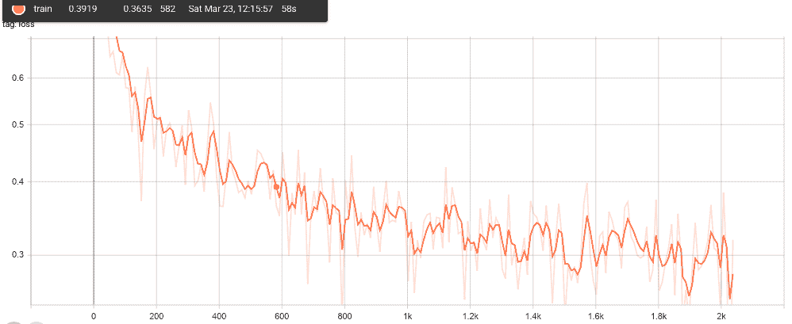
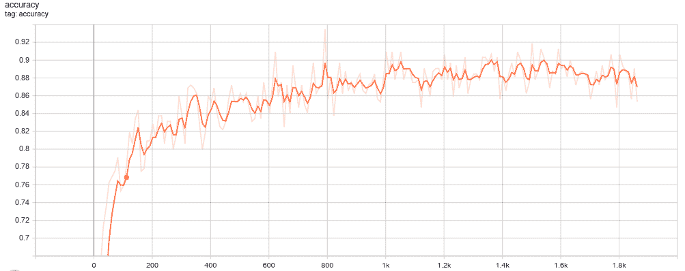
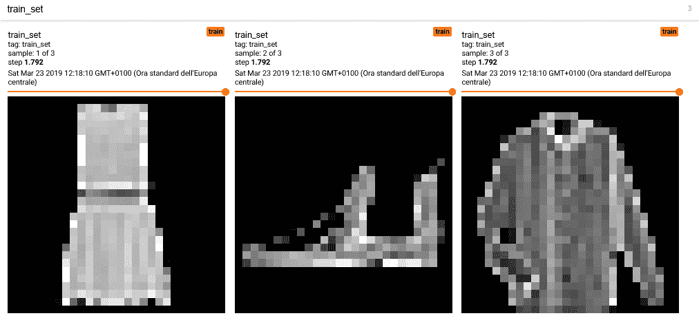
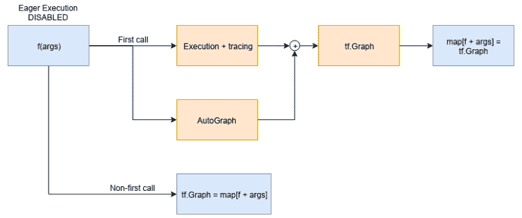
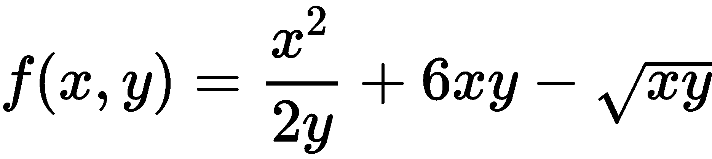
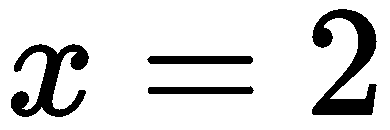
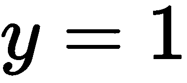

# 第四章：TensorFlow 2.0 架构

在第三章，*TensorFlow 图架构*中，我们介绍了 TensorFlow 图的定义和执行范式，尽管它功能强大且具有较高的表达能力，但也有一些缺点，如下所示：

+   陡峭的学习曲线

+   难以调试

+   某些操作时的反直觉语义

+   Python 仅用于构建图

学习如何处理计算图可能会很困难——定义计算，而不是像 Python 解释器遇到操作时那样执行操作，是与大多数程序不同的思维方式，尤其是那些只使用命令式语言的程序。

然而，仍然建议你深入理解数据流图（DataFlow graphs）以及 TensorFlow 1.x 如何强迫用户思考，因为这将帮助你理解 TensorFlow 2.0 架构的许多部分。

调试数据流图并不容易——TensorBoard 有助于可视化图形，但它不是调试工具。可视化图形只能确认图形是否已经按照 Python 中定义的方式构建，但一些特殊情况，比如无依赖操作的并行执行（还记得上一章末尾关于 `tf.control_dependencies` 的练习吗？），很难发现，并且在图形可视化中不会明确显示。

Python，作为事实上的数据科学和机器学习语言，仅用于定义图形；其他可能有助于解决问题的 Python 库不能在图定义期间使用，因为不能混合图定义和会话执行。混合图定义、执行和使用其他库处理图生成数据是困难的，这使得 Python 应用程序的设计变得非常丑陋，因为几乎不可能不依赖于全局变量、集合和多个文件中共有的对象。在使用这种图定义和执行范式时，用类和函数组织代码并不自然。

TensorFlow 2.0 的发布带来了框架的多项变化：从默认启用即时执行到完全清理了 API。事实上，整个 TensorFlow 包中充满了重复和废弃的 API，而在 TensorFlow 2.0 中，这些 API 最终被移除。此外，TensorFlow 开发者决定遵循 Keras API 规范，并移除了一些不符合此规范的模块：最重要的移除是 `tf.layers`（我们在第三章，*TensorFlow 图架构*中使用过该模块），改用 `tf.keras.layers`。

另一个广泛使用的模块，`tf.contrib`，已经被完全移除。`tf.contrib`模块包含了社区添加的、使用 TensorFlow 的层/软件。从软件工程的角度来看，拥有一个包含多个完全不相关的大型项目的模块是一个糟糕的想法。由于这个原因，它被从主包中移除，决定将被维护的大型模块移动到独立的代码库，同时移除不再使用和不再维护的模块。

默认启用急切执行并移除（隐藏）图定义和执行范式，TensorFlow 2.0 允许更好的软件设计，从而降低学习曲线的陡峭度，并简化调试阶段。当然，鉴于从静态图定义和执行范式过渡过来，你需要有不同的思维方式——这段过渡期的努力是值得的，因为 2.0 版本从长远来看带来的优势将大大回报这一初期的努力。

在本章中，我们将讨论以下主题：

+   重新学习 TensorFlow 框架

+   Keras 框架及其模型

+   急切执行和新特性

+   代码库迁移

# 重新学习框架

正如我们在 [第三章](https://cdp.packtpub.com/hands_on_applied_neural_networks_with_tensorflow_2_x/wp-admin/post.php?post=27&action=edit#post_26)中介绍的，*TensorFlow 图架构*，TensorFlow 的工作原理是首先构建计算图，然后执行它。在 TensorFlow 2.0 中，这个图的定义被隐藏并简化；执行和定义可以混合在一起，执行流程始终与源代码中的顺序一致——在 2.0 中不再需要担心执行顺序的问题。

在 2.0 发布之前，开发者必须遵循以下模式来设计图和源代码：

+   我如何定义图？我的图是否由多个逻辑上分离的层组成？如果是的话，我需要在不同的`tf.variable_scope`中定义每个逻辑模块。

+   在训练或推理阶段，我是否需要在同一个执行步骤中多次使用图的某个部分？如果是的话，我需要通过将其包裹在`tf.variable_scope`中来定义该部分，并确保`reuse`参数被正确使用。第一次我们这样做是为了定义这个模块，其他时间我们则是复用它。

+   图的定义完成了吗？如果是的话，我需要初始化所有全局和局部变量，从而定义`tf.global_variables_initializer()`操作，并尽早执行它。

+   最后，你需要创建会话，加载图，并在你想执行的节点上运行`sess.run`调用。

TensorFlow 2.0 发布后，这种思维方式完全改变了，变得更加直观和自然，尤其对于那些不习惯使用数据流图的开发者。事实上，在 TensorFlow 2.0 中，发生了以下变化：

+   不再使用全局变量。在 1.x 版本中，图是全局的；即使一个变量是在 Python 函数内部定义的，它也能被看到，并且与图的其他部分是分开的。

+   不再使用`tf.variable_scope`。上下文管理器无法通过设置`boolean`标志（`reuse`）来改变函数的行为。在 TensorFlow 2.0 中，变量共享由**模型本身**来完成。每个模型是一个 Python 对象，每个对象都有自己的变量集，要共享这些变量，你只需使用**相同的模型**并传入不同的输入。

+   不再使用`tf.get_variable`。正如我们在[第三章](https://cdp.packtpub.com/hands_on_applied_neural_networks_with_tensorflow_2_x/wp-admin/post.php?post=27&action=edit#post_26)中看到的，*TensorFlow 图架构*，`tf.get_variable`允许你通过`tf.variable_scope`声明可以共享的变量。由于每个变量现在都与 Python 变量一一对应，因此移除了声明全局变量的可能性。

+   不再使用`tf.layers`。在`tf.layers`模块内声明的每个层都会使用`tf.get_variable`来定义自己的变量。请改用`tf.keras.layers`。

+   不再使用全局集合。每个变量都被添加到一个全局变量集合中，可以通过`tf.trainable_variables()`进行访问——这与良好的软件设计原则相悖。现在，访问一个对象的变量的唯一方法是访问其`trainable_variables`属性，该属性返回该特定对象的可训练变量列表。

+   不需要手动调用初始化所有变量的操作。

+   API 清理并移除了`tf.contrib`，现在通过创建多个小而组织良好的项目来代替。

所有这些变化都是为了简化 TensorFlow 的使用，更好地组织代码库，增强框架的表达能力，并标准化其结构。

立即执行（Eager Execution）以及 TensorFlow 遵循 Keras API 是 TensorFlow 2.0 版本发布时的最重要变化。

# Keras 框架及其模型

与那些已经熟悉 Keras 的人通常认为的不同，Keras 不是一个机器学习框架（如 TensorFlow、CNTK 或 Theano）的高级封装；它是一个用于定义和训练机器学习模型的 API 规范。

TensorFlow 在其`tf.keras`模块中实现了这个规范。特别是，TensorFlow 2.0 本身就是该规范的一个实现，因此许多一级子模块实际上只是`tf.keras`子模块的别名；例如，`tf.metrics = tf.keras.metrics`和`tf.optimizers = tf.keras.optimizers`。

到目前为止，TensorFlow 2.0 拥有最完整的规范实现，使其成为绝大多数机器学习研究人员的首选框架。任何 Keras API 实现都允许你构建和训练深度学习模型。它因其层次化组织而用于快速解决方案的原型设计，也因其模块化和可扩展性、以及便于部署到生产环境中而用于高级研究。TensorFlow 中的 Keras 实现的主要优势如下：

+   **易用性**：Keras 接口是标准化的。每个模型定义必须遵循统一的接口；每个模型由层组成，而每一层必须实现一个明确定义的接口。

    从模型定义到训练循环的每个部分都标准化，使得学习使用一个实现了该规范的框架变得简单且非常有用：任何其他实现了 Keras 规范的框架看起来都很相似。这是一个巨大的优势，因为它允许研究人员阅读其他框架中编写的代码，而无需学习框架的细节。

+   **模块化和可扩展性**：Keras 规范描述了一组构建块，可用于组合任何类型的机器学习模型。TensorFlow 实现允许你编写自定义构建块，例如新的层、损失函数和优化器，并将它们组合起来开发新思路。

+   **内置**：自从 TensorFlow 2.0 发布以来，使用 Keras 不再需要单独下载 Python 包。`tf.keras` 模块已经内置在 `tensorflow` 包中，并且它具有一些 TensorFlow 特定的增强功能。

    急切执行（Eager execution）是一个一流的功能，就像高性能输入管道模块 `tf.data` 一样。导出一个使用 Keras 创建的模型比导出一个在纯 TensorFlow 中定义的模型还要简单。以语言无关的格式导出意味着它与任何生产环境的兼容性已经配置好了，因此可以确保与 TensorFlow 一起工作。

Keras 与急切执行（eager execution）结合，成为原型化新想法、更快设计可维护和良好组织的软件的完美工具。事实上，你不再需要思考图、全局集合以及如何定义模型以便跨不同的运行共享它们的参数；在 TensorFlow 2.0 中，真正重要的是以 Python 对象的方式思考，这些对象都有自己的变量。

TensorFlow 2.0 让你在设计整个机器学习管道时，只需关注对象和类，而不需要关注图和会话执行。

Keras 已经在 TensorFlow 1.x 中出现过，但当时默认未启用急切执行，这使得你可以通过*组装层*定义、训练和评估模型。在接下来的几个部分，我们将演示三种使用标准训练循环构建和训练模型的方法。

在 *急切执行与新特性*部分，您将学习如何创建一个自定义的训练循环。经验法则是：如果任务比较标准，就使用 Keras 构建模型并使用标准的训练循环；当 Keras 无法提供简单且现成可用的训练循环时，再编写自定义的训练循环。

# 顺序 API

最常见的模型类型是层的堆叠。`tf.keras.Sequential` 模型允许你通过堆叠 `tf.keras.layers` 来定义一个 Keras 模型。

我们在 [第三章](https://cdp.packtpub.com/hands_on_applied_neural_networks_with_tensorflow_2_x/wp-admin/post.php?post=27&action=edit#post_26)中定义的 CNN，*TensorFlow 图形架构*，可以使用 Keras 顺序模型在更少的行数和更优雅的方式中重新创建。由于我们正在训练一个分类器，我们可以使用 Keras 模型的 `compile` 和 `fit` 方法分别构建训练循环并执行它。在训练循环结束时，我们还可以使用 `evaluate` 方法评估模型在测试集上的表现——Keras 会处理所有的模板代码：

`(tf2)`

```py
import tensorflow as tf
from tensorflow.keras.datasets import fashion_mnist

n_classes = 10
model = tf.keras.Sequential([
 tf.keras.layers.Conv2D(
 32, (5, 5), activation=tf.nn.relu, input_shape=(28, 28, 1)),
 tf.keras.layers.MaxPool2D((2, 2), (2, 2)),
 tf.keras.layers.Conv2D(64, (3, 3), activation=tf.nn.relu),
 tf.keras.layers.MaxPool2D((2, 2), (2, 2)),
 tf.keras.layers.Flatten(),
 tf.keras.layers.Dense(1024, activation=tf.nn.relu),
 tf.keras.layers.Dropout(0.5),
 tf.keras.layers.Dense(n_classes)
])

model.summary()

(train_x, train_y), (test_x, test_y) = fashion_mnist.load_data()
# Scale input in [-1, 1] range
train_x = train_x / 255\. * 2 - 1
test_x = test_x / 255\. * 2 - 1
train_x = tf.expand_dims(train_x, -1).numpy()
test_x = tf.expand_dims(test_x, -1).numpy()

model.compile(
 optimizer=tf.keras.optimizers.Adam(1e-5),
 loss='sparse_categorical_crossentropy',
 metrics=['accuracy'])

model.fit(train_x, train_y, epochs=10)
model.evaluate(test_x, test_y)
```

关于前面的代码，需要注意的一些事项如下：

+   `tf.keras.Sequential` 通过堆叠 Keras 层构建 `tf.keras.Model` 对象。每个层都期望输入并生成输出，除了第一个层。第一个层使用额外的 `input_shape` 参数，这是正确构建模型并在输入真实数据前打印总结所必需的。Keras 允许你指定第一个层的输入形状，或者保持未定义。在前者的情况下，每个后续的层都知道其输入形状，并将其输出形状向前传播给下一个层，从而使得模型中每个层的输入和输出形状一旦 `tf.keras.Model` 对象被创建就已知。而在后者的情况下，形状是未定义的，并将在输入被馈送到模型后计算，这使得无法生成 *总结*。

+   `model.summary()` 打印出模型的完整描述，如果你想检查模型是否已正确定义，从而检查模型定义中是否存在拼写错误，哪个层的权重最大（按参数数量），以及整个模型的参数量是多少，这非常有用。CNN 的总结在以下代码中展示。正如我们所看到的，绝大多数参数都在全连接层中：

```py
Model: "sequential"
__________________________________________________
Layer   (type)     Output Shape         Param #
==================================================
conv2d (Conv2D) (None, 24, 24, 32) 832 
__________________________________________________
max_pooling2d (MaxPooling2D) (None, 12, 12, 32) 0 
__________________________________________________
conv2d_1 (Conv2D) (None, 10, 10, 64) 18496 
__________________________________________________
max_pooling2d_1 (MaxPooling2D) (None, 5, 5, 64) 0 
__________________________________________________
flatten (Flatten) (None, 1600) 0 
__________________________________________________
dense (Dense) (None, 1024) 1639424 
__________________________________________________
dropout (Dropout) (None, 1024) 0 
__________________________________________________
dense_1 (Dense) (None, 10) 10250 
==================================================
Total params: 1,669,002
Trainable params: 1,669,002
Non-trainable params: 0
```

+   数据集预处理步骤是在没有使用 NumPy 的情况下进行的，而是采用了**急切执行**。

    `tf.expand_dims(data, -1).numpy()`展示了 TensorFlow 如何替代 NumPy（具有 1:1 的 API 兼容性）。通过使用`tf.expand_dims`而非`np.expand_dims`，我们获得了相同的结果（在输入张量的末尾添加一个维度），但是创建了一个`tf.Tensor`对象而不是`np.array`对象。然而，`compile`方法要求输入为 NumPy 数组，因此我们需要使用`numpy()`方法。每个`tf.Tensor`对象都必须获取 Tensor 对象中包含的相应 NumPy 值。

+   在标准分类任务的情况下，Keras 允许你用一行代码通过`compile`方法构建训练循环。为了配置训练循环，该方法只需要三个参数：优化器、损失函数和需要监控的度量。在前面的例子中，我们可以看到既可以使用字符串，也可以使用 Keras 对象作为参数来正确构建训练循环。

+   `model.fit`是你在训练循环构建完成后调用的方法，用于在传入的数据上开始训练阶段，训练次数由指定的 epoch 数确定，并在编译阶段指定的度量标准下进行评估。批量大小可以通过传递`batch_size`参数进行配置。在这种情况下，我们使用默认值 32。

+   在训练循环结束时，可以在一些未见过的数据上衡量模型的性能。在这种情况下，它是对 fashion-MNIST 数据集的测试集进行测试。

Keras 在训练模型时会为用户提供反馈，记录每个 epoch 的进度条，并在标准输出中实时显示损失和度量的值：

```py
Epoch 1/10
60000/60000 [================] - 126s 2ms/sample - loss: 1.9142 - accuracy: 0.4545
Epoch 2/10
60000/60000 [================] - 125s 2ms/sample - loss: 1.3089 - accuracy: 0.6333
Epoch 3/10
60000/60000 [================] - 129s 2ms/sample - loss: 1.1676 - accuracy: 0.6824
[ ... ]
Epoch 10/10
60000/60000 [================] - 130s 2ms/sample - loss: 0.8645 - accuracy: 0.7618

10000/10000 [================] - 6s 644us/sample - loss: 0.7498 - accuracy: 0.7896
```

前面代码中的最后一行是`evaluate`调用的结果。

# Functional API

Sequential API 是定义模型的最简单和最常见的方法。然而，它不能用来定义任意的模型。Functional API 允许你定义复杂的拓扑结构，而不受顺序层的限制。

Functional API 允许你定义多输入、多输出模型，轻松共享层，定义残差连接，并且一般来说能够定义具有任意复杂拓扑结构的模型。

一旦构建完成，Keras 层是一个可调用对象，它接受一个输入张量并生成一个输出张量。它知道可以将这些层当作函数来组合，并通过传递输入层和输出层来构建一个`tf.keras.Model`对象。

以下代码展示了如何使用功能接口定义 Keras 模型：该模型是一个全连接的神经网络，接受一个 100 维的输入并生成一个单一的数字作为输出（正如我们将在第九章 *生成对抗网络*中看到的，这将是我们的生成器架构）：

`(tf2)`

```py
import tensorflow as tf

input_shape = (100,)
inputs = tf.keras.layers.Input(input_shape)
net = tf.keras.layers.Dense(units=64, activation=tf.nn.elu, name="fc1")(inputs)
net = tf.keras.layers.Dense(units=64, activation=tf.nn.elu, name="fc2")(net)
net = tf.keras.layers.Dense(units=1, name="G")(net)
model = tf.keras.Model(inputs=inputs, outputs=net)
```

作为一个 Keras 模型，`model`可以像任何使用 Sequential API 定义的 Keras 模型一样进行编译和训练。

# 子类化方法

顺序 API 和功能 API 涵盖了几乎所有可能的场景。然而，Keras 提供了另一种定义模型的方式，它是面向对象的，更灵活，但容易出错且难以调试。实际上，可以通过在`__init__`中定义层并在`call`方法中定义前向传播来子类化任何`tf.keras.Model`：

`(tf2)`

```py
import tensorflow as tf

class Generator(tf.keras.Model):

    def __init__(self):
        super(Generator, self).__init__()
        self.dense_1 = tf.keras.layers.Dense(
            units=64, activation=tf.nn.elu, name="fc1")
        self.dense_2 = f.keras.layers.Dense(
            units=64, activation=tf.nn.elu, name="fc2")
        self.output = f.keras.layers.Dense(units=1, name="G")

    def call(self, inputs):
        # Build the model in functional style here
        # and return the output tensor
        net = self.dense_1(inputs)
        net = self.dense_2(net)
        net = self.output(net)
        return net
```

不推荐使用子类化方法，因为它将层的定义与其使用分开，容易在重构代码时犯错。然而，使用这种模型定义来定义前向传播有时是唯一可行的方法，尤其是在处理循环神经网络时。

从`tf.keras.Model`子类化的`Generator`对象本身就是一个`tf.keras.Model`，因此，它可以像前面所示一样，使用`compile`和`fit`命令进行训练。

Keras 可用于训练和评估模型，但 TensorFlow 2.0 通过其急切执行功能，允许我们编写自定义训练循环，从而完全控制训练过程，并能够轻松调试。

# 急切执行和新特性

以下是急切执行官方文档中声明的内容（[`www.tensorflow.org/guide/eager`](https://www.tensorflow.org/guide/eager)）：

*TensorFlow 的急切执行是一个命令式编程环境，立即执行操作，而不是构建图形：操作返回具体值，而不是构建一个计算图以便稍后运行。这使得开始使用 TensorFlow 并调试模型变得更加容易，并且减少了样板代码。按照本指南操作时，请在交互式 Python 解释器中运行以下代码示例。*

*急切执行是一个灵活的机器学习平台，适用于研究和实验，提供以下功能：*

+   *直观的接口：自然地组织代码并使用 Python 数据结构。快速迭代小型模型和小型数据。*

+   *更简单的调试：直接调用操作来检查运行中的模型并测试更改。使用标准的 Python 调试工具进行即时错误报告。*

+   *自然控制流：使用 Python 控制流，而不是图形控制流，从而简化了动态模型的规格说明。*

如*顺序 API*部分所示，急切执行使你能够（以及其他特性）将 TensorFlow 作为标准 Python 库，立即由 Python 解释器执行。

正如我们在[第三章](https://cdp.packtpub.com/hands_on_applied_neural_networks_with_tensorflow_2_x/wp-admin/post.php?post=27&action=edit#post_26)中解释的，*TensorFlow 图形架构*，图形定义和会话执行范式不再是默认模式。别担心！如果你希望精通 TensorFlow 2.0，上一章所学的内容极为重要，它将帮助你理解框架中某些部分为什么如此运作，尤其是在使用 AutoGraph 和 Estimator API 时，接下来我们将讨论这些内容。

让我们看看在启用即时执行时，上一章的基准示例如何工作。

# 基准示例

让我们回顾一下上一章的基准示例：

`(tf1)`

```py
import tensorflow as tf

A = tf.constant([[1, 2], [3, 4]], dtype=tf.float32)
x = tf.constant([[0, 10], [0, 0.5]])
b = tf.constant([[1, -1]], dtype=tf.float32)
y = tf.add(tf.matmul(A, x), b, name="result") #y = Ax + b

with tf.Session() as sess:
    print(sess.run(y))
```

会话的执行生成 NumPy 数组：

```py
[[ 1\. 10.]
 [ 1\. 31.]]
```

将基准示例转换为 TensorFlow 2.0 非常简单：

+   不用担心图

+   不用担心会话执行

+   只需写下你希望执行的内容，随时都能执行：

`(tf2)`

```py
import tensorflow as tf

A = tf.constant([[1, 2], [3, 4]], dtype=tf.float32)
x = tf.constant([[0, 10], [0, 0.5]])
b = tf.constant([[1, -1]], dtype=tf.float32)
y = tf.add(tf.matmul(A, x), b, name="result")
print(y)
```

前面的代码与 1.x 版本相比会产生不同的输出：

```py
tf.Tensor(
[[ 1\. 10.]
 [ 1\. 31.]], shape=(2, 2), dtype=float32)
```

数值当然是相同的，但返回的对象不再是 NumPy 数组，而是 `tf.Tensor` 对象。

在 TensorFlow 1.x 中，`tf.Tensor` 对象只是 `tf.Operation` 输出的符号表示；而在 2.0 中，情况不再是这样。

由于操作会在 Python 解释器评估时立即执行，因此每个 `tf.Tensor` 对象不仅是 `tf.Operation` 输出的符号表示，而且是包含操作结果的具体 Python 对象。

请注意，`tf.Tensor` 对象仍然是 `tf.Operation` 输出的符号表示。这使得它能够支持和使用 1.x 特性，以便操作 `tf.Tensor` 对象，从而构建生成 `tf.Tensor` 的 `tf.Operation` 图。

图仍然存在，并且每个 TensorFlow 方法的结果都会返回 `tf.Tensor` 对象。

`y` Python 变量，作为 `tf.Tensor` 对象，可以作为任何其他 TensorFlow 操作的输入。如果我们希望提取 `tf.Tensor` 所包含的值，以便获得与 1.x 版本中 `sess.run` 调用相同的结果，我们只需调用 `tf.Tensor.numpy` 方法：

```py
print(y.numpy())
```

TensorFlow 2.0 专注于即时执行，使得用户能够设计更好工程化的软件。在 1.x 版本中，TensorFlow 有着无处不在的全局变量、集合和会话概念。

变量和集合可以从源代码中的任何地方访问，因为默认图始终存在。

会话是组织完整项目结构所必需的，因为它知道只能存在一个会话。每当一个节点需要被评估时，必须实例化会话对象，并且在当前作用域中可以访问。

TensorFlow 2.0 改变了这些方面，提高了可以用它编写的代码的整体质量。实际上，在 2.0 之前，使用 TensorFlow 设计复杂的软件系统非常困难，许多用户最终放弃了，并定义了包含所有内容的巨大的单文件项目。现在，通过遵循所有软件工程的最佳实践，设计软件变得更加清晰和简洁。

# 函数，而不是会话

`tf.Session`对象已经从 TensorFlow API 中移除。通过专注于急切执行，你不再需要会话的概念，因为操作的执行是即时的——我们在执行计算之前不再构建计算图。

这开启了一个新的场景，其中源代码可以更好地组织。在 TensorFlow 1.x 中，按照面向对象编程原则设计软件非常困难，甚至很难创建使用 Python 函数的模块化代码。然而，在 TensorFlow 2.0 中，这是自然的，并且强烈推荐。

如前面的示例所示，基础示例可以轻松转换为其急切执行的对应版本。通过遵循一些 Python 最佳实践，可以进一步改进这段源代码：

`(tf2)`

```py
import tensorflow as tf

def multiply(x, y):
    """Matrix multiplication.
    Note: it requires the input shape of both input to match.
    Args:
        x: tf.Tensor a matrix
        y: tf.Tensor a matrix
    Returns:
        The matrix multiplcation x @ y
    """

    assert x.shape == y.shape
    return tf.matmul(x, y)

def add(x, y):
    """Add two tensors.
    Args:
        x: the left hand operand.
        y: the right hand operand. It should be compatible with x.
    Returns:
        x + y
    """
    return x + y

def main():
    """Main program."""
    A = tf.constant([[1, 2], [3, 4]], dtype=tf.float32)
    x = tf.constant([[0, 10], [0, 0.5]])
    b = tf.constant([[1, -1]], dtype=tf.float32)

    z = multiply(A, x)
    y = add(z, b)
    print(y)

if __name__ == "__main__":
    main()
```

那些可以通过调用`sess.run`单独执行的两个操作（矩阵乘法和求和）已经被移到独立的函数中。当然，基础示例很简单，但只要想一想机器学习模型的训练步骤——定义一个接受模型和输入数据的函数，然后执行训练步骤，便是轻而易举的。

让我们来看一下这个的几个优势：

+   更好的软件组织。

+   对程序执行流程几乎完全的控制。

+   不再需要在源代码中携带`tf.Session`对象。

+   不再需要使用`tf.placeholder`。为了给图输入数据，你只需要将数据传递给函数。

+   我们可以为代码编写文档！在 1.x 版本中，为了理解程序某部分发生了什么，我们必须阅读完整的源代码，理解它的组织方式，理解在`tf.Session`中节点评估时执行了哪些操作，只有这样我们才会对发生的事情有所了解。

    使用函数，我们可以编写自包含且文档齐全的代码，完全按照文档说明执行。

急切执行带来的第二个也是最重要的优势是，不再需要全局图，因此，延伸开来，也不再需要其全局集合和变量。

# 不再有全局变量

全局变量是一个不良的软件工程实践——这是大家一致同意的。

在 TensorFlow 1.x 中，Python 变量和图变量的概念有着严格的区分。Python 变量是具有特定名称和类型的变量，遵循 Python 语言规则：它可以通过`del`删除，并且只在其作用域及层次结构中更低的作用域中可见。

另一方面，图变量是声明在计算图中的图，它存在于 Python 语言规则之外。我们可以通过将图赋值给 Python 变量来声明图变量，但这种绑定并不紧密：当 Python 变量超出作用域时，它会被销毁，而图变量仍然存在：它是一个全局且持久的对象。

为了理解这一变化带来的巨大优势，我们将看看 Python 变量被垃圾回收时，基准操作定义会发生什么：

`(tf1)`

```py
import tensorflow as tf

def count_op():
    """Print the operations define in the default graph
    and returns their number.
    Returns:
        number of operations in the graph
    """
    ops = tf.get_default_graph().get_operations()
    print([op.name for op in ops])
    return len(ops)

A = tf.constant([[1, 2], [3, 4]], dtype=tf.float32, name="A")
x = tf.constant([[0, 10], [0, 0.5]], name="x")
b = tf.constant([[1, -1]], dtype=tf.float32, name="b")

assert count_op() == 3
del A
del x
del b
assert count_op() == 0 # FAIL!
```

程序在第二次断言时失败，且在调用 `[A, x, b]` 时 `count_op` 的输出保持不变。

删除 Python 变量完全没有用，因为图中定义的所有操作仍然存在，我们可以访问它们的输出张量，从而在需要时恢复 Python 变量或创建指向图节点的新 Python 变量。我们可以使用以下代码来实现这一点：

```py
A = tf.get_default_graph().get_tensor_by_name("A:0")
x = tf.get_default_graph().get_tensor_by_name("x:0")
b = tf.get_default_graph().get_tensor_by_name("b:0")
```

为什么这种行为不好？请考虑以下情况：

+   一旦图中定义了操作，它们就一直存在。

+   如果图中的任何操作具有副作用（参见下面关于变量初始化的示例），删除相应的 Python 变量是无效的，副作用仍然会存在。

+   通常，即使我们在一个具有独立 Python 作用域的函数中声明了 `A, x, b` 变量，我们也可以通过根据名称获取张量的方式在每个函数中访问它们，这打破了所有封装过程。

以下示例展示了没有全局图变量连接到 Python 变量时的一些副作用：

`(tf1)`

```py
import tensorflow as tf

def get_y():
    A = tf.constant([[1, 2], [3, 4]], dtype=tf.float32, name="A")
    x = tf.constant([[0, 10], [0, 0.5]], name="x")
    b = tf.constant([[1, -1]], dtype=tf.float32, name="b")
    # I don't know what z is: if is a constant or a variable
    z = tf.get_default_graph().get_tensor_by_name("z:0")
    y = A @ x + b - z
    return y

test = tf.Variable(10., name="z")
del test
test = tf.constant(10, name="z")
del test

y = get_y()

with tf.Session() as sess:
    print(sess.run(y))
```

这段代码无法运行，并突出了全局变量方法的几个缺点，以及 TensorFlow 1.x 使用的命名系统的问题：

+   `sess.run(y)` 会触发依赖于 `z:0` 张量的操作执行。

+   在通过名称获取张量时，我们无法知道生成它的操作是否有副作用。在我们的例子中，操作是 `tf.Variable` 定义，这要求在 `z:0` 张量可以被评估之前必须先执行变量初始化操作；这就是为什么代码无法运行的原因。

+   Python 变量名对 TensorFlow 1.x 没有意义：`test` 首先包含一个名为 `z` 的图变量，随后 `test` 被销毁并替换为我们需要的图常量，即 `z`。

+   不幸的是，调用 `get_y` 找到一个名为 `z:0` 的张量，它指向 `tf.Variable` 操作（具有副作用），而不是常量节点 `z`。为什么？即使我们在图变量中删除了 `test` 变量，`z` 仍然存在。因此，当调用 `tf.constant` 时，我们有一个与图冲突的名称，TensorFlow 为我们解决了这个问题。它通过为输出张量添加 `_1` 后缀来解决这个问题。

在 TensorFlow 2.0 中，这些问题都不存在了——我们只需编写熟悉的 Python 代码。无需担心图、全局作用域、命名冲突、占位符、图依赖关系和副作用。甚至控制流也像 Python 一样，正如我们在下一节中将看到的那样。

# 控制流

在 TensorFlow 1.x 中，执行顺序操作并不是一件容易的事，尤其是在操作没有显式执行顺序约束的情况下。假设我们想要使用 TensorFlow 执行以下操作：

1.  声明并初始化两个变量：`y`和`y`。

1.  将`y`的值增加 1。

1.  计算`x*y`。

1.  重复此操作五次。

在 TensorFlow 1.x 中，第一个不可用的尝试是仅仅通过以下步骤声明代码：

`(tf1)`

```py
import tensorflow as tf

x = tf.Variable(1, dtype=tf.int32)
y = tf.Variable(2, dtype=tf.int32)

assign_op = tf.assign_add(y, 1)
out = x * y
init = tf.global_variables_initializer()

with tf.Session() as sess:
    sess.run(init)
    for _ in range(5):
        print(sess.run(out))
```

那些完成了前一章提供的练习的人，应该已经注意到这段代码中的问题。

输出节点`out`对`assign_op`节点没有显式依赖关系，因此它在执行`out`时从不计算，从而使输出仅为 2 的序列。在 TensorFlow 1.x 中，我们必须显式地使用`tf.control_dependencies`来强制执行顺序，条件化赋值操作，以便它在执行`out`之前执行：

```py
with tf.control_dependencies([assign_op]):
    out = x * y
```

现在，输出是 3、4、5、6、7 的序列，这是我们想要的结果。

更复杂的示例，例如在图中直接声明并执行循环，其中可能会发生条件执行（使用`tf.cond`），是可能的，但要点是一样的——在 TensorFlow 1.x 中，我们必须担心操作的副作用，在编写 Python 代码时，必须考虑图的结构，甚至无法使用我们习惯的 Python 解释器。条件必须使用`tf.cond`而不是 Python 的`if`语句来表达，循环必须使用`tf.while_loop`而不是 Python 的`for`和`while`语句来定义。

TensorFlow 2.x 凭借其即时执行，使得可以使用 Python 解释器来控制执行流程：

`(tf2)`

```py
import tensorflow as tf

x = tf.Variable(1, dtype=tf.int32)
y = tf.Variable(2, dtype=tf.int32)

for _ in range(5):
    y.assign_add(1)
    out = x * y
    print(out)
```

之前的示例是使用即时执行开发的，更容易开发、调试和理解——毕竟它只是标准的 Python 代码！

通过简化控制流程，启用了即时执行，这是 TensorFlow 2.0 中引入的主要特性之一——现在，即便是没有任何数据流图或描述性编程语言经验的用户，也可以开始编写 TensorFlow 代码。即时执行减少了整个框架的复杂性，降低了入门门槛。

来自 TensorFlow 1.x 的用户可能会开始想知道我们如何训练机器学习模型，因为为了通过自动微分计算梯度，我们需要有一个执行操作的图。

TensorFlow 2.0 引入了 GradientTape 的概念，以高效解决这个问题。

# GradientTape

`tf.GradientTape()`调用创建了一个上下文，在该上下文中记录自动微分的操作。每个在上下文管理器内执行的操作都会被记录在带状磁带上，前提是它们的至少一个输入是可监视的并且正在被监视。

当发生以下情况时，输入是可监视的：

+   这是一个可训练的变量，通过使用`tf.Variable`创建。

+   它通过在`tf.Tensor`对象上调用`watch`方法显式地被`tape`监视。

tape 记录了在该上下文中执行的每个操作，以便构建已执行的前向传递图；然后，tape 可以展开以使用反向模式自动微分计算梯度。它通过调用`gradient`方法来实现：

```py
x = tf.constant(4.0)
with tf.GradientTape() as tape:
    tape.watch(x)
    y = tf.pow(x, 2)
# Will compute 8 = 2*x, x = 8
dy_dx = tape.gradient(y, x)
```

在前面的示例中，我们显式地要求`tape`监视一个常量值，而该常量值由于其本质不可被监视（因为它不是`tf.Variable`对象）。

一个`tf.GradientTape`对象，例如`tape`，在调用`tf.GradientTape.gradient()`方法后会释放它所持有的资源。这在大多数常见场景中是可取的，但在某些情况下，我们需要多次调用`tf.GradientTape.gradient()`。为了做到这一点，我们需要创建一个持久的梯度 tape，允许多次调用梯度方法而不释放资源。在这种情况下，由开发者在不再需要资源时负责释放这些资源。他们通过使用 Python 的`del`指令删除对 tape 的引用来做到这一点：

```py
x = tf.Variable(4.0)
y = tf.Variable(2.0)
with tf.GradientTape(persistent=True) as tape:
    z = x + y
    w = tf.pow(x, 2)
dz_dy = tape.gradient(z, y)
dz_dx = tape.gradient(z, x)
dw_dx = tape.gradient(w, x)
print(dz_dy, dz_dx, dw_dx) # 1, 1, 8
# Release the resources
del tape
```

也可以在更高阶的导数中嵌套多个`tf.GradientTape`对象（现在你应该能轻松做到这一点，所以我将这部分留给你做练习）。

TensorFlow 2.0 提供了一种新的、简便的方式，通过 Keras 构建模型，并通过 tape 的概念提供了一种高度可定制和高效的计算梯度的方法。

我们在前面章节中提到的 Keras 模型已经提供了训练和评估它们的方法；然而，Keras 不能涵盖所有可能的训练和评估场景。因此，可以使用 TensorFlow 1.x 构建自定义训练循环，这样你就可以训练和评估模型，并完全控制发生的事情。这为你提供了实验的自由，可以控制训练的每一个部分。例如，如第九章所示，*生成对抗网络*，定义对抗训练过程的最佳方式是通过定义自定义训练循环。

# 自定义训练循环

`tf.keras.Model`对象通过其`compile`和`fit`方法，允许你训练大量机器学习模型，从分类器到生成模型。Keras 的训练方式可以加速定义最常见模型的训练阶段，但训练循环的自定义仍然有限。

有些模型、训练策略和问题需要不同类型的模型训练。例如，假设我们需要面对梯度爆炸问题。在使用梯度下降训练模型的过程中，可能会出现损失函数开始发散，直到它变成`NaN`，这通常是因为梯度更新的大小越来越大，直到溢出。

面对这个问题，你可以使用的一种常见策略是裁剪梯度或限制阈值：梯度更新的大小不能超过阈值。这可以防止网络发散，并通常帮助我们在最小化过程中找到更好的局部最小值。有几种梯度裁剪策略，但最常见的是 L2 范数梯度裁剪。

在这个策略中，梯度向量被归一化，使得 L2 范数小于或等于一个阈值。实际上，我们希望以这种方式更新梯度更新规则：

```py
gradients = gradients * threshold / l2(gradients)
```

TensorFlow 有一个 API 用于此任务：`tf.clip_by_norm`。我们只需访问已计算的梯度，应用更新规则，并将其提供给选择的优化器。

为了使用`tf.GradientTape`创建自定义训练循环以计算梯度并进行后处理，我们需要将上一章末尾开发的图像分类器训练脚本迁移到 TensorFlow 2.0 版本。

请花时间仔细阅读源代码：查看新的模块化组织，并将先前的 1.x 代码与此新代码进行比较。

这些 API 之间存在几个区别：

+   优化器现在是 Keras 优化器。

+   损失现在是 Keras 损失。

+   精度可以通过 Keras 指标包轻松计算。

+   每个 TensorFlow 1.x 符号都有一个 TensorFlow 2.0 版本。

+   不再有全局集合。记录带有需要使用的变量列表以计算梯度，而`tf.keras.Model`对象必须携带其自己的`trainable_variables`集合。

在 1.x 版本中存在方法调用，而在 2.0 版本中，存在一个返回可调用对象的 Keras 方法。几乎每个 Keras 对象的构造函数用于配置它，它们使用`call`方法来使用它。

首先，我们导入`tensorflow`库，然后定义`make_model`函数：

```py
import tensorflow as tf
from tensorflow.keras.datasets import fashion_mnist

def make_model(n_classes):
 return tf.keras.Sequential([
   tf.keras.layers.Conv2D(
     32, (5, 5), activation=tf.nn.relu, input_shape=(28, 28, 1)),
   tf.keras.layers.MaxPool2D((2, 2), (2, 2)),
   tf.keras.layers.Conv2D(64, (3, 3), activation=tf.nn.relu),
   tf.keras.layers.MaxPool2D((2, 2), (2, 2)),
   tf.keras.layers.Flatten(),
   tf.keras.layers.Dense(1024, activation=tf.nn.relu),
   tf.keras.layers.Dropout(0.5),
   tf.keras.layers.Dense(n_classes)
 ])
```

然后，我们定义`load_data`函数：

```py
def load_data():
    (train_x, train_y), (test_x, test_y) = fashion_mnist.load_data()
    # Scale input in [-1, 1] range
    train_x = tf.expand_dims(train_x, -1)
    train_x = (tf.image.convert_image_dtype(train_x, tf.float32) - 0.5) * 2
    train_y = tf.expand_dims(train_y, -1)

    test_x = test_x / 255\. * 2 - 1
    test_x = (tf.image.convert_image_dtype(test_x, tf.float32) - 0.5) * 2
    test_y = tf.expand_dims(test_y, -1)

    return (train_x, train_y), (test_x, test_y)
```

然后，我们定义`train()`函数，实例化模型、输入数据和训练参数：

```py
def train():
    # Define the model
    n_classes = 10
    model = make_model(n_classes)

    # Input data
    (train_x, train_y), (test_x, test_y) = load_data()

    # Training parameters
    loss = tf.losses.SparseCategoricalCrossentropy(from_logits=True)
    step = tf.Variable(1, name="global_step")
    optimizer = tf.optimizers.Adam(1e-3)
    accuracy = tf.metrics.Accuracy()
```

最后，我们需要在`train`函数内定义`train_step`函数，并在训练循环中使用它：

```py
    # Train step function
    def train_step(inputs, labels):
        with tf.GradientTape() as tape:
            logits = model(inputs)
            loss_value = loss(labels, logits)

        gradients = tape.gradient(loss_value, model.trainable_variables)
        # TODO: apply gradient clipping here
        optimizer.apply_gradients(zip(gradients, model.trainable_variables))
        step.assign_add(1)

        accuracy_value = accuracy(labels, tf.argmax(logits, -1))
        return loss_value, accuracy_value

    epochs = 10
    batch_size = 32
    nr_batches_train = int(train_x.shape[0] / batch_size)
    print(f"Batch size: {batch_size}")
    print(f"Number of batches per epoch: {nr_batches_train}")

    for epoch in range(epochs):
        for t in range(nr_batches_train):
            start_from = t * batch_size
            to = (t + 1) * batch_size
            features, labels = train_x[start_from:to], train_y[start_from:to]
            loss_value, accuracy_value = train_step(features, labels)
            if t % 10 == 0:
                print(
                    f"{step.numpy()}: {loss_value} - accuracy: {accuracy_value}"
                )
        print(f"Epoch {epoch} terminated")

if __name__ == "__main__":
    train()
```

上一个示例中并没有包括模型保存、模型选择和 TensorBoard 日志记录。此外，梯度裁剪部分留给你作为练习（参见前面代码的`TODO`部分）。

在本章末尾，所有缺失的功能将被包括进来；与此同时，请花些时间仔细阅读新版本，并与 1.x 版本进行比较。

下一节将重点介绍如何保存模型参数、重新启动训练过程和进行模型选择。

# 保存和恢复模型的状态。

TensorFlow 2.0 引入了检查点对象的概念：每个继承自`tf.train.Checkpointable`的对象都是可序列化的，这意味着可以将其保存在检查点中。与 1.x 版本相比，在 1.x 版本中只有变量是可检查点的，而在 2.0 版本中，整个 Keras 层/模型继承自`tf.train.Checkpointable`。因此，可以保存整个层/模型，而不必担心它们的变量；和往常一样，Keras 引入了一个额外的抽象层，使框架的使用更加简便。保存模型有两种方式：

+   使用检查点

+   使用 SavedModel

正如我们在[第三章](https://cdp.packtpub.com/hands_on_applied_neural_networks_with_tensorflow_2_x/wp-admin/post.php?post=27&action=edit#post_26)中解释的那样，*TensorFlow 图架构*，检查点并不包含模型本身的描述：它们只是存储模型参数的简便方法，并通过定义将检查点保存的变量映射到 Python 中的`tf.Variable`对象，或者在更高层次上，通过`tf.train.Checkpointable`对象来让开发者正确恢复它们。

另一方面，SavedModel 格式是计算的序列化描述，除了参数值之外。我们可以将这两个对象总结如下：

+   **检查点**：一种将变量存储到磁盘的简便方法

+   **SavedModel**：模型结构和检查点

SavedModel 是一种与语言无关的表示（Protobuf 序列化图），适合在其他语言中部署。本书的最后一章，第十章，*将模型投入生产*，专门讲解 SavedModel，因为它是将模型投入生产的正确方法。

在训练模型时，我们在 Python 中可以获得模型定义。由于这一点，我们有兴趣保存模型的状态，具体方法如下：

+   在失败的情况下重新启动训练过程，而不会浪费之前的所有计算。

+   在训练循环结束时保存模型参数，以便我们可以在测试集上测试训练好的模型。

+   将模型参数保存在不同位置，以便我们可以保存达到最佳验证性能的模型状态（模型选择）。

为了在 TensorFlow 2.0 中保存和恢复模型参数，我们可以使用两个对象：

+   `tf.train.Checkpoint`是基于对象的序列化/反序列化器。

+   `tf.train.CheckpointManager`是一个可以使用`tf.train.Checkpoint`实例来保存和管理检查点的对象。

与 TensorFlow 1.x 中的`tf.train.Saver`方法相比，`Checkpoint.save`和`Checkpoint.restore`方法是基于对象的检查点读写；前者只能读写基于`variable.name`的检查点。

与其保存变量，不如保存对象，因为它在进行 Python 程序更改时更为稳健，并且能够正确地与急切执行模式（eager execution）一起工作。在 TensorFlow 1.x 中，只保存`variable.name`就足够了，因为图在定义和执行后不会发生变化。而在 2.0 版本中，由于图是隐藏的且控制流可以使对象及其变量出现或消失，保存对象是唯一能够保留其状态的方式。

使用`tf.train.Checkpoint`非常简单——你想存储一个可检查点的对象吗？只需将其传递给构造函数，或者在对象生命周期中创建一个新的属性即可。

一旦你定义了检查点对象，使用它来构建一个`tf.train.CheckpointManager`对象，在该对象中你可以指定保存模型参数的位置以及保留多少个检查点。

因此，前一个模型训练的保存和恢复功能只需在模型和优化器定义后，添加以下几行即可：

`(tf2)`

```py
ckpt = tf.train.Checkpoint(step=step, optimizer=optimizer, model=model)
manager = tf.train.CheckpointManager(ckpt, './checkpoints', max_to_keep=3)
ckpt.restore(manager.latest_checkpoint)
if manager.latest_checkpoint:
    print(f"Restored from {manager.latest_checkpoint}")
else:
    print("Initializing from scratch.")
```

可训练和不可训练的变量会自动添加到检查点变量中进行监控，这样你就可以在不引入不必要的损失函数波动的情况下恢复模型并重新启动训练循环。实际上，优化器对象通常携带自己的不可训练变量集（移动均值和方差），它是一个可检查点的对象，被添加到检查点中，使你能够在中断时恢复训练循环的状态。

当满足某个条件（例如`i % 10 == 0`，或当验证指标得到改善时），可以使用`manager.save`方法调用来检查点模型的状态：

`(tf2)`

```py
save_path = manager.save()
print(f"Checkpoint saved: {save_path}")
```

管理器可以将模型参数保存到构造时指定的目录中；因此，为了执行模型选择，你需要创建第二个管理器对象，当满足模型选择条件时调用它。这个部分留给你自己完成。

# 摘要和指标

TensorBoard 仍然是 TensorFlow 默认且推荐的数据记录和可视化工具。`tf.summary`包包含所有必要的方法，用于保存标量值、图像、绘制直方图、分布等。

与`tf.metrics`包一起使用时，可以记录聚合数据。指标通常在小批量上进行度量，而不是在整个训练/验证/测试集上：在完整数据集划分上循环时聚合数据，使我们能够正确地度量指标。

`tf.metrics`包中的对象是有状态的，这意味着它们能够累积/聚合值，并在调用`.result()`时返回累积结果。

与 TensorFlow 1.x 相同，要将摘要保存到磁盘，你需要一个文件/摘要写入对象。你可以通过以下方式创建一个：

`(tf2)`

```py
summary_writer = tf.summary.create_file_writer(path)
```

这个新对象不像 1.x 版本那样工作——它的使用现在更加简化且功能更强大。我们不再需要使用会话并执行`(sess.run(summary))`来获取写入摘要的行，新的`tf.summary.*`对象能够自动检测它们所在的上下文，一旦计算出摘要行，就能将正确的摘要记录到写入器中。

实际上，摘要写入器对象通过调用`.as_default()`定义了一个上下文管理器；在这个上下文中调用的每个`tf.summary.*`方法都会将其结果添加到默认的摘要写入器中。

将`tf.summary`与`tf.metrics`结合使用，使我们能够更加简单且正确地衡量和记录训练/验证/测试指标，相比于 TensorFlow 1.x 版本更加简便。事实上，如果我们决定每 10 步训练记录一次计算的度量值，那么我们需要可视化在这 10 步训练过程中计算出的均值，而不仅仅是最后一步的值。

因此，在每一步训练结束时，我们必须调用度量对象的`.update_state`方法来聚合并保存计算值到对象状态中，然后再调用`.result()`方法。

`.result()`方法负责正确计算聚合值上的度量。一旦计算完成，我们可以通过调用`reset_states()`来重置度量的内部状态。当然，所有在训练阶段计算的值都遵循相同的逻辑，因为损失是非常常见的：

```py
mean_loss = tf.metrics.Mean(name='loss')
```

这定义了度量的`Mean`，即在训练阶段传入的输入的均值。在这种情况下，这是损失值，但同样的度量也可以用来计算每个标量值的均值。

`tf.summary`包还包含一些方法，用于记录图像（`tf.summary.image`），因此可以扩展之前的示例，在 TensorBoard 上非常简单地记录标量指标和图像批次。以下代码展示了如何扩展之前的示例，记录训练损失、准确率以及三张训练图像——请花时间分析结构，看看如何进行指标和日志记录，并尝试理解如何通过定义更多函数使代码结构更加模块化和易于维护：

```py
def train():
    # Define the model
    n_classes = 10
    model = make_model(n_classes)

    # Input data
    (train_x, train_y), (test_x, test_y) = load_data()

    # Training parameters
    loss = tf.losses.SparseCategoricalCrossentropy(from_logits=True)
    step = tf.Variable(1, name="global_step")
    optimizer = tf.optimizers.Adam(1e-3)

    ckpt = tf.train.Checkpoint(step=step, optimizer=optimizer, model=model)
    manager = tf.train.CheckpointManager(ckpt, './tf_ckpts', max_to_keep=3)
    ckpt.restore(manager.latest_checkpoint)
    if manager.latest_checkpoint:
        print(f"Restored from {manager.latest_checkpoint}")
    else:
        print("Initializing from scratch.")

    accuracy = tf.metrics.Accuracy()
    mean_loss = tf.metrics.Mean(name='loss')
```

这里，我们定义了`train_step`函数：

```py
     # Train step function
     def train_step(inputs, labels):
         with tf.GradientTape() as tape:
             logits = model(inputs)
             loss_value = loss(labels, logits)

         gradients = tape.gradient(loss_value, model.trainable_variables)
         # TODO: apply gradient clipping here
         optimizer.apply_gradients(zip(gradients, model.trainable_variables))
         step.assign_add(1)

         accuracy.update_state(labels, tf.argmax(logits, -1))
         return loss_value, accuracy.result()

    epochs = 10
    batch_size = 32
    nr_batches_train = int(train_x.shape[0] / batch_size)
    print(f"Batch size: {batch_size}")
    print(f"Number of batches per epoch: {nr_batches_train}")
    train_summary_writer = tf.summary.create_file_writer('./log/train')
    with train_summary_writer.as_default():
        for epoch in range(epochs):
            for t in range(nr_batches_train):
                start_from = t * batch_size
                to = (t + 1) * batch_size

                features, labels = train_x[start_from:to], train_y[start_from:to]

                loss_value, accuracy_value = train_step(features, labels)
                mean_loss.update_state(loss_value)

                if t % 10 == 0:
                    print(f"{step.numpy()}: {loss_value} - accuracy: {accuracy_value}")
                    save_path = manager.save()
                    print(f"Checkpoint saved: {save_path}")
                    tf.summary.image(
                        'train_set', features, max_outputs=3, step=step.numpy())
                    tf.summary.scalar(
                        'accuracy', accuracy_value, step=step.numpy())
                    tf.summary.scalar(
                        'loss', mean_loss.result(), step=step.numpy())
                    accuracy.reset_states()
                    mean_loss.reset_states()
            print(f"Epoch {epoch} terminated")
            # Measuring accuracy on the whole training set at the end of the epoch
            for t in range(nr_batches_train):
                start_from = t * batch_size
                to = (t + 1) * batch_size
                features, labels = train_x[start_from:to], train_y[start_from:to]
                logits = model(features)
                accuracy.update_state(labels, tf.argmax(logits, -1))
            print(f"Training accuracy: {accuracy.result()}")
            accuracy.reset_states()
```

在 TensorBoard 上，在第一个 epoch 结束时，可以看到每 10 步测量的损失值：



每 10 步测量的损失值，如 TensorBoard 中所展示

我们还可以看到训练准确率，它与损失同时进行测量：



训练准确率，如 TensorBoard 中所展示

此外，我们还可以看到从训练集采样的图像：



来自训练集的三张图像样本——一件裙子、一双凉鞋和来自 fashion-MNIST 数据集的一件毛衣

急切执行允许你动态创建和执行模型，而无需显式地创建图。然而，在急切模式下工作并不意味着不能从 TensorFlow 代码中构建图。实际上，正如我们在前一节中所看到的，通过使用 `tf.GradientTape`，可以注册训练步骤中发生的事情，通过追踪执行的操作构建计算图，并使用这个图通过自动微分自动计算梯度。

追踪函数执行过程中发生的事情使我们能够分析在运行时执行了哪些操作。知道这些操作，它们的输入关系和输出关系使我们能够构建图形。

这非常重要，因为它可以利用一次执行函数、追踪其行为、将其主体转换为图形表示并回退到更高效的图形定义和会话执行，这会带来巨大的性能提升。所有这些都能自动完成：这就是 AutoGraph 的概念。

# AutoGraph

自动将 Python 代码转换为其图形表示形式是通过使用 **AutoGraph** 完成的。在 TensorFlow 2.0 中，当函数被 `@tf.function` 装饰时，AutoGraph 会自动应用于该函数。这个装饰器将 Python 函数转换为可调用的图形。

一旦正确装饰，函数就会通过 `tf.function` 和 `tf.autograph` 模块进行处理，以便将其转换为图形表示形式。下图展示了装饰函数被调用时的示意图：



示意图表示当一个被 `@tf.function` 装饰的函数 f 被调用时，在首次调用和任何后续调用时会发生的事情：

在注解函数的首次调用时，发生以下情况：

1.  函数被执行并追踪。在这种情况下，急切执行被禁用，因此每个 `tf.*` 方法都会定义一个 `tf.Operation` 节点，产生一个 `tf.Tensor` 输出，正如在 TensorFlow 1.x 中一样。

1.  `tf.autograph` 模块用于检测可以转换为图形等价物的 Python 结构。图形表示是从函数追踪和 AutoGraph 信息中构建的。这样做是为了保留在 Python 中定义的执行顺序。

1.  `tf.Graph` 对象现在已经构建完成。

1.  基于函数名和输入参数，创建一个唯一的 ID，并将其与图形关联。然后将图形缓存到映射中，以便在第二次调用时，如果 ID 匹配，则可以重用该图形。

将一个函数转换为其图形表示通常需要我们思考；在 TensorFlow 1.x 中，并非每个在急切模式下工作的函数都能毫无痛苦地转换为其图形版本。

例如，急切模式下的变量是一个遵循 Python 作用域规则的 Python 对象。在图模式下，正如我们在前一章中发现的，变量是一个持久化对象，即使其关联的 Python 变量超出作用域并被垃圾回收，它仍然存在。

因此，在软件设计中必须特别注意：如果一个函数必须进行图加速并且创建一个状态（使用`tf.Variable`及类似对象），则由开发者负责避免每次调用该函数时都重新创建变量。

由于这个原因，`tf.function`会多次解析函数体，寻找`tf.Variable`定义。如果在第二次调用时，它发现一个变量对象正在被重新创建，就会抛出异常：

```py
ValueError: tf.function-decorated function tried to create variables on non-first call.
```

实际上，如果我们定义了一个执行简单操作的函数，并且该函数内部使用了`tf.Variable`，我们必须确保该对象只会被创建一次。

以下函数在急切模式下正常工作，但如果使用`@tf.function`装饰器进行装饰，则无法执行，并且会抛出前述异常：

`(tf2)`

```py
def f():
    a = tf.constant([[10,10],[11.,1.]])
    x = tf.constant([[1.,0.],[0.,1.]])
    b = tf.Variable(12.)
    y = tf.matmul(a, x) + b
    return y
```

处理创建状态的函数意味着我们必须重新思考图模式的使用。状态是一个持久化对象，例如变量，且该变量不能被重新声明多次。由于这一点，函数定义可以通过两种方式进行修改：

+   通过将变量作为输入参数传递

+   通过打破函数作用域并从外部作用域继承变量

第一个选择需要更改函数定义，使其能够：

`(tf2)`

```py
@tf.function
def f(b):
    a = tf.constant([[10,10],[11.,1.]])
    x = tf.constant([[1.,0.],[0.,1.]])
    y = tf.matmul(a, x) + b
    return y

var = tf.Variable(12.)
f(var)
f(15)
f(tf.constant(1))
```

`f`现在接受一个 Python 输入变量`b`。这个变量可以是`tf.Variable`、`tf.Tensor`，也可以是一个 NumPy 对象或 Python 类型。每次输入类型发生变化时，都会创建一个新的图，以便为任何所需的输入类型创建一个加速版本的函数（这是因为 TensorFlow 图是静态类型的）。

另一方面，第二种选择需要分解函数作用域，使变量可以在函数作用域外部使用。在这种情况下，我们可以采取两条路径：

+   **不推荐**：使用全局变量

+   **推荐**：使用类似 Keras 的对象

第一种方法，即**不推荐的方法**，是将变量声明在函数体外，并在其中使用它，确保该变量只会声明一次：

`(tf2)`

```py
b = None

@tf.function
def f():
    a = tf.constant([[10, 10], [11., 1.]])
    x = tf.constant([[1., 0.], [0., 1.]])
    global b
    if b is None:
        b = tf.Variable(12.)
    y = tf.matmul(a, x) + b
    return y

f()
```

第二种方法，即**推荐的方法**，是使用面向对象的方法，并将变量声明为类的私有属性。然后，你需要通过将函数体放入`__call__`方法中，使实例化的对象可调用：

`(tf2)`

```py
class F():
    def __init__(self):
        self._b = None

    @tf.function
    def __call__(self):
        a = tf.constant([[10, 10], [11., 1.]])
        x = tf.constant([[1., 0.], [0., 1.]])
        if self._b is None:
            self._b = tf.Variable(12.)
        y = tf.matmul(a, x) + self._b
        return y

f = F()
f()
```

AutoGraph 和图加速过程在优化训练过程时表现最佳。

实际上，训练过程中最具计算密集型的部分是前向传递（forward pass），接着是梯度计算和参数更新。在前面的例子中，遵循新结构，由于没有`tf.Session`，我们将训练步骤从训练循环中分离出来。训练步骤是一个无状态的函数，使用从外部作用域继承的变量。因此，它可以通过装饰器`@tf.function`转换为图形表示，并加速执行：

`(tf2)`

```py
@tf.function
def train_step(inputs, labels):
# function body
```

你被邀请测量`train_step`函数图形转换所带来的加速效果。

性能提升不能保证，因为即使是即时执行（eager execution）也已经非常快，并且在一些简单的场景中，即时执行的速度和图形执行（graph execution）相当。然而，当模型变得更加复杂和深层时，性能提升是显而易见的。

AutoGraph 会自动将 Python 构造转换为其`tf.*`等效构造，但由于转换保留语义的源代码并不是一项容易的任务，因此在某些场景下，帮助 AutoGraph 进行源代码转换会更好。

事实上，已经有一些在即时执行中有效的构造，它们是 Python 构造的直接替代品。特别是，`tf.range`替代了`range`，`tf.print`替代了`print`，`tf.assert`替代了`assert`。

例如，AutoGraph 无法自动将`print`转换为`tf.print`以保持其语义。因此，如果我们希望一个图形加速的函数在图形模式下执行时打印内容，我们必须使用`tf.print`而不是`print`来编写函数。

你被邀请定义一些简单的函数，使用`tf.range`代替`range`，使用`print`代替`tf.print`，然后通过`tf.autograph`模块可视化源代码的转换过程。

例如，看看以下代码：

`(tf2)`

```py
import tensorflow as tf

@tf.function
def f():
    x = 0
    for i in range(10):
        print(i)
        x += i
    return x

f()
print(tf.autograph.to_code(f.python_function))
```

当调用`f`时，会生成`0,1,2,..., 10`——这是每次调用`f`时都会发生的吗，还是只会发生在第一次调用时？

你被邀请仔细阅读以下由 AutoGraph 生成的函数（这是机器生成的，因此难以阅读），以了解为什么`f`会以这种方式表现：

```py
def tf__f():
  try:
    with ag__.function_scope('f'):
      do_return = False
      retval_ = None
      x = 0

      def loop_body(loop_vars, x_1):
        with ag__.function_scope('loop_body'):
          i = loop_vars
          with ag__.utils.control_dependency_on_returns(ag__.print_(i)):
            x, i_1 = ag__.utils.alias_tensors(x_1, i)
            x += i_1
            return x,
      x, = ag__.for_stmt(ag__.range_(10), None, loop_body, (x,))
      do_return = True
      retval_ = x
      return retval_
  except:
    ag__.rewrite_graph_construction_error(ag_source_map__)
```

将旧代码库从 TensorFlow 1.x 迁移到 2.0 可能是一个耗时的过程。这就是为什么 TensorFlow 作者创建了一个转换工具，允许我们自动迁移源代码（它甚至可以在 Python 笔记本中使用！）。

# 代码库迁移

正如我们已经看到的，TensorFlow 2.0 引入了许多破坏性的变化，这意味着我们必须重新学习如何使用这个框架。TensorFlow 1.x 是最广泛使用的机器学习框架，因此有大量现有的代码需要升级。

TensorFlow 工程师开发了一个转换工具，可以帮助进行转换过程：不幸的是，它依赖于`tf.compat.v1`模块，并且它不会移除图或会话执行。相反，它只是重写代码，使用`tf.compat.v1`进行前缀化，并应用一些源代码转换以修复一些简单的 API 更改。

然而，它是迁移整个代码库的一个良好起点。事实上，建议的迁移过程如下：

1.  运行迁移脚本。

1.  手动移除每个`tf.contrib`符号，查找在`contrib`命名空间中使用的项目的新位置。

1.  手动将模型切换到其 Keras 等效版本。移除会话。

1.  在 eager 执行模式下定义训练循环。

1.  使用`tf.function`加速计算密集型部分。

迁移工具`tf_upgrade_v2`在通过`pip`安装 TensorFlow 2.0 时会自动安装。该升级脚本适用于单个 Python 文件、笔记本或完整的项目目录。

要迁移单个 Python 文件（或笔记本），请使用以下代码：

```py
tf_upgrade_v2 --infile file.py --outfile file-migrated.py
```

要在目录树上运行，请使用以下代码：

```py
tf_upgrade_v2 --intree project --outtree project-migrated
```

在这两种情况下，如果脚本无法找到输入代码的修复方法，它将打印错误。

此外，它始终会在`report.txt`文件中报告详细的变更列表，这有助于我们理解工具为何应用某些更改；例如：

```py
Added keyword 'input' to reordered function 'tf.argmax'
Renamed keyword argument from 'dimension' to 'axis'

    Old: tf.argmax([[1, 2, 2]], dimension=0))
                                        ~~~~~~~~~~
    New: tf.argmax(input=[[1, 2, 2]], axis=0))
```

即使使用转换工具，迁移代码库也是一个耗时的过程，因为大部分工作仍然是手动的。将代码库转换为 TensorFlow 2.0 是值得的，因为它带来了许多优势，诸如以下几点：

+   轻松调试。

+   通过面向对象的方法提高代码质量。

+   维护的代码行数更少。

+   易于文档化。

+   面向未来——TensorFlow 2.0 遵循 Keras 标准，并且该标准经得起时间的考验。

# 总结

本章介绍了 TensorFlow 2.0 中引入的所有主要变化，包括框架在 Keras API 规范上的标准化、使用 Keras 定义模型的方式，以及如何使用自定义训练循环进行训练。我们还看到了 AutoGraph 引入的图加速，以及`tf.function`。

尤其是 AutoGraph，仍然要求我们了解 TensorFlow 图架构的工作原理，因为在 eager 模式中定义并使用的 Python 函数如果需要加速图计算，就必须重新设计。

新的 API 更加模块化、面向对象且标准化；这些突破性变化旨在使框架的使用更加简单和自然，尽管图架构中的微妙差异仍然存在，并且将始终存在。

对于那些有 TensorFlow 1.0 工作经验的人来说，改变思维方式到基于对象而不再基于图形和会话的方法可能会非常困难；然而，这是一场值得的斗争，因为它会提高编写软件的整体质量。

在下一章中，我们将学习高效的数据输入流水线和估计器 API。

# 练习

请仔细阅读以下练习，并仔细回答所有问题。通过练习、试错和大量挣扎，这是掌握框架并成为专家的唯一途径：

1.  使用顺序、函数式和子类 API 定义一个分类器，以便对时尚-MNIST 数据集进行分类。

1.  使用 Keras 模型的内置方法训练模型并测量预测准确率。

1.  编写一个类，在其构造函数中接受一个 Keras 模型并进行训练和评估。

    API 应该按照以下方式工作：

```py
# Define your model
trainer = Trainer(model)
# Get features and labels as numpy arrays (explore the dataset available in the keras module)
trainer.train(features, labels)
# measure the accuracy
trainer.evaluate(test_features, test_labels)
```

1.  使用`@tf.function`注解加速训练方法。创建一个名为`_train_step`的私有方法，仅加速训练循环中最消耗计算资源的部分。

    运行训练并测量性能提升的毫秒数。

1.  使用多个（2 个）输入和多个（2 个）输出定义一个 Keras 模型。

    该模型必须接受灰度的 28 x 28 x 1 图像作为输入，以及一个与之相同尺寸的第二个灰度图像。第一层应该是这两个图像深度（28 x 28 x 1）的串联。

    架构应该是类似自动编码器的卷积结构，将输入缩减到一个大小为 1 x 1 x 128 的向量，然后在其解码部分通过使用`tf.keras.layer.UpSampling2D`层上采样层，直到恢复到 28 x 28 x D 的尺寸，其中 D 是您选择的深度。

    然后，在这个最后一层之上应该添加两个一元卷积层，每个都产生一个 28 x 28 x 1 的图像。

1.  使用时尚-MNIST 数据集定义一个训练循环，生成`(image, condition)`对，其中`condition`是一个完全白色的 28 x 28 x 1 图像，如果与`image`相关联的标签为 6；否则，它需要是一个黑色图像。

    在将图像输入网络之前，将其缩放到`[-1, 1]`范围内。

    使用两个损失的总和来训练网络。第一个损失是网络的第一个输入和第一个输出之间的 L2 距离。第二个损失是`condition`和第二个输出之间的 L1 距离。

    在训练过程中测量第一对的 L1 重构误差。当值小于 0.5 时停止训练。

1.  使用 TensorFlow 转换工具转换所有脚本，以便解决在第三章中提出的练习，“TensorFlow 图形架构”。

1.  分析转换的结果：是否使用了 Keras？如果没有，通过消除每一个`tf.compat.v1`的引用来手动迁移模型。这总是可能的吗？

1.  选择你为前面练习之一编写的训练循环：在应用更新之前，可以操作梯度。约束条件应该是梯度的范数，并且在应用更新之前，范数应该处于[-1, 1]的范围内。使用 TensorFlow 的基本操作来实现：它应该与`@tf.function`兼容。

1.  如果以下函数被`@tf.function`装饰，它会输出任何结果吗？描述其内部发生的情况：

```py
def output():
    for i in range(10):
        tf.print(i)
```

1.  如果以下函数被`@tf.function`装饰，它会输出任何结果吗？描述其内部发生的情况：

```py
def output():
    for i in tf.range(10):
        print(i)
```

1.  如果以下函数被`@tf.function`装饰，它会输出任何结果吗？描述其内部发生的情况：

```py
def output():
    for i in tf.range(10):
        tf.print(f"{i}", i)
        print(f"{i}", i)
```

1.  给定，使用`tf.GradientTape`在和中计算一阶和二阶偏导数。

1.  移除在*不再使用全局变量*章节中未能执行的示例中的副作用，并使用常量代替变量。

1.  扩展在*自定义训练循环*章节中定义的自定义训练循环，以便测量整个训练集、整个验证集的准确度，并在每个训练周期结束时进行评估。然后，使用两个`tf.train.CheckpointManager`对象进行模型选择。

    如果验证准确度在 5 个周期内没有继续增加（最多变化±0.2），则停止训练。

1.  在以下训练函数中，`step`变量是否已转换为`tf.Variable`对象？如果没有，这会有什么不利之处？

```py
@tf.function
def train(model, optimizer):
  train_ds = mnist_dataset()
  step = 0
  loss = 0.0
  accuracy = 0.0
  for x, y in train_ds:
    step += 1
    loss = train_one_step(model, optimizer, x, y)
    if tf.equal(step % 10, 0):
      tf.print('Step', step, ': loss', loss, '; accuracy', compute_accuracy.result())
  return step, loss, accuracy
```

在本书的所有练习中持续进行实践。
