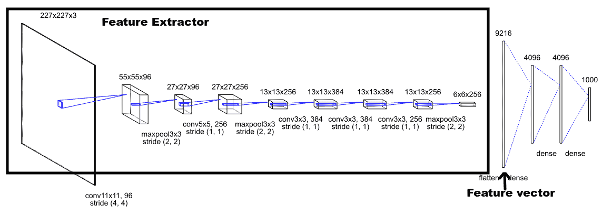
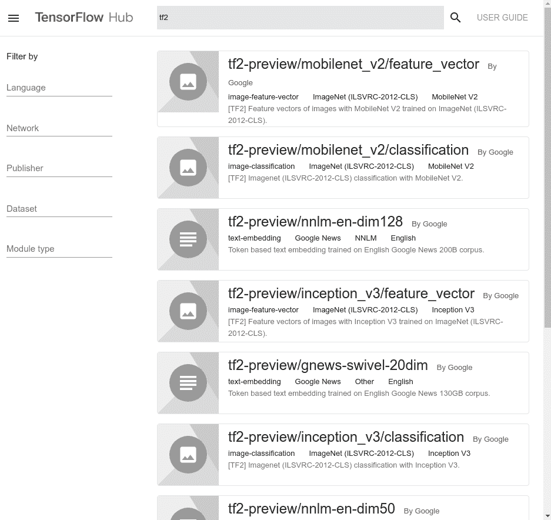
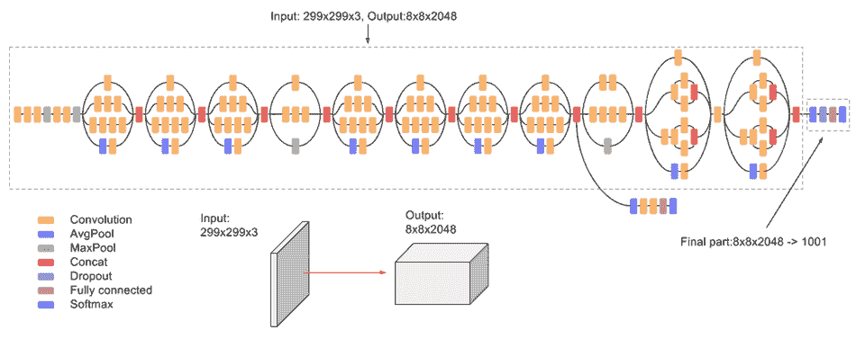
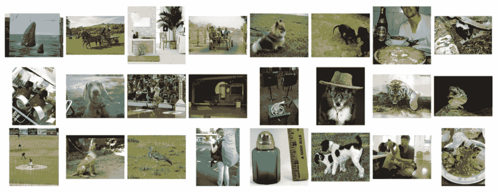

# 第七章：使用 TensorFlow Hub 进行图像分类

在本书的前几章中，我们讨论了图像分类任务。我们已经看到如何通过堆叠多个卷积层来定义卷积神经网络，并学习如何使用 Keras 来训练它。我们还了解了 eager 执行，并发现使用 AutoGraph 非常直接。

到目前为止，使用的卷积架构一直是类似 LeNet 的架构，预期输入大小为 28 x 28，每次训练时从头到尾训练，以使网络学习如何提取正确的特征来解决 fashion-MNIST 分类任务。

从零开始构建分类器，逐层定义架构，是一个非常好的教学练习，能够让你实验不同的层配置如何影响网络的表现。然而，在现实场景中，用于训练分类器的数据量通常是有限的。收集干净且正确标注的数据是一个耗时的过程，收集包含成千上万样本的数据集非常困难。而且，即使数据集的大小足够（也就是我们处于大数据范畴），训练分类器的过程依然是一个缓慢的过程；训练可能需要数小时的 GPU 时间，因为比 LeNet 架构更复杂的架构是实现令人满意结果所必需的。多年来，已经开发出了不同的架构，所有这些架构都引入了一些新颖的设计，使得可以正确地分类分辨率高于 28 x 28 的彩色图像。

学术界和工业界每年都会发布新的分类架构，以提高现有技术水平。通过观察架构在像 ImageNet 这样的庞大数据集上训练和测试时的 top-1 准确率，可以衡量它们在图像分类任务中的表现。

ImageNet 是一个包含超过 1500 万张高分辨率图像的数据集，涵盖超过 22,000 个类别，所有图像都经过手动标注。**ImageNet 大规模视觉识别挑战赛**（**ILSVRC**）是一个年度的目标检测与分类挑战，使用 ImageNet 的一个子集，包含 1000 个类别的 1000 张图像。用于计算的数据集大致包括 120 万张训练图像、5 万张验证图像和 10 万张测试图像。

为了在图像分类任务中取得令人印象深刻的结果，研究人员发现需要使用深度架构。这种方法有一个缺点——网络越深，训练的参数数量就越多。但更多的参数意味着需要大量的计算能力（而计算能力是有成本的！）。既然学术界和工业界已经开发并训练了他们的模型，为什么我们不利用他们的工作来加速我们的开发，而不是每次都重新发明轮子呢？

在本章中，我们将讨论迁移学习和微调，展示它们如何加速开发过程。TensorFlow Hub 作为一种工具，用于快速获取所需模型并加速开发。

在本章结束时，您将了解如何使用 TensorFlow Hub 并通过其与 Keras 的集成，轻松地将模型中嵌入的知识迁移到新任务中。

在本章中，我们将讨论以下主题：

+   获取数据

+   迁移学习

+   微调

# 获取数据

本章要解决的任务是一个关于花卉数据集的分类问题，该数据集可在**tensorflow-datasets**（**tfds**）中找到。该数据集名为`tf_flowers`，包含五种不同花卉物种的图像，分辨率各异。通过使用`tfds`，获取数据非常简单，我们可以通过查看`tfds.load`调用返回的`info`变量来获取数据集的信息，如下所示：

`(tf2)`

```py
import tensorflow_datasets as tfds

dataset, info = tfds.load("tf_flowers", with_info=True)
print(info)
```

前面的代码生成了以下的数据集描述：

```py
tfds.core.DatasetInfo(
    name='tf_flowers',
    version=1.0.0,
    description='A large set of images of flowers',
    urls=['http://download.tensorflow.org/example_images/flower_photos.tgz'],
    features=FeaturesDict({
        'image': Image(shape=(None, None, 3), dtype=tf.uint8),
        'label': ClassLabel(shape=(), dtype=tf.int64, num_classes=5)
    },
    total_num_examples=3670,
    splits={
        'train': <tfds.core.SplitInfo num_examples=3670>
    },
    supervised_keys=('image', 'label'),
    citation='"""
        @ONLINE {tfflowers,
        author = "The TensorFlow Team",
        title = "Flowers",
        month = "jan",
        year = "2019",
        url = "http://download.tensorflow.org/example_images/flower_photos.tgz" }

    """',
    redistribution_info=,
)
```

数据集有一个训练集划分，包含 3,670 张带标签的图像。由于`Image`形状特征的高度和宽度位置显示为`None`，图像分辨率不固定。数据集包含五个类别，正如我们预期的那样。查看数据集的`download`文件夹（默认为`~/tensorflow_datasets/downloads/extracted`），我们可以找到数据集的结构，并查看标签，具体如下：

+   雏菊

+   蒲公英

+   玫瑰

+   向日葵

+   郁金香

数据集中的每张图片都具有知识共享许可（Creative Commons by attribution）。从`LICENSE.txt`文件中我们可以看到，数据集是通过爬取 Flickr 网站收集的。以下是从数据集中随机选取的一张图片：


被标记为向日葵的图像。文件 sunflowers/2694860538_b95d60122c_m.jpg - 由 Ally Aubry 提供的 CC-BY 许可（[`www.flickr.com/photos/allyaubryphotography/2694860538/`](https://www.flickr.com/photos/allyaubryphotography/2694860538/)）。

数据集通常并不是由仅包含标注对象的图片组成的，这类数据集非常适合开发能够处理数据中噪声的强大算法。

数据集已经准备好，尽管它并未按指导原则正确划分。事实上，数据集只有一个划分，而推荐使用三个划分（训练集、验证集和测试集）。让我们通过创建三个独立的`tf.data.Dataset`对象来创建这三个不重叠的划分。我们将使用数据集对象的`take`和`skip`方法：

```py
dataset = dataset["train"]
tot = 3670

train_set_size = tot // 2
validation_set_size = tot - train_set_size - train_set_size // 2
test_set_size = tot - train_set_size - validation_set_size

print("train set size: ", train_set_size)
print("validation set size: ", validation_set_size)
print("test set size: ", test_set_size)

train, test, validation = (
    dataset.take(train_set_size),
    dataset.skip(train_set_size).take(validation_set_size),
    dataset.skip(train_set_size + validation_set_size).take(test_set_size),
)
```

好的。现在我们已经获得了所需的三种数据集划分，可以开始使用它们来训练、评估和测试我们的分类模型，该模型将通过重用别人基于不同数据集训练的模型来构建。

# 迁移学习

只有学术界和一些行业才具备训练整个卷积神经网络（CNN）从零开始所需的预算和计算能力，尤其是在像 ImageNet 这样的大型数据集上，从随机权重开始。

由于这项昂贵且耗时的工作已经完成，重用训练过的模型的部分来解决我们的分类问题是一个明智的做法。

事实上，可以将网络从一个数据集上学到的知识转移到一个新的数据集上，从而实现知识的迁移。

迁移学习是通过依赖先前学习的任务来学习新任务的过程：学习过程可以更快、更准确，并且需要更少的训练数据。

迁移学习的想法非常聪明，并且在使用卷积神经网络时可以成功应用。

事实上，所有用于分类的卷积架构都有一个固定结构，我们可以将它们的部分作为构建模块来为我们的应用提供支持。一般结构由三个元素组成：

+   **输入层**：该架构设计用于接受具有精确分辨率的图像。输入分辨率影响整个架构；如果输入层的分辨率较高，网络将会更深。

+   **特征提取器**：这是一组卷积层、池化层、归一化层以及位于输入层与第一个全连接层之间的所有其他层。该架构学习将输入图像中包含的所有信息总结为低维表示（在下面的图示中，大小为 227 x 227 x 3 的图像被投影到一个 9216 维的向量中）。

+   **分类层**：这些是一个由全连接层组成的堆叠——一个建立在分类器提取的低维输入表示之上的全连接分类器：



AlexNet 架构：第一款用于赢得 ImageNet 挑战的深度神经网络。像所有其他用于分类的卷积神经网络一样，它的结构是固定的。输入层由一个期望的输入图像组成，分辨率为 227 x 227 x 227。特征提取器是由一系列卷积层组成，后跟最大池化层以减少分辨率并向更深层推进；最后的特征图 6 x 6 x 256 被重塑为一个 6 * 6 * 256 = 9216 维的特征向量。分类层是传统的全连接架构，最终输出 1,000 个神经元，因为该网络是在 1,000 个类别上训练的。

将训练模型的知识转移到新模型中需要我们移除网络中任务特定的部分（即分类层），并将 CNN 保持为固定的特征提取器。

这种方法允许我们将预训练模型的特征提取器作为构建模块用于我们的新分类架构。在进行迁移学习时，预训练模型保持不变，而附加在特征向量上的新分类层是可训练的。

通过这种方式，我们可以通过重用在大规模数据集上学到的知识并将其嵌入到模型中来训练分类器。这带来了两个显著的优势：

+   它加速了训练过程，因为可训练的参数数量较少。

+   它有可能减轻过拟合问题，因为提取的特征来自不同的领域，训练过程无法改变它们。

到目前为止，一切都很好。迁移学习的思路很明亮，当数据集较小且资源受限时，它有助于解决一些现实问题。唯一缺失的部分，恰恰也是最重要的部分是：我们可以在哪里找到预训练模型？

正因如此，TensorFlow 团队创建了 TensorFlow Hub。

# TensorFlow Hub

官方文档中对 TensorFlow Hub 的描述很好地阐明了 TensorFlow Hub 是什么以及它的作用：

TensorFlow Hub 是一个用于发布、发现和使用可重用机器学习模型组件的库。一个*模块*是 TensorFlow 图中的一个自包含部分，包含它的权重和资产，可以在不同任务中重复使用，这个过程被称为迁移学习。迁移学习可以：

- 使用较小的数据集训练模型

- 提升泛化能力，且

- 加速训练

因此，TensorFlow Hub 是一个我们可以浏览的库，可以在其中寻找最适合我们需求的预训练模型。TensorFlow Hub 既可以作为一个我们可以浏览的网站（[`tfhub.dev`](https://tfhub.dev)），也可以作为一个 Python 包使用。

安装 Python 包可以完美集成加载到 TensorFlow Hub 上的模块和 TensorFlow 2.0：

`(tf2)`

```py
pip install tensorflow-hub>0.3
```

这就是我们所需的全部操作，就能访问与 TensorFlow 兼容且集成的完整预训练模型库。

TensorFlow 2.0 的集成非常棒——我们只需要 TensorFlow Hub 上模块的 URL，就能创建一个包含我们所需模型部分的 Keras 层！

在[`tfhub.dev`](https://tfhub.dev)浏览目录是直观的。接下来的截图展示了如何使用搜索引擎找到包含字符串`tf2`的任何模块（这是一种快速找到已上传的 TensorFlow 2.0 兼容且可用模块的方法）：



TensorFlow Hub 官网（[`tfhub.dev`](https://tfhub.dev)）：可以通过查询字符串（在这种情况下为 tf2）搜索模块，并通过左侧的过滤栏精细化搜索结果。

该库中有两种版本的模型：仅特征向量和分类模型，这意味着特征向量加上训练过的分类头。TensorFlow Hub 目录中已经包含了迁移学习所需的一切。在接下来的部分，我们将看到如何通过 Keras API 将 TensorFlow Hub 中的 Inception v3 模块轻松集成到 TensorFlow 2.0 源代码中。

# 使用 Inception v3 作为特征提取器

对 Inception v3 架构的完整分析超出了本书的范围；然而，值得注意的是该架构的一些特点，以便正确地在不同数据集上进行迁移学习。

Inception v3 是一个深度架构，包含 42 层，它在 2015 年赢得了**ImageNet 大规模视觉识别挑战赛**（**ILSVRC**）。其架构如下图所示：



Inception v3 架构。该模型架构复杂且非常深。网络接受一个 299 x 299 x 3 的图像作为输入，并生成一个 8 x 8 x 2,048 的特征图，这是最终部分的输入；即一个在 1,000 + 1 个 ImageNet 类别上训练的分类器。图像来源：[`cloud.google.com/tpu/docs/inception-v3-advanced`](https://cloud.google.com/tpu/docs/inception-v3-advanced)。

网络期望输入的图像分辨率为 299 x 299 x 3，并生成一个 8 x 8 x 2,048 的特征图。它已在 ImageNet 数据集的 1,000 个类别上进行训练，输入图像已被缩放到[0,1]范围内。

所有这些信息都可以在模块页面找到，用户可以通过点击 TensorFlow Hub 网站的搜索结果来访问该页面。与前面显示的官方架构不同，在该页面上，我们可以找到关于提取特征向量的信息。文档说明它是一个 2,048 维的特征向量，这意味着所使用的特征向量并不是展平后的特征图（那将是一个 8 * 8 * 2048 维的向量），而是网络末端的一个全连接层。

了解期望的输入形状和特征向量大小对于正确地将调整大小后的图像输入到网络并附加最终层是至关重要的，知道特征向量与第一个全连接层之间会有多少连接。

更重要的是，需要了解网络是在哪个数据集上进行训练的，因为迁移学习效果良好是因为原始数据集与目标（新）数据集有一些相似的特征。以下截图展示了从 2015 年 ILSVRC 使用的数据集中收集的一些样本：



从 ILSVRC 2015 竞赛使用的数据集中收集的样本。高分辨率图像，复杂的场景和丰富的细节。

如你所见，这些图像是各种场景和主题的高分辨率图像，细节丰富。细节和主题的变化性很高。因此，我们期望学习到的特征提取器能够提取一个特征向量，作为这些特征的良好总结。这意味着，如果我们将一张与网络在训练中看到的图像具有相似特征的图像输入到预训练网络中，它将提取一个有意义的表示作为特征向量。相反，如果我们输入的图像没有类似的特征（例如，像 ImageNet 这样的简单几何形状图像，它缺乏丰富的细节），特征提取器就不太可能提取出一个好的表示。

Inception v3 的特征提取器肯定足够好，可以作为我们花卉分类器的构建模块。

# 将数据适配到模型中

模块页面上找到的信息还告诉我们，有必要向之前构建的数据集拆分中添加一个预处理步骤：`tf_flower` 图像是 `tf.uint8` 类型，这意味着它们的范围是 [0,255]，而 Inception v3 是在 [0,1] 范围内的图像上训练的，因此它们是 `tf.float32` 类型：

`(tf2)`

```py
def to_float_image(example):
    example["image"] = tf.image.convert_image_dtype(example["image"], tf.float32)
    return example
```

此外，Inception 架构要求固定的输入形状为 299 x 299 x 3。因此，我们必须确保所有图像都被正确调整为预期的输入大小：

`(tf2)`

```py
def resize(example):
    example["image"] = tf.image.resize(example["image"], (299, 299))
    return example
```

所有必需的预处理操作已经定义好，因此我们可以准备将它们应用于 `train`、`validation` 和 `test` 数据集：

`(tf2)`

```py
train = train.map(to_float_image).map(resize)
validation = validation.map(to_float_image).map(resize)
test = test.map(to_float_image).map(resize)
```

总结一下：目标数据集已经准备好；我们知道要使用哪个模型作为特征提取器；模块信息页面告诉我们需要进行一些预处理步骤，以使数据与模型兼容。

一切都已准备好设计一个使用 Inception v3 作为特征提取器的分类模型。在接下来的部分中，将展示 `tensorflow-hub` 模块的极易使用，得益于其与 Keras 的集成。

# 构建模型 - hub.KerasLayer

TensorFlow Hub Python 包已经安装好，这就是我们所需要做的全部：

1.  下载模型参数和图形描述

1.  恢复其图形中的参数

1.  创建一个 Keras 层，包装图形并使我们能够像使用其他任何 Keras 层一样使用它

这三点操作是在 `KerasLayer tensorflow-hub` 函数的钩子下执行的：

```py
import tensorflow_hub as hub

hub.KerasLayer(
    "https://tfhub.dev/google/tf2-preview/inception_v3/feature_vector/2",
    output_shape=[2048],
    trainable=False)
```

`hub.KerasLayer` 函数创建了 `hub.keras_layer.KerasLayer`，它是一个 `tf.keras.layers.Layer` 对象。因此，它可以像其他任何 Keras 层一样使用——这非常强大！

这种严格的集成使我们能够定义一个使用 Inception v3 作为特征提取器的模型，并且它具有两个全连接层作为分类层，这只需要非常少的代码行数：

`(tf2)`

```py
num_classes = 5

model = tf.keras.Sequential(
    [
        hub.KerasLayer(
            "https://tfhub.dev/google/tf2-preview/inception_v3/feature_vector/2",
            output_shape=[2048],
            trainable=False,
        ),
        tf.keras.layers.Dense(512),
        tf.keras.layers.ReLU(),
        tf.keras.layers.Dense(num_classes), # linear
    ]
)
```

由于有 Keras 集成，模型定义非常简单。所有的设置都已经完成，能够定义训练循环、衡量性能，并检查迁移学习方法是否能给出预期的分类结果。

不幸的是，从 TensorFlow Hub 下载预训练模型的过程，只有在高速互联网连接下才会快速。进度条显示下载进度默认未启用，因此，第一次构建模型时，可能需要较长时间（取决于网络速度）。

要启用进度条，`hub.KerasLayer` 需要使用 `TFHUB_DOWNLOAD_PROGRESS` 环境变量。因此，可以在脚本顶部添加以下代码片段，定义这个环境变量并将值设置为 1；这样，在第一次下载时，将会显示一个方便的进度条：

```py
import os
os.environ["TFHUB_DOWNLOAD_PROGRESS"] = "1"
```

# 训练和评估

使用预训练的特征提取器可以加速训练，同时保持训练循环、损失函数和优化器不变，使用每个标准分类器训练的相同结构。

由于数据集标签是 `tf.int64` 标量，因此使用的损失函数是标准的稀疏分类交叉熵，并将 `from_logits` 参数设置为 `True`。如上一章所述，第五章，*高效的数据输入管道与估算器 API*，将此参数设置为 `True` 是一种良好的做法，因为这样损失函数本身会应用 softmax 激活函数，确保以数值稳定的方式计算，从而防止损失变为 `NaN`：

```py
# Training utilities
loss = tf.losses.SparseCategoricalCrossentropy(from_logits=True)
step = tf.Variable(1, name="global_step", trainable=False)
optimizer = tf.optimizers.Adam(1e-3)

train_summary_writer = tf.summary.create_file_writer("./log/transfer/train")
validation_summary_writer = tf.summary.create_file_writer("./log/transfer/validation")

# Metrics
accuracy = tf.metrics.Accuracy()
mean_loss = tf.metrics.Mean(name="loss")

@tf.function
def train_step(inputs, labels):
    with tf.GradientTape() as tape:
        logits = model(inputs)
        loss_value = loss(labels, logits)

    gradients = tape.gradient(loss_value, model.trainable_variables)
    optimizer.apply_gradients(zip(gradients, model.trainable_variables))
    step.assign_add(1)

    accuracy.update_state(labels, tf.argmax(logits, -1))
    return loss_value

# Configure the training set to use batches and prefetch
train = train.batch(32).prefetch(1)
validation = validation.batch(32).prefetch(1)
test = test.batch(32).prefetch(1)

num_epochs = 10
for epoch in range(num_epochs):

    for example in train:
        image, label = example["image"], example["label"]
        loss_value = train_step(image, label)
        mean_loss.update_state(loss_value)

        if tf.equal(tf.math.mod(step, 10), 0):
            tf.print(
                step, " loss: ", mean_loss.result(), " acccuracy: ", accuracy.result()
            )
            mean_loss.reset_states()
            accuracy.reset_states()

    # Epoch ended, measure performance on validation set
    tf.print("## VALIDATION - ", epoch)
    accuracy.reset_states()
    for example in validation:
        image, label = example["image"], example["label"]
        logits = model(image)
        accuracy.update_state(label, tf.argmax(logits, -1))
    tf.print("accuracy: ", accuracy.result())
    accuracy.reset_states()
```

训练循环产生了以下输出（剪辑以突出显示仅重要部分）：

```py
10 loss: 1.15977693 acccuracy: 0.527777791
20 loss: 0.626715124 acccuracy: 0.75
30 loss: 0.538604617 acccuracy: 0.8125
40 loss: 0.450686693 acccuracy: 0.834375
50 loss: 0.56412369 acccuracy: 0.828125
## VALIDATION - 0
accuracy: 0.872410059

[...]

530 loss: 0.0310602095 acccuracy: 0.986607134
540 loss: 0.0334353112 acccuracy: 0.990625
550 loss: 0.029923955 acccuracy: 0.9875
560 loss: 0.0309863128 acccuracy: 1
570 loss: 0.0372043774 acccuracy: 0.984375
580 loss: 0.0412098244 acccuracy: 0.99375
## VALIDATION - 9
accuracy: 0.866957486
```

在一个训练周期后，我们得到了 0.87 的验证准确率，而训练准确率甚至更低（0.83）。但是到了第十个周期结束时，验证准确率甚至下降了（0.86），而模型开始对训练数据发生过拟合。

在 *练习* 部分，你将找到几个使用前述代码作为起点的练习；过拟合问题应从多个角度进行处理，寻找最佳解决方法。

在开始下一个主要部分之前，值得添加一个简单的性能测量，来衡量计算单个训练周期所需的时间。

# 训练速度

更快速的原型设计和训练是迁移学习方法的优势之一。迁移学习在工业界被广泛使用的原因之一是它能够节省资金，减少开发和训练时间。

要测量训练时间，可以使用 Python 的 `time` 包。`time.time()` 返回当前时间戳，可以让你测量（以毫秒为单位）完成一个训练周期所需的时间。

因此，可以通过添加时间模块导入和持续时间测量来扩展前一节的训练循环：

`(tf2)`

```py
from time import time

# [...]
for epoch in range(num_epochs):
    start = time()
    for example in train:
        image, label = example["image"], example["label"]
        loss_value = train_step(image, label)
        mean_loss.update_state(loss_value)

        if tf.equal(tf.math.mod(step, 10), 0):
            tf.print(
                step, " loss: ", mean_loss.result(), " acccuracy: ", accuracy.result()
            )
            mean_loss.reset_states()
            accuracy.reset_states()
    end = time()
    print("Time per epoch: ", end-start)
# remeaning code
```

平均而言，在配备 Nvidia k40 GPU 的 Colab 笔记本（[`colab.research.google.com`](https://colab.research.google.com)）上运行训练循环，我们获得的执行速度如下：

```py
Time per epoch: 16.206
```

如下一节所示，使用预训练模型作为特征提取器的迁移学习可以显著提高速度。

有时，仅将预训练模型作为特征提取器并不是将知识从一个领域迁移到另一个领域的最佳方法，通常是因为两个领域差异太大，且所学到的特征对于解决新任务并无帮助。

在这些情况下，实际上—并且建议—不使用固定的特征提取部分，而是让优化算法去改变它，从而端到端训练整个模型。

# 微调

微调是迁移学习的另一种方法。两者的目标相同，都是将针对特定任务在数据集上学到的知识迁移到不同的数据集和任务上。如前一节所示，迁移学习是重用预训练模型，并且不对其特征提取部分进行任何更改；实际上，它被认为是网络的不可训练部分。

相比之下，微调则是通过继续反向传播来微调预训练网络的权重。

# 何时进行微调

微调网络需要有正确的硬件；通过更深的网络反向传播梯度需要在内存中加载更多的信息。非常深的网络通常是在拥有数千个 GPU 的数据中心从零开始训练的。因此，准备根据可用内存的大小，将批量大小降至最低，例如降至 1。

除了硬件要求外，在考虑微调时还有其他需要注意的不同点：

+   **数据集大小**：微调网络意味着使用一个具有大量可训练参数的网络，正如我们在前几章中了解到的，拥有大量参数的网络容易发生过拟合。

    如果目标数据集的大小较小，那么微调网络并不是一个好主意。将网络作为固定特征提取器使用，可能会带来更好的结果。

+   **数据集相似性**：如果数据集的大小很大（这里的大是指大小与预训练模型训练时使用的数据集相当）且与原始数据集相似，那么微调模型可能是一个好主意。稍微调整网络参数将帮助网络专注于提取特定于该数据集的特征，同时正确地重用来自先前相似数据集的知识。

    如果数据集很大且与原始数据差异很大，微调网络可能会有所帮助。事实上，从预训练模型开始，优化问题的初始解很可能接近一个好的最小值，即使数据集有不同的特征需要学习（这是因为卷积神经网络的低层通常学习每个分类任务中常见的低级特征）。

如果新数据集满足相似性和大小的限制，微调模型是一个好主意。需要特别关注的一个重要参数是学习率。在微调一个预训练模型时，我们假设模型参数是好的（并且确实是，因为它们是实现了先进成果的模型参数），因此建议使用较小的学习率。

使用较高的学习率会过度改变网络参数，而我们不希望以这种方式改变它们。相反，使用较小的学习率，我们稍微调整参数，使其适应新的数据集，而不会过度扭曲它们，从而重新利用知识而不破坏它。

当然，如果选择微调方法，必须考虑硬件要求：降低批量大小可能是使用标准 GPU 微调非常深的模型的唯一方法。

# TensorFlow Hub 集成

微调从 TensorFlow Hub 下载的模型可能听起来很困难；我们需要做以下几步：

+   下载模型参数和图

+   恢复图中的模型参数

+   恢复所有仅在训练期间执行的操作（激活丢弃层并启用批量归一化层计算的移动均值和方差）

+   将新层附加到特征向量上

+   端到端训练模型

实际上，TensorFlow Hub 和 Keras 模型的集成非常紧密，我们只需在通过`hub.KerasLayer`导入模型时将`trainable`布尔标志设置为`True`，就能实现这一切：

`(tf2)`

```py
hub.KerasLayer(
    "https://tfhub.dev/google/tf2-preview/inception_v3/feature_vector/2",
    output_shape=[2048],
    trainable=True) # <- That's all!
```

# 训练并评估

如果我们构建与前一章第五章中相同的模型，*高效的数据输入管道与估算器 API*，并在`tf_flower`数据集上进行训练，微调权重，会发生什么情况？

所以，模型如下所示；请注意优化器的学习率已从`1e-3`降低到`1e-5`：

`(tf2)`

```py
optimizer = tf.optimizers.Adam(1e-5)
# [ ... ]
model = tf.keras.Sequential(
    [
        hub.KerasLayer(
            "https://tfhub.dev/google/tf2-preview/inception_v3/feature_vector/2",
            output_shape=[2048],
            trainable=True, # <- enables fine tuning
        ),
        tf.keras.layers.Dense(512),
        tf.keras.layers.ReLU(),
        tf.keras.layers.Dense(num_classes), # linear
    ]
)

# [ ... ]
# Same training loop
```

在以下框中，展示了第一次和最后一次训练时期的输出：

```py
10 loss: 1.59038031 acccuracy: 0.288194448
20 loss: 1.25725865 acccuracy: 0.55625
30 loss: 0.932323813 acccuracy: 0.721875
40 loss: 0.63251847 acccuracy: 0.81875
50 loss: 0.498087496 acccuracy: 0.84375
## VALIDATION - 0
accuracy: 0.872410059

[...]

530 loss: 0.000400377758 acccuracy: 1
540 loss: 0.000466914673 acccuracy: 1
550 loss: 0.000909397728 acccuracy: 1
560 loss: 0.000376881275 acccuracy: 1
570 loss: 0.000533850689 acccuracy: 1
580 loss: 0.000438459858 acccuracy: 1
## VALIDATION - 9
accuracy: 0.925845146

```

正如预期的那样，测试准确率达到了常数值 1；因此我们对训练集进行了过拟合。这是预期的结果，因为`tf_flower`数据集比 ImageNet 小且简单。然而，要清楚地看到过拟合问题，我们必须等待更长时间，因为训练更多的参数使得整个学习过程变得非常缓慢，特别是与之前在预训练模型不可训练时的训练相比。

# 训练速度

通过像前一节那样添加时间测量，可以看到微调过程相对于迁移学习（使用模型作为不可训练的特征提取器）而言是非常缓慢的。

事实上，如果在前面的场景中，我们每个 epoch 的平均训练时间大约为 16.2 秒，那么现在我们平均需要等待 60.04 秒，这意味着训练速度下降了 370%！

此外，值得注意的是，在第一轮训练结束时，我们达到了与之前训练相同的验证准确率，并且尽管训练数据出现了过拟合，但在第十轮训练结束时获得的验证准确率仍高于之前的结果。

这个简单的实验展示了使用预训练模型作为特征提取器可能导致比微调模型更差的性能。这意味着，网络在 ImageNet 数据集上学到的特征与分类花卉数据集所需的特征差异太大。

是否使用预训练模型作为固定特征提取器，还是对其进行微调，是一个艰难的决定，涉及到许多权衡。了解预训练模型提取的特征是否适合新任务是复杂的；仅仅通过数据集的大小和相似性来作为参考是一个指导原则，但在实际操作中，这个决策需要进行多次测试。

当然，最好先将预训练模型作为特征提取器使用，并且如果新模型的表现已经令人满意，就无需浪费时间进行微调。如果结果不理想，值得尝试使用不同的预训练模型，最后的手段是尝试微调方法（因为这需要更多的计算资源，且成本较高）。

# 总结

本章介绍了迁移学习和微调的概念。从头开始训练一个非常深的卷积神经网络，且初始权重为随机值，需要合适的设备，这些设备只存在于学术界和一些大公司中。此外，这还是一个高成本的过程，因为找到在分类任务上达到最先进成果的架构需要设计和训练多个模型，并且每个模型都需要重复训练过程来寻找最佳的超参数配置。

因此，迁移学习是推荐的做法，尤其是在原型设计新解决方案时，它能够加速训练时间并降低训练成本。

TensorFlow Hub 是 TensorFlow 生态系统提供的在线库，包含一个在线目录，任何人都可以浏览并搜索预训练模型，这些模型可以直接使用。模型附带了所有必要的信息，从输入大小到特征向量大小，甚至包括训练模型时使用的数据集及其数据类型。所有这些信息可用于设计正确的数据输入管道，从而确保网络接收到正确形状和数据类型的数据。

TensorFlow Hub 附带的 Python 包与 TensorFlow 2.0 和 Keras 生态系统完美集成，使你仅需知道模型的 URL（可以在 Hub 网站上找到），就能下载并使用预训练模型。

`hub.KerasLayer` 函数不仅可以让你下载和加载预训练模型，还可以通过切换 `trainable` 标志来实现迁移学习和微调的功能。

在 *迁移学习* 和 *微调* 部分，我们开发了分类模型，并使用自定义训练循环进行了训练。TensorFlow Datasets 被用来轻松下载、处理，并获取 `tf.data.Dataset` 对象，这些对象通过定义高效的数据输入管道来充分利用处理硬件。

本章的最后部分是关于练习：本章的大部分代码故意未完成，以便让你动手实践，更有效地学习。

使用卷积架构构建的分类模型广泛应用于各个领域，从工业到智能手机应用。通过查看图像的整体内容来进行分类是有用的，但有时这种方法的使用范围有限（图像通常包含多个物体）。因此，已经开发出了其他架构，利用卷积神经网络作为构建模块。这些架构可以在每张图像中定位并分类多个物体，这些架构广泛应用于自动驾驶汽车和许多其他令人兴奋的应用中！

在下一章，第七章，*目标检测简介*，将分析物体定位和分类问题，并从零开始使用 TensorFlow 2.0 构建一个能够在图像中定位物体的模型。

# 练习

1.  描述迁移学习的概念。

1.  迁移学习过程何时能够带来良好的结果？

1.  迁移学习和微调之间的区别是什么？

1.  如果一个模型已经在一个小数据集上进行了训练，并且数据集的方差较低（示例相似），它是否是作为固定特征提取器用于迁移学习的理想选择？

1.  在 *迁移学习* 部分构建的花卉分类器没有在测试数据集上进行性能评估：请为其添加评估功能。

1.  扩展花卉分类器源代码，使其能够在 TensorBoard 上记录指标。使用已定义的 summary writers。

1.  扩展花卉分类器，以使用检查点（及其检查点管理器）保存训练状态。

1.  为达到了最高验证准确度的模型创建第二个检查点。

1.  由于模型存在过拟合问题，可以通过减少分类层神经元的数量来进行测试；尝试一下，看看这是否能减少过拟合问题。

1.  在第一个全连接层后添加一个丢弃层，并使用不同的丢弃保留概率进行多次运行，测量其性能。选择达到最高验证准确度的模型。

1.  使用为花卉分类器定义的相同模型，创建一个新的训练脚本，使用 Keras 训练循环：不要编写自定义训练循环，而是使用 Keras。

1.  将前面第 11 点创建的 Keras 模型转换为估算器（estimator）。训练并评估该模型。

1.  使用 TensorFlow Hub 网站查找一个轻量级的预训练模型，用于图像分类，且该模型是基于一个高方差数据集训练的。使用特征提取器版本来构建一个 fashion-MNIST 分类器。

1.  使用在复杂数据集上训练的模型作为 fashion-MNIST 分类器的特征提取器的想法是一个好主意吗？提取的特征有意义吗？

1.  对之前构建的 fashion-MNIST 分类器进行微调。

1.  将复杂数据集微调为简单数据集的过程是否帮助我们在迁移学习中获得了更好的结果？如果是，为什么？如果不是，为什么？

1.  如果使用更高的学习率来微调模型，会发生什么？尝试一下。
