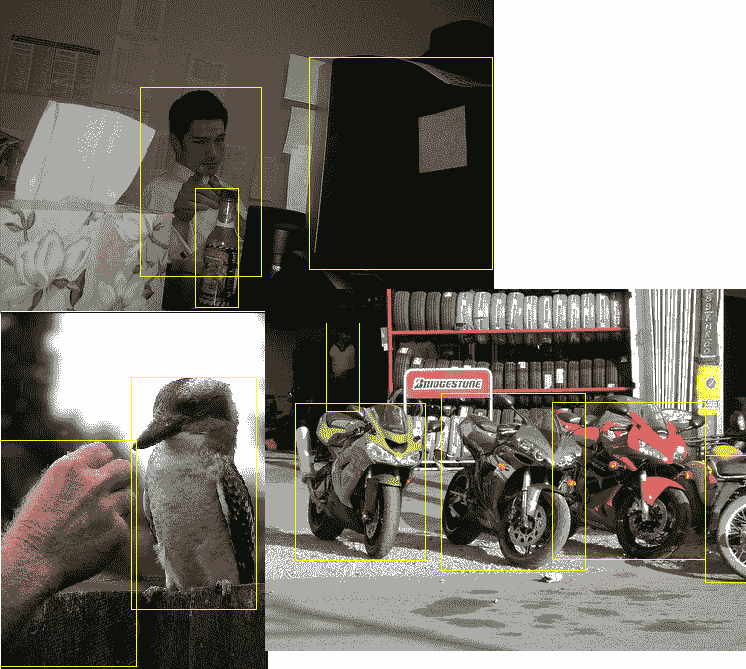

# 第八章：物体检测简介

在图像中检测和分类物体是一个具有挑战性的问题。到目前为止，我们在简单层面上处理了图像分类的问题；但在现实场景中，我们不太可能只拥有包含一个物体的图像。在工业环境中，可以设置相机和机械支撑来捕捉单个物体的图像。然而，即使在像工业这样的受限环境中，也不总是能够拥有如此严格的设置。智能手机应用、自动化引导车辆，以及更一般的，任何在非受控环境中捕捉图像的现实应用，都需要在输入图像中同时进行多个物体的定位和分类。物体检测是通过预测包含物体的边界框的坐标来定位图像中的物体，同时正确分类它的过程。

解决物体检测问题的最先进方法基于卷积神经网络，正如我们在本章中将看到的，它不仅可以用于提取有意义的分类特征，还可以回归边界框的坐标。由于这是一个具有挑战性的问题，因此最好从基础开始。检测和分类多个物体比仅解决单一物体问题需要更复杂的卷积架构设计和训练。回归单个物体的边界框坐标并对内容进行分类的任务被称为**定位和分类**。解决此任务是开发更复杂架构以解决物体检测任务的起点。

在本章中，我们将研究这两个问题；我们从基础开始，完全开发一个回归网络，然后将其扩展为同时执行回归和分类。章节最后将介绍基于锚点的检测器，因为完整实现物体检测网络超出了本书的范围。

本章使用的数据集是 PASCAL Visual Object Classes Challenge 2007。

本章将涵盖以下主题：

+   获取数据

+   物体定位

+   分类与定位

# 获取数据

物体检测是一个监督学习问题，需要大量的数据才能达到良好的性能。通过在物体周围绘制边界框并为其分配正确标签，仔细注释图像的过程是一个费时的过程，需要几个小时的重复工作。

幸运的是，已经有几个现成可用的物体检测数据集。最著名的是 ImageNet 数据集，紧随其后的是 PASCAL VOC 2007 数据集。要能够使用 ImageNet，需要专门的硬件，因为它的大小和每张图片中标注的物体数量使得物体检测任务难以完成。

相比之下，PASCAL VOC 2007 只包含 9,963 张图像，每张图像中标注的物体数量不同，且属于 20 个选定的物体类别。20 个物体类别如下：

+   **Person**: 人物

+   **Animal**: 鸟、猫、牛、狗、马、羊

+   **Vehicle**: 飞机、自行车、船、公共汽车、汽车、摩托车、火车

+   **Indoor**: 瓶子、椅子、餐桌、盆栽植物、沙发、电视/显示器

如官方数据集页面所述（[`host.robots.ox.ac.uk/pascal/VOC/voc2007/`](http://host.robots.ox.ac.uk/pascal/VOC/voc2007/)），该数据集已经分为三个部分（训练、验证和测试）可供使用。数据已经被划分为 50%的训练/验证集和 50%的测试集。各类图像和物体的分布在训练/验证集和测试集之间大致相等。总共有 9,963 张图像，包含 24,640 个标注的物体。

TensorFlow 数据集允许我们通过一行代码下载整个数据集（约 869 MiB），并获取每个分割的`tf.data.Dataset`对象：

`(tf2)`

```py
import tensorflow as tf 
import tensorflow_datasets as tfds 

# Train, test, and validation are datasets for object detection: multiple objects per image. 
(train, test, validation), info = tfds.load( 
 "voc2007", split=["train", "test", "validation"], with_info=True 
)

```

和往常一样，TensorFlow 数据集提供了很多关于数据集格式的有用信息。以下输出是`print(info)`的结果：

```py
tfds.core.DatasetInfo( 
    name='voc2007', 
    version=1.0.0, 
    description='This dataset contains the data from the PASCAL Visual Object Classes Challenge 
2007, a.k.a. VOC2007, corresponding to the Classification and Detection 
competitions. 
A total of 9,963 images are included in this dataset, where each image contains 
a set of objects, out of 20 different classes, making a total of 24,640 
annotated objects. 
In the Classification competition, the goal is to predict the set of labels 
contained in the image, while in the Detection competition the goal is to 
predict the bounding box and label of each individual object. 
', 
    urls=['http://host.robots.ox.ac.uk/pascal/VOC/voc2007/'], 
    features=FeaturesDict({ 
        'image': Image(shape=(None, None, 3), dtype=tf.uint8), 
        'image/filename': Text(shape=(), dtype=tf.string, encoder=None), 
        'labels': Sequence(shape=(None,), dtype=tf.int64, feature=ClassLabel(shape=(), dtype=tf.int64, num_classes=20)), 
        'labels_no_difficult': Sequence(shape=(None,), dtype=tf.int64, feature=ClassLabel(shape=(), dtype=tf.int64, num_classes=20)), 
        'objects': SequenceDict({'label': ClassLabel(shape=(), dtype=tf.int64, num_classes=20), 'bbox': BBoxFeature(shape=(4,), dtype=tf.float32), 'pose': ClassLabel(shape=(), dtype=tf.int64, num_classes=5), 'is_truncated': Tensor(shape=(), dtype=tf.bool), 'is_difficult'
: Tensor(shape=(), dtype=tf.bool)}) 
    }, 
    total_num_examples=9963, 
    splits={ 
        'test': <tfds.core.SplitInfo num_examples=4952>, 
        'train': <tfds.core.SplitInfo num_examples=2501>, 
        'validation': <tfds.core.SplitInfo num_examples=2510> 
    }, 
    supervised_keys=None, 
    citation='""" 
        @misc{pascal-voc-2007, 
          author = "Everingham, M. and Van~Gool, L. and Williams, C. K. I. and Winn, J. and Zisserman, A.", 
          title = "The {PASCAL} {V}isual {O}bject {C}lasses {C}hallenge 2007 {(VOC2007)} {R}esults", 
          howpublished = "http://www.pascal-network.org/challenges/VOC/voc2007/workshop/index.html"} 

    """',
    redistribution_info=, 
)
```

对于每张图像，都有一个`SequenceDict`对象，其中包含每个标注物体的信息。在处理任何数据相关项目时，查看数据非常方便。在这个案例中，特别是因为我们正在解决一个计算机视觉问题，查看图像和边界框可以帮助我们更好地理解网络在训练过程中应该面对的难题。

为了可视化标注图像，我们使用`matplotlib.pyplot`结合使用`tf.image`包；前者用于显示图像，后者用于绘制边界框并将其转换为`tf.float32`（从而将值缩放到[0,1]的范围内）。此外，演示了如何使用`tfds.ClassLabel.int2str`方法；这个方法非常方便，因为它允许我们从标签的数值表示中获取文本表示：

`(tf2)`

```py
import matplotlib.pyplot as plt
```

从训练集获取五张图像，绘制边界框，然后打印类别：

```py
with tf.device("/CPU:0"): 
    for row in train.take(5): 
        obj = row["objects"] 
        image = tf.image.convert_image_dtype(row["image"], tf.float32) 

        for idx in tf.range(tf.shape(obj["label"])[0]): 
            image = tf.squeeze( 
                tf.image.draw_bounding_boxes( 
                    images=tf.expand_dims(image, axis=[0]), 
                    boxes=tf.reshape(obj["bbox"][idx], (1, 1, 4)), 
                    colors=tf.reshape(tf.constant((1.0, 1.0, 0, 0)), (1, 4)), 
                ), 
                axis=[0], 
            ) 

            print( 
                "label: ", info.features["objects"]["label"].int2str(obj["label"][idx]) 
            ) 

```

然后，使用以下代码绘制图像：

```py
            plt.imshow(image)
            plt.show()
```

以下图像是由代码片段生成的五张图像的拼贴画：



请注意，由于 TensorFlow 数据集在创建 TFRecords 时会对数据进行打乱，因此在不同机器上执行相同的操作时，不太可能产生相同的图像顺序。

还值得注意的是，部分物体被标注为完整物体；例如，左下角图像中的人类手被标记为一个人，图片右下角的摩托车后轮被标记为摩托车。

物体检测任务本质上具有挑战性，但通过查看数据，我们可以看到数据本身很难使用。事实上，打印到标准输出的右下角图像的标签是：

+   人物

+   鸟类

因此，数据集包含了完整的物体标注和标签（鸟类），以及部分物体标注并被标记为完整物体（例如，人类的手被标记为一个人）。这个简单的例子展示了物体检测的困难：网络应该能够根据属性（如手）或完整形状（如人）进行分类和定位，同时解决遮挡问题。

查看数据让我们更清楚问题的挑战性。然而，在面对物体检测的挑战之前，最好从基础开始，先解决定位和分类的问题。因此，我们必须过滤数据集中的物体，仅提取包含单个标注物体的图像。为此，可以定义并使用一个简单的函数，该函数接受`tf.data.Dataset`对象作为输入并对其进行过滤。通过过滤元素创建数据集的子集：我们感兴趣的是创建一个用于物体检测和分类的数据集，即一个包含单个标注物体的图像数据集：

`(tf2)`

```py
def filter(dataset): 
    return dataset.filter(lambda row: tf.equal(tf.shape(row["objects"]["label"])[0], 1)) 

train, test, validation = filter(train), filter(test), filter(validation)

```

使用之前的代码片段，我们可以可视化一些图像，以检查是否一切如我们所预期：


我们可以看到从训练集抽取的、只包含单个物体的图像，使用之前的代码片段应用`filter`函数后绘制出来。`filter`函数返回一个新的数据集，该数据集仅包含输入数据集中包含单个边界框的元素，因此它们是训练单个网络进行分类和定位的完美候选。

# 物体定位

卷积神经网络（CNN）是极其灵活的对象——到目前为止，我们已经使用它们解决分类问题，让它们学习提取特定任务的特征。如在第六章《使用 TensorFlow Hub 进行图像分类》中所示，设计用于分类图像的 CNN 标准架构由两部分组成——特征提取器，它生成特征向量，以及一组全连接层，用于将特征向量分类到（希望是）正确的类别：


放置在特征向量顶部的分类器也可以看作是网络的头部

到目前为止，卷积神经网络（CNN）仅被用来解决分类问题，这一点不应误导我们。这些类型的网络非常强大，特别是在多层设置下，它们可以用来解决多种不同类型的问题，从视觉输入中提取信息。

因此，解决定位和分类问题的关键只是向网络中添加一个新的头，即定位头。

输入数据是一张包含单一物体以及边界框四个坐标的图像。因此，目标是利用这些信息通过将定位问题视为回归问题，来同时解决分类和定位问题。

# 将定位视为回归问题

暂时忽略分类问题，专注于定位部分，我们可以将定位问题视为回归输入图像中包含物体的边界框的四个坐标的问题。

实际上，训练 CNN 来解决分类任务或回归任务并没有太大区别：特征提取器的架构保持不变，而分类头则变成回归头。最终，这只是意味着将输出神经元的数量从类别数更改为 4，每个坐标一个神经元。

其理念是，当某些输入特征存在时，回归头应该学习输出正确的坐标。


使用 AlexNet 架构作为特征提取器，并将分类头替换为一个具有四个输出神经元的回归头

为了使网络学习回归物体边界框的坐标，我们必须使用损失函数来表达神经元和标签之间的输入/输出关系（即数据集中存在的边界框四个坐标）。

L2 距离可以有效地用作损失函数：目标是正确回归四个坐标，从而最小化预测值与真实值之间的距离，使其趋近于零：


第一个元组 ![] 是回归头输出，第二个元组 ![] 表示真实的边界框坐标。

在 TensorFlow 2.0 中实现回归网络是直接的。如 [第六章](https://cdp.packtpub.com/hands_on_applied_neural_networks_with_tensorflow_2_x/wp-admin/post.php?post=31&action=edit#post_30) 《*使用 TensorFlow Hub 进行图像分类*》所示，可以通过使用 TensorFlow Hub 下载并嵌入预训练的特征提取器来加速训练阶段。

值得指出的一个细节是 TensorFlow 用于表示边界框坐标（以及一般坐标）的方法—使用的格式是`[ymin, xmin, ymax, xmax]`，并且坐标在[0,1]范围内进行归一化，以避免依赖于原始图像分辨率。

使用 TensorFlow 2.0 和 TensorFlow Hub，我们可以通过几行代码在 PASCAL VOC 2007 数据集上定义并训练坐标回归网络。

使用来自 TensorFlow Hub 的 Inception v3 网络作为坐标回归网络的骨干，定义回归模型是直接的。尽管该网络具有顺序结构，我们通过函数式 API 定义它，因为这将使我们能够轻松扩展模型，而无需重写：

`(tf2)`

```py
import tensorflow_hub as hub

inputs = tf.keras.layers.Input(shape=(299,299,3))
net = hub.KerasLayer(
        "https://tfhub.dev/google/tf2-preview/inception_v3/feature_vector/2",
        output_shape=[2048],
        trainable=False,
      )(inputs)
net = tf.keras.layers.Dense(512)(net)
net = tf.keras.layers.ReLU()(net)
coordinates = tf.keras.layers.Dense(4, use_bias=False)(net)

regressor = tf.keras.Model(inputs=inputs, outputs=coordinates)
```

此外，由于我们决定使用需要 299 x 299 输入图像分辨率且值在[0,1]范围内的 Inception 网络，我们需要在输入管道中增加额外的步骤来准备数据：

`(tf2)`

```py
def prepare(dataset):
    def _fn(row):
        row["image"] = tf.image.convert_image_dtype(row["image"], tf.float32)
        row["image"] = tf.image.resize(row["image"], (299, 299))
        return row

    return dataset.map(_fn)

train, test, validation = prepare(train), prepare(test), prepare(validation)
```

如前所述，使用的损失函数是标准的 L2 损失，TensorFlow 已经将其作为 Keras 损失实现，可以在`tf.losses`包中找到。然而，值得注意的是，我们自己定义损失函数，而不是使用`tf.losses.MeanSquaredError`，因为有一个细节需要强调。

如果我们决定使用已实现的**均方误差**（**MSE**）函数，我们必须考虑到，在底层使用了`tf.subtract`操作。该操作仅仅计算左侧操作数与右侧操作数的差值。这种行为是我们所期望的，但 TensorFlow 中的减法操作遵循 NumPy 的广播语义（几乎所有数学操作都遵循此语义）。这种语义将左侧张量的值广播到右侧张量，如果右侧张量的某个维度为 1，则会将左侧张量的值复制到该位置。

由于我们选择的图像中只有一个物体，因此在`"bbox"`属性中只有一个边界框。因此，如果我们选择批处理大小为 32，则包含边界框的张量将具有形状`(32, 1, 4)`。第二个位置的 1 可能会在损失计算中引起问题，并阻止模型收敛。

因此，我们有两个选择：

+   使用 Keras 定义损失函数，通过使用`tf.squeeze`去除一维维度

+   手动定义损失函数

实际上，手动定义损失函数使我们能够在函数体内放置`tf.print`语句，这可以用于原始调试过程，且更重要的是，以标准方式定义训练循环，使得损失函数本身能够处理在需要时去除一维维度。

`(tf2)`

```py
# First option -> this requires to call the loss l2, taking care of squeezing the input
# l2 = tf.losses.MeanSquaredError()

# Second option, it is the loss function iself that squeezes the input
def l2(y_true, y_pred):
    return tf.reduce_mean(
        tf.square(y_pred - tf.squeeze(y_true, axis=[1]))
    )
```

训练循环很简单，可以通过两种不同的方式来实现：

+   编写自定义训练循环（因此使用`tf.GradientTape`对象）

+   使用 Keras 模型的`compile`和`fit`方法，因为这是 Keras 为我们构建的标准训练循环。

然而，由于我们有兴趣在接下来的章节中扩展此解决方案，最好开始使用自定义训练循环，因为它提供了更多的自定义自由度。此外，我们有兴趣通过在 TensorBoard 上记录它们来可视化真实值和预测的边界框。

因此，在定义训练循环之前，值得定义一个`draw`函数，该函数接受数据集、模型和当前步骤，并利用它们来绘制真实框和预测框：

`(tf2)`

```py
def draw(dataset, regressor, step):
    with tf.device("/CPU:0"):
        row = next(iter(dataset.take(3).batch(3)))
        images = row["image"]
        obj = row["objects"]
        boxes = regressor(images)
        tf.print(boxes)

        images = tf.image.draw_bounding_boxes(
            images=images, boxes=tf.reshape(boxes, (-1, 1, 4))
        )
        images = tf.image.draw_bounding_boxes(
            images=images, boxes=tf.reshape(obj["bbox"], (-1, 1, 4))
        )
        tf.summary.image("images", images, step=step)
```

我们的坐标回归器的训练循环（它也可以被视为一个区域提议，因为它现在已经知道它正在图像中检测的物体的标签），同时在 TensorBoard 上记录训练损失值和来自训练集和验证集的三个样本图像的预测（使用`draw`函数），可以很容易地定义：

1.  定义`global_step`变量，用于跟踪训练迭代，然后定义文件写入器，用于记录训练和验证摘要：

```py
optimizer = tf.optimizers.Adam() 
epochs = 500 
batch_size = 32 

global_step = tf.Variable(0, trainable=False, dtype=tf.int64) 

train_writer, validation_writer = ( 
    tf.summary.create_file_writer("log/train"), 
    tf.summary.create_file_writer("log/validation"), 
) 
with validation_writer.as_default(): 
    draw(validation, regressor, global_step) 

```

1.  根据 TensorFlow 2.0 的最佳实践，我们可以将训练步骤定义为一个函数，并使用`tf.function`将其转换为图形表示：

```py
@tf.function 
def train_step(image, coordinates): 
    with tf.GradientTape() as tape: 
        loss = l2(coordinates, regressor(image)) 
    gradients = tape.gradient(loss, regressor.trainable_variables) 
    optimizer.apply_gradients(zip(gradients, regressor.trainable_variables)) 
    return loss 

```

1.  在每个批次上定义训练循环，并在每次迭代中调用`train_step`函数：

```py
train_batches = train.cache().batch(batch_size).prefetch(1) 
with train_writer.as_default(): 
    for _ in tf.range(epochs): 
        for batch in train_batches: 
            obj = batch["objects"] 
            coordinates = obj["bbox"] 
            loss = train_step(batch["image"], coordinates) 
            tf.summary.scalar("loss", loss, step=global_step) 
            global_step.assign_add(1) 
            if tf.equal(tf.mod(global_step, 10), 0): 
                tf.print("step ", global_step, " loss: ", loss) 
                with validation_writer.as_default(): 
                    draw(validation, regressor, global_step) 
                with train_writer.as_default(): 
                    draw(train, regressor, global_step)
```

尽管使用了 Inception 网络作为固定的特征提取器，但训练过程在 CPU 上可能需要几个小时，而在 GPU 上则几乎需要半个小时。

以下截图显示了训练过程中损失函数的可见趋势：


我们可以看到，从早期的训练步骤开始，损失值接近零，尽管在整个训练过程中会出现波动。

在训练过程中，在 TensorBoard 的图像标签中，我们可以可视化带有回归框和真实边界框的图像。由于我们创建了两个不同的日志记录器（一个用于训练日志，另一个用于验证日志），TensorFlow 为我们可视化了两个不同数据集的图像：


上述图像是来自训练集（第一行）和验证集（第二行）的样本，包含真实框和回归边界框。训练集中的回归边界框接近真实框，而验证集中的回归框则有所不同。

之前定义的训练循环存在各种问题：

+   唯一被测量的指标是 L2 损失。

+   验证集从未用于衡量任何数值分数。

+   没有进行过拟合检查。

+   完全缺乏一个衡量回归边界框质量的指标，既没有在训练集上，也没有在验证集上进行衡量。

因此，训练循环可以通过测量目标检测指标来改进；测量该指标还可以减少训练时间，因为我们可以提前停止训练。此外，从结果的可视化中可以明显看出，模型正在过拟合训练集，可以添加正则化层（如 dropout）来解决这个问题。回归边界框的问题可以视为一个二分类问题。事实上，只有两种可能的结果：真实边界框匹配或不匹配。

当然，达到完美匹配并非易事；因此，需要一个衡量检测到的边界框与真实值之间好坏的数值评分函数。最常用的用于衡量定位好坏的函数是**交并比**（**IoU**），我们将在下一节中详细探讨。

# 交并比（IoU）

交并比（IoU）定义为重叠区域与并集区域的比率。以下图像是 IoU 的图示：


版权归属：Jonathan Hui ([`medium.com/@jonathan_hui/map-mean-average-precision-for-object-detection-45c121a31173`](https://medium.com/@jonathan_hui/map-mean-average-precision-for-object-detection-45c121a31173))

在实践中，IoU 衡量的是预测的边界框与真实边界框的*重叠程度*。由于 IoU 是一个使用物体区域的指标，因此可以很容易地将真实值和检测区域视为集合来表示。设 A 为提议物体像素的集合，B 为真实物体像素的集合；则 IoU 定义为：


IoU 值在[0,1]范围内，其中 0 表示无匹配（没有重叠），1 表示完美匹配。IoU 值用作重叠标准；通常，IoU 值大于 0.5 被认为是正匹配（真正例），而其他值被视为假匹配（假正例）。没有真正的负例。

在 TensorFlow 中实现 IoU 公式非常简单。唯一需要注意的细节是，需要对坐标进行反归一化，因为面积应该以像素为单位来计算。像素坐标的转换以及更友好的坐标交换表示是在`_swap`闭包中实现的：

`(tf2)`

```py
def iou(pred_box, gt_box, h, w):
    """
    Compute IoU between detect box and gt boxes
    Args:
        pred_box: shape (4,): y_min, x_min, y_max, x_max - predicted box
        gt_boxes: shape (4,): y_min, x_min, y_max, x_max - ground truth
        h: image height
        w: image width
    """
```

将`y_min`、`x_min`、`y_max`和`x_max`的绝对坐标转换为`x_min`、`y_min`、`x_max`和`y_max`的像素坐标：

```py
    def _swap(box):
        return tf.stack([box[1] * w, box[0] * h, box[3] * w, box[2] * h])

    pred_box = _swap(pred_box)
    gt_box = _swap(gt_box)

    box_area = (pred_box[2] - pred_box[0]) * (pred_box[3] - pred_box[1])
    area = (gt_box[2] - gt_box[0]) * (gt_box[3] - gt_box[1])
    xx1 = tf.maximum(pred_box[0], gt_box[0])
    yy1 = tf.maximum(pred_box[1], gt_box[1])
    xx2 = tf.minimum(pred_box[2], gt_box[2])
    yy2 = tf.minimum(pred_box[3], gt_box[3])
```

然后，计算边界框的宽度和高度：

```py
    w = tf.maximum(0, xx2 - xx1)
    h = tf.maximum(0, yy2 - yy1)

    inter = w * h
    return inter / (box_area + area - inter)
```

# 平均精度

如果 IoU 值大于指定阈值（通常为 0.5），则可以将回归的边界框视为匹配。

在单类预测的情况下，计算**真实正例**（**TP**）和**假正例**（**FP**）的数量，能够使我们计算出平均精度，如下所示：


在目标检测挑战中，**平均精度**（**AP**）通常会在不同的 IoU 值下进行测量。最小要求是对 IoU 值为 0.5 时测量 AP，但在大多数实际场景中，单纯达到 0.5 的重叠并不足够。通常情况下，实际上，边界框预测需要至少匹配 IoU 值为 0.75 或 0.85 才能有用。

到目前为止，我们处理的是单类情况下的 AP，但值得讨论更一般的多类目标检测场景。

# 平均精度均值

在多类检测的情况下，每个回归的边界框可以包含可用类之一，评估目标检测器性能的标准指标是**平均精度均值**（**mAP**）。

计算它非常简单——mAP 是数据集中每个类别的平均精度：


了解用于目标检测的指标后，我们可以通过在每个训练周期结束时，在验证集上添加此测量，并每十步在一批训练数据上进行测量，从而改进训练脚本。由于目前定义的模型仅是一个没有类别的坐标回归器，因此测量的指标将是 AP。

在 TensorFlow 中实现 mAP 非常简单，因为`tf.metrics`包中已经有现成的实现可用。`update_state`方法的第一个参数是真实标签；第二个参数是预测标签。例如，对于二分类问题，一个可能的场景如下：

`(tf2)`

```py
m = tf.metrics.Precision()

m.update_state([0, 1, 1, 1], [1, 0, 1, 1])
print('Final result: ', m.result().numpy()) # Final result: 0.66
```

还应注意，平均精度和 IoU 并不是目标检测专有的指标，但它们可以在执行任何定位任务时使用（IoU）并测量检测精度（mAP）。

在第八章中，*语义分割与自定义数据集构建器*专门讨论语义分割任务，使用相同的指标来衡量分割模型的性能。唯一的区别是，IoU 是以像素级别来衡量的，而不是使用边界框。训练循环可以改进；在下一节中，将展示一个改进后的训练脚本草案，但真正的改进将留作练习。

# 改进训练脚本

测量平均精度（针对单一类别）需要你为 IoU 测量设置阈值，并定义`tf.metrics.Precision`对象，该对象计算批次上的平均精度。

为了不改变整个代码结构，`draw`函数不仅用于绘制地面真值和回归框，还用于测量 IoU 并记录平均精度的总结：

`(tf2)`

```py
# IoU threshold
threshold = 0.75
# Metric object
precision_metric = tf.metrics.Precision()

def draw(dataset, regressor, step):
    with tf.device("/CPU:0"):
        row = next(iter(dataset.take(3).batch(3)))
        images = row["image"]
        obj = row["objects"]
        boxes = regressor(images)

        images = tf.image.draw_bounding_boxes(
            images=images, boxes=tf.reshape(boxes, (-1, 1, 4))
        )
        images = tf.image.draw_bounding_boxes(
            images=images, boxes=tf.reshape(obj["bbox"], (-1, 1, 4))
        )
        tf.summary.image("images", images, step=step)

        true_labels, predicted_labels = [], []
        for idx, predicted_box in enumerate(boxes):
            iou_value = iou(predicted_box, tf.squeeze(obj["bbox"][idx]), 299, 299)
            true_labels.append(1)
            predicted_labels.append(1 if iou_value >= threshold else 0)

        precision_metric.update_state(true_labels, predicted_labels)
        tf.summary.scalar("precision", precision_metric.result(), step=step)
```

作为一个练习（参见*练习*部分），你可以使用这段代码作为基线并重新组织结构，以便改善代码的组织方式。改善代码组织后，建议重新训练模型并分析精度图。

仅仅进行物体定位，而没有关于物体类别的信息，实用性有限，但在实践中，这是任何物体检测算法的基础。

# 分类与定位

目前定义的这种架构，没有关于它正在定位的物体类别的信息，称为**区域提议**。

使用单一神经网络进行物体检测和定位是可行的。事实上，完全可以在特征提取器的顶部添加第二个头，并训练它对图像进行分类，同时训练回归头来回归边界框坐标。

同时解决多个任务是多任务学习的目标。

# 多任务学习

Rich Caruna 在他的论文*多任务学习*（1997 年）中定义了多任务学习：

“多任务学习是一种归纳迁移方法，它通过利用相关任务训练信号中的领域信息作为归纳偏差来改善泛化能力。它通过并行学习任务，同时使用共享的表示；每个任务学到的内容可以帮助其他任务更好地学习。”

在实践中，多任务学习是机器学习的一个子领域，明确的目标是解决多个不同的任务，利用任务之间的共性和差异。经实验证明，使用相同的网络来解决多个任务，通常比使用同一网络分别训练解决每个任务的效果更好，能够提高学习效率和预测准确性。

多任务学习有助于解决过拟合问题，因为神经网络不太可能将其参数适应于解决一个特定任务，因此它必须学习如何提取对解决不同任务有用的有意义特征。

# 双头网络

在过去的几年里，已经开发了几种用于物体检测和分类的架构，采用两步过程。第一步是使用区域提议获取可能包含物体的输入图像区域。第二步是对提议的区域使用简单的分类器进行分类。

使用双头神经网络可以使推理时间更快，因为只需要进行一次单模型的前向传播，就可以实现更好的整体性能。

从架构的角度看，假设为了简单起见我们的特征提取器是 AlexNet（而实际上是更复杂的网络 Inception V3），向网络添加新头会改变模型架构，如下截图所示：


上面的截图展示了分类和定位网络的样子。特征提取部分应该能够提取足够通用的特征，以使两个头能够使用相同的共享特征解决这两种不同的任务。

从代码的角度来看，由于我们使用了 Keras 函数式模型定义，向模型添加额外输出非常简单。实际上，这仅仅是添加组成新头的所需层数，并将最终层添加到 Keras 模型定义的输出列表中。正如本书到目前为止所展示的，这第二个头必须以等于模型将训练的类别数量的神经元结束。在我们的例子中，PASCAL VOC 2007 数据集包含 20 个不同的类别。因此，我们只需要按如下方式定义模型：

`(tf2)`

1.  首先，从输入层定义开始：

```py
inputs = tf.keras.layers.Input(shape=(299, 299, 3))
```

1.  然后，使用 TensorFlow Hub，我们定义固定的（不可训练的）特征提取器：

```py
net = hub.KerasLayer(
    "https://tfhub.dev/google/tf2-preview/inception_v3/feature_vector/2",
    output_shape=[2048],
    trainable=False,
)(inputs)
```

1.  然后，我们定义回归头，它只是一个由全连接层堆叠组成的部分，最后以四个线性神经元结束（每个边界框坐标一个）：

```py
regression_head = tf.keras.layers.Dense(512)(net)
regression_head = tf.keras.layers.ReLU()(regression_head)
coordinates = tf.keras.layers.Dense(4, use_bias=False)(regression_head)
```

1.  接下来，我们定义分类头，它只是一个由全连接层堆叠组成的部分，经过训练用于分类由固定（不可训练）特征提取器提取的特征：

```py
classification_head = tf.keras.layers.Dense(1024)(net)
classification_head = tf.keras.layers.ReLU()(classificatio_head)
classification_head = tf.keras.layers.Dense(128)(net)
classification_head = tf.keras.layers.ReLU()(classificatio_head)
num_classes = 20
classification_head = tf.keras.layers.Dense(num_classes, use_bias=False)(
    classification_head
)
```

1.  最后，我们可以定义将执行分类和定位的 Keras 模型。请注意，该模型有一个输入和两个输出：

```py
model = tf.keras.Model(inputs=inputs, outputs=[coordinates, classification_head])
```

使用 TensorFlow 数据集，我们拥有执行分类和定位所需的所有信息，因为每一行都是一个字典，包含图像中每个边界框的标签。此外，由于我们已过滤数据集，确保其中仅包含单个对象的图像，因此我们可以像训练分类模型一样训练分类头，如[第六章](https://cdp.packtpub.com/hands_on_applied_neural_networks_with_tensorflow_2_x/wp-admin/post.php?post=31&action=edit#post_30)所示，*使用 TensorFlow Hub 进行图像分类*。

训练脚本的实现留作练习（见*练习*部分）。训练过程的唯一特点是要使用的损失函数。为了有效地训练网络同时执行不同任务，损失函数应包含每个任务的不同项。

通常，使用不同项的加权和作为损失函数。在我们的例子中，一项是分类损失，它通常是稀疏类别交叉熵损失，另一项是回归损失（之前定义的 L2 损失）：


乘法因子 ![] 是超参数，用来赋予不同任务不同的*重要性*（梯度更新的强度）。

使用单一物体的图像进行分类并回归唯一存在的边界框坐标，只能在有限的实际场景中应用。相反，通常情况下，给定输入图像，要求同时定位和分类多个物体（即实际的物体检测问题）。

多年来，已经提出了多种物体检测模型，最近超越所有其他模型的都是基于锚框概念的模型。我们将在下一节探讨基于锚框的检测器。

# 基于锚框的检测器

基于锚框的检测器依赖锚框的概念，通过单一架构一次性检测图像中的物体。

基于锚框的检测器的直观思路是将输入图像划分为多个兴趣区域（锚框），并对每个区域应用定位和回归网络。其核心思想是让网络不仅学习回归边界框的坐标并分类其内容，还要使用同一网络在一次前向传播中查看图像的不同区域。

为了训练这些模型，不仅需要一个包含注释真实框的数据集，还需要为每张输入图像添加一组新的框，这些框与真实框有一定程度的重叠（具有所需的 IoU）。

# 锚框

锚框是输入图像在不同区域的离散化，也称为**锚点**或**边界框先验**。锚框概念背后的思路是，输入图像可以在不同的区域中离散化，每个区域有不同的外观。一个输入图像可能包含大物体和小物体，因此，离散化应该在不同的尺度下进行，以便同时检测不同分辨率下的物体。

在将输入离散化为锚框时，重要的参数如下：

+   **网格大小**：输入图像如何被均匀划分

+   **框的尺度级别**：给定父框，如何调整当前框的大小

+   **长宽比级别**：对于每个框，宽度与高度之间的比率

输入图像可以被划分为一个均匀尺寸的网格，例如 4 x 4 网格。这个网格的每个单元格可以用不同的尺度（0.5、1、2 等）进行调整，并且每个单元格具有不同的长宽比级别（0.5、1、2 等）。例如，以下图片展示了如何用锚框“覆盖”一张图像：


锚点框的生成影响着网络的性能——较小框的尺寸代表着网络能够检测到的小物体的尺寸。同样的推理也适用于较大框。

在过去几年中，基于锚点的检测器已经证明它们能够达到惊人的检测性能，不仅准确，而且速度更快。

最著名的基于锚点的检测器是**You Only Look Once**（**YOLO**），其次是**Single Shot MultiBox Detector**（**SSD**）。以下 YOLO 图像检测了图像中的多个物体，且在不同的尺度下，仅通过一次前向传播：


基于锚点的检测器的实现超出了本书的范围，因为理解这些概念需要相应的理论知识，并且这些模型也非常复杂。因此，仅介绍了使用这些模型时发生的直观想法。

# 总结

本章介绍了目标检测的问题，并提出了一些基本的解决方案。我们首先关注了所需的数据，并使用 TensorFlow 数据集获取了可以在几行代码中直接使用的 PASCAL VOC 2007 数据集。然后，讨论了如何使用神经网络回归边界框的坐标，展示了如何轻松地利用卷积神经网络从图像表示中生成边界框的四个坐标。通过这种方式，我们构建了区域建议（Region Proposal），即一个能够建议在输入图像中检测单个物体的位置的网络，而不产生其他关于检测物体的信息。

之后，介绍了多任务学习的概念，并展示了如何使用 Keras 函数式 API 将分类头与回归头结合。接着，我们简要介绍了基于锚点的检测器。这些检测器通过将输入划分为成千上万个区域（锚点）来解决目标检测的问题（即在单一图像中检测和分类多个物体）。

我们将 TensorFlow 2.0 和 TensorFlow Hub 结合使用，使我们能够通过将 Inception v3 模型作为固定特征提取器来加速训练过程。此外，得益于快速执行，结合纯 Python 和 TensorFlow 代码简化了整个训练过程的定义。

在下一章，我们将学习语义分割和数据集构建器。

# 练习

你可以回答所有理论问题，也许更重要的是，努力解决每个练习中包含的所有代码挑战：

1.  在*获取数据*部分，我们对 PASCAL VOC 2007 数据集应用了过滤函数，仅选择了包含单一物体的图像。然而，过滤过程没有考虑类别平衡问题。

    创建一个函数，给定三个过滤后的数据集，首先合并它们，然后创建三个平衡的拆分（如果不能完全平衡，可以接受适度的类别不平衡）。

1.  使用前面提到的拆分方式，重新训练定位和分类网络。性能变化的原因是什么？

1.  交并比（IoU）度量的是啥？

1.  IoU 值为 0.4 代表什么？是好的匹配还是差的匹配？

1.  什么是平均精度均值（mAP）？请解释这个概念并写出公式。

1.  什么是多任务学习？

1.  多任务学习是如何影响单任务模型的性能的？是提高了还是降低了？

1.  在目标检测领域，什么是锚点？

1.  描述一个基于锚点的检测器在训练和推理过程中如何查看输入图像。

1.  mAP 和 IoU 仅是目标检测的度量标准吗？

1.  为了改进目标检测和定位网络的代码，添加支持在每个训练轮次结束时将模型保存到检查点，并恢复模型（以及全局步骤变量）的状态以继续训练过程。

1.  定位和回归网络的代码显式使用了一个`draw`函数，它不仅绘制边界框，还测量 mAP。通过为每个不同的功能创建不同的函数来改进代码质量。

1.  测量网络性能的代码仅使用了三个样本。这是错误的，你能解释原因吗？请修改代码，在训练过程中使用单个训练批次，并在每个训练轮次结束时使用完整的验证集。

1.  为“多头网络和多任务学习”中定义的模型编写训练脚本：同时训练回归和分类头，并在每个训练轮次结束时测量训练和验证准确率。

1.  筛选 PASCAL VOC 训练、验证和测试数据集，仅保留至少包含一个人（图片中可以有其他标注的物体）的图像。

1.  替换训练过的定位和分类网络中的回归和分类头，使用两个新的头部。分类头现在应该只有一个神经元，表示图像包含人的概率。回归头应回归标注为人的物体的坐标。

1.  应用迁移学习来训练之前定义的网络。当“人”类别的 mAP 停止增长（容忍范围为 +/- 0.2）并持续 50 步时，停止训练过程。

1.  创建一个 Python 脚本，用于生成不同分辨率和尺度的锚框。
