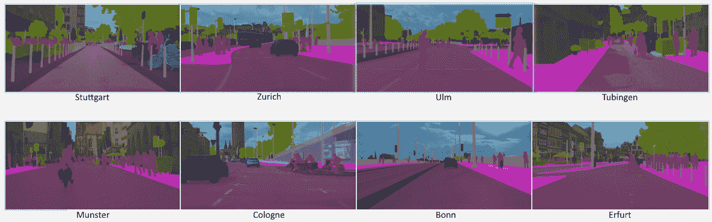
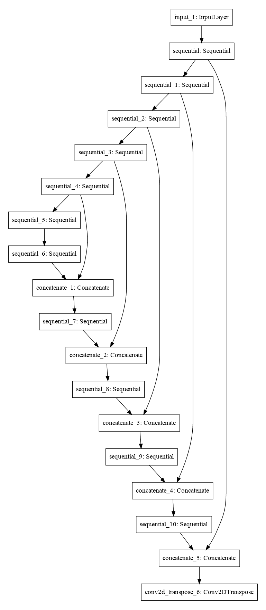

# 第九章：语义分割与自定义数据集构建器

本章中，我们将分析语义分割及其面临的挑战。语义分割是一个具有挑战性的问题，目标是为图像中的每个像素分配正确的语义标签。本章的第一部分介绍了这个问题本身，它为什么重要以及可能的应用。第一部分结束时，我们将讨论著名的 U-Net 语义分割架构，并将其作为一个 Keras 模型在纯 TensorFlow 2.0 风格中实现。模型实现之前，我们将介绍为成功实现语义分割网络所需的反卷积操作。

本章的第二部分从数据集创建开始——由于在撰写时没有`tfds`构建器支持语义分割，我们利用这一点来介绍 TensorFlow 数据集架构，并展示如何实现一个自定义的 DatasetBuilder。在获取数据后，我们将一步步执行 U-Net 的训练过程，展示使用 Keras 和 Keras 回调函数训练此模型是多么简便。本章以通常的练习部分结束，或许是整章中最关键的部分。理解一个概念的唯一途径就是亲自动手实践。

在本章中，我们将涵盖以下主题：

+   语义分割

+   创建一个 TensorFlow DatasetBuilder

+   模型训练与评估

# 语义分割

与目标检测不同，目标检测的目标是检测矩形区域中的物体，图像分类的目的是为整张图像分配一个标签，而语义分割是一个具有挑战性的计算机视觉任务，目标是为输入图像的每个像素分配正确的标签：



来自 CityScapes 数据集的语义标注图像示例。每个输入图像的像素都有相应的像素标签。（来源：[`www.cityscapes-dataset.com/examples/`](https://www.cityscapes-dataset.com/examples/))

语义分割的应用有无数个，但也许最重要的应用领域是自动驾驶和医学影像。

自动引导车和自动驾驶汽车可以利用语义分割的结果，全面理解由安装在车辆上的摄像头捕捉到的整个场景。例如，拥有道路的像素级信息可以帮助驾驶软件更好地控制汽车的位置。通过边界框来定位道路的精度远不如拥有像素级分类，从而能够独立于视角定位道路像素。

在医学影像领域，由目标检测器预测的边界框有时是有用的，有时则没有。事实上，如果任务是检测特定类型的细胞，边界框可以提供足够的信息。但是如果任务是定位血管，单纯使用边界框是不够的。正如可以想象的那样，精细分类并不是一项容易的任务，理论和实践上都面临着许多挑战。

# 挑战

一个棘手的挑战是获取正确的数据。由于通过图像的主要内容对图像进行分类的过程相对较快，因此有几个庞大的标注图像数据集。一个专业的标注团队每天可以轻松标注数千张图片，因为这项任务仅仅是查看图片并选择一个标签。

也有很多物体检测数据集，其中多个物体已经被定位和分类。与单纯的分类相比，这个过程需要更多的标注时间，但由于它不要求极高的精度，因此是一个相对较快的过程。

语义分割数据集则需要专门的软件和非常耐心的标注员，他们在工作中非常精确。事实上，像素级精度标注的过程可能是所有标注类型中最耗时的。因此，语义分割数据集的数量较少，图像的数量也有限。正如我们将在下一部分中看到的，专门用于数据集创建的 PASCAL VOC 2007 数据集，包含 24,640 个用于图像分类和定位任务的标注物体，但只有大约 600 张标注图像。

语义分割带来的另一个挑战是技术性的。对图像的每一个像素进行分类需要以不同于目前所见的卷积架构方式来设计卷积架构。到目前为止，所有描述的架构都遵循了相同的结构：

+   一个输入层，用于定义网络期望的输入分辨率。

+   特征提取部分是由多个卷积操作堆叠而成，这些卷积操作具有不同的步幅，或者中间夹杂池化操作，逐层减少特征图的空间范围，直到它被压缩成一个向量。

+   分类部分，给定由特征提取器生成的特征向量，训练该部分将此低维表示分类为固定数量的类别。

+   可选地，回归头部，使用相同的特征生成一组四个坐标。

然而，语义分割任务不能遵循这种结构，因为如果特征提取器仅仅是逐层减少输入的分辨率，网络又如何为输入图像的每个像素生成分类呢？

提出的一个解决方案是反卷积操作。

# 反卷积 – 转置卷积

我们从这一节开始时，先说明“反卷积”这一术语具有误导性。实际上，在数学和工程学中，确实存在反卷积操作，但与深度学习从业者所指的反卷积并没有太多相似之处。

在这个领域中，反卷积操作是转置卷积操作，或甚至是图像调整大小，之后再执行标准卷积操作。是的，两个不同的实现使用了相同的名称。

深度学习中的反卷积操作只保证，如果特征图是输入图和具有特定大小与步幅的卷积核之间卷积的结果，则反卷积操作将生成具有与输入相同空间扩展的特征图，前提是应用相同的卷积核大小和步幅。

为了实现这一点，首先对预处理过的输入进行标准卷积操作，在边界处不仅添加零填充，还在特征图单元内进行填充。以下图示有助于澄清这一过程：


图像及说明来源：《深度学习卷积算术指南》——Vincent Dumoulin 和 Francesco Visin

TensorFlow 通过`tf.keras.layers`包，提供了一个现成可用的反卷积操作：`tf.keras.layers.Conv2DTranspose`。

执行反卷积的另一种可能方式是将输入调整为所需的分辨率，并通过在调整后的图像上添加标准的 2D 卷积（保持相同的填充）来使该操作可学习。

简而言之，在深度学习的背景下，真正重要的是创建一个可学习的层，能够重建原始空间分辨率并执行卷积操作。这并不是卷积操作的数学逆过程，但实践表明，这样做足以取得良好的结果。

使用反卷积操作并在医学图像分割任务中取得显著成果的语义分割架构之一是 U-Net 架构。

# U-Net 架构

U-Net 是一种用于语义分割的卷积架构，由 Olaf Ronnerberg 等人在《用于生物医学图像分割的卷积网络》一文中提出，明确目标是分割生物医学图像。

该架构被证明足够通用，可以应用于所有语义分割任务，因为它在设计时并未对数据类型施加任何限制。

U-Net 架构遵循典型的编码器-解码器架构模式，并具有跳跃连接。采用这种设计架构的方式，在目标是生成与输入具有相同空间分辨率的输出时，已经证明非常有效，因为它允许梯度在输出层和输入层之间更好地传播：


U-Net 架构。蓝色框表示由模块产生的特征图，并标明了它们的形状。白色框表示复制并裁剪后的特征图。不同的箭头表示不同的操作。来源：Convolutional Networks for Biomedical Image Segmentation—Olaf Ronnerberg 等。

U-Net 架构的左侧是一个编码器，它逐层将输入大小从 572 x 572 缩小到最低分辨率下的 32 x 32。右侧包含架构的解码部分，它将从编码部分提取的信息与通过上卷积（反卷积）操作学到的信息进行混合。

原始的 U-Net 架构并不输出与输入相同分辨率的结果，但它设计为输出稍微低一些分辨率的结果。最终的 1 x 1 卷积被用作最后一层，将每个特征向量（深度为 64）映射到所需的类别数量。要全面评估原始架构，请仔细阅读 Olaf Ronnerberg 等人撰写的 *Convolutional Networks for Biomedical Image Segmentation* 中的原始 U-Net 论文。

我们将展示如何实现一个略微修改过的 U-Net，它输出的分辨率与输入相同，并且遵循相同的原始模块组织方式，而不是实现原始的 U-Net 架构。

从架构的截图中可以看到，主要有两个模块：

+   **编码模块**：有三个卷积操作，接着是一个下采样操作。

+   **解码模块**：这是一种反卷积操作，接着将其输出与对应的输入特征进行连接，并进行两次卷积操作。

使用 Keras 函数式 API 定义这个模型并连接这些逻辑模块是可能的，而且非常简单。我们将要实现的架构与原始架构略有不同，因为这是一个自定义的 U-Net 变体，它展示了 Keras 如何允许将模型作为层（或构建模块）来使用。

`upsample` 和 `downsample` 函数作为 `Sequential` 模型实现，该模型实际上是一个卷积或反卷积操作，步幅为 `2`，并随后使用一个激活函数：

`(tf2)`

```py
import tensorflow as tf
import math

def downsample(depth):
    return tf.keras.Sequential(
        [
            tf.keras.layers.Conv2D(
                depth, 3, strides=2, padding="same", kernel_initializer="he_normal"
            ),
            tf.keras.layers.LeakyReLU(),
        ]
    )

def upsample(depth):
    return tf.keras.Sequential(
        [
            tf.keras.layers.Conv2DTranspose(
                depth, 3, strides=2, padding="same", kernel_initializer="he_normal"
            ),
            tf.keras.layers.ReLU(),
        ]
    )
```

模型定义函数假设最小输入分辨率为 256 x 256，并实现了架构中的编码、解码和连接（跳跃连接）模块：

`(tf2)`

```py
def get_unet(input_size=(256, 256, 3), num_classes=21):
    # Downsample from 256x256 to 4x4, while adding depth
    # using powers of 2, startin from 2**5\. Cap to 512.
    encoders = []
    for i in range(2, int(math.log2(256))):
        depth = 2 ** (i + 5)
        if depth > 512:
            depth = 512
        encoders.append(downsample(depth=depth))

    # Upsample from 4x4 to 256x256, reducing the depth
    decoders = []
    for i in reversed(range(2, int(math.log2(256)))):
        depth = 2 ** (i + 5)
        if depth < 32:
            depth = 32
        if depth > 512:
            depth = 512
        decoders.append(upsample(depth=depth))

    # Build the model by invoking the encoder layers with the correct input
    inputs = tf.keras.layers.Input(input_size)
    concat = tf.keras.layers.Concatenate()

    x = inputs
    # Encoder: downsample loop
    skips = []
    for conv in encoders:
        x = conv(x)
        skips.append(x)

    skips = reversed(skips[:-1])

    # Decoder: input + skip connection
    for deconv, skip in zip(decoders, skips):
        x = deconv(x)
        x = tf.keras.layers.Concatenate()([x, skip])

    # Add the last layer on top and define the model
    last = tf.keras.layers.Conv2DTranspose(
        num_classes, 3, strides=2, padding="same", kernel_initializer="he_normal")

    outputs = last(x)
    return tf.keras.Model(inputs=inputs, outputs=outputs)
```

使用 Keras，不仅可以可视化模型的表格摘要（通过 Keras 模型的 `summary()` 方法），还可以获得所创建模型的图形表示，这在设计复杂架构时常常是一个福音：

`(tf2)`

```py
from tensorflow.keras.utils import plot_model
model = get_unet()
plot_model(model, to_file="unet.png")
```

这三行代码生成了这个出色的图形表示：



定义的 U-Net 类似结构的图形表示。Keras 允许进行这种可视化，以帮助架构设计过程。

生成的图像看起来像是 U-net 架构的水平翻转版本，这也是我们将在本章中用来解决语义分割问题的架构。

现在我们已经理解了问题，并定义了深度架构，可以继续前进并收集所需的数据。

# 创建一个 TensorFlow DatasetBuilder

与任何其他机器学习问题一样，第一步是获取数据。由于语义分割是一个监督学习任务，我们需要一个图像及其相应标签的分类数据集。特殊之处在于，标签本身也是一张图像。

在撰写本文时，TensorFlow Datasets 中没有现成可用的语义数据集。因此，我们不仅在本节中创建需要的 `tf.data.Dataset`，还要了解开发 `tfds` DatasetBuilder 所需的过程。

由于在上一节的目标检测部分中，我们使用了 PASCAL VOC 2007 数据集，因此我们将重新使用下载的文件来创建 PASCAL VOC 2007 数据集的语义分割版本。以下截图展示了数据集的提供方式。每张图片都有一个对应的标签，其中像素颜色代表不同的类别：


从数据集中采样的一对（图像，标签）。上方的图像是原始图像，而下方的图像包含了已知物体的语义分割类别。每个未知类别都标记为背景（黑色），而物体则使用白色标出。

之前下载的数据集不仅包含了标注的边界框，还包括了许多图像的语义分割注释。TensorFlow Datasets 将原始数据下载到默认目录（`~/tensorflow_datasets/downloads/`），并将提取的归档文件放在 `extracted` 子文件夹中。因此，我们可以重新使用下载的数据来创建一个新的语义分割数据集。

在进行之前，值得先了解 TensorFlow 数据集的组织结构，以便明白我们需要做什么才能实现目标。

# 层次化组织

整个 TensorFlow Datasets API 设计时考虑了尽可能的扩展性。为了实现这一点，TensorFlow Datasets 的架构被组织成多个抽象层，将原始数据集数据转化为 `tf.data.Dataset` 对象。以下图表来自 TensorFlow Dataset 的 GitHub 页面（[`github.com/tensorflow/datasets/`](https://github.com/tensorflow/datasets/)），展示了该项目的逻辑组织结构：


TensorFlow Datasets 项目的逻辑组织结构。原始数据经过多个抽象层的处理，这些层应用了转换和标准化操作，目的是定义 TFRecord 结构，并最终获取一个 `tf.data.Dataset` 对象。

通常，`FeatureConnector`和`FileFormatAdapter`类是现成的，而`DatasetBuilder`类必须正确实现，因为它是数据管道中与数据特定相关的部分。

每个数据集创建管道都从一个`DatasetBuilder`对象的子类开始，该子类必须实现以下方法：

+   `_info`用于构建描述数据集的`DatasetInfo`对象（并生成对人类友好的表示，这对全面理解数据非常有用）。

+   `_download_and_prepare`用于从远程位置下载数据（如果有的话）并进行一些基本预处理（如提取压缩档案）。此外，它还会创建序列化的（TFRecord）表示。

+   `_as_dataset`：这是最后一步，用于从序列化数据生成一个`tf.data.Dataset`对象。

直接子类化时，通常不需要`DatasetBuilder`类，因为`GeneratorBasedBuilder`是一个现成的`DatasetBuilder`子类，简化了数据集定义。通过子类化它需要实现的方法如下：

+   `_info`是`DatasetBuilder`的相同方法（参见上一条列表中的`_info`方法描述）。

+   `_split_generators`用于下载原始数据并进行一些基本预处理，但无需担心 TFRecord 的创建。

+   `_generate_examples`用于创建一个 Python 迭代器。该方法从原始数据中生成数据集中的示例，每个示例都会被自动序列化为 TFRecord 中的一行。

因此，通过子类化`GeneratorBasedBuilder`，只需要实现三个简单的方法，我们就可以开始实现它们了。

# 数据集类和 DatasetInfo

子类化一个模型并实现所需的方法是直接的。第一步是定义我们类的框架，然后按复杂度顺序开始实现方法。此外，既然我们的目标是创建一个用于语义分割的数据集，且使用的是相同的 PASCAL VOC 2007 数据集的下载文件，我们可以重写`tfds.image.Voc2007`的`DatasetBuilder`方法，以重用父类中已存在的所有信息：

`(tf2)`

```py
import tensorflow as tf 
import tensorflow_datasets as tfds 
import os

class Voc2007Semantic(tfds.image.Voc2007): 
    """Pasval VOC 2007 - semantic segmentation.""" 

    VERSION = tfds.core.Version("0.1.0") 

    def _info(self): 
        # Specifies the tfds.core.DatasetInfo object 
        pass  # TODO 

    def _split_generators(self, dl_manager): 
        # Downloads the data and defines the splits 
        # dl_manager is a tfds.download.DownloadManager that can be used to 
        # download and extract URLs 
        pass  # TODO 

    def _generate_examples(self): 
        # Yields examples from the dataset 
        pass  # TODO
```

最直接，但可能也是最重要的方法是实现`_info`，它包含了所有的数据集信息以及单个示例结构的定义。

由于我们正在扩展`tfds.image.Voc2007`数据集，因此可以重用某些公共信息。唯一需要注意的是，语义分割需要一个标签，这是一个单通道图像（而不是我们习惯看到的彩色图像）。

实现`_info`方法因此是直接的：

`(tf2)`

```py
    def _info(self):
        parent_info = tfds.image.Voc2007().info
        return tfds.core.DatasetInfo(
            builder=self,
            description=parent_info.description,
            features=tfds.features.FeaturesDict(
                {
                    "image": tfds.features.Image(shape=(None, None, 3)),
                    "image/filename": tfds.features.Text(),
                    "label": tfds.features.Image(shape=(None, None, 1)),
                }
            ),
            urls=parent_info.urls,
            citation=parent_info.citation,
        )
```

值得注意的是，TensorFlow Datasets 已经自带了一个预定义的特征连接器集合，这些连接器用于定义 `FeatureDict`。例如，定义具有固定深度（4 或 1）且高度和宽度未知的图像特征的正确方法是使用 `tfds.features.Image(shape=(None, None, depth))`。

`description`、`urls` 和 `citation` 字段已从父类继承，尽管这并不完全正确，因为父类的描述和引用字段涉及的是物体检测和分类挑战。

第二个需要实现的方法是 `_split_generators`。

# 创建数据集拆分

`_split_generators` 方法用于下载原始数据并进行一些基本的预处理，而无需担心 TFRecord 的创建。

由于我们是从 `tfds.image.Voc2007` 继承的，因此无需重新实现它，但需要查看父类的源代码：

`(tf2)`

```py
  def _split_generators(self, dl_manager):
    trainval_path = dl_manager.download_and_extract(
        os.path.join(_VOC2007_DATA_URL, "VOCtrainval_06-Nov-2007.tar"))
    test_path = dl_manager.download_and_extract(
        os.path.join(_VOC2007_DATA_URL, "VOCtest_06-Nov-2007.tar"))
    return [
        tfds.core.SplitGenerator(
            name=tfds.Split.TEST,
            num_shards=1,
            gen_kwargs=dict(data_path=test_path, set_name="test")),
        tfds.core.SplitGenerator(
            name=tfds.Split.TRAIN,
            num_shards=1,
            gen_kwargs=dict(data_path=trainval_path, set_name="train")),
        tfds.core.SplitGenerator(
            name=tfds.Split.VALIDATION,
            num_shards=1,
            gen_kwargs=dict(data_path=trainval_path, set_name="val")),
    ]
```

源代码来自 [`github.com/tensorflow/datasets/blob/master/tensorflow_datasets/image/voc.py`](https://github.com/tensorflow/datasets/blob/master/tensorflow_datasets/image/voc.py)，并遵循 Apache License 2.0 授权协议。

如可以很容易看出，方法使用一个 `dl_manager` 对象来下载（并缓存）并从某个远程位置解压归档文件。数据集的拆分定义在 `"train"`、`"test"` 和 `"val"` 中的返回行执行。

每次调用 `tfds.core.SplitGeneratro` 最重要的部分是 `gen_kwargs` 参数。事实上，在这一行，我们正在指示如何调用 `_generate_exaples` 函数。

简而言之，这个函数通过调用 `_generate_examples` 函数，传入 `data_path` 参数设置为当前数据集路径（`test_path` 或 `trainval_path`），并将 `set_name` 设置为正确的数据集名称，从而创建三个拆分。

`set_name` 参数的值来自 PASCAL VOC 2007 目录和文件组织。正如我们将在下一节看到的那样，在 `_generate_example` 方法的实现中，了解数据集的结构和内容对于正确创建拆分是必要的。

# 生成示例

`_generate_example` 方法可以定义为任何签名。该方法仅由 `_split_generators` 方法调用，因此，由这个方法来正确地用正确的参数调用 `_generate_example`。

由于我们没有重写父类的 `_split_generators` 方法，因此我们必须使用父类要求的相同签名。因此，我们需要使用 `data_path` 和 `set_name` 参数，除此之外，还可以使用 PASCAL VOC 2007 文档中提供的其他所有信息。

`_generate_examples` 的目标是每次调用时返回一个示例（表现得像一个标准的 Python 迭代器）。

从数据集结构中，我们知道，在 `VOCdevkit/VOC2007/ImageSets/Segmentation/` 目录下，有三个文本文件——每个拆分一个：`"train"`，`"test"` 和 `"val"`。每个文件都包含每个拆分中标记图像的名称。

因此，使用这些文件中包含的信息来创建三份数据集是直接的。我们只需逐行打开文件并读取，就可以知道要读取哪些图像。

TensorFlow Datasets 限制我们使用 Python 文件操作，但明确要求使用 `tf.io.gfile` 包。这个限制是必要的，因为有些数据集太大，无法在单台机器上处理，而 `tf.io.gfile` 可以方便地被 TensorFlow Datasets 用来读取和处理远程以及分布式的数据集。

从 PASCAL VOC 2007 文档中，我们还可以提取一个 **查找表** (**LUT**)，用来创建 RGB 值与标量标签之间的映射：

`(tf2)`

```py
LUT = {
    (0, 0, 0): 0, # background
    (128, 0, 0): 1, # aeroplane
    (0, 128, 0): 2, # bicycle
    (128, 128, 0): 3, # bird
    (0, 0, 128): 4, # boat
    (128, 0, 128): 5, # bottle
    (0, 128, 128): 6, # bus
    (128, 128, 128): 7, # car
    (64, 0, 0): 8, # cat
    (192, 0, 0): 9, # chair
    (64, 128, 0): 10, # cow
    (192, 128, 0): 11, # diningtable
    (64, 0, 128): 12, # dog
    (192, 0, 128): 13, # horse
    (64, 128, 128): 14, # motorbike
    (192, 128, 128): 15, # person
    (0, 64, 0): 16, # pottedplant
    (128, 64, 0): 17, # sheep
    (0, 192, 0): 18, # sofa
    (128, 192, 0): 19, # train
    (0, 64, 128): 20, # tvmonitor
    (255, 255, 255): 21, # undefined / don't care
}
```

创建这个查找表后，我们可以仅使用 TensorFlow 操作来读取图像，检查其是否存在（因为无法保证原始数据是完美的，我们必须防止在数据集创建过程中出现故障），并创建包含与 RGB 颜色相关的数值的单通道图像。

仔细阅读源代码，因为第一次阅读时可能很难理解。特别是，查找 RGB 颜色与可用颜色之间对应关系的查找表循环，初看可能不容易理解。以下代码不仅使用 `tf.Variable` 创建与 RGB 颜色相关的数值的单通道图像，还检查 RGB 值是否正确：

`(tf2)`

```py
    def _generate_examples(self, data_path, set_name):
        set_filepath = os.path.join(
            data_path,
            "VOCdevkit/VOC2007/ImageSets/Segmentation/{}.txt".format(set_name),
        )
        with tf.io.gfile.GFile(set_filepath, "r") as f:
            for line in f:
                image_id = line.strip()

                image_filepath = os.path.join(
                    data_path, "VOCdevkit", "VOC2007", "JPEGImages", f"{image_id}.jpg"
                )
                label_filepath = os.path.join(
                    data_path,
                    "VOCdevkit",
                    "VOC2007",
                    "SegmentationClass",
                    f"{image_id}.png",
                )

                if not tf.io.gfile.exists(label_filepath):
                    continue

                label_rgb = tf.image.decode_image(
                    tf.io.read_file(label_filepath), channels=3
                )

                label = tf.Variable(
                    tf.expand_dims(
                        tf.zeros(shape=tf.shape(label_rgb)[:-1], dtype=tf.uint8), -1
                    )
                )

                for color, label_id in LUT.items():
                    match = tf.reduce_all(tf.equal(label_rgb, color), axis=[2])
                    labeled = tf.expand_dims(tf.cast(match, tf.uint8), axis=-1)
                    label.assign_add(labeled * label_id)

                colored = tf.not_equal(tf.reduce_sum(label), tf.constant(0, tf.uint8))
                # Certain labels have wrong RGB values
                if not colored.numpy():
                    tf.print("error parsing: ", label_filepath)
                    continue

                yield image_id, {
                    # Declaring in _info "image" as a tfds.feature.Image
                    # we can use both an image or a string. If a string is detected
                    # it is supposed to be the image path and tfds take care of the
                    # reading process.
                    "image": image_filepath,
                    "image/filename": f"{image_id}.jpg",
                    "label": label.numpy(),
                }
```

`_generate_examples` 方法不仅返回单个示例，它还必须返回一个元组，`(id, example)`，其中 `id` —— 在本例中是 `image_id` —— 应该唯一标识该记录；此字段用于全局打乱数据集，并避免生成的数据集中出现重复元素。

实现了这个方法之后，一切都已经正确设置，我们可以使用全新的 Voc2007Semantic 加载器。

# 使用构建器

TensorFlow Datasets 可以自动检测当前作用域中是否存在 `DatasetBuilder` 对象。因此，通过继承现有的 `DatasetBuilder` 类实现的 `"voc2007_semantic"` 构建器已经可以直接使用：

```py
dataset, info = tfds.load("voc2007_semantic", with_info=True)
```

在第一次执行时，会创建拆分，并且 `_generate_examples` 方法会被调用三次以创建示例的 TFRecord 表示。

通过检查 `info` 变量，我们可以看到一些数据集统计信息：

```py
[...]
    features=FeaturesDict({
        'image': Image(shape=(None, None, 3), dtype=tf.uint8), 
        'image/filename': Text(shape=(), dtype=tf.string, encoder=None), 
        'label': Image(shape=(None, None, 1), dtype=tf.uint8) 
    }, 
    total_num_examples=625, 
    splits={ 
        'test': <tfds.core.SplitInfo num_examples=207>, 
        'train': <tfds.core.SplitInfo num_examples=207>, 
        'validation': <tfds.core.SplitInfo num_examples=211> 
    }

```

特征通过实现 `_info` 方法来描述，数据集的规模相对较小，每个训练集和测试集包含 207 张图像，验证集包含 211 张图像。

实现`DatasetBuilder`是一个相对直接的操作，每当你开始处理一个新的数据集时，都应该进行这项操作——这样，在训练和评估过程中可以使用高效的管道。

# 模型训练与评估

尽管网络架构并非图像分类器，并且标签不是标量，但语义分割仍然可以视为一个传统的分类问题，因此训练和评估过程是相同的。

出于这个原因，我们可以使用`compile`和`fit` Keras 模型来构建训练循环，并分别执行它，而不是编写自定义的训练循环。

# 数据准备

要使用 Keras 的`fit`模型，`tf.data.Dataset`对象应生成 `(feature, label)` 格式的元组，其中`feature`是输入图像，`label`是图像标签。

因此，值得定义一些可以应用于`tf.data.Dataset`生成的元素的函数，这些函数可以将数据从字典转换为元组，并且在此过程中，我们还可以为训练过程应用一些有用的预处理：

`(tf2)`

```py
def resize_and_scale(row):
    # Resize and convert to float, [0,1] range
    row["image"] = tf.image.convert_image_dtype(
        tf.image.resize(
            row["image"],
            (256,256),
            method=tf.image.ResizeMethod.NEAREST_NEIGHBOR),
        tf.float32)
    # Resize, cast to int64 since it is a supported label type
    row["label"] = tf.cast(
        tf.image.resize(
            row["label"],
            (256,256),
            method=tf.image.ResizeMethod.NEAREST_NEIGHBOR),
        tf.int64)
    return row

def to_pair(row):
    return row["image"], row["label"]
```

现在很容易从通过`tfds.load`调用获得的`dataset`对象中获取验证集和训练集，并对其应用所需的转换：

`(tf2)`

```py
batch_size= 32

train_set = dataset["train"].map(resize_and_scale).map(to_pair)
train_set = train_set.batch(batch_size).prefetch(1)

validation_set = dataset["validation"].map(resize_and_scale)
validation_set = validation_set.map(to_pair).batch(batch_size)
```

数据集已准备好用于`fit`方法，并且由于我们正在开发一个纯 Keras 解决方案，因此可以使用 Keras 回调函数配置隐藏的训练循环。

# 训练循环与 Keras 回调函数

`compile`方法用于配置训练循环。我们可以指定优化器、损失函数、评估指标以及一些有用的回调函数。

回调函数是在每个训练周期结束时执行的函数。Keras 提供了一个预定义回调函数的长列表，用户可以直接使用。在下一个代码片段中，将使用两个最常见的回调函数，`ModelCheckpoint`和`TensorBoard`回调函数。如其名称所示，前者在每个周期结束时保存检查点，而后者使用`tf.summary`记录指标。

由于语义分割可以视为一个分类问题，使用的损失函数是`SparseCategoricalCrossentropy`，并配置为在计算损失值时对网络的输出层应用 sigmoid（在深度维度上），如`from_logits=True`参数所示。这个配置是必须的，因为我们没有在自定义 U-Net 的最后一层添加激活函数：

`(tf2)`

```py
# Define the model
model = get_unet()

# Choose the optimizer
optimizer = tf.optimizers.Adam()

# Configure and create the checkpoint callback
checkpoint_path = "ckpt/pb.ckpt"
cp_callback = tf.keras.callbacks.ModelCheckpoint(checkpoint_path,
                                                 save_weights_only=True,
                                                 verbose=1)
# Enable TensorBoard loggging
TensorBoard = tf.keras.callbacks.TensorBoard(write_images=True)

# Cofigure the training loop and log the accuracy
model.compile(optimizer=optimizer,
              loss=tf.losses.SparseCategoricalCrossentropy(from_logits=True),
              metrics=['accuracy'])
```

数据集和回调函数被传递到`fit`方法，该方法执行所需轮数的有效训练循环：

`(tf2)`

```py
num_epochs = 50
model.fit(train_set, validation_data=validation_set, epochs=num_epochs,
          callbacks=[cp_callback, TensorBoard])
```

训练循环将训练模型 50 个周期，在训练过程中测量损失和准确度，并在每个周期结束时，测量验证集上的准确度和损失值。此外，经过两个回调后，我们在`ckpt`目录中有一个包含模型参数的检查点，并且不仅在标准输出（即 Keras 默认设置）上记录了度量，还在 TensorBoard 上进行了记录。

# 评估与推理

在训练过程中，我们可以打开 TensorBoard 并查看损失和度量的图表。在第 50 个周期结束时，我们会得到如下截图所示的图表：


训练集（橙色）和验证集（蓝色）上的准确度和损失值。Keras 将摘要的使用和配置隐藏给用户。

此外，由于我们已经在`model`变量中拥有了模型的所有参数，我们可以尝试向模型输入一张从互联网上下载的图像，看看分割是否按预期工作。

假设我们从互联网上下载了以下图像，并将其保存为`"author.jpg"`：


问候！

我们期望模型生成这张图像中唯一已知类别的分割，即`"person"`，同时在其他地方生成`"background"`标签。

一旦我们下载了图像，就将其转换为模型预期的相同格式（一个在*【0,1】*范围内的浮动值），并将其大小调整为*512*。由于模型处理的是一批图像，因此需要为`sample`变量添加一个单一的维度。现在，运行推理就像`model(sample)`一样简单。之后，我们在最后一个通道上使用`tf.argmax`函数提取每个像素位置的预测标签：

`(tf2)`

```py
sample = tf.image.decode_jpeg(tf.io.read_file("author.jpg"))
sample = tf.expand_dims(tf.image.convert_image_dtype(sample, tf.float32), axis=[0])
sample = tf.image.resize(sample, (512,512))
pred_image = tf.squeeze(tf.argmax(model(sample), axis=-1), axis=[0])
```

在`pred_image`张量中，我们有稠密的预测，这些预测对于可视化几乎没有用处。实际上，这个张量的值在*【0, 21】*范围内，并且这些值一旦可视化后几乎无法区分（它们看起来都很黑）。

因此，我们可以使用为数据集创建的 LUT 应用从标签到颜色的逆映射。最后，我们可以使用 TensorFlow 的`io`包将图像转换为 JPEG 格式并将其存储在磁盘上，方便可视化：

`(tf2)`

```py
REV_LUT = {value: key for key, value in LUT.items()}

color_image = tf.Variable(tf.zeros((512,512,3), dtype=tf.uint8))
pixels_per_label = []
for label, color in REV_LUT.items():
    match = tf.equal(pred_image, label)
    labeled = tf.expand_dims(tf.cast(match, tf.uint8), axis=-1)
    pixels_per_label.append((label, tf.math.count_nonzero(labeled)))
    labeled = tf.tile(labeled, [1,1,3])
    color_image.assign_add(labeled * color)

# Save
tf.io.write_file("seg.jpg", tf.io.encode_jpeg(color_image))
```

这是在小数据集上仅训练 50 个周期后，简单模型的分割结果：


映射预测标签到相应颜色后的分割结果。

尽管结果较为粗糙，因为架构尚未优化，模型选择未进行，数据集规模较小，但分割结果已经看起来很有前景！

通过计算每个标签的匹配次数，可以检查预测的标签。在`pixels_per_label`列表中，我们保存了对（`label`，`match_count`）的配对，打印出来后，我们可以验证预测的类别是否为预期的`"person"`（id 15）：

`(tf2)`

```py
for label, count in pixels_per_label:
 print(label, ": ", count.numpy())
```

这将产生以下结果：

```py
0: 218871
1: 0
3: 383
[...]
15: 42285
[...]
```

这正是预期的。当然，仍然有改进的空间，这留给读者作为练习。

# 总结

本章介绍了语义分割问题并实现了 U-Net：一种用于解决此问题的深度编码器-解码器架构。简要介绍了该问题的可能应用场景和挑战，接着直观地介绍了用于构建架构解码器部分的反卷积（转置卷积）操作。由于在编写时，TensorFlow Datasets 中还没有准备好的语义分割数据集，我们利用这一点展示了 TensorFlow Datasets 的架构，并展示了如何实现自定义的 `DatasetBuilder`。实现它是直接的，推荐每个 TensorFlow 用户这样做，因为它是创建高效数据输入管道（`tf.data.Dataset`）的便捷方式。此外，通过实现 ` _generate_examples` 方法，用户被迫“查看”数据，这是进行机器学习和数据科学时强烈推荐的做法。

之后，我们通过将此问题视为分类问题，学习了语义分割网络训练循环的实现。本章展示了如何使用 Keras 的 `compile` 和 `fit` 方法，并介绍了如何通过 Keras 回调函数自定义训练循环。本章以一个快速示例结束，演示了如何使用训练好的模型进行推理，并如何仅使用 TensorFlow 方法保存生成的图像。

在下一章，`第九章`，*生成对抗网络*，介绍了**生成对抗网络**（**GANs**）及其对抗性训练过程，显然，我们也解释了如何使用 TensorFlow 2.0 实现它们。

# 练习

以下练习具有基础性的重要性，邀请您回答每个理论问题并解决所有给定的代码挑战：

1.  什么是语义分割？

1.  为什么语义分割是一个困难的问题？

1.  什么是反卷积？深度学习中的反卷积操作是一个真正的反卷积操作吗？

1.  是否可以将 Keras 模型作为层使用？

1.  是否可以使用单个 Keras `Sequential` 模型来实现具有跳跃连接的模型架构？

1.  描述原始 U-Net 架构：本章中展示的自定义实现与原始实现有什么不同？

1.  使用 Keras 实现原始的 U-Net 架构。

1.  什么是 DatasetBuilder？

1.  描述 TensorFlow 数据集的层次结构。

1.  ` _info` 方法包含数据集中每个示例的描述。这个描述与 `FeatureConnector` 对象有什么关系？

1.  描述 `_generate_splits` 和 `_generate_examples` 方法。解释这两个方法是如何连接的，以及 `tfds.core.SplitGenerator` 的 `gen_kwargs` 参数的作用。

1.  什么是 LUT？为什么它是创建语义分割数据集时有用的数据结构？

1.  为什么在开发自定义 DatasetBuilder 时需要使用 `tf.io.gfile`？

1.  （加分项）：为 TensorFlow Datasets 项目添加一个缺失的语义分割数据集！提交一个 Pull Request 到 [`github.com/tensorflow/datasets`](https://github.com/tensorflow/datasets)，并在消息中分享此练习部分和本书内容。

1.  训练本章中展示的修改版 U-Net 架构。

1.  更改损失函数并添加重建损失项，最小化过程的目标是同时最小化交叉熵，并使预测标签尽可能接近真实标签。

1.  使用 Keras 回调函数测量平均交并比（Mean IOU）。Mean IOU 已在 `tf.metrics` 包中实现。

1.  尝试通过在编码器中添加 dropout 层来提高模型在验证集上的表现。

1.  在训练过程中，开始时以 0.5 的概率丢弃神经元，并在每个 epoch 后将此值增加 0.1。当验证集的平均 IOU 停止增加时，停止训练。

1.  使用训练好的模型对从互联网上下载的随机图像进行推断。对结果的分割进行后处理，以便检测出不同类别的不同元素的边界框。使用 TensorFlow 在输入图像上绘制边界框。
