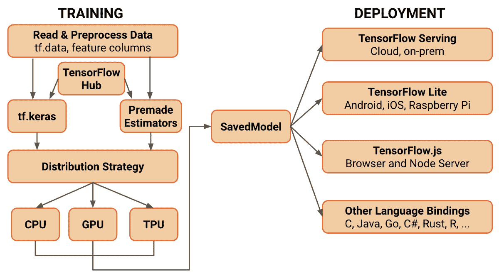
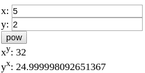

# 第十一章：将模型部署到生产环境

在本章中，将介绍任何现实机器学习应用的最终目标——训练模型的部署与推理。正如我们在前几章所看到的，TensorFlow 允许我们训练模型并将其参数保存在检查点文件中，这使得恢复模型状态并继续训练变得可能，同时也能够从 Python 执行推理。

然而，检查点文件在目标是使用经过训练的机器学习模型进行低延迟和低内存占用时并不是合适的文件格式。事实上，检查点文件只包含模型的参数值，而没有计算的描述；这迫使程序先定义模型结构，然后再恢复模型参数。此外，检查点文件包含的变量值仅在训练过程中有用，但在推理时（例如，优化器创建的所有变量）完全浪费资源。正确的表示方式是使用 SavedModel 序列化格式，接下来会进行详细介绍。在分析了 SavedModel 序列化格式，并查看如何将一个 `tf.function` 装饰的函数进行图转换和序列化后，我们将深入探讨 TensorFlow 部署生态系统，了解 TensorFlow 2.0 如何加速图在多个平台上的部署，并且如何为大规模服务而设计。

在本章中，我们将涵盖以下主题：

+   SavedModel 序列化格式

+   Python 部署

+   支持的部署平台

# SavedModel 序列化格式

正如我们在第三章中解释的，*TensorFlow 图计算架构*，通过数据流图（DataFlow graphs）表示计算具有多个优势，特别是在模型可移植性方面，因为图是一种与语言无关的计算表示。

SavedModel 是 TensorFlow 模型的通用序列化格式，它通过创建一个语言无关的计算表示，扩展了 TensorFlow 标准图表示，使得该表示不仅可恢复且是封闭的。这种表示的设计不仅用于承载图的描述和值（像标准图一样），还提供了额外的特性，这些特性旨在简化在异构生产环境中使用训练过的模型。

TensorFlow 2.0 在设计时考虑了简洁性。这种设计选择在以下图示中可以明显看到，在这个图示中，可以看到 SavedModel 格式是研究和开发阶段（左侧）与部署阶段（右侧）之间的唯一桥梁：



TensorFlow 2.0 的训练和部署生态系统。图片来源：[`medium.com/tensorflow/whats-coming-in-tensorflow-2-0-d3663832e9b8`](https://medium.com/tensorflow/whats-coming-in-tensorflow-2-0-d3663832e9b8)——TensorFlow 团队

作为模型训练和部署之间的桥梁，SavedModel 格式必须提供广泛的特性，以满足可用的各种部署平台，从而为不同的软件和硬件平台提供出色的支持。

# 特性

SavedModel 包含一个完整的计算图，包括模型参数以及在创建过程中指定的所有其他内容。使用 TensorFlow 1.x API 创建的 SavedModel 对象仅包含计算的平面图表示；在 TensorFlow 2.0 中，SavedModel 包含一个序列化的`tf.function`对象表示。

创建 SavedModel 在使用 TensorFlow Python API 时非常简单（如下一节所示），但其配置要求你理解其主要特性，具体如下：

+   **Graph tagging**：在生产环境中，你经常需要将模型投入生产，同时在获得新数据后继续开发同一模型。另一个可能的场景是并行训练两个或多个相同的模型，这些模型使用不同的技术或不同的数据进行训练，并希望将它们全部投入生产，以测试哪个性能更好。

    SavedModel 格式允许你在同一个文件中拥有多个图，这些图共享相同的变量和资产集。每个图都与一个或多个标签（用户定义的字符串）相关联，便于我们在加载操作时识别它。

+   **SignatureDefs**：在定义计算图时，我们需要了解模型的输入和输出；这被称为**模型签名**。SavedModel 序列化格式使用`SignatureDefs`来允许对可能需要保存在`graph.SignatureDefs`中的签名提供通用支持。`SignatureDefs`仅仅是定义了哪些节点可以调用模型以及哪个是输出节点的命名模型签名集合，给定一个特定的输入。

+   **Assets**：为了允许模型依赖外部文件进行初始化，SavedModel 支持资产的概念。资产在 SavedModel 创建过程中被复制到 SavedModel 位置，并且可以被模型初始化过程安全地读取。

+   **Device cleanup**：我们在第三章中看到的计算图，*TensorFlow 图架构*，包含了计算必须执行的设备名称。为了生成可以在任何硬件平台上运行的通用图，SavedModel 支持在生成之前清理设备。

这些特性使您能够创建独立且自包含的硬件对象，指定如何调用模型、给定特定输入时的输出节点，以及在可用模型中使用哪一个特定模型（通过标签）。

# 从 Keras 模型创建 SavedModel

在 TensorFlow 1.x 中，创建 SavedModel 需要知道输入节点是什么，输出节点是什么，并且我们必须成功加载要保存的模型的图形表示到 `tf.Session` 函数中。

TensorFlow 2.0 大大简化了创建 SavedModel 的过程。由于 Keras 是唯一定义模型的方式，而且不再有会话，创建 SavedModel 的过程只需要一行代码：

`(tf2)`

具体结构如下：

```py
# model is a tf.keras.Model model
path = "/tmp/model/1"
tf.saved_model.save(model, path)
```

`path` 变量遵循一种良好的实践，即在导出路径中直接添加模型的版本号 (`/1`)。与模型关联的唯一标签是默认的 `tag: "serve"`。

`tf.saved_model.save` 调用会在指定的 `path` 变量中创建以下目录结构。

```py
assets/
variables/
    variables.data-?????-of-?????
    variables.index
saved_model.pb
```

目录包含以下内容：

+   `assets` 包含辅助文件。这些文件在前一节中有描述。

+   `variables` 包含模型变量。这些变量与检查点文件中的变量一样，是通过 TensorFlow Saver 对象创建的。

+   `saved_model.pb` 是已编译的 Protobuf 文件。这是 Keras 模型描述的计算的二进制表示。

Keras 模型已经指定了模型的输入和输出；因此，无需担心哪个是输入哪个是输出。从 Keras 模型导出的 SignatureDef（值得提醒的是，它们只是描述如何调用模型的命名函数）是调用 Keras 模型的 `call` 方法（即前向传递），并且它在 `serving_default` 签名键下导出。

从 Keras 模型创建 SavedModel 非常简单，因为前向传递的描述包含在其 `call` 方法中。然后，TensorFlow 会使用 AutoGraph 自动将该函数转换为其图形等效表示。`call` 方法的输入参数成为图形的输入签名，而 Keras 模型的输出则成为输出。

然而，我们可能不想导出 Keras 模型。如果我们只想部署并提供一个通用的计算图怎么办？

# 从通用函数转换 SavedModel

在 TensorFlow 1.x 中，导出通用图和模型没有区别：选择输入和输出节点，创建会话，定义签名，然后保存。

在 TensorFlow 2.0 中，由于图形被隐藏，将通用的 TensorFlow 计算转换为 SavedModel（图形）需要一些额外的注意。

`tf.saved_model.save(obj, export_dir, signatures=None)` 函数的第一个参数描述清楚，`obj` 必须是一个可追踪的 *对象*。

可跟踪对象是从`TrackableBase`类派生的对象（私有，意味着它在`tensorflow`包中不可见）——几乎 TensorFlow 2.0 中的所有对象都派生自这个类。这些对象是可以存储在检查点文件中的对象，其中包括 Keras 模型、优化器等。

因此，像下面这样的函数无法导出，除非创建一个继承自`TrackableBase`对象的对象：

`(tf2)`

```py
def pow(x, y):
    return tf.math.pow(x, y)
```

TensorFlow API 中最通用的类是`tf.Module`类，一旦实例化，它会创建一个可跟踪对象。模块是一个命名容器，用于存放`tf.Variable`对象、其他模块和适用于用户输入的函数。继承`tf.Module`是创建可跟踪对象的直接方法，并满足`tf.saved_model.save`函数的要求：

`(tf2)`

```py
class Wrapper(tf.Module):

    def pow(self, x, y):
        return tf.math.pow(x, y)
```

由于不是 Keras 模型，`tf.saved_model.save`不知道`Wrapper`类中的哪个方法适用于图形转换。我们可以通过两种不同的方式来指示`save`函数仅转换我们感兴趣的方法。它们如下：

+   **指定签名**：`save`函数的第三个参数可以选择接受一个字典。字典必须包含要导出的函数名称和输入描述。通过使用`tf.TensorSpec`对象来实现。

+   **使用** `tf.function`：当省略`signature`参数时，`save`模式会在`obj`中查找被`@tf.function`装饰的方法。如果找到了恰好一个方法，那么该方法将作为 SavedModel 的默认签名使用。并且在这种情况下，我们必须通过手动传递`tf.TensorSpec`对象来描述输入类型和形状，传递给`tf.function`的`input_signature`参数。

第二种方法是最方便的，它的优点还在于能够定义并将当前的 Python 程序转换为图形。使用时，这可以加速计算。

`(tf2)`

```py
class Wrapper(tf.Module):

    @tf.function(
        input_signature=[
            tf.TensorSpec(shape=None, dtype=tf.float32),
            tf.TensorSpec(shape=None, dtype=tf.float32),
        ]
    )
    def pow(self, x, y):
        return tf.math.pow(x, y)

obj = Wrapper()
tf.saved_model.save(obj, "/tmp/pow/1")
```

因此，将通用函数导出为其 SavedModel 表示的方式是将函数封装到一个可跟踪对象中，使用`tf.function`装饰器装饰方法，并指定转换过程中使用的输入签名。

这就是我们导出通用函数的全部步骤，也就是导出一个通用计算图或 Keras 模型到其自包含且与语言无关的表示形式，以便它可以在任何编程语言中使用。

使用 SavedModel 对象的最简单方法是使用 TensorFlow Python API，因为它是 TensorFlow 更完整的高级 API，并提供了方便的方法来加载和使用 SavedModel。

# Python 部署

使用 Python，加载保存在 SavedModel 中的计算图并将其用作本地 Python 函数是非常简单的。这一切都要归功于 TensorFlow 的 Python API。`tf.saved_model.load(path)`方法会将位于`path`的 SavedModel 反序列化，并返回一个可跟踪的对象，该对象具有`signatures`属性，包含从签名键到已准备好使用的 Python 函数的映射。

`load`方法能够反序列化以下内容：

+   通用计算图，例如我们在上一节中创建的那些

+   Keras 模型

+   使用 TensorFlow 1.x 或 Estimator API 创建的 SavedModel

# 通用计算图

假设我们有兴趣加载在上一节中创建的`pow`函数的计算图，并在 Python 程序中使用它。在 TensorFlow 2.0 中，这非常简单。按照以下步骤进行操作：

1.  导入模型：

`(tf2)`

```py
path = "/tmp/pow/1"
imported = tf.saved_model.load(path)
```

1.  `imported`对象具有一个`signatures`属性，我们可以检查它来查看可用的函数。在这种情况下，由于我们在导出模型时没有指定签名，因此我们预计只会找到默认签名`"serving_default"`：

`(tf2)`

```py
assert "serving_default" == list(imported.signatures)[0]
assert len(imported.signatures) == 1
```

可以通过访问`imported.signatures["serving_default"]`来获取幂函数的计算图。然后，它就可以准备使用了。

使用导入的计算图要求你对 TensorFlow 图结构有良好的理解，正如在[第三章](https://cdp.packtpub.com/hands_on_applied_neural_networks_with_tensorflow_2_x/wp-admin/post.php?post=308&action=edit#post_26)《*TensorFlow 图架构*》中解释的那样。事实上，`imported.signatures["serving_default"]`函数是一个静态图，因此，它需要一些额外的关注才能使用。

1.  调用计算图并传入错误的输入类型会导致引发异常，因为静态图是严格静态类型的。此外，`tf.saved_model.load`函数返回的对象强制要求只使用命名参数，而不能使用位置参数（这与`pow`函数的原始定义不同，后者只使用位置参数）。因此，一旦定义了正确形状和输入类型的输入，就可以轻松调用该函数：

`(tf2)`

```py
pow = imported.signatures["serving_default"]
result = pow(x=tf.constant(2.0), y=tf.constant(5.0))
```

与你预期的不同，`result`变量并不包含一个值为`32.0`的`tf.Tensor`对象；它是一个字典。使用字典来返回计算结果是一个好的设计选择。事实上，这强制调用者（使用导入的计算图的 Python 程序）显式访问一个键，以指示所需的返回值。

1.  在 `pow` 函数的情况下，返回值是 `tf.Tensor` 而不是 Python 字典，返回的字典具有遵循命名约定的键——键名始终是 `"output_"` 字符串，后跟返回参数的位置（从零开始）。以下代码片段阐明了这个概念：

`(tf2)`

```py
assert result["output_0"].numpy() == 32
```

如果 `pow` 函数更新如下，字典键将变为 `"output_0"`, `"output_1"`：

`(tf2)`

```py
    def pow(self, x, y):
        return tf.math.pow(x, y), tf.math.pow(y, x)
```

当然，依赖默认的命名约定并不是一个好的或可维护的解决方案（`output_0` 代表什么？）。因此，在设计将要导出的函数时，最好使函数返回一个字典，这样导出的 SavedModel 在调用时将使用相同的字典作为返回值。因此，`pow` 函数的更好设计可能如下：

`(tf2)`

```py
class Wrapper(tf.Module):

class Wrapper(tf.Module):
    @tf.function(
        input_signature=[
            tf.TensorSpec(shape=None, dtype=tf.float32),
            tf.TensorSpec(shape=None, dtype=tf.float32),
        ]
    )
    def pow(self, x, y):
        return {"pow_x_y":tf.math.pow(x, y), "pow_y_x": tf.math.pow(y, x)}

obj = Wrapper()
tf.saved_model.save(obj, "/tmp/pow/1")
```

一旦导入并执行，以下代码将生成一个包含有意义名称的字典：

`(tf2)`

```py
path = "/tmp/pow/1"

imported = tf.saved_model.load(path)
print(imported.signatures"serving_default",y=tf.constant(5.0)))
```

结果输出是以下字典：

```py
{
  'pow_x_y': <tf.Tensor: id=468, shape=(), dtype=float32, numpy=32.0>,
  'pow_y_x': <tf.Tensor: id=469, shape=(), dtype=float32, numpy=25.0>
}
```

TensorFlow Python API 简化了不仅仅是通用计算图的加载，也简化了训练后的 Keras 模型的使用。

# Keras 模型

作为官方 TensorFlow 2.0 定义机器学习模型的方式，Keras 模型在序列化时不仅包含序列化的 `call` 方法。由 `load` 函数返回的对象类似于恢复通用计算图时返回的对象，但具有更多的属性和特点：

+   `.variables` 属性：附加在原始 Keras 模型上的不可训练变量已被序列化并存储在 SavedModel 中。

+   `.trainable_variables` 属性：与 `.variables` 属性类似，模型的可训练变量也被序列化并存储在 SavedModel 中。

+   `__call__` 方法：返回的对象暴露了一个 `__call__` 方法，接受的输入方式与原始 Keras 模型相同，而不是暴露一个具有单一键 ``"serving_default"`` 的 `signatures` 属性。

所有这些功能不仅允许将 SavedModel 作为独立的计算图使用，如下面的代码片段所示，还允许你完全恢复 Keras 模型并继续训练：

`(tf2)`

```py
imported = tf.saved_model.load(path)
# inputs is a input compatible with the serialized model
outputs = imported(inputs)
```

正如我们之前提到的，所有这些附加特性（可训练和不可训练的变量，以及计算的序列化表示）允许从 SavedModel 完全恢复 Keras 模型对象，从而使它们可以作为检查点文件使用。Python API 提供了 `tf.keras.models.load_model` 函数来完成这一任务，并且在 TensorFlow 2.0 中，它非常方便：

`(tf2)`

```py
model = tf.keras.models.load_model(path)
# models is now a tf.keras.Model object!
```

这里，`path` 是 SavedModel 或 `h5py` 文件的路径。由于 `h5py` 序列化格式是 Keras 的表示形式，并且与 SavedModel 序列化格式相比没有额外的优势，因此本书不考虑 `h5py` 格式。

Python API 还向后兼容 TensorFlow 1.x 的 SavedModel 格式，因此你可以恢复平坦图，而不是`tf.function`对象。

# 平坦图

由`tf.estimator` API 或使用 SavedModel 1.x API 创建的 SavedModel 对象包含计算的更原始表示，这种表示称为**平坦图**。

在这种表示形式中，平坦图不会继承来自`tf.function`对象的任何签名，以简化恢复过程。它只需直接获取计算图，以及其节点名称和变量（详情请见[第三章](https://cdp.packtpub.com/hands_on_applied_neural_networks_with_tensorflow_2_x/wp-admin/post.php?post=308&action=edit#post_26)，*TensorFlow 图架构*）。

这些 SavedModel 具有与其签名对应的函数（在序列化过程之前手动定义）存储在`.signatures`属性中，但更重要的是，恢复的 SavedModel 使用新的 TensorFlow 2.0 API 具有`.prune`方法，允许你仅通过知道输入和输出节点名称就能从任意子图中提取函数。

使用`.prune`方法相当于在默认图中恢复 SavedModel 并将其放入 TensorFlow 1.x 的 Session 中；然后，可以通过使用`tf.Graph.get_tensor_by_name`方法访问输入和输出节点。

通过`.prune`方法，TensorFlow 2.0 简化了这一过程，使其变得像下面的代码片段一样简单：

`(tf2)`

```py
imported = tf.saved_model.load(v1savedmodel_path)
pruned = imported.prune("input_:0", "cnn/out/identity:0")
# inputs is an input compatible with the flat graph
out = pruned(inputs)
```

在这里，`input_`是任何可能输入节点的占位符，而`"cnn/out/identity:0"`是输出节点。

在 Python 程序中加载 SavedModel 后，可以将训练好的模型（或通用计算图）用作任何标准 Python 应用程序的构建块。例如，一旦你训练了一个人脸检测模型，就可以轻松使用 OpenCV（最著名的开源计算机视觉库）打开网络摄像头流，并将其输入到人脸检测模型中。训练模型的应用无数，你可以开发自己的 Python 应用程序，将训练好的机器学习模型作为构建块。

尽管 Python 是数据科学的主要语言，但它并不是在不同平台上部署机器学习模型的完美选择。有些编程语言是某些任务或环境的事实标准；例如，Javascript 用于客户端 Web 开发，C++和 Go 用于数据中心和云服务，等等。

作为一种语言无关的表示形式，理论上可以使用任何编程语言加载和执行（部署）SavedModel；这具有巨大的优势，因为有些情况下 Python 不可用，或者不是最佳选择。

TensorFlow 支持许多不同的部署平台：它提供了许多不同语言的工具和框架，以满足广泛的使用场景。

# 支持的部署平台

如本章开头的图示所示，SavedModel 是一个庞大部署平台生态系统的输入，每个平台的创建目标是满足不同的使用场景需求：

+   **TensorFlow Serving**：这是谷歌官方提供的机器学习模型服务解决方案。它支持模型版本控制，多个模型可以并行部署，并且通过完全支持硬件加速器（GPU 和 TPU），确保并发模型在低延迟下实现高吞吐量。TensorFlow Serving 不仅仅是一个部署平台，而是围绕 TensorFlow 构建的一个完整生态系统，且使用高效的 C++代码编写。目前，这是谷歌自己用来在 Google Cloud ML 平台上每秒处理数千万次推理的解决方案。

+   **TensorFlow Lite**：这是在移动设备和嵌入式设备上运行机器学习模型的首选部署平台。TensorFlow Lite 是一个全新的生态系统，拥有自己的训练和部署工具。它的设计目标是优化训练后的模型大小，从而生成一个针对快速推理和低功耗消耗优化的、原始模型的小型二进制表示。此外，TensorFlow Lite 框架还提供了构建新模型和重新训练现有模型的工具（因此它允许进行迁移学习/微调），这些操作可以直接在嵌入式设备或智能手机上完成。

    TensorFlow Lite 附带一个 Python 工具链，用于将 SavedModel 转换为其优化表示，即`.tflite`文件。

+   **TensorFlow.js**：这是一个类似于 TensorFlow Lite 的框架，但设计目的是在浏览器和 Node.js 中训练和部署 TensorFlow 模型。与 TensorFlow Lite 类似，该框架提供了一个 Python 工具链，可用于将 SavedModel 转换为 TensorFlow JavaScript 库可读的 JSON 格式。TensorFlow.js 可以用于微调或从零开始训练模型，利用来自浏览器或任何其他客户端的数据传感器。

+   **其他语言绑定**：TensorFlow 核心是用 C++编写的，且为许多不同的编程语言提供绑定，其中大多数是自动生成的。绑定的结构通常非常低级，类似于 TensorFlow 1.x Python API 和 TensorFlow C++ API 内部使用的 TensorFlow 图结构。

TensorFlow 支持许多不同的部署平台，准备在广泛的平台和设备上进行部署。在接下来的章节中，您将学习如何使用 TensorFlow.js 在浏览器中部署训练好的模型，并如何使用 Go 编程语言进行推理。

# TensorFlow.js

TensorFlow.js ([`www.tensorflow.org/js/`](https://www.tensorflow.org/js/)) 是一个用于开发和训练机器学习模型的 JavaScript 库，支持在浏览器或 Node.js 中部署这些模型。

要在 TensorFlow.js 中使用，训练好的模型必须转换为 TensorFlow.js 可加载的格式。目标格式是一个包含`model.json`文件和一组包含模型参数的二进制文件的目录。`model.json`文件包含图形描述和关于二进制文件的信息，以确保能够成功恢复训练好的模型。

尽管它与 TensorFlow 2.0 完全兼容，但为了最佳实践，建议为 TensorFlow.js 创建一个独立的环境，正如在[第三章](https://cdp.packtpub.com/hands_on_applied_neural_networks_with_tensorflow_2_x/wp-admin/post.php?post=308&action=edit#post_26)的*环境设置*部分中所解释的那样，*TensorFlow 图架构*。TensorFlow.js 专用环境从现在开始会使用`(tfjs)`符号，在代码片段之前显示。

开发 TensorFlow.js 应用程序的第一步是将 TensorFlow.js 安装到独立环境中。你需要这样做，以便可以通过 Python 使用所有提供的命令行工具和库本身：

`(tfjs)`

```py
pip install tensorflowjs
```

TensorFlow.js 与 TensorFlow 2.0 紧密集成。实际上，使用 Python 直接将 Keras 模型转换为 TensorFlow.js 表示是可能的。此外，它还提供了一个命令行界面，用于将任何计算图的通用 SavedModel 转换为其支持的表示。

# 将 SavedModel 转换为 model.json 格式

由于无法直接在 TensorFlow.js 中使用 SavedModel，我们需要将其转换为兼容版本，然后在 TensorFlow.js 运行时加载。`tensorflowjs_converter`命令行工具使得转换过程变得简单明了。此工具不仅执行 SavedModel 和 TensorFlow.js 表示之间的转换，还会自动量化模型，在必要时减少其维度。

假设我们有兴趣将前一节中导出的计算图的 SavedModel 转换为 TensorFlow 格式，方法是通过序列化的`pow`函数。使用`tensorflowjs_converter`，我们只需指定输入和输出文件格式（在这种情况下，输入是 SavedModel，输出是 TensorFlow.js 图模型）及其位置，之后我们就可以开始操作了：

`(tfjs)`

```py
tensorflowjs_converter \
    --input_format "tf_saved_model" \
    --output_format "tfjs_graph_model" \
    /tmp/pow/1 \
    exported_js
```

上述命令读取位于`/tmp/pow/1`的 SavedModel，并将转换结果放入当前目录`exported_js`中（如果该目录不存在则创建它）。由于 SavedModel 没有参数，在`exported_js`文件夹中，我们只会看到包含计算描述的`model.json`文件。

我们现在可以开始了——我们可以定义一个简单的网页或一个简单的 Node.js 应用程序，导入 TensorFlow.js 运行时，然后成功导入并使用已转换的 SavedModel。以下代码创建了一个包含表单的一页应用程序；通过使用 **pow** 按钮的点击事件，可以加载已导出的图并执行计算：

```py
 <html>
    <head>
        <title>Power</title>
        <!-- Include the latest TensorFlow.js runtime -->
        <script src="img/tfjs@latest"></script>
    </head>
    <body>
        x: <input type="number" step="0.01" id="x"><br>
        y: <input type="number" step="0.01" id="y"><br>
        <button id="pow" name="pow">pow</button><br>
        <div>
            x<sup>y</sup>: <span id="x_to_y"></span>
        </div>
        <div>
            y<sup>x</sup>: <span id="y_to_x"></span>
        </div>

        <script>
            document.getElementById("pow").addEventListener("click", async function() {
                // Load the model
                const model = await tf.loadGraphModel("exported_js/model.json")
                // Input Tensors
                let x = tf.tensor1d([document.getElementById("x").value], dtype='float32')
                let y = tf.tensor1d([document.getElementById("y").value], dtype='float32')
                let results = model.execute({"x": x, "y": y})
                let x_to_y = results[0].dataSync()
                let y_to_x = results[1].dataSync()

                document.getElementById("x_to_y").innerHTML = x_to_y
                document.getElementById("y_to_x").innerHTML = y_to_x
            });
        </script>
    </body>
</html>
```

TensorFlow.js 在如何使用加载的 SavedModel 方面遵循了不同的约定。如前面的代码片段所示，SavedModel 中定义的签名得以保留，并且通过传递命名参数 `"x"` 和 `"y"` 来调用该函数。相反，返回值的格式已被更改：`pow_x_y` 和 `pow_y_x` 键已被丢弃，返回值现在是位置参数；在第一个位置（`results[0]`），我们找到了 `pow_x_y` 键的值，而在第二个位置找到了 `pow_y_x` 键的值。

此外，由于 JavaScript 是一种对异步操作有强大支持的语言，TensorFlow.js API 在使用时也大量采用了异步操作——模型加载是异步的，并且定义在一个 `async` 函数内部。即使是从模型中获取结果，默认也是异步的。但在这种情况下，我们通过使用 `dataSync` 方法强制调用为同步。

使用 Python，我们现在可以启动一个简单的 HTTP 服务器，并在浏览器中查看该应用程序：

`(tfjs)`

```py
python -m http.server
```

通过在浏览器中访问 `http://localhost:8000/` 地址并打开包含先前编写代码的 HTML 页面，我们可以直接在浏览器中查看和使用已部署的图：



虽然 TensorFlow.js API 与 Python 版本相似，但它有所不同，并遵循不同的规则；对 TensorFlow.js 进行全面分析超出了本书的范围，因此你应该查看官方文档，以便更好地理解 TensorFlow.js API。

与前述过程相比，后者涉及使用 `tensorflowjs_converter`，Keras 模型的部署更加简化，并且可以直接将 Keras 模型转换为 `model.json` 文件的过程嵌入到用于训练模型的 TensorFlow 2.0 Python 脚本中。

# 将 Keras 模型转换为 model.json 格式

如本章开始时所示，Keras 模型可以导出为 SavedModel，因此，前面提到的将 SavedModel 转换为 `model.json` 文件的过程仍然可以使用。然而，由于 Keras 模型是 TensorFlow 2.0 框架中的特定对象，因此可以直接将部署过程嵌入到 TensorFlow.js 中，这一操作发生在训练流程的最后：

`(tfjs)`

```py
import tensorflowjs as tfjs
from tensorflow import keras

model = keras.models.Sequential() # for example
# create the model by adding layers

# Standard Keras way of defining and executing the training loop
# (this can be replaced by a custom training loop)
model.compile(...)
model.fit(...)

# Convert the model to the model.json in the exported_js dir
tfjs_target_dir = "exported_js"
tfjs.converters.save_keras_model(model, tfjs_target_dir)
```

转换过程很简单，因为它只包含一行代码，`tfjs.converters.save_keras_model(model, tfjs_target_dir)`。因此，实际应用部分留给你作为练习（有关更多信息，请参见*练习*部分）。

在可用的部署平台中，有一长串编程语言支持 TensorFlow，这些语言的支持通常通过自动生成的绑定来实现。

支持不同编程语言是一个很大的优势，因为它允许开发者将使用 Python 开发和训练的机器学习模型嵌入到他们的应用程序中。例如，如果我们是 Go 开发者，想要在我们的应用程序中嵌入一个机器学习模型，我们可以使用 TensorFlow Go 绑定或其基础上构建的简化接口 **tfgo**。

# Go 绑定和 tfgo

TensorFlow 对 Go 编程语言的绑定几乎完全是从 C++ API 自动生成的，因此它们只实现了基本操作。没有 Keras 模型、没有即时执行，也没有任何其他 TensorFlow 2.0 新特性；事实上，几乎没有对 Python API 进行任何更改。此外，Go API 不包含在 TensorFlow API 稳定性保证范围内，这意味着在小版本发布之间，所有内容都可能发生变化。不过，这个 API 对于加载使用 Python 创建的模型并在 Go 应用程序中运行它们特别有用。

# 设置

设置环境比 Python 更加复杂，因为需要下载并安装 TensorFlow C 库，并克隆整个 TensorFlow 仓库来创建正确版本的 Go TensorFlow 包。

以下 `bash` 脚本展示了如何下载、配置并安装没有 GPU 的 TensorFlow Go API，版本为 1.13：

```py
#!/usr/bin/env bash

# variables
TF_VERSION_MAJOR=1
TF_VERSION_MINOR=13
TF_VERSION_PATCH=1

curl -L "https://storage.googleapis.com/tensorflow/libtensorflow/libtensorflow-cpu-linux-x86_64-""$TF_VERSION_MAJOR"."$TF_VERSION_MINOR"."$TF_VERSION_PATCH"".tar.gz" | sudo tar -C /usr/local -xz
sudo ldconfig
git clone https://github.com/tensorflow/tensorflow $GOPATH/src/github.com/tensorflow/tensorflow/
pushd $GOPATH/src/github.com/tensorflow/tensorflow/tensorflow/go
git checkout r"$TF_VERSION_MAJOR"."$TF_VERSION_MINOR"
go build
```

一旦安装完成，就可以构建并运行一个仅使用 Go 绑定的示例程序。

# Go 绑定

请参考本节提供的示例程序，[`www.tensorflow.org/install/lang_go`](https://www.tensorflow.org/install/lang_go)。

正如你从代码中看到的，Go 中使用 TensorFlow 与 Python 或甚至 JavaScript 的使用方式非常不同。特别是，提供的操作非常低级，而且仍然需要遵循图定义和会话执行模式。TensorFlow Go API 的详细解释超出了本书的范围；不过，你可以阅读 *理解使用 Go 的 TensorFlow* 文章（[`pgaleone.eu/tensorflow/go/2017/05/29/understanding-tensorflow-using-go/`](https://pgaleone.eu/tensorflow/go/2017/05/29/understanding-tensorflow-using-go/)），该文解释了 Go API 的基础知识。

一个简化使用 Go 绑定的 `Go` 包是 `tfgo`。在接下来的部分，我们将使用它来恢复并执行先前导出的 SavedModel 中的 `pow` 操作的计算图。

# 使用 tfgo

安装 `tfgo` 非常简单；只需在安装 TensorFlow Go 包之后使用以下代码：

```py
go get -u github.com/galeone/tfgo
```

由于目标是使用 Go 部署之前定义的 `pow` 函数的 SavedModel，我们将使用 `tfgo` 的 `LoadModel` 函数，该函数用于根据路径和所需标签加载 SavedModel。

TensorFlow 2.0 配备了 `saved_model_cli` 工具，可以用来检查 SavedModel 文件。该工具对于正确使用 Go 绑定或 `tfgo` 使用 SavedModel 至关重要。事实上，与 Python 或 TensorFlow.js 相反，Go API 需要输入和输出操作的名称，而不是在 SavedModel 创建时给出的高级名称。

通过使用`saved_model_cli show`，可以获得关于已检查 SavedModel 的所有信息，从而能够在 Go 中使用它们：

```py
saved_model_cli show --all --dir /tmp/pow/1
```

这将生成以下信息列表：

```py
MetaGraphDef with tag-set: 'serve' contains the following SignatureDefs:

signature_def['__saved_model_init_op']:
  The given SavedModel SignatureDef contains the following input(s):
  The given SavedModel SignatureDef contains the following output(s):
    outputs['__saved_model_init_op'] tensor_info:
        dtype: DT_INVALID
        shape: unknown_rank
        name: NoOp
  Method name is: 

signature_def['serving_default']:
  The given SavedModel SignatureDef contains the following input(s):
    inputs['x'] tensor_info:
        dtype: DT_FLOAT
        shape: unknown_rank
        name: serving_default_x:0
    inputs['y'] tensor_info:
        dtype: DT_FLOAT
        shape: unknown_rank
        name: serving_default_y:0
  The given SavedModel SignatureDef contains the following output(s):
    outputs['pow_x_y'] tensor_info:
        dtype: DT_FLOAT
        shape: unknown_rank
        name: PartitionedCall:0
    outputs['pow_y_x'] tensor_info:
        dtype: DT_FLOAT
        shape: unknown_rank
        name: PartitionedCall:1
  Method name is: tensorflow/serving/predict
```

最重要的部分如下：

+   **标签名称**：`serve` 是该 SavedModel 对象中唯一的标签。

+   **SignatureDefs**：该 SavedModel 中有两个不同的 SignatureDefs：`__saved_model_init_op`，在这种情况下不执行任何操作；以及 `serving_default`，它包含有关导出计算图的输入和输出节点的所有必要信息。

+   **输入和输出**：每个 SignatureDef 部分都包含输入和输出的列表。如我们所见，对于每个节点，输出张量的 dtype、形状和生成该输出张量的操作名称都是可用的。

由于 Go 绑定支持扁平化的图结构，我们必须使用操作名称，而不是在 SavedModel 创建过程中所使用的名称，来访问输入/输出节点。

现在我们拥有了所有这些信息，使用`tfgo`加载和执行模型变得很简单。以下代码包含了有关如何加载模型及其使用的信息，以便它只执行计算输出节点的操作![]：

`(go)`

```py
package main

 import (
 "fmt"
 tg "github.com/galeone/tfgo"
 tf "github.com/tensorflow/tensorflow/tensorflow/go"
 )
```

在以下代码片段中，你将从 SavedModel 标签 `"serve"` 中恢复模型。定义输入张量，即 *x=2*，*y=5*。然后，计算结果。输出是第一个节点，`"PartitionedCall:0"`，它对应于 *x_to_y*。输入名称是 `"serving_default_{x,y}"`，对应于 `x` 和 `y`。预测结果需要转换回正确的类型，这里是 `float32`：

```py
func main() {
 model := tg.LoadModel("/tmp/pow/1", []string{"serve"}, nil)
 x, _ := tf.NewTensor(float32(2.0))
 y, _ := tf.NewTensor(float32(5.0))

results := model.Exec([]tf.Output{
 model.Op("PartitionedCall", 0),
 }, map[tf.Output]*tf.Tensor{
 model.Op("serving_default_x", 0): x,
 model.Op("serving_default_y", 0): y,
 })

 predictions := results[0].Value().(float32)
 fmt.Println(predictions)
 }
```

如预期的那样，程序输出 *32*。

使用`saved_model_cli`检查 SavedModel 并在 Go 程序或任何其他支持的部署平台中使用它的过程始终是一样的，无论 SavedModel 的内容如何。这是使用标准化 SavedModel 序列化格式作为训练/图定义与部署之间唯一连接点的最大优势之一。

# 概要

在这一章中，我们研究了 SavedModel 序列化格式。这个标准化的序列化格式旨在简化在多个不同平台上部署机器学习模型的过程。

SavedModel 是一种与语言无关、自包含的计算表示，整个 TensorFlow 生态系统都支持它。由于基于 SavedModel 格式的转换工具或 TensorFlow 绑定提供的其他语言的本地支持，可以在嵌入式设备、智能手机、浏览器上部署训练过的机器学习模型，或者使用许多不同的语言。

部署模型的最简单方式是使用 Python，因为 TensorFlow 2.0 API 完全支持创建、恢复和操作 SavedModel 对象。此外，Python API 还提供了额外的功能和 Keras 模型与 SavedModel 对象之间的集成，使得可以将它们用作检查点。

我们看到，TensorFlow 生态系统支持的所有其他部署平台都基于 SavedModel 文件格式或其某些转换。我们使用 TensorFlow.js 在浏览器和 Node.js 中部署模型。我们了解到，我们需要额外的转换步骤，但由于 Python TensorFlow.js 包和 Keras 模型的本地支持，这一步骤很简单。自动生成的语言绑定接近于 C++ API，因此更低级且难以使用。我们还了解了 Go 绑定和 `tfgo`，这是 TensorFlow Go API 的简化接口。结合用于分析 SavedModel 对象的命令行工具，您已经了解到如何读取 SavedModel 中包含的信息，并将其用于在 Go 中部署 SavedModel。

我们已经完成了本书的阅读。通过回顾前几章，我们可以看到我们所取得的所有进展。你在神经网络世界的旅程不应该在这里结束；事实上，这应该是一个起点，让您可以在 TensorFlow 2.0 中创建自己的神经网络应用程序。在这段旅程中，我们学习了机器学习和深度学习的基础知识，同时强调了计算的图形表示。特别是，我们了解了以下内容：

+   机器学习基础知识，从数据集的重要性到最常见的机器学习算法家族（监督学习、无监督学习和半监督学习）。

+   最常见的神经网络架构，如何训练机器学习模型以及如何通过正则化解决过拟合问题。

+   TensorFlow 图形架构在 TensorFlow 1.x 中明确使用，并且仍然存在于 TensorFlow 2.0 中。在本章中，我们开始编写 TensorFlow 1.x 代码，在处理`tf.function`时发现它非常有用。

+   TensorFlow 2.0 架构及其新的编程方式，TensorFlow 2.0 Keras 实现，急切执行以及许多其他新功能，这些内容在前几章节中也有详细解释。

+   如何创建高效的数据输入管道，并且如何使用新的**TensorFlow 数据集**(**tfds**)项目快速获取常见的基准数据集。此外，还介绍了 Estimator API，尽管它仍然使用旧的图表示。

+   如何使用 TensorFlow Hub 和 Keras 对预训练模型进行微调或进行迁移学习。通过这样做，我们学会了如何快速构建一个分类网络，从而通过重用技术巨头的工作来加速训练时间。

+   如何定义一个简单的分类和回归网络，目的是引入目标检测主题并展示如何利用 TensorFlow 即时执行轻松训练一个多头网络。

+   在目标检测之后，我们关注了更难的任务（但更易实现）——对图像进行语义分割，并开发了我们自己的 U-Net 版本来解决它。由于 TensorFlow 数据集（tfds）中没有语义分割数据集，我们还学习了如何添加自定义 DatasetBuilder 来添加新的数据集。

+   **生成对抗网络**(**GANs**)的理论以及如何使用 TensorFlow 2.0 实现对抗训练循环。此外，通过使用 fashion-MNIST 数据集，我们还学习了如何定义和训练条件 GAN。

+   最后，在这一章中，我们学会了如何通过利用 SavedModel 序列化格式和 TensorFlow 2.0 Serving 生态系统，将训练好的模型（或通用计算图）带入生产环境。

尽管这是最后一章，但仍然有练习需要做，像往常一样，你不应该跳过它们！

# 练习

以下练习是编程挑战，结合了 TensorFlow Python API 的表达能力和其他编程语言带来的优势：

1.  什么是检查点文件？

1.  什么是 SavedModel 文件？

1.  检查点（checkpoint）和 SavedModel 有什么区别？

1.  什么是 SignatureDef？

1.  检查点可以有 SignatureDef 吗？

1.  SavedModel 可以有多个 SignatureDef 吗？

1.  导出一个计算批量矩阵乘法的计算图作为 SavedModel；返回的字典必须有一个有意义的键值。

1.  将上一个练习中定义的 SavedModel 转换为 TensorFlow.js 表示。

1.  使用我们在上一个练习中创建的`model.json`文件，开发一个简单的网页，允许用户选择矩阵并计算其乘积。

1.  恢复在第八章中定义的语义分割模型，*语义分割与自定义数据集构建器*，从其最新检查点恢复，并使用`tfjs.converters.save_keras_model`将其转换为`model.json`文件。

1.  使用我们在上一练习中导出的语义分割模型，开发一个简单的网页，给定一张图像，执行语义分割。使用`tf.fromPixels`方法获取输入模型。TensorFlow.js API 的完整参考可以在[`js.tensorflow.org/api/latest/`](https://js.tensorflow.org/api/latest/)找到。

1.  编写一个使用 TensorFlow Go 绑定的 Go 应用程序，计算一张图像与一个 3x3 卷积核之间的卷积。

1.  使用 tfgo 重写你在上一练习中编写的 Go 应用程序。使用“image”包。有关更多信息，请阅读[`github.com/galeone/tfgo`](https://github.com/galeone/tfgo)上的文档。

1.  恢复我们在[第八章](https://cdp.packtpub.com/hands_on_applied_neural_networks_with_tensorflow_2_x/wp-admin/post.php?post=308&action=edit#post_32)中定义的语义分割模型，*语义分割与自定义数据集构建器*，将其恢复到最新的检查点，并将其导出为 SavedModel 对象。

1.  使用`tg.LoadModel`将语义分割模型加载到 Go 程序中，并利用该模型为输入图像生成分割图，该图像的路径作为命令行参数传入。
