# 第六章：杆平衡实验

在本章中，你将了解一个经典的强化学习实验，它也是测试各种控制策略实现的既定基准。在本章中，我们考虑了小车-杆平衡实验的三个修改版本，并开发了可用于稳定给定配置的小车-杆装置的控制策略。你将学习如何编写真实物理系统的准确模拟，以及如何使用它们为NEAT算法定义目标函数。在本章之后，你将准备好应用NEAT算法来实现可以直接用于控制物理设备的控制器。

在本章中，我们将涵盖以下主题：

+   强化学习中的单杆平衡问题

+   Python中实现小车-杆装置模拟器的实现

+   如何使用模拟器定义单杆平衡控制器的目标函数

+   双杆平衡问题的特殊性

+   Python中实现具有两杆的小车-杆装置模拟器的实现

+   如何为双杆平衡控制器定义目标函数

# 技术要求

为了执行本章中描述的实验，应满足以下技术要求：

+   Windows 8/10，macOS 10.13或更新的版本，现代Linux

+   Anaconda Distribution版本2019.03或更新的版本

本章的代码可以在[https://github.com/PacktPublishing/Hands-on-Neuroevolution-with-Python/tree/master/Chapter4](https://github.com/PacktPublishing/Hands-on-Neuroevolution-with-Python/tree/master/Chapter4)找到

# 单杆平衡问题

单杆平衡器（或*倒立摆*）是一个不稳定的摆，其质心位于其支点之上。通过应用外部力，在监控杆角度并使支点在质心下方左右移动以防止摆动开始下落时，可以将其稳定。单杆平衡器是动力学和控制理论中的一个经典问题，被用作测试控制策略的基准，包括基于强化学习方法的策略。我们特别感兴趣的是实现使用基于神经进化的方法稳定倒立摆的特定控制算法。

本章中描述的实验考虑了作为可以水平移动的带有顶部安装支点的车的倒立摆的模拟。该装置在以下图中显示：

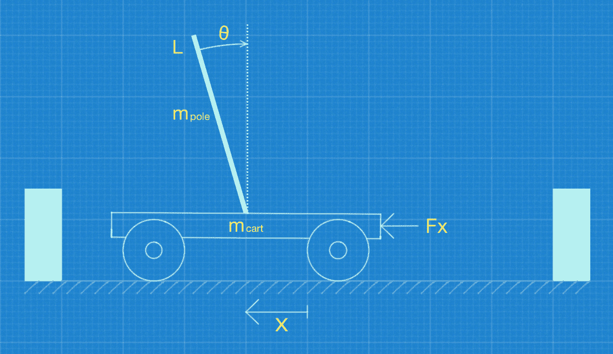

小车和单杆装置

在我们开始编写模拟器的源代码之前，我们需要确定可以用来估计平衡杆在任何给定时间的状态变量值的运动方程。

# 单平衡杆运动方程

控制器的目标是施加一系列力，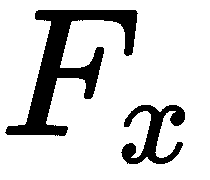，在小车的质心处，使得平衡杆在特定（或无限）时间内保持平衡，并且小车保持在轨道内，即不撞击左右墙壁。考虑到这里描述的力学，我们可以将平衡杆任务定性为*避障控制问题*，因为必须保持小车-平衡杆装置的状态以避免状态空间中的某些区域。对于适当的状态估计不存在唯一解，任何能够避免某些区域的运动方程的解都是可接受的。

学习算法需要从环境中接收关于任务的最小知识量来训练平衡杆控制器。这种知识应该反映我们的控制器离目标有多近。平衡杆问题的目标是稳定一个本质上不稳定的系统，并尽可能长时间地保持平衡。因此，从环境中接收到的强化信号 () 必须反映失败的发生。失败可能是由于平衡杆超过预定义的角度或小车撞击轨道边界造成的。强化信号，，可以定义为以下内容：

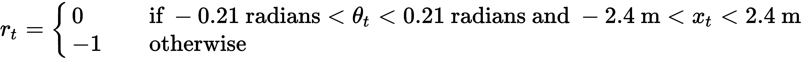

在这个方程中，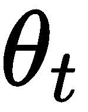 是平衡杆与垂直正方向顺时针方向的夹角，而 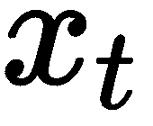 是小车相对于轨道的水平位置。

注意，强化信号，，既不依赖于角平衡杆速度 ()，也不依赖于水平小车速度 ()。它只提供关于小车-平衡杆系统的动力学是否在定义的约束之内信息。

忽略摩擦的小车-平衡杆系统的运动动力学方程如下：

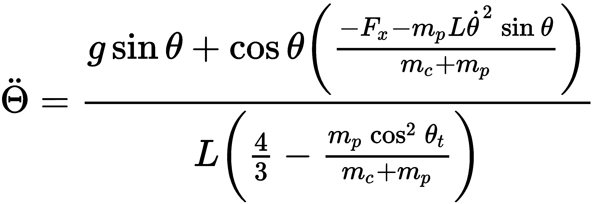

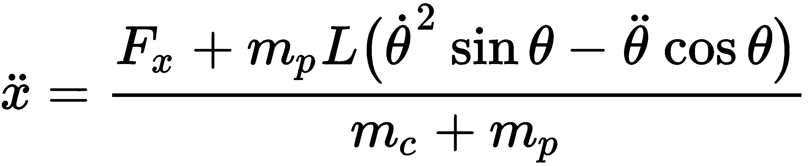

在这个方程中，  是杆的角速度，而  是杆的角加速度。此外，  是购物车的水平速度，而  是购物车沿 -轴的加速度。

在我们的实验中，使用了以下系统参数：

+   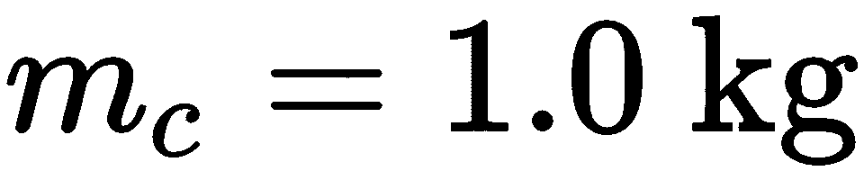 是购物车的质量。

+   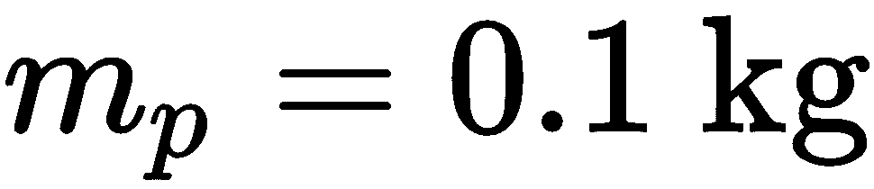 是杆的质量。

+    是杆质心到支点的距离。

+   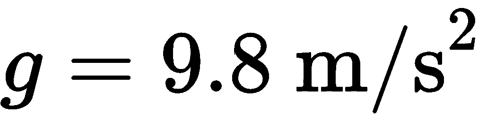 是重力加速度。

# 状态方程和控制动作

实验中使用的购物车-杆系统是通过使用步长为  秒的欧拉方法数值近似运动方程来模拟的。因此，状态方程可以定义为如下：

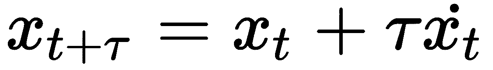

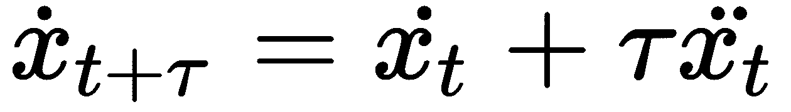

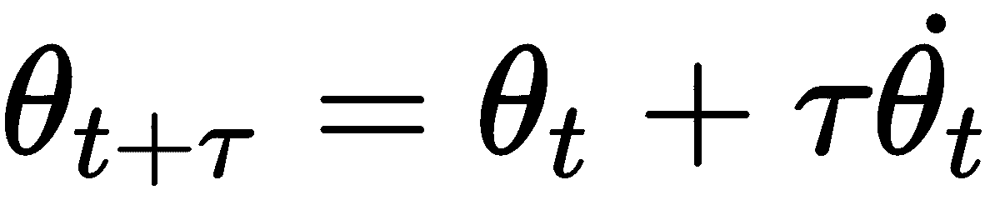

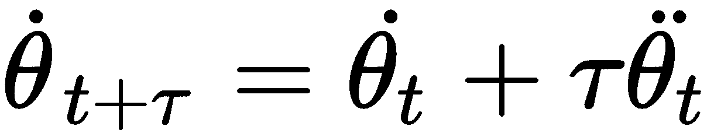

对于实验中使用的极小范围的杆角度，我们可以使用分割系统所有可能状态空间（切换表面）的表面的线性近似。因此，动作空间由左右推动作组成。我们在实验中使用的购物车-杆控制器不是为了产生零力。相反，在每一个时间步， ，它对购物车质心施加一个等幅的力，但方向相反。这种控制系统有一个名字（*bang-bang 控制器*）并且可以用以下方程定义：

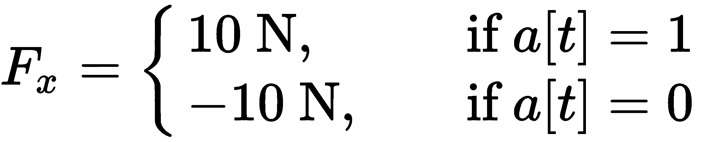

在这个方程中， 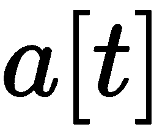 是从求解器接收到的动作信号。给定动作值后，bang-bang 控制器应用相同大小（`10` 牛顿）但方向相反的力， ，取决于所选的动作。

# 求解器和模拟器之间的交互

求解器在每个给定的时间点接收之前描述的状态变量的缩放值， 。这些值作为从求解器基因组表型创建的 ANNs 的输入，并定义为如下：

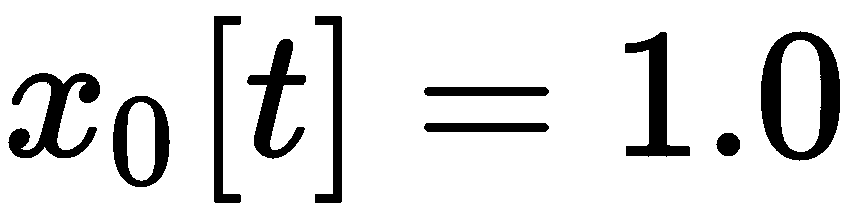,

,

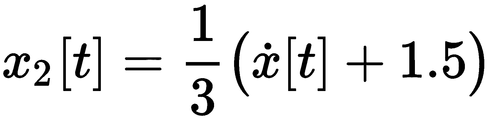,

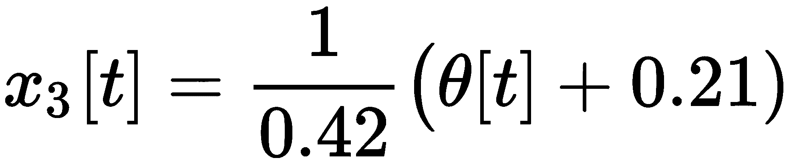,

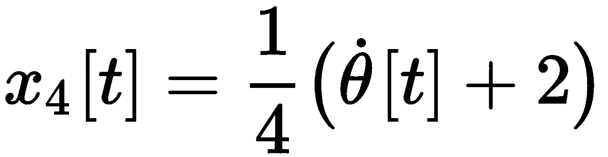.

在第一个方程中， 是一个常量偏置值，而 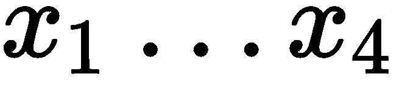 分别对应于购物车的水平位置、其水平速度、从垂直方向测量的极角以及其角速度。

考虑到之前定义的系统约束（参见 ），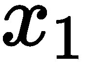 和 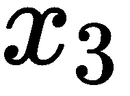 的缩放值保证在 `[0,1]` 范围内，而  和 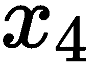 的缩放值大多落在 `[0,1]` 范围内，但最终可能超出这些界限。状态变量被缩放以实现两个基本目标：

+   为了消除当具有主要大值的项由于舍入效应而对学习者产生更大影响时可能出现的学习偏差。

+   对于这个特定任务，由于状态变量的值围绕零中心，可以找到一个不需要任何隐藏单元的ANN求解器。然而，我们感兴趣的是使用NEAT算法进化神经网络的拓扑结构。引入的缩放方案确保神经进化过程最终产生编码隐藏单元的表型。

极平衡控制器接收缩放后的输入并产生一个输出，该输出是一个二进制值，用于确定在之前讨论的时间 **`t`** 应该应用的动作。购物车-杆系统的状态变量采样率以及施加控制力的速率与仿真速率相同，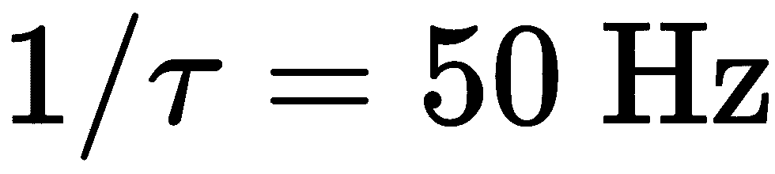。

因此，控制器ANN的初始配置可以描述如下：

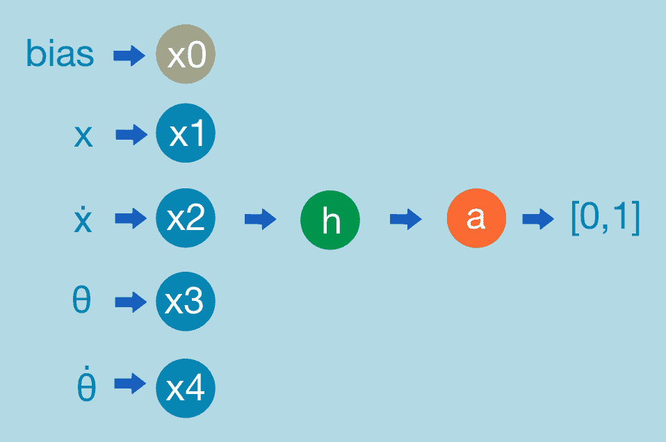

单极平衡控制器ANN的初始配置

单极平衡控制器ANN的初始配置包括五个输入节点，用于购物车的水平位置（**x1**）及其速度（**x2**），杆的垂直角度（**x3**）及其角速度（**x4**），以及一个额外的偏置输入节点（**x0**）（*这可以根据特定NEAT库的使用情况是可选的*）。输出节点（*`a`*）是一个二进制节点，提供控制信号到[`0`或`1`]应用。隐藏节点（*`h`*）是可选的，可以跳过。

# 单极平衡实验的目标函数

我们的目标是创建一个能够尽可能长时间（但至少为实验配置中指定的预期时间步数，即500,000步）在定义的约束内保持系统稳定状态的极平衡控制器。因此，目标函数必须优化稳定极平衡的持续时间，可以定义为预期步数与在评估表现型ANN期间获得的实际步数之间的对数差。损失函数如下所示：


在这个实验中，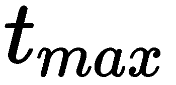是实验配置中的预期时间步数，而是控制器能够在允许的范围内保持稳定极平衡状态的实际时间步数（有关允许范围的详细信息，请参阅强化信号定义）。

# 车杆装置模拟

目标函数的定义假设我们可以测量单极平衡器处于稳定状态的时间步数。为了进行此类测量，我们需要实现车杆装置的模拟器，使用之前定义的运动方程和数据约束。

本章的源代码可在[https://github.com/PacktPublishing/Hands-on-Neuroevolution-with-Python/tree/master/Chapter4](https://github.com/PacktPublishing/Hands-on-Neuroevolution-with-Python/tree/master/Chapter4)找到。

首先，我们需要在`work`目录中创建一个名为`cart_pole.py`的文件。此文件包含运动方程和评估单极平衡器适应度的函数的源代码：

1.  我们从定义描述车杆装置物理学的常量开始：

```py
 GRAVITY = 9.8 # m/s^2
 MASSCART = 1.0 # kg
 MASSPOLE = 0.5 # kg
 TOTAL_MASS = (MASSPOLE + MASSCART)
 # The distance from the center of mass of the pole to the pivot
 # (actually half the pole's length)
 LENGTH = 0.5 # m
 POLEMASS_LENGTH = (MASSPOLE * LENGTH) # kg * m
 FORCE_MAG = 10.0 # N
 FOURTHIRDS = 4.0/3.0
 # the number seconds between state updates 
 TAU = 0.02 # sec
```

1.  然后，我们准备使用这些常量实现运动方程：

```py
    force = -FORCE_MAG if action <= 0 else FORCE_MAG
    cos_theta = math.cos(theta)
    sin_theta = math.sin(theta)
    temp = (force + POLEMASS_LENGTH * theta_dot * theta_dot * \
           sin_theta) / TOTAL_MASS
    # The angular acceleration of the pole
    theta_acc = (GRAVITY * sin_theta - cos_theta * temp) /\ 
                  (LENGTH * (FOURTHIRDS - MASSPOLE * \
                   cos_theta * cos_theta / TOTAL_MASS))
    # The linear acceleration of the cart
    x_acc = temp - POLEMASS_LENGTH * theta_acc * \
            cos_theta / TOTAL_MASS
    # Update the four state variables, using Euler's method.
    x_ret = x + TAU * x_dot
    x_dot_ret = x_dot + TAU * x_acc
    theta_ret = theta + TAU * theta_dot
    theta_dot_ret = theta_dot + TAU * theta_acc
```

有关此章节源代码中`do_step(action, x, x_dot, theta, theta_dot)`函数实现的详细信息，请参阅下一节。

上述代码片段使用当前系统状态（`x, x_dot, theta, theta_dot`）以及一个控制动作作为输入，并应用之前描述的运动方程来更新下一个时间步的系统状态。然后，更新后的系统状态返回以更新模拟器并检查约束违规。因此，模拟周期组织如下一节所述。

# 模拟周期

现在我们已经完全实现了小车-杆装置模拟一步的动力学方程和状态变量的数值近似。有了这个，我们就可以开始实现完整模拟周期了，该周期使用控制器的ANN来评估当前系统状态并选择适当的动作（下一步要施加的力）。前面提到的ANN是为特定进化代中的每个基因组的基因组创建的，使我们能够评估所有基因组的性能。

请参阅`run_cart_pole_simulation(net, max_bal_steps, random_start=True)`函数的实现以获取完整的实现细节。

我们可以参考以下步骤来执行完整模拟周期的实现：

1.  首先，我们需要初始化初始状态变量，要么用零，要么用之前描述的约束范围内的随机值，并围绕零进行初始化。随机状态值可以创建如下：

```py
    # -1.4 < x < 1.4
    x = (random.random() * 4.8 - 2.4) / 2.0
    # -0.375 < x_dot < 0.375
    x_dot = (random.random() * 3 - 1.5) / 4.0 
    # -0.105 < theta < 0.105
    theta = (random.random() * 0.42 - 0.21) / 2.0
    # -0.5 < theta_dot < 0.5
    theta_dot = (random.random() * 4 - 2) / 4.0
```

我们故意将所有值与相应的缩放约束范围相比进行了缩减，以确保算法不会从临界状态开始，即当稳定化不再可能时。

1.  之后，我们准备开始模拟周期，该周期由`max_bal_steps`参数指定的步数定义。以下代码是在*模拟循环*中执行的。

1.  在将状态变量作为输入加载到控制器的ANN之前，需要将其缩放到`[0,1]`范围内。这个程序具有计算和进化的优势，如前所述。偏差值没有明确提供，因为NEAT-Python框架内部处理它，所以可以在源代码中定义ANN的输入如下：

```py
    input[0] = (x + 2.4) / 4.8
    input[1] = (x_dot + 1.5) / 3
    input[2] = (theta + 0.21) / .42
    input[3] = (theta_dot + 2.0) / 4.0
```

1.  接下来，可以缩放输入来激活表型的ANN，并使用其输出产生动作的离散值：

```py
    # Activate the NET
    output = net.activate(input)
    # Make action values discrete
    action = 0 if output[0] < 0.5 else 1
```

1.  使用产生的动作值和当前的状态变量值，可以运行小车-杆模拟的单步。在模拟步骤之后，返回的状态变量将测试是否在约束范围内，以检查系统状态是否仍然在边界内。

在失败的情况下，返回当前的模拟步数，其值将用于评估表型的适应度：

```py
    # Apply action to the simulated cart-pole
    x, x_dot, theta, theta_dot = do_step(action = action, 
                      x = x, x_dot = x_dot, 
                      theta = theta, theta_dot = theta_dot )

    # Check for failure due constraints violation. 
    # If so, return number of steps.
    if x < -2.4 or x > 2.4 or theta < -0.21 or theta > 0.21:
        return steps
```

如果控制器的ANN能够在整个模拟步骤中维持小车-杆装置平衡的稳定状态，则`run_cart_pole_simulation`函数将返回具有最大模拟步数的值。

# 基因组适应度评估

使用前面描述的`run_cart_pole_simulation`函数返回的成功模拟步数，我们准备实现基因组适应度评估函数：

1.  首先，我们运行小车-杆模拟循环，它返回成功的模拟步数：

```py
    steps = run_cart_pole_simulation(net, max_bal_steps)
```

1.  之后，我们准备评估特定基因组的适应性分数，如前所述：

```py
    log_steps = math.log(steps)
    log_max_steps = math.log(max_bal_steps)
    # The loss value is in range [0, 1]
    error = (log_max_steps - log_steps) / log_max_steps
    # The fitness value is a complement of the loss value
    fitness = 1.0 - error
```

请参阅`eval_fitness(net, max_bal_steps=500000)`函数以获取更多详细信息。

我们使用对数刻度，因为大多数模拟运行在约100步时失败，但我们测试了`500000`平衡步。

# 单极平衡实验

现在我们已经定义并实现了目标函数，以及与滑车杆装置动力学模拟，我们准备开始编写源代码以使用NEAT算法运行神经进化过程。我们将使用与上一章中XOR实验相同的NEAT-Python库，但适当调整NEAT超参数。这些超参数存储在`single_pole_config.ini`文件中，该文件可在与本章相关的源代码存储库中找到。您需要将此文件复制到您的本地`Chapter4`目录中，在该目录中您应该已经有一个包含我们之前创建的滑车杆模拟器的Python脚本。

# 超参数选择

在配置文件的NEAT部分，我们定义了生物种群数量为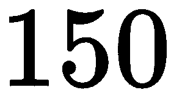个个体，以及适应性阈值`1.0`作为终止标准。

`fitness_criterion`设置为`max`，这意味着当任何个体达到等于`fitness_threshold`值的适应性分数时，进化过程终止：

```py
[NEAT]
fitness_criterion   = max
fitness_threshold   = 1.0
pop_size            = 150
reset_on_extinction = False
```

此外，我们还显著降低了添加新节点的概率，以使进化过程偏向在控制器中使用最小数量的ANN节点来详细阐述连接模式。因此，我们的目标是减少进化控制器ANN的能量消耗和减少训练的计算成本。

配置文件中相应的参数如下：

```py
# node add/remove rates
node_add_prob    = 0.02
node_delete_prob = 0.02
```

描述我们初始网络配置的参数，通过隐藏、输入和输出节点的数量给出如下：

```py
# network parameters
num_hidden = 0
num_inputs = 4
num_outputs = 1
```

我们提高了物种的兼容性阈值，以使进化过程偏向产生更少的物种。同时，我们增加了最小物种大小，表示我们对具有更大机会保留有益突变的、高度密集的物种感兴趣。在此同时，我们降低了最大停滞年龄，通过提高停滞物种早期灭绝来加强进化过程，这些停滞物种没有显示出任何适应性改进。

配置文件中的相关参数如下：

```py
[DefaultSpeciesSet]
compatibility_threshold = 4.0

[DefaultStagnation]
species_fitness_func = max
max_stagnation = 15
species_elitism = 2

[DefaultReproduction]
elitism = 2
survival_threshold = 0.2
min_species_size = 8
```

请参阅`single_pole_config.ini`配置文件以获取完整详情。

由于配置参数的影响，在进化过程中将使用更多种类的生物；然而，独特种类的数量将保持较低。

# 工作环境设置

在您开始编写实验运行器的源代码之前，您必须设置一个虚拟Python环境并安装所有必要的依赖项。您可以通过在命令行中执行以下命令使用Anaconda来完成此操作：

```py
$ conda create --name single_pole_neat python=3.5
$ conda activate single_pole_neat
$ pip install neat-python==0.92 
$ conda install matplotlib
$ conda install graphviz
$ conda install python-graphviz
```

首先，这些命令创建并激活一个Python 3.5的`single_pole_neat`虚拟环境。之后，安装了NEAT-Python库版本0.92，以及我们的可视化工具使用的其他依赖项。

# 实验运行器实现

首先，您需要在`Chapter4`目录下创建一个`single_pole_experiment.py`文件。在该文件中，将编写单极平衡实验的源代码。此外，您还需要将章节仓库中的`visualize.py`文件复制到该目录中。我们将使用该文件中的可视化工具来渲染实验结果。

实验运行器脚本包括两个基本函数。

# 评估种群中所有基因组适应度的函数

第一个函数评估种群中所有基因组的列表，并为每个基因组分配一个适应度分数。此函数通过引用传递给NEAT-Python库的神经进化运行器。此函数的源代码如下：

```py
def eval_genomes(genomes, config):
    for genome_id, genome in genomes:
        genome.fitness = 0.0
        net = neat.nn.FeedForwardNetwork.create(genome, config)
        fitness = cart.eval_fitness(net)
        if fitness >= config.fitness_threshold:
            # do additional steps of evaluation with random initial states
            # to make sure that we found stable control strategy rather 
            # than special case for particular initial state
            success_runs = evaluate_best_net(net, config, 
                                             additional_num_runs)
            # adjust fitness
            fitness = 1.0 - (additional_num_runs - success_runs) / \
                      additional_num_runs

        genome.fitness = fitness
```

注意，我们为获胜的基因组引入了额外的模拟运行，以确保其控制策略在从各种随机初始状态开始时是稳定的。这个额外的检查确保我们找到了真正的获胜者，而不是特定于特定初始状态的特殊情况。

前一个函数接收种群中所有基因组的列表和NEAT配置参数。对于每个特定的基因组，它创建表型ANN并将其用作控制器来运行定义在以下代码片段中的cart-pole装置模拟：

```py
fitness = cart.eval_fitness(net)
```

返回的适应度分数然后与我们在配置参数中定义的适应度阈值值进行比较。如果它超过了阈值，我们可以假设找到了一个成功的控制器。为了进一步验证找到的控制器，它将在额外的模拟运行中进行测试，并计算最终的适应度分数（如以下代码片段所示）：

```py
success_runs = evaluate_best_net(net, config, additional_num_runs)
fitness = 1.0 - (additional_num_runs - success_runs) / additional_num_runs
```

额外的模拟步骤将使用不同的随机数生成器种子来覆盖cart-pole装置的大多数可能的初始配置。

# 实验运行器函数

第二个函数配置、执行并输出神经进化过程的结果。在此，我们概述了实验运行器函数实现中的几个关键位置：

1.  函数开始于从配置文件中加载超参数并使用加载的配置生成初始种群：

```py
    # Load configuration.
    config = neat.Config(neat.DefaultGenome, 
                         neat.DefaultReproduction,
                         neat.DefaultSpeciesSet, 
                         neat.DefaultStagnation,
                         config_file)

    # Create the population, which is the top-level object 
    # for a NEAT run.
    p = neat.Population(config)
```

1.  之后，它配置了统计报告器以收集有关进化过程执行的统计数据。同时添加了输出报告器，以便实时将执行结果输出到控制台。还配置了检查点收集器以保存执行的中途阶段，这在需要稍后恢复训练过程时可能很有用：

```py
    # Add a stdout reporter to show progress in the terminal.
    p.add_reporter(neat.StdOutReporter(True))
    stats = neat.StatisticsReporter()
    p.add_reporter(stats)
    p.add_reporter(neat.Checkpointer(5, 
                 filename_prefix=‘out/spb-neat—checkpoint-'))
```

1.  最后，在指定的代数数上执行进化过程，并将结果保存在`output`目录中：

```py
    # Run for up to N generations.
    best_genome = p.run(eval_genomes, n=n_generations)

    # Display the best genome among generations.
    print('\nBest genome:\n{!s}'.format(best_genome))

    # Check if the best genome is a winning Single-Pole 
    # balancing controller 
    net = neat.nn.FeedForwardNetwork.create(best_genome, config)
    best_genome_fitness = cart.eval_fitness(net)
    if best_genome_fitness >= config.fitness_threshold:
        print("\n\nSUCCESS: The Single-Pole balancing controller has been found!!!")
    else:
        print("\n\nFAILURE: Failed to find Single-Pole balancing controller!!!")
```

请参阅`run_experiment(config_file, n_generations=100)`函数以获取完整的实现细节。

在进化过程中找到最佳基因组后，它被验证是否实际上符合我们在配置文件中设置的适应度阈值标准。在过程中可能找不到有效解决方案，但无论如何，NEAT-Python库将返回最佳匹配的基因组。这就是为什么我们需要这个额外的检查来确保最终的最佳匹配基因组实际上可以解决实际问题。

# 运行单极平衡实验

您需要进入包含`single_pole_experiment.py`文件的目录，并执行以下命令：

```py
$ python single_pole_experiment.py
```

不要忘记使用以下命令激活适当的虚拟环境：

`conda activate single_pole_neat`

在执行Python脚本的过程中，控制台将为每一代的进化打印以下输出：

```py
 ****** Running generation 13 ****** 

Population's average fitness: 0.26673 stdev: 0.12027
Best fitness: 0.70923 - size: (1, 2) - species 1 - id 2003
Average adjusted fitness: 0.161
Mean genetic distance 1.233, standard deviation 0.518
Population of 150 members in 1 species:
 ID age size fitness adj fit stag
 ==== === ==== ======= ======= ====
 1 13 150 0.7 0.161 7
Total extinctions: 0
Generation time: 4.635 sec (0.589 average)
```

在输出中，你可以看到在生成`14`时，种群的平均适应度较低，但表现最佳生物体的适应度（`0.70923`）已经接近我们在配置文件中设置的完成阈值值（`fitness_threshold = 1.0`）。冠军生物体编码的表型ANN由一个非线性节点（输出）和仅两个连接（`size: (1, 2)`）组成。此外，值得注意的是，种群中只存在一个物种。

在找到获胜者后，控制台输出以下行：

```py
 ****** Running generation 14 ****** 

Population's average fitness: 0.26776 stdev: 0.13359
Best fitness: 1.00000 - size: (1, 3) - species 1 - id 2110

Best individual in generation 14 meets fitness threshold - complexity: (1, 3)

Best genome:
Key: 2110
Fitness: 1.0
Nodes:
 0 DefaultNodeGene(key=0, bias=-3.328545880116371, response=1.0, activation=sigmoid, aggregation=sum)
Connections:
 DefaultConnectionGene(key=(-4, 0), weight=2.7587300138861037, enabled=True)
 DefaultConnectionGene(key=(-3, 0), weight=2.951449584136504, enabled=True)
 DefaultConnectionGene(key=(-1, 0), weight=0.9448711043565166, enabled=True)

Evaluating the best genome in random runs
Runs successful/expected: 100/100
SUCCESS: The stable Single-Pole balancing controller has been found!!!
```

作为进化获胜者的最佳基因组编码了一个仅由一个非线性节点（输出）和从输入节点（`size: (1, 3)`）来的三个连接组成的表型ANN。值得注意的是，进化能够产生一个稳固的控制策略，完全忽略了滑车的线性速度，只使用了其他三个输入：`x`、`θ`和`θ`。这一事实是进化选择正确性的另一个标志，因为我们决定忽略滑车的摩擦，这实际上排除了滑车线性速度在运动方程中的作用。

带有ANN的单极平衡控制器获胜图的展示如下：

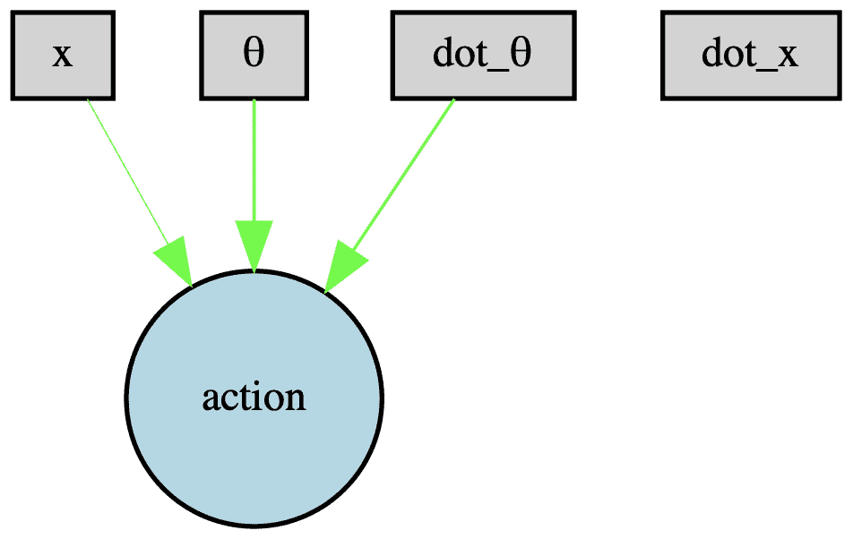

由NEAT算法找到的单极平衡控制器的ANN

进化过程中适应度值随代数变化的图表如下：

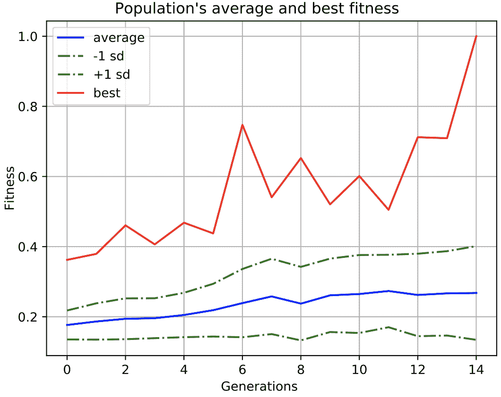

单极实验中种群的平均和最佳适应度

所有代中种群的平均适应度都很低，但从一开始就有一个有益的突变产生了特定的生物种群谱系。从一代到下一代，该谱系中的有才能的个体不仅能够保留其有益的特征，而且还能改进它们，这最终导致了进化获胜者的出现。

# 练习

1.  尝试增加`node_add_prob`参数的值，看看会发生什么。算法是否会产生一定数量的隐藏节点，如果是的话，有多少个？

1.  尝试降低/增加`compatibility_threshold`的值。如果你将其设置为`2.0`或`6.0`会发生什么？算法是否能在每种情况下找到解决方案？

1.  尝试在`DefaultReproduction`部分将`elitism`值设置为零。看看会发生什么。在这种情况下，进化过程找到可接受的解决方案需要多长时间？

1.  在`DefaultReproduction`部分将`survival_threshold`值设置为`0.5`。看看这如何影响进化过程中的物种形成。为什么会有这样的影响？

1.  将`additional_num_runs`和`additional_steps`的值按量级增加，以进一步检验找到的控制策略的泛化能力。算法是否仍然能够找到获胜的解决方案？

最后一个练习将导致算法执行时间的增加。

# 双极平衡问题

单极平衡问题对于NEAT算法来说足够简单，它可以快速找到保持稳定系统状态的最佳控制策略。为了使实验更具挑战性，我们提出了一个更高级的滑车-杆平衡问题。在这个版本中，两个杆通过一个铰链连接到移动的滑车上。

新的滑车-杆装置的方案如下：

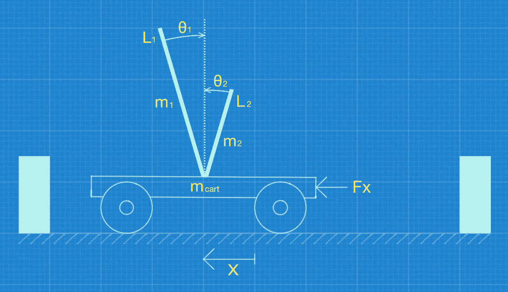

具有两个杆的滑车-杆装置

在我们转向实验的具体实现细节之前，我们需要定义双极平衡系统模拟的状态变量和运动方程。

# 系统状态和运动方程

控制器的目标是施加力到滑车上，以尽可能长时间地保持两个杆的平衡。同时，滑车应保持在定义的边界内。与之前讨论的单极平衡问题一样，控制策略可以定义为避免控制问题，这意味着控制器必须保持系统状态稳定，避免当滑车移动到轨道边界之外或任一杆超出允许的垂直角度时的危险区域。这个问题没有唯一解，但由于杆的长度和质量不同，因此它们对控制输入的反应也不同。

双极平衡装置的当前状态可以通过以下变量定义：

+   滑车在轨道上的位置 ()

+   滑车速度 ()

+   第一柱与垂直线的角度 (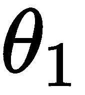)

+   第一柱的角速度 (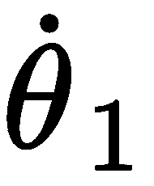)

+   第二柱与垂直线的角度 (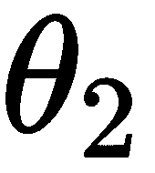)

+   第二柱的角速度 (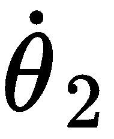)

忽略滑车轮与轨道之间摩擦的、平衡在单个滑车上的两个未连接柱子的运动方程如下：

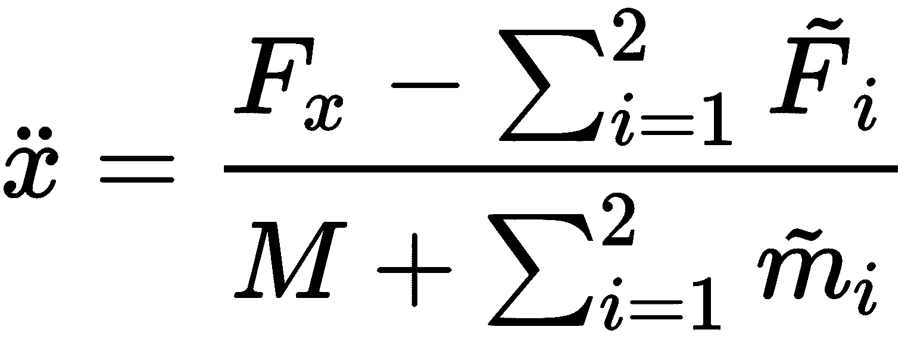

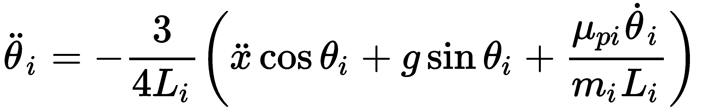

在此方程中，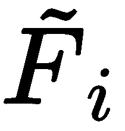 是柱子 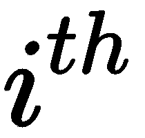 对滑车的反作用力：

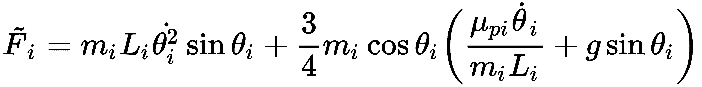

在此方程中，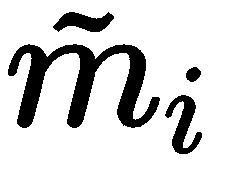 是柱子  的有效质量：

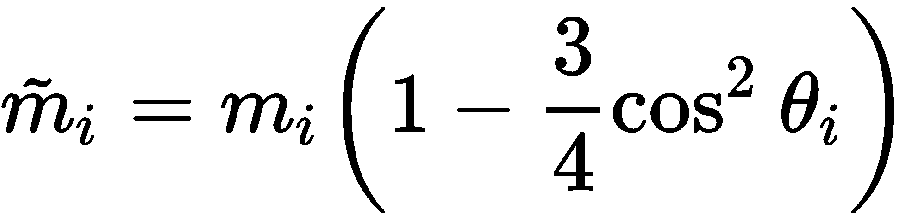

以下参数用于双柱模拟：

| **符号** | **描述** | **值** |
| --- | --- | --- |
|  | 轨道上滑车的位置 | 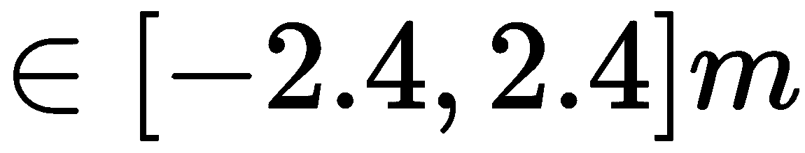 |
|  | 柱子与垂直线的角度 | 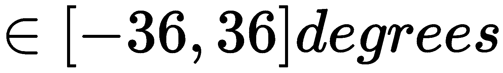 |
|  | 对滑车施加的控制力 | 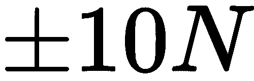 |
| 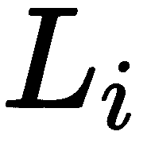 | 柱子质心到支点的距离 | 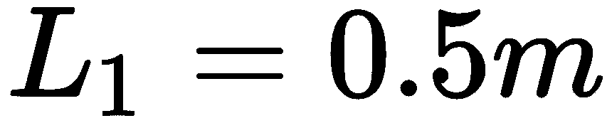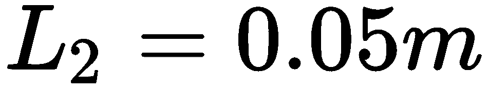 |
| 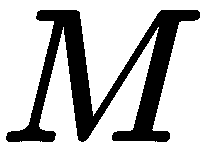 | 滑车的质量 | 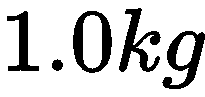 |
|  | 柱子的质量 |  |
|  | 对滑车施加的控制力 |  |
|  | 由于重力引起的自由落体加速度 |  |

对应的Python代码将这些系统参数定义为常量：

```py
GRAVITY = -9.8 # m/s^2 - here negative as equations of motion for 2-pole system assume it to be negative
MASS_CART = 1.0 # kg
FORCE_MAG = 10.0 # N
# The first pole
MASS_POLE_1 = 1.0 # kg
LENGTH_1 = 0.5 # m - actually half the first pole's length
# The second pole
MASS_POLE_2 = 0.1 # kg
LENGTH_2 = 0.05 # m - actually half the second pole's length
# The coefficient of friction of pivot of the pole
MUP = 0.000002
```

在Python中实现运动方程如下：

```py
# Find the input force direction
force = (action - 0.5) * FORCE_MAG * 2.0 # action has binary values
# Calculate projections of forces for the poles
cos_theta_1 = math.cos(theta1)
sin_theta_1 = math.sin(theta1)
g_sin_theta_1 = GRAVITY * sin_theta_1
cos_theta_2 = math.cos(theta2)
sin_theta_2 = math.sin(theta2)
g_sin_theta_2 = GRAVITY * sin_theta_2
# Calculate intermediate values
ml_1 = LENGTH_1 * MASS_POLE_1
ml_2 = LENGTH_2 * MASS_POLE_2
temp_1 = MUP * theta1_dot / ml_1
temp_2 = MUP * theta2_dot / ml_2
fi_1 = (ml_1 * theta1_dot * theta1_dot * sin_theta_1) + \
       (0.75 * MASS_POLE_1 * cos_theta_1 * (temp_1 + g_sin_theta_1))
fi_2 = (ml_2 * theta2_dot * theta2_dot * sin_theta_2) + \
       (0.75 * MASS_POLE_2 * cos_theta_2 * (temp_2 + g_sin_theta_2))
mi_1 = MASS_POLE_1 * (1 - (0.75 * cos_theta_1 * cos_theta_1))
mi_2 = MASS_POLE_2 * (1 - (0.75 * cos_theta_2 * cos_theta_2))
# Calculate the results: cart acceleration and poles angular accelerations
x_ddot = (force + fi_1 + fi_2) / (mi_1 + mi_2 + MASS_CART)
theta_1_ddot = -0.75 * (x_ddot * cos_theta_1 + \
                        g_sin_theta_1 + temp_1) / LENGTH_1
theta_2_ddot = -0.75 * (x_ddot * cos_theta_2 + \
                        g_sin_theta_2 + temp_2) / LENGTH_2
```

更多实现细节可在与`Chapter4`源代码文件相关的存储库中的`cart_two_pole.py`文件中找到。请参阅`calc_step(action, x, x_dot, theta1, theta1_dot, theta2, theta2_dot)`函数。

前面的代码接收当前系统状态（`x, x_dot, theta1, theta1_dot, theta2, theta2_dot`）以及控制动作，并计算导数（小车加速度和两个极的角加速度）。

# 强化信号

模拟环境必须在执行动作后以强化信号（）的形式提供关于系统状态的最小信息。强化信号指示在应用动作后，双极平衡系统是否违反了边界约束。它可以定义为以下：


Python中强化信号生成的实现如下：

```py
res = x < -2.4 or x > 2.4 or \
    theta1 < -THIRTY_SIX_DEG_IN_RAD or theta1 > THIRTY_SIX_DEG_IN_RAD or \
    theta2 < -THIRTY_SIX_DEG_IN_RAD or theta2 > THIRTY_SIX_DEG_IN_RAD
```

条件检查每个极的角度是否为  相对于垂直方向，以及小车位置是否为  相对于轨道中心。

# 初始条件和状态更新

在单极平衡实验中，我们使用了随机的初始状态条件，但有两个极时，初始条件更为简化。系统开始时，所有小车和极的速度都设置为零。长极的初始位置与垂直方向相差一度，短极完全直立。

初始条件如下：

+   

+   

+   

+   

+   

+   

通过使用时间步长为*0.01*秒的Runge-Kutta四阶方法对运动方程进行数值近似，在每个模拟步骤中更新小车-极系统的状态。Runge-Kutta四阶近似方法允许根据当前时间步的状态变量计算系统响应。新的控制输入每秒生成一次。因此，控制频率为**50 Hz**，系统状态更新频率为**100 Hz**。

Python中Runge-Kutta四阶方法实现如下：

1.  使用当前小车-极装置状态变量更新下一个半时间步的中间状态，并执行第一次模拟步骤：

```py
hh = tau / 2.0
yt = [None] * 6

# update intermediate state
for i in range(6):
    yt[i] = y[i] + hh * dydx[i]

# do simulation step
x_ddot, theta_1_ddot, theta_2_ddot = calc_step(action = f, yt[0], yt[1], yt[2], yt[3], yt[4], yt[5])

# store derivatives
dyt = [yt[1], x_ddot, yt[3], theta_1_ddot, yt[5], theta_2_ddot]
```

1.  使用第一次模拟步骤获得的导数更新中间状态，并执行第二次模拟步骤：

```py
# update intermediate state 
for i in range(6):
    yt[i] = y[i] + hh * dyt[i]

# do one simulation step
x_ddot, theta_1_ddot, theta_2_ddot = calc_step(action = f, yt[0], yt[1], yt[2], yt[3], yt[4], yt[5])

# store derivatives
dym = [yt[1], x_ddot, yt[3], theta_1_ddot, yt[5], theta_2_ddot]
```

1.  使用第一次和第二次模拟步骤的导数更新中间状态，并使用更新后的状态执行第三次极平衡模拟步骤：

```py
# update intermediate state
for i in range(6):
    yt[i] = y[i] + tau * dym[i]
    dym[i] += dyt[i]

# do one simulation step
x_ddot, theta_1_ddot, theta_2_ddot = calc_step(action = f, yt[0], yt[1], yt[2], yt[3], yt[4], yt[5])

# store derivatives
dyt = [yt[1], x_ddot, yt[3], theta_1_ddot, yt[5], theta_2_ddot]
```

1.  最后，使用前三个模拟步骤的导数来近似用于进一步模拟的小车-杆装置的最终状态：

```py
# find system state after approximation
yout = [None] * 6 # the approximated system state
h6 = tau / 6.0
for i in range(6):
    yout[i] = y[i] + h6 * (dydx[i] + dyt[i] + 2.0 * dym[i])
```

让我们检查前面方程的元素：

+   `f`是在模拟期间应用的控制动作（*`0`*或*`1`*）。

+   `y`是一个包含状态变量当前值()的列表。

+   `dydx`是一个包含状态变量导数()的列表。

+   `tau`是近似的时间步长大小。

对于更多实现细节，请参阅`cart_two_pole.py`文件中的`rk4(f, y, dydx, tau)`函数。

这种四阶龙格-库塔方法的实现接收当前系统状态（`x, x_dot, theta1, theta1_dot, theta2, theta2_dot`）以及导数，并近似下一个时间步的系统状态。

# 控制动作

与本章前面讨论的单极平衡实验一样，双极平衡实验的控制系统只生成两个控制信号：向左推和向右推，力是恒定的。因此，时间的控制力可以定义为以下：


在前面的方程中，是控制器在时间接收到的动作信号。

# 解算器和模拟器之间的交互

状态变量在作为控制器ANN的输入应用之前被缩放到`[0,1]`范围内。因此，状态输入变量预处理的方程如下：


在前面的方程中，对应于小车在水平方向的位置，其水平速度，第一个极点相对于垂直的角度，其角速度，以及第二个极点的角度和角速度，分别。

考虑到之前定义的系统约束（见），、和的缩放值保证在`[0,1]`范围内，而、和的缩放值大多落在`0...1`范围内，但最终可能会超出这些界限。

输入缩放的相应源代码如下：

```py
input[0] = (state[0] + 2.4) / 4.8
input[1] = (state[1] + 1.5) / 3.0
input[2] = (state[2] + THIRTY_SIX_DEG_IN_RAD) / (THIRTY_SIX_DEG_IN_RAD * 2.0)
input[3] = (state[3] + 2.0) / 4.0
input[4] = (state[4] + THIRTY_SIX_DEG_IN_RAD) / (THIRTY_SIX_DEG_IN_RAD * 2.0)
input[5] = (state[5] + 2.0) / 4.0
```

状态列表按照以下顺序保存当前状态变量： .

# 双摆平衡实验的目标函数

这个问题的目标函数与之前为单摆平衡问题定义的目标函数相似。它由以下方程给出：


在这些方程中，  是实验配置中指定的预期时间步数（100,000），而  是控制器能够维持摆杆平衡器在指定范围内稳定状态的实际时间步数。

我们使用对数刻度，因为大多数试验在前几步（100步左右）就失败了，但我们是在测试100,000步。在对数刻度下，我们有一个更好的适应度分数分布，即使与失败试验中的少量步骤相比。

前述方程的第一个定义了损失，其范围在 `[0,1]` 之间，第二个是一个补充损失值的适应度分数。因此，适应度分数值也在 `[0,1]` 范围内，值越高，结果越好。

Python源代码与单摆平衡实验中的目标函数定义相似，但它使用不同的模拟器调用以获取平衡步数：

```py
# First we run simulation loop returning number of successful
# simulation steps
steps = cart.run_markov_simulation(net, max_bal_steps)

if steps == max_bal_steps:
    # the maximal fitness
    return 1.0
elif steps == 0: # needed to avoid math error when taking log(0)
    # the minimal fitness
    return 0.0
else:
    log_steps = math.log(steps)
    log_max_steps = math.log(max_bal_steps)
    # The loss value is in range [0, 1]
    error = (log_max_steps - log_steps) / log_max_steps
    # The fitness value is a complement of the loss value
    return 1.0 - error
```

我们在这里使用对数刻度，因为大多数运行在100步左右就失败了，但我们是在测试100,000步。

# 双摆平衡实验

这个实验使用的是双摆平衡问题的版本，它假设对当前系统状态有完全的了解，包括极的角速度和车的速度。这个实验成功的标准是保持两个极在100,000步内平衡，或者大约33分钟的模拟时间。当极保持在垂直方向的  度以内时，我们认为它是平衡的，而车保持在轨道中心的  米以内。

# 超参数选择

与本章中描述的先前实验相比，双摆平衡由于其复杂的运动动力学而更难解决。因此，成功控制策略的搜索空间更广，需要更多样化的种群。为了增加种群的多样性，我们将种群大小增加到单摆平衡实验的10倍。

适应度终止阈值与这里显示的相同：

```py
[NEAT]
fitness_criterion = max
fitness_threshold = 1.0
pop_size = 1000
reset_on_extinction = False
```

为了进一步增强进化多样性，我们增加了添加新节点和连接的概率，以及改变初始连接配置方案的概率。此外，`initial_connection`参数的值包含了连接创建的概率，这为连接图的生产过程引入了额外的非确定性：

```py
# connection add/remove rates
conn_add_prob = 0.5
conn_delete_prob = 0.2

initial_connection = partial_direct 0.5

# node add/remove rates
node_add_prob = 0.2
node_delete_prob = 0.2
```

最后，考虑到种群的大小和物种可能的大小，我们减少了允许繁殖的个体比例（`survival_threshold`）。这种调整通过仅允许最健壮的有机体参与重组过程来限制解决方案的搜索空间：

```py
[DefaultReproduction]
elitism = 2
survival_threshold = 0.1
min_species_size = 2
```

最后的调整是有争议的，并且可能会降低进化过程的整体性能。但在大型种群中，通过减少可能的重组数量通常效果良好。因此，作为经验法则，对于小型种群使用较大的生存阈值，对于大型种群使用较小的值。

由于本实验的复杂性增加，额外的超参数类型对于最终结果变得极其重要。神经进化过程是围绕突变发生的可能性构建的，突变概率与随机数生成器产生的值进行测试。

如您所知，在传统计算机中，没有真正的随机数源。相反，随机性是通过一个伪随机算法生成的，该算法高度依赖于随机种子来启动随机数序列的生成。实际上，随机种子值精确地定义了给定生成器将产生的所有伪随机数的序列。

因此，我们可以将随机种子数视为一个定义初始条件的本质参数。此参数设置了随机吸引子的属性，这将放大算法在数值搜索空间中的微小变化。放大的效果最终决定了算法是否能够找到最优解以及需要多长时间。

随机种子值在`two_pole_markov_experiment.py`文件的大约第100行定义：

```py
# set random seed
seed = 1559231616
random.seed(seed)
```

对于双极平衡实验中使用的完整超参数列表，请参阅与此章节相关的源代码仓库中的`two_pole_markov_config.ini`文件。

上述代码设置了Python环境中提供的标准随机数生成器的种子值。

# 工作环境设置

双极平衡实验的工作环境可以通过在您选择的终端应用程序中输入以下命令来设置：

```py
$ conda create --name double_pole_neat python=3.5
$ conda activate double_pole_neat
$ pip install neat-python==0.92 
$ conda install matplotlib
$ conda install graphviz
$ conda install python-graphviz
```

这些命令创建并激活了一个Python 3.5版本的`double_pole_neat`虚拟环境。之后，安装了版本0.92的NEAT-Python库，以及我们的可视化工具所使用的其他依赖项。

# 实验运行器实现

实现基因组适应度评估的源代码与用于单杆平衡实验的源代码相似。主要区别在于它将引用另一个模拟环境以获取平衡步数的数量。因此，您可以参考`two_pole_markov_experiment.py`文件中的`eval_fitness(net, max_bal_steps=100000)`和`eval_genomes(genomes, config)`函数的源代码以获取实现细节。

在这个实验中，我们引入了自适应学习，它将在进化过程中尝试找到正确的短杆长度。短杆的长度会改变系统的运动动力学。并非所有与特定长度的短杆结合的超参数组合都能产生成功的控制策略。因此，我们实现了一个顺序增加短杆长度的过程，直到找到解决方案：

```py
# Run the experiment
pole_length = [0.1, 0.2, 0.3, 0.4, 0.5, 0.6, 0.7, 0.8]
num_runs = len(pole_length)
for i in range(num_runs):
    cart.LENGTH_2 = pole_length[i] / 2.0
    solved = run_experiment(config_path, n_generations=100, silent=False)
    print("run: %d, solved: %s, length: %f" % 
                                         (i + 1, solved, cart.LENGTH_2))
    if solved:
        print("Solution found in: %d run, short pole length: %f" % 
                                                 (i + 1, cart.LENGTH_2))
    break
```

请参考`two_pole_markov_experiment.py`文件以获取更多实现细节。

前面的代码使用不同的短杆长度值运行模拟，直到找到解决方案。

# 运行双杆平衡实验

在实现了双杆平衡模拟器、基因组适应度函数评估器和实验运行代码后，我们准备开始实验。进入包含`two_pole_markov_experiment.py`文件的目录，并执行以下命令：

```py
$ python two_pole_markov_experiment.py
```

不要忘记使用以下命令激活适当的虚拟环境：

**`conda activate double_pole_neat`**

前面的命令将在NEAT算法的控制下启动进化过程，使用`two_pole_markov_config.ini`文件中指定的超参数，以及我们已经实现的购物车双杆装置模拟器。

在`96`代之后，获胜的解决方案可以在第`97`代找到。最后一代的控制台输出类似于以下内容：

```py
 ****** Running generation 97 ****** 

Population's average fitness: 0.27393 stdev: 0.10514
Best fitness: 1.00000 - size: (1, 6) - species 26 - id 95605

Best individual in generation 97 meets fitness threshold - complexity: (1, 6)

Best genome:
Key: 95605
Fitness: 1.0
Nodes:
 0 DefaultNodeGene(key=0, bias=7.879760594997953, response=1.0, activation=sigmoid, aggregation=sum)
Connections:
 DefaultConnectionGene(key=(-6, 0), weight=1.9934757746640883, enabled=True)
 DefaultConnectionGene(key=(-5, 0), weight=3.703109977745863, enabled=True)
 DefaultConnectionGene(key=(-4, 0), weight=-11.923951805881497, enabled=True)
 DefaultConnectionGene(key=(-3, 0), weight=-4.152166115226511, enabled=True)
 DefaultConnectionGene(key=(-2, 0), weight=-3.101569479910728, enabled=True)
 DefaultConnectionGene(key=(-1, 0), weight=-1.379602358542496, enabled=True)

Evaluating the best genome in random runs
Runs successful/expected: 1/1
SUCCESS: The stable Double-Pole-Markov balancing controller found!!!
Random seed: 1559231616
run: 1, solved: True, half-length: 0.050000
Solution found in: 1 run, short pole length: 0.100000
```

在控制台输出中，我们可以看到获胜的基因组大小为`(1, 6)`，这意味着它只有一个非线性节点——输出节点，并且从六个输入节点到输出节点的连接是完整的。因此，我们可以假设控制器ANN的最小可能配置已被找到，因为它不包含任何隐藏节点，而是使用特定探索的连接权重来编码控制行为。此外，值得注意的是，在所有可能的短杆长度值列表中，找到了最小长度值的解决方案。

能够执行可靠控制策略的控制器ANN的配置如图所示：


双杆平衡控制器的ANN

适应度分数在代与代之间变化，如图所示：


双杆平衡实验的每一代的适应度分数

在我们想要了解进化如何运作的情况下，前面的图表很有趣。你可以看到，在找到胜者之前，适应度分数会急剧下降。这是由于那些达到中等高适应度分数并显示在过去15代中没有改进的停滞物种的灭绝。之后，空缺的位置被拥有灭绝物种积累的遗传知识的全新物种占据。这个新生物种还引入了一种有益的突变，将它的遗传知识与新的技巧相结合，最终产生了胜者。

在这个实验中，我们决定通过显著增加种群规模并对超参数进行其他调整来增强物种的多样性。在下面的图表中，你可以看到我们已经达到了我们的目标，神经进化过程会经历多种物种，直到找到解决方案：


双极平衡实验的代际物种分化

接下来，我们想了解随机种子数值的变化对NEAT算法的影响。首先，我们只将随机种子数值增加了一（其他一切都没有改变）。在这种新条件下，NEAT算法仍然可以找到稳定的控制策略，但创建了一个与之前展示的优化配置不同的、奇异的控制器ANN配置：


随机种子数值增加一个（其他一切未变）的双极平衡控制器ANN

当随机种子数值增加，例如增加10时，神经进化过程根本找不到任何稳定的控制策略。

这个实验揭示了基于神经进化方法的一个另一个重要方面——由随机种子数值确定的初始条件的影响。随机种子定义了随机吸引子的属性，它放大了进化过程的效果，无论是好是坏。因此，在这个实验中，找到合适的随机种子数值以启动神经进化过程至关重要。我们将在本书的末尾讨论寻找合适的随机种子数值的方法。

# 练习

1.  尝试在配置文件中将`node_add`参数值设置为`0.02`，看看会发生什么。

1.  改变随机数生成器的种子值，看看会发生什么。是否找到了新的值解决方案？它与我们在本章中展示的内容有何不同？

# 摘要

在本章中，我们学习了如何实现控制策略，以维持一个带有顶部一个或两个极点的滑车装置的稳定状态。通过实现物理装置的精确模拟，我们提高了我们的Python技能，并扩展了我们对NEAT-Python库的知识，这些模拟被用来定义实验的目标函数。此外，我们还学习了两种微分方程的数值近似方法，即欧拉法和龙格-库塔法，并将它们实现到了Python中。

我们发现，决定神经进化过程的初始条件，例如随机种子数，对算法的性能有显著影响。这些值决定了随机数生成器将生成的整个数字序列。它们作为随机吸引子，可以放大或减弱进化的影响。

在下一章中，我们将讨论如何使用神经进化来创建能够通过迷宫的导航代理。你将学习如何定义一个以目标为导向的目标函数来解决迷宫问题，以及如何编写一个能够导航迷宫的机器人代理的精确模拟。我们将探讨两种迷宫环境类型，并检查以目标为导向的适应度函数如何在复杂的迷宫配置的欺骗性环境中陷入寻找解决方案的困境。
