# 第七章：自主迷宫导航

迷宫导航是一个与自主导航领域密切相关的经典计算机科学问题。在本章中，你将了解如何使用基于神经进化的方法来解决迷宫导航的挑战。此外，我们将解释如何使用导航代理的适应度分数（作为代理与最终目标距离的导数）来定义以目标为导向的适应度函数。到本章结束时，你将了解使用神经进化方法训练自主导航代理的基本知识，并将能够创建下一章中将要介绍的更高级的迷宫求解器。你将熟悉高级可视化技术，这将使理解算法执行结果更容易。此外，你将获得使用Python编程语言编写迷宫导航机器人模拟器和相关迷宫环境的实践经验。

在本章中，你将熟悉以下主题：

+   迷宫导航问题的欺骗性本质

+   编写一个配备传感器和执行器的迷宫导航机器人模拟器

+   定义一个以目标为导向的适应度函数，以指导使用神经进化算法创建适当的迷宫求解器的过程

+   使用简单且难以解决的迷宫配置运行实验

# 技术要求

为了完成本章中描述的实验，应满足以下技术要求：

+   Windows 8/10，macOS 10.13或更新版本，或现代Linux

+   Anaconda Distribution版本2019.03或更新版本

本章的代码可以在[https://github.com/PacktPublishing/Hands-on-Neuroevolution-with-Python/tree/master/Chapter5](https://github.com/PacktPublishing/Hands-on-Neuroevolution-with-Python/tree/master/Chapter5)找到

# 迷宫导航问题

迷宫导航问题是一个与创建能够在模糊环境中找到路径的自主导航代理密切相关的经典计算机科学问题。迷宫环境是具有欺骗性适应度景观问题类的一个说明性领域。这意味着以目标为导向的适应度函数可以在迷宫中靠近最终目标点的死胡同中具有陡峭的适应度分数梯度。这些迷宫区域成为基于目标的搜索算法的局部最优解，这些算法可能会收敛到这些区域。当搜索算法收敛到这种欺骗性的局部最优解时，它无法找到适当的迷宫求解代理。

在以下示例中，你可以看到一个具有局部最优解的死胡同的二维迷宫，这些死胡同被阴影覆盖：

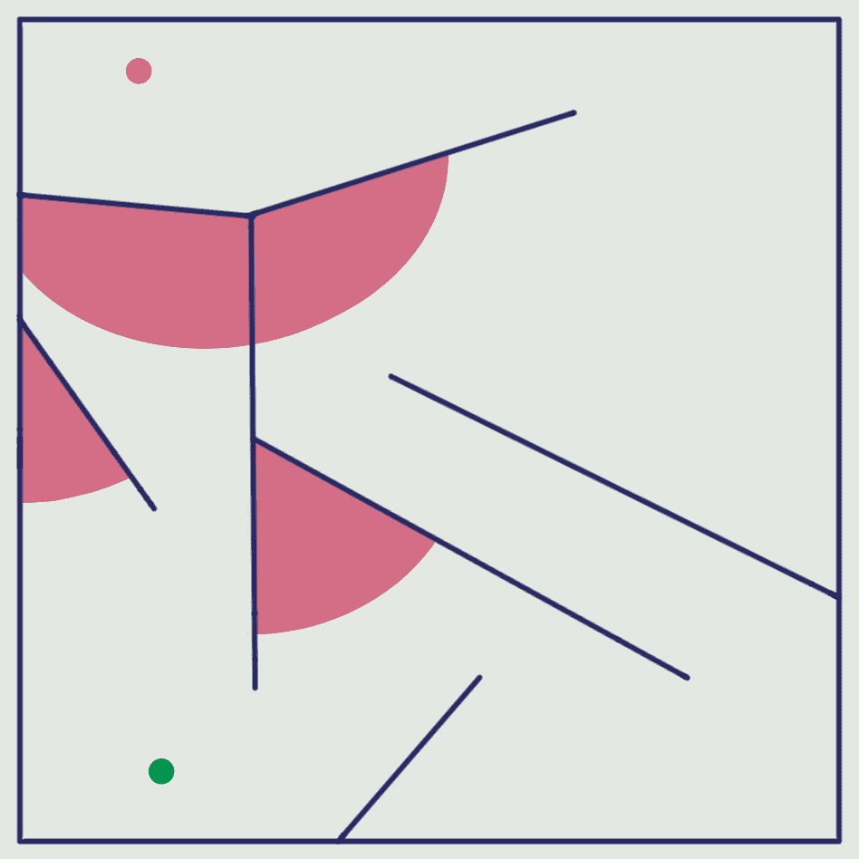

二维迷宫配置

图中的迷宫配置可视化了集中在局部最优死胡同（标记为填充段）中的欺骗性适应度分数景观。使用基于目标的搜索算法从起点（底部圆圈）导航到出口点（顶部圆圈）的迷宫求解代理将容易陷入局部最优死胡同。此外，像这样的欺骗性适应度分数景观可能会阻止基于目标的搜索算法找到成功的迷宫求解器。

在迷宫中导航的代理是一个配备了传感器组的机器人，它能够检测附近的障碍物并获得通往迷宫出口的方向。机器人的运动由两个执行器控制，它们影响机器人身体的线性运动和角运动。机器人的执行器由一个ANN控制，该ANN从传感器接收输入并产生两个控制信号供执行器使用。

# 迷宫模拟环境

迷宫模拟的环境由三个主要组件组成，这些组件作为独立的Python类实现：

+   `Agent`: 该类包含与迷宫导航代理相关的信息，该代理由模拟使用（请参阅`agent.py`文件以获取实现细节）。

+   `AgentRecordStore`: 管理与进化过程中所有求解代理评估相关的记录存储的类。收集的记录可以在完成后用于分析进化过程（请参阅`agent.py`文件以获取实现细节）。

+   `MazeEnvironment`: 包含迷宫模拟环境信息的类。此类还提供管理模拟环境、控制求解代理的位置、执行碰撞检测以及为代理的传感器生成输入数据的方法（请参阅`maze_environment.py`文件以获取实现细节）。

在以下章节中，我们将更详细地查看迷宫模拟环境的每个部分。

# 迷宫导航代理

在本章中，我们考虑一个二维迷宫导航任务。这个任务容易可视化，并且相对容易为二维迷宫编写迷宫导航机器人的模拟器。机器人的主要目标是导航通过迷宫，在指定的时间步数内到达定义的目标点。控制机器人的ANN是神经进化过程的产物。

神经进化算法从一个非常基本的初始ANN配置开始，该配置仅包含用于传感器的输入节点和用于执行器的输出节点，它逐渐变得更加复杂，直到找到成功的迷宫求解器。这个任务由于迷宫的特殊配置而变得复杂，该配置有几个死胡同，这通过在适应度景观中创建局部最优来阻止找到通往目标的路线，正如之前讨论的那样。

以下图显示了迷宫求解模拟中使用的迷宫代理的示意图：

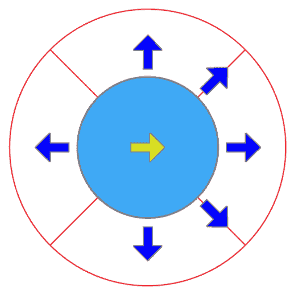

迷宫代理（机器人）架构

在前面的图中，实心圆定义了机器人的刚体。实心圆内的箭头表示机器人的航向。实心圆周围的六个箭头代表**六个距离传感器**，指示给定方向最近障碍物的距离。四个外圆段表示**四个扇形雷达传感器**，作为指向目标点（迷宫出口）的指南针。

当从目标点到机器人中心的线落在其**视场**内时，特定的雷达传感器会被激活。雷达传感器的检测范围由其视场内迷宫区域的大小限制。因此，在任何给定时间，四个雷达传感器中的一个是激活的，指示迷宫出口方向。

雷达传感器相对于机器人的航向有以下视场区域：

| **传感器** | **视场角，度** |
| --- | --- |
| 前方 | 315.0 ~ 405.0 |
| 左侧 | 45.0 ~ 135.0 |
| 后方 | 135.0 ~ 225.0 |
| 右侧 | 225.0 ~ 315.0 |

距离传感器是从机器人中心向特定方向绘制的一条射线。当与任何障碍物相交时，它会被激活，并返回检测到的障碍物的距离。该传感器的检测范围由特定的配置参数定义。

机器人的距离传感器监控相对于代理航向的以下方向：

| **传感器** | **方向，度** |
| --- | --- |
| 右侧 | -90.0 |
| 右前方 | -45.0 |
| 前方 | 0.0 |
| 左前方 | 45.0 |
| 左侧 | 90.0 |
| 后方 | -180.0 |

机器人的运动由两个执行器控制，这些执行器施加力以旋转和/或推动代理框架，即改变其线性和/或角速度。

迷宫求解代理的Python实现具有多个字段，用于存储其当前状态并维护其传感器的激活状态：

```py
    def __init__(self, location, heading=0, speed=0, 
                 angular_vel=0, radius=8.0, range_finder_range=100.0):
        self.heading = heading
        self.speed = speed
        self.angular_vel = angular_vel
        self.radius = radius
        self.range_finder_range = range_finder_range
        self.location = location
        # defining the range finder sensors
        self.range_finder_angles = [-90.0, -45.0, 0.0, 45.0, 90.0, -180.0]
        # defining the radar sensors
        self.radar_angles = [(315.0, 405.0), (45.0, 135.0),
                             (135.0, 225.0), (225.0, 315.0)]
        # the list to hold range finders activations
        self.range_finders = [None] * len(self.range_finder_angles)
        # the list to hold pie-slice radar activations
        self.radar = [None] * len(self.radar_angles)
```

更多实现细节，请参阅[https://github.com/PacktPublishing/Hands-on-Neuroevolution-with-Python/blob/master/Chapter5/agent.py](https://github.com/PacktPublishing/Hands-on-Neuroevolution-with-Python/blob/master/Chapter5/agent.py)文件。

前面的代码显示了`Agent`类的默认构造函数，其中初始化了代理的所有字段。迷宫环境模拟将使用这些字段在每个模拟步骤中存储代理的当前状态。

# 迷宫模拟环境实现

为了模拟求解代理在迷宫中导航，我们需要定义一个环境来管理迷宫的配置，跟踪迷宫求解代理的位置，并为导航机器人的传感器数据数组提供输入。

所有这些特性都集成在一个逻辑块中，该逻辑块封装在`MazeEnvironment` Python类中，该类具有以下字段（如类构造函数所示）：

```py
    def __init__(self, agent, walls, exit_point, exit_range=5.0):
        self.walls = walls
        self.exit_point = exit_point
        self.exit_range = exit_range
        # The maze navigating agent
        self.agent = agent
        # The flag to indicate if exit was found
        self.exit_found = False
        # The initial distance of agent from exit
        self.initial_distance = self.agent_distance_to_exit()
```

上述代码显示了`MazeEnvironment`类的默认构造函数及其所有字段的初始化：

+   迷宫配置由墙壁列表和`exit_point`确定。墙壁是线段的列表；每个线段代表迷宫中的特定墙壁，而`exit_point`是迷宫出口的位置。

+   `exit_range`字段存储围绕`exit_point`的范围距离值，该值定义了出口区域。我们认为，当代理的位置在出口区域内时，代理已成功解决迷宫。

+   `agent`字段包含对前一小节中描述的初始化`Agent`类的引用，该类定义了求解代理在迷宫中的起始位置以及其他与代理相关的数据字段。

+   `initial_distance`字段存储从代理起始位置到迷宫出口点的距离。此值将用于计算代理的适应度分数。

# 传感器数据生成

迷宫求解代理由一个需要接收传感器数据作为输入以产生相应控制信号作为输出的ANN（人工神经网络）控制。正如我们之前提到的，导航代理装备有两组类型的传感器：

+   六个**测距传感器**用于检测与迷宫墙壁的碰撞，它们指示特定方向上最近障碍物的距离。

+   四个**扇形雷达传感器**，它们从迷宫中的任何位置指示通往迷宫出口点的方向。

传感器值需要在每个模拟步骤中更新，`MazeEnvironment`类提供了两个专门的方法来更新这两种类型的传感器。

测距传感器的数组更新如下（参见`update_rangefinder_sensors`函数）：

```py
        for i, angle in enumerate(self.agent.range_finder_angles):
            rad = geometry.deg_to_rad(angle)
            projection_point = geometry.Point(
                x = self.agent.location.x + math.cos(rad) * \
                    self.agent.range_finder_range,
                y = self.agent.location.y + math.sin(rad) * \
                    self.agent.range_finder_range
            )
            projection_point.rotate(self.agent.heading, 
                                    self.agent.location)
            projection_line = geometry.Line(a = self.agent.location, 
                                            b = projection_point)
            min_range = self.agent.range_finder_range
            for wall in self.walls:
                found, intersection = wall.intersection(projection_line)
                if found:
                    found_range = intersection.distance(
                                                   self.agent.location)
                    if found_range < min_range:
                        min_range = found_range
            # Store the distance to the closest obstacle
            self.agent.range_finders[i] = min_range
```

此代码列出了测距传感器的所有检测方向，这些方向由方向角度确定（参见`Agent`构造函数中的`range_finder_angles`字段初始化）。对于每个方向，然后创建一条从代理当前位置开始，长度等于测距器检测范围的投影线。之后，测试投影线是否与迷宫墙壁相交。如果检测到多个交点，则将最近墙壁的距离存储为特定测距传感器的值。否则，将最大检测范围保存为测距传感器的值。

在`MazeEnvironment`类中，需要使用以下代码更新扇形雷达传感器的数组：

```py
    def update_radars(self):
        target = geometry.Point(self.exit_point.x, self.exit_point.y)
        target.rotate(self.agent.heading, self.agent.location)
        target.x -= self.agent.location.x
        target.y -= self.agent.location.y
        angle = target.angle()
        for i, r_angles in enumerate(self.agent.radar_angles):
            self.agent.radar[i] = 0.0 # reset specific radar 
            if (angle >= r_angles[0] and angle < r_angles[1]) or 
               (angle + 360 >= r_angles[0] and angle + 360 < r_angles[1]):
                # fire the radar
                self.agent.radar[i] = 1.0
```

上述代码创建迷宫出口点的副本，并在全局坐标系中相对于代理的航向和位置进行旋转。然后，目标点被平移以使其与迷宫求解代理的局部坐标系对齐；代理被放置在坐标原点。之后，我们计算在代理局部坐标系中从坐标原点到目标点的向量的角度。这个角度是从当前代理位置到迷宫出口点的方位角。当找到方位角时，我们遍历已注册的扇形雷达传感器，以找到包含方位角在其视场内的一个。相应的雷达传感器通过将其值设置为 1 被激活，而其他雷达传感器通过将其值置零被停用。

# 代理位置更新

在从控制器 ANN 接收到相应的控制信号后，迷宫求解代理在迷宫中的位置需要在每个模拟步骤中进行更新。以下代码用于更新迷宫求解代理的位置：

```py
    def update(self, control_signals):
        if self.exit_found:
            return True # Maze exit already found
        self.apply_control_signals(control_signals)
        vx = math.cos(geometry.deg_to_rad(self.agent.heading)) * \
                      self.agent.speed
        vy = math.sin(geometry.deg_to_rad(self.agent.heading)) * \
                      self.agent.speed
        self.agent.heading += self.agent.angular_vel
        if self.agent.heading > 360:
            self.agent.heading -= 360
        elif self.agent.heading < 0:
            self.agent.heading += 360
        new_loc = geometry.Point(
            x = self.agent.location.x + vx, 
            y = self.agent.location.y + vy
        )
        if not self.test_wall_collision(new_loc):
            self.agent.location = new_loc
        self.update_rangefinder_sensors()
        self.update_radars()
        distance = self.agent_distance_to_exit()
        self.exit_found = (distance < self.exit_range)
        return self.exit_found
```

`update(self, control_signals)` 函数定义在 `MazeEnvironment` 类中，并在每个模拟时间步被调用。它接收一个包含控制信号的列表作为输入，并返回一个布尔值，指示迷宫求解代理在其位置更新后是否已到达出口区域。

此函数开头代码将接收到的控制信号应用于代理的角速度和线速度的当前值，如下所示（参见 `apply_control_signals(self, control_signals)` 函数）：

```py
       self.agent.angular_vel += (control_signals[0] - 0.5)
       self.agent.speed += (control_signals[1] - 0.5)
```

之后，计算 `x` 和 `y` 速度分量以及代理的航向，并用于估计其在迷宫中的新位置。如果这个新位置没有与迷宫的任何墙壁发生碰撞，那么它将被分配给代理并成为其当前位置：

```py
        vx = math.cos(geometry.deg_to_rad(self.agent.heading)) * \
                      self.agent.speed
        vy = math.sin(geometry.deg_to_rad(self.agent.heading)) * \
                      self.agent.speed
        self.agent.heading += self.agent.angular_vel
        if self.agent.heading > 360:
            self.agent.heading -= 360
        elif self.agent.heading < 0:
            self.agent.heading += 360
        new_loc = geometry.Point(
            x = self.agent.location.x + vx, 
            y = self.agent.location.y + vy
        )
        if not self.test_wall_collision(new_loc):
            self.agent.location = new_loc
```

在此之后，新代理位置被用于以下函数中，这些函数更新测距仪和雷达传感器，以估计下一次时间步的新传感器输入：

```py
        self.update_rangefinder_sensors()
        self.update_radars()
```

最后，以下函数测试代理是否已到达迷宫出口，该出口由出口点周围的圆形区域定义，其半径等于 `exit_range` 字段的值：

```py
        distance = self.agent_distance_to_exit()
        self.exit_found = (distance < self.exit_range)
        return self.exit_found
```

如果已到达迷宫出口，则将 `exit_found` 字段的值设置为 `True` 以指示任务的顺利完成，并从函数调用中返回其值。

对于更多实现细节，请参阅 [https://github.com/PacktPublishing/Hands-on-Neuroevolution-with-Python/blob/master/Chapter5/maze_environment.py](https://github.com/PacktPublishing/Hands-on-Neuroevolution-with-Python/blob/master/Chapter5/maze_environment.py) 中的 `maze_environment.py` 文件。

# 代理记录存储

在完成实验后，我们感兴趣的是评估和可视化每个个体求解代理在整个进化过程中的表现。这是通过在指定的时间步数后运行迷宫求解模拟来收集每个代理的额外统计数据来实现的。代理记录的收集是通过两个Python类`AgentRecord`和`AgentRecordStore`来介导的。

`AgentRecord`类由几个数据字段组成，如下所示，可以在类构造函数中看到：

```py
    def __init__(self, generation, agent_id):
        self.generation = generation
        self.agent_id = agent_id
        self.x = -1
        self.y = -1
        self.fitness = -1
        self.hit_exit = False
        self.species_id = -1
        self.species_age = -1
```

字段定义如下：

+   `generation`包含创建代理记录时的代ID。

+   `agent_id`是代理的唯一标识符。

+   `x`和`y`是代理在模拟完成后在迷宫中的位置。

+   `fitness`是代理的最终适应度得分。

+   `hit_exit`是一个标志，表示代理是否已达到迷宫出口区域。

+   `species_id`和`species_age`是代理所属物种的ID和年龄。

`AgentRecordStore`类包含代理记录列表，并提供从/到特定文件加载/转储收集到的记录的功能。

请参阅源代码库中与此章节相关的目录中的`agent.py`文件以获取完整的实现细节。

在基因组适应度评估后，将新的`AgentRecord`实例添加到存储中，如`maze_experiment.py`文件中实现的`eval_fitness(genome_id, genome, config, time_steps=400)`函数所定义的。这是通过以下代码完成的：

```py
def eval_fitness(genome_id, genome, config, time_steps=400):
    maze_env = copy.deepcopy(trialSim.orig_maze_environment)
    control_net = neat.nn.FeedForwardNetwork.create(genome, config)
    fitness = maze.maze_simulation_evaluate(
              env=maze_env, net=control_net, time_steps=time_steps)
    record = agent.AgentRecord(
        generation=trialSim.population.generation,
        agent_id=genome_id)
    record.fitness = fitness
    record.x = maze_env.agent.location.x
    record.y = maze_env.agent.location.y
    record.hit_exit = maze_env.exit_found
    record.species_id = trialSim.population.species.\
                                       get_species_id(genome_id)
    record.species_age = record.generation - \
      trialSim.population.species.get_species(genome_id).created
    trialSim.record_store.add_record(record)
    return fitness
```

此代码首先创建原始迷宫环境的深度副本，以避免评估运行之间的干扰。之后，它使用提供的NEAT配置从指定的基因组创建控制ANN，并开始对给定的时间步数进行迷宫模拟评估。然后，代理的返回适应度得分以及其他统计数据被存储到特定的`AgentRecord`实例中，并添加到记录存储中。

实验一次试验期间收集的记录将被保存到`output`目录下的`data.pickle`文件中，并用于可视化所有评估代理的性能。

请参阅`maze_experiment.py`文件以获取完整的实现细节：[https://github.com/PacktPublishing/Hands-on-Neuroevolution-with-Python/blob/master/Chapter5/maze_experiment.py](https://github.com/PacktPublishing/Hands-on-Neuroevolution-with-Python/blob/master/Chapter5/maze_experiment.py).

# 代理记录可视化

在神经进化过程中收集所有代理的评估记录后，我们感兴趣的是可视化这些记录以了解性能。可视化应包括所有求解代理的最终位置，并允许设置物种的适应度阈值以控制哪些物种将被添加到相应的图中。我们决定将收集到的代理记录以两个图的形式展示，一个在上，一个在下。顶部图是适应度分数大于或等于指定适应度阈值的代理记录，底部图是其余的记录。

代理记录的可视化是在`visualize.py`脚本中的新方法中实现的。你应该已经熟悉这个脚本，因为它来自本书中描述的先前实验。

请查看位于[https://github.com/PacktPublishing/Hands-on-Neuroevolution-with-Python/blob/master/Chapter5/visualize.py](https://github.com/PacktPublishing/Hands-on-Neuroevolution-with-Python/blob/master/Chapter5/visualize.py)的`visualize.py`文件中的`draw_maze_records(maze_env, records, best_threshold=0.8, filename=None, view=False, show_axes=False, width=400, height=400)`函数定义。

# 使用适应度分数定义目标函数

在本节中，你将了解如何使用以目标为导向的目标函数来引导进化过程，创建成功的迷宫求解代理。这个目标函数基于通过测量代理执行400个模拟步骤后其最终位置与迷宫出口之间的距离来估计迷宫求解器的适应度分数。因此，目标函数是目标导向的，并且仅依赖于实验的最终目标：到达迷宫出口区域。

在下一章中，我们将考虑一种不同的解决方案搜索优化方法，该方法基于**新颖性搜索**（**NS**）优化方法。NS优化方法围绕在进化过程中探索求解代理的新配置而构建，并在目标函数定义中不包括接近最终目标（在这种情况下，迷宫出口）的邻近性。我们将证明NS方法可以优于本章中考虑的传统以目标为导向的目标函数定义。

在这个实验中使用的以目标为导向的目标函数如下确定。首先，我们需要将损失函数定义为代理在模拟结束时最终位置与迷宫出口位置的**欧几里得距离**：

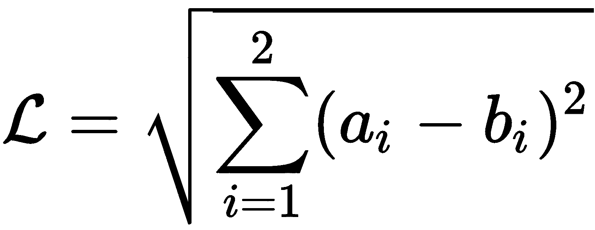

 是损失函数， 是智能体最终位置的坐标，而  是迷宫出口的坐标。在这个实验中，我们考虑了二维迷宫配置，因此坐标有两个值，每个维度一个。

使用之前定义的损失函数，我们现在可以指定适应度函数：

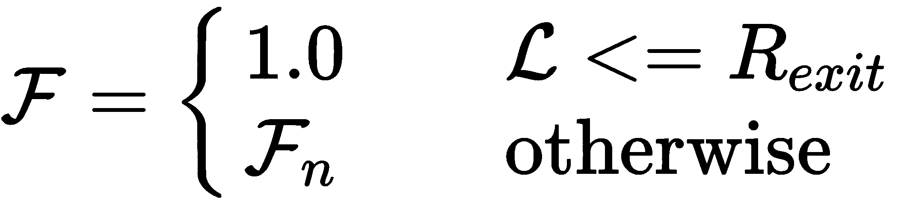

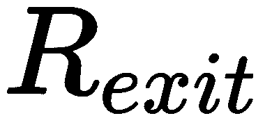 是迷宫出口点周围出口区域的半径，而  是归一化适应度分数。归一化适应度分数的给定如下：

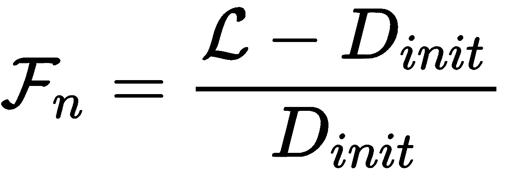

 是导航模拟开始时求解智能体到迷宫出口的初始距离。

该方程将适应度分数归一化到 `(0,1]` 范围内，但在罕见情况下，当智能体的最终位置远离其初始位置和迷宫出口时，可能会产生负值。以下对归一化适应度分数的修正将应用于避免负值：

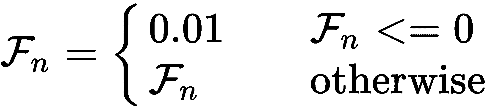

当适应度分数小于或等于 `0.01` 时，它将被赋予支持的最小适应度分数值（`0.01`）；否则，它将按原值使用。我们选择的最小适应度分数高于零，以给每个基因组提供繁殖的机会。

以下 Python 代码实现了以目标为导向的目标函数：

```py
    # Calculate the fitness score based on distance from exit
    fitness = env.agent_distance_to_exit()
    if fitness <= self.exit_range:
         fitness = 1.0
    else:
        # Normalize fitness score to range (0,1]
        fitness = (env.initial_distance - fitness) / \
                   env.initial_distance
        if fitness <= 0.01:
            fitness = 0.01
```

代码首先调用 `agent_distance_to_exit()` 函数，该函数计算当前智能体位置到迷宫出口的欧几里得距离，并使用返回值作为适应度分数的第一个近似值。之后，将适应度分数（到迷宫出口的距离）与出口范围值进行比较。如果适应度分数小于或等于出口范围值，我们将其赋予最终的值 `1.0`。否则，归一化适应度分数通过将智能体到迷宫出口的最终距离与初始距离之差除以初始距离来计算。有时，这可能导致归一化适应度值为负，这可以通过将适应度值与 `0.01` 进行比较并进行必要的修正来纠正。

完整的实现细节请参阅 `maze_environment.py` 脚本。

# 使用简单的迷宫配置运行实验

我们以简单的迷宫配置开始我们关于创建成功迷宫导航智能体的实验。虽然简单的迷宫配置具有之前讨论过的欺骗性 *局部最优死胡同*，但它从起点到出口点的路径相对直接。

以下图表表示了本实验使用的迷宫配置：

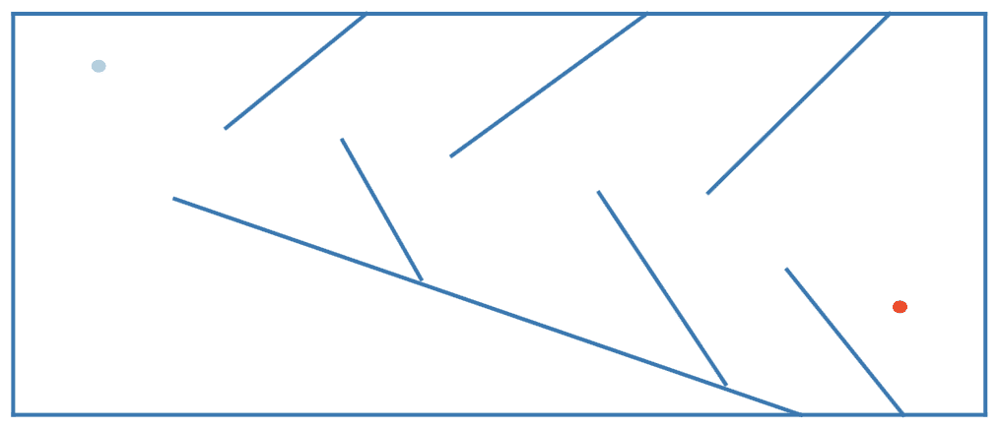

简单的迷宫配置

图中的迷宫有两个特定的位置用实心圆圈标记。左上角的圆圈表示迷宫导航代理的起始位置。右下角的圆圈标记了需要找到的迷宫出口的确切位置。迷宫求解器需要到达由其周围的特定出口范围区域表示的迷宫出口点附近，以完成任务。

# 超参数选择

根据目标函数的定义，通过到达迷宫出口区域可以获得的最大导航代理适应度分数是`1.0`。我们还期望控制器人工神经网络的初始配置比书中前面描述的实验更复杂，这将影响算法的执行速度。因此，在一个中等配置的PC上完成具有显著大量基因组群体的神经进化算法将花费太长时间。但与此同时，当前的任务比以前的实验更复杂，需要使用更宽的搜索区域以成功探索解决方案。因此，通过试错，我们发现可以将种群大小设置为`250`。

以下是从配置文件中摘录的包含我们刚刚讨论的参数定义的部分：

```py
[NEAT]
fitness_criterion = max
fitness_threshold = 1.0
pop_size = 250
reset_on_extinction = False
```

表型人工神经网络的初始配置包括`10`个输入节点、`2`个输出节点和`1`个隐藏节点。输入和输出节点对应于输入传感器和控制信号输出。隐藏节点从神经进化过程开始就引入非线性，并为进化过程节省时间以发现它。人工神经网络配置如下：

```py
num_hidden = 1
num_inputs = 10
num_outputs = 2
```

为了扩展解决方案搜索区域，我们需要提高种群的物种分化，以在有限代数内尝试不同的基因组配置。这可以通过降低兼容性阈值或增加用于计算基因组兼容性分数的系数值来实现。

在这个实验中，我们使用了两种修正，因为适应度函数的地形具有欺骗性，我们需要强调基因组配置中的微小变化以创建新的物种。以下配置参数受到影响：

```py
[NEAT]
compatibility_disjoint_coefficient = 1.1
[DefaultSpeciesSet]
compatibility_threshold = 3.0
```

我们特别关注创建一个迷宫求解控制人工神经网络的最佳配置，该配置具有最少的隐藏节点和连接。通过神经进化过程，最佳人工神经网络配置在迷宫求解模拟器的训练阶段以及推理阶段都更节省计算资源。通过减少添加新节点的可能性，可以产生最佳人工神经网络配置，如下所示，这是从NEAT配置文件中的片段：

```py
node_add_prob          = 0.1
node_delete_prob       = 0.1
```

最后，我们允许神经进化过程不仅利用具有前馈连接的ANN配置，还包括循环连接。通过循环连接，我们使ANN具有记忆功能，成为一个状态机。这对进化过程来说是有益的。以下配置超参数控制了这一行为：

```py
feed_forward            = False
```

本节中描述的超参数被发现对实验中使用的NEAT算法有益，该算法在有限代数内创建了一个成功的迷宫求解代理。

对于简单迷宫求解实验中使用的完整超参数列表，请参阅[https://github.com/PacktPublishing/Hands-on-Neuroevolution-with-Python/blob/master/Chapter5/maze_config.ini](https://github.com/PacktPublishing/Hands-on-Neuroevolution-with-Python/blob/master/Chapter5/maze_config.ini)中的`maze_config.ini`文件。

# 迷宫配置文件

我们的实验迷宫配置以纯文本形式提供。此文件被加载到模拟环境中，相应的迷宫配置便被实例化。配置文件的内容类似于以下内容：

```py
11
30 22
0
270 100
5 5 295 5
295 5 295 135
295 135 5 135
…
```

迷宫配置文件的格式如下：

+   第一行包含迷宫中的墙壁数量。

+   第二行确定代理的起始位置（*x*，*y*）。

+   第三行表示代理的初始航向角度（以度为单位）。

+   第四行包含迷宫出口位置（*x*，*y*）。

+   以下行定义了迷宫的墙壁。迷宫墙壁的数量由文件中的第一个数字给出。

迷宫墙壁以线段的形式呈现，前两个数字定义了起点的坐标，最后两个数字确定了终点的坐标。代理的起始位置和迷宫出口以两个数字的形式表示，这两个数字指示了二维空间中某点的 *x* 和 *y* 坐标。

# 工作环境设置

使用以下命令在您选择的终端应用程序中设置简单迷宫求解实验的工作环境：

```py
$ conda create --name maze_objective_neat python=3.5
$ conda activate maze_objective_neat
$ pip install neat-python==0.92 
$ conda install matplotlib
$ conda install graphviz
$ conda install python-graphviz
```

这些命令使用Python 3.5创建并激活了一个`maze_objective_neat`虚拟环境。之后，安装了版本为0.92的NEAT-Python库，以及我们可视化工具所用的其他依赖。

之后，我们就可以开始实验运行器的实现了。

# 实验运行器实现

实验运行器在`maze_experiment.py`文件中实现，您应该参考该文件以获取完整的实现细节。此Python脚本提供了读取命令行参数、配置和启动神经进化过程以及完成后渲染实验结果的功能。它还包括评估属于特定群体的基因组健壮性的回调函数的实现。这些回调函数将在初始化NEAT-Python库环境时提供。

此外，我们讨论了实验运行器实现中的关键部分，这些部分在本章之前未涉及：

1.  我们首先使用以下行初始化迷宫模拟环境：

```py
    maze_env_config = os.path.join(local_dir, '%s_maze.txt' % 
                                   args.maze)
    maze_env = maze.read_environment(maze_env_config)
```

`args.maze` 指的是用户在启动Python脚本时提供的命令行参数，它指的是我们想要实验的迷宫环境类型。它可以有两个值：*中等*和*困难*。前者指的是我们在本次实验中使用的简单迷宫配置。

1.  之后，我们为随机数生成器设置了特定的种子数，创建了NEAT配置对象，并使用创建的配置对象创建了`neat.Population`对象：

```py
    seed = 1559231616
    random.seed(seed)
    config = neat.Config(neat.DefaultGenome, 
                         neat.DefaultReproduction,
                         neat.DefaultSpeciesSet, 
                         neat.DefaultStagnation,
                         config_file)
    p = neat.Population(config)
```

偶然的是，在双杆平衡实验中找到的随机种子值也适用于这个实验。我们可以假设我们找到了一个针对NEAT-Python库实现的随机过程的特定随机吸引子。在本书的后面，我们将检查这同样适用于其他实验。

1.  现在我们已经准备好创建适当的迷宫模拟环境，并将其存储为全局变量，以简化从健身评估回调函数中对它的访问：

```py
    global trialSim
    trialSim = MazeSimulationTrial(maze_env=maze_env, 
                                   population=p)
```

`MazeSimulationTrial`对象包含字段，提供对原始迷宫模拟环境和用于保存迷宫求解代理评估结果的记录存储器的访问。在每次调用健身评估回调函数`eval_fitness(genome_id, genome, config, time_steps=400)`时，原始迷宫模拟环境将被复制，并将用于特定求解代理在400个时间步内进行迷宫求解模拟。之后，将从环境中收集关于迷宫求解代理的完整统计数据，包括其在迷宫中的最终位置，并将其添加到记录存储器中。

1.  以下代码已成为我们实验的标准，它与添加各种统计报告器相关：

```py
    p.add_reporter(neat.StdOutReporter(True))
    stats = neat.StatisticsReporter()
    p.add_reporter(stats)
    p.add_reporter(neat.Checkpointer(5, 
                 filename_prefix='%s/maze-neat-checkpoint-' % 
                 trial_out_dir))
```

报告器用于在控制台显示神经进化过程的中间结果，以及收集在过程完成后将渲染的更详细统计数据。

1.  最后，我们运行指定代数的神经进化过程，并检查是否找到了解决方案：

```py
    start_time = time.time()
    best_genome = p.run(eval_genomes, n=n_generations)
    elapsed_time = time.time() - start_time
    solution_found = (best_genome.fitness >= \
                      config.fitness_threshold)
    if solution_found:
        print("SUCCESS: The stable maze solver controller was found!!!")
    else:
        print("FAILURE: Failed to find the stable maze solver controller!!!")
```

我们假设如果NEAT-Python库返回的最佳基因组的适应性评分大于或等于配置文件中设置的适应性阈值值（`1.0`），则已找到解决方案。计算已用时间以打印完成过程所需的时间。

# 基因组适应性评估

评估属于特定生物种群的所有基因组的适应性评分的回调函数实现如下：

```py
def eval_genomes(genomes, config):
    for genome_id, genome in genomes:
        genome.fitness = eval_fitness(genome_id, genome, config)
```

`eval_fitness(genome_id, genome, config)`函数通过运行迷宫求解模拟来评估特定基因组的适应性。此函数的实现在此处未提供，因为它已在本章中讨论过。

# 运行简单迷宫导航实验

在实现了迷宫求解模拟器、实验运行器和适应性评估回调函数之后，我们就可以开始迷宫求解实验了。请确保你将所有相关的Python脚本和配置文件（`maze_config.ini`和`medium_maze.txt`）复制到工作目录中。

然后，进入此目录并从你选择的终端应用程序中执行以下命令：

```py
$ python maze_experiment.py -m medium -g 150
```

不要忘记使用以下命令激活适当的虚拟环境：

`conda activate maze_objective_neat`

之前的命令从`medium_maze.txt`文件加载简单迷宫配置并创建相应的迷宫模拟环境。之后，它启动了在NEAT算法控制下的神经进化过程，使用`maze_config.ini`文件中指定的超参数。NEAT算法使用迷宫求解模拟环境来评估神经进化过程中产生的每个基因组的适应性，共150代。

（命令行参数中的`-g`）。

经过144代的进化后，在145代找到了成功的迷宫求解代理。最后一代的控制台输出如下：

1.  首先，关于基因组种群的一般统计信息：

```py
****** Running generation 145 ****** 

Maze solved in 388 steps
Population's average fitness: 0.24758 stdev: 0.25627
Best fitness: 1.00000 - size: (3, 11) - species 7 - id 35400

Best individual in generation 145 meets fitness threshold - complexity: (3, 11)
```

1.  其次，配置编码成功迷宫求解控制器ANN的基因组：

```py
Best genome:
Key: 35400
Fitness: 1.0
Nodes:
 0 DefaultNodeGene(key=0, bias=5.534849614521037, response=1.0, activation=sigmoid, aggregation=sum)
 1 DefaultNodeGene(key=1, bias=1.8031133229851957, response=1.0, activation=sigmoid, aggregation=sum)
 158 DefaultNodeGene(key=158, bias=-1.3550878188609456, response=1.0, activation=sigmoid, aggregation=sum)
Connections:
 DefaultConnectionGene(key=(-10, 158), weight=-1.6144052085440168, enabled=True)
 DefaultConnectionGene(key=(-8, 158), weight=-1.1842193888036392, enabled=True)
 DefaultConnectionGene(key=(-7, 0), weight=-0.3263706518456319, enabled=True)
 DefaultConnectionGene(key=(-7, 1), weight=1.3186165993348418, enabled=True)
 DefaultConnectionGene(key=(-6, 0), weight=2.0778575294986945, enabled=True)
 DefaultConnectionGene(key=(-6, 1), weight=-2.9478037554862824, enabled=True)
 DefaultConnectionGene(key=(-6, 158), weight=0.6930281879212032, enabled=True)
 DefaultConnectionGene(key=(-4, 1), weight=-1.9583885391583729, enabled=True)
 DefaultConnectionGene(key=(-3, 1), weight=5.5239054588484775, enabled=True)
 DefaultConnectionGene(key=(-1, 0), weight=0.04865917999517305, enabled=True)
 DefaultConnectionGene(key=(158, 0), weight=0.6973191076874032, enabled=True)
SUCCESS: The stable maze solver controller was found!!!
Record store file: out/maze_objective/medium/data.pickle
```

在控制台输出中，你可以看到在进化过程中找到了成功的迷宫求解控制器，并且能够在400步中达到迷宫出口区域，共388步。成功迷宫求解控制器的控制ANN配置包括2个输出节点和1个隐藏节点，节点之间和从输入到节点之间有11个连接。控制器ANN的最终配置如下所示：

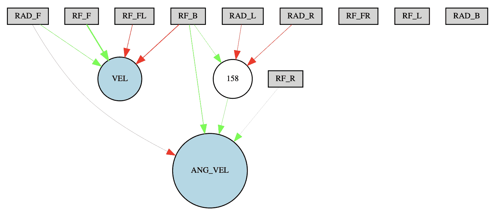

控制简单迷宫求解成功求解器的ANN配置

研究不同传感器输入如何影响输出控制信号是非常有趣的。我们可以看到，神经网络配置完全忽略了来自前方和左侧测距仪传感器（**RF_FR** 和 **RF_L**）以及来自机器人后向饼形雷达传感器（**RAD_B**）的输入。同时，机器人的线性和角速度由其他传感器的独特组合控制。

此外，我们可以通过隐藏节点看到左右饼形雷达传感器（**RAD_L** 和 **RAD_R**）与后向测距仪（**RF_B**）的聚合，该节点随后将聚合信号传递给控制角速度的节点。如果我们看看本章中显示的简单迷宫配置图像（参见简单迷宫配置图像），这种聚合看起来相当自然。这使得当机器人陷入死胡同，局部最优解所在之处时，它可以转身并继续探索迷宫。

在这里展示了求解代理的适应度分数随代数的变化：

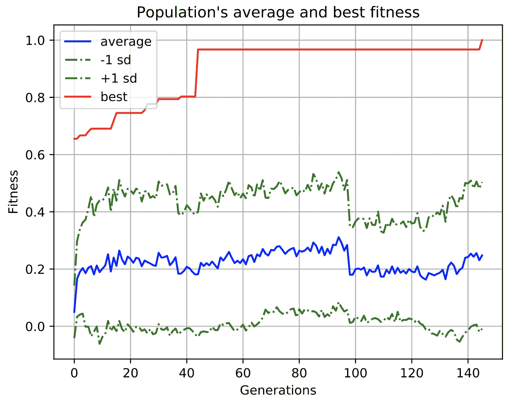

各代平均适应度分数

在这个图中，我们可以看到进化过程在第 `44` 代成功产生了具有适应度分数 **0.96738** 的迷宫求解代理。但要经过额外的 `100` 代才能进化出编码成功迷宫求解者代理的神经网络的基因组。

此外，值得注意的是，在第 `44` 代性能提升是由物种 ID 为 `1` 的物种产生的，但成功迷宫求解者的基因组属于 ID 为 `7` 的物种，这在第一次峰值时甚至还不为人知。产生冠军物种的物种在第 `12` 代出现，并一直保留在种群中，保留了有益的突变并对其进行了完善。

在以下图中展示了各代物种分化：

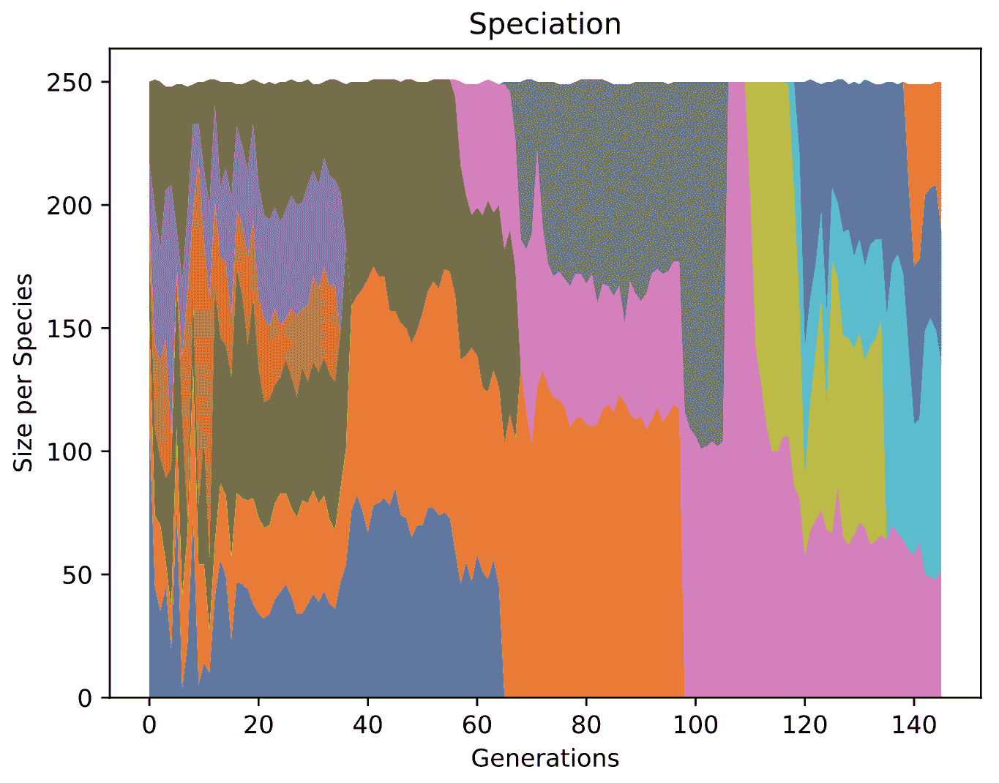

各代物种分化

在物种分化图中，我们可以看到用粉红色标记的 ID 为 `7` 的物种。这个物种在进化过程中最终产生了成功迷宫求解者的基因组。物种 7 的大小在其生命周期中变化很大，一度在几代（从 `105` 到 `108`）中成为整个种群中唯一的物种。

# 代理记录可视化

在这个实验中，我们提出了一种新的可视化方法，使我们能够直观地辨别进化过程中各种物种的性能。可视化可以通过以下命令执行，该命令在实验的工作目录中执行：

```py
$ python visualize.py -m medium -r out/maze_objective/medium/data.pickle --width 300 --height 150
```

命令加载了每个迷宫解决代理在进化过程中的适应度评估记录，这些记录存储在`data.pickle`文件中。之后，它将在迷宫解决模拟结束时在迷宫地图上绘制代理的最终位置。每个代理的最终位置以颜色编码的圆圈表示。圆圈的颜色编码了特定代理所属的物种。进化过程中产生的每个物种都有一个独特的颜色编码。以下图表显示了可视化结果：


解决代理评估的可视化

为了使可视化更具信息量，我们引入了适应度阈值来过滤掉表现最出色的物种。顶部子图显示了冠军物种（适应度分数高于**0.8**）所属的解决代理的最终位置。正如你所见，属于这六个物种的有机体是活跃的探险者，它们具有在迷宫中搜索未知地方的基因。它们的最终位置几乎均匀地分布在起始点周围的迷宫区域内，并且在局部最优的*死胡同*处密度较低。

同时，你可以在底部子图中看到，进化失败的个体表现出更保守的行为，主要集中在新区域的墙壁附近以及最强的局部最优区域——迷宫底部的最大死胡同。

# 练习

1.  尝试在`maze_config.ini`文件中增加`compatibility_disjoint_coefficient`参数，并使用新设置运行实验。这种修改对进化过程中产生的物种数量有何影响？神经进化过程能否找到成功的迷宫解决者？

1.  将种群大小增加200%（`pop_size`参数）。在这种情况下，神经进化过程能否找到解决方案？如果能，需要多少代？

1.  改变随机数生成器的种子值（见`maze_experiment.py`文件的第118行）。使用这个新值，神经进化过程能否成功？

# 使用难以解决的迷宫配置运行实验

本章的下一个实验是运行神经进化过程，以找到能够解决具有更复杂墙壁配置的迷宫的代理。这个难以解决的迷宫配置引入了强大的局部适应度最优陷阱，并且从代理的起始位置到迷宫出口区域没有直接的路线。你可以在以下图表中看到迷宫配置：

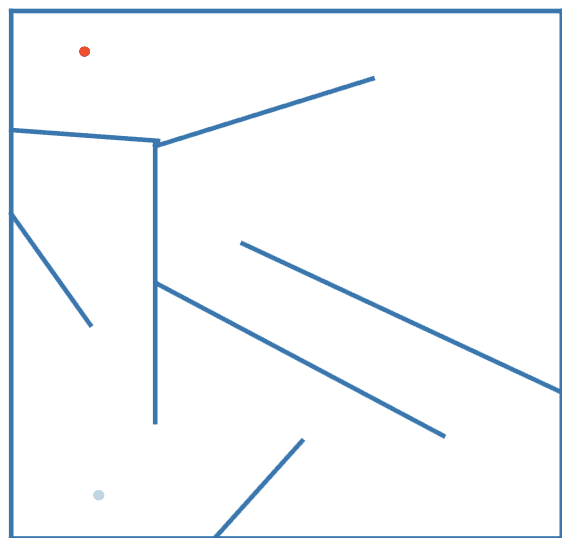

难以解决的迷宫配置

迷宫配置的起始位置在左下角，用绿色圆圈标记，迷宫出口点的位置在左上角，用红色圆圈标记。你可以看到，为了解决迷宫，导航代理必须发展一种复杂控制策略，使其能够避开起点的局部适应度最优陷阱。控制策略需要能够遵循从起点到出口的复杂轨迹，该轨迹有几个转弯和更多的局部最优陷阱。

# 超参数选择

对于这个实验，我们将使用与简单迷宫求解实验中相同的超参数。我们的想法是让神经进化算法具有相同的初始条件，并观察它是否能够进化出一个成功的求解代理代理，用于不同的、更复杂的迷宫配置。这将表明算法使用不同迷宫配置的超参数设置进行泛化的程度。

# 工作环境设置和实验运行实现

简单迷宫导航实验的工作环境设置与实验运行实现保持相同。实验运行实现也保持不变。我们只更改描述迷宫环境配置的文件。

# 运行难以解决的迷宫导航实验

正如我们提到的，我们将使用与之前实验相同的实验运行实现和相同的NEAT超参数设置。但我们将配置不同的迷宫环境如下：

```py
$ python maze_experiment.py -m hard -g 500
```

过了一段时间，当实验结束后，我们发现即使经过`500`代的进化，仍未找到成功的迷宫求解器。使用神经进化算法获得的最佳基因组编码了一个奇特且非功能性的控制器ANN配置，如下图所示：

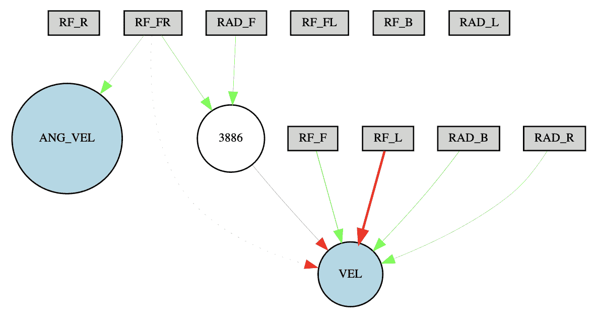

控制难以解决的迷宫求解器的ANN配置

从图中可以看出，机器人的旋转仅依赖于前视测距传感器（**RF_FR**），而线性运动则由多个测距传感器和雷达传感器的组合控制。这种控制配置导致机器人的线性运动在检测到前方有墙壁之前被简化。当我们查看代理评估记录的可视化时，我们的关于运动模式的假设得到了证实：

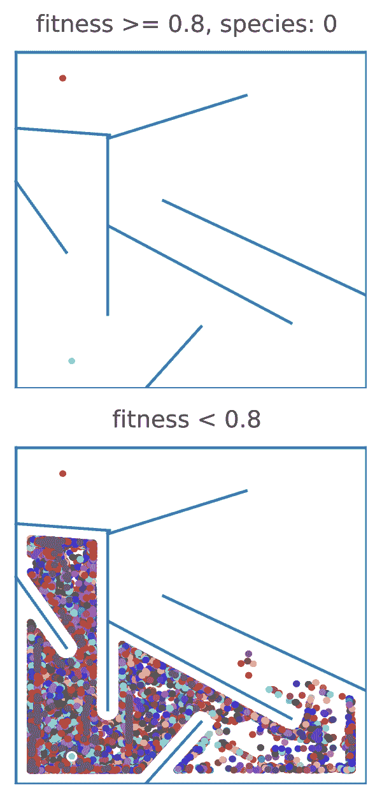

求解代理评估记录的可视化

求解代理最终位置的可视化表明，大多数物种被困在起始位置周围，那里有一些局部适应度得分最优区域。没有任何物种能够显示出超过我们阈值（**0.8**）的适应度得分。此外，正如我们之前提到的，求解代理的最终位置形成了明显的垂直线（灰色点形成垂直列）。这证实了我们在进化过程中找到的最佳基因组编码的控制器ANN配置不正确这一假设。

在以下图表中显示了多代平均适应度得分：

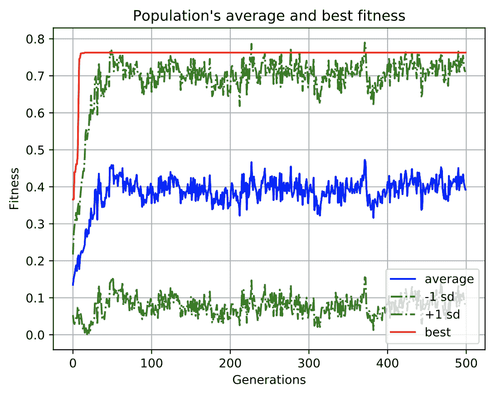

多代平均适应度得分

在平均适应度得分的图表中，我们可以看到神经进化过程能够在第一代中显著提高求解代理的适应度得分，但之后达到了一个平台期，没有显示出任何改进。这意味着增加进化代数数量没有任何意义，需要采取其他措施来提高神经进化过程的表现。

# 练习

1.  尝试通过调整`maze_config.ini`文件中的`pop_size`参数来增加种群大小。这有助于神经进化过程进化出一个成功的迷宫求解器吗？

这可能需要很长时间才能执行。

# 摘要

在本章中，你了解了一类使用具有欺骗性定义景观的目标导向适应度函数的规划和控制问题。在这个景观中，由适应度函数的局部最优区域创建了多个陷阱，误导了解决搜索过程，该过程仅基于作为代理到目标距离的导数的适应度得分。你了解到传统的目标导向适应度函数可以帮助搜索过程为简单的迷宫配置创建一个成功的迷宫导航代理，但由于局部最优陷阱，在更复杂的迷宫中失败了。

我们提出了一种有用的可视化方法，使我们能够可视化迷宫地图上所有评估代理的最终位置。通过这种可视化，你可以对进化过程的性能做出假设。然后，你可以做出关于配置设置更改的决定，这可能导致进一步的性能提升。

此外，你已经了解到，当局部最优解中适应度函数收敛的可能性更高时，神经进化过程往往会产生更少的物种。在极端情况下，它只创建一个物种，这阻碍了创新并阻碍了进化过程。为了避免这种情况，你学习了如何通过改变兼容性不交系数的值来加速物种形成，该系数用于计算基因组兼容性因子。这个系数控制着将被分配给比较的基因组中过剩或不交部分的权重。较高的系数值增加了比较基因组中拓扑差异的重要性，并允许更多样化的基因组属于同一物种。

在下一章中，我们将介绍NS优化方法，该方法在解决诸如迷宫导航等欺骗性任务方面表现更佳。
