# 第十章：基于超立方的NEAT用于视觉辨别

在本章中，你将了解基于超立方体的NEAT算法背后的主要概念以及它旨在解决的主要挑战。我们将探讨在尝试使用直接基因组编码与大规模**人工神经网络**（**ANN**）时出现的问题，以及如何通过引入间接基因组编码方案来解决这些问题。你将学习如何使用**组合模式生成**网络（**CPPN**）以极高的压缩率存储基因组编码信息，以及HyperNEAT算法如何使用CPPNs。最后，你将通过实际示例了解HyperNEAT算法的强大功能。

在本章中，我们将讨论以下主题：

+   使用NEAT直接编码大规模自然网络的问题，以及HyperNEAT如何通过引入间接编码方法来帮助解决这个问题

+   使用NEAT进化CPPN以探索超立方体中的几何规律，这使我们能够高效地编码目标ANN中的连接模式

+   如何使用HyperNEAT方法在视觉场中检测和识别对象

+   视觉辨别实验的目标函数定义

+   讨论视觉辨别实验结果

# 技术要求

为了执行本章中描述的实验，以下技术要求应得到满足：

+   Windows 8/10，macOS 10.13或更高版本，现代Linux

+   Anaconda Distribution版本2019.03或更高版本

本章的代码可以在[https://github.com/PacktPublishing/Hands-on-Neuroevolution-with-Python/tree/master/Chapter7](https://github.com/PacktPublishing/Hands-on-Neuroevolution-with-Python/tree/master/Chapter7)找到

# 使用CPPNs间接编码ANN

在前几章中，你学习了使用自然启发式的基因型概念直接编码人工神经网络（ANN），该基因型以`1:1`的比例映射到表型以表示ANN拓扑结构。这种映射使我们能够使用先进的NEAT算法特性，如创新编号，它允许我们在进化过程中跟踪特定突变何时被引入。基因组中的每个基因都有一个特定的创新编号值，这使得快速准确地交叉父代基因组以产生后代成为可能。虽然这一特性带来了巨大的好处并减少了在重组过程中匹配父代基因组所需的计算成本，但用于编码表型ANN拓扑结构的直接编码方法有一个显著的缺点，即它限制了编码ANN的大小。编码的ANN越大，在进化过程中评估的基因组就越大，这涉及到巨大的计算成本。

有许多任务，主要与图像或其他高维数据源中的模式识别相关，需要使用具有许多层和节点的高级拓扑结构的ANN。由于之前讨论的直接编码的低效性，这种拓扑配置不能被经典的NEAT算法有效地处理。

为了解决这一缺点，同时保留NEAT算法提供的所有优点，提出了编码表型ANN的新方法。我们将在下一节中讨论它。

# CPPN编码

提出的编码方案采用了一种通过查询另一个专门神经网络来表示表型ANN中连接模式的方法，该专门神经网络关于节点之间连接的权重。这个专门神经网络被称为**CPPN**。其主要任务是将其几何作为函数来表示表型ANN的连接模式。生成的连接模式表示为一个四维超立方体。超立方体的每个点编码了表型ANN中两个相关节点之间的连接，并由四个数字描述：源节点的坐标和目标节点的坐标。连接性CPPN将超立方体的每个点作为输入，并计算表型ANN中每个节点之间的连接权重。此外，如果CPPN返回的连接权重的大小小于一个最小阈值（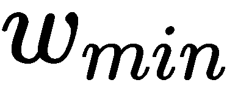），则两个节点之间的连接不会表示。因此，我们可以将连接性CPPN定义为返回连接权重的四维函数，如下公式所示：

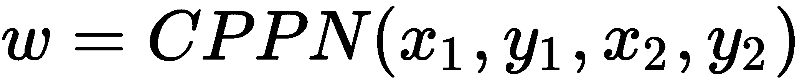

表型ANN的源节点位于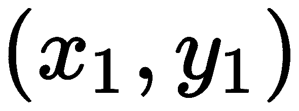，目标节点位于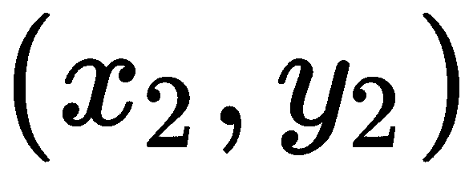。

CPPN的另一个基本特征是，与仅使用一种激活函数（通常来自Sigmoid函数族）的常规ANN不同，CPPN可以使用多个几何函数作为节点激活器。因此，CPPNs可以在生成的连接模式中表达丰富的几何模式：

+   对称性（高斯函数）

+   不完美的对称性（高斯函数与不对称坐标框架相结合）

+   重复（正弦函数）

+   变化中的重复（正弦函数与不重复的坐标框架相结合）

考虑到我们讨论的CPPN的特征，我们可以假设它产生的连接模式可以表示表型ANN的任何网络拓扑。此外，连接模式可以通过在训练数据中发现规律并重复使用CPPN中的同一组基因来编码表型ANN中的重复来编码大规模拓扑。

# 基于超立方体的增强拓扑结构神经进化

上一个章节中描述的方法是由Kenneth O. Stanley发明的，被称为**基于超立方体的** **增强拓扑神经进化**（**HyperNEAT**）。正如其名称所暗示的，它是NEAT算法的扩展，我们已经在本书中使用过。这两种方法之间的主要区别是HyperNEAT方法使用基于CPPN的间接编码方案。在进化过程中，HyperNEAT方法使用NEAT算法进化一个基因组种群，这些基因组编码了连接CPPN的拓扑结构。之后，每个创建的CPPN都可以用来在特定表型ANN中建立连接模式。最后，表型ANN可以针对问题空间进行评估。

到目前为止，我们已经讨论了如何使用带有CPPN的NEAT进化连接模式，并将其应用于表型ANN的节点。然而，我们还没有提到节点几何布局最初是如何确定的。定义节点及其位置（布局）的责任分配给了人类建筑师。建筑师分析问题空间，并利用最合适的布局。

按照惯例，表型ANN节点的初始布局有一个名称：基质。存在几种基质配置（布局）类型，并且它们已经证明在特定任务中的效率：

+   **二维网格**：以(0,0)为中心的两维笛卡尔空间中的网络节点规则网格。

+   **三维网格**：以(0,0,0)为中心的三维笛卡尔空间中的网络节点规则网格。

+   **状态空间三明治**：两个二维平面网格，其中包含相应的源节点和目标节点，其中一个层只能向另一个层的方向发送连接。

+   **圆形**：一种适合基于极坐标定义径向几何规律性的规则径向结构。

通过在基质上适当地排列ANN节点，可以利用问题空间几何中的规律性。这通过使用连接CPPN在基质节点之间绘制连接模式，显著提高了编码的效率。现在让我们看看视觉辨别实验的基础。

关于HyperNEAT方法的更多细节，请参阅[第1章](f59c6396-55e5-4495-95c0-7af9a42c2f20.xhtml)，*神经进化方法概述*。

# 视觉辨别实验基础

正如我们已经提到的，HyperNEAT算法使用的间接编码的主要优势是能够编码大规模人工神经网络（ANN）的拓扑结构。在本节中，我们将描述一个可以用来测试HyperNEAT方法训练大规模ANN能力的实验。由于输入数据（图像高度乘以图像宽度）的高维性，视觉模式识别任务通常需要大型的ANN作为检测器。在本章中，我们考虑这一系列计算机科学问题中的一个变体，称为视觉识别任务。

视觉识别任务的目的是在二维视觉空间中区分大物体和小物体，无论它们在视觉空间中的位置以及它们相对于彼此的位置。视觉识别任务由一个专门的判别器ANN执行，该ANN建立在配置为状态空间三明治的两层底座上：

+   视觉场是一个二维传感器数组，可以处于两种状态：开启或关闭（黑白）。

+   目标域是一个二维输出数组，其激活值在`[0,1]`范围内。

视觉识别任务的方案如下所示：

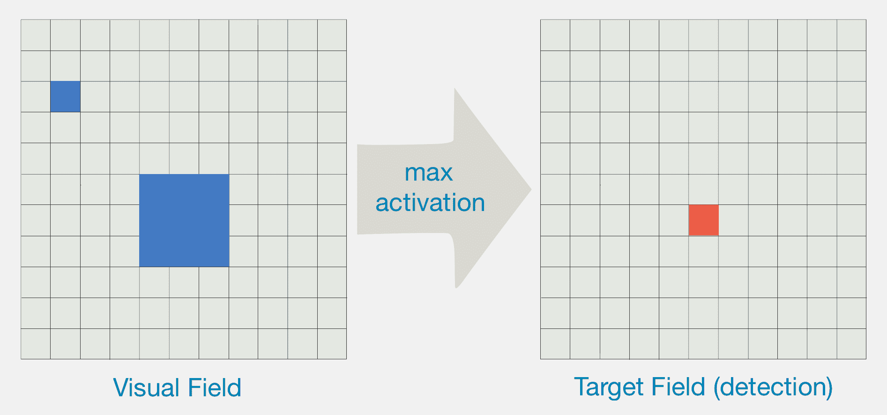

视觉识别任务

你可以在图中看到，要检测的对象被表示为两个由空隙分隔的正方形。较大的对象恰好比另一个大两倍。我们试图构建的算法需要检测较大对象的中心。检测基于测量目标场中ANN节点的激活值。激活值最高的节点的位置标志着检测到的对象的中心。我们的目标是发现视觉场和目标场之间正确的连接模式，使激活值最高的输出节点与视觉场中较大对象的中心对齐。此外，发现的连接模式应不受两个对象相对位置的影响。

用于视觉识别任务的算法需要评估大量输入——代表视觉场中细胞值的数值。此外，成功的算法还需要发现能够同时处理多个细胞输入的策略。这种策略应基于一个普遍原则，即允许检测视觉场中物体的大小相对值。在我们的实验中，视觉场被表示为一个二维网格。因此，要发现的普遍几何原则是局部性概念。

我们可以通过在视觉场和目标场节点连接方案中发现的特定模式来利用我们选择的辨别器ANN衬底配置中的局部性原理。在这个连接方案中，视觉场的单独节点连接到目标场特定位置周围的多个相邻输出节点。因此，输出节点收集的激活越多，通过连接向它提供的信号就越多。

为了有效地利用之前提到的局部性原理，连接的表示应考虑辨别器ANN衬底的几何形状以及正确的连接模式在整个衬底上重复的事实。这种表示的最佳候选者是CPPN，它一旦发现局部连接模式，就可以在任何分辨率上重复它在衬底网格上的模式。

# 目标函数定义

视觉辨别器的主要任务是正确确定较大物体的位置，无论两个物体的相对位置如何。因此，我们可以定义目标函数来指导神经进化过程。目标函数应基于视觉场中较大物体确切位置与其在目标场中预测位置之间的欧几里得距离。

损失函数可以直接表示为实际位置和预测位置之间的欧几里得距离，如下所示：

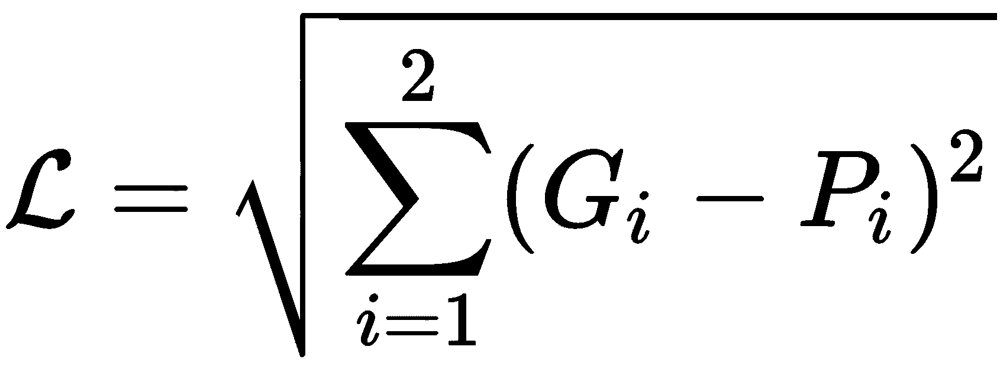

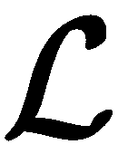 是损失函数，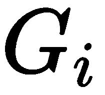 是大物体的真实坐标，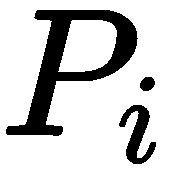 是由辨别器ANN预测的坐标。

使用之前定义的损失函数，我们可以将目标函数写为以下形式：

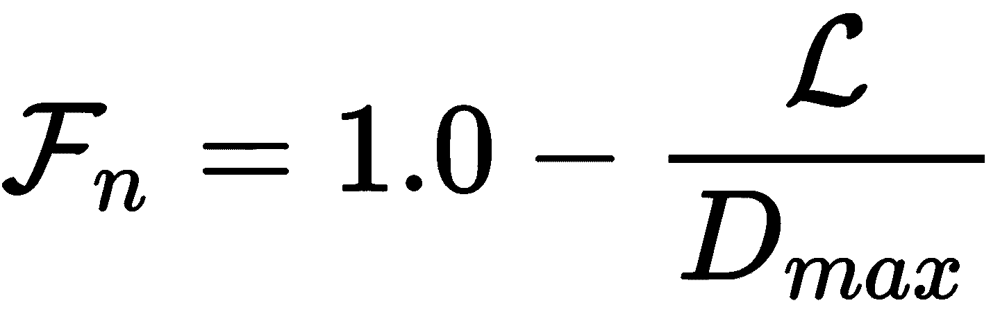

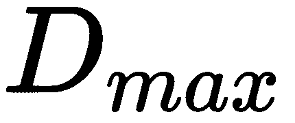 是目标场空间内两点之间的最大可能距离。目标函数公式保证了计算出的适应度分数（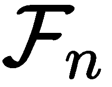）始终落在 `[0,1]` 范围内。现在我们了解了视觉辨别实验的基本知识，让我们开始设置它。

# 视觉辨别实验设置

在我们的实验中，在辨别器ANN的训练过程中，我们使用视觉场和目标场的分辨率固定在 11 x 11。因此，连接的CPPN必须学习视觉场121个输入和目标场121个输出之间的正确连接模式，这导致总共14,641个潜在的连接权重。

下图显示了辨别器ANN衬底的方案：

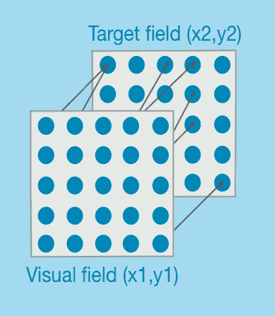

辨别器ANN的状态空间夹层衬底

图中所示的判别器ANN具有两层，每层由形成二维平面网格的节点组成。连接性CPPN通过连接来自一个层的节点到另一个层的节点来绘制连接模式。

在进化的每一代中，种群中的每个个体（编码CPPN的基因组）都会对其创建判别器ANN连接模式的能力进行评估。然后测试判别器ANN是否能够在视觉场内找到大物体的中心。对于特定的ANN，总共有75次评估试验，其中每个试验中放置两个物体在不同的位置。在每个试验中，我们在视觉场中均匀分布的25个位置之一放置一个小物体。大物体的中心在小物体的右侧、下方或对角线方向五步之遥。如果大物体不能完全放入视觉场中，则它将绕到另一侧。因此，考虑到物体相对于彼此和网格的放置逻辑，我们应该能够在75次试验中评估所有可能的配置。

我们的实验设置有两个主要部分，我们将在接下来的几节中讨论。

# 视觉判别器测试环境

首先，我们需要定义测试环境并提供对数据集的访问，该数据集包含上一节中描述的所有可能的视觉场配置。本实验中使用的数据集是在测试环境初始化期间创建的。我们将在本节的后面讨论数据集的创建。

测试环境有两个主要组件：

+   维护视觉场定义的数据结构

+   测试环境管理器，它存储数据集，并提供一种方法来评估判别器ANN相对于它的性能

接下来，我们将详细描述这些组件。

# 视觉场定义

我们在`VisualField` Python类中存储了之前讨论的75次试验中每个试验的视觉场配置。它具有以下构造函数：

```py
    def __init__(self, big_pos, small_pos, field_size):
        self.big_pos = big_pos
        self.small_pos = small_pos
        self.field_size = field_size
        self.data = np.zeros((field_size, field_size))

        # store small object position
        self._set_point(small_pos[0], small_pos[1])

        # store big object points
        offsets = [-1, 0, 1]
        for xo in offsets:
            for yo in offsets:
                self._set_point(big_pos[0] + xo, big_pos[1] + yo)
```

`VisualField`的构造函数接受一个包含大物体和小物体坐标（`x`，`y`）的元组，以及视觉场的大小。我们考虑的是正方形视觉场，因此视觉场沿每个轴的大小相等。视觉场在内部表示为一个二维二进制数组，其中1表示被物体占据的位置，而0是空空间。它存储在`self.data`字段中，这是一个形状为（2，2）的NumPy数组。

小物体的大小为1 x 1，大物体是它的三倍大。以下是从构造函数源代码中创建大物体表示的片段：

```py
        offsets = [-1, 0, 1]
        for xo in offsets:
            for yo in offsets:
                self._set_point(big_pos[0] + xo, big_pos[1] + yo)
```

`VisualField`类的构造函数接收大物体中心的坐标作为元组（`x`，`y`）。前面的代码从左上角（`x-1`，`y-1`）开始绘制大物体，并结束于右下角（`x+1`，`y+1`）。

前面代码中提到的`_set_point(self, x, y)`函数在`self.data`字段中的特定位置设置`1.0`值：

```py
    def _set_point(self, x, y):
        px, py = x, y
        if px < 0:
            px = self.field_size + px
        elif px >= self.field_size:
            px = px - self.field_size

        if py < 0:
            py = self.field_size + py
        elif py >= self.field_size:
            py = py - self.field_size

        self.data[py, px] = 1 # in Numpy index is: [row, col]
```

`_set_point(self, x, y)`函数在坐标值超过每轴允许的维度数时执行坐标包裹。例如，对于`x`轴，坐标值包裹的源代码如下：

```py
        if px < 0:
            px = self.field_size + px
        elif px >= self.field_size:
            px = px - self.field_size
```

沿着`y`轴的坐标包裹源代码类似。

在需要的情况下，在函数参数指定的坐标包裹后，我们将`self.data`字段中相应的位置设置为`1.0`值。

NumPy索引为`[行, 列]`。因此，我们需要在索引的第一个位置使用`y`，在第二个位置使用`x`。

# 可视判别环境

可视判别环境持有带有视觉场定义的生成数据集。它还提供了创建数据集和评估判别器ANN相对于数据集的方法。`VDEnvironment` Python类包含了所有提到的方法定义，以及相关的数据结构。接下来，我们将查看`VDEnvironment`类定义的所有重要部分：

+   类构造函数定义如下：

```py
    def __init__(self, small_object_positions, big_object_offset, 
                 field_size):
        self.s_object_pos = small_object_positions
        self.data_set = []
        self.b_object_offset = big_object_offset
        self.field_size = field_size

        self.max_dist = self._distance((0, 0), 
                             (field_size - 1, field_size - 1))

        # create test data set
        self._create_data_set()
```

`VDEnvironment`构造函数的第一个参数是一个数组，包含所有可能的小物体位置的定义，作为每个轴上坐标值的序列。第二个参数定义了大物体中心坐标相对于小物体坐标的偏移量。在我们的实验中，我们使用`5`作为此参数的值。最后，第三个参数是视觉场的大小，包括两个维度。

在所有接收到的参数都保存到对象字段后，我们计算视觉场中两点之间的最大可能距离如下：

```py
self.max_dist = self._distance((0, 0), 
                     (field_size - 1, field_size - 1))
```

可视场左上角和右下角之间的欧几里得距离随后存储在`self.max_dist`字段中。此值将用于后续通过保持它们在`[0, 1]`范围内来归一化视觉场中点之间的距离。

+   `_create_data_set()`函数根据指定的环境参数创建所有可能的数据集。此函数的源代码如下：

```py
    def _create_data_set(self):
        for x in self.s_object_pos:
            for y in self.s_object_pos:
                # diagonal
                vf = self._create_visual_field(x, y, 
                                  x_off=self.b_object_offset, 
                                  y_off=self.b_object_offset)
                self.data_set.append(vf)
                # right
                vf = self._create_visual_field(x, y, 
                                  x_off=self.b_object_offset,
                                  y_off=0)
                self.data_set.append(vf)
                # down
                vf = self._create_visual_field(x, y, 
                                  x_off=0, 
                                  y_off=self.b_object_offset)
                self.data_set.append(vf)
```

函数遍历两个轴上的小物体位置，并尝试在相对于小物体坐标的右侧、下方或对角线位置创建大物体。

+   `_create_visual_field` 函数使用小物体的坐标（`sx`，`sy`）和大物体中心偏移量（`x_off`，`y_off`）创建适当的视觉场配置。以下源代码显示了如何实现这一点：

```py
    def _create_visual_field(self, sx, sy, x_off, y_off):
        bx = (sx + x_off) % self.field_size # wrap by X coordinate
        by = (sy + y_off) % self.field_size # wrap by Y coordinate

        # create visual field
        return VisualField(big_pos=(bx, by), small_pos=(sx, sy), 
                           field_size=self.field_size)
```

如果前面函数计算的大物体坐标超出了视觉场空间，我们按以下方式应用包装：

```py
        if bx >= self.field_size:
            bx = bx - self.field_size # wrap
```

前面的代码片段显示了沿 `x` 轴的包装。沿 `y` 轴的包装类似。最后，创建并返回 `VisualField` 对象以附加到数据集中。

+   然而，`VDEnvironment` 定义中最激动人心的部分与判别器 ANN 的评估有关，该评估在 `evaluate_net(self, net)` 函数中定义如下：

```py
    def evaluate_net(self, net):
        avg_dist = 0

        # evaluate predicted positions
        for ds in self.data_set:
            # evaluate and get outputs
            outputs, x, y = self.evaluate_net_vf(net, ds)

            # find the distance to the big object
            dist = self._distance((x, y), ds.big_pos)
            avg_dist = avg_dist + dist

        avg_dist /= float(len(self.data_set))

        # normalized position error
        error = avg_dist / self.max_dist
        # fitness
        fitness = 1.0 - error

        return fitness, avg_dist
```

前面的函数接收判别器人工神经网络（ANN）作为参数，并返回评估的适应度分数以及所有评估视觉场中检测到的目标坐标与计算的所有真实值之间的平均距离。平均距离的计算如下：

```py
        for ds in self.data_set:
            # evaluate and get outputs
            _, x, y = self.evaluate_net_vf(net, ds)

            # find the distance to the big object
            dist = self._distance((x, y), ds.big_pos)
            avg_dist = avg_dist + dist

        avg_dist /= float(len(self.data_set))
```

前面的源代码遍历数据集中的所有 `VisualField` 对象，并使用判别器 ANN 确定大物体的坐标。之后，我们计算真实值与预测位置之间的距离（检测误差）。最后，我们找到检测误差的平均值，并按以下方式归一化：

```py
        # normalized detection error
        error = avg_dist / self.max_dist
```

根据前面的代码，最大可能的误差值是 `1.0`。适应度分数的值是误差值的 `1.0` 的补充，因为随着误差的减小而增加：

```py
        # fitness
        fitness = 1.0 - error
```

`evaluate_net` 函数返回计算出的适应度分数以及未归一化的检测误差。

+   `evaluate_net_vf(self, net, vf)` 函数提供了一种评估判别器 ANN 对特定 `VisualField` 对象的方法。它定义如下：

```py
   def evaluate_net_vf(self, net, vf):
        depth = 1 # we just have 2 layers

        net.Flush()
        # prepare input
        inputs = vf.get_data()
        net.Input(inputs)
        # activate
        [net.Activate() for _ in range(depth)]

        # get outputs
        outputs = net.Output()
        # find coordinates of big object
        x, y = self._big_object_coordinates(outputs)

        return outputs, x, y
```

前面的函数接收判别器 ANN 作为第一个参数，`VisualField` 对象作为第二个参数。之后，它从 `VisualField` 对象中获取展平的输入数组，并将其用作判别器 ANN 的输入：

```py
        inputs = vf.get_data()
        net.Input(inputs)
```

在我们设置判别器 ANN 的输入之后，它必须被激活以将输入值传播到所有网络节点。我们的判别器 ANN 只有两层，这是由空间三明治底座配置确定的。因此，我们需要激活它两次——每层一次。在判别器 ANN 的两层中传播激活信号之后，我们可以确定目标场中大物体的位置，作为输出数组中最大值的索引。使用 `_big_object_coordinates(self, outputs)` 函数，我们可以提取目标场中大物体的笛卡尔坐标（`x`，`y`）。

最后，`evaluate_net_vf` 函数返回原始输出数组以及目标字段空间中大物体的提取的笛卡尔坐标 (`x`, `y`)。

+   `_big_object_coordinates(self, outputs)` 函数从从判别器 ANN 获得的原始输出中提取目标字段空间中大物体的笛卡尔坐标。该函数的源代码如下：

```py
    def _big_object_coordinates(self, outputs):
        max_activation = -100.0
        max_index = -1
        for i, out in enumerate(outputs):
            if out > max_activation:
                max_activation = out
                max_index = i

        # estimate the maximal activation's coordinates
        x = max_index % self.field_size
        y = int(max_index / self.field_size)

        return (x, y)
```

首先，该函数遍历输出数组并找到最大值的索引：

```py
        max_activation = -100.0
        max_index = -1
        for i, out in enumerate(outputs):
            if out > max_activation:
                max_activation = out
                max_index = I
```

之后，它使用找到的索引来估计笛卡尔坐标，考虑到目标字段的大小：

```py
        x = max_index % self.field_size
        y = int(max_index / self.field_size)
```

最后，该函数返回包含目标字段内大物体笛卡尔坐标的元组 (`x`, `y`)。

对于完整的实现细节，请查看 [https://github.com/PacktPublishing/Hands-on-Neuroevolution-with-Python/blob/master/Chapter7/vd_environment.py](https://github.com/PacktPublishing/Hands-on-Neuroevolution-with-Python/blob/master/Chapter7/vd_environment.py) 中的 `vd_environment.py`。

# 实验运行。

正如我们之前所描述的，视觉判别任务的解决方案可以使用 HyperNEAT 方法找到。因此，我们需要使用一个提供 HyperNEAT 算法实现的库。MultiNEAT Python 库是本实验的正确选择。因此，我们使用这个库来实现我们的实验。

接下来，我们讨论实验运行实现中最关键的部分。

对于完整的实现细节，请参阅 [https://github.com/PacktPublishing/Hands-on-Neuroevolution-with-Python/blob/master/Chapter7/vd_experiment_multineat.py](https://github.com/PacktPublishing/Hands-on-Neuroevolution-with-Python/blob/master/Chapter7/vd_experiment_multineat.py) 中的 `vd_experiment_multineat.py`。

# 实验运行函数。

`run_experiment` 函数允许我们使用提供的超参数和初始化的视觉判别器测试环境来运行实验。函数实现包含以下部分。

# 初始化第一个 CPPN 基因组种群。

在以下代码中，首先，我们使用当前系统时间初始化随机数生成器种子。之后，我们为能够操作实验视觉字段维度的判别器 ANN 创建适当的基质配置。接下来，我们使用创建的基质配置创建 CPPN 基因组：

```py
    # random seed
    seed = int(time.time())
    # Create substrate
    substrate = create_substrate(num_dimensions)
    # Create CPPN genome and population
    g = NEAT.Genome(0,
                    substrate.GetMinCPPNInputs(),
                    0,
                    substrate.GetMinCPPNOutputs(),
                    False,
                    NEAT.ActivationFunction.UNSIGNED_SIGMOID,
                    NEAT.ActivationFunction.UNSIGNED_SIGMOID,
                    0,
                    params, 0)
    pop = NEAT.Population(g, params, True, 1.0, seed)
    pop.RNG.Seed(seed)
```

在前面的代码中创建的 CPPN 基因组具有由基质提供的适当数量的输入和输出节点。最初，它使用无符号的 Sigmoid 作为节点激活函数。后来，在进化过程中，CPPN 中每个节点的激活函数类型将根据 HyperNEAT 算法流程进行更改。最后，使用初始化的 CPPN 基因组和 HyperNEAT 超参数创建初始种群。

# 在指定的代数内运行神经进化。

在本部分的开始，我们创建中间变量以保存执行结果，并创建统计收集器（`Statistics`）。之后，我们根据`n_generations`参数指定的代数执行进化循环：

```py
    start_time = time.time()
    best_genome_ser = None
    best_ever_goal_fitness = 0
    best_id = -1
    solution_found = False

    stats = Statistics()
    for generation in range(n_generations):
```

在进化循环中，我们获取当前代种群所属的基因组列表，并将列表中的所有基因组与测试环境进行评估，如下所示：

```py
        genomes = NEAT.GetGenomeList(pop)
        # evaluate genomes
        genome, fitness, distances = eval_genomes(genomes, 
                                      vd_environment=vd_environment, 
                                      substrate=substrate, 
                                      generation=generation)
        stats.post_evaluate(max_fitness=fitness, distances=distances)
        solution_found = fitness >= FITNESS_THRESHOLD
```

我们将当前代`eval_genomes(genomes, substrate, vd_environment, generation)`函数返回的值保存到统计收集器中。我们还使用`eval_genomes`返回的适应度分数来估计是否找到了成功的解决方案。如果适应度分数超过`FITNESS_THRESHOLD`值，我们认为找到了成功的解决方案。

如果找到成功的解决方案或当前适应度分数是迄今为止达到的最大适应度分数，我们将保存CPPN基因组和当前适应度分数：

```py
        if solution_found or best_ever_goal_fitness < fitness:
            best_genome_ser = pickle.dumps(genome)
            best_ever_goal_fitness = fitness
            best_id = genome.GetID()
```

此外，如果找到成功的解决方案，我们将退出进化循环，并进入后续的报表步骤，我们将在后面讨论：

```py
        if solution_found:
            print('Solution found at generation: %d, best fitness: %f, species count: %d' % (generation, fitness, len(pop.Species)))
            break
```

如果没有找到成功的解决方案，我们将打印当前代的统计数据，并使用以下代码进入下一代：

```py
        # advance to the next generation
        pop.Epoch()
        # print statistics
        gen_elapsed_time = time.time() - gen_time
        print("Best fitness: %f, genome ID: %d" % (fitness, best_id))
        print("Species count: %d" % len(pop.Species))
        print("Generation elapsed time: %.3f sec" % (gen_elapsed_time))
        print("Best fitness ever: %f, genome ID: %d" 
               % (best_ever_goal_fitness, best_id))
```

在主要进化循环之后，报告实验结果，这使用了循环中收集的统计数据。

# 保存实验结果

实验结果以文本和图形表示（SVG文件）的形式报告和保存。我们首先打印以下一般性能统计数据：

```py
    print("\nBest ever fitness: %f, genome ID: %d" 
          % (best_ever_goal_fitness, best_id))
    print("\nTrial elapsed time: %.3f sec" % (elapsed_time))
    print("Random seed:", seed)
```

前述代码的前三行将所有进化代数中获得的最佳适应度分数打印到控制台。之后，我们打印实验的已用时间和使用的随机种子值。

如果我们请求保存或显示可视化，将调用相应的函数：

```py
    # Visualize the experiment results
    show_results = not silent
    if save_results or show_results:
        net = NEAT.NeuralNetwork()
        best_genome.BuildPhenotype(net)
        visualize.draw_net(net, view=show_results, node_names=None, 
                           directory=trial_out_dir, fmt='svg')
```

前述代码绘制了CPPN的网络图，并打印了图的统计数据。

接下来，我们转向判别器ANN输出的可视化：

```py

        # Visualize activations from the best genome
        net = NEAT.NeuralNetwork()
        best_genome.BuildHyperNEATPhenotype(net, substrate)
        # select random visual field
        index = random.randint(0, len(vd_environment.data_set) - 1)
        vf = vd_environment.data_set[index]
        # draw activations
        outputs, x, y = vd_environment.evaluate_net_vf(net, vf)
        visualize.draw_activations(outputs, found_object=(x, y), vf=vf,
                  dimns=num_dimensions, view=show_results, 
                  filename=os.path.join(trial_out_dir, 
                                        "best_activations.svg"))
```

在前述代码中，我们使用在进化过程中找到的最佳CPPN基因组创建判别器ANN。之后，我们绘制通过在测试环境中评估判别器ANN获得的激活输出。我们使用从实验数据集中随机选择的视野。

最后，我们渲染实验期间收集的一般统计数据：

```py
        # Visualize statistics
        visualize.plot_stats(stats, ylog=False, view=show_results, 
                  filename=os.path.join(trial_out_dir, 'avg_fitness.svg'))
```

统计图包括在进化代数中绘制的最佳适应度分数和平均误差距离。

关于本节中提到的可视化函数的实现细节，请参阅[https://github.com/PacktPublishing/Hands-on-Neuroevolution-with-Python/blob/master/Chapter7/visualize.py](https://github.com/PacktPublishing/Hands-on-Neuroevolution-with-Python/blob/master/Chapter7/visualize.py)中的`visualize.py`。

# 底层构建函数

HyperNEAT 方法建立在底层概念的基础上，该底层定义了判别器 ANN 的结构。因此，在实验执行期间创建一个合适的底层配置至关重要。底层创建例程定义在以下两个函数中：

+   底层构建函数 `create_substrate` 如下创建底层对象：

```py
def create_substrate(dim):
    # Building sheet configurations of inputs and outputs
    inputs = create_sheet_space(-1, 1, dim, -1)
    outputs = create_sheet_space(-1, 1, dim, 0)
    substrate = NEAT.Substrate( inputs, [], # hidden outputs)
    substrate.m_allow_input_output_links = True
    ...
    substrate.m_hidden_nodes_activation = \
                  NEAT.ActivationFunction.SIGNED_SIGMOID
    substrate.m_output_nodes_activation = \
                  NEAT.ActivationFunction.UNSIGNED_SIGMOID
    substrate.m_with_distance = True
    substrate.m_max_weight_and_bias = 3.0
    return substrate
```

前面的函数首先创建了两个基于网格的笛卡尔纸张，分别代表底层配置的输入（视觉场）和输出（目标场）。记住，对于这个实验，我们选择了状态空间三明治底层配置。之后，使用创建的字段配置初始化了底层实例：

```py
    inputs = create_sheet_space(-1, 1, dim, -1)
    outputs = create_sheet_space(-1, 1, dim, 0)
    substrate = NEAT.Substrate( inputs, [], # hidden outputs)
```

请注意，底层不使用任何隐藏节点；我们提供空列表代替隐藏节点。

接下来，我们配置底层以仅允许从输入节点到输出节点的连接，并在输出节点使用有符号的 sigmoid 激活函数。最后，我们设置偏差和连接权重的最大值。

+   由底层构建函数调用的 `create_sheet_space` 函数定义如下：

```py
def create_sheet_space(start, stop, dim, z):
    lin_sp = np.linspace(start, stop, num=dim)
    space = []
    for x in range(dim):
        for y in range(dim):
            space.append((lin_sp[x], lin_sp[y], z))

    return space
```

`create_sheet_space` 函数接收一个维度内网格的起始和结束坐标以及网格维度的数量。同时，提供纸张的 `z` 坐标。使用指定的参数，前面的代码创建了一个以 `[start, stop]` 范围开始，步长为 `dim` 的均匀线性空间：

```py
    lin_sp = np.linspace(start, stop, num=dim)
```

之后，我们使用这个线性空间如下填充二维数组，其中包含网格节点的坐标：

```py
    space = []
    for x in range(dim):
        for y in range(dim):
            space.append((lin_sp[x], lin_sp[y], z))
```

`create_sheet_space` 函数以二维数组的形式返回网格配置。

# 健身评估

基因组的适应性评估是任何神经进化算法，包括 HyperNEAT 方法的一个重要部分。正如你所看到的，主要实验循环调用 `eval_genomes` 函数来评估每一代种群中所有基因组的适应性。在这里，我们考虑了适应性评估例程的实现细节，它由两个主要函数组成：

+   `eval_genomes` 函数评估种群中的所有基因组：

```py
def eval_genomes(genomes, substrate, vd_environment, generation):
    best_genome = None
    max_fitness = 0
    distances = []
    for genome in genomes:
        fitness, dist = eval_individual(genome, substrate, 
                                        vd_environment)
        genome.SetFitness(fitness)
        distances.append(dist)

        if fitness > max_fitness:
            max_fitness = fitness
            best_genome = genome

    return best_genome, max_fitness, distances
```

`eval_genomes` 函数接受一个基因组列表、判别器 ANN 底层配置、初始化的测试环境和当前代的 ID 作为参数。函数的前几行创建了一些中间变量，用于存储评估结果：

```py
    best_genome = None
    max_fitness = 0
    distances = []
```

之后，我们遍历种群中的所有基因组并收集适当的统计数据：

```py
    for genome in genomes:
        fitness, dist = eval_individual(genome, substrate, 
                                        vd_environment)
        genome.SetFitness(fitness)
        distances.append(dist)

        if fitness > max_fitness:
            max_fitness = fitness
            best_genome = genome
```

最后，`eval_genomes` 函数以元组的形式返回收集到的统计数据，`(best_genome, max_fitness, distances)`。

+   `eval_individual` 函数允许我们如下评估单个基因组的适应性：

```py
def eval_individual(genome, substrate, vd_environment):
    # Create ANN from provided CPPN genome and substrate
    net = NEAT.NeuralNetwork()
    genome.BuildHyperNEATPhenotype(net, substrate)

    fitness, dist = vd_environment.evaluate_net(net)
    return fitness, dist
```

在开始时，前面的源代码使用提供的 CPPN 基因创建判别器 ANN 表型。之后，判别器 ANN 表型在测试环境中进行评估。

`eval_individual` 函数返回在表型评估期间从测试环境中获得的适应度分数和误差距离。现在我们已经完成了设置，让我们开始进行视觉辨别实验。

# 视觉辨别实验

完成所有必要的设置步骤后，我们准备开始实验。

在视觉辨别实验中，我们使用以下配置的视野：

| **参数** | **值** |
| --- | --- |
| 视野大小 | 11 x 11 |
| 视野中每个轴上小物体的位置 | [1, 3, 5, 7, 9] |
| 小物体的大小 | 1 x 1 |
| 大物体的大小 | 3 x 3 |
| 大物体中心相对于小物体的偏移量 | 5 |

接下来，我们需要选择合适的 HyperNEAT 超参数值，以便找到视觉辨别问题的成功解决方案。

注意，我们接下来描述的超参数决定了如何使用神经进化过程进化连接的 CPPN。判别器 ANN 通过将连接的 CPPN 应用到基质中创建。

# 超参数选择

MultiNEAT 库使用 `Parameters` Python 类来保存所有必需的超参数。为了设置超参数的适当值，我们在实验运行器 Python 脚本中定义了 `create_hyperparameters` 函数。在这里，我们描述了在这次实验中对 HyperNEAT 算法性能有重大影响的必要超参数：

1.  `create_hyperparameters` 函数首先创建一个 `Parameters` 对象来保存 HyperNEAT 参数：

```py
    params = NEAT.Parameters()
```

1.  我们决定从一个中等大小的基因组群体开始，以保持计算快速。同时，我们希望在群体中保持足够多的生物体以维持进化多样性。群体大小如下定义：

```py
    params.PopulationSize = 150
```

1.  我们对产生尽可能少的节点的紧凑型 CPPN 基因组感兴趣，以增加间接编码的有效性。因此，我们在进化过程中设置了极小的添加新节点的概率，并且保持创建新连接的概率相当低：

```py
    params.MutateAddLinkProb = 0.1
    params.MutateAddNeuronProb = 0.03
```

1.  HyperNEAT 方法在隐藏节点和输出节点中产生具有不同激活函数的 CPPN 基因组。因此，我们定义了改变节点激活类型变异的概率。此外，在这个实验中，我们只对使用四种类型的激活函数感兴趣：符号高斯、符号 S 型、符号正弦和线性。我们将选择这四种激活类型中任何一种的概率设置为 `1.0`，这实际上使得选择每种类型的概率相等。我们如下定义了超参数：

```py
    params.MutateNeuronActivationTypeProb = 0.3
    params.ActivationFunction_SignedGauss_Prob = 1.0
    params.ActivationFunction_SignedSigmoid_Prob = 1.0
    params.ActivationFunction_SignedSine_Prob = 1.0
    params.ActivationFunction_Linear_Prob = 1.0
```

1.  最后，我们定义种群中要保留的物种数量在`[5,10]`范围内，并将物种停滞参数的值设置为`100`代。此配置保持了适度的物种多样性，但足以让物种长时间存在，以便它们可以进化并产生有用的CPPN基因组配置：

```py
    params.SpeciesMaxStagnation = 100
    params.MinSpecies = 5
    params.MaxSpecies = 10
```

这里展示的超参数选择展示了在进化过程中产生成功的CPPN基因组的效率之高。

# 工作环境设置

在这个实验中，我们使用MultiNEAT Python库，它提供了HyperNEAT算法的实现。因此，我们需要创建一个合适的Python环境，这包括MultiNEAT Python库和所有必要的依赖项。这可以通过在命令行中执行以下命令使用Anaconda来完成：

```py
$ conda create --name vd_multineat python=3.5
$ conda activate vd_multineat
$ conda install -c conda-forge multineat 
$ conda install matplotlib
$ conda install -c anaconda seaborn
$ conda install graphviz
$ conda install python-graphviz
```

这些命令创建并激活了一个`vd_multineat`虚拟环境，使用Python 3.5。之后，它们安装了MultiNEAT Python库的最新版本，以及我们代码用于结果可视化的依赖项。

# 运行视觉判别实验

要开始实验，你需要进入包含`vd_experiment_multineat.py`脚本的本地目录，并执行以下命令：

```py
$ python vd_experiment_multineat.py
```

不要忘记使用以下命令激活适当的虚拟环境：

**`$ conda activate vd_multineat`**

在经过特定代数之后，成功解决方案将被找到，你将在控制台输出中看到类似以下内容的行：

```py
****** Generation: 16 ******

Best fitness: 0.995286, genome ID: 2410
Species count: 11
Generation elapsed time: 3.328 sec
Best fitness ever: 0.995286, genome ID: 2410

****** Generation: 17 ******

Solution found at generation: 17, best fitness: 1.000000, species count: 11

Best ever fitness: 1.000000, genome ID: 2565

Trial elapsed time: 57.753 sec
Random seed: 1568629572

CPPN nodes: 10, connections: 16

Running test evaluation against random visual field: 41
Substrate nodes: 242, connections: 14641
found (5, 1)
target (5, 1)
```

控制台输出表明解决方案在第`17`代找到。成功CPPN基因组的ID是`2565`，这个基因组有10个节点和它们之间的16个连接。你还可以看到由最佳CPPN基因组产生的判别器ANN对随机选择的视觉场的评估结果。

在这种情况下，检测到的目标场中大型物体的笛卡尔坐标和视觉场中的实际坐标相同（5，1），这意味着找到的解决方案能够以精确的精度进行视觉判别。

接下来，查看在测试评估期间获得的判别器ANN的激活输出的可视化是非常有趣的：

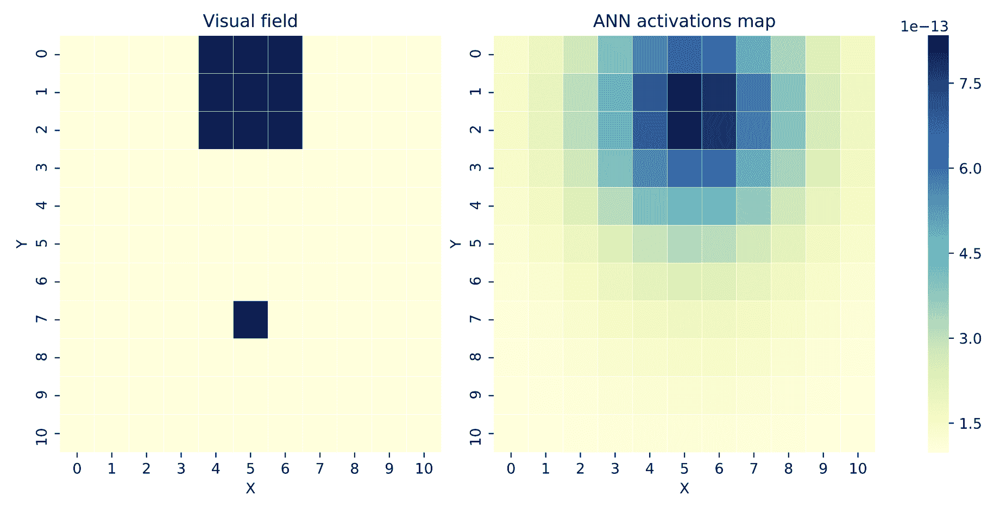

判别器ANN的目标场激活

前一个图的右侧显示了在评估随机视觉场时获得的判别器ANN的目标字段（输出层）的激活值。同样，在图的左侧，你可以看到实际的视觉场配置。正如你所看到的，最大目标字段激活值（最暗的单元格）正好位于视觉场中大型物体的中心位置，坐标为（`5`，`1`）。

从前面的图中可以看出，ANN激活值的尺度极低：最小激活值为`~1e-13`，最大值仅为`~9e-13`。一个由人类设计的ANN可能会进行归一化处理，使得输出在`[0,1]`范围内，最小值接近零，最大值接近一。然而，我们只要求激活值在正确的位置达到最大值，网络可以自由选择大多数人认为不寻常的输出激活方案。

另一个图允许你研究进化过程中每一代的表现以及产生的连接CPPN在创建成功的判别ANN中的表现如何：

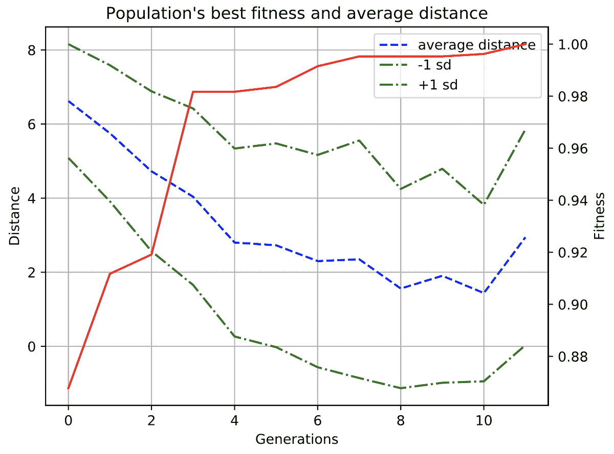

判别ANN的最佳适应度分数和平均误差距离

前面的图显示了每一代进化过程中适应度分数（上升线）和平均误差距离（下降线）的变化。你可以看到，适应度分数在进化的第三代几乎达到了最大值，并且需要再经过七代来详细阐述CPPN基因配置，最终找到胜者。此外，你还可以看到，在进化过程中，检测到的物体位置与真实位置之间的平均误差距离逐渐减小。

然而，这个实验最激动人心的部分体现在以下CPPN表型图的图中：

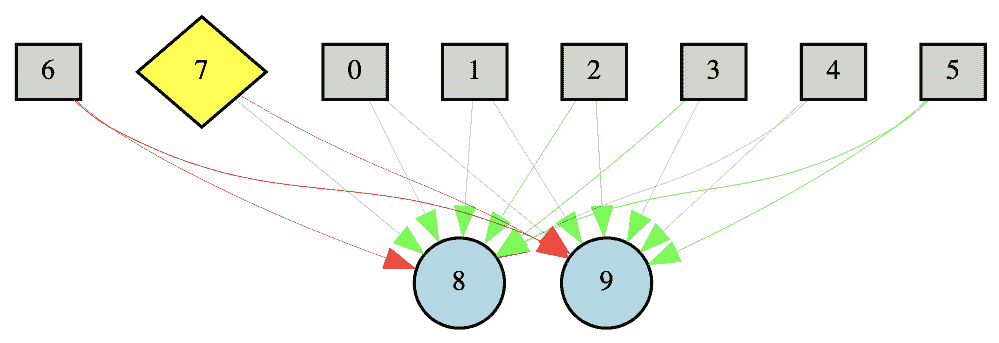

最佳基因的CPPN表型图

该图展示了用于在判别ANN上绘制连接的最佳CPPN表型网络拓扑。在CPPN表型图中，输入节点用方块标记，输出节点用实心圆圈标记，偏置节点用菱形标记。

CPPN的两个输出节点有以下含义：

+   第一个节点（8）提供连接的权重。

+   第二个节点（9）确定连接是否表达。

CPPN输入节点定义如下：

+   前两个节点（0和1）在基底的输入层中设置点坐标（`x`，`y`）。

+   接下来的两个节点（2和3）在基底的隐藏层中设置点坐标（`x`，`y`）（在我们的实验中未使用）。

+   接下来的两个节点（4和5）在基底的输出层中设置点坐标（`x`，`y`）。

+   最后一个节点（6）设置输入层中点与坐标原点的欧几里得距离。

此外，你还可以看到CPPN表型中不包含任何隐藏节点。对于视觉判别任务，神经进化过程能够找到适合CPPN输出节点的适当激活函数类型。这一发现使得连接CPPN能够在判别ANN的基底中绘制正确的连接模式。

通过计算前述图中节点和它们之间的连接数量，您可以感受到HyperNEAT算法引入的间接编码方法的威力。仅用10个节点之间的16个连接，CPPN表型就能揭示底物的连接模式，对于11 x 11分辨率的视觉场，节点之间和目标场之间的连接数最多可达14,641个。因此，我们实现了大约0.11%的信息压缩率，这相当令人印象深刻。

这样高的压缩率是由于连接CPPN在底物连接基元中发现了几何规律。利用发现的模式规律，CPPN只需存储整个底物连接空间中的少量模式（局部连接基元），然后可以在不同的底物位置多次应用这些局部模式，以绘制底物层之间的完整连接方案。在我们的案例中，是为了绘制输入层（视觉场）和输出层（目标场）之间的连接。

# 练习

1.  尝试降低`params.PopulationSize`超参数的值，看看会发生什么。这对算法的性能有何影响？

1.  尝试将以下超参数的值设置为0概率：`params.ActivationFunction_SignedGauss_Prob`、`params.ActivationFunction_SignedSigmoid_Prob`和`params.ActivationFunction_SignedSine_Prob`。这些更改是否找到了成功的解决方案？这对底物连接的配置有何影响？

1.  打印出获胜的基因组，尝试创建一个可视化，然后看看您从基因组中获得的直观感受与可视化的CPPN是否匹配。

# 摘要

在本章中，我们学习了使用CPPN间接编码ANN拓扑结构的方法。您了解了NEAT算法的HyperNEAT扩展，该扩展使用连接CPPN在判别器ANN的表型底物中绘制连接模式。我们还展示了间接编码方案如何使HyperNEAT算法能够处理大规模ANN拓扑结构，这在模式识别和视觉辨别任务中很常见。

在我们提供的理论背景下，您有机会通过使用Python和MultiNEAT库实现视觉辨别任务的解决方案来提高您的编码技能。此外，您还了解了一种新的可视化方法，该方法可以渲染判别器ANN输出层中节点的激活值，以及如何使用这种可视化来验证解决方案。

在下一章中，我们将讨论如何通过引入一种自动生成适当基板配置的方法来进一步改进HyperNEAT方法。我们将考虑NEAT算法的**可进化基板HyperNEAT**（**ES-HyperNEAT**）扩展，并看看它如何应用于解决需要求解器ANN模块化拓扑结构的实际任务。
