# 第十三章：深度神经进化

在本章中，你将了解深度神经进化方法，该方法可用于训练**深度神经网络（DNN**）。DNN传统上使用基于误差梯度下降的逆传播方法进行训练，该误差梯度是根据神经节点之间连接的权重计算的。尽管基于梯度的学习是一种强大的技术，它构思了当前深度机器学习的时代，但它也有其缺点，例如训练时间长和计算能力要求巨大。

在本章中，我们将展示如何使用深度神经进化方法进行强化学习，以及它们如何显著优于传统的DQN、A3C基于梯度的DNN训练学习方法。到本章结束时，你将深入理解深度神经进化方法，并且将获得实际操作经验。我们将学习如何通过深度神经进化进化智能体，使其能够玩经典的Atari游戏。此外，你还将学习如何使用**神经进化视觉检查器（VINE**）来检查实验结果。

本章将涵盖以下主题：

+   深度神经进化用于深度强化学习

+   使用深度神经进化进化智能体以玩Frostbite Atari游戏

+   训练智能体玩Frostbite游戏

+   运行Frostbite Atari实验

+   使用VINE检查结果

# 技术要求

为了完成本章中描述的实验，以下技术要求必须满足：

+   一台配备Nvidia显卡加速器GeForce GTX 1080Ti或更好的现代PC

+   MS Windows 10、Ubuntu Linux 16.04或macOS 10.14，并配备离散GPU

+   Anaconda Distribution版本2019.03或更高版本

本章的代码可以在[https://github.com/PacktPublishing/Hands-on-Neuroevolution-with-Python/tree/master/Chapter10](https://github.com/PacktPublishing/Hands-on-Neuroevolution-with-Python/tree/master/Chapter10)找到

# 深度神经进化用于深度强化学习

在本书中，我们已经介绍了神经进化方法如何应用于解决简单的强化学习任务，例如在第4章中提到的单杆和双杆平衡实验，*杆平衡实验*。然而，尽管杆平衡实验令人兴奋且易于进行，但它相当简单，并且使用的是微型人工神经网络。在本章中，我们将讨论如何将神经进化应用于需要巨大人工神经网络来近似强化学习算法价值函数的强化学习问题。

RL算法通过试错来学习。几乎所有的RL算法变体都试图优化值函数，该函数将系统的当前状态映射到下一个时间步将执行的正确动作。最广泛使用的经典RL算法版本是Q学习，它围绕一个由动作键入的状态表构建，该表构成了算法在训练完成后要遵循的策略规则。训练包括在特定状态下迭代执行特定动作，并在之后收集奖励信号，以更新Q表的单元格。以下公式决定了更新Q表中特定单元格的过程：

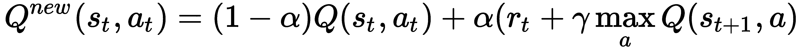

这里 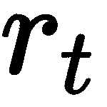 是当系统状态从状态 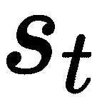 变化到状态 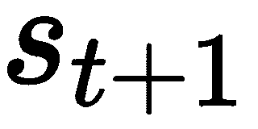 时所获得的奖励，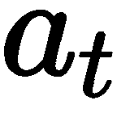 是在时间  所采取的动作，导致状态变化， 是学习率，而 是一个控制未来奖励重要性的折扣因子。学习率决定了新信息在特定Q表单元格中覆盖现有信息到何种程度。如果我们把学习率设为零，那么将不会学习任何东西，如果我们把它设为 *1*，那么将不会保留任何东西。因此，学习率控制了系统学习新信息的同时保持有用、已学数据的速度。

Q学习算法的简单版本迭代所有可能的动作-状态组合，并更新Q值，正如我们之前讨论的那样。这种方法对于具有少量动作-状态对的简单任务来说效果很好，但随着这种对的数量增加，即动作-状态空间的维度增加，这种方法很快就会失败。大多数现实世界任务都具有深刻的动作-状态空间维度，这使得经典版本的Q学习变得不可行。

提出Q值函数逼近方法是为了解决维度增加的问题。在这个方法中，Q学习策略不是由我们之前提到的动作-状态表定义的，而是通过一个函数来逼近。实现这种逼近的一种方法是用ANN作为通用逼近函数。通过使用ANN，特别是用于Q值逼近的深度ANN，使得使用RL算法解决非常复杂的问题成为可能，甚至可以解决具有连续状态空间的问题。因此，设计了DQN方法，它使用DNN进行Q值逼近。基于DNN值函数逼近的RL被称为**深度强化学习**（**深度RL**）。

使用深度强化学习，我们可以直接从视频流的像素中学习动作策略。这使得我们可以使用视频流来训练智能体玩电子游戏，例如。然而，DQN方法可以被认为是一种基于梯度的方法。它使用DNN中的误差（损失）反向传播来优化Q值函数近似器。虽然这是一种强大的技术，但它涉及到显著的计算复杂度，这需要使用GPU来执行梯度下降相关计算中的所有矩阵乘法。

可以用来减少计算成本的其中一种方法是**遗传算法**（**GA**），例如神经进化。神经进化允许我们在不涉及任何基于梯度的计算的情况下，进化一个用于Q值函数近似的DNN。在最近的研究中，已经表明，无梯度GA方法在挑战性的深度强化学习任务中表现出色，并且甚至可以超越它们的传统对应物。在下一节中，我们将讨论如何使用深度神经进化方法来训练成功的智能体，仅通过读取游戏屏幕观察来玩一款经典的Atari游戏。

# 通过深度神经进化使智能体学会玩Frostbite Atari游戏

最近，经典的Atari游戏被封装在**Atari学习环境**（**ALE**）中，成为测试不同RL算法实现的基准。针对ALE测试的算法需要从游戏屏幕的像素中读取游戏状态，并设计复杂的控制逻辑，使智能体能够赢得游戏。因此，算法的任务是在游戏角色及其对手的背景下，演变对游戏情况的理解。此外，算法还需要理解从游戏屏幕接收到的奖励信号，这种信号以单次游戏运行结束时的最终游戏分数的形式出现。

# Frostbite Atari游戏

Frostbite是一款经典的Atari游戏，玩家控制一个游戏角色，该角色正在建造一个冰屋。游戏屏幕在下面的屏幕截图中显示：

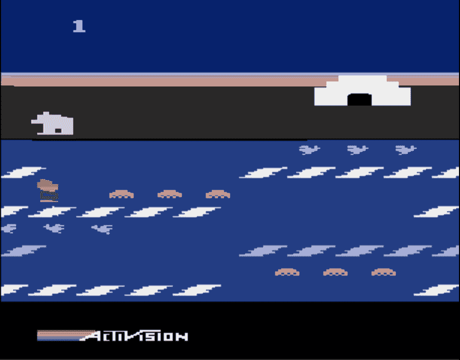

Frostbite游戏屏幕

屏幕底部是水，有浮冰块排列成四行。游戏角色在尝试避开各种敌人时从一个行跳到另一个行。如果游戏角色跳到一个白色冰块上，这个块就会被收集并用于在屏幕右上角的岸边建造一个冰屋。之后，白色冰块会改变颜色，不能再使用。

要建造冰屋，游戏角色必须在45秒内收集15个冰块。否则，游戏结束，因为游戏角色被冻住了。当冰屋完成时，游戏角色必须进入其中以完成当前关卡。游戏角色完成关卡越快，玩家获得的额外分数就越多。

接下来，我们将讨论如何将游戏屏幕状态映射到输入参数，这些参数可以被神经进化方法使用。

# 游戏屏幕映射到动作

如果深度ANN能够直接将屏幕上的像素映射到控制游戏系统的系统，它们就可以被训练来玩Atari游戏。这意味着我们的算法必须读取游戏屏幕并决定采取什么游戏动作以获得尽可能高的游戏分数。

此任务可以分为两个逻辑子任务：

+   图像分析任务，该任务将当前游戏情况在屏幕上的状态进行编码，包括游戏角色的位置、障碍物和对手

+   RL训练任务，用于训练Q值近似ANN以建立特定游戏状态与要执行的动作之间的正确映射

**卷积神经网络**（**CNNs**）在分析视觉图像或其他高维欧几里得数据相关的任务中常用。CNN的强大之处在于，如果应用于视觉识别，它们能够显著减少与其他类型的ANN相比的学习参数数量。CNN层次结构通常由多个顺序卷积层与非线性的全连接层结合，并以一个全连接层结束，该层之后是损失层。最终的全连接和损失层实现了神经网络架构中的高级推理。在深度RL的情况下，这些层实现了Q值近似。接下来，我们将考虑卷积层实现的细节。

# 卷积层

通过研究高等生命形式（包括人类）的视觉皮层组织，研究人员为CNN的设计获得了灵感。视觉皮层的每个神经元对来自视觉场有限区域的信号做出反应——神经元的接收场。不同神经元的接收场部分重叠，这使得它们能够覆盖整个视觉场，如下面的图所示：

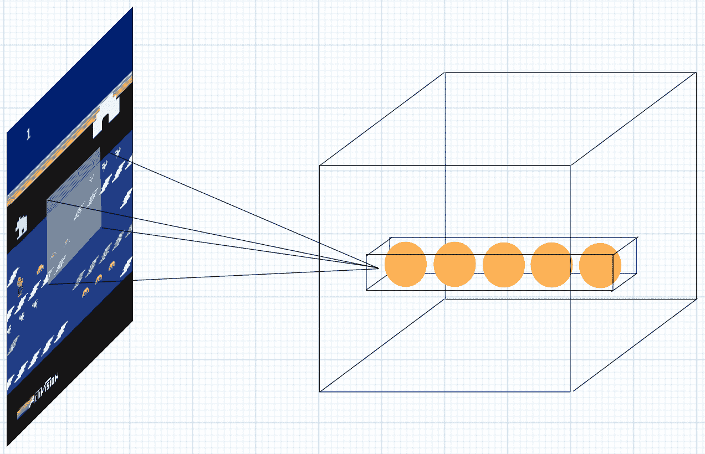

接收场（左侧）与卷积层（右侧）中的神经元之间的连接方案

卷积层由一列神经元组成，其中每一列中的神经元都连接到相同的接收场。这一列代表了一组过滤器（核）。每个过滤器由接收场的大小和通道数定义。通道数定义了神经元列的深度，而接收场的大小决定了卷积层中的列数。当接收场在视觉场中移动时，在每一步，新的神经元列被激活。

如我们之前提到的，每个卷积层通常与非线性的激活函数结合，例如**Rectified Linear Unit**（**ReLU**）。ReLU激活函数的作用是过滤掉负值，如下公式所示：

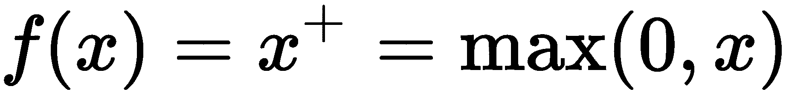

这里，是神经元的输入。

在ANN架构中，几个卷积层连接到多个完全连接层，执行高级推理。接下来，我们将讨论在我们的实验中使用的CNN架构。

# 训练Atari游戏代理的CNN架构

在我们的实验中，我们将使用由三个卷积层组成的CNN架构，这些卷积层具有32、64和64个通道，随后是一个具有512个单元的完全连接层和与游戏动作数量相对应的输出层。卷积层的核大小分别为8 x 8、4 x 4和3 x 3，分别使用步长为4、2和1。ReLU非线性函数跟随所有的卷积层和完全连接层。

使用TensorFlow框架创建描述的网络图模型的源代码定义如下：

```py
class LargeModel(Model):
    def _make_net(self, x, num_actions):
        x = self.nonlin(self.conv(x, name='conv1', num_outputs=32, 
                                  kernel_size=8, stride=4, std=1.0))
        x = self.nonlin(self.conv(x, name='conv2', num_outputs=64, 
                                  kernel_size=4, stride=2, std=1.0))
        x = self.nonlin(self.conv(x, name='conv3', num_outputs=64, 
                                  kernel_size=3, stride=1, std=1.0))
        x = self.flattenallbut0(x)
        x = self.nonlin(self.dense(x, 512, 'fc'))

        return self.dense(x, num_actions, 'out', std=0.1)
```

由于这种架构，CNN包含大约**400万个可训练参数**。接下来，我们将讨论在我们的实验中如何进行RL训练。

对于完整的实现细节，请参阅[https://github.com/PacktPublishing/Hands-on-Neuroevolution-with-Python/blob/master/Chapter10/neuroevolution/models/dqn.py](https://github.com/PacktPublishing/Hands-on-Neuroevolution-with-Python/blob/master/Chapter10/neuroevolution/models/dqn.py)中的`dqn.py` Python脚本。

# 游戏代理的RL训练

我们的实验中的RL训练是使用神经进化方法实现的。这种方法基于一个简单的遗传算法，该算法进化一个个体群体。每个个体的基因型编码了控制器ANN的可训练参数向量。我们所说的可训练参数是指网络节点之间的连接权重。在每一代中，每个基因型通过在Frostbite中玩游戏来与测试环境进行评估，并产生一个特定的适应度分数。我们评估每个代理（基因组）对游戏的20,000帧。在评估期间，游戏角色可以玩多次，最终Atari游戏得分是适应度分数，这是RL中的奖励信号。

接下来，我们将讨论基因组编码方案，它允许我们编码控制游戏解决代理的ANN的超过400万学习参数。

# 基因组编码方案

我们用作游戏代理控制器的深度强化学习神经网络大约有400万个可训练参数。每个可训练参数是神经网络中两个节点之间连接的权重。传统上，训练神经网络是关于找到所有连接权重的适当值，使神经网络能够近似描述建模过程具体情况的函数。

传统的估计这些可训练参数的方法是使用基于损失值梯度下降的某种形式的误差反向传播，这非常计算密集。另一方面，神经进化算法允许我们使用一种受自然界启发的遗传算法来训练ANN。神经进化算法通过对可训练参数应用一系列突变和重组来找到ANN的正确配置。然而，要使用遗传算法，应设计一种适当的表型ANN编码方案。之后，可以使用简单的遗传算法创建和进化个体（编码表型ANN的基因组），我们将在后面讨论。

如我们之前提到的，编码方案应生成紧凑的基因组，能够编码控制游戏代理的深度强化学习人工神经网络（ANN）节点之间超过400万个连接权重的值。我们正在寻找紧凑的基因组以降低与遗传算法评估相关的计算成本。接下来，我们将讨论基因组编码方案的定义，该方案可用于编码大型表型ANN。

# 基因组编码方案定义

优步AI实验室的研究人员提出了一种编码方案，该方案使用伪随机数生成器的种子来编码表型ANN。在这个方案中，基因组表示为种子值的列表，这些种子值依次应用以生成控制器ANN节点之间表达的所有连接（可训练参数）的值。

换句话说，列表中的第一个种子值代表策略初始化种子，它被单个父代的谱系所共享。所有后续的种子值代表后代在进化过程中获得的具体突变。每个种子依次应用以产生特定表型的ANN参数向量。以下公式定义了特定个体的表型参数向量估计（）：

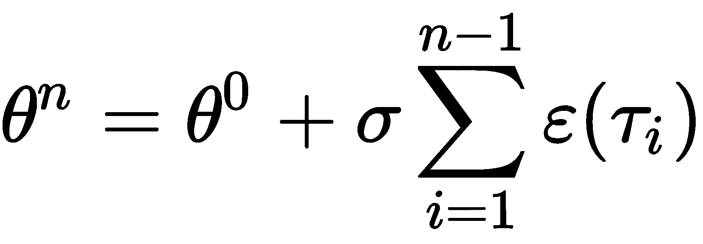

这里，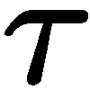是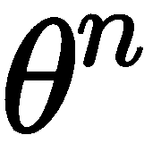的编码，由一系列突变种子组成；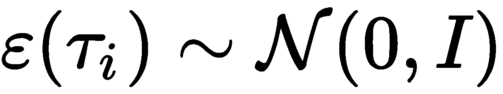是一个具有输入种子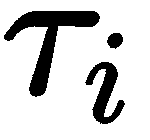的确定性高斯伪随机数生成器，它产生一个长度为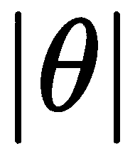的向量；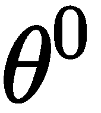是在初始化期间创建的初始参数向量，如下所示，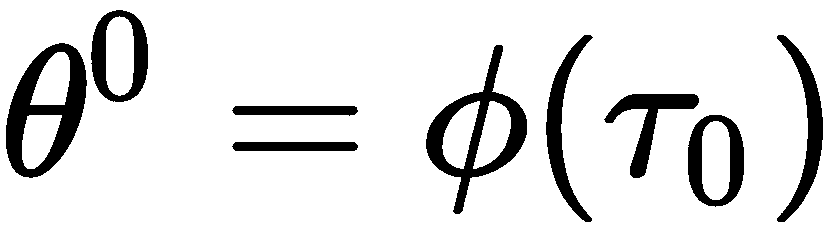，其中是一个确定性初始化函数；而是突变能力，它决定了所有后续参数向量对初始参数向量的影响强度。

在当前实现中，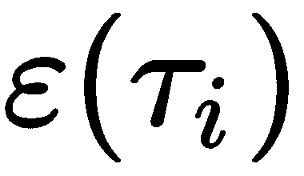是一个使用28位种子索引的预计算表，包含2.5亿个随机向量。这样做是为了加快运行时处理速度，因为通过索引查找比生成新的随机数要快。接下来，我们将讨论如何在Python源代码中实现编码方案。

# 基因编码方案实现

下面的源代码实现了按前一小节中定义的公式（参见`compute_weights_from_seeds`函数）进行的ANN参数估计：

```py
    idx = seeds[0]
    theta = noise.get(idx, self.num_params).copy() * self.scale_by

    for mutation in seeds[1:]:
        idx, power = mutation
        theta = self.compute_mutation(noise, theta, idx, power)
    return theta
```

`compute_mutation`函数实现了ANN参数估计的单步估计，如下所示：

```py
    def compute_mutation(self, noise, parent_theta, idx, mutation_power):
        return parent_theta + mutation_power * noise.get(idx, 
                                                        self.num_params)
```

上述代码将父代可训练参数的向量与由确定性伪随机生成器使用特定种子索引产生的随机向量相加。突变能力参数在将其添加到父代参数向量之前对生成的随机向量进行缩放。

更多实现细节，请参阅[https://github.com/PacktPublishing/Hands-on-Neuroevolution-with-Python/blob/master/Chapter10/neuroevolution/models/base.py](https://github.com/PacktPublishing/Hands-on-Neuroevolution-with-Python/blob/master/Chapter10/neuroevolution/models/base.py)中的`base.py`脚本。

接下来，我们将讨论用于训练Frostbite游戏代理的简单遗传算法的细节。

# 简单遗传算法

在我们的实验中使用的简单遗传算法通过进化代数来进化*N*个个体的种群。正如我们之前提到的，每个个体的基因组编码了可训练的ANN参数向量。此外，在每一代中，我们选择前*T*个个体成为下一代的双亲。

产生下一代的流程如下。对于*N-1*次重复，我们执行以下操作：

1.  随机选择一个父代并从选择列表中移除。

1.  通过对个体编码的参数向量应用加性高斯噪声，将突变应用于选定的父个体。

1.  接下来，我们将新的生物体添加到下一代的个体列表中。

之后，将当前代最佳个体以未修改的状态复制到下一代（精英主义）。为了保证最佳个体被选中，我们将当前代的10个顶级个体与30个额外的游戏关卡进行评估。然后，平均适应度分数最高的个体被选为精英，复制到下一代。

父个体突变的具体实现如下：

```py
    def mutate(self, parent, rs, noise, mutation_power):
        parent_theta, parent_seeds = parent
        idx = noise.sample_index(rs, self.num_params)
        seeds = parent_seeds + ((idx, mutation_power), )
        theta = self.compute_mutation(noise, parent_theta, idx, 
                                      mutation_power)
        return theta, seeds
```

此函数接收父个体的表型和基因型、随机源、预计算的噪声表（2.5亿个向量）以及突变功率值。随机源生成随机种子数（`idx`），用作索引，以便我们可以从噪声表中选择适当的参数向量。之后，我们通过将父种子列表与新的种子结合来创建后代基因组。最后，我们通过将父个体的表型与从共享噪声表中使用先前获得的随机采样种子索引（`idx`）提取的高斯噪声相结合来创建后代的表型。在下一节中，我们将探讨我们可以进行的实验，以训练一个能够玩Frostbite Atari游戏的智能体。

# 训练智能体玩Frostbite游戏

既然我们已经讨论了游戏智能体实现背后的理论，我们现在可以开始着手工作了。我们的实现基于GitHub上Uber AI实验室提供的源代码，网址为[https://github.com/uber-research/deep-neuroevolution](https://github.com/uber-research/deep-neuroevolution)。该存储库中的源代码包含两种训练DNN的方法：适用于多核系统的基于CPU的方法（最多720个核心）和基于GPU的方法。我们感兴趣的是基于GPU的实现，因为大多数实践者无法访问拥有720个CPU核心的PC这样的巨型技术设备。同时，获取现代Nvidia GPU相当容易。

接下来，我们将讨论实现的细节。

# Atari学习环境

在智能体训练期间，我们需要在Atari系统中模拟实际游戏玩法。这可以通过使用ALE来完成，它模拟了一个可以运行游戏ROM图像的Atari系统。ALE提供了一个接口，允许我们通过模拟游戏控制器来捕获游戏屏幕帧和控制游戏。在这里，我们将使用可在[https://github.com/yaricom/atari-py](https://github.com/yaricom/atari-py)找到的ALE修改版。

我们的实现使用 TensorFlow 框架来实现 ANN 模型并在 GPU 上执行它们。因此，需要在 ALE 和 TensorFlow 之间实现相应的桥梁。这是通过使用 C++ 编程语言实现自定义 TensorFlow 操作来实现的，以提高效率。还提供了相应的 Python 接口，作为 AtariEnv Python 类，在 [https://github.com/PacktPublishing/Hands-on-Neuroevolution-with-Python/blob/master/Chapter10/gym_tensorflow/atari/tf_atari.py](https://github.com/PacktPublishing/Hands-on-Neuroevolution-with-Python/blob/master/Chapter10/gym_tensorflow/atari/tf_atari.py)。

AtariEnv 提供了函数，使我们能够执行单个游戏步骤、重置游戏并返回当前游戏状态（观察）。接下来，我们将讨论每个函数。

# 游戏步骤函数

游戏步骤函数使用提供的动作执行单个游戏步骤。该函数的实现如下：

```py
    def step(self, action, indices=None, name=None):
        if indices is None:
            indices = np.arange(self.batch_size)
        with tf.variable_scope(name, default_name='AtariStep'):
            rew, done = gym_tensorflow_module.environment_step(
                               self.instances, indices, action)
            return rew, done
```

此函数将控制器 ANN 接收到的游戏动作应用于当前游戏环境。请注意，此函数可以在多个游戏实例中同时执行单个游戏步骤。`self.batch_size` 参数或 `indices` 输入张量的长度决定了我们将拥有的游戏实例数量。该函数返回两个张量：一个包含奖励（游戏得分）的张量，另一个包含标志，指示当前游戏评估在此步骤后是否完成（解决或失败）。这两个张量的长度等于 `self.batch_size` 或 `indices` 输入张量的长度。

接下来，我们将讨论游戏观察是如何创建的。

# 游戏观察函数

此函数从 Atari 环境获取当前游戏状态作为游戏屏幕缓冲区。此函数的实现如下：

```py
    def observation(self, indices=None, name=None):
        if indices is None:
            indices = np.arange(self.batch_size)
        with tf.variable_scope(name, default_name='AtariObservation'):
            with tf.device('/cpu:0'):
                obs = gym_tensorflow_module.environment_observation(
                                   self.instances, indices, T=tf.uint8)

            obs = tf.gather(tf.constant(self.color_pallete), 
                                                tf.cast(obs,tf.int32))
            obs = tf.reduce_max(obs, axis=1)
            obs = tf.image.resize_bilinear(obs, self.warp_size, 
                                                   align_corners=True)
            obs.set_shape((None,) + self.warp_size + (1,))
            return obs
```

此函数从 Atari 环境获取屏幕截图，并将其包装在 TensorFlow 框架可以使用的张量中。游戏观察函数还允许我们通过 `self.batch_size` 参数或 `indices` 输入参数的长度接收来自多个游戏的州。该函数返回多个游戏的屏幕截图，包装在张量中。

我们还需要实现一个函数，将 Atari 环境重置到初始随机状态，我们将在下一节中讨论。 

# 重置 Atari 环境函数

为了训练游戏智能体，我们需要实现一个函数，从特定的随机状态启动 Atari 环境。实现一个随机的 Atari 重置函数对于确保我们的智能体可以从任何初始状态玩游戏至关重要。该函数的实现如下：

```py
    def reset(self, indices=None, max_frames=None, name=None):
        if indices is None:
            indices = np.arange(self.batch_size)
        with tf.variable_scope(name, default_name='AtariReset'):
            noops = tf.random_uniform(tf.shape(indices), minval=1, 
                                       maxval=31, dtype=tf.int32)
            if max_frames is None:
                max_frames = tf.ones_like(indices, dtype=tf.int32) * \
                                         (100000 * self.frameskip)
            import collections
            if not isinstance(max_frames, collections.Sequence):
                max_frames = tf.ones_like(indices, dtype=tf.int32) * \
                                          max_frames
            return gym_tensorflow_module.environment_reset(self.instances, 
                             indices, noops=noops, max_frames=max_frames)
```

此函数使用 `indices` 输入参数同时重置多个 Atari 游戏实例的随机初始状态。此函数还定义了每个游戏实例的最大帧数。

接下来，我们将讨论如何在 GPU 核心上执行 RL 评估。

# 在 GPU 核心上进行 RL 评估

在我们的实验中，我们将使用 TensorFlow 框架在 GPU 设备上实现一个强化学习评估。这意味着与控制器 ANN 中输入信号传播相关的所有计算都在 GPU 上执行。这使得我们能够有效地计算超过 400 万个训练参数——控制 ANN 节点之间的连接权重——对于游戏中的每一个时间步。此外，我们还可以并行模拟多个游戏运行，每个运行由不同的控制器 ANN 控制。

通过两个 Python 类 `RLEvalutionWorker` 和 `ConcurrentWorkers` 实现多个游戏控制器 ANN 的并发评估。接下来，我们将讨论每个类。

对于完整的实现细节，请参阅 [https://github.com/PacktPublishing/Hands-on-Neuroevolution-with-Python/blob/master/Chapter10/neuroevolution/concurrent_worker.py](https://github.com/PacktPublishing/Hands-on-Neuroevolution-with-Python/blob/master/Chapter10/neuroevolution/concurrent_worker.py) 中的 `concurrent_worker.py` 类。

# RLEvalutionWorker 类

此类包含控制器 ANN 的配置和网络图。它为我们提供了方法，以便我们可以创建控制器 ANN 的网络图，在创建的网络图中运行评估循环，并将新任务放入评估循环中。接下来，我们将讨论网络图是如何从网络模型创建的。

# 创建网络图

TensorFlow 网络图是由 `make_net` 函数创建的，该函数接收 ANN 模型构造函数、GPU 设备标识符和批处理大小作为输入参数。网络图的创建如下：

1.  我们将首先创建控制器 ANN 模型和游戏评估环境：

```py
    self.model = model_constructor()
    …
    with tf.variable_scope(None, default_name='model'):
        with tf.device(‘/cpu:0'):
            self.env = self.make_env_f(self.batch_size)
```

1.  接下来，我们将创建占位符，以便在网络图评估期间接收值。同时，我们还将创建一个操作员，在新游戏剧集开始前重置游戏：

```py
        self.placeholder_indices = tf.placeholder(tf.int32, 
                                                    shape=(None, ))
        self.placeholder_max_frames = tf.placeholder(
                                          tf.int32, shape=(None, ))
        self.reset_op = self.env.reset(
                            indices=self.placeholder_indices, 
                            max_frames=self.placeholder_max_frames)
```

1.  之后，使用提供的 GPU 设备的上下文，我们将创建两个操作员来接收游戏状态观察并评估后续的游戏动作：

```py
        with tf.device(device):
            self.obs_op = self.env.observation(
                            indices=self.placeholder_indices)
            obs = tf.expand_dims(self.obs_op, axis=1)
            self.action_op = self.model.make_net(obs, 
                            self.env.action_space, 
                            indices=self.placeholder_indices, 
                            batch_size=self.batch_size, 
                            ref_batch=ref_batch)
```

1.  `action` 操作符返回一个动作可能性值的数组，如果动作空间是离散的，则需要过滤：

```py
        if self.env.discrete_action:
            self.action_op = tf.argmax(
                        self.action_op[:tf.shape(
                        self.placeholder_indices)[0]], 
                        axis=-1, output_type=tf.int32)
```

代码检查当前游戏环境是否需要离散动作，并使用 TensorFlow 框架内置的 `tf.argmax` 操作符包装 `action` 操作符。`tf.argmax` 操作符返回具有最大值的动作的索引，可以用来指示应该执行特定的游戏动作。

Atari 游戏环境是一个离散动作环境，这意味着在每一个时间步只接受一个动作。

1.  最后，我们创建一个操作员来执行单个游戏步骤：

```py
        with tf.device(device):
            self.rew_op, self.done_op = \
                       self.env.step(self.action_op, 
                       indices=self.placeholder_indices)
```

在这里，我们创建一个单个游戏步骤操作符，该操作符在执行单个游戏步骤后返回获取奖励的操作 `self.rew_op` 和游戏完成状态 `self.done_op`。

接下来，我们将讨论评估循环是如何实现的。

# 图形评估循环

这是用于并行评估先前创建的网络图在多个游戏中的循环——可以同时评估的游戏数量由 `batch_size` 参数确定。

评估循环定义在 `_loop` 函数中，并如下实现：

1.  首先，我们从创建数组开始，这些数组用于存储多个连续游戏中的游戏评估值：

```py
running = np.zeros((self.batch_size,), dtype=np.bool)
cumrews = np.zeros((self.batch_size, ), dtype=np.float32)
cumlen = np.zeros((self.batch_size, ), dtype=np.int32)
```

1.  接下来，我们启动循环并将我们刚刚创建的运行数组的相应索引设置为 `True`：

```py
    while True:
        # nothing loaded, block
        if not any(running):
            idx = self.queue.get()
            if idx is None:
               break
            running[idx] = True
        while not self.queue.empty():
           idx = self.queue.get()
           if idx is None:
                 break
           running[idx] = True
```

1.  使用索引数组，我们准备执行单个游戏步骤操作并收集结果：

```py
indices = np.nonzero(running)[0]
rews, is_done, _ = self.sess.run(
          [self.rew_op, self.done_op, self.incr_counter], 
          {self.placeholder_indices: indices})
cumrews[running] += rews
cumlen[running] += 1
```

1.  最后，我们需要测试是否有任何评估过的游戏已完成，无论是通过获胜还是达到最大游戏帧数限制。对于所有完成的任务，我们应用一系列操作，如下：

```py
if any(is_done):
    for idx in indices[is_done]:
        self.sample_callback[idx](self, idx, 
              (self.model.seeds[idx],cumrews[idx], 
                                         cumlen[idx]))
    cumrews[indices[is_done]] = 0.
    cumlen[indices[is_done]] = 0.
    running[indices[is_done]] = False
```

前面的代码使用所有已完成任务的索引并调用相应的注册回调，在特定索引重置收集器变量之前。

现在，我们准备讨论如何使用我们的工作器添加和运行新任务。

# 异步任务运行器

此函数将特定任务注册为在 GPU 设备上下文中由工作器评估的任务。它接受任务 ID、任务对象持有者和任务完成时要执行的回调作为输入。此函数定义为 `run_async` 并如下实现：

1.  首先，它从任务对象中提取相应的数据并将其加载到当前 TensorFlow 会话中：

```py
    theta, extras, max_frames=task
    self.model.load(self.sess, task_id, theta, extras)
    if max_frames is None:
        max_frames = self.env.env_default_timestep_cutoff
```

在这里，`theta` 是控制器 ANN 模型中所有连接权重的数组，`extras` 包含相应基因组的随机种子列表，而 `max_frames` 是游戏帧的截止值。

1.  接下来，我们使用 `self.reset_op` 运行 TensorFlow 会话，该操作在指定索引重置特定的游戏环境：

```py
    self.sess.run(self.reset_op, {self.placeholder_indices:[task_id], 
                  self.placeholder_max_frames:[max_frames]})
    self.sample_callback[task_id] = callback
    self.queue.put(task_id)
```

代码在 TensorFlow 会话中运行 `self.reset_op`。我们还使用 `reset` 操作符和给定任务的特定游戏帧的最大截止值注册当前任务标识符。任务标识符在评估循环中使用，以将网络图的评估结果与种群中特定的基因组相关联。接下来，我们将讨论如何维护并发异步工作器。

# `ConcurrentWorkers` 类

`ConcurrentWorkers` 类持有并发执行环境的配置，这包括几个评估工作器（`RLEvalutionWorker` 实例）和辅助例程以支持并发任务的多次执行。

# 创建评估工作器

`ConcurrentWorkers` 类的主要职责之一是创建和管理 `RLEvalutionWorker` 实例。这是在类构造函数中完成的，如下所示：

```py
    self.workers = [RLEvalutionWorker(make_env_f, *args, 
         ref_batch=ref_batch, 
         **dict(kwargs, device=gpus[i])) for i in range(len(gpus))]
    self.model = self.workers[0].model
    self.steps_counter = sum([w.steps_counter for w in self.workers])
    self.async_hub = AsyncTaskHub()
    self.hub = WorkerHub(self.workers, self.async_hub.input_queue, 
                            self.async_hub)
```

在这里，我们创建与系统中可用的 GPU 设备数量相对应的 `RLEvalutionWorker` 实例数量。之后，我们初始化选定的 ANN 图模型，并创建辅助例程来管理异步任务的多次执行。接下来，我们将讨论工作任务是如何安排执行的。

# 运行工作任务和监控结果

要使用我们之前描述的 RL 评估机制，我们需要一种方法来安排工作任务进行评估并监控结果。这通过 `monitor_eval` 函数实现，它接收种群中的基因组列表并对它们进行 Atari 游戏环境的评估。此函数有两个基本实现部分，我们将在本节中讨论这两个部分：

1.  首先，我们遍历列表中的所有基因组，创建异步工作任务，以便每个基因组都可以与 Atari 游戏环境进行评估：

```py
    tasks = []
    for t in it:
        tasks.append(self.eval_async(*t, max_frames=max_frames, 
                                    error_callback=error_callback))
        if time.time() - tstart > logging_interval:
            cur_timesteps = self.sess.run(self.steps_counter)
            tlogger.info('Num timesteps:', cur_timesteps, 
             'per second:', 
             (cur_timesteps-last_timesteps)//(time.time()-tstart),
             'num episodes finished: {}/{}'.format(
             sum([1 if t.ready() else 0 for t in tasks]), 
             len(tasks)))
            tstart = time.time()
            last_timesteps = cur_timesteps
```

前面的代码为列表中的每个基因组安排异步评估，并为每个异步任务保存一个引用以供以后使用。此外，我们定期输出已安排任务的评估过程结果。现在，我们将讨论如何监控评估结果。

1.  以下代码块正在等待异步任务的完成：

```py
    while not all([t.ready() for t in tasks]):
        if time.time() - tstart > logging_interval:
            cur_timesteps = self.sess.run(self.steps_counter)
            tlogger.info('Num timesteps:', cur_timesteps, 'per second:', (cur_timesteps-last_timesteps)//(time.time()-tstart), 'num episodes:', sum([1 if t.ready() else 0 for t in tasks]))
            tstart = time.time()
            last_timesteps = cur_timesteps
        time.sleep(0.1)
```

在这里，我们遍历所有对已安排的异步任务的引用，并等待它们的完成。同时，我们定期输出评估进度。接下来，我们将讨论如何收集任务评估结果。

1.  最后，在所有任务完成后，我们收集结果，如下所示：

```py
    tlogger.info(
       'Done evaluating {} episodes in {:.2f} seconds'.format(
                          len(tasks), time.time()-tstart_all))
    return [t.get() for t in tasks]
```

代码遍历所有对已安排的异步任务的引用，并创建一个评估结果列表。接下来，我们将讨论实验运行器的实现。

# 实验运行器

实验运行器实现接收在 JSON 文件中定义的实验配置，并运行指定游戏时间步数的神经进化过程。在我们的实验中，当达到 1.5 亿个 Frostbite 时间步后，评估停止。接下来，我们将讨论实验配置的详细信息。

# 实验配置文件

这是提供实验运行器配置参数的文件。对于我们的实验，它包含以下内容：

```py
{
    "game": "frostbite",
    "model": "LargeModel",
    "num_validation_episodes": 30,
    "num_test_episodes": 200,
    "population_size": 1000,
    "episode_cutoff_mode": 5000,
    "timesteps": 1.5e9,
    "validation_threshold": 10,
    "mutation_power": 0.002,
    "selection_threshold": 20
}
```

配置参数如下：

+   `game` 参数是游戏的名称，如 ALE 中注册的那样。支持的完整游戏列表可在[https://github.com/PacktPublishing/Hands-on-Neuroevolution-with-Python/blob/master/Chapter10/gym_tensorflow/atari/tf_atari.py](https://github.com/PacktPublishing/Hands-on-Neuroevolution-with-Python/blob/master/Chapter10/gym_tensorflow/atari/tf_atari.py)找到。

+   `model` 参数指定了用于构建控制器ANN的网络图模型的名称。模型在[https://github.com/PacktPublishing/Hands-on-Neuroevolution-with-Python/blob/master/Chapter10/neuroevolution/models/dqn.py](https://github.com/PacktPublishing/Hands-on-Neuroevolution-with-Python/blob/master/Chapter10/neuroevolution/models/dqn.py)中定义。

+   `num_validation_episodes` 参数定义了用于评估群体中顶级个体的游戏剧集数量。在此步骤之后，我们可以选择群体的真正精英。

+   `num_test_episodes` 参数设置了用于测试所选群体精英性能的游戏剧集数量。

+   `population_size` 参数决定了群体中的基因组数量。

+   `episode_cutoff_mode` 参数定义了特定基因组游戏评估停止的方式。游戏剧集可以通过执行特定数量的时间步或使用相应游戏环境的默认停止信号来停止。

+   `timesteps` 参数设置了在神经进化过程中执行的游戏的总时间步数。

+   `validation_threshold` 参数设置了从每一代中选择的顶级个体数量，这些个体将进行额外的验证执行。群体精英从这些选定的个体中选出。

+   `mutation_power` 参数定义了后续添加到个体中的突变如何影响训练参数（连接权重）。

+   `selection_threshold` 参数决定了下一代中允许产生后代的父个体数量。

现在，我们准备讨论实验运行器的实现细节。

实验配置文件可在[https://github.com/PacktPublishing/Hands-on-Neuroevolution-with-Python/blob/master/Chapter10/configurations/ga_atari_config.json](https://github.com/PacktPublishing/Hands-on-Neuroevolution-with-Python/blob/master/Chapter10/configurations/ga_atari_config.json)找到。

# 实验运行器实现

实验运行器实现创建并发评估环境，并在个体群体上运行进化循环。让我们讨论基本实现细节：

1.  我们首先通过加载控制器ANN模型并创建并发工作者来设置评估环境以执行评估：

```py
    Model = neuroevolution.models.__dict__[config['model']]
    all_tstart = time.time()
    def make_env(b):
        return gym_tensorflow.make(game=config["game"], 
                                   batch_size=b)
    worker = ConcurrentWorkers(make_env, Model, batch_size=64)
```

1.  接下来，我们创建一个包含随机噪声值的表格，这些值将用作随机种子，并定义用于创建下一代后代的函数：

```py
    noise = SharedNoiseTable()
    rs = np.random.RandomState()

    def make_offspring():
        if len(cached_parents) == 0:
            return worker.model.randomize(rs, noise)
        else:
            assert len(cached_parents) == config['selection_threshold']
            parent = cached_parents[
                    rs.randint(len(cached_parents))]
            theta, seeds = worker.model.mutate( parent, rs, noise, 
                   mutation_power=state.sample(
                   state.mutation_power))
            return theta, seeds
```

1.  然后，主进化循环开始。我们使用之前定义的函数来为当前代创建后代群体：

```py
    tasks = [make_offspring() for _ in range(
                              config['population_size'])]
    for seeds, episode_reward, episode_length in \
        worker.monitor_eval(tasks, max_frames=state.tslimit * 4):
        results.append(Offspring(seeds, 
                       [episode_reward], [episode_length]))

    state.num_frames += sess.run(worker.steps_counter) - \
                                frames_computed_so_far
```

在这里，我们为群体中的每个后代创建工作任务，并为每个任务安排对游戏环境的评估。

1.  当我们完成对种群中每个个体的评估后，我们开始评估顶级个体以选择精英：

```py
    state.population = sorted(results, 
                  key=lambda x:x.fitness, reverse=True)
    …
    validation_population = state.\
                   population[:config['validation_threshold']]
    if state.elite is not None:
        validation_population = [state.elite] + \
                                    validation_population[:-1]

    validation_tasks = [
        (worker.model.compute_weights_from_seeds(noise, 
        validation_population[x].seeds, cache=cached_parents), 
        validation_population[x].seeds) for x in range(
                             config['validation_threshold'])]
    _,population_validation, population_validation_len =\ 
        zip(*worker.monitor_eval_repeated(validation_tasks, 
        max_frames=state.tslimit * 4, 
        num_episodes=config['num_validation_episodes']))
```

1.  使用前 10 个顶级个体的评估结果，我们选择种群中的精英，并对其执行最终测试运行以评估其性能：

```py
    population_elite_idx = np.argmax(population_validation)
    state.elite = validation_population[population_elite_idx]
    elite_theta = worker.model.compute_weights_from_seeds(
              noise, state.elite.seeds, cache=cached_parents)
    _,population_elite_evals,population_elite_evals_timesteps=\
                  worker.monitor_eval_repeated(
                  [(elite_theta, state.elite.seeds)], 
                  max_frames=None, 
                  num_episodes=config[‘num_test_episodes’])[0]
```

精英个体将直接复制到下一代。

1.  最后，我们从当前种群中选择顶级个体作为下一代的父母：

```py
    if config['selection_threshold'] > 0:
        tlogger.info("Caching parents")
        new_parents = []
        if state.elite in \
            state.population[:config['selection_threshold']]:
            new_parents.extend([
                 (worker.model.compute_weights_from_seeds(
                  noise, o.seeds, cache=cached_parents), o.seeds) for o in state.population[:config['selection_threshold']]])
        else:
            new_parents.append(
                (worker.model.compute_weights_from_seeds(
                 noise, state.elite.seeds, cache=cached_parents), 
                 state.elite.seeds))
            new_parents.extend([
                (worker.model.compute_weights_from_seeds(
                 noise, o.seeds, cache=cached_parents), o.seeds) for o in state.population[:config[‘selection_threshold']-1]])
```

上述代码从种群中收集顶级个体成为下一代的父母。如果当前精英不在父母列表中，它还会将其附加到父母列表中。

现在，我们准备好讨论如何运行实验。

# 运行 Frostbite Atari 实验

既然我们已经讨论了实验实施的全部细节，现在是时候运行实验了。然而，我们首先需要做的是创建一个合适的工作环境，我们将在下一节讨论这一点。

# 设置工作环境

训练代理玩 Atari 游戏的工作环境假设在过程中需要训练一个大型控制器人工神经网络。我们之前已经提到，控制器人工神经网络有超过 400 万个训练参数，需要大量的计算资源才能进行评估。幸运的是，现代 GPU 加速器允许同时执行大规模并行计算。这一特性对我们实验来说很方便，因为我们需要在进化过程中多次将每个个体与游戏环境进行评估。如果没有 GPU 加速，要么会花费很多时间，要么需要大量的处理核心（大约 720 个）。

让我们讨论如何准备工作环境：

1.  工作环境需要系统中有 Nvidia 视频加速器（例如 GeForce 1080Ti）以及安装了适当的 Nvidia CUDA SDK。有关 CUDA SDK 及其安装的更多详细信息，请见 [https://developer.nvidia.com/cuda-toolkit](https://developer.nvidia.com/cuda-toolkit)。

1.  接下来，我们需要确保已安装 CMake 构建工具，具体描述请见 [https://cmake.org](https://cmake.org)。

1.  现在，我们需要使用 Anaconda 创建一个新的 Python 环境，并安装实验实现中使用的所有依赖项：

```py
$ conda create -n deep_ne python=3.5
$ conda activate deep_ne
$ conda install -c anaconda tensorflow-gpu
$ pip install gym
$ pip install Pillow
```

这些命令创建并激活一个新的 Python 3.5 环境。接下来，它安装 TensorFlow、OpenAI Gym 和 Python 图像库作为依赖项。

1.  之后，您需要克隆包含实验源代码的仓库：

```py
$ git clone https://github.com/PacktPublishing/Hands-on-Neuroevolution-with-Python.git
$ cd Hands-on-Neuroevolution-with-Python/Chapter10
```

执行这些命令后，我们的当前工作目录变成了包含实验源代码的目录。

1.  现在，我们需要构建 ALE 并将其集成到我们的实验中。我们需要将 ALE 仓库克隆到适当的目录，并使用以下命令进行构建：

```py
$ cd cd gym_tensorflow/atari/
$ git clone https://github.com/yaricom/atari-py.git
$ cd ./atari-py && make
```

现在，我们已经有一个与TensorFlow集成的可工作的ALE环境。我们可以用它来评估从基因组种群中产生的控制器ANN，与Atari游戏（在我们的实验中为Frostbite）进行对抗。

1.  在ALE集成完成后，我们需要构建一个针对我们实验实现的特定于OpenAI Gym和TensorFlow的集成：

```py
$ cd ../..gym_tensorflow && make
```

现在，我们已经完全定义了工作环境，并准备好开始我们的实验。接下来，我们将讨论如何运行实验。

# 运行实验

在一个充分定义的工作环境中，我们准备好开始我们的实验。您可以通过执行以下命令从`Chapter10`目录启动实验：

```py
$ python ga.py -c configurations/ga_atari_config.json -o out
```

之前的命令使用提供的精英基因组启动了一个实验，该实验使用作为第一个参数提供的配置文件。实验的输出将存储在`out`目录中。

实验完成后，控制台输出应类似于以下内容：

```py
...
| PopulationEpRewMax                    | 3.47e+03  |
| PopulationEpRewMean                   | 839       |
| PopulationEpCount                     | 1e+03     |
| PopulationTimesteps                   | 9.29e+05  |
| NumSelectedIndividuals                | 20        |
| TruncatedPopulationRewMean            | 3.24e+03  |
| TruncatedPopulationValidationRewMean  | 2.36e+03  |
| TruncatedPopulationEliteValidationRew | 3.1e+03   |
| TruncatedPopulationEliteIndex         | 0         |
...
| TruncatedPopulationEliteTestRewMean   | 3.06e+03  |
...
 Current elite: (47236580, (101514609, 0.002), (147577692, 0.002), (67106649, 0.002), (202520553, 0.002), (230555280, 0.002), (38614601, 0.002), (133511446, 0.002), (27624159, 0.002), (233455358, 0.002), (73372122, 0.002), (32459655, 0.002), (181449271, 0.002), (205743718, 0.002), (114244841, 0.002), (129962094, 0.002), (24016384, 0.002), (77767788, 0.002), (90094370, 0.002), (14090622, 0.002), (171607709, 0.002), (147408008, 0.002), (150151615, 0.002), (224734414, 0.002), (138721819, 0.002), (154735910, 0.002), (172264633, 0.002)) 
```

在这里，我们有特定进化代次后的统计数据输出。您可以看到以下结果：

+   在评估种群时，所达到的最大奖励分数为3,470 (`PopulationEpRewMax`)。

+   在额外30个验证集的顶尖个人中，所达到的最高分数为3,240 (`TruncatedPopulationRewMean`)。

+   顶尖个人评估的平均分数为2,360 (`TruncatedPopulationValidationRewMean`)。

+   在额外的200次测试运行中获得的精英个人平均分数为3,060 (`TruncatedPopulationEliteTestRewMean`)。

如果我们查看在[https://arxiv.org/abs/1712.06567v3](https://arxiv.org/abs/1712.06567v3)上发布的成果，与其他训练方法相比，所获得的奖励分数相当高。

此外，在输出的末尾，您可以看到种群精英的基因组表示。精英基因组可以用来通过从它创建的表型ANN来可视化玩Frostbite。接下来，我们将讨论如何实现这种可视化。

# Frostbite可视化

现在我们已经获得了游戏代理训练的结果，将很有趣地看到我们找到的解决方案如何在Atari环境中玩Frostbite。要运行模拟，您需要从输出中复制当前的精英基因组表示并将其粘贴到`display.py`文件的`seeds`字段中。之后，可以使用以下命令运行模拟：

```py
$ python display.py
```

之前的命令使用提供的精英基因组创建一个表型ANN，并将其用作Frostbite游戏代理的控制器。它将打开游戏窗口，您可以在其中看到控制器ANN的表现。游戏将继续进行，直到游戏角色没有剩余的生命。以下图像显示了在Ubuntu 16.04环境中执行`display.py`时捕获的几个游戏屏幕：

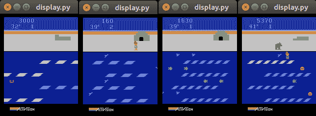

Frostbite截图，所有截图均来自精英基因组游戏会话

看到训练后的控制器ANN仅从视觉观察中学习游戏规则，并能展示出如此流畅的游戏操作，真是令人惊叹。

接下来，我们将讨论一种额外的可视化方法，它允许我们分析结果。

# 神经进化可视化检查器

在神经进化过程中，我们正在进化一个个体群体。每个个体都会在测试环境（如Atari游戏）中进行评估，并为每个进化代收集每个个体的奖励分数。为了探索神经进化过程的一般动态，我们需要一个工具来可视化每个进化代每个个体的结果云。同时，观察精英个体的适应度分数变化，有助于理解进化过程的进展。

为了满足这些要求，Uber AI的研究人员开发了VINE工具，我们将在下一部分讨论。

# 设置工作环境

要使用VINE工具，我们需要使用以下命令在我们的虚拟Python环境中安装额外的库：

```py
$ pip install click
$ conda install matplotlib
$ pip install colour
$ conda install pandas
```

这些命令将所有必要的依赖项安装到我们为实验创建的虚拟Python环境中。接下来，我们将讨论如何使用VINE工具。

在运行前面的命令之前，不要忘记使用以下命令激活适当的虚拟环境：`conda activate deep_ne`。

# 使用VINE进行实验可视化

现在，当我们在Python虚拟环境中安装了所有依赖项后，我们就可以使用VINE工具了。首先，你需要使用以下命令从Git仓库克隆它：

```py
$ git clone https://github.com/uber-research/deep-neuroevolution.git
$ cd visual_inspector
```

在这里，我们将深度神经进化仓库克隆到当前目录，并将目录更改为包含VINE工具源代码的`visual_inspector`文件夹。

让我们讨论一下如何使用VINE工具来可视化Uber AI Lab提供的Mujoco Humanoid实验结果。更多关于Mujoco Humanoid实验的详细信息可以在[https://eng.uber.com/deep-neuroevolution/](https://eng.uber.com/deep-neuroevolution/)找到。

现在，我们可以使用以下命令运行Mujoco Humanoid实验结果的可视化，这些结果包含在`sample_data`文件夹中：

```py
$ python -m main_mujoco 90 99 sample_data/mujoco/final_xy_bc/
```

前一个命令使用了Uber AI Lab从其实验中提供的用于训练类人行走的数据，并显示了以下图表：

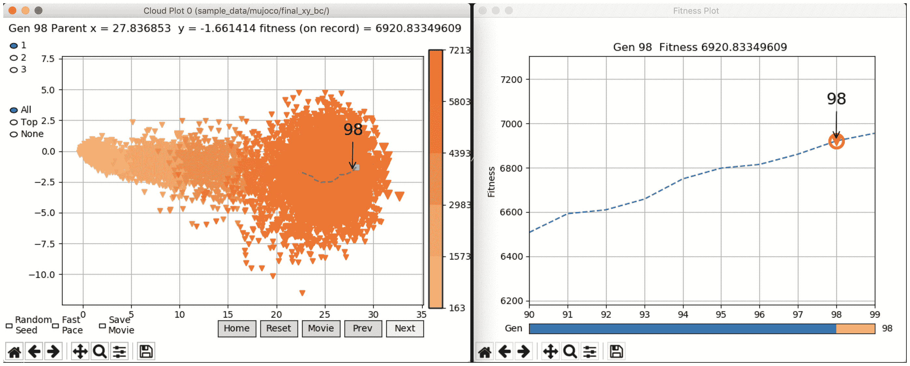

VINE工具对类人行走结果的可视化

在图表的左侧，你可以看到种群中每个个体在`90`代到`99`代之间的结果云。在图表的右侧，你可以看到每一代种群精英的适应度分数。在右侧的图表中，你可以看到进化过程展示了从一代到下一代适应度分数增加的积极动态。

左侧图表上的每个点都代表种群中每个个体的行为特征点。人形运动任务的行为特征是轨迹结束时人形的最终位置。它离原点坐标（`0,0`）越远，个体的适应度分数就越高。你可以看到，随着进化的进展，结果云正远离原点坐标。这种结果云的移动也是积极学习动态的信号，因为每个个体都能够保持更长时间的平衡。

关于Mujoco人形运动实验的更多详细信息，请参阅[https://eng.uber.com/deep-neuroevolution/](https://eng.uber.com/deep-neuroevolution/)上的文章。

# 练习

1.  尝试增加实验中的`population_size`参数，看看会发生什么。

1.  尝试创建实验结果，这些结果可以使用VINE进行可视化。你可以使用`ga.py`脚本中的`master_extract_parent_ga`和`master_extract_cloud_ga`辅助函数来完成此操作。

# 摘要

在本章中，我们讨论了如何使用神经进化来训练具有超过400万个可训练参数的大型ANN。你学习了如何应用这种方法来创建能够仅通过观察游戏屏幕学习游戏规则的成功代理，从而玩经典Atari游戏。通过完成本章中描述的Atari游戏实验，你了解了卷积神经网络（CNNs）以及它们如何将高维输入，如游戏屏幕观察，映射到适当的游戏动作。你现在对CNNs在深度强化学习（deep RL）方法中的价值函数近似有了坚实的理解，该方法由深度神经进化算法指导。

通过本章获得的知识，你将能够将深度神经进化方法应用于具有高维输入数据域，例如从摄像头或其他图像源获取的输入。

在下一章中，我们将总结本书所涵盖的内容，并提供一些关于你如何继续自我教育的提示。
