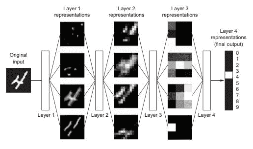
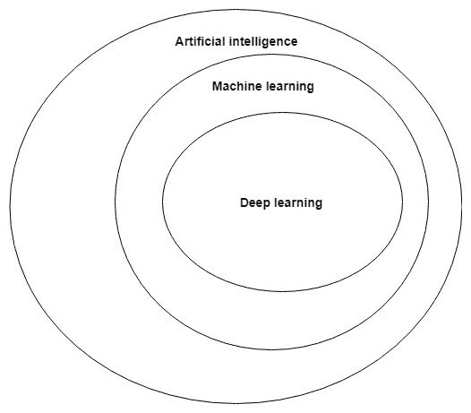
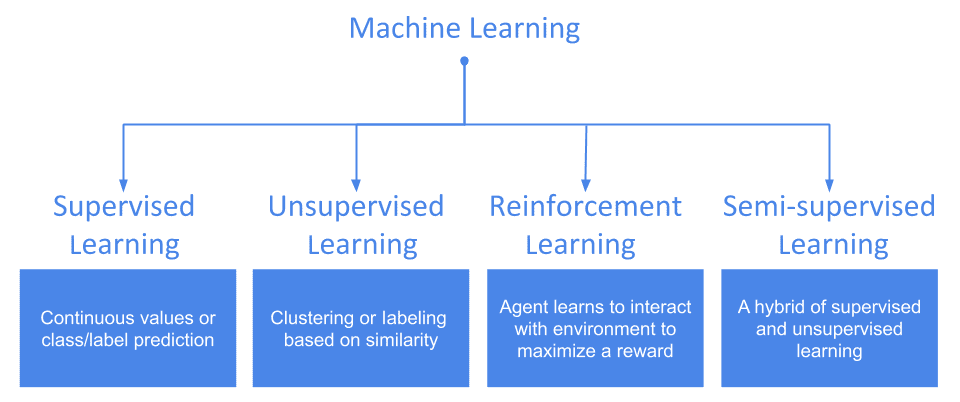
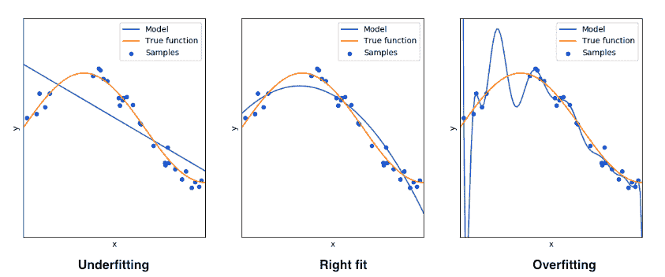
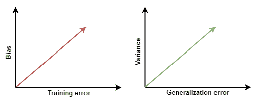
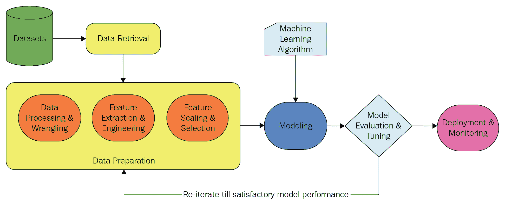

# 第二章：解密人工智能与机器学习基础

“正如电力在 100 年前几乎改变了一切，今天我实际上很难想出一个我认为在接下来的几年中不会被人工智能改变的行业。”

- 安德鲁·吴

这句话可能听起来非常熟悉，毋庸置疑，作为一句声明，它在当前的技术颠覆背景下产生了强烈的共鸣。近年来，**人工智能**（**AI**）已成为几乎每个行业的重要关注点。无论是教育公司、电信公司，还是在医疗行业工作的组织——所有这些行业都已将人工智能融入其中，以提升其业务。人工智能与多个行业的这种深度融合，随着时间的推移只会变得更好，并以智能的方式解决现实世界中的关键问题。今天，我们的手机可以根据指示为我们预约临床检查，我们的手机摄像头能够告诉我们它们拍摄的图像中的多个由人类感知的属性，我们的汽车报警系统可以检测到我们的驾驶动作，并在可能发生事故时保护我们。这些例子只会越来越好，并随着研究、技术进步和计算能力的普及变得更加智能。

随着我们迈入软件 2.0 时代，理解为什么一项自 1950 年代就已存在的技术如今成为头条新闻显得尤为重要。是的！人工智能诞生于 1950 年代，当时一小部分计算机科学家和数学家，如**艾伦·图灵**，开始思考机器是否能思考，是否可以赋予它们智能，让它们无需显式编程就能自主回答问题。

在这一思想诞生后不久，**约翰·麦卡锡**于 1956 年在一次学术会议上首次提出了“人工智能”这一术语。从**图灵**在其论文《计算机机械与智能》中提出的“**机器能思考吗？**”（大约在 1950 年）问题，到今天的 21 世纪，人工智能的世界展现了一些前所未见的结果，甚至是我们曾经无法想象的。

今天，几乎不可能想象一个没有使用**互联网**的日子。它已经轻松成为我们生活中的基本需求之一。我们最喜爱的搜索引擎能够直接回答我们的问题，而不是给出一长串相关的链接。它们可以分析在线文本，理解其意图并总结内容。所有这一切的实现，都是因为人工智能的存在。

本书旨在为读者提供一份实用指南，教读者如何利用**深度学习**等人工智能技术，基于**计算机视觉**、**自然语言处理**、**安全性**等领域，构建智能化的 Web 应用程序。本章为读者提供了人工智能及其不同类型的快速回顾，并介绍了机器学习的基本概念，同时介绍了行业中的一些大牌公司及其如何将人工智能与 Web 技术融合的案例。我们将覆盖以下内容：

+   人工智能及其不同类型简介

+   **机器学习**（**ML**）：最受欢迎的人工智能技术

+   **深度学习**（**DL**）的简要介绍

+   人工智能、机器学习与深度学习之间的关系

+   机器学习的基本原理

+   人工智能之前和之后的 Web

+   主要的 Web-AI 玩家及其正在进行的工作

# 人工智能及其类型简介

简单来说，人工智能就是赋予机器执行智能行为的能力。例如，我们许多人都能下棋。从本质上讲，我们通过*学习*下棋的基本原理，接着我们参与与他人对弈。那么，机器可以做到吗？机器能否独立学习并与我们下棋呢？

人工智能试图通过将我们所谓的*智能*以某些规则的形式赋予机器来实现这一目标。**机器**在这里指的是任何能够进行计算的事物。例如，它可以是软件或机器人。

其实，人工智能有多种类型。流行的类型包括：

+   模糊系统

+   专家系统

+   机器学习系统

最后一种类型听起来最为熟悉。我们将在下一节中详细介绍它。但在我们继续之前，现在是回顾一下推动当前人工智能进展的一些关键因素的好时机。

# 推动人工智能发展的因素

推动人工智能发展的主要因素有以下几种：

+   数据

+   算法的进展

+   计算机硬件的进展

+   高性能计算的普及

# 数据

当前的数据量庞大——正如 Google 首席经济学家**Hal Varian**在 2016 年所说：

"自人类文明的黎明到 2003 年，我们仅创造了五个艾字节；而现在，我们每两天就能创造这么多数据。到 2020 年，这一数字预计将达到 53 泽字节（53 万亿吉字节）——增长了 50 倍。"

这可是庞大的数据量。随着数字设备的数量不断增长，这种数据量只会呈指数增长。过去，汽车行驶时仪表盘上仅显示车速。而今天，我们进入了一个时代，汽车的每个部件都可以在每一刻生成日志，帮助我们完全重建汽车生命周期的任何一个瞬间。

一个从生活中学到的东西越多，这个人就会变得越智慧，也就能更好地预测未来事件的结果。类比于机器，软件训练所得到的（优质）数据越多，它在预测未来未见数据时就越准确。

在过去的几年里，由于多种因素，数据的可用性呈指数增长：

+   更便宜的存储

+   更高的数据传输速率

+   基于云的存储解决方案的可用性

+   高级传感器

+   物联网

+   各种数字电子设备形式的增加

+   网站和本地应用程序的使用增加

现在的数字设备比以往任何时候都要多。它们都配备了可以随时生成日志的系统，并通过互联网将这些日志传输到制造它们的公司或任何购买这些数据的其他供应商。此外，许多日志是由人们使用的网站或应用程序创建的。所有这些都可以轻松地存储在基于云的存储解决方案中，或存储在高存储容量的物理存储设备中，而这些现在比以前便宜了。

如果你环顾四周，可能会看到一台你经常使用多个软件和网站的笔记本电脑——这些软件和网站可能都在收集你在上面执行的每个操作的数据。同样，你的手机也是这样一个数据生成设备。通过你的电视机，提供多个频道的电视服务提供商——无论是服务提供商还是频道提供商，都在收集关于你的数据，以便更好地为你服务并改进他们的产品。你只需要想象一下，单个人每天产生的庞大数据量，而在这个星球上有数十亿人！

# 算法的进步

算法是一组明确无误的步骤，能解决给定问题。随着时间的推移，科学的发展以及人类借助数学理解自然法则的深入，算法得到了改进。自然界常常为复杂问题提供了灵感。神经网络可能是如今最受关注的、自然启发的算法之一。

当计算机逻辑开始使用多个 if-else 阶梯时，没人会想到有一天我们会有计算机程序，能够学习生成类似于 if-else 阶梯的结果，而无需手动编写条件。更重要的是，今天我们有计算机程序，可以生成其他程序，来模拟人工智能！

毫无疑问，随着时间的推移，人类开发的算法，甚至现在由机器开发的算法，正变得越来越智能、越来越强大，能够更好地执行任务。这直接推动了神经网络的兴起，虽然它们的初步形式似乎是一个耗时的超嵌套循环，用于解决矩阵和向量运算问题。

# 硬件的进步

当英特尔在 1970 年推出首款动态随机存取内存（DRAM）模块时，它能够存储 1KB 的数据。大约 50 年后，市场上已经有了 128GB 的内存模块。这是原来容量的 1.28 x 10⁸倍。

硬盘也展示了类似的趋势。第一款个人计算机硬盘只能存储宝贵的 5 兆字节，而 2016 年，希捷公司宣布推出一款 60TB 的固态硬盘存储。这是 1.2 x 10⁷倍的增长。

但我们只讨论了直接的个人计算比较，并没有考虑自第一台计算机推出以来技术增长的影响。今天，随着云计算的到来，听到人们谈论**无限云存储**已经变得非常普遍。

人工智能在计算速度和数据存储的指数级增长中受益匪浅。

# 高性能计算的民主化

随着商品硬件成本的降低和性能的提升，高性能计算如今不再是科技巨头的专属。今天，任何个人都可以非常容易地为自己的个人使用搭建一个计算设备网络，以实现高性能计算，前提是他们不满足于单一设备所能提供的卓越性能。然而，投资硬件并不是获得高性能计算的唯一方式。基于云计算的解决方案的出现，使得通过点击部署方法即可使用非常高速的计算基础设施。用户可以随时在网络上启动云实例，并以最低的费用在其上运行性能密集型的软件。

随着高性能计算的普及，个人开发者手中掌握了开发人工智能解决方案的能力。这促使了人工智能的创意和研究型应用数量的激增。

让我们现在揭开当前最流行的人工智能形式，并讨论一些关于它的重要概念。

# 机器学习 – 最流行的人工智能形式

不考虑任何数学符号或过多的理论细节，让我们从直观的角度尝试理解**机器学习**（**ML**）这一术语。为此，我们需要看看我们是如何实际学习的。你还记得在学校时，我们被教导如何识别句子中的词性吗？我们被提供了一套规则来识别句子中的词性。我们得到了许多例子，最初我们的老师会为我们识别句子中的词性，以便有效地*训练*我们，使我们能够利用这种学习经验来识别那些没有教给我们的句子中的词性。此外，这个学习过程本质上适用于我们所学的任何内容。

如果我们也能以类似的方式训练机器呢？如果我们能以某种方式编程，让它们能从经验中学习，并且基于这些知识开始回答问题呢？嗯，这已经实现了，而无论我们是否意识到，我们都在享受它带来的好处。这正是直观理解下的机器学习（ML）。为了更正式、标准的理解，我们来看一下汤姆·米切尔（Tom Mitchell）在《机器学习》一书中给出的定义：

"一个计算机程序如果能在某个任务 T 和某个性能衡量标准 P 下，随着经验 E 的增加，其在 T 任务上的表现（通过 P 衡量）得到改进，那么我们就说它从经验 E 中学习。"

上面的定义是我们刚才从直观角度讨论的机器学习（ML）更精确的版本。值得注意的是，今天我们所看到的大多数人工智能奇迹正是因为这种形式的人工智能得以实现。

我们现在对机器学习（ML）有了一个大致的了解。接下来，我们将进入下一部分，讨论机器学习中最强大的子领域——深度学习（DL）。我们不会深入讲解复杂的数学细节，而是像这一部分一样，直观地进行解析。

# 什么是深度学习（DL）？

接下来是最激动人心的部分，可能也是本世纪最火的技术术语。现实暂且不提，我们现在在某种程度上已经理解了**学习**，那么让我们来讨论术语*深度学习*中的第一个部分——**深度**。

深度学习（DL）是机器学习的一种类型，但它完全基于**神经网络**。我们将在下一章中讨论神经网络。任何机器学习系统的基本目标是*学习所给数据的有用表示*。那么，深度学习有什么不同呢？事实证明，深度学习系统将数据视为层次的表示。例如，一张图像可以视为不同特征层次的表示，特征层次包括边缘、轮廓、方向、纹理和梯度等。《Python 深度学习》一书中的以下图示很好地呈现了这个概念：

在前面的图中，一个深度学习系统被用来对手写数字的图像进行分类。系统以手写数字图像作为输入，并尝试学习其底层表示。在第一层，系统学习诸如笔画和线条等通用特征。随着层数的增加，它会学习到更加具体的特征。层数越多，系统就越*深*。我们来看一下弗朗索瓦·肖莱（François Chollet）在《Python 深度学习》一书中给出的定义：

"深度学习中的**深度**并不是指通过这种方法所获得的任何更深的理解；它实际上代表的是连续的层次化表示。多少层次的表示在数据模型中起到作用，这被称为模型的深度。[...] 在深度学习中，这些分层表示几乎总是通过称为神经网络的模型学习的，神经网络的结构是通过字面上的层次堆叠在一起的。"

这个定义恰如其分地捕捉到了深度学习的所有必要要素，并巧妙地引入了将数据视为分层表示的概念。因此，广义上的深度学习系统将数据分解成简单的分层表示，并且为了学习这些表示，它通常使用多层（这就是所谓的*深度*）。接下来，我们将从大局出发，了解 AI、ML 和 DL 之间的关系。

# AI、ML 和 DL 之间的关系

为了确保我们对 AI、ML 和 DL 之间的区别有清晰的理解，下面的图表将帮助我们优雅地展示这三者之间的关系：

这个图表非常直观，且在许多深度学习领域的书籍中都有提到。让我们试着从这个图表中得出一个有趣的结论。

所有的深度学习系统都是机器学习系统，因此所有的深度学习系统也是人工智能系统。但反过来并不成立——并非所有的人工智能系统都是深度学习系统。

这个表述可能乍一看有些令人困惑，但如果我们掌握了基础，那么这句话就能很好地阐明 AI、ML 和 DL 之间的区别。接下来，我们将回顾一些必要的 ML 术语和概念，这些概念将在本书后续部分中用到。

# 重温 ML 的基本概念

我们已经了解了 ML 的含义。在本节中，我们将重点讨论几个术语，如监督学习和无监督学习，并将回顾标准 ML 工作流中涉及的步骤。但你可能会问：为什么是 ML？我们应该在本书中学习*深度学习（DL）*的应用。我们刚刚了解到，DL 只是一种 ML。因此，快速回顾一下基本的 ML 相关概念将会有所帮助。让我们从几种类型的 ML 及其相互区别开始。

# ML 的类型

机器学习涵盖了众多的算法和话题。虽然每个构成机器学习模型的算法都只是对给定数据进行的数学计算，但提供的数据形式以及任务执行的方式可能有很大不同。有时，你可能希望你的机器学习模型根据过去房价的数据，结合房屋的详细信息（如房间数量和楼层数），预测未来的房价；而在其他时候，你可能希望你的机器学习模型学会如何与人对战玩电子游戏。对于第一个任务，你可以预期输入数据是表格格式的，但对于第二个例子，可能无法像第一个那样呈现。因此，机器学习算法根据它们接收的输入数据以及它们应该生成的输出类型，分为三大类及其衍生形式，具体如下：

+   监督学习

+   无监督学习

+   强化学习

+   半监督学习

下图展示了三种主要的机器学习类型，以及作为第四种类型的混合形式，并对每种类型进行了简要概述：

你可能听说过机器学习的第四种形式——半监督学习，它融合了监督学习和无监督学习的特点。

现在让我们根据它们的工作原理以及它们能够解决的问题类型，深入理解这些机器学习类型。

# 监督学习

在这种机器学习形式中，算法会接收到大量的训练样本，这些样本包含有关所有参数或*特征*的信息，这些参数或特征将用于确定输出特征。这个输出特征可以是一个连续的值域，也可以是一个离散的标签集合。基于这一点，监督学习算法可以分为两部分：

+   **分类**：在输出特征中生成离散标签的算法，如*正常*和*不正常*，或者一组新闻类别。

+   **回归**：当输出特征具有真实值时，例如，一个政党在选举中可能获得的票数，或一个材料在达到其熔点时的温度。

大多数机器学习爱好者在开始学习机器学习时，通常首先接触到监督学习，因为它直观且简单。它有一些最简单的算法，易于理解，即使没有深入的数学知识，也能理解，甚至这些算法源自数学学生在学校最后几年的学习内容。最著名的监督学习算法包括线性回归、逻辑回归、支持向量机和 k 近邻算法。

# 无监督学习

无监督学习适用于训练样本没有输出特征的情况。你可能会想，那么在这种情况下，我们究竟要学习或预测什么呢？答案是相似性。更具体地说，当我们有一个无监督学习的数据集时，我们通常是试图学习训练样本之间的相似性，然后为它们分配类别或*标签*。

想象一群人站在一个大草地上，他们都有年龄、性别、婚姻状况、薪资范围和教育水平等特征。现在，我们希望根据他们的相似性将他们分组。我们决定将他们分为三个组，看到他们根据性别自发地分为女性组、男性组和其他性别的组。然后，我们再要求他们在这些组内根据年龄段形成子组—儿童、青少年、成人和老年人。这样我们就得到了 12 个子组。我们还可以根据任何两个个体的相似性进一步细分子组。此外，前述的分组方式只是多种分组方式中的一种。现在，假设有 10 个新成员加入了这群人。由于我们已经定义好了组，因此可以很容易地将这些新成员分配到这些组中。因此，我们可以成功地为他们分配组标签。

上述例子展示了无监督学习的一种形式，它可以分为两种类型：

+   **聚类**：这是根据特征的相似性将训练样本分组。

+   **关联**：这是指发现特征或训练样本之间的抽象关联或规则。例如，通过分析商店的销售日志，发现顾客大多在晚上 7 点后购买啤酒。

K 均值聚类、DBSCAN 和 Apriori 算法是一些广为人知的用于无监督学习的算法。

# 强化学习

**强化学习**（**RL**）是一种机器学习方法，其中虚拟智能体尝试通过与环境的交互来学习，以便能够从某一特定的动作集合中获得最大的奖励。

让我们通过一个小例子来理解这一点——假设你构建了一个玩飞镖的机器人。现在，机器人只有在击中飞镖盘中心时才会获得最大奖励。它从一次随机的投掷开始，落在最外圈。它获得了一定的积分，假设是 x1。它现在知道，投掷到这个区域附近会得到预期值为 x1 的结果。所以，在下一次投掷时，它稍微改变了一下角度，幸运地落在了第二外圈，获得了 x2 积分。由于 x2 大于 x1，机器人取得了更好的结果，并且它将学会将飞镖投掷到该区域附近。如果飞镖落得比最外圈还远，机器人将不断向它的第一次投掷位置靠近，直到得到更好的结果。

在几次这样的试验中，机器人不断学习更好的投掷位置，并且从这些位置稍作偏离，直到找到下一个更好的投掷点。最终，它找到了靶心，并且每次都能获得最高的分数。

在前面的示例中，你的机器人是那个试图向飞镖盘投掷飞镖的智能体，而飞镖盘则是环境。投掷飞镖是智能体对环境执行的动作。智能体得到的积分充当奖励。在多次试验中，智能体通过执行不同的动作来尽可能最大化它获得的奖励。

一些著名的强化学习算法包括蒙特卡洛方法、Q 学习和 SARSA。

# 半监督学习

虽然我们已经讨论了三种主要的机器学习类型，但仍然存在另一种类型，那就是半监督学习。根据这个术语的名称，你可以猜到它与标注和未标注的训练样本混合有关。在大多数情况下，未标注的训练样本数量超过了标注样本的数量。

半监督学习在将一些标注样本加入到完全属于无监督学习的问题中时，已被成功地应用于产生更高效的结果。此外，由于只有少量样本被标注，因此避免了监督学习的复杂性。采用这种方法，我们可以得到比纯粹无监督学习系统更好的结果，同时也比纯监督学习系统消耗更少的计算资源。

# 必要的术语

我们已经了解了不同类型的机器学习系统。现在，我们将学习一些与机器学习密切相关的重要术语，这些术语将在本书后续章节中帮助我们理解。

# 训练集、测试集和验证集

任何机器学习系统都需要**数据**。没有数据，设计一个机器学习系统几乎是不可能的。现在我们并不关心数据的数量，但需要记住的是，我们需要数据来设计机器学习系统。一旦我们有了数据，就会用它来*训练*我们的机器学习系统，以便它们能在新数据上*预测一些东西*（这里的“东西”是一个广泛的术语，根据不同的问题有所不同）。因此，用于训练的数据显示为**训练集**，而用于测试模型的数据显示为**测试集**。另外，在实际将模型应用于测试数据之前，我们通常会在另一组数据上验证其性能，这组数据称为**验证集**。有时，我们无法直接获得这些精确划分的数据，我们只能得到原始、难以理解的数据，然后再根据需要进行处理和划分。

从技术上讲，这三组数据中的所有实例都应该彼此有所不同，同时数据中的分布应该是相同的。如今，许多研究者发现这些假设存在重要问题，并提出了一种叫做**对抗训练**的方法，这超出了本书的讨论范围。

# 偏差和方差

偏差和方差是任何机器学习模型中非常内在的特征。对它们有很好的理解，实际上有助于进一步评估模型。**偏差和方差的权衡**实际上是实践者用来评估机器学习系统性能的一个重要工具。

我鼓励你观看安德鲁·吴的这场讲座，了解更多关于这种权衡的内容，链接：[`www.youtube.com/watch?v=fDQkUN9yw44&t=293s`](https://www.youtube.com/watch?v=fDQkUN9yw44&t=293s)

偏差是机器学习算法为学习给定数据中潜在的表示所做的一系列假设。当偏差较高时，意味着相应的算法对数据做出了更多的假设；而当偏差较低时，算法尽可能少地做出假设。一个机器学习模型在训练集上表现良好时，通常被认为具有低偏差。一些低偏差的机器学习算法包括 k 近邻和支持向量机，而像逻辑回归和朴素贝叶斯这样的算法通常是高偏差算法。

在机器学习中，方差涉及数据中存在的信息。因此，高方差指的是机器学习模型能够捕捉到数据中整体信息的质量。低方差则恰恰相反。像支持向量机这样的算法通常具有高方差，而像朴素贝叶斯这样的算法则具有低方差。

# 过拟合与欠拟合

当一个机器学习模型在训练数据上表现非常好，但在测试集或验证集上的表现较差时，这种现象被称为**过拟合**。造成这种现象的原因可能有多种，以下是最常见的一些：

+   模型相对于数据过于复杂。具有非常高层次的决策树或层数较多的神经网络是这类模型复杂性的典型例子。

+   数据有很多特征，但样本数量非常少。

在机器学习文献中，过拟合的问题也被视为*高方差*问题。**正则化**是防止过拟合的最常用方法。

我们已经讨论过偏差的概念。一个模型如果在训练数据上表现良好，则偏差较低，也就是说，模型在推断数据的表示时没有做出过多假设。如果模型在训练数据上表现糟糕，则称该模型有高偏差，并且该模型是**欠拟合**的。欠拟合可能有很多原因，以下是其中最常见的一些：

+   模型过于简单，无法学习到数据的潜在表示。

+   数据的特征在输入给机器学习模型之前没有进行有效的工程化。特征工程是这个过程中的重要部分。

基于这一讨论，我们可以得出一个非常有用的结论：一个过拟合的机器学习模型可能正遭遇高方差的问题，而一个欠拟合的模型可能正遭遇高偏差的问题。

如果没有以下图表，关于过拟合和欠拟合的讨论将是不完整的（该图由 Andrew Ng 在他的旗舰课程*机器学习*中展示）：

上面的图表清晰地展示了通过数据点拟合曲线的欠拟合和过拟合情况。它还向我们展示了一个**泛化**良好的模型，即在训练集和测试集上都能表现良好的模型。蓝色的模型预测线远离样本，导致欠拟合，而在过拟合的情况下，模型捕捉了训练数据中的所有点，但并没有产生一个在训练数据以外能够表现良好的模型。

通常，将数据的表示学习视为近似最能描述数据的函数问题。一个函数可以像之前的图形一样轻松地绘制，因此，出现了**曲线拟合**的概念。模型能够很好地泛化的、介于欠拟合和过拟合之间的最佳位置被称为良好拟合。

# 训练误差和泛化误差

模型在训练阶段进行预测时所犯的错误统称为**训练误差**。模型在验证集或测试集上测试时所犯的错误被称为**泛化误差**。

如果我们要绘制这两种误差与偏差和方差（以及最终的过拟合和欠拟合）之间的关系图，它大致会是下面这样的（尽管这种关系不一定总是像图中所示的那样线性）：

如果一个机器学习模型欠拟合（高偏差），那么它的训练误差必然较高。另一方面，如果模型过拟合（高方差），那么它的泛化误差较高。

我们将在接下来的部分中查看一个标准的机器学习工作流程。

# 一个标准的机器学习工作流程

任何项目都始于一个明确的问题，机器学习项目也不例外。在开始一个机器学习项目之前，明确理解你试图通过机器学习解决的问题是非常重要的。因此，问题的提出和与标准机器学习工作流程的映射是机器学习项目的良好起点。那么，**机器学习工作流程**指的是什么呢？这一部分将讨论这一主题。

设计机器学习（ML）系统并使用它们解决复杂问题需要一套除机器学习外的其他技能。需要知道的是，机器学习需要掌握多个方面的知识，如统计学、领域知识、软件工程、特征工程以及基础的高中数学，且各部分所需比例不同。要能够设计这样的系统，某些步骤对于几乎任何机器学习工作流程来说都是至关重要的，每个步骤都需要特定的技能。在这一部分，我们将简要了解这些步骤并讨论它们。

这个工作流程的灵感来源于**CRISP-DM**，它代表着**跨行业数据挖掘标准流程**，在涉及数据挖掘和分析的众多行业中广泛应用。

# 数据获取

正如本章前面所提到的，机器学习系统需要数据才能运行。数据并非总是可用，实际上，大部分时间数据本身并不是以可以直接用于训练机器学习模型的格式存在。但是，如果我们针对某个问题没有标准数据集，如何处理呢？这就是真实的情况！这种情况出现在大多数现实中的机器学习项目中。例如，假设我们想分析 2018 年新年决心相关的推文情感，并尝试估算出其中最有意义的内容。这实际上是一个没有标准数据集的问题。我们将不得不通过推特的 API 来抓取数据。另一个很好的例子是商业日志。商业日志是知识的宝藏。如果有效地挖掘和建模，它们可以帮助许多决策过程。但是，通常日志不会直接提供给机器学习工程师。因此，机器学习工程师需要花费大量时间去弄清楚日志的结构，并可能编写脚本来按照需求捕获日志。所有这些过程统称为**数据获取**或**数据收集**。

# 数据准备

在数据收集阶段之后，我们倾向于准备数据，将其输入到机器学习系统中，这被称为**数据准备**。值得一提的是，这是机器学习工作流/管道中最耗时的部分。数据准备包括一系列步骤，具体如下：

+   探索性数据分析

+   数据处理与整理

+   特征工程与提取

+   特征缩放和选择

这是机器学习项目中最耗时的部分之一。当我们从更广泛的角度审视整个过程时，我们发现数据识别和收集有时也非常重要，因为如前所述，正确的格式可能并不总是可用。

# 探索性数据分析（EDA）

数据收集完成后，数据准备阶段的第一步是**探索性数据分析**，通常简称为**EDA**。EDA 技术使我们能够更详细地了解数据，从而更好地理解数据。这是整个机器学习管道中极其重要的一步，因为如果我们对数据本身缺乏充分的了解，盲目地将机器学习模型应用于数据，很可能不会产生好的结果。EDA 为我们提供了前进的方向，并帮助我们决定管道中的后续步骤。EDA 涉及许多内容，如计算数据的有用统计量，并确定数据是否存在离群值。它还包括有效的数据可视化，帮助我们图形化地解读数据，从而以有意义的方式传达数据的关键信息。

简而言之，EDA 的核心就是更好地了解数据。

# 数据处理与整理

我们已经对数据进行了某些统计分析。现在怎么办？大多数情况下，从多个数据源收集的数据以原始形式呈现，无法直接输入到机器学习模型中，因此需要进一步的数据处理。

但你可能会问，为什么不以一种方式收集数据，使其在检索时就完成所有必要的处理？这通常不是一个好的做法，因为它破坏了工作流的模块化。

正因为如此，为了使数据在工作流后续步骤中可以使用，我们需要对其进行清理、转换和持久化。这包括多项工作，如数据归一化、数据标准化、缺失值填补、从一个值到另一个值的编码转换以及离群值处理。所有这些统称为**数据整理**。

# 特征工程与提取/选择

假设有一家分析公司的一名员工收到公司的账单数据，并被经理要求使用这些数据建立一个机器学习系统，以便优化公司的整体财务预算。现在，这些数据的格式无法直接提供给机器学习模型，因为机器学习模型期望数据以数值向量的形式呈现。

虽然数据可能已经处理得不错，但员工仍然需要做*某些事情*，以将这些数据转换为有利的形式。尽管数据已经经过清理，但他们仍然需要决定哪些特征要包含在最终数据集中。实际上，任何可度量的内容都可以是一个特征。此时，良好的领域知识非常重要。这些知识能够帮助员工选择具有*高预测能力*的特征。听起来可能有点简单，但这实际上需要大量的技能，并且绝对是一个具有挑战性的任务。这是**特征工程**的经典例子。

有时，我们采用一些技术来帮助我们从给定的数据集中自动提取最有意义的特征。特别是在数据维度非常高且特征难以解释时，这一点特别有用。这被称为**特征选择**。特征选择不仅有助于开发一个具有最相关特征的机器学习模型，还能提高模型的预测性能并减少计算时间。

除了特征选择，我们可能还希望通过降维来更好地可视化数据。此外，**降维**还用于从完整的数据特征集中捕获一组具有代表性的特征。**主成分分析**（**PCA**）就是一种非常流行的降维技术。

需要牢记的是，特征选择和降维并不是同一回事。

# 建模

我们终于来到了看似最激动人心的步骤——**机器学习建模**部分。但值得注意的是，一个好的机器学习项目不仅仅是关于这一部分。之前提到的所有部分同样对项目标准的提升起到了关键作用。实际上，数据是如何收集的对项目来说非常重要，为此，我们有强大的数据工程师提供帮助。现在，先把这部分放到一边。

到目前为止，我们已经将数据处理得相当好。在建模过程中，我们将训练数据输入到机器学习模型中进行训练，监控它们的训练进度，并调整不同的超参数以优化其性能，然后在测试集上评估模型。*模型比较*也是这一阶段的一部分。事实上，这确实是一个*迭代*的过程，并在一定程度上涉及*试错*。

这里的主要目标是提出一个最佳地表示数据的机器学习模型，即它能够*很好地泛化*。计算时间是我们在这里必须考虑的另一个因素，因为我们需要一个在合理时间框架内表现良好的模型，从而优化某个业务结果。

以下是构成建模核心部分的内容：

+   模型训练

+   模型评估

+   模型调优

# 模型训练

这是建模的基础部分，我们将数据输入不同的机器学习模型并**训练**模型，以使其能够全面地学习数据的表示。我们可以通过*训练误差*来看模型在训练过程中如何进展。我们通常还会引入*验证误差*（即我们同时验证模型训练），这是一个标准做法。现在的现代库大多数都支持这样做，我们将在本书接下来的章节中看到。接下来我们将讨论一些最常用的误差指标。

# 模型评估

我们已经训练了一个机器学习模型，但它在从未见过的数据上表现如何呢？我们用**模型评估**来回答这个问题。

不同的机器学习算法需要不同的评估指标。

对于监督学习方法，我们通常使用以下指标：

+   混淆矩阵，它由四个值组成：真正例、假正例、真负例和假负例

+   准确率、精确率、召回率和 F1 分数（这些都是混淆矩阵的衍生指标）

+   **接收者操作特征**（**ROC**）曲线和**曲线下面积**（**AUC**）指标

+   R 平方（决定系数）、**均方根误差**（**RMSE**）、F 统计量、**赤池信息量准则**（**AIC**）以及专门针对回归模型的 p 值

在本书中，我们将结合这些指标来评估我们的模型。虽然这些是最常见的评估指标，无论是针对机器学习（ML）还是深度学习（DL），但针对不同领域还有更具体的评估指标。我们将在后续章节中讲到这些内容。

在这里值得一提的是，在*分类*问题中，特别是当数据*不平衡*时，我们常常会陷入*准确性悖论*的陷阱。在这些情况下，分类准确率只能反映一部分情况，即它给出了正确预测的百分比，而不是模型对负类实例（即最初的问题——预测不常见类别）的预测能力。这种系统在数据不平衡的情况下会失败，因为准确性并不能反映模型在预测负类实例时的表现。

以下是评估无监督方法（如聚类）时最常用的指标：

+   轮廓系数

+   平方误差之和

+   同质性、完整性和 V 度量

+   卡林斯基-哈拉巴兹指数

评估指标/误差指标对于训练集、测试集或验证集是相同的。我们不能仅仅通过查看模型在训练集上的表现就得出结论。

# 模型调优

到了这一阶段，我们应该已经有了一个基准模型，可以在此基础上进一步**调整模型**，使其表现更好。模型调整对应于**超参数调整/优化**。

机器学习模型有不同的*超参数*，这些超参数无法通过模型训练来学习。它们的值由从业者设置。你可以将超参数的值比作音频均衡器的旋钮，我们手动调整旋钮以获得完美的听觉体验。在后续章节中，我们将看到超参数调优如何极大地提升模型的性能。

有几种技术可以用来调优超参数，最常用的有以下几种：

+   网格搜索

+   随机搜索

+   贝叶斯优化

+   基于梯度的优化

+   进化优化

# 模型比较与选择

在完成模型调优部分后，我们肯定会希望对当前模型之外的其他模型重复整个*建模*过程，希望能得到更好的结果。作为机器学习从业者，我们的职责是确保最终得出的模型比其他模型更优秀（显然是在多个方面）。自然地，比较不同的机器学习模型是一项耗时的任务，而当我们需要赶在短时间内完成任务时，可能无法总是进行此操作。在这种情况下，我们会考虑以下几个模型方面：

+   可解释性，它回答了一个特定问题（模型的可解释性如何？它有多容易被解释和传达？）

+   内存中建模与外存建模

+   数据集中的特征和实例数量

+   类别特征与数值特征

+   数据的非线性

+   训练速度

+   预测速度

这些指标是最常见的，但它们在很大程度上取决于所面临的问题。当这些指标不适用时，一个好的经验法则是查看模型在验证集上的表现。

# 部署与监控

在构建好机器学习模型后，它将与应用程序的其他组件合并，并投入生产。这个阶段称为**模型部署**。开发的机器学习模型的真实表现会在部署到实际系统后进行评估。此阶段还涉及对模型的全面监控，找出模型表现不佳的领域，以及可以进一步改进的方面。监控至关重要，因为它为提升模型的表现提供了手段，从而提升整个应用程序的表现。

这就是进行机器学习项目时最重要的术语/概念的简要介绍。

为了更深入地学习机器学习基础，建议你通过以下资源进行学习：Google 的*机器学习速成课程*（[`developers.google.com/machine-learning/crash-course/`](https://developers.google.com/machine-learning/crash-course/)）和 Sebastian Raschka 的*Python 机器学习*（[`india.packtpub.com/in/big-data-and-business-intelligence/python-machine-learning`](https://india.packtpub.com/in/big-data-and-business-intelligence/python-machine-learning)）。

为了方便参考，你可以查看书中给出的以下图示，来自《*Python 实践转移学习*》（Dipanjan 等人），该图以图像的形式展示了前面提到的所有步骤：

实际上，机器学习（ML）在各个领域带来了大量的改进，几乎没有一个领域没有受到它的影响。本书的重点是构建*智能网页应用程序*。因此，我们将在下一部分开始讨论网页的整体情况以及自人工智能出现以来它是如何变化的，采用前后对比的方式。最终，我们将学习一些大公司及其如何利用人工智能构建世界级的网页应用，这些应用不仅智能，而且解决一些实际问题。

# 人工智能前后的网页

如果你自 2014 年起就是万维网的常规用户，你会同意网站的变化速度是显而易见的。从解决越来越难以辨认的*ReCaptcha*挑战到在后台自动标记为*人类*，网页开发一直是展示过去二十年里人工智能成果的先行者之一。

被誉为互联网发明者的蒂姆·伯纳斯-李爵士提出了他的语义网观点：

"我对 Web 的梦想是[计算机]能够分析 Web 上的所有数据——内容、链接以及人类与计算机之间的交易。一个实现这一目标的“语义网”尚未出现，但一旦它出现，日常的贸易、官僚机制以及我们日常生活的各个方面将由机器与机器之间的对话来处理。人们长期以来推崇的“智能代理”将最终得以实现。"

从呈现大量信息并且其中的链接将你永久带到相关资源的静态页面，到如今网页已经成为一个动态生成信息、不断变化的门户。如果你刷新网页，你可能再也看不到相同的页面视图。

让我们了解一下由于人工智能的兴起，网页开发发生的一些最重要的变化。

# 聊天机器人

如果你曾经好奇，为什么有些网页能通过聊天窗口提供 24 小时全天候帮助，答案几乎总是一个聊天机器人在另一个端口回答你的问题。当 1966 年约瑟夫·魏岑鲍姆的 ELIZA 聊天机器人通过图灵测试而引起全球轰动时，我们几乎无法预见聊天机器人将会在万维网上产生如此巨大的影响（不过一个原因可能是 ARPANET 直到 1969 年才创建）。

今天，聊天机器人无处不在。许多《财富》500 强公司都在这个领域进行研究，并推出了针对其产品和服务的聊天机器人实现。在 Oracle 进行的一项最新调查中，涵盖了来自多个公司和初创公司的 800 名高管的反馈，调查发现近 80%的受访者表示，他们已经使用或计划在 2020 年之前将聊天机器人应用于面向客户的产品。

在人工智能开始驱动聊天机器人之前，像 ELIZA（及其后继者 ALICE）这样的聊天机器人，通常只是根据几个输入模式映射到一组固定的响应。当用户输入句子中出现*母亲*或*父亲*这类词时，几乎肯定会得到询问用户家庭或健康状况的回复。如果用户写下类似“我不想谈论 XYZ 的家庭”的内容，这显然并不是他们期望的回答。

然后，还有那种经典的“抱歉，我没听懂”的回答，这种基于规则的聊天机器人有时显得非常愚笨。神经网络算法的出现使得聊天机器人能够根据用户情感和输入的上下文理解并定制回应。此外，一些聊天机器人会抓取在线数据，以便在遇到新问题时实时构建与新问题中提到的话题相关的回答。除此之外，聊天机器人还被用来为商业门户提供替代界面。现在，通过 WhatsApp 提供的聊天平台，你可以预定酒店或航班。

Facebook Messenger 的机器人平台在对公众开放的前 17 个月内创造了超过 100,000 个机器人。如今，社交网络巨头 Facebook 上的数百个页面都为向其页面发送消息的用户提供自动回复。一些机器人在 Twitter 上运行，能够生成内容，* closely* 模仿人类用户，并且可以回复用户在其帖子上的消息或评论。

你可以在[eliza.botlibre.com](http://eliza.botlibre.com)与 ELIZA 的在线版本聊天。

# 网络分析

在互联网的早期，许多网站都嵌入了类似里程计的计数器。这些计数器简单地统计网站或某个特定页面收到的访问次数。后来，计数器的形式也越来越多样化——包括普通计数器、按天/周/月计数的计数器，甚至基于地理位置的计数器。

网络分析是指收集数据，这些数据本质上是用户的交互日志以及他们如何与基于网络的应用程序互动，处理这些数据以产生绩效指标，然后最终识别出可以采取的措施，帮助公司改善其网络应用程序。

自互联网发明以来，今天的网络应用程序每时每刻都会生成大量的日志。即使你将鼠标指针保持在网页上不动，可能也会被报告到 Google Analytics 仪表盘，从而网站管理员可以查看用户访问了哪些页面，以及他们在页面上停留了多长时间。此外，用户在各页面之间的流动路径也是一个非常有趣的指标。

虽然最早的网络分析工具仅仅测量页面访问次数，能够创建一个页面被访问多少次、多少次是独立用户访问的图示，但它们几乎无法提供用户访问模式的任何信息，除非这些信息被专门硬编码进去，这些数据通常以非常笼统的方式呈现，并且从未与网站特定的内容相关联。相同的分析形式被提供给电商公司，也同样被提供给个人网站。

随着人工智能在网络分析领域带来的革命，今天的工具可以利用人工智能的力量，预测网站未来的表现，甚至建议删除或添加网页上的特定内容，以提高用户与网页的互动。

# 垃圾邮件过滤

当全球一半的电子邮件被标记为垃圾邮件时，这就成了一个问题。虽然我们最初可能会将那些推广业务和产品的欺诈性或不必要的电子邮件视为垃圾邮件，但这仅是其定义的一部分。重要的是要意识到，即使是优质的内容，当它在同一文档中重复多次发布时，也会成为垃圾邮件。此外，自从“垃圾邮件”这一术语首次出现在 Usenet 群组中以来，互联网已经发生了巨大变化。最初，垃圾邮件是为了打扰他人或强制推送信息给特定目标用户而进行的活动，但今天的垃圾邮件已经变得更加复杂，潜在地也更加危险——从能够追踪你的浏览器活动到身份盗窃，今天的互联网充斥着大量危害用户安全和隐私的恶意垃圾邮件。

今天，我们面临着各种类型的垃圾邮件——即时通讯垃圾邮件、网站垃圾邮件、广告垃圾邮件、短信垃圾邮件、社交媒体垃圾邮件，以及许多其他形式的垃圾邮件。

除了少数几种，大多数类型的垃圾邮件都出现在互联网上。因此，能够过滤垃圾邮件并采取保护措施至关重要。虽然最早的反垃圾邮件工作可以追溯到 1990 年代，那时通过识别发送垃圾邮件的 IP 地址来进行处理，但很快就意识到这种方法效率极低，因为黑名单变得越来越庞大，且其分发和维护非常繁琐。

在 2000 年代初，当保罗·格雷厄姆发布了一篇名为*《垃圾邮件计划》*的论文时，首次使用了机器学习模型——贝叶斯过滤——来应对垃圾邮件。很快，几款反垃圾邮件工具便从这篇论文中衍生出来，并证明它们非常高效。

贝叶斯过滤方法对抗垃圾邮件的影响如此之大，以至于在 2004 年*世界经济论坛*上，微软创始人比尔·盖茨曾表示：

“两年后，垃圾邮件问题将会得到解决。”

然而，正如我们今天所知，比尔·盖茨在这个预测上完全错了。垃圾邮件不断演变，垃圾邮件发送者研究贝叶斯过滤方法，找出了规避检测阶段标记为垃圾邮件的方式。如今，神经网络被大规模部署，持续扫描新的电子邮件并决定是否为垃圾邮件，这些判断是人类仅仅通过研究垃圾邮件日志无法做出的。

# 搜索

人工智能的崛起对网络搜索领域产生了深远影响。从最初必须精确知道你希望访问的网页标题的准确措辞，到现在搜索引擎能够识别你周围环境中的歌曲，这一领域因人工智能而彻底改变。

当 1991 年蒂姆·伯纳斯-李建立了万维网虚拟图书馆时，它大致是这样的：

这是一个手动列出的网页集合，可以通过出现在右上角的搜索框进行过滤。显然，与其预测用户的搜索意图，用户自己必须决定其搜索词所属的类别。

当前网页搜索引擎的面貌是在 1993 年 12 月由 Johnathan Fletcher 提出的，当时他创建了 JumpStation，这是第一个使用现代爬虫、索引和搜索概念的搜索引擎。JumpStation 的界面设计正是我们今天看到的 Google 和 Bing 等主流搜索引擎的样子，这使得 Johnathan 成为了“搜索引擎之父”。

两年后，即 1995 年 12 月，当 AltaVista 推出时，它带来了搜索技术的根本变化——无限带宽、搜索提示，甚至允许自然语言查询——这一功能在 1997 年被 Ask Jeeves 更强力地引入。

Google 于 1998 年诞生，并带来了 PageRank 技术。然而，当时市场上有多个竞争者，Google 并没有立即主导搜索引擎市场。五年后，当 Google 申请使用神经网络根据用户的历史搜索记录和访问过的网站定制搜索结果的专利时，局势迅速发生变化，Google 很快成为搜索领域最强大的提供者。

今天，Google 搜索依靠着一个庞大的代码库，部署了多个协同工作的深度神经网络。自然语言处理，主要依靠神经网络，已使 Google 能够判断网页内容的相关性，而得益于**卷积神经网络**（**CNNs**），机器视觉已经能够在 Google 图片搜索中生成准确的结果。令人不意外的是，John Ginnandrea 曾领导 Google 搜索并推出了知识图谱（Google 有时会给出答案的某些问题，如查询结果）；他是 AI 领域最受追捧的专家之一，现在已经被 Apple 招募，以改进 Siri，Siri 也是一个神经网络产品。

# 最大的网络 AI 公司及其在 AI 领域的应用

人工智能的快速增长吸引了众多竞争者争相利用这一机会。在过去的二十年里，多个个人、初创公司甚至大型企业都在寻求从人工智能应用中获取利益。市场上已经出现了一些产品，其中人工智能是它们业务的核心。

<q>"战争是 90%的信息。"  

—— 拿破仑·波拿巴，公元 18 世纪</q>

在第二次世界大战中，盟军部署了轰炸机。这些轰炸机是盟军策略的关键。但由于大量轰炸机在敌方领土被击落，这些轰炸机未能完成任务。显然，轰炸机需要更多的装甲。然而，由于装甲重量的限制，无法完全覆盖整个飞机。因此，决定将飞机最关键的部位加装额外的装甲。犹太数学家 Abraham Wald 被要求提出一个方法，来确定哪些部位需要装甲保护。他研究了从战斗中归来的飞机，并记录下哪些部位承受了最多的弹孔。

研究发现，机翼、机头和尾部是承受最多弹孔的部分，因此得出结论，这些部分需要更多的装甲，而驾驶舱和发动机则显示出最少的弹孔：

但令人惊讶的是，Wald 持不同的观点，他建议应加强驾驶舱和发动机的装甲，因为正是那些未能返回的轰炸机才是问题所在。尾部、机翼和机头的弹孔不会对飞机造成致命伤害，因此这些飞机能够成功返回。

就是这样，通过与数据的合作，识别出正确的模式，一位数学家改变了整个第二次世界大战的进程。数据被称为新的石油。更有趣的是，当你拥有石油时，你会将其燃烧以产生电力和能源，驱动车辆。而拥有数据时，你利用它来改善业务和做出决策，进而在未来产生更多的数据。那些意识到这一点并最大化利用现有数据的公司，近年来实现了巨大的增长。让我们看看这些公司如何利用所有数据，通过 AI 创造新机会。

# 谷歌

提到 AI 这个词几乎每个人都会想到的一个名字，谷歌不断地推动并革命化了 AI 的边界。

“我们现在正在见证计算领域的一个新转变：从移动优先到 AI 优先的世界。”——桑达尔·皮查伊，谷歌 CEO

谷歌已经在多个产品中应用 AI，接下来我们来看看其中的一些。

# 谷歌搜索

2018 年 12 月 14 日，搜索`谁是谷歌 CEO`，得到的结果页面大致如下图所示：

上述功能，通过生成常见问题的答案，被称为*谷歌知识图谱*，我们在之前的章节中提到过。除了这一功能，得益于自然语言处理和信息提取等 AI 技术，谷歌搜索的功能也变得更加强大。

通过 AI 技术，能够准确地在视频中提取与用户查询相关的时间点：

接下来，我们将看一下谷歌翻译。

# 谷歌翻译

支持超过 100 种语言，谷歌翻译可能是互联网上最好的公共翻译工具。从能够检测输入的语言，到将其转换成用户设定的目标语言，背后有一张深度神经网络在运行，以提供最佳的翻译效果。这个算法，谷歌自 2016 年 11 月起切换使用，被命名为*谷歌神经机器翻译*算法。它以 API 形式提供给网页开发者，帮助他们将网站内容实时翻译，以便能够服务不同地区的用户。此外，这项服务还与谷歌浏览器 Google Chrome 集成，能够在用户访问网页时，实时翻译网页内容。

# 谷歌助手

Google 的最新项目之一——Google Assistant，是 Apple 的 Siri 和 Microsoft 的 Cortana 的竞争者，也是 Google Now 的继任者。它是一个基于 AI 的虚拟助手，可在移动设备和智能家居设备（品牌为*Google Home*）上使用。目前，它可以在用户的 Google Drive 数据上进行搜索，根据用户的偏好生成结果，提供用户给出的备忘提醒，拨打电话、发送短信，并根据用户的指示，通过触摸屏上的正常点击输入或语音输入执行更多任务：

接下来，我们将看看其他产品。

# 其他产品

AI 是 Google 广告的主要技术之一。点击诱饵或虚假点击问题通过神经网络得到了有效解决。此外，通过使用 AI，可以高效地确定哪种类型的广告在每个网页上的表现最佳。这些技术进步使得 Google 的广告服务迅速抢占了互联网广告市场，超越了之前的广告平台。

Google 的一些项目，如 Google Lens、自动驾驶汽车等，主要都是基于 AI 的项目。

# Facebook

作为互联网上最大的社交平台，Facebook 每天生成大量数据。用户发布的内容、用户提交的报告、Facebook 提供的各种 API 的日志等等，所有这些加起来每天会产生近 4 个拍字节的数据。不用多说，这个科技巨头已经利用这一数据宝藏，想出了方法来使其平台更安全，并提升用户参与度。

# 虚假账户

Facebook 面临的一个主要问题是存在大量的*虚假账户*。为了解决这个问题，Facebook 部署了基于 AI 的解决方案，自动标记并挑战这些账户，确认其身份。仅在 2018 年第一季度，Facebook 就禁用了近 5.83 亿个虚假或克隆账户。

# 假新闻与令人不安的内容

另一个 Facebook 及其收购的消息服务 WhatsApp 面临的问题是虚假新闻或误导性新闻。此外，平台上出现的视觉上和/或情感上令人不安的内容，进一步降低了用户体验。最后，还有几乎所有在线平台都必须应对的问题：垃圾邮件。Facebook 的 AI 算法多年来在识别和删除垃圾邮件方面变得非常擅长。通过应用计算机视觉解决方案，利用 CNN（卷积神经网络），Facebook 开发了一项功能，可以遮挡/模糊令人不安的图像和视频，并在允许用户查看之前要求用户同意。

识别并删除假新闻的工作目前正在进行中，几乎完全通过 AI 的应用来实现。

# 其他用途

Facebook 提供了自己的 Messenger 机器人平台，Facebook 页面和开发者广泛使用该平台，将丰富的互动功能加入公司提供的即时消息服务中。

# 亚马逊

作为全球领先的电子商务平台，亚马逊几乎将 AI 融入了其所有的产品和服务中。虽然它是比 Google、Facebook、Microsoft 和 IBM 等公司晚加入 AI 阵营的，但亚马逊迅速崛起，并吸引了人们对其 AI 应用的关注。让我们看看亚马逊推出的一些主要应用。

# Alexa

为所有由公司生产的 Alexa 和 Echo 设备提供支持的 AI，Alexa 是与 Google Home 竞争的虚拟助手 AI 的名字，后者由 Google Assistant（前身为 Google Now）提供支持。不讨论哪个更好，Alexa 是一个相当先进的 AI，能够回答许多用户觉得有趣和机智的问题。随着亚马逊将 Alexa Skills Studio 向开发者公开，Alexa 产品的使用已显著增长，开发者为 Alexa 能执行的操作做出了巨大贡献。

# 亚马逊机器人技术

当用户在网站上购买产品时，位于华盛顿州肯特市、占地 855,000 平方英尺的巨大配送中心内的一台机器人便会启动，搬起一大箱产品，朝着站点移动，将在平台上售出的产品送到工人手中，工人会从箱子中取出并进一步处理。亚马逊最近在密尔沃基配送中心安装了相同的技术，并计划在不久后将其扩展到其他 10 个大型中心。

# DeepLens

一台人工智能驱动的视频摄像机曾是 2000 年代初的极客梦想。随着亚马逊推出的 DeepLens，这一梦想成为现实，开启的可能性是无穷的。试想一下，当你是派对的主持人时，手机会通知你每个到来的宾客。令人惊讶的是，这已经实现，甚至已经进行过在公共场所安装 CCTV 摄像头来识别罪犯并自动触发警报的实验。

# 总结

在本章中，我们简要介绍了许多对执行 ML 项目至关重要的重要概念和术语。这些内容将在本书中为您提供帮助。

我们从人工智能（AI）是什么以及它的三种主要类型开始。我们观察了推动周围 AI 爆炸性增长的因素。接着，我们简要了解了机器学习（ML）的几个组件以及它们如何在 ML 项目中发挥作用。我们看到了什么是深度学习（DL），以及 AI、ML 和 DL 是如何相互关联的。

在本章的最后，我们看到了几个例子，其中 AI 与 Web 技术相结合，创建智能应用，承诺解决复杂问题。几乎所有支持 AI 的应用背后都有深度学习（DL）的身影。

在接下来的章节中，我们将利用深度学习（DL）来构建智能网页应用。
