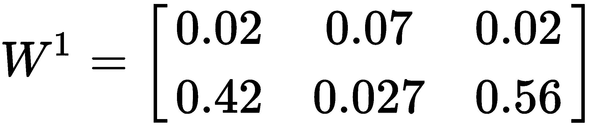
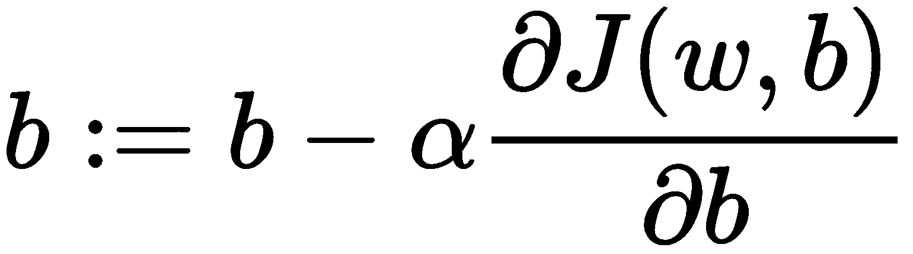
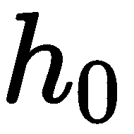
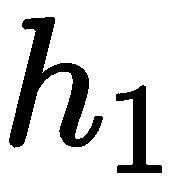
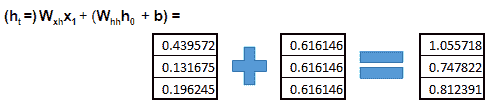

# 第四章：使用 Python 开始深度学习

在第一章中，我们深入探讨了深度学习以及它与机器学习和人工智能之间的关系。在本章中，我们将更深入地探讨这一主题。我们将从了解深度学习的核心——神经网络及其基本组成部分开始，包括神经元、激活单元、反向传播等内容。

请注意，本章不会过多涉及数学内容，但同时，我们也不会忽略那些对神经网络世界至关重要的最基本公式。对于更偏重数学的学习，建议读者阅读 Goodfellow 等人所著的《深度学习》一书（[deeplearningbook.org](http://deeplearningbook.org)）。

以下是我们将在本章中涵盖内容的概述：

+   神经网络及其相关概念的快速浏览

+   深度学习与浅层学习的区别

+   不同类型的神经网络

+   设置基于深度学习的云环境

+   探索 Jupyter Notebooks

# 解开神经网络的谜团

本节的开始，我们将寻找问题的答案：“为什么神经网络被称为'神经'网络？”这个术语背后有什么意义？

我们的直觉告诉我们，它与我们的脑部有关系，这是正确的，但仅仅部分正确。在了解为什么这种理解只部分正确之前，我们需要对大脑的结构有所了解。为此，让我们来看看我们自己大脑的解剖结构。

人类大脑由大约 100 亿个*神经元*组成，每个神经元与大约 10,000 个其他神经元相连接，形成一种类似网络的结构。神经元的输入被称为*树突*，输出被称为*轴突*。神经元的主体部分称为*胞体*。因此，从高层次看，某个特定的胞体与另一个胞体相连接。 "神经"一词源自"神经元"一词，实际上，"神经"是"神经元"的形容词形式。在我们的脑中，神经元是形成我们刚刚讨论的这一密集网络的最基本单元。我们正在慢慢理解人工神经网络与大脑之间的相似性，为了进一步理解这种相似性，我们将简要了解神经元的功能。

网络不过是一个类似图形的结构，包含一组节点和彼此连接的边。在我们的脑部，或任何大脑中，神经元被称为节点，树突被称为顶点。

神经元通过其树突接收来自其他神经元的输入。这些输入是电化学性质的。并非所有输入的力量相等。如果输入的力量足够强大，则连接的神经元会被激活，并继续将输入传递给其他神经元。它们的强度由一个预设的阈值决定，这个阈值使得激活过程具有选择性，从而避免在同一时间激活网络中所有的神经元。

总结来说，神经元接收来自其他神经元的输入总和，这个总和与一个阈值进行比较，然后神经元根据阈值激活。**人工神经网络**（**ANN**），或者简称**神经网络**（**NN**），就是基于这一重要事实，因此才有了这种相似性。

那么，是什么让一个网络成为*神经*网络呢？要构成一个 NN 需要什么？

以下引用来自 Adrian Rosebrock 的《Deep Learning For Computer Vision With Python》一书，以非常值得称赞的方式回答了这个问题：

每个节点执行简单的计算。然后，每个连接携带一个信号（即计算的输出）从一个节点传递到另一个节点，连接上标有一个权重，表示信号被放大或减弱的程度。有些连接的权重大且为正，放大了信号，表示在分类时这个信号非常重要。其他连接则具有负权重，削弱了信号的强度，说明该节点的输出在最终分类中的重要性较低。如果一个系统由带有可通过学习算法修改的连接权重的图形结构组成，我们就称这样的系统为人工神经网络。

我们已经了解了神经网络与大脑的相似性。接下来，我们将利用这些信息进一步了解 ANN 中的基本单元。让我们从了解 ANN 中一个简单神经元的作用开始。

# 人工神经元

我们称在 ANN 中使用的神经元为人工神经元。广义来说，人工神经元可以分为两种类型：

+   线性神经元

+   非线性神经元

# 线性神经元的结构

神经元是神经网络中最基本的单元。让我们看看“神经网络”这个词的第二个词。网络仅仅是一些顶点（也叫节点）的集合，这些顶点的边相互连接。在神经网络中，神经元充当节点。让我们考虑以下神经网络架构，并尝试逐步分析：


我们在前面的图示中看到的是一个具有两个隐藏层的神经网络（在神经网络中，层是神经元的集合），并且只有一个输出。事实上，这种网络被称为两层神经网络。神经网络由以下几个部分组成：

+   单一输入

+   两个隐藏层，其中第一个隐藏层有三个神经元，第二个隐藏层包含两个神经元

+   单一输出

所谓隐藏层并没有更深的心理学意义，它们被称为隐藏层仅仅是因为这些层中的神经元既不是输入层的一部分，也不是输出层的一部分。这里有一个非常明显的地方，那就是在第一个隐藏层之前有一层。为什么我们不把这一层算在内呢？在神经网络的世界里，初始层和输出层并不算在层堆叠中。简单来说，如果有`n`个隐藏层，那么它就是一个`n`层的神经网络。

初始层（也叫输入层）用于接收神经网络的主要输入。在接收到主要输入后，输入层中的神经元将其传递给后续隐藏层中的神经元。在这一传播过程发生之前，神经元会给输入加上权重，并为输入添加一个偏置项。这些输入可以来自不同领域——例如，输入可以是图像的原始像素、音频信号的频率、一组词语等等。通常，这些输入会作为特征向量传递给神经网络。在这种情况下，输入数据只有一个特征。

那么，接下来的两层神经元在做什么呢？这是一个重要的问题。我们可以将权重和偏置添加到输入的过程看作是学习的第一层/级（也叫决策层）。初始隐藏层中的神经元重复这个过程，但在将计算结果发送到下一个隐藏层的神经元之前，它们会将这个值与阈值进行比较。如果阈值条件被满足，那么输出才会传播到下一层。这部分整个神经网络学习过程与我们之前讨论的生物学过程有着显著的相似之处。这也支持了以分层的方式学习复杂事物的理念。

这里有一个问题是：“如果不使用隐藏层，会发生什么？”事实证明，在神经网络中添加更多的复杂度（通过增加更多层）可以比仅有输入层和输出层的网络更简洁地学习输入数据的潜在表示。那么，我们需要多少层呢？我们稍后会讲到这个问题。

让我们在这里引入一些数学公式，来正式化我们刚才学到的内容。

我们将输入特征表示为`x`，权重表示为`w`，偏置项表示为`b`。我们目前要剖析的神经网络模型基于以下规则：


该规则表示，在计算加权输入和偏置的和之后，如果结果大于 0，则神经元输出 1；如果结果小于或等于 0，则神经元输出 0，换句话说，神经元不会激活。对于多个输入特征，规则仍然完全相同，其多元版本如下：


这里，`i`表示我们有`i`个输入特征。上述规则可以分解如下：

+   我们逐个处理特征，然后将它们与权重相乘

+   在对所有输入特征完成该过程后，我们将所有加权输入求和，并最终加上偏置项。

上述过程会继续进行，直到我们网络中的所有层都完成。在这种情况下，我们有两层隐藏层，因此一层的输出会被输入到下一层。

我们刚刚学习的元素是由 Frank Rosenblatt 在 1960 年代提出的。将输入的加权和基于某个阈值分配 0 或 1 的想法也被称为**阶跃函数**。文献中有许多类似的规则，这些被称为更新规则。

我们研究的神经元是**线性神经元**，它们能够学习线性函数。但它们不适合学习本质上是非线性的表示。实际上，几乎所有神经网络接收的输入都是非线性的。在下一节中，我们将介绍另一种类型的神经元，它能够捕捉数据中可能存在的非线性。

你们中的一些人可能会想，这个神经网络模型是不是叫做**MLP**（**多层感知机**）。嗯，确实是。实际上，Rosenblatt 早在 1960 年代就提出了这个模型。那么，什么是神经网络呢？我们很快就会学到答案。

# 非线性神经元的构造

非线性神经元意味着它能够响应数据中可能存在的非线性。这里的非线性基本上意味着，对于给定的输入，输出不会以线性方式变化。请看下面的图示：


上述两个图都描述了神经网络接收的输入与网络产生的输出之间的关系。从第一个图中可以看出，输入数据是线性可分的，而第二个图则告诉我们，输入数据不能线性分割。在这种情况下，线性神经元将会失败，因此需要非线性神经元。

在神经网络的训练过程中，可能会出现小幅度改变偏置和权重值会对神经网络的输出产生剧烈影响的情况。理想情况下，这种情况不应发生。对偏置或权重值的微小改变应该只导致输出的微小变化。当使用 step 函数时，权重和偏置的变化可能会对输出产生较大的影响，因此需要使用其他的函数来替代 step 函数。

神经元的操作背后有一个函数。在线性神经元的情况下，我们看到它的操作是基于 step 函数的。我们有一些函数能够捕捉非线性问题。sigmoid 函数就是其中之一，使用这种函数的神经元通常被称为 sigmoid 神经元。与 step 函数不同，sigmoid 神经元的输出是根据以下规则生成的：


所以，我们最终的更新规则变为以下形式：


那么，为什么在捕捉非线性时，sigmoid 函数比 step 函数更好呢？让我们通过图形来比较它们的表现，理解这一点：


前面两张图清晰地展示了这两个函数的内在特性。显而易见，sigmoid 函数对非线性问题的敏感度高于 step 函数。

除了 sigmoid 函数，以下是一些广泛知名且常用于赋予神经元非线性特征的函数：

+   Tanh

+   ReLU

+   Leaky ReLU

在文献中，这些函数以及我们刚刚学习的两个函数，被称为激活函数。目前，ReLU 及其变体无疑是最成功的激活函数。

我们仍然有一些与人工神经网络相关的基本概念没有讲解。让我们总结一下到目前为止学到的内容：

+   神经元及其两种主要类型

+   层

+   激活函数

我们现在可以在多层感知机（MLP）和神经网络之间做出区分。Michael Nielson 在他的在线书籍《神经网络与深度学习》中很好地描述了这一点：

有些时候，由于历史原因，这类多层网络有时会被称为*多层感知机（MLP）*，尽管它们是由 sigmoid 神经元组成，而非感知机。

在本书中，我们将贯穿始终地使用神经网络和深度神经网络的术语。接下来，我们将继续学习神经网络的输入层和输出层。

# 关于神经网络的输入层和输出层的说明

了解什么可以作为神经网络的输入非常重要。我们是否将原始图像或原始文本数据输入到神经网络中？还是有其他方式向神经网络提供输入？在本节中，我们将学习计算机如何真正解释图像，以展示在处理图像时，神经网络到底能接收哪些输入（是的，神经网络在图像处理方面非常强大）。我们还将学习如何向神经网络输入原始文本数据。但在此之前，我们需要清楚了解常规的表格数据集是如何作为神经网络的输入的。因为表格数据集无处不在，形式包括 SQL 表、服务器日志等。

我们将使用以下玩具数据集进行此任务：


注意以下几点，关于这个玩具数据集：

+   它有两个预测变量，*x1* 和 *x2*，这些预测变量通常称为输入特征向量。

+   通常会将 *x1* 和 *x2* 分配给一个向量 `X`（稍后会详细讲解）。

+   响应变量是 `y`。

+   我们有 10 个实例（包含 *x1*、*x2* 和 `y` 属性），并将其分为两个类别：0 和 1。

+   给定 *x1* 和 *x2*，我们的（神经网络的）任务是预测 `y`，这本质上是一个分类任务。

当我们说神经网络预测某些内容时，我们的意思是它应该学习输入数据的潜在表示，这些表示最好能近似某个特定的函数（我们之前看过函数绘图的样子）。

现在让我们看看如何将这些数据作为输入传递给神经网络。由于我们的数据有两个预测变量（或两个输入向量），所以神经网络的输入层必须包含两个神经元。我们将使用以下神经网络架构来处理这个分类任务：


架构与我们之前看到的几乎相同，但在这个例子中，我们增加了一个输入特征向量。其他部分完全相同。

为了简化起见，我们不考虑在将数据输入网络之前可能需要的数据预处理。现在，让我们看看数据是如何与权重和偏置项结合，以及激活函数如何应用于它们。

在这种情况下，特征向量和响应变量（即 `y`）被神经网络分别处理，响应变量在网络的后期训练过程中使用。最重要的是，它被用来评估神经网络的表现。输入数据以矩阵形式组织，如下所示：


我们现在使用的神经网络架构是全连接架构，这意味着某一层中的所有神经元都与下一层中的所有神经元相连接。

权重矩阵定义如下：


现在，让我们暂时不关心权重值。权重矩阵的维度可以解释为以下内容：

+   行数等于特征向量的数量（在我们的案例中是 *x1* 和 *x2*）。

+   列的数量等于第一隐层中神经元的数量。

每个矩阵中权重值都与某些后缀和上标相关。如果我们将权重的一般形式表示为 ，那么它的解释如下：

+   `l` 表示权重来源的层。在这种情况下，我们刚刚看到的权重矩阵将与输入层相关联。

+   `j` 表示神经元在  中的位置，而 `k` 表示神经元在下一层中，值传播到的位置。

权重通常是随机初始化的，这为神经网络增加了 *随机* 特性。让我们随机初始化输入层的权重矩阵：



现在我们计算将要赋予神经网络第一隐层的值。计算方法如下：


第一个矩阵包含来自训练集的所有实例（不包括响应变量 `y`），第二个矩阵是我们刚定义的权重矩阵。这个乘法的结果存储在一个变量中，（这个变量可以命名为任何名称，上标表示它与网络的第一隐层相关）。

在将这些结果传送到下一层神经元之前，我们还有一步需要完成，在下一层神经元上将应用激活函数。sigmoid 激活函数和输入层的最终输出如下所示：


在这里，*a^((1))* 是我们为下一层神经元得到的最终输出。请注意，sigmoid 函数应用于  矩阵的每个元素。最终的矩阵将具有 10 X 3 的维度，其中每一行对应训练集中的一个实例，每一列对应第一隐层中的一个神经元。

我们看到的整个计算没有包含我们最初提到的偏置项 `b`。实际上，这只是向图像中添加另一个维度的问题。在这种情况下，在我们对  矩阵的每个元素应用 sigmoid 函数之前，矩阵本身会变成如下所示：


在这个矩阵乘法过程之后，应用了 sigmoid 函数，输出会被传送到下一层的神经元，而这个过程会在每一层隐藏层和输出层中重复进行。随着进程的推进，我们应该从输出层获得。

Sigmoid 激活函数的输出值范围是 0 到 1，但我们处理的是二分类问题，并且我们只希望神经网络的最终输出是 0 或 1。我们可以通过一个小的调整来实现这一点。我们可以在神经网络的输出层定义一个阈值——对于小于 0.5 的值，它们应被标识为类别 0，而对于大于或等于 0.5 的值，它们应被标识为类别 1。请注意，这叫做前向传递或前向传播。

我们刚才看到的神经网络被称为前馈网络，在其学习过程中没有进一步的优化。但是等一下！这个网络到底学到了什么？实际上，神经网络通常学习的是权重和偏置项，以使最终输出尽可能准确。这一过程通过梯度下降和反向传播来实现。

# 梯度下降和反向传播

在我们开始了解梯度下降和反向传播在神经网络中的作用之前，让我们先了解一下什么是优化问题。

简而言之，优化问题对应于以下内容：

+   最小化某个成本

+   最大化某个利润

现在，让我们尝试将其映射到神经网络上。如果在从前馈神经网络获得输出后，我们发现其性能没有达到预期（这几乎是每次都会发生的情况），我们该如何提高神经网络的性能呢？答案就是梯度下降和反向传播。

我们将通过这两种技术来优化神经网络的学习过程。那么我们要优化什么呢？我们要最小化或最大化什么呢？我们需要一种特定类型的成本函数，我们将尝试最小化它。

我们将通过一个函数来定义成本。在我们为神经网络模型定义成本函数之前，我们必须先决定成本函数的参数。在我们的例子中，权重和偏置项是神经网络试图学习的函数参数，以便为我们提供准确的结果（请参见本节前面的信息框）。此外，我们还需要计算网络在每次训练步骤中所犯的损失。

对于二分类问题，广泛使用一种称为**交叉熵**的损失函数（对于二分类问题，它被称为二元交叉熵损失函数），我们也将使用它。那么，这个函数是什么样的呢？


在这里，`y` 表示给定实例的真实标签或地面真实值（记住训练集中的响应变量 `y`），而  表示由神经网络模型输出的结果。这个函数是凸函数，这非常适合使用像梯度下降法这样的凸优化器。

这也是我们没有选择一个更简单且非凸的损失函数的原因之一。（如果你不熟悉凸和非凸等术语，不必担心。）

我们现在有了损失函数。请记住，这只是针对整个数据集中的一个实例的函数，这不是我们将应用梯度下降法的函数。前述函数将帮助我们定义代价函数，最终我们会通过梯度下降法来优化它。让我们看看那个代价函数是什么样子。


在这里，`w` 和 `b` 是网络尝试学习的权重和偏置。字母 `m` 表示训练实例的数量，在本例中为 10。其余部分看起来很熟悉。我们将原始形式的函数 *L()* 放入其中，看看 *J()* 看起来是什么样子：


这个函数可能有点让人困惑，所以请慢慢理解，确保你能很好地理解它。

我们最终可以进入优化过程。广义而言，梯度下降法试图做以下几件事：

+   给我们一个点，使得代价函数最小化（这个点叫做最小值点）。

+   给我们正确的权重和偏置值，使得代价函数达到那个点。

为了可视化这一点，我们先来看一个简单的凸函数：


现在，假设我们从一个随机点开始，比如以下的点：


所以，右上角的点就是我们开始的点。由虚线箭头指示的点是我们希望到达的点。那么，我们如何通过简单的计算来实现这一点呢？

为了达到这一点，使用了以下更新规则：


在这里，我们正在对 *J(w,b)* 关于权重进行偏导数计算。我们进行偏导数计算是因为 *J(w,b)* 将 `b` 作为参数之一。𝝰 是加速该过程的学习率。这个更新规则会应用多次，以找到合适的权重值。那么偏置值呢？规则完全相同，只是方程发生了变化：



这些新的权重和偏置的分配本质上被称为*反向传播*，并且是与*梯度下降*一起完成的。在计算出新的权重和偏置值后，整个前向传播过程将被重复，直到神经网络模型能够很好地泛化。请注意，这些规则仅适用于单一实例，前提是该实例只有一个特征。对于包含多个特征的多个实例来说，做这件事可能会比较困难，因此我们将跳过这一部分，不过那些对完整版本感兴趣的人可以参考 Andrew Ng 的在线讲座。

我们已经涵盖了标准神经网络所需的基本单元，这一点并不容易。我们从定义神经元开始，最后讨论了反向传播（反向传播的技术术语）。我们已经为深度神经网络打下了基础。读者可能会想，这是不是我们刚刚学习的那个深度神经网络。正如**安德里·布尔科夫**在他的书《*一百页机器学习书*》中所说：

深度学习指的是训练具有两个以上非输出层的神经网络。...“深度学习”这一术语指的是使用现代的算法和数学工具训练神经网络，而与神经网络的深度无关。实际上，许多商业问题可以通过具有 2-3 个层次的神经网络来解决，这些层次位于输入层和输出层之间。

在接下来的章节中，我们将学习深度学习与浅层学习之间的区别。我们还将介绍两种不同类型的神经网络——卷积神经网络和循环神经网络。

# 不同类型的神经网络

到目前为止，我们已经了解了前馈神经网络的结构以及如何将反向传播和梯度下降等技术应用于它，以优化其训练过程。我们之前学习的二分类问题似乎太过简单和不切实际了，不是吗？

好吧，有很多问题是简单的神经网络模型能够很好地解决的。但随着问题复杂性的增加，对基本神经网络模型的改进变得必要。这些复杂问题包括物体检测、物体分类、图像说明生成、情感分析、假新闻分类、序列生成、语音翻译等等。像这些问题，单纯的神经网络模型是无法满足的。它需要一些架构上的改进才能解决这些问题。在这一部分，我们将学习两种最强大且广泛使用的神经网络模型——卷积神经网络和循环神经网络。正是这些神经网络模型支撑着当今深度学习令人惊叹的应用。

# 卷积神经网络

你有没有将朋友们的合照上传到 Facebook？如果有，你是否曾经想过，在上传完成后，Facebook 是如何自动检测出照片中的所有人脸的？简而言之，答案是**卷积神经网络**（**CNNs**）。

前馈网络通常由若干全连接层组成，而卷积神经网络（CNN）由若干卷积层以及其他类型的复杂层（包括全连接层）组成。这些全连接层通常位于网络的最后，并通常用于做预测。那么，预测的内容是什么呢？在图像处理和计算机视觉的背景下，预测任务可以涵盖多种使用场景，比如识别图像中给定对象的类型。但是，CNN 只适用于与图像相关的任务吗？CNN 是为图像处理任务（如目标检测、目标分类等）设计和提出的，但它也在许多文本处理任务中得到了应用。我们将要学习 CNN 在图像处理中的应用，因为 CNN 在图像处理和计算机视觉领域的奇迹使其最为人们熟知。不过，在我们深入讨论这个话题之前，了解如何将图像以数字的形式表示是非常有用的。

一张图像由大量的像素和维度组成——高度 x 宽度 x 深度。对于彩色图像，深度维度通常是 3，而对于灰度图像，维度是 1。让我们深入了解一下。请看下图：


前面的图像尺寸为 626 x 675 x 3，数字上，它只是一个矩阵。每个像素代表红色、绿色和蓝色的特定强度（根据 RGB 颜色系统）。该图像总共有 422,550 个像素（675 x 626）。

这些像素由红色、绿色和蓝色的三个值组成。现在，让我们看看一个像素（对应于 422,550 个像素矩阵中的第 20 行和第 100 列）在编码中的表现：

```py
12, 24, 10
```

每个值对应于红色、绿色和蓝色的特定强度。为了便于理解 CNN，我们将查看一个维度较小的灰度图像。请记住，灰度图像中的每个像素值介于 0 和 255 之间，其中 0 对应黑色，255 对应白色。

以下是一个代表灰度图像的虚拟像素矩阵（我们将其称为图像矩阵）：


在我们继续之前，先直观地思考一下，我们如何训练一个 CNN 来学习图像的潜在表示并使其执行某些任务。图像有一个特殊的固有属性：图像中包含相似类型信息的像素通常会彼此靠近。以标准人脸图像为例：表示头发的像素较暗，且在图像上彼此接近，而表示面部其他部分的像素通常较亮，并且也非常接近。不同面孔的强度可能有所不同，但你能理解这一点。我们可以利用图像中像素的空间关系，训练 CNN 来检测相似的像素以及它们之间产生的边缘，从而区分图像中的不同区域（在人脸图像中，头发、眉毛等之间有任意的边缘）。让我们看看如何实现这一点。

一个 CNN 通常包含以下组件：

+   卷积层

+   激活层

+   池化层

+   全连接层

在卷积神经网络（CNN）的核心是一个被称为卷积的操作（在计算机视觉和图像处理的文献中也称为交叉关系）。PyImageSearch 的 Adrian Rosebrock 如下描述了这一操作：

在深度学习中，图像卷积是两个矩阵的逐元素相乘，然后求和。

这段话告诉我们一个（图像）卷积操作是如何工作的。文中提到的矩阵是图像矩阵本身和另一个被称为卷积核的矩阵。原始图像矩阵可以大于卷积核矩阵，卷积操作是按从左到右、从上到下的方向在图像矩阵上进行的。以下是一个涉及前面虚拟矩阵和一个 2 x 2 大小的卷积核的卷积操作示例：


卷积核矩阵实际上充当了网络的权重矩阵，为了简化起见，我们暂时忽略偏置项。值得注意的是，我们最喜欢的图像滤镜（如锐化、模糊等）实际上就是对原始图像应用某些卷积操作后的输出。CNN 实际上学习这些滤镜（卷积核）值，从而能够最佳地捕捉图像的空间表示。这些值可以通过梯度下降和反向传播进一步优化。下图展示了对图像应用的四个卷积操作：


注意核是如何滑动的，以及如何计算卷积像素。但如果我们继续这样做，那么图像的原始维度就会丢失，这可能会导致信息丢失。为了防止这种情况，我们应用一种叫做填充（padding）的技术，以保持原始图像的维度。填充技术有很多种，例如复制填充、零填充、环绕填充等等。零填充在深度学习中非常流行。现在我们来看一下如何将零填充应用于原始图像矩阵，从而保持图像的原始维度：


零填充意味着像素值矩阵将在所有边缘用零填充，如前面的图像所示。

重要的是指导网络如何滑动图像矩阵。这是通过一个叫做步长（stride）的参数来控制的。步长的选择取决于数据集，并且在深度学习中，正确使用步长 2 是标准做法。让我们看看步长 1 与步长 2 的不同：


一个复杂的图像通常看起来像下面这样：


卷积图像在很大程度上取决于所使用的核。最终输出的矩阵会传递给激活函数，并且该函数会应用于矩阵的元素。卷积神经网络（CNN）中的另一个重要操作是池化，但我们现在先跳过这一部分。到目前为止，您应该对 CNN 如何在高层次上工作有了较好的理解，这对于继续阅读本书已经足够。如果你想更深入了解 CNN 的工作原理，可以参考这篇博客：[`www.pyimagesearch.com/2018/04/16/keras-and-convolutional-neural-networks-cnns/`](https://www.pyimagesearch.com/2018/04/16/keras-and-convolutional-neural-networks-cnns/)。

# 循环神经网络

**循环神经网络（RNNs）**是另一种神经网络类型，非常擅长处理 NLP 任务——例如情感分析、序列预测、语音转文本翻译、语言翻译等等。考虑一个例子：你打开 Google 并开始搜索循环神经网络。当你开始输入一个词时，Google 会开始给出一系列建议，最有可能的是在你输入的字母后，搜索量最大的完整单词或短语。这是一个序列预测的例子，其中的任务是预测给定短语的下一个序列。

让我们再来看一个例子：给定一组包含一个空白的英语句子，你的任务是适当地填充这些空白，选择正确的单词。为了做到这一点，你需要使用你对英语语言的先前知识，并尽可能地利用上下文。为了使用之前遇到的信息，你需要用到记忆。那么，神经网络呢？传统的神经网络无法做到这一点，因为它们没有任何记忆。这正是 RNN 派上用场的地方。

我们需要回答的问题是，如何赋予神经网络记忆？一个完全天真的想法是做以下的事情：

+   将一个特定的序列输入到神经元中。

+   将神经元的输出再输入到该神经元中。

事实证明，这个想法并非那么天真，实际上它构成了 RNN 的基础。一个 RNN 的单层实际上看起来像下面这样：


循环看起来有点神秘。你可能已经在想每次循环迭代时会发生什么：


在之前的图示中，RNN（左侧的图形）被展开成三个简单的前馈网络。但这些展开的网络究竟在做什么呢？让我们现在来找找看。

让我们考虑一下序列预测任务。为了简单起见，我们将看看 RNN 如何学习预测下一个字母以完成一个单词。例如，如果我们用一组字母 *{w, h, a, t}* 来训练网络，依次输入字母 *w, h* 和 `a` 后，网络应该能够预测下一个字母是 `t`，这样就能形成有意义的单词“what”。就像我们之前看到的前馈网络一样，在 RNN 术语中，`X` 作为输入向量，这个向量也被称为网络的词汇表。在这种情况下，网络的词汇表是 *{w, h, a, t}*。

网络依次输入字母 *w, h* 和 `a`。我们尝试为字母指定索引：

+   → 

+   → 

+   → 

这些索引被称为时间步（图中展示的 RNN 展开过程中的上标）。一个递归层会利用前一个时间步输入的内容，并结合当前时间步的函数进行操作。让我们一步一步地来看这个递归层是如何产生输出的。

# 将字母输入到网络中

在我们看到递归层如何产生输出之前，了解如何将字母集输入到网络中是很重要的。独热编码让我们以非常高效的方式做到这一点：


因此，在独热编码中，我们的输入向量/字母词汇就是四个 4 x 1 矩阵，每个矩阵表示一个特定字母。独热编码是这些任务的标准做法。此步骤实际上是数据预处理步骤。

# 初始化权重矩阵及其他

当涉及神经网络时，就会有权重。这是对的吗？但在我们开始处理 RNN 的权重之前，让我们先看一下它们具体在哪里需要。

在 RNN 中有两个不同的权重矩阵——一个用于输入神经元（记住，我们只通过神经元传递特征向量），一个用于递归神经元。RNN 中的特定状态是通过以下两个方程式产生的：


要理解第一个方程中的每个术语是什么意思，请参考下图（别担心，我们稍后会讨论第二个方程）：


RNN 的第一次传递  是字母 `w`。我们将随机初始化方程（1）中出现的两个权重矩阵。假设矩阵  初始化后的样子如下：


 矩阵是 3 x 4：

+   `x` = 3，因为我们在递归层中有三个递归神经元

+   `h` = 4，因为我们的词汇量是 4

矩阵  是一个 1 x 1 矩阵。我们假设它的值为 0.35028053。我们还在这里引入偏置项 `b`，它也是一个 1 x 1 的矩阵，值为 0.6161462。在下一步中，我们将把这些值结合起来并确定  的值。（我们稍后会处理第二个方程式。）

# 将权重矩阵组合起来

让我们首先确定 。 是一个 4 x 1 矩阵，表示我们之前定义的字母 `w`。这里适用矩阵乘法的标准规则：


现在我们将计算术语 。我们将很快看到偏置项的意义。由于 `w` 是我们输入到网络中的第一个字母，它没有任何前一个状态，因此，我们将取  作为一个 3 x 1 的零矩阵：


请注意，如果我们没有考虑偏置项，我们将得到一个全为零的矩阵。现在我们将按照方程（1）将这两个矩阵相加。这次加法的结果是一个 3 x 1 矩阵，并存储在  中（在此情况下是 ）：



根据公式(1)，我们需要做的就是将激活函数应用于这个矩阵。

# 应用激活函数和最终输出

当涉及到 RNN 时，是一个很好的激活函数选择。所以，在应用之后，矩阵如下所示：


我们已经得到了的结果。*ht*在下一个时间步长中充当。接下来，我们将使用公式(2)计算的值。我们需要另一个权重矩阵（形状为 4 x 3），它是随机初始化的：


在应用第二个公式后，的值变成了一个 4 x 1 的矩阵：


现在，为了预测在* w*之后可能出现的下一个字母（记住，我们所有的计算都是从字母`w`开始的，并且我们仍然停留在 RNN 的第一次传递阶段），为了从给定的词汇中构建合适的单词，我们将对应用 softmax 函数。这样会输出一组来自词汇中每个字母的概率：


如果有人好奇想了解 softmax 函数是什么样子，可以阅读这篇非常有帮助的文章：[`bit.ly/softmaxfunc`](http://bit.ly/softmaxfunc)。

所以，RNN 告诉我们，`w`之后最有可能的字母是。至此，我们完成了 RNN 的初始传递。作为练习，你可以尝试调整我们从这一传递中得到的*ht*值，并将其（与下一个字母`h`一起）应用于 RNN 的下一个传递，看看会发生什么。

现在，让我们来回答最重要的问题——网络在学习什么？再次回答，权重和偏置！你可能已经猜到了下一个句子。这些权重通过反向传播进一步优化。现在，这种反向传播与我们之前看到的有所不同。这种版本的反向传播被称为**时间反向传播**。我们将不会学习这个内容。在结束本节之前，让我们总结一下在 RNN 前向传播过程中执行的步骤（在对词汇进行独热编码之后）：

+   随机初始化权重矩阵。

+   使用公式(1)计算。

+   使用公式(2)计算。

+   对应用 softmax 函数，得到词汇中每个字母的概率。

值得了解的是，除了 CNN 和 RNN 外，还有其他类型的神经网络，如自编码器、生成对抗网络、胶囊网络等。在前两节中，我们详细了解了两种最强大的神经网络类型。但当我们谈论前沿的深度学习应用时，这些网络足够用吗？还是我们需要在这些基础上进行更多的增强？事实证明，尽管这些架构表现良好，但它们未能扩展，因此需要更复杂的架构。在接下来的章节中，我们将介绍一些这些专门的架构。

自从 第一章《揭开人工智能与机器学习基础的神秘面纱》以来，我们已经覆盖了不少理论内容。在接下来的几节中，我们将深入一些实际操作的例子。

# 探索 Jupyter Notebooks

在进行与深度学习相关的项目时，您必须处理大量各种类型的变量和不同维度的数组。此外，由于它们所包含的数据庞大且几乎在每一步后都会发生变化，我们需要一个工具来帮助我们观察每个步骤产生的输出，以便我们能够据此继续进行。Jupyter Notebook 就是这样一个工具。Jupyter Notebooks 因其简单性而闻名，并且其广泛的功能支持和平台兼容性使其成为目前开发深度学习解决方案的标准工具。它们受欢迎的原因可以通过考虑到多个顶级科技巨头都提供了自己版本的工具来理解，例如 Google Colaboratory 和 Microsoft Azure Notebooks。此外，流行的代码托管网站 GitHub 自 2016 年起便提供了 Jupyter Notebook 的本地渲染。

# 安装 Jupyter Notebook

让我们从安装 Jupyter Notebook 开始。

# 使用 pip 安装

如果您的系统已经安装了 Python，您可以从 `pip` 仓库安装 Jupyter 包，以快速开始使用 Jupyter Notebooks。

对于 Python 3，请使用以下命令：

```py
python3 -m pip install --upgrade pip
python3 -m pip install jupyter
```

对于 Python 2，请使用以下命令：

```py
python -m pip install --upgrade pip
python -m pip install jupyter
```

对于 Mac 用户，如果找不到 `pip` 安装，您可以下载最新的 Python 版本，其中已包含 `pip`。

# 使用 Anaconda 安装

尽管可以通过 `pip` 安装 Jupyter 单个包，但强烈建议您安装 Anaconda 发行版，它会自动安装 Python、Jupyter 和机器学习与数据科学所需的其他几个包。Anaconda 使得处理各种包版本以及更新依赖包或相关包变得非常容易。

首先，从 [`www.anaconda.com/downloads`](https://www.anaconda.com/downloads) 下载适合您系统和需求的 Anaconda 发行版，然后按照网站上给出的相应安装步骤进行安装。

# 验证安装

要检查 Jupyter 是否正确安装，请在命令提示符（Windows）或终端（Linux/Mac）中运行以下命令：

```py
jupyter notebook
```

你将能够在终端（以下简称 Windows 上的命令提示符或 Linux/Mac 上的终端）看到一些日志输出。之后，你的默认浏览器将打开，并跳转到浏览器中的一个链接，链接内容类似于以下图像：


在 "Files" 标签页下，提供了一个基本的文件管理器，用户可以用它来创建、上传、重命名、删除和移动文件。

"Running" 标签页列出了所有当前运行的 Jupyter Notebook，用户可以从列表中关闭它们。

"Clusters" 标签页提供了所有可用 IPython 集群的概览。为了使用此功能，您需要为 Python 环境安装 IPython Parallel 扩展。

# Jupyter Notebooks

默认情况下，Jupyter Notebook 的文件扩展名是 `.ipynb`。当你在 Jupyter 提供的文件管理器中点击该类笔记本的名称时，屏幕上将显示一个类似以下的界面：


最上方的部分，你可以看到一个菜单栏、工具栏和笔记本标题，称为**标题**。标题的右侧，你可以看到笔记本执行的环境，当有任务正在运行时，环境语言名称旁的白色圆圈会变成灰色。

在标题下方是笔记本的主体，它由垂直堆叠的单元格组成。笔记本主体中的每个单元格可以是代码块、Markdown 单元格或原始单元格。代码单元格下方可以附加一个输出单元格，用户无法手动编辑该单元格。该单元格保存由其关联的代码单元格生成的输出。

在 Jupyter Notebook 中，键盘在不同的**模式**下行为不同，因此这些笔记本被称为**模式化**的。一个笔记本的单元格可以操作的模式有两种：**命令**模式和**编辑**模式。

当单元格处于命令模式时，它有一个灰色边框。在此模式下，单元格内容不能更改。在此模式下，键盘上的按键会映射到一些快捷键，用户可以用它们来修改单元格或整个笔记本。

在命令模式下，如果按下键盘上的*Enter*键，单元格模式会切换到编辑模式。在该模式下，可以更改单元格的内容，并可以调用浏览器中常见文本框的基本快捷键。

要退出编辑模式，用户可以按*Esc*键。要运行特定的单元格，用户需要输入*Shift* + *Return*，这将在每种情况下执行以下操作之一：

+   对于 Markdown 单元格，渲染后的 Markdown 会显示出来。

+   对于原始单元格，输入的原始文本将会显示。

+   对于代码单元格，代码将被执行，如果产生输出，将创建一个附加到代码单元格的输出单元格，并在那里显示输出。如果单元格中的代码要求输入，将显示一个输入字段，并且该单元格的代码执行将停顿，直到提供输入。

Jupyter 还允许使用其内置文本编辑器操作文本文件和 Python 脚本文件。还可以从 Jupyter 环境内调用系统终端。

# 设置基于深度学习的云环境

在我们开始设置基于云的深度学习环境之前，我们可能会想知道为什么我们需要它或者云基深度学习环境如何使我们受益。深度学习需要大量的数学计算。在神经网络的每一层，都有一个数学矩阵与另一个或多个这样的矩阵进行乘法运算。此外，每个数据点本身可以是一个向量而不是一个单一实体。现在，为了在多次重复训练过程中训练这样的深度学习模型，将需要大量时间，仅仅是因为涉及的数学运算数量。

使用 GPU 可能会更高效执行这些操作，因为 GPU 专门用于高速数学计算，然而，GPU 启用的机器成本高昂，可能不是每个人都能负担得起。此外，考虑到多个开发者在工作环境中使用同一软件，为团队中所有开发者购买 GPU 启用的机器可能是一个非常昂贵的选择。因此，GPU 启用的云计算环境的概念非常具有吸引力。

如今，公司越来越倾向于为其开发团队使用 GPU 启用的云环境，这可以为所有开发者创建一个共同的环境，并促进高速计算。

# 设置 AWS EC2 GPU 深度学习环境

在本节中，我们将学习如何在 AWS 上设置一个特定的深度学习实例。在您开始使用 AWS 之前，您需要在 AWS 控制台上创建一个帐户。为此，请按照以下步骤操作：

1.  访问 [`console.aws.amazon.com`](https://console.aws.amazon.com)，您将看到登录/注册屏幕。

1.  如果您尚未拥有 AWS 帐户，请点击“创建新的 AWS 帐户”并按照步骤创建一个帐户，这可能需要您输入借记/信用卡详细信息以启用帐单。

1.  登录您的帐户后，在仪表板上，在“所有服务”部分点击 EC2，如下截图所示：


一旦您进入 AWS 控制台中的 EC2 管理页面，您将需要按照以下部分的步骤来为您的深度学习需求创建实例。

# 第一步：创建一个 EC2 GPU 启用实例

首先，选择 Ubuntu 16.04 或 18.04 LTS AMI：


然后，选择一个支持 GPU 的实例配置。`g2.2xlarge` 是一个适合初学者的深度学习环境配置：


接下来，配置所需的实例设置，或者保持默认设置并继续到存储步骤。此处，建议的磁盘大小为 30 GB。然后，您可以使用默认选项继续启动实例。

将 EC2 密钥对分配给您的实例，这样您就可以通过 SSH 从您的系统访问实例的终端。如果您将密钥对命名为 `abc`，则名为 `abc.pem` 的文件会自动下载到浏览器的默认下载位置。

# 步骤 2：SSH 连接到您的 EC2 实例

在系统上打开终端，使用 `cd` 命令，导航到存储 `abc.pem` 文件的目录。

如果您不熟悉 `cd` 命令，假设您位于一个名为 `Folder1` 的文件夹中，文件夹内容如下：

```py
Folder1 /
 - Folder2
 - Folder3
 - File1.jpg
 - File2.jpg
```

要访问名为 `Folder2` 的文件夹中的任何文件，您需要将工作目录切换到该文件夹。为此，您可以使用以下 `cd` 命令示例：

```py
cd Folder2
```

请注意，只有在您已经进入 `Folder1` 文件夹时，此命令才有效，您可以使用类似的 `cd` 命令从系统中的任何位置进入该文件夹。

您可以使用以下命令查看 Linux 系统上任何命令的使用方法：

```py
man <command>
```

例如，您可以使用以下内容：

```py
man cd
```

现在，通过输入以下命令设置所需的 SSH 权限：

```py
$ chmod 400 abc.pem
```

现在，要 SSH 连接到您的实例，您需要其公共 IP 或实例公共 DNS。例如，如果公共 IP 是 `1.2.3.4`，则使用以下命令：

```py
$ ssh -i abc.pem ubuntu@1.2.3.4
```

AWS 实例的公共 IP 可以在 AWS 控制台 EC2 管理页面中运行实例列表下方的详细信息面板中找到。

# 步骤 3：在 GPU 实例上安装 CUDA 驱动程序

首先，更新/安装 NVIDIA 显卡驱动：

```py
$ sudo add-apt-repository ppa:graphics-drivers/ppa -y
$ sudo apt-get update
$ sudo apt-get install -y nvidia-xxx nvidia-settings
```

这里，`xxx` 可以替换为安装在实例上的显卡硬件版本，您可以在实例详细信息中找到该版本。

接下来，下载 CUDA deb 文件（此代码适用于撰写时的最新版本，2019 年 1 月）：

```py
$ wget https://developer.download.nvidia.com/compute/cuda/10.0/secure/Prod/local_installers/cuda-repo-ubuntu1804-10-0-local-10.0.130-410.48_1.0-1_amd64.deb
```

然后，继续执行以下命令：

```py
$ sudo dpkg -i cuda-repo-ubuntu1804-10-0-local-10.0.130-410.48_1.0-1_amd64.deb
$ sudo apt-key add /var/cuda-repo-<version>/7fa2af80.pub
$ sudo apt-get update
$ sudo apt-get install -y cuda nvidia-cuda-toolkit
```

为了验证是否成功安装了所有内容，请运行以下命令：

```py
$ nvidia-smi
$ nvcc -version
```

如果这两个命令都没有产生任何警告或错误的输出，那么安装成功。

# 步骤 4：安装 Anaconda Python 发行版

首先，下载 Anaconda 安装脚本：

```py
$ wget https://repo.continuum.io/archive/Anaconda3-2018.12-Linux-x86_64.sh
```

接下来，将脚本设置为可执行：

```py
$ chmod +x Anaconda*.sh
```

然后，运行安装脚本：

```py
$ ./Anaconda3-2018.12-Linux-x86_64.sh
```

安装程序将询问一些选项。为了验证安装是否成功，使用以下命令：

```py
$ python3
```

Python3 REPL 会加载到终端，并显示已安装的 Anaconda 版本的横幅。

# 步骤 5：运行 Jupyter

使用以下命令在实例上启动 Jupyter Notebook 服务器：

```py
$ jupyter notebook
```

打开终端后，输出将包含一个 URL，你可以通过该 URL 访问运行在 EC2 GPU 实例上的 Jupyter Notebook。

# 在 Crestle 上进行深度学习

定制的深度学习环境在你需要对系统进行更大控制时很有用——比如当你希望第三方应用与深度学习模型一起工作时——但在其他情况下，你可能没有这样的需求，可能只想快速地在云端进行深度学习，并且希望能够协作。在这种情况下，支付 AWS `g2.2xlarge` 实例的费用会比仅支付计算时间或 GPU 时间的费用要高得多。

Crestle 是一个提供 GPU 支持的 Jupyter Notebook 在线服务，价格非常实惠。要开始使用 Crestle，请按照以下步骤操作：

1.  登录到[www.crestle.com](http://www.crestle.com)。

1.  点击 Sign Up 并填写出现的注册表单。

1.  检查你的电子邮件，找到帐户确认链接。激活你的帐户并登录。

1.  你将被带到仪表板，在那里你会看到一个按钮，写着“Start Jupyter”。你可以选择使用 GPU 或保持禁用。点击启用 GPU 选项的 Start Jupyter 按钮。

你将进入一个运行在云端的 Jupyter 环境，支持 GPU。虽然价格会随着时间的推移而变化，但截至 2020 年 1 月，它仍是互联网上最实惠的解决方案之一。

# 其他深度学习环境

除了前面提到的云端启用 GPU 的深度学习方式外，在某些情况下，你也可以选择使用其他平台。

Google Colaboratory 是一个免费提供的 Jupyter Notebook 服务，可以在[`colab.research.google.com`](https://colab.research.google.com)访问。Colaboratory 笔记本存储在用户的 Google Drive 上，因此存储限制为 15 GB。可以通过 Google Drive Python API 将大型数据集存储在 Google Drive 上，并在项目中使用这些数据集。默认情况下，Colaboratory 禁用 GPU，需要手动开启。

Kaggle 是另一个专门为数据科学竞赛而建立的平台。它提供了一个类似 Jupyter Notebook 的环境，称为**kernel**。每个 kernel 都提供大量的内存和免费的 GPU 计算能力。然而，Kaggle 的存储限制比 Google Colaboratory 更严格，因此当计算密集型任务但数据和输出不大时，它是一个有效的选择。

# 探索 NumPy 和 pandas

NumPy 和 pandas 是几乎所有 Python 语言中与数据科学相关的库的基础。虽然 pandas 是建立在 NumPy 之上的，但 NumPy 本身是将 Python 包装在高性能的 C 代码上，从而在 Python 中提供比纯 Python 更优秀的数学计算能力。

几乎所有使用 Python 开发的深度学习软件，都或多或少依赖于 NumPy 和 pandas。因此，深入理解这两个库及其提供的特性非常重要。

# NumPy

NumPy 是 **Numerical Python**（数值计算 Python）的缩写。普通的 Python 缺乏数组的实现，而数组是用于开发机器学习模型的数学矩阵的近似对象。NumPy 为 Python 提供了对多维数组和高性能计算特性的支持。可以通过以下导入语句将其包含到任何 Python 代码中：

```py
import numpy as np
```

`np` 是导入 NumPy 时常用的约定。

# NumPy 数组

在 NumPy 中创建数组有多种方法。以下是一些显著的方法：

+   `np.array`：将 Python 列表转换为 NumPy 数组：


+   `np.ones` 或 `np.zeros`：创建一个全为 1 或全为 0 的 NumPy 数组：


+   `np.random.rand`：生成一个随机数数组：


+   `np.eye`：生成给定方阵维度的单位矩阵：


现在让我们来看一下基本的 NumPy 数组操作。

# 基本的 NumPy 数组操作

NumPy 数组是 Python 对数学矩阵的类比，因此它们支持所有基本类型的算术操作，如加法、减法、除法和乘法。

让我们声明两个 NumPy 数组并将其存储为 `array1` 和 `array2`：

```py
array1 = np.array([[10,20,30], [40, 50, 60], [70, 80, 90]])
array2 = np.array([[90, 80, 70], [60, 50, 40], [30, 20, 10]])
```

现在让我们看一些关于这些数组的基本算术操作的例子：

+   **加法**：


+   **减法**：


+   **乘法**：


+   **除法**：


现在让我们将 NumPy 数组与 Python 列表进行比较。

# NumPy 数组与 Python 列表的比较

现在让我们看看 NumPy 数组相较于 Python 列表的优势。

# 对多个行和列进行数组切片

虽然在 Python 中不能以切片的方式对列表中的列表进行操作，从而选择特定的行和列，但 NumPy 数组的切片操作遵循以下语法：

`Array [ rowStartIndex : rowEndIndex, columnStartIndex : columnEndIndex ]`

这是一个例子：


在前面的例子中，我们能够在 NumPy 数组 `a` 中选择两行及该行的所有元素。

# 切片赋值

虽然无法给 Python 列表的切片分配值，但 NumPy 允许给 NumPy 数组分配值。例如，要将 4 分配给 NumPy 一维数组的第三到第五个元素，我们可以使用以下方法：

```py
arr[2:5] = 4
```

接下来，我们将学习 pandas。

# pandas

pandas 构建于 NumPy 之上，是 Python 中用于数据科学的最广泛使用的库之一。它提供了高性能的数据结构和数据分析方法。pandas 提供了一个内存中的二维表格对象，称为 DataFrame，DataFrame 又由一个一维的类似数组的结构（称为 series）构成。

每个 pandas DataFrame 都是一个类似电子表格的表格，具有行标签和列头。可以执行基于行或列的操作，或者同时进行两者。pandas 与 matplotlib 强集成，提供了多种直观的数据可视化功能，这些功能在制作演示文稿或进行探索性数据分析时非常有用。

要将 pandas 导入 Python 项目，使用以下代码：

```py
import pandas as pd
```

这里，`pd` 是导入 pandas 时常用的别名。

pandas 提供了以下数据结构：

+   **Series**：一维数组或向量，类似于表格中的一列

+   **数据框（DataFrames）**：二维表格，具有表头和行标签

+   **面板（Panels）**：一个 DataFrame 的字典，就像一个包含多个表的 MySQL 数据库

可以使用 `pd.Series( )` 方法创建 pandas series，而使用 `pd.DataFrame( )` 方法创建 DataFrame——例如，在以下代码中，我们使用多个 series 对象创建一个 pandas DataFrame 对象：

```py
import pandas as pd

employees = pd.DataFrame({ "weight": pd.Series([60, 80, 100],index=["Ram", "Sam", "Max"]),"dob": pd.Series([1990, 1970, 1991], index=["Ram", "Max", "Sam"], name="year"),"hobby": pd.Series(["Reading", "Singing"], index=["Ram", "Max"])})

employees
```

上述代码的输出结果如下：


pandas DataFrame 中一些最重要的方法如下：

+   `head(n)` 或 `tail(n)`：显示 DataFrame 的前 `n` 行或后 `n` 行。

+   `info( )`：显示 DataFrame 中所有列的信息、维度和列的数据类型。

+   `describe( )`：显示 DataFrame 中每一列的便捷聚合和统计信息。非数值列会被省略。

# 总结

本章涵盖了许多不同的内容。我们从学习神经网络的基础开始，然后逐步深入。我们学习了今天使用的两种最强大的神经网络类型——CNN 和 RNN，并且在高层次上了解了它们，但没有跳过它们的基础单元。我们了解到，随着神经网络复杂度的增加，它需要大量的计算能力，而标准计算机可能无法满足这一需求，我们还看到如何通过使用两个不同的服务提供商——AWS 和 Crestle，来配置深度学习开发环境，从而克服这一问题。我们探索了 Jupyter Notebooks，这是一款用于执行深度学习任务的强大工具。我们学习了两个非常流行的 Python 库——NumPy 和 pandas 的使用。这两个库在执行深度学习任务时被广泛使用。

在下一章，我们将构建应用程序并集成深度学习，使其具有智能表现。但在此之前，了解本章中涵盖的基础知识对我们来说非常重要。现在我们已经掌握了必要的基础，准备好继续进入下一章。
