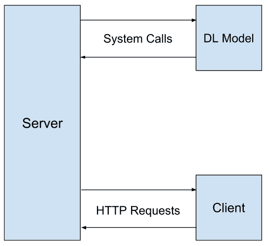
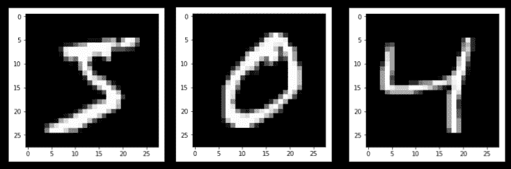
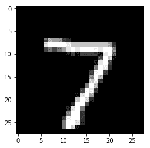
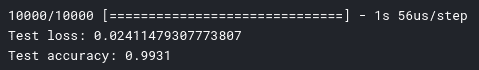
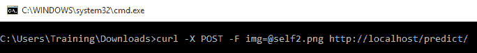
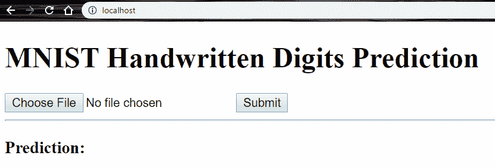
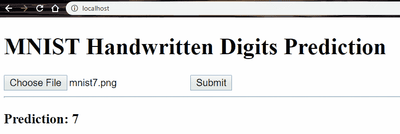

# 第五章：创建你的第一个深度学习 web 应用

在了解神经网络及其在实际项目中的设置后，下一步自然是开发一个基于 web 的深度学习应用。本章将致力于创建一个完整的 web 应用——尽管是一个非常简单的应用——它通过一种非常简单的方式展示了如何将深度学习集成到应用中。

本章将介绍一些本书中将使用的术语，因此即使是那些已经对深度学习 web 应用有基本理解的读者，也建议阅读此章，以便能理解未来章节中使用的术语。我们将首先构建一个深度学习 web 应用，并学习如何理解数据集。接下来，我们将使用 Python 实现一个简单的神经网络，并创建一个与服务器端 Python 配合工作的 Flask API。

本章将涵盖以下主题：

+   构建深度学习 web 应用

+   理解数据集

+   使用 Python 实现一个简单的神经网络

+   创建一个与服务器端 Python 配合工作的 Flask API

+   使用 cURL 和 Flask 的 web 客户端

+   改进深度学习后端

# 技术要求

你可以访问本章中使用的代码，链接在此：[`github.com/PacktPublishing/Hands-On-Python-Deep-Learning-for-web/tree/master/Chapter3`](https://github.com/PacktPublishing/Hands-On-Python-Deep-Learning-for-Web/tree/master/Chapter3)。

本章你将需要以下内容：

+   Python 3.6+

+   Flask 1.1.0+

+   TensorFlow 2.0+

# 构建深度学习 web 应用

解决拼图问题时，重要的是各个部分要匹配，而不是强行拼接。同样，在开发软件解决方案时，解决方案的各个部分必须无缝协作，它们的交互必须易于理解。好的软件需要合理的规划。因此，给软件提供一个坚实的结构对于其长期使用和未来的易于维护至关重要。

在我们开始创建第一个可以在 web 上运行的深度学习应用之前，我们必须规划出解决方案的蓝图，牢记我们希望解决的问题及其对应的解决方案。这就像我们在开发网站时规划身份验证系统或从一个页面传递表单值到另一个页面一样。

一个通用的深度学习 web 解决方案需要以下组件：

+   一个可以存储数据并响应查询的服务器

+   一个可以使用存储的数据并处理它，以生成基于深度学习的查询响应的系统

+   一个可以向服务器发送数据以进行存储、发送带有新数据的查询，并最终接受并使用服务器在查询深度学习系统后返回的响应的客户端

让我们尝试通过图示来可视化这个结构。

# 一个通用深度学习 web 应用的结构图

以下图示描绘了网页客户端、网页服务器和深度学习模型之间的交互：



我们将创建三个软件部分——客户端、服务器和深度学习模型——它们将共同工作。为此，客户端将向服务器发出 HTTP 请求，服务器将返回从单独训练的深度学习模型中提取的输出。该模型可能会在响应客户端 HTTP 请求的服务器文件中执行，也可能不会。在大多数情况下，深度学习模型与处理 HTTP 请求的文件是分开的。

在本章中提供的示例中，我们将分别在不同文件中呈现服务器、客户端和深度学习模型。我们的客户端将向服务器发送简单的 HTTP 请求，例如页面加载请求或 `GET` 请求 URL，这些请求将根据传入的查询产生深度学习模型的输出。然而，客户端通过 REST API 与服务器通信是非常常见的做法。

现在让我们继续了解我们的应用程序将要处理的数据集。

# 理解数据集

为了在执行时间和数据空间上产生最佳结果，并使用最有效的代码，我们必须充分理解正在使用的数据集。我们在这里使用的数据集可能是最流行的手写数字图像神经网络数据集——MNIST 数据集。

# MNIST 手写数字数据集

该数据集由 Yann LeCun、Corinna Cortes 和 Christopher J.C. Burges 组成的团队创建。它是一个包含手写数字图像的大型数据集，包含 60,000 个训练样本和 10,000 个测试样本。该数据集可以在 [`yann.lecun.com/exdb/mnist/`](http://yann.lecun.com/exdb/mnist/) 上公开下载，文件以四个 `.gz` 压缩文件的形式提供。

这四个文件如下：

+   `train-images-idx3-ubyte.gz`：训练集图像。这些图像将用于训练神经网络分类器。

+   `train-labels-idx1-ubyte.gz`：训练集标签。训练集中的每个图像都有一个关联标签，该标签是该图像中可见的相应数字。

+   `t10k-images-idx3-ubyte.gz`：测试集图像。我们将使用这些图像来测试神经网络的预测准确性。

+   `t10k-labels-idx1-ubyte.gz`：测试集图像的标签。当我们的神经网络对测试集进行预测时，我们将与这些值进行比较，以检查结果。

由于其自定义格式，数据集中的图像无法直接查看。开发者在处理该数据集时需要自己创建一个简单的图像查看器。完成此操作后，您将能够看到图像，其样子大致如下：



让我们更深入地讨论这些图像。正如你所看到的，它们在两个轴上的像素数略超过 25。准确来说，图像的尺寸是 28 x 28 像素。由于图像是灰度的，因此可以将它们存储在一个单层的 28 x 28 矩阵中。因此，我们总共有 784 个值，范围从 0 到 1，其中 0 表示完全黑的像素，1 表示白色像素。范围内的任何数值表示不同深浅的黑色。在 MNIST 数据集中，这些图像以一个扁平的 784 个浮点数组的形式存在。为了查看这些图像，你需要将单维数组转换为 28 x 28 的二维数组，然后使用任何自定义开发或公开可用的工具（例如 Matplotlib 或 Pillow 库）绘制图像。

让我们在接下来的章节中讨论这个方法。

# 探索数据集

让我们从 MNIST 数据集网页下载这四个文件，网址为：[`yann.lecun.com/exdb/mnist`](http://yann.lecun.com/exdb/mnist)。下载完成后，解压所有文件，你应该会看到类似以下名称的文件夹：

+   `train-images.idx3-ubyte`

+   `train-labels.idx1-ubyte`

+   `t10k-images.idx3-ubyte`

+   `t10k-labels.idx1-ubyte`

将这些文件保存在你的工作目录中。接下来，我们将创建一个 Jupyter 笔记本，对我们提取的数据集文件进行**探索性数据分析**（**EDA**）。

在浏览器中打开你的 Jupyter Notebook 环境，并创建一个新的 Python 笔记本。首先，导入必要的模块：

```py
import numpy as np
import matplotlib.pyplot as plt
```

上面的代码行导入了`numpy`模块和`matplotlib.pyplot`模块。`numpy`模块提供了 Python 中的高性能数学函数，而`matplotlib.pyplot`模块提供了一个简单的接口，用于绘制和可视化图表和图像。为了在 Jupyter 笔记本中查看此库的所有输出，请添加以下代码行：

```py
%matplotlib inline
```

如果你使用的是 Windows 系统，要解压`.gz`文件，可以使用 7-zip 软件，这是一个出色的压缩/解压工具，可以免费下载，网址是：[`www.7-zip.org`](https://www.7-zip.org)。

# 创建读取图像文件的函数

如前所述，无法直接查看下载的图像文件中的图像。因此，我们将创建一个 Python 函数，`matplotlib`模块将使用该函数显示文件中的图像：

```py
def loadImageFile(fileimage):
  f = open(fileimage, "rb")

  f.read(16)
  pixels = 28*28
  images_arr = []

  while True:
    try:
      img = []
      for j in range(pixels):
        pix = ord(f.read(1))
        img.append(pix / 255)
      images_arr.append(img)
    except:
      break

  f.close()
  image_sets = np.array(images_arr)
  return image_sets

```

前面的`loadImageFile`函数接受一个参数，即包含图像的文件名称。在我们下载的文件夹中，有两个这样的文件：`train-images-idx3-ubyte`和`t10k-images-idx3-ubyte`。前面函数的输出是一个`numpy`数组，包含图像数据。我们可以将结果存储在一个 Python 变量中，如下所示：

```py
test_images = loadImageFile("t10k-images-idx3-ubyte")
```

现在，为了查看变量中保存着`numpy`图像数组的图像，我们可以定义另一个函数，该函数以 784 个浮点数的单个图像像素数组作为输入，并将它们绘制成一幅图像。该函数定义如下：

```py
def gen_image(arr):
 two_d = (np.reshape(arr, (28, 28)) * 255).astype(np.uint8)
 plt.imshow(two_d, interpolation='nearest', cmap='gray')
 plt.show()
 return
```

现在，假设我们想显示测试图像集中的第一张图像；因为我们已经将`numpy`图像数组存储在`test_images`变量中，我们可以运行以下代码：

```py
gen_image(test_images[0])
```

我们能够看到以下输出：



现在我们能够查看图像后，可以继续构建一个函数，以允许我们从标签中提取相应的数字。

# 创建读取标签文件的函数

在 MNIST 数据集中，我们有两个标签文件可用：`train-labels-idx1-ubyte`和`t10k-labels-idx1-ubyte`。为了查看这些文件，我们可以使用下面的函数，该函数以文件名作为参数输入，并生成一个独热编码标签的数组：

```py
def loadLabelFile(filelabel):
  f = open(filelabel, "rb")

  f.read(8)

  labels_arr = []

  while True:
    row = [0 for x in range(10)]
    try:
      label = ord(f.read(1))
      row[label] = 1
      labels_arr.append(row)
    except:
      break

  f.close()
  label_sets = np.array(labels_arr)
  return label_sets
```

此函数返回一个`numpy`数组，其中包含独热编码的标签，维度为数据集中的样本数乘以 10。让我们观察单个条目，以了解独热编码的性质。运行以下代码，从测试集的第一个样本中打印独热编码的标签集：

```py
test_labels = loadLabelFile("t10k-labels-idx1-ubyte")
print(test_labels[0])
```

我们得到以下输出：

```py
[0 0 0 0 0 0 0 1 0 0]
```

通过注意到第七个索引处的数字为`1`，我们可以理解测试数据集中第一幅图像的标签为`7`。

# 数据集摘要

在对可用数据集进行非常简明的探索后，我们得出以下结果。

训练数据集包含 60,000 张图像，维度为 60,000 x 784，每幅图像为 28 x 28 像素。各个数字的样本分布如下：

| **数字** | **样本数量** | **数字** | **样本数量** |
| --- | --- | --- | --- |
| 0 | 5,923 | 5 | 5,421 |
| 1 | 6,742 | 6 | 5,918 |
| 2 | 5,958 | 7 | 6,265 |
| 3 | 6,131 | 8 | 5,851 |
| 4 | 5,842 | 9 | 5,949 |

请注意，数字`5`的样本数量比数字`1`少。因此，模型如果训练不够精细，可能会在识别数字`5`时犯错。

标签总数摘要告诉我们，所有 60,000 个样本都有相应的标签，并且没有缺少任何标签。

类似地，测试数据集中有 10,000 张图像和标签，样本数量的分布如下：

| **数字** | **样本数量** | **数字** | **样本数量** |
| --- | --- | --- | --- |
| 0 | 980 | 5 | 892 |
| 1 | 1,135 | 6 | 958 |
| 2 | 1,032 | 7 | 1,028 |
| 3 | 1,010 | 8 | 974 |
| 4 | 982 | 9 | 1,009 |

测试数据集中样本数分布相当均匀。

# 使用 Python 实现一个简单的神经网络

在进行了一些基本的数据分析后，我们可以开始用 Python 编写我们的第一个神经网络。你可以在第二章中复习神经网络的概念，*使用 Python 入门深度学习*，然后继续前进。我们现在将创建一个**卷积神经网络**（**CNN**），该网络将预测手写数字标签。

我们首先创建一个新的 Jupyter notebook。按照惯例，你可以将其命名为 `Model.ipynb`。这个 notebook 将用于开发一个**已保存**版本的深度学习模型，之后会将其放入一个脚本中以生成预测。

# 导入所需的模块

`Model.ipynb` 中将需要的模块如下导入：

```py
import numpy as np
import keras
from keras.models import Sequential
from keras.layers import Dense, Dropout, Flatten, Activation
from keras.layers import Conv2D, MaxPooling2D
from keras import backend as K
from keras.layers.normalization import BatchNormalization
```

`keras` 模块用于快速实现具有 TensorFlow 后端的高性能神经网络。我们在前面的章节中讨论过 Keras。要安装 Keras，可以使用以下命令：

```py
pip3 install keras 
```

上述命令将安装 Keras。

# 重用我们加载图像和标签文件的函数

记得我们在探索数据集时创建的 `loadImageFile` 和 `loadLabelFile` 函数吗？我们将再次需要它们，因此我们将把这些函数复制到此 notebook 中。

它们共同生成两个代码单元，每个函数各一个：

+   `loadImageFile()` 方法

+   `loadLabelFile()` 方法

在新的代码单元中，我们创建 `loadImageFile()` 函数：

```py
def loadImageFile(fileimage):
  f = open(fileimage, "rb")

  f.read(16)
  pixels = 28*28
  images_arr = []

  while True:
    try:
      img = []
      for j in range(pixels):
        pix = ord(f.read(1))
        img.append(pix / 255)
      images_arr.append(img)
    except:
      break

  f.close()
  image_sets = np.array(images_arr)
  return image_sets
```

在另一个新的代码单元中，创建 `loadLabelFile()` 函数：

```py
def loadLabelFile(filelabel):
  f = open(filelabel, "rb")
  f.read(8)

  labels_arr = []

  while True:
    row = [0 for x in range(10)]
    try:
      label = ord(f.read(1))
      row[label] = 1
      labels_arr.append(row)
    except:
      break

  f.close()
  label_sets = np.array(labels_arr)
  return label_sets
```

然后，我们可以通过以下代码行将图像和标签文件导入为 `numpy` 数组：

```py
train_images = loadImageFile("train-images-idx3-ubyte")
train_labels = loadLabelFile("train-labels-idx1-ubyte")

test_images = loadImageFile("t10k-images-dx3-ubyte")
test_labels = loadLabelFile("t10k-labels-idx1-ubyte")
```

这会创建 `train_images`、`train_labels`、`test_images` 和 `test_labels` 的 NumPy 数组。我们可以观察它们的形状，`train_images` 的输出如下：

```py
(60000, 784)
```

接下来，我们将学习如何重塑数组以便使用 Keras 进行处理。

# 为 Keras 处理重塑数组

当前的图像数组形状不适合 Keras。我们必须将图像数组转换为形状 `(60000, 28, 28, 1)` 和 `(10000, 28, 28, 1)`。

为此，我们使用以下代码行：

```py
x_train = train_images.reshape(train_images.shape[0], 28, 28, 1)
x_test = test_images.reshape(test_images.shape[0], 28, 28, 1)
```

现在，如果我们观察 `x_train` 的形状，我们将得到如下输出：

```py
(60000, 28, 28, 1)
```

我们无需对标签数组进行任何更改，因此直接将其赋值给 `y_train` 和 `y_test`：

```py
y_train = train_labels
y_test = test_labels
```

接下来，我们将使用 Keras 创建一个神经网络。

# 使用 Keras 创建神经网络

现在，我们准备好继续创建神经网络：

1.  我们将首先在 Keras 中创建一个 `Sequential` 神经网络模型：

```py
model = Sequential()
```

1.  要向网络中添加一个神经元层，我们使用以下代码：

```py
model.add(Conv2D(32, (3, 3), input_shape=(28,28,1)))
```

这将向网络中添加一个二维卷积神经元层，输入形状与图像的形状相同。

1.  现在，让我们添加激活层，并将 `relu` 作为激活函数：

```py
model.add(Activation('relu'))
```

1.  添加激活层后，我们可以执行批量归一化。在训练过程中，数据会通过多个计算层，可能会变得过大或过小。这被称为**协方差偏移**，而批量归一化有助于将数据重新调整到中心区域。这有助于神经网络更快地训练：

```py
BatchNormalization(axis=-1)
```

1.  现在让我们在模型中添加更多的隐藏层：

```py
model.add(Conv2D(32, (3, 3)))
model.add(Activation('relu'))
model.add(MaxPooling2D(pool_size=(2,2)))

BatchNormalization(axis=-1)
model.add(Conv2D(64,(3, 3)))
model.add(Activation('relu'))
BatchNormalization(axis=-1)
model.add(Conv2D(64, (3, 3)))
model.add(Activation('relu'))
model.add(MaxPooling2D(pool_size=(2,2)))

model.add(Flatten())

BatchNormalization()
model.add(Dense(512))
model.add(Activation('relu'))
BatchNormalization()
model.add(Dropout(0.2))
```

1.  在神经网络的最后一层，我们需要输出`10`个值，采用独热编码（one-hot encoding）形式，以表示预测的数字。为此，我们添加了最后一层`10`个神经元。这将包含`0`到`1`之间的 10 个值：

```py
model.add(Dense(10))
```

1.  最后，为了将这 10 个浮动值转换为独热编码，我们使用`softmax`激活函数：

```py
model.add(Activation('softmax'))
```

现在，让我们编译并训练 Keras 神经网络。

# 编译和训练 Keras 神经网络

我们现在准备好编译并训练神经网络。要编译神经网络，我们使用以下代码：

```py
model.compile(loss=keras.losses.categorical_crossentropy,
              optimizer=keras.optimizers.Adam(),
              metrics=['accuracy'])
```

在我们模型中（在前面的代码块中已编译），我们设置了分类交叉熵作为`loss`函数；使用的优化器函数是`Adam`优化器，评估指标是`accuracy`。

然后，我们使用 Keras 模型对象的`fit()`方法来训练神经网络：

```py
model.fit(x_train, y_train,
          batch_size=100,
          epochs=10,
          verbose=2,
          validation_split=0.2)
```

建议将训练数据进一步拆分为验证数据和训练数据，同时保持测试集不变，但对于这个数据集来说，这样是可以的。

训练完成，共进行了 10 个批次，每批次包含 100 个样本。

# 评估和存储模型

训练完模型后，我们现在准备好评估它的准确性。为此，我们将使用以下代码：

```py
score = model.evaluate(x_test, y_test, verbose=1)

print('Test loss:', score[0])
print('Test accuracy:', score[1])
```

我们将获得以下输出，基于之前的代码：



我们得到了 99%的准确率，这是一个非常好的准确率分数。现在，我们可以保存模型，它将在未来通过网页门户用于对用户输入进行预测。我们将把模型分为两部分——模型结构和模型权重。为了保存结构，我们将使用 JSON 格式，如下所示：

```py
model_json = model.to_json()
with open("model.json", "w") as json_file:
    json_file.write(model_json)
```

现在，为了保存 Keras 模型的权重，我们使用`save_weights()`方法来保存该对象：

```py
model.save_weights('weights.h5')
```

接下来，我们将创建一个 Flask API，以便与服务器端的 Python 协作。

# 创建一个 Flask API，以便与服务器端的 Python 协作

我们已经完成了深度学习模型，并将其结构存储在`model.json`文件中，将模型的权重存储在`weights.h5`文件中。现在我们准备将模型数据封装成 API，以便通过`GET`或`POST`方法将模型暴露给基于 Web 的调用。这里，我们将讨论`POST`方法。让我们从服务器端的必要设置开始。

# 设置环境

在服务器中，我们将需要 Flask 模块——它将处理服务请求——而这些请求将运行需要 Keras（以及 TensorFlow）、NumPy 和许多其他模块的代码。为了快速设置我们项目的环境，我们按照以下步骤进行操作：

1.  安装 Anaconda。

1.  安装 TensorFlow 和 Keras。

1.  安装 Pillow。

1.  安装 Flask。

你可以参考以下命令块来安装 TensorFlow、Keras、Pillow 和 Flask：

```py
pip3 install tensorflow keras pillow flask
```

我们现在可以开始开发我们的 API。

# 上传模型结构和权重

模型结构文件`model.json`和权重文件`weights.h5`需要存在于工作目录中。你可以将这些文件复制到一个新文件夹中，比如`flask_api`，或者如果使用远程服务器，可以将它们上传到正确的路径。

# 创建我们的第一个 Flask 服务器

在工作目录中创建一个新文件，命名为`flask_app.py`。这个文件将处理所有发送到服务器的请求。将以下代码放入该文件：

```py
from flask import Flask
app = Flask(__name__)
@app.route("/")
def index():
    return "Hello World!"
if __name__ == "__main__":
    app.run(host='0.0.0.0', port=80)
```

前面的代码首先将必要的模块导入到脚本中。然后，它将应用程序设置为 Flask 服务器对象，并定义`index`函数，指示其处理所有发送到`"/"`地址的请求，无论请求类型如何。在脚本的末尾，使用 Flask 对象`app`的`run()`方法将脚本绑定到系统的指定端口。

我们现在可以部署这个简单的*Hello World* Flask 服务器了。我们在终端中运行以下命令：

```py
python flask_app.py
```

现在，当我们在浏览器中打开`http://localhost/`网址时，我们看到一个页面，展示了*Hello World*。`index`函数处理发送到服务器根目录的请求，因为它的路由设置为`"/"`。接下来，我们将扩展这个示例，创建一个可以专门处理预测请求的 API。

# 导入必要的模块

在前面的示例中，我们将扩展`flask import`语句，导入一个额外的方法`request`，该方法将允许我们处理发送到服务器的`POST`请求。该行代码如下所示：

```py
from flask import Flask, request
```

然后，我们导入读取和存储图像所需的模块。同时，还导入了`numpy`模块，如下所示：

```py
from scipy.misc import imread, imresize
import numpy as np
```

最后，我们导入 Keras 模块的`model_from_json()`方法来加载保存的模型文件。然后，我们导入`tensorflow`，因为 Keras 依赖于它来执行：

```py
from keras.models import model_from_json
import tensorflow as tf
```

接下来，我们将数据加载到脚本运行时。

# 加载数据到脚本运行时并设置模型

一旦我们导入了必要的模块，就会加载保存的模型 JSON 和权重，代码如下所示：

```py
json_file = open('model.json','r')
model_json = json_file.read()
json_file.close()
model = model_from_json(model_json)

model.load_weights("weights.h5")
model.compile(loss='categorical_crossentropy',optimizer='adam',metrics=['accuracy'])
graph = tf.get_default_graph()
```

请注意，我们还为会话提前创建了一个默认的`graph`项。该项是在模型训练期间隐式创建的，但不会保存在保存的`model`和`weights`文件中，因此我们必须在此处显式创建它。

# 设置应用程序和索引函数

现在，我们将`app`变量设置为 Flask 对象，并将`"/"`路由设置为由`index`函数处理，该函数实际上不会产生任何有意义的输出。这是因为我们将使用`/predict`路由来提供我们的预测 API，如下所示：

```py
app = Flask(__name__)

@app.route('/')
def index():
    return "Oops, nothing here!"
```

我们将在下一节中介绍图像转换功能。

# 转换图像功能

有时，如果用户使用合适的设置发起图像 `POST` 请求，我们可能会收到 `base64` 编码的字符串形式的图像。我们可以创建一个函数来处理它：

```py
import re
import base64

def stringToImage(img):
    imgstr = re.search(r'base64,(.*)', str(img)).group(1)
    with open('image.png', 'wb') as output:
        output.write(base64.b64decode(imgstr))
```

我们使用 `re` 模块进行正则表达式判断，以确定传入的数据是否为 `base64` 字符串形式。需要使用 `base64` 模块解码字符串，然后将文件保存为 `image.png`。

# 预测 API

现在，让我们定义 `/predict` 路由，这将是我们的 API，用于响应预测的数字：

```py
@app.route('/predict/', methods=['POST'])
def predict():
    global model, graph

    imgData = request.get_data()
    try:
        stringToImage(imgData)
    except:
        f = request.files['img']
        f.save('image.png')

    x = imread('image.png', mode='L')
    x = imresize(x, (28, 28))
    x = x.reshape(1, 28, 28, 1)

    with graph.as_default():
        prediction = model.predict(x)
        response = np.argmax(prediction, axis=1)
        return str(response[0])
```

在这里，`predict()` 函数接收一个 `POST` 方法的输入，检查传入文件的格式，然后将其保存为名为 `image.png` 的文件。接着，图像被读取到程序中并调整为 28 x 28 的尺寸。接下来，图像数组被重塑，以便可以输入到 Keras 模型进行预测。然后，我们使用 Keras 模型的 `predict()` 方法，获得一个一热编码的输出，其中预测数字的索引被设置为 `1`，其余部分保持为 `0`。我们确定数字并将其发送到 API 的输出。

现在，我们必须在文件的末尾添加代码，将服务器绑定到一个端口并设置所需的配置：

```py
if __name__ == "__main__":
    app.run(host='0.0.0.0', port=80)
    app.run(debug=True)
```

我们设置了 `debug=True` 参数，以便在服务器的控制台中查看是否发生任何错误。在开发过程中，启用此选项总是个好主意，但在生产环境中，这行代码可以跳过。

在我们运行应用程序之前的最后一步是更新 `'/'` 路由的代码。每当有人访问这个路由时，我们将加载我们创建的 `index.html` 文件，如下所示：

```py
@app.route('/')
def index():
    return render_template("index.html")
```

我们现在已经准备好启动服务器并检查它是否正常工作。我们使用之前使用的相同命令来启动服务器：

```py
python flask_app.py
```

上述命令将启动服务器。

# 通过 cURL 使用 API 并使用 Flask 创建一个 Web 客户端

在我们的服务器运行时，我们可以向其发送 `POST` 请求，包含图像内容，并期望在输出中得到一个预测的数字。测试任何 API 而不使用第三方工具的两种方法如下：

+   使用 cURL。

+   开发一个客户端来调用 API。

我们将涵盖这两种方法。

# 通过 cURL 使用 API

在我们开发客户端发送 `POST` 请求到 API 服务器之前，让我们通过 cURL 测试 API，cURL 是一个命令行工具，用于模拟对 URL 的 `GET` 和 `POST` 请求。

在终端或命令提示符中使用以下命令向您的预测 API 发出 `curl` 请求：

```py
curl -X POST -F img=@"path_to_file" http://localhost/predict/
```

这里，`-F` 标志用于表示 `POST` 请求将包含文件。将包含文件的 `POST` 变量名为 `img`，`path_to_file` 应该替换为您希望发送到服务器的文件的完整路径，该文件用于进行预测。

让我们通过一个示例来看看 API 是如何工作的。

假设我们有一个名为 `self2.png`，尺寸为 275 x 275 的图像：


显然，服务器端的图像尺寸必须进行调整。为了发出请求，我们使用以下命令：



API 的输出是一个整数——`2`。因此，API 成功运行。

# 为 API 创建一个简单的网页客户端

我们现在将创建一个简单的网页客户端来调用 API。为此，我们必须修改当前的代码。在`flask_app.py`中，首先修改 Flask 的`import`语句，以便将其扩展到另一个模块——`render_template`，如下所示：

```py
from flask import Flask, request, render_template
```

现在，我们在工作目录中创建一个文件夹`templates`，并在其中添加一个文件`index.html`，文件内容如下：

```py
<!DOCTYPE html>
<html lang="en">
  <head>
    <title>MNIST CNN</title>
  </head>

  <body>
    <h1>MNIST Handwritten Digits Prediction</h1>

    <form>
      <input type="file" name="img"></input>
      <input type="submit"></input>
    </form>
    <hr>
    <h3>Prediction: <span id="result"></span></h3>

    <script src='http://cdnjs.cloudflare.com/ajax/libs/jquery/2.1.3/jquery.min.js'></script>

    <script src="img/{{ url_for('static',filename='index.js') }}"></script>

</body>
</html>
```

本质上，我们在这里所做的只是创建一个表单，其中有一个类型为文件的输入元素，命名为`img`。然后，我们将 jQuery 添加到页面，并创建一个指向静态文件`index.js`的链接，该文件在服务器的`static`文件夹中提供。

让我们创建`index.js`文件。首先，在根目录下创建一个文件夹`static`，然后创建一个新文件`index.js`，并写入以下代码：

```py
$("form").submit(function(evt){ 
    evt.preventDefault();
    var formData = new FormData($(this)[0]);
    $.ajax({
        url: '/predict/',
        type: 'POST',
        data: formData,
        async: false,
        cache: false,
        contentType: false,
        enctype: 'multipart/form-data',
        processData: false,
        success: function (response) {
            $('#result').empty().append(response);
        }
    });
    return false;
});
```

上面的 jQuery 代码向`/predict/`路由发送一个`POST`请求，然后更新页面上的`result`区域，显示从服务器返回的值。

让我们在这个网页客户端上进行一次示例运行。首先，我们需要重新启动 Flask 服务器。然后，我们在浏览器中打开`http://localhost/`，就会看到如下的网页：



假设我们选择一个名为`mnist7.png`的文件，它本质上是测试数据集中第一张图片，长这样：


预期的输出是`7`。点击提交后，我们在页面上获得如下输出：



我们可以观察到这是正确的输出，并得出结论：网页客户端工作正常。

# 改进深度学习后端

我们在这里训练的简单模型，几乎无法称之为一个接近完美的模型。有几种方法可以扩展这个模型，使其更好。例如，我们可以采取以下一些最基本的步骤来改进我们的深度学习模型：

+   **增加训练轮次**：我们只训练了模型 10 轮，这通常是一个非常小的值，对于任何深度学习模型来说都不够。增加训练轮次可以提高模型的准确性，但也可能导致过拟合，因此训练轮次需要通过实验来调整。

+   **更多的训练样本**：我们的网页客户端目前的功能仅限于显示预测值。但是，我们可以扩展它，让用户提供反馈，确认我们做出的预测是否正确。然后，我们可以将用户提供的输入图像添加到训练样本中，并用用户提供的标签来训练。不过，我们必须小心用户提交的垃圾输入图像和标签，因此此功能应仅提供给可信的用户或我们的网页应用的 Beta 测试人员。

+   **创建更深的网络**：我们可以增加网络中的隐藏层数量，以提高预测的准确性。但这种方法容易导致过拟合，因此必须小心实验。

# 总结

本章详细介绍了如何创建深度学习模型，并通过 API 使其在 Web 客户端或通过 cURL 使用。本章首先讨论了深度学习 Web 应用程序的结构、这些应用程序的各个组成部分以及它们如何相互作用。接着，简要介绍并探索了 MNIST 手写数字数据集。这为我们进入下一部分铺平了道路，在那里我们构建了一个深度学习模型并将其存储为文件以备将来使用。随后，这些文件被导入到服务器 API 脚本中，并在每次调用 API 时执行。最后，本章展示了一个非常基础的 API 客户端，并指导你如何通过命令行界面使用 cURL 来调用该 API。

在下一章，我们将讨论如何使用 TensorFlow.js 在浏览器窗口内执行深度学习。
