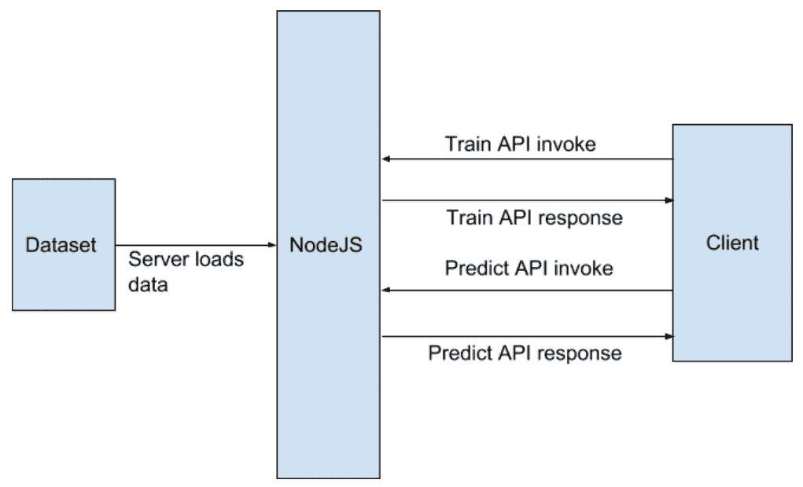
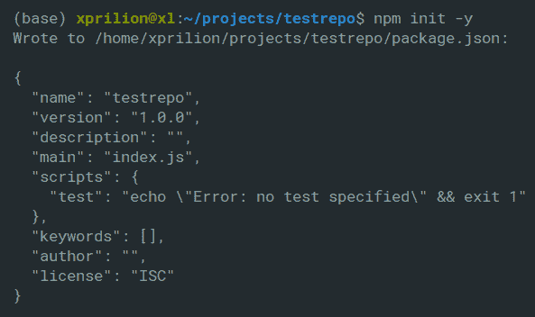
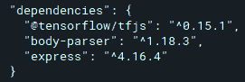
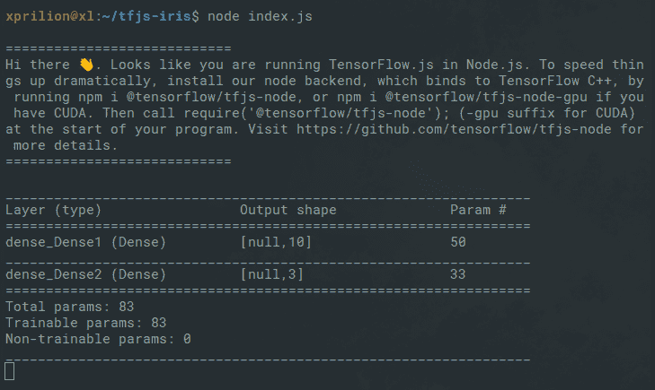
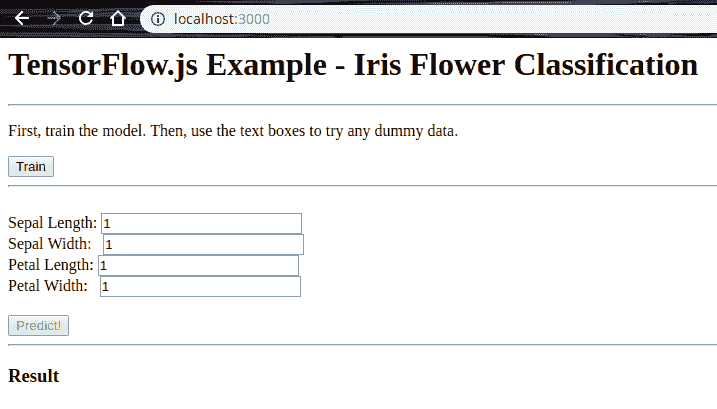
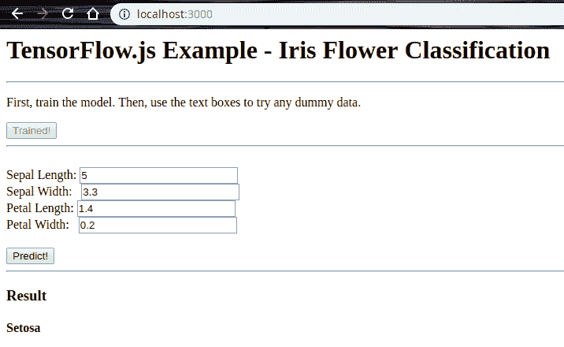

# 第六章：开始使用 TensorFlow.js

到目前为止，我们已经轻松地了解了深度学习的奇妙世界，并对深度学习在使现代 Web 应用更加智能方面的潜力有了一个大致的了解。在第一章，*揭开人工智能的神秘面纱与机器学习基础*中，我们详细了解了 AI 突破前后的 Web 应用概况。在第三章，*创建你的第一个深度学习 Web 应用*中，我们使用一个简单的神经网络构建了一个基于图像分类的 Web 应用。

Web 应用无处不在，已经成为我们日常生活中不可或缺的一部分。在构建 Web 应用时，JavaScript 的使用几乎是无法忽视的。那么，如果我们只使用 JavaScript，而不依赖其他脚本语言，来构建一个智能的 Web 应用会怎样呢？在本章中，我们将展示如何使用一个名为 **TensorFlow.js**（**TF.js**）的 JavaScript 库，构建一个支持深度学习的 Web 应用——这一切都将在 Web 浏览器中完成。

在本章中，我们将涵盖以下主题：

+   TF.js 的基本原理及其功能

+   使用 TF.js 开发深度学习模型并进行推理

+   在浏览器中直接使用预训练模型

+   构建一个用于识别花卉种类的 Web 应用

+   TF.js 的优势与局限

# 技术要求

你可以访问本章使用的代码，地址为 [`github.com/PacktPublishing/Hands-On-Python-Deep-Learning-for-Web/tree/master/Chapter4`](https://github.com/PacktPublishing/Hands-On-Python-Deep-Learning-for-Web/tree/master/Chapter4)。

要完成本章的内容，你需要以下软件：

+   TF.js 0.15.1+

+   来自 NPM 仓库的 `@tensorflow/tfjs-node` 0.3.0+ 包

# TF.js 的基本原理

在本节中，我们将简要回顾一些 TF.js 的基本概念。我们将从介绍 TensorFlow 开始，然后继续研究 TF.js 的不同组件。

# 什么是 TensorFlow？

在我们开始讨论 TF.js 之前，我们必须了解什么是 TensorFlow。TensorFlow 是一个由 Google 开发和维护的开源库。它基于一种称为张量的数据结构构建。张量是标量和向量的广义形式。TensorFlow 提供了许多高效的工具，适用于广泛的科学领域中的高性能数值计算。TensorFlow 还提供了一套非常灵活的工具，用于进行机器学习和深度学习的开发与研究。你可以访问 TensorFlow 的官方网站 [`www.tensorflow.org/`](https://www.tensorflow.org/) 获取更多信息。

# 什么是 TF.js？

TF.js 是一个 JavaScript 库，提供了一个构建和部署机器学习模型的生态系统。它提供了以下功能：

+   使用 JavaScript 开发机器学习模型

+   使用预训练的机器学习模型

+   部署机器学习模型

TF.js 为你提供了机器学习项目所需的所有元素。它有专门的模块用于数据预处理、张量处理、模型构建、模型评估等，但所有这些都是用 JavaScript 完成的。在深入了解这些之前，让我们快速理解 TF.js 的必要性。

# 为什么选择 TF.js？

正如我们在前一章节中看到的那样，在线训练和托管一个模型、将其封装在一个 REST API 中，然后在任何前端使用 API 来展示我们的结果是非常简单和直观的。那么，为什么还会需要使用 TF.js 呢？

这个问题的简单答案是：如果浏览器中有 AI！想象一下一个游戏，它需要使用一个 AI 代理，这个代理通过学习人类玩家的玩法方式，在游戏进程中变得更强或更弱。如果在每一瞬间，游戏都不断向服务器发送请求，来传输数据到游戏和服务器之间，这就过于冗余了。更重要的是，这可能很容易导致**拒绝服务**（**DoS**）攻击。

因此，在浏览器中拥有一个可以自行生存并实时学习的 AI 是有意义的，尤其是当代理需要实时不断学习时。它也可以是两种方式的混合：

+   如果在代理渲染期间加载了一个预训练模型，并且从那里开始，代理会在服务器上间隔性地学习并更新模型。

+   如果多个版本的 AI 代理同时在几个系统上运行，并且它们从各自的系统互动中学习。而且，如果它们的集体学习被汇总到服务器上，代理将在间隔时从服务器获取更新。

因此，使用 TF.js 大大减少了对人类用户与服务器进行每一步通信时依赖页面的强度。

现在我们可以构建一个小项目，展示 TF.js 的强大功能。现在不用担心 TF.js 生态系统——我们会在过程中涵盖项目的所有元素。

# TF.js 的基本概念

以下是我们将在项目中使用的 TF.js 组件：

+   张量

+   变量

+   操作

+   模型

+   层

让我们详细看看它们每个。

# 张量

与 TensorFlow 一样，TF.js 中的中央数据处理单元是张量。Goodfellow 等人（在他们的深度学习书中）做出了以下观察：

一般来说，按规则网格排列的数字数组，具有可变数量的轴，被称为张量。

简单来说，张量是一个容器，包含一维或多维数组。以下是一些你可能已经知道的张量示例：

+   标量（一个秩为零的张量）

+   向量（一个一维或秩为一的张量）

+   矩阵（一个二维或秩为二的张量）

我们可以根据给定的形状在 TF.js 中创建一个张量，如下所示：

```py
const shape = [2, 3]; // 2 rows, 3 columns
const a = tf.tensor([4.0, 2.0, 5.0, 15.0, 19.0, 27.0], shape);
```

`a` 是一个已创建的张量，其内容可以使用以下命令打印出来：

```py
a.print()
```

以下输出被打印：

```py
Output: [[4 , 2 , 5 ],
 [15, 19, 27]]
```

`a` 是一个矩阵（一个二阶张量）。TF.js 还提供了专门的函数，如 `tf.scalar`、`tf.tensor1d`、`tf.tensor2d`、`tf.tensor3d` 和 `tf.tensor4d`，用于创建具有特定形状的张量，而无需显式指定 `shape` 参数。这也提高了可读性。在 TF.js 中，张量是不可变的。

# 变量

与张量不同，变量在 TF.js 中是可变的。变量在神经网络训练过程中尤为重要，因为它们包含了大量中间数据存储和更新。以下是如何在 TF.js 中使用变量的示例：

```py
const initialValues = tf.ones([5]);
const weights = tf.variable(initialValues); // initialize weights
weights.print(); // output: [1, 1, 1, 1, 1]
const updatedValues = tf.tensor1d([0, 1, 0, 1, 0]);
weights.assign(updatedValues); // update values of weights
weights.print(); // output: [0, 1, 0, 1, 0]
```

现在我们来看一下运算符。

# 运算符

运算符让你对数据进行数学运算。TF.js 提供了各种用于操作张量的运算符。由于张量本质上是不可变的，运算符不会改变张量中的数据——它们会返回新的张量作为结果。你可以对张量执行二元操作，如加法、乘法和减法。你甚至可以链式调用多个操作。以下示例展示了如何在 TF.js 中使用两个不同的运算符进行链式操作：

```py
const e = tf.tensor2d([[1.0, 2.0], [3.0, 4.0]]); 
const f = tf.tensor2d([[3.0, 4.0], [5.0, 6.0]]); 
const sq_sum = tf.square(tf.add(e, f));
sq_sum.print();
```

我们首先创建了两个二维张量，并将它们分别赋值给`e`和`f`。接着，我们对它们进行了相加并求平方。

这会产生以下输出：

```py
// Output: [[16 , 36],
// [64, 100]]
```

接下来，我们将讨论模型和层。

# 模型与层

在深度学习文献中，模型指的是神经网络本身，特别是神经网络架构。如在第二章《使用 Python 入门深度学习》中所讨论，神经网络由基本组件组成，如层、神经元以及层之间的连接。TF.js 提供了两个创建这些模型的函数——`tf.model` 和 `tf.sequential`。`tf.model` 帮助你构建更复杂的架构，例如跳过某些层，而 `tf.sequential` 提供了一种创建线性层堆栈的方式，不涉及跳过、分支等操作。

TF.js 提供了多种专用层类型，用于不同任务的需求——`tf.layers.dense`、`tf.layers.dropout`、`tf.layers.conv1d`、`tf.layers.simpleRNN`、`tf.layers.gru` 和 `tf.layers.lstm`。以下示例通过 `tf.sequential` 和 `tf.layers.dense` 展示了一个简单的神经网络模型：

```py
const model = tf.sequential();
model.add(tf.layers.dense({units: 4, inputShape: [4], activation: 'relu'}));
model.add(tf.layers.dense({units: 1, activation: sigmoid}));
```

上述示例创建了一个简单的神经网络，其特点如下：

+   两个层（记住，在计算总层数时我们不考虑输入层）。该网络接受一个具有四个特征的输入（`inputShape` 参数有助于指定这一点）。

+   第一层包含四个神经元（因此是`units: 4`）。第二层（输出层）只有一个神经元。

+   第一个层使用 `relu` 激活函数，输出层使用 `sigmoid` 激活函数。

鼓励您访问 [`js.tensorflow.org/api/latest/index.html`](https://js.tensorflow.org/api/latest/index.html) 了解 TF.js 的前述组件。

# 使用 TF.js 的案例研究

我们将遵循通常涉及到的机器学习项目中的所有步骤（我们在 第一章 中讨论过，*揭秘人工智能和机器学习基础*）。一个好的项目从一个清晰定义的问题陈述开始。因此，让我们快速浏览一下，并据此决定后续步骤。

# 我们 TF.js 小项目的问题陈述

在这里我们将要探讨的问题可能是你在机器学习初学时遇到的最著名的挑战之一——通过学习鸢尾花数据集中的特征来分类和预测鸢尾花的类型。训练和预测将在浏览器中执行。

我们已经为项目定义了问题陈述。接下来将进行数据准备步骤。数据已经可用，因此我们不需要自行收集。但是，在准备数据之前，了解数据本身的更多信息会很有帮助。

# 鸢尾花数据集

由统计学家兼生物学家罗纳德·费舍尔于 1936 年引入的鸢尾花数据集包含 150 行数据，大约有 3 种不同的鸢尾花品种。列名如下：

+   萼片长度（cm）

+   萼片宽度（cm）

+   花瓣长度（cm）

+   花瓣宽度（cm）

+   种类：

    +   山鸢尾

    +   变色鸢尾

    +   维吉尼亚

您可以在 [`archive.ics.uci.edu/ml/datasets/Iris`](http://archive.ics.uci.edu/ml/datasets/Iris) 获取原始数据集并了解更多。

# 您的第一个 TF.js 深度学习 Web 应用程序

在本节中，我们将使用 TF.js 开发一个 Web 应用程序。此应用程序将包括标准的全栈深度学习支持的 Web 项目步骤。我们将从准备数据开始，然后简要研究项目架构，然后按需构建所需的组件。

# 准备数据集

鸢尾花数据集原始形式是一个包含 150 行数据的 CSV 文件，以逗号分隔的格式，每个条目以新行分隔。

然而，为了更轻松地与 JavaScript 运行，我们将使用数据的 JSON 格式。JSON 格式的数据集可以从 [`gist.github.com/xprilion/33cc85952d317644c944274ee6071547`](https://gist.github.com/xprilion/33cc85952d317644c944274ee6071547) 下载。

您可以使用任何语言中的简单函数，将 CSV 文件转换为 JSON 文件，按照以下约定更改列名：

+   萼片长度：`sepal_length`

+   萼片宽度：`sepal_width`

+   花瓣长度：`petal_length`

+   花瓣宽度：`petal_width`

+   种类：`species`

在模型构建时，我们将使用这些属性名称的 JSON 格式。

# 项目架构

在本项目中，我们将使用 Node.js 来创建一个服务器。这样做是为了能够通过 Node.js 后端使用 TF.js，从而获得更快的计算性能。我们将创建一个非常基础的前端，用户可以通过它来发出命令，训练由 TF.js 构建的神经网络，并使用另一个按钮发出命令，根据用户提供的输入预测一朵鸢尾花的特征向量的类别。

以下图显示了项目的组成部分及其相互作用：



现在我们了解了架构，接下来让我们开始项目的开发。

# 启动项目

要开始进行项目开发，首先需要安装 Node.js 和**Node 包管理器**（**NPM**）的最新版本。虽然标准的做法是阅读 Node.js 官网提供的文档，我们建议使用**Node 版本管理器**（**NVM**）来安装 Node.js 和 NPM。

安装说明和文件可以在[`githu`](https://github.com/creationix/nvm)[b.com/creationix/nvm](https://github.com/creationix/nvm)[.](https://github.com/creationix/nvm)

一旦安装了 Node.js 和 NPM，我们就可以开始进行项目的开发了：

1.  创建一个名为`tfjs-iris`的文件夹。

1.  打开终端，并使用以下命令初始化该项目的包管理器：

```py
npm init -y
```

这应该会在项目目录中创建一个`package.json`文件。前面的命令输出如下：



请注意，输出格式为 JSON 格式。`main`键定义了在作为模块导入时程序的入口文件。在本项目中，`main`的默认值设置为`index.js`。不过，这个文件尚未创建。让我们来创建`index.js`文件。

我们将使用 Node.js 的`express`模块来创建我们的服务器。你可以在[`expressjs.com`](https://expressjs.com/)上了解更多关于`express`的信息。

1.  要使用`express`，我们需要将这个模块添加到我们的项目中。为此，请使用以下代码：

```py
npm install express --save
```

这将把`express`模块的依赖添加到`package.json`文件中，并将其安装到项目的`node_modules`目录中。

1.  在项目仓库的根目录下创建一个名为`index.js`的文件，并添加以下代码：

```py
var express = require('express');
var app = express(); 
```

这将创建一个`express`应用程序对象。接下来，我们将把 TF.js 添加到项目中。最简单的方法是通过 NPM 安装。完整的安装说明可以在[`js.tensorflow.org/setup/`](https://js.tensorflow.org/setup/)找到。

1.  使用以下命令在终端中安装`TF.js`模块：

```py
npm install @tensorflow/tfjs --save
```

1.  现在我们可以继续将该模块添加到我们的`index.js`文件中了：

```py
const tf = require('@tensorflow/tfjs');
```

1.  我们还需要 Express.js 中的`body-parser`模块来处理来自客户端的查询数据，这些数据将通过 AJAX `POST`请求发送。为此，我们使用以下命令：

```py
npm install body-parser --save
```

1.  我们现在创建一个`body-parser`对象，并使用以下代码将其绑定到应用程序：

```py
var bodyParser = require('body-parser');
app.use(bodyParser.urlencoded({ extended: false }));
```

在此阶段，`package.json`应包含列出项目依赖项的以下代码片段：



请注意，前面的版本可能会发生变化。我们现在可以导入`iris.json`文件，这是我们将要训练的模型数据：

```py
const iris = require('./iris.json');
```

初始设置完成后，我们现在可以继续编写 TF.js 代码，在可用数据集上进行训练。

# 创建 TF.js 模型

首先，我们通过将存储在`iris`变量中的数据读取到一个`tensor2d`对象中：

1.  在你的`index.js`文件中，添加以下代码：

```py
const trainingData = tf.tensor2d(iris.map(item=> [
    item.sepal_length, item.sepal_width, item.petal_length, item.petal_width
]),[144,4])
```

我们目前还没有任何测试数据；这些将由用户提供。

1.  接下来，我们创建一个可能的三种花卉品种的独热编码：

```py
const outputData = tf.tensor2d(iris.map(item => [
    item.species === 'setosa' ? 1 : 0,
    item.species === 'virginica' ? 1 : 0,
    item.species === 'versicolor' ? 1 : 0
]), [144,3])
```

我们现在可以开始创建训练模型的代码。以下代码可能让你想起我们在上一章中为 MNIST 手写数字数据集创建模型时使用的代码。这仅仅是因为我们仍然在使用 TensorFlow 的概念，只不过是用不同的语言！

1.  我们首先声明一个顺序的 TensorFlow 模型：

```py
const model = tf.sequential();
```

1.  接下来，让我们为模型添加一层神经元：

```py
model.add(tf.layers.dense({
    inputShape: 4, 
    activation: 'sigmoid', 
    units: 10
 }));
```

`inputShape`参数表示将添加到该层的输入的形状。`units`参数设置该层中使用的神经元数量。我们使用的激活函数是`sigmoid`函数。

1.  现在让我们添加输出层：

```py
model.add(tf.layers.dense({
    inputShape: 10, 
    units: 3, 
    activation: 'softmax'
}));
```

在这里，我们将输出层中有 3 个神经元，且该层的输入为 10，这与前一层中的神经元数量相匹配。

除了输入层外，我们只有一个隐藏层和输出层。由于数据集较小且预测简单，因此在此应用中是可以接受的。请注意，我们在这里使用了`softmax`激活函数，它会输出类别概率。

这在我们的案例中特别有用，因为问题是一个多类分类问题。

1.  完成这一切后，我们现在可以准备编译我们的模型。为此，我们使用以下代码：

```py
model.compile({
    loss: "categoricalCrossentropy",
    optimizer: tf.train.adam()
});
```

由于我们手头有一个分类问题，其中有多个可能的标签，因此我们使用`categoricalCrossentropy`作为`loss`函数。为了优化，我们使用`adam`优化器。鼓励你尝试其他超参数值。

1.  我们可以使用以下代码生成模型的摘要：

```py
model.summary();
```

接下来，我们将训练我们的 TF.js 模型。

# 训练 TF.js 模型

我们现在将编写一个 `async` 函数。这样做的原因是为了让客户端 JavaScript 调用我们的函数时，不会因为等待结果而卡住。我们程序中需要一定时间才能完成的函数是 `train_data()` 函数。该函数负责模型的训练：

```py
async function train_data(){
    console.log("Training Started");
    for(let i=0;i<50;i++){
        let res = await model.fit(trainingData, outputData, {epochs: 50});
        console.log(`Iteration ${i}: ${res.history.loss[0]}`);
    }
    console.log("Training Complete");
}
```

`train_data()` 函数可以异步运行。它还会在每个训练周期输出损失值到我们运行服务器的控制台中。现在，让我们创建一个 API 来调用 `train_data()` 函数。

首先，我们创建一个名为 `doTrain` 的 *中间件*，它将在训练 API 之前运行，并返回任何数据。

你可以在 [`expressjs.com/en/guide/using-middleware.html`](https://expressjs.com/en/guide/using-middleware.html) 阅读更多关于中间件的内容。

`doTrain()` 中间件在其参数中接受对 Node.js 服务器发出的请求、用于响应的变量，以及在执行完中间件中定义的代码块后用来转发程序执行的函数：

```py
var doTrain = async function (req, res, next) {
    await train_data();
    next();
}
```

`doTrain` 中间件调用 `train_data()` 函数并等待其结果。`train_data()` 函数返回一个 *Promise*，以便执行可以继续而不会冻结。`next()` 函数在 `train_data()` 函数完成后立即运行，它只是将程序的执行传递给下一个链式调用的中间件函数，如下所示：

```py
app.use(doTrain).post('/train', function(req, res) {
    res.send("1");
});
```

我们现在将 `'/train'` 路由绑定到 `express` 应用中，然后将 `doTrain` 中间件链接到它。现在，每当调用 `'/train'` API 时，中间件会首先运行，然后执行会传递到 API 的主代码块。这个代码块简单地返回一个任意值，表示训练已完成。

# 使用 TF.js 模型进行预测

训练完成后，我们还需要创建一个 API 来调用预测函数并返回预测结果。我们将 API 绑定到 `'/predict'` 路由，并使用 `POST` 方法发起对该 API 的请求，如下所示：

```py
app.post('/predict', function(req, res) {
    var test = tf.tensor2d([parseFloat(req.body.sepLen), parseFloat(req.body.sepWid),                                 parseFloat(req.body.petLen), parseFloat(req.body.petWid)], [1,4]);
    var out = model.predict(test);
    var maxIndex = 0;
    for (let i=1;i<out.size; i++){
        if (out.buffer().get(0, i) > out.buffer().get(0, maxIndex)){
            maxIndex = i;
        }
    }

    ans = "Undetermined";
    switch(maxIndex) {
        case 0:
            ans = "Setosa"; 
        break;
        case 1:
            ans = "Virginica"; 
        break;
        case 2:
            ans = "Versicolor"; 
        break; 
    }
    console.log(ans);
    res.send(ans);
});
```

理解预测 API 的代码非常简单。让我们分部分讨论：

```py
app.post('/predict', function(req, res) {
```

这一行将 `'/predict'` 路由绑定到 `POST` 请求方法，并打开处理请求代码块，处理所有对该路由的请求：

```py
    var test = tf.tensor2d([parseFloat(req.body.sepLen), parseFloat(req.body.sepWid),                                     parseFloat(req.body.petLen), parseFloat(req.body.petWid)], [1,4]);
    var output = model.predict(test);
```

这些行创建了一个 TF.js `tensor2d` 对象，数据是从客户端接收到的。接着，它在模型上运行 `predict` 方法，并将结果存储在 output 变量中：

```py
    var maxIndex = 0;
    for (let i=1;i<out.size; i++){
        if (out.buffer().get(0, i) > out.buffer().get(0, maxIndex)){
            maxIndex = i;
        }
    }
```

这个代码块仅仅是找出在 `tensor2d` 变量 output 中对应最大元素的索引。记住，在 `softmax` 激活输出中，最高值对应着预测的索引。

在确定输出的最大索引之后，我们使用一个简单的 switch-case 语句来决定从 API 发送到客户端的输出内容。请求数据也会记录在服务器的控制台中。最后，我们使用以下代码将 Node.js 应用绑定到监听 `3000` 端口：

```py
app.listen(3000);
```

接下来，我们将创建一个简单的客户端。

# 创建一个简单的客户端

为了处理应用程序中的 `'/'` 路由，我们向 `index.js` 添加以下代码行，它仅渲染一个静态文件 `index.html`，该文件位于 public 文件夹中：

```py
app.use(express.static('./public')).get('/', function (req, res) {
    res.sendFile('./index.html');
});
```

现在，让我们通过以下步骤创建静态的 `index.html` 文件：

1.  首先，创建一个文件夹，`public`，并在其中创建 `index.html` 文件。将以下代码添加到 `index.html` 文件中：

```py
<html>
  <head>
    <title>TF.js Example - Iris Flower Classficiation</title>
  </head>
  <body>
    <h1> TF.js Example - Iris Flower Classification </h1>
    <hr>
    <p>
      First, train the model. Then, use the text boxes to try any dummy data.
    </p>

    <button id="train-btn">Train</button>

    <hr><br>
    <label for="sepLen">Sepal Length: </label>
    <input type="number" id="sepLen" value="1" /><br>
    <label for="sepWid">Sepal Width:&nbsp;&nbsp;</label>
    <input type="number" id="sepWid" value="1" /><br>
    <label for="petLen">Petal Length: </label>
    <input type="number" id="petLen" value="1" /><br>
    <label for="petWid">Petal Width:&nbsp;&nbsp;</label>
    <input type="number" id="petWid" value="1" /><br>
    <br>
    <button id="send-btn" disabled="="true">Predict!</button>
    <hr>
    <h3> Result </h3>
    <h4 id="res"></h4>

    <script src="img/jquery.min.js"></script>
```

1.  在为客户端设置了一个简单的 UI，调用我们使用 TF.js 创建的 API 后，我们准备好定义功能并从客户端部署它们。请注意，`"/train"` 和 `"/predict"` 两个 API 都将通过 `POST` 请求进行调用：

```py
    <script>

      $('#train-btn').click(function(){
        $('#train-btn').prop('disabled', true);
        $('#train-btn').empty().append("Training...");
        $.ajax({
          type: 'POST',
          url: "/train",
          success: function(result) {
            console.log(result);
            $('#send-btn').prop('disabled', false);
            $('#train-btn').empty().append("Trained!");
          }
        });
      });

      $('#send-btn').click(function(){
        var sepLen = $('#sepLen').val();
        var sepWid = $('#sepWid').val();
        var petLen = $('#petLen').val();
        var petWid = $('#petWid').val();
        $.ajax({
          type: 'POST',
          url: "/predict",
          data: {sepLen: sepLen, sepWid: sepWid, petLen: petLen, petWid: petWid},
          success: function(result) {
            console.log(result);
            $('#res').empty().append(result);
          }
        });
      });
    </script>
  </body>
</html>
```

现在让我们运行 TF.js Web 应用。

# 运行 TF.js Web 应用

完成所有应用编码后，我们现在准备运行应用程序。首先，打开终端，并将包含 `package.json` 文件的 `tfjs-iris` 文件夹设置为工作目录。

运行以下代码行以启动 Node.js 服务器：

```py
node index.js
```

该命令产生的输出类似于以下截图：



现在，随着此输出，服务器在 `3000` 端口启动，我们可以在浏览器中查看相同内容。打开浏览器并在地址栏输入 `http://localhost:3000/` 来显示以下输出：



首先，你必须点击训练按钮以调用`'/train'` API，这将开始训练，并且按钮会变为禁用状态。一旦预测按钮启用，训练完成，用户就可以向服务器发送虚拟数据进行预测。假设我们选择数据集中的第 50 行数据，并将其发送给服务器，期望的输出是`Setosa`。

以下截图展示了我们项目最终版本的一小部分：



我们看到为提供的输入生成了正确的输出。

# TF.js 的优点和限制

现在让我们总结一些 TF.js 相比 TensorFlow 的优势，除了我们在本章中已经讨论的那些：

+   **自动 GPU 支持**：使用 TF.js 时，你无需单独安装 CUDA 或 GPU 驱动程序即可利用系统中的 GPU。这是因为浏览器本身实现了 GPU 支持。

+   **集成**：将 TF.js 集成到使用 Node.js 的 Web 开发项目中相当简单，然后将预训练模型导入到项目并在浏览器中运行它们。

然而，它也有几个缺点，无论何时开发用于生产的时候都需要牢记。其中一些如下：

+   **速度**：TF.js 适合小数据集。在大规模数据集上，计算速度显著下降，几乎慢了 10 倍。

+   **缺少 TensorBoard**：这个伟大的工具，用于可视化 TensorFlow 模型，在 JavaScript 版的框架 TF.js 中缺失，因为 TF.js 仅仅是一个 API。

+   **API 的支持不完整**：并非所有 TensorFlow 的 API 在 TF.js 中都可用，因此在开发 TF.js 时，您可能需要重新考虑代码逻辑或创建自己的函数来使用某些功能。

# 总结

在这一章中，我们学习了使用 TF.js 创建模型是多么容易。你不仅可以使用整个 JavaScript 生态系统，而且还可以使用 TF.js 中的所有预训练 TensorFlow 模型。我们使用鸢尾花数据集开发了一个简单的 Web 应用程序，在此过程中，我们了解了 TF.js 提供的几个组件。到目前为止，我们已经构建了两个简单的端到端基于深度学习的 Web 应用程序。

我们的进展确实显而易见。在接下来的章节中，我们将构建我们自己的深度学习 API，并使用它们创建智能 Web 应用程序。但在此之前，让我们在下一章中对 API 的整体概念有所了解。
