# 第九章：在 Google Cloud Platform 上使用 Python 进行深度学习

在上一章，我们看到了一些由各个组织提供的深度学习 API。我们还看到它们的应用范围大致可以分为两类——第一类是计算机视觉和图像处理，第二类是自然语言处理。我们将在本章继续探索深度学习 API。本章将介绍 **Google Cloud Platform** (**GCP**) 及其在深度学习领域提供的三个 API。

本章我们将涵盖以下主题：

+   设置你的 GCP 账户

+   在 GCP 上创建你的第一个项目

+   在 Python 中使用 Dialogflow API

+   在 Python 中使用 Cloud Vision API

+   在 Python 中使用 Cloud Translation API

# 技术要求

你可以从 [`github.com/PacktPublishing/Hands-On-Python-Deep-Learning-for-Web/tree/master/Chapter6`](https://github.com/PacktPublishing/Hands-On-Python-Deep-Learning-for-Web/tree/master/Chapter6) 获取本章的代码。

要运行本章的代码，你的系统需要安装 Python 3.6 及以上版本。

本章过程中还会介绍其他必需的安装。

# 设置你的 GCP 账户

在使用 GCP 提供的 API 之前，你必须先设置 GCP 账户。假设你已经有一个 Google 账户——首先，前往 [`cloud.google.com/`](https://cloud.google.com/)。如果你是第一次注册 GCP，GCP 会提供 $300 的信用额度（有效期为 12 个月）；这笔信用额度足够支持许多良好的项目并让你试用 GCP 的服务。完成后，我们可以按照以下步骤操作：

1.  在 GCP 首页的右上角，你应该能找到一个“免费试用”按钮。点击它：

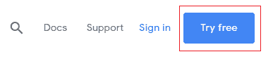

1.  如果你尚未登录 Google 账户，系统会要求你登录。根据提示选择你的国家，并确保勾选服务条款框。之后，点击同意并继续。你会看到如下截图页面：

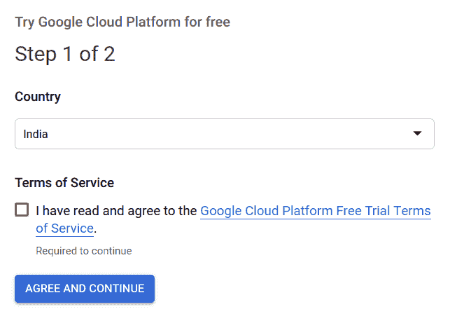

1.  然后，系统会要求你输入所选择的支付方式的详细信息。即使你有免费的信用额度，为了使用 GCP 的服务，你也需要设置一个有效的计费账户。但不用担心，除非你允许 GCP 否则不会从你的计费账户中扣费。在免费试用期间，你在 GCP 上使用的所有计费服务将仅从你的免费信用额度中扣除。一旦免费信用额度用尽，GCP 会向你发送提醒。

完成计费手续后，你应该会进入 GCP 的控制台页面，界面如下所示：

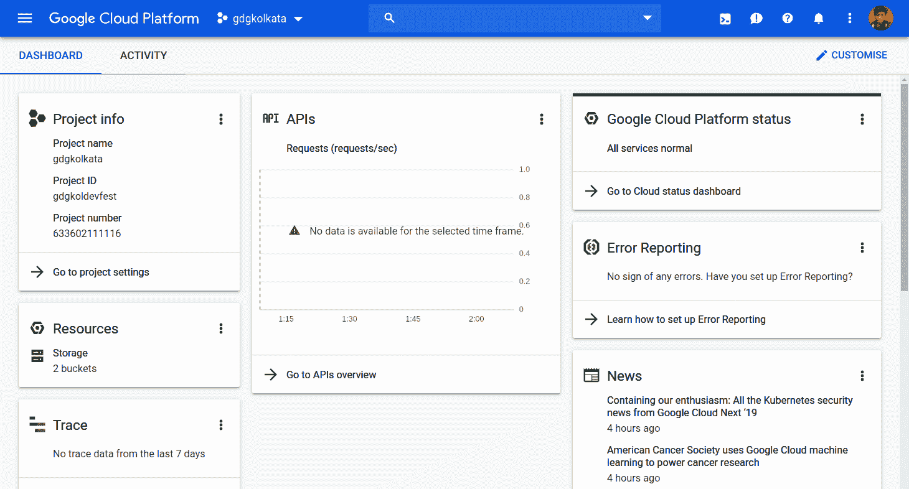

这是你的 GCP 仪表板，它会给你一个 GCP 使用情况的总体概览。GCP 还允许你自定义在控制台上显示的标签。

现在你应该已经完成了 GCP 账户的设置。为了能够使用 GCP 中的工具，你需要创建一个带有有效计费账户的 GCP 项目。在接下来的章节中，你将看到如何操作。

# 在 GCP 上创建你的第一个项目

项目帮助你系统地组织所有的 GCP 资源。创建 GCP 项目只需几个点击步骤：

1.  在登录你的 Google 账户后，使用 [`console.cloud.google.com`](https://console.cloud.google.com) 打开 GCP 控制台。在左上角，你应该看到 Google Cloud Platform，并且就在旁边，你可以看到一个下拉列表，如下所示：


1.  如果你在注册 GCP 时或之前创建了任何项目，那么你的项目将出现在标记区域（我在 GCP 上创建了 fast-ai-exploration 和 gcp-api 两个项目）。现在，点击下拉箭头，应该会弹出一个窗口：

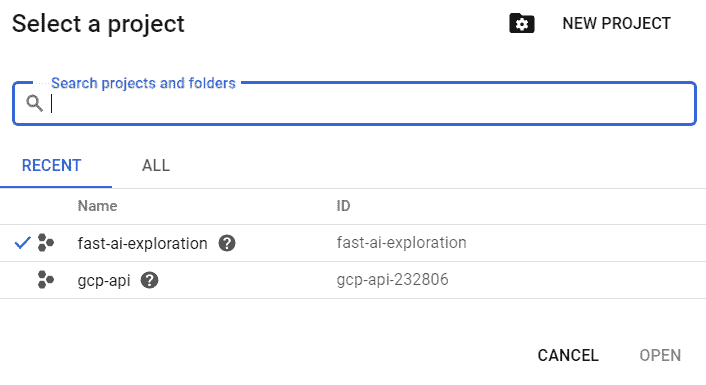

1.  点击 "NEW PROJECT" 继续。你将进入一个页面，如下图所示，页面会要求你指定项目名称。GCP 会自动为你创建项目的 ID，但你也可以根据自己的需求编辑该 ID：


1.  在你指定了项目的初步细节后，只需点击 "CREATE" 项目即可创建。创建完成后，项目应该会出现在项目列表中。你可以随时通过 GCP 控制台页面提供的下拉菜单访问该列表。你可以在下图中看到这个界面：

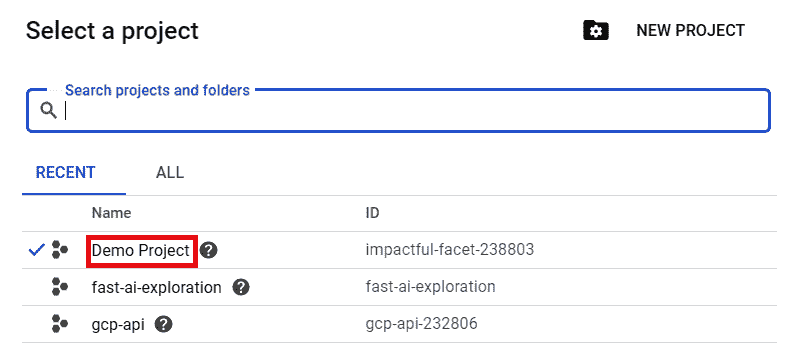

如果你想了解更多关于 GCP 项目的信息，可以查看官方文档 [`cloud.google.com/storage/docs/projects`](https://cloud.google.com/storage/docs/projects)。GCP 提供了一整套广泛的实用工具，你可以在 [`cloud.google.com/products/`](https://cloud.google.com/products/) 找到它们。我们鼓励你查看并根据个人兴趣进行探索。

GCP 为我们提供了广泛的 API，可以用于多种任务，包括深度学习。在接下来的几个章节中，我们将看到如何使用 Python 代码调用一些最常用的深度学习 API。我们将从 Dialogflow 开始。

# 在 Python 中使用 Dialogflow API

在我们开始学习如何在 Python 中使用 Dialogflow API 之前，让我们先了解一下 Dialogflow 是什么。

Dialogflow（前身为**api.ai**）提供了一套用于构建自然且丰富的对话界面的工具，如语音助手和聊天机器人。它由深度学习和自然语言处理技术驱动，并被大量公司使用。它与网站、移动应用程序以及许多流行的平台（如 Facebook Messenger、Amazon Alexa 等）无缝集成。Dialogflow 为我们提供了构建对话式用户界面的三个主要组件：

+   可以轻松应用于任何对话式用户界面的最佳实践和流程

+   添加任何构建对话式用户界面所需的自定义逻辑的功能

+   用于训练代理的功能，以便优化界面的整体体验

现在，我们将看到如何使用 Dialogflow 创建一个简单的 Python 应用程序。您可以访问 [`dialogflow.com`](https://dialogflow.com) 了解更多关于 Dialogflow 的信息。

我们将从创建一个 Dialogflow 帐户开始。

# 创建一个 Dialogflow 帐户

创建一个 Dialogflow 帐户非常简单。整个过程包含以下步骤：

1.  访问 [`console.dialogflow.com/api-client/#/login`](https://console.dialogflow.com/api-client/#/login)，您将看到以下界面：

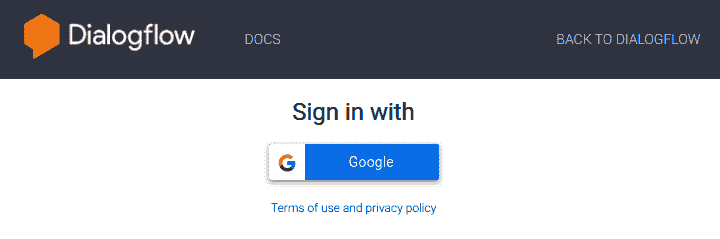

1.  点击“使用 Google 登录”按钮后，系统将要求您选择一个要与 Dialogflow 一起使用的 Google 帐户。

1.  选择帐户后，可能会要求您允许 Dialogflow 的帐户权限，并接受 Dialogflow 的条款和条件。

# 创建一个新代理

创建帐户后，您将看到一个仪表板，仪表板将显示您的活动 Dialogflow 项目，或者提示您创建一个新的代理并进行显示——但是，什么是**代理**呢？

代理——在 Dialogflow 的术语中——是一个软件，负责接收用户输入，这些输入可能是文本、音频、图片或视频格式。然后，它尝试确定*意图*，即与输入对应的预定义的适当操作。匹配的意图可能会执行一个*动作*，或者仅仅返回一个超文本响应，回应用户的查询。最后，代理将结果返回给用户。

要创建一个新代理，请在 Dialogflow 控制台的左侧导航菜单中点击“创建代理”。

您将看到如下所示的界面：

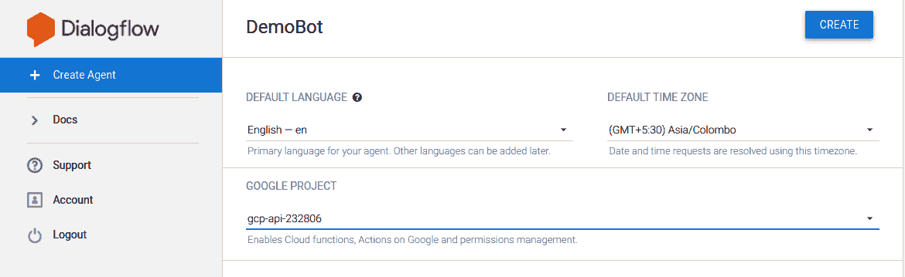

我们将代理命名为 DemoBot，并将默认语言设置为英语。此外，我们还需要为该代理选择一个 Google 项目。

Google 项目——或简而言之，**项目**——是你在学习 GCP 时遇到的一个术语。项目包含了为任何使用这些资源的软件项目分配的所有资源，这些资源由 GCP 上的一个单一账单账户进行融资。在没有为资源定义项目的情况下，无法分配任何资源。此外，在没有添加有效账单选项的情况下，无法创建项目。

现在你将能够看到如下截图中显示的界面，其中为你的代理提供了一些默认意图：

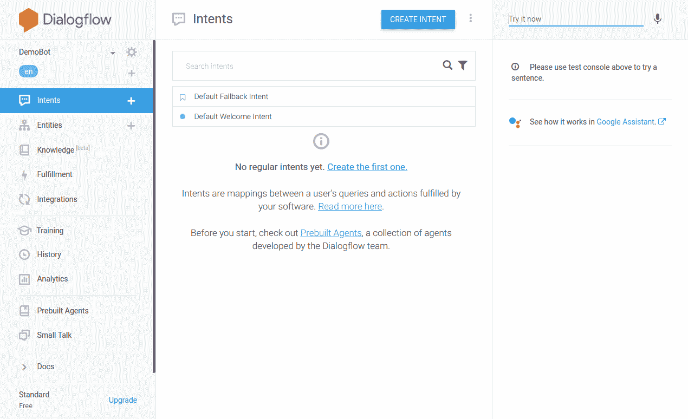

在左侧，你可以看到导航菜单，提供了所有可以组合在一起，以便软件提供更具人性化交互的各种模块。在右侧面板中，你可以随时测试你的代理，输入任何你提供的内容。这在响应开发和测试输入匹配意图时会非常有用。

# 创建一个新意图

要为我们的代理创建一个新意图，按照以下步骤操作：

1.  点击中间区域右上角的创建意图按钮。

1.  你需要为这个意图提供一个名称——我们称之为`Dummy Intent`。

1.  然后我们需要提供一些训练短语，这些短语会触发此意图。假设我们提供了三个训练短语，如下所示：

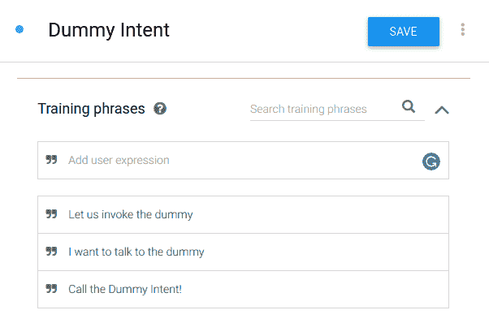

现在，我们可以预期，当系统遇到训练中提到的短语（或类似短语）时，这个意图会被调用。

1.  现在我们可以添加一些响应，当这个意图被调用时，代理将作出响应，如下所示：

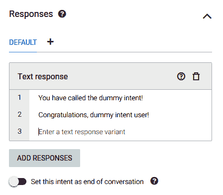

1.  在中间区域的右上角，点击保存按钮以保存新意图，系统会通知你代理训练已开始。

对于一个小型代理，训练在几秒钟内完成，系统会显示“代理训练完成”的通知。

我们现在准备测试我们的代理是否能够执行这个意图。

# 测试你的代理

在你 Dialogflow 控制台的右侧区域，你可以测试你的代理。在顶部文本框中输入你的查询。在我们的代理中，调用`Dummy Intent`时，我们输入`Talk to the dummy`。

如果意图正确匹配，你将能够看到来自`Dummy Intent`的响应，如下所示：

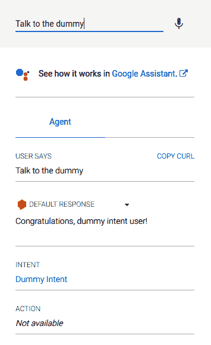

在前面的截图中，你会看到用户的输入是`Talk to the dummy`，生成的响应是我们为`Dummy Intent`定义的两个响应之一。你可以看到，匹配到输入的意图是`Dummy Intent`。

现在我们来看看如何使用 Python 调用代理。

# 安装 Dialogflow Python SDK

在本节中，我们将演示如何使用 Dialogflow Python API V2 与您的 Dialogflow 代理配合使用，将互动性带入您使用 Python 构建的应用程序。首先，让我们通过以下图表理解 DialogFlow 生态系统的多个组件如何交互：

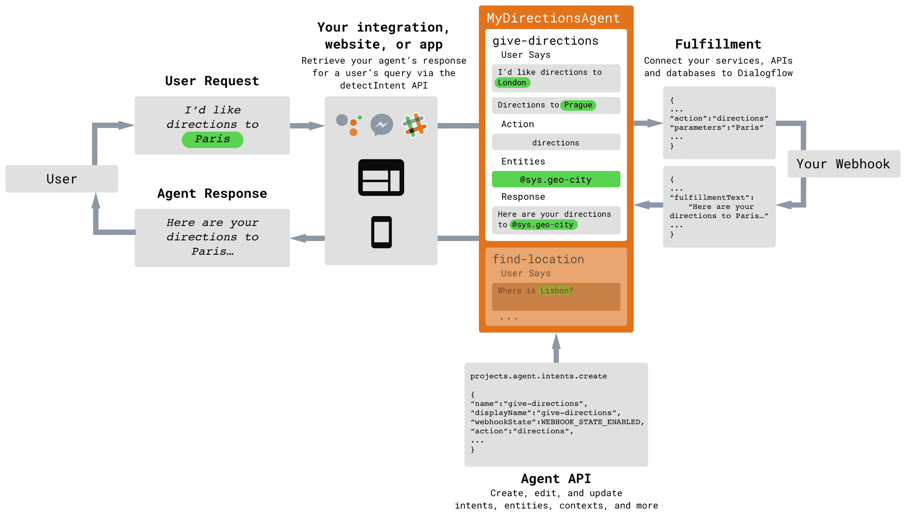

用户创建输入内容，并通过集成 API、网站或应用将其发送给代理。代理将用户输入与可用的意图进行匹配，并生成 **查询** 的响应。响应通过 Webhook 发送回用户界面，并展示给用户。

集成 API 很可能会包含 Dialogflow 以外的服务。您可以创建一个应用程序，将相同的用户查询传播到多个代理，并汇总它们的响应。

或者，开发者可以引入中间件处理程序或集成，这些程序会对用户查询和代理响应进行预处理或后处理：

1.  要安装 Dialogflow Python SDK，我们在终端使用以下命令：

```py
pip install dialogflow
```

强烈建议在使用之前的命令之前，使用 `virtualenv` 创建一个虚拟环境，以便拥有干净且不间断的依赖关系。要了解有关 `virtualenv` 的更多信息，请参考 [`virtualenv.pypa.io/en/latest/`](https://virtualenv.pypa.io/en/latest/)。

1.  安装完成后，您可以使用以下导入代码将 Dialogflow API 导入到您的项目中：

```py
import dialogflow
```

现在我们将创建一个 GCP 服务账户来认证我们的 Python 脚本，以便使用我们创建的 Dialogflow 代理。

# 创建 GCP 服务账户

GCP 服务账户管理用于访问 GCP 资源的权限。我们创建的 Dialogflow 代理是一个 GCP 资源，因此要通过 Python API 使用它，我们需要一个服务账户：

1.  在 GCP 控制台中，从左侧导航菜单中，前往 APIs | Services | Credentials。

1.  点击“创建凭证”按钮，获取以下选项：

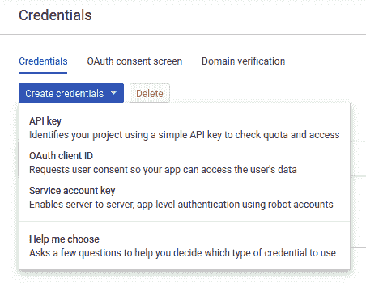

1.  点击“服务账户密钥”。在接下来的页面中，选择 Dialogflow 集成作为服务账户，JSON 作为密钥类型。点击“创建”后，一个 JSON 文件将下载到您的计算机。

1.  记下此 JSON 文件的地址，例如 `/home/user/Downloads/service-account-file.json`。文件名可能会有所不同，因为它是由 GCP 控制台在您下载文件到计算机时提供的。

1.  打开此文件以获取项目 ID。

1.  现在，在终端使用以下命令——根据您系统上的实际情况进行适当替换——将凭证导出到环境变量中：

+   +   在 Linux（终端）中：

```py
export GOOGLE_APPLICATION_CREDENTIALS="<your_service_account_file_location>"
export DIALOGFLOW_PROJECT_ID="<your_project_id>"

```

+   +   在 Windows（命令提示符）中：

```py
set GOOGLE_APPLICATION_CREDENTIALS=<your_service_account_file_location>
set DIALOGFLOW_PROJECT_ID=<your_project_id>

```

完成此步骤后，我们现在准备编写调用 Dialogflow 代理的 Python 脚本。

请注意，上述命令仅设置当前会话的变量。每次重新启动会话时，您需要运行这些命令。

# 使用 Python API 调用 Dialogflow 代理

在这个示例中，我们将创建一个简单的基于 Python 的 API，调用我们在 Dialogflow 控制台中创建的代理来调用 `Dummy Intent`，如下面所示：

1.  首先，我们必须将 Dialogflow 模块导入项目。为此，请使用以下代码：

```py
import dialogflow
```

1.  要将项目 ID 引入脚本中，我们可以从运行时环境变量中获取它。为此，请使用以下代码：

```py
import os
project_id = os.getenv("DIALOGFLOW_PROJECT_ID")
```

1.  我们还将声明一个唯一的会话 ID，以存储与用户进行的任何单个会话的对话记录：

```py
session_id="any_random_unique_string"
```

1.  现在我们将创建一个方便的函数，允许我们反复执行一组调用 Dialogflow 代理所需的预处理语句：

```py
def detect_intent(project_id, session_id, text, language_code):

    session_client = dialogflow.SessionsClient()
    session = session_client.session_path(project_id, session_id)

    text_input = dialogflow.types.TextInput(text=text, language_code=language_code)
    query_input = dialogflow.types.QueryInput(text=text_input)
    response = session_client.detect_intent(session=session, query_input=query_input)

    return response.query_result.fulfillment_text
```

在上述代码中，我们首先初始化一个 `SessionsClient` 对象。会话记录用户与 Dialogflow 代理在一次不间断对话中的完整互动。接下来，我们必须设置会话路径，即将项目映射到一个唯一的会话 ID。

上面函数定义的接下来的两行代码用于创建一个包含 Dialogflow `TextInput` 对象的 `QueryInput` 对象。`query_input` 变量保存用户输入的消息，用于 Dialogflow 代理。

下一行代码调用了 `SessionsClient` 对象的 `detect_intent()` 方法。会话 ID-项目 ID 映射及输入作为参数传递给该方法。Dialogflow 代理的响应存储在响应变量中。该函数返回满足文本响应。

1.  现在让我们使用这个方法。首先，声明一个消息并传递给 Dialogflow 代理。回想一下我们为 `Dummy Intent` 提供的训练短语。我们将传递一个类似于训练短语的消息：

```py
message = "Can I talk to the dummy?"

fulfillment_text = detect_intent(project_id, session_id, message, 'en')

print(fulfillment_text)
```

我们将获得一个输出，它是我们为 `Dummy Intent` 定义的两个响应之一。

1.  在 `detect_intent()` 方法中生成响应变量，可以通过在 `detect_intent()` 函数中添加以下代码行来实现：

```py
def detect_intent(project_id, session_id, text, language_code):
    ...
    response = session_client.detect_intent(session=session, query_input=query_input)
    print(response) ### <--- ADD THIS LINE

    return response.query_result.fulfillment_text
```

您将获得以下 JSON：

```py
response_id: "d1a7b2bf-0000-0000-0000-81161394cc24"
query_result {
  query_text: "talk to the dummy?"
  parameters {
  }
  all_required_params_present: true
  fulfillment_text: "Congratulations, dummy intent user!"
  fulfillment_messages {
    text {
      text: "Congratulations, dummy intent user!"
    }
  }
  intent {
    name: "projects/gcp-api-232806/agent/intents/35e15aa5-0000-0000-0000-672d46bcefa7"
    display_name: "Dummy Intent"
  }
  intent_detection_confidence: 0.8199999928474426
  language_code: "en"
}
```

您将观察到，匹配到的意图名称是 `Dummy Intent`，而我们在这次调用代理中获得的输出是 `恭喜，虚拟意图用户！`。

使用 Python 调用 Dialogflow API 的方式有很多种，包括—但不限于—音视频输入和基于传感器的输入。Dialogflow 代理可以与主要平台集成，例如 Google Assistant、Facebook Messenger、Slack、Telegram、WhatsApp 等，具体如下：

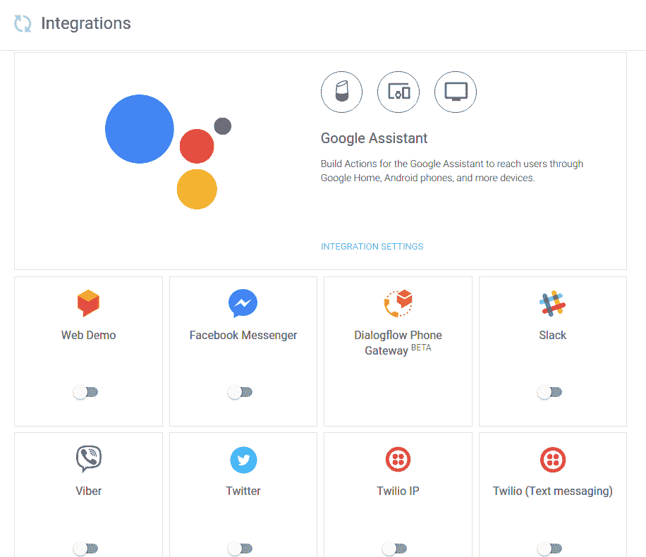

Dialogflow 生态系统正在快速推出新功能，并且越来越朝着提供能够同时执行多项任务的基于 AI 的完整聊天机器人方向发展。

在接下来的章节中，我们将探索另一个可以用于预测图像和视频内容的 GCP API。

# 在 Python 中使用 Cloud Vision API

计算机视觉是使计算机理解图像并从中提取信息的领域。常见的计算机视觉任务包括图像分类、图像检测、图像分割等。如前几章所述，计算机视觉领域受到深度学习在实现人类水平（有时甚至更好）性能方面的有效性影响很大。

Cloud Vision API 提供了许多工具来执行计算机视觉任务。Cloud Vision 允许我们使用预训练模型，也可以构建我们自己的定制化生产就绪模型，以满足我们的需求（例如 AutoML Vision Beta）。现在让我们简要看看 Cloud Vision API 提供的功能：

+   标签检测

+   光学字符识别

+   手写识别

+   地标检测

+   物体定位

+   图像搜索

+   产品搜索

除了前面提到的功能，Cloud Vision 还允许我们提取给定图像的不同属性。下图展示了这个功能：

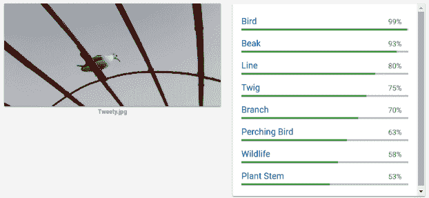

如我们所见，当提供一张图像时，Cloud Vision API 会自动提取其属性。你也可以通过访问[`cloud.google.com/vision/`](https://cloud.google.com/vision/)来尝试这个功能。

我们之前在章节中提到过**预训练模型**这一术语。我们也看到，Cloud Vision API 让我们能够使用这些预训练模型。深入了解“预训练模型”这一术语非常值得，这有助于我们理解使用它们的重要性。

# 使用预训练模型的重要性

使用预训练模型通常被称为**迁移学习**。迁移学习并不是深度学习中非常基础的内容，它只是一种方法论。它并不指代某个特定的深度学习模型，但迁移学习的含义在深度学习中非常有效，尤其是在深度学习的背景下。

我们人类并不是从零开始学习每一项任务；我们尝试利用过去的经验来完成类似的任务。这就是迁移学习。我们倾向于将过去经验的知识转移到我们遇到的相似任务中。

但这如何应用于深度学习呢？让我们来看看。

当神经网络为某个特定任务进行训练时，它会试图估计最佳权重矩阵的值。现在，当你尝试为类似任务训练另一个网络时，事实证明你可以使用之前任务的权重。在这里，“相似性”的定义很宽泛，可以暂时忽略不提。但你可能会好奇，这里有什么优势。好吧，优势是多方面的，下面是几个例子：

+   你不需要从头开始训练神经网络，这为你节省了大量时间。

+   它利用了使用与你的任务相似的领域问题的最先进成果的机会。

在文献中，你使用网络权重的任务被称为源任务，你应用权重的任务被称为目标任务。你使用权重的网络模型被称为预训练模型。Goodfellow 等人在其著作《Deep Learning》中对迁移学习给出了非常微妙的定义：

“[A] 在一个环境中学到的知识被用来改善另一个环境中的泛化能力。”

迁移学习在自然语言处理（**NLP**）、计算机视觉等深度学习应用中已展现出卓越的成果。然而，迁移学习也有其局限性：

+   当源任务与迁移学习所用任务没有充分的相关性时，迁移学习可能会导致性能下降。

+   有时候很难确定从源任务到目标任务需要多少迁移。

为了深入研究迁移学习，推荐你阅读 Dipanjan 等人所著的《Hands-On Transfer Learning with Python》一书。接下来，我们将通过一个示例学习如何使用 Python 使用 Cloud Vision API。

# 设置 Vision Client 库

Cloud Vision API 通过一组适用于不同编程语言的库提供，这些库被称为 Vision Client 库。

该系列库中提供的一个库是 Python Cloud Vision Client 库，我们将在示例中使用它：

1.  要安装 Python Cloud Vision Client 库，我们在终端中使用以下命令：

```py
pip install --upgrade google-cloud-vision
```

强烈建议使用 Python 虚拟环境来安装 Vision Client 库。

1.  安装完成后，我们需要设置一个服务账户来使用 API。

1.  如前所述，设置服务账户的步骤如下：

    1.  打开 Google Cloud 控制台。

    1.  进入“APIs | Services | Credentials”。

    1.  点击“创建凭证”。

    1.  在下拉菜单中选择“新建服务账户”以选择服务账户。

    1.  为服务账户填写任何名称。

    1.  取消勾选“角色”。在使用 Cloud Vision API 时不需要此项设置。

    1.  点击“创建”。确认任何出现的警告框。

    1.  `service account credentials` JSON 文件会被下载到你的计算机中。

1.  现在，像之前一样，将下载的文件导出到系统环境中。为此，使用以下命令：

+   +   在 Linux（终端）中：

```py
export GOOGLE_APPLICATION_CREDENTIALS="/home/user/Downloads/service-account-file.json"

```

+   +   在 Windows（命令提示符）中：

```py
set GOOGLE_APPLICATION_CREDENTIALS=/home/user/Downloads/service-account-file.json
```

1.  在使用 Cloud Vision API 之前的最后一步，我们需要在创建服务账户的项目中启用该 API。为此，请执行以下操作：

    1.  在 Google Cloud 控制台的左侧导航面板中，点击“APIs 和 Services”。

    1.  点击“启用 APIs 和 Services”。

    1.  在出现的列表中找到 Cloud Vision API。

    1.  点击“启用”。

在此之后，我们准备好在脚本中使用 Python 调用 Cloud Vision API。

# 使用 Python 调用 Cloud Vision API

让我们创建一个新的 Python 脚本（或 Jupyter notebook）。为了使用 Cloud Vision API，我们首先需要导入 Cloud Vision 客户端库。

1.  为此，我们使用以下代码：

```py
from google.cloud import vision
```

1.  有了这些，我们就准备好继续使用客户端库了。在我们的示例中，我们将对一张图像进行标注。图像标注服务是通过 Vision 库中的 `imageAnnotatorClient()` 函数提供的。我们将创建该方法的一个对象：

```py
client = vision.ImageAnnotatorClient()
```

1.  现在，让我们将要进行标注的文件加载到程序中：

```py
with open("test.jpg", 'rb') as image_file:
    content = image_file.read()
```

请注意，`test.jpg` 文件应该与工作目录中的其他文件放在同一位置，才能正常工作。

1.  该文件目前是程序的原始二进制数据文件。为了让 Cloud Vision API 正常工作，我们需要将其转换为 Vision 客户端可以接受的图像类型：

```py
image = vision.types.Image(content=content)
```

1.  最后，我们通过 Cloud Vision API 调用 GCP 来对图像进行标注：

```py
response = client.label_detection(image=image)
labels = response.label_annotations
```

打印由 Vision API 设置的标签后，我们将能够看到 Cloud Vision API 能够在提供的图片中检测到的所有可能的物体和特征，如下所示：


如果打印 `labels`，结果应该如下所示：

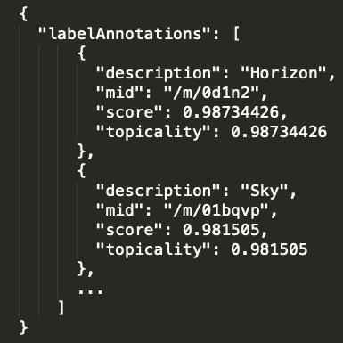

预测的标签是 `Sky`（天空）、`Horizon`（地平线）、`Atmosphere`（大气）、`Sunrise`（日出）、`Sunset`（日落）、`Morning`（早晨）、`Ocean`（海洋）、`Calm`（平静）、`Wing`（机翼）和 `Evening`（傍晚）。

上述预测结果非常接近前面照片中捕捉到的实际场景。那是日出时分，从飞机的窗户拍摄的照片。

# 在 Python 中使用 Cloud Translation API

Cloud Translation API 帮助开发人员轻松将语言翻译功能集成到他们的应用程序中。它由先进的神经机器翻译技术提供支持，可以将其视为深度学习和机器翻译的结合体。Cloud Translation API 提供了使用预训练模型和构建生产级自定义模型的编程接口。

许多开发人员使用 Cloud Translation API 的预训练模型动态将给定文本翻译成目标语言。Cloud Translate API 支持 100 多种语言。但是这个语言库正在不断发展，以增强开发者社区的能力。以下截图展示了将一段英文文本翻译成孟加拉语的例子：

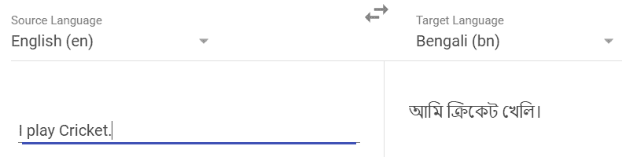

你可以随时在 [`cloud.google.com/translate/`](https://cloud.google.com/translate/) 上尝试这个功能。但是有时，给定文本的语言本身可能是未知的。Cloud Translation API 提供了一项叫做 **标签检测** 的服务来处理这种情况。

Cloud Translation API 的 AutoML 变体允许我们根据需要构建针对语言对（源语言和目标语言）的自定义模型。

# 设置 Cloud Translate API 以供 Python 使用

要在 Python 中使用 Cloud Translation API，首先我们需要安装 Google Cloud Translate Python 库。

1.  为此，请在终端中使用以下 `pip` 命令：

```py
pip install google-cloud-translate
```

1.  现在，像之前一样，创建一个服务账户并下载凭证文件。将此文件导出到 `GOOGLE_APPLICATION_CREDENTIALS` 环境变量的路径中。

1.  接下来，在启用的 API 列表中找到 `Cloud Translate API`。完成后，我们就可以直接通过 Python 使用 GCP 进行翻译。

# 使用 Google Cloud Translation Python 库

创建一个新的 Jupyter 笔记本或 Python 脚本。接下来，我们将把 Google Cloud Translate API 导入到我们的项目中。

1.  为此，请使用以下代码：

```py
from google.cloud import translate_v2 as translate
```

1.  我们需要创建一个 Cloud Translate API 对象来进行服务调用。我们可以按如下方式操作：

```py
translate_client = translate.Client()
```

1.  现在，让我们开始翻译过程。首先，我们需要一条要翻译的消息：

```py
original = u'नमस्ते'
```

这将创建一个包含单词 *Namaste*（印度语问候语）的 Unicode 字符串。让我们看看它转换成英语是什么！

我们使用以下代码调用 API 将文本翻译成英语：

```py
translation = translate_client.translate(original, target_language="en")
```

如果你观察 `translation` 变量，你会发现它包含了以下详细信息：

```py
{
    'translatedText': 'Hello', 
    'detectedSourceLanguage': 'hi', 
    'input': 'नमस्ते'
}
```

从这个字典中可以简单地推断出检测到的语言是印地语（用 `hi` 表示）。输入以其输入格式显示。`translatedText` 存储了 `Hello`，这是 *Namaste* 的准确翻译。

# 总结

在本章中，我们探讨了 GCP 提供的一些著名且具有突破性的基于深度学习的服务。我们学习了如何使用 Python 的 Dialogflow 构建能够随着时间学习的对话型聊天机器人。我们使用 Cloud Vision API 来预测任何图像中识别到的物体。我们可以轻松地将此方法扩展到视频中，并获得类似的结果。最后，我们介绍了 Cloud Translate API，通过该服务进行深度基于 NLP 的翻译。GCP 提供的所有主要服务都可以通过 API 访问，这使得它们在任何项目中都易于替换。由高素质专业人员创建的模型的准确性值得称赞，这使得在构建 AI 驱动的 Web 解决方案时，Web 开发者的工作变得更加轻松。

在下一章中，我们将介绍**亚马逊网络服务**（**AWS**）提供的功能，使用 Python 将 AI 集成到 Web 应用程序中。
