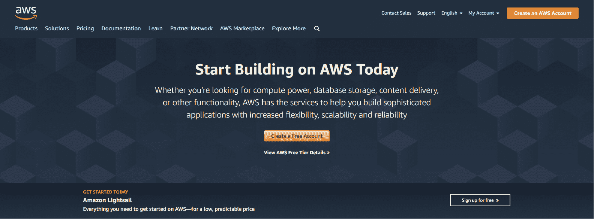
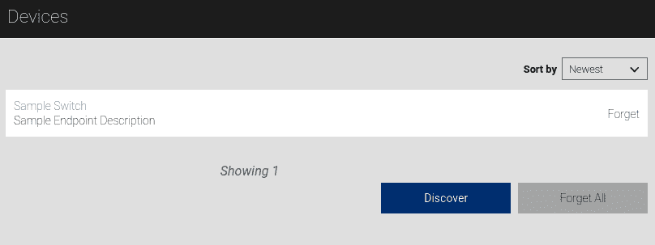

# 第十章：使用 Python 在 AWS 上进行 DL：对象检测和家庭自动化

我们熟悉了来自 Google Cloud Platform 的几个基于深度学习的产品，并学习了它们如何在第六章中使用 Python 在 Google Cloud Platform 上进行深度学习。现在，我们已经对云计算有了相当好的概述，在本章中，我们将介绍另一个云计算平台，**Amazon Web Services**（**AWS**），它也提供一些高性能和高可靠性的基于深度学习的解决方案，以便更轻松地解决问题。在本章中，我们将以 API 的形式介绍其中的两个，并学习如何从 Python 程序中使用它们。

我们将从设置 AWS 账户并在 Python 中配置 boto3 开始。然后，我们将学习如何在 Python 中使用 Rekognition API 和 Alexa API。

在本章中，我们将涵盖以下主题：

+   设置您的 AWS 账户

+   AWS 的简介

+   在 Python 中配置 boto3

+   使用 Python 中的 Rekognition API

+   使用 Python 中的 Alexa API

# 技术要求

您可以在[`github.com/PacktPublishing/Hands-On-Python-Deep-Learning-for-Web/tree/master/Chapter7`](https://github.com/PacktPublishing/Hands-On-Python-Deep-Learning-for-Web/tree/master/Chapter7)获取本章的代码。

要运行本章的代码，您需要以下软件：

+   Python 3.6+

+   Python PIL 库

其他安装步骤将在本章中介绍。

# 在 AWS 开始使用

在使用任何 AWS 服务或 API 之前，您必须创建您的 AWS 账户。在本节中，我们将快速浏览创建 AWS 账户的步骤：

1.  首先，打开[`aws.amazon.com/`](https://aws.amazon.com/)。您应该会看到类似以下的页面：



1.  然后点击“创建 AWS 账户”按钮，将带您到以下页面：


1.  填写字段并点击“继续”。

1.  门户将向您索取更多强制信息。它还将要求您注册支付方式以验证您的详细信息。

如果您不提供这些信息，您将无权使用 AWS 设施的免费层。

1.  在注册的最后一步，您将被要求在三个计划（免费、开发者和商业）之间选择。根据您的需求选择适当的计划并继续。

像 Google Cloud Platform 一样，AWS 也提供免费层访问。首次注册 AWS 时，您可以免费使用多种 AWS 服务和产品，但只能使用一定的配额。您可以访问[`aws.amazon.com/free/`](https://aws.amazon.com/free/)了解更多信息。

如果您按照上述步骤进行操作，应该会看到以下页面：


AWS 具有一个很棒的功能，可以为用户推荐解决方案和服务。为了充分利用此功能，您需要输入两项内容——您的角色和兴趣领域。您可以在上图中看到这一点。输入这两个信息并点击“提交”以获取一些定向的产品推荐。

1.  下一步是点击“登录到控制台”按钮。

成功登录 AWS 控制台后，您应该会看到如下窗口：


AWS 控制台是您可以找到所有 AWS 提供的服务和解决方案的地方。可以随意通过点击“服务”标签浏览完整的服务集合。您也可以通过搜索框查找特定的服务。

到现在为止，我们的 AWS 账户应该已经准备好，可以开始动手了。在接下来的章节中，我们将简要回顾 AWS 的服务，以便更好地了解该平台。

# AWS 服务简短概览

AWS 提供了多种领域的服务和解决方案。以下是 AWS 提供的不同类型的模块（括号中的为 AWS 提供的不同服务名称）：

+   计算（EC2、Lambda 等）

+   存储（S3、Storage Gateway 等）

+   机器学习（Amazon SageMaker、AWS DeepLens 等）

+   数据库（RDS、DynamoDB 等）

+   迁移与传输（Snowball、DataSync 等）

+   网络与内容交付（CloudFront、VPC 等）

+   开发者工具（CodeStar、CodeCommit 等）

+   机器人技术（AWS RoboMaker）

+   区块链（Amazon Managed Blockchain）

+   分析（Athena、CloudSearch 等）

还有很多其他服务，如下图所示：


这个列表其实非常广泛，但我们暂时将焦点限制在机器学习（也称为深度学习）服务上。

AWS 控制台中的搜索框还允许您搜索可能已经听说过的 AWS API。让我们在其中输入 `Rekognition` 并按 *Enter*。您应该会看到 Rekognition 的主页，如下图所示：


我们将在本章稍后的部分详细探讨 Rekognition API。在接下来的章节中，我们将学习如何使用 boto3（一个提供 Python 编程接口的 AWS SDK）与不同的 AWS 资源进行交互。

# 使用 boto3 入门

boto3 是 AWS 官方提供的库，用于与 AWS API 通信。您可以在 [`aws.amazon.com/sdk-for-python/`](https://aws.amazon.com/sdk-for-python/) 找到该库，并可以通过以下命令安装：

```py
pip install boto3
```

安装完成后，你需要配置 boto3 以供你的项目使用。配置 boto3 的第一步是从**身份和访问管理**（**IAM**）控制台获取你的 AWS 访问密钥。按照以下步骤进行配置：

1.  访问你的 AWS IAM 控制台：[`console.aws.amazon.com/iam`](https://console.aws.amazon.com/iam)。页面应该如下所示：


在上面的仪表板中，你将能够看到访问密钥。

1.  点击**删除根访问密钥**，然后点击**管理安全凭证**。系统将展示以下窗口：


1.  展开**访问密钥（访问密钥 ID 和秘密访问密钥）**标签并从中获取访问密钥。密钥生成成功后，你应该看到如下信息：


1.  下载密钥文件并将其保存在安全的位置，因为在配置 boto3 时需要用到此文件。

# 配置环境变量并安装 boto3

一旦你获得了访问密钥，创建两个环境变量，`aws_access_key_id` 和 `aws_secret_access_key`。现在，根据你获得的密钥，设置它们的值。密钥包含的信息将帮助你区分密钥 ID 和秘密访问密钥。配置好必要的环境变量后，我们可以开始在 Python 中加载环境变量。

# 在 Python 中加载环境变量

一旦库成功安装，你可以通过以下代码行加载刚才创建的环境变量：

```py
import os
aws_access_key_id= os.environ['aws_access_key_id']
aws_secret_access_key = os.environ['aws_secret_access_key']
```

一旦环境变量正确加载，我们就可以调用 boto3 来与 AWS 资源进行交互。例如，如果你想列出 AWS 账户中的 S3 存储桶，并将一张图片上传到某个存储桶。S3 是你想要访问的 AWS 资源。如果你在 AWS 账户中没有任何 S3 存储桶，不用担心，你可以快速创建一个。

# 创建 S3 存储桶

你可以通过以下步骤快速创建一个 S3 存储桶：

1.  访问 S3 控制台主页：[`s3.console.aws.amazon.com/s3`](https://s3.console.aws.amazon.com/s3)。页面应该如下所示：


1.  点击**创建存储桶**。系统会要求你输入以下信息：


1.  为你的存储桶命名，保持其他设置不变，然后点击**创建**。存储桶创建成功后，你将在 S3 控制台中看到它：


接下来，我们将学习如何使用 boto3 从 Python 代码访问 S3。

# 使用 boto3 从 Python 代码访问 S3

现在，你可以通过 Python 代码访问你的 S3 存储桶。以下代码行将展示可用的存储桶：

```py
import boto3
s3 = boto3.resource(
    's3',
    aws_access_key_id=aws_access_key_id,
    aws_secret_access_key=aws_secret_access_key
)
```

你在 `resource()` 的第一个参数中指定了你有兴趣访问 S3。你可以通过访问 [`bit.ly/2VHsvnP`](https://bit.ly/2VHsvnP) 来阅读相关文档。现在，你可以通过以下代码找到可用的存储桶：

```py
for bucket in s3.buckets.all():
 print(bucket.name)
```

你应该会得到一个列表作为输出。现在，假设你想将一张图片上传到某个存储桶。如果你想上传的图片就在当前工作目录中，以下代码行应将图像上传到指定的 S3 存储桶：

```py
data = open('my_image.jpeg', 'rb')
s3.Bucket('demo-bucket-sayak').put_object(Key='my_image.jpeg', Body=data)
```

前面的代码包含了以下功能：

+   `my_image.jpeg` 是你想上传的图像路径。

+   在 `Bucket()` 方法中，指定的是你希望上传图片的 S3 存储桶的名称。

如果代码成功执行，你应该会收到以下输出：

```py
s3.Object(bucket_name='demo-bucket-sayak', key='my_image.jpeg')
```

你可以通过访问 AWS S3 控制台，进入你上传图像的存储桶，来验证图像是否上传成功。你应该能在其中看到类似以下内容：


现在你已经成功在 Python 中配置了 boto3，我们可以继续学习如何使用 boto3 在 Python 中调用 Rekognition 和 Alexa API。

# 在 Python 中使用 Rekognition API

Amazon Rekognition 是一个启用了深度学习的视觉分析服务，可以帮助你无缝搜索、验证和分析数十亿张图像。首先让我们简单回顾一下 Rekognition API，然后我们将直接开始在 Python 中使用它。首先访问 Rekognition API 的主页 [`console.aws.amazon.com/rekognition/home`](https://console.aws.amazon.com/rekognition/home)。我们已经在本章的早些章节中看过 Rekognition 的主页。

正如你可能已经从导航栏中注意到的，Rekognition API 提供了很多功能：

+   **物体和场景检测**：此功能可以自动为给定图像标注物体、标签和场景，并提供置信度分数。

+   **图像审核**：这个功能可以帮助你检测图像中的显性或暗示性成人内容，并提供置信度分数。

+   **名人识别**：使用这个功能，你可以自动识别图像中的名人，并提供置信度分数。

+   **人脸比对**：这个功能可以用于查看两个面孔的相似度百分比，以判断它们之间的匹配程度。

除了这些功能外，它还具有更多其他功能。

Rekognition API 提供的解决方案已经被许多组织证明是非常有用的，因为它们真正解决了一些现实世界中的挑战性问题。你可以通过点击 API 主页上相应的解决方案，快速尝试列表中提到的任何解决方案。我们来试试名人识别解决方案。

首先，访问 [`console.aws.amazon.com/rekognition/home?region=us-east-1#/celebrity-detection`](https://console.aws.amazon.com/rekognition/home?region=us-east-1#/celebrity-detection)（注意区域可能有所不同）。它应当看起来像下面的图片：


门户将允许你上传自己的图片并进行测试。让我们测试我的图片（我们本可以使用名人媒体图片，但这些图片有版权保护）。你可以看到预期的结果：


也可以尝试其他解决方案。现在让我们看看如何从 Python 代码中使用 Rekognition API：

1.  创建一个新的 Jupyter Notebook。首先，你需要创建一个新的 Jupyter notebook，例如命名为 `Sample.ipynb`。你还需要提供一张你希望测试的图像，用于通过 AWS Rekognition API 进行名人识别，下面是 Jupyter 目录结构截图：


1.  导入 AWS 账户凭证的环境变量。你需要将之前在 boto3 配置部分获得的账户凭证导入到脚本中。为此，可以使用以下代码：

```py
import os
aws_access_key_id= os.environ['aws_access_key_id']
aws_secret_access_key = os.environ['aws_secret_access_key']
```

1.  使用 boto3 创建 AWS Rekognition API 客户端。我们现在准备实例化一个 boto3 Rekognition API 客户端对象。为此，我们需要将要使用的 API 和所需的 AWS 区域名称传递给 `boto3` 对象。还需要传入之前步骤中获取的凭证，代码如下：

```py
import boto3
client=boto3.client('rekognition', region_name='us-east-1', aws_access_key_id=aws_access_key_id, aws_secret_access_key=aws_secret_access_key) 
```

1.  从磁盘读取图像并将其传递给 API。使用 boto3 SDK 将文件传递给 AWS API 有两种方法。首先，你可以直接从你有权限的 S3 存储桶发送它们，或者可以将图像作为 `Bytes` 数组从本地磁盘发送。我们已经在前面的部分展示了如何从 S3 存储桶查找图像。

现在我们将展示一个示例，其中我们从本地磁盘获取多张图片并传递给 API 调用：

1.  首先，使用 Python 的原生方法将图像读取到一个变量中，代码如下：

```py
image = open("image.jpg", "rb")
```

1.  现在，通过我们之前实例化的客户端将其传递给 API，使用以下代码行：

```py
response = client.recognize_celebrities(Image={'Bytes':image.read()})
```

1.  观察响应。一旦 API 调用成功，你的 `response` 变量将保存 API 返回的信息。要查看该信息，可以打印该变量：

```py
{'CelebrityFaces': [{'Urls': ['www.imdb.com/name/nm1682433'],
 'Name': 'Barack Obama',
 'Id': '3R3sg9u',
 'Face': {'BoundingBox': {'Width': 0.3392857015132904,
 'Height': 0.27056020498275757,
 'Left': 0.324404776096344,
 'Top': 0.06436233967542648},
 'Confidence': 99.97088623046875,
 'Landmarks': [{'Type': 'eyeLeft',
 'X': 0.44199424982070923,
 'Y': 0.17130307853221893},
 {'Type': 'eyeRight', 'X': 0.5501364469528198, 'Y': 0.1697501391172409},
 {'Type': 'nose', 'X': 0.4932120144367218, 'Y': 0.2165488302707672},
 {'Type': 'mouthLeft', 'X': 0.43547138571739197, 'Y': 0.25405779480934143},
 {'Type': 'mouthRight', 'X': 0.552975058555603, 'Y': 0.2527817189693451}],
 'Pose': {'Roll': -1.301725149154663,
 'Yaw': -1.5216708183288574,
 'Pitch': 1.9823487997055054},
 'Quality': {'Brightness': 82.28946685791016,
 'Sharpness': 96.63640594482422}},
 'MatchConfidence': 96.0}],
 'UnrecognizedFaces': [],
 'ResponseMetadata': {'RequestId': 'ba909ea2-67f1-11e9-8ac8-39b792b4a620',
 'HTTPStatusCode': 200,
 'HTTPHeaders': {'content-type': 'application/x-amz-json-1.1',
 'date': 'Fri, 26 Apr 2019 07:05:55 GMT',
 'x-amzn-requestid': 'ba909ea2-67f1-11e9-8ac8-39b792b4a620',
 'content-length': '813',
 'connection': 'keep-alive'},
 'RetryAttempts': 0}}
```

API 识别我们的图像为 Barack Obama（巴拉克·奥巴马）。它还提供了许多其他有用的信息，例如面部匹配的 `BoundingBox`（边界框）、预测的 `Confidence`（置信度）、眼睛、嘴巴和鼻子的位置信息等。我们可以使用这些信息对图像进行进一步操作——例如，简单地裁剪出匹配的部分。

1.  获取图像的匹配部分。为了准备图像中已识别区域的裁剪版本，我们可以使用以下代码：

```py
from PIL import Image
from IPython.display import display

im=Image.open('image.jpg')
w, h = im.size

celeb = response['CelebrityFaces'][0]['Face']['BoundingBox']

x1 = (celeb["Left"])*w
y1 = (celeb["Top"])*h
x2 = (celeb["Left"] + celeb["Width"])*w
y2 = (celeb["Top"] + celeb["Height"])*h

box=(x1,y1,x2,y2)
im1=im.crop(box)

display(im1)
```

你应该会看到以下图像作为最终结果，这是 API 生成的用于进行名人识别的边界框：


进一步探索 AWS 的 boto3 API 后，你会发现它能够处理所有 AWS 服务，而不仅仅是 Rekognition API。这意味着，根据 API 规范要求，前面的示例代码几乎可以用于所有可用的 API，只需做一些小修改。

在接下来的部分，我们将介绍 Alexa，这是亚马逊推出的旗舰产品，用于构建语音接口，其功能范围从聊天机器人到虚拟个人助手不等。我们将学习如何使用 Alexa 构建一个简单的家庭自动化解决方案。

# 在 Python 中使用 Alexa API

亚马逊 Alexa 是由亚马逊开发的基于语音的个人助手。该产品最初作为 Amazon Echo 设备的接口推出，后来启发了 Google 推出的 Google Home 设备，后者使用 Google Assistant。Alexa 的其他竞争者包括微软的 Cortana 和苹果的 Siri。作为一个虚拟助手，Alexa 可以轻松进行拨打电话、安排会议或播放歌曲等操作。Alexa 能执行的各种任务被称为*技能*，我们将在本节中使用这一术语。

Alexa 中的技能是将功能引入平台的核心。每个技能需要通过 Alexa 的主要接口调用，然后该技能将接管整个功能，直到程序逻辑完成或用户明确要求技能结束。技能应用了执行任务所需的逻辑，因此该逻辑需要存储在某个地方，可能还需要与数据库和执行运行时一起存储。虽然许多技能托管在多个服务上，例如 Heroku、PythonAnywhere、GCP 等，但在 AWS Lambda 函数中托管技能和逻辑代码是非常常见的。

在本节中，我们将使用 Alexa 的 Python SDK 创建一个示例的家庭自动化 Alexa 技能，并将其托管在 AWS Lambda 上。

# 项目所需的前提条件和框架图

在你开始构建 Alexa 技能之前，你需要在 AWS 和 Amazon Developer 分别拥有以下两种账户：

+   一个 AWS 账户（免费套餐可用）—[aws.amazon.com](https://aws.amazon.com/)

+   一个 Amazon 开发者账户（免费）—[developer.amazon.com](https://developer.amazon.com/)

一旦你创建了这些账户——这部分内容超出了本书的范围——你就可以继续创建我们的家庭自动化技能了。我们将要创建的家庭自动化技能架构如下面的框架图所示：


在构建此技能时，我们将使用以下服务，你可以通过访问以下列表中的链接了解更多信息：

+   **Amazon Alexa Skills Kit:** [`developer.amazon.com/alexa-skills-kit`](https://developer.amazon.com/alexa-skills-kit)

+   **使用 Amazon 登录:** [`developer.amazon.com/docs/login-with-amazon/minitoc-lwa-overview.html`](https://developer.amazon.com/docs/login-with-amazon/minitoc-lwa-overview.html)

+   **AWS CloudWatch:** [`aws.amazon.com/cloudwatch/`](https://aws.amazon.com/cloudwatch/)

+   **Amazon DynamoDB:** [`aws.amazon.com/dynamodb/`](https://aws.amazon.com/dynamodb/)

+   **AWS Lambda:** [`aws.amazon.com/lambda/`](https://aws.amazon.com/lambda/)

# 为技能创建配置

技能需要在服务之间建立一定的连接才能工作。此外，部署在 AWS Lambda 上的技能逻辑需要配置为可以在 Alexa 上使用。请在工作文件夹的根目录中创建一个名为`setup.txt`的文件，内容如下。随着我们逐步完成本节中的步骤，我们将不断添加内容：

```py
[LWA Client ID]
amzn1.application-oa2-client.XXXXXXXXXXXXXXXXXXXXXXXXXXXXXXXX

[LWA Client Secret]
XXXXXXXXXXXXXXXXXXXXXXXXXXXXXXXXXXXXXXXXXXXXXXXXXXXXXXXXXXXXXXXX

[Alexa Skill ID]
amzn1.ask.skill.XXXXXXXX-XXXX-XXXX-XXXX-XXXXXXXXXXXX

[AWS Lambda ARN]
arn:aws:lambda:us-east-1:XXXXXXXXXXXX:function:skill-sample-language-smarthome-switch

[APIs]
https://pitangui.amazon.com/api/skill/link/XXXXXXXXXXXXXX
https://layla.amazon.com/api/skill/link/XXXXXXXXXXXXXX
https://alexa.amazon.co.jp/api/skill/link/XXXXXXXXXXXXXX
```

在接下来的各个部分中，我们将提到此文件为`setup.txt`。它实际上只包含有关你的技能的信息。你也可以在其他文本编辑器中实现此文件，例如 Google 文档。

# 设置“使用 Amazon 登录”

对于家庭自动化技能，你需要启用“使用 Amazon 登录”服务。为此，请按照以下步骤操作：

1.  访问 [`developer.amazon.com/lwa/sp/overview.html`](https://developer.amazon.com/lwa/sp/overview.html)。你将看到如下截图所示的页面：


1.  点击页面加载后的“创建新的安全配置文件”按钮。

1.  将安全配置文件名称设置为`Smart Home Automation Profile`。

1.  提供配置文件的描述。

1.  对于内容隐私声明 URL，你需要一个有效的隐私政策网页，以便将技能推向生产环境。创建并托管隐私政策，并在此字段中提供该链接。创建隐私政策的一个非常实用的工具可以在 [`app-privacy-policy-generator.firebaseapp.com/`](https://app-privacy-policy-generator.firebaseapp.com/) 找到。

1.  点击“保存”。

1.  在下一个页面中，点击齿轮菜单中的“安全配置文件”选项。你将被带到“安全配置文件管理”页面，如下图所示：


1.  在安全配置文件列表中，点击“Web 设置”选项卡，显示“客户端 ID 和客户端密钥”链接以供家庭自动化配置文件使用。

1.  复制显示的客户端 ID 和客户端密钥值，并将其保存到工作目录中的`setup.txt`文件中，分别替换`[LWA Client ID]`和`[LWA Client Secret]`格式示例条目。

保持此标签页打开，以便进行后续步骤。在新的浏览器标签页中查看下一部分的步骤。

# 创建技能

现在我们可以继续创建技能：

1.  登录[`developer.amazon.com/alexa/console/ask`](https://developer.amazon.com/alexa/console/ask)开始该过程。你将看到一个类似于以下的页面：


1.  点击创建技能（Create Skill）。

1.  将名称设置为`Home Automation Skill`，或者选择你喜欢的名称。

1.  在“选择一个模型添加到你的技能”部分，点击智能家居模型（Smart Home model）。你的选择现在应该类似于以下内容：


1.  点击创建技能（Create Skill）以完成技能创建的初始阶段。

1.  在下一个页面中，你将看到技能 ID。将此技能 ID 复制到本地工作目录中的`setup.txt`文件。

不要关闭此标签页，因为这里还有字段需要填写。打开一个新的浏览器标签页，在下一部分继续工作。

# 配置 AWS Lambda 函数

在我们将 Lambda 函数的 ARN 添加到技能端点配置之前，我们必须先为 Lambda 函数创建配置。你可以通过以下步骤完成：

1.  访问[`console.aws.amazon.com/iam/home#/policies`](https://console.aws.amazon.com/iam/home#/policies)，你将看到一个类似于以下截图的页面：


1.  点击创建策略（Create policy）。

1.  在创建策略编辑器的 JSON 选项卡中输入以下 JSON：

```py
{
 "Version": "2012-10-17",
 "Statement": [
 {
 "Effect": "Allow",
 "Action": [
 "logs:CreateLogStream",
 "dynamodb:UpdateItem",
 "logs:CreateLogGroup",
 "logs:PutLogEvents"
 ],
 "Resource": "*"
 }
 ]
 }
```

1.  点击审核策略（Review policy），并将策略的名称设置为`HomeAutomationPolicy`。

1.  点击创建策略（Create policy）。

1.  接下来，在页面的左侧导航菜单中，点击角色（Roles）。

1.  点击创建角色（Create role）。

1.  选择 AWS 服务和 Lambda，然后点击下一步：权限（Next: Permissions）。

1.  在过滤字段中搜索 HomeAutomationPolicy，勾选该策略。你的屏幕应该类似于以下内容：


1.  点击下一步：标签（Next: Tags）。

1.  点击下一步：审核（Next: Review）。

1.  将角色名称设置为`lambda_home_automation`。

1.  点击创建角色（Create role）。

现在我们来创建 Lambda 函数。

# 创建 Lambda 函数

配置好 Lambda 函数的适当设置后，我们现在可以创建 Lambda 函数本身。为此，请在 AWS 控制台中，访问[`console.aws.amazon.com/lambda/home`](https://console.aws.amazon.com/lambda/home?region=us-east-1)，并按以下步骤操作：

1.  点击创建函数（Create function）。

1.  将函数名称设置为`homeAutomation`。

1.  选择`Python 3.6`运行时。

1.  在执行角色中的现有角色下，从下拉菜单中选择`lambda_home_automation`角色。

1.  点击`创建函数`（Create function）。

1.  复制下一个页面中显示的 Lambda ARN，该页面上有一个恭喜创建 Lambda 函数的消息。将此 ARN 放入我们本地工作目录的`setup.txt`文件中的[AWS Lambda ARN]字段。

    此时，屏幕应该类似于以下截图：


请注意，您屏幕上显示的触发器和目标可能与前面的截图有所不同。

1.  在左侧导航栏中，点击“添加触发器”，弹出 Lambda 函数的可用触发器下拉列表，如下截图所示：


1.  点击 Alexa Skills Kit 以打开该触发器的配置对话框。

1.  在技能 ID 字段中粘贴 Alexa 技能 ID。我们之前已将此值存储在`setup.txt`中，它的形式类似于`amzn1.ask.skill.xxxxxxxx-xxxx-xxxx-xxxx-xxxxxxxxxxxx`。

1.  点击“添加”以添加触发器，并返回 Lambda 函数管理屏幕。

1.  点击页面右上角的“保存”。

完成最后一步后，触发器部分将显示已连接的 Alexa 技能的详细信息。如果没有显示，您应该检查是否正确按照前述步骤操作。

# 配置 Alexa 技能

现在，我们需要配置我们在浏览器的另一个标签页中保持打开的技能。我们将通过以下步骤进行配置：

1.  返回该标签页并在默认端点字段中填写 Lambda 函数的 ARN。

1.  点击“保存”。

1.  点击页面底部的“设置账户链接”。

1.  对于授权 URL，输入`https://www.amazon.com/ap/oa`。

1.  对于访问令牌 URL，输入`https://api.amazon.com/auth/o2/token`。

1.  对于客户端 ID 字段，复制`[LWA Client ID]`来自`setup.txt`文件。

1.  对于客户端密钥字段，复制`[LWA Client Secret]`来自`setup.txt`文件。

1.  点击“添加作用域”，并输入`profile:user_id`。

1.  复制页面底部的重定向 URL，并将其粘贴到`setup.txt`文件中的[APIs]部分。这些 URL 类似于：


1.  点击“保存”。

1.  在安全配置管理的浏览器标签页中，点击“Web 设置”标签。

1.  点击“编辑”，并将三个重定向 URL 添加到“允许返回 URL”字段中。您需要点击“添加另一个”以输入多个 URL。

1.  点击“保存”。

现在，让我们为技能设置 Amazon DynamoDB。

# 为技能设置 Amazon DynamoDB

为了让技能能够保存用户数据，它需要一个数据库。我们将使用 Amazon DynamoDB 服务。设置此服务的步骤如下：

1.  访问 [`console.aws.amazon.com/dynamodb/home?region=us-east-1`](https://console.aws.amazon.com/dynamodb/home?region=us-east-1)。

1.  点击“创建表格”按钮。

1.  输入表格名称为`SmartHome`。

1.  对于主键，输入`ItemId`。

1.  保持所有默认设置不变，然后点击“创建”。此时，您的屏幕应该显示如下截图：


然后，您可以进入 DynamoDB 控制台，查看刚创建的表格；不过，这可能需要几分钟。

# 部署 AWS Lambda 函数的代码

剩下的就是最后一个设置部分——为 AWS Lambda 函数提供逻辑的代码。进入你的 Lambda 函数配置页面，并向下滚动至编辑器。

你会注意到编辑器有一个两栏界面：左侧栏显示 Lambda 函数存储中的文件，右侧栏则可以编辑这些文件，具体如下截图所示：


点击 `lambda_function.py` 开始编辑文件，并按以下步骤进行操作：

1.  导入必要的模块。为了使函数正常工作，我们需要一些常见库的支持，具体代码如下：

```py
import boto3
import json
import random
import uuid
import time
```

boto3 API 用于连接我们设置的 Amazon DynamoDB 实例。JSON 模块帮助生成 Alexa 技能的响应。其余模块帮助生成响应内容。

1.  创建 `AlexaResponse` 类。为了能够完全复制 Alexa 技能期望的响应格式，我们可以快速设置一个辅助类，用于生成 Lambda 函数调用的响应。我们将其命名为 `AlexaResponse`；类的初始化如下代码片段所示：

```py
class AlexaResponse:

    def __init__(self, **kwargs):

        self.context_properties = []
        self.payload_endpoints = []

        # Set up the response structure
        self.context = {}
        self.event = {
            'header': {
                'namespace': kwargs.get('namespace', 'Alexa'),
                'name': kwargs.get('name', 'Response'),
                'messageId': str(uuid.uuid4()),
                'payloadVersion': kwargs.get('payload_version', '3')
            },
            'endpoint': {
                "scope": {
                    "type": "BearerToken",
                    "token": kwargs.get('token', 'INVALID')
                },
                "endpointId": kwargs.get('endpoint_id', 'INVALID')
            },
            'payload': kwargs.get('payload', {})
        }

        if 'correlation_token' in kwargs:
            self.event['header']['correlation_token'] = kwargs.get('correlation_token', 'INVALID')

        if 'cookie' in kwargs:
            self.event['endpoint']['cookie'] = kwargs.get('cookie', '{}')

        if self.event['header']['name'] == 'AcceptGrant.Response' or self.event['header']['name'] == 'Discover.Response':
            self.event.pop('endpoint')
```

前面的 `AlexaResponse` 类初始化方法设置了预期的输出格式及各种常量设置，比如有效负载的版本号，以及一些输出对象的基本验证。接下来，我们创建了添加内容属性的方法和用于设置响应中 cookies 的另一个方法。最后，另一个方法被添加用于设置有效负载的端点：

```py
def add_context_property(self, **kwargs):
    self.context_properties.append(self.create_context_property(**kwargs))

def add_cookie(self, key, value):

    if "cookies" in self is None:
        self.cookies = {}

    self.cookies[key] = value

def add_payload_endpoint(self, **kwargs):
    self.payload_endpoints.append(self.create_payload_endpoint(**kwargs))
```

1.  现在来定义我们在上一阶段创建的三个处理方法。上一阶段声明的方法依赖于它们自己的内部方法。这些大多是辅助函数，与本章的主要内容关系不大，因此我们将把这些留给你根据 AWS Lambda 函数和 Alexa 技能的响应体文档自行实现。可以参考我们本章代码库中的示例实现，位于 `lambda_function.py` 文件的第 65 行至 102 行，链接：[`tiny.cc/HOPDLW_CH7_lfpy`](http://tiny.cc/HOPDLW_CH7_lfpy)。

1.  接下来，我们将设置方法以生成 `AlexaResponse` 类的最终响应。最后，我们创建方法将所有不同的部分——上下文、事件、有效负载、端点和 cookies——合并为一个准备好与 Alexa 技能交互的对象：

```py
    def get(self, remove_empty=True):

        response = {
            'context': self.context,
            'event': self.event
        }

        if len(self.context_properties) > 0:
            response['context']['properties'] = self.context_properties

        if len(self.payload_endpoints) > 0:
            response['event']['payload']['endpoints'] = self.payload_endpoints

        if remove_empty:
            if len(response['context']) < 1:
                response.pop('context')

        return response

    def set_payload(self, payload):
        self.event['payload'] = payload

    def set_payload_endpoint(self, payload_endpoints):
        self.payload_endpoints = payload_endpoints

    def set_payload_endpoints(self, payload_endpoints):
        if 'endpoints' not in self.event['payload']:
            self.event['payload']['endpoints'] = []

        self.event['payload']['endpoints'] = payload_endpoints
```

1.  `AlexaResponse` 类现在已完成。接下来我们将使用以下代码连接到 DynamoDB 服务：

```py
aws_dynamodb = boto3.client('dynamodb')
```

1.  接下来，我们定义文件的主要方法和入口点——`lambda_handler` 方法：

```py
def lambda_handler(request, context):

    # JSON dump for the request
    print('Request: ')
    print(json.dumps(request))

    if context is not None:
        print('Context: ')
        print(context)
```

我们将继续为此步骤的其余部分添加到前面的代码中。在前面的代码行中，我们声明了 `lambda_handler` 方法，该方法接受来自 Alexa 技能的 `request` 和 `context` 对象。然后，它对请求进行 JSON 转储，以便我们可以稍后从 Amazon CloudWatch 仪表板观察它。接下来，它还对请求中附加的上下文进行转储（如果有的话）：

```py
    # Validate we have an Alexa directive
    if 'directive' not in request:
        aer = AlexaResponse(
            name='ErrorResponse',
            payload={'type': 'INVALID_DIRECTIVE',
                     'message': 'Missing key: directive, Is the request a valid Alexa Directive?'})
        return send_response(aer.get())
```

我们接下来验证请求中是否包含有效的 Alexa 指令，如果没有找到，则生成错误信息并作为响应返回。请注意这里使用了 `AlexaResponse` 类对象。我们将来会使用它来生成来自该脚本的响应：

```py
    # Check the payload version
    payload_version = request['directive']['header']['payloadVersion']
    if payload_version != '3':
        aer = AlexaResponse(
            name='ErrorResponse',
            payload={'type': 'INTERNAL_ERROR',
                     'message': 'This skill only supports Smart Home API version 3'})
        return send_response(aer.get())
```

类似地，还进行另一个检查，以确保请求的负载版本是 3。这是因为我们只为 Alexa 的智能家居 API 版本 3 开发了它：

1.  首先，我们打开请求并查看请求了什么：

```py
    name = request['directive']['header']['name']
    namespace = request['directive']['header']['namespace']
```

1.  然后，我们根据 `namespace` 处理来自 Alexa 的请求。请注意，这个示例接受任何 `grant` 请求，但在您的实现中，您将使用代码和令牌来获取并存储访问令牌：

```py
    if namespace == 'Alexa.Authorization':
        if name == 'AcceptGrant':
            grant_code = request['directive']['payload']['grant']['code']
            grantee_token = request['directive']['payload']['grantee']['token']
            aar = AlexaResponse(namespace='Alexa.Authorization', name='AcceptGrant.Response')
            return send_response(aar.get())
```

前面的条件作用于 Alexa 授权请求。

1.  对于发现和关闭开关的操作，我们使用以下代码：

```py
    if namespace == 'Alexa.Discovery':
        if name == 'Discover':
            adr = AlexaResponse(namespace='Alexa.Discovery', name='Discover.Response')
            capability_alexa = adr.create_payload_endpoint_capability()
            capability_alexa_powercontroller = adr.create_payload_endpoint_capability(
                interface='Alexa.PowerController',
                supported=[{'name': 'powerState'}])
            adr.add_payload_endpoint(
                friendly_name='Sample Switch',
                endpoint_id='sample-switch-01',
                capabilities=[capability_alexa, capability_alexa_powercontroller])
            return send_response(adr.get())

        if namespace == 'Alexa.PowerController':
            endpoint_id = request['directive']['endpoint']['endpointId']
            power_state_value = 'OFF' if name == 'TurnOff' else 'ON'
            correlation_token = request['directive']['header']['correlationToken']
```

这个示例始终返回 `success` 响应，无论是 `TurnOff` 还是 `TurnOn` 请求。

1.  现在，我们在设置状态时检查是否有错误：

```py
        state_set = set_device_state(endpoint_id=endpoint_id, state='powerState', value=power_state_value)
        if not state_set:
            return AlexaResponse(
                name='ErrorResponse',
                payload={'type': 'ENDPOINT_UNREACHABLE', 'message': 'Unable to reach endpoint database.'}).get()

        apcr = AlexaResponse(correlation_token=correlation_token)
        apcr.add_context_property(namespace='Alexa.PowerController', name='powerState', value=power_state_value)
        return send_response(apcr.get())
```

1.  最后，我们提取指令名称和指令的命名空间，以确定要发送回的响应类型。根据发送的指令，生成不同的响应，并最终通过 `AlexaResponse` 类对象发送回去。

1.  注意前一步代码中 `send_response` 方法的使用。我们需要定义这个方法。它的任务是以 JSON 格式发送 `AlexaResponse` 对象，并将其记录以便在 Amazon CloudWatch 中观察：

```py
def send_response(response):
    print('Response: ')
    print(json.dumps(response))
    return response
```

1.  更新 `device state` 方法。由于我们正在为使用 Alexa 的简单开关设备构建自动化，我们需要维护开关的状态信息。我们通过将其状态存储在 DynamoDB 中来实现这一点。我们将为此添加一个更新方法，如下所示：

```py
def set_device_state(endpoint_id, state, value):
    attribute_key = state + 'Value'
    response = aws_dynamodb.update_item(
        TableName='SmartHome',
        Key={'ItemId': {'S': endpoint_id}},
        AttributeUpdates={attribute_key: {'Action': 'PUT', 'Value': {'S': value}}})
    print(response)
    if response['ResponseMetadata']['HTTPStatusCode'] == 200:
        return True
    else:
        return False
```

接下来，我们将测试 Lambda 函数。

# 测试 Lambda 函数

现在，我们可以检查函数是否正确响应。为此，我们必须通过以下步骤在 Lambda 函数的仪表板中创建一个测试：

1.  在我们在前面创建的 Lambda 函数页面的右上角，点击 Test。

1.  将弹出一个对话框，提供写入新测试或使用现有测试的选项。选择“创建新测试事件”选项。

1.  在事件模板中，确保选择了 Hello World。

1.  接下来，提供 `directiveDiscovery` 的事件名称。

1.  在编辑器中输入以下 JSON：

```py
{
  "directive": {
    "header": {
      "namespace": "Alexa.Discovery",
      "name": "Discover",
      "payloadVersion": "3",
      "messageId": "1bd5d003-31b9-476f-ad03-71d471922820"
    },
    "payload": {
      "scope": {
        "type": "BearerToken",
        "token": "access-token-from-skill"
      }
    }
  }
}
```

此时，您的屏幕应该类似于以下内容：


1.  向下滚动并点击 Create。

1.  返回 Lambda 函数仪表板后，在右上角，从下拉菜单中选择 `directoryDiscover` 测试。

1.  点击测试（Test）。

完成后，测试将显示响应状态和 Lambda 函数的响应。你可以在 Lambda 函数仪表板顶部的页面上看到结果，结果会类似以下截图：


如果测试失败，请确保你已经仔细按照前述步骤操作，并确保各个服务所在的区域一致。

# 测试 AWS Home Automation 技能

作为本项目的最后阶段，我们将在 Alexa 测试模拟器中测试我们的技能。为此，请按照以下步骤操作：

1.  访问 [`alexa.amazon.com`](https://alexa.amazon.com/) 并登录。

1.  在左侧菜单中点击技能（Skills）。

1.  点击页面右上角的“你的技能”（Your Skills）。

1.  选择 DEV SKILL 标签。

1.  点击 HomeAutomationSkill。你应该会看到以下界面：


1.  点击启用按钮。系统会要求你允许访问你的开发者账户权限。

1.  返回到 Alexa 开发者控制台，点击发现设备（Discover devices）。一个名为 Sample Switch 的新设备将会显示为可用，如下图所示：



1.  现在，进入 Alexa Skills Kit 开发页面的测试（Test）选项卡，选择 HomeAutomation 技能。

1.  在模拟器中输入 `alexa, turn on the sample switch`。如果请求被接受，你将收到 Alexa 的 `OK` 响应，如下图所示：


为了检查技能是否正常工作，你可以进入你的 DynamoDB 表格 SmartHome，并切换到表格的 Items 选项卡。你应该能看到以下记录：


恭喜你成功构建了一个简单的 Home Automation 技能！你可以尝试使用这个技能并为 Alexa 创建你自己的家庭自动化技能。当你准备好将其发布给更广泛的观众时，可以参考 [`developer.amazon.com/docs/alexa-for-business/create-and-publish-private-skills.html`](https://developer.amazon.com/docs/alexa-for-business/create-and-publish-private-skills.html) 上的文档进行操作。

# 总结

在本章中，我们介绍了如何使用其 Python API——boto3 来使用 AWS。我们探索了使用该 API 的各种选项和配置要求，并通过一个示例展示了如何使用它与 Rekognition API 进行名人识别。接着，我们深入探讨了如何为家庭自动化创建 Alexa 技能，设置一个简单的开关开/关任务。这可以很容易地推广到其他智能家居设备。我们还了解了如何将 Alexa 技能逻辑托管在 AWS Lambda 上，并通过 AWS CloudWatch 进行观察。我们还探索了将动态设备数据存储在 Amazon DynamoDB 中的方法。

在接下来的章节中，我们将看到如何在微软的 Azure 平台上使用 Python 进行深度学习。
