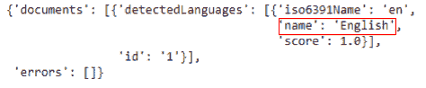

# 第十一章：使用 Python 在微软 Azure 上进行深度学习

本章将结束我们的云 API 探索之旅。到目前为止，我们已经轻松地了解了 API 的精彩世界，特别是那些让我们轻松进行深度学习的 API。我们已经看到了如何使用 REST API 并通过编程方式使用它们。像**谷歌云平台**（**GCP**）和**亚马逊云服务**（**AWS**）一样，微软也提供了自己的云服务平台，称为 Azure。与前几章一样，我们将重点介绍 Azure 提供的基于深度学习的解决方案。我们将稍微调整一下方向，还将介绍微软的**认知工具包**（**CNTK**），它是一个类似于 Keras 的深度学习框架。

本章我们将涵盖以下主题：

+   在 Azure 中设置你的账户

+   快速了解 Azure 提供的深度学习解决方案

+   在 Python 中使用人脸 API

+   在 Python 中使用文本分析 API

+   CNTK 简介

# 技术要求

你可以从[`github.com/PacktPublishing/Hands-On-Python-Deep-Learning-for-Web/tree/master/Chapter8`](https://github.com/PacktPublishing/Hands-On-Python-Deep-Learning-for-Web/tree/master/Chapter8)访问本章的代码。

为了运行本章使用的代码，你需要以下软件：

+   Python 3.6+

+   Python PIL 库

+   Matplotlib 库

所有其他安装步骤，如 CNTK 和 Django，将在本章中进一步介绍。

# 在 Azure 中设置你的账户

根据你之前使用云平台的经验，你可能已经意识到，所有一切都始于在云服务提供商处设置账户和账单。这是一个相当标准的工作流程，Azure 也不例外。因此，让我们前往[`azure.microsoft.com`](https://azure.microsoft.com/)，并按照以下步骤操作：

1.  点击“开始免费试用”按钮，如下所示：


请注意，你需要一个微软账户才能继续进行以下步骤。如果你没有账户，可以在[`account.microsoft.com/account`](https://account.microsoft.com/account)创建一个。

1.  你将被重定向到另一个页面，页面中会再次显示一个“开始免费试用”按钮。点击它。


1.  你将被要求登录微软账户才能继续。根据提示输入账户信息，应该能看到如下截图的页面：


如果你是首次使用，你将获得价值 200 美元的信用额度（根据你的货币不同），可以免费使用 30 天，探索 Azure 提供的不同服务。

1.  填写你的详细信息，包括通过银行卡验证身份。

你可能需要支付一笔非常小的费用。务必查看 Azure 免费套餐的条款和条件，详情请见 [`azure.microsoft.com/en-in/offers/ms-azr-0003p/`](https://azure.microsoft.com/en-in/offers/ms-azr-0003p/)。

一旦这个过程完成，你就已经设置好了，可以进入你的 Azure 门户 ([`portal.azure.com`](https://portal.azure.com/#home))，它的功能与前几章中提到的 GCP 和 AWS 控制台类似。

Azure 门户界面如下所示：


现在你已经设置好了 Azure 账户，让我们在下一节中探索 Azure 基于深度学习的服务。

# 对 Azure 提供的深度学习服务的逐步讲解

Azure 的深度学习（以及一般的机器学习）服务大致分为三大部分：

+   **Azure 机器学习服务** ([`azure.microsoft.com/en-in/services/machine-learning-service/`](https://azure.microsoft.com/en-in/services/machine-learning-service/))，提供完整的机器学习生命周期，包括模型构建、训练和部署：


+   **机器学习 API** ([`gallery.azure.ai/machineLearningAPIs`](https://gallery.azure.ai/machineLearningAPIs))，提供广泛的学习任务 API，例如内容审核、翻译、异常检测等：


+   **Azure AI** ([`azure.microsoft.com/en-in/overview/ai-platform/`](https://azure.microsoft.com/en-in/overview/ai-platform/))，专注于**知识挖掘**、**决策挖掘**以及计算机视觉和语言建模领域的其他许多类似机器学习能力：


接下来，我们将分别研究两个 API，一个用于计算机视觉任务，一个用于自然语言理解任务。我们还将学习如何从 Python 中使用这些 API。让我们深入了解。

# 使用 Face API 和 Python 进行物体检测

物体检测是计算机视觉的经典应用，广泛应用于许多现实世界问题中，如视频监控系统。在本节中，我们将使用 Face API 从给定图像中检测面孔。这在设计视频监控系统时有直接应用。你可以通过 [`azure.microsoft.com/en-us/services/cognitive-services/face/`](https://azure.microsoft.com/en-us/services/cognitive-services/face/) 了解更多关于 Face API 的信息。

# 初始设置

Azure 还允许你在 7 天内免费试用该 API。但是，由于你已经拥有 Azure 账户（假设你有免费的信用额度），我们可以采用另一种方式，如下所示：

1.  登录你的 Azure 账户。

1.  访问 [`azure.microsoft.com/en-us/services/cognitive-services/face/`](https://azure.microsoft.com/en-us/services/cognitive-services/face/)。

1.  点击“已经在使用 Azure？现在免费试用此服务”。

现在您应该看到如下截图的窗口：


1.  填写相关信息并点击“创建”完成。您将看到一个弹出窗口，显示“正在提交部署”。

部署完成后，您应该看到如下截图的页面：


1.  点击“前往资源”，您将被重定向到资源页面，其中包含许多详细信息：


只需稍微向下滚动，您就可以看到 Face API 的端点。请注意，它会根据您在创建部署时输入的配置细节而有所不同。该端点看起来像这样：[`eastus.api.cognitive.microsoft.com/face/v1.0`](https://eastus.api.cognitive.microsoft.com/face/v1.0)。请记下它。

现在，为了能够通过编程使用 Face API，您需要创建相应的 API 密钥。在同一页面的顶部，有一个部分写着**获取您的密钥**：


1.  在该部分下，点击“密钥”，您将看到类似如下截图的内容：


现在您已经拥有了 Face API 的 API 密钥，准备好使用它了。

# 从 Python 代码中调用 Face API

当您的程序包含诸如 API 密钥之类的安全凭证时，通常的最佳做法是将这些密钥定义为环境变量，并在程序中调用它们。因此，创建一个环境变量来存储 Face API 的一个 API 密钥。

要将环境变量添加到计算机中，可以参考这篇文章：[`www.twilio.com/blog/2017/01/how-to-set-environment-variables.html`](https://www.twilio.com/blog/2017/01/how-to-set-environment-variables.html)。

就我而言，我将环境变量命名为 `face_api_key`。您可以上传任何包含面孔的图像。对于这个示例，我将使用此图像：


创建一个新的 Jupyter Notebook 并按照以下步骤操作：

1.  现在，使用 Python 加载环境变量，如下所示：

```py
import os
face_api_key = os.environ['face_api_key']
```

1.  现在，将您的 Face API 端点（用于物体检测）分配给一个变量。

1.  同时，将您想要测试的图像上传到一个在线文件服务器，如 Imgur，并获取允许从 Imgur 提取原始图像的 URL。

就我而言，我已将图像上传到 GitHub 仓库，并使用相应的 URL：

```py
face_api_url = 'https://eastus.api.cognitive.microsoft.com/face/v1.0/detect'

image_url= 'https://raw.githubusercontent.com/PacktPublishing/Hands-On-Python-Deep-Learning-for-Web/master/Chapter8/sample_image.jpg'
```

请注意，在前面的 API 中，URL 末尾的端点名称会发生变化。在大多数情况下，端点名称前面的部分在您使用认知服务时会保持不变，除非 Azure 平台本身要求进行更改。

1.  现在，导入 `requests` 模块，并按如下所示设置 API 负载：

```py
import requests
params = {
'returnFaceId': 'true',
'returnFaceLandmarks': 'false',
'returnFaceAttributes': 'age,gender',
}
```

1.  现在，我们已经准备好向 Face API 发出请求。

以下代码行将为您执行此操作：

```py
# Define the header param
headers = { 'Ocp-Apim-Subscription-Key': face_api_key }
# Define the body params
params = {
'returnFaceId': 'true',
'returnFaceLandmarks': 'false',
'returnFaceAttributes': 'age,gender',
}
```

1.  我们现在可以显示从 API 接收到的响应：

```py
# Make the call to the API
response = requests.post(face_api_url, params=params, headers=headers, json={"url": image_url})
# Get the response and log
faces = response.json()
print('There are {} faces im the given image'.format(str(len(faces))))
```

在这种情况下，返回的代码如下：

```py
There are 2 faces in the given image
```

请注意 `returnFaceAttributes` 这个请求体参数，它让你可以指定面部的多个属性，Face API 将根据这些属性分析给定的人脸。欲了解更多关于这些属性的信息，请查看文档：[`bit.ly/2J3j6nM`](http://bit.ly/2J3j6nM)。

让我们以一种可展示的方式将从 API 获得的响应嵌入图像中。我们将显示检测到的人脸的可能性别和可能年龄。我们将使用 `matplotlib`、`PIL` 和 `io` 库，并将在 Jupyter notebook 中进行以下代码段的工作。我们将首先导入这些库：

```py
%matplotlib inline #Only for Jupyter Notebook
import matplotlib.pyplot as plt
from PIL import Image
from matplotlib import patches
from io import BytesIO
```

要在图像上显示 API 返回的叠加信息，我们使用以下方法：

1.  存储 API 响应：

```py
response = requests.get(image_url)
```

1.  从响应内容创建图像：

```py
image = Image.open(BytesIO(response.content))
```

1.  创建一个空白的图形：

```py
plt.figure(figsize=(8,8))
```

1.  显示使用响应创建的图像：

```py
ax = plt.imshow(image, alpha=0.6)
```

1.  遍历前面部分指定的人脸并提取必要的信息：

```py
for face in faces:
 # Extract the information
 fr = face["faceRectangle"]

 fa = face["faceAttributes"]
 origin = (fr["left"], fr["top"])
 p = patches.Rectangle(origin, fr["width"], fr["height"], fill=False, 
 linewidth=2, color='b')
 ax.axes.add_patch(p)
 plt.text(origin[0], origin[1], "%s, %d"%(fa["gender"].capitalize(), fa["age"]), 
 fontsize=20, weight="bold", va="bottom")
# Turn off the axis
_ = plt.axis("off") 
plt.show()
```

你应该有一张这样的图片：


鼓励你尝试 API 提供的不同参数。接下来，我们将研究 **自然语言理解**（**NLU**）API。

# 使用文本分析 API 和 Python 提取文本信息

无论是有意还是无意，我们都一定遇到过一些令人惊叹的自然语言处理应用案例。无论是自动更正、下一个单词的建议，还是语言翻译，这些应用案例都非常重要，不容忽视。在本节中，我们将使用文本分析 API（[`azure.microsoft.com/en-us/services/cognitive-services/text-analytics/`](https://azure.microsoft.com/en-us/services/cognitive-services/text-analytics/)）从给定的文本中提取有意义的信息。

你可以通过之前提到的链接免费试用 API，看看它的强大功能。在以下示例中，我输入了短语 `I want to attend NeurIPS someday and present a paper there`，Text Analytics API 从中提取了四个有意义的信息：


观察 API 如何优雅地提取出短语中的所有关键信息。

现在我们将看到如何使用 Python 进行编程操作。设置步骤与之前完全相同。只需访问 [`portal.azure.com/#create/Microsoft.CognitiveServicesTextAnalytics`](https://portal.azure.com/#create/Microsoft.CognitiveServicesTextAnalytics)，并按照那里的步骤操作。一旦获得了用于访问 Text Analytics API 的 API 密钥，就可以进入下一个子部分。别忘了记下相应的端点。该端点应以 [`eastus.api.cognitive.microsoft.com/text/analytics/v2.0`](https://eastus.api.cognitive.microsoft.com/text/analytics/v2.0) 开头。这个 URL 单独使用时无法正常工作，它需要一个后缀指向需要调用的方法。

# 从 Python 代码中使用 Text Analytics API

本节将展示如何在您自己的 Python 代码中使用 Text Analytics API。以下是使用它的步骤：

1.  我们将通过导入所需的库来开始本节内容：

```py
import requests
import os
from pprint import pprint
```

1.  然后，我们将从环境变量中加载 Text Analytics API 的 API 密钥：

```py
api_key = os.environ['text_api_key']
```

1.  现在，我们指定一些 URL 来存储 API 端点：

```py
text_analytics_base_url = \
'https://eastus.api.cognitive.microsoft.com/text/analytics/v2.0'
language_api_url = text_analytics_base_url + "/languages"
sentiment_api_url = text_analytics_base_url + "/sentiment"
key_phrase_api_url = text_analytics_base_url + "/keyPhrases"
```

1.  现在，我们通过提供 API 密钥来定义 `headers` 参数：

```py
headers = {"Ocp-Apim-Subscription-Key": api_key}
```

1.  我们还将定义 body 参数。在我的示例中，我将保持与之前在基于 GUI 的演示中展示的相同的短语：

```py
documents = { 'documents': [
{ 'id': '1', 'text': 'I want to attend NeurIPS someday and present a paper there.' }
]}
```

1.  我们现在可以调用 Text Analytics 的相应 API。首先让我们开始检测语言：

```py
response = requests.post(language_api_url, headers=headers, json=documents)
language = response.json()
pprint(language)
```

我们根据此得到相应的响应，如下所示：



请注意，我已经突出显示了语言部分。现在，让我们继续进行情感分析：

```py
response = requests.post(sentiment_api_url, headers=headers, json=documents)
sentiment = response.json()
pprint(sentiment)
```

显示的情感如下所示：


请注意，这里使用的短语既不包含正面情感也不包含负面情感，因此得出了这样的评分。现在我们将从给定的文本中提取关键短语：

```py
response = requests.post(key_phrase_api_url, headers=headers, json=documents)
phrases = response.json()
print(phrases)
```

关键短语如下所示：


注意到端点根据任务的不同发生了变化。您可以在 [`bit.ly/2JjLRfi`](http://bit.ly/2JjLRfi) 了解更多关于我们在前面示例中使用的端点参数。

# CNTK 简介

CNTK 是 Microsoft 提供的一个框架。该框架是 ONNX 格式计划的一部分，允许在不同的神经网络工具包框架之间轻松转换模型。该框架负责微软软件和平台上深度学习生产工作负载的很大一部分。该框架于 2016 年推出，并且是 TensorFlow、PyTorch 等流行框架的竞争者。该框架完全开源，您可以在 [`github.com/microsoft/CNTK`](http://github.com/microsoft/CNTK) 上找到它。

CNTK 驱动了企业服务，如 Cortana 和 Bing，以及广告服务，如 Skype 翻译、Microsoft Cognitive Services 等。已证明它在多个应用中比 TensorFlow 和 PyTorch 等竞争者运行得更快。

在本节中，我们将学习一些 CNTK 的基础知识，然后继续创建一个 Django 应用程序，将基于 CNTK 的模型迁移到网页上。

# 开始使用 CNTK

由于 CNTK 的语法简单，并且能够无需像 TensorFlow 中的会话（session）概念就能工作，因此它是最容易入门的框架之一。大多数学习者对 TensorFlow 中的会话概念感到困惑。让我们看看如何在本地机器或 Google Colaboratory 上设置 CNTK。

# 在本地机器上安装

CNTK 框架支持 64 位和 32 位架构的机器。然而，目前它仅支持 Python 版本最高到 3.6。您可以在 [`pypi.org/project/cntk/`](https://pypi.org/project/cntk/) 验证最新的支持版本。此外，CNTK 目前不提供 macOS 的已编译二进制版本。

要安装该框架，您可以使用 `pip` 包管理器，或者通过 Anaconda 使用已编译的二进制文件进行安装。假设已设置 Python 环境，您可以使用以下命令在 Windows 和 Linux 上安装 CNTK：

+   如果没有 Anaconda，请使用以下命令安装 CPU 版本：

```py
# For CPU version
pip install cntk
```

+   使用以下命令安装 GPU 支持版本：

```py
# For the GPU enabled version
pip install cntk-gpu
```

+   在启用 Anaconda 的机器上，可以使用 `pip` 和以下命令安装 CNTK 框架：

```py
pip install <url>
```

`<url>` 可从 CNTK 网站 [`tiny.cc/cntk`](http://tiny.cc/cntk) 获取。

该命令将类似于以下内容：

```py
pip install https://cntk.ai/PythonWheel/CPU-Only/cntk-2.6-cp35-cp35m-win_amd64.whl
```

我们现在可以开始在 Google Colaboratory 上进行安装了。

# 在 Google Colaboratory 上安装

CNTK 框架在 Google Colaboratory 平台上默认不可用，因此必须与其他必要的模块一起安装。要在 Google Colaboratory 运行时安装 CNTK，请在脚本顶部使用以下命令：

```py
!apt-get install --no-install-recommends openmpi-bin libopenmpi-dev libopencv-dev python3-opencv python-opencv && ln -sf /usr/lib/x86_64-linux-gnu/libmpi_cxx.so /usr/lib/x86_64-linux-gnu/libmpi_cxx.so.1 && ln -sf /usr/lib/x86_64-linux-gnu/openmpi/lib/libmpi.so /usr/lib/x86_64-linux-gnu/openmpi/lib/libmpi.so.12 && ln -sf /usr/lib/x86_64-linux-gnu/libmpi.so /usr/lib/x86_64-linux-gnu/libmpi.so.12 && pip install cntk
```

请注意，前面的命令是单行命令。如果将其拆分成多行，您应该确保对命令进行必要的修改。

一旦前面的步骤成功执行，在该运行时中您将不再需要使用此命令。因此，未来运行程序时，可以注释掉该命令。

通常，通过 `C` 别名将 CNTK 导入 Python 项目。我们使用以下代码将库导入到项目中：

```py
import cntk as C
```

我们可以使用以下命令检查安装的 CNTK 版本：

```py
print(C.__version__)
```

将 CNTK 导入项目后，我们可以继续进行创建深度学习模型的前期要求。

# 创建一个 CNTK 神经网络模型

在本节中，我们将完成创建预测神经网络之前所需的步骤，然后我们将创建神经网络本身：

1.  我们首先将必要的模块导入到项目中：

```py
import matplotlib.pyplot as plt
%matplotlib inline

import numpy as np
from sklearn.datasets import fetch_openml
import random

import cntk.tests.test_utils
from sklearn.preprocessing import OneHotEncoder

import cntk as C # if you have not done this before in the project
```

`sklearn` 模块的 `fetch_openml()` 方法帮助我们直接下载本示例中使用的数据集——MNIST 手写数字数据集。`OneHotEncoder` 方法用于标签的独热编码。

1.  接下来，设置程序执行期间需要的几个常量：

```py
num_samples = 60000
batch_size = 64
learning_rate = 0.1
```

我们将在 60,000 个样本上进行训练，初始学习率为`0.1`。在训练过程中，这个学习率可以动态更新。

1.  我们接下来需要创建一个生成随机小批量数据的训练方法：

```py
class Batch_Reader(object):
    def __init__(self, data , label):
        self.data = data
        self.label = label
        self.num_sample = data.shape[0]

    def next_batch(self, batch_size):
        index = random.sample(range(self.num_sample), batch_size)
        return self.data[index,:].astype(float),self.label[index,:].astype(float)
```

每次调用前述方法时，会生成与先前步骤中设置的大小相等的批量数据——例如，每个批次包含 64 个样本。这些样本会从数据集中随机抽取。

1.  现在需要获取数据集；为此，我们使用以下代码行：

```py
mnist = fetch_openml('mnist_784')
```

数据获取完成后，可以将其分为训练集和测试集，如下所示：

```py
train_data = mnist.data[:num_samples,:]
train_label = mnist.target[:num_samples]
test_data = mnist.data[num_samples:,:]
test_label = mnist.target[num_samples:]
```

1.  数据集中的标签在输入训练模型之前需要进行 one-hot 编码。为此，我们使用以下代码：

```py
enc = OneHotEncoder()
enc.fit(train_label[:,None])
train_encoded = enc.transform(train_label[:,None]).toarray()
```

1.  现在我们可以为训练批量生成器创建一个生成器对象，如下所示：

```py
train_reader = Batch_Reader(train_data, train_encoded)
```

1.  让我们快速地对`test`数据集执行上述步骤：

```py
enc = OneHotEncoder()
enc.fit(test_label[:,None])
test_encoded = enc.transform(test_label[:,None]).toarray()

test_reader = Batch_Reader(test_data, test_encoded)
```

1.  现在，让我们创建一个 CNTK 神经网络模型。我们首先定义一些常量：

```py
dimensions = 784
classes = 10
hidden_layers = 3
hidden_layers_neurons = 400
```

我们将输入数据的维度定义为`784`。回想一下我们在第三章《创建你的第一个深度学习 Web 应用》中使用的 MNIST 数据集。MNIST 数据集中的图像以单维数组格式存储，包含 28 x 28 个值，范围从`0`到`255`。这些图像属于 10 个不同的类别，对应阿拉伯数字系统中的每个数字。我们保留了 3 个隐藏层，每个隐藏层有 400 个神经元。

1.  然后我们创建两个 CNTK 的`input`变量，用于在创建模型时使用。这是 CNTK 中最重要的概念之一。

```py
input = C.input_variable(dimensions)
label = C.input_variable(classes)
```

在 CNTK 中，`input`变量本质上是一个占位符，我们在模型训练、评估或测试时用来填充样本。从数据集中获取的输入形状必须与此步骤中声明的`input`变量的维度完全匹配。这里需要特别提到的是，很多人将输入的维度与数据集的特征数混淆。一个具有`N`个特征和`M`个样本的数据集，其形状为(`M`, `N`)，因此该数据集的维度仅为`2`：

```py
def create_model(features):
    with C.layers.default_options(init = C.layers.glorot_uniform(), activation = C.ops.relu):
​
            hidden_out = features
​
            for _ in range(hidden_layers):
                hidden_out = C.layers.Dense(hidden_layers_neurons)(hidden_out)
​
            network_output = C.layers.Dense(classes, activation = None)(hidden_out)
            return network_output
```

1.  我们创建了`create_model()`方法，它以特征作为输入参数。

首先，为模型设置默认值，使用均匀分布来初始化权重和其他值。默认的激活函数设置为`ReLU`。

第一层包含特征本身，最终层包含一个维度等于类别数的向量。中间的所有层包含一个完全连接的网络，拥有 3 个隐藏层，每个隐藏层有 400 个神经元，并使用 ReLU 激活：

```py
model = create_model(input/255.0)
```

最后，我们使用前面的函数创建模型。通过`255`进行除法运算，实现数据集的归一化，将图像数组中的值限制在`0`和`1`之间。

# 训练 CNTK 模型

模型创建完成后，我们现在可以进行模型训练并让其学习预测。为此，我们需要使用 CNTK 模型对象，并将数据集中的样本拟合到它。与此同时，我们还需要记录 `loss` 和其他评估指标。我们需要执行以下步骤来训练模型：

1.  创建 `loss` 和分类误差的占位符：

```py
loss = C.cross_entropy_with_softmax(model, label)
label_error = C.classification_error(model, label)
```

1.  现在，我们可以为 CNTK 框架设置一个 `trainer` 对象，用于执行实际的训练：

```py
lrs = C.learning_rate_schedule(learning_rate, C.UnitType.minibatch)
learner = C.sgd(model.parameters, lrs)
trainer = C.Trainer(model, (loss, label_error), [learner])
```

1.  现在，让我们进行训练：

```py
epochs = 10
num_iters = (num_samples * epochs) / batch_size

for i in range(int(num_iters)):

    batch_data, batch_label = train_reader.next_batch(batch_size=batch_size)

    arguments = {input: batch_data, label: batch_label}
    trainer.train_minibatch(arguments=arguments)

    if i % 1000 == 0:
        training_loss = False
        evalaluation_error = False
        training_loss = trainer.previous_minibatch_loss_average
        evalaluation_error = trainer.previous_minibatch_evaluation_average
        print("{0}: , Loss: {1:.3f}, Error: {2:.2f}%".format(i, training_loss, evalaluation_error * 100))
```

我们将训练的 epoch 数设置为 `10`，以便进行快速训练和评估。你可以将其设置为更高的值以提高训练的准确性；然而，这可能在某些情况下导致没有更好的训练效果或过拟合。在每次达到 1,000 次迭代时，我们都会显示到目前为止的损失和评估误差。这些值的整体趋势应该是下降的。

# 测试并保存 CNTK 模型

在继续使用 Django 框架将此项目转换为 Web 应用程序之前，让我们快速测试一下模型在此训练中的准确性。我们将执行以下操作，从模型中进行预测：

```py
predicted_label_probs = model.eval({input: test_data})
```

这将为数据集中的每个标签创建一个 NumPy 概率数组。必须将其转换为索引并与测试数据的标签进行比较。我们按如下方式进行操作：

```py
predictions = np.argmax(predicted_label_probs, axis=1)
actual = np.argmax(test_encoded, axis=1)
correct = np.sum(predictions == actual)
print(correct / len(actual))
```

我们发现预测准确率约为 98%。这是一个非常好的值，我们将继续保存模型并通过 Django 使用它。保存 CNTK 模型的方法如下：

```py
model.save("cntk.model")
```

成功保存模型后，如果你使用了 Colaboratory 来构建模型，你需要将 `model` 文件下载到本地系统。接下来，我们可以继续将模型部署到基于 Django 的服务器上。

# Django Web 开发简介

Django 是使用 Python 进行 Web 开发的最流行框架之一。该框架轻量、健壮，并且得到社区的积极维护，社区会迅速修补安全漏洞并添加新特性。本书中我们介绍了 Flask 框架，它本质上是一个用于 Python Web 开发的简单框架。然而，Django 提供了许多内建功能，实施了最先进的方法和实践。

Django 项目的初始结构如下所示：


这些文件是在使用 `django-admin` 工具创建新 Django 项目时自动生成的。顶级目录 `mysite` 表示 Django 项目的名称。每个 Django 项目包含多个应用程序。应用程序类似于软件开发中的模块概念。它们通常是完整项目中的独立部分，并通过项目目录中的 `mysite` 主应用程序组合在一起。每个项目内部可以有多个应用程序。

让我们学习如何开始使用 Django 并创建一个新项目！

# 入门 Django

使用 Django 之前的首要步骤是安装它。幸运的是，这个框架可以轻松地作为一个模块从 Python PIP 仓库安装。它也可以在 Conda 仓库中找到。要安装 Django，打开一个新的终端窗口并使用以下命令：

```py
conda install django
```

或者，如果你更喜欢使用 PIP，可以使用以下命令：

```py
pip install django
```

这将把 Django 模块安装到你的 Python 环境中。

要检查是否已成功安装，请在终端中使用以下命令：

```py
python -m django --version
```

这应该会输出一个版本号，例如`- 2.0.8`。如果没有，请检查你的 Django 安装。

# 创建一个新的 Django 项目

Django 提供了一个名为`django-admin`的便捷工具，可以用来生成 Django 项目所需的模板代码。要创建一个名为`cntkdemo`的新项目，请使用以下代码：

```py
django-admin startproject cntkdemo
```

这将创建所有的模板文件和文件夹。但是，我们必须在项目中创建至少一个应用。通过终端将当前工作目录更改为`cntkdemo`文件夹。使用以下命令在此项目中创建一个应用：

```py
python manage.py startapp api
```

因此，我们创建了一个名为`api`的文件夹，其中包含以下文件夹；所有文件都带有自动生成的占位符代码和文档：


现在我们可以继续进行初步 UI 的编码了。

# 设置首页模板

现在，让我们创建一个当访问`/`路由时加载的网页。还记得我们在项目中创建的`api`应用吗？为了简化起见，我们将把首页作为这个应用的一部分。虽然可以在`mysite`应用的`urls.py`文件中创建这个路由，但我们会为`api`应用提供一个独立的路由处理文件。

让我们从设置首页模板的步骤开始：

1.  在`api`文件夹中创建一个文件`urls.py`。这个文件相对于项目目录的完整路径是`mysite/api/urls.py`。在这个文件中，让我们使用以下代码添加`/`路由：

```py
from django.urls import path

from . import views

urlpatterns = [
 path('', views.indexView), # This line handles the '/' route.
]
```

1.  保存此文件。前面的代码本质上为`api`应用添加了一个新路径`/`（注意，这不是项目的路径！）。它导入了`api`应用中的所有视图（`views.py`文件）。请注意，`indexView`仍然不存在。我们将在下一步后创建这个视图。

1.  `api`应用没有链接到主项目应用。我们需要在`mysite/mysite/urls.py`文件中添加以下几行，以便启用`api`应用的路由处理：

```py
from django.contrib import admin
from django.urls import path
from django.urls import include # -- Add this line!

urlpatterns = [
 path('', include('api.urls')), # -- Add this line!
 path('admin/', admin.site.urls),
]
```

第一行导入了一个工具，用于将特定于应用的路由设置包含到项目应用中。我们通过使用`api.urls`字符串，将`urls.py`文件包含到`api`应用中。这会自动将字符串转换为代码行，试图找到并包含正确的文件。

1.  在`api`应用目录中的`views.py`文件中，添加以下几行代码：

```py
from django.http import HttpResponse
from django.template import loader
```

`HttpResponse`方法允许`view`方法返回一个 HTML 响应。`loader`类提供了从磁盘加载 HTML 模板的方法。

1.  现在，我们创建`indexView`方法：

```py
def indexView(request):
 template = loader.get_template('api/index.html')
 context = {}
 return HttpResponse(template.render(context, request))
```

`indexView`方法加载`api/index.html`模板文件，并使用`context`字典中提供的变量以及可用于模板的`request`参数进行渲染。目前，我们传递一个空的上下文，因为我们没有任何值要发送到模板。但如前所述，之前定义的`api/index.html`文件并不存在。

1.  让我们创建一个用于存放模板的文件夹，并将其链接到项目设置中。为此，进入项目的根目录并创建一个名为`templates`的文件夹。我们需要让项目能够识别该文件夹作为模板的目录。为此，我们需要修改`mysite/mysite/settings.py`文件中的`TEMPLATES`设置：

```py
TEMPLATES = [
 {
 'BACKEND': 'django.template.backends.django.DjangoTemplates',
 'DIRS': [os.path.join(BASE_DIR, 'templates')], # -- Add this line!
 'APP_DIRS': True,
 'OPTIONS': {
 'context_processors': [
```

添加前述行后，项目将会在`mysite/templates/`文件夹中查找模板。

1.  创建`index.html`模板文件。

    请注意，我们在第 4 步中提到的模板文件路径存在于`api`目录中。在`templates`目录下创建一个名为`api`的文件夹。在这个文件夹中，创建`index.html`文件，并添加以下代码：

```py

...
        <div class="jumbotron">
            <h3 class="jumbotronHeading">Draw here!</h3>
            ...
        </div>
        <div class="jumbotron">
            <h3>Prediction Results</h3> 
            <p id="result"></p>
        </div>
        <div id="csrf"></div>
    </div>
    <script src='https://cdnjs.cloudflare.com/ajax/libs/jquery/2.1.3/jquery.min.js'></script>
    <script src="img/"></script>
...
```

我们在前面的代码块的末尾包含了一些必需的脚本，其中包括从后端获取 CSRF token 的脚本。

1.  现在，让我们在前面的代码块中，向具有`jumbotron`类的`div`元素中添加一个`canvas`元素，我们将在该元素上绘制数字。我们还将添加一个滑动条，用于选择绘图笔的宽度，如下所示：

```py
        <div class="jumbotron">
            <h3 class="jumbotronHeading">Draw here!</h3>        
            <div class="slidecontainer">
                <input type="range" min="10" max="50" value="15" id="myRange">
                <p>Value: <span id="sliderValue"></span></p>
            </div>
            <div class="canvasDiv">
                <canvas id="canvas" width="350" height="350"></canvas>
                <p style="text-align:center;">
                    <button class="btn btn-success" id="predict-btn" role="button">Predict</button>
                    <button class="btn btn-primary" id="clearButton" role="button">Clear</button>
                </p>
            </div>
        </div>
```

`template`文件还包含了两个静态文件——`style.css` 和 `script.js`。我们将在接下来的部分中创建这些文件。目前我们还没有创建用于将数据发送到服务器并呈现收到的响应的脚本。

1.  现在，我们将开始添加与后端 API 通信所需的 JavaScript 代码。首先，我们创建一个方法来检查是否需要 CSRF token 来与后端通信。这只是一个工具函数，与调用后端 API 无关，因为有时后端 API 会被设计为接受没有 CSRF token 的请求。我们创建这个函数，如下所示：

```py
<script type="text/javascript">
    function csrfSafeMethod(method) {
        return (/^(GET|HEAD|OPTIONS|TRACE)$/.test(method));
    }
```

1.  然后，我们为`Predict`按钮创建一个`click`处理程序。这个处理程序函数首先设置所需的正确头信息以便与后端 API 通信，然后将画布上的绘图转换为数据 URL 字符串：

```py
    $("#predict-btn").click(function() {

        var csrftoken = $('input[name=csrfmiddlewaretoken]').val();

        $.ajaxSetup({
            beforeSend: function(xhr, settings) {
                if (!csrfSafeMethod(settings.type) && !this.crossDomain) {
                    xhr.setRequestHeader("X-CSRFToken", csrftoken);
                }
            }
        });

        $('#predict-btn').prop('disabled', true);

        var canvasObj = document.getElementById("canvas");
        var img = canvasObj.toDataURL();

        // MORE CODE TO BE ADDED BELOW THIS LINE

        // MORE CODE TO BE ADDED ABOVE THIS LINE
    });
    </script>
```

1.  最后，我们将代码添加到`Predict`按钮的`click`处理函数中，以便通过 Ajax 调用后端，将画布中的数据发送出去，如下所示：

```py
$("#predict-btn").click(function() {
...
        // MORE CODE TO BE ADDED BELOW THIS LINE
        $.ajax({
            type: "POST",
            url: "/predict",
            data: img,
            success: function(data) {
                console.log(data);
                var tb = "<table class='table table-hover'><thead><tr><th>Item</th><th>Confidence</th></thead><tbody>";
                var res = JSON.parse(data);
                console.log(res);

                $('#result').empty.append(res.data);
                $('#predict-btn').prop('disabled', false);
            }
        });
        // MORE CODE TO BE ADDED ABOVE THIS LINE
...
});
    </script>
```

1.  在我们创建静态文件之前，我们需要为它们创建一个文件夹并将其链接到项目中。这与我们创建`templates`文件夹的方式类似。首先，在项目目录中创建一个名为`static`的文件夹，路径为`mysite/static/`。然后，修改`mysite/mysite/settings.py`文件中的`STATIC`配置，如下所示：

```py
STATIC_URL = '/static/'

STATICFILES_DIRS = [
 os.path.join(BASE_DIR, "static"), # -- Add this line!
]
```

现在，我们可以像在`index.html`文件中一样，使用模板文件顶部的``指令将静态文件加载到项目模板中。

1.  创建`style.css`和`script.js`文件—由于这些文件与本书的上下文没有直接关系，你可以直接从[`tiny.cc/cntk-demo`](http://tiny.cc/cntk-demo)下载它们。

请注意，如果没有`script.js`文件，项目将无法运行。

我们已经为在`index.html`模板文件中绘制的图像预测创建了设置。然而，`/predict`路由尚未创建。接下来的部分我们将看到如何在 Django 中加载并使用 CNTK 模型。

# 使用 Django 项目中的 CNTK 进行预测

在这一部分中，我们将首先设置所需的路由、视图和 CNTK 模型的导入，以便与 Django 一起使用。然后，我们将从保存的文件中加载 CNTK 模型，并使用它进行预测。

# 设置预测路由和视图

回想一下我们如何在`api`应用中创建`/`路由及其对应的视图：

1.  首先，将以下行添加到`mysite/api/urls.py`中：

```py
urlpatterns = [
 path('', views.indexView),
 path('predict', views.predictView), # -- Add this line!
]
```

这创建了`/predict`路由。然而，视图`predictView`尚未创建。

1.  将以下行添加到`api`应用的`views.py`文件中：

```py
from django.http import JsonResponse

def predictView(request):
 # We will add more code below this line

 # We will add more code above this line
 return JsonResponse({"data": -1})
```

请注意前面代码行中的占位符。我们将在接下来的步骤中在这里添加更多内容。

# 导入必要的模块

现在，让我们加载所有必要的模块，以便按照以下步骤使用 CNTK 模型进行预测：

1.  将以下导入语句添加到`api`应用的`views.py`文件中：

```py
import os
from django.conf import settings
```

1.  我们需要前面的导入语句来从磁盘加载模型：

```py
import cntk as C
from cntk.ops.functions import load_model
```

前面的代码行将 CNTK 模块导入 Django 项目。`load_model`方法将帮助我们加载保存的 CNTK 模型文件。

以下模块用于处理进行预测时使用的图像：

```py
from PIL import Image
import numpy as np
```

以下模块提供了处理 Base64 编码字符串的实用功能，这是`index.html`页面在请求中发送画布数据的格式：

```py
import re
import base64
import random 
import string
```

其他库将在它们在接下来的部分中使用时进行解释。

# 使用 CNTK 模型进行加载和预测

现在，我们将通过以下步骤进一步编辑`predictView`视图：

1.  首先，使用以下代码将 Base64 编码的图像字符串数据读取到变量中：

```py
def predictView(request):
 # We will add more code below this line

 post_data = request.POST.items()
 pd = [p for p in post_data]
 imgData = pd[1][0].replace(" ", "+")
 imgData += "=" * ((4 - len(imgData) % 4) % 4)
```

Base64 解码后的字符串没有适当的填充，并且包含需要转换为`+`的空格。前面代码块中的最后两行对字符串进行了相同的操作。

1.  接下来，我们将把这个 Base64 编码的字符串转换为 PNG 图像，并使用以下代码保存到磁盘：

```py
filename = ''.join([random.choice(string.ascii_letters + string.digits) for n in range(32)])

convertImage(imgData, filename)
```

第一行创建了一个 32 字符长的随机字符串作为文件名。下一行调用了`convertImage`方法，将`base64`字符串存储为提供的文件名。

1.  然而，`convertImage`方法尚未定义。在`predictView`方法外部，按如下方式添加该函数的定义：

```py
def convertImage(imgData, filename):
 imgstr = re.search(r'base64,(.*)', str(imgData)).group(1)
 img = base64.b64decode(imgstr)
 with open(filename+'.png', 'wb') as output:
 output.write(img)
```

该方法会从字符串中去除多余的元数据，然后解码该字符串并将其保存为 PNG 文件。

1.  让我们回到 `predictView` 方法。我们将首先加载保存的 `image` 文件：

```py
image = Image.open(filename+'.png').convert('1')
```

我们还将把图像转换为仅黑白通道。这将图像中的通道数从 3 降至 1。

1.  回想一下，MNIST 数据集中的所有图像的尺寸都是 28 x 28。我们必须将当前图像调整为相同的尺寸。我们通过以下代码来实现：

```py
image.thumbnail((28,28), Image.ANTIALIAS)
```

1.  现在，我们使用以下代码将图像转换为 NumPy 数组：

```py
image_np = np.array(image.getdata()).astype(int)
image_np_expanded = np.expand_dims(image_np, axis = 0)
```

`np.expanded_dims` 是 NumPy 中的一个简单工具，用于为数组添加额外的维度，以便与大多数机器学习库兼容。

1.  加载 CNTK 模型。首先，在项目的根目录创建一个名为 `data` 的文件夹，并将保存的 `model` 文件复制到 `mysite/data/cntk.model` 中。

    我们现在在 `predictView` 方法中加载 CNTK 模型，如下所示：

```py
model = load_model(os.path.join(settings.BASE_DIR, "data/cntk.model"))
```

1.  最后，我们可以预测图像的标签，如下所示：

```py
predicted_label_probs = model.eval({model.arguments[0]: image_np_expanded})
data = np.argmax(predicted_label_probs, axis=1)
```

`eval` 方法的第一个参数期望传入图像的 NumPy 数组，并返回每个输出类别的概率列表。`np.argmax` 方法用于找到具有最高概率的类别的索引。

1.  要返回输出，请修改 `predictView` 方法中的 `return` 部分，如下所示：

```py
 # We will add more code above this line
 return JsonResponse({"data": str(data[0])})
```

图像的预测标签作为包含在 `data` 变量中的数字发送，响应的 JSON 数据会在页面上显示。

# 测试网页应用程序

最后，我们可以测试我们开发的 CNTK + Django 应用程序。为此，打开终端并将其切换到项目的根目录。

使用以下命令启动 Django 服务器：

```py
python manage.py runserver
```

如果端口空闲，服务器会在 [`localhost:8000`](http://localhost:8000) 启动。打开网页浏览器，点击提供的画布上绘制数字并点击预测按钮。你可以在页面底部看到模型的预测结果，如下所示：


请注意，模型在前面的屏幕截图中返回了正确的输出，即 2。因此，我们得出结论，CNTK 模型通过 Django 部署已完成。

# 总结

在这一章，我们介绍了 Microsoft AI 和 Azure 云服务在网站上执行深度学习的相关功能。我们看到了如何使用面部 API 来预测图像中人物的性别和年龄，以及如何使用文本分析 API 来预测给定文本的语言、关键短语或任何句子的情感。最后，我们使用 CNTK 在 MNIST 数据集上创建了一个深度学习模型。我们展示了如何保存模型，并通过基于 Django 的 Web 应用程序将其作为 API 部署。通过 Django 部署保存的模型可以轻松适配其他深度学习框架，如 TensorFlow 或 PyTorch。

在下一章，我们将讨论一个通用框架，用于使用 Python 构建生产级深度学习应用程序。
