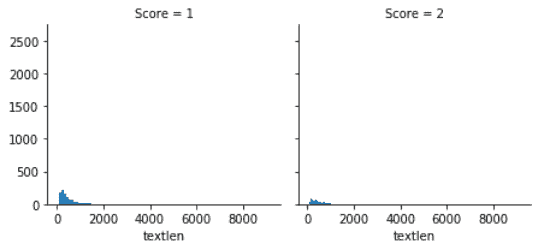
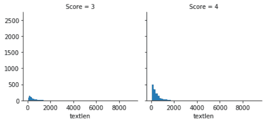
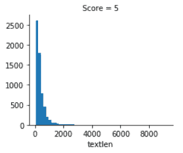
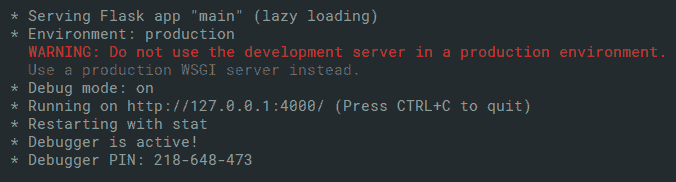
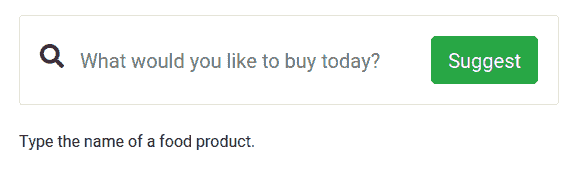
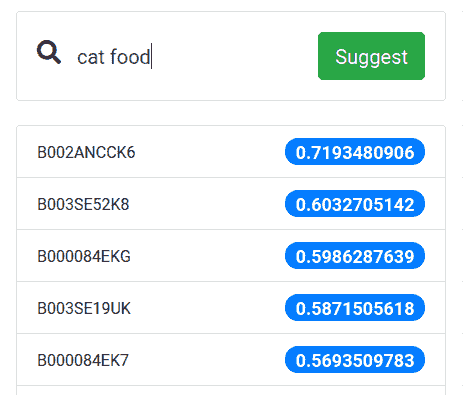

# 第十三章：深度学习驱动网站的一般生产框架

我们已经在前几章中覆盖了如何在我们的应用程序中使用行业级的云**深度学习**（**DL**）API，并通过实际示例学习了它们的使用。在这一章中，我们将涵盖开发深度学习驱动网站的总体框架。这将需要我们将迄今为止学到的所有内容结合起来，以便在实际案例中加以应用。在这一章中，我们将学习如何通过首先准备数据集来构建生产环境中的深度学习 Web 应用程序。接着我们将在 Python 中训练一个深度学习模型，然后使用 Flask 将深度学习模型包装成 API。

以下是本章的高层次总结：

+   定义我们的项目问题陈述

+   将问题分解为多个组件

+   构建一个心理模型来绑定项目组件

+   我们应该如何收集数据

+   遵循项目的目录结构

+   从零开始构建项目

# 技术要求

你可以在 [`github.com/PacktPublishing/Hands-On-Python-Deep-Learning-for-Web/tree/master/Chapter9`](https://github.com/PacktPublishing/Hands-On-Python-Deep-Learning-for-Web/tree/master/Chapter9) 访问本章使用的代码。

要运行本章使用的代码，你需要以下软件：

+   Python 3.6+

+   Python PIL 库

+   NumPy

+   Pandas

+   **自然语言工具包**（**NLTK**）

+   Flask 1.1.0+ 及以下兼容版本：

    +   FlaskForm

    +   wtforms

    +   flask_restful

    +   flask_jsonpify

所有其他安装将在本章中介绍。

# 定义问题陈述

任何项目都应该从明确的问题陈述开始，否则项目开发注定会受到影响。问题陈述主导着项目开发管道中的所有主要步骤，从项目规划到项目成本。

在基于深度学习的 Web 项目中，问题陈述会引导我们如下：

+   确定我们需要什么样的数据。

+   在代码、规划和其他资源方面会有多少复杂性。

+   我们将开发什么样的用户界面。

+   人类的参与程度有多少，以便我们可以准备关于项目的人工资源等的估算。

因此，为了开始进一步的项目开发，确实需要一个明确的问题陈述。

想象一下，你是一个深度学习工程师，所在的公司计划建立一个推荐系统，根据用户提供的某些标准从产品列表中推荐产品。你的老板要求你基于此开发一个**概念验证**（**PoC**）。那么，我们该如何开始呢？如前所述，我们先从定义问题陈述开始。

向最终推荐系统提供输入的主要实体是用户。基于用户的偏好（我们暂时称这些输入特征为偏好），系统将提供一份最匹配他们偏好的产品清单。所以，简而言之，问题陈述可以写成如下：

*给定一组输入特征（用户偏好），我们的任务是推荐一份产品清单。*

既然我们已经有了明确的问题陈述，可以继续前进，接下来我们将建立下一步的计划。

# 构建项目的思维模型

看着问题陈述，你可能会忍不住打开浏览器，开始寻找一些数据集。但是，正确地开发一个项目需要明确的规划，将其一步步地结构化。一个没有结构的项目不过是无舵的船。因此，我们从一开始就要对此保持谨慎。我们将讨论在我们的项目中扮演至关重要角色的模块。这还包括一些思维上的考虑。我喜欢将这一阶段称为构建项目的思维模型。

让我们花些时间进一步讨论问题陈述，以便弄清楚我们需要开发的核心模块。

我们的项目涉及根据用户的偏好向其推荐产品。因此，为了进行推荐，我们需要一个系统，能够理解用户提供的偏好集。为了理解这些偏好，系统需要进行某种类型的训练，我们将在其中实施深度学习（DL）。但是，偏好是什么？它们会是什么样的？你将在现实世界的项目中经常遇到这些问题，通常这些问题需要人类参与其中。

现在，花点时间思考一下，在选择购买产品时你通常会关注哪些方面。让我们列出这些内容：

+   这个产品的规格是什么？如果我想要一件大号 T 恤，就不应该推荐我一件小号 T 恤。

+   这个产品的价格是多少？用户的钱有限，这个推荐对他们的钱包是否合适？

+   这个产品是什么品牌？用户通常会有对几家制造商生产的类似产品的品牌偏好。

请注意，前面的这些要点并没有特定的顺序。

那么，从前一部分开始，我们已经开始有了一个大致的了解，我们需要一个界面（在我们的案例中，本质上是一个网页），让用户提供他们的偏好。根据这些偏好，我们的系统将预测一组它认为最合适的产品。这就是深度学习（DL）部分的作用所在。正如我们从前面的章节回顾到的那样，深度学习模型要在给定问题上发挥作用，需要通过一些能够尽可能贴近问题的数据进行训练。现在，让我们讨论一下系统的数据部分。

我们有一个现成的项目数据集——由亚马逊提供、斯坦福网络分析项目团队创建的亚马逊美食评论数据集。虽然该数据集的大小很大，但在本章创建示例时，我们不会使用完整的数据集。此时可能会产生一个直接的问题，那就是数据集的样子如何？我们需要制定一个大致的计划，以决定以下内容：

+   我们将选择哪些特征来构建数据集

+   我们将从哪里收集数据

在继续讨论之前，我们对原问题陈述做一点增强。以下是原问题陈述：

*给定一组输入特征（用户偏好），我们的任务是建议一份产品清单。*

如果我们的系统推荐低质量产品，用户会不喜欢它。因此，我们将稍微修改问题陈述，如下所示：

*给定一组输入特征（用户偏好），我们的任务是建议一份最佳购买产品的清单。*

为了让我们的系统根据给定标准推荐最佳产品列表，首先需要知道产品的平均评分。除了产品名称之外，关于某个特定产品，以下信息也是有用的：

+   规格

+   产品类别

+   卖家名称

+   平均价格

+   预期交货时间

在准备数据时，我们会查找有关特定产品的前述指示。接下来是一个问题，我们将从哪里收集这些数据？答案是亚马逊！亚马逊以其在电子商务行业的服务而闻名，提供各种产品及其相关信息，如评分、产品规格、商品价格等。但是假设亚马逊不允许你直接下载这些数据作为压缩文件。为了以所需的形式从亚马逊获取数据，我们将不得不使用网页抓取技术。

到目前为止，在讨论中，我们已经确定了项目的两个大致方向：

+   一个接收用户偏好的接口

+   代表我们所处理问题的相关数据

对于深度学习建模，我们将从简单的全连接神经网络架构开始。通常从一个简单的模型开始并逐步增加复杂度是很有用的，因为这样可以使代码库更容易调试。

所以，从这一点来看，我们可以比较确定地说，以下三个模块将在本项目中发挥重要作用：

+   一个接口

+   数据

+   一个深度学习模型

希望到目前为止，你已经对如何着手开发项目有了一个大致的了解。你此时应该提出哪些问题，以及你可能需要考虑的事项，可以从你现在掌握的框架中得出。

我们不希望我们的推荐系统对任何事物产生偏见。数据中可能隐藏着许多类型的偏见，而这些偏见很自然地会导致使用这些数据的深度学习系统继承这些偏见。

若想了解更多关于机器学习系统中不同类型的偏见，建议参考这篇文章：[`developers.google.com/machine-learning/crash-course/fairness/types-of-bias`](https://developers.google.com/machine-learning/crash-course/fairness/types-of-bias)。在我们的例子中，一个惊人的偏见实例是，男性访客得到的产品推荐仅仅基于其性别，而不是根据任何其他访客浏览模式。这可能是错误的，也可能是无意中产生的，但类似情况会使我们的模型变得非常不合适。在接下来的部分，我们将讨论如何避免数据偏见的一些方法。

# 避免在一开始就获取错误数据的机会

什么是错误数据？我们是不是只在谈论那些有错误值的数据？答案是否定的。除了数据有错误值或缺失值外，错误数据还可能包含一些微妙但严重的错误，这些错误可能导致模型训练效果差，甚至产生偏见。因此，识别这些错误数据并在训练模型之前将其去除是非常重要的。识别这些错误的主要方法有五种：

+   查找缺失值。

+   查找那些看起来不合常理或不可能的值——换句话说，异常值。

+   不要在数据集中包括可能导致数据泄露的任何特征。

+   确保数据集中所有类别的评估样本数量大致相同。

+   确保你解决问题的设计本身不会引入偏见。

一旦我们明确了这些要点，就可以进入数据收集过程中需要特别注意的更具体领域。在数据收集过程中，制定一个适当的计划，牢记数据源的所有特性和问题要求是非常重要的。

假设你在爬取亚马逊美国站的产品数据时，错误地访问了亚马逊印度站。此时，爬虫可能会提供来自印度站的数据，这些数据可能不适合向美国居民推荐。

此外，由于亚马逊及类似的服务（如 Flipkart）借助推荐系统来为客户推荐*最合适*的产品，因此在数据收集过程中，爬虫不应受这些推荐的影响。爬虫应定期清除其上下文，以避免由于亚马逊实施的 AI 系统而产生偏见的结果。

让我们以亚马逊美食评论数据集为例。尽管从表面上看，这个数据集似乎非常平衡，但我们可以揭示出其中的很多偏差。考虑一下顾客为产品撰写评论时的文字长度。让我们将评论的长度与评分绘制成图表。以下图表展示了 1 星和 2 星评分的产品分布：



以下图表展示了 3 星和 4 星评分的产品分布：



以下图表展示了 5 星评分的产品分布：



注意到更多的正面评价中包含更多的文字。这会直接导致数据集中的大多数词汇，都与较高的评分相关联。现在，设想一个场景，其中用户写了一个冗长的负面评论，给出了较低的评分。由于我们的模型训练时将较长的评论与正面评分相关联，它可能会将这个负面评论误判为正面评价。

关键问题在于，现实世界的数据可能包含许多边缘案例，如图所示，如果这些边缘情况没有得到妥善处理，模型很可能会出错。

# 如何构建一个不理想的 AI 后端

考虑到 Web 应用程序可能发展到的庞大规模，以及几乎所有其他平台都强烈依赖于作为 Web 服务运行的后端，因此，后端的设计和执行至关重要。即使是处于概念验证阶段的基于 AI 的应用程序，通常在响应时也不会非常快速，或者需要大量时间来训练新样本。

虽然我们将讨论一些技巧和窍门，以帮助构建一个不会因瓶颈而在压力下崩溃的后端，但在开发一个集成了 AI 的后端时，我们需要先确定一些在开发过程中应该尽量避免的问题。

# 期望网站的 AI 部分实现实时响应

AI 计算代价高昂，显而易见，这对于一个旨在尽快为客户提供服务的网站来说是不可取的。虽然使用更小的模型或浏览器内的 AI（例如 TensorFlow.js 或其他库）可以提供实时 AI 响应的体验，但它们在客户端处于慢速网络环境或使用低端设备时，依然会遇到问题。因此，无论是浏览器内的 AI 模型还是快速响应的轻量级 AI 模型，都受设备配置和网络带宽的限制。因此，网站的后端应该理想上与处理 AI 模型响应的部分分开，这样它就能快速响应客户端。两者需要并行工作，共享一个数据存储，并保持合适的交互方式，使得负责响应客户端的后端代码不依赖于 AI 模型部分。

# 假设来自网站的数据是理想的

尽管与项目对应的网站或应用可能看起来是理想的数据收集方法，但来自它的数据不能假设没有错误。网络请求失败、恶意连接，或者用户提供的垃圾输入都可能导致数据不适合训练。一个非恶意用户可能会因为网络问题而在短时间内刷新同一页面 10 到 20 次，这不应该增加该页面的查看重要性。所有从网站收集的数据必须根据模型的要求进行清理和过滤。必须牢记，网站面临的挑战几乎肯定会影响收集数据的质量。

# 一个示例的端到端 AI 集成网络应用

现在我们已经讨论了创建 AI 驱动网站后台时的概览和避免的陷阱，让我们开始构建一个——尽管是一个相对简单的——展示解决方案整体概览的系统。

我们将涵盖以下步骤，如前所述：

+   根据问题陈述收集数据

+   数据清理和预处理

+   构建 AI 模型

+   创建界面

+   在界面上使用 AI 模型

虽然我们之前已经讨论了收集数据时的陷阱，但我们在这里简要讨论可以用来完成任务的工具和方法。

# 数据收集与清理

从一般角度来看，收集数据的目的可以有多个数据源。您可以从网站抓取数据，或简单地下载一些准备好的数据集。还可以采用其他方法，例如以下几种：

+   在应用程序/网站的运行时生成数据

+   从应用程序或智能设备进行日志记录

+   通过系统化的表单（例如测验或调查）直接收集用户数据

+   从调查机构收集数据

+   通过特定方法（科学数据）和其他方式测量的观测数据

`beautifulsoup` 是一个常用的网页抓取库。`Scrapy` 是另一个流行的工具，并且可以非常迅速地使用。

数据清理完全取决于您收集的数据形式，这在本书的前几章中已有讨论。我们将假设您能够将数据转换为适合您想要继续进行模型构建部分的格式。在本节的后续主题中，我们将使用一个名为 Amazon Fine Food Reviews 的准备好数据集，您可以从 [`www.kaggle.com/snap/amazon-fine-food-reviews.`](https://www.kaggle.com/snap/amazon-fine-food-reviews) 下载该数据集。解压下载的 ZIP 文件后，您会得到一个名为 `Reviews.csv` 的数据文件。

观察如何进行网页抓取并准备清理数据集的一个良好起点是 [`github.com/Nilabhra/kolkata_nlp_workshop_2019`](https://github.com/Nilabhra/kolkata_nlp_workshop_2019)。

# 构建 AI 模型

现在，我们将准备 AI 模型，该模型将根据用户的查询推荐产品。为此，让我们创建一个新的 Jupyter Notebook。

# 进行必要的导入

我们首先导入所需的 Python 模块到项目中：

```py
import numpy as np
import pandas as pd
import nltk
from nltk.corpus import stopwords 
from nltk.tokenize import WordPunctTokenizer
from sklearn.model_selection import train_test_split
from sklearn.feature_extraction.text import TfidfVectorizer

# Comment below line if you already have stopwords installed
nltk.download('stopwords')
```

我们导入`TfidfVectorizer`，帮助我们创建**词频-逆文档频率**（**TF-IDF**）向量，以进行自然语言处理。TF-IDF 是衡量一个词在单一文档中重要性的数值指标，考虑到一组可能包含或不包含该词的文档。数值上，它增加了当一个词在单一文档中频繁出现而在其他文档中不常出现时的权重。TF-IDF 非常流行，目前全球超过 80%的基于自然语言的推荐系统都在使用它。

我们还导入了`WordPunctTokenizer`。分词器的作用是将文本拆分为基本的词元。例如，一个大段落可以被拆分为句子，进一步拆分为单词。

# 读取数据集并准备清理函数

我们将使用`ISO-8859-1`编码读取 Amazon Fine Food Reviews 数据集。这样做是为了确保我们不会丢失评论文本中使用的任何特殊符号：

```py
df = pd.read_csv('Reviews.csv', encoding = "ISO-8859-1")
df = df.head(10000)
```

由于数据集非常庞大，我们在本章中将工作范围限制为数据集中的前 10,000 行。

我们需要从文本中去除停用词，并过滤掉如括号等不属于自然书面文本的符号。我们将创建一个名为`cleanText()`的函数，执行过滤和去除停用词的操作：

```py
import string
import re

stopwordSet = set(stopwords.words("english"))

def cleanText(line):
    global stopwordSet

    line = line.translate(string.punctuation)
    line = line.lower().split()

    line = [word for word in line if not word in stopwordSet and len(word) >= 3]
    line = " ".join(line)

    return re.sub(r"[^A-Za-z0-9^,!.\/'+-=]", " ", line) 
```

使用前面的函数，我们已经从文本中去除了停用词和任何少于三个字符的词。我们已经过滤掉了标点符号，并且只保留了文本中相关的字符。

# 切片出所需的数据

数据集包含的数据比我们当前演示所需的更多。我们将提取`ProductId`、`UserId`、`Score`和`Text`列，以准备我们的演示。产品名称出于隐私原因进行了加密，就像用户名称也被加密一样：

```py
data = df[['ProductId', 'UserId', 'Score', 'Text']]
```

在数据科学中，保持数据加密并且不包含个人信息是一个挑战。必须从数据集中删除可能使其识别出私密实体的部分。例如，您需要从评论文本中删除人名和组织名，以防止即使已经加密了产品和用户 ID，产品和用户仍然能被识别出来。

# 应用文本清理

我们现在将应用文本过滤和停用词移除函数来清理数据集中的文本：

```py
%%time
data['Text'] = data['Text'].apply(cleanText)
```

显示任务所需的时间。

请注意，前面的代码块仅适用于 Jupyter Notebook，而不能在普通的 Python 脚本中运行。要在普通 Python 脚本中运行，请移除`%%time`命令。

# 将数据集拆分为训练集和测试集

由于我们有一个单一的数据集，我们将其分成两部分，特征和标签部分分开：

```py
X_train, X_valid, y_train, y_valid = train_test_split(data['Text'], df['ProductId'], test_size = 0.2) 
```

我们将使用 `sklearn` 模块中的 `train_test_split()` 方法，将数据集分为 80% 用于训练，20% 用于测试。

# 聚合关于产品和用户的文本

我们现在将按用户和产品 ID 聚合数据集中的评论。我们需要每个产品的评论，以确定该产品适合什么样的用户：

```py
user_df = data[['UserId','Text']]
product_df = data[['ProductId', 'Text']]
user_df = user_df.groupby('UserId').agg({'Text': ' '.join})
product_df = product_df.groupby('ProductId').agg({'Text': ' '.join})
```

类似地，通过用户聚合的评论将帮助我们确定用户喜欢什么。

# 创建用户和产品的 TF-IDF 向量化器

我们现在将创建两个不同的向量化器，一个是用于用户，另一个是用于产品。我们需要这些向量化器来确定用户需求与产品评论之间的相似性。首先，我们将为用户创建向量化器并显示其形状：

```py
user_vectorizer = TfidfVectorizer(tokenizer = WordPunctTokenizer().tokenize, max_features=1000)
user_vectors = user_vectorizer.fit_transform(user_df['Text'])
user_vectors.shape
```

然后，我们将为产品创建向量化器：

```py
product_vectorizer = TfidfVectorizer(tokenizer = WordPunctTokenizer().tokenize, max_features=1000)
product_vectors = product_vectorizer.fit_transform(product_df['Text'])
product_vectors.shape
```

我们使用 `WordPunctTokenizer` 来分解文本，并使用 `TfidfVectorizer` 对象的 `fit_transform` 方法来准备向量，这些向量将单词字典映射到它们在文档中的重要性。

# 按评分创建用户和产品的索引

我们使用 `pandas` 模块的 `pivot_table` 方法，创建用户对产品的评分矩阵。我们将使用这个矩阵进行矩阵分解，以确定用户喜欢的产品：

```py
userRatings = pd.pivot_table(data, values='Score', index=['UserId'], columns=['ProductId'])
userRatings.shape
```

我们还将把用户和产品的 `TfidfVectorizer` 向量转换成适用于矩阵分解的矩阵：

```py
P = pd.DataFrame(user_vectors.toarray(), index=user_df.index, columns=user_vectorizer.get_feature_names())
Q = pd.DataFrame(product_vectors.toarray(), index=product_df.index, columns=product_vectorizer.get_feature_names())
```

我们现在可以创建矩阵分解函数。

# 创建矩阵分解函数

我们现在将创建一个函数来执行矩阵分解。矩阵分解在 2006 年的 Netflix 奖挑战赛中成为推荐系统算法的热门方法。它是一类算法，将用户-项目矩阵分解成两个较低维度的矩阵，这两个矩阵可以相乘以恢复原始的高阶矩阵：

```py
def matrix_factorization(R, P, Q, steps=1, gamma=0.001,lamda=0.02):
    for step in range(steps):
        for i in R.index:
            for j in R.columns:
                if R.loc[i,j]>0:
                    eij=R.loc[i,j]-np.dot(P.loc[i],Q.loc[j])
                    P.loc[i]=P.loc[i]+gamma*(eij*Q.loc[j]-lamda*P.loc[i])
                    Q.loc[j]=Q.loc[j]+gamma*(eij*P.loc[i]-lamda*Q.loc[j])
        e=0
        for i in R.index:
            for j in R.columns:
                if R.loc[i,j]>0:
                    e= e + pow(R.loc[i,j]-np.dot(P.loc[i],Q.loc[j]),2)+lamda*(pow(np.linalg.norm(P.loc[i]),2)+pow(np.linalg.norm(Q.loc[j]),2))
        if e<0.001:
            break

    return P,Q
```

然后，我们执行矩阵分解并记录所花费的时间：

```py
%%time
P, Q = matrix_factorization(userRatings, P, Q, steps=1, gamma=0.001,lamda=0.02)
```

完成后，我们需要保存模型。

# 将模型保存为 pickle 文件

现在，在项目的 `root` 目录下创建一个名为 `api` 的文件夹。然后，保存经过训练的模型，即在用户-产品评分矩阵分解后得到的低阶矩阵：

```py
import pickle
output = open('api/model.pkl', 'wb')
pickle.dump(P,output)
pickle.dump(Q,output)
pickle.dump(user_vectorizer,output)
output.close()
```

将模型保存为二进制的 pickle 文件，使我们可以在模型部署到网站后端时快速将其加载到内存中。

现在我们已经完成了预测模型的开发，我们将继续构建一个应用程序界面来使其能够运行。

# 构建接口

为了构建 Web 应用的接口，我们需要考虑如何让用户与系统交互。在我们的案例中，我们希望用户提交搜索查询时，系统会根据他们搜索的内容在搜索框中即时展示建议。这意味着我们需要系统能够实时响应并即时生成建议。为了构建该系统，我们将创建一个 API 来响应搜索查询。

# 创建一个 API 来回答搜索查询

我们将创建一个接受 HTTP 请求形式查询的 API，并根据用户输入的搜索查询回复产品建议。为此，请遵循以下步骤：

1.  我们将从导入 API 所需的模块开始。我们在前一节中讨论了这些导入的模块：

```py
import numpy as np
import pandas as pd
from nltk.corpus import stopwords
from nltk.tokenize import WordPunctTokenizer
from sklearn.feature_extraction.text import TfidfVectorizer
from sklearn.feature_extraction.text import CountVectorizer
from flask import Flask, request, render_template, make_response
from flask_wtf import FlaskForm
from wtforms import StringField, validators
import io
from flask_restful import Resource, Api
import string
import re
import pickle
from flask_jsonpify import jsonpify
```

1.  我们还将导入`Flask`模块，创建一个快速的 HTTP 服务器，可以在定义的路由上以 API 的形式提供服务。我们将按如下所示实例化`Flask`应用对象：

```py
DEBUG = True
app = Flask(__name__)
app.config['SECRET_KEY'] = 'abcdefgh'
api = Api(app)
```

应用配置中的`SECRET_KEY`值由你自行决定。

1.  然后，我们将创建一个`class`函数来处理我们收到的以搜索查询形式的文本输入：

```py
class TextFieldForm(FlaskForm):
    text = StringField('Document Content', validators=[validators.data_required()])
```

1.  为了封装 API 方法，我们将它们包装在`Flask_Work`类中：

```py
class Flask_Work(Resource):
    def __init__(self):
        self.stopwordSet = set(stopwords.words("english"))
        pass
```

1.  我们在模型创建过程中使用的`cleanText()`方法再次被需要。它将用于清理并过滤用户输入的搜索查询：

```py
    def cleanText(self, line): 
        line = line.translate(string.punctuation)
        line = line.lower().split()

        line = [word for word in line if not word in self.stopwordSet and len(word) >= 3]
        line = " ".join(line)

        return re.sub(r"[^A-Za-z0-9^,!.\/'+-=]", " ", line) 
```

1.  我们为应用程序定义了一个主页，该主页将从稍后在模板中创建的`index.html`文件加载：

```py
    def get(self):
        headers = {'Content-Type': 'text/html'}
        return make_response(render_template('index.html'), 200, headers)
```

1.  我们创建了基于`post`方法的预测路由，在接收到用户的搜索查询后，将返回产品建议：

```py
    def post(self):
        f = open('model.pkl', 'rb')
        P, Q, userid_vectorizer = pickle.load(f), pickle.load(f), pickle.load(f)
        sentence = request.form['search']
        test_data = pd.DataFrame([sentence], columns=['Text'])
        test_data['Text'] = test_data['Text'].apply(self.cleanText)
        test_vectors = userid_vectorizer.transform(test_data['Text'])
        test_v_df = pd.DataFrame(test_vectors.toarray(), index=test_data.index,
                                 columns=userid_vectorizer.get_feature_names())

        predicted_ratings = pd.DataFrame(np.dot(test_v_df.loc[0], Q.T), index=Q.index, columns=['Rating'])
        predictions = pd.DataFrame.sort_values(predicted_ratings, ['Rating'], ascending=[0])[:10]

        JSONP_data = jsonpify(predictions.to_json())
        return JSONP_data
```

1.  我们将`Flask_Work`类附加到`Flask`服务器。这完成了运行时的脚本。我们已经设置了一个 API，根据用户的搜索查询建议产品：

```py
api.add_resource(Flask_Work, '/')

if __name__ == '__main__':
    app.run(host='127.0.0.1', port=4000, debug=True)
```

将此文件保存为`main.py`。创建好 API 脚本后，我们需要托管服务器。

1.  在本地计算机上执行此操作，请在终端中运行以下命令：

```py
python main.py
```

这将在计算机上启动服务器，并绑定到端口`4000`，如所示：



然而，我们仍然需要准备一个用户界面来使用这个 API。我们将在接下来的部分进行。

# 创建用于使用 API 的接口

现在，我们将创建一个简单、简约的 UI 来使用我们创建的 API。实际上，我们将创建一个单一的搜索框，用户在其中输入他们想要的产品或产品规格，API 则根据用户的查询返回推荐。我们不会讨论构建 UI 的代码，但我们已经将其包含在 GitHub 存储库中，可以通过[`tiny.cc/DL4WebCh9`](http://tiny.cc/DL4WebCh9)找到。

一旦启动服务器，该 UI 将在`http://127.0.0.1:4000`上可见，如*创建 API 以回答搜索查询*部分的第 9 步所示。

我们创建的界面如下所示：



用户输入搜索查询并获得推荐，如下所示：



我们的应用程序没有保存用户会话的好处。同样，它没有用户预期预算的参数，这通常是决定产品是否适合用户的重要因素。将这些功能添加到 Web 应用程序并利用它们的好处是很容易的。

# 总结

作为一般概述，利用 DL 强大功能的 Web 应用程序有几种通过 API、浏览器内 JavaScript 或通过在应用程序后端悄悄嵌入 DL 模型的设置方法。在本章中，我们看到如何使用其中最常见的方法——基于 API 的 DL Web 应用程序——同时，我们还大致概述了如何设计类似解决方案。我们涵盖了问题陈述的思考过程以及随后的解决方案，以及在设计集成 DL 模型的 Web 应用程序时要避免的缺陷和痛点。

在下一章中，我们将涵盖一个端到端项目，该项目将 DL 集成到 Web 应用程序中，以用于安全目的。我们将看到 DL 如何帮助我们识别可疑活动并阻止垃圾用户。
