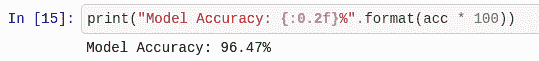

# 第十四章：使用深度学习保障 Web 应用的安全

安全性对任何网站而言都是至关重要的——同样对所有软件也是如此。如今，随着可用计算能力的增加以及技术领域的发展，安全威胁正在不断演变。因此，网站需要采用最好的安全措施来保护数据和用户信息的安全。具有在线商业活动的网站通常面临较高的风险，并且很常见它们会遭遇前所未见的安全攻击。新的攻击特别难以被基于规则的安全系统识别和阻止，因此，你可以考虑使用深度学习驱动的安全系统，这些系统能够有效替代基于规则的系统，并且能够正确识别和阻挡新的威胁。

本章讨论了你可以使用深度学习与 Python 来保障网站安全的几种技巧和技术。我们将介绍 reCAPTCHA 和 Cloudflare，并讨论它们如何用于增强网站的安全性。我们还将向你展示如何通过基于深度学习的技术和 Python 后端实现安全机制，以检测网站上的恶意用户。本章将涵盖以下主题：

+   reCAPTCHA 的故事

+   DIY——在 Django 中检测恶意用户

+   在 Web 应用中使用 Python 的 reCAPTCHA

+   使用 Cloudflare 提升网站安全

本章的讨论将从 reCAPTCHA 的故事开始——这是一个由 Google 创建的巧妙工具，它改变了互联网。

# 技术要求

你可以通过以下链接访问本章的代码：[`github.com/PacktPublishing/Hands-On-Python-Deep-Learning-for-Web/tree/master/Chapter10`](https://github.com/PacktPublishing/Hands-On-Python-Deep-Learning-for-Web/tree/master/Chapter10)。

你需要以下软件来运行本章的代码：

+   Python 3.6+

+   TensorFlow 1.14

+   Keras 兼容 TensorFlow 1.14

+   Django 2.x

# reCAPTCHA 的故事

*对人类友好，对机器人难*——这是 reCAPTCHA 的标语，表达了 reCAPTCHA 的基本理念：它是一个用来判定应用或网站上的用户是否为真实人类用户还是自动脚本的系统。reCAPTCHA 是验证码技术的具体实现，采用扭曲、弯曲的字母和数字图像，挑战用户去解读并将其以简单的文本形式输入。

如果你是 2000 年代初的普通互联网用户，你可能在许多网站上看到过类似于以下的验证码（CAPTCHA）图片：


**验证码（CAPTCHA）**是**完全自动化的公共图灵测试，用以区分计算机和人类**的缩写。

CAPTCHA 系统由雅虎推广，迅速被数百万个网站采纳。然而，尽管这个系统为网站提供了安全性保障，它却耗时且经常被恶意程序员攻破。人们时不时会创建新的 CAPTCHA 系统，设计和视觉元素的组合各不相同。

与此同时，开发者们正在解决另一个完全不同的问题——数字化印刷书籍和其他文本。一个快速的解决方案是扫描书籍；即使用**光学字符识别**（**OCR**）将书籍转换成初步的数字文本形式。对于使用标准字体且扫描质量良好的印刷内容，这些转换效果良好。然而，对于印刷不规范的书籍和手稿，转换的准确性则大打折扣。人们越来越多地将图像上传到在线平台，试图从这些图像中提取文本并用于多种目的，如确定图像中的内容、地点或品牌。

CAPTCHA 的起源存在争议，多个小组声称自己是发明者，但正是在 2003 年，路易斯·冯·安创造了“CAPTCHA”这一术语，并随后成为了 reCAPTCHA 的创始人，该项目后来被谷歌收购。

群体外包的先驱路易斯·冯·安（Luis von Ahn）使用 reCAPTCHA 程序来展示从印刷书籍扫描中裁剪出来的极小文本块。只有人类才能轻松解决这些挑战，而自动化程序会失败。与此同时，这些书籍正通过大量人类用户的贡献被缓慢地数字化，这是一种未知的群体外包活动。reCAPTCHA 对用户而言仍然是一个麻烦，但书籍数字化的问题得以解决。

随着时间的推移，reCAPTCHA 演变为使用基于 AI 的系统来识别真实用户和假用户。在写这本书时，reCAPTCHA 仍在谷歌的积极开发下，目前已经进入第三个版本，它允许在网页的后台进行隐形验证，仅当用户无法成功验证时，才会显示挑战。这为真正的用户节省了大量时间，并对机器构成了挑战。

我们现在将构建一个网站，使用基于深度学习的模型和 reCAPTCHA 提供安全元素。

# 恶意用户检测

网站上的恶意用户是指任何试图执行未授权任务的用户。在当今世界，恶意用户带来的威胁正在呈指数增长，多个全球科技巨头、政府机构和其他私营公司巨大的个人信息数据库被黑客公开曝光。必须建立能够自动缓解这些恶意攻击的系统。

为了识别我们样本网站中的恶意用户，我们创建了一个模型，它能够学习用户的正常行为，并在用户的行为与过去的使用模式发生显著变化时发出警报。

异常检测是机器学习的一个热门分支。它是一组算法，用于检测给定数据集中的数据样本，这些样本与大多数数据样本的属性不一致。比如，在一个狗狗收容所中检测到一只猫就是异常检测。异常检测可以通过多种方式进行：

+   通过使用列的最小最大范围

+   通过在数据的图表中发现突发的异常点

+   当数据在高斯曲线下绘制时，将位于极端位置的点标记为异常（异常点）

支持向量机、k 近邻和贝叶斯网络是一些最常用的异常检测算法。

我们如何定义用户在网站上的正常行为呢？

假设你使用一个网站，通常通过笔记本电脑登录。一般来说，你最多只需要两次尝试就能成功登录该网站。如果有一天你突然开始使用一台新笔记本电脑，那么登录过程就会显得可疑，可能是恶意尝试黑客入侵你的账户。如果新设备的位置是你最近没有去过的地方，或者是你从未去过的地方，那么就更加可疑。如果你尝试登录账户的次数达到 10 次，那么这种行为也会显得异常。没有任何可疑使用状态的情况是用户在网站上的正常行为。

有时，异常可能不是由于某个特定用户的不正常行为引起的。由于服务器的变化，用户的常规流量以及他们的行为可能会发生变化。我们必须小心，避免在这种情况下将所有用户都标记为恶意用户。此外，用户的不正常行为可能是由于其他原因引起的，而不仅仅是黑客攻击他们的账户。如果一个真实的用户突然开始访问他们本不该访问的网站部分，这也是一种异常，需要加以防止。

在我们的示例网站中，我们将集成这样的系统。为此，我们将在网站的登录页面上进行检查，尝试确定用户的登录行为是正常的还是异常的。我们将考虑用户从哪个页面登录，因为一个网站可能有多个登录页面，并且尝试确定该页面是否是用户常用的登录页面。如果用户尝试从一个他们通常不登录的页面登录，我们将把它标记为异常。这只是一个简单的标准，用于检查异常用户，实际上还有数百个其他参数。

# 基于 LSTM 的用户身份验证模型

我们将把这一部分分为两个主要子部分：

1.  构建安全检查模型

1.  将模型托管为 API

让我们从第一部分开始。

# 构建身份验证有效性检查模型

要根据用户的登录活动对其进行身份验证，我们需要一个检查请求的 API。我们可以按以下步骤构建此模型：

1.  让我们从开发身份验证模型开始，该模型确定用户是否未按常规方式操作。我们在运行 Python 3.6+的 Jupyter 笔记本中导入所需的模块，如下所示：

```py
import sys
import os
import json
import pandas
import numpy
from keras.models import Sequential
from keras.layers import LSTM, Dense, Dropout
from keras.layers.embeddings import Embedding
from keras.preprocessing import sequence
from keras.preprocessing.text import Tokenizer
from collections import OrderedDict
```

1.  现在我们可以将数据导入到项目中。我们将使用以下数据集：[`github.com/PacktPublishing/Hands-On-Python-Deep-Learning-for-Web/blob/master/Chapter10/model/data/data-full.csv`](https://github.com/PacktPublishing/Hands-On-Python-Deep-Learning-for-Web/blob/master/Chapter10/model/data/data-full.csv)。如下图所示，我们将数据集加载到项目中：

```py
file = 'data-full.csv'

df = pandas.read_csv(file, quotechar='|', header=None)
df_count = df.groupby([1]).count()
total_req = df_count[0][0] + df_count[0][1]
num_malicious = df_count[0][1]

print("Malicious request logs in dataset: {:0.2f}%".format(float(num_malicious) / total_req * 100))
```

您将看到关于数据的一些一般统计信息，如下所示：


你会发现数据包含文本，如下所示：


这一观察很重要，我们将在后续步骤中参考此屏幕截图。

1.  然而，所有的数据都是字符串格式。我们需要将其转换为适当类型的值。此外，数据集目前仅包含一个 DataFrame；我们将使用以下代码将其拆分为两部分——训练列和标签列：

```py
df_values = df.sample(frac=1).values

X = df_values[:,0]
Y = df_values[:,1]
```

1.  另外，我们需要删除一些列，因为我们只想使用数据集中与我们任务相关的特征：

```py
for index, item in enumerate(X):
    req = json.loads(item, object_pairs_hook=OrderedDict)
    del req['timestamp']
    del req['headers']
    del req['source']
    del req['route']
    del req['responsePayload']
    X[index] = json.dumps(req, separators=(',', ':'))
```

1.  完成后，我们现在准备对请求主体进行标记。标记是一种方法，我们将大段的段落拆分为句子，并将句子拆分为单词。我们可以使用以下代码执行标记化：

```py
tokenizer = Tokenizer(filters='\t\n', char_level=True)
tokenizer.fit_on_texts(X)
```

1.  标记化完成后，我们将每个请求主体条目转换为向量。我们这样做是因为计算机需要对数据进行数值表示才能进行计算。然后，我们进一步将数据集分成两部分——75%的数据集用于训练，其余的用于测试。同样，使用以下代码将标签列拆分：

```py
num_words = len(tokenizer.word_index)+1
X = tokenizer.texts_to_sequences(X)

max_log_length = 1024
split = int(len(df_values) * .75)

X_processed = sequence.pad_sequences(X, maxlen=max_log_length)
X_train, X_test = X_processed[0:split], X_processed[split:len(X_processed)]
Y_train, Y_test = Y[0:split], Y[split:len(Y)]
```

请记住，从第 2 步中可以看出，这些数据主要包含文本。在处理文本数据时，通常会有一个上下文和一个特定的顺序。

例如，考虑这句话中的单词——*萨钦·坦度尔卡尔是一位伟大的板球运动员*。为了传达预期的含义，单词的顺序不能改变。在处理机器学习中的文本数据时，维护顺序和上下文的重要性就体现在这里。

在我们的案例中，我们将使用一种特殊类型的递归神经网络——**长短期记忆网络**（**LSTM**），它将学习识别常规用户行为。

对 LSTM 的详细讨论超出了本书的范围，但如果您感兴趣，可以参考[`bit.ly/2m0RWnx`](http://bit.ly/2m0RWnx)以获取详细信息。

1.  现在，我们添加层和词嵌入，帮助保持数字编码文本与实际单词之间的关系，使用以下代码：

```py
clf = Sequential()
clf.add(Embedding(num_words, 32, input_length=max_log_length))
clf.add(Dropout(0.5))
clf.add(LSTM(64, recurrent_dropout=0.5))
clf.add(Dropout(0.5))
clf.add(Dense(1, activation='sigmoid'))
```

我们的输出是一个单神经元，如果是非异常登录尝试则为 `0`，如果是异常登录尝试则为 `1`。

1.  然后，我们使用以下代码编译模型并打印摘要：

```py
clf.compile(loss='binary_crossentropy', optimizer='adam', metrics=['accuracy'])
print(clf.summary())
```

模型的摘要已生成，如下所示：


现在，我们准备好继续训练模型：

1.  我们使用模型的`fit()`方法，如下所示：

```py
clf.fit(X_train, Y_train, validation_split=0.25, epochs=3, batch_size=128)
```

1.  我们将快速检查模型的准确性。我们可以看到该模型在验证数据上的准确率超过了 96%。考虑到这是我们的第一个模型，这个分数相当令人印象深刻。我们可以使用以下代码检查模型的准确性：

```py
score, acc = clf.evaluate(X_test, Y_test, verbose=1, batch_size=128)
print("Model Accuracy: {:0.2f}%".format(acc * 100))
```

你应该看到如下截图中的输出：



1.  让我们保存这些权重。我们将使用它们创建一个用于认证用户的 API。我们可以使用以下代码保存模型：

```py
clf.save_weights('weights.h5')
clf.save('model.h5')
```

模型准备好后，我们可以继续将其作为 Flask API 托管。

# 托管自定义认证验证模型

现在，让我们创建一个 API，该 API 将接受用户的登录尝试并返回对登录有效性的信心值：

1.  我们首先导入创建 Flask 服务器所需的模块，如下所示：

```py
from sklearn.externals import joblib
from flask import Flask, request, jsonify
from string import digits

import sys
import os
import json
import pandas
import numpy
import optparse
from keras.models import Sequential, load_model
from keras.preprocessing import sequence
from keras.preprocessing.text import Tokenizer
from collections import OrderedDict
```

1.  现在，我们需要导入从`model`训练步骤中保存的模型和权重。一旦导入，我们需要重新编译模型并使用`make_predict_function()`方法创建其`predict`函数：

```py
app = Flask(__name__)

model = load_model('lstm-model.h5')
model.load_weights('lstm-weights.h5')
model.compile(loss = 'binary_crossentropy', optimizer = 'adam', metrics = ['accuracy'])
model._make_predict_function()
```

1.  我们将使用一个数据清理函数，从客户端应用程序中剥离数字和其他无用文本：

```py
def remove_digits(s: str) -> str:
    remove_digits = str.maketrans('', '', digits)
    res = s.translate(remove_digits)
    return res
```

1.  接下来，我们在应用程序中创建 `/login` 路由，当用户尝试登录时，该路由将接受客户端应用程序的登录凭证和其他请求头信息。请注意，我们仍然像训练时那样去掉了一些额外的请求头。

1.  清理完数据后，我们对其进行标记化和向量化。这些步骤与我们在训练期间所做的预处理相同。这样做是为了确保传入的请求与训练阶段处理方式一致：

```py
@app.route('/login', methods=['GET, POST'])
def login():
    req = dict(request.headers)
    item = {}
    item["method"] = str(request.method)
    item["query"] = str(request.query_string)
    item["path"] = str(request.path)
    item["statusCode"] = 200
    item["requestPayload"] = []

    X = numpy.array([json.dumps(item)])
    log_entry = "store"

    tokenizer = Tokenizer(filters='\t\n', char_level=True)
    tokenizer.fit_on_texts(X)
    seq = tokenizer.texts_to_sequences([log_entry])
    max_log_length = 1024
    log_entry_processed = sequence.pad_sequences(seq, maxlen=max_log_length)

    prediction = model.predict(log_entry_processed)
    print(prediction)
    response = {'result': float(prediction[0][0])}
    return jsonify(response)
```

最后，应用程序以 JSON 格式返回其对用户认证的信心值。

1.  要在所需端口上运行服务器，我们需要在脚本末尾添加以下几行：

```py
if __name__ == '__main__':
    app.run(port=9000, debug=True)
```

1.  最后，我们将服务器脚本文件保存为`main.py`。我们将通过在系统上使用以下命令来启动服务器：

```py
python main.py
```

这将启动 Flask 服务器，该服务器在回环 IP `127.0.0.1` 和端口 `9000` 上监听。你可以轻松地将此脚本托管在云中的虚拟机上，并作为通用安全检查点 API，使其对所有应用程序和网站开放。

现在，我们可以继续创建在 Django 框架上运行的 Web 应用程序。

# 基于 Django 的应用程序，用于使用 API

我们创建的网站用于调用用户认证检查 API，将是一个简单的公告板演示。该网站将允许用户登录，然后将账单发布到公告板。虽然该应用程序很简单，但它包含基于深度学习的安全集成的两个主要功能——用户认证过程中的异常检测和发布账单时实现 reCAPTCHA——以避免垃圾邮件。

创建应用程序的步骤将在以下部分讨论。

# Django 项目设置

在本节中，我们将使用 Django。请确保在继续本节之前，您的系统上已安装了 Django。您可以在第八章*，《在 Microsoft Azure 上使用 Python 进行深度学习》*一节中的 *简要介绍 Django Web 开发* 部分找到 Django 的安装说明。

现在，我们将创建一个 Django 项目。为此，我们使用以下命令：

```py
django-admin startproject webapp
```

这将创建当前文件夹中的`webapp`目录。我们将在此目录中添加所有未来的代码。当前的目录结构如下所示：

```py
webapp/
    manage.py
    webapp/
        __init__.py
        settings.py
        urls.py
        wsgi.py
    db.sqlite3

```

完成此步骤后，我们现在准备好在项目中创建应用程序，具体内容将在下一部分展示。

# 在项目中创建应用程序

如在第八章中讨论的，*使用 Python 在 Microsoft Azure 上进行深度学习*，我们现在必须将应用程序添加到网站项目中。为此，我们使用以下命令：

```py
cd webapp
python manage.py startapp billboard
```

上述命令将创建一个名为`billboard`的应用程序。然而，我们仍然需要将此应用程序与项目连接。

# 将应用程序链接到项目

要将应用程序添加到项目中，我们需要在项目设置文件`settings.py`的应用程序列表中添加应用程序名称，如下所示。在`settings.py`中，添加以下更改：

```py
# Application definition

INSTALLED_APPS = [
    'billboard',  # <---- ADD THIS LINE
    'django.contrib.admin',
    'django.contrib.auth',
    'django.contrib.contenttypes',
    'django.contrib.sessions',
    'django.contrib.messages',
    'django.contrib.staticfiles',
]
```

完成后，我们准备好在网站上创建路由。

# 向网站添加路由

要向项目添加路由，我们需要编辑`webapp`的`urls.py`文件：

```py
from django.contrib import admin
from django.urls import path, include # <--- ADD 'include' module

urlpatterns = [
    path('', include('billboard.urls')), # <--- ADD billboard.urls path
    path('admin/', admin.site.urls),
]
```

然而，`billboard.urls`路径并不存在。我们将创建该路径以继续。

# 在公告板应用中创建路由处理文件

在`billboard`文件夹中创建一个名为`urls.py`的新文件，如下所示：

```py
from django.urls import path
from django.contrib.auth.decorators import login_required

from . import views

urlpatterns = [
    path('', login_required(views.board), name='View Board'),
    path('add', login_required(views.addbill), name='Add Bill'),
    path('login', views.loginView, name='Login'),
    path('logout', views.logoutView, name='Logout'),
]
```

将此保存为`webapp/billboard/urls.py`。注意，我们已经将一些`views`项导入到此路由处理文件中。同时，我们使用了`login_required`方法。这表示我们可以开始进行网站的认证工作。

# 添加认证路由和配置

要添加认证的路由，在`webapp/settings.py`文件的末尾添加以下内容：

```py
LOGIN_URL = "/login"
LOGIN_REDIRECT_URL = '/'
LOGOUT_REDIRECT_URL = '/logout'
```

这些行表示我们需要一个`/login`和一个`/logout`路由。

# 创建登录页面

要创建登录页面，我们需要将`/login`路由添加到公告板应用中的`urls.py`文件中。然而，我们已经完成了这一步。接下来，我们需要将`loginView`视图添加到公告板应用的`views.py`文件中：

```py
def loginView(request):
    if request.user.is_authenticated:
        return redirect('/')
    else:
        if request.POST:
            username = request.POST['username']
            password = request.POST['password']
            user = authenticate(request, username=username, password=password)
            ## MORE CODE BELOW THIS LINE

            ## MORE CODE ABOVE THIS LINE
            else:
                return redirect('/logout')
        else:
            template = loader.get_template('login.html')
            context = {}
            return HttpResponse(template.render(context, request))
```

上述函数首先检查传入的用户名和密码是否存在于用户数据库中。因此，我们将需要一个用户模型，将来将用户存储在`db.sqlite3`数据库文件中，该文件是在项目创建步骤中创建的。

然后，函数将调用身份验证检查模型 API，以验证用户登录是否符合正常行为。验证过程如以下代码所示：

```py
def loginView(request):
    ...
            ## MORE CODE BELOW THIS LINE            
            if user is not None:
                url = 'http://127.0.0.1:9000/login'
                values = { 'username': username, 'password': password }
                data = urllib.parse.urlencode(values).encode()
                req = urllib.request.Request(url, data=data)
                response = urllib.request.urlopen(req)
                result = json.loads(response.read().decode())
                if result['result'] > 0.20:
                    login(request, user)
                    return redirect('/')
                else:
                    return redirect('/logout')
            ## MORE CODE ABOVE THIS LINE
    ...
```

上述代码块验证用户登录，如果发现无效，则执行注销操作并将用户重定向回重新登录。

为此，我们需要在`view.py`文件中添加一些必要的导入，如下所示：

```py
from django.shortcuts import redirect
from django.contrib.auth import authenticate, login, logout

from django.http import HttpResponse
from django.template import loader

from django.conf import settings
from django.urls import reverse_lazy
from django.views import generic

from django.contrib.auth.models import User

import urllib
import ssl
import json
```

注意，我们还从`django.contrib.auth`导入了`logout`方法。它将用于创建`logout`视图。

# 创建注销视图

现在，让我们创建`logout`视图。这非常简单，如下所示：

```py
def logoutView(request):
    logout(request)
    return redirect('/')
```

现在，让我们创建登录页面的模板。

# 创建登录页面模板

要创建模板，我们首先需要创建所需的文件夹。

在`billboard`目录下创建一个名为`templates`的文件夹。目录结构将如下所示：

```py
webapp/
    manage.py
    webapp/
        __init__.py
        settings.py
        urls.py
        wsgi.py
    billboard/
        templates/
        ___init_.py
        admin.py
        apps.py
        models.py
        tests.py
        urls.py
        views.py
```

在`templates`文件夹中，我们将放置我们的模板文件。首先创建`base.html`，我们将在所有其他模板中扩展它。它将包含`CSS`和`JS`引入，以及页面的通用块结构。

我们在[`github.com/PacktPublishing/Hands-On-Python-Deep-Learning-for-Web/blob/master/Chapter10/webapp/billboard/templates/base.html`](https://github.com/PacktPublishing/Hands-On-Python-Deep-Learning-for-Web/blob/master/Chapter10/webapp/billboard/templates/base.html)提供了此文件的示例。

完成这些步骤后，我们就可以创建`login.html`文件，它将执行将登录值发送到服务器的过程：

```py


<div class="container">
    <div class="row">
        <div class="form_bg">
            <form method="post">
                
                <h2 class="text-center">Login Page</h2>
                # WE'LL ADD MORE CODE BELOW THIS LINE
                ...
                # WE'LL ADD MORE CODE ABOVE THIS LINE
            </form>
        </div>
    </div>
</div>

```

注意，我们在前述视图模板中扩展了`base.html`模板。

你可以在[`tutorial.djangogirls.org/en/template_extending/`](https://tutorial.djangogirls.org/en/template_extending/)了解更多关于扩展 Django 模板的信息。

登录页面中的表单发出`POST`请求，因此需要传递 CSRF 令牌。现在我们可以创建在登录完成后渲染的页面。

# 公告板页面模板

由于我们已经设置了`base.html`文件，因此可以简单地在`board.html`模板文件中扩展它，以创建公告板展示页面：

```py


<div class="container">
    <div class="row">
        
        <div class="col-sm-4 py-2">
            <div class="card card-body h-100">
                <h2>{{ bill.billName }}</h2>
                <hr>
                <p>
                    {{ bill.billDesc }}
                </p>
                <a href="#" class="btn btn-outline-secondary">{{ bill.user.username }}</a>
            </div>
        </div>
        
    </div>
</div>

```

在之前的代码块中，我们遍历了公告板数据库中所有可用的`bills`项，并通过`for`循环在模板中显示它们。使用`base.html`模板使我们能够减少视图模板中的重复代码量。

接下来，我们将创建一个页面，页面中将包含添加新账单到公告板的代码。

# 添加到公告板页面模板

要创建将账单添加到公告板的页面模板，我们使用以下代码创建`add.html`模板文件：

```py


<div class="container">
    <div class="row">
        <div class="form_bg">
            <form method="post" id="form">
                
                <h2 class="text-center">Add Bill</h2>
                <br />
                <div class="form-group">
                    <input type="text" class="form-control" id="billname" name="billname" placeholder="Bill Name">
                </div>
                <div class="form-group">
                    <input type="text" class="form-control" id="billdesc" name="billdesc" placeholder="Description">
                </div>
                <br />
                <div class="align-center">
                    <button type="submit" class="btn btn-success" id="save">Submit</button>
                </div>
            </form>
        </div>
    </div>
</div>

```

在前面的代码块中，我们扩展了 `base.html` 模板，添加了一个表单，允许我们添加账单。请注意在 `form` 元素中使用了 CSRF token。在 Django 中，我们在进行 POST 请求时，始终需要传递有效的 CSRF token。

您可以在 [`docs.djangoproject.com/en/3.0/ref/csrf/`](https://docs.djangoproject.com/en/3.0/ref/csrf/) 阅读更多关于 CSRF token 的内容。

但是等等，我们还没有添加处理公告板页面和添加账单页面的视图。现在就来添加吧！

# 公告板模型

我们需要添加视图来查看公告板页面上的所有账单。不过，为此，我们首先需要创建一个模型来存储所有账单。

在 `models.py` 文件中，添加以下代码：

```py
from django.utils.timezone import now
from django.contrib.auth.models import User

class Bills(models.Model):
    billName = models.CharField("Bill Name", blank=False, max_length=100, default="New Bill")
    user = models.ForeignKey(User, on_delete=models.CASCADE)
    billDesc = models.TextField("Bill Description")
    billTime = models.DateTimeField(default=now, editable=False)

    class Meta:
        db_table = "bills"
```

在前面的代码中，我们创建了一个名为 `Bills` 的新模型。这个模型将存储用户在公告板上添加的所有账单的详细信息。`user` 模型通过外键与这个模型关联。将此文件保存为 `webapp/billboard/models.py`。

您可以在 [`www.sqlite.org/foreignkeys.html`](https://www.sqlite.org/foreignkeys.html) 阅读更多关于外键和其他键的信息。

完成这些步骤后，我们现在可以在视图中使用 `Bills` 模型了。

# 创建公告板视图

要在应用中开始使用 `Bills` 模型，首先需要将其导入到 `views.py` 文件中。

在 `view.py` 文件的顶部添加以下代码：

```py
from .models import Bills
```

然后，我们可以添加公告板的视图，如下所示：

```py
def board(request):
    template = loader.get_template('board.html')
    context = {}
    context["isLogged"] = 1

    Bill = Bills.objects.all()

    context["bills"] = Bill

    return HttpResponse(template.render(context, request))
```

接下来，我们需要创建一个用于添加账单的视图。

# 创建账单并添加视图

在这个视图中，我们将创建账单。如果收到有效的 `POST` 请求，我们会创建一个新的 `Bill` 对象并保存到数据库中。否则，我们会显示添加账单的表单给用户。我们来看一下如何在以下代码中实现：

```py
def addbill(request):
    if request.POST:
            billName = request.POST['billname']
            billDesc = request.POST['billdesc']
            Bill = Bills.objects.create(billName=billName, user=request.user, billDesc=billDesc)
            Bill.save()
            return redirect('/')
    else:
        template = loader.get_template('add.html')
        context = {}
        context["isLogged"] = 1

        return HttpResponse(template.render(context, request))
```

然而，在使用该应用之前，我们仍然需要创建管理员用户。

# 创建管理员用户并进行测试

要创建管理员用户，请使用以下命令：

```py
 python manage.py createsuperuser
```

现在，我们可以使用以下命令迁移数据库更改：

```py
python manage.py makemigrations
python manage.py migrate
```

会生成如下所示的输出：


现在，让我们使用 reCAPTCHA 工具来保护公告板的发布内容。

# 在 Web 应用中使用 Python 和 reCAPTCHA

要将 reCAPTCHA 添加到网站中，首先需要从 Google reCAPTCHA 控制台获取 API 密钥：

1.  首先，登录到您的 Google 账户，并访问 [`www.google.com/recaptcha`](https://www.google.com/recaptcha)。

1.  接下来，点击右上角的 Admin Console。

1.  按照屏幕上的步骤将您的网站添加到控制台。如果您在本地系统上进行测试，您需要将 `127.0.0.1` 作为其中一个网址指定。

1.  获取您的域名的 API 密钥。

    您在获取域名 API 密钥的页面应该类似于以下截图：


1.  现在，将密钥添加到 web 应用的 `settings.py` 文件中，如下所示：

```py
GOOGLE_RECAPTCHA_SECRET_KEY = '6Lfi6ncUAAAAANJYkMC66skocDgA1REblmx0-3B2'
```

1.  接下来，我们需要将要加载的脚本添加到`add.html`模板中。我们将其添加到广告牌应用页面模板中，如下所示：

```py
<script src="img/api.js?render=6Lfi6ncUAAAAAIaJgQCDaR3s-FGGczzo7Mefp0TQ"></script>
<script>
    grecaptcha.ready(function() {
        grecaptcha.execute('6Lfi6ncUAAAAAIaJgQCDaR3s-FGGczzo7Mefp0TQ')
        .then(function(token) {
            $("#form").append('<input type="hidden" name="g-recaptcha-response" value="'+token+'" >');
        });
    });
</script>


```

请注意，此步骤中使用的密钥是客户端/站点密钥。

1.  最后，我们需要在添加广告牌视图中验证 reCAPTCHA，如下所示：

```py
def addbill(request):
    if request.POST:
        recaptcha_response = request.POST.get('g-recaptcha-response')
        url = 'https://www.google.com/recaptcha/api/siteverify'
        values = {  'secret': settings.GOOGLE_RECAPTCHA_SECRET_KEY,
                    'response': recaptcha_response}
        context = ssl._create_unverified_context()
        data = urllib.parse.urlencode(values).encode()
        req = urllib.request.Request(url, data=data)
        response = urllib.request.urlopen(req, context=context)
        result = json.loads(response.read().decode())
        if result['success']:
            # Do stuff if valid
    else:
        # Do actions when no request is made
```

你可以通过以下链接获取前述代码块中的`addbill`方法的完整工作版本：[`github.com/PacktPublishing/Hands-On-Python-Deep-Learning-for-Web/blob/master/Chapter10/webapp/billboard/views.py`](https://github.com/PacktPublishing/Hands-On-Python-Deep-Learning-for-Web/blob/master/Chapter10/webapp/billboard/views.py)。

在完成前述更改后，我们终于准备好进行网站的测试，确保所有安全措施已到位。运行以下命令启动网站服务器：

```py
python manage.py runserver
```

你应该能够看到网站的登录页面，如下所示：


请注意，此时，你需要同时运行 Flask 服务器来执行登录验证。

登录后，你将看到带有账单的广告牌页面。点击“添加账单”按钮以添加新账单，如下所示：


请注意屏幕右下角的 reCAPTCHA 标志。这表示该页面已通过使用 reCAPTCHA 防止垃圾信息。如果你能够成功提交，广告牌将显示已提交的账单。如果未成功提交，你将看到一个 reCAPTCHA 验证挑战。

# 使用 Cloudflare 提升网站安全性

Cloudflare 是业内领先的网络基础设施和网站安全提供商。它在网站与用户之间创建了一个安全层和快速内容传输层，从而将所有流量通过其服务器路由，这使得网站能够实现安全保护和其他功能。2017 年，Cloudflare 为超过 1200 万个网站提供了 DNS 服务。这些服务包括内容分发网络、**分布式拒绝服务（**DDoS**）**攻击保护、黑客攻击防护，以及其他互联网安全服务，如防止盗链。

2014 年，Cloudflare 报告成功缓解了一次 400 Gib/s 的 DDoS 攻击，目标是某客户，随后在第二年发生了 500 Gib/s 的攻击。迄今为止，最大规模的 DDoS 攻击发生在 GitHub，GitHub 遭遇了 1.4Tb/s 的洪水式攻击。GitHub 当时使用的是 Akamai Prolexic（Cloudflare 的替代品），成功抵御了这次攻击，网站仅停机了 10 分钟后就完全恢复了。Cloudflare 为所有用户免费提供 DDoS 防护。

要开始在你的网站上部署 Cloudflare 服务，你需要将 Cloudflare 设置为用户与托管服务器之间的中介层。以下图示展示了 Cloudflare 如何在网络中部署：


因此，通过 Google 的 reCAPTCHA 的帮助，我们之前为垃圾邮件和恶意用户创建的定制解决方案，Cloudflare 已在基础层面（免费层次中，升级后更强大的解决方案会出现在更高的层级）自动处理了。这使得小型开发团队能够轻松地将安全需求交给 Cloudflare 的系统，并放心他们会受到保护，免受一系列安全漏洞的影响。

# 总结

在本章中，我们学习了如何利用 Cloudflare 的服务为网站提供安全保护。我们还学习了如何创建可以与 Web 应用程序以及其他安全服务（如 reCAPTCHA）集成使用的安全 API。对于任何网站——无论大小——都至关重要，必须实施这些安全措施，以确保其网站服务正常运行。近期发生了重大数据泄露事件，还有许多尝试被 AI 驱动的系统进行的攻击，尽管它们没有成为新闻报道，因为它们并未引起问题。利用深度学习进行安全防护是一个热门的研究课题，预计在不久的将来，所有的安全系统将会高度依赖深度学习来识别和消除威胁。

在下一章中，我们将讨论如何设置一个生产级别的深度学习环境。我们将讨论根据需求规模，可以遵循的架构设计，以及最先进的服务提供商和工具。
