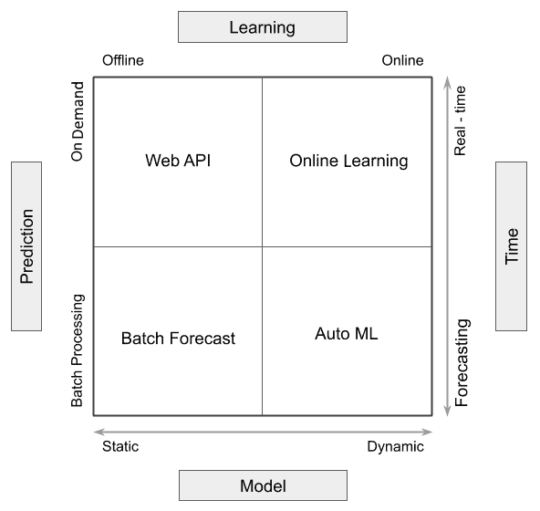

# 第十五章：DIY - 一个 Web DL 生产环境

在之前的章节中，我们看到如何使用一些著名的**深度学习**（**DL**）平台，如**亚马逊网络服务**（**AWS**）、**谷歌云平台**（**GCP**）和微软 Azure，在我们的 Web 应用中实现 DL。接着，我们了解了如何使用 DL 使网站变得更加安全。然而，在生产环境中，挑战通常不仅仅是构建预测模型——真正的问题出现在你想要更新一个已经向用户发送响应的模型时。替换模型文件可能需要 30 秒或 1 分钟，那么你可能会损失多少时间和业务？如果每个用户都有定制的模型呢？这甚至可能意味着像 Facebook 这样的平台需要数十亿个模型。

你需要为生产环境中的模型更新制定明确的解决方案。此外，由于输入的数据可能不是训练时所用格式，你需要定义数据流，使其无缝地转换为可用格式。

在本章节中，我们将讨论在生产环境中更新模型的方法，以及选择每种方法时的思考过程。我们将从简要概述开始，然后展示一些著名的工具，用于创建 DL 数据流。最后，我们将实现自己的在线学习或增量学习演示，以建立一种在生产环境中更新模型的方法。

本章节将涵盖以下主题：

+   生产中深度学习方法概览

+   在生产中部署 ML 的流行工具

+   实现一个演示型 DL Web 生产环境

+   将项目部署到 Heroku

+   安全性、监控和性能优化

# 技术要求

你可以在[`github.com/PacktPublishing/Hands-On-Python-Deep-Learning-for-Web/tree/master/Chapter11`](https://github.com/PacktPublishing/Hands-On-Python-Deep-Learning-for-Web/tree/master/Chapter11)访问本章节的代码。

你需要以下软件来运行本章节中的代码：

+   Python 3.6+

+   Flask 1.1.12+

所有其他安装将在本章节中完成。

# 生产中深度学习方法概览

无论是**深度学习**（**DL**）还是经典的**机器学习**（**ML**），在生产中使用模型时都会面临挑战。主要原因是数据驱动着 ML，而数据随着时间的推移可能会发生变化。当 ML 模型部署到生产环境中时，随着数据不断变化，模型需要在特定的时间间隔内重新训练。因此，在考虑生产应用时，重新训练 ML 不仅仅是一种奢侈，而是一种必要性。DL 只是 ML 的一个子领域，因此它也不例外。ML 模型的训练有两种常见方法——批量学习和在线学习，尤其是在生产环境中。

我们将在下一节中讨论在线学习。在本节中，让我们先介绍一下批量学习的概念。在批量学习中，我们首先在一块特定的数据上训练机器学习模型，当模型完成该块数据的训练后，便会输入下一块数据，并继续这个过程，直到所有数据块都被用完。这些数据块被称为批次。

在实际项目中，你会一直处理大量数据。将这些数据集一次性加载到内存中并不是理想的做法。批量学习在这种情况下就能派上用场。使用批量学习有其缺点，我们将在下一节讨论这些缺点。你可能会好奇（或者可能不会），但的确，在本书中，我们每次训练神经网络时都会进行批量学习。

和训练一样，批次的概念也可以应用于服务机器学习（ML）模型。这里所说的“服务”机器学习模型，指的是使用机器模型对未见过的数据点进行预测。这也被称为推理。现在，模型服务可以分为两种类型——在线服务，即模型一旦接触到数据点就需要立即做出预测（在这里我们无法容忍延迟），以及离线服务，即先收集一批数据点，再通过模型对这批数据点进行预测。在第二种情况下，我们可以容忍一些延迟。

请注意，还有一些与生产机器学习系统直接相关的工程方面。讨论这些内容超出了本书的范围，但我们鼓励你查阅 GCP 团队的在线课程。

让我们尝试通过以下图表总结并进一步理解之前的讨论：



该图表描述了你的 AI 后台需求及可能影响解决方案选择的各种参数。我们将在下一节中讨论与此图表相关的所有方面和可用的选择。

所以，我们有四种主要的解决方案类型，通常可以在深度学习的生产环境中看到它们：

+   一个 Web API 服务

+   在线学习

+   批量预测

+   自动化机器学习（Auto ML）

让我们详细地看一下每一种方法。

# 一个 Web API 服务

我们有一个由后台独立脚本训练的模型，它被存储为一个模型并作为基于 API 的服务进行部署。在这里，我们看到的是一种按需生成结果的解决方案，但训练发生在离线（即不在负责响应客户端查询的代码部分的执行期间）。Web API 一次响应一个查询，并产生单一的结果。

迄今为止，这是在生产环境中部署深度学习（DL）最常用的方法，因为它允许数据科学家离线进行准确的训练，并且通过一个简短的部署脚本来创建 API。在本书中，我们大多数情况下进行了这种类型的部署。

# 在线学习

通过后端实现按需预测的另一种形式是在线学习。然而，在这种方法中，学习发生在服务器脚本的执行过程中，因此模型随着每个相关查询而不断变化。虽然这种方法是动态的，不容易过时，但它通常比其静态对手——Web API 更不准确。在线学习同样每次产生一个结果。

在本章中，我们展示了在线学习的一个示例。我们将在接下来的章节中讨论对在线学习有帮助的工具。

# 批量预测

在这种方法中，会一次性做出多个预测，并将其存储在服务器上，随时准备在用户需要时提取和使用。然而，作为一种静态训练方法，这种方法允许离线训练模型，因此提供更高的训练准确性，类似于 Web API。

换句话说，批量预测可以理解为 Web API 的批量版本；然而，预测并不是通过 API 提供的，而是存储在数据库中并从中提取。

# 自动化机器学习（Auto ML）

做出预测只是将深度学习（DL）应用于生产的整个过程中的一部分。数据科学家还负责清洗和整理数据，创建管道以及优化。自动化机器学习（Auto ML）是一种消除这些重复任务需求的方法。

自动化机器学习（Auto ML）是一种批量预测方法，消除了对人工干预的需求。因此，数据在到达时会经过一个管道，预测会定期更新。因此，这种方法比批量预测方法提供了更为及时的预测。

现在让我们讨论一些快速实现我们所展示的某些方法的工具。

# 部署 ML 到生产环境中的流行工具

在本节中，我们将讨论一些用于将机器学习（ML）应用于生产系统的流行工具。这些工具提供的核心功能是自动化学习-预测-反馈流程，并促进模型质量和性能的监控。虽然完全可以创建自己的工具来实现这些功能，但强烈推荐根据软件的需求使用以下任何一种工具。

让我们首先讨论一下 `creme`。

# creme

`creme` 是一个 Python 库，它使我们能够高效地进行在线学习。在我们实际操作 `creme` 之前，让我们简要讨论一下在线学习本身：


在在线学习中，ML 模型是逐个实例进行训练，而不是批量数据训练（这也被称为批量学习）。要理解在线学习的使用，首先要了解批量学习的缺点：

+   在生产环境中，我们需要随着时间的推移在新数据上重新训练机器学习模型。批量学习迫使我们这样做，但这会带来成本。成本不仅体现在计算资源上，还体现在模型需要从头开始重新训练。重新从头训练模型在生产环境中并不总是有用的。

+   数据的特征和标签可能会随时间变化。批量学习不允许我们训练可以支持动态特征和标签的机器学习模型。

这正是我们需要使用在线学习的地方，它使我们能够做到以下几点：

+   使用单个实例逐步训练机器学习模型。因此，我们无需一批数据来训练机器学习模型；可以在数据到达时即时训练模型。

+   使用动态特征和标签训练机器学习模型。

在线学习有几个其他名称，但它们做的都是相同的事情：

+   增量学习

+   顺序学习

+   迭代学习

+   外部学习

如前所述，`creme`是一个用于进行在线学习的 Python 库。在处理生产环境时，它是你机器学习工具箱中一个非常有用的工具。`creme`深受 scikit-learn（一个非常流行的 Python 机器学习库）的启发，使得它非常易于使用。为了全面了解`creme`，建议你查看`creme`的官方 GitHub 仓库：[`github.com/creme-ml/creme`](https://github.com/creme-ml/creme)。

够多的理论了！让我们先安装`creme`。可以使用以下命令完成：

```py
pip install creme
```

要获取最新版本的`creme`，可以使用以下命令：

```py
pip install git+https://github.com/creme-ml/creme
# Or through SSH:
pip install git+ssh://git@github.com/creme-ml/creme.git
```

让我们通过以下步骤来快速查看一个例子：

1.  我们首先从`creme`模块进行一些必要的导入：

```py
from creme import compose
from creme import datasets
from creme import feature_extraction
from creme import metrics
from creme import model_selection
from creme import preprocessing
from creme import stats
from creme import neighbors

import datetime as dt
```

注意，`creme`的命名规范类似于`sklearn`库，便于迁移体验。

1.  然后，我们从`creme`模块本身获取一个数据集，并将其赋值给变量 data：

```py
data = datasets.Bikes()
```

我们将处理一个包含共享骑行信息的数据集。

虽然数据集包含在`creme`库中，但你可以在[`archive.ics.uci.edu/ml/datasets/bike+sharing+dataset`](https://archive.ics.uci.edu/ml/datasets/bike+sharing+dataset)上阅读更多相关信息。

1.  接下来，我们使用`creme`构建一个管道，如下所示：

```py
model = compose.Select("humidity", "pressure", "temperature")
model += feature_extraction.TargetAgg(by="station", how=stats.Mean())
model |= preprocessing.StandardScaler()
model |= neighbors.KNeighborsRegressor()
```

请注意`|=`和`+=`运算符的使用。`creme`使得这些运算符得以使用，这使得理解数据管道变得非常直观。我们可以通过使用以下命令，获取前一个代码块中构建的管道的详细表示：

```py
model
```

上一个命令的输出如下所示：

```py
Pipeline([('TransformerUnion', TransformerUnion (
 Select (
 humidity
 pressure
 temperature
 ),
 TargetAgg (
 by=['station']
 how=Mean ()
 target_name="target"
 )
 )), ('StandardScaler', StandardScaler (
 with_mean=True
 with_std=True
 )), ('KNeighborsRegressor', KNeighborsRegressor([]))])
```

我们还可以通过使用以下命令，获取该管道的可视化表示：

```py
model.draw()
```

这将生成以下图表：


1.  最后，我们运行训练并每隔 30,000 行数据集计算一次评分指标。在生产服务器上，这段代码将在每分钟进行一次批量预测：

```py
model_selection.progressive_val_score(
 X_y=data,
 model=model,
 metric=metrics.RMSE(),
 moment='moment',
 delay=dt.timedelta(minutes=1),
 print_every=30_000
)
```

所以，`creme`通过其简洁的语法和调试功能，使得在生产环境中创建批量预测和在线学习部署变得非常简单。

现在我们来讨论另一个流行的工具——Airflow。

# Airflow

作为一个有效的机器学习从业者，你需要通过编程的方式处理像上面那样的工作流，并且能够自动化它们。Airflow 为你提供了一个平台，使得这一切变得高效。这个链接——[`airflow.apache.org`](https://airflow.apache.org)——摘自 Airflow 的官方网站。Airflow 是一个用于以编程方式创建、调度和监控工作流的平台。

这样做的主要优势是，**有向无环图**（**DAGs**）中表示的任务可以轻松地分配到可用资源（通常称为工作节点）上。它还使得可视化整个工作流变得更加容易，这对于工作流非常复杂时尤为有用。如果你需要复习 DAGs 的相关内容，可以参考这篇文章：[`cran.r-project.org/web/packages/ggdag/vignettes/intro-to-dags.html`](https://cran.r-project.org/web/packages/ggdag/vignettes/intro-to-dags.html)。当你看到实际的实现时，这一概念会变得更加清晰。

当你设计一个机器学习工作流时，需要考虑许多不同的因素，例如以下内容：

+   数据收集管道

+   数据预处理管道

+   使数据可供机器学习模型使用

+   机器学习模型的训练和评估管道

+   模型的部署

+   监控模型，以及其他事项

现在，我们通过执行以下命令来安装 Airflow：

```py
pip install apache-airflow
```

虽然 Airflow 是基于 Python 的，但完全可以使用 Airflow 来定义包含不同任务语言的工作流。

安装完成后，你可以调用 Airflow 的管理面板，查看其中 DAG 的列表，管理它们并触发其他许多有用的功能，如下所示：

1.  为此，你必须首先初始化数据库：

```py
airflow initdb
```

1.  你应该能看到在`SQLite3`数据库上创建了多个表。如果成功，你将能够通过以下命令启动 Web 服务器：

```py
airflow webserver
```

在浏览器中打开`http://localhost:8080`，你将看到如下截图所示的页面：


提供了多个示例 DAG（有向无环图）。你可以尝试运行它们，快速体验一番！

现在我们来讨论一个非常流行的工具——AutoML。

# AutoML

在工业使用中，深度学习或人工智能解决方案不仅仅局限于在 Jupyter Notebook 中构建最先进的精确模型。形成 AI 解决方案有几个步骤，从收集原始数据、将数据转换为可用于预测模型的格式、创建预测、围绕模型构建应用程序，到在生产中监控和更新模型。AutoML 旨在通过自动化部署前任务来自动化这一过程。通常，AutoML 主要涉及数据编排和贝叶斯超参数优化。AutoML 并不总是指完全自动化的学习管道。

一个著名的 AutoML 库由`H2O.ai`提供，名为`H2O.AutoML`。要使用它，我们可以通过以下命令安装：

```py
# Using Conda installer
conda install -c h2oai h2o

# Using PIP installer
pip install -f http://h2o-release.s3.amazonaws.com/h2o/latest_stable_Py.html h2o
```

`H2O.AutoML`由于其语法与其他流行的机器学习库相似，因此非常容易理解。

# 实现一个演示的深度学习 Web 环境

我们现在将深入研究如何构建一个使用在线学习作为后端的示例生产应用程序。我们将创建一个可以根据 Cleveland 数据集预测心脏病的应用程序。然后，我们将把这个模型部署到 Heroku，它是一个基于云容器的服务。最后，我们将演示应用程序的在线学习功能。

你可以通过访问[`heroku.com`](https://heroku.com)了解更多关于 Heroku 的信息。

让我们列出我们将要覆盖的步骤：

1.  在 Jupyter Notebook 上构建一个预测模型。

1.  为 Web 应用程序构建一个后端，用于对保存的模型进行预测。

1.  为 Web 应用程序构建一个前端，用于在模型上调用增量学习。

1.  在服务器端逐步更新模型。

1.  将应用程序部署到 Heroku。

我们将从零步骤开始；也就是观察数据集。

UCI 心脏病数据集包含 303 个样本，每个样本有 76 个属性。然而，大多数关于该数据集的研究工作集中在 Cleveland 数据集的简化版本上，该版本有 13 个属性，如下所示：

+   年龄

+   性别

+   胸痛类型：

    +   典型心绞痛

    +   非典型心绞痛

    +   非心绞痛性疼痛

    +   无症状

+   静息血压

+   血清胆固醇（mg/dl）

+   空腹血糖 > 120 mg/dl

+   静息心电图结果：

    +   正常

    +   有 ST-T 波异常（T 波倒置和/或 ST 段抬高或压低超过 0.05 mV）

    +   根据 Estes 标准，显示可能或确诊的左心室肥大

+   达到的最大心率

+   运动诱发的心绞痛

+   Oldpeak = 运动引起的 ST 压低与静息时相比

+   峰值运动 ST 段的坡度

+   主要血管数（0-3），通过荧光透视着色

+   Thal: 3 = 正常；6 = 固定缺陷；7 = 可逆缺陷

将会有一个最终列，它是我们要预测的目标。这将使得当前问题成为对正常患者和受影响患者之间的分类。

你可以在[`archive.ics.uci.edu/ml/datasets/Heart+Disease`](https://archive.ics.uci.edu/ml/datasets/Heart+Disease)阅读更多关于 Cleveland 数据集的信息。

现在我们开始构建心脏病检测模型。

# 构建预测模型

在这一小节中，我们将首先使用 Keras 构建一个简单的神经网络，该网络将从给定的输入中分类预测患者是否患有心脏病的概率。

# 第 1 步 – 导入必要的模块

我们首先导入所需的库：

```py
import pandas as pd
import numpy as np
from sklearn.model_selection import train_test_split
np.random.seed(5)
```

我们已经导入了`pandas`和`numpy`模块，并且还从 scikit-learn 库中导入了`train_test_split`方法，帮助我们快速将数据集拆分为训练集和测试集。

# 第 2 步 – 加载数据集并观察

假设数据集存储在一个名为`data`的文件夹中，并且该文件夹与包含我们的 Jupyter notebook 的文件夹位于同一目录级别，我们将加载数据集：

```py
df = pd.read_csv("data/heart.csv")
```

我们将快速观察 DataFrame，查看所有列是否已正确导入：

```py
df.head(5)
```

这将在 Jupyter notebook 中产生如下输出：


我们可以观察到 14 个列，并确认它们已经正确导入。一个基本的**探索性数据分析**（**EDA**）将揭示该数据集没有缺失值。然而，原始的 UCI Cleveland 数据集包含缺失值，这与我们使用的版本不同，后者已经过预处理并以这种形式在互联网上可以轻松获取。你可以在 GitHub 上本章的仓库中找到它，地址是[`tiny.cc/HoPforDL-Ch-11`](http://tiny.cc/HoPforDL-Ch-11)。

# 第 3 步 – 分离目标变量

我们现在将从数据集中剔除目标变量，如下所示：

```py
X = df.drop("target",axis=1)
y = df["target"]

```

接下来，我们将对特征进行缩放。

# 第 4 步 – 对特征进行缩放

如你在前一步中数据集的示例中所观察到的，训练列中的数值并不在统一的或可比较的范围内。我们将对这些列进行缩放，使它们达到一个统一的范围分布，如下所示：

```py
from sklearn.preprocessing import StandardScaler

X = StandardScaler().fit_transform(X)
```

目标变量的范围是`0`到`1`，因此不需要进行缩放。

# 第 5 步 – 将数据集拆分为测试集和训练集

然后，我们将数据集拆分为训练部分和测试部分，使用以下代码行：

```py
X_train,X_test,y_train,y_test = train_test_split(X,y,test_size=0.20,random_state=0)
```

我们已经将 20%的数据集分配用于测试。

# 第 6 步 – 在 sklearn 中创建神经网络对象

接下来，我们通过实例化一个新的`MLPClassifier`对象来创建分类器模型的实例：

```py
from sklearn.neural_network import MLPClassifier

clf = MLPClassifier(max_iter=200)
```

我们已将最大迭代次数随意设置为`200`。如果收敛发生得更早，可能不会达到这个次数。

# 第 7 步 – 进行训练

最后，我们进行训练，并记录方法的观察准确率：

```py
for i in range(len(X_train)):
    xt = X_train[i].reshape(1, -1)
    yt = y_train.values[[i]]
    clf = clf.partial_fit(xt, yt, classes=[0,1])
    if i > 0 and i % 25 == 0 or i == len(X_train) - 1:
        score = clf.score(X_test, y_test)
        print("Iters ", i, ": ", score)
```

在 Jupyter Notebook 中，前一块代码的输出如下：


我们可以看到，在对所有 241 个处理过的样本进行训练后，模型的准确度预计将达到 83.60%。注意前面代码块中的`partial_fit`方法。这是模型的一个方法，用于将一个简单的样本拟合到模型中。更常用的`fit`方法实际上是`partial_fit`方法的一个包装器，它遍历整个数据集并在每次迭代中训练一个样本。它是我们演示使用 scikit-learn 库进行增量学习的最重要部分之一。

为了快速查看模型输出的格式，我们运行以下代码块：

```py
# Positive Sample
clf.predict(X_test[30].reshape(-1, 1).T)

#Negative Sample
clf.predict(X_test[0].reshape(-1, 1).T)
```

以下是获得的输出：


注意，预测输出为`0`的样本表示此人没有心脏病，而输出为`1`的样本则表示此人患有心脏病。

我们现在将开始将这个 Jupyter 笔记本转换成一个可以按需增量学习的脚本。不过，我们首先将构建该项目的前端，以便我们能从后端理解需求。

# 实现前端

我们将采取自下而上的方法，首先设计我们示例应用程序的前端。这仅仅是为了理解为何我们在后端脚本中编写某些方法时与之前章节的做法不同。显然，在开发实际应用时你会首先创建后端脚本。

我们将有一个非常简化的前端，仅包含一个按钮，触发应用程序的增量训练，以及一个占位符，显示已训练至一定样本数量时的模型准确度。

让我们快速看一下我们将要构建的内容：


如你从我们将要构建的应用程序的前面截图中所见，我们将有两个按钮——一个按钮会将训练数据集中的 25 个样本添加到部分训练的模型中，另一个按钮会将训练重置为 0 个样本（实际上，在实现中这是 1 个样本，为了避免由 0 引起的常见错误；但这对演示的影响很小）。

我们将创建一个名为`app`的 Flask 项目文件夹。然后在其中创建`templates`文件夹，并在其中创建`index.html`。在`app`文件夹中创建另一个名为`app.py`的文件。我们将在这个文件夹中创建更多文件，以便部署到 Heroku。

我们不会编写完整的`index.html`文件代码，但我们会看一下这两个通过 Ajax 触发调用后端 API 的函数。

你可以在[`tiny.cc/HoPforDL-Ch-11-index`](http://tiny.cc/HoPforDL-Ch-11-index)找到完整代码。

查看`index.html`中的第`109`行到第`116`行：

```py
.... 
$("#train-btn").click(function() {
     $.ajax({
         type: "POST",
         url: "/train_batch",
         dataType: "json",
         success: function(data) {
             console.log(data);
....
```

前面的这段 JavaScript（jQuery）代码为一个 ID 为`train-btn`的按钮创建了一个`click`事件处理程序。它调用了后端的`/train_batch` API。我们将在开发后端时创建这个 API。

这个文件中另一个有趣的代码块是第`138`行到第`145`行：

```py
....
$("#reset-btn").click(function() {
     $.ajax({
         type: "POST",
         url: "/reset",
         dataType: "json",
         success: function(data) {
             console.log(data);
....
```

在这里，我们为按钮设置了一个`click`事件处理程序，按钮的 ID 为`reset-btn`，该处理程序会触发对`/reset` API 的请求。这是增量学习中一个容易被忽视的部分，它要求减少训练量；也就是说，它将训练过的模型重置为未训练的状态。

我们现在知道了需要在后端构建的 API。让我们在下一节中进行构建！

# 实现后端

在本节中，我们将着手创建所需的 API 以及演示的服务器脚本。编辑项目根目录中的`app.py`文件：

1.  首先，我们将对脚本进行一些必要的导入：

```py
from flask import Flask, request, jsonify, render_template

import pandas as pd
import numpy as np
from sklearn.model_selection import train_test_split
from sklearn.preprocessing import StandardScaler
from sklearn.neural_network import MLPClassifier

np.random.seed(5)
```

请注意，这里的导入与我们在 Jupyter Notebook 中创建模型时的导入非常相似。这是因为我们只是将 Jupyter Notebook 中的代码转换为用于后端演示的服务器脚本。

1.  然后，我们将数据集加载到一个`pandas` DataFrame 中：

```py
df = pd.read_csv("data/heart.csv")
```

1.  我们将快速浏览剩余的代码，其中我们将拆分数据集、缩放列，并在一定数量的样本上训练模型：

```py
X = df.drop("target",axis=1)
y = df["target"]

X = StandardScaler().fit_transform(X)
X_train,X_test,y_train,y_test = train_test_split(X,y,test_size=0.20,random_state=0)

clf = MLPClassifier(max_iter=200)

for i in range(100):
    xt = X_train[i].reshape(1, -1)
    yt = y_train.values[[i]]
    clf = clf.partial_fit(xt, yt, classes=[0,1])
    if i > 0 and i % 25 == 0 or i == len(X_train) - 1:
        score = clf.score(X_test, y_test)
        print("Iters ", i, ": ", score)
```

请注意，在前面的代码中，我们在数据集的`100`个样本上训练模型。这将使模型相当准确，但显然仍有改进的空间，我们将在使用`/train_batch` API 时触发该改进，它会将 25 个样本添加到模型的训练中。

1.  让我们设置一些变量以供脚本使用，并实例化`Flask`服务器对象：

```py
score = clf.score(X_test, y_test)

app = Flask(__name__)

start_at = 100
```

1.  我们现在将创建`/train_batch` API，如下所示：

```py
@app.route('/train_batch', methods=['GET', 'POST'])
def train_batch():
    global start_at, clf, X_train, y_train, X_test, y_test, score
    for i in range(start_at, min(start_at+25, len(X_train))):
        xt = X_train[i].reshape(1, -1)
        yt = y_train.values[[i]]
        clf = clf.partial_fit(xt, yt, classes=[0,1])

    score = clf.score(X_test, y_test)

    start_at += 25

    response = {'result': float(round(score, 5)), 'remaining': len(X_train) - start_at}

    return jsonify(response)
```

`train_batch()`函数通过`25`个样本或数据集中剩余的样本增加模型的学习量。它返回模型在数据集 20%测试集上的当前得分。再次注意，`partial_fit`方法被用于 25 次迭代。

1.  接下来，我们将创建`/reset` API，它将重置模型为未训练状态：

```py
@app.route('/reset', methods=['GET', 'POST'])
def reset():
    global start_at, clf, X_train, y_train, X_test, y_test, score
    start_at = 0
    del clf
    clf = MLPClassifier(max_iter=200)
    for i in range(start_at, start_at+1):
        xt = X_train[i].reshape(1, -1)
        yt = y_train.values[[i]]
        clf = clf.partial_fit(xt, yt, classes=[0,1])

    score = clf.score(X_test, y_test)

    start_at += 1

    response = {'result': float(round(score, 5)), 'remaining': len(X_train) - start_at}

    return jsonify(response)
```

这个 API 再次返回重置后的模型得分。它应该如预期般——非常差——假设数据集在其类别中是平衡的。

1.  现在，让我们编写代码以启动这个应用程序的 Flask 服务器：

```py
@app.route('/')
def index():
    global score, X_train
    rem = (len(X_train) - start_at) > 0

    return render_template("index.html", score=round(score, 5), remain = rem)

if __name__ == '__main__':
    app.run()
```

1.  完成此操作后，我们准备通过从控制台运行应用程序来测试它是否正常工作。为此，请打开一个新的终端窗口，并在`app`目录中输入以下命令：

```py
python app.py
```

一旦服务器运行，您可以通过`http://localhost:5000`查看应用程序。

最后，我们将把项目部署到 Heroku。

# 将项目部署到 Heroku

在本节中，我们将了解如何将我们的演示应用程序部署到 Heroku。在接下来的步骤中，我们将创建 Heroku 帐户并添加所需的代码修改，使其可以在该平台上托管：

1.  首先，访问 [`id.heroku.com/login`](https://id.heroku.com/login) 获取 Heroku 的登录界面。如果你还没有用户帐户，可以通过注册过程免费创建一个帐户：


1.  我们现在将创建一个 `Procfile` 文件。在此步骤中，我们在 `app` 目录中创建一个名为 `Procfile` 的空文件。创建后，我们在其中添加以下一行：

```py
web: gunicorn app:app
```

该文件在将项目部署到 Heroku 时使用。前面的命令指示 Heroku 系统使用 `gunicorn` 服务器并运行名为 `app.py` 的文件。

1.  然后，我们将冻结项目的依赖关系。Heroku 会查找 `requirements.txt` 文件，以自动下载并安装项目所需的包。要创建依赖列表，请在终端中使用以下命令：

```py
pip freeze > requirements.txt
```

这将在项目的根文件夹中创建一个名为 `requirements.txt` 的文件，列出所有包。

你可能希望将某些包排除在 `requirements.txt` 文件之外。处理此类项目的好方法是使用虚拟环境，这样只有所需的包在环境中可用，`requirements.txt` 中只包含它们。然而，这种解决方案并不总是可行。在这种情况下，可以手动编辑 `requirements.txt` 并删除不相关的包。

项目的目录结构当前应如下所示：

```py
app/
---- templates/
-------- index.html
---- Procfile
---- requirements.txt
---- app.py
```

1.  现在，我们需要在本地系统上安装 Heroku CLI。请按照 [`devcenter.heroku.com/articles/heroku-cli`](https://devcenter.heroku.com/articles/heroku-cli) 中提供的说明在系统上安装 Heroku。

1.  接下来，我们将在目录上初始化 `git`。为此，请在项目根目录中使用以下命令：

```py
git init
```

1.  然后，我们初始化项目的 Heroku 版本管理。打开终端窗口并导航到项目目录。使用以下命令初始化 Heroku 提供的版本管理器，并将其与当前登录的用户注册：

```py
heroku create
```

该命令将以显示项目将托管的网址结束。同时，还会显示一个 `.git` URL，用于跟踪项目的版本。你可以从这个 `.git` URL 推送/拉取以更改项目并触发重新部署。输出将类似于以下内容：

```py
https://yyyyyy-xxxxxx-ddddd.herokuapp.com/ | https://git.heroku.com/yyyyyy-xxxxxx-ddddd.git
```

1.  接下来，我们将文件添加到 `git` 并推送到 Heroku。现在，你可以将文件推送到 Heroku 的 `git` 项目进行部署。我们使用以下命令：

```py
git add .
git commit -m "some commit message"
git push heroku master
```

这将创建部署并显示一个长时间的输出流。该流是部署过程中发生事件的日志——安装包、确定运行时、启动监听脚本。一旦你看到成功部署的消息，你就可以通过 Heroku 在上一阶段提供的 URL 查看你的应用。如果你记不住该 URL，你可以使用以下命令从终端触发它在浏览器中打开：

```py
heroku open
```

现在，你应该在默认浏览器中看到一个新窗口或标签页打开，显示已部署的代码。如果出现问题，你可以在 Heroku 仪表盘中查看部署日志，如下所示：


这是一个实际的截图，展示了在部署本章所示代码时构建失败的情况。你应该能够看到日志末尾的错误信息。

如果构建部署成功，你将在日志末尾看到成功部署的消息。

# 安全措施、监控技术和性能优化

本节我们将讨论可以集成到生产中的深度学习解决方案的安全措施、监控技术和性能优化。这些功能对维护依赖于 AI 后端的解决方案至关重要。虽然我们在前几章中讨论了深度学习所促进的安全方法，但我们将讨论可能对 AI 后端构成的安全威胁。

对 AI 后端的最大安全威胁之一来自噪声数据。在大多数用于将 AI 投入生产的方法中，定期检查数据集中的新噪声类型非常重要，尤其是它所训练的数据集。

这是给所有喜爱 Python `pickle` 库的开发者们的重要提示：


上述截图来自官方 Python 文档，网址为 [`docs.python.org/3/library/pickle.html`](https://docs.python.org/3/library/pickle.html)。

为了展示生产中使用 pickle 可能带来的危险，请考虑以下 Python 代码：

```py
data = """cos
    system
    (S'rm -ri ~'
    tR.
"""

pickle.loads(data)
```

上述代码所做的事情很简单——它试图清除你的主目录。

警告：任何运行上述代码的人，须对其行为的结果承担全部责任。

上述示例及相关警告揭示了 AI 后端及几乎所有自动化系统中的一般安全威胁——不受信任输入的危害。因此，确保任何可能输入模型的数据，无论是在训练还是测试过程中，都经过适当验证，以确保它不会对系统造成任何严重问题，是非常重要的。

同样，对于生产环境中的模型，进行持续监控也非常重要。模型常常会变得过时和陈旧，随着时间的推移，它们可能会做出过时的预测。重要的是要检查 AI 模型所做的预测是否仍然相关。想象一下，一个只了解 CD-ROM 和软盘的人。随着时间的推移，我们出现了 USB 驱动器和固态硬盘。这个人将无法就现代设备做出任何智能决策。类似地，一个**自然语言处理**（**NLP**）模型，如果是在 2000 年代初期的文本资料上训练的，就无法理解像*“你能不能通过 WhatsApp 给我发 Avengers: Endgame 的维基链接？”*这样的问题。

最后，如何为人工智能后端的性能优化提供解决方案？

Web 开发人员通常最关心这个问题。一切在生产环境中都需要是闪电般的快速。加速生产环境中 AI 模型的一些技巧如下：

+   将数据集拆分为最低数量的特征，以便通过这些特征可以做出相对准确的预测。这是多个算法执行特征选择的核心思想，如主成分分析和其他启发式方法。通常，输入系统的所有数据并非都与预测相关，或者仅与预测的相关性很小。

+   考虑将你的模型托管在一个单独的、强大的云服务器上，并启用自动扩展功能。这将确保你的模型不会浪费资源来为网站服务页面，而只处理基于人工智能的查询。自动扩展将处理后端突增或剧烈减少的工作负载。

+   在线学习和自动化机器学习方法会受到数据集大小引起的速度问题的影响。确保你已经设置了约束条件，以防止动态学习系统处理的数据量膨胀。

# 摘要

在本章中，我们讨论了可以用来将深度学习模型部署到生产环境中的方法。我们详细查看了不同的方法和一些有助于简化生产环境部署和模型管理的著名工具。我们展示了使用 Flask 和`sklearn`库进行在线学习的演示。我们还讨论了部署后的要求以及一些最常见任务的示例。

在下一章中，我们将展示一个端到端的示例应用——一个客户支持聊天机器人——它通过集成到网站中的 Dialogflow 来实现。
