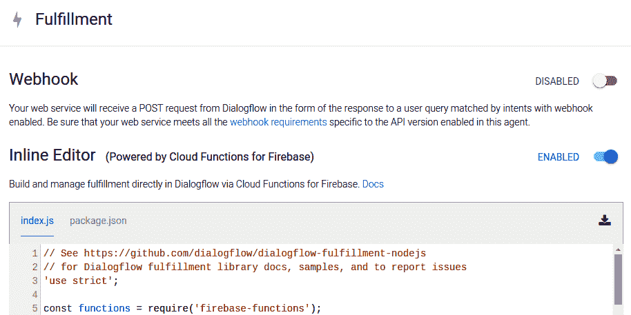

# 第十六章：使用 DL API 和客户支持聊天机器人创建 E2E Web 应用程序

在本章中，我们将整合之前章节中学习过的多个工具和方法，并引入一些全新的工具和技术。本章涵盖了企业非常重要的一个方面——客户支持。对于一个新兴的企业来说，客户支持可能既耗时又让人沮丧。客户提出的问题，通常通过查阅公司网站上提供的文档或常见问题解答（FAQ）就能轻松解答，但客户往往不愿意仔细阅读这些内容。因此，能够引入一层自动化，利用聊天机器人来回答最常见的查询，并确保该聊天机器人全天候响应，将会是一个极好的解决方案。

本章讨论如何使用 Dialogflow 创建聊天机器人以解决一般的客户支持问题，并将其集成到基于 Django 的网站中。此外，聊天机器人将从 Django API 中获取答案，该 API 将被单独托管。我们将探索如何实现聊天机器人个性，并介绍如何通过 Web Speech API 实现基于**语音合成**（**TTS**）和**语音转文本**（**STT**）的用户界面，该 API 将神经网络直接部署到用户的浏览器中。

本章将涵盖以下主题：

+   自然语言处理（NLP）简介

+   聊天机器人简介

+   创建一个拥有客户支持代表个性的 Dialogflow 聊天机器人

+   使用 ngrok 来便利本地 HTTPS API

+   使用 Django 创建一个管理公司内部订单的测试用户界面

+   使用 Web Speech API 在网页上实现语音识别和语音合成

我们将基于之前章节所学的内容，进一步深入并加以扩展，同时修正一些概念，并在过程中引入新的概念。让我们从了解**自然语言处理**（**NLP**）开始。

# 技术要求

你可以在[`github.com/PacktPublishing/Hands-On-Python-Deep-Learning-for-Web/tree/master/Chapter12`](https://github.com/PacktPublishing/Hands-On-Python-Deep-Learning-for-Web/tree/master/Chapter12)访问本章的代码。

运行本章代码所需的软件：

+   Python 3.6+

+   Django 2.x

其他所有安装内容将在本章中进行讲解。

# 自然语言处理（NLP）简介

自然语言处理（NLP）是机器学习和深度学习应用中一个受欢迎且令人兴奋的领域，它指的是一系列旨在理解和生成自然语言的技术和方法。NLP 的目标从理解人类语言文本的意义开始，扩展到生成有意义且让人类理解的自然语言句子。NLP 已经广泛应用于构建能够直接从人类获取指令和请求的系统，如聊天机器人。然而，聊天机器人也需要用自然语言进行回应，这是 NLP 的另一个方面。

让我们来研究一些与 NLP 相关的常见术语。

# 语料库

在学习自然语言处理（NLP）时，你会经常遇到**语料库**这个术语。通俗来说，语料库是指某个作者的作品集或某个文学体裁的作品集。在 NLP 研究中，语料库的字典定义略有修改，可以表述为一组书面文本文件，这些文本可以根据选择的任何标准进行分类。这些标准可能包括作者、出版商、体裁、写作类型、时间范围以及与书面文本相关的其他特征。

例如，一部莎士比亚的作品集或某个论坛上关于某个话题的所有帖子都可以被视为语料库。

# 词类

当我们将一个句子分解成各个单词，并对句子中每个单词对整个句子意义的贡献进行定性分析时，我们就进行了一种确定词类的操作。因此，词类是根据单词在句子中如何贡献句子意义而为单词提供的标注。

在英语中，我们通常有八种词类——动词、名词、代词、形容词、副词、介词、连词和感叹词。

例如，在句子“Ram is reading a book”中，“Ram”是名词且是主语，“reading”是动词且是动作，“book”是名词且是宾语。

你可以在[`partofspeech.org/`](http://partofspeech.org/)上了解更多关于词类的信息。你也可以尝试在[`linguakit.com/en/part-of-speech-tagging`](https://linguakit.com/en/part-of-speech-tagging)上找出你自己句子的词类。

# 分词

分词是将文档拆解成句子，再将句子拆解成单词的过程。这一点非常重要，因为如果任何计算机程序试图将整个文档作为一个单一字符串进行处理，会变得极为复杂，处理字符串所需的资源也会极其庞大。

此外，通常不需要一次性阅读所有句子就能理解整个文档的含义。通常，每个句子都有其独立的含义，通过统计方法与文档中的其他句子结合，可以确定文档的整体意义和内容。

同样，我们通常需要将句子拆解为单词，以便更好地处理句子，使句子的含义可以从字典中推导出来，其中每个单词都会单独列出。

# 词干提取和词形还原

词干提取和词形还原是自然语言处理中密切相关的术语，但它们之间有细微但重要的区别。两种方法的目标都是确定任何给定单词的词根，以便将该单词的派生形式与字典中的词根进行匹配。

词干提取是一个基于规则的过程，其中单词会被修剪，有时会附加指示其词根的修饰符。然而，词干提取有时可能会生成在字典中不存在的词根，这样的词根对人类读者来说没有任何意义。

词形还原是将单词转换为其词根或词典中给出的基本形式的过程。因此，单词原本的含义可以从人类字典中推导出来，使得词形还原后的文本比词干提取文本更容易处理。此外，词形还原会考虑单词在句子中的词性，再确定其正确的词根，而词干提取算法则忽略这一点。这使得词形还原比词干提取更能理解上下文。

# 词袋模型

计算机无法直接处理和处理文本。因此，所有文本在输入到机器学习模型之前必须转换为数字。将文本转换为一组数字的过程，使得在任何时候都可以从转换后的文本中提取出原始文本中最重要的部分，这个过程称为特征提取或编码。**词袋模型**（**BoW**）是执行文本特征提取的一个常见且简单的技术。

词袋模型实现的步骤如下：

1.  从文档中提取所有唯一单词。

1.  创建一个包含文档中所有唯一单词的向量。

1.  根据单词向量中的任何单词是否出现在该文档中，将每个文档转换为一个布尔数组。

例如，考虑以下三篇文档：

1.  Ram 是一个男孩。

1.  Ram 是一个好男孩。

1.  Ram 不是女孩。

这些文档中出现的唯一单词可以列在一个向量中，表示为["Ram", "is", "a", "boy", "good", "not", "girl"]。

因此，每个句子可以转换如下：

1.  [1, 1, 1, 1, 0, 0, 0]

1.  [1, 1, 1, 1, 1, 0, 0]

1.  [1, 1, 1, 0, 0, 1, 1]

你会发现，BoW 方法往往会丢失每个词语在句子中出现的位置或它对句子的贡献。因此，BoW 是一个非常基础的特征提取方法，可能不适用于那些需要上下文感知的应用。

# 相似度

相似度是衡量两句给定句子相似程度的标准。它是计算机科学领域中一个非常常见的操作，适用于所有需要维护记录的地方，如搜索正确文档、在文档中查找单词、身份验证及其他应用。

计算两个文档之间相似度的方法有很多。Jaccard 指数是最基本的形式之一，它基于两个文档中相同的标记数量占文档中所有唯一标记总数的百分比来计算相似度。

余弦相似度是另一种非常流行的相似度指标，它通过计算将两个文档转化为向量后，两个向量之间形成的余弦角度来计算相似度，通常通过 BoW 或其他特征提取技术进行向量化。

牢记这些概念后，让我们继续研究聊天机器人，它们是自然语言处理应用中最流行的形式之一。

# 聊天机器人简介

聊天机器人是自然语言处理（NLP）应用的一部分，专门处理对话界面。这些界面也可以扩展其功能，处理基础的命令和动作，这时它们被称为基于语音的虚拟助手。随着 Google Home 和 Amazon 的 Alexa 等专用设备的推出，基于语音的虚拟助手最近得到了快速发展。

聊天机器人可以以多种形式存在。它们不需要仅仅作为虚拟助手出现。你可以在游戏中与聊天机器人互动，它会试图将故事情节引导向某个方向，或者你也可以与一些公司在社交媒体平台（如 Twitter 或 Facebook）上使用的社交聊天机器人互动，回复客户的消息。聊天机器人可以被视为**互动语音响应**（**IVR**）系统的升级，具备了更高的智能和应对未知输入的能力，有时仅仅是回复一个默认的答复，有时则能根据提供的输入进行精确的计算性回应。

虚拟助手也可以存在于网站上，提供指导并为访问者提供帮助。这类助手通常出现在网站上，主要为消费者提供即时的查询支持。你一定见过许多网站上，通常位于屏幕右下角的“提问”或“我能帮你吗”聊天框。这些网站通常会用自动化的聊天机器人代替真人来回答查询。只有在查询过于复杂，无法通过自动化客服聊天机器人回答时，查询才会转交给真人客服。

创建对话式 UI 本身就是一门艺术。你需要使用既清晰又自然的语言。你可以在[`designguidelines.withgoogle.com/conversation`](https://designguidelines.withgoogle.com/conversation/)了解更多关于创建对话式 UI 的内容。

在接下来的部分，我们将创建一个充当客户支持代理的聊天机器人。

# 创建一个具有客户支持代表个性的 Dialogflow 机器人

Dialogflow 是一个非常流行的工具，用于创建聊天机器人。与 Wit.ai、Botpress、Microsoft Bot Framework 以及其他一些现成的聊天机器人创建服务类似，Dialogflow 的优势在于它与**Google Cloud Platform**（**GCP**）的紧密集成，并且可以将 Dialogflow 代理作为 Google Assistant 的动作，Google Assistant 原生运行在数十亿台 Android 设备上。

Dialogflow 曾用名 Api.ai。自从被 Google 收购后，它更名为 Dialogflow，并在流行度和可扩展性方面得到了提升。该平台允许与多个平台进行非常容易的集成，如 Facebook Messenger、Telegram、Slack、Line、Viber 等多个主要通信平台。

我们将在本章中开发的项目将遵循以下架构图：


我们将使用一些在前面的图示中未提及的库和服务。我们会在项目过程中介绍这些库和服务，并讨论为什么了解它们对我们来说很有趣。

# 开始使用 Dialogflow

要开始使用 Dialogflow，你应该访问其官方网站[`dialogflow.com`](https://dialogflow.com)，进入首页，页面上显示产品信息并链接到文档。学习你想要掌握的任何产品或服务的文档总是一个好主意，因为它包含了软件的全部工作原理和功能。我们将在本章的后续部分引用文档中的一些章节。

你可以在[`cloud.google.com/dialogflow/docs/`](https://cloud.google.com/dialogflow/docs/)找到 Dialogflow 的文档。

由于 Dialogflow 与 GCP 紧密集成，因此我们必须首先创建一个 Google 帐户。为此，请访问[`account.google.com`](https://account.google.com)创建帐户。如果你是第一次使用自己的 Google 帐户与 Dialogflow 配合使用，可能需要提供一些权限。

让我们继续探讨如何了解 Dialogflow 帐户创建过程以及 UI 的各个部分。

# 第一步 – 打开 Dialogflow 控制台

您需要点击页面右上角的“转到控制台”按钮，网址是[`dialogflow.com`](https://dialogflow.com)。或者，您可以在浏览器中输入[`dialogflow.cloud.google.com/`](https://dialogflow.cloud.google.com/)。如果您是第一次使用，您将看到如下屏幕：


仪表盘提示您创建一个新代理。

# 第 2 步 – 创建新代理

现在，我们将创建一个 Dialogflow 代理。在 Dialogflow 中，代理是聊天机器人的另一个名称。正是这个代理接收、处理并响应用户提供的所有输入。

点击“创建代理”按钮，并根据自己的需求填写代理的相关信息，包括代理的名称、默认语言、时区和 Google 项目名称。

如果在这一步之前您没有使用过 GCP，您需要创建一个项目。我们在第六章《*使用 Python 在 Google Cloud Platform 上进行深度学习*》中讨论过创建 GCP 项目。或者，您也可以在创建代理时让 GCP 自动为您创建一个新项目。

# 第 3 步 – 了解仪表盘

在成功创建 Dialogflow 代理后，您将看到如下截图中的仪表盘：


在左侧，您可以看到包含构成聊天机器人的各种组件的菜单。这个菜单非常有用，您应该仔细查看其中的所有内容，确保您理解我们在菜单项中所提到的内容。当我们使用诸如“点击实体”的句子时，我们指的是让您点击菜单中的“实体”项。

中间部分将根据菜单中点击的组件而显示不同的内容。默认情况下，当您打开 Dialogflow 控制台时，它会显示聊天机器人的意图列表。什么是意图？

意图是用户通过任何对聊天机器人的话语想要执行的操作。例如，当用户说`给我一杯咖啡`时，他们的意图是让聊天机器人“拿来咖啡”：


在最右侧，提供了一个面板，可以随时测试聊天机器人的响应。您可以输入任何文本，测试聊天机器人的响应，系统将提供一堆信息和聊天机器人生成的响应。

请考虑以下测试输入和响应：


当用户输入`我的订单状态是什么`时，聊天机器人会询问订单 ID。这个请求会与`CheckOrderStatus`意图匹配，并需要一个名为`OrderId`的参数。我们将在本项目中定期使用此控制台来调试聊天机器人。

在之前的截图中，我们向您展示了一个预配置的代理及其意图，而您新创建的代理此时还没有任何自定义意图。让我们来创建它们吧！

# 第 4 步 – 创建意图

现在，我们来创建两个意图。一个意图将为用户提供帮助，另一个则会检查用户提供的订单 ID 的状态。

# 第 4.1 步 – 创建 HelpIntent

在此子步骤中，点击左侧菜单中“Intents”项右侧的 + 按钮。您将看到一个空白的意图创建表单。

在意图创建表单中，您将能够看到以下标题：


对于此意图，填写意图名称为`HelpIntent`。

现在，请按照接下来的步骤完成此意图的创建。

**第 4.1.1 步 – 输入 HelpIntent 的训练短语**

现在，我们需要定义可能触发该意图的短语。为此，点击“Training Phrases”标题，并输入一些示例训练短语，如下所示：


每次对意图进行更改时，请确保点击“Save”保存。

**第 4.1.2 步 – 添加响应**

为了响应用户在该意图中的查询，我们需要定义可能的响应。点击意图创建表单中的“Responses”标题，并添加一个示例响应，如下所示：


保存该意图。一旦我们完成构建它，我们就可以通过输入类似于我们为该意图定义的训练短语的内容来测试聊天机器人。

**第 4.1.3 步 – 测试意图**

让我们来测试`HelpIntent`。在右侧的测试面板中，输入`Can you help me?`。代理将产生以下响应：


请注意前一截图底部匹配的意图。由于`HelpIntent`成功匹配了输入（该输入并未在训练短语中明确定义），我们可以得出结论，代理工作正常。

为什么代理需要对其未经过训练的输入做出响应呢？这是因为在测试某个特定意图时，我们希望确保任何与训练短语完全匹配或接近匹配的用户输入，都能被该意图正确匹配。如果它没有匹配到与预期意图相关的查询，您需要提供更多的训练短语，并检查是否有任何其他意图中的训练与之冲突。

现在我们已经有了一个意图，告诉用户这个聊天机器人可以做什么——也就是检查订单的状态——接下来我们来创建一个可以实际检查订单状态的意图。

# 第 4.2 步 – 创建 CheckOrderStatus 意图

点击“Create Intent”按钮，并将意图名称输入为`CheckOrderStatus`。

**第 4.2.1 步 – 输入 CheckOrderStatus 意图的训练短语**

对于此意图，我们输入以下训练短语：

1.  `订单 ID 12345 的状态是什么？`

1.  `我的产品什么时候到？`

1.  `我的订单发生了什么？`

1.  `我的订单什么时候到？`

1.  `我的订单状态是什么？`

请注意，第一个训练短语与其他短语不同，因为它包含了一个订单 ID。

我们需要能够识别它为一个订单 ID，并利用它来获取订单状态。

**步骤 4.2.2 – 从输入中提取并保存订单 ID**

在`CheckOrderStatus`意图的第一个训练短语中，双击 12345，一个菜单会弹出，如下所示：


选择@sys.number，然后输入参数名称为`OrderId`。您的训练短语将如下所示：


但有时，就像其他训练短语一样，用户在没有提示的情况下不会提到订单 ID。让我们添加一个提示，并在找到订单 ID 时进行存储。

**步骤 4.2.3 – 存储参数并在未找到时进行提示**

向下滚动到意图创建表单中的“动作和参数”标题。输入`OrderId`作为参数名称和值，并勾选“必填”复选框。以下截图应该类似于当前屏幕上的内容：


在`OrderId`参数的右侧，点击“定义提示”以为该参数添加提示。一个示例提示可以是`好的，您能告诉我订单 ID 吗？看起来是 12345！`。

我们预期在这个提示之后，用户一定会明确说明订单 ID，然后与该意图的第一个训练短语匹配。

接下来，我们需要为这个意图定义响应。

**步骤 4.2.4 – 为 CheckOrderStatus 意图启用通过完成的响应**

请记住，此意图需要从获得的订单 ID 中获取订单状态。在这种情况下，一组固定的响应将无法满足目的。因此，我们将利用意图创建表单中的“完成”部分。

向下滚动并为此意图启用 Webhook 的完成方法。此部分现在应该如下所示：


完成允许您的 Dialogflow 代理查询外部 API，以生成代理所需的响应。代理接收到的查询相关的元数据将被发送到外部 API，后者将理解并决定需要给出的响应。这对于通过聊天机器人提供动态响应非常有用。

我们现在必须定义这个 Webhook，用于使用订单 ID 获取订单状态。

# 步骤 5 – 创建 Webhook

现在我们将创建一个 Webhook，它将在 Firebase 云控制台上运行并调用我们订单管理门户中的外部 API。

点击菜单栏中的 Fulfillment 项目。您将看到启用 webhook 或使用 Firebase 云函数的选项。打开内联编辑器。您的屏幕将类似于以下截图：



我们将自定义内联编辑器中的两个文件。

# 步骤 6 – 创建 Firebase 云函数

Firebase 云函数在 Firebase 平台上运行，按您在创建 Dialogflow 代理时选择或创建的 GCP 项目的规定计费。您可以在[`dialogflow.com/docs/how-tos/getting-started-fulfillment`](https://dialogflow.com/docs/how-tos/getting-started-fulfillment)查看更多关于云函数的信息。

# 步骤 6.1 – 向 package.json 添加所需的包

在内联编辑器中的`package.json`文件里，我们将添加`request`和`request-promise-native`包到依赖项中，如下所示：

```py
"dependencies": {
    "actions-on-google": "².2.0",
    "firebase-admin": "⁵.13.1",
    "firebase-functions": "².0.2",
    "dialogflow": "⁰.6.0",
    "dialogflow-fulfillment": "⁰.5.0",
    "request": "*",
    "request-promise-native": "*"
  }
```

这些包将在代理构建时自动获取，因此您无需显式执行任何命令来安装它们。

# 步骤 6.2 – 向 index.js 添加逻辑

我们将添加调用订单管理系统 API 所需的代码。将以下函数添加到`dialogflowFirebaseFulfillment`对象定义中：

```py
function checkOrderStatus(){
    const request = require('request-promise-native');
    var orderId = agent.parameters.OrderId;
    var url = "https://example.com/api/checkOrderStatus/"+orderId;
    return request.get(url)
        .then(jsonBody => {
            var body = JSON.parse(jsonBody);
            agent.add("Your order is: " + body.order[0].order_status);
            return Promise.resolve(agent);
        })
        .catch(err => {
            agent.add('Unable to get result');
            return Promise.resolve(agent);
        });
  }
```

在文件末尾，在`dialogflowFirebaseFulfillment`对象定义结束之前，添加您之前创建的函数与 Dialogflow 代理中匹配的意图之间的映射，然后调用 webhook 来生成响应：

```py
  let intentMap = new Map();
  intentMap.set('Default Welcome Intent', welcome);
  intentMap.set('Default Fallback Intent', fallback);
  intentMap.set('CheckOrderStatus', checkOrderStatus);
  agent.handleRequest(intentMap);
```

现在，点击部署（Deploy）按钮，部署该函数。您将在屏幕右下角看到部署状态通知。等待部署和构建完成。

# 步骤 7 – 为机器人添加个性

为机器人添加个性更多的是关于您如何选择回应方式，以及如何通过代理中的回应和提示来推动对话。

例如，在之前的示例中，我们为用户的输入选择了一个非常标准的响应，但我们完全可以通过使用更贴近实际的语言或其他装饰元素让其变得更加有趣。如果我们不直接显示响应获取 API 的输出，而是加入对话装饰元素，比如`太好了，现在让我看看您的订单进度...`，并且在获取和加载响应时，让 Fulfillment 函数生成如`快到了...`、`快要到了...`、`嗯，让我看看...`等对话填充词，依照具体情况的需求，这样看起来会非常真实。

您还可以通过 Dialogflow 的小对话模块为聊天机器人设置一些有趣的琐事。要使用它，点击左侧的小对话菜单项并启用小对话。您可以添加一些有趣的响应，当您的机器人接收到特定查询时，会做出回应，如下所示：


小对话非常有助于为你的聊天机器人添加独特的个性！

在接下来的步骤中，我们将创建一个 UI，以便直接从订单管理网站与这个聊天机器人进行互动。然而，由于我们谈论的是基于 REST API 的接口，我们很可能会将这个 UI 与我们为订单管理系统创建的 API 分开托管。

这个云函数调用了一个你需要创建的 HTTPS API。在下一部分，我们将学习如何创建一个能够处理本地机器上 HTTPS 请求的 API。

# 使用 ngrok 来便捷地在 localhost 上实现 HTTPS API

你需要为云函数脚本创建你自己的订单管理系统 API，以便它能够从 API 获取订单状态。你可以在[`tiny.cc/omsapi`](http://tiny.cc/omsapi)找到一个快速示例。你的 API 必须在 HTTPS URL 上运行。为了实现这一点，你可以使用诸如 PythonAnywhere 和 ngrok 等服务。PythonAnywhere 将在其服务器上托管你的代码并提供固定的 URL，而 ngrok 可以安装并在本地运行，为`localhost`提供转发地址。

假设你需要在系统的`8000`端口运行 Django 项目用于订单管理 API，并希望提供一个 HTTPS URL 进行测试；你可以通过以下步骤使用 ngrok 轻松实现：

1.  下载 ngrok 工具。

首先，访问[`ngrok.com`](https://ngrok.com)，点击顶部导航菜单中的下载按钮。根据需要选择合适版本的工具并下载到你的系统。

1.  创建一个账户。

接下来，在网站上注册一个账户并进入仪表板。你可以使用 GitHub 或 Google 认证来快速设置账户。

你将看到如下仪表板：


由于你已经下载并安装了工具，你可以直接跳到连接账户的步骤。

1.  将你的 ngrok 账户与工具连接。

复制 ngrok 仪表板中*Connect your account*部分给出的命令——它包含你账户的 authtoken，运行后将 ngrok 工具与你系统中的 ngrok 账户连接。

然后，我们准备好继续处理`localhost`端口。

1.  设置 ngrok 地址以转发到`localhost`。

最后，使用以下命令开始将所有发送到随机生成的 ngrok URL 的请求转发到`localhost`：

```py
ngrok http 8000
```

ngrok 服务启动后会保持活跃，只要你保持终端开启。你应该会在屏幕上看到类似于以下截图的输出：


所有发送到你的 ngrok URL 的请求都会在终端中记录。你可以在请求日志上方的表格中的`Forwarding`行找到你的 ngrok URL。注意，`http`和`https`端口都会被转发。你现在可以使用在本地机器上运行的 API 服务，从 Firebase 发起调用，而 Firebase 只允许 HTTPS 调用。

# 使用 Django 创建测试 UI 来管理订单

在本书中，我们之前使用过 Django，具体见 第八章，*在 Microsoft Azure 上使用 Python 进行深度学习*，以及 第十章，*使用深度学习保护 Web 应用程序*。因此，我们将跳过 Django 如何工作的细节以及如何开始使用它。让我们直接进入创建一个可以通过语音交互的 UI！

如果你还没有在系统上安装 Django，请参考 第八章，*在 Microsoft Azure 上使用 Python 进行深度学习* 中的 *Django Web 开发简介* 部分。

# 第一步 – 创建一个 Django 项目

每个 Django 网站都是一个项目。要创建一个项目，请使用此命令：

```py
django-admin startproject ordersui
```

创建一个名为 `ordersui` 的目录，目录结构如下：

```py
ordersui/
| -- ordersui/
|         __init.py__
|         settings.py
|         urls.py
|         wsgi.py
| -- manage.py
```

让我们继续创建该项目的模块。

# 第二步 – 创建一个使用订单管理系统 API 的应用

请记住，每个 Django 项目由多个 Django 应用协同工作。现在我们将在这个项目中创建一个 Django 应用，该应用将使用订单管理系统的 API，并提供一个 UI 以查看 API 数据库中的内容。这对验证 Dialogflow 代理是否正常工作非常重要。

在新的终端或命令提示符中使用 `cd` 命令切换到 `ordersui` 目录。然后，使用以下命令创建一个应用：

```py
python manage.py startapp apiui
```

这将在 `ordersui` Django 项目的应用目录中创建一个目录，结构如下：

```py
apiui/ 
| -- __init__.py
| -- admin.py
| -- apps.py
| -- migrations/
|         __init__.py
| -- models.py
| -- tests.py
| -- views.py
```

在开始开发模块之前，让我们在下一节中定义一些项目级别的设置。

# 第三步 – 设置 settings.py

我们现在将进行一些配置，这些配置在 `ordersui/settings.py` 文件中是必需的。

# 第三步.1 – 将 apiui 应用添加到已安装应用列表中

在 `INSTALLED_APPS` 列表中，添加 `apiui` 应用，如下所示：

```py
# Application definition

INSTALLED_APPS = [
 'apiui',
 'django.contrib.admin',
 'django.contrib.auth',
 'django.contrib.contenttypes',
 'django.contrib.sessions',
 'django.contrib.messages',
 'django.contrib.staticfiles',
]
```

Django 框架只会在运行时包括 `INSTALLED_APPS` 指令中列出的应用，如前面的代码所示。我们还需要定义项目的数据库连接，具体内容将在下一节中展示。

# 第三步.2 – 移除数据库设置

我们将删除数据库连接设置配置，因为在这个 UI 中我们不需要数据库连接。

注释掉 `DATABASES` 字典，如下所示：

```py
# Database
# https://docs.djangoproject.com/en/2.2/ref/settings/#databases

# DATABASES = {
#     'default': {
#         'ENGINE': 'django.db.backends.sqlite3',
#         'NAME': os.path.join(BASE_DIR, 'db.sqlite3'),
#     }
# }
```

保存文件。完成此操作后，我们将设置一个 URL 路由指向 `apiui` 路由。

# 第四步 – 向 apiui 添加路由

更改 `ordersui/urls.py` 中的代码，添加路径以包含 `apiui` 应用中的路由设置文件。你的文件将包含以下代码：

```py
from django.contrib import admin
from django.urls import path, include

urlpatterns = [
 path('', include('apiui.urls')),
]
```

保存文件。在项目级别设置完路由后，我们还需要在模块级别设置路由，正如我们将在下一节中做的那样。

# 第五步 – 在 apiui 应用中添加路由

现在我们已经将项目配置为使用`apiui` URL 路由，接下来我们需要为这个应用创建所需的文件。在`apiui`目录下创建一个名为`urls.py`的文件，并添加以下内容：

```py
from django.urls import path

from . import views

urlpatterns = [
 path('', views.indexView, name='indexView'),
 path('<int:orderId>', views.viewOrder, name='viewOrder'),
]
```

保存文件。现在我们已经指定了应用中可用的路由，接下来我们需要为每个路由创建视图，正如我们在下一部分将要做的那样。

# 第 6 步 – 创建所需的视图

在我们创建的路由中，我们提到了两个视图——`indexView`，它不接受任何参数，以及`viewOrder`，它接受一个名为`orderId`的参数。在`apiui`目录中创建一个名为`views.py`的新文件，并按照下一步操作来创建所需的视图。

# 第 6.1 步 – 创建 indexView

该路由将简单地显示订单管理系统中的已下订单。我们使用以下代码：

```py
from django.shortcuts import render, redirect
from django.contrib import messages
import requests

def indexView(request):
 URL = "https://example.com/api/"
 r = requests.get(url=URL)
 data = r.json()
 return render(request, 'index.html', context={'orders': data['orders']})
```

我们将在接下来的部分中创建`viewOrder`视图。

# 第 6.2 步 – 创建 viewOrder

如果我们将一个订单 ID 作为`/orderId`传递给相同的`/`路由，那么我们应该返回该订单的状态。使用以下代码：

```py
def viewOrder(request, orderId):
 URL = "https://example.com/api/" + str(orderId)
 r = requests.get(url=URL)
 data = r.json()
 return render(request, 'view.html', {'order': data['order']})
```

我们已经完成了创建该项目所需的不同视图；然而，我们还没有创建它们所呈现的模板。让我们在接下来的部分中创建所需的模板。

# 第 7 步 – 创建模板

在我们之前定义的视图中，我们使用了两个模板——`index.html`和`view.html`。但为了使它们与设计保持一致，我们还需要设置一个`base.html`模板，它将作为 UI 中其他视图模板的主模板。

由于这些模板大多数只是 HTML 模板，对网站的核心内容影响不大，我们已将这些文件的代码提供在[`tiny.cc/ordersui-templates`](http://tiny.cc/ordersui-templates)上。你需要将模板文件保存在`apiui`目录下名为`templates`的文件夹中。

在这个阶段，你将能够启动 Django 项目服务器，并通过以下命令在浏览器中查看网站：

```py
python manage.py runserver
```

现在我们的服务器正在运行，我们将在下一部分围绕它创建一个语音接口。

# 使用 Web 语音 API 在网页上实现语音识别和语音合成

在 Web 开发领域，最近一个非常令人兴奋的发展是 Web 语音 API 的推出。虽然 Google 已经在 Google Chrome 浏览器（桌面版和 Android 版）中全面支持 Web 语音 API，但 Safari 和 Firefox 仅提供了部分实现。Web 语音 API 主要由两个组件构成：

+   **语音合成**：更广为人知的是**TTS**。它的功能是为任何给定的文本生成语音讲解。

+   **语音识别**：也称为**STT**。它的功能是识别用户所说的词并将其转换为相应的文本。

你可以阅读 Web Speech API 的详细文档，文档可在 Mozilla 的文档页面找到（[`tiny.cc/webspeech-moz`](http://tiny.cc/webspeech-moz)）。你还可以看到 Google 提供的技术演示，链接在此：[`tiny.cc/webspeech-demo`](http://tiny.cc/webspeech-demo)：


在接下来的步骤中，我们将向网站 UI 添加一个基于 Web Speech API 的提问按钮。

# 步骤 1 – 创建按钮元素

本节中的所有代码必须放入 UI 的 `base.html` 模板中，以便在网站的所有页面中都能使用。

我们使用以下代码快速创建一个提问按钮文本，该按钮将位于网站的右下角：

```py
<div id="customerChatRoot" class="btn btn-warning" style="position: fixed; bottom: 32px; right: 32px;">Ask a question</div>
```

现在，我们需要初始化并配置 Web Speech API，接下来我们将在下一节中进行此操作。

# 步骤 2 – 初始化 Web Speech API 并进行配置

当网页加载完成时，我们需要初始化 Web Speech API 对象，并为其设置必要的配置。为此，请使用以下代码：

```py
$(document).ready(function(){
            window.SpeechRecognition = window.webkitSpeechRecognition || window.SpeechRecognition;
            var finalTranscript = '';
            var recognition = new window.SpeechRecognition();
            recognition.interimResults = false;
            recognition.maxAlternatives = 10;
            recognition.continuous = true;
            recognition.onresult = (event) => {
               // define success content here 
            }

            // click handler for button here
        });
```

你可以看到，我们初始化了一个 Web `SpeechRecognition` API 对象，并对其进行了某些配置。让我们试着理解这些配置：

+   `recognition.interimResults`（布尔值）指示 API 是否应尝试识别暂时的结果或尚未说出的单词。这会给我们的用例增加额外开销，因此已关闭。当需要转录速度而非转录准确性时（例如生成实时转录以记录某人讲话内容），开启此功能会更有益。

+   `recognition.maxAlternatives`（数字）告诉浏览器同一语音片段可以生成多少个备选项。这在浏览器无法非常清楚地识别所说内容时非常有用，用户可以选择正确的识别结果。

+   `recognition.continuous`（布尔值）告诉浏览器是否需要持续捕捉音频，或者是否在识别一次语音后停止。

然而，我们尚未定义在执行语音转文本（STT）后接收到结果时执行的代码。我们通过向 `recognition.onresult` 函数添加代码来实现这一点，如下所示：

```py
              let interimTranscript = '';
              for (let i = event.resultIndex, len = event.results.length; i < len; i++) {
                let transcript = event.results[i][0].transcript;
                if (event.results[i].isFinal) {
                  finalTranscript += transcript;
                } else {
                  interimTranscript += transcript;
                }
              }
              goDialogFlow(finalTranscript);

              finalTranscript = '';
```

上述代码块在用户讲话时创建了一个临时的转录内容，并在更多单词被说出时不断更新。当用户停止讲话时，临时转录内容将附加到最终转录内容中，并传递给处理与 Dialogflow 交互的函数。在从 Dialogflow 代理收到响应后，最终转录内容将重置，以准备接受下一个来自用户的语音输入。

请注意，我们已将用户语音的最终识别转录发送到名为 `goDialogFlow()` 的函数。让我们定义这个函数。

# 步骤 3 – 调用 Dialogflow 代理

一旦我们获取到用户语音查询的文本版本，我们将把它发送到 Dialogflow 代理，如下所示：

```py
function goDialogFlow(text){
            $.ajax({
                type: "POST",
                url: "https://XXXXXXXX.gateway.dialogflow.cloud.ushakov.co",
                contentType: "application/json; charset=utf-8",
                dataType: "json",
                data: JSON.stringify({ 
                    "session": "test",
                    "queryInput": {
                    "text": {
                        "text": text,
                        "languageCode": "en"
                        }
                    } 
                }),
                success: function(data) {
                    var res = data.queryResult.fulfillmentText;
                    speechSynthesis.speak(new SpeechSynthesisUtterance(res));
                },
                error: function() {
                    console.log("Internal Server Error");
                }
            }); 
        }
```

你会注意到，当 API 调用成功时，我们使用 SpeechSynthesis API 将结果读出给用户。它的使用比 SpeechRecognition API 更加简单，因此它是第一个出现在 Firefox 和 Safari 浏览器上的。

请注意前面函数中使用的 API URL。它现在看起来可能有点奇怪，你可能会想知道我们是从哪里获得这个 URL 的。我们所做的实际上是跳过了使用终端设置 Dialogflow 代理服务账号配置的要求，因为这些配置通常是本地系统特有的，且很难移植。

要为你的项目获取类似的 URL，请按照以下步骤操作；否则，可以跳过 *步骤 4*，直接进入 *步骤 5*。

# 步骤 4 – 在 Dialogflow Gateway 上创建 Dialogflow API 代理

前往 [`dialogflow.cloud.ushakov.co/`](https://dialogflow.cloud.ushakov.co/)。你将看到如下界面：


Dialogflow Gateway 促进了你的语音用户界面与 Dialogflow 代理之间的互动。在我们的项目作为静态网站托管时，这非常有用。Dialogflow Gateway 为 Dialogflow API 提供了简化的 API 封装，使用起来非常简单。

你需要创建一个账户才能开始使用 Dialogflow，如下节所示。

# 步骤 4.1 – 在 Dialogflow Gateway 上创建账户

点击“开始使用”以开始平台上的账户创建过程。系统会要求你使用 Google 账号登录。确保使用的是你之前创建 Dialogflow 代理时使用的同一账号。

# 步骤 4.2 – 为你的 Dialogflow 代理项目创建服务账号

我们之前在 第六章《*使用 Python 在 Google Cloud Platform 上进行深度学习*》中详细讨论了如何为 GCP 项目创建服务账号。为与你的 Dialogflow 代理关联的项目创建一个新的服务密钥，如下所示：


一旦密钥成功创建，一个对话框会弹出，告诉你密钥已保存在计算机上，如下所示：


服务账号凭据以 JSON 格式下载到本地系统，文件名如前截图所示。

现在，我们将使用这个服务账号凭据文件将 Dialogflow Gateway 连接到我们的 Dialogflow 代理。

# 步骤 4.3 – 上传服务密钥文件到 Dialogflow Gateway

在 Dialogflow Gateway 控制台上，你会看到“上传密钥”按钮。点击它上传你生成的服务账号密钥文件。上传完成后，控制台将显示你的 Dialogflow API 代理 URL，如下所示：


我们将在之前定义的函数中使用 Gateway URL。

# 第五步——为按钮添加点击处理程序

最后，我们为“Ask a question”按钮添加一个 `click` 处理程序，使其能够触发用户输入的语音识别，并从 Dialogflow 代理合成输出。

在 *步骤 2* 中定义的 `ready` 函数内，添加以下 `click` 处理程序代码：

```py
$('#customerChatRoot').click(function(){
 recognition.start();
 $(this).text('Speak!');
});
```

现在，当麦克风开始监听用户输入时，按钮文本会变成“Speak!”，提示用户开始讲话。

尝试在您的设置上测试网站，看看它能准确地工作到什么程度！

# 总结

在本章中，我们结合了几种技术，提出了一个端到端的项目，展示了将深度学习应用于网站的快速发展的一个方面。我们涉及了诸如 Dialogflow、Dialogflow Gateway、GCP IAM、Firebase Cloud Functions 和 ngrok 等工具。我们还展示了如何构建一个基于 REST API 的 UI，以及如何使用 Web Speech API 使其可访问。Web Speech API 尽管目前处于初期阶段，但它是一个用于 Web 浏览器的前沿技术，预计在未来几年将快速发展。

可以肯定地说，深度学习在网络上的应用具有巨大的潜力，并将在许多即将到来的企业成功中起到关键作用。在下一章中，我们将探讨深度学习在 Web 开发中的一些热门研究领域，并讨论如何规划最佳的进展方式。
