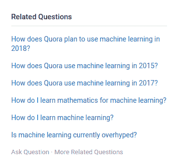
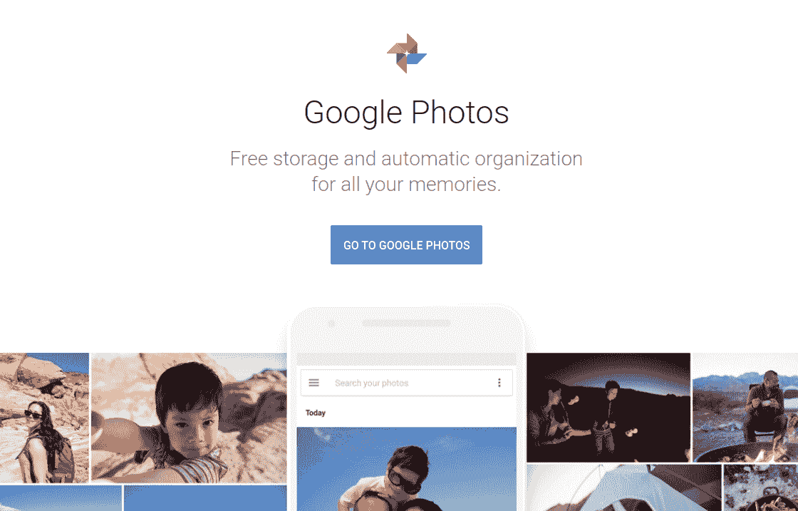
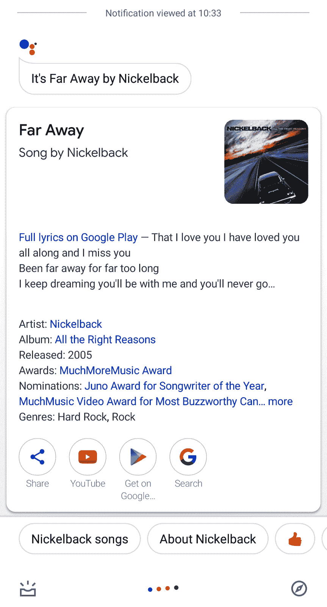

# 附录：网络上深度学习的成功故事与新兴领域

了解他人如何使用任何技术通常是很重要的，这样可以了解其应用的规模及其所能承诺的投资回报。本章阐述了一些最著名的网站，它们的产品在很大程度上依赖于深度学习的强大功能。本章还讨论了一些可以通过深度学习提升的网页开发关键研究领域。本章将帮助您更深入地了解网络技术与深度学习的融合，并激励您创造自己的智能网页应用。

本章分为两个主要部分：

+   一些成功的案例，诸如 Quora 和 Duolingo 等组织，它们已经将深度学习应用于其产品

+   深度学习中的一些关键新兴领域，如阅读理解、音频搜索等

让我们开始吧！

# 成功案例

在这一部分，我们将简要回顾一些在其核心使用人工智能（AI）来推动业务增长的产品/公司。在这里值得注意的是，您的整个产品或服务是否基于任何 AI 技术或算法并不重要；只要在某个小部分或某个特定功能上使用了 AI，就足以提升产品的实用性，从而促使客户广泛使用您的产品。有时，您的产品可能根本没有任何 AI 功能，而是仅仅使用它来进行数据分析，提出预期的趋势，以确保您的产品符合未来的趋势。让我们看看这些公司是如何通过这些方法取得成功的。

# Quora

在 Quora 之前，已经存在了大量的问答网站和论坛。在互联网历史的某个时期，在线论坛被认为是无法再改进的东西；然而，Quora 通过一些利用深度学习的调整，使其能够迅速超越其他论坛。以下是它们实施的一些调整：

+   他们启用了“提问即答”功能，允许贡献者在问题发布后立即请求答案。这使得问题更容易接触到相关的学科专家，专家们迅速回答问题，提升了平台的响应速度和准确性。

+   他们通过**自然语言处理**（**NLP**）屏蔽掉了那些写得不好的问题和答案。这引入了自动化管理的论坛概念，使内容更加优质。

+   对于任何给定的问答线程，标签和相关文章的确定使得发现相似问题变得容易。这使得 Quora 用户花费大量时间阅读与自己问题相似的问题的答案，只为了从每一个答案中找到新的信息。

+   Quora Digest 是一个高度策划的文章集合，基于用户兴趣，几乎总是能够成功吸引用户重新回到平台：

Quora 曾一度成为（并且至今仍然是）互联网上最具吸引力的社交平台之一。它们将一个简单的问答网站，通过深度学习，转变成了一个令人惊叹的平台。你可以通过 [`quora.com`](https://quora.com) 访问这个平台。

# Duolingo

学习新语言一直是一项艰难的任务。2012 年 Duolingo 登场时，带来了一个开始变得越来越重要的术语——人工智能。它们将像记忆单词和语法规则这样枯燥的任务，转化为针对每个用户有不同反馈的迷你游戏。Duolingo 的人工智能考虑到了人类思维的时间性。他们研究了一个人学习的单词，可能会多快忘记的情况。他们称这一概念为半衰期回归，并利用这一概念加强用户可能会在任何时刻遗忘的单词的记忆。

这一点对 Duolingo 非常有利，使其成为移动应用商店中最受欢迎的应用之一。他们的网站也是非传统设计的经典例子，并且得到了良好的反馈。你可以通过 [`duolingo.com`](https://duolingo.com) 了解更多关于 Duolingo 的信息。

# Spotify

音频播放器早已存在了很长时间，但没有人能比得上 Spotify 带来的体验。Spotify 使用深度学习来确定用户在任何时刻想听的歌曲。多年来，他们的人工智能取得了飞跃发展，根据用户最近播放的歌曲，推荐完整的播放列表。Spotify 的迅速崛起激发了大量试图模仿并赶超其人气的产品。

Spotify 还推出了一个非常强大的功能——基于音频样本搜索歌曲。这一功能迅速成为热门，许多用户正是因为无法记住一首喜欢的歌名而下载了 Spotify，只希望能快速找到那首歌的名字。你只需要录制附近播放的歌曲的音频，然后将其输入 Spotify，就能知道那首歌的名字。

# Google 搜索/照片

虽然云端图像存储是 Dropbox、Google Photos 等公司早已提供的解决方案，但 Google Photos 通过引入 AI（人工智能）彻底改变了云端图像存储领域。由于其惊人的功能，Google Photos 被全球数十亿人采用，以下是其中一些特色：

+   **人脸识别：** 这个功能早在 Google 的另一个产品 Picasa 中就已出现，Picasa 被认为是 Google Photos 的前身。

+   **向导：** Google Photos 会自动确定哪些照片是在同一事件或场合拍摄的。然后，它尝试创建有关相关图片的电影或简单地触及图片，使它们看起来更好。有时，Google Photos 还会使用看起来处于一系列中的照片创建动画 GIF。

+   **文档和表情包的识别：** Google Photos 建议其用户归档旧文档、截图和表情包。这在节省设备存储方面非常有帮助：

Google Photos 因其在幕后使用深度学习而成为个人在线画廊的市场领导者。如果你想了解更多，请访问[`photos.google.com`](https://photos.google.com)。

在这一部分，我们看了一些深度学习极大影响的产品。在下一部分，我们将看到一些深度学习似乎带来了许多积极结果的新兴领域。

# 关键新兴领域

在前面的几节中，我们看到了几家公司如何整合基于深度学习的技术以改进其产品。在本节中，我们将讨论一些当前正在进行密集研究的领域，并通过 Web 开发的视角看到它们的影响力。

# 音频搜索

假设你在酒吧里，你喜欢现场乐队演奏的歌曲。在你的脑海中，你知道你以前听过那首歌，但是你想不起歌名。如果有一个系统能够听歌并搜索它的名字，那不是很棒吗？欢迎来到音频搜索引擎的世界！

目前有许多现有的音频搜索引擎可用，其中由 Google Assistant 提供的 Sound Search（声音搜索）是其中最受欢迎的之一。你也许还想看看 Shazam。在以下截图中，你可以看到通过 Sound Search 产生的一个音频搜索结果示例：

要使系统根据接收到的音频信号执行音频搜索，系统首先需要处理信号，这被称为音频信号处理。然后，系统将该处理后的信号与其现有的数以万计的歌曲数据库进行比较。在信号甚至与现有数据库进行比较之前，它会使用神经网络给出特定的表示，这通常被称为指纹；然而，这仍然是一个活跃的研究领域，我强烈建议你阅读文章[`ai.googleblog.com/2018/09/googles-next-generation-music.html`](https://ai.googleblog.com/2018/09/googles-next-generation-music.html)以获取这些技术的更详细概述。

# 阅读理解

你是否曾希望搜索引擎能直接给出搜索查询的答案，而不是寻找可能包含答案的相关链接？好吧，如果系统具备阅读理解能力，现在已经有可能实现这一目标。我们来看一下下面的截图，看看这是什么意思：

如果你仔细观察，我们甚至没有将声明 *Sachin Tendulkar's father* 以问题的形式表达。现代系统足够强大，可以自行推断出这样的属性。

现在，为了更好地理解具备阅读理解能力的系统（或机器）的深度，假设你在进行网络搜索后想找到问题的答案。这是你需要经过的多步骤过程：

1.  你从相关关键词出发，制定搜索查询，搜索引擎进行搜索。

1.  然后，搜索引擎会给出一份与给定搜索查询相关的文档列表。

1.  你浏览这些文档，根据你的理解整理其中的信息，然后得出结论。

仍然有一些步骤是人工的，问题依然存在——我们能否设计出一个系统，自动化地为我们找到合适的答案？现有的搜索引擎会为给定的搜索查询提供相关文档的列表，但不足以开发出能够自动生成答案的系统。简而言之，这样的系统需要做到以下几点：

1.  遵循相关文档的结构。

1.  从这些文档中提取出有意义的内容。

1.  得出最终答案。

让我们稍微简化一下这个问题。假设对于一个给定的问题，我们已经有了一份相关段落的列表，现在我们需要开发一个系统，使其能够从这些段落中提取有意义的信息，并给出这个问题的明确答案。在阅读理解系统中，神经网络通常学习捕捉给定问题和相关段落之间的深层语义关系，然后生成最终答案。

正如你可能已经发现的，像 Google 搜索、Bing 等搜索引擎已经具备了阅读理解能力。

# 社交媒体上的假新闻检测

随着社交媒体的迅速崛起，新闻从未匮乏。社交媒体已经轻松地成为我们获取新闻的主要来源之一；然而，它的真实性往往得不到保证。在社交媒体上你遇到的并非每一篇新闻都是可信的，可以安全地说，绝大多数新闻都是假的。这一现象的后果可能非常严重，确实可能引发滥用、暴力等行为。

有一些组织和机构正在努力应对这一问题，并让人们意识到新闻文章的真实性。考虑到我们每天在社交媒体上看到的新闻量，这项任务可能非常繁琐。那么，问题变成了，我们能否利用机器学习的力量自动检测虚假新闻？事实上，这是一个活跃的研究领域，目前尚未出现已知的能大规模解决这一问题的实际应用。

然而，以下是一些不同团队进行的研究，他们使用了经典的机器学习和深度学习方法：

+   *社交媒体网络中的虚假新闻检测*：[`www.sciencedirect.com/science/article/pii/S1877050918318210`](https://www.sciencedirect.com/science/article/pii/S1877050918318210)

+   *使用几何深度学习的社交媒体虚假新闻检测*：[`arxiv.org/abs/1902.06673`](https://arxiv.org/abs/1902.06673)

我们鼓励你查看这篇调查论文：[`arxiv.org/pdf/1812.00315.pdf`](https://arxiv.org/pdf/1812.00315.pdf)，它提供了关于各种虚假新闻检测技术的全面指南，并讨论了相关研究。另一方面，一家名为 Varia 的德国初创公司（[`www.varia.media/`](https://www.varia.media/)）正在以独特的方式解决虚假新闻问题。他们并不是直接检测新闻的真实性，而是提供某些新闻项目的不同视角。换句话说，他们把“视角”作为一种服务提供。如果你想了解更多，绝对应该去看看：[`alpha.varia.media/`](https://alpha.varia.media/)。

# 总结

在本书的最后一章中，我们尝试激励你构建下一个深度学习项目，并在网络平台上应用它。你可能对更多此类公司如何通过人工智能转型并主导市场的故事感兴趣。如果你仔细看看你访问的几乎每个网站，你会发现它们都以某种方式使用了人工智能和深度学习元素，无论是推荐系统还是广告（广告本质上也是一种推广推荐系统）。随后，我们讨论了深度学习领域即将出现的主题，这些主题在不久的将来将在网站上得到实现。如果你能基于这些主题中的任何一个想出一项服务，那将是非常棒的！
