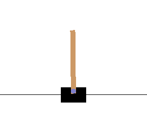
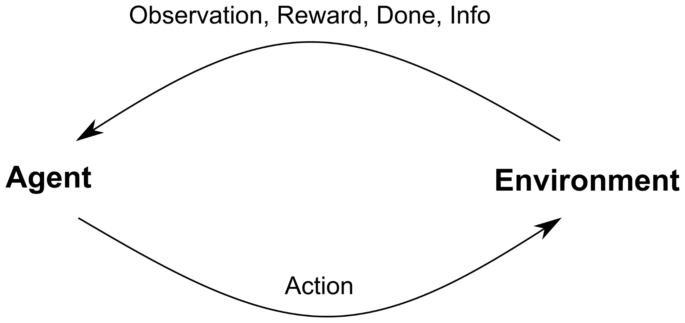
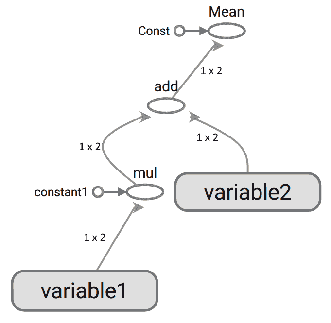
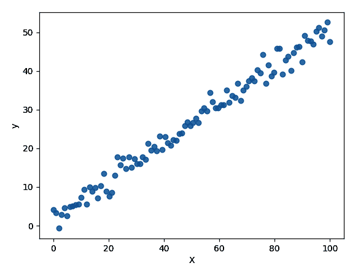
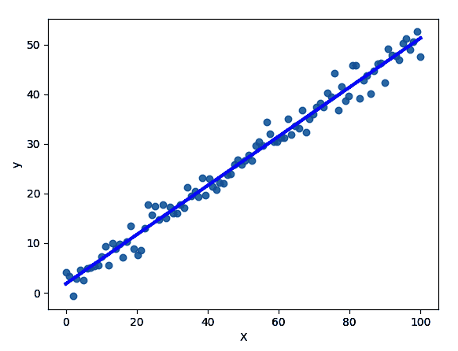
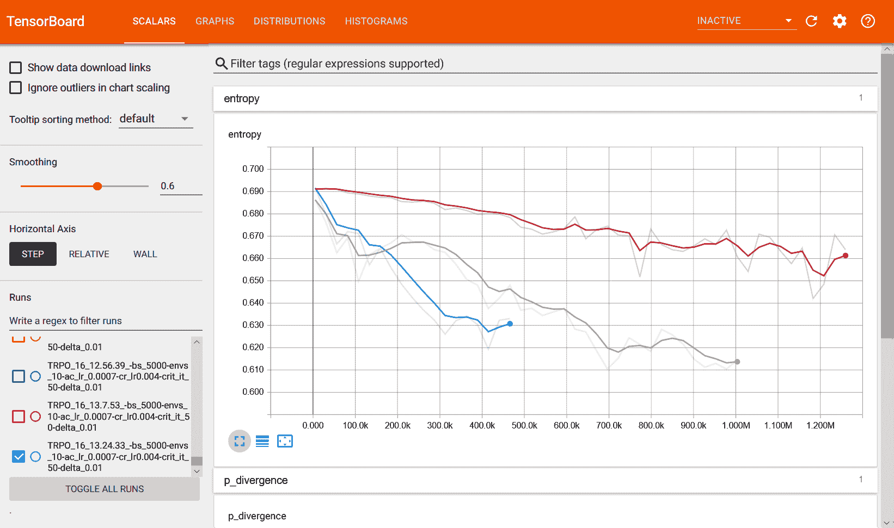
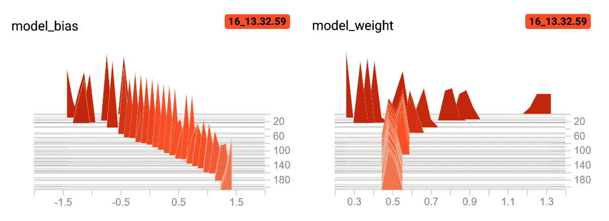
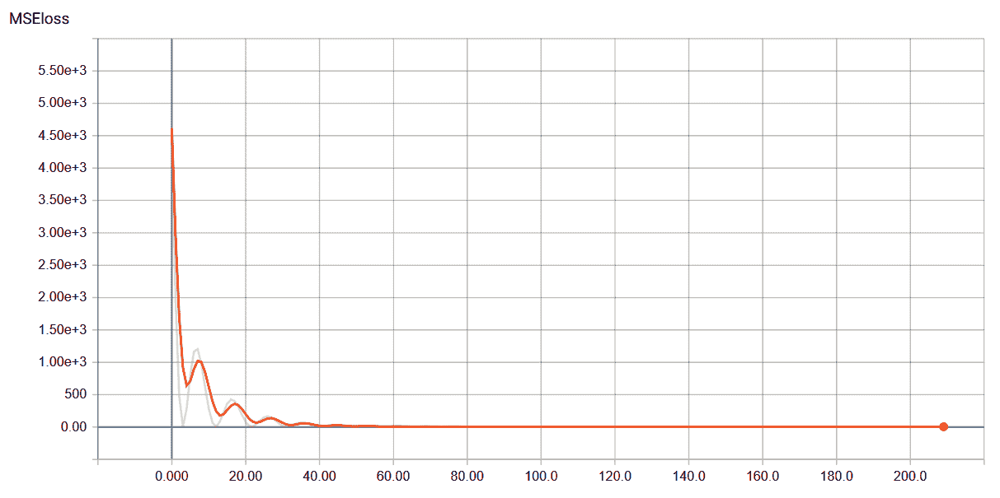
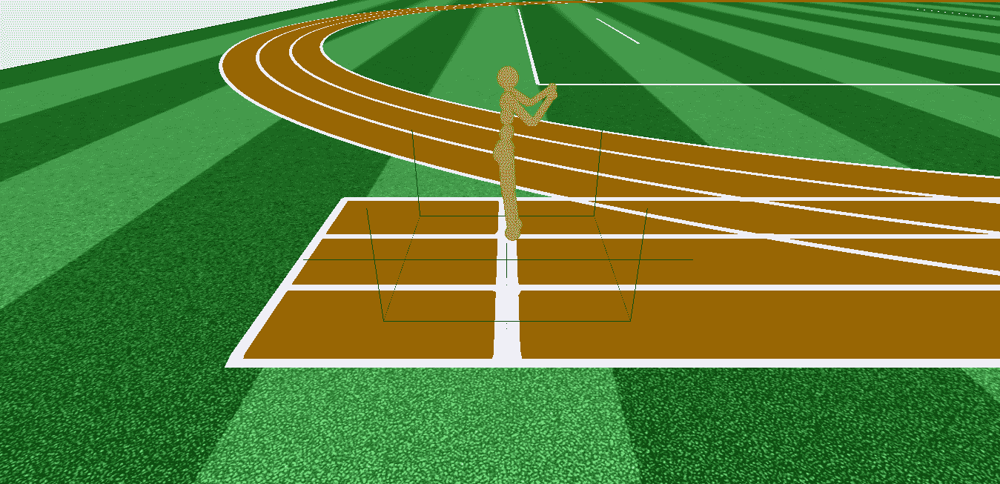

# 第二章：实现 RL 循环和 OpenAI Gym

在每个机器学习项目中，算法从训练数据集中学习规则和指令，以更好地执行任务。在**强化学习**（**RL**）中，算法被称为代理程序，并从环境提供的数据中学习。在这里，环境是一个连续提供信息的来源，根据代理的动作返回数据。由于环境返回的数据可能是潜在无限的，因此在训练时会涉及许多监督设置中出现的概念和实际差异。但是，对于本章的目的，重要的是强调不同的环境不仅提供不同的任务完成，还可能具有不同类型的输入、输出和奖励信号，同时需要在每种情况下调整算法。例如，机器人可以通过视觉输入（如 RGB 摄像头）或离散的内部传感器感知其状态。

在本章中，您将设置编写强化学习算法所需的环境，并构建您的第一个算法。尽管这只是一个玩 CartPole 的简单算法，但在深入研究更高级别的强化学习算法之前，它提供了一个有用的基准。此外，在后续章节中，您将编写许多深度神经网络，因此在这里我们将简要回顾 TensorFlow 并介绍 TensorBoard，一个可视化工具。

本书中几乎所有使用的环境都基于 OpenAI 开源的接口**Gym**。因此，我们将介绍它并使用其中一些内置环境。然后，在深入探讨后续章节中的强化学习算法之前，我们将列出并解释多个开源环境的优势和差异。这样一来，您将对可以使用强化学习解决的问题有一个广泛而实用的概述。

本章将涵盖以下主题：

+   设置环境

+   OpenAI Gym 和 RL 循环

+   TensorFlow

+   TensorBoard

+   强化学习环境的种类

# 设置环境

以下是创建深度强化学习算法所需的三个主要工具：

+   **编程语言**：Python 是开发机器学习算法的首选，因其简单性和建立在其周围的第三方库。

+   **深度学习框架**：在本书中，我们使用 TensorFlow，因为如同我们将在*TensorFlow*部分看到的那样，它可扩展、灵活且非常表达力强。尽管如此，也可以使用许多其他框架，包括 PyTorch 和 Caffe。

+   **环境**：在本书中，我们将使用许多不同的环境来演示如何处理不同类型的问题，并突出强化学习算法的优势。

在本书中，我们使用 Python 3.7，但所有 3.5 以上的版本也应该可以工作。我们还假设您已经安装了`numpy`和`matplotlib`。

如果你还没有安装 TensorFlow，可以通过他们的网站安装，或者在终端窗口中输入以下命令：

```py
$ pip install tensorflow
```

或者，如果你的机器有 GPU，你可以输入以下命令：

```py
$ pip install tensorflow-gpu
```

你可以在 GitHub 仓库中找到所有的安装说明和与本章相关的练习，仓库地址是：[`github.com/PacktPublishing/Reinforcement-Learning-Algorithms-with-Python`](https://github.com/PacktPublishing/Reinforcement-Learning-Algorithms-with-Python)

现在，让我们来看看如何安装这些环境。

# 安装 OpenAI Gym

OpenAI Gym 提供了一个通用接口以及多种不同的环境。

要安装它，我们将使用以下命令。

在 OSX 上，我们可以使用以下命令：

```py
$ brew install cmake boost boost-python sdl2 swig wget
```

在 Ubuntu 16.04 上，我们将使用以下命令：

```py
$ apt-get install -y python-pyglet python3-opengl zlib1g-dev libjpeg-dev patchelf cmake swig libboost-all-dev libsdl2-dev libosmesa6-dev xvfb ffmpeg
```

在 Ubuntu 18.04 上，我们将使用以下命令：

```py
$ sudo apt install -y python3-dev zlib1g-dev libjpeg-dev cmake swig python-pyglet python3-opengl libboost-all-dev libsdl2-dev libosmesa6-dev patchelf ffmpeg xvfb 
```

在运行完前面的命令之后，针对你的操作系统，可以使用以下命令：

```py
$ git clone https://github.com/openai/gym.git 
$ cd gym
$ pip install -e '.[all]'
```

某些 Gym 环境还需要安装`pybox2d`：

```py
$ git clone https://github.com/pybox2d/pybox2d [](https://github.com/pybox2d/pybox2d) $ cd pybox2d
$ pip install -e .
```

# 安装 Roboschool

我们感兴趣的最终环境是 Roboschool，它是一个机器人模拟器。它容易安装，但如果遇到任何错误，可以查看其 GitHub 仓库：[`github.com/Roboschool/roboschool`](https://github.com/Roboschool/roboschool)

```py
$ pip install roboschool
```

# OpenAI Gym 与强化学习周期

由于强化学习需要一个代理和环境相互作用，第一个可能想到的例子是地球——我们所生活的物理世界。不幸的是，目前它仅在少数几个案例中使用。由于当前算法的问题来自于代理必须与环境进行大量互动才能学习到良好的行为，这可能需要数百、数千甚至数百万次操作，导致所需时间过长，难以实现。一种解决方案是使用模拟环境来启动学习过程，最后才在真实世界中进行微调。这种方法比仅从周围世界中学习要好得多，但仍然需要缓慢的现实世界交互。然而，在许多情况下，任务可以完全模拟。为了研究和实现强化学习算法，游戏、视频游戏和机器人模拟器是完美的测试平台，因为它们的解决方案需要规划、策略和长期记忆等能力。此外，游戏有明确的奖励系统，可以在人工环境（计算机）中完全模拟，允许快速交互，从而加速学习过程。正因为如此，在本书中，我们将主要使用视频游戏和机器人模拟器来展示强化学习算法的能力。

OpenAI Gym 是一个开源工具包，用于开发和研究 RL 算法，旨在提供一个统一的环境接口，同时提供一个庞大且多样化的环境集合。这些环境包括 Atari 2600 游戏、连续控制任务、经典控制理论问题、模拟机器人目标导向任务以及简单的文本游戏。由于其通用性，许多第三方创建的环境都使用 Gym 接口。

# 开发一个 RL 循环

以下代码块展示了一个基本的 RL 循环。这本质上让 RL 模型进行 10 步操作，并在每一步渲染游戏：

```py
import gym

# create the environment 
env = gym.make("CartPole-v1")
# reset the environment before starting
env.reset()

# loop 10 times
for i in range(10):
    # take a random action
    env.step(env.action_space.sample())
    # render the game
   env.render()

# close the environment
env.close()

```

这将导致以下输出：



图 2.1：CartPole 渲染

让我们仔细看看代码。它通过创建一个名为 `CartPole-v1` 的新环境开始，这是一个经典的用于控制理论问题的游戏。然而，在使用它之前，环境需要通过调用 `reset()` 进行初始化。初始化后，循环执行 10 次。在每次迭代中，`env.action_space.sample()` 会随机选择一个动作，通过 `env.step()` 执行该动作，并通过 `render()` 方法显示结果；也就是游戏的当前状态，如前面的截图所示。最后，环境通过调用 `env.close()` 被关闭。

如果以下代码输出弃用警告，不用担心；这些警告是用来通知你某些函数已被更改，代码仍然能够正常运行。

这个循环对于所有使用 Gym 接口的环境都是相同的，但现在，智能体只能进行随机动作，而没有任何反馈，这是任何 RL 问题中至关重要的部分。

在 RL 中，你可能会看到**状态**和**观察**这两个术语几乎可以互换使用，但它们并不相同。当所有与环境相关的信息都被编码在其中时，我们称之为状态。当只有部分实际环境状态对智能体可见时，我们称之为观察，例如机器人的感知。为了简化这一点，OpenAI Gym 始终使用“观察”一词。

以下图示显示了循环的流程：



图 2.2：根据 OpenAI Gym 的基本 RL 循环。环境返回下一个状态、奖励、完成标志和一些附加信息。

实际上，`step()` 方法返回四个变量，它们提供关于与环境交互的信息。上面的图示展示了代理与环境之间的循环，以及交换的变量；即 **观察**、**奖励**、**完成** 和 **信息**。**观察** 是一个表示环境新观察（或状态）的对象。**奖励** 是一个浮动数值，表示上一个动作获得的奖励数值。**完成** 是一个布尔值，用于表示任务是否是阶段性任务；也就是交互次数有限的任务。每当 `done` 为 `True` 时，意味着该回合已经结束，环境应当被重置。例如，`done` 为 `True` 时，表示任务已完成或代理已失败。另一方面，**信息** 是一个字典，提供有关环境的额外信息，但通常不会使用。

如果你从未听说过 CartPole，它是一款目标是平衡作用在水平小车上的摆锤的游戏。每当摆锤处于竖直位置时，都会获得 +1 的奖励。游戏结束时，如果摆锤失去平衡，或者它成功平衡超过 200 个时间步（累积奖励最大为 200），游戏就会结束。

我们现在可以创建一个更完整的算法，使用以下代码来进行 10 局游戏，并打印每局游戏的累积奖励：

```py
import gym

# create and initialize the environment
env = gym.make("CartPole-v1")
env.reset()

# play 10 games
for i in range(10):
    # initialize the variables
    done = False
    game_rew = 0

    while not done:
        # choose a random action
        action = env.action_space.sample()
        # take a step in the environment
        new_obs, rew, done, info = env.step(action)
        game_rew += rew

        # when is done, print the cumulative reward of the game and reset the environment
        if done:
            print('Episode %d finished, reward:%d' % (i, game_rew))
            env.reset()
```

输出将类似于以下内容：

```py
Episode: 0, Reward:13
Episode: 1, Reward:16
Episode: 2, Reward:23
Episode: 3, Reward:17
Episode: 4, Reward:30
Episode: 5, Reward:18
Episode: 6, Reward:14
Episode: 7, Reward:28
Episode: 8, Reward:22
Episode: 9, Reward:16
```

下表显示了 `step()` 方法在游戏最后四个动作中的输出：

| **观察** | **奖励** | **完成** | **信息** |
| --- | --- | --- | --- |
| [-0.05356921, -0.38150626, 0.12529277, 0.9449761 ] | 1.0  | False  | {} |
| [-0.06119933, -0.57807287, 0.14419229, 1.27425449] | 1.0 | False  | {} |
| [-0.07276079, -0.38505429, 0.16967738, 1.02997704] | 1.0 | False  | {} |
| [-0.08046188, -0.58197758, 0.19027692, 1.37076617] | 1.0 | False  | {} |
| [-0.09210143, -0.3896757, 0.21769224, 1.14312384] | 1.0 | True | {} |

请注意，环境的观察以 1 x 4 的数组进行编码；正如我们预期的那样，奖励始终为 1；并且只有在游戏结束时（即最后一行），`done` 为 `True`。此外，**信息**在此情况下为空。

在接下来的章节中，我们将创建代理，根据摆锤的当前状态做出更智能的决策来玩 CartPole 游戏。

# 习惯于空间

在 OpenAI Gym 中，动作和观察大多是 `Discrete` 或 `Box` 类的实例。这两个类表示不同的空间。`Box` 代表一个 *n* 维数组，而 `Discrete` 是一个允许固定范围非负数的空间。在前面的表格中，我们已经看到，CartPole 的观察由四个浮动数值编码，意味着它是 `Box` 类的一个实例。可以通过打印 `env.observation_space` 变量来检查观察空间的类型和维度：

```py
import gym

env = gym.make('CartPole-v1')
print(env.observation_space)

```

确实，正如我们预期的那样，输出如下：

```py
>>  Box(4,)
```

在本书中，我们通过在`print()`输出的文本前添加`>>`来标记输出。

同样，可以检查动作空间的维度：

```py
print(env.action_space)
```

这将产生以下输出：

```py
>> Discrete(2)
```

特别地，`Discrete(2)`意味着动作的值可以是`0`或`1`。实际上，如果我们使用前面示例中的采样函数，我们将获得`0`或`1`（在 CartPole 中，这意味着向左或向右*）*：

```py
print(env.action_space.sample())
>> 0
print(env.action_space.sample())
>> 1
```

`low`和`high`实例属性返回`Box`空间允许的最小值和最大值：

```py
print(env.observation_space.low)
>> [-4.8000002e+00 -3.4028235e+38 -4.1887903e-01 -3.4028235e+38]
print(env.observation_space.high)
>> [4.8000002e+00 3.4028235e+38 4.1887903e-01 3.4028235e+38]
```

# 使用 TensorFlow 开发机器学习模型

TensorFlow 是一个执行高性能数值计算的机器学习框架。TensorFlow 之所以如此流行，得益于其高质量和丰富的文档、能够轻松在生产环境中部署模型的能力，以及友好的 GPU 和 TPU 接口。

TensorFlow，为了便于机器学习模型的开发和部署，提供了许多高级 API，包括 Keras、Eager Execution 和 Estimators。这些 API 在许多场合非常有用，但为了开发强化学习算法，我们将只使用低级 API。

现在，让我们立即使用**TensorFlow**编写代码。以下代码行执行了常量`a`和`b`的加法，`a`和`b`是使用`tf.constant()`创建的：

```py
import tensorflow as tf

# create two constants: a and b
a = tf.constant(4)
b = tf.constant(3)

# perform a computation
c = a + b

# create a session
session = tf.Session()
# run the session. It computes the sum
res = session.run(c)
print(res)
```

TensorFlow 的一个特点是，它将所有计算表达为一个计算图，首先需要定义该图，之后才能执行。只有在执行后，结果才会可用。在以下示例中，在操作`c = a + b`之后，`c`并不持有最终值。实际上，如果你在创建会话之前打印`c`，你将获得以下内容：

```py
>> Tensor("add:0", shape=(), dtype=int32)
```

这是`c`变量的类，而不是加法的结果。

此外，执行必须在通过`tf.Session()`实例化的会话内进行。然后，为了执行计算，操作必须作为输入传递给刚创建的会话的`run`函数。因此，为了实际计算图并最终求和`a`和`b`，我们需要创建一个会话，并将`c`作为输入传递给`session.run`：

```py
session = tf.Session()
res = session.run(c)
print(res)

>> 7
```

如果你正在使用 Jupyter Notebook，请确保通过运行`tf.reset_default_graph()`来重置之前的图。

# 张量

TensorFlow 中的变量表示为张量，是任何维度数组。张量有三种主要类型——`tf.Variable`、`tf.constant`和`tf.placeholder`。除了`tf.Variable`，其他张量都是不可变的。

要检查张量的形状，我们将使用以下代码：

```py
# constant
a = tf.constant(1)
print(a.shape)
>> ()

# array of five elements
b = tf.constant([1,2,3,4,5])
print(b.shape)
>> (5,)
```

张量的元素非常容易访问，机制与 Python 中使用的类似：

```py
a = tf.constant([1,2,3,4,5])
first_three_elem = a[:3]
fourth_elem = a[3]

sess = tf.Session()
print(sess.run(first_three_elem))

>> array([1,2,3])

print(sess.run(fourth_elem))

>> 4
```

# 常量

如我们已经看到的，常量是不可变的张量类型，可以使用`tf.constant`轻松创建：

```py
a = tf.constant([1.0, 1.1, 2.1, 3.1], dtype=tf.float32, name='a_const')
print(a)

>> Tensor("a_const:0", shape=(4,), dtype=float32)
```

# 占位符

占位符是一个张量，在运行时被提供输入。通常，占位符作为模型的输入。在运行时传递给计算图的每个输入都通过`feed_dict`进行传递。`feed_dict`是一个可选参数，允许调用者覆盖图中张量的值。在以下代码片段中，`a`占位符的值被`[[0.1,0.2,0.3]]`覆盖：

```py
import tensorflow as tf

a = tf.placeholder(shape=(1,3), dtype=tf.float32)
b = tf.constant([[10,10,10]], dtype=tf.float32)

c = a + b

sess = tf.Session()
res = sess.run(c, feed_dict={a:[[0.1,0.2,0.3]]})
print(res)

>> [[10.1 10.2 10.3]]
```

如果输入的第一维的大小在创建图时尚不确定，TensorFlow 可以处理它。只需将其设置为`None`：

```py
import tensorflow as tf
import numpy as np

# NB: the first dimension is 'None', meaning that it can be of any length
a = tf.placeholder(shape=(None,3), dtype=tf.float32)
b = tf.placeholder(shape=(None,3), dtype=tf.float32)

c = a + b
print(a)

>> Tensor("Placeholder:0", shape=(?, 3), dtype=float32)

sess = tf.Session()
print(sess.run(c, feed_dict={a:[[0.1,0.2,0.3]], b:[[10,10,10]]}))

>> [[10.1 10.2 10.3]]

v_a = np.array([[1,2,3],[4,5,6]])
v_b = np.array([[6,5,4],[3,2,1]])
print(sess.run(c, feed_dict={a:v_a, b:v_b}))

>> [[7\. 7\. 7.]
 [7\. 7\. 7.]]
```

这个功能在训练示例数量最初不确定时特别有用。

# 变量

**变量**是一个可变的张量，可以使用优化器进行训练。例如，它们可以是神经网络的权重和偏置所构成的自由变量。

现在，我们将创建两个变量，一个使用均匀初始化，另一个使用常数值初始化：

```py
import tensorflow as tf
import numpy as np

# variable initialized randomly
var = tf.get_variable("first_variable", shape=[1,3], dtype=tf.float32)

# variable initialized with constant values
init_val = np.array([4,5])
var2 = tf.get_variable("second_variable", shape=[1,2], dtype=tf.int32, initializer=tf.constant_initializer(init_val))

# create the session
sess = tf.Session()
# initialize all the variables
sess.run(tf.global_variables_initializer())

print(sess.run(var))

>> [[ 0.93119466 -1.0498083  -0.2198658 ]]

print(sess.run(var2))

>> [[4 5]]
```

变量在调用`global_variables_initializer()`之前不会被初始化。

通过这种方式创建的所有变量都会被设置为`可训练`，意味着图可以修改它们，例如，在优化操作之后。也可以将变量设置为不可训练，如下所示：

```py
var2 = tf.get_variable("variable", shape=[1,2], trainable=False, dtype=tf.int32)
```

访问所有变量的简便方法如下：

```py
print(tf.global_variables())

>> [<tf.Variable 'first_variable:0' shape=(1, 3) dtype=float32_ref>, <tf.Variable 'second_variable:0' shape=(1, 2) dtype=int32_ref>]
```

# 创建图表

**图**表示低级计算，这些计算基于操作之间的依赖关系。在 TensorFlow 中，首先定义一个图，然后创建一个会话来执行图中的操作。

TensorFlow 中图的构建、计算和优化方式支持高度的并行性、分布式执行和可移植性，这些都是构建机器学习模型时非常重要的属性。

为了让你了解 TensorFlow 内部生成的计算图的结构，以下程序将生成如下图所示的计算图：

```py
import tensorflow as tf
import numpy as np

const1 = tf.constant(3.0, name='constant1')

var = tf.get_variable("variable1", shape=[1,2], dtype=tf.float32)
var2 = tf.get_variable("variable2", shape=[1,2], trainable=False, dtype=tf.float32)

op1 = const1 * var
op2 = op1 + var2
op3 = tf.reduce_mean(op2)

sess = tf.Session()
sess.run(tf.global_variables_initializer())
sess.run(op3)
```

这将产生以下图表：



图 2.3：计算图示例

# 简单线性回归示例

为了更好地理解所有概念，我们现在创建一个简单的线性回归模型。首先，我们必须导入所有库并设置随机种子，这对于 NumPy 和 TensorFlow 都是必要的（这样我们得到的结果都是相同的）：

```py
import tensorflow as tf
import numpy as np
from datetime import datetime

np.random.seed(10)
tf.set_random_seed(10)
```

然后，我们可以创建一个由 100 个示例组成的合成数据集，如下图所示：



图 2.4：线性回归示例中使用的数据集

因为这是一个线性回归示例，*y = W * X + b*，其中*W*和*b*是任意值。在这个示例中，我们设置`W` = `0.5`和`b` = `1.4`。此外，我们还加入了一些正态随机噪声：

```py
W, b = 0.5, 1.4
# create a dataset of 100 examples
X = np.linspace(0,100, num=100)
# add random noise to the y labels
y = np.random.normal(loc=W * X + b, scale=2.0, size=len(X))
```

下一步是创建输入和输出的占位符，以及线性模型的权重和偏置变量。在训练过程中，这两个变量将被优化，使其尽可能与数据集的权重和偏置相似：

```py
# create the placeholders
x_ph = tf.placeholder(shape=[None,], dtype=tf.float32)
y_ph = tf.placeholder(shape=[None,], dtype=tf.float32)

# create the variables
v_weight = tf.get_variable("weight", shape=[1], dtype=tf.float32)
v_bias = tf.get_variable("bias", shape=[1], dtype=tf.float32)
```

然后，我们构建了定义线性操作和 **均方误差** (**MSE**) 损失的计算图：

```py
# linear computation
out = v_weight * x_ph + v_bias

# compute the mean squared error
loss = tf.reduce_mean((out - y_ph)**2)
```

现在，我们可以实例化优化器并调用 `minimize()` 来最小化 MSE 损失。`minimize()` 首先计算变量（`v_weight` 和 `v_bias`）的梯度，然后应用梯度更新变量：

```py
opt = tf.train.AdamOptimizer(0.4).minimize(loss)
```

现在，让我们创建一个会话并初始化所有变量：

```py
session = tf.Session()
session.run(tf.global_variables_initializer())
```

训练通过多次运行优化器并将数据集输入图表来完成。为了跟踪模型的状态，MSE 损失和模型变量（权重和偏差）每 40 个 epochs 打印一次：

```py
# loop to train the parameters
for ep in range(210):
    # run the optimizer and get the loss
    train_loss, _ = session.run([loss, opt], feed_dict={x_ph:X, y_ph:y})

    # print epoch number and loss
    if ep % 40 == 0:
        print('Epoch: %3d, MSE: %.4f, W: %.3f, b: %.3f' % (ep, train_loss, session.run(v_weight), session.run(v_bias)))
```

最后，我们可以打印变量的最终值：

```py
print('Final weight: %.3f, bias: %.3f' % (session.run(v_weight), session.run(v_bias)))
```

输出将类似于以下内容：

```py
>>  Epoch: 0, MSE: 4617.4390, weight: 1.295, bias: -0.407
 Epoch: 40, MSE: 5.3334, weight: 0.496, bias: -0.727
 Epoch: 80, MSE: 4.5894, weight: 0.529, bias: -0.012
 Epoch: 120, MSE: 4.1029, weight: 0.512, bias: 0.608
 Epoch: 160, MSE: 3.8552, weight: 0.506, bias: 1.092
 Epoch: 200, MSE: 3.7597, weight: 0.501, bias: 1.418
 Final weight: 0.500, bias: 1.473
```

在训练阶段，可以看到 MSE 损失会逐渐减少到一个非零值（大约为 3.71）。这是因为我们在数据集中添加了随机噪声，防止了 MSE 达到完美的 0 值。

同时，如预期的那样，关于模型方法的权重和偏差，`0.500`和`1.473`的值正是构建数据集时围绕的值。下图中可见的蓝色线条是训练好的线性模型的预测值，而这些点则是我们的训练示例：



图 2.5：线性回归模型预测

本章中所有颜色引用的详细信息，请参考颜色图片包：[`www.packtpub.com/sites/default/files/downloads/9781789131116_ColorImages.pdf`](http://www.packtpub.com/sites/default/files/downloads/9781789131116_ColorImages.pdf.)。

# 介绍 TensorBoard

在训练模型时，跟踪变量的变化可能是一项繁琐的工作。例如，在线性回归示例中，我们通过每 40 个 epochs 打印 MSE 损失和模型的参数来跟踪它们。随着算法复杂性的增加，需监控的变量和指标也会增多。幸运的是，这时 TensorBoard 就派上了用场。

TensorBoard 是一套可视化工具，能够用于绘制指标、可视化 TensorFlow 图表以及展示额外信息。一个典型的 TensorBoard 页面类似于以下截图所示：



图 2.6：标量 TensorBoard 页面

TensorBoard 与 TensorFlow 代码的集成非常简单，只需对代码做少量调整。特别是，为了使用 TensorBoard 可视化 MSE 损失随时间变化，并监控线性回归模型的权重和偏差，首先需要将损失张量附加到 `tf.summary.scalar()`，并将模型的参数附加到 `tf.summary.histogram()`*。以下代码片段应添加在优化器调用之后：

```py
tf.summary.scalar('MSEloss', loss)
tf.summary.histogram('model_weight', v_weight)
tf.summary.histogram('model_bias', v_bias)
```

然后，为了简化过程并将其作为一个总结处理，我们可以将它们合并：

```py
all_summary = tf.summary.merge_all()
```

此时，我们需要实例化一个`FileWriter`实例，它将把所有摘要信息记录到文件中：

```py
now = datetime.now()
clock_time = "{}_{}.{}.{}".format(now.day, now.hour, now.minute, now.second)
file_writer = tf.summary.FileWriter('log_dir/'+clock_time, tf.get_default_graph())
```

前两行通过当前的日期和时间创建一个独特的文件名。在第三行，文件的路径和 TensorFlow 图形会传递给`FileWriter()`。第二个参数是可选的，表示要可视化的图形。

最后的修改是在训练循环中进行的，通过将之前的行`train_loss, _ = session.run(..)`替换为以下内容：

```py
train_loss, _, train_summary = session.run([loss, opt, all_summary], feed_dict={x_ph:X, y_ph:y})
file_writer.add_summary(train_summary, ep)
```

首先，在当前会话中执行`all_summary`，然后将结果添加到`file_writer`中保存到文件。这一过程将运行之前合并的三个摘要，并将它们记录到日志文件中。TensorBoard 随后会从该文件读取并可视化标量、两个直方图以及计算图。

记得在结束时关闭`file_writer`，如下所示：

```py
file_writer.close()
```

最后，我们可以通过进入工作目录并在终端中输入以下命令来打开 TensorBoard：

```py
$ tensorboard --logdir=log_dir
```

此命令创建一个监听`6006`端口的 Web 服务器。要启动 TensorBoard，您需要访问 TensorBoard 显示的链接：



图 2.7：线性回归模型参数的直方图

现在，您可以通过点击页面顶部的选项卡来浏览 TensorBoard，访问图形、直方图和计算图。在之前和之后的截图中，您可以看到在这些页面上可视化的部分结果。图形和计算图是交互式的，因此请花时间浏览它们，以帮助您更好地理解它们的使用方法。还可以查看 TensorBoard 的官方文档（[`www.tensorflow.org/guide/summaries_and_tensorboard`](https://www.tensorflow.org/guide/summaries_and_tensorboard)），了解更多关于 TensorBoard 附加功能的内容：



图 2.8：MSE 损失的标量图

# 强化学习（RL）环境的类型

环境，类似于监督学习中的标签数据集，是强化学习（RL）中的核心部分，因为它们决定了需要学习的信息和算法的选择。在本节中，我们将查看不同类型环境之间的主要区别，并列出一些最重要的开源环境。

# 为什么要有不同的环境？

虽然在实际应用中，环境的选择由要学习的任务决定，但在研究应用中，通常环境的选择由其内在特性决定。在后者的情况下，最终目标不是让智能体在特定任务上进行训练，而是展示一些与任务相关的能力。

例如，如果目标是创建一个多智能体 RL 算法，那么环境至少应包含两个智能体，并且要有彼此交流的方式，而与最终任务无关。相反，如果目标是创建一个终身学习者（即那些利用在之前更容易的任务中获得的知识，持续创建并学习更难任务的智能体），那么环境应该具备的主要特性是能够适应新情况，并且拥有一个现实的领域。

除了任务外，环境还可以在其他特征上有所不同，如复杂性、观察空间、动作空间和奖励函数：

+   **复杂性**：环境可以涵盖从平衡杆到用机器人手臂操控物理物体的广泛范围。可以选择更复杂的环境来展示算法处理大型状态空间的能力，模拟世界的复杂性。另一方面，也可以选择更简单的环境来展示算法的一些特定特性。

+   **观察空间**：正如我们已经看到的，观察空间可以从环境的完整状态到由感知系统感知的部分观察（如原始图像）。

+   **动作空间**：具有大规模连续动作空间的环境挑战智能体处理实值向量，而离散动作则更容易学习，因为它们只有有限的可用动作。

+   **奖励函数**：具有难度较大的探索和延迟奖励的环境，例如《蒙特祖玛的复仇》，非常具有挑战性，只有少数算法能够达到人类水平。因此，这些环境常用于测试旨在解决探索问题的算法。

# 开源环境

我们如何设计一个符合要求的环境？幸运的是，有许多开源环境专门为解决特定或更广泛的问题而构建。举个例子，CoinRun，如下图所示，旨在衡量算法的泛化能力：


图 2.9：CoinRun 环境

现在我们将列出一些主要的开源环境。这些环境由不同的团队和公司创建，但几乎所有环境都使用 OpenAI Gym 接口：



图 2.10：Roboschool 环境

+   **Gym Atari** ([`gym.openai.com/envs/#atari`](https://gym.openai.com/envs/#atari))：包括使用屏幕图像作为输入的 Atari 2600 游戏。它们对于衡量 RL 算法在具有相同观察空间的各种游戏中的表现非常有用。

+   **Gym 经典控制** ([`gym.openai.com/envs/#classic_control`](https://gym.openai.com/envs/#classic_control))：经典游戏，可以用于轻松评估和调试算法。

+   **Gym MuJoCo** ([`gym.openai.com/envs/#mujoco`](https://gym.openai.com/envs/#mujoco)): 包含建立在 MuJoCo 上的连续控制任务（如 Ant 和 HalfCheetah），MuJoCo 是一个需要付费许可证的物理引擎（学生可以获得免费的许可证）。

+   **MalmoEnv** ([`github.com/Microsoft/malmo`](https://github.com/Microsoft/malmo)): 基于 Minecraft 构建的环境。

+   **Pommerman** ([`github.com/MultiAgentLearning/playground`](https://github.com/MultiAgentLearning/playground)): 一个非常适合训练多智能体算法的环境。Pommerman 是著名游戏 Bomberman 的变种。

+   **Roboschool** ([`github.com/openai/roboschool`](https://github.com/openai/roboschool)): 一个与 OpenAI Gym 集成的机器人仿真环境。它包含一个 MuJoCo 环境复制，如前面的截图所示，两个用于提高智能体鲁棒性的互动环境，以及一个多人游戏环境。

+   **Duckietown** ([`github.com/duckietown/gym-duckietown`](https://github.com/duckietown/gym-duckietown)): 一个具有不同地图和障碍物的自动驾驶汽车模拟器。

+   **PLE** ([`github.com/ntasfi/PyGame-Learning-Environment`](https://github.com/ntasfi/PyGame-Learning-Environment)): PLE 包括许多不同的街机游戏，例如 Monster Kong、FlappyBird 和 Snake。

+   **Unity ML-Agents** ([`github.com/Unity-Technologies/ml-agents`](https://github.com/Unity-Technologies/ml-agents)): 基于 Unity 构建的环境，具有逼真的物理效果。ML-agents 提供了高度的自由度，并且可以使用 Unity 创建自己的环境。

+   **CoinRun** ([`github.com/openai/coinrun`](https://github.com/openai/coinrun)): 一个解决强化学习中过拟合问题的环境。它生成不同的环境用于训练和测试。

+   **DeepMind Lab** ([`github.com/deepmind/lab`](https://github.com/deepmind/lab)): 提供了一套用于导航和解谜任务的 3D 环境。

+   **DeepMind PySC2** ([`github.com/deepmind/pysc2`](https://github.com/deepmind/pysc2)): 一个用于学习复杂游戏《星际争霸 II》的环境。

# 概述

希望在本章中，你已经了解了构建强化学习算法所需的所有工具和组件。你已经设置了开发强化学习算法所需的 Python 环境，并使用 OpenAI Gym 环境编写了你的第一个算法。由于大多数先进的强化学习算法都涉及深度学习，你也已经接触到了 TensorFlow——一本贯穿全书使用的深度学习框架。使用 TensorFlow 加速了深度强化学习算法的开发，因为它处理了深度神经网络中复杂的部分，比如反向传播。此外，TensorFlow 提供了 TensorBoard，这是一个用于监控和帮助算法调试过程的可视化工具。

因为在接下来的章节中我们将使用许多不同的环境，所以理解它们的差异和独特性非常重要。到现在为止，你应该能够为自己的项目选择最佳的环境，但请记住，尽管我们为你提供了一个全面的列表，可能还有许多其他环境更适合你的问题。

话虽如此，在接下来的章节中，你将最终学会如何开发强化学习（RL）算法。具体来说，在下一章中，你将接触到可以用于环境完全已知的简单问题的算法。之后，我们将构建更复杂的算法，以应对更复杂的情况。

# 问题

1.  Gym 中 `step()` 函数的输出是什么？

1.  如何通过 OpenAI Gym 接口采样一个动作？

1.  `Box` 和 `Discrete` 类之间的主要区别是什么？

1.  为什么深度学习框架在强化学习中被使用？

1.  什么是张量？

1.  在 TensorBoard 中可以可视化什么内容？

1.  如果要创建一辆自动驾驶汽车，你会使用本章中提到的哪些环境？

# 进一步阅读

+   有关 TensorFlow 官方指南，请参考以下链接：[`www.tensorflow.org/guide/low_level_intro`](https://www.tensorflow.org/guide/low_level_intro)。

+   有关 TensorBoard 官方指南，请参考以下链接：[`www.tensorflow.org/guide/summaries_and_tensorboard`](https://www.tensorflow.org/guide/summaries_and_tensorboard)。
