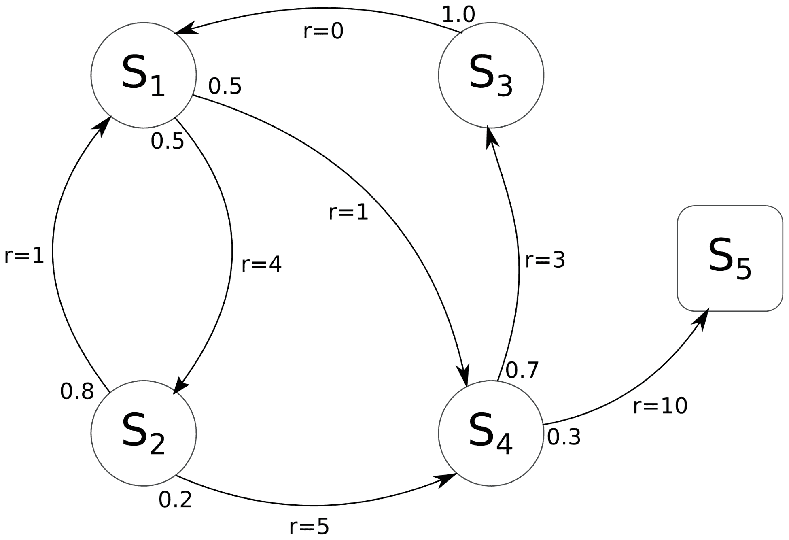
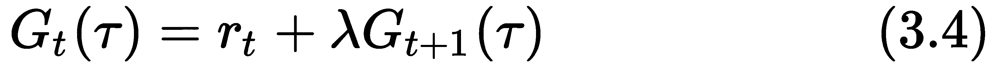
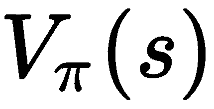
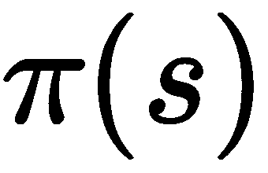

# 第三章：使用动态规划解决问题

本章的目的是多方面的。我们将介绍许多对理解强化学习问题及其解决算法至关重要的主题。与前几章从广义和非技术角度讨论 **强化学习** (**RL**) 不同，这里我们将正式化这一理解，以开发解决简单游戏的第一批算法。

强化学习问题可以被表述为 **马尔可夫决策过程** (**MDP**)，这是一个提供强化学习关键元素（如价值函数和期望奖励）形式化的框架。然后，可以使用这些数学组件创建强化学习算法。它们之间的不同在于这些组件是如何组合的，以及在设计时所做的假设。

正因如此，正如我们将在本章中看到的，强化学习算法可以分为三大类，这些类别之间可以相互重叠。这是因为某些算法可以将来自多个类别的特征结合在一起。解释完这些关键概念后，我们将介绍第一种类型的算法，称为动态规划，它可以在获得环境的完全信息时解决问题。

本章将涵盖以下主题：

+   MDP

+   强化学习算法分类

+   动态规划

# MDP

MDP 表达了一个顺序决策问题，其中动作会影响下一个状态及其结果。MDP 足够通用和灵活，可以为通过交互学习目标的问题提供形式化，这正是强化学习所要解决的问题。因此，我们可以用 MDP 的语言来表述和推理强化学习问题。

MDP 是四元组 (S,A,P,R)：

+   *S* 是状态空间，包含一个有限的状态集。

+   *A* 是动作空间，包含一个有限的动作集。

+   *P* 是转移函数，它定义了通过一个动作 *a* 从状态 *s* 转移到状态 *s′* 的概率。在 *P(s′, s, a) = p(s′| s, a)* 中，转移函数等于 *s′* 在给定 *s* 和 *a* 下的条件概率。

+   *R* 是奖励函数，它决定了在从状态 *s* 采取动作 *a* 后，转移到状态 *s′* 时所获得的值。

以下图展示了一个 MDP 的示例。箭头表示两个状态之间的转移，箭头尾部附带转移概率，箭头主体则标注奖励。在其性质上，一个状态的转移概率之和必须等于 1。在此示例中，最终状态用一个方框表示（状态 *S[5]*），为了简便，我们将一个 MDP 表示为只有一个动作的情况：



图 3.1 示例：具有五个状态和一个动作的 MDP

MDP 由一系列离散的时间步骤控制，这些时间步骤创建了状态和动作的轨迹（*S[0], A[0], S[1], A[1], ...*），其中状态遵循 MDP 的动态，即状态转移函数 *p(s′|s, a)*。通过这种方式，转移函数完全表征了环境的动态。

根据定义，转移函数和奖励函数仅由当前状态决定，而不依赖于访问过的前一个状态序列。这个性质叫做**马尔可夫性质**，意味着该过程是无记忆的，未来状态只依赖于当前状态，而不依赖于其历史。因此，一个状态包含了所有信息。具有这种性质的系统称为**完全可观察的**。

在许多实际的强化学习（RL）案例中，马尔可夫性质并不成立，为了实用，我们可以假设它是一个马尔可夫决策过程（MDP），并使用有限数量的前一个状态（有限历史）：*S[t]*、*S[t-1]*、*S[t-2]*、...、*S*[*t-k*]。在这种情况下，系统是**部分可观察的**，状态称为**观测值**。我们将在 Atari 游戏中使用这种策略，其中我们将使用行像素作为智能体的输入。这是因为单帧图像是静态的，并不包含关于物体速度或方向的信息。相反，这些值可以通过使用前三到四帧来获取（这仍然是一种近似）。

MDP 的最终目标是找到一个策略，π，最大化累计奖励，![]，其中 *R[π]* 是按照策略 π 每一步获得的奖励。当一个策略在每个 MDP 状态中采取最佳可能的动作时，就找到了 MDP 的解。这种策略被称为**最优策略**。

# 策略

策略选择在给定情况下采取的动作，并可以分为确定性或随机性。

确定性策略表示为 *a[t] = µ(st)*，而随机策略可以表示为 *a[t] ~ π(.|s[t])*，其中波浪号符号（~）表示**有分布**。当考虑一个动作分布时使用随机策略；例如，当需要向系统中注入噪声动作时。

一般来说，随机策略可以是分类的或高斯的。前者类似于分类问题，并通过在类别之间应用 softmax 函数进行计算。在后者中，动作是从高斯分布中采样的，通过均值和标准差（或方差）来描述。这些参数也可以是状态的函数。

当使用参数化策略时，我们将用字母 *θ* 来定义它们。例如，在确定性策略的情况下，它可以写作 *µ[θ] (s[t])*。

策略、决策者和智能体是表达相同概念的三个术语，因此在本书中，我们将交替使用这些术语。

# 回报

在 MDP 中运行策略时，状态和动作的序列（*S[0]*， *A[0]*， *S[1]*， *A[1]*，...）被称为**轨迹**或**展开**，并用 表示。在每个轨迹中，动作的结果会收集一系列奖励。这些奖励的函数称为**回报**，在其最简化的版本中，定义如下：


此时，回报可以单独分析无限和有限时间范围的轨迹。之所以需要这种区分，是因为在环境中进行的交互如果没有结束，之前展示的和将始终具有无限值的总和。这种情况是危险的，因为它并没有提供任何有用的信息。此类任务被称为持续任务，需要对奖励进行另一种表述。最好的解决方案是对短期奖励赋予更大权重，同时对远期奖励赋予较少的关注。这个过程可以通过使用一个介于 0 和 1 之间的值来实现，这个值称为**折扣因子**，通常用符号 λ*表示。因此，回报**G**可以重新表述如下：


这个公式可以看作是倾向于选择那些与远期奖励相较较近的动作的一种方式。举个例子——假设你中了彩票，你可以决定何时领取奖金。你可能更愿意在几天内领取，而不是几年后领取。 就是定义你愿意等待多长时间领取奖金的值。如果 ，那意味着你不在乎何时领取奖金。如果 ![]，那就意味着你希望立即领取。

在有限时间范围的轨迹中，即有自然结束的轨迹，任务被称为**回合式**任务（这个术语来源于“episode”，即轨迹的另一种说法）。在回合式任务中，原始公式（1）依然适用，但通常更偏好对其进行带有折扣因子的变体处理：


在有限但较长的时间范围内，使用折扣因子可以增加算法的稳定性，因为远期奖励仅部分考虑。实际上，折扣因子的值通常在 0.9 到 0.999 之间使用。

对公式（3）的一个简单但非常有用的分解是将回报定义为在时间步* t + 1 *的回报：



简化符号后，它变为以下形式：


然后，使用回报符号，我们可以将强化学习的目标定义为找到一个最优政策，，使其最大化预期回报，表示为![]，其中![]是随机变量的期望值。

# 值函数

回报![]提供了关于轨迹值的良好洞察，但仍然没有提供关于单个访问状态质量的任何指示。这个质量指标非常重要，因为它可以被策略用来选择下一个最佳动作。策略只需选择一个能够导致下一个质量最高状态的动作。**值函数**正是这样做的：它根据政策从某一状态开始的预期回报来估计**质量**。形式上，值函数定义如下：


**动作值函数**类似于值函数，它是从某个状态出发的预期回报，但也依赖于第一个动作。其定义如下：


值函数和动作值函数分别也被称为**V-函数**和**Q-函数**，它们是严格相关的，因为值函数也可以通过动作值函数来定义：


知道了最优![]，最优值函数如下：


这是因为最优动作是![]。

# 贝尔曼方程

**V**和**Q**可以通过运行遵循策略的轨迹，，然后对获得的值进行平均来估计。这种技术有效，且在许多场合中得到应用，但考虑到回报需要整个轨迹中的奖励，它是非常昂贵的。

幸运的是，贝尔曼方程递归地定义了动作值函数和值函数，使得它们能够从后续状态中进行估计。贝尔曼方程通过使用当前状态获得的奖励和其后继状态的值来实现这一点。我们已经看到了回报的递归公式（在公式（5）中），并且可以将其应用于状态值：


类似地，我们可以将贝尔曼方程应用于动作值函数：


现在，使用（6）和（7），![]和![]仅根据连续状态的值进行更新，而不需要像旧定义中那样展开整个轨迹到终点。

# 强化学习算法分类

在深入讨论解决最优贝尔曼方程的第一个强化学习算法之前，我们想先提供一个广泛但详细的强化学习算法概述。我们需要这样做，因为它们之间的区别可能会让人感到困惑。算法的设计涉及多个部分，且在决定哪种算法最适合用户的实际需求之前，需要考虑许多特性。本概述的范围呈现了强化学习的宏观图景，以便在接下来的章节中，我们将提供这些算法的全面理论和实践视角时，你将已经掌握它们的总体目标，并清晰地了解它们在强化学习算法地图中的位置。

第一个区别是在基于模型和无模型算法之间。顾名思义，基于模型的算法需要一个环境模型，而无模型算法则不依赖于此条件。环境模型非常有价值，因为它包含了可以用来找到期望策略的宝贵信息；然而，在大多数情况下，模型几乎无法获取。例如，模拟井字游戏很容易，而模拟海浪则相当困难。为此，无模型算法可以在不假设环境的情况下学习信息。强化学习算法的类别在图 3.2 中有所展示。

这里展示了基于模型和无模型之间的区别，以及两种广为人知的无模型方法，即策略梯度和基于价值的方法。此外，正如我们将在后续章节中看到的，这些方法的结合是可能的：


图 3.2. 强化学习算法的分类

第一个区别是在无模型和基于模型之间。无模型强化学习算法可以进一步细分为策略梯度算法和基于价值的算法。混合方法是结合了两者重要特性的算法。

# 无模型算法

在没有模型的情况下，**无模型**（**MF**）算法在给定的策略下运行轨迹以获取经验并改进智能体。MF 算法由三个主要步骤组成，直到创建出一个良好的策略，这三个步骤会不断重复：

1.  通过在环境中运行策略生成新样本。轨迹会一直运行直到达到最终状态，或运行固定的步数。

1.  回报函数的估计。

1.  使用收集的样本和步骤 2 中完成的估计来改进策略。

这三个组件是此类算法的核心，但根据每个步骤的执行方式，它们会生成不同的算法。基于价值的算法和策略梯度算法就是两个这样的例子。它们看起来非常不同，但它们基于相似的原则，且都采用了三步法。

# 基于价值的算法

基于价值的算法，也称为**价值函数算法**，使用与我们在前一部分中看到的非常相似的范式。也就是说，它们使用贝尔曼方程来学习 Q 函数，进而用于学习策略。在最常见的设置中，它们使用深度神经网络作为函数逼近器，并采用其他技巧来处理高方差和一般的不稳定性。在某种程度上，基于价值的算法更接近监督回归算法。

通常，这些算法是离策略的，意味着它们不需要优化用于生成数据的相同策略。这意味着这些方法可以从以前的经验中学习，因为它们可以将采样数据存储在回放缓冲区中。使用以前样本的能力使得价值函数比其他无模型算法更具样本效率。

# 策略梯度算法

另一类无模型（MF）算法是**策略梯度**方法（或策略优化方法）。它们对强化学习问题有更直接和明显的解释，因为它们通过更新参数以改进的方向直接从一个参数化策略中学习。其基于强化学习原理，即应当鼓励好的行动（通过提高策略的梯度），并且应当抑制坏的行动。

与价值函数算法相反，策略优化主要依赖于策略数据，这使得这些算法在样本效率上较低。策略优化方法可能会由于在存在高曲率的表面上采取最陡的上升路径而变得非常不稳定，这容易导致在某一方向上走得太远，最终跌入不好的区域。为了解决这个问题，提出了许多算法，例如仅在信任区域内优化策略，或者优化一个代理裁剪目标函数以限制策略的变化。

策略梯度方法的一个主要优点是它们能够轻松处理具有连续动作空间的环境。这对于基于价值的算法来说是一个非常困难的问题，因为它们为离散的状态和动作对学习 Q 值。

# 演员-评论家算法

**演员-评论家**（**AC**）算法是离策略的策略梯度算法，它们还学习一个价值函数（通常是 Q 函数），这个函数叫做评论家，用来给策略（演员）提供反馈。想象一下，你，作为演员，想要通过一条新路线去超市。不幸的是，在到达目的地之前，你的老板打电话要求你回去工作。因为你没有到达超市，所以你不知道新路是否比旧路更快。但如果你到达了一个熟悉的地方，你可以估算从那里到超市所需的时间，并计算是否新路更优。这种估算就是评论家的作用。通过这种方式，即使你没有到达最终目标，你也可以改进演员的表现。

将评论者与行动者结合已被证明非常有效，并且在策略梯度算法中被广泛使用。这项技术还可以与其他用于策略优化的思想相结合，例如信任区域算法。

# 混合算法

价值函数和策略梯度算法的优势可以结合，创造出混合算法，这些算法可能更高效并且更加稳健。

混合方法将 Q 函数和策略梯度结合在一起，互相促进和改善。这些方法估计确定性动作的期望 Q 函数，以直接改善策略。

请注意，由于 AC 算法学习并使用价值函数，因此它们被归类为策略梯度，而不是混合算法。这是因为其主要目标是策略梯度方法，价值函数只是为了提供额外信息的一种升级。

# 基于模型的 RL

拥有环境模型意味着每个状态-动作元组的状态转换和奖励可以预测（无需与真实环境交互）。正如我们之前提到的，模型在有限的情况下是已知的，但当它已知时，可以以多种方式使用。模型最明显的应用是用于规划未来的动作。规划是一个用于表达组织未来移动的概念，当下一步动作的后果已经知道时。例如，如果你完全知道敌人将采取哪些行动，你可以提前思考并在执行第一步之前规划所有的动作。缺点是，规划可能非常昂贵，而且不是一个简单的过程。

通过与环境的交互，模型也可以通过吸收动作的后果（包括状态和奖励）来学习。这种解决方案并不总是最优的，因为在现实世界中，教一个模型可能非常昂贵。而且，如果模型只对环境有一个粗略的近似理解，可能会导致灾难性的结果。

无论是已知的还是通过学习得到的模型，都可以用来进行规划和改进策略，并可以集成到 RL 算法的不同阶段。基于模型的 RL 的著名案例包括纯规划、嵌入式规划以改进策略以及从近似模型中生成的样本。

一组使用模型估计价值函数的算法称为**动态规划**（**DP**），将在本章稍后进行研究。

# 算法多样性

为什么有那么多种强化学习算法？这是因为没有一种算法在所有情况下都比其他算法更好。每种算法都是为不同的需求设计的，旨在处理不同的方面。最显著的差异包括稳定性、样本效率和墙时（训练时间）。随着我们逐步深入本书，这些差异会更加明确，但作为经验法则，策略梯度算法比值函数算法更加稳定和可靠。另一方面，值函数方法更具样本效率，因为它们是离策略的，并且可以利用先前的经验。反过来，基于模型的算法比 Q 学习算法更具样本效率，但它们的计算成本更高，且速度更慢。

除了刚才提到的那些，还有其他一些权衡需要在设计和部署算法时考虑（例如易用性和鲁棒性），这不是一个简单的过程。

# 动态规划

动态规划（DP）是一种通用的算法范式，它将一个问题分解为多个重叠的子问题，然后通过结合子问题的解决方案来找到原始问题的解。

DP 可以用于强化学习，并且是最简单的方式之一。它通过提供环境的完美模型来计算最优策略。

动态规划（DP）是强化学习算法历史中的一个重要里程碑，并为下一代算法奠定了基础，但其计算成本非常高。DP 适用于具有有限状态和动作的马尔可夫决策过程（MDP），因为它必须更新每个状态（或动作值）的值，同时考虑到所有其他可能的状态。此外，DP 算法将价值函数存储在数组或表格中。这种存储信息的方式是有效且快速的，因为没有信息丢失，但它确实需要存储大量的表格。由于 DP 算法使用表格存储价值函数，因此被称为表格学习。这与近似学习相对，后者使用近似价值函数将值存储在固定大小的函数中，例如人工神经网络。

DP 使用**自举**，意味着它通过使用后续状态的期望值来改进状态的估计值。正如我们之前看到的，自举在贝尔曼方程中被使用。实际上，DP 应用了贝尔曼方程（6）和（7）来估算和/或。这可以通过以下方式完成：


或者通过使用 Q 函数：


然后，一旦找到最优的价值函数和动作价值函数，就可以通过采取最大化期望的行动来找到最优策略。

# 策略评估与策略改进

为了找到最优策略，你首先需要找到最优的价值函数。一个执行这一过程的迭代方法称为**策略评估**——它通过模型的状态值转移、下一个状态的期望以及即时奖励，创建一个序列，逐步改进一个策略的价值函数，。因此，它使用贝尔曼方程创建一个不断改进的价值函数序列：


这个序列将随着的变化而收敛到最优值。图 3.3 展示了使用连续状态值更新：


图 3.3\. 使用公式（8）更新

只有在知道每个状态和动作的状态转移函数`p`和奖励函数`r`时，价值函数（8）才可以更新，因此只有在环境的模型完全已知时才能更新。

请注意，在（8）中的第一个动作求和是针对随机策略所必需的，因为该策略为每个动作输出一个概率。为了简便起见，从现在开始我们只考虑确定性策略。

一旦价值函数得到改进，它就可以用来找到更好的策略。这个过程称为*策略改进*，其目的是找到一个策略，，如下所示：


它从原始策略的价值函数，，创建一个策略，。如正式证明，新策略，，总是比更好，并且当且仅当是最优时，策略才是最优的。策略评估和策略改进的结合产生了两种计算最优策略的算法。一种叫做**策略迭代**，另一种叫做**价值迭代**。两者都使用策略评估来单调地改进价值函数，并使用策略改进来估计新的策略。唯一的区别在于，策略迭代按循环方式执行这两个阶段，而价值迭代将它们合并在单一的更新中。

# 策略迭代

策略迭代在策略评估和策略改进之间循环，策略评估使用公式(8)在当前策略下更新，而策略改进(9)则利用改进后的价值函数计算，该函数由表示。最终，经过次循环，算法将得到一个最优策略。

伪代码如下：

```py
Initialize  and  for every state 

while  is not stable:

    > policy evaluation
   while  is not stable:
        for each state s:

    > policy improvement
    for each state s:

```

在初始化阶段之后，外部循环会在策略评估和策略迭代之间迭代，直到找到一个稳定的策略。在每次迭代中，策略评估会评估前一步策略改进步骤中找到的策略，而这些步骤则使用估算的价值函数。

# 应用策略迭代到 FrozenLake

为了巩固策略迭代背后的思想，我们将其应用于一个名为 FrozenLake 的游戏。在这里，环境由一个 4 x 4 的网格组成。通过四个动作对应四个方向（0 表示左，1 表示下，2 表示右，3 表示上），代理需要移动到网格的另一端，而不能掉入洞中。此外，移动是不确定的，代理有可能朝其他方向移动。因此，在这种情况下，可能会有益于不沿着预定的方向移动。当达到目标时，奖励为+1。游戏地图如图 3.4 所示，S 是起始位置，星星是目标位置，螺旋是洞：


图 3.4 FrozenLake 游戏地图

准备好所有所需工具后，让我们看看如何解决这个问题。

本章中解释的所有代码都可以在本书的 GitHub 仓库中找到，链接如下：[`https://github.com/PacktPublishing/Reinforcement-Learning-Algorithms-with-Python`](https://github.com/PacktPublishing/Reinforcement-Learning-Algorithms-with-Python)

首先，我们需要创建环境，初始化价值函数和策略：

```py
env = gym.make('FrozenLake-v0')
env = env.unwrapped
nA = env.action_space.n
nS = env.observation_space.n
V = np.zeros(nS)
policy = np.zeros(nS)

```

然后，我们需要创建一个主循环，执行一次策略评估和一次策略改进。该循环会在策略稳定时结束。为此，请使用以下代码：

```py
policy_stable = False
it = 0
while not policy_stable:
    policy_evaluation(V, policy)
    policy_stable = policy_improvement(V, policy)
    it += 1
```

最后，我们可以打印出完成的迭代次数、价值函数、策略以及通过运行一些测试游戏所达到的得分：

```py
print('Converged after %i policy iterations'%(it))
run_episodes(env, V, policy)
print(V.reshape((4,4)))
print(policy.reshape((4,4)))
```

现在，在定义`policy_evaluation`之前，我们可以创建一个函数来评估预期的动作值，这个函数也将被用于`policy_improvement`：

```py
def eval_state_action(V, s, a, gamma=0.99):
    return np.sum([p * (rew + gamma*V[next_s]) for p, next_s, rew, _ in env.P[s][a]])
```

在这里，`env.P`是一个字典，包含了关于环境动态的所有信息。

`gamma`是折扣因子，0.99 是一个标准值，适用于简单和中等难度的问题。它越高，代理预测一个状态的值就越困难，因为它需要展望更远的未来。

接下来，我们可以定义`policy_evaluation`函数。`policy_evaluation`需要根据当前策略计算公式（8），并对每个状态进行计算，直到达到稳定值。因为策略是确定性的，所以我们只需要评估一个动作：

```py
def policy_evaluation(V, policy, eps=0.0001):
    while True:
        delta = 0
        for s in range(nS):
            old_v = V[s]
            V[s] = eval_state_action(V, s, policy[s])
            delta = max(delta, np.abs(old_v - V[s]))
        if delta < eps:
            break

```

当`delta`小于阈值`eps`时，我们认为值函数稳定。当这些条件满足时，`while`循环语句被停止。

`policy_improvement` 接收值函数和策略，并对所有状态进行迭代，基于新的值函数更新策略：

```py
def policy_improvement(V, policy):
    policy_stable = True
    for s in range(nS):
        old_a = policy[s]
        policy[s] = np.argmax([eval_state_action(V, s, a) for a in range(nA)])
        if old_a != policy[s]: 
            policy_stable = False
    return policy_stable
```

`policy_improvement(V, policy)`在策略发生变化之前返回`False`。这是因为它意味着策略尚未稳定。

最后一段代码运行一些游戏来测试新策略，并打印赢得的游戏次数：

```py
def run_episodes(env, V, policy, num_games=100):
    tot_rew = 0
    state = env.reset()
    for _ in range(num_games):
        done = False
        while not done:
            next_state, reward, done, _ = env.step(policy[state])
            state = next_state
            tot_rew += reward 
            if done:
                state = env.reset()
    print('Won %i of %i games!'%(tot_rew, num_games))
```

就是这样。

它大约在 7 次迭代后收敛，并且赢得了大约 85%的游戏：


图 3.5 冰湖游戏的结果。最优策略在左侧，最优状态值在右侧。

从代码得到的策略显示在图 3.5 的左侧。你可以看到它走的是一些奇怪的路线，但这只是因为它遵循了环境的动态。在图 3.5 的右侧，展示了最终状态的值。

# 值迭代

值迭代是另一种用于在 MDP 中寻找最优值的动态规划算法，但与执行策略评估和策略迭代循环的策略迭代不同，值迭代将这两种方法合并为一次更新。特别地，它通过立即选择最佳动作来更新状态的值：


值迭代的代码比策略迭代的代码更简单，以下是总结的伪代码：

```py
Initialize  for every state 

while  is not stable:
    > value iteration
    for each state s:

> compute the optimal policy:

```

唯一的区别在于新的值估计更新和没有适当的策略迭代模块。最终得到的最优策略如下：


# 应用值迭代到冰湖

现在我们可以将值迭代应用于冰湖游戏，以便比较这两种动态规划算法，并查看它们是否会收敛到相同的策略和值函数。

我们像之前一样定义`eval_state_action`，用来估算状态-动作对的动作状态值：

```py
def eval_state_action(V, s, a, gamma=0.99):
    return np.sum([p * (rew + gamma*V[next_s]) for p, next_s, rew, _ in env.P[s][a]])
```

接下来，我们创建值迭代算法的主体部分：

```py
def value_iteration(eps=0.0001):
    V = np.zeros(nS)
    it = 0
    while True:
        delta = 0
        # update the value for each state
        for s in range(nS):
            old_v = V[s]
            V[s] = np.max([eval_state_action(V, s, a) for a in range(nA)]) # equation 3.10
            delta = max(delta, np.abs(old_v - V[s]))
        # if stable, break the cycle
        if delta < eps:
            break
        else:
            print('Iter:', it, ' delta:', np.round(delta,5))
        it += 1
    return V
```

它会循环直到达到稳定的值函数（由阈值`eps`决定），并且在每次迭代中，使用公式（10）更新每个状态的值。

至于策略迭代，`run_episodes`执行一些游戏来测试策略。唯一的不同之处在于，在这种情况下，策略是在执行`run_episodes`时同时确定的（对于策略迭代，我们提前为每个状态定义了动作）：

```py
def run_episodes(env, V, num_games=100):
    tot_rew = 0
    state = env.reset()

    for _ in range(num_games):
        done = False

        while not done:
            # choose the best action using the value function
            action = np.argmax([eval_state_action(V, state, a) for a in range(nA)]) #(11)
            next_state, reward, done, _ = env.step(action)
            state = next_state
            tot_rew += reward 
            if done:
                state = env.reset()

    print('Won %i of %i games!'%(tot_rew, num_games))
```

最后，我们可以创建环境，解开它，运行值迭代，并执行一些测试游戏：

```py
env = gym.make('FrozenLake-v0')
env = env.unwrapped

nA = env.action_space.n
nS = env.observation_space.n

V = value_iteration(eps=0.0001)
run_episodes(env, V, 100)
print(V.reshape((4,4)))
```

输出结果将类似于以下内容：

```py
Iter: 0 delta: 0.33333
Iter: 1 delta: 0.1463
Iter: 2 delta: 0.10854
...
Iter: 128 delta: 0.00011
Iter: 129 delta: 0.00011
Iter: 130 delta: 0.0001
Won 86 of 100 games!
[[0.54083394 0.49722378 0.46884941 0.45487071]
 [0.55739213 0\.         0.35755091 0\.        ]
 [0.5909355  0.64245898 0.61466487 0\.        ]
 [0\.         0.74129273 0.86262154 0\.        ]]
```

值迭代算法在 130 次迭代后收敛。得到的值函数和策略与策略迭代算法相同。

# 总结

一个 RL 问题可以被形式化为一个 MDP，为学习目标驱动问题提供了一个抽象框架。MDP 由一组状态、动作、奖励和转移概率定义，解决 MDP 意味着找到一个在每个状态下最大化期望奖励的策略。马尔可夫性质是 MDP 的内在特性，它确保未来的状态仅依赖于当前状态，而不依赖于历史。

使用 MDP 的定义，我们提出了策略、回报函数、期望回报、动作-值函数和值函数的概念。后两者可以通过后续状态的值来定义，这些方程被称为贝尔曼方程。这些方程非常有用，因为它们提供了一种迭代计算值函数的方法。然后，最优值函数可以用来找到最优策略。

RL 算法可以分为基于模型的和无模型的。前者需要环境的模型来规划下一步动作，而后者独立于模型，可以通过与环境的直接交互来学习。无模型算法可以进一步分为策略梯度算法和价值函数算法。策略梯度算法通过梯度上升直接从策略中学习，通常是基于策略的。价值函数算法通常是离策略的，它们学习动作-值函数或值函数来创建策略。这两种方法可以结合在一起，产生兼具两者优点的方法。

DP 是我们深入研究的第一组基于模型的算法。它在已知环境完整模型且由有限数量的状态和动作构成时使用。DP 算法通过自举方法估计状态的值，并通过两个过程学习最优策略：策略评估和策略改进。策略评估计算任意策略的状态值函数，而策略改进则通过使用策略评估过程得到的值函数来改进策略。

通过结合策略改进和策略评估，可以创建策略迭代算法和值迭代算法。两者的主要区别在于，策略迭代是通过策略评估和策略改进的迭代过程来运行的，而值迭代则将这两个过程合并为一次更新。

尽管动态规划受到维度灾难的困扰（复杂度随着状态数量呈指数增长），但策略评估和策略迭代背后的思想几乎在所有强化学习算法中都是关键，因为它们使用了这些思想的广义版本。

动态规划的另一个缺点是它需要环境的精确模型，这限制了它在许多其他问题中的应用。

在下一章中，你将看到如何使用 V 函数和 Q 函数来学习策略，利用模型未知的情况下，直接从环境中采样的问题。

# 问题

1.  什么是马尔可夫决策过程（MDP）？

1.  什么是随机策略？

1.  如何用下一个时间步的回报来定义回报函数？

1.  为什么贝尔曼方程如此重要？

1.  动态规划（DP）算法的限制因素是什么？

1.  什么是策略评估？

1.  策略迭代和值迭代有何不同？

# 进一步阅读

+   Sutton 和 Barto，《强化学习》，第三章和第四章
