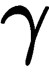

# 第四章：Q-Learning 和 SARSA 应用

**动态规划**（**DP**）算法对于解决 **强化学习**（**RL**）问题非常有效，但它们需要两个强假设。第一个假设是必须知道环境的模型，第二个假设是状态空间必须足够小，以至于不会受到维度灾难问题的影响。

在本章中，我们将开发一类摆脱第一个假设的算法。此外，这是一类不受动态规划（DP）算法维度灾难问题影响的算法。这些算法直接从环境和经验中学习，根据许多回报估计价值函数，而不是像 DP 算法那样使用模型计算状态值的期望。在这种新设置下，我们将讨论经验作为学习价值函数的方式。我们将研究通过与环境的互动来学习策略时出现的问题，以及可以用来解决这些问题的技术。在简要介绍这一新方法后，你将了解 **时序差分**（**TD**）学习，这是一种通过经验学习最优策略的强大方法。TD 学习借鉴了 DP 算法的思想，同时只使用从与环境互动中获得的信息。两种时序差分学习算法是 SARSA 和 Q-learning。虽然它们非常相似，并且都能在表格化的情况下保证收敛，但它们有一些有趣的差异，值得我们注意。Q-learning 是一个关键算法，许多最先进的强化学习（RL）算法结合其他技术时使用这种方法，正如我们将在后续章节中看到的那样。

为了更好地理解 TD 学习并了解如何从理论过渡到实践，你将实现 Q-learning 和 SARSA 在一个新游戏中的应用。然后，我们将详细阐述这两种算法的区别，既包括它们的表现，也包括它们的使用。

本章将涵盖以下主题：

+   无模型学习

+   TD 学习

+   SARSA

+   将 SARSA 应用到 Taxi-v2

+   Q-learning

+   将 Q-learning 应用到 Taxi-v2

# 无模型学习

根据定义，策略的价值函数是从给定状态开始该策略的期望回报（即折扣奖励的总和）：


根据第三章《使用动态规划解决问题》的推理，DP 算法通过计算所有下一状态的期望来更新状态值：


不幸的是，计算价值函数意味着你需要知道状态转移概率。事实上，动态规划（DP）算法使用环境模型来获得这些概率。但主要的问题是，当这些信息不可用时该怎么办。最好的答案是通过与环境交互来获取所有信息。如果做得好，这种方法有效，因为通过从环境中采样多次，你应该能够近似期望值，并对价值函数有一个良好的估计。

# 用户体验

现在，我们需要首先澄清的是如何从环境中采样，以及如何与环境互动以获取有关其动态的可用信息：


图 4.1\. 从状态![]开始的轨迹

做这件事的简单方法是执行当前策略直到本回合结束。你最终会得到如图 4.1 所示的轨迹。一旦回合结束，可以通过向上反向传播奖励总和来为每个状态计算回报值，![]。为每个状态重复这个过程多次（即运行多个轨迹），就会得到多个回报值。然后对这些回报值进行平均，以计算期望回报。以这种方式计算的期望回报是一个近似的价值函数。执行策略直到终止状态称为轨迹或回合。运行更多的轨迹会观察到更多的回报，根据大数法则，这些估计的平均值将会收敛到期望值。

与动态规划类似，通过与环境直接交互来学习策略的算法依赖于策略评估和策略改进的概念。策略评估是估算策略的价值函数，而策略改进则利用上一阶段的估算来改进策略。

# 策略评估

我们刚刚看到，使用真实经验来估算价值函数是一个简单的过程。这涉及到在环境中执行策略直到达到最终状态，然后计算回报值并对采样回报进行平均，如方程（1）所示：


因此，状态的期望回报可以通过对来自该状态的采样经历进行平均来近似。使用（1）估算回报函数的方法称为**蒙特卡洛方法**。直到所有状态-动作对都被访问并且足够的轨迹被采样，蒙特卡洛方法才能保证收敛到最优策略。

# 探索问题

我们如何保证每个状态的每个动作都会被选择？为什么这如此重要？我们将首先回答后一个问题，然后展示我们如何（至少在理论上）探索环境以到达每一个可能的状态。

# 为什么要探索？

轨迹是通过一个策略进行采样的，这个策略可以是随机的也可以是确定性的。在确定性策略的情况下，每次采样轨迹时，访问的状态将始终是相同的，值函数的更新只会考虑这一有限的状态集。这将大大限制你对环境的了解。就像从一位永远不会改变自己观点的老师那里学习——你将停留在这些想法中，无法了解其他的知识。

因此，环境的探索至关重要，如果你想获得好的结果，它确保了没有更好的策略可以被发现。

另一方面，如果一个策略被设计成不断探索环境，而不考虑已经学到的东西，那么实现一个好的策略将变得非常困难，甚至可能是不可能的。探索与利用（按照当前最好的策略行事）之间的平衡被称为探索-利用困境，且将在第十二章中详细讨论，*开发一个 ESBAS 算法*。

# 如何进行探索

当处理此类情况时，一个非常有效的方法叫做-贪心探索。它是在以概率随机行动的同时，以概率采取贪心行动（即选择最佳行动）。例如，如果，平均而言，每 10 次行动中，智能体将随机行动 8 次。

为了避免在智能体对自己的知识充满信心时，过多地进行探索，可以随着时间的推移逐渐减少。这个策略被称为**epsilon 衰减**。通过这种变化，最初的随机策略将逐渐收敛到一个确定性的，并且希望是最优的策略。

还有许多其他的探索技术（如 Boltzmann 探索），它们更为精确，但也相当复杂，对于本章而言，-贪心策略是一个完美的选择。

# TD 学习

蒙特卡罗方法是一种强大的直接通过从环境中采样来学习的方法，但它们有一个很大的缺点——它们依赖于完整的轨迹。它们必须等到整个回合结束，才能更新状态值。因此，一个关键问题是，当轨迹没有结束时，或者如果轨迹非常长时，会发生什么情况。答案是它将产生可怕的结果。针对这个问题，动态规划算法已经提出了类似的解决方案，状态值在每一步更新，而不是等到结束后才更新。它并不是使用在轨迹过程中累积的完整回报，而是使用即时奖励和下一状态值的估计。这种更新的可视化示例在图 4.2 中给出，展示了学习过程中的单步涉及的部分。这个技术叫做**自举**，它不仅对长回合或可能无限的回合有用，对于任何长度的回合同样有效。其第一个原因是，它有助于减少期望回报的方差。方差减少的原因是，状态值只依赖于即时的下一个奖励，而不依赖于整个轨迹的所有奖励。第二个原因是，学习过程在每一步都进行，使这些算法能够在线学习。因此，这被称为一步学习。相反，蒙特卡罗方法是离线的，因为它们只在回合结束后才使用信息。使用自举进行在线学习的方法称为 TD 学习方法*。


图 4.2 一步学习更新与自举

TD 学习可以看作是蒙特卡罗方法和动态规划（DP）方法的结合，因为它们借鉴了前者的采样思想和后者的自举（bootstrapping）思想。TD 学习广泛应用于强化学习（RL）算法中，构成了许多算法的核心。本章稍后介绍的算法（即 SARSA 和 Q-learning）都是一步、表格型、无模型（意味着它们不使用环境的模型）TD 方法。

# TD 更新

从上一章*使用动态规划解决问题*中，我们知道以下内容：


通过经验方法，蒙特卡罗更新通过对多个完整轨迹的回报进行平均来估算这个值。进一步推导该方程，我们得到如下结果：


前面的方程通过动态规划算法进行了逼近。不同之处在于，TD 算法通过估算期望值而不是计算它。估算的方式与蒙特卡罗方法相同，即通过平均来进行：


实际上，TD 更新不是计算平均值，而是通过向最优值小幅度地改善状态值来完成更新：


 是一个常数，用来确定每次更新时状态值应有多少变化。如果 ，那么状态值将完全不变。相反，如果 ，状态值将等于 （称为 **TD 目标**），并且完全忘记之前的值。在实践中，我们不希望出现这些极端情况，通常  的范围从 0.5 到 0.001。

# 策策改进

TD 学习在每个状态的每个动作都有大于零的选择概率时会收敛到最优条件。为了满足这一要求，正如我们在前一部分看到的，TD 方法必须进行环境探索。事实上，探索可以通过使用 -贪心策略来进行。它确保在选择动作时既有贪心动作，也有随机动作，从而确保了环境的开发和探索。

# 比较蒙特卡洛和 TD

蒙特卡洛 TD 方法的一个重要特点是，只要它们处理的是表格型问题（即状态值存储在表格或数组中）并且具有探索性策略，它们就能收敛到最优解。然而，它们在更新值函数的方式上有所不同。总体而言，TD 学习的方差较低，但偏差高于蒙特卡洛学习。除此之外，TD 方法通常在实践中更快，因此更受偏好，相较于蒙特卡洛方法。

# SARSA

到目前为止，我们将 TD 学习呈现为一种估算给定策略的值函数的通用方法。在实践中，TD 方法无法直接使用，因为它缺少实际改进策略的主要组件。SARSA 和 Q-learning 是两种一阶、表格型的 TD 算法，它们都可以估算值函数并优化策略，能够广泛应用于各种强化学习问题。在本节中，我们将使用 SARSA 学习给定马尔可夫决策过程（MDP）的最优策略。然后，我们将介绍 Q-learning。

TD 学习的一个问题是它估算的是状态的价值。想一想，在一个给定的状态下，你如何选择具有最高下一个状态值的动作？我们之前说过，你应该选择那个能把智能体移动到具有最高值的状态的动作。然而，在没有环境模型的情况下，它无法提供可能的下一个状态列表，你无法知道哪个动作能将智能体移动到那个状态。SARSA 不是学习值函数，而是学习并应用状态-动作函数，。 告诉我们一个状态的价值，，如果采取的动作是 。

# 算法

基本上，我们对 TD 更新所做的所有观察对于 SARSA 也是有效的。一旦我们将其应用于 Q 函数的定义，就得到了 SARSA 更新：


 是一个系数，用于确定动作值更新了多少。 是折扣因子，一个介于 0 和 1 之间的系数，用于降低来自遥远未来决策的值的重要性（短期动作比长期动作更受偏好）。SARSA 更新的视觉解释见图 4.3。

SARSA 这个名字来源于基于状态的更新，；

动作，，奖励，；下一个状态，；最后，下一个动作，。将所有内容结合起来，形成 ，如图 4.3 所示：


图 4.3 SARSA 更新

SARSA 是一种在策略算法。所谓“在策略”，意味着通过与环境互动收集经验的策略（称为行为策略）就是被更新的策略。该方法的在策略特性来自于使用当前策略来选择下一个动作，，以估计 ，并假设在随后的动作中将遵循相同的策略（即根据动作  执行）。

在策略算法通常比离策略算法更简单，但它们的表现力较弱，通常需要更多的数据来学习。尽管如此，就像 TD 学习一样，如果 SARSA 每次都访问每个状态-动作无限次，并且随着时间推移，策略变得确定性，那么它是可以保证收敛到最优策略的。实际算法通常使用 -贪心策略，并伴有逐渐趋近于零的衰减。SARSA 的伪代码总结如下。在伪代码中，我们使用了 -贪心策略，但可以使用任何鼓励探索的策略：

```py
Initialize  for every state-action pair

for  episodes:

    while  is not a final state:
         # env() take a step in the environment

```

 是一个实现  策略的函数。请注意，SARSA 执行与前一步骤中选择并使用的相同动作来更新状态-动作值。

# 将 SARSA 应用于 Taxi-v2

在对 TD 学习特别是 SARSA 进行更理论化的探讨之后，我们终于能够实现 SARSA 来解决感兴趣的问题。正如我们之前所看到的，SARSA 可以应用于具有未知模型和动态的环境，但由于它是一个具有可扩展性限制的表格化算法，因此只能应用于具有小规模离散动作和状态空间的环境。因此，我们选择将 SARSA 应用于一个名为 Taxi-v2 的 gym 环境，它满足所有要求，并且是这类算法的良好测试平台。

Taxi-v2 是一个用于研究层次化强化学习（这是一种创建策略层次结构的 RL 算法，每个策略的目标是解决一个子任务）游戏，其目标是接载一个乘客并将其送到指定位置。当出租车成功完成送客任务时，获得 +20 的奖励，但如果非法接送或送达，将受到 -10 的惩罚。此外，每经过一个时间步，都会失去 1 分。游戏的渲染效果如图 4.4 所示。该环境有六个合法动作，分别对应四个方向、接载和送客动作。在图 4.4 中，`:` 符号代表空位置，`|` 符号代表出租车无法穿越的墙壁，`R, G, Y, B` 是四个位置。出租车（图中的黄色矩形）必须在浅蓝色标识的地点接载乘客，并将其送到紫色标识的地点。


图 4.4 Taxi-v2 环境的起始状态

实现过程相当直接，遵循前一节中给出的伪代码。尽管我们在这里解释并展示了所有代码，但也可以在本书的 GitHub 仓库中找到。

首先实现 SARSA 算法的主函数 `SARSA(..)`，它完成了大部分工作。之后，我们将实现一些辅助函数，执行简单但重要的任务。

`SARSA` 需要一个环境和一些其他超参数作为参数才能正常工作：

+   学习率 `lr`，以前称为 ，控制每次更新时的学习量。

+   `num_episodes` 一目了然，因为它是 SARSA 执行的总回合数，直到终止。

+   `eps` 是 贪心策略的随机性初始值。

+   `gamma` 是折扣因子，用来对未来的动作赋予较小的权重。

+   `eps_decay` 是 `eps` 在各回合之间的线性递减。

代码的前几行如下：

```py
def SARSA(env, lr=0.01, num_episodes=10000, eps=0.3, gamma=0.95, eps_decay=0.00005):
    nA = env.action_space.n
    nS = env.observation_space.n
    test_rewards = []
    Q = np.zeros((nS, nA))
    games_reward = []
```

在这里，初始化了一些变量。`nA` 和 `nS` 分别是环境中的动作数和观察数，`Q` 是将包含每个状态-动作对的 Q 值的矩阵，`test_rewards` 和 `games_rewards` 是稍后用来存储游戏分数信息的列表。

接下来，我们可以实现学习 Q 值的主循环：

```py
    for ep in range(num_episodes):
        state = env.reset()
        done = False
        tot_rew = 0

        if eps > 0.01:
            eps -= eps_decay

        action = eps_greedy(Q, state, eps)
```

上述代码块中的第 2 行在每个新回合时重置环境并存储当前的环境状态。第 3 行初始化了一个布尔变量，当环境处于终止状态时，该变量将被设置为`True`。接下来的两行更新了`eps`变量，直到其值大于 0.01。我们设置此阈值是为了保持长期内环境探索的最低速率。最后一行根据当前状态和 Q 矩阵选择一个*贪婪*动作。我们稍后会定义这个函数。

现在，我们已经处理了每个回合开始时需要的初始化，并选择了第一个动作，我们可以开始循环，直到回合（游戏）结束。以下这段代码从环境中获取样本并根据公式（5）更新 Q 函数：

```py
        while not done:
            next_state, rew, done, _ = env.step(action) # Take one step in the environment

            next_action = eps_greedy(Q, next_state, eps)
            Q[state][action] = Q[state][action] + lr*(rew + gamma*Q[next_state][next_action] - Q[state][action]) # (4.5)
            state = next_state
            action = next_action
           tot_rew += rew
            if done:
                games_reward.append(tot_rew)
```

`done` 保存一个布尔值，表示智能体是否仍在与环境交互，正如第 2 行所示。因此，循环直到完整回合结束就相当于只要`done`为`False`就继续迭代（代码的第一行）。然后，像往常一样，`env.step` 返回下一个状态、奖励、done 标志和一个信息字符串。在接下来的行中，`eps_greedy` 根据`next_state`和 Q 值选择下一个动作。SARSA 算法的核心在于随后的这一行，它根据公式（5）执行更新。除了学习率和折扣因子 gamma 外，还使用了上一阶段获得的奖励以及`Q`数组中的值。

最后一行设置当前状态和动作与之前相同，将奖励加到游戏的总奖励中，并且如果环境处于终止状态，则将奖励的总和附加到`games_reward`，然后内循环终止。

在`SARSA`函数的最后几行中，每 300 个回合，我们运行 1,000 次测试游戏并打印信息，如回合数、`eps`值和测试奖励的平均值。此外，我们返回`Q`数组：

```py
        if (ep % 300) == 0:
            test_rew = run_episodes(env, Q, 1000)
            print("Episode:{:5d} Eps:{:2.4f} Rew:{:2.4f}".format(ep, eps, test_rew))
            test_rewards.append(test_rew)
    return Q
```

我们现在可以实现`eps_greedy`函数，它以`eps`的概率从允许的动作中选择一个随机动作。为此，它只需在 0 和 1 之间采样一个均匀分布的数字，如果这个值小于`eps`，则选择一个随机动作。否则，它选择一个贪婪动作：

```py
def eps_greedy(Q, s, eps=0.1):
    if np.random.uniform(0,1) < eps:
        # Choose a random action
        return np.random.randint(Q.shape[1])
    else:
    # Choose the greedy action
    return greedy(Q, s)
```

贪婪策略通过返回对应于状态`s`中最大 Q 值的索引来实现：

```py
def greedy(Q, s):    
    return np.argmax(Q[s])

```

最后一个要实现的函数是`run_episodes`，它运行若干回合来测试策略。用于选择动作的策略是贪婪策略。这是因为在测试时我们不希望进行探索。总体而言，该函数与前一章中为动态规划算法实现的函数几乎相同：

```py
def run_episodes(env, Q, num_episodes=100, to_print=False):
    tot_rew = []
    state = env.reset()
    for _ in range(num_episodes):
        done = False
        game_rew = 0
        while not done:
            next_state, rew, done, _ = env.step(greedy(Q, state))
            state = next_state
            game_rew += rew 
            if done:
                state = env.reset()
                tot_rew.append(game_rew)
    if to_print:
        print('Mean score: %.3f of %i games!'%(np.mean(tot_rew), num_episodes))
    else:
        return np.mean(tot_rew)
```

很好！

现在我们快完成了。最后的部分仅涉及创建和重置环境，以及调用 `SARSA` 函数，传入环境和所有超参数：

```py
if __name__ == '__main__':
    env = gym.make('Taxi-v2')
    env.reset()
    Q = SARSA(env, lr=.1, num_episodes=5000, eps=0.4, gamma=0.95, eps_decay=0.001)
```

如你所见，我们从 `eps` 为 `0.4` 开始。这意味着前几次动作将以 0.4 的概率是随机的，并且由于衰减，`eps` 会逐渐减少，直到达到最小值 0.01（即我们在代码中设置的阈值）。


图 4.5 SARSA 算法在 Taxi-v2 上的结果

测试游戏累计奖励的性能图如图 4.5 所示。此外，图 4.6 显示了使用最终策略的完整回合运行。该图应从左到右、从上到下阅读。我们可以看到，出租车（最初用黄色高亮，之后用绿色高亮）在两个方向上都沿着最优路径行驶。


图 4.6 渲染的出租车游戏。策略来自使用 SARSA 训练的 Q 值。

关于本章中提到的所有颜色参考，请参考颜色图像包，下载链接为：[`www.packtpub.com/sites/default/files/downloads/9781789131116_ColorImages.pdf`](http://www.packtpub.com/sites/default/files/downloads/9781789131116_ColorImages.pdf)。

为了更好地理解算法和所有超参数，我们建议你进行尝试，改变它们并观察结果。你还可以尝试使用指数 -衰减率，而不是线性衰减。你就像强化学习算法一样，通过试错学习。

# Q-learning

Q-learning 是另一种 TD 算法，具有一些与 SARSA 非常不同且非常有用的特性。Q-learning 继承了 TD 学习的一步学习特性（即在每一步进行学习的能力）和从经验中学习而不需要环境的完整模型的特性。

与 SARSA 相比，Q-learning 最显著的特点是它是一个脱离策略（off-policy）算法。提醒一下，脱离策略意味着更新可以独立于收集经验的任何策略进行。这意味着脱离策略的算法可以利用旧经验来改善策略。为了区分与环境交互的策略和实际改进的策略，我们称前者为行为策略，后者为目标策略。

在这里，我们将解释处理表格案例的更原始版本的算法，但它可以很容易地适应使用如人工神经网络等函数逼近器。实际上，在下一章中，我们将实现这个算法的一个更复杂的版本，该版本能够使用深度神经网络，并且利用以前的经验来充分发挥脱离策略算法的能力。

但首先，让我们看看 Q-learning 如何工作，形式化更新规则，并创建一个伪代码版本来统一所有组件。

# 理论

Q-learning 的核心思想是通过使用当前的最优动作值来近似 Q 函数。Q-learning 更新与 SARSA 中的更新非常相似，唯一的区别是它采用了最大状态-动作值：


 是常用的学习率， 是折扣因子。

当 SARSA 更新是在行为策略上进行时（如 -贪婪策略），Q 更新则是在通过最大动作值得到的贪婪目标策略上进行的。如果这个概念还不清楚，可以查看图 4.7。虽然在 SARSA 中我们有图 4.3，其中两个动作  和  来自同一策略，但在 Q-learning 中，动作  是根据下一个最大状态-动作值选择的。由于 Q-learning 的更新不再过多依赖于行为策略（该策略仅用于从环境中采样），因此它成为了一种离策略算法。


图 4.7. Q-learning 更新

# 算法

由于 Q-learning 是一种时序差分（TD）方法，它需要一个行为策略，随着时间的推移，该策略将收敛为一个确定性策略。一种好的策略是使用带有线性或指数衰减的 -贪婪策略（正如在 SARSA 中所做的那样）。

总结一下，Q-learning 算法使用以下内容：

+   不断改进的目标贪婪策略

+   用来与环境交互并探索的行为 -贪婪策略

在这些总结性的观察之后，我们最终可以得出以下 Q-learning 算法的伪代码：

```py
Initialize  for every state-action pair

for  episodes:

    while  is not a final state:

         # env() take a step in the environment

```

在实际操作中， 通常在 0.5 和 0.001 之间，而  的范围是从 0.9 到 0.999。

# 将 Q-learning 应用于 Taxi-v2

一般来说，Q-learning 可以用来解决与 SARSA 相同类型的问题，且由于它们都来自同一个家族（TD 学习），因此它们通常具有类似的表现。然而，在某些特定问题中，可能会偏好其中一种方法。因此，了解 Q-learning 的实现也是非常有用的。

因此，在这里我们将实现 Q-learning 来解决 Taxi-v2，这与 SARSA 使用的环境相同。但请注意，经过一些调整后，它也可以应用于其他具有正确特征的环境。通过比较 Q-learning 和 SARSA 在同一环境下的结果，我们将有机会对它们的性能进行比较。

为了保持尽可能一致，我们保留了一些来自 SARSA 实现的函数不变。它们如下：

+   `eps_greedy(Q,s,eps)` 是 -贪心策略，接受一个 `Q` 矩阵、状态 `s` 和 `eps` 值。它返回一个动作。

+   `greedy(Q,s)` 是一个贪心策略，接受一个 `Q` 矩阵和一个状态 `s`。它返回与状态 `s` 中最大 Q 值相关联的动作。

+   `run_episodes(env,Q,num_episodes,to_print)` 是一个函数，用于运行 `num_episodes` 场游戏来测试与 `Q` 矩阵相关的贪心策略。如果 `to_print` 为 `True`，则打印结果。否则，返回奖励的平均值。

若要查看这些函数的实现，可以参考 *SARSA 应用于 Taxi-v2* 部分或该书的 GitHub 仓库，网址为 [`github.com/PacktPublishing/Reinforcement-Learning-Algorithms-with-Python`](https://github.com/PacktPublishing/Reinforcement-Learning-Algorithms-with-Python)。

执行 Q 学习算法的主函数接受一个环境 `env`；学习率 `lr`（公式（6）中使用的  变量）；训练算法的回合数 `num_episodes`；初始  值 `eps`，用于 -贪心策略；衰减率 `eps_decay`；和折扣因子 `gamma`，作为参数：

```py
def Q_learning(env, lr=0.01, num_episodes=10000, eps=0.3, gamma=0.95, eps_decay=0.00005):
    nA = env.action_space.n
    nS = env.observation_space.n

    # Q(s,a) -> each row is a different state and each columns represent a different action
    Q = np.zeros((nS, nA))

    games_reward = []
    test_rewards = []
```

函数的前几行初始化了动作和观测空间的维度，初始化了包含每个状态-动作对的 Q 值的数组 `Q`，并创建了空列表用于跟踪算法的进展。

然后，我们可以实现一个循环，该循环迭代 `num_episodes` 次：

```py
    for ep in range(num_episodes):
        state = env.reset()
        done = False
        tot_rew = 0
        if eps > 0.01:
            eps -= eps_decay
```

每次迭代（即每个回合）都从重置环境开始，初始化 `done` 和 `tot_rew` 变量，并线性地减小 `eps`。

然后，我们需要遍历一个回合的所有时间步（对应一个回合），因为 Q 学习的更新发生在这里：

```py
        while not done:
            action = eps_greedy(Q, state, eps)
            next_state, rew, done, _ = env.step(action) # Take one step in the environment

            # get the max Q value for the next state
            Q[state][action] = Q[state][action] + lr*(rew + gamma*np.max(Q[next_state]) - Q[state][action]) # (4.6)
            state = next_state
            tot_rew += rew

            if done:
                games_reward.append(tot_rew)
```

这是算法的主体部分，流程相当标准：

1.  动作是根据 -贪心策略（行为策略）选择的。

1.  动作在环境中执行，环境返回下一个状态、奖励和完成标志。

1.  基于公式（6）更新状态-动作值。

1.  `next_state` 被赋值给 `state` 变量。

1.  最后一步的奖励加到该回合的累计奖励中。

1.  如果这是最后一步，则奖励存储在 `games_reward` 中，循环终止。

最后，每经过外循环的 300 次迭代，我们可以运行 1,000 场游戏来测试代理，打印一些有用的信息，并返回 `Q` 数组。

```py
        if (ep % 300) == 0:
            test_rew = run_episodes(env, Q, 1000)
            print("Episode:{:5d} Eps:{:2.4f} Rew:{:2.4f}".format(ep, eps, test_rew))
            test_rewards.append(test_rew)
    return Q
```

这就是全部内容。最后，在 `main` 函数中，我们可以创建环境并运行算法：

```py
if __name__ == '__main__':
    env = gym.make('Taxi-v2')
    Q = Q_learning(env, lr=.1, num_episodes=5000, eps=0.4, gamma=0.95, eps_decay=0.001)
```

从图 4.8 可以推断，算法在约 3,000 个回合后达到了稳定结果。该图可以通过绘制`test_rewards`来生成：


图 4.8 Q 学习在 Taxi-v2 上的结果

像往常一样，我们建议你调整超参数，并通过实践来深入理解算法。

总体而言，算法找到了一个类似于 SARSA 算法所找到的策略。若要自行寻找，可以渲染一些回合或打印出基于`Q`数组的贪心动作。

# 比较 SARSA 和 Q 学习

现在我们来看一下这两种算法的快速比较。在图 4.9 中，展示了 Q 学习和 SARSA 在 Taxi-v2 环境中随着回合数的增加而逐步演化的表现。我们可以看到，两者都以相似的速度收敛到相同的值（以及相同的策略）。在进行这些比较时，你必须考虑到环境和算法是随机的，可能会产生不同的结果。从图 4.9 中我们还可以看到，Q 学习的曲线形状更加规则。这是因为 Q 学习更具鲁棒性，并且对变化不那么敏感：


图 4.9 SARSA 与 Q 学习在 Taxi-v2 上的结果比较

那么，是否更好使用 Q 学习？总体来说，答案是肯定的，在大多数情况下，Q 学习优于其他算法，但也有一些环境中 SARSA 表现得更好。两者的选择取决于环境和任务。

# 总结

在本章中，我们介绍了一类新的强化学习（RL）算法，它们通过与环境互动从经验中学习。这些方法与动态规划的不同之处在于，它们能够在不依赖环境模型的情况下学习价值函数，从而学习策略。

最初，我们看到蒙特卡罗方法是一种从环境中采样的简单方法，但由于它们需要完整的轨迹才能开始学习，因此在许多实际问题中并不适用。为了克服这些缺点，蒙特卡罗方法可以与引导技术结合，产生所谓的时间差分（TD）学习。得益于引导技术，这些算法可以在线学习（一步学习），并且在收敛到最优策略时减少方差。随后，我们学习了两种一步的、基于表格的、无模型的 TD 方法，即 SARSA 和 Q 学习。SARSA 是基于策略的，因为它通过选择当前策略（行为策略）来更新状态值。Q 学习则是脱离策略的，因为它在使用不同策略（行为策略）收集经验时，估计贪心策略的状态值。SARSA 和 Q 学习之间的这种区别使得后者比前者更具鲁棒性和效率。

每个 TD 方法都需要探索环境，以便更好地了解环境并找到最优策略。环境的探索由行为策略控制，行为策略偶尔需要采取非贪婪行动，例如，遵循一个*非贪婪*策略。

我们实现了 SARSA 和 Q 学习，并将它们应用到一个叫做 Taxi 的表格游戏中。我们看到两者都收敛到了最优策略，并且结果相似。

Q 学习算法在强化学习中至关重要，原因在于其特点。此外，通过精心设计，它可以适应非常复杂和高维的游戏。所有这一切都得益于函数逼近方法的应用，如深度神经网络。在下一章中，我们将详细介绍这一点，并介绍一个深度 Q 网络，它可以直接从像素学习玩 Atari 游戏。

# 问题

+   在强化学习中，蒙特卡洛方法的主要特性是什么？

+   为什么蒙特卡洛方法是离线的？

+   TD 学习的两个主要思想是什么？

+   蒙特卡洛方法和 TD 方法有什么区别？

+   为什么在 TD 学习中探索是重要的？

+   为什么 Q 学习是离策略的？
