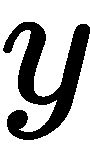
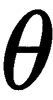
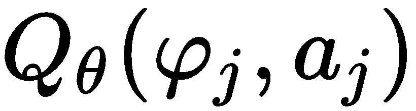

# 第五章：深度 Q 网络

到目前为止，我们已经接触并开发了强化学习算法，这些算法学习每个状态的价值函数`V`，或每个动作-状态对的动作价值函数`Q`。这些方法涉及单独存储和更新每个值在一个表格（或数组）中。由于状态和动作的数量庞大，这些方法无法扩展，因为表格的维度会呈指数增长，容易超出可用的内存容量。

在本章中，我们将介绍在强化学习算法中使用函数逼近来克服这个问题。特别是，我们将关注应用于 Q-learning 的深度神经网络。本章的第一部分，我们将解释如何使用函数逼近扩展 Q-learning 来存储 Q 值，并探讨我们可能面临的一些主要困难。在第二部分，我们将介绍一种新算法——**深度 Q 网络**（**DQN**），它利用新的思想，为在传统 Q-learning 与神经网络结合中遇到的一些挑战提供了优雅的解决方案。你将看到该算法如何在仅从像素学习的多种游戏中取得令人惊讶的成果。此外，您将实现该算法并将其应用于 Pong，亲自体验它的一些优点和弱点。

自从提出 DQN 以来，其他研究人员提出了许多变种，这些变种为算法提供了更好的稳定性和效率。我们将快速浏览并实现其中一些，以便更好地理解基础版本 DQN 的弱点，并为您提供一些思路，以便您自己改进它。

本章将涵盖以下主题：

+   深度神经网络与 Q-learning

+   DQN

+   DQN 应用于 Pong

+   DQN 变种

# 深度神经网络与 Q-learning

如我们在第四章《Q-Learning 和 SARSA 应用》中看到的那样，Q-learning 算法具有许多优点，使其能够应用于许多现实世界的场景。该算法的一个关键要素是它利用 Bellman 方程来学习 Q 函数。Q-learning 算法使用的 Bellman 方程能够从后续的状态-动作值中更新 Q 值。这使得该算法能够在每一步学习，而无需等待轨迹完成。此外，每个状态或动作-状态对都有自己存储的值，保存在查找表中，以便保存和检索相应的值。正因为如此，Q-learning 只要反复采样所有状态-动作对，就会收敛到最优值。此外，该方法使用两种策略：非贪婪行为策略用于从环境中收集经验（例如，-贪婪），以及遵循最大 Q 值的目标贪婪策略。

维持表格形式的值表示可能是不可取的，有时甚至是有害的。因为大多数问题都有非常高的状态和动作数量。例如，图像（包括小图像）所包含的状态比宇宙中的原子还要多。你可以轻易猜到，在这种情况下，无法使用表格。除了这种表格所需的无限存储空间之外，只有少数状态会被访问多次，这使得关于 Q 函数或 V 函数的学习变得极为困难。因此，我们可能希望对状态进行泛化。在这种情况下，泛化意味着我们不仅仅关注一个状态的精确值，*V(s)*，还关注相似和邻近状态的值。如果一个状态从未被访问过，我们可以用一个接近它的状态的值来逼近它。一般来说，泛化的概念在所有机器学习中都极为重要，包括强化学习。

泛化的概念在代理无法全面了解环境的情况下是至关重要的。在这种情况下，环境的完整状态将被代理隐藏，代理只能基于环境的有限表示做出决策。这被称为**观察**。例如，想象一个类人代理处理现实世界中的基本交互。显然，它无法看到整个宇宙的状态以及所有原子的情况。它只有一个有限的视角，也就是通过其传感器（例如视频摄像头）感知到的观察。正因如此，类人代理应该对周围发生的事情进行泛化，并相应地作出行为。

# 函数逼近

现在我们已经讨论了表格算法的主要约束，并表达了在强化学习（RL）算法中对泛化能力的需求，我们需要处理一些工具，帮助我们摆脱这些表格约束并解决泛化问题。

我们现在可以放弃表格，并用函数逼近器来表示值函数。函数逼近使我们能够在约束域内使用固定量的内存表示值函数。资源分配仅取决于用于逼近问题的函数。函数逼近器的选择，如同以往，依赖于任务的具体需求。函数逼近的例子有线性函数、决策树、最近邻算法、人工神经网络等等。正如你所预料的，人工神经网络被优先选择，因为它们在所有其他方法中占据主导地位——这并非偶然，它已广泛应用于各种强化学习算法中。特别地，深度人工神经网络，或者简言之，**深度神经网络**（**DNNs**），被广泛使用。它们的流行源于其高效性和能够自我学习特征的能力，随着网络隐藏层的增加，能够创建层次化的表示。此外，深度神经网络，特别是**卷积神经网络**（**CNNs**），在处理图像方面表现得极为出色，正如近期的突破所示，特别是在监督学习任务中。但尽管几乎所有关于深度神经网络的研究都集中在监督学习中，它们在强化学习框架中的应用却产生了非常有趣的结果。然而，正如我们稍后会看到的，这并不容易。

# 使用神经网络的 Q 学习

在 Q 学习中，深度神经网络通过学习一组权重来近似 Q 值函数。因此，Q 值函数通过  （网络的权重）来参数化，并写作如下：


为了将 Q 学习与深度神经网络结合（这一组合被称为深度 Q 学习），我们必须提出一个损失函数（或目标）来进行最小化。

如你所记得，表格形式的 Q 学习更新如下：


在这里，  是下一步的状态。此更新在每个通过行为策略收集到的样本上进行在线更新。

与前几章相比，为了简化符号表示，在这里我们将  称为当前步骤中的状态和动作，而  则称为下一步中的状态和动作。

在神经网络中，我们的目标是优化权重 ，使得  更接近最优的 Q 值函数。但由于我们没有最优的 Q 函数，我们只能通过最小化 Bellman 错误来朝着最优 Q 函数迈出小步伐，这个 Bellman 错误是一步的误差，即 。这一步类似于我们在表格 Q 学习中所做的。然而，在深度 Q 学习中，我们不更新单一的值 。相反，我们对 Q 函数相对于参数  进行梯度计算：


这里， 是关于  相对于  的偏导数。 被称为学习率，它表示朝着梯度方向迈出的步伐大小。

实际上，我们刚才从表格 Q 学习到深度 Q 学习的平滑过渡，并没有产生一个良好的近似。第一个修复方法是使用**均方误差**（**MSE**）作为损失函数（而不是 Bellman 错误）。第二个修复方法是将在线 Q 迭代迁移到批量 Q 迭代。这意味着神经网络的参数会通过一次性使用多个过渡来更新（例如，在监督学习设置中使用大于 1 的小批量）。这些更改产生了以下损失函数：


这里， 不是实际的动作价值函数，因为我们并没有使用它。相反，它是 Q 目标值：


然后，网络参数  通过在均方误差（MSE）损失函数  上进行梯度下降来更新：


非常重要的一点是， 被视为常数，损失函数的梯度不会进一步传播。

由于在前一章中，我们介绍了蒙特卡洛（MC）算法，我们希望强调这些算法也可以调整为与神经网络一起使用。在这种情况下， 将是回报，。由于 MC 更新没有偏差，它在渐近意义上优于时序差分（TD），但在实践中，后者的表现更好。

# 深度 Q 学习的不稳定性

有了我们刚刚提出的损失函数和优化技术，你应该能够开发出深度 Q 学习算法。然而，现实要复杂得多。实际上，如果我们尝试实现它，可能无法成功。为什么？一旦引入神经网络，我们就无法保证算法的改进。尽管表格型 Q 学习具有收敛能力，但其神经网络版本并不具备。

Sutton 和 Barto 在*《强化学习：导论》*中提出了一个问题，叫做致命三合一问题，它出现在以下三种因素结合时：

+   函数逼近

+   自举法（即，由其他估计值进行的更新）

+   离策略学习（Q 学习是一种离策略算法，因为它的更新与所使用的策略无关）

但这些恰恰是深度 Q 学习算法的三个主要成分。正如作者所指出的那样，我们无法摆脱自举法，而不影响计算成本或数据效率。此外，离策略学习对于创建更智能、更强大的代理至关重要。显然，没有深度神经网络，我们将失去一个非常重要的组件。因此，设计能够保持这三种成分的算法，同时减轻致命三合一问题，是非常重要的。

此外，从方程（5.2）和（5.3）来看，问题可能看起来类似于有监督回归，但它并非如此。在有监督学习中，进行 SGD 时，迷你批次总是从数据集中随机抽样，以确保它们是**独立同分布**（**IID**）的。而在强化学习中，经验是由策略收集的。由于状态是顺序的并且相互关联，i.i.d 假设立即失效，这在执行 SGD 时会导致严重的不稳定性。

另一个不稳定性的原因是 Q 学习过程的非平稳性。从方程（5.2）和（5.3）中可以看出，同一个神经网络在更新时也是计算目标值的网络，。考虑到目标值在训练过程中也会被更新，这一点是危险的。这就像是射击一个移动的圆形目标，却没有考虑到它的运动。这些行为仅仅是神经网络的泛化能力所致；实际上，在表格型情况下并不是问题。

深度 Q 学习在理论上理解较少，但正如我们很快会看到的那样，有一种算法通过使用一些技巧来增加数据的 i.i.d 性并缓解目标移动问题。这些技巧使得算法更加稳定和灵活。

# DQN

DQN 首次出现在 Mnih 等人（DeepMind）发表的论文*通过深度强化学习实现人类水平控制*中，是第一个将 Q 学习与深度神经网络结合的可扩展强化学习算法。为了克服稳定性问题，DQN 采用了两种新的技术，这些技术对算法的平衡至关重要。

DQN 已经证明自己是第一个能够在多种具有挑战性的任务中学习的人工智能代理。此外，它已经学会了如何仅通过高维度行像素作为输入，并采用端到端的强化学习方法来控制多个任务。

# 解决方案

DQN 带来的关键创新包括**回放缓冲区**，以克服数据相关性问题，以及一个独立的*目标网络*，以解决非平稳性问题。

# 回放记忆

为了在 SGD 迭代中使用更多的 IID 数据，DQN 引入了回放记忆（也叫经验回放）来收集和存储在一个大缓冲区中的经验。这个缓冲区理想情况下包含了智能体在其生命周期中发生的所有转移。在执行 SGD 时，将从经验回放中随机抽取一个小批量样本，并用于优化过程。由于回放记忆缓冲区存储了多样化的经验，从中抽取的小批量样本将具有足够的多样性，提供独立的样本。使用经验回放的另一个非常重要的特点是，它使得数据的可重用性得以实现，因为这些转移将被多次抽取。这大大提高了算法的数据效率。

# 目标网络

移动目标问题是由于在训练过程中持续更新网络，这也修改了目标值。然而，神经网络必须不断更新自己，以提供最佳的状态-动作值。DQNs 中采用的解决方案是使用两个神经网络。一个被称为*在线网络*，它不断更新，而另一个被称为*目标网络*，它只在每隔`N`次迭代后更新（`N`通常在 1,000 到 10,000 之间）。在线网络用于与环境交互，而目标网络用于预测目标值。通过这种方式，对于`N`次迭代，目标网络生成的目标值保持不变，防止了不稳定性的传播并降低了发散的风险。一个潜在的缺点是目标网络是在线网络的旧版本。然而，在实践中，优点远远大于缺点，算法的稳定性将显著提高。

# DQN 算法

在深度 Q 学习算法中引入重放缓冲区和单独的目标网络，使得从只有图像、奖励和终止信号开始，便能控制 Atari 游戏（如《太空侵略者》、《乒乓》和《打砖块》）。DQN 通过结合卷积神经网络（CNN）和全连接神经网络，完全端到端地进行学习。

DQN 已经在 49 个 Atari 游戏上分别进行了训练，使用相同的算法、网络架构和超参数。它表现得比所有以前的算法更好，在许多游戏中达到了与专业玩家相当甚至更好的水平。Atari 游戏并不容易解决，其中许多需要复杂的规划策略。实际上，其中一些（如著名的《蒙特祖马的复仇》）要求的水平甚至是 DQN 尚未能够达到的。

这些游戏的一个特点是，由于它们仅向代理提供图像，因此它们是部分可观测的。它们没有显示环境的完整状态。事实上，一张图像不足以完全理解当前的情况。例如，你能从以下图像中推断出球的方向吗？


图 5.1\. Pong 的渲染

你做不到，代理也做不到。为了克服这种情况，在每个时间点，都会考虑一系列先前的观察结果。通常会使用最后两到五帧，在大多数情况下，它们能较为准确地近似实际的整体状态。

# 损失函数

深度 Q 网络通过最小化我们已经介绍的损失函数(5.2)来进行训练，但进一步使用了一个单独的 Q 目标网络，，并且带有权重，，将一切整合起来，损失函数变为：


这里，是在线网络的参数。

可微分损失函数(5.4)的优化使用了我们最喜欢的迭代方法，即小批量梯度下降。也就是说，学习更新应用于从经验缓冲区均匀抽取的小批量数据。损失函数的导数如下：


与深度 Q 学习中的问题框架不同，在 DQN 中，学习过程更加稳定。此外，由于数据更加独立同分布（i.i.d.），并且目标（以某种方式）是固定的，因此它与回归问题非常相似。但另一方面，目标仍然依赖于网络权重。

如果你在每一步都优化损失函数(5.4)，并且只对单一样本进行优化，你将得到带有函数逼近的 Q 学习算法。

# 伪代码

现在，DQN 的所有组件都已被解释清楚，我们可以将所有部分结合起来，向你展示该算法的伪代码版本，以澄清任何不确定的地方（如果你还是不明白，也不用担心——在下一节，你将实现它，一切都会变得更清晰）。

DQN 算法涉及三个主要部分：

+   数据收集和存储。数据通过遵循行为策略（例如，-贪心）进行收集。

+   神经网络优化（对从缓冲区中采样的小批量数据执行 SGD）。

+   目标更新。

DQN 的伪代码如下：

```py
Initialize  function with random weight 
Initialize  function with random weight 
Initialize empty replay memory 

for  do Initialize environment 
    for  do
        > Collect observation from the env:

        > Store the transition in the replay buffer:

        > Update the model using (5.4):
        Sample a random minibatch  from 

        Perform a step of GD on  on 
        > Update target network:
        Every C steps   

    end for 
end for
```

这里，`d`是由环境返回的标志，指示环境是否处于最终状态。如果`d=True`，即表示这一回合结束，环境需要重置。

是一个预处理步骤，它通过降低图像的维度来改变图像（将图像转换为灰度图并将其调整为更小的尺寸），并将最后`n`帧添加到当前帧。通常，`n`的值介于 2 和 4 之间。预处理部分将在下一节中详细解释，我们将在那里实现 DQN。

在 DQN 中，经验回放，，是一个动态缓冲区，用来存储有限数量的帧。在论文中，缓冲区包含了最后 100 万次转换，当它超过这个数量时，会丢弃旧的经验。

其他部分已经描述过。如果你在想为什么目标值，，会取的值，原因是之后不会再与环境进行交互，因此是其实际的无偏 Q 值。

# 模型架构

到目前为止，我们已经讨论了算法本身，但还没有解释 DQN 的架构。除了为稳定训练而采用的新思想外，DQN 的架构在算法的最终表现中也起着至关重要的作用。在*DQN*论文中，所有的 Atari 环境都使用了单一的模型架构。它结合了 CNN 和 FNN。特别地，作为输入的观察图像使用 CNN 来学习这些图像的特征图。CNN 由于具有平移不变性特征和共享权重的属性，已经广泛应用于图像处理中，这使得网络能够比其他类型的深度神经网络使用更少的权重进行学习。

模型的输出对应于状态-动作值，每个动作有一个输出值。因此，为了控制一个具有五个动作的智能体，模型将为每个动作输出一个值。这种模型架构允许我们仅通过一次前向传递就计算出所有的 Q 值。

有三个卷积层。每一层包括一个卷积操作，过滤器数量逐渐增加，维度逐渐减小，同时还有一个非线性函数。最后一个隐藏层是一个全连接层，后接一个修正激活函数和一个全连接的线性层，每个动作都有一个输出。以下是该架构的简要表示：


图 5.2\. DQN 的 DNN 架构示意图，由 CNN 和 FNN 组成

# DQN 应用于 Pong

配备了关于 Q-learning、深度神经网络和 DQN 的所有技术知识后，我们终于可以开始实际应用并启动 GPU 了。在本节中，我们将 DQN 应用到 Atari 环境 Pong。我们选择 Pong 而非其他所有 Atari 环境，因为它更容易解决，因此需要更少的时间、计算能力和内存。话虽如此，如果你有一个不错的 GPU，可以将相同的配置应用于几乎所有其他 Atari 游戏（有些可能需要稍微调整）。出于同样的原因，我们采用了比原始 DQN 论文中更轻量的配置，既包括函数逼近器的容量（即更少的权重），也包括超参数如较小的缓存大小。这不会影响 Pong 的结果，但可能会影响其他游戏的表现。

首先，我们将简要介绍 Atari 环境和预处理管道，然后再继续进行 DQN 实现。

# Atari 游戏

自从 DQN 论文中首次介绍 Atari 游戏以来，它们就成为了深度强化学习算法的标准测试平台。这些游戏最初通过 **Arcade Learning Environment**（**ALE**）提供，随后被 OpenAI Gym 封装，提供了标准接口。ALE（和 Gym）包括 57 款最受欢迎的 Atari 2600 视频游戏，如 Montezuma's Revenge、Pong、Breakout 和 Space Invaders，如下图所示。这些游戏由于其高维状态空间（210 x 160 像素）以及游戏之间的任务多样性，已广泛应用于强化学习研究：


图 5.3 Montezuma's Revenge、Pong、Breakout 和 Space Invaders 环境

关于 Atari 环境的一个非常重要的说明是，它们是确定性的，这意味着在给定一组固定的动作时，多个比赛中的结果将是相同的。从算法的角度来看，这种确定性在所有历史数据用于从随机策略中选择动作之前都是成立的。

# 预处理

Atari 中的每一帧为 210 x 160 像素，采用 RGB 颜色，因此其整体尺寸为 210 x 160 x 3。如果使用 4 帧的历史数据，则输入的维度为 210 x 160 x 12。如此高的维度计算量大，而且在经验缓存中存储大量帧可能会变得困难。因此，必须进行预处理以减少维度。在原始的 DQN 实现中，使用了以下预处理管道：

+   RGB 颜色被转换为灰度图。

+   图像被下采样至 110 x 84，然后裁剪为 84 x 84。

+   最后三到四帧会与当前帧拼接。

+   对帧进行归一化处理。

此外，由于游戏以高帧率运行，采用了一种称为“跳帧”的技术，用于跳过连续帧。这项技术使得智能体能够在每局游戏中存储和训练较少的帧，而不会显著降低算法的性能。实际上，使用跳帧技术时，智能体每隔帧选择一个动作，并在跳过的帧上重复该动作。

此外，在某些环境中，每局游戏开始时，智能体必须按下开火按钮才能开始游戏。另外，由于环境的确定性，在重置环境时，某些无操作（no-ops）会被执行，以便将智能体随机放置在一个位置。

幸运的是，OpenAI 发布了与 Gym 接口兼容的预处理管道实现。你可以在本书的 GitHub 仓库中的`atari_wrappers.py`文件中找到它。在这里，我们仅简要解释一下该实现：

+   `NoopResetEnv(n)`：在重置环境时执行`n`次无操作（no-op），以为智能体提供一个随机的起始位置。

+   `FireResetEnv()`：在环境重置时开火（仅在某些游戏中需要）。

+   `MaxAndSkipEnv(skip)`：跳过`skip`帧，并确保重复动作和累计奖励。

+   `WarpFrame()`：将帧大小调整为 84 x 84 并转换为灰度图。

+   `FrameStack(k)`：将最近的`k`帧堆叠在一起。

所有这些功能都作为包装器实现。包装器是一种通过在环境上方添加新层，来轻松转换环境的方式。例如，要在 Pong 中缩放帧，我们会使用以下代码：

```py
env = gym.make('Pong-v0')
env = ScaledFloatFrame(env)
```

包装器必须继承`gym.Wrapper`类，并且至少重载以下方法之一：`__init__(self, env)`、`step`、`reset`、`render`、`close`或`seed`。

这里我们不会展示所有列出的包装器的实现，因为它们超出了本书的范围，但我们将使用`FireResetEnv`和`WrapFrame`作为示例，给你一个大致的实现概念。完整的代码可以在本书的 GitHub 仓库中找到：

```py
class FireResetEnv(gym.Wrapper):
    def __init__(self, env):
        """Take action on reset for environments that are fixed until firing."""
        gym.Wrapper.__init__(self, env)
        assert env.unwrapped.get_action_meanings()[1] == 'FIRE'
        assert len(env.unwrapped.get_action_meanings()) >= 3

    def reset(self, **kwargs):
        self.env.reset(**kwargs)
        obs, _, done, _ = self.env.step(1)
        if done:
            self.env.reset(**kwargs)
        obs, _, done, _ = self.env.step(2)
        if done:
            self.env.reset(**kwargs)
        return obs

    def step(self, ac):
        return self.env.step(ac)
```

首先，`FireResetEnv`继承自 Gym 的`Wrapper`类。然后，在初始化时，通过`env.unwrapped`解包环境，检查`fire`动作的可用性。该函数通过调用在前一层中定义的`self.env.reset`来重写`reset`函数，接着通过调用`self.env.step(1)`执行一个开火动作，并执行一个依赖于环境的动作`self.env.step(2)`。

`WrapFrame`具有类似的定义：

```py
class WarpFrame(gym.ObservationWrapper):
    def __init__(self, env):
        """Warp frames to 84x84 as done in the Nature paper and later work."""
        gym.ObservationWrapper.__init__(self, env)
        self.width = 84
        self.height = 84
        self.observation_space = spaces.Box(low=0, high=255,
                shape=(self.height, self.width, 1), dtype=np.uint8)
    def observation(self, frame):
        frame = cv2.cvtColor(frame, cv2.COLOR_RGB2GRAY)
        frame = cv2.resize(frame, (self.width, self.height), interpolation=cv2.INTER_AREA)
        return frame[:, :, None]
```

这次，`WarpFrame`继承自`gym.ObservationWrapper`，并创建了一个维度为 84 x 84、值范围在 0 到 255 之间的`Box`空间。当调用`observation()`时，它将 RGB 帧转换为灰度图像，并将图像调整为所选形状。

然后我们可以创建一个函数`make_env`，将每个包装器应用到环境中：

```py
def make_env(env_name, fire=True, frames_num=2, noop_num=30, skip_frames=True):
    env = gym.make(env_name)
    if skip_frames:
        env = MaxAndSkipEnv(env) # Return only every `skip`-th frame
    if fire:
        env = FireResetEnv(env) # Fire at the beginning
    env = NoopResetEnv(env, noop_max=noop_num)
    env = WarpFrame(env) # Reshape image
    env = FrameStack(env, frames_num) # Stack last 4 frames
    return env
```

唯一缺失的预处理步骤是帧的缩放。我们将在将观察帧作为输入传递给神经网络之前处理缩放。这是因为`FrameStack`使用了一种特定的节省内存的数组，称为懒数组，每当缩放作为包装器应用时，这种数组就会丢失。

# DQN 实现

尽管 DQN 是一个相当简单的算法，但在实现和设计选择时需要特别注意。与其他深度强化学习算法一样，这个算法并不容易调试和调整。因此，在本书中，我们将为您提供一些技巧和建议，帮助您完成这些任务。

DQN 代码包含四个主要组件：

+   DNNs

+   一个经验缓冲区

+   一个计算图

+   一个训练（和评估）循环

代码，像往常一样，使用 Python 和 TensorFlow 编写，我们将使用 TensorBoard 来可视化训练过程和算法的性能。

所有代码都可以在本书的 GitHub 仓库中找到。务必去那里查看。为了避免使代码过于冗长，我们没有提供一些简单函数的实现。

让我们立即开始实现，导入所需的库：

```py
import numpy as np
import tensorflow as tf
import gym
from datetime import datetime
from collections import deque
import time
import sys

from atari_wrappers import make_env
```

`atari_wrappers`包含我们之前定义的`make_env`函数。

# DNNs

DNN 架构如下（组件按顺序构建）：

1.  一个 16 个过滤器的卷积，过滤器维度为 8 x 8，步幅为 4，采用整流非线性激活函数。

1.  一个 32 个过滤器的卷积，过滤器维度为 4 x 4，步幅为 2，采用整流非线性激活函数。

1.  一个 32 个过滤器的卷积，过滤器维度为 3 x 3，步幅为 1，采用整流非线性激活函数。

1.  一个 128 单元的全连接层，使用 ReLU 激活函数。

1.  一个全连接层，其单元数等于环境中允许的动作数量，并采用线性激活函数。

在`cnn`中，我们定义了前三个卷积层，而在`fnn`中，我们定义了最后两个全连接层：

```py
def cnn(x):
    x = tf.layers.conv2d(x, filters=16, kernel_size=8, strides=4, padding='valid', activation='relu') 
    x = tf.layers.conv2d(x, filters=32, kernel_size=4, strides=2, padding='valid', activation='relu') 
    return tf.layers.conv2d(x, filters=32, kernel_size=3, strides=1, padding='valid', activation='relu') 

def fnn(x, hidden_layers, output_layer, activation=tf.nn.relu, last_activation=None):
    for l in hidden_layers:
        x = tf.layers.dense(x, units=l, activation=activation)
    return tf.layers.dense(x, units=output_layer, activation=last_activation)

```

在上述代码中，`hidden_layers`是一个整数值的列表。在我们的实现中，它是`hidden_layers=[128]`。另一方面，`output_layer`表示代理动作的数量。

在`qnet`中，CNN 和 FNN 层通过一个层连接，该层将 CNN 的二维输出展平：

```py
def qnet(x, hidden_layers, output_size, fnn_activation=tf.nn.relu, last_activation=None):
    x = cnn(x)
    x = tf.layers.flatten(x)
    return fnn(x, hidden_layers, output_size, fnn_activation, last_activation)
```

深度神经网络现在已经完全定义。我们需要做的就是将其连接到主计算图。

# 经验缓冲区

经验缓冲区是`ExperienceBuffer`类型的类，并存储一个**FIFO**（**先进先出**）类型的队列，用于存储以下每个组件：观察、奖励、动作、下一观察和完成。FIFO 意味着，一旦达到`maxlen`指定的最大容量，它将从最旧的元素开始丢弃。在我们的实现中，容量为`buffer_size`：

```py
class ExperienceBuffer():

    def __init__(self, buffer_size):
        self.obs_buf = deque(maxlen=buffer_size)
        self.rew_buf = deque(maxlen=buffer_size)
        self.act_buf = deque(maxlen=buffer_size)
        self.obs2_buf = deque(maxlen=buffer_size)
        self.done_buf = deque(maxlen=buffer_size)

    def add(self, obs, rew, act, obs2, done):
        self.obs_buf.append(obs)
        self.rew_buf.append(rew)
        self.act_buf.append(act)
        self.obs2_buf.append(obs2)
        self.done_buf.append(done)
```

`ExperienceBuffer`类还管理小批量的采样，这些小批量用于训练神经网络。这些小批量是从缓冲区中均匀采样的，并且具有预定义的`batch_size`大小：

```py
    def sample_minibatch(self, batch_size):
        mb_indices = np.random.randint(len(self.obs_buf), size=batch_size)

        mb_obs = scale_frames([self.obs_buf[i] for i in mb_indices])
        mb_rew = [self.rew_buf[i] for i in mb_indices]
        mb_act = [self.act_buf[i] for i in mb_indices]
        mb_obs2 = scale_frames([self.obs2_buf[i] for i in mb_indices])
        mb_done = [self.done_buf[i] for i in mb_indices]

        return mb_obs, mb_rew, mb_act, mb_obs2, mb_done
```

最后，我们重写了`_len`方法，以提供缓冲区的长度。请注意，由于每个缓冲区的大小相同，我们只返回`self.obs_buf`的长度：

```py
    def __len__(self):
        return len(self.obs_buf)
```

# 计算图和训练循环

算法的核心，即计算图和训练（及评估）循环，已经在`DQN`函数中实现，该函数将环境的名称和所有其他超参数作为参数：

```py
def DQN(env_name, hidden_sizes=[32], lr=1e-2, num_epochs=2000, buffer_size=100000, discount=0.99, update_target_net=1000, batch_size=64, update_freq=4, frames_num=2, min_buffer_size=5000, test_frequency=20, start_explor=1, end_explor=0.1, explor_steps=100000):

    env = make_env(env_name, frames_num=frames_num, skip_frames=True, noop_num=20)
    env_test = make_env(env_name, frames_num=frames_num, skip_frames=True, noop_num=20)
    env_test = gym.wrappers.Monitor(env_test, "VIDEOS/TEST_VIDEOS"+env_name+str(current_milli_time()),force=True, video_callable=lambda x: x%20==0)

    obs_dim = env.observation_space.shape
    act_dim = env.action_space.n 
```

在前面代码的前几行中，创建了两个环境：一个用于训练，另一个用于测试。此外，`gym.wrappers.Monitor`是一个 Gym 封装器，它将环境的游戏保存为视频格式，而`video_callable`是一个函数参数，用于确定视频保存的频率，在这种情况下是每 20 集保存一次。

然后，我们可以重置 TensorFlow 图并为观察值、动作和目标值创建占位符。这可以通过以下代码行完成：

```py
    tf.reset_default_graph()
    obs_ph = tf.placeholder(shape=(None, obs_dim[0], obs_dim[1], obs_dim[2]), dtype=tf.float32, name='obs')
    act_ph = tf.placeholder(shape=(None,), dtype=tf.int32, name='act')
    y_ph = tf.placeholder(shape=(None,), dtype=tf.float32, name='y')
```

现在，我们可以通过调用之前定义的`qnet`函数来创建目标网络和在线网络。由于目标网络需要时不时更新自己并采用在线网络的参数，因此我们创建了一个名为`update_target_op`的操作，用于将在线网络的每个变量分配给目标网络。这一分配通过 TensorFlow 的`assign`方法完成。另一方面，`tf.group`将`update_target`列表中的每个元素聚合为一个操作。实现如下：

```py
    with tf.variable_scope('target_network'):
        target_qv = qnet(obs_ph, hidden_sizes, act_dim)
    target_vars = tf.trainable_variables()

    with tf.variable_scope('online_network'):
        online_qv = qnet(obs_ph, hidden_sizes, act_dim)
    train_vars = tf.trainable_variables()

    update_target = [train_vars[i].assign(train_vars[i+len(target_vars)]) for i in range(len(train_vars) - len(target_vars))]
    update_target_op = tf.group(*update_target)
```

现在，我们已经定义了创建深度神经网络的占位符，并定义了目标更新操作，剩下的就是定义损失函数。损失函数是（或者等价地，(5.5)）。它需要目标值，，

按照公式(5.6)计算，它们通过`y_ph`占位符和在线网络的 Q 值传递，。Q 值依赖于动作，，但由于在线网络为每个动作输出一个值，我们必须找到一种方法来仅提取的 Q 值，同时丢弃其他动作值。这个操作可以通过使用动作的独热编码（one-hot encoding）来实现，，然后将其与在线网络的输出相乘。例如，如果有五个可能的动作且，那么独热编码将是。然后，假设网络输出，与独热编码的乘积结果将是。接下来，通过对这个向量求和，获得 q 值。结果将是。这一切在以下三行代码中完成：

```py
    act_onehot = tf.one_hot(act_ph, depth=act_dim)
    q_values = tf.reduce_sum(act_onehot * online_qv, axis=1)
    v_loss = tf.reduce_mean((y_ph - q_values)**2)
```

为了最小化我们刚才定义的损失函数，我们将使用 Adam，这是 SGD 的一种变体：

```py
    v_opt = tf.train.AdamOptimizer(lr).minimize(v_loss)
```

这就完成了计算图的创建。在进入主要的 DQN 循环之前，我们需要准备好一切，以便可以保存标量和直方图。这样做后，我们就能够在 TensorBoard 中查看它们：

```py
    now = datetime.now()
    clock_time = "{}_{}.{}.{}".format(now.day, now.hour, now.minute, int(now.second))

    mr_v = tf.Variable(0.0)
    ml_v = tf.Variable(0.0)

    tf.summary.scalar('v_loss', v_loss)
    tf.summary.scalar('Q-value', tf.reduce_mean(q_values))
    tf.summary.histogram('Q-values', q_values)

    scalar_summary = tf.summary.merge_all()
    reward_summary = tf.summary.scalar('test_rew', mr_v)
    mean_loss_summary = tf.summary.scalar('mean_loss', ml_v)

    hyp_str = "-lr_{}-upTN_{}-upF_{}-frms_{}".format(lr, update_target_net, update_freq, frames_num)
    file_writer = tf.summary.FileWriter('log_dir/'+env_name+'/DQN_'+clock_time+'_'+hyp_str, tf.get_default_graph())
```

一切都非常直观。唯一可能让你疑问的是`mr_v`和`ml_v`这两个变量。它们是我们希望通过 TensorBoard 跟踪的变量。然而，由于它们没有在计算图中内部定义，我们必须单独声明它们，并在稍后的`session.run`中赋值。`FileWriter`是用一个唯一的名字创建的，并与默认图相关联。

我们现在可以定义`agent_op`函数，用于计算缩放后的观察值的前向传递。该观察值已经通过了预处理管道（在环境中通过包装器构建），但我们将缩放操作放到了一边：

```py
    def agent_op(o):
        o = scale_frames(o)
        return sess.run(online_qv, feed_dict={obs_ph:[o]})

```

然后，创建会话，初始化变量，并重置环境：

```py
    sess = tf.Session()
    sess.run(tf.global_variables_initializer())

    step_count = 0
    last_update_loss = []
    ep_time = current_milli_time()
    batch_rew = []

    obs = env.reset()
```

接下来的步骤包括实例化回放缓冲区，更新目标网络使其具有与在线网络相同的参数，并用`eps_decay`初始化衰减率。epsilon 衰减的策略与 DQN 论文中采用的相同。衰减率的选择使得当它线性应用于`eps`变量时，它将在大约`explor_steps`步内达到终值`end_explor`。例如，如果你想在 1000 步内从 1.0 降低到 0.1，那么你必须在每一步减小一个等于的值。所有这一切都在以下几行代码中完成：

```py
    obs = env.reset()

    buffer = ExperienceBuffer(buffer_size)

    sess.run(update_target_op)

    eps = start_explor
    eps_decay = (start_explor - end_explor) / explor_steps
```

如你所记得，训练循环由两个内层循环组成：第一个循环遍历训练周期，第二个循环遍历每个周期的过渡阶段。最内层循环的第一部分是相当标准的。它根据使用在线网络的-贪婪行为策略选择一个动作，执行一步环境操作，将新的过渡加入缓冲区，并最终更新变量：

```py
    for ep in range(num_epochs):
        g_rew = 0
        done = False

        while not done:
            act = eps_greedy(np.squeeze(agent_op(obs)), eps=eps)
            obs2, rew, done, _ = env.step(act)
            buffer.add(obs, rew, act, obs2, done)

            obs = obs2
            g_rew += rew
            step_count += 1
```

在前面的代码中，`obs`获取下一个观察值，累计的游戏奖励会增加。

然后，在相同的循环中，`eps`会衰减，如果满足某些条件，则训练在线网络。这些条件确保缓冲区已达到最小大小，并且神经网络仅在每`update_freq`步时训练一次。为了训练在线网络，首先，从缓冲区中采样一个小批量，并计算目标值。然后，运行会话以最小化损失函数`v_loss`，并将目标值、动作和小批量的观察值传入字典。在会话运行期间，它还会返回`v_loss`和`scalar_summary`以供统计使用。接着，`scalar_summary`会被添加到`file_writer`中保存到 TensorBoard 日志文件。最后，每经过`update_target_net`个周期，目标网络会更新。一个包含平均损失的总结也会被运行并添加到 TensorBoard 日志文件中。所有这些操作通过以下代码片段完成：

```py
            if eps > end_explor:
                eps -= eps_decay

            if len(buffer) > min_buffer_size and (step_count % update_freq == 0):
                mb_obs, mb_rew, mb_act, mb_obs2, mb_done = buffer.sample_minibatch(batch_size)
                mb_trg_qv = sess.run(target_qv, feed_dict={obs_ph:mb_obs2})
                y_r = q_target_values(mb_rew, mb_done, mb_trg_qv, discount) # Compute the target values
                train_summary, train_loss, _ = sess.run([scalar_summary, v_loss, v_opt], feed_dict={obs_ph:mb_obs, y_ph:y_r, act_ph: mb_act})

                file_writer.add_summary(train_summary, step_count)
                last_update_loss.append(train_loss)

            if (len(buffer) > min_buffer_size) and (step_count % update_target_net) == 0:
                _, train_summary = sess.run([update_target_op, mean_loss_summary], feed_dict={ml_v:np.mean(last_update_loss)})
                file_writer.add_summary(train_summary, step_count)
                last_update_loss = []
```

当一个周期结束时，环境会被重置，游戏的总奖励被添加到`batch_rew`中，并将后者设为零。此外，每隔`test_frequency`个周期，代理会在 10 局游戏中进行测试，统计数据会被添加到`file_writer`中。在训练结束时，环境和写入器将被关闭。代码如下：

```py
            if done:
                obs = env.reset()
                batch_rew.append(g_rew)
                g_rew = 0
        if ep % test_frequency == 0:
            test_rw = test_agent(env_test, agent_op, num_games=10)
            test_summary = sess.run(reward_summary, feed_dict={mr_v: np.mean(test_rw)})
            file_writer.add_summary(test_summary, step_count)
            print('Ep:%4d Rew:%4.2f, Eps:%2.2f -- Step:%5d -- Test:%4.2f %4.2f' % (ep,np.mean(batch_rew), eps, step_count, np.mean(test_rw), np.std(test_rw))
            batch_rew = []
    file_writer.close()
    env.close()
    env_test.close()
```

就是这样。我们现在可以调用`DQN`函数，传入 Gym 环境的名称和所有超参数：

```py
if __name__ == '__main__':
    DQN('PongNoFrameskip-v4', hidden_sizes=[128], lr=2e-4, buffer_size=100000, update_target_net=1000, batch_size=32, update_freq=2, frames_num=2, min_buffer_size=10000)

```

在报告结果之前，还有最后一点需要说明。这里使用的环境并非默认版本的`Pong-v0`，而是其修改版。之所以这样做，是因为在常规版本中，每个动作会执行 2、3 或 4 次，且这个次数是均匀采样的。但由于我们希望跳过固定次数，因此选择了没有内置跳过功能的版本`NoFrameskip`，并添加了自定义的`MaxAndSkipEnv`包装器。

# 结果

评估强化学习算法的进展非常具有挑战性。最明显的方式是追踪其最终目标；即，监控在周期中积累的总奖励。这是一个很好的指标。然而，由于权重的变化，训练过程中的平均奖励可能非常嘈杂。这会导致状态分布发生较大的变化。

基于这些原因，我们在每 20 次训练周期后评估算法在 10 个测试游戏上的表现，并跟踪整个游戏过程中累积的总（非折扣）奖励的平均值。此外，由于环境的确定性，我们使用 -贪婪策略（与 ）进行测试，以便进行更稳健的评估。这个标量总结称为 `test_rew`。你可以通过访问保存日志的目录并执行以下命令，在 TensorBoard 中查看它：

```py
tensorboard --logdir .
```

这个图示应该与你的图示类似（如果你运行了 DQN 代码）。它显示在下图中，x 轴表示步数。你可以看到，在前 250,000 步的线性增加之后，Q 值在接下来的 300,000 步内出现了更显著的增长，最终达到了一个稳定的得分 ：


图 5.4\. 10 场游戏的平均总奖励图示。x 轴表示步数

Pong 是一个相对简单的任务。事实上，我们的算法已经训练了大约 1.1 百万步，而在 DQN 论文中，所有的算法都是在 2 亿步上进行训练的。

评估算法的另一种方式是通过估计的动作值。事实上，估计的动作值是一个有价值的指标，因为它们衡量了状态-动作对的质量的信念。不幸的是，这个选项并不最优，因为一些算法倾向于高估 Q 值，正如我们很快会学到的那样。尽管如此，我们在训练过程中仍然追踪了它。图示如下所示，正如我们预期的那样，Q 值在训练过程中不断增加，与前面的图示相似：


图 5.5\. 估计的训练 Q 值图示。x 轴表示步数

另一个重要的图示，如下图所示，展示了损失函数随时间变化的情况。尽管它不像监督学习中那么有用，因为目标值并不是实际的真实值，但它仍然可以提供对模型质量的良好洞察：


图 5.6\. 损失函数的图示

# DQN 变体

在 DQN 取得惊人效果之后，许多研究人员对其进行了研究，并提出了整合与改进，以提高其稳定性、效率和性能。在这一部分，我们将介绍三种改进的算法，解释它们背后的思想和解决方案，并提供它们的实现。第一种是双重 DQN（Double DQN 或 DDQN），它解决了我们在 DQN 算法中提到的过度估计问题。第二种是对抗 DQN（Dueling DQN），它将 Q 值函数解耦为状态值函数和动作-状态优势值函数。第三种是 n 步 DQN（n-step DQN），它借鉴了 TD 算法中的一个旧思想，用于扩展一步学习与蒙特卡洛学习之间的步长。

# 双重 DQN

Q 学习算法中的 Q 值过度估计是一个众所周知的问题。其原因是最大值操作符，它会过度估计实际的最大估计值。为了理解这个问题，假设我们有噪声估计，其均值为 0，但方差不为 0，如下图所示。尽管从渐近上看，平均值为 0，但 max 函数总是会返回大于 0 的值：


图 5.7. 从均值为 0 的正态分布中采样的六个值

在 Q 学习中，过度估计通常不是一个实际问题，直到较高的值均匀分布。然而，如果过度估计并不均匀，并且误差在状态和动作间存在差异，这种过度估计会对 DQN 算法产生负面影响，从而降低生成的策略的质量。

为了解决这个问题，在论文[*深度强化学习与双 Q 学习*](https://arxiv.org/abs/1509.06461)中，作者建议使用两种不同的估计器（即两个人工神经网络）：一个用于动作选择，另一个用于 Q 值估计。但论文并没有使用两个不同的神经网络来增加复杂度，而是提出了使用在线网络来通过最大操作选择最佳动作，使用目标网络来计算其 Q 值。通过这个解决方案，目标值，，将会改变，从标准 Q 学习中的如下形式：


现在，它是如下所示：

 (5.7)

这种解耦版本显著减少了过度估计问题，并提高了算法的稳定性。

# DDQN 实现

从实现的角度来看，实现 DDQN 的唯一变化是在训练阶段。只需要在 DDQN 实现中替换以下代码行：

```py
mb_trg_qv = sess.run(target_qv, feed_dict={obs_ph:mb_obs2})
y_r = q_target_values(mb_rew, mb_done, mb_trg_qv, discount)
```

使用以下代码替换：

```py
mb_onl_qv, mb_trg_qv = sess.run([online_qv,target_qv], feed_dict={obs_ph:mb_obs2})
y_r = double_q_target_values(mb_rew, mb_done, mb_trg_qv, mb_onl_qv, discount)
```

在这里，`double_q_target_values`是一个计算每个小批量转换的(5.7)的函数。

# 结果

为了验证 DQN 是否真的高估了 Q 值，相对于 DDQN，我们在下图中展示了 Q 值的图表。我们还包括了 DQN（橙线）的结果，以便进行两种算法的直接比较：


图 5.8. 估计训练 Q 值的图表。DDQN 的值用蓝色表示，DQN 的值用橙色表示。x 轴表示步骤数量

DDQN（蓝线）和 DQN（橙线）的表现，通过测试游戏的平均奖励表示，结果如下：

关于本章节中提到的所有颜色参考，请参考[颜色图片包](http://www.packtpub.com/sites/default/files/downloads/9781789131116_ColorImages.pdf)。


图 5.9. 平均测试奖励的图表。DDQN 的值用蓝色表示，DQN 的值用橙色表示。x 轴表示步骤数量

正如我们预期的那样，DDQN 中的 Q 值始终小于 DQN，这意味着后者实际上在高估 Q 值。尽管如此，测试游戏的表现似乎并未受到影响，这意味着这些高估可能并未对算法的性能造成伤害。然而，请注意，我们只在 Pong 游戏上测试了该算法。一个算法的有效性不应该仅在单一环境中进行评估。事实上，在论文中，作者将其应用于所有 57 个 ALE 游戏，并报告称 DDQN 不仅能提供更准确的值估计，还在多个游戏中获得了更高的得分。

# 对抗 DQN

在论文《Dueling Network Architectures for Deep Reinforcement Learning》([`arxiv.org/abs/1511.06581`](https://arxiv.org/abs/1511.06581))中，提出了一种新型的神经网络架构，包含两个独立的估计器：一个用于状态值函数，另一个用于状态-动作优势值函数。

优势函数在强化学习中无处不在，其定义如下：


优势函数告诉我们某个动作的改善程度，，与在给定状态下的平均动作，相比。因此，如果是正值，这意味着该动作，，优于该状态下的平均动作，。相反，如果是负值，这意味着比该状态下的平均动作，更差。

因此，像论文中所做的那样分别估计价值函数和优势函数，使我们能够重建 Q 函数，如下所示：

 (5.8)

这里，已添加优势的均值，以提高 DQN 的稳定性。

对抗 DQN 的架构由两个头（或流）组成：一个用于价值函数，一个用于优势函数，且都共享一个公共的卷积模块。作者报告称，这种架构可以学习哪些状态是有价值的，哪些不是，而无需学习每个动作在某一状态下的绝对值。他们在 Atari 游戏上测试了这一新架构，并在整体性能方面取得了显著的提升。

# 对抗 DQN 实现

这种架构以及公式 (5.8) 的一个好处是，它不会对底层的强化学习算法施加任何更改。唯一的变化是在 Q 网络的构建上。因此，我们可以用 `dueling_qnet` 函数替换 `qnet`，其实现方法如下：

```py
def dueling_qnet(x, hidden_layers, output_size, fnn_activation=tf.nn.relu, last_activation=None):
    x = cnn(x)
    x = tf.layers.flatten(x)
    qf = fnn(x, hidden_layers, 1, fnn_activation, last_activation)
    aaqf = fnn(x, hidden_layers, output_size, fnn_activation, last_activation)
    return qf + aaqf - tf.reduce_mean(aaqf)
```

创建了两个前馈神经网络：一个只有一个输出（用于价值函数），另一个具有与智能体动作数相同的输出（用于状态依赖的动作优势函数）。最后一行返回公式 (5.8)。

# 结果

如下图所示，测试奖励的结果很有前景，证明了使用对抗架构的明显好处：


图 5.10。测试奖励的绘图。对抗 DQN 的值以红色绘制，DQN 的值以橙色绘制。x 轴表示步数。

# N 步 DQN

n 步 DQN 背后的思想很久以前就有了，它源于时间差分学习（TD）与蒙特卡罗学习（MC）之间的转变。这些算法在 第四章中介绍过，*Q-learning 和 SARSA 应用*，是一个常见谱系的两个极端。TD 学习从单一步骤中学习，而 MC 从完整的轨迹中学习。TD 学习表现出最小的方差，但最大偏差，而 MC 则表现出较大的方差，但最小偏差。方差-偏差问题可以通过使用 n 步返回来平衡。n 步返回是经过 `n` 步后计算的回报。TD 学习可以视为 0 步返回，而 MC 可以视为一个 -步返回。

通过 n 步返回，我们可以更新目标值，具体如下：

 (5.9)

这里， 是步数。

n 步回报就像向前看 `n` 步，但实际上，由于不可能真正预见未来，它是以相反的方式进行的，即通过计算 n 步前的值。这导致值仅在时间 `t - n` 处可用，从而延迟了学习过程。

这种方法的主要优点在于目标值偏差较小，这可能导致更快的学习。一个重要的问题是，这种方式计算的目标值只有在学习是 on-policy 时才正确（DQN 是 off-policy）。这是因为公式（5.9）假设代理将在接下来的 n 步中遵循相同的策略来收集经验。虽然有一些方法可以调整 off-policy 情况，但一般来说实现起来比较复杂，最好的一般实践是保持一个小的 `n` 并忽略这个问题。

# 实施

要实现 n 步 DQN，只需要对缓冲区进行少量更改。在从缓冲区采样时，需要返回 n 步回报、n 步下一个状态和 n 步完成标志。我们不会在此提供实现，因为它相当简单，但你可以在本书的 GitHub 存储库中查看代码。支持 n 步回报的代码在 `MultiStepExperienceBuffer` 类中。

# 结果

对于离线策略算法（如 DQN），n 步学习在小 `n` 值时效果显著。在 DQN 中，已经证明算法在 2 到 4 的 n 值范围内表现良好，从而改进了广泛的 Atari 游戏。

在下图中，我们的实现结果可见。我们使用三步回报测试了 DQN。从结果来看，在起飞之前需要更多时间。之后，它的学习曲线更陡，但与 DQN 整体类似：


图 5.11. 测试平均总奖励的图表。三步 DQN 值以紫色绘制，DQN 值以橙色绘制。x 轴表示步数

# 总结

在本章中，我们进一步探讨了强化学习算法，并讨论了如何将其与函数逼近器结合，以便将强化学习应用于更广泛的问题。具体来说，我们描述了如何在 Q-learning 中使用函数逼近和深度神经网络，以及由此引起的不稳定性。我们证明了，在实践中，深度神经网络不能在不进行任何修改的情况下与 Q-learning 结合使用。

能够将深度神经网络与 Q-learning 结合使用的第一个算法是 DQN。它集成了两个关键要素，以稳定学习并控制复杂任务，例如 Atari 2600 游戏。这两个要素分别是回放缓冲区，用于存储旧经验，以及更新频率低于在线网络的独立目标网络。前者用于利用 Q-learning 的离政策性质，以便它可以从不同策略（在这种情况下是旧策略）的经验中学习，并从更大的数据池中采样更多的独立同分布（i.i.d）小批量数据，以执行随机梯度下降。后者的引入是为了稳定目标值并减少非平稳性问题。

在对 DQN 进行了正式介绍后，我们将其实现并在 Pong（一款 Atari 游戏）上进行了测试。此外，我们还展示了该算法的更多实际方面，例如预处理管道和包装器。在 DQN 发布之后，许多其他变种被提出以改进该算法并克服其不稳定性。我们研究了这些变种，并实现了三种变体，即 Double DQN、Dueling DQN 和 n-step DQN。尽管在本章中，我们仅将这些算法应用于 Atari 游戏，但它们可以用于解决许多现实世界中的问题。

在下一章中，我们将介绍另一类深度强化学习算法——策略梯度算法。这些算法是基于策略的，正如我们很快将看到的，它们具有一些非常重要和独特的特性，使得它们能够应用于更广泛的问题领域。

# 问题

1.  致命三合一问题的原因是什么？

1.  DQN 是如何克服不稳定性的？

1.  什么是移动目标问题？

1.  DQN 是如何缓解移动目标问题的？

1.  DQN 中使用的优化过程是什么？

1.  状态-动作优势值函数的定义是什么？

# 深入阅读

+   有关 OpenAI Gym 包装器的全面教程，请阅读以下文章：[`hub.packtpub.com/openai-gym-environments-wrappers-and-monitors-tutorial/`](https://hub.packtpub.com/openai-gym-environments-wrappers-and-monitors-tutorial/)。

+   要查看原始的*Rainbow*论文，请访问[`arxiv.org/abs/1710.02298`](https://arxiv.org/abs/1710.02298)。
