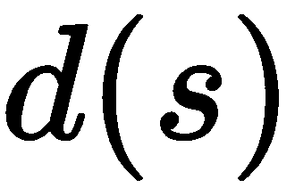
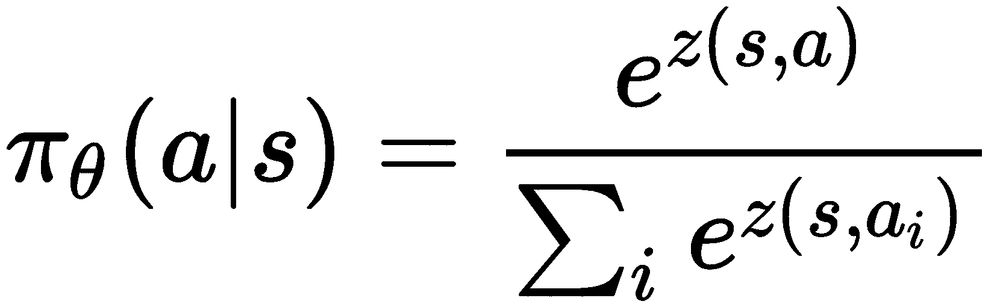
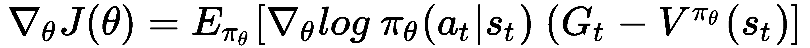

# 第六章：学习随机优化与 PG 优化

到目前为止，我们已经探讨并开发了基于价值的强化学习算法。这些算法通过学习一个价值函数来找到一个好的策略。尽管它们表现良好，但它们的应用受限于一些内在的限制。在本章中，我们将介绍一类新的算法——策略梯度方法，它们通过从不同的角度处理强化学习问题来克服基于价值方法的限制。

策略梯度方法基于学习到的参数化策略来选择动作，而不是依赖于价值函数。在本章中，我们还将详细阐述这些方法背后的理论和直觉，并在此基础上开发出最基本版本的策略梯度算法，称为**REINFORCE**。

REINFORCE 由于其简单性存在一些不足，但这些不足只需要稍加努力就可以得到缓解。因此，我们将展示 REINFORCE 的两个改进版本，分别是带基线的**REINFORCE**和**演员-评论员**（**AC**）模型。

本章将涵盖以下主题：

+   策略梯度方法

+   理解 REINFORCE 算法

+   带基线的 REINFORCE

+   学习 AC 算法

# 策略梯度方法

到目前为止，学习和开发的算法都是基于价值的，它们的核心是学习一个价值函数，*V(s)*，或动作价值函数，*Q(s, a)*。价值函数是一个定义从给定状态或状态-动作对所能累积的总奖励的函数。然后，可以基于估计的动作（或状态）值来选择一个动作。

因此，贪婪策略可以定义如下：

![]

当结合深度神经网络时，基于价值的方法可以学习非常复杂的策略，从而控制在高维空间中操作的智能体。尽管这些方法有着很大的优点，但在处理具有大量动作或连续动作空间的问题时，它们会遇到困难。

在这种情况下，最大化操作是不可行的。**策略梯度**（**PG**）算法在这种背景下展现了巨大的潜力，因为它们可以很容易地适应连续的动作空间。

PG 方法属于更广泛的基于策略的方法类，其中包括进化策略，这将在第十一章《理解黑盒优化算法》中进一步探讨。PG 算法的独特性在于它们使用策略的梯度，因此得名**策略梯度**。

相较于第三章《使用动态规划解决问题》中报告的强化学习算法分类，下面的图示展示了一种更简洁的分类方式：


策略梯度方法的例子有**REINFORCE**和**AC**，将在接下来的章节中介绍。

# 策略的梯度

强化学习的目标是最大化一个轨迹的期望回报（总奖励，无论是否折扣）。目标函数可以表示为：


其中*θ*是策略的参数，例如深度神经网络的可训练变量。

在 PG 方法中，目标函数的最大化是通过目标函数的梯度![]来实现的。通过梯度上升，我们可以通过将参数朝着梯度的方向移动来改善![]，因为梯度指向函数增大的方向。

我们必须沿着梯度的方向前进，因为我们的目标是最大化目标函数（6.1）。

一旦找到最大值，策略`$1`将产生回报最高的轨迹。从直观上看，策略梯度通过增加好策略的概率并减少差策略的概率来激励好的策略。

使用方程（6.1），目标函数的梯度定义如下：


通过与前几章的概念相关联，在策略梯度方法中，策略评估是回报的估计，。而策略改进则是参数的优化步骤。因此，策略梯度方法必须协同进行这两个阶段，以改进策略。

# 策略梯度定理

在查看方程（6.2）时遇到一个初始问题，因为在其公式中，目标函数的梯度依赖于策略的状态分布；即：


我们会使用该期望的随机逼近方法，但为了计算状态的分布，，我们仍然需要一个完整的环境模型。因此，这种公式不适用于我们的目的。

策略梯度定理在这里提供了解决方案。它的目的是提供一个分析公式，用来计算目标函数相对于策略参数的梯度，而无需涉及状态分布的导数。形式上，策略梯度定理使我们能够将目标函数的梯度表示为：


策略梯度定理的证明超出了本书的范围，因此未包含。然而，你可以在 Sutton 和 Barto 的书中找到相关内容 ([`incompleteideas.net/book/the-book-2nd.htmlor`](http://incompleteideas.net/book/the-book-2nd.htmlor))，或者通过其他在线资源查找。

现在目标函数的导数不涉及状态分布的导数，可以通过从策略中采样来估计期望值。因此，目标函数的导数可以近似如下：


这可以用来通过梯度上升法生成一个随机更新：


请注意，由于目标是最大化目标函数，因此使用梯度上升来将参数朝梯度的方向移动（与梯度下降相反，梯度下降执行）。

方程 (6.5) 背后的思想是增加未来重新提出好动作的概率，同时减少坏动作的概率。动作的质量由通常的标量值传递，这给出了状态-动作对的质量。

# 计算梯度

只要策略是可微的，它的梯度就可以很容易地计算，借助现代自动微分软件。

在 TensorFlow 中，我们可以定义计算图并调用 `tf.gradient(loss_function,variables)` 来计算损失函数(`loss_function`)相对于`variables`可训练参数的梯度。另一种方法是直接使用随机梯度下降优化器最大化`objective`函数，例如，调用 `tf.train.AdamOptimizer(lr).minimize(-objective_function)`。

以下代码片段是计算公式 (6.5) 中近似值所需步骤的示例，使用的是`env.action_space.n`维度的离散动作空间策略：

```py
pi = policy(states) # actions probability for each action
onehot_action = tf.one_hot(actions, depth=env.action_space.n) 
pi_log = tf.reduce_sum(onehot_action * tf.math.log(pi), axis=1)

pi_loss = -tf.reduce_mean(pi_log * Q_function(states, actions))

# calculate the gradients of pi_loss with respect to the variables
gradients = tf.gradient(pi_loss, variables)

# or optimize directly pi_loss with Adam (or any other SGD optimizer)
# pi_opt = tf.train.AdamOptimizer(lr).minimize(pi_loss) #
```

`tf.one_hot`生成`actions`动作的独热编码。也就是说，它生成一个掩码，其中 `1` 对应动作的数值，其他位置为 `0`。

然后，在代码的第三行中，掩码与动作概率的对数相乘，以获得`actions`动作的对数概率。第四行按如下方式计算损失：


最后，`tf.gradient`计算`pi_loss`的梯度，关于`variables`参数，如公式(6.5)所示。

# 策略

如果动作是离散且数量有限，最常见的方法是创建一个参数化策略，为每个动作生成一个数值。

请注意，与深度 Q 网络（Deep Q-Network）算法不同，这里策略的输出值不是 *Q(s,a)* 动作值。

然后，每个输出值会被转换成概率。此操作是通过 softmax 函数执行的，函数如下所示：



softmax 值被归一化以使其总和为 1，从而产生一个概率分布，其中每个值对应于选择给定动作的概率。

接下来的两个图表展示了在应用 softmax 函数之前（左侧的图）和之后（右侧的图）的五个动作值预测示例。实际上，从右侧的图中可以看到，经过 softmax 计算后，新值的总和为 1，并且它们的值都大于零：


右侧的图表表示，动作 0、1、2、3 和 4 将分别以 0.64、0.02、0.09、0.21 和 0.02 的概率被选择。

为了在由参数化策略返回的动作值上使用 softmax 分布，我们可以使用*计算梯度*部分给出的代码，只需做一个改动，以下代码片段中已做突出显示：

```py
pi = policy(states) # actions probability for each action
onehot_action = tf.one_hot(actions, depth=env.action_space.n) 

pi_log = tf.reduce_sum(onehot_action * tf.nn.log_softmax(pi), axis=1) # instead of tf.math.log(pi)

pi_loss = -tf.reduce_mean(pi_log * Q_function(states, actions))
gradients = tf.gradient(pi_loss, variables)
```

在这里，我们使用了`tf.nn.log_softmax`，因为它比先调用`tf.nn.softmax`，再调用`tf.math.log`更稳定。

按照随机分布选择动作的一个优势在于动作选择的内在随机性，这使得环境的动态探索成为可能。这看起来像是一个副作用，但拥有能够自主调整探索程度的策略非常重要。

在 DQN 的情况下，我们不得不用手工调整的！[](img/38d16fa6-2b85-4103-87a9-b626e9a67487.png)变量来调整整个训练过程中的探索，使用线性！[](img/8ec787b5-7c40-4a5a-a8b4-cd885d8f2355.png)衰减。现在，探索已经内建到策略中，我们最多只需在损失函数中添加一个项（熵），以此来激励探索。

# 策略性 PG

策略梯度算法的一个非常重要的方面是它们是*策略性算法*。它们的策略性特征来自公式（6.4），因为它依赖于当前的策略。因此，与 DQN 等*非策略性*算法不同，策略性方法不允许重用旧的经验。

这意味着，一旦策略发生变化，所有使用给定策略收集的经验都必须被丢弃。作为副作用，策略梯度算法的样本效率较低，这意味着它们需要获取更多的经验才能达到与非策略性算法相同的表现。此外，它们通常会稍微泛化得较差。

# 理解 REINFORCE 算法

策略梯度算法的核心已经介绍过了，但我们还有一个*重要的概念*需要解释。我们还需要看一下如何计算动作值。

我们已经在公式（6.4）中看到了：


我们能够通过直接从经验中采样来估计目标函数的梯度，该经验是通过遵循**![]*策略收集的。

唯一涉及的两个项是![]的值和策略对数的导数，这可以通过现代深度学习框架（如 TensorFlow 和 PyTorch）获得。虽然我们已经定义了![]，但我们尚未解释如何估计动作值函数。

首次由 Williams 在 REINFORCE 算法中提出的更简单方法是使用**蒙特卡洛**（**MC**）回报来估计回报。因此，REINFORCE 被认为是一个 MC 算法。如果你还记得，MC 回报是通过给定策略运行的采样轨迹的回报值。因此，我们可以重写方程（6.4），将动作值函数![]替换为 MC 回报![]：


回报是通过完整的轨迹计算得出的，这意味着 PG 更新只有在完成步骤后才可用，其中是轨迹中的总步骤数。另一个后果是，MC 回报仅在情节性问题中定义良好，在这种问题中，最大步骤数有一个上限（这与我们之前学习的其他 MC 算法得出的结论相同）。

更实际一点，时间点的折扣回报，也可以称为*未来回报*，因为它只使用未来的回报，如下所示：


这可以递归地重写如下：


该函数可以按相反的顺序实现，从最后一个回报开始，如下所示：

```py
def discounted_rewards(rews, gamma):
    rtg = np.zeros_like(rews, dtype=np.float32)
    rtg[-1] = rews[-1]
    for i in reversed(range(len(rews)-1)):
        rtg[i] = rews[i] + gamma*rtg[i+1]
    return rtg
```

在这里，首先创建一个 NumPy 数组，并将最后一个回报的值分配给`rtg`变量。之所以这样做，是因为在时间点，。然后，算法使用后续值反向计算`rtg[i]`。

REINFORCE 算法的主要循环包括运行几个周期，直到收集到足够的经验，并优化策略参数。为了有效，算法必须在执行更新步骤之前完成至少一个周期（它需要至少一个完整轨迹来计算回报函数（））。REINFORCE 的伪代码总结如下：

```py
Initialize  with random weight

for episode 1..M do
    Initialize environment 
    Initialize empty buffer

    *> Generate a few episodes*
    for step 1..MaxSteps do
        *> Collect experience by acting on the environment*

        if :

       *     > Compute the reward to go* 
             # for each t
            *> Store the episode in the buffer*
             # where  is the length of the episode
    *> REINFORCE update step using all the experience in  following formula (6.5)
*    
```

# 实现 REINFORCE

现在是时候实现 REINFORCE 了。在这里，我们仅提供算法的实现，而不包括调试和监控过程。完整实现可以在 GitHub 仓库中找到。所以，务必检查一下。

代码分为三个主要函数和一个类：

+   `REINFORCE(env_name, hidden_sizes, lr, num_epochs, gamma, steps_per_epoch)`：这是包含算法主要实现的函数。

+   `Buffer`：这是一个类，用于临时存储轨迹。

+   `mlp(x, hidden_layer, output_size, activation, last_activation)`：这是用来在 TensorFlow 中构建多层感知器的。

+   `discounted_rewards(rews, gamma)`：该函数计算折扣奖励。

我们首先将查看主要的 `REINFORCE` 函数，然后实现补充的函数和类。

`REINFORCE` 函数分为两个主要部分。在第一部分，创建计算图；而在第二部分，运行环境并循环优化策略，直到满足收敛标准。

`REINFORCE` 函数以 `env_name` 环境的名称作为输入参数，包含隐藏层大小的列表—`hidden_sizes`，学习率—`lr`，训练周期数—`num_epochs`，折扣因子—`gamma`，以及每个周期的最小步骤数—`steps_per_epoch`。正式地，`REINFORCE` 的函数头如下：

```py
def REINFORCE(env_name, hidden_sizes=[32], lr=5e-3, num_epochs=50, gamma=0.99, steps_per_epoch=100):
```

在 `REINFORCE(..)` 开始时，TensorFlow 默认图被重置，环境被创建，占位符被初始化，策略被创建。策略是一个全连接的多层感知器，每个动作对应一个输出，且每一层的激活函数为 `tanh`。多层感知器的输出是未归一化的动作值，称为 logits。所有这些操作都在以下代码片段中完成：

```py
def REINFORCE(env_name, hidden_sizes=[32], lr=5e-3, num_epochs=50, gamma=0.99, steps_per_epoch=100):

    tf.reset_default_graph()

    env = gym.make(env_name) 
    obs_dim = env.observation_space.shape
    act_dim = env.action_space.n 

    obs_ph = tf.placeholder(shape=(None, obs_dim[0]), dtype=tf.float32, name='obs')
    act_ph = tf.placeholder(shape=(None,), dtype=tf.int32, name='act')
    ret_ph = tf.placeholder(shape=(None,), dtype=tf.float32, name='ret')

    p_logits = mlp(obs_ph, hidden_sizes, act_dim, activation=tf.tanh)
```

接着，我们可以创建一个操作，用来计算损失函数，并优化策略。代码与我们之前在 *The policy* 部分看到的代码类似。唯一的不同是现在通过 `tf.random.multinomial` 来采样动作，该函数根据策略返回的动作分布来选择动作。此函数从类别分布中抽取样本。在我们的例子中，它选择一个单一的动作（根据环境，也可能选择多个动作）。

以下代码片段是 REINFORCE 更新的实现：

```py
 act_multn = tf.squeeze(tf.random.multinomial(p_logits, 1))
 actions_mask = tf.one_hot(act_ph, depth=act_dim)
 p_log = tf.reduce_sum(actions_mask * tf.nn.log_softmax(p_logits), axis=1)
 p_loss = -tf.reduce_mean(p_log*ret_ph)
 p_opt = tf.train.AdamOptimizer(lr).minimize(p_loss)
```

在与环境交互过程中，创建一个针对选择的动作的掩码，并与 `log_softmax` 相乘，以便计算 。然后，计算完整的损失函数。注意—在 `tf.reduce_sum` 前面有一个负号。我们关注的是目标函数的最大化。但因为优化器需要一个最小化的函数，所以我们必须传递一个损失函数。最后一行使用 `AdamOptimizer` 优化 PG 损失函数。

我们现在准备开始一个会话，重置计算图的全局变量，并初始化一些稍后会用到的变量：

```py
    sess = tf.Session()
    sess.run(tf.global_variables_initializer())
    step_count = 0
    train_rewards = []
    train_ep_len = []
```

然后，我们创建两个内部循环，这些循环将与环境交互以收集经验并优化策略，并打印一些统计数据：

```py
    for ep in range(num_epochs):
        obs = env.reset()
        buffer = Buffer(gamma)
        env_buf = []
        ep_rews = []

        while len(buffer) < steps_per_epoch:

            # run the policy 
            act = sess.run(act_multn, feed_dict={obs_ph:[obs]})
            # take a step in the environment
            obs2, rew, done, _ = env.step(np.squeeze(act))

            env_buf.append([obs.copy(), rew, act])
            obs = obs2.copy()
            step_count += 1
            ep_rews.append(rew)

            if done:
                # add the full trajectory to the environment
                buffer.store(np.array(env_buf))
                env_buf = []
                train_rewards.append(np.sum(ep_rews))
                train_ep_len.append(len(ep_rews))
                obs = env.reset()
                ep_rews = []

        obs_batch, act_batch, ret_batch = buffer.get_batch()
        # Policy optimization
        sess.run(p_opt, feed_dict={obs_ph:obs_batch, act_ph:act_batch, ret_ph:ret_batch})

        # Print some statistics
        if ep % 10 == 0:
            print('Ep:%d MnRew:%.2f MxRew:%.1f EpLen:%.1f Buffer:%d -- Step:%d --' % (ep, np.mean(train_rewards), np.max(train_rewards), np.mean(train_ep_len), len(buffer), step_count))
            train_rewards = []
            train_ep_len = []
    env.close()
```

这两个循环遵循通常的流程，唯一的例外是，当轨迹结束时，与环境的交互会停止，并且临时缓冲区有足够的转移。

现在我们可以实现一个`Buffer`类，用于包含轨迹数据：

```py
class Buffer():
    def __init__(self, gamma=0.99):
        self.gamma = gamma
        self.obs = []
        self.act = []
        self.ret = []

    def store(self, temp_traj):
        if len(temp_traj) > 0:
            self.obs.extend(temp_traj[:,0])
            ret = discounted_rewards(temp_traj[:,1], self.gamma)
            self.ret.extend(ret)
            self.act.extend(temp_traj[:,2])

    def get_batch(self):
        return self.obs, self.act, self.ret

    def __len__(self):
        assert(len(self.obs) == len(self.act) == len(self.ret))
        return len(self.obs)
```

最后，我们可以实现一个函数，创建一个具有任意数量隐藏层的神经网络：

```py
def mlp(x, hidden_layers, output_size, activation=tf.nn.relu, last_activation=None):
for l in hidden_layers:
    x = tf.layers.dense(x, units=l, activation=activation)
    return tf.layers.dense(x, units=output_size, activation=last_activation)
```

这里，`activation`是应用于隐藏层的非线性函数，而`last_activation`是应用于输出层的非线性函数。

# 使用 REINFORCE 着陆航天器

算法已经完成，但最有趣的部分还没有解释。在本节中，我们将应用 REINFORCE 到`LunarLander-v2`，这是一个周期性的 Gym 环境，目标是让月球着陆器着陆。

以下是游戏初始位置的截图，以及一个假设的成功最终位置：


这是一个离散问题，着陆器必须在坐标(0,0)处着陆，如果远离该点则会受到惩罚。着陆器从屏幕顶部移动到底部时会获得正奖励，但当它开启引擎减速时，每一帧会损失 0.3 分。

此外，根据着陆条件，它会获得额外的-100 或+100 分。游戏被认为在获得 200 分时解决。每局游戏最多进行 1,000 步。

出于这个原因，我们将至少收集 1,000 步的经验，以确保至少完成了一个完整的回合（这个值由`steps_per_epoch`超参数设置）。

通过调用带有以下超参数的函数来运行 REINFORCE：

```py
REINFORCE('LunarLander-v2', hidden_sizes=[64], lr=8e-3, gamma=0.99, num_epochs=1000, steps_per_epoch=1000)
```

# 分析结果

在整个学习过程中，我们监控了许多参数，包括`p_loss`（策略的损失）、`old_p_loss`（优化阶段前的策略损失）、总奖励和每局的长度，以便更好地理解算法，并合理调整超参数。我们还总结了一些直方图。要了解更多关于 TensorBoard 汇总的内容，请查看书籍仓库中的代码！

在下图中，我们绘制了训练过程中获得的完整轨迹的总奖励的均值：


从这张图中，我们可以看到，它在大约 500,000 步时达到了 200 的平均分数，或者稍微低一点；因此，在能够掌握游戏之前，约需要 1,000 个完整的轨迹。

在绘制训练性能图时，请记住，算法可能仍在探索中。要检查是否如此，可以监控动作的熵。如果熵大于 0，意味着算法对于所选动作不确定，并且它会继续探索——选择其他动作，并遵循它们的分布。在这种情况下，经过 500,000 步后，智能体仍在探索环境，如下图所示：


# 带基线的 REINFORCE

REINFORCE 具有一个很好的特性，即由于 MC 回报，它是无偏的，这提供了完整轨迹的真实回报。然而，无偏估计会以方差为代价，方差随着轨迹的长度增加而增大。为什么？这种效应是由于策略的随机性。通过执行完整的轨迹，你会知道它的真实奖励。然而，分配给每个状态-动作对的值可能并不正确，因为策略是随机的，重新执行可能会导致不同的状态，从而产生不同的奖励。此外，你会看到，轨迹中动作的数量越多，系统中引入的随机性就越大，因此，最终会得到更高的方差。

幸运的是，可以在回报估计中引入基线，，从而减少方差，并提高算法的稳定性和性能。采用这种策略的算法称为**带基线的 REINFORCE**，其目标函数的梯度如下所示：


引入基线的这个技巧之所以可行，是因为梯度估计器在偏差上仍然保持不变：


与此同时，为了使这个方程成立，基线必须对动作保持常数。

我们现在的任务是找到一个合适的基线。最简单的方法是减去平均回报。


如果你想在 REINFORCE 代码中实现这一点，唯一需要更改的是`Buffer`类中的`get_batch()`函数：

```py
    def get_batch(self):
        b_ret = self.ret - np.mean(self.ret)
        return self.obs, self.act, b_ret
```

尽管这个基线减少了方差，但它并不是最佳策略。因为基线可以根据状态进行条件化，一个更好的想法是使用值函数的估计：



请记住，值函数平均值是通过策略获得的回报。

这种变体给系统带来了更多复杂性，因为我们必须设计一个值函数的近似，但它是非常常见的，并且能显著提高算法的性能。

为了学习！[](img/0d4c296b-488f-479e-b008-bfa7f9a5388e.png)，最佳的解决方案是用 MC 估计拟合一个神经网络：


在前面的方程中，是需要学习的神经网络参数。

为了不使符号过于复杂，从现在开始，我们将省略指定策略的部分，因此！[](img/35844138-3049-42c1-b4b6-67d55ada95e5.png)将变为！[](img/40c76756-1c31-42c1-afbb-0c17efb507e4.png)。

神经网络在与学习相关的相同轨迹数据上进行训练！[](img/76bcd8d3-a24b-41c2-b16b-84cfdbe47bdd.png)，无需与环境进行额外的交互。计算后，MC 估计（例如，使用`discounted_rewards(rews, gamma)`）将成为！[](img/512d6543-23dd-4aac-b864-4ec3642a4a86.png)目标值，并且神经网络将被优化，以最小化均方误差（MSE）损失——就像你在监督学习任务中做的那样：


这里，是价值函数神经网络的权重，每个数据集元素包含！[](img/dbeecb7f-e955-4daf-9d4b-06ca14894ff8.png)状态，以及目标值！[](img/4ee8929c-cacf-4a63-933f-c63dfee82aeb.png)。

# 实现带基准的 REINFORCE

基准用神经网络逼近的价值函数可以通过在我们之前的代码中添加几行来实现：

1.  将神经网络、计算 MSE 损失函数的操作和优化过程添加到计算图中：

```py
    ...
    # placeholder that will contain the reward to go values (i.e. the y values)
    rtg_ph = tf.placeholder(shape=(None,), dtype=tf.float32, name='rtg')

    # MLP value function
    s_values = tf.squeeze(mlp(obs_ph, hidden_sizes, 1, activation=tf.tanh))

    # MSE loss function
    v_loss = tf.reduce_mean((rtg_ph - s_values)**2)

    # value function optimization
    v_opt = tf.train.AdamOptimizer(vf_lr).minimize(v_loss)
    ...
```

1.  运行`s_values`，并存储！[](img/0037c50a-75e4-49bb-b6b0-ab2095b92691.png)预测值，因为稍后我们需要计算！[](img/8df6a5dd-8373-4462-961f-805dc3f8eba3.png)。此操作可以在最内层的循环中完成（与 REINFORCE 代码的不同之处用粗体显示）：

```py
            ...
            # besides act_multn, run also s_values
            act, val = sess.run([act_multn, s_values], feed_dict={obs_ph:[obs]})
            obs2, rew, done, _ = env.step(np.squeeze(act))

            # add the new transition, included the state value predictions
            env_buf.append([obs.copy(), rew, act, np.squeeze(val)])
            ...

```

1.  检索`rtg_batch`，它包含来自缓冲区的“目标”值，并优化价值函数：

```py
        obs_batch, act_batch, ret_batch, rtg_batch = buffer.get_batch() 
        sess.run([p_opt, v_opt], feed_dict={obs_ph:obs_batch, act_ph:act_batch, ret_ph:ret_batch, rtg_ph:rtg_batch})
```

1.  计算奖励目标（）和目标值！[](img/de87b8d5-2dfe-4c84-b1f7-af49aba9e641.png)。此更改在`Buffer`类中完成。我们需要在该类的初始化方法中创建一个新的空`self.rtg`列表，并修改`store`和`get_batch`函数，具体如下：

```py
    def store(self, temp_traj):
        if len(temp_traj) > 0:
            self.obs.extend(temp_traj[:,0])
            rtg = discounted_rewards(temp_traj[:,1], self.gamma)
            # ret = G - V
            self.ret.extend(rtg - temp_traj[:,3])
            self.rtg.extend(rtg)
            self.act.extend(temp_traj[:,2])

    def get_batch(self):
        return self.obs, self.act, self.ret, self.rtg
```

你现在可以在任何你想要的环境中测试带基准的 REINFORCE 算法，并将其性能与基本的 REINFORCE 实现进行比较。

# 学习 AC 算法

简单的 REINFORCE 具有不偏性的显著特点，但它表现出较高的方差。添加基准可以减少方差，同时保持不偏（从渐近的角度来看，算法将收敛到局部最小值）。带基准的 REINFORCE 的一个主要缺点是它收敛得非常慢，需要与环境进行一致的交互。

加速训练的一种方法叫做引导法（bootstrapping）。这是我们在本书中已经多次看到的技巧。它允许从后续的状态值估算回报值。使用这种技巧的策略梯度算法称为演员-评论者（AC）。在 AC 算法中，演员是策略，评论者是价值函数（通常是状态值函数），它对演员的行为进行“批评”，帮助他更快学习。AC 方法的优点有很多，但最重要的是它们能够在非阶段性问题中学习。

无法使用 REINFORCE 解决连续任务，因为要计算奖赏到达目标，它们需要直到轨迹结束的所有奖赏（如果轨迹是无限的，就没有结束）。依靠引导技术，AC 方法也能够从不完整的轨迹中学习动作值。

# 使用评论者帮助演员学习

使用一步引导法的动作值函数定义如下：


在这里， 是臭名昭著的下一个状态。

因此，使用一个  角色和一个  评论者使用引导法（bootstrapping），我们可以得到一步的 AC 步骤：


这将用一个基准替代 REINFORCE 步骤：


注意 REINFORCE 和 AC 中使用状态值函数的区别。在前者中，它仅作为基准，用来提供当前状态的状态值。在后者示例中，状态值函数用于估算下一个状态的价值，从而只需要当前的奖励来估算 。因此，我们可以说，一步 AC 模型是一个完全在线的增量算法。

# n 步 AC 模型

实际上，正如我们在 TD 学习中所看到的，完全在线的算法具有低方差但高偏差，这与 MC 学习相反。然而，通常，介于完全在线和 MC 方法之间的中间策略是首选。为了平衡这种权衡，n 步回报可以替代在线算法中的一步回报。

如果你还记得，我们已经在 DQN 算法中实现了 n 步学习。唯一的区别是 DQN 是一个脱离策略的算法，而理论上，n 步学习只能在在线策略算法中使用。然而，我们展示了通过一个小的 ，性能有所提高。

AC 算法是基于策略的，因此，就性能提升而言，可以使用任意大的  值。在 AC 中集成 n 步是相当直接的；一步返回被  替代，值函数被带入  状态：


这里，  。请注意，如果  是一个最终状态， 。

除了减少偏差外，n 步返回还可以更快地传播后续的回报，从而使得学习更加高效。

有趣的是，  量可以看作是优势函数的估计。事实上，优势函数定义如下：


由于  是  的估计，我们得到优势函数的估计。通常，这个函数更容易学习，因为它仅表示在特定状态下一个特定动作相对于其他动作的偏好。它不需要学习该状态的值。

关于评论员权重的优化，它使用一种著名的 SGD 优化方法来进行优化，最小化 MSE 损失：


在前面的方程中，目标值是按如下方式计算的： 。

# AC 实现

总体而言，正如我们到目前为止所看到的，AC 算法与 REINFORCE 算法非常相似，状态函数作为基准。但为了回顾一下，算法总结如下：

```py
Initialize  with random weight
Initialize environment 
for episode 1..M do
    Initialize empty buffer

    *> Generate a few episodes*
    for step 1..MaxSteps do
        *> Collect experience by acting on the environment*

        if :

            *> Compute the n-step reward to go* 
             # for each t
            *> Compute the advantage values*
             # for each t
            *> Store the episode in the buffer*
             # where  is the lenght of the episode
    *> Actor update step using all the experience in 
*    
    *> Critic update using all the experience in `D`*

```

与 REINFORCE 的唯一区别是 n 步奖励的计算、优势函数的计算，以及主函数的一些调整。

让我们首先看一下折扣奖励的新实现。与之前不同，最后一个`last_sv`状态的估计值现在传递给输入，并用于引导，如以下实现所示：

```py
def discounted_rewards(rews, last_sv, gamma):
    rtg = np.zeros_like(rews, dtype=np.float32)
    rtg[-1] = rews[-1] + gamma*last_sv    # Bootstrap with the estimate next state value 

    for i in reversed(range(len(rews)-1)):
        rtg[i] = rews[i] + gamma*rtg[i+1]
    return rtg

```

计算图不会改变，但在主循环中，我们需要注意一些小的但非常重要的变化。

显然，函数的名称已更改为`AC`，并且`cr_lr`评论员的学习率作为一个参数被添加进来。

第一个实际的变化涉及环境重置的方式。如果在 REINFORCE 中，偏好在每次主循环迭代时重置环境，那么在 AC 中，我们必须从上一轮迭代的环境状态继续，只有在环境达到最终状态时才重置它。

第二个变化涉及行动价值函数的引导方式，以及如何计算未来的回报。记住，对于每个状态-动作对，除非  是最终状态，否则 。在这种情况下，。因此，我们必须在最后状态时使用`0`进行引导，并在其他情况下使用  进行引导。根据这些更改，代码如下：

```py
    obs = env.reset()
    ep_rews = []

    for ep in range(num_epochs):
        buffer = Buffer(gamma)
        env_buf = []

        for _ in range(steps_per_env):
            act, val = sess.run([act_multn, s_values], feed_dict={obs_ph:[obs]})
            obs2, rew, done, _ = env.step(np.squeeze(act))

            env_buf.append([obs.copy(), rew, act, np.squeeze(val)])
            obs = obs2.copy()
            step_count += 1
            last_test_step += 1
            ep_rews.append(rew)

            if done:

                buffer.store(np.array(env_buf), 0)
                env_buf = []

                train_rewards.append(np.sum(ep_rews))
                train_ep_len.append(len(ep_rews))
                obs = env.reset()
                ep_rews = []

        if len(env_buf) > 0:
            last_sv = sess.run(s_values, feed_dict={obs_ph:[obs]})
            buffer.store(np.array(env_buf), last_sv)

        obs_batch, act_batch, ret_batch, rtg_batch = buffer.get_batch()
        sess.run([p_opt, v_opt], feed_dict={obs_ph:obs_batch, act_ph:act_batch, ret_ph:ret_batch,         rtg_ph:rtg_batch})
        ...
```

第三个变化发生在`Buffer`类的`store`方法中。实际上，现在我们还需要处理不完整的轨迹。在之前的代码片段中，我们看到估计的  状态值作为第三个参数传递给`store`函数。事实上，我们使用这些状态值进行引导，并计算"未来回报"。在新版本的`store`中，我们将与状态值相关的变量命名为`last_sv`，并将其作为输入传递给`discounted_reward`函数，代码如下：

```py
    def store(self, temp_traj, last_sv):
        if len(temp_traj) > 0:
            self.obs.extend(temp_traj[:,0])
            rtg = discounted_rewards(temp_traj[:,1], last_sv, self.gamma)
            self.ret.extend(rtg - temp_traj[:,3])
            self.rtg.extend(rtg)
            self.act.extend(temp_traj[:,2])
```

# 使用 AC 着陆航天器

我们将 AC 应用于 LunarLander-v2，这与测试 REINFORCE 时使用的环境相同。这是一个回合制的游戏，因此它并没有完全强调 AC 算法的主要特性。尽管如此，它仍提供了一个很好的测试平台，你也可以自由地在其他环境中进行测试。

我们调用`AC`函数时使用以下超参数：

```py
AC('LunarLander-v2', hidden_sizes=[64], ac_lr=4e-3, cr_lr=1.5e-2, gamma=0.99, steps_per_epoch=100, num_epochs=8000)
```

结果图显示了训练周期中累计的总回报，图如下：


你可以看到，AC 比 REINFORCE 更快，如下图所示。然而，AC 的稳定性较差，经过大约 200,000 步后，性能有所下降，但幸运的是，之后它继续增长：


在这个配置中，AC 算法每 100 步更新一次演员和评论员。从理论上讲，你可以使用更小的`steps_per_epochs`，但通常这会让训练变得更不稳定。使用更长的周期可以稳定训练，但演员学习速度较慢。一切都在于找到一个好的平衡点和适合的学习率。

对于本章提到的所有颜色参考，请参见以下链接中的彩色图像包：[`www.packtpub.com/sites/default/files/downloads/9781789131116_ColorImages.pdf`](http://www.packtpub.com/sites/default/files/downloads/9781789131116_ColorImages.pdf)。

# 高级 AC，以及技巧和窍门

AC 算法有许多进一步的进展，还有许多技巧和窍门需要记住，在设计此类算法时要加以注意：

+   **架构设计**：在我们的实现中，我们实现了两个不同的神经网络，一个用于评估者，另一个用于演员。也可以设计一个共享主要隐藏层的神经网络，同时保持头部的独立性。这种架构可能更难调整，但总体而言，它提高了算法的效率。

+   **并行环境**：减少方差的一个广泛采用的技术是从多个环境中并行收集经验。**A3C**（**异步优势演员-评估者**）算法异步更新全局参数。而它的同步版本，称为 **A2C**（**优势演员-评估者**），则在更新全局参数之前等待所有并行的演员完成。智能体的并行化确保了来自环境不同部分的更多独立经验。

+   **批量大小**：与其他强化学习算法（尤其是脱离策略算法）相比，政策梯度和 AC 方法需要较大的批量。因此，如果在调整其他超参数后，算法仍然无法稳定，考虑使用更大的批量大小。

+   **学习率**：调整学习率本身非常棘手，因此请确保使用更先进的 SGD 优化方法，如 Adam 或 RMSprop。

# 总结

在本章中，我们学习了一类新的强化学习算法，称为政策梯度。与之前章节中研究的价值函数方法相比，这些算法以不同的方式解决强化学习问题。

PG 方法的简化版本叫做 REINFORCE，这一方法在本章过程中进行了学习、实现和测试。随后，我们提出在 REINFORCE 中加入基准值，以减少方差并提高算法的收敛性。AC 算法不需要使用评估者的完整轨迹，因此我们用 AC 模型解决了同样的问题。

在掌握经典的政策梯度算法的基础上，我们可以进一步深入。在下一章，我们将介绍一些更复杂、前沿的政策梯度算法；即，**信任区域策略优化**（**TRPO**）和**近端策略优化**（**PPO**）。这两种算法是基于我们在本章中学习的内容构建的，但它们提出了一个新的目标函数，旨在提高 PG 算法的稳定性和效率。

# 问题

1.  PG 算法如何最大化目标函数？

1.  政策梯度算法的核心思想是什么？

1.  为什么在 REINFORCE 中引入基准值后，算法仍保持无偏？

1.  REINFORCE 属于更广泛的哪类算法？

1.  AC 方法中的评估者与 REINFORCE 中作为基准的价值函数有什么不同？

1.  如果你需要为一个必须学习移动的智能体开发算法，你会选择 REINFORCE 还是 AC？

1.  你能将 n 步 AC 算法用作 REINFORCE 算法吗？

# 进一步阅读

要了解异步版本的演员-评论员算法，请阅读 [`arxiv.org/pdf/1602.01783.pdf`](https://arxiv.org/pdf/1602.01783.pdf)。
