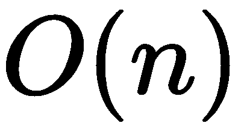

# 第七章：TRPO 和 PPO 实现

在上一章中，我们研究了策略梯度算法。它们的独特之处在于解决 **强化学习**（**RL**）问题的顺序——策略梯度算法朝着奖励增益最大化的方向迈出一步。该算法的简化版本（**REINFORCE**）具有直接的实现，并且单独使用时能够取得不错的效果。然而，它的速度较慢，且方差较大。因此，我们引入了一个值函数，具有双重目标——批评演员并提供基准。尽管这些演员-评论家算法具有巨大的潜力，但它们可能会受到动作分布中不希望出现的剧烈波动的影响，从而导致访问的状态发生急剧变化，随之而来的是性能的迅速下降，且这种下降可能永远无法恢复。

本章将通过展示如何引入信任区域或剪切目标来解决这一问题，从而减轻该问题的影响。我们将展示两个实际的算法，即 TRPO 和 PPO。这些算法已经证明能在控制模拟行走、控制跳跃和游泳机器人以及玩 Atari 游戏方面取得良好效果。我们将介绍一组新的连续控制环境，并展示如何将策略梯度算法适配到连续动作空间中。通过将 TRPO 和 PPO 应用于这些新环境，您将能够训练一个智能体进行跑步、跳跃和行走。

本章将涵盖以下主题：

+   Roboschool

+   自然策略梯度

+   信任区域策略优化

+   近端策略优化

# Roboschool

到目前为止，我们已经处理了离散控制任务，例如 第五章中的 Atari 游戏，*深度 Q 网络*，以及 第六章中的 LunarLander，*学习随机过程和 PG 优化*。为了玩这些游戏，只需要控制少数几个离散动作，即大约两个到五个动作。如我们在 第六章 *学习随机过程和 PG 优化* 中所学，策略梯度算法可以很容易地适应连续动作。为了展示这些特性，我们将在一组新的环境中部署接下来的几种策略梯度算法，这些环境被称为 Roboschool，目标是控制机器人在不同情境下进行操作。Roboschool 由 OpenAI 开发，使用了我们在前几章中使用的著名的 OpenAI Gym 接口。这些环境基于 Bullet Physics 引擎（一个模拟软体和刚体动力学的物理引擎），与著名的 Mujoco 物理引擎的环境类似。我们选择 Roboschool 是因为它是开源的（而 Mujoco 需要许可证），并且它包含了一些更具挑战性的环境。

具体来说，Roboschool 包含 12 个环境，从简单的 Hopper（RoboschoolHopper，左图）到更复杂的人形机器人（RoboschoolHumanoidFlagrun，右图），后者有 17 个连续动作：


图 7.1\. 左侧为 RoboschoolHopper-v1 渲染图，右侧为 RoboschoolHumanoidFlagrun-v1 渲染图

在这些环境中的一些，目标是尽可能快速地奔跑、跳跃或行走，以到达 100 米终点，并且在一个方向上移动。其他环境的目标则是移动在三维场地中，同时需要小心可能的外部因素，如被投掷的物体。该环境集合还包括一个多人 Pong 环境，以及一个互动环境，其中 3D 人形机器人可以自由向各个方向移动，并需要朝着旗帜持续移动。除此之外，还有一个类似的环境，其中机器人被不断投掷立方体以破坏平衡，机器人必须建立更强的控制系统来维持平衡。

环境是完全可观察的，这意味着一个智能体能够完全查看其状态，该状态被编码为一个 `Box` 类，大小可变，约为 10 到 40。正如我们之前提到的，动作空间是连续的，且它由一个 `Box` 类表示，大小根据环境不同而有所变化。

# 控制连续系统

本章将实现的策略梯度算法（如 REINFORCE 和 AC，以及 PPO 和 TRPO）都可以与离散和连续动作空间一起使用。从一种动作类型迁移到另一种非常简单。在连续控制中，不是为每个动作计算一个概率，而是通过概率分布的参数来指定动作。最常见的方法是学习正态高斯分布的参数，这是一个非常重要的分布家族，它由均值！[](img/9649d114-e700-485e-a586-42154c153513.png) 和标准差！[](img/c6cfee24-4967-4627-b62e-8f6c5654706a.png) 参数化。下图展示了高斯分布及其参数变化的示例：


图 7.2\. 三个不同均值和标准差的高斯分布图

关于本章提到的所有颜色参考，请参阅颜色图像包：[`www.packtpub.com/sites/default/files/downloads/9781789131116_ColorImages.pdf`](http://www.packtpub.com/sites/default/files/downloads/9781789131116_ColorImages.pdf)。

例如，表示为参数化函数近似（如深度神经网络）的策略可以预测状态功能中正态分布的均值和标准差。均值可以近似为线性函数，通常，标准差是独立于状态的。在这种情况下，我们将表示参数化均值作为状态的函数，记作，标准差作为固定值，记作。此外，代替直接使用标准差，最好使用标准差的对数值。

总结一下，离散控制的参数化策略可以通过以下代码行定义：

```py
p_logits = mlp(obs_ph, hidden_sizes, act_dim, activation=tf.nn.relu, last_activation=None)
```

`mlp`是一个函数，用于构建一个多层感知器（也称为全连接神经网络），隐藏层的大小由`hidden_sizes`指定，输出为`act_dim`维度，激活函数由`activation`和`last_activation`参数指定。这些将成为连续控制的参数化策略的一部分，并将有以下变化：

```py
p_means = mlp(obs_ph, hidden_sizes, act_dim, activation=tf.tanh, last_activation=None)
log_std = tf.get_variable(name='log_std', initializer=np.zeros(act_dim, dtype=np.float32))
```

这里，`p_means`是，`log_std`是。

此外，如果所有的动作值都在 0 和 1 之间，最好将最后的激活函数设置为`tanh`：

```py
p_means = mlp(obs_ph, hidden_sizes, act_dim, activation=tf.tanh, last_activation=tf.tanh)
```

然后，为了从这个高斯分布中采样并获得动作，必须将标准差乘以一个噪声向量，该向量遵循均值为 0、标准差为 1 的正态分布，并加到预测的均值上：


这里，z 是高斯噪声向量，，它的形状与相同。这个操作可以通过一行代码实现：

```py
p_noisy = p_means + tf.random_normal(tf.shape(p_means), 0, 1) * tf.exp(log_std)
```

由于我们引入了噪声，我们不能确定值仍然位于动作的范围内，因此我们必须以某种方式裁剪`p_noisy`，确保动作值保持在允许的最小值和最大值之间。裁剪操作在以下代码行中完成：

```py
act_smp = tf.clip_by_value(p_noisy, envs.action_space.low, envs.action_space.high)
```

最终，日志概率通过以下方式计算：


该公式在`gaussian_log_likelihood`函数中计算，该函数返回日志概率。因此，我们可以按以下方式检索日志概率：

```py
p_log = gaussian_log_likelihood(act_ph, p_means, log_std)

```

这里，`gaussian_log_likelihood`在以下代码段中定义：

```py
def gaussian_log_likelihood(x, mean, log_std):
    log_p = -0.5 * (np.log(2*np.pi) + (x-mean)**2 / (tf.exp(log_std)**2 + 1e-9) + 2*log_std)
    return tf.reduce_sum(log_p, axis=-1)
```

就是这样。现在，你可以在每个 PG 算法中实现它，并尝试各种具有连续动作空间的环境。正如你可能还记得，在上一章，我们在 LunarLander 上实现了 REINFORCE 和 AC。相同的游戏也提供了连续控制版本，叫做`LunarLanderContinuous-v2`。

拥有解决具有连续动作空间固有问题的必要知识后，你现在能够应对更广泛的任务。然而，一般来说，这些任务也更难解决，我们目前所学的 PG 算法过于弱小，无法很好地解决复杂问题。因此，在接下来的章节中，我们将介绍更先进的 PG 算法，从自然策略梯度开始。

# 自然策略梯度

REINFORCE 和演员-评论员是非常直观的方法，在中小型 RL 任务中表现良好。然而，它们存在一些问题需要解决，以便我们能调整策略梯度算法，使其适用于更大、更复杂的任务。主要问题如下：

+   **很难选择合适的步长**：这个问题源于强化学习的非平稳性特性，意味着数据的分布随着时间的推移不断变化，且随着智能体学习新知识，它会探索不同的状态空间。找到一个总体稳定的学习率非常棘手。

+   **不稳定性**：这些算法没有意识到策略会改变的幅度。这也与我们之前提到的问题相关。一次没有控制的更新可能会导致策略发生重大变化，进而剧烈改变动作分布，从而将智能体推向不良的状态空间。此外，如果新状态空间与之前的状态空间差异很大，可能需要很长时间才能恢复。

+   **样本效率低**：这个问题几乎所有的在策略算法都会遇到。这里的挑战是，在丢弃策略数据之前，尽可能从中提取更多信息。

本章提出的算法，即 TRPO 和 PPO，尝试通过不同的方式来解决这三个问题，尽管它们有一个共同的背景，稍后将进行解释。此外，TRPO 和 PPO 都是在策略的策略梯度算法，属于无模型家族，如下所示的 RL 分类图：


图 7.3. TRPO 和 PPO 在 RL 算法分类图中的位置

**自然策略梯度**（**NPG**）是最早提出的解决策略梯度方法不稳定性问题的算法之一。它通过引入策略步长的变化，控制策略的引导方式，从而解决这个问题。不幸的是，它只适用于线性函数逼近，不能应用于深度神经网络。然而，它是更强大算法的基础，如 TRPO 和 PPO。

# NPG 背后的直觉

在寻求解决 PG 方法不稳定性的问题之前，让我们先理解它为什么会出现。想象一下，你正在攀登一座陡峭的火山，火山口位于顶部，类似于下图中的函数。我们还假设你唯一的感官是脚下的倾斜度（梯度），并且你看不见周围的世界——你是盲的。我们还假设每一步的步长是固定的（学习率），例如，步长为一米。你迈出了第一步，感知到脚下的倾斜度，并朝着最陡的上升方向移动 1 米。在多次重复这一过程后，你到达了接近火山口的一个点，但由于你是盲人，依然没有意识到这一点。此时，你观察到脚下的倾斜度依旧指向火山口的方向。然而，如果火山的高度仅比你的步长小，那么下一步你将跌落下来。此时，周围的空间对你来说是完全陌生的。在下图所示的情况下，你会很快恢复过来，因为这是一个简单的函数，但通常情况下，它可能复杂得无法预料。作为补救方法，你可以使用更小的步长，但这样你爬山的速度会变得非常慢，并且仍然无法保证能够到达最大值。这个问题不仅仅存在于强化学习（RL）中，但在这里它尤为严重，因为数据并非静态，可能造成的损害比其他领域（如监督学习）更大。让我们看看下图：


图 7.4. 在尝试到达该函数的最大值时，你可能会掉进火山口。

一个可能想到的解决方案，也是 NPG 中提出的解决方案，是在梯度的基础上加入函数的曲率。关于曲率的信息由二阶导数携带。这个信息非常有用，因为高值表示两个点之间的梯度发生了剧烈变化，作为预防，可以采取更小、更谨慎的步伐，从而避免可能的悬崖。通过这种新方法，你可以利用二阶导数来获得更多关于动作分布空间的信息，并确保在剧烈变化的情况下，动作空间的分布不会发生太大变化。在接下来的部分中，我们将看到 NPG 是如何做到这一点的。

# 一些数学内容

NPG 算法的创新之处在于如何通过结合一阶和二阶导数的步长更新来更新参数。为了理解自然策略梯度步长，我们需要解释两个关键概念：**费舍尔信息矩阵**（**FIM**）和**Kullback-Leibler**（**KL**）散度。但在解释这两个关键概念之前，让我们先看一下更新背后的公式：

 (7.1)

这个更新与传统的策略梯度有所不同，但仅仅通过项 ，它用于增强梯度项。

在这个公式中，  是 FIM，  是目标函数。

正如我们之前提到的，我们希望在分布空间中使得所有步骤的长度相同，无论梯度是什么。这是通过 FIM 的逆来实现的。

# FIM 和 KL 散度

FIM 被定义为目标函数的协方差。让我们看看它如何帮助我们。为了限制我们模型的分布之间的距离，我们需要定义一个度量来提供新旧分布之间的距离。最常见的选择是使用 KL 散度。它衡量两个分布之间的差异，并在强化学习（RL）和机器学习中得到广泛应用。KL 散度不是一个真正的度量，因为它不是对称的，但它是一个很好的近似值。两个分布之间的差异越大，KL 散度的值就越高。考虑下图中的曲线。在这个例子中，KL 散度是相对于绿色函数计算的。事实上，由于橙色函数与绿色函数相似，KL 散度为 1.11，接近于 0。相反，很容易看出蓝色和绿色曲线差异较大。这个观察结果得到了它们之间 KL 散度 45.8 的确认。请注意，相同函数之间的 KL 散度始终为 0。

对于有兴趣的读者，离散概率分布的 KL 散度计算公式为 。

让我们来看一下以下图示：


图 7.5\. 盒子中显示的 KL 散度是测量每个函数与绿色着色函数之间的差异。数值越大，两者之间的差距越大。

因此，利用 KL 散度，我们能够比较两个分布，并获得它们相互关系的指示。那么，我们如何在问题中使用这个度量，并限制两个后续策略分布之间的散度呢？

事实上，FIM 通过使用 KL 散度作为度量，在分布空间中定义了局部曲率。因此，通过将 KL 散度的曲率（二阶导数）与目标函数的梯度（一阶导数）结合（如公式（7.1）中所示），我们可以获得保持 KL 散度距离恒定的方向和步长。因此，根据公式（7.1）得到的更新将在 FIM 较高时更为谨慎（意味着动作分布之间存在较大距离时），沿着最陡的方向小步前进，并在 FIM 较低时采取大步（意味着存在高原且分布变化不大时）。

# 自然梯度的复杂性

尽管了解自然梯度在 RL 框架中的有用性，其主要缺点之一是涉及计算 FIM 的计算成本。而梯度的计算成本为，自然梯度的计算成本为，其中是参数数量。事实上，在 2003 年的 NPG 论文中，该算法已应用于具有线性策略的非常小的任务。然而，对于具有数十万参数的现代深度神经网络来说，计算的成本太高。尽管如此，通过引入一些近似和技巧，自然梯度也可以用于深度神经网络。

在监督学习中，自然梯度的使用并不像在强化学习中那样必要，因为现代优化器（如 Adam 和 RMSProp）可以以经验方式近似处理二阶梯度。

# 信任区域策略优化

**信任区域策略优化**（**TRPO**）是第一个成功利用多种近似方法计算自然梯度的算法，其目标是以更受控且稳定的方式训练深度神经网络策略。从 NPG 中我们看到，对于具有大量参数的非线性函数计算 FIM 的逆是不可能的。TRPO 通过在 NPG 基础上构建，克服了这些困难。它通过引入替代目标函数并进行一系列近似，成功学习复杂策略，例如从原始像素学习步行、跳跃或玩 Atari 游戏。

TRPO 是最复杂的无模型算法之一，虽然我们已经了解了自然梯度的基本原理，但它背后仍然有许多困难的部分。在这一章中，我们只会给出算法的直观细节，并提供主要方程。如果你想深入了解该算法，查阅他们的论文 ([`arxiv.org/abs/1502.05477`](https://arxiv.org/abs/1502.05477))，以获得完整的解释和定理证明。

我们还将实现该算法，并将其应用于 Roboschool 环境。然而，我们不会在这里讨论实现的每个组件。有关完整的实现，请查看本书的 GitHub 仓库。

# TRPO 算法

从广义的角度来看，TRPO 可以视为 NPG 算法在非线性函数逼近中的延续。TRPO 引入的最大改进是对新旧策略之间的 KL 散度施加约束，形成 *信任区域*。这使得网络可以在信任区域内采取更大的步伐。由此产生的约束问题表述如下：

 (7.2)

这里， 是我们将很快看到的目标代理函数， 是旧策略与  参数之间的 KL 散度，以及新策略之间的 KL 散度。

 和  参数是约束的系数。

目标代理函数的设计方式是，利用旧策略的状态分布最大化新的策略参数。这个过程通过重要性采样来完成，重要性采样估计新策略（期望策略）的分布，同时只拥有旧策略（已知分布）的分布。重要性采样是必要的，因为轨迹是根据旧策略采样的，但我们实际关心的是新策略的分布。使用重要性采样，代理目标函数定义为：

 (7.3)

 是旧策略的优势函数。因此，约束优化问题等价于以下问题：

 (7.4)

这里， 表示在状态条件下的动作分布，。

我们接下来要做的是，用一批样本的经验平均值来替代期望，并用经验估计替代 。

约束问题难以解决，在 TRPO 中，方程(7.4)中的优化问题通过使用目标函数的线性近似和约束的二次近似来近似求解，使得解变得类似于 NPG 更新：


这里，。

现在，可以使用**共轭梯度**（**CG**）方法来求解原优化问题的近似解，这是一种用于求解线性系统的迭代方法。当我们谈到 NPG 时，我们强调计算对于大参数量而言计算非常昂贵。然而，CG 可以在不形成完整矩阵的情况下近似求解线性问题。因此，使用 CG 时，我们可以按如下方式计算：

 (7.5)

TRPO 还为我们提供了一种估计步长的方法：

 (7.6)

因此，更新变为如下：

 (7.7)

到目前为止，我们已经创建了自然策略梯度步骤的一个特例，但要完成 TRPO 更新，我们还缺少一个关键成分。记住，我们通过线性目标函数和二次约束的解来逼近问题。因此，我们只是在求解期望回报的局部近似解。引入这些近似后，我们不能确定 KL 散度约束是否仍然满足。为了在改进非线性目标的同时确保非线性约束，TRPO 执行线搜索以找到满足约束的较高值，。带有线搜索的 TRPO 更新变为如下：

 (7.8)

线搜索可能看起来是算法中微不足道的一部分，但正如论文中所展示的，它起着至关重要的作用。没有它，算法可能会计算出过大的步长，从而导致性能灾难性的下降。

在 TRPO 算法中，它使用共轭梯度算法计算搜索方向，以寻找逼近目标函数和约束的解。然后，它使用线搜索来找到最大步长，，从而满足 KL 散度的约束并改进目标。为了进一步提高算法的速度，共轭梯度算法还利用了高效的 Fisher-Vector 乘积（想了解更多，可以查看这篇论文：[`arxiv.org/abs/1502.05477paper`](https://arxiv.org/abs/1502.05477)）。

TRPO 可以集成到 AC 架构中，其中评论员被包含在算法中，以为策略（演员）在任务学习中提供额外的支持。这样的算法的高级实现（即 TRPO 与评论员结合）用伪代码表示如下：

```py
Initialize  with random weight
Initialize environment 
for episode 1..M do
    Initialize empty buffer

    *> Generate few trajectories*
    for step 1..TimeHorizon do
        *> Collect experience by acting on the environment*

        if :

            *> Store the episode in the buffer*
             # where  is the length of the episode

    Compute the advantage values  and n-step reward to go 

    > Estimate the gradient of the objective function
         (1)
    > Compute  using conjugate gradient
         (2)
    > Compute the step length 
         (3)

    *> Update the policy using all the experience in * 
    Backtracking line search to find the maximum  value that satisfy the constraint

     (4)

    *> Critic update using all the experience in *

```

在对 TRPO 进行概述之后，我们终于可以开始实现它了。

# TRPO 算法的实现

在 TRPO 算法的实现部分，我们将集中精力在计算图和优化策略所需的步骤上。我们将省略在前面章节中讨论的其他方面的实现（例如从环境中收集轨迹的循环、共轭梯度算法和线搜索算法）。但是，请务必查看本书 GitHub 仓库中的完整代码。该实现用于连续控制。

首先，让我们创建所有的占位符以及策略（演员）和价值函数（评论员）的两个深度神经网络：

```py
act_ph = tf.placeholder(shape=(None,act_dim), dtype=tf.float32, name='act')
obs_ph = tf.placeholder(shape=(None, obs_dim[0]), dtype=tf.float32, name='obs')
ret_ph = tf.placeholder(shape=(None,), dtype=tf.float32, name='ret')
adv_ph = tf.placeholder(shape=(None,), dtype=tf.float32, name='adv')
old_p_log_ph = tf.placeholder(shape=(None,), dtype=tf.float32, name='old_p_log')
old_mu_ph = tf.placeholder(shape=(None, act_dim), dtype=tf.float32, name='old_mu')
old_log_std_ph = tf.placeholder(shape=(act_dim), dtype=tf.float32, name='old_log_std')
p_ph = tf.placeholder(shape=(None,), dtype=tf.float32, name='p_ph')
# result of the conjugate gradient algorithm
cg_ph = tf.placeholder(shape=(None,), dtype=tf.float32, name='cg')

# Actor neural network
with tf.variable_scope('actor_nn'):
    p_means = mlp(obs_ph, hidden_sizes, act_dim, tf.tanh, last_activation=tf.tanh)
    log_std = tf.get_variable(name='log_std', initializer=np.ones(act_dim, dtype=np.float32))

# Critic neural network
with tf.variable_scope('critic_nn'):
    s_values = mlp(obs_ph, hidden_sizes, 1, tf.nn.relu, last_activation=None)
    s_values = tf.squeeze(s_values) 
```

这里有几点需要注意：

1.  带有`old_`前缀的占位符指的是旧策略的张量。

1.  演员和评论员被定义在两个独立的变量作用域中，因为稍后我们需要分别选择这些参数。

1.  动作空间是一个高斯分布，具有对角矩阵的协方差矩阵，并且与状态独立。然后，可以将对角矩阵调整为每个动作一个元素的向量。我们还会使用这个向量的对数。

现在，我们可以根据标准差将正常噪声添加到预测的均值中，对动作进行剪切，并计算高斯对数似然，步骤如下：

```py
p_noisy = p_means + tf.random_normal(tf.shape(p_means), 0, 1) * tf.exp(log_std)

a_sampl = tf.clip_by_value(p_noisy, low_action_space, high_action_space)

p_log = gaussian_log_likelihood(act_ph, p_means, log_std)
```

然后，我们需要计算目标函数！[](img/9c129825-9522-4ccd-a3c7-ce6dbb51176d.png)、评论员的 MSE 损失函数，并为评论员创建优化器，步骤如下：

```py
# TRPO loss function
ratio_new_old = tf.exp(p_log - old_p_log_ph)
p_loss = - tf.reduce_mean(ratio_new_old * adv_ph)

# MSE loss function
v_loss = tf.reduce_mean((ret_ph - s_values)**2)

# Critic optimization
v_opt = tf.train.AdamOptimizer(cr_lr).minimize(v_loss)
```

接下来的步骤涉及为前面伪代码中给出的（2）、（3）和（4）点创建计算图。实际上，（2）和（3）并不在 TensorFlow 中执行，因此它们不属于计算图的一部分。然而，在计算图中，我们必须处理一些相关的内容。具体步骤如下：

1.  估计策略损失函数的梯度。

1.  定义一个过程来恢复策略参数。这是必要的，因为在进行线搜索算法时，我们将优化策略并测试约束条件，如果新策略不满足这些条件，我们将必须恢复策略参数并尝试使用更小的系数。

1.  计算费舍尔向量积。这是一种有效计算而不形成完整的的方法。

1.  计算 TRPO 步骤。

1.  更新策略。

从第 1 步开始，也就是估计策略损失函数的梯度：

```py
def variables_in_scope(scope):    
    return tf.get_collection(tf.GraphKeys.TRAINABLE_VARIABLES, scope)

# Gather and flatten the actor parameters
p_variables = variables_in_scope('actor_nn')
p_var_flatten = flatten_list(p_variables)

# Gradient of the policy loss with respect to the actor parameters
p_grads = tf.gradients(p_loss, p_variables)
p_grads_flatten = flatten_list(p_grads)
```

由于我们使用的是向量参数，因此必须使用`flatten_list`将其展平。`variable_in_scope`返回`scope`中的可训练变量。此函数用于获取演员的变量，因为梯度计算仅需针对这些变量。

关于步骤 2，策略参数是通过这种方式恢复的：

```py
p_old_variables = tf.placeholder(shape=(None,), dtype=tf.float32, name='p_old_variables')

# variable used as index for restoring the actor's parameters
it_v1 = tf.Variable(0, trainable=False)
restore_params = []

for p_v in p_variables:
    upd_rsh = tf.reshape(p_old_variables[it_v1 : it_v1+tf.reduce_prod(p_v.shape)], shape=p_v.shape)
    restore_params.append(p_v.assign(upd_rsh))
    it_v1 += tf.reduce_prod(p_v.shape)

restore_params = tf.group(*restore_params)

```

它迭代每一层的变量，并将旧变量的值分配给当前变量。

步骤 3 中的 Fisher-向量积通过计算 KL 散度关于策略变量的二阶导数来完成：

```py
# gaussian KL divergence of the two policies 
dkl_diverg = gaussian_DKL(old_mu_ph, old_log_std_ph, p_means, log_std)

# Jacobian of the KL divergence (Needed for the Fisher matrix-vector product)
dkl_diverg_grad = tf.gradients(dkl_diverg, p_variables)
dkl_matrix_product = tf.reduce_sum(flatten_list(dkl_diverg_grad) * p_ph)

# Fisher vector product
Fx = flatten_list(tf.gradients(dkl_matrix_product, p_variables))
```

步骤 4 和 5 涉及将更新应用到策略中，其中`beta_ph`是，该值通过公式(7.6)计算，`alpha`是通过线性搜索找到的缩放因子：

```py
# NPG update
beta_ph = tf.placeholder(shape=(), dtype=tf.float32, name='beta')
npg_update = beta_ph * cg_ph
alpha = tf.Variable(1., trainable=False)

# TRPO update
trpo_update = alpha * npg_update

# Apply the updates to the policy
it_v = tf.Variable(0, trainable=False)
p_opt = []
for p_v in p_variables:
    upd_rsh = tf.reshape(trpo_update[it_v : it_v+tf.reduce_prod(p_v.shape)], shape=p_v.shape)
    p_opt.append(p_v.assign_sub(upd_rsh))
    it_v += tf.reduce_prod(p_v.shape)

p_opt = tf.group(*p_opt)

```

注意，在没有的情况下，更新可以看作是 NPG 更新。

更新应用到策略的每个变量。此工作由`p_v.assign_sub(upd_rsh)`完成，它将`p_v - upd_rsh`的值赋给`p_v`，即：。减法是因为我们将目标函数转换为损失函数。

现在，让我们简要回顾一下每次迭代更新策略时我们所实现的各个部分是如何协同工作的。我们将在此展示的代码片段应在最内层循环中添加，其中采样了轨迹。但在深入代码之前，让我们回顾一下我们需要做什么：

1.  获取输出、对数概率、标准差和我们用于采样轨迹的策略参数。这一策略是我们的旧策略。

1.  获取共轭梯度。

1.  计算步长，。

1.  执行回溯线性搜索以获得。

1.  运行策略更新。

第一点通过运行一些操作来实现：

```py
    ...    
    old_p_log, old_p_means, old_log_std = sess.run([p_log, p_means, log_std], feed_dict={obs_ph:obs_batch, act_ph:act_batch, adv_ph:adv_batch, ret_ph:rtg_batch})
    old_actor_params = sess.run(p_var_flatten)
    old_p_loss = sess.run([p_loss], feed_dict={obs_ph:obs_batch, act_ph:act_batch, adv_ph:adv_batch, ret_ph:rtg_batch, old_p_log_ph:old_p_log})
```

共轭梯度算法需要一个输入函数，该函数返回估算的 Fisher 信息矩阵、目标函数的梯度和迭代次数（在 TRPO 中，该值介于 5 到 15 之间）：

```py
     def H_f(p):
        return sess.run(Fx, feed_dict={old_mu_ph:old_p_means, old_log_std_ph:old_log_std, p_ph:p, obs_ph:obs_batch, act_ph:act_batch, adv_ph:adv_batch, ret_ph:rtg_batch})

    g_f = sess.run(p_grads_flatten, feed_dict={old_mu_ph:old_p_means,obs_ph:obs_batch, act_ph:act_batch, adv_ph:adv_batch, ret_ph:rtg_batch, old_p_log_ph:old_p_log})
    conj_grad = conjugate_gradient(H_f, g_f, iters=conj_iters)
```

然后我们可以计算步长，，`beta_np`，以及最大系数，。

使用回溯线性搜索算法满足约束条件的`best_alpha`，并通过将所有值输入到计算图中运行优化：

```py
    beta_np = np.sqrt(2*delta / np.sum(conj_grad * H_f(conj_grad)))

    def DKL(alpha_v):
        sess.run(p_opt, feed_dict={beta_ph:beta_np, alpha:alpha_v, cg_ph:conj_grad, obs_ph:obs_batch, act_ph:act_batch, adv_ph:adv_batch, old_p_log_ph:old_p_log})
        a_res = sess.run([dkl_diverg, p_loss], feed_dict={old_mu_ph:old_p_means, old_log_std_ph:old_log_std, obs_ph:obs_batch, act_ph:act_batch, adv_ph:adv_batch, ret_ph:rtg_batch, old_p_log_ph:old_p_log})
        sess.run(restore_params, feed_dict={p_old_variables: old_actor_params})
        return a_res

    best_alpha = backtracking_line_search(DKL, delta, old_p_loss, p=0.8)
    sess.run(p_opt, feed_dict={beta_ph:beta_np, alpha:best_alpha, cg_ph:conj_grad, obs_ph:obs_batch, act_ph:act_batch, adv_ph:adv_batch, old_p_log_ph:old_p_log})

    ...

```

正如您所见，`backtracking_line_search`使用一个名为`DKL`的函数，该函数返回旧策略和新策略之间的 KL 散度，系数（这是约束值），以及旧策略的损失值。`backtracking_line_search`的操作是从开始逐步减小该值，直到满足以下条件：KL 散度小于，并且新损失函数已减小。

因此，TRPO 特有的超参数如下：

+   `delta`，()，旧策略和新策略之间的最大 KL 散度。

+   共轭迭代次数`conj_iters`的数量。通常情况下，它是一个介于 5 和 15 之间的数字。

恭喜你走到这一步！那真的很难。

# TRPO 的应用

TRPO 的效率和稳定性使我们能够在新的更复杂的环境中进行测试。我们在 Roboschool 上应用了 TRPO。Roboschool 及其 Mujoco 对应物通常用作能够控制具有连续动作的复杂代理的算法的测试平台，例如 TRPO。具体来说，我们在 RoboschoolWalker2d 上测试了 TRPO，代理的任务是尽可能快地学会行走。环境如下图所示。当代理器倒下或者自开始以来已经过去超过 1,000 个时间步长时，环境就会终止。状态以大小为 22 的`Box`类编码，代理器用范围为的 6 个浮点值进行控制：


图 7.6\. RoboschoolWalker2d 环境的渲染

在 TRPO 中，每个 episode 从环境中收集的步数称为*time horizon*。这个数字还将决定批次的大小。此外，运行多个代理器并行可以收集更具代表性的环境数据。在这种情况下，批次大小将等于时间跨度乘以代理数量。尽管我们的实现不倾向于并行运行多个代理器，但使用比每个 episode 允许的最大步数更长的时间跨度可以达到相同的目标。例如，知道在 RoboschoolWalker2d 中，代理器最多可以进行 1,000 个时间步长以达到目标，通过使用 6,000 的时间跨度，我们可以确保至少运行六个完整的轨迹。

我们使用报告中的以下表格中列出的超参数来运行 TRPO。其第三列还显示了每个超参数的标准范围：

| **超参数** | **用于 RoboschoolWalker2** | **范围** |
| --- | --- | --- |
| 共轭迭代次数 | 10 | [7-10] |
| Delta (δ) | 0.01 | [0.005-0.03] |
| 批次大小（时间跨度*代理数量） | 6000 | [500-20000] |

TRPO（以及在下一节中我们将看到的 PPO）的进展可以通过具体观察每个游戏中累计的总奖励以及由评论者预测的状态值来进行监控。

我们训练了 600 万步，性能结果如图所示。在 200 万步时，它能够达到一个不错的分数 1300，并且能够流畅行走，速度适中。在训练的第一阶段，我们可以注意到一个过渡期，分数略微下降，可能是由于局部最优解。之后，智能体恢复并改进，直到达到 1250 分：


图 7.7\. TRPO 在 RoboschoolWalker2d 上的学习曲线

此外，预测的状态值提供了一个重要的指标，帮助我们研究结果。通常，它比总奖励更稳定，也更容易分析。以下图所示，确实证明了我们的假设，因为它显示了一个总体上更平滑的函数，尽管在 400 万和 450 万步之间有几个峰值：


图 7.8\. TRPO 在 RoboschoolWalker2d 上由评论者预测的状态值

从这个图表中，我们也更容易看到，在前三百万步之后，智能体继续学习，尽管学习速度非常慢。

正如你所看到的，TRPO 是一个相当复杂的算法，涉及许多活动部分。尽管如此，它证明了将策略限制在信任区域内，以防止策略过度偏离当前分布的有效性。

但我们能否设计一个更简单、更通用的算法，使用相同的基本方法？

# 近端策略优化（Proximal Policy Optimization）

[Schulman 等人](https://arxiv.org/pdf/1707.06347.pdf)的工作表明这是可能的。实际上，它采用了类似于 TRPO 的思想，同时减少了方法的复杂性。这种方法称为**近端策略优化**（**PPO**），其优势在于仅使用一阶优化，而不会降低与 TRPO 相比的可靠性。PPO 也比 TRPO 更通用、样本效率更高，并支持使用小批量进行多次更新。

# 快速概述

PPO 的核心思想是在目标函数偏离时进行剪切，而不是像 TRPO 那样约束它。这防止了策略进行过大的更新。其主要目标如下：

 (7.9)

这里， 的定义如下：

 (7.10)

目标所表达的是，如果新旧策略之间的概率比，，高于或低于一个常数，，则应取最小值。这可以防止  超出区间 。取  作为参考点，。

# PPO 算法

在 PPO 论文中介绍的实用算法使用了 **广义优势估计**（**GAE**）的截断版本，GAE 是在论文 [High-Dimensional Continuous Control using Generalized Advantage Estimation](https://arxiv.org/pdf/1506.02438.pdf) 中首次提出的一个概念。GAE 通过以下方式计算优势：

 (7.11)

它这样做是为了替代常见的优势估计器：

 (7.12)

继续讨论 PPO 算法，在每次迭代中，*N* 条轨迹来自多个并行演员，并且时间跨度为 *T*，策略更新 *K* 次，使用小批量。按照这个趋势，评论员也可以使用小批量进行多次更新。下表包含每个 PPO 超参数和系数的标准值。尽管每个问题都需要特定的超参数，但了解它们的范围（见表格的第三列）仍然是有用的：

| **超参数** | **符号** | **范围** |
| --- | --- | --- |
| 策略学习率 | - | [1e^(-5), 1e^(-3)] |
| 策略迭代次数 | K | [3, 15] |
| 轨迹数量（等同于并行演员数量） | N | [1, 20] |
| 时间跨度 | T | [64, 5120] |
| 小批量大小 | - | [64, 5120] |
| 裁剪系数 | ∈ | 0.1 或 0.2 |
| Delta（用于 GAE） | δ | [0.9, 0.97] |
| Gamma（用于 GAE） | γ | [0.8, 0.995] |

# PPO 的实现

现在我们已经掌握了 PPO 的基本要素，可以使用 Python 和 TensorFlow 来实现它。

PPO 的结构和实现与演员-评论员算法非常相似，但只多了一些附加部分，我们将在这里解释所有这些部分。

其中一个附加部分是广义优势估计（7.11），它只需要几行代码，利用已实现的 `discounted_rewards` 函数来计算（7.12）：

```py
def GAE(rews, v, v_last, gamma=0.99, lam=0.95):
    vs = np.append(v, v_last)
    delta = np.array(rews) + gamma*vs[1:] - vs[:-1]
    gae_advantage = discounted_rewards(delta, 0, gamma*lam)
    return gae_advantage
```

`GAE` 函数在 `Buffer` 类的 `store` 方法中使用，当存储一条轨迹时：

```py
class Buffer():
    def __init__(self, gamma, lam):
        ...

    def store(self, temp_traj, last_sv):
        if len(temp_traj) > 0:
            self.ob.extend(temp_traj[:,0])
            rtg = discounted_rewards(temp_traj[:,1], last_sv, self.gamma)
            self.adv.extend(GAE(temp_traj[:,1], temp_traj[:,3], last_sv, self.gamma, self.lam))
            self.rtg.extend(rtg)
            self.ac.extend(temp_traj[:,2])

    def get_batch(self):
        return np.array(self.ob), np.array(self.ac), np.array(self.adv), np.array(self.rtg)

    def __len__(self):
        ...
```

这里的 `...` 代表我们没有报告的代码行。

现在我们可以定义裁剪的替代损失函数（7.9）：

```py
def clipped_surrogate_obj(new_p, old_p, adv, eps):
    rt = tf.exp(new_p - old_p) # i.e. pi / old_pi
    return -tf.reduce_mean(tf.minimum(rt*adv, tf.clip_by_value(rt, 1-eps, 1+eps)*adv))
```

这很直观，不需要进一步解释。

计算图没有什么新东西，但我们还是快速过一遍：

```py
# Placeholders
act_ph = tf.placeholder(shape=(None,act_dim), dtype=tf.float32, name='act')
obs_ph = tf.placeholder(shape=(None, obs_dim[0]), dtype=tf.float32, name='obs')
ret_ph = tf.placeholder(shape=(None,), dtype=tf.float32, name='ret')
adv_ph = tf.placeholder(shape=(None,), dtype=tf.float32, name='adv')
old_p_log_ph = tf.placeholder(shape=(None,), dtype=tf.float32, name='old_p_log')

# Actor
with tf.variable_scope('actor_nn'):
    p_means = mlp(obs_ph, hidden_sizes, act_dim, tf.tanh, last_activation=tf.tanh)
    log_std = tf.get_variable(name='log_std', initializer=np.ones(act_dim, dtype=np.float32))
    p_noisy = p_means + tf.random_normal(tf.shape(p_means), 0, 1) * tf.exp(log_std)
    act_smp = tf.clip_by_value(p_noisy, low_action_space, high_action_space)
    # Compute the gaussian log likelihood
    p_log = gaussian_log_likelihood(act_ph, p_means, log_std)

# Critic 
with tf.variable_scope('critic_nn'):
    s_values = tf.squeeze(mlp(obs_ph, hidden_sizes, 1, tf.tanh, last_activation=None))

# PPO loss function
p_loss = clipped_surrogate_obj(p_log, old_p_log_ph, adv_ph, eps)
# MSE loss function
v_loss = tf.reduce_mean((ret_ph - s_values)**2)

# Optimizers
p_opt = tf.train.AdamOptimizer(ac_lr).minimize(p_loss)
v_opt = tf.train.AdamOptimizer(cr_lr).minimize(v_loss)
```

与环境交互和收集经验的代码与 AC 和 TRPO 相同。然而，在本书 GitHub 仓库中的 PPO 实现中，你可以找到一个简单的实现，使用了多个智能体。

一旦收集到过渡数据 （其中 *N* 是运行的轨迹数量，*T* 是每条轨迹的时间跨度），我们就可以更新策略和评价器。在这两种情况下，优化会多次运行，并且在小批量上进行。但在此之前，我们必须在完整的批量上运行`p_log`，因为裁剪目标需要旧策略的动作对数概率：

```py
        ...    
        obs_batch, act_batch, adv_batch, rtg_batch = buffer.get_batch()     
        old_p_log = sess.run(p_log, feed_dict={obs_ph:obs_batch, act_ph:act_batch, adv_ph:adv_batch, ret_ph:rtg_batch})
        old_p_batch = np.array(old_p_log)
lb = len(buffer)
        lb = len(buffer)
        shuffled_batch = np.arange(lb) 

        # Policy optimization steps
        for _ in range(actor_iter):
            # shuffle the batch on every iteration
            np.random.shuffle(shuffled_batch)

            for idx in range(0,lb, minibatch_size):
                minib = shuffled_batch[idx:min(idx+batch_size,lb)]
                sess.run(p_opt, feed_dict={obs_ph:obs_batch[minib], act_ph:act_batch[minib], adv_ph:adv_batch[minib], old_p_log_ph:old_p_batch[minib]})

        # Value function optimization steps
        for _ in range(critic_iter):
            # shuffle the batch on every iteration
            np.random.shuffle(shuffled_batch)

            for idx in range(0,lb, minibatch_size):
                minib = shuffled_batch[idx:min(idx+minibatch_size,lb)]
                sess.run(v_opt, feed_dict={obs_ph:obs_batch[minib], ret_ph:rtg_batch[minib]})
        ...

```

在每次优化迭代时，我们会对批量数据进行打乱，以确保每个小批量与其他批量不同。

这就是 PPO 实现的全部内容，但请记住，在每次迭代的前后，我们还会运行总结信息，稍后我们将使用 TensorBoard 来分析结果并调试算法。再次强调，我们这里不展示代码，因为它总是相同的且较长，但你可以在本书的仓库中查看完整代码。如果你想掌握这些强化学习算法，理解每个图表展示的内容是至关重要的。

# PPO 应用

PPO 和 TRPO 是非常相似的算法，我们选择通过在与 TRPO 相同的环境中测试 PPO 来进行比较，即 RoboschoolWalker2d。我们为这两个算法调优时投入了相同的计算资源，以确保比较的公平性。TRPO 的超参数与前一节列出的相同，而 PPO 的超参数则显示在下表中：

| **超参数** | **值** |
| --- | --- |
| 神经网络 | 64, tanh, 64, tanh |
| 策略学习率 | 3e-4 |
| 执行者迭代次数 | 10 |
| 智能体数量 | 1 |
| 时间跨度 | 5,000 |
| 小批量大小 | 256 |
| 裁剪系数 | 0.2 |
| Delta（用于 GAE） | 0.95 |
| Gamma（用于 GAE） | 0.99 |

以下图示展示了 PPO 和 TRPO 的比较。PPO 需要更多的经验才能起步，但一旦达到这个状态，它会迅速提升，超过 TRPO。在这些特定设置下，PPO 在最终表现上也超过了 TRPO。请记住，进一步调整超参数可能会带来更好的结果，且略有不同：


图 7.9. PPO 和 TRPO 性能比较

一些个人观察：我们发现与 TRPO 相比，PPO 的调优更加困难。其原因之一是 PPO 中超参数的数量较多。此外，演员学习率是最重要的调优系数之一，如果没有正确调节，它会极大地影响最终结果。TRPO 的一个大优点是它没有学习率，并且策略仅依赖于几个易于调节的超参数。而 PPO 的优势则在于其速度更快，且已被证明能在更广泛的环境中有效工作。

# 总结

在本章中，你学习了如何将策略梯度算法应用于控制具有连续动作的智能体，并使用了一组新的环境，称为 Roboschool。

你还学习并开发了两种高级策略梯度算法：信任域策略优化和近端策略优化。这些算法更好地利用了从环境中采样的数据，并使用技术限制两个后续策略分布之间的差异。具体来说，TRPO（顾名思义）使用二阶导数和基于旧策略与新策略之间 KL 散度的一些约束，围绕目标函数构建了一个信任域。另一方面，PPO 优化的目标函数与 TRPO 相似，但只使用一阶优化方法。PPO 通过在目标函数过大时对其进行裁剪，从而防止策略采取过大的步伐。

PPO 和 TRPO 仍然是基于策略的（与其他策略梯度算法一样），但它们比 AC 和 REINFORCE 更具样本效率。这是因为 TRPO 通过使用二阶导数，实际上从数据中提取了更高阶的信息。而 PPO 的样本效率则来自于其能够在相同的基于策略的数据上执行多次策略更新。

由于其样本效率、鲁棒性和可靠性，TRPO，尤其是 PPO，被广泛应用于许多复杂的环境中，如 Dota（[`openai.com/blog/openai-five/`](https://openai.com/blog/openai-five/)）。

PPO 和 TRPO，以及 AC 和 REINFORCE，都是随机梯度算法。

在下一章中，我们将探讨两种确定性策略梯度算法。确定性算法是一个有趣的替代方案，因为它们具有一些在我们目前看到的算法中无法复制的有用特性。

# 问题

1.  策略神经网络如何控制连续的智能体？

1.  什么是 KL 散度？

1.  TRPO 背后的主要思想是什么？

1.  KL 散度在 TRPO 中的作用是什么？

1.  PPO 的主要优点是什么？

1.  PPO 如何实现良好的样本效率？

# 进一步阅读

+   如果你对 NPG 的原始论文感兴趣，可以阅读**自然策略梯度**：[`papers.nips.cc/paper/2073-a-natural-policy-gradient.pdf`](https://papers.nips.cc/paper/2073-a-natural-policy-gradient.pdf)。

+   关于介绍广义优势函数的论文，请阅读 *高维连续控制与广义优势估计*： [`arxiv.org/pdf/1506.02438.pdf`](https://arxiv.org/pdf/1506.02438.pdf)。

+   如果你对原始的信任域政策优化论文感兴趣，请阅读 **信任域政策** **优化**： [`arxiv.org/pdf/1502.05477.pdf`](https://arxiv.org/pdf/1502.05477.pdf)。

+   如果你对介绍**邻近政策优化**算法的原始论文感兴趣，请阅读 *邻近政策优化算法*： [`arxiv.org/pdf/1707.06347.pdf`](https://arxiv.org/pdf/1707.06347.pdf)。

+   如果你需要更深入的邻近政策优化解释，请阅读以下博客文章：[`openai.com/blog/openai-baselines-ppo/`](https://openai.com/blog/openai-baselines-ppo/)。

+   如果你对 PPO 在 Dota 2 中的应用感兴趣，请查看以下关于 OpenAI 的博客文章：[`openai.com/blog/openai-five/`](https://openai.com/blog/openai-five/)。
