# 第八章：DDPG 和 TD3 的应用

在前一章中，我们对所有主要的策略梯度算法进行了全面的概述。由于它们能够处理连续的动作空间，因此被应用于非常复杂和精密的控制系统中。策略梯度方法还可以使用二阶导数，就像 TRPO 中所做的那样，或采用其他策略，以通过防止意外的坏行为来限制策略更新。然而，处理此类算法时的主要问题是它们效率较低，需要大量经验才能有希望掌握任务。这个缺点来源于这些算法的“在策略”（on-policy）特性，这使得每次策略更新时都需要新的经验。在本章中，我们将介绍一种新的“离策略”（off-policy）演员-评论家算法，它在探索环境时使用随机策略，同时学习一个目标确定性策略。由于其学习确定性策略的特点，我们将这些方法称为确定性策略梯度方法。我们将首先展示这些算法是如何工作的，并且还将展示它们与 Q 学习方法的密切关系。然后，我们将介绍两种确定性策略梯度算法：**深度确定性策略梯度**（**DDPG**），以及它的一个后续版本，称为**双延迟深度确定性策略梯度**（**TD3**）。通过在新环境中实现和应用这些算法，你将感受到它们的能力。

本章将涵盖以下主题：

+   将策略梯度优化与 Q 学习结合

+   深度确定性策略梯度

+   双延迟深度确定性策略梯度（TD3）

# 将策略梯度优化与 Q 学习结合

在本书中，我们介绍了两种主要的无模型算法：基于策略梯度的算法和基于价值函数的算法。在第一类中，我们看到了 REINFORCE、演员-评论家、PPO 和 TRPO。在第二类中，我们看到了 Q 学习、SARSA 和 DQN。除了这两类算法学习策略的方式（即，策略梯度算法使用随机梯度上升，朝着估计回报的最陡增量方向前进，而基于价值的算法为每个状态-动作对学习一个动作值，然后构建策略）之外，还有一些关键的差异使我们能够偏好某一类算法。这些差异包括算法的“在策略”或“离策略”特性，以及它们处理大动作空间的倾向。我们已经在前几章讨论了在策略和离策略之间的区别，但理解它们非常重要，这样我们才能真正理解本章将介绍的算法。

离策略学习能够利用以前的经验来改进当前的策略，尽管这些经验来自不同的分布。DQN 通过将智能体在其生命周期中所有的记忆存储在回放缓存中，并从缓存中采样小批量数据来更新目标策略，从中获益。与此相对的是在策略学习，它要求经验来自当前的策略。这意味着不能使用旧的经验，每次更新策略时，必须丢弃旧数据。因此，由于离策略学习可以重复使用数据，它所需的环境交互次数较少。对于那些获取新样本既昂贵又非常困难的情况，这一差异尤为重要，选择离策略算法可能是至关重要的。

第二个因素是动作空间的问题。正如我们在第七章《*TRPO 和 PPO 实现*》中所看到的，策略梯度算法能够处理非常大且连续的动作空间。不幸的是，Q 学习算法并不具备这一能力。为了选择一个动作，它们必须在整个动作空间中进行最大化，当动作空间非常大或连续时，这种方法是不可行的。因此，Q 学习算法可以应用于任意复杂的问题（具有非常大的状态空间），但其动作空间必须受到限制。

总之，之前的算法中没有哪一个总是优于其他算法，选择算法通常依赖于任务的具体需求。然而，它们的优缺点是相互补充的，因此问题就出现了：是否有可能将两种算法的优点结合成一个单一的算法？

# 确定性策略梯度

设计一个既是离策略又能够在高维动作空间中学习稳定策略的算法是具有挑战性的。DQN 已经解决了在离策略设置中学习稳定深度神经网络策略的问题。使 DQN 适应连续动作的一种方法是对动作空间进行离散化。例如，如果一个动作的值在 0 和 1 之间，则可以将其离散化为 11 个值（0, 0.1, 0.2, .., 0.9, 1.0），并使用 DQN 预测这些值的概率。然而，这种解决方案对于动作数量较多的情况并不可行，因为可能的离散动作数随着智能体自由度的增加而呈指数增长。此外，这种技术不适用于需要更精细控制的任务。因此，我们需要找到一个替代方案。

一个有价值的想法是学习一个确定性的演员-评论家模型。它与 Q 学习有着密切的关系。如果你还记得，在 Q 学习中，为了最大化所有可能动作中的近似 Q 函数，最佳动作被选择：

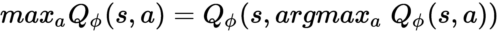

这个想法是学习一个确定性的 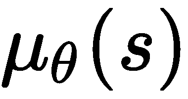 策略，它逼近 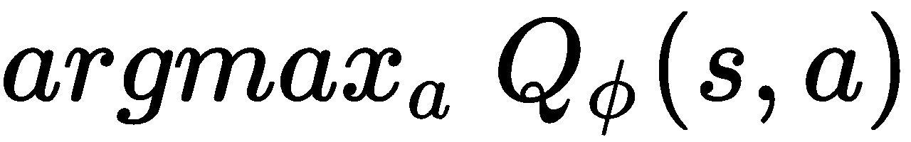。这克服了在每一步计算全局最大化的问题，并且为将其扩展到非常高维度和连续动作的情况打开了可能性。**确定性策略梯度**（**DPG**）成功地将这一概念应用于一些简单的问题，例如山地车、摆锤和章鱼臂。DPG 之后，DDPG 扩展了 DPG 的思想，使用深度神经网络作为策略，并采用一些更为细致的设计选择，以使算法更加稳定。进一步的算法，TD3，解决了 DPG 和 DDPG 中常见的高方差和过度估计偏差问题。接下来将解释和发展 DDPG 和 TD3。在我们构建一个分类 RL 算法的图谱时，我们将 DPG、DDPG 和 TD3 放置在策略梯度和 Q 学习算法的交集处，如下图所示。现在，让我们专注于 DPG 的基础以及它是如何工作的：

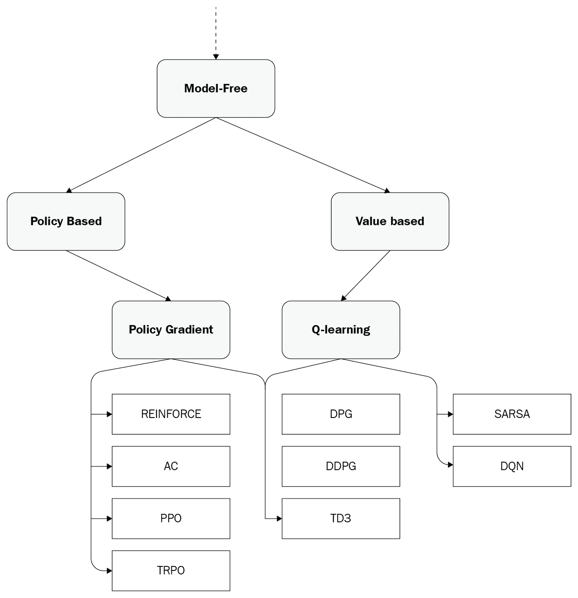

到目前为止开发的无模型 RL 算法的分类

新的 DPG 算法结合了 Q 学习和策略梯度方法。一个参数化的确定性策略只输出确定性的值。在连续的上下文中，这些值可以是动作的均值。然后，可以通过求解以下方程来更新策略的参数：

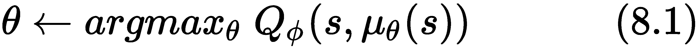

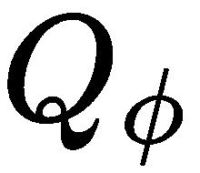 是参数化的动作值函数。注意，确定性方法与随机方法的不同之处在于，确定性方法不会向动作中添加额外的噪声。在 PPO 和 TRPO 中，我们是从一个正态分布中采样，具有均值和标准差。而在这里，策略只有一个确定性的均值。回到更新公式（8.1），和往常一样，最大化是通过随机梯度上升来完成的，这将通过小幅更新逐步改进策略。然后，目标函数的梯度可以如下计算：

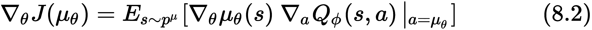

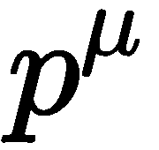 是遵循  策略的状态分布。这种形式来源于确定性策略梯度定理。它表示，目标函数的梯度是通过链式法则应用于 Q 函数计算的，该 Q 函数是相对于 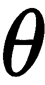 策略参数来求解的。使用像 TensorFlow 这样的自动微分软件，计算这一梯度非常容易。实际上，梯度是通过从 Q 值开始，沿着策略一直计算梯度，然后只更新后者的参数，如下所示：

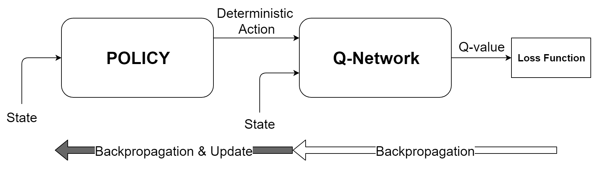

DPG 定理的示意图

梯度是从 Q 值开始计算的，但只有策略会被更新。

这是一个更理论性的结果。我们知道，确定性策略不会探索环境，因此它们无法找到好的解决方案。为了使 DPG 成为脱离策略的，我们需要更进一步，定义目标函数的梯度，使得期望符合随机探索策略的分布：

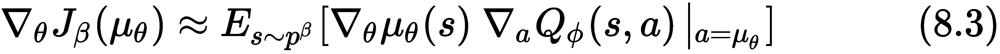

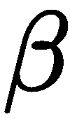 是一种探索策略，也叫做行为策略。该方程给出了*脱离策略确定性策略梯度*，并给出了相对于确定性策略（）的梯度估计，同时生成遵循行为策略（）的轨迹。请注意，实际中，行为策略仅仅是加上噪声的确定性策略。

尽管我们之前已经讨论过确定性演员-评论家的问题，但到目前为止，我们只展示了策略学习是如何进行的。实际上，我们同时学习了由确定性策略（）表示的演员，以及由 Q 函数（）表示的评论家。可微分的动作值函数（）可以通过贝尔曼更新轻松学习，从而最小化贝尔曼误差。

(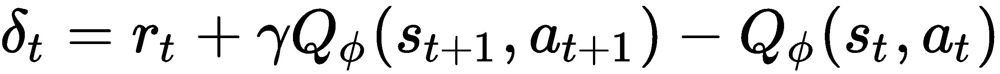)，正如 Q-learning 算法中所做的那样。

# 深度确定性策略梯度

如果你使用上一节中介绍的深度神经网络实现了 DPG 算法，算法将非常不稳定，且无法学到任何东西。我们在将 Q-learning 与深度神经网络结合时遇到了类似的问题。实际上，为了将 DNN 和 Q-learning 结合在 DQN 算法中，我们不得不采用一些其他技巧来稳定学习。DPG 算法也是如此。这些方法是脱离策略的，像 Q-learning 一样，正如我们很快将看到的，能让确定性策略与 DNN 配合使用的某些因素与 DQN 中使用的因素类似。

DDPG（*使用深度强化学习的连续控制* 由 Lillicrap 等人：[`arxiv.org/pdf/1509.02971.pdf`](https://arxiv.org/pdf/1509.02971.pdf)）是第一个使用深度神经网络的确定性演员-评论家算法，用于同时学习演员和评论家。这个无模型、脱离策略的演员-评论家算法扩展了 DQN 和 DPG，因为它借用了 DQN 的一些见解，如回放缓冲区和目标网络，使得 DPG 能够与深度神经网络一起工作。

# DDPG 算法

DDPG 使用了两个关键思想，均借鉴自 DQN，但已适配到演员-评论家的案例中：

+   **回放缓冲区**：在智能体的生命周期内获取的所有过渡数据都会被存储在回放缓冲区中，也叫经验回放。然后，通过从中采样小批量数据，使用它来训练演员和评论员。

+   **目标网络**：Q 学习是不稳定的，因为更新的网络也是用来计算目标值的网络。如果你还记得，DQN 通过使用目标网络来缓解这个问题，目标网络每 `N` 次迭代更新一次（将在线网络的参数复制到目标网络）。在 DDQN 论文中，他们表明，在这种情况下，软目标更新效果更好。通过软更新，目标网络的参数 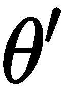 会在每一步与在线网络的参数  部分更新：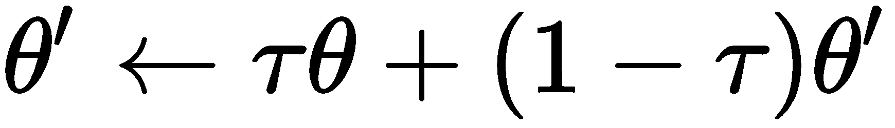 通过 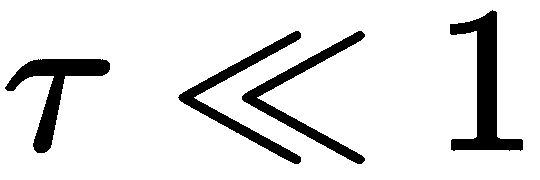。是的，尽管这可能会减慢学习速度，因为目标网络只部分更新，但它的好处超过了由增加的不稳定性带来的负面影响。使用目标网络的技巧不仅适用于演员，也适用于评论员，因此目标评论员的参数也会在软更新后更新：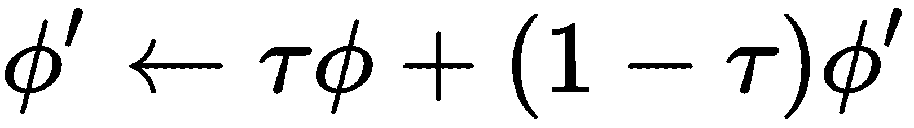。

请注意，从现在开始，我们将  和  称为在线演员和在线评论员的参数，将 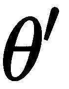 和 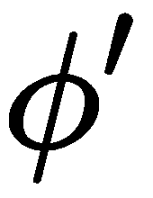 称为目标演员和目标评论员的参数。

DDPG 从 DQN 继承的一个特点是，能够在每一步环境交互后更新演员和评论员。这源于 DDPG 是一个离策略算法，并且从从回放缓冲区采样的小批量数据中学习。与基于策略的随机策略梯度方法相比，DDPG 不需要等到从环境中收集到足够大的批次数据。

之前，我们看到尽管 DPG 是在学习一个确定性策略，但它是根据一个探索行为策略来执行的。那么，这个探索性策略是如何构建的呢？在 DDPG 中，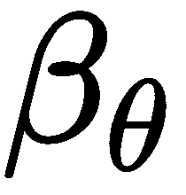 策略是通过添加从噪声过程中采样的噪声来构建的（）：

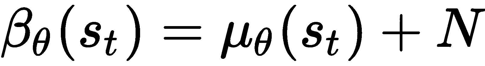

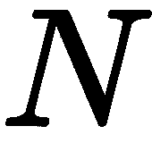 过程将确保环境被充分探索。

总结一下，DDPG 通过不断循环执行以下三个步骤直到收敛：

+    行为策略与环境进行交互，通过将观察和奖励存储在缓冲区中，从环境中收集它们。

+   在每一步中，演员和评论员都会根据从缓冲区采样的迷你批次中的信息进行更新。具体来说，评论员通过最小化在线评论员预测的值（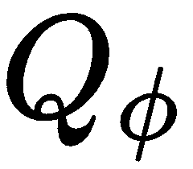）与使用目标策略（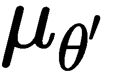）和目标评论员（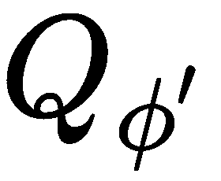）计算得到的目标值之间的均方误差（MSE）损失来更新。相反，演员是按照公式（8.3）进行更新的。

+   目标网络的参数是按照软更新进行更新的。

整个算法的总结见下列伪代码：

```py
---------------------------------------------------------------------------------
DDPG Algorithm
---------------------------------------------------------------------------------

Initialize online networks  and 
Initialize target networks  and  with the same weights as the online networks
Initialize empty replay buffer 
Initialize environment 

for  do
    > Run an episode
    while not d:

        > Store the transition in the buffer

        > Sample a minibatch 

        > Calculate the target value for every i in b
         (8.4)

        > Update the critic 
         (8.5)

        > Update the policy
         (8.6)

        > Targets update

if :

```

对算法有了更清晰的理解后，我们现在可以开始实现它了。

# DDPG 实现

前面部分给出的伪代码已经提供了该算法的全面视图，但从实现的角度来看，仍有一些值得深入探讨的内容。在这里，我们将展示一些更有趣的特性，这些特性也可能出现在其他算法中。完整代码可在本书的 GitHub 仓库中获取：[`github.com/PacktPublishing/Reinforcement-Learning-Algorithms-with-Python`](https://github.com/PacktPublishing/Reinforcement-Learning-Algorithms-with-Python)。

具体来说，我们将重点关注以下几个主要部分：

+   如何构建确定性演员-评论员

+   如何进行软更新

+   如何优化一个损失函数，仅针对某些参数

+   如何计算目标值

我们在一个名为`deterministic_actor_critic`的函数中定义了一个确定性策略的演员和评论员。这个函数将被调用两次，因为我们需要同时创建在线和目标演员-评论员。代码如下：

```py
def deterministic_actor_critic(x, a, hidden_sizes, act_dim, max_act):
    with tf.variable_scope('p_mlp'):
        p_means = max_act * mlp(x, hidden_sizes, act_dim, last_activation=tf.tanh)
    with tf.variable_scope('q_mlp'):
        q_d = mlp(tf.concat([x,p_means], axis=-1), hidden_sizes, 1, last_activation=None)
    with tf.variable_scope('q_mlp', reuse=True): # reuse the weights
        q_a = mlp(tf.concat([x,a], axis=-1), hidden_sizes, 1, last_activation=None)
    return p_means, tf.squeeze(q_d), tf.squeeze(q_a)
```

在这个函数内部有三件有趣的事情。首先，我们区分了两种输入类型，都是传递给同一个评论员的。第一种是输入一个状态，策略返回一个`p_means`确定性动作；第二种是输入一个状态和一个任意动作。做出这种区分是因为，一个评论员将用于优化演员，而另一个将用于优化评论员。尽管这两个评论员有不同的输入，但它们是同一个神经网络，意味着它们共享相同的参数。这种不同的用法是通过为两个评论员实例定义相同的变量作用域，并将第二个实例的`reuse=True`来实现的。这样可以确保这两个定义的参数是相同的，实际上只创建了一个评论员。

第二个观察是，我们在一个名为`p_mlp`的变量作用域中定义了演员。这是因为，稍后我们只需要提取这些参数，而不是评论员的参数。

第三个观察结果是，由于策略的最终激活层是`tanh`函数（将值限制在-1 和 1 之间），但我们的演员可能需要超出这个范围的值，我们必须将输出乘以`max_act`因子（这假设最小值和最大值是相反的，即，如果最大允许值是 3，最小值是-3）。

很好！现在让我们继续查看计算图的其余部分，在这里我们定义了占位符；创建了在线和目标演员，以及在线和目标评论员；定义了损失函数；实现了优化器；并更新了目标网络。

我们将从创建我们需要的占位符开始，用于观察值、动作和目标值：

```py
obs_dim = env.observation_space.shape
act_dim = env.action_space.shape

obs_ph = tf.placeholder(shape=(None, obs_dim[0]), dtype=tf.float32, name='obs')
act_ph = tf.placeholder(shape=(None, act_dim[0]), dtype=tf.float32, name='act')
y_ph = tf.placeholder(shape=(None,), dtype=tf.float32, name='y')
```

在之前的代码中，`y_ph`是目标 Q 值的占位符，`obs_ph`是观察值的占位符，`act_ph`是动作的占位符。

然后我们在`online`和`target`变量作用域内调用之前定义的`deterministic_actor_critic`函数，以便区分四个神经网络：

```py
with tf.variable_scope('online'):
    p_onl, qd_onl, qa_onl = deterministic_actor_critic(obs_ph, act_ph, hidden_sizes, act_dim[0], np.max(env.action_space.high))

with tf.variable_scope('target'):
    _, qd_tar, _ = deterministic_actor_critic(obs_ph, act_ph, hidden_sizes, act_dim[0], np.max(env.action_space.high))
```

评论员的损失是`qa_onl`在线网络的 Q 值和`y_ph`目标动作值之间的 MSE 损失：

```py
q_loss = tf.reduce_mean((qa_onl - y_ph)**2)
```

这将通过 Adam 优化器来最小化：

```py
q_opt = tf.train.AdamOptimizer(cr_lr).minimize(q_loss)
```

关于演员的损失函数，它是在线 Q 网络的相反符号。在这种情况下，在线 Q 网络的输入是由在线确定性演员选择的动作（如公式(8.6)所示，这在《DDPG 算法》部分的伪代码中定义）。因此，Q 值由`qd_onl`表示，策略损失函数写作如下：

```py
p_loss = -tf.reduce_mean(qd_onl)
```

我们取了目标函数的相反符号，因为我们必须将其转换为损失函数，考虑到优化器需要最小化损失函数。

现在，最重要的要记住的是，尽管我们计算了依赖于评论员和演员的`p_loss`损失函数的梯度，但我们只需要更新演员。实际上，从 DPG 中我们知道！[](img/48dc9da4-7d84-47cf-8d29-860467c03f05.png)。

这通过将`p_loss`传递给优化器的`minimize`方法来完成，该方法指定了需要更新的变量。在这种情况下，我们只需要更新在`online/m_mlp`变量作用域中定义的在线演员的变量：

```py
p_opt = tf.train.AdamOptimizer(ac_lr).minimize(p_loss, var_list=variables_in_scope('online/p_mlp'))
```

这样，梯度的计算将从`p_loss`开始，经过评论员的网络，再到演员的网络。最后，只有演员的参数会被优化。

现在，我们需要定义`variable_in_scope(scope)`函数，它返回名为`scope`的作用域中的变量：

```py
def variables_in_scope(scope):
    return tf.get_collection(tf.GraphKeys.GLOBAL_VARIABLES, scope)
```

现在是时候查看目标网络是如何更新的了。我们可以使用`variable_in_scope`来获取演员和评论员的目标变量和在线变量，并使用 TensorFlow 的`assign`函数更新目标变量，按照软更新公式进行：


这在以下代码片段中完成：

```py
update_target = [target_var.assign(tau*online_var + (1-tau)*target_var) for target_var, online_var in zip(variables_in_scope('target'), variables_in_scope('online'))]
update_target_op = tf.group(*update_target)
```

就这样！对于计算图而言，这就是全部。是不是很简单？现在我们可以快速浏览一下主要的循环，其中参数根据有限批次样本的估计梯度进行更新。策略与环境的交互是标准的，唯一的例外是，当前返回的动作是确定性的，因此我们需要添加一定量的噪声，以便充分探索环境。在这里，我们没有提供这部分代码，但你可以在 GitHub 上找到完整的实现。

当积累了足够的经验，并且缓冲区达到了某个阈值时，策略和评估网络的优化就开始了。接下来的步骤是*《DDPG 算法》*部分中提供的 DDPG 伪代码的摘要。步骤如下：

1.  从缓冲区中采样一个小批量

1.  计算目标动作值

1.  优化评估网络

1.  优化演员网络

1.  更新目标网络

所有这些操作都在几行代码中完成：

```py
    ... 

    mb_obs, mb_rew, mb_act, mb_obs2, mb_done = buffer.sample_minibatch(batch_size)

    q_target_mb = sess.run(qd_tar, feed_dict={obs_ph:mb_obs2})
    y_r = np.array(mb_rew) + discount*(1-np.array(mb_done))*q_target_mb

    _, q_train_loss = sess.run([q_opt, q_loss], feed_dict={obs_ph:mb_obs, y_ph:y_r, act_ph: mb_act})

    _, p_train_loss = sess.run([p_opt, p_loss], feed_dict={obs_ph:mb_obs})

    sess.run(update_target_op)

     ...

```

代码的第一行采样了一个`batch_size`大小的小批量，第二和第三行通过运行评估器和演员目标网络在`mb_obs2`（包含下一个状态）上来计算目标动作值，正如公式(8.4)所定义的那样。第四行通过输入包含目标动作值、观测和动作的字典来优化评估器。第五行优化演员网络，最后一行通过运行`update_target_op`更新目标网络。

# 将 DDPG 应用于 BipedalWalker-v2

现在，我们将 DDPG 应用于一个名为 BipedalWalker-v2 的连续任务，也就是 Gym 提供的一个使用 Box2D（一个 2D 物理引擎）的环境。以下是该环境的截图。目标是让智能体在崎岖的地形上尽可能快地行走。完成任务直到结束会获得 300+的分数，但每次应用马达会消耗少量能量。智能体移动得越高效，消耗的能量就越少。此外，如果智能体摔倒，会获得-100 的惩罚。状态由 24 个浮动数值组成，表示关节、船体的速度和位置，以及 LiDar 测距仪的测量数据。智能体由四个连续的动作控制，动作的范围是[-1,1]。以下是 BipedalWalker 2D 环境的截图：


BipedalWalker2d 环境截图

我们使用以下表格中的超参数来运行 DDPG。在第一行，列出了运行 DDPG 所需的超参数，而第二行列出了在这个特定案例中使用的相应值。让我们参考以下表格：

| **超参数** | 演员学习率 | 评论家学习率 | DNN 架构 | 缓冲区大小 | 批量大小 | Tau |
| --- | --- | --- | --- | --- | --- | --- |
| **值** | 3e-4 | 4e-4 | [64,relu,64,relu] | 200000 | 64 | 0.003 |

在训练过程中，我们在策略预测的动作中加入了额外的噪声。然而，为了衡量算法的表现，我们每 10 个回合在纯确定性策略（没有额外噪声）上进行 10 局游戏。以下图表展示了在时间步长的函数下，10 局游戏的累计奖励的平均值：

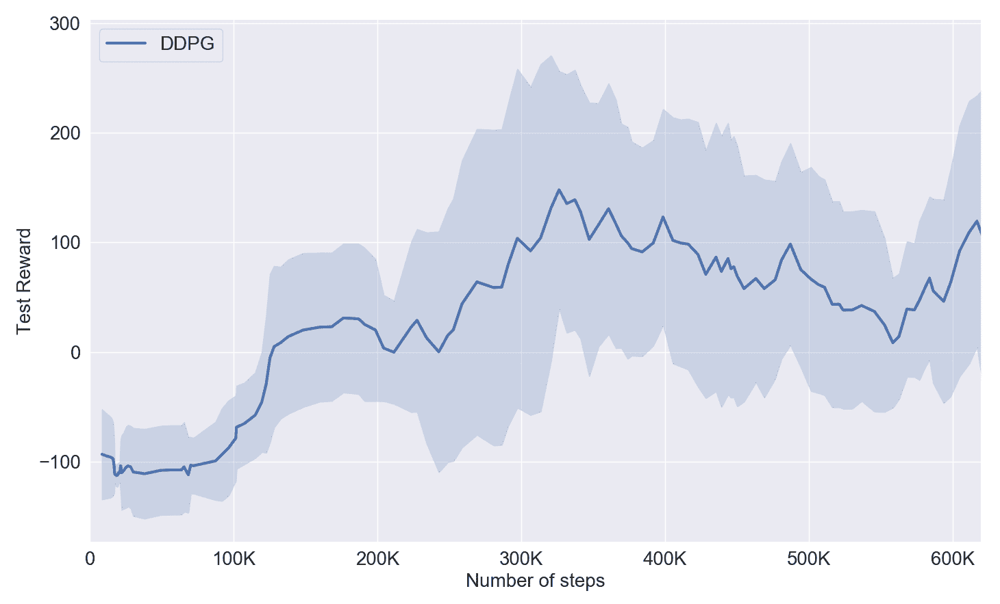

DDPG 算法在 BipedalWalker2d-v2 上的表现

从结果来看，我们可以看到性能相当不稳定，在几千步之后的得分波动范围从 250 到不到-100。众所周知，DDPG 本身是不稳定的，而且对超参数非常敏感，但经过更细致的调优，结果可能会更平滑。尽管如此，我们可以看到，在前 300k 步内，性能有所提升，达到了大约 100 的平均得分，峰值可达 300。

此外，BipedalWalker-v2 是一个非常难以解决的环境。事实上，当代理在 100 个连续回合中获得至少 300 分的平均奖励时，才算解决了这个环境。使用 DDPG 时，我们未能达到这些性能，但我们仍然获得了一个较好的策略，使得代理能够运行得相当快。

在我们的实现中，我们使用了一个恒定的探索因子。如果使用更复杂的函数，可能在更少的迭代中达到更高的性能。例如，在 DDPG 的论文中，他们使用了一个奥恩斯坦-乌伦贝克过程。如果你愿意，可以从这个过程开始。

DDPG 是一个美丽的例子，展示了如何将确定性策略与随机策略对立使用。然而，由于它是第一个解决复杂问题的算法，因此仍然有许多调整可以应用于它。本章中提出的下一个算法，进一步推动了 DDPG 的进步。

# 双延迟深度确定性策略梯度（TD3）

DDPG 被认为是最具样本效率的演员-评论家算法之一，但已被证明在超参数上非常敏感且易碎。后续的研究尝试通过引入新颖的思路，或者将其他算法的技巧应用于 DDPG，来缓解这些问题。最近，一种新的算法作为 DDPG 的替代方案出现：双延迟深度确定性策略梯度，简称 TD3（论文是*Addressing Function Approximation Error in Actor-Critic Methods*：[`arxiv.org/pdf/1802.09477.pdf`](https://arxiv.org/pdf/1802.09477.pdf)）。我们在这里使用“替代”一词，是因为它实际上是 DDPG 算法的延续，添加了一些新的元素，使得它更稳定，性能也更优。

TD3 专注于一些在其他脱机算法中也常见的问题。这些问题包括价值估计的高估和梯度估计的高方差。针对前者问题，他们采用了类似 DQN 中使用的解决方案；对于后者问题，他们采用了两种新的解决方案。我们首先考虑高估偏差问题。

# 解决高估偏差

高估偏差意味着由近似 Q 函数预测的动作值高于实际值。在具有离散动作的 Q 学习算法中，这一问题被广泛研究，通常会导致不良的预测，从而影响最终性能。尽管影响较小，但这个问题在 DDPG 中也存在。

如果你还记得，减少动作值高估的 DQN 变体被称为双 DQN，它提出了两个神经网络；一个用于选择动作，另一个用于计算 Q 值。特别地，第二个神经网络的工作是由一个冻结的目标网络完成的。这个想法很合理，但正如 TD3 论文中所解释的，它在演员-评论员方法中并不有效，因为在这些方法中，策略变化太慢。因此，他们提出了一种变体，称为剪切双 Q 学习，它取两个不同评论员的估计值之间的最小值（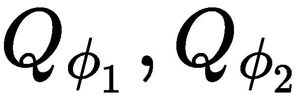）。因此，目标值的计算如下：

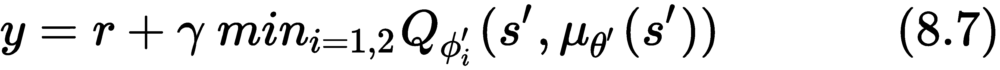

另一方面，这并不会阻止低估偏差，但它远比高估偏差危害小。剪切双 Q 学习可以在任何演员-评论员方法中使用，并且它遵循这样一个假设：两个评论员会有不同的偏差。

# TD3 的实现

为了将此策略转化为代码，我们需要创建两个具有不同初始化的评论员，计算目标动作值，如（8.7）中所示，并优化这两个评论员。

TD3 应用于我们在前一节中讨论的 DDPG 实现。以下代码片段仅是实现 TD3 所需的额外代码的一部分。完整实现可在本书的 GitHub 仓库中找到：[`github.com/PacktPublishing/Hands-On-Reinforcement-Learning-Algorithms-with-Python`](https://github.com/PacktPublishing/Hands-On-Reinforcement-Learning-Algorithms-with-Python)。

关于双评论员，你只需通过调用`deterministic_actor_double_critic`两次来创建它们，一次用于目标网络，一次用于在线网络，正如在 DDPG 中所做的那样。代码大致如下：

```py
def deterministic_actor_double_critic(x, a, hidden_sizes, act_dim, max_act):
    with tf.variable_scope('p_mlp'):
        p_means = max_act * mlp(x, hidden_sizes, act_dim, last_activation=tf.tanh)

    # First critic
    with tf.variable_scope('q1_mlp'):
        q1_d = mlp(tf.concat([x,p_means], axis=-1), hidden_sizes, 1, last_activation=None)
    with tf.variable_scope('q1_mlp', reuse=True): # Use the weights of the mlp just defined
        q1_a = mlp(tf.concat([x,a], axis=-1), hidden_sizes, 1, last_activation=None)

    # Second critic
    with tf.variable_scope('q2_mlp'):
        q2_d = mlp(tf.concat([x,p_means], axis=-1), hidden_sizes, 1, last_activation=None)
    with tf.variable_scope('q2_mlp', reuse=True):
        q2_a = mlp(tf.concat([x,a], axis=-1), hidden_sizes, 1, last_activation=None)

    return p_means, tf.squeeze(q1_d), tf.squeeze(q1_a), tf.squeeze(q2_d), tf.squeeze(q2_a)
```

剪切目标值（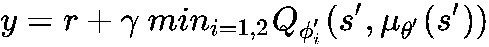（8.7））是通过首先运行我们称之为`qa1_tar`和`qa2_tar`的两个目标评论员，然后计算估计值之间的最小值，最后使用它来估算目标值：

```py
            ...            
            double_actions = sess.run(p_tar, feed_dict={obs_ph:mb_obs2})

            q1_target_mb, q2_target_mb = sess.run([qa1_tar,qa2_tar], feed_dict={obs_ph:mb_obs2, act_ph:double_actions})
            q_target_mb = np.min([q1_target_mb, q2_target_mb], axis=0) 
            y_r = np.array(mb_rew) + discount*(1-np.array(mb_done))*q_target_mb
            ..
```

接下来，评论员可以像往常一样进行优化：

```py
            ...
            q1_train_loss, q2_train_loss = sess.run([q1_opt, q2_opt], feed_dict={obs_ph:mb_obs, y_ph:y_r, act_ph: mb_act})
            ...

```

一个重要的观察是，策略是相对于一个近似的 Q 函数进行优化的，在我们的例子中是 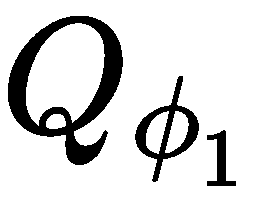。事实上，如果你查看完整代码，你会发现 `p_loss` 被定义为 `p_loss = -tf.reduce_mean(qd1_onl)`。

# 解决方差减少问题

TD3 的第二个也是最后一个贡献是方差的减少。为什么高方差是个问题呢？因为它会产生噪声梯度，导致错误的策略更新，从而影响算法的性能。高方差的复杂性体现在 TD 误差中，它通过后续状态估计动作值。

为了缓解这个问题，TD3 引入了延迟的策略更新和目标正则化技术。让我们看看它们是什么，为什么它们如此有效。

# 延迟的策略更新

由于高方差归因于不准确的评论，TD3 提议将策略更新延迟，直到评论误差足够小为止。TD3 以经验方式延迟更新策略，仅在固定的迭代次数之后才更新策略。通过这种方式，评论有时间学习并稳定自身，然后再进行策略优化。实际上，策略仅在几个迭代中保持固定，通常是 1 到 6 次。如果设置为 1，则与 DDPG 中的情况相同。延迟的策略更新可以通过以下方式实现：

```py
            ...
            q1_train_loss, q2_train_loss = sess.run([q1_opt, q2_opt], feed_dict={obs_ph:mb_obs, y_ph:y_r, act_ph: mb_act})
            if step_count % policy_update_freq == 0:
                sess.run(p_opt, feed_dict={obs_ph:mb_obs})
                sess.run(update_target_op)
            ...
```

# 目标正则化

从确定性动作更新的评论往往会在狭窄的峰值中产生过拟合。其后果是方差增加。TD3 提出了一个平滑正则化技术，它在目标动作附近的小区域添加了一个剪切噪声：

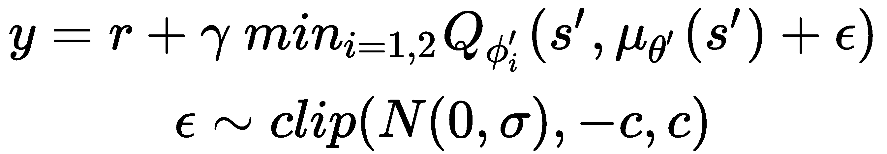

该正则化可以通过一个函数实现，该函数接受一个向量和一个比例作为参数：

```py
def add_normal_noise(x, noise_scale):
    return x + np.clip(np.random.normal(loc=0.0, scale=noise_scale, size=x.shape), -0.5, 0.5)
```

然后，在运行目标策略后，调用 `add_normal_noise`，如下代码所示（与 DDPG 实现的不同之处已加粗）：

```py
            ...            
            double_actions = sess.run(p_tar, feed_dict={obs_ph:mb_obs2})
            double_noisy_actions = np.clip(add_normal_noise(double_actions, target_noise), env.action_space.low, env.action_space.high)

            q1_target_mb, q2_target_mb = sess.run([qa1_tar,qa2_tar], feed_dict={obs_ph:mb_obs2, act_ph:double_noisy_actions})
            q_target_mb = np.min([q1_target_mb, q2_target_mb], axis=0) 
            y_r = np.array(mb_rew) + discount*(1-np.array(mb_done))*q_target_mb
            ..
```

我们在添加了额外噪声后，剪切了动作，以确保它们不会超出环境设定的范围。

将所有内容结合起来，我们得到了以下伪代码所示的算法：

```py
---------------------------------------------------------------------------------
TD 3 Algorithm
---------------------------------------------------------------------------------

Initialize online networks  and 
Initialize target networks  and  with the same weights as the online networks
Initialize empty replay buffer 
Initialize environment 

for  do
    > Run an episode
    while not d:

        > Store the transition in the buffer

        > Sample a minibatch 

        > Calculate the target value for every i in b

        > Update the critics 

        if iter % policy_update_frequency == 0:
            > Update the policy

            > Targets update

 if :

```

这就是 TD3 算法的全部内容。现在，你对所有确定性和非确定性策略梯度方法有了清晰的理解。几乎所有的无模型算法都基于我们在这些章节中解释的原则，如果你掌握了它们，你将能够理解并实现所有这些算法。

# 将 TD3 应用到 BipedalWalker

为了直接比较 TD3 和 DDPG，我们在与 DDPG 相同的环境中测试了 TD3：BipedalWalker-v2。

针对这个环境，TD3 的最佳超参数列在下面的表格中：

| **超参数** | Actor 学习率 | Critic 学习率 | DNN 架构 | 缓冲区大小 | 批次大小 | Tau |
| --- | --- | --- | --- | --- | --- | --- |

策略更新频率

|

Sigma

|

| **值** | 4e-4 | 4e-4 | [64,relu,64,relu] | 200000 | 64 | 0.005 | 2 | 0.2 |
| --- | --- | --- | --- | --- | --- | --- | --- | --- |

结果绘制在下图中。曲线呈平滑趋势，在大约 30 万步之后达到了良好的结果，在训练的 45 万步时达到了顶峰。它非常接近 300 分的目标，但实际上并没有达到：

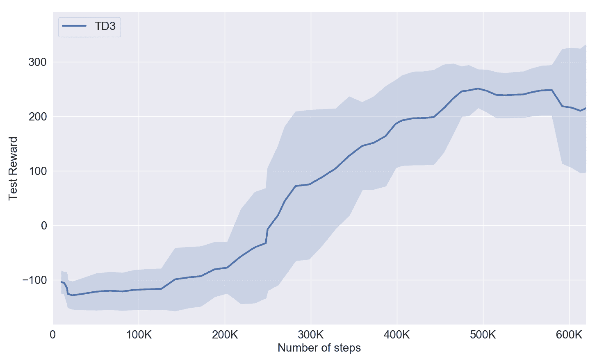

TD3 算法在 BipedalWalker-v2 上的表现

相比于 DDPG，找到 TD3 的超参数所花费的时间较少。而且，尽管我们只是在一个游戏上比较这两种算法，我们认为这是一个很好的初步观察，帮助我们理解它们在稳定性和性能上的差异。DDPG 和 TD3 在 BipedalWalker-v2 上的表现如下：

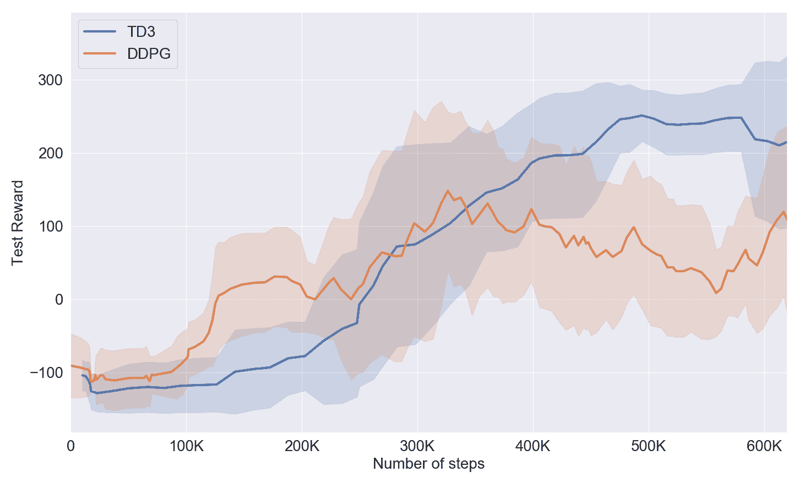

DDPG 与 TD3 性能比较

如果你想在更具挑战性的环境中训练算法，可以尝试 BipedalWalkerHardcore-v2。它与 BipedalWalker-v2 非常相似，唯一不同的是它有梯子、树桩和陷阱。很少有算法能够完成并解决这个环境。看到智能体无法通过这些障碍也非常有趣！

相比于 DDPG，TD3 的优越性非常明显，无论是在最终性能、改进速度还是算法稳定性上。

本章中提到的所有颜色参考，请参考此链接中的颜色图像包：[`www.packtpub.com/sites/default/files/downloads/9781789131116_ColorImages.pdf`](http://www.packtpub.com/sites/default/files/downloads/9781789131116_ColorImages.pdf)。

# 总结

在本章中，我们介绍了解决强化学习问题的两种不同方法。第一种是通过估计状态-动作值来选择最佳的下一步动作，这就是所谓的 Q-learning 算法。第二种方法是通过梯度最大化期望奖励策略。事实上，这些方法被称为策略梯度方法。本章中，我们展示了这些方法的优缺点，并证明了它们在许多方面是互补的。例如，Q-learning 算法在样本效率上表现优秀，但无法处理连续动作。相反，策略梯度算法需要更多数据，但能够控制具有连续动作的智能体。接着，我们介绍了结合 Q-learning 和策略梯度技术的 DPG 方法。特别地，这些方法通过预测一个确定性策略，克服了 Q-learning 算法中的全局最大化问题。我们还展示了如何通过 Q 函数的梯度定义 DPG 定理中的确定性策略更新。

我们学习并实现了两种 DPG 算法：DDPG 和 TD3。这两种算法都是脱离策略的演员-评论家算法，可以用于具有连续动作空间的环境。TD3 是 DDPG 的升级版，封装了一些减少方差的技巧，并限制了在 Q-learning 算法中常见的过度估计偏差。

本章总结了无模型强化学习算法的概述。我们回顾了迄今为止已知的所有最佳和最具影响力的算法，从 SARSA 到 DQN，再到 REINFORCE 和 PPO，并将它们结合在如 DDPG 和 TD3 等算法中。这些算法本身在适当的微调和大量数据的支持下，能够实现惊人的成果（参见 OpenAI Five 和 AlphaStar）。然而，这并不是强化学习的全部内容。在下一章中，我们将不再讨论无模型算法，而是展示一种基于模型的算法，其目的是通过学习环境模型来减少学习任务所需的数据量。在随后的章节中，我们还将展示更先进的技术，如模仿学习、新的有用强化学习算法，如 ESBAS，以及非强化学习算法，如进化策略。

# 问题

1.  Q-learning 算法的主要限制是什么？

1.  为什么随机梯度算法样本效率低？

1.  DPG 是如何克服最大化问题的？

1.  DPG 是如何保证足够的探索的？

1.  DDPG 代表什么？它的主要贡献是什么？

1.  TD3 提出了哪些问题来最小化？

1.  TD3 使用了哪些新机制？

# 深入阅读

你可以通过以下链接了解更多：

+   如果你对介绍**确定性策略梯度**（**DPG**）算法的论文感兴趣，可以阅读：[`proceedings.mlr.press/v32/silver14.pdf`](http://proceedings.mlr.press/v32/silver14.pdf)。

+   如果你对介绍**深度确定性策略梯度**（**DDPG**）算法的论文感兴趣，可以阅读：[`arxiv.org/pdf/1509.02971.pdf`](https://arxiv.org/pdf/1509.02971.pdf)。

+   介绍**双延迟深度确定性策略梯度**（**TD3**）算法的论文可以在这里找到：[`arxiv.org/pdf/1802.09477.pdf`](https://arxiv.org/pdf/1802.09477.pdf)。

+   想了解所有主要策略梯度算法的简要概述，可以查看 Lilian Weng 撰写的这篇文章：[`lilianweng.github.io/lil-log/2018/04/08/policy-gradient-algorithms.html`](https://lilianweng.github.io/lil-log/2018/04/08/policy-gradient-algorithms.html)。
