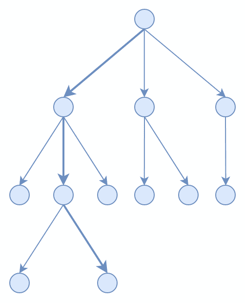
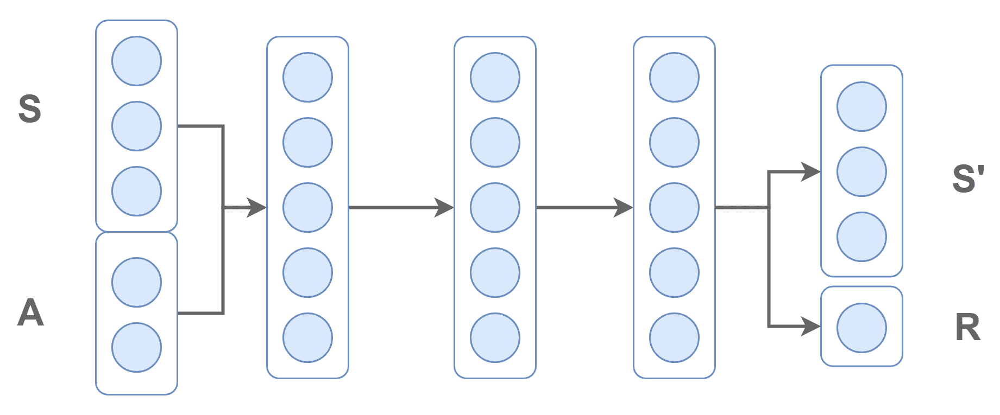
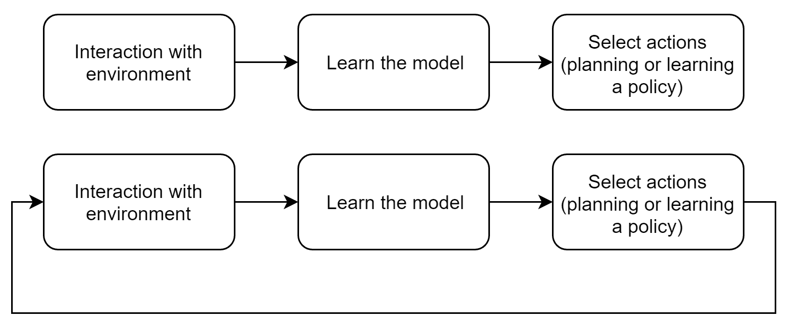
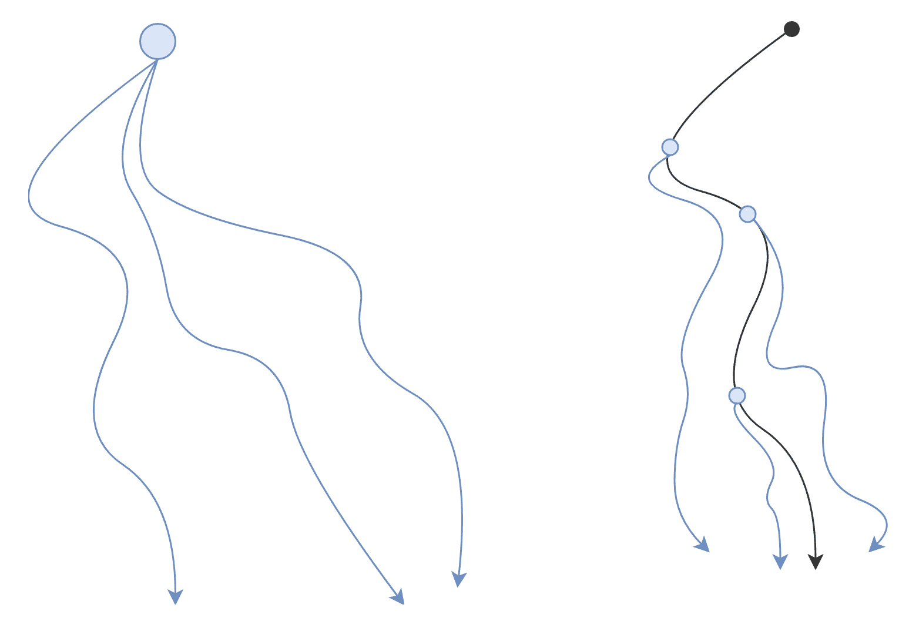
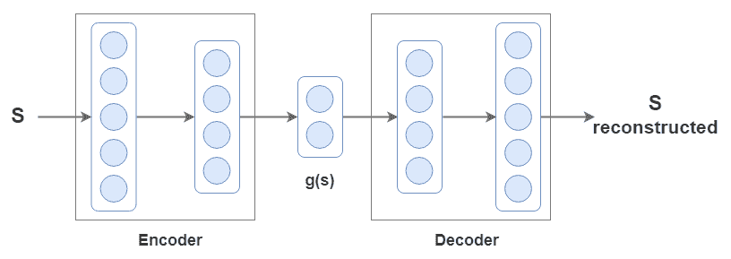
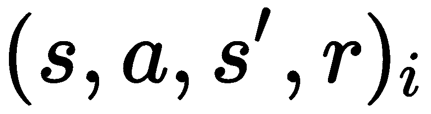
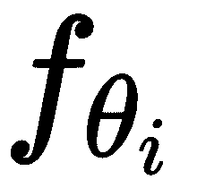
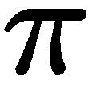
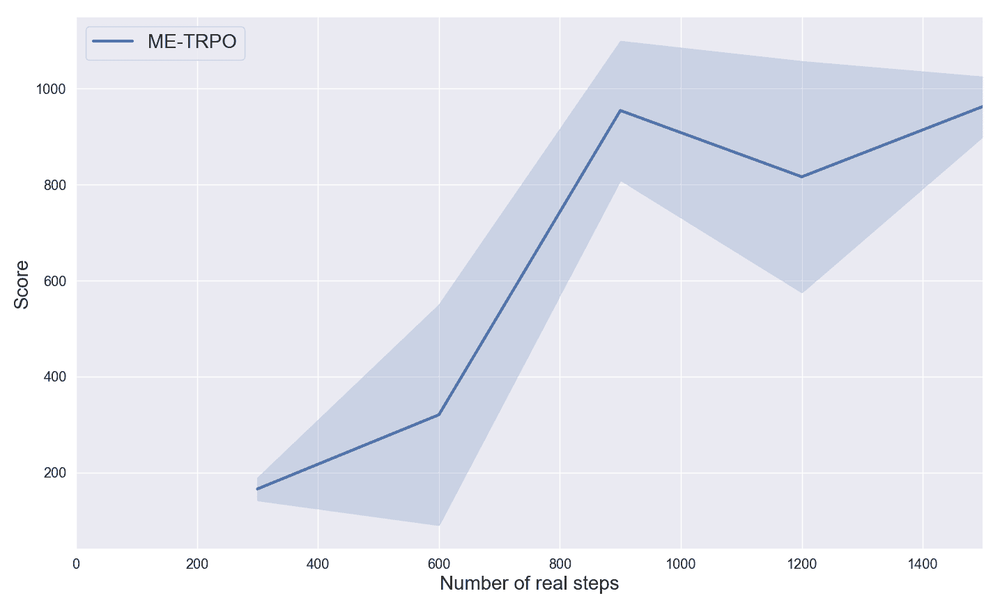

# 第九章：基于模型的强化学习

强化学习算法分为两类——无模型方法和基于模型的方法。这两类的区别在于对环境模型的假设。无模型算法仅通过与环境的互动学习策略，而对环境一无所知；而基于模型的算法已经对环境有深入的理解，并利用这些知识根据模型的动态来采取下一步行动。

在本章中，我们将为你提供一个全面的基于模型方法的概述，突出其与无模型方法相比的优缺点，以及当模型已知或需要学习时产生的差异。后者的划分很重要，因为它影响了问题的处理方式和用于解决问题的工具。在这段介绍之后，我们将讨论一些更为复杂的案例，其中基于模型的算法必须处理高维度的观察空间，比如图像。

此外，我们还将讨论一种结合了基于模型和无模型方法的算法类，用于在高维空间中学习模型和策略。我们将深入了解其内部工作原理，并解释为何使用这种方法。然后，为了加深我们对基于模型的算法，特别是结合基于模型和无模型方法的算法的理解，我们将开发一种最先进的算法，叫做**模型集成信任区域策略优化**（**ME-TRPO**），并将其应用于连续倒立摆问题。

本章将涵盖以下主题：

+   基于模型的方法

+   将基于模型与无模型学习结合

+   将 ME-TRPO 应用到倒立摆问题

# 基于模型的方法

无模型算法是一种强大的算法类型，能够学习非常复杂的策略并在复杂和多样化的环境中完成目标。正如 OpenAI 的最新工作所展示的（[`openai.com/five/`](https://openai.com/five/)）和 DeepMind 的工作（[`deepmind.com/blog/article/alphastar-mastering-real-time-strategy-game-starcraft-ii`](https://deepmind.com/blog/article/alphastar-mastering-real-time-strategy-game-starcraft-ii)），这些算法实际上能够在《星际争霸》和《Dota 2》等挑战性游戏中展示长期规划、团队合作以及对意外情况的适应能力。

训练过的智能体已经能够击败顶级职业玩家。然而，最大的问题在于需要进行大量游戏才能训练智能体掌握这些游戏。实际上，为了取得这些结果，算法已经被大规模扩展，允许智能体与自己对战，进行数百年的游戏。但，这种方法到底有什么问题呢？

好吧，直到你为一个模拟器训练一个智能体，你可以收集你想要的任何经验。当你在一个像你生活的世界一样缓慢而复杂的环境中运行智能体时，问题就出现了。在这种情况下，你不能等上几百年才看到一些有趣的能力。那么，我们能否开发出一种与现实环境互动较少的算法？可以。正如你可能还记得的，我们已经在无模型算法中探讨过这个问题。

解决方案是使用脱离策略的算法。然而，收效甚微，对于许多现实世界问题来说，其增益并不显著。

正如你可能预料的那样，答案（或至少一个可能的答案）就在基于模型的强化学习算法中。你已经开发了一种基于模型的算法。你还记得是哪一种吗？在第三章中，*使用动态规划解决问题*，我们将环境模型与动态规划结合起来，训练智能体在有陷阱的地图上导航。由于动态规划使用了环境模型，因此它被视为一种基于模型的算法。

不幸的是，动态规划（DP）无法应用于中等或复杂的问题。所以，我们需要探索其他类型的基于模型的算法，这些算法能够扩展并在更具挑战性的环境中发挥作用。

# 基于模型的学习的广泛视角

让我们首先回顾一下什么是模型。模型由环境的转移动态和奖励组成。转移动态是一个从状态 *s* 和动作 *a* 映射到下一个状态 *s'* 的过程。

有了这些信息，环境就可以通过模型完全表示，并且可以用模型代替环境。如果智能体能访问该模型，那么它就有能力预测自己的未来。

在接下来的章节中，我们将看到模型可以是已知的或未知的。在已知模型的情况下，模型直接用来利用环境的动态；也就是说，模型提供了一个表示，用来代替环境。在环境模型未知的情况下，模型可以通过直接与环境互动来学习。但由于在大多数情况下，我们只学到环境的一个近似模型，因此在使用时必须考虑额外的因素。

现在我们已经解释了什么是模型，我们可以看看如何使用模型，以及它如何帮助我们减少与环境的互动次数。模型的使用方式取决于两个非常重要的因素——模型本身以及选择动作的方式。

确实，正如我们刚才提到的，模型可以是已知的或未知的，行动可以通过一个学习到的策略来规划或选择。算法会根据具体情况有所不同，因此让我们首先详细说明在模型已知的情况下使用的方式（即我们已经拥有环境的转移动态和奖励）。

# 一个已知的模型

当模型已知时，可以用它来模拟完整的轨迹，并计算每条轨迹的回报。然后，选择那些能够带来最高回报的动作。这个过程被称为**规划**，而环境模型是不可或缺的，因为它提供了生成下一个状态（给定一个状态和一个动作）和回报所需的信息。

规划算法在各个领域都有应用，但我们关注的算法与它们操作的动作空间类型不同。有些算法处理离散动作，其他则处理连续动作。

针对离散动作的规划算法通常是搜索算法，它们构建决策树，例如下面图示的那种：



当前状态是根节点，可能的动作由箭头表示，其他节点是通过一系列动作达到的状态。

你可以看到，通过尝试每一个可能的动作序列，最终会找到最优的那个。不幸的是，在大多数问题中，这个过程是不可行的，因为可能的动作数量呈指数级增长。复杂问题中使用的规划算法采用一些策略，通过依赖有限数量的轨迹来实现规划。

其中一个算法，也被 AlphaGo 采用，叫做蒙特卡洛树搜索（MCTS）。MCTS 通过生成一系列有限的模拟游戏，迭代构建决策树，同时充分探索那些尚未访问的树枝。一旦一个模拟游戏或轨迹达到叶节点（即游戏结束），它会将结果反向传播到访问过的状态，并更新节点所持有的胜/负或回报信息。然后，选择能够带来更高胜/负比或回报的动作。

相对的，处理连续动作的规划算法涉及轨迹优化技术。这些算法比其离散动作的对手更难解决，因为它们需要处理一个无限维的优化问题。

此外，许多算法需要模型的梯度。例如，模型预测控制（MPC）会对有限时间范围进行优化，但它并不执行找到的完整轨迹，而只执行第一步动作。通过这样做，MPC 与其他具有无限时间范围规划的方法相比，响应速度更快。

# 未知模型

当环境的模型未知时应该怎么办？学习它！到目前为止，我们所见的一切几乎都涉及学习。那么，这是否是最佳方法呢？嗯，如果你确实想使用基于模型的方法，答案是肯定的，稍后我们将看到如何做到这一点。然而，这并不总是最佳的做法。

在强化学习中，最终目标是为给定任务学习一个最优策略。在本章之前，我们提到过基于模型的方法主要用于减少与环境的互动次数，但这总是成立吗？假设你的目标是做一个煎蛋卷。知道鸡蛋的确切断裂点完全没有用；你只需要大致知道如何打破它。因此，在这种情况下，不涉及鸡蛋结构的无模型算法更为合适。

然而，这不应该让你认为基于模型的算法不值得使用。例如，当模型比策略更容易学习时，基于模型的方法在某些情况下优于无模型的方法。

学习一个模型的唯一方式是（不幸的是）通过与环境的互动。这是一个必经步骤，因为它让我们能够获取并创建关于环境的数据集。通常，学习过程是以监督方式进行的，其中一个函数逼近器（如深度神经网络）被训练以最小化损失函数，例如环境获得的转移和预测之间的均方误差损失。以下图示展示了这一过程，其中一个深度神经网络被训练来通过预测下一个状态*s'*和奖励*r*，从状态*s*和动作*a*来建模环境：



除了神经网络，还有其他选择，如高斯过程和高斯混合模型。特别是，高斯过程的特点是能够考虑到模型的不确定性，并且被认为具有很高的数据效率。事实上，在深度神经网络出现之前，它们是最受欢迎的选择。

然而，高斯过程的主要缺点是它们在处理大型数据集时比较慢。实际上，要学习更复杂的环境（从而需要更大的数据集），更倾向使用深度神经网络。此外，深度神经网络能够学习那些将图像作为观测的环境模型。

有两种主要的学习环境模型的方法；一种是模型一旦学习完毕就固定不变，另一种是在开始时学习模型，但一旦计划或策略发生变化，就重新训练模型。以下图示展示了这两种选择：



在图示的上半部分，展示了一种顺序的基于模型的算法，其中智能体仅在学习模型之前与环境进行互动。在下半部分，展示了一种基于模型的学习的循环方法，其中模型通过来自不同策略的额外数据进行改进。

为了理解算法如何从第二种选择中受益，我们必须定义一个关键概念。为了收集用于学习环境动态的数据集，你需要一个能够让你导航的策略。但在开始时，该策略可能是确定性的或完全随机的。因此，在有限的交互次数下，所探索的空间将非常有限。

这使得模型无法学习到那些用于规划或学习最优轨迹的环境部分。但是，如果模型通过来自更新和更好的策略的新交互进行再训练，它将逐步适应新策略，并捕捉到所有尚未访问的环境部分（从策略角度来看）。这就是数据聚合。

在实践中，在大多数情况下，模型是未知的，并通过数据聚合方法来适应新产生的策略。然而，学习模型可能是具有挑战性的，潜在的问题如下：

+   **模型过拟合**：学到的模型在环境的局部区域上过拟合，忽略了它的全局结构。

+   **不准确的模型**：在一个不完美的模型上进行规划或学习策略可能会引发一连串的错误，导致潜在的灾难性结论。

优秀的基于模型的算法，能够学习模型，必须处理这些问题。一个潜在的解决方案是使用能够估算不确定性的算法，如贝叶斯神经网络，或通过使用模型集成。

# 优势和劣势

在开发强化学习算法（各种 RL 算法）时，有三个基本方面需要考虑：

+   **渐近性能**：这是指如果算法拥有无限的时间和硬件资源时，它可以达到的最大性能。

+   **实际时间**：这是指算法在给定计算能力下，达到特定性能所需的学习时间。

+   **样本效率**：这是指与环境交互的次数，以达到给定的性能。

我们已经探讨了在无模型和基于模型的强化学习中样本效率的差异，且发现后者的样本效率要高得多。那么，实际时间和性能呢？其实，基于模型的算法通常具有较低的渐近性能，且训练速度较慢，相比之下，无模型算法的训练速度较快。通常，较高的数据效率往往会以牺牲性能和速度为代价。

基于模型学习性能较低的一个原因可以归因于模型的不准确性（如果是通过学习得到的），这种不准确性会为策略引入额外的误差。较长的学习时钟时间是由于规划算法的缓慢，或者是由于在不准确的学习环境中需要更多的交互才能学习到策略。此外，基于模型的规划算法由于规划的高计算成本，推理时间较慢，仍然需要在每一步进行规划。

总结来说，您必须考虑训练基于模型的算法所需的额外时间，并认识到这些方法的渐近性能较低。然而，当模型比策略本身更容易学习，并且与环境的交互代价较高或较慢时，基于模型的学习是极其有用的。

从两个方面来看，我们有无模型学习和基于模型的学习，它们各自有引人注目的特点，但也有明显的缺点。我们能否从两者中各取所长？

# 将基于模型的学习与无模型学习结合

我们刚刚看到，规划在训练和运行时都可能计算开销较大，并且在更复杂的环境中，规划算法无法实现良好的性能。我们简要提到的另一种策略是学习策略。策略在推理时无疑要快得多，因为它不需要在每一步进行规划。

一种简单而有效的学习策略的方法是将基于模型的学习与无模型学习相结合。随着无模型算法的最新创新，这种结合方法越来越流行，成为迄今为止最常见的方法。我们将在下一节开发的算法——ME-TRPO，就是这种方法之一。让我们深入探讨这些算法。

# 一种有用的结合方式

如您所知，无模型学习具有良好的渐近性能，但样本复杂度较高。另一方面，基于模型的学习从数据的角度来看是高效的，但在处理更复杂任务时存在困难。通过结合基于模型和无模型的方法，有可能找到一个平衡点，在保持无模型算法高性能的同时，持续降低样本复杂度。

有很多方法可以将这两个领域结合起来，提出这样的方法的算法之间差异很大。例如，当模型已经给定（如围棋和国际象棋中的模型），搜索树和基于价值的算法可以相互帮助，从而更好地估算行动价值。

另一个例子是将环境和策略的学习直接结合到深度神经网络架构中，以便学习到的动态能够为策略的规划提供帮助。许多算法使用的另一种策略是使用学习到的环境模型生成额外的样本，以优化策略。

换句话说，策略是通过在学习到的模型中进行模拟游戏来训练的。这可以通过多种方式实现，但主要的步骤如下所示：

```py
while not done:
    > collect transitions  from the real environment using a policy 
    > add the transitions to the buffer 
    > learn a model  that minimizes  in a supervised way using data in 
    > (optionally learn )

    repeat K times: 
        > sample an initial state 
        > simulate transitions  from the model using a policy 
        > update the policy  using a model-free RL
```

这个蓝图涉及两个循环。最外层的循环收集来自真实环境的数据用于训练模型，而最内层的循环中，模型生成的模拟样本用于使用无模型算法优化策略。通常，动态模型是通过监督学习方式训练，以最小化均方误差（MSE）损失。模型的预测越精确，策略就越准确。

在最内层的循环中，可以模拟完整的轨迹或固定长度的轨迹。实际上，为了减轻模型的不完美，后者选项可以被采用。此外，轨迹可以从包含真实转换的缓冲区中随机抽取初始状态，或从初始状态开始。前者在模型不准确时更为偏好，因为这可以防止轨迹与真实轨迹的偏差过大。为了说明这种情况，考虑以下图示。真实环境中收集到的轨迹为黑色，而模拟的轨迹为蓝色：



你可以看到，从初始状态开始的轨迹变得更长，因此，随着不准确模型的误差在随后的预测中传播，它们会更快地发散。

注意，你只进行主循环的一次迭代，并收集所有学习到的环境模型所需的数据也是可以的。然而，基于之前提到的原因，使用迭代数据聚合方法通过新的策略周期性地重新训练模型会更好。

# 从图像构建模型

到目前为止，结合基于模型和无模型学习的方法，特别设计用于处理低维状态空间。那么，如何处理高维观测空间（如图像）呢？

一种选择是学习潜在空间。潜在空间是高维输入（例如图像）的一种低维表示，也叫做嵌入，*g(s)*。它可以通过神经网络如自编码器生成。以下图示展示了自编码器的一个例子：



它包括一个编码器，将图像映射到一个小的潜在空间，*g(s)*，以及解码器，将潜在空间映射回重建的图像。通过自编码器的作用，潜在空间应该在一个受限空间内表示图像的主要特征，使得两个相似的图像在潜在空间中也相似。

在强化学习中，自编码器可以被训练来重建输入，*S*，或者训练来预测下一个帧的观测值，*S'*，（如果需要的话，还包括奖励）。然后，我们可以利用潜在空间来学习动态模型和策略。这个方法的主要好处是由于图像的表示更小，从而大大提高了速度。然而，当自编码器无法恢复正确的表示时，潜在空间中学到的策略可能会出现严重的缺陷。

高维空间的基于模型的学习仍然是一个非常活跃的研究领域。

如果你对从图像观测中学习的基于模型的算法感兴趣，Kaiser 的论文《*基于模型的 Atari 强化学习*》可能会引起你的兴趣（[`arxiv.org/pdf/1903.00374.pdf`](https://arxiv.org/pdf/1903.00374.pdf)）。

到目前为止，我们已经从更具象征性和理论化的角度讨论了基于模型的学习及其与无模型学习的结合。虽然这些对理解这些范式是不可或缺的，但我们希望将其付诸实践。因此，事不宜迟，让我们专注于第一个基于模型的算法的细节和实现。

# ME-TRPO 应用于倒立摆

许多变种的基于模型和无模型的算法存在于*有用的组合*部分的伪代码中。几乎所有这些变种都提出了不同的方式来处理环境模型的不足之处。

这是一个关键问题，需要解决以达到与无模型方法相同的性能。从复杂环境中学到的模型总是会有一些不准确性。因此，主要的挑战是估计或控制模型的不确定性，以稳定和加速学习过程。

ME-TRPO 提出了使用一个模型集来保持模型不确定性并正则化学习过程。这些模型是具有不同权重初始化和训练数据的深度神经网络。它们共同提供了一个更加稳健的环境通用模型，能够避免在数据不足的区域产生过拟合。

然后，从使用这些模型集模拟的轨迹中学习策略。特别地，选择用来学习策略的算法是**信任域策略优化**（**TRPO**），该算法在第七章中有详细解释，标题为*TRPO 和 PPO 实现*。

# 理解 ME-TRPO

在 ME-TRPO 的第一部分，环境的动态（即模型集）被学习。算法首先通过与环境的随机策略互动，，来收集转移数据集，。然后，这个数据集被用来以监督方式训练所有动态模型，。这些模型，，是通过不同的随机权重初始化并使用不同的小批量进行训练的。为了避免过拟合问题，从数据集中创建了一个验证集。此外，当验证集上的损失不再改善时，一种*早停*机制（在机器学习中广泛使用的正则化技术）会中断训练过程。

在算法的第二部分，策略是通过 TRPO 进行学习的。具体而言，策略是在从已学习模型中收集的数据上进行训练，我们也称之为*模拟环境*，而不是实际环境。为了避免策略利用单个学习模型的不准确区域，策略，，是通过整个模型集的预测转移来训练的，。特别地，策略是在由模型集中的随机选择的转移组成的模拟数据集上进行训练的，。在训练过程中，策略会不断被监控，一旦性能停止提升，训练过程就会停止。

最后，由这两个部分构成的循环会一直重复，直到收敛。然而，在每次新迭代时，都会通过运行新学习到的策略，，来收集来自实际环境的数据，并将收集到的数据与前几次迭代的数据集进行汇总。ME-TRPO 算法的简要伪代码总结如下：

```py
Initialize randomly policy  and models 
Initialize empty buffer 

while not done:
    > populate buffer  with transitions  from the real environment using policy  (or random)
    > learn models  that minimize  in a supervised way using data in 

    until convergence: 
        > sample an initial state 
        > simulate transitions  using models  and the policy 
        > take a TRPO update to optimize policy 
```

这里需要特别注意的是，与大多数基于模型的算法不同，奖励并未嵌入到环境模型中。因此，ME-TRPO 假设奖励函数是已知的。

# 实现 ME-TRPO

ME-TRPO 的代码非常长，在这一部分我们不会给出完整的代码。此外，很多部分并不有趣，所有与 TRPO 相关的代码已经在第七章，*TRPO 与 PPO 实现*中讨论过。然而，如果你对完整的实现感兴趣，或者想要尝试算法，完整的代码可以在本章的 GitHub 仓库中找到。

在这里，我们将提供以下内容的解释和实现：

+   内部循环，其中模拟游戏并优化策略

+   训练模型的函数

剩下的代码与 TRPO 的代码非常相似。

以下步骤将指导我们完成构建和实现 ME-TRPO 核心的过程：

1.  **改变策略**：与真实环境的交互过程中唯一的变化是策略。具体来说，策略在第一轮中会随机执行，但在接下来的轮次中，它会从一个标准差随机设定的高斯分布中采样动作，这个标准差在算法开始时就已固定。这个变化是通过用以下代码行替换 TRPO 实现中的`act, val = sess.run([a_sampl, s_values], feed_dict=``{obs_ph:[env.n_obs]})`来完成的：

```py
...
if ep == 0:
    act = env.action_space.sample()
else:
    act = sess.run(a_sampl, feed_dict={obs_ph:[env.n_obs], log_std:init_log_std})
...
```

1.  **拟合深度神经网络，** ：神经网络通过前一步获得的数据集学习环境模型。数据集被分为训练集和验证集，其中验证集通过早停技术来判断是否值得继续训练：

```py
...
model_buffer.generate_random_dataset()
train_obs, train_act, _, train_nxt_obs, _ = model_buffer.get_training_batch()
valid_obs, valid_act, _, valid_nxt_obs, _ = model_buffer.get_valid_batch()
print('Log Std policy:', sess.run(log_std))

for i in range(num_ensemble_models):
train_model(train_obs, train_act, train_nxt_obs, valid_obs, valid_act, valid_nxt_obs, step_count, i)
```

`model_buffer`是`FullBuffer`类的一个实例，包含了由环境生成的样本，而`generate_random_dataset`则会创建用于训练和验证的两个数据集，之后通过调用`get_training_batch`和`get_valid_batch`返回。

在接下来的代码中，每个模型都通过`train_model`函数进行训练，传递数据集、当前步骤数以及需要训练的模型索引。`num_ensemble_models`是集成中模型的总数。在 ME-TRPO 论文中，显示 5 到 10 个模型就足够了。参数`i`决定了集成中哪个模型需要被优化。

1.  **在模拟环境中生成虚拟轨迹并拟合策略**：

```py
        best_sim_test = np.zeros(num_ensemble_models)
        for it in range(80):
            obs_batch, act_batch, adv_batch, rtg_batch = simulate_environment(sim_env, action_op_noise, simulated_steps)

            policy_update(obs_batch, act_batch, adv_batch, rtg_batch)
```

这一过程会重复 80 次，或者至少直到策略继续改进为止。`simulate_environment`通过在模拟环境中（由学习到的模型表示）执行策略来收集数据集（包括观察、动作、优势、值和回报值）。在我们的例子中，策略由函数`action_op_noise`表示，给定一个状态时，它返回一个遵循学习到的策略的动作。相反，环境`sim_env`是环境的一个模型，，在每一步中随机从集成中选择。传递给`simulated_environment`函数的最后一个参数是`simulated_steps`，它设定了在虚拟环境中执行的步数。

最终，`policy_update`函数执行一个 TRPO 步骤，利用在虚拟环境中收集的数据来更新策略。

1.  实现早停机制并评估策略：早停机制防止策略在环境模型上过拟合。它通过监控策略在每个独立模型上的表现来工作。如果策略改善的模型所占比例超过某个阈值，则终止该周期。这应该能很好地指示策略是否已经开始过拟合。需要注意的是，与训练不同，在测试过程中，策略是一次在一个模型上进行测试的。在训练过程中，每条轨迹都是由所有学习过的环境模型生成的：

```py
            if (it+1) % 5 == 0:
                sim_rewards = []

                for i in range(num_ensemble_models):
                    sim_m_env = NetworkEnv(gym.make(env_name), model_op, pendulum_reward, pendulum_done, i+1)
                    mn_sim_rew, _ = test_agent(sim_m_env, action_op, num_games=5)
                    sim_rewards.append(mn_sim_rew)

                sim_rewards = np.array(sim_rewards)
                if (np.sum(best_sim_test >= sim_rewards) > int(num_ensemble_models*0.7)) \
                    or (len(sim_rewards[sim_rewards >= 990]) > int(num_ensemble_models*0.7)):
                    break
                else:
                  best_sim_test = sim_rewards
```

策略评估在每五次训练迭代后进行。对于集成中的每个模型，都会实例化一个新的`NetworkEnv`类对象。它提供了与真实环境相同的功能，但在后台，它返回来自环境学习模型的过渡。`NetworkEnv`通过继承`Gym.wrapper`并重写`reset`和`step`函数来实现这一点。构造函数的第一个参数是一个真实环境，仅用于获取真实的初始状态，而`model_os`是一个函数，当给定一个状态和动作时，它会生成下一个状态。最后，`pendulum_reward`和`pendulum_done`是返回奖励和完成标志的函数。这两个函数围绕环境的特定功能构建。

1.  **训练动态模型**：`train_model`函数优化一个模型以预测未来的状态。这个过程非常简单易懂。我们在步骤 2 中使用了这个函数，当时我们正在训练多个模型的集成。`train_model`是一个内部函数，接受我们之前看到的参数。在外部循环的每次 ME-TRPO 迭代中，我们会重新训练所有模型，也就是说，我们从它们的随机初始权重开始训练模型；我们不会从之前的优化继续。因此，每次调用`train_model`并在训练开始之前，我们都会恢复模型的初始随机权重。以下代码片段在执行此操作之前恢复权重并计算训练前后的损失：

```py
    def train_model(tr_obs, tr_act, tr_nxt_obs, v_obs, v_act, v_nxt_obs, step_count, model_idx):
        mb_valid_loss1 = run_model_loss(model_idx, v_obs, v_act, v_nxt_obs)

        model_assign(model_idx, initial_variables_models[model_idx])

        mb_valid_loss = run_model_loss(model_idx, v_obs, v_act, v_nxt_obs)
```

`run_model_loss`返回当前模型的损失，`model_assign`恢复`initial_variables_models[model_idx]`中的参数。

然后我们训练模型，只要在最后`model_iter`次迭代中验证集上的损失有所改善。但由于最佳模型可能不是最后一个模型，我们会追踪最佳模型，并在训练结束时恢复其参数。我们还会随机打乱数据集并将其分成小批次。代码如下：

```py
        acc_m_losses = []
        last_m_losses = []
        md_params = sess.run(models_variables[model_idx])
        best_mb = {'iter':0, 'loss':mb_valid_loss, 'params':md_params}
        it = 0

        lb = len(tr_obs)
        shuffled_batch = np.arange(lb)
        np.random.shuffle(shuffled_batch)

        while best_mb['iter'] > it - model_iter:

            # update the model on each mini-batch
            last_m_losses = []
            for idx in range(0, lb, model_batch_size):
                minib = shuffled_batch[idx:min(idx+minibatch_size,lb)]

                if len(minib) != minibatch_size:
                  _, ml = run_model_opt_loss(model_idx, tr_obs[minib], tr_act[minib], tr_nxt_obs[minib])
                  acc_m_losses.append(ml)
                  last_m_losses.append(ml)

            # Check if the loss on the validation set has improved
            mb_valid_loss = run_model_loss(model_idx, v_obs, v_act, v_nxt_obs)
            if mb_valid_loss < best_mb['loss']:
                best_mb['loss'] = mb_valid_loss
                best_mb['iter'] = it
                best_mb['params'] = sess.run(models_variables[model_idx])

            it += 1

        # Restore the model with the lower validation loss
        model_assign(model_idx, best_mb['params'])

        print('Model:{}, iter:{} -- Old Val loss:{:.6f} New Val loss:{:.6f} -- New Train loss:{:.6f}'.format(model_idx, it, mb_valid_loss1, best_mb['loss'], np.mean(last_m_losses)))
```

`run_model_opt_loss`是一个函数，它执行具有`model_idx`索引的模型的优化器。

这就完成了 ME-TRPO 的实现。在下一节中，我们将看到它的表现。

# 在 RoboSchool 上进行实验

让我们在**RoboSchool 倒立摆**上测试 ME-TRPO，这是一种与著名的离散控制环境 CartPole 相似的连续倒立摆环境。**RoboSchool 倒立摆-v1**的截图如下：


目标是通过移动小车保持杆子直立。每当杆子指向上方时，都会获得+1 的奖励。

考虑到 ME-TRPO 需要奖励函数，因此也需要`done`函数，我们必须为此任务定义两者。为此，我们定义了`pendulum_reward`，无论观察和动作是什么，它都返回 1：

```py
def pendulum_reward(ob, ac):
    return 1
```

`pendulum_done`当杆的角度绝对值大于固定阈值时返回`True`。我们可以直接从状态中获取角度。实际上，状态的第三和第四个元素分别是角度的余弦和正弦。然后，我们可以任意选择其中一个来计算角度。因此，`pendulum_done`如下所示：

```py
def pendulum_done(ob):
    return np.abs(np.arcsin(np.squeeze(ob[3]))) > .2
```

除了 TRPO 的常规超参数外，这些超参数几乎与第七章中使用的保持不变，*TRPO 与 PPO 实现*，ME-TRPO 还要求以下超参数：

+   动态模型优化器的学习率，`mb_lr`

+   用于训练动态模型的最小批次大小，`model_batch_size`

+   每次迭代中执行的模拟步数，`simulated_steps`（这也是用于训练策略的批次大小）

+   构成集成的模型数量，`num_ensemble_models`

+   如果验证结果没有下降，等待中断`model_iter`训练的迭代次数

在这个环境中使用的这些超参数值如下：

| **超参数** | **值** |
| --- | --- |
| 学习率（`mb_lr`） | 1e-5 |
| 模型批次大小（`model_batch_size`） | 50 |
| 模拟步数（`simulated_steps`） | 50000 |
| 模型数量（`num_ensemble_models`） | 10 |
| 提前停止迭代次数（`model_iter`） | 15 |

# RoboSchool 倒立摆的结果

性能图表如下所示：



奖励与与真实环境交互的步数之间的关系。经过 900 步和大约 15 场游戏后，智能体达到了 1000 的最佳性能。策略更新了 15 次，并从 750,000 个模拟步数中学习。从计算角度看，该算法在中端计算机上训练了大约 2 小时。

我们注意到，结果具有很高的变异性，如果使用不同的随机种子进行训练，可能会得到非常不同的性能曲线。这对于无模型算法也是如此，但在这里，差异更加明显。造成这种情况的一个原因可能是实际环境中收集的数据不同。

# 摘要

在本章中，我们暂时从无模型算法中休息，开始讨论和探索从环境模型中学习的算法。我们分析了激发我们开发这种算法的范式转变背后的关键原因。然后，我们区分了处理模型时可能遇到的两种主要情况：第一种情况是模型已知，第二种情况是模型需要被学习。

此外，我们学习了如何利用模型来规划下一步的动作或学习策略。选择使用其中之一没有固定的规则，但通常与动作和观察空间的复杂性以及推理速度相关。我们随后研究了基于模型和无模型算法的优缺点，并通过将无模型算法与基于模型的学习结合，加深了我们对如何用无模型算法学习策略的理解。这揭示了一种在高维观察空间（如图像）中使用模型的新方式。

最后，为了更好地掌握与基于模型的算法相关的所有材料，我们开发了 ME-TRPO。该方法通过使用模型集成和信任域策略优化来应对模型的不确定性，从而学习策略。所有模型都用于预测下一个状态，从而创建模拟的轨迹，基于这些轨迹学习策略。因此，策略完全基于环境的学习模型进行训练。

本章总结了关于基于模型学习的讨论，在下一章中，我们将介绍新的学习范式。我们将讨论通过模仿学习的算法。此外，我们将开发并训练一个代理，通过跟随专家的行为，能够玩 FlappyBird。

# 问题

1.  如果你只有 10 局游戏时间来训练代理玩跳棋，你会选择基于模型的算法还是无模型的算法？

1.  基于模型的算法有什么缺点？

1.  如果环境的模型未知，如何学习它？

1.  为什么要使用数据聚合方法？

1.  ME-TRPO 是如何稳定训练的？

1.  使用模型集成如何改善策略学习？

# 进一步阅读

+   要扩展你对从图像观察中学习策略的基于模型的算法的了解，请阅读论文《*基于模型的 Atari 强化学习*》：[`arxiv.org/pdf/1903.00374.pdf`](https://arxiv.org/pdf/1903.00374.pdf)。

+   要阅读与 ME-TRPO 相关的原始论文，请点击此链接：[`arxiv.org/pdf/1802.10592.pdf`](https://arxiv.org/pdf/1802.10592.pdf)。
