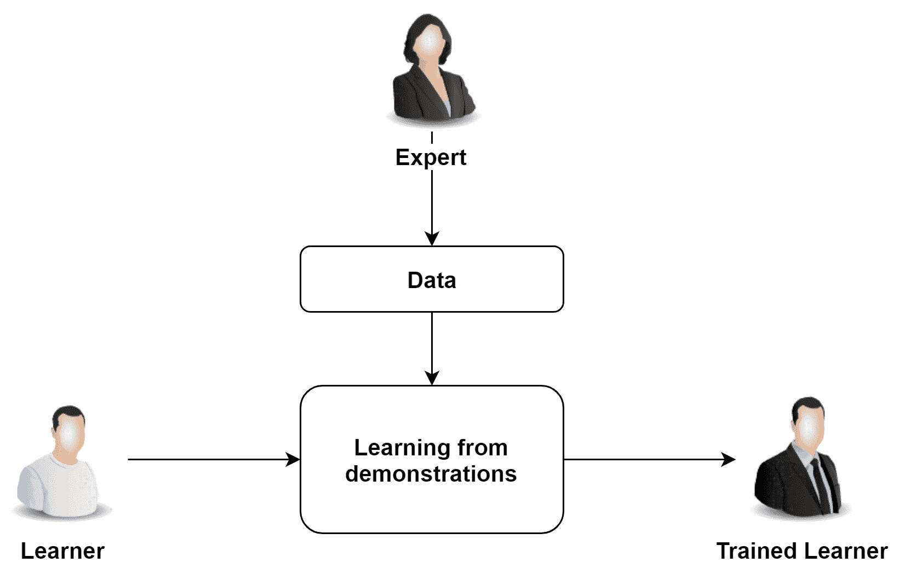
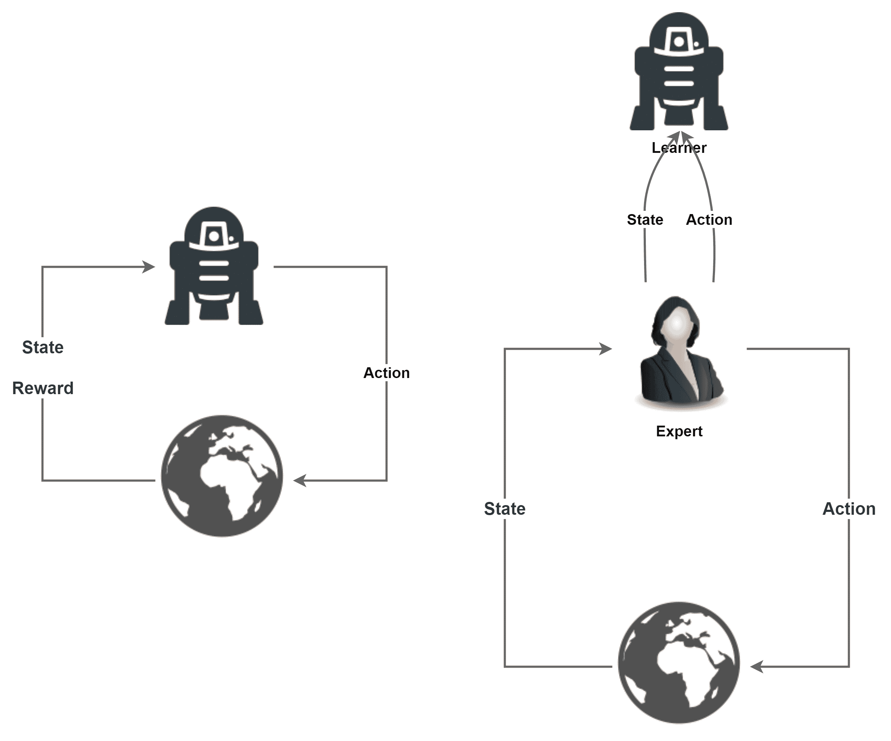
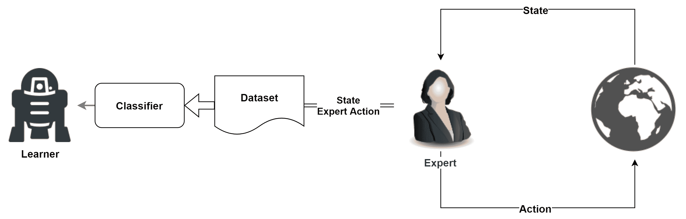
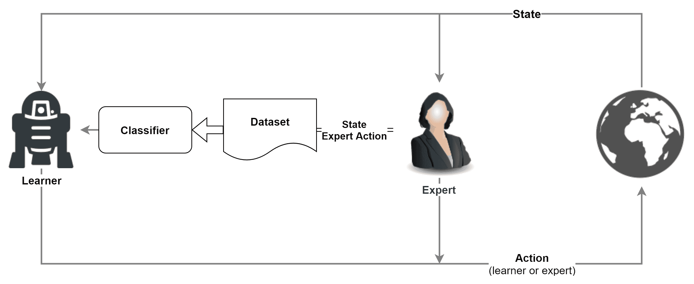
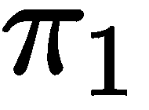
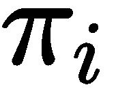
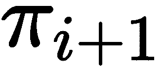
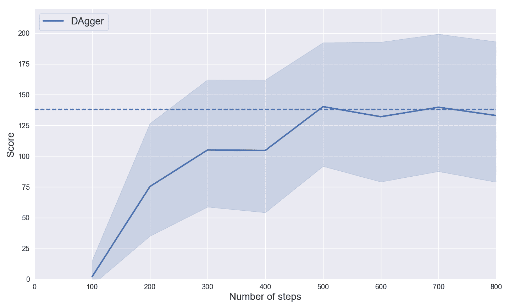

# 第十章：使用 DAgger 算法的模仿学习

算法仅通过奖励来学习的能力是一个非常重要的特性，这也是我们开发强化学习算法的原因之一。它使得代理可以从零开始学习并改进其策略，而无需额外的监督。尽管如此，在某些情况下，给定环境中可能已经有其他专家代理在工作。**模仿学习**（**IL**）算法通过模仿专家的行为并从中学习策略来利用专家。

本章重点讲解模仿学习。虽然与强化学习不同，模仿学习在某些环境中提供了巨大的机会和能力，尤其是在具有非常大状态空间和稀疏奖励的环境中。显然，模仿学习只有在可以模仿的更专家代理存在时才可能进行。

本章将重点讲解模仿学习方法的主要概念和特性。我们将实现一个名为 DAgger 的模仿学习算法，并教一个代理玩 Flappy Bird。这将帮助你掌握这一新型算法，并理解其基本原理。

本章的最后部分，我们将介绍**逆强化学习**（**IRL**）。IRL 是一种通过值和奖励来提取并学习另一个代理行为的方法；也就是说，IRL 学习奖励函数。

本章将涵盖以下主题：

+   模仿方法

+   玩 Flappy Bird

+   理解数据集聚合算法

+   IRL

# 技术要求

在简要的理论介绍后，我们将实现一个实际的 IL 算法，帮助理解模仿学习算法背后的核心概念。然而，我们只会提供主要和最有趣的部分。如果你对完整实现感兴趣，可以在本书的 GitHub 仓库中找到： [`github.com/PacktPublishing/Reinforcement-Learning-Algorithms-with-Python`](https://github.com/PacktPublishing/Reinforcement-Learning-Algorithms-with-Python)。

# 安装 Flappy Bird

接下来，我们将在一个重新设计的著名游戏 Flappy Bird 上运行我们的 IL 算法（[`en.wikipedia.org/wiki/Flappy_Bird`](https://en.wikipedia.org/wiki/Flappy_Bird)）。在这一部分，我们将提供安装所需的所有命令。

但在安装游戏环境之前，我们需要处理一些额外的库：

+   在 Ubuntu 中，步骤如下：

```py
$ sudo apt-get install git python3-dev python3-numpy libsdl-image1.2-dev libsdl-mixer1.2-dev libsdl-ttf2.0-dev libsmpeg-dev libsdl1.2-dev libportmidi-dev libswscale-dev libavformat-dev libavcodec-dev libfreetype6-dev
$ sudo pip install pygame
```

+   如果你是 Mac 用户，可以通过以下命令安装库：

```py
$ brew install sdl sdl_ttf sdl_image sdl_mixer portmidi 
$ pip install -c https://conda.binstar.org/quasiben pygame
```

+   然后，对于 Ubuntu 和 Mac 用户，步骤如下：

1.  首先，你需要克隆 PLE。克隆可以通过以下代码行完成：

```py
git clone https://github.com/ntasfi/PyGame-Learning-Environment
```

PLE 是一套环境，也包括 Flappy Bird。因此，通过安装 PLE，你将获得 Flappy Bird。

1.  然后，你需要进入 `PyGame-Learning-Environment` 文件夹：

```py
cd PyGame-Learning-Environment
```

1.  最后，通过以下命令运行安装：

```py
sudo pip install -e .
```

现在，你应该能够使用 Flappy Bird 了。

# 模仿方法

模仿学习（IL）是通过模仿专家来获得新技能的艺术。模仿学习这一特性对学习顺序决策策略来说并不是绝对必要的，但如今，它在许多问题中是不可或缺的。有些任务不能仅仅通过强化学习来解决，从复杂环境中的巨大空间中自举策略是一个关键因素。以下图表展示了模仿学习过程中涉及的核心组件的高层视图：



如果智能体（专家）已经存在于环境中，它们可以为新的智能体（学习者）提供大量关于完成任务和导航环境所需行为的信息。在这种情况下，新的智能体可以在不从零开始学习的情况下更快地学习。专家智能体还可以作为教师，指导并反馈给新的智能体其表现。注意这里的区别，专家既可以作为指导者来跟随，也可以作为监督者来纠正学生的错误。

如果能够提供引导模型或监督者，模仿学习算法可以利用它们。现在你可以理解为什么模仿学习如此重要，也明白为什么我们不能将其排除在本书之外。

# 驾驶助手示例

为了更好地理解这些关键概念，我们可以用一个青少年学车的例子来说明。假设他们从未坐过车，这是他们第一次看到汽车，而且他们对汽车的工作原理一无所知。学习有三种方法：

1.  他们拿到钥匙后必须完全独立学习，完全没有监督。

1.  在获得钥匙之前，他们需要坐在副驾驶座上观察专家驾驶 100 小时，了解在不同天气条件和道路上的驾驶情况。

1.  他们观察专家驾驶，但更重要的是，他们有机会在专家驾驶时得到反馈。例如，专家可以实时指导如何停车，并对如何保持车道提出直接反馈。

正如你可能已经猜到的，第一个案例是强化学习方法，在这种方法中，智能体只有在不撞车、行人不对其大喊大叫等情况下才会获得稀疏的奖励。

至于第二个案例，这是一种被动的模仿学习方法，通过纯粹复制专家的行为来获得能力。总体而言，它与监督学习方法非常相似。

第三个也是最后一个案例是主动的模仿学习方法，形成了*真正的*模仿学习方法。在这种情况下，要求在训练阶段，专家对学习者的每一个动作进行指导。

# 比较模仿学习（IL）和强化学习（RL）

让我们通过强调模仿学习与强化学习之间的差异来更深入地了解模仿学习方法。这种对比非常重要。在模仿学习中，学习者并不意识到任何奖励。这一约束可能会带来非常大的影响。

回到我们的例子，学徒只能尽可能地模仿专家的动作，无论是被动的还是主动的。由于没有来自环境的客观奖励，他们只能受制于专家的主观监督。因此，即使他们想要改进，也无法理解和掌握老师的推理过程。

因此，模仿学习应被视为一种模仿专家动作的方式，但并不理解其主要目标。在我们的例子中，年轻的司机可能很好地模仿了老师的驾驶轨迹，但仍然不知道老师选择这些轨迹背后的动机。没有奖励的意识，经过模仿学习训练的代理无法像强化学习中那样最大化总奖励。

这突出了模仿学习和强化学习之间的主要区别。前者缺乏对主要目标的理解，因此无法超越老师。而后者则缺乏直接的监督信号，在大多数情况下，只能获得稀疏的奖励。这个情况在以下图示中得到了清晰的展示：



左侧的图表示通常的强化学习（RL）循环，而右侧则表示模仿学习（IL）循环。在这里，学习者不会获得任何奖励，只有专家提供的状态和动作。

# 模仿学习中专家的角色

在讨论模仿学习算法时，*专家*、*老师*和*监督者*这几个术语指的是相同的概念。它们表示一种可以让新代理（学习者）学习的角色。

从根本上讲，专家可以有各种形式，从真实的人类专家到专家系统。前者更为明显并且被广泛采用。你所做的事情是教算法执行一个人类已经能够做的任务。其优点显而易见，并且可以应用于大量的任务中。

第二种情况可能不太常见。选择新算法并用模仿学习进行训练的有效动机之一，可能是由于技术限制，一个缓慢的专家系统无法得到改进。例如，老师可能是一个准确但缓慢的树搜索算法，在推理时无法以合适的速度运行。这时，可以用深度神经网络来代替它。尽管在树搜索算法的监督下训练神经网络可能需要一些时间，但一旦训练完成，它在运行时的表现会更快。

到现在为止，应该很清楚，从学习者得到的策略质量在很大程度上取决于专家提供的信息质量。教师的表现是学者最终表现的上限。一个糟糕的老师总是会给学习者提供糟糕的数据。因此，专家是设定最终代理质量标准的关键组件。只有在教师强大的情况下，我们才能期望获得好的策略。

# IL 结构

现在我们已经解决了模仿学习的所有要素，可以详细说明可以用于设计完整模仿学习算法的算法和方法。

解决模仿问题的最直接方法如下图所示：



前面的图示可以总结为两个主要步骤：

+   专家从环境中收集数据。

+   通过监督学习在数据集上学习一个策略。

不幸的是，尽管监督学习是模仿算法的典范，但大多数时候，它并不奏效。

为了理解为什么监督学习方法不是一个好的替代方案，我们必须回顾监督学习的基础。我们主要关注两个基本原则：训练集和测试集应该属于相同的分布，并且数据应该是独立同分布的（i.i.d.）。然而，一个策略应该能够容忍不同的轨迹，并对最终的分布变化具有鲁棒性。

如果一个代理仅通过监督学习方法来训练驾驶汽车，每当它从专家的轨迹中稍微偏离时，它将处于一个前所未见的新状态，这将导致分布不匹配。在这个新状态下，代理对下一步动作会感到不确定。在通常的监督学习问题中，这不会太影响。如果错过了一个预测，这不会对下一个预测产生影响。然而，在模仿学习问题中，算法正在学习一个策略，i.i.d.属性不再成立，因为后续的动作是严格相关的。因此，它们会对所有其他动作产生后果，并且有累积效应。

在我们自驾车的例子中，一旦分布从专家的分布发生变化，正确的路径将变得非常难以恢复，因为错误的动作会积累并导致严重后果。轨迹越长，模仿学习的效果越差。为了更清楚地说明，具有 i.i.d.数据的监督学习问题可以视为长度为 1 的轨迹。对下一步动作没有任何影响。我们刚才提出的范式就是我们之前提到的*被动*学习。

为了克服由于使用*被动*模仿而可能对策略造成灾难性影响的分布变化，可以采用不同的技术。有些是巧妙的*黑客*技术，而另一些则是更具算法变种的方式。以下是两种效果较好的策略：

+   学习一个在数据上能很好地泛化而不发生过拟合的模型

+   除了被动模仿，还可以使用主动模仿

因为第一个是更广泛的挑战，我们将集中精力在第二个策略上。

# 比较主动模仿和被动模仿

在前面的示例中，我们介绍了*主动模仿*这个术语，通过一个青少年学习开车的例子。具体来说，我们指的是在学习者在专家的额外反馈下进行驾驶的情境。一般来说，主动模仿是指从专家分配的动作中，通过策略数据进行学习。

从输入*s*（状态或观察）和输出*a*（动作）的角度来看，在被动学习中，s 和 a 都来自专家。在主动学习中，s 是从学习者那里采样的，a 是专家在状态 s 下应该采取的动作。新手代理的目标是学习一个映射，![]。

使用带有策略数据的主动学习可以让学习者修正那些仅靠被动模仿无法纠正的小偏差。

# 玩 Flappy Bird

在本章后续部分，我们将开发并测试一个名为 DAgger 的 IL 算法，应用在一个新的环境中。这个环境名为 Flappy Bird，模拟了著名的 Flappy Bird 游戏。在这里，我们的任务是为你提供所需的工具，帮助你使用这个环境实现代码，从接口的解释开始。

Flappy Bird 属于**PyGame 学习环境**（**PLE**），这是一组模仿**街机学习环境**（**ALE**）接口的环境。它类似于**Gym**接口，虽然使用起来很简单，稍后我们会看到它们之间的差异。

Flappy Bird 的目标是让小鸟飞过垂直的管道而不撞到它们。它只通过一个动作来控制，即让小鸟拍打翅膀。如果小鸟不飞，它会按照重力作用沿着下降轨迹前进。下面是环境的截图：


# 如何使用环境

在接下来的步骤中，我们将看到如何使用这个环境。

1.  为了在 Python 脚本中使用 Flappy Bird，首先，我们需要导入 PLE 和 Flappy Bird：

```py
from ple.games.flappybird import FlappyBird
from ple import PLE
```

1.  然后，我们实例化一个`FlappyBird`对象，并将其传递给`PLE`，并传递一些参数：

```py
game = FlappyBird()
p = PLE(game, fps=30, display_screen=False)
```

在这里，通过`display_screen`，你可以选择是否显示屏幕。

1.  通过调用`init()`方法初始化环境：

```py
p.init()
```

为了与环境交互并获得环境的状态，我们主要使用四个函数：

+   +   `p.act(act)`，用来在游戏中执行`act`动作。`act(act)`返回执行该动作后获得的奖励。

    +   `p.game_over()`，用于检查游戏是否达到了最终状态。

    +   `p.reset_game()`，将游戏重置为初始状态。

    +   `p.getGameState()`，用于获取当前环境的状态。如果我们想获取环境的 RGB 观察值（即整个屏幕），也可以使用`p.getScreenRGB()`。

1.  将所有内容整合在一起，一个简单的脚本可以设计成如下代码片段，用于让 Flappy Bird 玩五局。请注意，为了使其工作，您仍然需要定义返回给定状态下动作的`get_action(state)`函数：

```py
from ple.games.flappybird import FlappyBird
from ple import PLE

game = FlappyBird()
p = PLE(game, fps=30, display_screen=False)
p.init()

reward = 0

for _ in range(5):
    reward += p.act(get_action(p.getGameState()))

    if p.game_over():
        p.reset_game()
```

这里有几个要点需要指出：

+   `getGameState()` 返回一个字典，其中包含玩家的位置、速度和距离，以及下一根管道和下下根管道的位置。在将状态传递给我们在此用`get_action`函数表示的策略制定者之前，字典会被转换为 NumPy 数组并进行标准化。

+   `act(action)` 如果不需要执行动作，则期望输入为`None`；如果鸟需要拍打翅膀飞得更高，则输入为`119`。

# 理解数据集聚合算法

**数据集聚合**（**DAgger**）是从演示中学习的最成功算法之一。它是一个迭代的策略元算法，在诱发的状态分布下表现良好。DAgger 最显著的特点是，它通过提出一种主动方法来解决分布不匹配问题，在这种方法中，专家教导学习者如何从学习者的错误中恢复。

经典的 IL 算法学习一个分类器，预测专家的行为。这意味着模型拟合一个由专家观察到的训练样本数据集。输入是观察值，输出是期望的动作。然而，根据之前的推理，学习者的预测会影响未来访问的状态或观察，违反了独立同分布（i.i.d.）假设。

DAgger 通过反复迭代从学习者中采样的新数据聚合管道，来处理分布的变化，并利用聚合的数据集进行训练。算法的简单示意图如下所示：



专家填充了分类器所使用的数据集，但根据迭代的不同，环境中执行的动作可能来自专家，也可能来自学习者。

# DAgger 算法

具体来说，DAgger 通过迭代以下过程进行。在第一次迭代中，从专家策略创建一个轨迹数据集 *D*，并用它来训练一个最适合这些轨迹且不发生过拟合的初始策略 。然后，在迭代 *i* 中，使用学习到的策略  收集新的轨迹，并将其添加到数据集 *D* 中。接着，使用包含新旧轨迹的聚合数据集 *D* 来训练一个新的策略，。

根据《Dagger 论文》中的报告（[`arxiv.org/pdf/1011.0686.pdf`](https://arxiv.org/pdf/1011.0686.pdf)），有一种活跃的基于策略的学习方法，优于许多其他模仿学习算法，并且在深度神经网络的帮助下，它能够学习非常复杂的策略。

此外，在迭代 *i* 时，可以修改策略，使专家控制多个动作。该技术更好地利用了专家的能力，并让学习者逐渐掌控环境。

算法的伪代码可以进一步澄清这一点：

```py
Initialize 
Initialize  ( is the expert policy)

for i :
    > Populate dataset  with . States are given by  (sometimes the expert could take the control over it) and actions are given by the expert 

    > Train a classifier  on the aggregate dataset 
```

# DAgger 的实现

代码分为三个主要部分：

+   加载专家推理函数，以便根据状态预测动作。

+   为学习者创建计算图。

+   创建 DAgger 迭代以构建数据集并训练新策略。

在这里，我们将解释最有趣的部分，其他部分留给你个人兴趣。你可以在书籍的 GitHub 仓库中查看剩余的代码和完整版本。

# 加载专家推理模型

专家应该是一个以状态为输入并返回最佳动作的策略。尽管如此，它可以是任何东西。特别是，在这些实验中，我们使用了一个通过近端策略优化（PPO）训练的代理作为专家。从原则上讲，这没有什么意义，但我们为学术目的采用了这一解决方案，以便与模仿学习算法进行集成。

使用 PPO 训练的专家模型已保存在文件中，因此我们可以轻松地恢复它并使用其训练好的权重。恢复图并使其可用需要三步：

1.  导入元图。可以通过`tf.train.import_meta_graph`恢复计算图。

1.  恢复权重。现在，我们需要将预训练的权重加载到刚刚导入的计算图中。权重已保存在最新的检查点中，可以通过`tf.train.latest_checkpoint(session, checkpoint)`恢复。

1.  访问输出张量。恢复的图的张量可以通过`graph.get_tensor_by_name(tensor_name)`访问，其中`tensor_name`是图中张量的名称。

以下代码行总结了整个过程：

```py
def expert():
    graph = tf.get_default_graph()
    sess_expert = tf.Session(graph=graph)

    saver = tf.train.import_meta_graph('expert/model.ckpt.meta')
    saver.restore(sess_expert,tf.train.latest_checkpoint('expert/'))

    p_argmax = graph.get_tensor_by_name('actor_nn/max_act:0') 
    obs_ph = graph.get_tensor_by_name('obs:0') 
```

然后，因为我们只关心一个简单的函数，它会根据状态返回专家动作，我们可以设计 `expert` 函数，使其返回该函数。因此，在 `expert()` 内部，我们定义一个名为 `expert_policy(state)` 的内部函数，并将其作为 `expert()` 的输出返回：

```py
    def expert_policy(state):
        act = sess_expert.run(p_argmax, feed_dict={obs_ph:[state]})
        return np.squeeze(act)

    return expert_policy
```

# 创建学习者的计算图

以下所有代码都位于一个名为 `DAgger` 的函数内部，该函数接受一些超参数，我们将在代码中看到这些参数。

学习者的计算图非常简单，因为它的唯一目标是构建一个分类器。在我们的案例中，只有两个动作需要预测，一个是做不做动作，另一个是让小鸟拍翅膀。我们可以实例化两个占位符，一个用于输入状态，另一个用于*真实标签*，即专家的动作。动作是一个整数，表示所采取的动作。对于两个可能的动作，它们分别是 0（什么也不做）或 1（飞行）。

构建这样的计算图的步骤如下：

1.  创建一个深度神经网络，具体来说，是一个具有 ReLU 激活函数的全连接多层感知器，在隐藏层使用 ReLU 激活函数，在最后一层使用线性激活函数。

1.  对于每个输入状态，选择具有最高值的动作。这个操作通过 `tf.math.argmax(tensor,axis)` 函数完成，`axis=1`。

1.  将动作的占位符转换为 one-hot 张量。这是必要的，因为我们在损失函数中使用的 logits 和标签应该具有维度`[batch_size, num_classes]`。然而，我们的标签 `act_ph` 的形状是`[batch_size]`。因此，我们通过 one-hot 编码将它们转换为所需的形状。`tf.one_hot` 是 TensorFlow 用于执行这一操作的函数。

1.  创建损失函数。我们使用 softmax 交叉熵损失函数。这是一个标准的损失函数，适用于具有互斥类别的离散分类问题，就像我们的情况一样。损失函数通过`softmax_cross_entropy_with_logits_v2(labels, logits)`在 logits 和标签之间进行计算。

1.  最后，计算 softmax 交叉熵的平均值，并使用 Adam 优化器进行最小化。

这五个步骤在接下来的代码行中实现。

```py
    obs_ph = tf.placeholder(shape=(None, obs_dim), dtype=tf.float32, name='obs')
    act_ph = tf.placeholder(shape=(None,), dtype=tf.int32, name='act')

    p_logits = mlp(obs_ph, hidden_sizes, act_dim, tf.nn.relu, last_activation=None)
    act_max = tf.math.argmax(p_logits, axis=1)
    act_onehot = tf.one_hot(act_ph, depth=act_dim)

    p_loss = tf.reduce_mean(tf.nn.softmax_cross_entropy_with_logits_v2(labels=act_onehot, logits=p_logits))
    p_opt = tf.train.AdamOptimizer(p_lr).minimize(p_loss)
```

然后，我们可以初始化会话、全局变量，并定义一个函数 `learner_policy(state)`。该函数根据给定状态返回学习者选择的具有更高概率的动作（这与我们为专家所做的相同）：

```py
    sess = tf.Session()
    sess.run(tf.global_variables_initializer())

    def learner_policy(state):
        action = sess.run(act_max, feed_dict={obs_ph:[state]})
        return np.squeeze(action)
```

# 创建 DAgger 循环

现在是设置 DAgger 算法核心的时候了。该概要已经在 *The DAgger algorithm* 部分的伪代码中定义，但让我们更深入地了解它是如何工作的：

1.  初始化由两个列表组成的数据集，`X` 和 `y`，其中存储访问过的状态和专家的目标动作。我们还初始化环境：

```py
    X = []
    y = []

    env = FlappyBird()
    env = PLE(env, fps=30, display_screen=False)
    env.init() 
```

1.  遍历所有 DAgger 迭代。在每次 DAgger 迭代的开始，我们必须重新初始化学习者的计算图（因为我们在每次迭代时都会在新的数据集上重新训练学习者），重置环境，并执行一系列随机动作。在每个游戏开始时，我们执行一些随机动作，以向确定性环境中添加随机成分。结果将是一个更强健的策略：

```py
    for it in range(dagger_iterations):
        sess.run(tf.global_variables_initializer())
        env.reset_game()
        no_op(env)

        game_rew = 0
        rewards = []
```

1.  通过与环境互动收集新数据。正如我们之前所说，第一次迭代中包含了专家，专家必须通过调用`expert_policy`来选择动作，但在后续迭代中，学习者会逐渐接管控制权。学习到的策略由`learner_policy`函数执行。数据集通过将当前游戏状态附加到`X`（输入变量），并将专家在该状态下会采取的动作附加到`y`（输出变量）来收集。当游戏结束时，游戏将重置，并将`game_rew`设置为`0`。代码如下：

```py
        for _ in range(step_iterations):
            state = flappy_game_state(env)

            if np.random.rand() < (1 - it/5):
                action = expert_policy(state)
            else:
                action = learner_policy(state)

            action = 119 if action == 1 else None

            rew = env.act(action)
            rew += env.act(action)

            X.append(state)
            y.append(expert_policy(state)) 
            game_rew += rew

            if env.game_over():
                env.reset_game()
                np_op(env)

                rewards.append(game_rew)
                game_rew = 0
```

请注意，动作被执行了两次。这是为了将每秒的动作数量从 30 减少到 15，以符合环境的要求。

1.  在汇总数据集上训练新策略。该流程是标准的。数据集被打乱并分成`batch_size`长度的小批次。然后，通过在每个小批次上运行`p_opt`进行多个训练周期（等于`train_epochs`），重复优化过程。以下是代码：

```py
        n_batches = int(np.floor(len(X)/batch_size))

        shuffle = np.arange(len(X))
        np.random.shuffle(shuffle)
        shuffled_X = np.array(X)[shuffle]
        shuffled_y = np.array(y)[shuffle]

        ep_loss = []
            for _ in range(train_epochs):

                for b in range(n_batches):
                    p_start = b*batch_size
                    tr_loss, _ = sess.run([p_loss, p_opt], feed_dict=
                            obs_ph:shuffled_X[p_start:p_start+batch_size], 
                            act_ph:shuffled_y[p_start:p_start+batch_size]})

                    ep_loss.append(tr_loss)
        print('Ep:', it, np.mean(ep_loss), 'Test:', np.mean(test_agent(learner_policy)))
```

`test_agent`在几局游戏中测试`learner_policy`，以了解学习者的表现如何。

# 在 Flappy Bird 上的结果分析

在展示模仿学习方法的结果之前，我们想提供一些数据，以便你能将这些与强化学习算法的结果进行比较。我们知道这不是一个公平的比较（这两种算法在非常不同的条件下工作），但无论如何，它们强调了为什么当有专家可用时，模仿学习是值得的。

专家已经使用近端策略优化进行了大约 200 万步的训练，并且在大约 40 万步后，达到了约 138 的停滞分数。

我们在 Flappy Bird 上测试了 DAgger，使用了以下超参数：

| **超参数** | **变量名** | **值** |
| --- | --- | --- |
| 学习者隐藏层 | hidden_sizes | 16,16 |
| DAgger 迭代 | dagger_iterations | 8 |
| 学习率 | p_lr | 1e-4 |
| 每次 DAgger 迭代的步数 | step_iterations | 100 |
| 小批次大小 | batch_size | 50 |
| 训练周期数 | train_epochs | 2000 |

下图展示了 DAgger 性能随步数变化的趋势：



横线代表专家所达到的平均表现。从结果来看，我们可以看到几百步就足以达到专家的表现。然而，与 PPO 训练专家所需的经验相比，这表示样本效率提高了大约 100 倍。

再次强调，这并不是一个公平的比较，因为方法处于不同的背景中，但它突出了一个事实：每当有专家时，建议你使用模仿学习方法（至少可以用来学习一个初始策略）。

# IRL

IL 的最大限制之一在于它无法学习其他路径来达到目标，除了从专家那里学到的路径。通过模仿专家，学习者受到教师行为范围的限制。他们并不了解专家试图达成的最终目标。因此，这些方法只有在没有意图超越教师表现的情况下才有用。

IRL 是一种强化学习算法，类似于 IL，使用专家进行学习。不同之处在于 IRL 使用专家来学习其奖励函数。因此，IRL 并不是像模仿学习那样复制示范，而是弄清楚专家的目标。一旦奖励函数被学习，智能体便可以利用它来学习策略。

由于示范仅用于理解专家的目标，智能体不受教师动作的限制，最终可以学到更好的策略。例如，一个通过 IRL 学习的自动驾驶汽车会明白，目标是以最短的时间从 A 点到达 B 点，同时减少对物体和人员的损害。然后，汽车会自行学习一个策略（例如，使用 RL 算法），以最大化这个奖励函数。

然而，IRL 也存在许多挑战，这些挑战限制了其适用性。专家的示范可能并非最优，因此，学习者可能无法充分发挥其潜力，并可能陷入错误的奖励函数中。另一个挑战在于对学习到的奖励函数的评估。

# 摘要

在这一章中，我们暂时跳出了强化学习算法，探讨了一种新的学习方式——模仿学习。这一新范式的创新之处在于学习的方式；即结果策略模仿专家的行为。这个范式与强化学习的不同之处在于没有奖励信号，并且能够利用专家实体带来的丰富信息源。

我们看到，学习者所学习的数据集可以通过增加额外的状态-动作对来扩展，以增加学习者在新情况中的信心。这个过程叫做数据聚合。此外，新数据可以来自新学习的策略，在这种情况下，我们称之为基于策略的数据（因为它来自同一个已学习的策略）。这种将基于策略的状态与专家反馈结合的做法是一种非常有价值的方法，可以提高学习者的质量。

然后我们探索并开发了最成功的模仿学习算法之一，名为 DAgger，并将其应用于学习 Flappy Bird 游戏。

然而，由于模仿学习算法只是复制专家的行为，这些系统无法做得比专家更好。因此，我们引入了逆向强化学习，它通过推断专家的奖励函数来克服这个问题。通过这种方式，策略可以独立于教师来学习。

在下一章，我们将介绍一组用于解决顺序任务的算法；即进化算法。你将学习这些黑箱优化算法的机制和优势，从而能够在挑战性环境中采用它们。此外，我们将更深入地探讨一种名为进化策略的进化算法，并加以实现。

# 问题

1.  模仿学习是否被认为是一种强化学习技术？

1.  你会使用模仿学习来构建一个在围棋中无法击败的智能体吗？

1.  DAgger 的全名是什么？

1.  DAgger 的主要优点是什么？

1.  在哪里你会使用逆向强化学习而不是模仿学习？

# 进一步阅读

+   要阅读介绍 DAgger 的原始论文，请查看以下论文，*将模仿学习和结构化预测归约为无悔在线学习*：[`arxiv.org/pdf/1011.0686.pdf`](https://arxiv.org/pdf/1011.0686.pdf)。

+   想了解更多关于模仿学习算法的信息，请查看以下论文，*模仿学习的全球概述*： [`arxiv.org/pdf/1801.06503.pdf`](https://arxiv.org/pdf/1801.06503.pdf)。

+   想了解更多关于逆向强化学习的信息，请查看以下调查，*逆向强化学习调查：挑战、方法与进展*：[`arxiv.org/pdf/1806.06877.pdf`](https://arxiv.org/pdf/1806.06877.pdf)。
