# 第十一章：理解黑盒优化算法

在前几章中，我们研究了强化学习（RL）算法，从基于价值的方法到基于策略的方法，以及从无模型方法到基于模型的方法。在本章中，我们将提供另一种解决序列任务的方法，那就是使用一类黑盒算法——**进化算法**（**EA**）。EAs 由进化机制驱动，有时比**强化学习**（**RL**）更受青睐，因为它们不需要反向传播。它们还为 RL 提供了其他互补的好处。本章将从简要回顾强化学习（RL）算法开始，帮助你更好地理解 EA 如何融入这些问题解决方案中。接着，你将了解 EA 的基本构建模块及其工作原理。我们还将利用这个介绍，深入研究其中一种最著名的进化算法——**进化策略**（**ES**）。

由 OpenAI 开发的一种近期算法大大推动了进化策略（ES）在解决序列任务中的应用。它们展示了 ES 算法如何能够在多个 CPU 上进行大规模并行化并线性扩展，同时实现高性能。在解释了进化策略后，我们将更深入地探讨这个算法，并在 TensorFlow 中进行开发，这样你就可以将它应用于你关心的任务。

本章将涵盖以下主题：

+   超越强化学习（RL）

+   EAs 的核心

+   可扩展的进化策略

+   可扩展的进化策略应用于 LunarLander

# 超越强化学习（RL）

强化学习（RL）算法通常是我们面对序列决策问题时的首选。通常，除了使用 RL，很难找到其他方法来解决这些任务。尽管有数百种不同的优化方法，但到目前为止，只有 RL 在序列决策问题上取得了良好的效果。但这并不意味着它是唯一的选择。

本章将从回顾强化学习（RL）算法的内在工作原理开始，并质疑其组件在解决序列任务中的有效性。这个简要总结将帮助我们介绍一种新的算法类型，该算法提供了许多优点（以及一些缺点），可以作为 RL 的替代方案。

# 强化学习（RL）简要回顾

在开始时，策略被随机初始化，并用来与环境交互，收集数据，交互可以是给定的步数或整个轨迹。在每次交互中，访问的状态、采取的行动和获得的奖励都会被记录下来。这些信息提供了代理在环境中影响的完整描述。然后，为了改进策略，基于损失函数的反向传播算法（为了将预测值移向更好的估计）计算网络每个权重的梯度。接着，这些梯度会通过随机梯度下降优化器进行应用。这个过程（从环境中收集数据并使用**随机梯度下降**（**SGD**）优化神经网络）会一直重复，直到满足收敛标准为止。

这里有两件重要的事情需要注意，它们在接下来的讨论中会非常有用：

+   **时序信用分配**：因为强化学习算法在每一步优化策略，所以需要对每个行动和状态分配质量。这是通过为每个状态-行动对分配一个值来完成的。此外，使用折扣因子来最小化远距离行动的影响，并给予最后行动更多的权重。这将帮助我们解决将信用分配给行动的问题，但也会引入系统中的不准确性。

+   **探索**：为了保持一定程度的探索，额外的噪声会被注入到强化学习算法的策略中。噪声注入的方式依赖于算法，通常情况下，行动是从一个随机分布中采样的。这样做的目的是，如果代理处于相同的情境两次，它可能会采取不同的行动，进而导致两条不同的路径。这种策略也能在确定性环境中鼓励探索。通过每次偏离路径，代理可能会发现不同的——甚至是更好的——解决方案。通过这种额外的噪声，且噪声渐进趋近于 0，代理最终能够收敛到一个更好且最终的确定性策略。

但是，反向传播、时序信用分配和随机行动，真的算是学习和构建复杂策略的前提条件吗？

# 替代方法

这个问题的答案是否定的。

正如我们在第十章《使用 DAgger 算法的模仿学习》中所学到的那样，通过使用反向传播和随机梯度下降（SGD）将策略学习转化为模仿问题，我们可以通过专家学习一个**判别模型**，以预测下一步应采取的行动。不过，这仍然涉及反向传播，并且需要一个可能并不总是能获得的专家。

另一个用于全局优化的常见算法子集确实存在。它们被称为进化算法（EAs），并且不基于反向传播，也不需要另外两个原理，即时间信用分配和噪声行为。此外，正如我们在本章开头所说的，这些进化算法非常通用，可以应用于各种问题，包括顺序决策任务。

# 进化算法（EAs）

正如你可能猜到的，进化算法与强化学习算法在许多方面不同，并且主要受到生物进化的启发。进化算法包括许多类似的方法，如遗传算法、进化策略和遗传编程，它们在实现细节和表示的方式上有所不同。然而，它们都主要基于四个基本机制——繁殖、变异、交叉和选择——并通过一种猜测与检验的过程循环进行。随着我们本章的进展，我们将看到这些机制具体意味着什么。

进化算法被定义为黑箱算法。这些算法优化一个函数，![]，相对于![]，而不对![]做任何假设。因此，![]可以是你想要的任何东西。我们只关心![]的输出。这有许多优点，也有一些缺点。主要的优点是我们不需要关心![]的结构，我们可以自由地使用对我们和当前问题最合适的方法。另一方面，主要的缺点是这些优化方法无法解释，因此其机制无法被理解。在需要可解释性的情况下，这些方法就不太有吸引力了。

强化学习几乎一直被优先用于解决顺序任务，尤其是对于中等到困难的任务。然而，OpenAI 最近的一篇论文强调，进化策略（Evolutionary Strategy），一种进化算法，可以作为强化学习的替代方法。这一观点主要源于该算法所达到的渐近性能以及其在数千个 CPU 上扩展的惊人能力。

在我们了解这个算法如何能够在学习困难任务的优秀策略时良好扩展之前，让我们更深入地了解进化算法。

# 进化算法的核心

进化算法（EAs）受到生物进化的启发，采用模拟生物进化的技术和机制。这意味着进化算法通过多次试验来创建新的候选解种群。这些解也被称为**个体**（在强化学习问题中，候选解就是策略），它们比上一代更优，类似于自然界中的过程，只有最强者生存下来并有可能繁衍后代。

进化算法的一个优势是它们是无导数的方法，意味着它们不使用导数来寻找解。这使得进化算法能够很好地处理各种可微和不可微的函数，包括深度神经网络。这种结合在下图中进行了示意。请注意，每个个体都是一个独立的深度神经网络，因此在任何时刻，神经网络的数量与个体数量相同。在下图中，种群由五个个体组成：

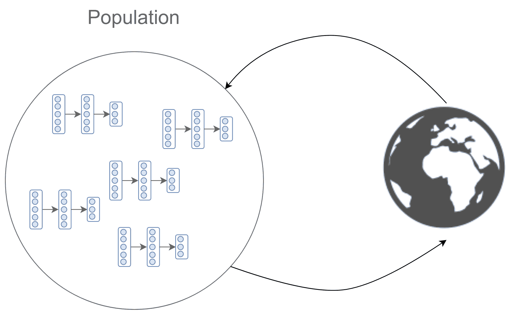

图 11.1\. 通过进化算法优化深度神经网络

每种进化算法的具体性有所不同，但它们的基本循环在所有进化算法中是共同的，其工作原理如下：

1.  创建一个由个体组成的种群（也称为**候选解**或**表型**），每个个体都有一组不同的属性（称为**染色体**或**基因型**）。初始种群是随机初始化的。

1.  每个候选解都通过一个适应度函数独立评估，该函数决定解的质量。适应度函数通常与目标函数相关，按照我们到目前为止使用的术语，适应度函数可以是智能体（即候选解）在其生命周期内累积的总奖励。

1.  然后，从种群中选出适应性更强的个体，并修改它们的基因组，以便生成新一代个体。在某些情况下，适应性较差的候选解可以作为负面示例，帮助生成下一代。这个过程的具体步骤在不同算法中差异较大。一些算法，例如遗传算法，通过**交叉**和**变异**这两个过程来繁殖新个体，这些新个体被称为**后代**。其他算法，如进化策略，仅通过变异来繁殖新个体。我们将在本章稍后更深入地解释交叉和变异，但一般来说，交叉是将两个父代的基因信息结合的过程，而变异则仅改变后代中某些基因值。

1.  重复整个过程，经过步骤 1-3，直到满足终止条件。在每次迭代中，创建的种群也称为**代**。

如下图所示，这一迭代过程在达到给定的适应度水平或生成了最大数量的世代后终止。如我们所见，种群是通过交叉和变异生成的，但正如我们已经解释过的，这些过程可能会有所不同，具体取决于使用的算法：

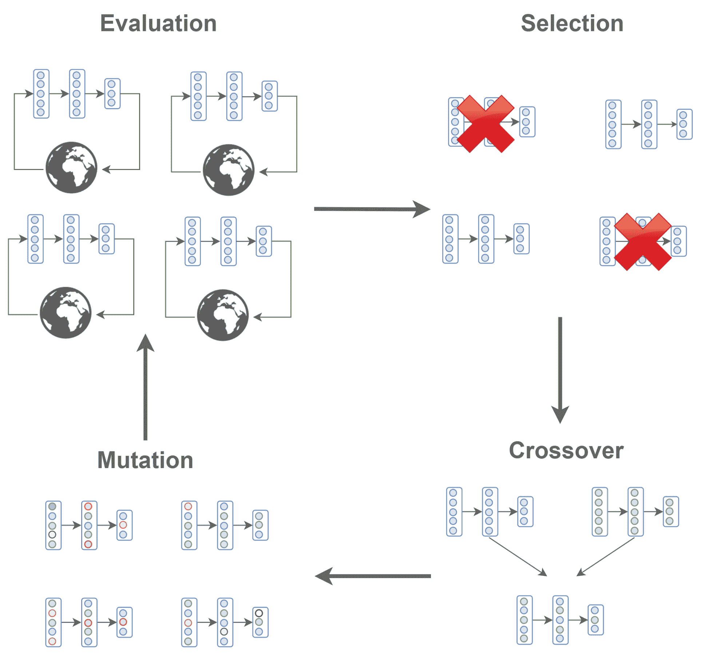

图 11.2. 进化算法的主要循环

一般演化算法的主体非常简单，可以用几行代码来实现，如这里所示。概括来说，在每次迭代中，直到生成适应度合格的个体为止，会生成新的候选个体并进行评估。这些候选个体是由上一代中适应度最好的个体生成的：

```py
solver = EvolutionaryAlgortihm()

while best_fitness < required_fitness:

    candidates = solver.generate_candidates() # for example from crossover and mutation

    fitness_values = []
    for candidate in candidates:
        fitness_values.append(evaluate(candidate))

    solver.set_fitness_values(fitness_values)

    best_fitness = solver.evaluate_best_candidate()
```

请注意，求解器的实现细节取决于所使用的算法。

进化算法的应用实际上广泛分布于多个领域和问题，从经济学到生物学，从计算机程序优化到蚁群优化。

由于我们主要关注的是进化算法在解决顺序决策任务中的应用，我们将解释两种最常见的进化算法，它们被用来解决这些类型的任务。它们分别被称为**遗传算法**（**GAs**）和**进化策略**（**ESes**）。随后，我们将进一步发展进化策略，开发其高度可扩展的版本。

# 遗传算法

遗传算法的思想非常直接——评估当前的代数，只使用表现最好的个体生成下一代候选解，并丢弃其他个体。如前面所示的图表所示，存活下来的个体通过交叉和变异生成下一代种群。这两个过程在以下图表中表示。交叉是通过在存活个体中选择两个解，并将它们的参数结合在一起进行的。变异则是通过改变后代基因型中的一些随机参数来实现的：

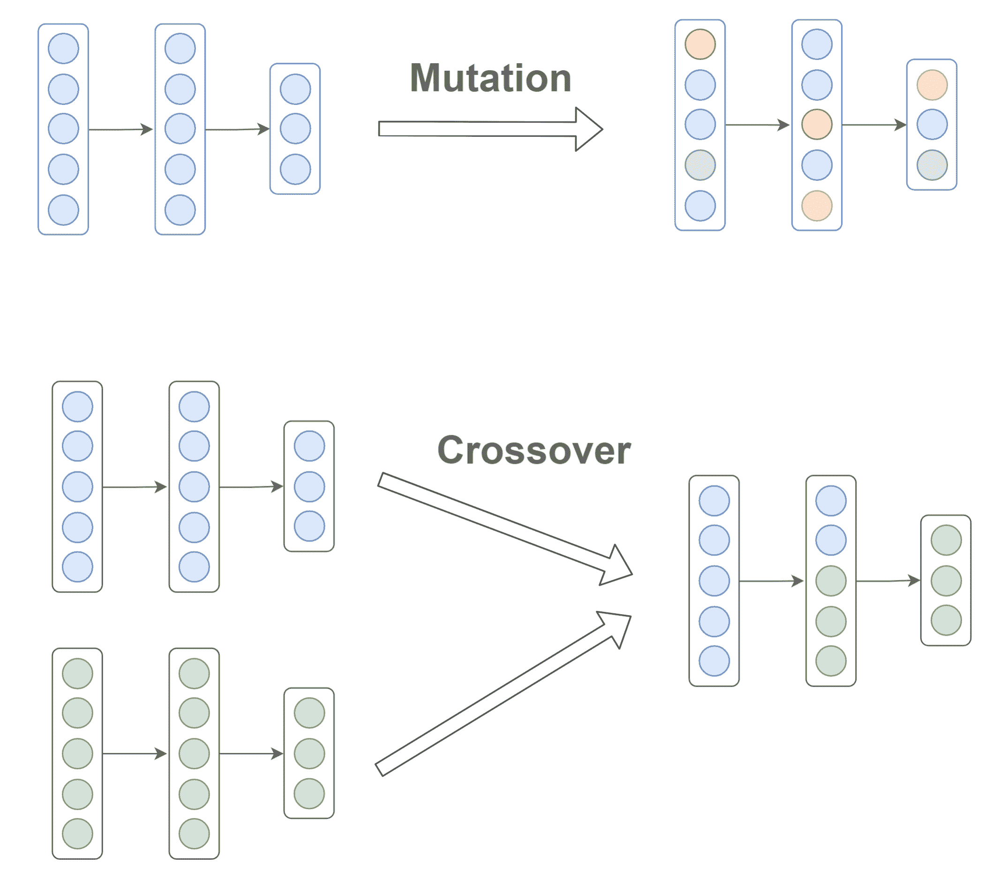

图 11.3. 变异和交叉的视觉示意图

交叉和变异可以采用多种不同的方式。在更简单的版本中，交叉是通过随机选择两个父母的部分进行的，变异则是通过向获得的解添加高斯噪声来实现的，噪声的标准差是固定的。通过只保留最优秀的个体并将它们的基因注入新生个体中，解会随着时间的推移不断改进，直到满足某一条件。然而，在复杂问题中，这种简单的解决方案容易陷入局部最优解（意味着解仅限于一个小的候选解集合）。在这种情况下，通常会选择更先进的遗传算法，如**增强拓扑进化网络**（**NEAT**）。NEAT 不仅改变网络的权重，还会改变其结构。

# 进化策略

**进化策略**（**ESes**）比遗传算法（GAs）更简单，因为它们主要基于突变来创建新种群。

突变通过向基因型添加从正态分布中采样的值来执行。进化策略的一个非常简单的版本是通过在整个种群中选择表现最好的个体，并从具有固定标准差且均值等于最佳表现个体的正态分布中采样下一代。

在小规模问题之外，不推荐使用该算法。这是因为仅跟随一个领导者并使用固定的标准差可能会阻止潜在解探索更多样化的搜索空间。因此，该方法的解可能会陷入狭窄的局部最小值。一个直接且更好的策略是通过结合表现最好的候选解并按其适应度排名加权来生成后代。根据适应度值对个体进行排名称为适应度排名。该策略优于使用实际适应度值，因为它对目标函数的变换不变，并且能防止新一代过度偏向潜在的异常值。

# CMA-ES

**协方差矩阵适应进化策略**，简称**CMA-ES**，是一种进化策略算法。与更简单的进化策略版本不同，它根据多元正态分布来采样新的候选解。CMA 这个名字来源于这样一个事实：变量之间的依赖关系被保存在协方差矩阵中，并通过适应该矩阵来增加或减少下一代的搜索空间。

简而言之，当 CMA-ES 对周围空间有较高的信心时，它通过逐步减少协方差矩阵的值来缩小搜索空间。相反，当 CMA-ES 对空间的信心较低时，它增加协方差矩阵，从而扩大可能的搜索空间。

# 进化策略与强化学习

进化策略（ESes）是强化学习（RL）的一种有趣替代方法。然而，必须评估其优缺点，以便我们选择正确的方案。让我们简要了解一下进化策略的主要优势：

+   **无导数方法**：无需反向传播。只需执行前向传递来估算适应度函数（或等效地，累计奖励）。这为所有不可微分的函数打开了大门，例如：硬注意力机制。此外，通过避免反向传播，代码的效率和速度得到了提高。

+   **非常通用**：进化策略的通用性主要来自于它作为黑盒优化方法的特性。由于我们不关心智能体、其执行的动作或访问的状态，我们可以将这些内容抽象化，只专注于其评估。此外，进化策略可以在没有明确目标的情况下进行学习，并且能在极度稀疏的反馈下工作。进化策略也更为通用，因为它们能够优化更多样化的函数集合。

+   **高度可并行且具有鲁棒性**：正如我们即将看到的，进化策略比强化学习更容易并行化，计算可以分布到成千上万的工作节点上。进化策略的鲁棒性归功于其所需的少量超参数。例如，与强化学习相比，不需要指定轨迹的长度、lambda 值、折扣因子、跳过的帧数等。另外，进化策略对于具有非常长时间跨度的任务也非常具有吸引力。

另一方面，强化学习在以下几个关键方面更受偏爱：

+   **样本效率**：强化学习算法更有效地利用从环境中获得的信息，因此它们需要更少的数据和步骤来学习任务。

+   **卓越的性能**：总体而言，强化学习算法在性能上优于进化策略。

# 可扩展的进化策略

现在我们已经介绍了黑盒进化算法，特别是进化策略，我们准备将刚刚学到的内容付诸实践。OpenAI 的论文《*进化策略作为强化学习的可扩展替代方案*》对进化策略作为强化学习算法的替代方案的采用做出了重大贡献。

本文的主要贡献在于一种方法，该方法能够在多个 CPU 上极其有效地扩展进化策略。特别地，这种新方法使用了一种跨 CPU 的新型通信策略，仅涉及标量，因此能够在成千上万的并行工作节点之间进行扩展。

通常，进化策略（ES）需要更多的经验，因此效率低于强化学习（RL）。然而，通过将计算分布到如此多的工作节点（得益于采用这种新策略），任务可以在更少的墙钟时间内解决。例如，在论文中，作者使用 1,440 个 CPU 在仅 10 分钟内解决了 3D 人形行走模式，且 CPU 核心数呈线性加速。由于常规强化学习算法无法达到这种扩展性水平，它们需要几个小时才能解决相同的任务。

让我们看看它们是如何能够如此高效地扩展的。

# 核心

在论文中，使用了一种版本的进化策略，旨在最大化平均目标值，具体如下：

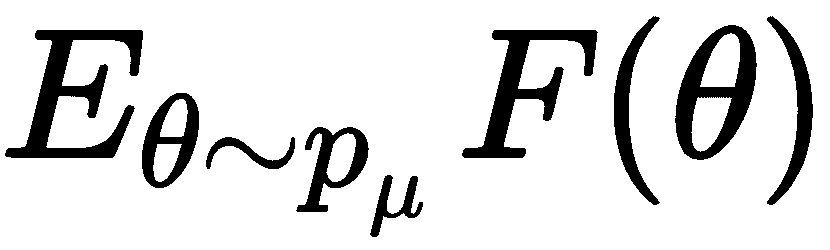

它通过在种群中搜索，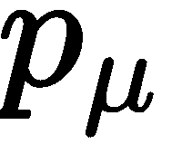，并通过进行随机梯度上升。是目标函数（或适应度函数），而是演员的参数。在我们的问题中，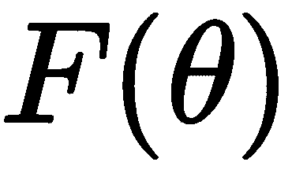仅仅是代理通过在环境中获得的随机回报。

种群分布，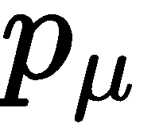，是一个多元高斯分布，均值为！[](img/c7584f6b-9665-483c-9396-b5f63d319342.png)，标准差为！[](img/9585cbc6-5654-4b6b-bb0c-14c85f7ae8c2.png)，如图所示：

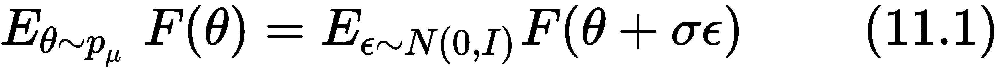

从这里开始，我们可以通过使用随机梯度估算来定义步长更新，如下所示：

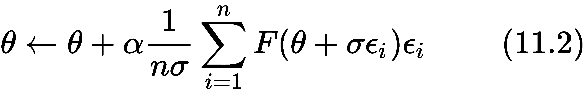

通过这个更新，我们可以使用来自种群的样本结果估算随机梯度（无需执行反向传播）。我们也可以使用一些著名的更新方法，比如 Adam 或 RMSProp，来更新参数。

# 并行化 ES

很容易看出，如何将 ES 扩展到多个 CPU：每个工作者被分配到种群的一个独立候选解上。评估可以完全自主地进行，正如论文中所描述的，优化可以在每个工作者上并行进行，且每个 CPU 单元之间只共享少量标量。

具体来说，工作者之间唯一共享的信息是一个回合的标量回报，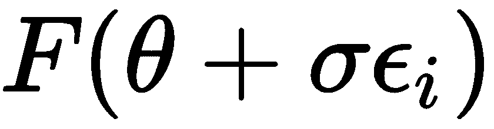，以及用于采样的随机种子！[](img/f805a18c-a321-40fd-926a-c72d7f12f46e.png)。通过仅传输回报，我们可以进一步缩减数据量，但在这种情况下，每个工作者的随机种子必须与其他工作者同步。我们决定采用第一种技术，而论文使用的是第二种。在我们简单的实现中，差异可以忽略不计，且两种技术都需要极低的带宽。

# 其他技巧

另外有两种技术被用来提高算法的性能：

+   **健身塑形** – **目标排名**：我们之前讨论过这个技巧。它非常简单。与其直接使用原始回报来计算更新，不如使用排名变换。排名对于目标函数的变换是不可变的，因此在回报差异较大的情况下表现更好。此外，它还去除了异常值的噪声。

+   **镜像噪声**：这个技巧减少了方差，并且涉及到同时评估带有噪声的网络  和 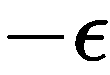；也就是说，对于每个个体，我们会有两种变异：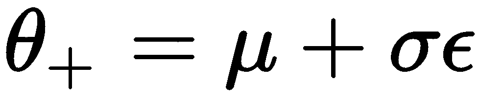 和 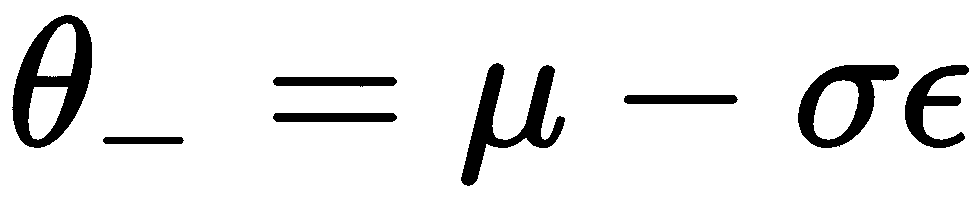。

# 伪代码

结合所有这些特性的并行化进化策略总结如下伪代码：

```py
---------------------------------------------------------------------------------
Parallelized Evolution Strategy
---------------------------------------------------------------------------------

Initialize parameters  on each worker
Initialize random seed on each worker

for  do:
    for  do:
        Sample 
        Evaluate individuals  and 

    Spread returns to each other worker

    for  do:
        Compute normalized rank  from the returns
        Reconstruct  from the random seeds of the other workers
         (maybe using Adam)
```

现在，剩下的就是实现这个算法了。

# 可扩展的实现

为了简化实现，并使得并行化版本的 ES 能够在有限的工作者（和 CPU）数量下运行良好，我们将开发一个类似于以下图示的结构。主进程为每个 CPU 核心创建一个工作者，并执行主循环。在每次迭代时，它会等待直到指定数量的新候选个体被工作者评估。与论文中提供的实现不同，每个工作者在每次迭代中会评估多个代理。因此，如果我们有四个 CPU，则会创建四个工作者。然后，如果我们希望在每次主进程迭代时总批量大小大于工作者的数量，比如 40，则每个工作者每次会创建并评估 10 个个体。返回值和种子会被返回给主应用程序，主应用程序会等待所有 40 个个体的结果，然后继续执行后续代码行。

然后，这些结果会以批量的形式传播给所有工作者，工作者分别优化神经网络，按照公式 (11.2) 中提供的更新进行操作：

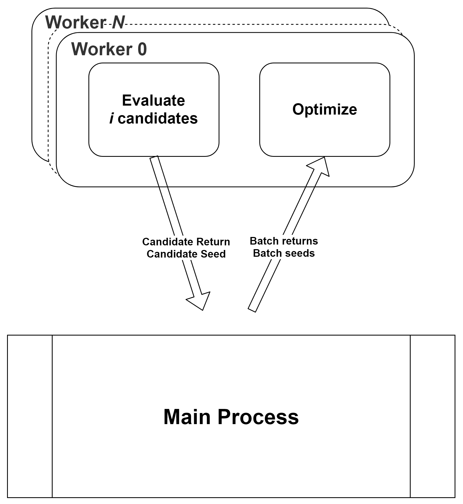

图 11.4\. 展示 ES 并行版本主要组件的示意图

根据我们刚才描述的，代码被分为三个主要部分：

+   创建并管理队列和工作者的主要过程。

+   定义工作者任务的函数。

+   此外，还有一些执行简单任务的函数，例如对回报进行排序和评估代理。

让我们解释一下主进程的代码，以便在深入了解工作者之前，您能够对整个算法有一个大致的了解。

# 主函数

这是在名为`ES`的函数中定义的，该函数具有以下参数：Gym 环境的名称，神经网络隐藏层的大小，代数总数，工作者数量，Adam 学习率，批量大小和标准差噪声：

```py
def ES(env_name, hidden_sizes=[8,8], number_iter=1000, num_workers=4, lr=0.01, batch_size=50, std_noise=0.01):
```

然后，我们设置一个初始种子，在所有工作者之间共享，以初始化参数并使权重保持一致。此外，我们计算每个工作者在每次迭代中需要生成并评估的个体数量，并创建两个 `multiprocessing.Queue` 队列。这些队列是传递给工作者以及从工作者传回的变量的进出口：

```py
    initial_seed = np.random.randint(1e7)
indiv_per_worker = int(batch_size / num_workers)
    output_queue = mp.Queue(maxsize=num_workers*indiv_per_worker)
    params_queue = mp.Queue(maxsize=num_workers)
```

接下来，实例化多进程`multiprocessing.Process`。这些进程将以异步方式运行`worker`函数，该函数作为第一个参数传递给`Process`构造函数。传递给`worker`函数的所有其他变量被分配到`args`，这些变量与 ES 所接受的参数非常相似，唯一不同的是额外的两个队列。进程在调用`start()`方法时开始运行：

```py
    processes = []

    for widx in range(num_workers):

        p = mp.Process(target=worker, args=(env_name, initial_seed, hidden_sizes, lr, std_noise, indiv_per_worker, str(widx), params_queue, output_queue))
        p.start()
        processes.append(p)
```

一旦并行工作者启动，我们就可以跨代进行迭代，直到所有个体在每个工作者中被生成并单独评估。请记住，每一代生成的个体总数是工作者数量`num_workers`与每个工作者生成的个体数`indiv_per_worker`的乘积。这种架构是我们实现的独特之处，因为我们只有四个 CPU 核心，而论文中的实现则利用了成千上万的 CPU。通常，每一代生成的人口数量通常在 20 到 1000 之间：

```py
    for n_iter in range(number_iter):
        batch_seed = []
        batch_return = []

        for _ in range(num_workers*indiv_per_worker):
            p_rews, p_seed = output_queue.get()
            batch_seed.append(p_seed)
            batch_return.extend(p_rews)

```

在前面的代码片段中，`output_queue.get()`从`output_queue`获取一个元素，该队列由工作者填充。在我们的实现中，`output_queue.get()`返回两个元素。第一个元素，`p_rews`，是使用`p_seed`生成的智能体的适应度值（即返回值），它作为第二个元素给出。

当`for`循环终止时，我们对返回值进行排序，并将批量返回值和种子放入`params_queue`队列中，所有的工作者将读取该队列来优化智能体。代码如下所示：

```py
        batch_return = normalized_rank(batch_return)

        for _ in range(num_workers):
            params_queue.put([batch_return, batch_seed])
```

最后，当所有训练迭代执行完毕时，我们可以终止工作者：

```py
    for p in processes:
        p.terminate()
```

这就完成了主函数。现在，我们需要做的就是实现工作者。

# 工作者

工作者的功能在`worker`函数中定义，之前已作为参数传递给`mp.Process`。我们不能逐行讲解所有代码，因为那会占用太多时间和篇幅，但我们会在这里解释核心部分。和往常一样，完整的实现代码可以在本书的 GitHub 仓库中找到。所以，如果你有兴趣深入了解，可以抽时间查看 GitHub 上的代码。

在`worker`的前几行中，创建了计算图以运行策略并优化它。具体来说，策略是一个多层感知机，`tanh`非线性激活函数用于激活层。在这种情况下，Adam 被用来应用根据(11.2)公式第二项计算出的预期梯度。

然后，`agent_op(o)`和`evaluation_on_noise(noise)`被定义。前者运行策略（或候选解）以获得给定状态或观测`o`的行动，后者评估通过将扰动`noise`（与策略形状相同）添加到当前策略的参数中获得的新候选解。

直接跳到最有趣的部分，我们通过指定最多可以依赖 4 个 CPU 来创建一个新的会话，并初始化全局变量。如果你没有 4 个 CPU 可用，也不用担心。将`allow_soft_placement`设置为`True`，会告诉 TensorFlow 只使用受支持的设备：

```py
    sess = tf.Session(config=tf.ConfigProto(device_count={'CPU': 4}, allow_soft_placement=True))
    sess.run(tf.global_variables_initializer())
```

尽管使用了所有 4 个 CPU，但我们仅为每个工作线程分配一个。在计算图的定义中，我们设置了计算将在哪个设备上执行。例如，要指定工作线程仅使用 CPU 0，可以将图形放在`with`语句中，从而定义要使用的设备：

```py
with tf.device("/cpu:0"):
    # graph to compute on the CPUs 0

```

回到我们的实现，我们可以无限循环，或者至少直到工作线程有任务可以处理。这个条件稍后会在`while`循环内进行检查。

一个重要的注意事项是，因为我们在神经网络的权重上进行了很多计算，所以处理*扁平化*的权重要容易得多。因此，例如，我们不会处理形如[8,32,32,4]的列表，而是对一个长度为 8*32*32*4 的一维数组进行计算。执行从前者到后者的转换以及反向转换的函数在 TensorFlow 中已经定义（如果你有兴趣了解是如何实现的，可以查看 GitHub 上的完整实现）。

此外，在开始`while`循环之前，我们检索*扁平化*代理的形状：

```py
    agent_flatten_shape = sess.run(agent_variables_flatten).shape

    while True:
```

在`while`循环的第一部分，生成并评估候选解。候选解是通过向权重添加正态扰动构建的；也就是说，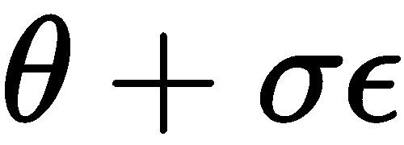。这是通过每次选择一个新的随机种子来完成的，该种子将唯一地从正态分布中采样扰动（或噪声），。这是算法的关键部分，因为稍后，其他工作线程将必须从相同的种子重新生成相同的扰动。之后，两个新后代（由于我们使用的是镜像采样，所以有两个）将被评估，并将结果放入`output_queue`队列中：

```py
        for _ in range(indiv_per_worker):
            seed = np.random.randint(1e7)

            with temp_seed(seed):
                sampled_noise = np.random.normal(size=agent_flatten_shape)

            pos_rew= evaluation_on_noise(sampled_noise)
            neg_rew = evaluation_on_noise(-sampled_noise)

            output_queue.put([[pos_rew, neg_rew], seed])
```

请注意，以下代码片段（我们之前使用过的）只是用于在本地设置 NumPy 随机种子`seed`的一种方式：

```py
with temp_seed(seed):
    ..
```

在`with`语句外，生成随机值所用的种子将不再是`seed`。

`while`循环的第二部分涉及获取所有返回值和种子，从这些种子中重建扰动，按照公式（11.2）计算随机梯度估计，并优化策略。`params_queue`队列由主进程填充，正如我们之前看到的那样。它通过发送在第一阶段由工作线程生成的种群的归一化排名和种子来完成此操作。代码如下：

```py
        batch_return, batch_seed = params_queue.get()
        batch_noise = []

        # reconstruction of the perturbations used to generate the individuals
        for seed in batch_seed:
            with temp_seed(seed):
                sampled_noise = np.random.normal(size=agent_flatten_shape)

            batch_noise.append(sampled_noise)
            batch_noise.append(-sampled_noise)

        # Computation of the gradient estimate following the formula (11.2)
        vars_grads = np.zeros(agent_flatten_shape)
        for n, r in zip(batch_noise, batch_return):
            vars_grads += n * r

        vars_grads /= len(batch_noise) * std_noise

        sess.run(apply_g, feed_dict={new_weights_ph:-vars_grads})
```

上述代码中的最后几行计算了梯度估计；也就是说，它们计算了公式（11.2）中的第二项：

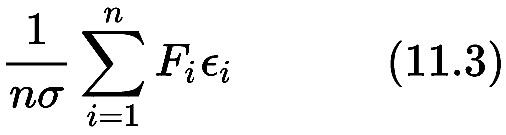

这里，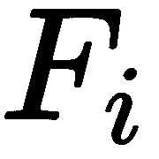 是 和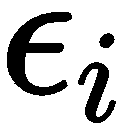 候选项的归一化排名以及它们的扰动。

`apply_g` 是应用 `vars_grads` 梯度（11.3）使用 Adam 的操作。请注意，我们传递 `-var_grads`，因为我们希望进行梯度上升而不是梯度下降。

实施已完成。现在，我们必须将其应用于环境并进行测试，以查看其表现如何。

# 应用可扩展 ES 到 LunarLander

可扩展演化策略在 LunarLander 环境中的表现如何？让我们来看看吧！

您可能还记得，我们已经在第六章中对比了 LunarLander 与 A2C 和 REINFORCE，*学习随机和 PG 优化*。这个任务包括通过连续动作在月球上着陆。我们决定使用这个中等难度的环境来比较 ES 的结果与使用 A2C 获得的结果。

在这个环境中表现最佳的超参数如下：

| **超参数** | **变量名** | **值** |
| --- | --- | --- |
| 神经网络大小 | `hidden_sizes` | [32, 32] |
| 训练迭代次数（或代数） | `number_iter` | 200 |
| 工作人数 | `num_workers` | 4 |
| Adam 学习率 | `lr` | 0.02 |
| 每个工作人员的个体数 | `indiv_per_worker` | 12 |
| 标准差 | `std_noise` | 0.05 |

结果显示在以下图表中。立即引人注目的是曲线非常稳定平滑。此外，请注意，在约 250-300 万步后，它达到了平均分数约为 200。与在图 6.7 中使用 A2C 获得的结果进行比较，您会发现演化策略比 A2C 和 REINFORCE 多花了近 2-3 倍的步骤。

正如论文所示，通过大规模并行化（至少使用数百个 CPU），您应该能够在短短几分钟内获得非常好的策略。不幸的是，我们没有这样的计算能力。但是，如果您有的话，可以自行尝试：

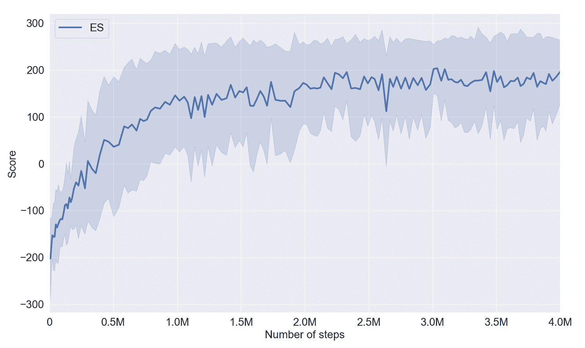

图 11.5 可扩展演化策略的性能

总体而言，结果非常好，显示出 ES 对于非常长的时间跨度问题和具有非常稀疏奖励的任务是一个可行的解决方案。

# 摘要

在本章中，你了解了进化算法（EAs），这是一类受生物进化启发的新型黑箱算法，可以应用于强化学习任务。与强化学习相比，进化算法从不同的角度解决这些问题。你看到，在设计强化学习算法时需要处理的许多特性，在进化方法中并不适用。它们的不同之处既体现在内在的优化方法上，也体现在基本假设上。例如，由于进化算法是黑箱算法，我们可以优化任何我们想要的函数，因为我们不再受限于使用可微分函数，这一点与强化学习时有所不同。正如我们在本章中看到的，进化算法有许多其他优点，但它们也有许多缺点。

接下来，我们研究了两种进化算法：遗传算法和进化策略。遗传算法更复杂，因为它通过交叉和变异从两个父母创建后代。进化策略从一个仅通过变异生成的种群中选择表现最好的个体。ES 的简单性是算法能够在成千上万个并行工作者之间实现巨大可扩展性的关键因素之一。OpenAI 的论文中展示了这种可扩展性，证明了 ES 能够在复杂环境中达到与 RL 算法相当的表现。

为了实践进化算法，我们实现了本章引用的论文中的可扩展进化策略。此外，我们还在 LunarLander 上进行了测试，发现 ES 能够以高性能解决该环境。尽管结果很棒，ES 的学习任务比 AC 和 REINFORCE 多用了两到三倍的步骤。这是 ES 的主要缺点：它们需要大量的经验。尽管如此，凭借其线性扩展到工作者数量的能力，在足够的计算能力支持下，你可能能够在比强化学习算法短得多的时间内解决这个任务。

在下一章，我们将回到强化学习，讨论一个被称为探索-利用困境的问题。我们将了解它是什么以及为什么它在在线设置中至关重要。接着，我们将使用一个潜在的解决方案来开发一个元算法，称为 ESBAS，它为每种情况选择最合适的算法。

# 问题

1.  有哪两种替代强化学习的算法可以解决序列决策问题？

1.  进化算法中产生新个体的过程是什么？

1.  进化算法（如遗传算法）的灵感来源是什么？

1.  CMA-ES 如何演化进化策略？

1.  进化策略的一个优点和一个缺点是什么？

1.  在论文《*进化策略作为强化学习的可扩展替代方法*》中，使用了什么技巧来减少方差？

# 深入阅读

+   要阅读 OpenAI 提出的可扩展版本 ES 的原始论文，即*Evolution Strategies as a Scalable Alternative to Reinforcement Learning*论文，请访问[`arxiv.org/pdf/1703.03864.pdf`](https://arxiv.org/pdf/1703.03864.pdf)。

+   要阅读提出 NEAT 的论文，即*通过增强拓扑演化神经网络*，请访问[`nn.cs.utexas.edu/downloads/papers/stanley.ec02.pdf`](http://nn.cs.utexas.edu/downloads/papers/stanley.ec02.pdf)。
