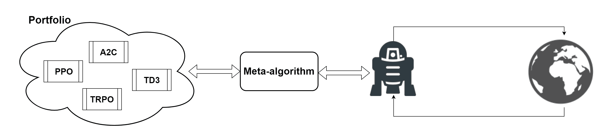

# 第十二章：开发 ESBAS 算法

到目前为止，你已经能够以系统化和简洁的方式处理 RL 问题。你能够为手头的问题设计和开发 RL 算法，并从环境中获得最大收益。此外，在前两章中，你学习了超越 RL 的算法，但这些算法也可以用来解决相同的任务。

在本章开始时，我们将提出一个在许多前几章中已经遇到过的困境：即探索与利用困境。我们已经在全书中提出了该困境的潜在解决方案（例如，-贪心策略），但我们希望为你提供更全面的视角，并简洁地介绍解决该问题的算法。许多算法，如**上置信界**（**UCB**）算法，比我们迄今为止使用的简单启发式方法（例如，-贪心策略）更加复杂和优秀。我们将通过一个经典问题——多臂强盗问题来说明这些策略。尽管它是一个简单的表格游戏，我们将以此为起点，展示这些策略如何应用于非表格型和更复杂的任务。

本文介绍了探索与利用困境，概述了许多最近的强化学习（RL）算法所采用的主要方法，用以解决非常困难的探索环境。我们还将提供一个更广泛的视角，探讨该困境在解决其他类型问题时的适用性。作为证明，我们将开发一个名为**时代随机强盗算法选择**（**ESBAS**）的元算法，该算法解决了 RL 背景下的在线算法选择问题。ESBAS 通过利用从多臂强盗问题中出现的思想和策略，选择出最能在每个回合中最大化预期回报的 RL 算法。

本章将涵盖以下主题：

+   探索与利用

+   探索方法

+   时代随机强盗算法选择

# 探索与利用

**探索-利用困境**或**探索-利用问题**影响着许多重要领域。实际上，它不仅限于强化学习的背景，还适用于日常生活。这个困境的核心思想是判断是选择已经知道的最优解，还是值得尝试新的选项。假设你正在买一本新书。你可以选择你最喜欢的作者的书，或者选择亚马逊推荐的同类书籍。在第一种情况下，你对自己选择的书充满信心，但在第二种情况下，你无法预测将会得到什么。然而，后者可能让你感到意外惊喜，读到一本非常好的书，甚至超越了你最喜欢作者写的书。

这种在利用已学知识和冒险探索新选项之间的冲突，在强化学习中也非常常见。智能体可能需要牺牲短期奖励，去探索一个新的空间，以便在未来获得更高的长期奖励。

这一切对你来说可能并不新鲜。事实上，当我们开发第一个强化学习算法时，就开始处理这个问题了。直到现在，我们主要采用了简单的启发式方法，如**ε-greedy**策略，或遵循随机策略来决定是探索还是利用。经验上，这些策略效果很好，但还有一些其他技术能够实现理论上的最优表现。

本章将从基础讲解**探索-利用困境**，并介绍一些在表格问题上实现近乎最优表现的探索算法。我们还将展示如何将相同的策略适应于非表格和更复杂的任务。

对于一个强化学习算法，最具挑战性的 Atari 游戏之一是《蒙特祖玛的复仇》，其截图如下。游戏的目标是通过收集宝石和击杀敌人来获得分数。主角需要找到所有的钥匙，以便在迷宫中的房间间穿行，并收集必要的工具来移动，同时避免障碍物。稀疏奖励、长期目标和与最终目标无关的部分奖励，使得这款游戏对每个强化学习算法都非常具有挑战性。事实上，这四个特点使得《蒙特祖玛的复仇》成为测试**探索算法**的最佳环境之一：


《蒙特祖玛的复仇》截图

让我们从基础开始，以便全面了解这一领域。

# 多臂老虎机

多臂老虎机问题是经典的强化学习问题，用来说明探索-利用的权衡困境。在这个困境中，代理必须从一组固定的资源中选择，以最大化预期奖励。多臂老虎机这个名称来源于赌徒玩多个老虎机，每个老虎机都有来自不同概率分布的随机奖励。赌徒必须学习最佳策略，以获得最高的长期奖励。

这种情况在以下图示中进行了说明。在这个特定的例子中，赌徒（幽灵）需要从五台不同的老虎机中选择一台，每台老虎机都有不同且未知的奖励概率，以便赢得最高金额：


五臂老虎机问题示例

如果你在想多臂老虎机问题与更有趣的任务（比如《蒙特祖玛的复仇》）有何关系，答案是它们都涉及到决定，在长期来看，当尝试新的行为（拉动新的杠杆）时，是否会获得最高奖励，还是继续做迄今为止做得最好的事情（拉动最知名的杠杆）。然而，多臂老虎机与《蒙特祖玛的复仇》之间的主要区别在于，后者每次都会改变代理的状态，而在多臂老虎机问题中，只有一个状态，并且没有顺序结构，这意味着过去的行为不会影响未来。

那么，如何在多臂老虎机问题中找到探索与利用的正确平衡呢？

# 探索的方法

简单来说，多臂老虎机问题，以及一般的每个探索问题，可以通过随机策略或者更智能的技术来解决。属于第一类的最臭名昭著的算法叫做-贪婪；而乐观探索，如 UCB，以及后验探索，如汤普森采样，属于第二类。在本节中，我们将特别关注-贪婪和 UCB 策略。

这完全是关于平衡风险与奖励。但我们如何衡量一个探索算法的质量呢？通过*后悔*。后悔被定义为在一步操作中失去的机会，即在时间时的后悔， 如下所示：


这里， 表示最优值， 表示  的行动值。

因此，目标是通过最小化所有行动的总后悔，找到探索与利用之间的折衷：


请注意，总遗憾的最小化等同于累积奖励的最大化。我们将利用这一遗憾的概念来展示探索算法的表现。

# ∈-贪心策略

我们已经扩展了-贪心策略背后的思想，并将其应用于帮助我们在 Q 学习和 DQN 等算法中的探索。这是一种非常简单的方法，但它在非平凡的任务中也能达到非常高的性能。这是它在许多深度学习算法中广泛应用的主要原因。

为了帮助你回忆，-贪心大多数时候采取最佳行动，但偶尔会选择一个随机行动。选择随机行动的概率由值决定，它的范围从 0 到 1。也就是说，具有的概率，算法会利用最佳行动，而具有的概率，则会通过随机选择来探索其他可能性。

在多臂强盗问题中，行动值是根据过去的经验估计的，方法是对采取这些行动所获得的奖励进行平均：


在前述方程中，表示行动被选中的次数，而是一个布尔值，表示在时刻时，是否选择了行动。然后，强盗会根据-贪心算法采取行动，或通过选择随机行动来探索，或通过选择行动来利用较高的值。

-贪心的一个缺点是它具有期望的线性遗憾。然而，根据大数法则，最优的期望总遗憾应该是与时间步数呈对数关系的。这意味着，-贪心策略并不是最优的。

达到最优的一种简单方法是使用一个值，该值随着时间的推移逐渐衰减。通过这样做，探索的总体权重将逐渐消失，最终只会选择贪心行动。实际上，在深度强化学习算法中，-贪心几乎总是与的线性或指数衰减相结合。

也就是说， 及其衰减率很难选择，并且还有其他策略可以最优地解决多臂赌博机问题。

# UCB 算法

UCB 算法与一种称为“面对不确定性时的乐观原则”（optimism in the face of uncertainty）有关，这是一种基于大数法则的统计学原理。UCB 构建了一个乐观的猜测，基于奖励的样本均值，并根据奖励的上置信界估算。乐观的猜测决定了每个动作的期望回报，同时考虑了动作的不确定性。因此，UCB 始终能够通过平衡风险与回报，选择潜在回报更高的动作。然后，当当前动作的乐观估算低于其他动作时，算法会切换到另一个动作。

具体来说，UCB 通过  跟踪每个动作的平均奖励，以及每个动作的  UCB（因此得名）。然后，算法选择最大化以下内容的动作：

 (12.1)

在这个公式中， 的作用是提供一个附加的参数，作为考虑动作不确定性的平均奖励。

# UCB1

UCB1 属于 UCB 系列，其贡献在于选择 。

在 UCB1 中，UCB 通过跟踪某个动作（）被选择的次数，以及  和  这两个量的总和来计算，如下式所示：

 (12.2)

一个动作的不确定性与它被选择的次数有关。如果你仔细想想，这也能解释清楚，因为根据大数法则，在无限次数的试验下，你可以对期望值有一个明确的了解。相反，如果你只尝试过某个动作几次，你会对期望的奖励感到不确定，只有通过更多的经验，你才能判断它是好是坏。因此，我们会激励探索那些只被选择过少数几次的动作，因为它们的不确定性较高。重点是，如果  很小，意味着这个动作只是偶尔被尝试，那么  会很大，从而带来较高的不确定估计。然而，如果  很大，那么  就会很小，估计值也会更准确。然后，我们只会在  具有较高的平均奖励时才选择它。

与 -贪婪算法相比，UCB 的主要优势实际上在于对动作进行计数。事实上，多臂老虎机问题可以通过此方法轻松解决，方法是为每个被采取的动作保持一个计数器，以及它的平均奖励。这两个信息可以集成到公式（12.1）和公式（12.2）中，从而获得在时刻()应该采取的最佳动作；即：

 (12.3)

UCB 是一个非常强大的探索方法，它在多臂老虎机问题上实现了对数期望总遗憾，从而达到了最优趋势。值得注意的是，-贪婪探索也可以获得对数遗憾，但它需要精心设计，并且需要细调指数衰减，因此在平衡上会更加困难。

UCB 还有一些变体，如 UCB2、UCB-Tuned 和 KL-UCB。

# 探索复杂性

我们已经看到，UCB，特别是 UCB1，能够通过相对简单的算法降低总体的遗憾，并在多臂老虎机问题上实现最优收敛。然而，这仍然是一个简单的无状态任务。

那么，UCB 在更复杂的任务上表现如何呢？为了回答这个问题，我们可以将问题过于简化，并将所有问题分为以下三大类：

+   **无状态问题**：这些问题的一个实例就是多臂老虎机问题。在这种情况下，探索可以通过更复杂的算法来处理，如 UCB1。

+   **中小型表格问题**：作为基本规则，探索仍然可以通过更先进的机制来处理，但在某些情况下，总体收益较小，不值得增加额外的复杂性。

+   **大型非表格化问题**：我们现在处于更加复杂的环境中。在这些环境中，前景尚不明确，研究人员仍在积极努力寻找最佳的探索策略。其原因在于，随着复杂性的增加，像 UCB 这样的最优方法变得难以处理。例如，UCB 无法处理具有连续状态的问题。然而，我们不必抛弃一切，可以借鉴在多臂老虎机问题中研究的探索算法。也就是说，有许多方法能够逼近最优的探索策略，并且在连续环境中也能很好地发挥作用。例如，基于计数的方法，如 UCB，已经通过为相似状态提供相似的计数来适应了无限状态问题。这类算法在一些极其复杂的环境中也能显著提升性能，例如在《蒙特祖马的复仇》游戏中。尽管如此，在大多数强化学习应用场景中，这些更复杂方法所带来的额外复杂性是得不偿失的，简单的随机策略，如-贪婪策略，通常就足够了。

值得注意的是，尽管我们仅概述了基于计数的探索方法，如 UCB1，但实际上还有两种更复杂的方式可以处理探索问题，它们能在遗憾值上实现最优结果。第一种方法叫做后验采样（其中一个例子是汤普森采样），它基于后验分布；第二种方法叫做信息增益，它依赖于通过估计熵来测量不确定性。

# 时代随机带算法选择

探索策略在强化学习中的主要用途是帮助智能体进行环境探索。我们在 DQN 中看到了这种用例，使用了-贪婪策略，而在其他算法中则通过向策略中注入额外的噪声来实现。然而，探索策略的使用方式不仅限于此。为了更好地理解到目前为止介绍的探索概念，并引入这些算法的另一种应用场景，我们将展示并开发一种名为 ESBAS 的算法。该算法首次出现在论文《强化学习算法选择》中。

ESBAS 是一种在线**算法选择**（**AS**）的元算法，适用于强化学习的上下文。它利用探索方法来选择在整个轨迹中使用的最佳算法，以最大化预期奖励。

为了更好地解释 ESBAS，我们将首先解释什么是算法选择，以及它在机器学习和强化学习中的应用。接着，我们将重点介绍 ESBAS，详细描述其内部工作原理，并提供其伪代码。最后，我们将实现 ESBAS 并在一个名为 Acrobot 的环境中进行测试。

# 算法选择的开箱操作

为了更好地理解 ESBAS 的作用，我们首先来关注算法选择（AS）是什么。在普通设置中，针对给定任务开发并训练一个特定且固定的算法。问题在于，如果数据集随着时间变化，数据集发生过拟合，或者在某些限制性情境下另一个算法表现更好，就无法改变算法。选择的算法将永远保持不变。算法选择的任务就是解决这个问题。

AS（算法选择）是机器学习中的一个开放问题。它涉及设计一个叫做元算法的算法，该算法始终从一个不同选项的池中（称为投资组合）选择最适合当前需求的算法。以下图示展示了这一过程。AS 的假设是，投资组合中的不同算法在问题空间的不同部分会优于其他算法。因此，拥有具有互补能力的算法非常重要。

例如，在下面的图示中，元算法从可用的算法（或代理）中选择哪一个（如 PPO 和 TD3）将在给定时刻作用于环境。这些算法不是互补的，而是每个算法提供不同的优势，元算法可以选择其中一个，以便在特定情境中表现得更好：



强化学习中算法选择方法的表示

例如，如果任务是设计一个能够在各种地形上行驶的自动驾驶汽车，那么训练一个能够在道路、沙漠和冰面上表现出色的算法可能会很有用。然后，AS 可以智能地选择在每种情境下使用这三种版本中的哪一个。例如，AS 可能会发现，在雨天，训练过的冰面策略比其他策略更有效。

在强化学习（RL）中，策略变化的频率非常高，且数据集随时间不断增加。这意味着在起始点（代理处于初步状态）与代理处于高级状态时，最佳神经网络大小和学习率可能存在很大差异。例如，代理可能在学习初期使用较高的学习率，并随着经验的积累逐渐降低学习率。这突出显示了强化学习是一个非常有趣的算法选择平台。因此，这正是我们将在其中测试 AS 的地方。

# ESBAS 的底层原理

提出 ESBAS 的论文，在批处理和在线设置中对算法进行了测试。然而，在本章的剩余部分，我们将主要集中讨论前者。这两个算法非常相似，如果你对纯在线版本感兴趣，可以在论文中找到进一步的解释。在真正的在线设置中，AS 被重新命名为**滑动随机带算法**（**SSBAS**），它从最新的选择的滑动窗口中学习。但我们先从基础开始。

关于 ESBAS，首先要说的是它基于 UCB1 策略，并使用这种带算法选择离策略算法，从固定的投资组合中进行选择。具体来说，ESBAS 可以分为三个主要部分，工作原理如下：

1.  它循环遍历多个指数大小的 epoch。在每个 epoch 中，它首先做的是更新投资组合中所有可用的离策略算法。它使用的是迄今为止收集的数据（在第一个 epoch 时，数据集将为空）。另外，它还会重置元算法。

1.  然后，在每个 epoch 中，元算法根据公式（12.3）计算乐观猜测，以选择将控制下一个轨迹的离策略算法（在投资组合中），从而最小化总的遗憾。然后，使用该算法运行轨迹。同时，轨迹中的所有转换都会被收集，并添加到数据集，这些数据稍后将由离策略算法用来训练策略。

1.  当轨迹结束时，元算法使用从环境中获得的 RL 回报更新该特定离策略算法的平均奖励，并增加出现次数。平均奖励和出现次数将由 UCB1 用来计算 UCB，如公式（12.2）所示。这些值用于选择下一个离策略算法，该算法将执行下一个轨迹。

为了让你更好地理解算法，我们还在代码块中提供了 ESBAS 的伪代码，见下方：

```py
---------------------------------------------------------------------------------
ESBAS
---------------------------------------------------------------------------------

Initialize policy  for every algorithm  in the portfolio 
Initialize empty dataset 

for  do
    for  in  do
        Learn policy  on  with algortihm  

    Initialize AS variables:  and for every : 

    for  do > Select the best algorithm according to UCB1

        Generate trajectory  with policy  and add transitions to 

        > Update the average return and the counter of 

         (12.4)

```

这里， 是一个超参数， 是在  轨迹中获得的 RL 回报， 是算法  的计数器， 是其平均回报。

正如论文中所解释的，在线 AS 解决了四个来自 RL 算法的实际问题：

1.  **样本效率**：策略的多样化提供了额外的信息源，使 ESBAS 具有样本效率。此外，它结合了课程学习和集成学习的特性。

1.  **鲁棒性**：投资组合的多样化提供了对不良算法的鲁棒性。

1.  **收敛性**：ESBAS 保证最小化后悔值。

1.  **课程学习**：AS 能够提供一种课程策略，例如一开始选择较简单、浅层的模型，最后选择较深的模型。

# 实现

实现 ESBAS 很简单，因为它只需要添加几个组件。最关键的部分在于对投资组合的离策略算法的定义和优化。对于这些，ESBAS 并不限制算法的选择。本文中使用了 Q-learning 和 DQN。我们决定使用 DQN，以提供一个能够处理更复杂任务的算法，并且可以与具有 RGB 状态空间的环境一起使用。我们在第五章中详细讲解了 DQN，*深度 Q 网络*，对于 ESBAS，我们将使用相同的实现。

在开始实现之前，我们需要指定投资组合的构成。我们创建了一个多样化的投资组合，就神经网络架构而言，但你也可以尝试其他组合。例如，你可以将投资组合与具有不同学习率的 DQN 算法组合。

实现分为如下几个部分：

+   `DQN_optimization`类构建计算图，并使用 DQN 优化策略。

+   `UCB1`类定义了 UCB1 算法。

+   `ESBAS`函数实现 ESBAS 的主要流程。

我们将提供最后两点的实现，但你可以在书的 GitHub 仓库中找到完整的实现：[`github.com/PacktPublishing/Reinforcement-Learning-Algorithms-with-Python`](https://github.com/PacktPublishing/Reinforcement-Learning-Algorithms-with-Python)[.](https://github.com/PacktPublishing/Hands-On-Reinforcement-Learning-Algorithms-with-Python)

让我们首先了解`ESBAS(..)`。除了 DQN 的超参数外，还有一个额外的`xi`参数，代表超参数。`ESBAS`函数的主要结构与之前给出的伪代码相同，因此我们可以快速浏览一遍。

在定义了所有参数的函数后，我们可以重置 TensorFlow 的默认图，并创建两个 Gym 环境（一个用于训练，另一个用于测试）。然后，我们可以通过为每个神经网络大小实例化一个`DQN_optimization`对象并将它们添加到列表中来创建投资组合：

```py
def ESBAS(env_name, hidden_sizes=[32], lr=1e-2, num_epochs=2000, buffer_size=100000, discount=0.99, render_cycle=100, update_target_net=1000, batch_size=64, update_freq=4, min_buffer_size=5000, test_frequency=20, start_explor=1, end_explor=0.1, explor_steps=100000, xi=16000):

    tf.reset_default_graph()

    env = gym.make(env_name)
    env_test = gym.wrappers.Monitor(gym.make(env_name), "VIDEOS/TEST_VIDEOS"+env_name+str(current_milli_time()),force=True, video_callable=lambda x: x%20==0)

    dqns = []
    for l in hidden_sizes:
        dqns.append(DQN_optimization(env.observation_space.shape, env.action_space.n, l, lr, discount))
```

现在，我们定义一个内部函数`DQNs_update`，它以 DQN 的方式训练投资组合中的策略。请注意，投资组合中的所有算法都是 DQN，它们唯一的区别在于神经网络的大小。优化通过`DQN_optimization`类的`optimize`和`update_target_network`方法完成：

```py
    def DQNs_update(step_counter):
        if len(buffer) > min_buffer_size and (step_counter % update_freq == 0):
            mb_obs, mb_rew, mb_act, mb_obs2, mb_done = buffer.sample_minibatch(batch_size)
            for dqn in dqns:
                dqn.optimize(mb_obs, mb_rew, mb_act, mb_obs2, mb_done)

        if len(buffer) > min_buffer_size and (step_counter % update_target_net == 0):
            for dqn in dqns:
                dqn.update_target_network()
```

一如既往，我们需要初始化一些（不言自明的）变量：重置环境，实例化`ExperienceBuffer`对象（使用我们在其他章节中使用的相同类），并设置探索衰减：

```py
    step_count = 0
    batch_rew = []
    episode = 0
    beta = 1

    buffer = ExperienceBuffer(buffer_size)
    obs = env.reset()

    eps = start_explor
    eps_decay = (start_explor - end_explor) / explor_steps
```

我们终于可以开始遍历各个时期的循环了。至于前面的伪代码，在每个时期，以下事情会发生：

1.  策略在经验缓冲区上进行训练

1.  轨迹由 UCB1 选择的策略运行

第一步是通过调用我们之前定义的`DQNs_update`来完成的，整个时期的长度（具有指数长度）：

```py
    for ep in range(num_epochs):
        # policies training
        for i in range(2**(beta-1), 2**beta):
            DQNs_update(i)
```

关于第二步，在轨迹运行之前，实例化并初始化了`UCB1`类的新对象。然后，一个`while`循环遍历指数大小的回合，其中，`UCB1`对象选择运行下一条轨迹的算法。在轨迹过程中，动作由`dqns[best_dqn]`选择：

```py
        ucb1 = UCB1(dqns, xi)
        list_bests = []
        beta += 1
        ep_rew = []

        while step_count < 2**beta:
            best_dqn = ucb1.choose_algorithm()
            list_bests.append(best_dqn)

            g_rew = 0
            done = False

            while not done:
                # Epsilon decay
                if eps > end_explor:
                    eps -= eps_decay

                act = eps_greedy(np.squeeze(dqns[best_dqn].act(obs)), eps=eps)
                obs2, rew, done, _ = env.step(act)
                buffer.add(obs, rew, act, obs2, done)

                obs = obs2
                g_rew += rew
                step_count += 1
```

每次回合后，`ucb1`会根据上次轨迹获得的强化学习回报进行更新。此外，环境被重置，当前轨迹的奖励被追加到列表中，以便跟踪所有奖励：

```py
            ucb1.update(best_dqn, g_rew)

            obs = env.reset()
            ep_rew.append(g_rew)
            g_rew = 0
            episode += 1
```

这就是`ESBAS`函数的全部内容。

`UCB1`由一个构造函数组成，该构造函数初始化计算所需的属性（见 12.3）；一个`choose_algorithm()`方法，返回当前投资组合中最佳的算法（如 12.3 所示）；以及`update(idx_algo, traj_return)`，它使用获得的最后一个奖励更新`idx_algo`算法的平均奖励，如 12.4 所理解的那样。代码如下：

```py
class UCB1:
    def __init__(self, algos, epsilon):
        self.n = 0
        self.epsilon = epsilon
        self.algos = algos
        self.nk = np.zeros(len(algos))
        self.xk = np.zeros(len(algos))

    def choose_algorithm(self):
        return np.argmax([self.xk[i] + np.sqrt(self.epsilon * np.log(self.n) / self.nk[i]) for i in range(len(self.algos))])

    def update(self, idx_algo, traj_return):
        self.xk[idx_algo] = (self.nk[idx_algo] * self.xk[idx_algo] + traj_return) / (self.nk[idx_algo] + 1)
        self.nk[idx_algo] += 1
        self.n += 1
```

有了代码，我们现在可以在一个环境中进行测试，并查看它的表现。

# 解决 Acrobot

我们将在另一个 Gym 环境——`Acrobot-v1`上测试 ESBAS。正如 OpenAI Gym 文档中所描述的，*Acrobot 系统包括两个关节和两个链节，其中两个链节之间的关节是有驱动的。最初，链节垂直挂着，目标是将下链节的末端摆动到给定的高度*。下图显示了 Acrobot 在简短的时间步长序列中的运动，从起始位置到结束位置：


Acrobot 运动序列

投资组合包含三种不同大小的深度神经网络。一种小型神经网络，只有一个大小为 64 的隐藏层；一种中型神经网络，具有两个大小为 16 的隐藏层；以及一种大型神经网络，具有两个大小为 64 的隐藏层。此外，我们设置了超参数！[](img/d1f6a65b-3014-4152-b0e0-72b2a639c0d1.png)（使用的值与论文中的一致）。

# 结果

以下图表显示了结果。该图展示了 ESBAS 的学习曲线：较暗的阴影部分表示完整的组合（包括之前列出的三种神经网络）；较浅的*橙色*部分则表示 ESBAS 仅使用一个表现最好的神经网络（一个深度神经网络，具有两个隐藏层，每层大小为 64）的学习曲线。我们知道，ESBAS 仅使用一种算法的组合并不能真正发挥元算法的潜力，但我们引入它是为了提供一个基准，以便对比结果。图表本身说明了问题，显示了*蓝色*线始终高于*橙色*线，从而证明 ESBAS 实际上选择了最佳可用选项。这个不寻常的形状是因为我们正在离线训练 DQN 算法：


ESBAS 在使用三种算法的组合时以较深的阴影显示，而仅使用一种算法时则以较浅的阴影显示。

有关本章中提到的所有颜色参考，请参见[`www.packtpub.com/sites/default/files/downloads/9781789131116_ColorImages.pdf`](http://www.packtpub.com/sites/default/files/downloads/9781789131116_ColorImages.pdf)中的彩色图像包。

此外，您在训练开始时以及在约 20K、65K 和 131K 步时看到的尖峰，是策略训练和元算法重置的时刻。

我们现在可以问自己，ESBAS 在何时优先选择某个算法，而非其他算法。答案可以从以下图表中看到。在此图中，小型神经网络以值 0 表示，中型以值 1 表示，大型以值 2 表示。点表示每条轨迹上选择的算法。我们可以看到，在一开始，大型神经网络被优先选择，但随后立即转向中型神经网络，再到小型神经网络。大约 64K 步之后，元算法又切换回较大的神经网络：


该图展示了元算法的偏好。

从前面的图中，我们还可以看到，两个 ESBAS 版本最终都收敛到相同的值，但收敛速度非常不同。事实上，利用 AS 的真正潜力的 ESBAS 版本（即包含三种算法的组合）收敛得要快得多。两者都收敛到相同的值，因为从长远来看，最佳的神经网络是 ESBAS 版本中使用的那个单一选项（即深度神经网络，具有两个隐藏层，每层大小为 64）。

# 总结

在本章中，我们讨论了探索与利用的困境。这个问题在之前的章节中已经有所提及，但当时只是以一种简单的方式，通过采用简单的策略进行探讨。本章中，我们更加深入地研究了这个困境，从著名的多臂老虎机问题开始。我们看到，更加复杂的基于计数的算法，如 UCB，实际上能够达到最优表现，并且具有期望的对数后悔值。

然后，我们使用了探索算法来解决 AS。AS 是探索性算法的一种有趣应用，因为元算法需要选择最适合当前任务的算法。AS 在强化学习中也有应用。例如，AS 可以用来选择在不同算法组合中训练出的最佳策略，以执行下一条轨迹。这也是 ESBAS 的作用。它通过采用 UCB1 来解决在线选择离策略强化学习算法的问题。我们深入研究并实现了 ESBAS。

现在，你已经掌握了设计和开发高性能强化学习算法所需的所有知识，这些算法能够平衡探索与利用。此外，在之前的章节中，你已经获得了必要的技能，能理解在许多不同的环境中应该使用哪个算法。然而，直到现在，我们还忽视了一些更高级的强化学习话题和问题。在下一章也是最后一章，我们将填补这些空白，讨论无监督学习、内在动机、强化学习的挑战以及如何提高算法的鲁棒性。我们还将看到如何利用迁移学习从仿真环境转向现实世界。此外，我们还会给出一些关于训练和调试深度强化学习算法的额外建议和最佳实践。

# 问题

1.  什么是探索与利用的困境？

1.  我们在之前的强化学习算法中使用过的两种探索策略是什么？

1.  什么是 UCB？

1.  哪个问题更难解决：Montezuma 的复仇还是多臂老虎机问题？

1.  ESBAS 是如何解决在线强化学习算法选择问题的？

# 进一步阅读

+   要了解关于多臂老虎机问题的更全面的调查，请阅读*在线实验设计的调查与随机多臂老虎机*：[`arxiv.org/pdf/1510.00757.pdf`](https://arxiv.org/pdf/1510.00757.pdf)

+   要阅读利用内在动机来玩 Montezuma 的复仇的论文，请参阅*统一基于计数的探索与内在动机*：[`arxiv.org/pdf/1606.01868.pdf`](https://arxiv.org/pdf/1606.01868.pdf)

+   要阅读原始的 ESBAS 论文，请访问此链接：[`arxiv.org/pdf/1701.08810.pdf`](https://arxiv.org/pdf/1701.08810.pdf)。
